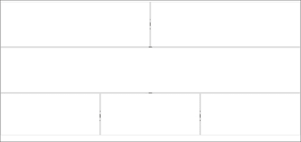
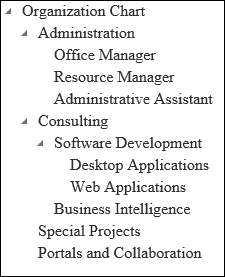
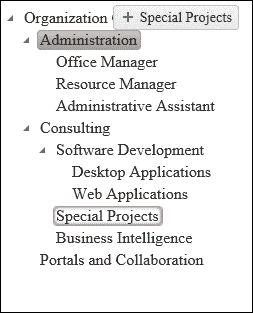
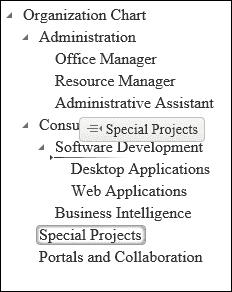
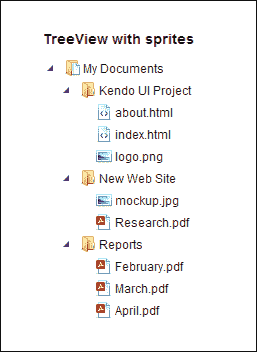
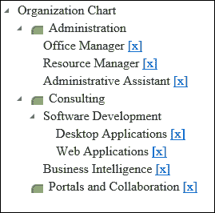

# 第九章：实现分隔符和树视图小部件

在本章中，你将了解来自 Kendo UI Web 框架的两个不同小部件，即分隔符小部件和树视图小部件。分隔符小部件是一个用于在网页内部组织内容的工具。它创建网页内的块状区域，可以包含常规页面元素，甚至还可以包含额外的分隔符小部件控件以进一步细分内容区域。树视图小部件是一个用于显示以层次结构组织的数据的工具，例如在树中。这种方式组织的数据的一个很好的例子是硬盘上的文件夹结构。文件夹可以包含文件或额外的文件夹。当绘制时，这会创建一个嵌套结构，如树，非常适合树视图小部件。

# 分隔符小部件

Kendo UI 分隔符小部件是创建动态页面布局的强大工具。它在一个网页内生成可调整大小、可滚动、可折叠和嵌套的边框区域。这些区域建立在 `div` 元素之上，并扩展了这些底层 `div` 元素的令人印象深刻的函数。当你看到本节中如何使用此小部件时，我相信你可以想象出许多使用它的方法。

## 学习分隔符小部件

Kendo UI 分隔符小部件旨在将 `div` HTML 元素扩展为灵活的内容区域，这些区域可以分割网页上的元素，因此得名“分隔符”。这些内容区域变为可调整大小的块，使用户可以选择页面的哪些部分应该占据更多的可见屏幕。每个这些块都可以配置特定的行为和选项，例如滚动条和通过单次点击折叠页面元素的能力。

这里有一些可以与 Kendo UI 分隔符小部件一起使用的 HTML 标记的示例。请注意 `div` 元素的组织和嵌套；当你看到实例化 Kendo 对象的 JavaScript 代码时，这将成为重要的一点：

```js
<div id="outerSections" style="height: 600px">
  <div id="outerTopSection" style="height: 200px">
    <div id="topSubSections" class="k-pane" style="height: 200px">
      <div style="height: 200px" class="k-pane"></div>
      <div style="height: 200px" class="k-pane"></div>
    </div>
  </div>
  <div id="outerMidSection" style="height: 200px" class="k-pane">
    <div class="k-pane"></div>
  </div>
  <div id="outerBottomSection" style="height: 200px" class="k-pane">
    <div id="bottomSubSections" class="k-pane" style="height: 200px">
      <div style="height: 200px" class="k-pane"></div>
      <div style="height: 200px" class="k-pane"></div>
      <div style="height: 200px" class="k-pane"></div>
    </div>
  </div>
</div>
```

最外层的 `div`，其 `id` 值为 `outerSections`，在其标签之间包含三个 `div` 元素。你还可以看到，这些位于 `outerSections` `div` 之下的每个 `div` 元素都包含自己的子 `div` 元素。这些子元素将成为更大 `outerSections` 区域内的 Kendo UI 分隔符小部件部分。其中两个子 `div` 元素，`topSubSections` 和 `bottomSubSections`，还包含一个更进一步的嵌套层次结构，它将成为分别在 `outerTopSection` 和 `outerBottomSection` 区域内的嵌套 Kendo UI 分隔符小部件部分。

在此 JavaScript 代码块中，你可以看到创建了三个独立的 `kendoSplitter` 小部件。第一个 Splitter 小部件按垂直顺序组织；它是最外层区域，并将包含以下两个 Splitter 小部件对象。第二个和第三个 Splitter 小部件区域按水平组织，并嵌套在其他 Splitter 小部件对象中，正如你将在以下屏幕截图中所看到的：

```js
<script type="text/javascript">
  $(function () {
    $("#outerSections").kendoSplitter({
      orientation: "vertical",
      panes: [
        { collapsible: false, size: "200px", scrollable: false },
        { collapsible: false, size: "200px", scrollable: false },
        { collapsible: false, size: "200px", scrollable: false }
      ]
    });
    $("#topSubSections").kendoSplitter({
      orientation: "horizontal",
      panes: [
        { collapsible: true, scrollable: false },
        { collapsible: true, scrollable: false }
      ]
    });
    $("#bottomSubSections").kendoSplitter({
      orientation: "horizontal",
      panes: [
        { collapsible: true, scrollable: false },
        { collapsible: true, scrollable: false },
        { collapsible: true, scrollable: false }
      ]
    });
  });
</script>
```



你可以看到三个垂直堆叠在页面上的 Splitter 小部件区域。最上面的区域包含其中两个水平堆叠的区域。最下面的区域包含三个水平堆叠的区域。这些都与你刚才看到的 HTML 和 JavaScript 代码相匹配。

## 加载内容

你刚才看到的 Splitter 小部件区域的内容都是空的，只是为了演示。然而，这并不是必要的。内容区域可以包含所有 `div` 元素通常包含的正常 HTML 内容。例如，你可以在以下代码片段中填充一些区域，如下所示：

```js
<div id="topSubSections" class="k-pane" style="height: 200px">
  <div style="height:200px" class="k-pane">
    Lorem ipsum dolor sit amet, consectetur adipisicing elit...
  </div>
  <div style="height:200px" class="k-pane">
    Lorem ipsum dolor sit amet, consectetur adipisicing elit...
  </div>
</div>
```

此文本现在将出现在 Splitter 小部件框内，并根据需要调整大小或折叠：


## 使用 AJAX 加载内容

通过 AJAX 调用来填充这些 Splitter 小部件区域内容的一种更可配置的方法是加载它。要启用此功能，只需使用定义 Splitter 小部件内容区域的 JavaScript 对象字面量的 `contentUrl` 属性，并通过 AJAX 指定要加载的页面。Kendo UI 框架将为您处理其余部分。

```js
$("#bottomSubSections").kendoSplitter({
  orientation: "horizontal",
  panes: [
    { collapsible: true, scrollable: false },
    { collapsible: true, scrollable: false },
    { collapsible: true, scrollable: false, 
      contentUrl: "LoremIpsum.html" }
  ]
});
```


## 钩入 Splitter 事件

Kendo UI Splitter 小部件配备了一系列丰富的行为。这些行为中的大多数，无论是通过用户操作还是通过方法调用执行，都会触发一个事件。像 JavaScript 中的任何事件一样，你可以将这些事件附加到自己的事件处理器函数，并使用自己的自定义代码对这些动作做出响应。本节将展示 Kendo UI Splitter 小部件上可用的不同事件，并演示如何将其钩入。

### 折叠（collapse）事件

当用户通过点击两个窗格之间的折叠图标来折叠 Kendo UI Splitter 小部件的某个部分时，将触发 `collapse` 事件。此图标显示为一个指向 `collapse` 动作将移动的方向的小三角形。以下是将 `collapse` 事件与事件处理器连接的代码：

```js
// Binding during Splitter Widget creation
$("#splitterElement").kendoSplitter({
  ...
  collapse: collapseEventHandler
  ...
});

// Dynamic binding and unbinding
var splitter = $("#splitterElement").data("kendoSplitter");
splitter.bind("collapse", collapseEventHandler);
spliter.unbind("collapse", collapseEventHandler);
```

### contentLoad 事件

当内容被加载到 Kendo UI Splitter 小部件的窗格中时，将触发 `contentLoad` 事件。此事件的正常用途是在 AJAX 内容从远程源完成加载时做出反应。以下是将 `contentLoad` 事件与事件处理器连接的代码：

```js
// Binding during Splitter Widget creation
$("#splitterElement").kendoSplitter({
  ...
  contentLoad: contentLoadEventHandler
  ...
});

// Dynamic binding and unbinding
var splitter = $("#splitterElement").data("kendoSplitter");
splitter.bind("contentLoad", contentLoadEventHandler);
spliter.unbind("contentLoad", contentLoadEventHandler);
```

### 展开（expand）事件

当用户点击展开图标将 Kendo UI Splitter 小部件的面板展开时，将触发 `expand` 事件。当面板折叠后，此图标将显示为一个指向面板展开方向的三角形，如下所示：


以下是将 `expand` 事件与事件处理程序连接的代码：

```js
// Binding during Splitter Widget creation
$("#splitterElement").kendoSplitter({
  ...
  expand: expandEventHandler
  ...
});

// Dynamic binding and unbinding
var splitter = $("#splitterElement").data("kendoSplitter");
splitter.bind("expand", expandEventHandler);
spliter.unbind("expand", expandEventHandler);
```

### `layoutChange` 事件

当 Kendo UI Splitter 小部件的布局发生变化时，将触发 `layoutChange` 事件。此事件比 `expand`、`collapse` 和 `resize` 更通用，因此它通常与这些事件一起出现，因为所有这些事件也都表示布局已更改。以下是将 `layoutChange` 事件与事件处理程序连接的代码：

```js
// Binding during Splitter Widget creation
$("#splitterElement").kendoSplitter({
  ...
  layoutChange: layoutChangeEventHandler
  ...
});

// Dynamic binding and unbinding
var splitter = $("#splitterElement").data("kendoSplitter");
splitter.bind("layoutChange", layoutChangeEventHandler);
spliter.unbind("layoutChange", layoutChangeEventHandler);
```

### `resize` 事件

当用户拖动两个 Kendo UI Splitter 小部件面板之间的手柄以调整它们的大小时，将触发 `resize` 事件。此事件在 `collapse` 和 `expand` 期间也会被触发。以下是将 `resize` 事件与事件处理程序连接的代码：

```js
// Binding during Splitter Widget creation
$("#splitterElement").kendoSplitter({
  ...
  resize: resizeEventHandler
  ...
});

// Dynamic binding and unbinding
var splitter = $("#splitterElement").data("kendoSplitter");
splitter.bind("resize", resizeEventHandler);
spliter.unbind("resize", resizeEventHandler);
```

## 调用 Splitter API 方法

Kendo UI Splitter 小部件配备了一系列方法，使其具有丰富的行为。大多数这些方法在触发时都会引发一个事件。像 JavaScript 中的任何事件一样，您可以将自己的事件处理程序函数附加到这些事件上，并使用自己的自定义代码响应用户的操作。本节将展示 Kendo UI Splitter 小部件上可用的不同方法。

### 获取 Splitter 对象的引用

在处理所有 Kendo UI 小部件上的方法时，首先要记住的是，在可以使用这些方法之前，您必须获取 JavaScript 对象的引用。为此，您必须使用 JavaScript 方法 `.data()`。以下是一个示例：

```js
var splitter = $("#splitterElement").data("kendoSplitter");
```

注意 jQuery 如何用于选择 Kendo UI Splitter 小部件创建的 **Document Object Model** (**DOM**) 元素，然后使用参数文本 `kendoSplitter` 调用 `.data()` 函数，以指示我们试图获取的对象类型。现在，已经检索到 Kendo UI Splitter 小部件实例，可以直接从 `splitter` 变量调用方法。

```js
splitter.collapse("#outerPane");
```

### 使用 `ajaxRequest` 方法

`ajaxRequest` 方法用于将 AJAX 内容加载到特定的 Kendo UI Splitter 小部件面板中。此方法接受三个参数。第一个参数是一个字符串，用于选择应将 AJAX 内容加载到其中的特定面板。它使用 jQuery 语法来选择元素，因此要选择具有 `id` 值为 `pane1` 的元素，您将使用 `#pane1` 来选择它。第二个参数是包含要加载到面板中的内容的远程端点的 URL。第三个参数是可选的，如果远程端点需要参数以发送数据并返回数据，则用于向远程端点发送数据。以下是一个展示此方法如何工作的代码示例：

```js
// Get a reference to the Kendo UI Splitter Widget
var splitter = $("#splitterElement").data("kendoSplitter");

// Call the ajaxRequest method
splitter.ajaxRequest("#pane1", "someContent.html");
```

### 注意

注意，此方法将导致 `contentLoad` 事件被触发。

### 使用折叠方法

`collapse`方法用于折叠特定 Kendo UI Splitter 小部件面板。此方法接受一个参数。该参数是一个字符串，用于选择应该被折叠的特定面板。它使用 jQuery 语法来选择元素，因此要选择具有`id`值为`pane2`的元素，您将使用`#pane2`来选择它。以下是一个方法操作的代码示例：

```js
// Get a reference to the Kendo UI Splitter Widget
var splitter = $("#splitterElement").data("kendoSplitter");

// Call the collapse method
splitter.collapse("#pane2");
```

### 注意

注意，此方法将导致`layoutChange`和`resize`事件被触发，但由于用户没有使用鼠标发起操作，因此不会触发`collapse`事件。

### 使用展开方法

`expand`方法用于展开特定 Kendo UI Splitter 小部件面板。此方法接受一个参数。该参数是一个字符串，用于选择应该被展开的特定面板。它使用 jQuery 语法来选择元素，因此要选择具有`id`值为`pane2`的元素，您将使用`#pane2`来选择它。以下是一个方法操作的代码示例：

```js
// Get a reference to the Kendo UI Splitter Widget
var splitter = $("#splitterElement").data("kendoSplitter");

// Call the expand method
splitter.expand("#pane2");
```

### 注意

注意，此方法将导致`layoutChange`和`resize`事件被触发，但由于用户没有使用鼠标发起操作，因此不会触发`expand`事件。

### 使用最大和最小方法

`max`和`min`方法用于设置特定 Kendo UI Splitter 小部件面板的最大或最小大小。这些方法接受两个参数。第一个参数是一个字符串，用于选择将被配置的特定面板。它使用 jQuery 语法来选择元素，因此要选择具有`id`值为`pane3`的元素，您将使用`#pane3`来选择它。第二个参数是一个表示新最大或最小大小的字符串值。此值表示为像素数或百分比。以下是一个方法操作的代码示例：

```js
// Get a reference to the Kendo UI Splitter Widget
var splitter = $("#splitterElement").data("kendoSplitter");

// Call the max method
splitter.max("#pane3", "300px");

// Call the min method
splitter.min("#pane3", "25%");
```

### 注意

注意，此方法不会触发任何事件。

### 使用大小方法

`size`方法用于设置特定 Kendo UI Splitter 小部件面板的大小。此方法接受两个参数。第一个参数是一个字符串，用于选择将被配置的特定面板。它使用 jQuery 语法来选择元素，因此要选择具有`id`值为`pane4`的元素，您将使用`#pane4`来选择它。第二个参数是一个表示新大小的字符串值。此值表示为像素或百分比。它必须在最大和最小大小值范围内。以下是一个方法操作的代码示例：

```js
// Get a reference to the Kendo UI Splitter Widget
var splitter = $("#splitterElement").data("kendoSplitter");

// Call the size method
splitter.size("#pane4", "300px");
```

### 注意

注意，此方法将导致`layoutChange`和`resize`事件被触发。

### 使用切换方法

`toggle` 方法用于在特定 Kendo UI Splitter 小部件的面板之间切换折叠和展开状态。如果面板当前是展开的，则 `toggle` 方法将折叠它。如果面板当前是折叠的，则 `toggle` 方法将展开它。此方法接受两个参数。第一个参数是一个字符串，用于选择将被切换的特定面板。它使用 jQuery 语法来选择元素，因此要选择一个 `id` 值为 `pane5` 的元素，你会使用 `#pane5` 来选择它。第二个参数是一个可选的布尔值（`true` 或 `false`），它指示面板应设置为的特定状态，而不考虑其当前状态。`true` 的值将面板设置为展开状态。`false` 的值将面板设置为折叠状态。以下是一个方法操作的代码示例：

```js
// Get a reference to the Kendo UI Splitter Widget
var splitter = $("#splitterElement").data("kendoSplitter");

// Call the toggle method
splitter.toggle("#pane5");

// Force the pane to expand
splitter.toggle("#pane5", true);

// Force the pane to collapse
splitter.toggle("#pane5", false);
```

### 注意

注意，这种方法将导致 `layoutChange` 和 `resize` 事件被触发，但它不会触发 `collapse` 或 `expand` 事件。

# TreeView

Kendo UI TreeView 小部件在你需要显示组织成层次结构的数据时非常有用。硬盘上的文件和商业组织结构是这种组织方式数据的良好例子。数据有一个顶级元素（例如根文件夹或首席执行官），然后在该顶级元素下有多个单个元素（例如文件或员工）和组（例如文件夹或部门）。每个组可以进一步分组，使得最终的图表可以想象为一棵树，有一个根和许多分支（元素组），这些分支多次分割，最终以叶子（单个元素）结束。正如你可以想象的那样，这种类型的数据并不总是很容易在网页上可视化和布局。幸运的是，Kendo UI TreeView 小部件作为显示这种数据的简单方式，提供了丰富的交互和配置选项。

## 学习 TreeView

Kendo UI TreeView 小部件旨在与嵌套在 HTML 无序列表中的数据一起工作。这些对于 TreeView 的工作来说是一个自然的匹配，因为它们可以像 Kendo UI 想要显示和组织的那样进行层次嵌套。与组织数据的其他 Kendo UI 小部件类似，TreeView 小部件可以创建在已经渲染到网页上的 HTML 之上，或者当通过数据源对象提供数据时，它可以自己构建 HTML。以下是一个在预渲染的 HTML 上实例化 Kendo UI TreeView 小部件的简单示例：

```js
<div class="demo-section">
  <ul id="treeview">
  <li data-expanded="true">
    Organization Chart
    <ul>
  <li data-expanded="true">
    Administration
    <ul>
    <li>Office Manager</li>
    <li>Resource Manager</li>
    <li>Administrative Assistant</li>
    </ul>
  </li>
  <li data-expanded="true">
    Consulting
    <ul>
    <li data-expanded="true">
      Software Development
      <ul>
    <li>Desktop Applications</li>
    <li>Web Applications</li>
      </ul>
    </li>
    <li>Business Intelligence</li>
    </ul>
  </li>
  <li>Special Projects</li>
  <li>Portals and Collaboration</li>
    </ul>
  </li>
  </ul>
</div>
<script>
  $(document).ready(function () {
  $("#treeview").kendoTreeView();
  });
</script>
```

此页面显示按部门和职位功能分类的组织结构图。正如你在下面的屏幕截图中所看到的，Kendo UI TreeView 小部件很好地展示了这一点。HTML 能够在没有 Kendo UI 框架的帮助下渲染层次数据，但普通的 HTML 不提供可折叠的部分或其他你将在本节中继续阅读时看到的特殊行为。



## 绑定到数据源

正如您刚才看到的，Kendo UI TreeView 小部件旨在在现有 HTML 标记之上工作，或者它可以绑定到 JavaScript 数据源。与其他旨在显示和组织数据的 Kendo UI 小部件类似，此数据最好包含在支持 Kendo 框架内许多固有功能的 Kendo `DataSource` 对象中。要以前述方式显示您之前看到的页面，可以使用以下代码：

```js
<script>
  $(document).ready(function () {
  var orgChart = [{
    text: 'Organization Chart', expanded: true, items: [
    { text: 'Administration', expanded: true, items: [
      { text: 'Office Manager' },
      { text: 'Resource Manager' },
      { text: 'Administrative Assistant' }
      ]
    },
    { text: 'Consulting', expanded: true, items: [
      {
      text: 'Software Development', expanded: true, items: [
        { text: 'Desktop Applications' },
        {text: 'Web Applications'}
      ]
      },
      {text: 'Business Intelligence'}
      ]
    },
    { text: 'Special Projects' },
    { text: 'Portals and Collaboration' }
    ]
  }];
  $("#treeview").kendoTreeView({
    dataSource: orgChart
  });
  });
</script>
```

注意到每个元素都可以通过 `items` 属性包含自己的子元素列表，例如 `软件开发` 组包含两个子元素：`桌面应用程序` 和 `Web 应用程序`。这些子元素也可以包含自己的子元素列表，依此类推。这就是数据树的形成方式，也是 Kendo UI TreeView 小部件如何将数据处理成网页上的图形树的方式。与任何 Kendo `DataSource` 连接一样，数据可以绑定到远程源，而无需在页面上硬编码。

## 使用拖放功能

由于 Kendo UI TreeView 小部件通过 Kendo 框架启用了特殊功能，因此它能够执行比标准 HTML 无序列表更多的操作。其中一项特殊功能是 `dragAndDrop`。当此功能在 Kendo UI TreeView 小部件上启用时，用户可以点击 TreeView 中的某个元素，并将其拖动到 TreeView 上的任何其他位置。不仅如此，如果同一页面上有多个启用了拖放功能的 TreeView 小部件，用户还可以将元素从一个 TreeView 小部件拖动到另一个！要启用此功能，您只需将 Kendo UI TreeView 小部件的 `dragAndDrop` 属性设置为 `true`。

```js
$(document).ready(function() {
  $("#treeview").kendoTreeView({
    dataSource: files,
    dragAndDrop: true
  });
});
```

当此功能被启用时，TreeView 小部件的元素会在鼠标悬停时显示暗色背景，以帮助指导用户它们是可交互的。当拖动 TreeView 中的元素时，旁边会出现一个图标，以帮助指示鼠标按钮释放时将发生什么操作。**+** 符号表示将项目添加到层次结构部分，如下面的截图所示：



然而，如果鼠标悬停在将项目留在列表中的位置，图标将变为类似短项目列表的图片。同时，列表中会出现一条小线，以指示项目将被放置的位置，如下所示：



## 配置动画效果

你可能已经注意到，Kendo UI TreeView 小部件在树布局的每个部分旁边放置了小三角形图标，其中包含其他项目下的项目。如果你用鼠标点击这些三角形图标之一，该部分将折叠成隐藏状态或展开成可见状态。当这种隐藏和可见之间的转换发生时，Kendo UI 框架会使用一些效果来动画化它，使其视觉上吸引人。这些效果可以根据你自己的个人偏好进行配置：

```js
$("#treeview").kendoTreeView({
  ...
  animation: {
    expand: {        // configure the expand animation
      duration: 200, // milliseconds of animation
      hide: false,   // ?
      show: true,    // ?
      effects: "expandVertical fadeIn" // one or both of these
    },
    collapse: {      // configure the collapse animation
      duration: 200, // milliseconds of animation
      hide: false,   // ?
      show: true,    // ?
      effects: "fadeOut" // "fadeOut" is the only option here
    }
  }
  ...
});
```

## 显示图片

Kendo UI TreeView 小部件旨在为你的内容提供吸引人的布局。为此，Kendo UI 框架内置了对在 TreeView 小部件内部显示小图片的支持，这些图片位于你显示的项目旁边。这可以通过两种方式之一完成。第一种方式是为你想要显示的每个图片使用单独的图像文件。第二种方式是使用包含多个图像的 CSS 图标精灵图像，这些图像通过一定数量的像素偏移。

要在 Kendo UI TreeView 小部件中使用单个图像文件，你可以使用 TreeView 项目的 `imageUrl` 属性。以下是如何在代码中显示它的示例：

```js
var orgChart = [{
  text: 'Organization Chart', expanded: true, items: [
  {
    text: 'Administration', expanded: true,
    imageUrl: '/Images/icon-organizational-chart.gif',
    items: [
    { text: 'Office Manager' },
    { text: 'Resource Manager' },
    { text: 'Administrative Assistant' }
    ]
  },
  {
    text: 'Consulting', expanded: true,
    imageUrl: '/Images/icon-organizational-chart.gif',
    items: [
    {
    text: 'Software Development', expanded: true, items: [
      { text: 'Desktop Applications' },
      {text: 'Web Applications'}
    ]
    },
    {text: 'Business Intelligence'}
    ]
  },
  {
    text: 'Special Projects',
    imageUrl: '/Images/icon-organizational-chart.gif',
  },
  {
    text: 'Portals and Collaboration',
    imageUrl: '/Images/icon-organizational-chart.gif',
  }
  ]
}];
```

使用这样的图片渲染图形与 TreeView 小部件的左侧直接对齐，与每个带有 `imageUrl` 属性的 TreeView 项目的文本一起，如以下截图所示：


使用 TreeView 小部件中的图片的另一种方法是引用 CSS 图标精灵图像文件。通过使用精灵图像，你可以减少网页调用服务器以获取单独图像文件的次数，这可以提高你网站的性能。如果你有一个包含你的图像的精灵图像，你可以在代码中如下引用它：

```js
<style type="text/css">
.org{
  background-image: url('/Images/icon-organizational-chart.gif');
  max-height: 25px;
  max-width: 25px;
  }
</style>
<script>
  $(document).ready(function () {
  var orgChart = [{
    text: 'Organization Chart', expanded: true, items: [
    {
      text: 'Administration', expanded: true,
      spriteCssClass: 'org',
      items: [
      { text: 'Office Manager' },
      { text: 'Resource Manager' },
      { text: 'Administrative Assistant' }
      ]
    },
    ...
```

使用这样的精灵渲染图形与 TreeView 小部件的左侧直接对齐，与每个带有 `imageUrl` 属性的 TreeView 项目的文本一起，类似于之前图像的渲染方式。



## 使用模板

Kendo UI TreeView 小部件高度可配置。除了能够添加图片和精灵，正如你在上一节中看到的，它还可以通过使用 Kendo 模板进行自定义。这些模板可以用来创建任何你想要的显示的可定制显示。例如，考虑以下代码示例，它用于创建一个特殊的 TreeView 显示，其中每个项目旁边都有图标，可以点击以从 TreeView 显示中删除项目：

```js
<script id="treeview-template" type="text/kendo-ui-template">
  #: item.text #
  # if (!item.items) { #
    <a class='delete-link' href='\#'>[x]</a>
  # } #
</script>

<script>
$("#treeview").kendoTreeView({
  template: kendo.template($("#treeview-template").html()),
  ...
});

// Delete button behavior
$(document).on("click", ".delete-link", function(e) {
  e.preventDefault();
  var treeview = $("#treeview").data("kendoTreeView");
  treeview.remove($(this).closest(".k-item"));
});
</script>
```

首先，注意代码示例顶部的模板块。模板指定了要显示项目文本。然后，只有当项目下没有集合时，才会显示可以点击以从 TreeView 小部件中删除项目的锚点链接。其次，注意模板是通过`template`属性在 TreeView 设置代码中设置的。最后，注意锚点链接的行为是通过事件处理器连接的。从 TreeView 中删除项目的函数依赖于 TreeView API，并且必须使用 JavaScript 连接。以下是这种方式在网页上的截图：



## 连接到 TreeView 事件

在其操作过程中，Kendo UI TreeView 小部件会触发几种不同类型的事件。这些事件为您，即开发者，提供了在 TreeView 运行时执行自己的代码的机会。其中一些动作与用户的直接参与有关，例如当用户点击某物时。还有一些动作更为间接，当 TreeView 小部件改变其状态时触发，例如当它加载内容时。由于与 TreeView 小部件相关的事件有很多，我们将在此处简要描述每个事件：

+   `collapse`：当用户点击一个箭头图标导致 TreeView 小部件的某个部分折叠时，会触发`collapse`事件。

+   `dataBound`：在处理数据源更改事件之后，会触发`dataBound`事件，例如当向数据源添加或删除项目，或者当数据源最初被填充时。

+   `drag`：当项目从 TreeView 小部件中拖动或在其内部拖动时，会触发`drag`事件。`drag`事件向事件处理器提供了关于其位置的许多非常具体的细节，这些细节可以在您的自定义代码中使用。

+   `dragEnd`：当拖动操作结束时，项目被释放并重新插入到一个新的位置到 TreeView 小部件中时，会触发`dragEnd`事件。

+   `dragStart`：当用户开始从 TreeView 小部件拖动一个项目时，会触发`dragStart`事件。

+   `drop`：在拖动操作后，项目被放下时，会触发`drop`事件。`drop`事件向事件处理器提供了关于其位置的许多非常具体的细节，这些细节可以在您的自定义代码中使用。

+   `expand`：当用户点击一个箭头图标导致 TreeView 小部件的某个部分展开时，会触发`expand`事件。

+   `select`：当用户通过鼠标点击节点来选择节点时，会触发`select`事件。

+   `navigate`：当焦点从页面上的一个 TreeView 节点转移到其他元素时，会触发`navigate`事件。

## 调用 TreeView API 方法

Kendo UI TreeView 小部件配备了丰富的功能方法，这些方法使其行为更加丰富。这些方法允许您以 TreeView 小部件支持的所有方式手动操作该小部件。通过使用这些 API 方法，您可以按照应用程序的需求配置和激活 TreeView 小部件。就像刚刚讨论的事件部分一样，TreeView 小部件支持许多方法。我将在这里列出所有这些方法，并附上简要说明：

+   `append`：`append` 方法将一个元素追加到现有 TreeView 小部件部分的末尾。

+   `collapse`：`collapse` 方法折叠展开的 TreeView 小部件部分。

+   `dataItem`：`dataItem` 方法检索绑定到 TreeView 小部件元素的模型数据项。

+   `enable`：`enable` 方法启用或禁用 TreeView 小部件元素。

+   `expand`：`expand` 方法展开折叠的 TreeView 小部件部分。

+   `findByText`：`findByText` 方法通过其文本值查找 TreeView 元素。

+   `findByUID`：`findByUID` 方法通过其 `UID` 值查找 TreeView 元素。

+   `insertAfter`：`insertAfter` 方法在 TreeView 小部件中指定的元素之后插入一个新元素。

+   `insertBefore`：`insertBefore` 方法在 TreeView 小部件中指定的元素之前插入一个新元素。

+   `parent`：`parent` 方法检索 TreeView 小部件中元素的父元素。

+   `remove`：`remove` 方法从 TreeView 小部件中删除一个元素。

+   `select`：`select` 方法将 TreeView 小部件中的元素标记为选中。

+   `setDataSource`：`setDataSource` 方法设置 TreeView 小部件的数据源。

+   `text`：`text` 方法可以获取或设置 TreeView 小部件中元素的文本值。

+   `toggle`：`toggle` 方法折叠展开的 TreeView 部分或展开折叠的 TreeView 部分。

# 摘要

在开发网页的过程中，Kendo UI Splitter 和 Kendo UI TreeView 小部件提供了许多功能。Splitter 小部件是一个组织可折叠、可展开和可调整大小的内容部分的出色工具。这种类型的功能通常并不那么容易实现。TreeView 小部件提供了一个功能丰富的分层无序列表版本，具有一些非常实用的图形功能、可折叠的树部分以及大量方法和事件。这两个小部件都应该为您的网站增添很多价值。

在下一章中，您将了解 Kendo UI Web 框架中的两个最终小部件：Window 和 Upload 小部件。Window 小部件允许您创建和管理具有专用内容的模态弹出页面。Upload 小部件为传统的 HTML 上传元素提供了一组更丰富的功能，为您的网站用户提供了一个出色的文件上传体验。
