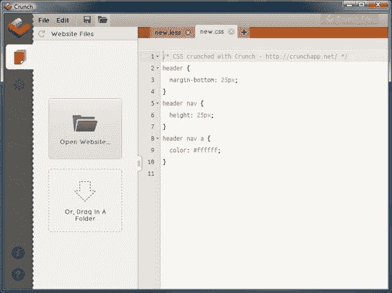

# 第一章。介绍 Less

你厌倦了为客户网站编写相同的旧 CSS 样式，却发现你只是在重复自己？希望你能减少你写的代码量，同时仍然产生相同的结果…？

嗯，你可以。欢迎来到 CSS 预处理器的世界，特别是 Less！Less 这样的 CSS 预处理器旨在帮助你重新组织你的样式，使其成为更小、更易于管理的可重用代码块，你可以根据项目需求存储和引用这些代码块。

Less，作为 CSS 的超集或扩展，旨在使你的开发工作更加容易——它结合了在脚本语言（如 JavaScript）中更常见到的变量和函数，同时仍然编译成有效的 CSS。虽然一开始想到与代码一起工作可能会让你感到害怕，但你很快会发现 Less 实际上只是 CSS，但增加了一些有助于使开发更容易的功能。Less 将帮助你减少开发时间，因为你可以从一项项目中重用代码到另一项——具体多少取决于你！

在本章中，我们将涵盖以下主题：

+   HTML 和 CSS 的作用，以及使用 CSS 的局限性

+   为什么需要 CSS 预处理器

+   为什么你应该使用 Less

+   CSS4 的出现，以及这对 Less 的意义

# HTML 和 CSS 的作用

如果你为客户开发网站，你很可能已经使用 HTML 和 CSS 来创建你的杰作。

HTML 是在 1990 年创建的，一直是放置网页内容的*事实上的*标准。多年来，它已经发展成我们现在所知道的 HTML5，我们可以用它来制作一些非常详细的网站或在线应用程序。用烹饪的比喻来说，HTML 有效地是蛋糕底座的制作；它是任何互联网浏览器都能理解的内容。HTML 构成了互联网上任何网站的基石——它看起来可能不太吸引人，但它将包含你需要的所有元素，例如标题、段落和图像，以产生格式良好的页面。格式良好的页面由两个元素组成：**可访问性**和**验证**。

可访问性相当于建造一座新房子，我们可以添加斜坡或使门道比正常更宽，以便让每个人都能进入。基本可访问性并不困难或复杂，但它必须成为开发过程的一部分；如果让它自行发展，它将使那些需要额外帮助的人在家中移动变得更加困难！与可访问性相伴而来的是验证，这非常类似于烹饪的物理学；如果我们遵守验证规则，我们就能创作出杰作，而如果超出最佳实践，很可能会导致灾难。

尽管如此，没有某种形式的装饰很难制作出一个网站；仅使用 HTML 无法产生非常吸引人的效果！正因为如此，我们才使用 CSS 来为我们的网站添加最后的修饰，我们可以调整位置、添加动画或改变页面元素的色彩。就像你不能没有水泥建造房子一样，你也不能在网站创建过程中某个时刻不使用 CSS。

使用 CSS 并非没有限制——随着它多年的发展，其功能支持已经发生了变化。有人可能会说，自从 1996 年诞生以来，它已经走了很长的路，但它的核心始终会存在一些基本缺陷。让我们更详细地看看这些。

# 使用 CSS 的限制

如果你曾经花时间使用过 CSS，你会知道在处理 CSS 时遭受的痛苦和心碎——这一切都是为了创建一个完美的网站！对于那些对使用 CSS 还不太熟悉的人来说，他们迟早会遭遇 CSS 的一些限制，包括：

+   CSS 高度依赖于浏览器的功能——不可能以相同的方式在所有浏览器中显示相同的内容。我们可以解决这个问题，但不是不付出代价的，这需要添加供应商前缀语句。这可能导致页面中有很多重复的代码，使页面变慢且难以维护，即使是微小的更改也需要大量的努力。

+   并非每个浏览器都支持 CSS 中的每个功能——这一点在 CSS3 中尤为明显。这意味着如果我们想保持某种形式的访客体验，我们需要为受影响的浏览器实现某种形式的优雅降级。

+   CSS 的出现使得在杂志网站上创建列等功能的操作变得容易得多，尽管它仍然不完美。要实现完美的列，我们需要使用 JavaScript 或 jQuery 来调整代码，这使得页面更难以访问（例如，对于那些使用屏幕阅读器的人来说）。它还对渐进增强的使用产生了影响，内容应该使用 CSS3 或 jQuery 等功能进行增强，而不是依赖于它们。

+   没有改变标记以包含占位符，就无法针对特定内容范围进行定位；如果这些占位符发生变化，那么相关的 CSS 也必须相应更改。

+   我们不能在另一个 CSS 样式中包含一个规则，也不能命名一个规则——后者可能会被客户端脚本使用，即使被引用的选择器发生了变化。

到现在为止，你可能认为使用 CSS 时一切都是厄运和阴霾；别担心，我们可以借助 CSS 预处理器来帮助我们更有效地开发。

# 使用 CSS 预处理器的好处

如果你花时间使用过 CSS，你可能会问自己第一个问题是“为什么我需要使用预处理器？”这是一个合理的问题，你肯定也不是第一个问这个问题的人！让我更详细地解释一下。

CSS 被称为声明性语言——这意味着我们用来声明元素如何显示的规则将是浏览器用来在屏幕上绘制结果的规则。例如，如果我们想让一段文本，比如一个打印的注释，显示为斜体，我们将使用类似于以下代码的东西：

```js
.comment {
  font-style: italic;
  font-size: 12px;
}
```

浏览器然后将这段文本以 12 像素的斜体形式渲染到屏幕上。

这个例子非常直接——它可以在任何地方使用。问题是，我们可能需要在其他地方指定相同的样式属性。我们可以使用`.comment`类，但如果我们想更改大小怎么办？或者，也许我们想将文本以粗体显示呢？

为了适应一个元素而更改样式规则可能会破坏原始元素的样式，这并不是理想的情况。相反，我们需要创建多个适用于特定元素的样式规则，但这些规则会重复这段代码——这可能会导致非常冗长的 CSS！想象一下，我们最终可能需要创建一个如下所示的选择器：

```js
.article #comments ul > li > a.button {
...some style rules...
}
```

这个选择器并不容易理解，更不用说应用样式了，对吧？我们可以通过使用 Less 来消除这种重复问题——在 Less 样式表的开始处设置一个样式块，然后可以在代码的每个实例中重用这个样式，就像你可能在 Word 文档中使用`autotext`函数根据关键词添加预定义文本一样。如果我们进行更改，我们只需要做一次——Less 会自动更新我们的代码，避免手动操作的需要。想象一下，如果你在一个电子商务网站上可能有数十个按钮，这样做的好处将很快显现出来！

在 CSS 中，这可能会显得很陌生——毕竟，我相信我们都习惯于手动编写代码，并花费许多小时来完善它。你可能会对使用 CSS 预处理器来处理一些繁琐的工作有所顾虑，尤其是当你为客户完成那件令人惊叹的 CSS 艺术品时，这会让人感到满足。这是很自然的——让我们花点时间来考虑一些关于使用 CSS 预处理器的一些常见顾虑。

## 为什么不直接写正常的 CSS 呢？

许多人经常会问，“如果我们正在生成 CSS，为什么我们不直接编写它呢？”这是一种常见的反应；毕竟，我们每天都在使用 CSS 来解决我们在构建美丽响应式网站时遇到的任何布局问题。我们最不希望的就是看起来不知道自己在做什么，对吧？

让我从一开始就明确：使用 Less 的目的不是编写更好的 CSS。如果您现在还不懂如何使用 CSS，那么 Less 不会帮助您填补这个空白。它将帮助您更快、更轻松地编写 CSS，同时使样式表更易于管理。让我们更详细地探讨一些我们应该切换到使用 CSS 预处理器（如 Less）的原因：

+   CSS 预处理器，如 Less，不会破坏浏览器兼容性——每个 CSS 预处理器都产生有效的 CSS。

+   CSS 预处理器有助于使我们的 CSS **DRY**（**不要重复自己**）——我们可以从可重用的 CSS 属性中创建变量，这有助于我们使代码更具可扩展性和可管理性，因为我们可以将它分解成更小的文件，这些文件会自动编译成一个更大的样式表。

+   如我们在整本书中将要看到的，CSS 预处理器包含一些有用的功能，可以帮助我们在编写 CSS 样式时自动化一些低价值任务，从而减少一些常见的繁琐工作。

+   我们可以利用 CSS 预处理器的嵌套功能，这导致了一种更自然的编写风格，我们可以使用一种简写形式来产生所需的效果。

现在我们已经探索了一些使用 CSS 预处理器的优势，让我们深入探讨并首次了解 Less。我们将进行一次快速浏览，以便让您对 Less 的预期有所了解。如果您现在还不理解，请不要担心；我们将在整本书中详细讲解所有内容。

# 介绍 Less 作为解决方案

Less 首次由 Alexis Sellier 在 2009 年创建，最初是用 Ruby 编写的动态样式表语言；很快，由于在 JavaScript 中重新构建库所获得的显著速度提升，它被弃用了。它旨在由客户端和服务器端使用——后者通过 Node.js 的帮助，我们将在第三章 Chapter 3 中介绍，*Less 入门*。

Less 是作为 CSS 的超集构建的，这意味着它包含比传统 CSS 更高级的工具。这允许我们在编写更少的代码的同时，仍然将其编译成有效的 CSS。这个关键在于我们如何使用 Less 来产生更有组织、更易读的代码。为了在实践中学到这一点，让我们看看一个快速示例，说明我们的意思。

想象一下，您已经编写了以下 CSS 代码示例——它是一个完全有效的 CSS，尽管实际上它不会产生任何可用的结果：

```js
header { 
  margin-bottom: 25px;
}

header nav { 
  height: 25px;
}

header nav a { 
  color: #151b54;
}
```

您可能已经注意到，我们不得不重复一些内容，这并不理想，但在编写此类样式时是必要的恶行。在我们的例子中，代码是可读的，但如果我们将它发展到任何程度，选择器的重复性（如 `header nav div.first div.thumb .img-wrapper img`）可能会使代码更难理解。

Less 的一个核心概念是在编写代码时使用 DRY 原则——我们可以利用其**嵌套元语言**语法通过嵌套我们的语句来减少代码。如果我们用 Less 重新组织前面的代码块，它将看起来如下：

```js
header { 
  margin-bottom: 25px; 
  nav {
    height: 25px;
    a { color: #151b54; }
  }
}
```

在这里，我们将编译成我们刚刚看到的 CSS。

注意我们如何通过分组样式和采用更自然的流程，减少了必须编写的代码量，同时使代码更容易阅读。嵌套元语言是基于层次结构的，我们可以将相关的声明分组在一起，并以某种形式对它们进行重新排序，这种形式抽象了每一级，同时包括了高级别。Less 会自然地将这些相关的声明分组在一起，如果 CSS 样式表由多个人编辑，这将是一个巨大的好处。

### 注意

如果您想了解更多关于嵌套元语言的信息，您可能想浏览到[`en.wikipedia.org/wiki/Metalanguage#Nested_metalanguage`](http://en.wikipedia.org/wiki/Metalanguage#Nested_metalanguage)。请注意，这是一个相当枯燥的参考资料（有意为之！）

为了证明这确实编译成有效的 CSS，您可以看到编译前面 Less 代码在 Crunch!中的结果。Crunch!是一个 Less 的 CSS 编辑器和编译器，我们将在第二章中更详细地介绍它，*构建 Less 开发工具包*。Chapter 2。您可以在 Crunch!中像以下截图所示进行编码：



如果嵌套代码现在看起来并不那么伟大，请不要担心——我们将在第四章中更详细地介绍嵌套，*使用变量、混合和函数*。Chapter 4。这是 Less 中许多将帮助革命化您的 CSS 开发的函数之一。让我们进一步深入探讨您应该使用 Less 的一些原因，更详细地了解。

# 为什么你应该使用 Less

我们已经看到，Less 旨在帮助使 CSS 更容易管理和维护。让我们更详细地探讨一些关键特性，这将让您对 Less 的预期有所了解，并展示 Less 如何使编写 CSS 变得更加容易。

## 使用变量减少冗余

你在需要声明 CSS 中颜色值的网站上工作过多少次，比如`#ececec`？10 次？20 次？您很少能一次就得到正确的颜色；更有可能的是，您需要对其进行修改，这在 CSS 中工作时可能会造成真正的负担。不管它最终变成多少次，有一点是肯定的：记住每个颜色的十六进制值并不容易。

Less 可以通过允许我们使用更具记忆性的名称定义颜色作为变量来帮助我们。变量仅仅是一个引用值的机制；请看以下三个示例：

```js
@red: #de1446; 
@blue: #4a14de; 
@green: #32de14;
```

Less 的美妙之处在于，一旦我们定义了这些变量，如果我们在以后更改十六进制值，Less 会自动更新它们被使用的任何实例。

### 理解变量的语法

在 Less 中，`@` 符号表示我们正在定义一个变量；紧随其后的是变量名（没有空格），冒号表示变量名的结束。之后是值，用分号来结束语句。在这种情况下，`@red` 变量指的是我们想要的红色颜色的十六进制值。一旦我们定义了这些变量，我们就可以在 Less 样式表中任何地方使用它们，如下所示：

```js
.red-box {
  color: @red;
}
```

当我们编译它时，会生成以下有效的 CSS：

```js
.red-box {
  color: #de1446
}
```

### 注意

在 Less 中，编译仅仅意味着从 Less 转换到 CSS。我们将在整本书中频繁使用这个术语。

编写和记住变量名比记住不自然的十六进制值要容易得多，对吧？此外，当这些值需要更改时，我们只需要在一个地方更新它们，Less 就会负责更新其他所有内容。不再需要在更改颜色时执行“查找和替换”——这可以节省大量时间！

### 创建可重用的代码块

所以我们创建了一些变量……但是可重用的代码块？

使用 Less 的一个好处是我们可以将多行代码组合在一起，并将它们转换成一个可重用的代码块，我们可以将其添加到我们的代码中。让我们看看一个例子：

```js
.serif() {
  font-family: Georgia, 'Times New Roman', serif;
}
```

这是一个可重用代码块或 mixin 的非常简单的例子。如果你在开发 JavaScript 或 jQuery 任何时间，你可能会在类形式中认出类似的行为；mixins 以几乎相同的方式工作。

Mixins 本身不会做任何事情，为了使它们变得有用，我们需要从我们的代码中使用占位符来调用它们，如下面的代码所示：

```js
p {
  font-size: 10px;
  line-height: 1.25em;
  .serif;
}
```

这会编译成有效的 CSS：

```js
p {
  font-size: 10px;
  line-height: 1.25em;
  font-family: Georgia, 'Times New Roman', serif;
}
```

看看，仅仅用一个简短的单词，我们就让 Less 添加了一些更复杂的内容？有一点需要注意，就是使用括号`()`来对 mixin 名称进行操作——Less 会将可重用的代码（或 mixin）编译成有效的 CSS，但它不会在屏幕上渲染编译后的 mixin。不过，最棒的是我们可以简单地调用 `.serif;` 来在任何需要使用定义的 `font-family` 属性渲染文本的地方。

## 自动生成值

在较新的浏览器中，你可能会发现一些网站使用 RGBA（红绿蓝透明度）和 HSLA（色调饱和度亮度透明度）颜色，而不是我们在上一节中看到的典型十六进制值。

并非每个浏览器都支持这些颜色格式——为了解决这个问题，我们可以先声明一个十六进制值，然后是它的 RGBA 或 HSL 等效值。例如，我们可能会编写类似于以下代码的内容，以便将使用 `h1` 属性设置的文本设置为深棕色：

```js
h1 {
  color: #963529;
  color: rgba(150, 53, 41, 0.5);
}
```

如果我们在像 Photoshop 或 GIMP 这样的图形包中选择颜色，我们有时可能会难以同时获得值，可能需要求助于其他方法。幸运的是，Less 没有这个问题，因为它允许我们使用函数自动创建新值。

我们为什么要这样做？答案很简单：我们只需要使用一种格式提供颜色值，例如 RGBA。然后我们可以使用 Less 的函数将其转换为不同的格式——这样我们就可以避免任何关于确保我们提供了正确值的混淆，因为 Less 会自动处理这些值。

让我们快速看一下这将如何工作：

```js
.brown-color {
  @rgbaColor: rgba(150, 53, 41, 0.5);

  color: fade(@rgbaColor, 100%);
  color: @rgbaColor;
}
```

在这里，我们使用了一个简单的变量来定义基本颜色，然后在`rgba`颜色函数中将它转换为其 RGBA 等效值，alpha 值设置为`0.5`。如果我们编译 Less 代码，它将生成以下 CSS：

```js
.brown-color {
  color: #963529;
  color: rgba(150, 53, 41, 0.5);
}
```

在我们的例子中，alpha 通道设置为 50%。这意味着在支持 RGBA 的浏览器中，我们可以看到颜色背后的 50%的内容。当为网站创建主题时，函数的使用将真正发挥其作用——我们可能只需要两种到三种基本颜色就能创建出一整套颜色！

我们将在本书的第十二章中进一步探讨颜色函数，*使用 Less 处理颜色*。

## 忘记供应商前缀

使用 CSS3 的好处是，我们不需要总是使用图像，因为我们经常可以仅使用纯样式就达到相同的效果。问题是，为了适应所有这些新特性，如背景渐变、动画、盒阴影等，我们通常必须使用供应商前缀或不同的语法，以确保网站可以被尽可能广泛的受众查看。

这可能是一个真正的麻烦，但在预处理器中就不会这么麻烦。正如你将在第四章中看到的，*使用变量、混合和函数*，我们可以创建一个混合或一小块预定义的代码，可以直接混合到我们的 Less 样式表中，并用于创建有效的 CSS。例如，以下代码块用于生成圆角：

```js
.roundcorners { 
  -webkit-border-radius: 4px; 
  -moz-border-radius: 4px; 
  -ms-border-radius: 4px; 
  -o-border-radius: 4px; 
  border-radius: 4px; 
}
```

使用 Less，有成百上千的混合函数可以在网上找到（本书后面将详细介绍），我们可以在代码中使用它们。我们不需要记住每种样式在术语前缀和语法方面需要什么，我们只需使用以下代码：

```js
.roundedcorners {
  .border-radius;
}
```

上述代码生成的 CSS 与之前编译的 CSS 完全相同；Less 自动添加所有供应商前缀，这是一个节省时间的好方法。

## 简单创建媒体查询和动画

移动设备的出现创造了对响应式网站的需求，这些网站只有在满足特定环境条件或断点时才会显示内容。一个很好的例子是在浏览响应式网站时确定正在使用的屏幕大小。

这通常意味着需要为设计中的每个断点编写多个查询。例如，我们可以编写以下（简化后的）CSS 来更改特定设备的排版：

```js
@media only screen and (max-width: 529px) {
  h1 {
    font-size: 0.7em;
  }
}

@media only screen and (max-width: 949px) {
  h1 {
    font-size: 0.9em;
  }
}

@media only screen and (max-width: 1128px) {
  h1 {
    font-size: 1.1em;
  }
}
```

尽管这只是为了设置`h1`属性的尺寸，但看起来需要记住的东西很多。我们可以利用 Less 的强大功能来简化代码：

```js
@smallwidth: ~"only screen and (max-width: 529px)";
@mediumwidth: ~"only screen and (max-width: 949px)";
@largewidth: ~"only screen and (max-width: 1128px)";

h1 {
    @media @smallwidth { font-size: 0.7em; }
    @media @mediumwidth { font-size: 0.9em; }
    @media @largewidth { font-size: 1.1em; }
}
```

我们首先声明三个变量，每个变量包含一个媒体查询语句。这些是静态值，只有在决定添加或修改任何支持的断点时才会改变。在这个例子中，使用它们并不是必需的，但它们将有助于使嵌套解决方案更容易阅读！

我们随后使用`@media`调用每个媒体查询，后面跟着包含我们希望测试的断点的变量。这里的关键点是，尽管看起来`@media`被重复了，但我们不能基于`@media`来构建嵌套样式，因为代码将无法正确编译。相反，我们需要基于`h1`选择器来确保代码能够正确编译。

## 在多个项目中重用代码

CSS 的一个局限性是，我们经常发现自己需要在构建的每个网站上跨多个元素应用相同的值。在小网站上，这不太方便，但在大网站上，我们可能会错过更新一个值的风险更大，这可能会导致意外的结果。我们已经看到，您可以使用变量来减少（甚至通过良好的规划消除）这种风险——如果我们能够在未来的项目中**重用**我们的代码会怎样呢？

这并不像看起来那么疯狂——我们可能会为按钮开发一个特定的阴影样式，我们喜欢并希望重用。传统的方法是将它存储在文本文件、数据库或其他类似的地方，然后每次需要重用时都挖出来。即使它确实可行，这种方法也很繁琐——如果我们使用预处理器，就可以消除这种需求。

我们可以将代码简单地存储在文件中，以**混合**或可重用代码块的形式。如果我们需要重用其中任何一部分，我们只需将文件添加到我们的项目中，并使用以下命令来导入内容：

```js
@import "mixinfile.less";
```

然而，使用 Less 的美丽之处在于，它只会导入主 CSS 文件中我们项目所需的那些混合。

## 自动压缩 CSS 以加快网站速度

到目前为止，我们已经讨论了 Less 的一些令人信服的特性——这只是它提供的一部分功能——在本书的其余部分，我们还将探讨一些 Less 的更实际的应用。

在编写 CSS 时，有一件关键的事情我们没有提到：压缩你的样式表作为将网站发布到生产环境的一部分的能力。压缩我们的样式表可以移除空白，并允许我们在一个主 CSS 文件中连接多个文件。

为什么你应该这样做？答案很简单：这将使样式表的大小减少到原始大小的几分之一，这可以节省带宽。虽然这可能对普通互联网连接来说问题不大，但对于那些使用有限带宽的移动设备的人来说，这是至关重要的。

如何压缩你的 CSS？当然，我们可以使用在线工具来压缩，但这意味着使用额外的工具，这会增加你繁忙的开发工作。如果你使用 GUI 工具（如 WinLess）或命令行编译代码，你可以设置它同时压缩代码。

这只是 Less 能提供的一小部分。在我们开始运行使用 Less 所需的发展工具之前，让我们简要地看看 CSS4 将提供什么，以及这可能会如何影响像 Less 这样的预处理器工具。

# 在 Less 中支持 CSS4 标准

随着 CSS2 和 CSS3 的出现，自然地假设 CSS4 将在未来的某个时刻到来。你可能想知道它会如何影响 CSS 预处理器——让我们看看 CSS4 对 Less 可能意味着什么。

正式来说，并没有所谓的 CSS4。虽然这听起来可能有些奇怪，我们不会看到新的全球标准的出现；CSS4 将被归类到更小的标题下，其中每个标题都有自己的级别。还有很长的路要走，但最接近最终确定的一个分组是 CSS4 选择器。

### 注意

你可以在 W3C 的草案提案中查看关于 CSS 选择器提议的更多详细信息：[`dev.w3.org/csswg/selectors4/`](http://dev.w3.org/csswg/selectors4/)。关于使用选择器的可能性有一个有趣的讨论：[`vandelaydesign.com/blog/design/some-interesting-possibilities-with-css4/`](http://vandelaydesign.com/blog/design/some-interesting-possibilities-with-css4/)。

虽然这些功能从 CSS 开始就已经存在，但 CSS4 引入了许多新的逻辑运算符，如`:not`和`:matches`，以及一些新的局部伪类，如`:any-link`或`:local-link`。特别是后者，为链接的样式提供了有用的功能，如下面的代码示例所示：

```js
nav:local-link(0){
   color: red;
}

nav:local-link(1){
   color: green;
}

nav:local-link(2){
   color: blue;
}

nav:local-link(3){
   color: yellow;
}

nav:local-link(4){
   color: gray;
}
```

我们可以使用以下 Less 代码重写：

```js
nav {
  &:local-link(0) { color: red; }
  &:local-link(1) { color: green; }
  &:local-link(2) { color: blue; }
  &:local-link(3) { color: yellow; }
  &:local-link(4) { color: gray; }
}
```

如果我们编译这段代码，我们可以在一个带有面包屑导航的页面上看到结果——例如，URL 为`http://internetlink.com/2014/08/21/some-title/`，面包屑导航如下所示：

+   首页 (`http://internetlink.com/`)

+   2014 年 (`http://internetlink.com/2014/`)

+   2014 年 8 月 (`http://internetlink.com/2014/08/`)

+   2014 年 8 月 21 日 (`http://internetlink.com/2014/08/21/`)

+   文章（`http://internetlink.com/2014/08/21/some-title/`）

第一个链接将是红色，第二个是绿色，第三个是蓝色，然后是黄色，最后是灰色。

## 在 Less 中支持未来的 CSS 标准

在 Less 中支持未来的 CSS 标准（或通常称为 CSS4）仍然处于早期阶段。在 Less 中已经取得了一些进展，允许使用选择器，这可以通过我们之前在本章“在 Less 中支持 CSS4 标准”部分中看到的使用井号符号来实现。

在撰写本书时，开发者们已经避免为 CSS4 添加太多新特性，因为大多数当前提出的更改仍然处于草案状态，并且可能发生变化。迄今为止添加的主要特性是对属性的支撑，这出现在 Less 的 1.4 版本中——其他特性将在规范最终确定并在多个浏览器中提供支持后出现。不过，需要注意的是，任何使用 CSS3 语法的 CSS4 标准在 Less 中都是自动支持的。

即使 CSS4 标准成为主流，Less 仍然会有需求；Less 将进化以包含新的标准，同时仍然允许我们在编写 CSS 时更加高效。

### 小贴士

**我的浏览器对 CSS4 的支持程度如何？**

作为旁注，你可能想测试你选择的浏览器以查看它对 CSS4 的支持程度；浏览到[`css4-selectors.com/browser-selector-test/`](http://css4-selectors.com/browser-selector-test/)并点击**开始测试**以查看结果。

# 摘要

在本章中，我们首先简要地回顾了 HTML 和 CSS 在网页设计中的作用，并讨论了 CSS 在网页元素样式化时的一些局限性。

我们接着讨论了 CSS 预处理器如何帮助解决这些问题；我们涵盖了人们经常提出的关键问题，即当我们完全熟悉编写有效的 CSS 时，为什么还需要使用它们。然后我们介绍了 Less 作为可用的预处理器之一，以及作为解决我们面临的一些 CSS 问题的可能解决方案。

我们通过探讨为什么 Less 应该成为你的开发工具包的一部分，以及一些有助于你管理 CSS 开发的特性来结束本章。在下一章中，我们将更深入地探讨 Less 的语法以及如何将其编译成有效的 CSS。
