# 第三章。Less 入门

在本书的前两章中，第一章，*介绍 Less* 和 第二章，*构建 Less 开发工具包*，我们学习了 Less 是什么，它的一些好处，以及为什么你应该掌握一个在开发世界中迅速获得重要影响力的预处理器。

在本章中，我们将从下载和安装 Less 开始，然后设置我们可以在整本书中重复使用的基础项目，它已经设置为我们的偏好。虽然这可能看起来有点平凡，但它确实是使用 Less 的一个基本部分！一旦我们的基础项目准备就绪，我们将快速浏览 Less 的一些主要代码功能，然后查看如何将你的 Less 代码编译成有效的 CSS，并看到对 Less 代码所做的任何更改的效果。

在本章中，我们将通过以下主题更深入地探讨 Less：

+   将 Less 集成到你的网站中

+   在客户端使用 Less 的风险

+   探索 Less 使用的语法

+   创建一些基本样式

+   编译代码并查看结果

+   修改 Less 代码并查看更改的效果

准备好了吗？正如他们在时间力学中所说，现在开始是最佳时机...！

# 创建基础页面

现在我们已经下载了库，下一步是设置我们的基础项目，我们可以在整本书中重复使用它。这将是一个简单的 HTML5 文档，它将包含我们项目所需的基本框架。

对于我的代码编辑器，我将使用 Sublime Text 2，我们已经在 第二章，*构建 Less 开发工具包* 中设置了 Less 的支持。这个工具包可以从 Sublime Text 的网站 [`www.sublimetext.com/2`](http://www.sublimetext.com/2) 下载，尽管你可以使用你最舒适的任何编辑器。

首先，让我们创建我们的基础项目文件。在一个名为 `lessjs` 的新文件夹中，创建一个新文件并添加以下代码：

```js
<!DOCType html>
<head>
  <meta charset="utf-8">
  <title>Untitled</title>
  <link rel="stylesheet/less" href="css/project.less">
</head>
<body>
</body>
</html>
```

### 小贴士

**下载示例代码**

你可以从你购买的所有 Packt 书籍的账户中下载示例代码文件 [`www.packtpub.com`](http://www.packtpub.com)。如果你在其他地方购买了这本书，你可以访问 [`www.packtpub.com/support`](http://www.packtpub.com/support) 并注册，以便将文件直接通过电子邮件发送给你。

将其保存为 `project.html`。我们将在整本书中引用这个文件，并且它是使用 Less 时每个项目的基石。

# 下载和安装 Less

现在我们已经创建了一个测试页面，是时候下载 Less 库了。库的最新版本是 1.7.3，我们将在这本书中引用这个版本。

要获取库的副本，有两种主要选项可用：下载作为独立库的最新版本或使用 Node 编译代码。我们将从下载独立库开始。

# 在客户端安装 Less

要在我们的代码中使用 Less，我们可以通过浏览到[`lesscss.org/#download-options-browser-downloads`](http://lesscss.org/#download-options-browser-downloads)并点击**Download Less.js v.1.7.3**按钮从 Less 网站下载它。

将浏览器窗口中显示的文件内容`less.min.js`保存在主`lessjs`项目文件夹下的一个名为`js`的子文件夹中；最终你会得到类似这样的截图（这显示了你在本章后面将创建的文件）：

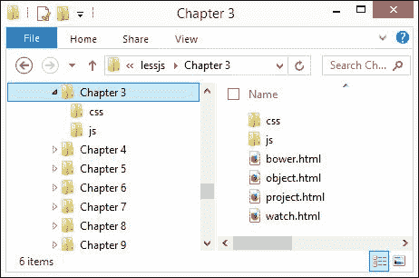

在本章开头创建的`project.html`文件副本中，添加如下高亮显示的代码：

```js
<!DOCType html>
<head>
  <meta charset="utf-8">
  <title>Untitled</title>
  <link rel="stylesheet/less" type="text/css" href="css/project.less">
 <script src="img/less.min.js"></script>
</head>
<body>
```

就这样——一旦添加了这些，Less 将动态地将样式编译成有效的 CSS 并在浏览器中渲染结果。需要注意的是，为了使 Less 正确编译样式，必须在代码中首先包含对 Less 样式表文件的引用，然后再包含对 Less 库的引用。

### 提示

**我可以获取 Less 的源代码吗？**

如果你想要深入了解 Less 库并更详细地检查代码，那么你可能想下载库的非压缩版本，该版本可在[`github.com/less/less.js/archive/master.zip`](https://github.com/less/less.js/archive/master.zip)找到。

## 使用 CDN

虽然我们可以下载库的副本，但在生产环境中托管时我们不需要这样做。Less 可在由 CDNJS 托管的 CDN 上使用。你可以在代码中链接到这个版本。

如果你托管了一个网络流量很大的国际网站，使用由 CDN 托管的文件将有助于确保库是从地理位置靠近访客的服务器下载到访客的计算机上的。这有助于使响应更快，因为浏览器将在后续访问页面时使用缓存的版本，从而节省带宽。然而，这**不**推荐用于开发！

### 注意

如果你想要使用 CDN 链接，它可以在[`cdnjs.cloudflare.com/ajax/libs/less.js/1.7.3/less.min.js`](http://cdnjs.cloudflare.com/ajax/libs/less.js/1.7.3/less.min.js)找到。

# 在服务器端安装 Less

作为即时编译代码的替代方案，我们始终可以使用命令行来执行相同的功能——Less 附带一个内置的命令行编译器，该编译器需要基于 JavaScript 的 Node 平台来运行。

## 使用 Node 安装 Less

我们在第二章*构建 Less 开发工具包*中探讨了如何安装 Node；我将假设您已经按照该章节中概述的默认设置安装了它。到目前为止，我们现在需要安装 Less 编译器，所以打开一个命令提示符，切换到我们之前创建的项目文件夹的位置，并输入以下命令：

```js
npm install -g less

```

您将在命令提示符中看到它运行下载和安装 Less 的过程：

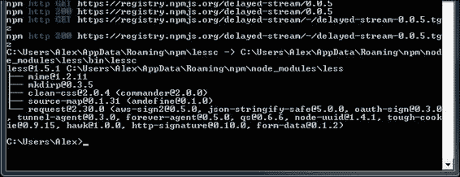

安装完成后，我们可以输入以下命令来编译 Less 文件，它使用以下语法：

```js
lessc srcfile [dstfile]

```

Less 会将输出编译到`stdout`；如果我们想使用不同的输出，则可以重定向输出：

```js
lessc srcfile > dstfile

```

现在，我们已经准备好在命令提示符中编译 Less 文件了——我们将在本章的后面看到这个操作的实际应用。

## 使用 Bower 安装 Less

除了使用 Node 与命令行之外，我们还可以使用跨平台的 Bower 包管理器系统安装 Less，该系统可在[`www.bower.io`](http://www.bower.io)找到。

基于 Node，Bower 被设计用来帮助安装网络包，例如 jQuery、AngularJS、Font Awesome 图标库，当然还有 Less。让我们看看如何在 Windows 上安装它，因为这需要一个额外的依赖项——Git for Windows，如果我们想使用这个平台，它也必须被安装。

为了充分利用这个演示，您会发现使用本地 Web 服务器，如 WAMP，会更好。出于本书的目的，我将假设它已经按照默认设置安装。

首先，访问[`msysgit.github.io`](http://msysgit.github.io)并下载最新的安装程序，即写作时的`Git-1.8.5.2-preview20131230.exe`。双击安装程序，然后点击**下一步**以接受所有默认设置，直到到达此屏幕：

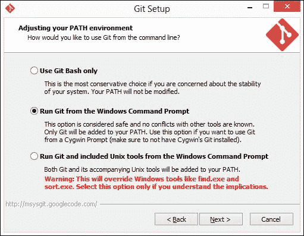

将选定的选项更改为**从 Windows 命令提示符运行 Git**，然后通过点击**下一步**接受剩余设置的默认值。Git 安装程序将安装和配置客户端，完成后，如果需要，将显示安装说明以供阅读。

在命令提示符中，输入以下命令：

```js
npm install -g bower

```

这将下载并安装构成 Bower 的各种包——如果安装成功，它将显示确认信息：

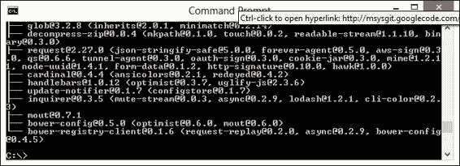

Bower 安装完成后，切换到您的网络空间中的`www`文件夹，并输入以下命令来安装 Bower 的 Less 包：

```js
bower install less

```

这将执行一个类似的过程来下载和安装 Bower 的 Less 包，如下面的截图所示：

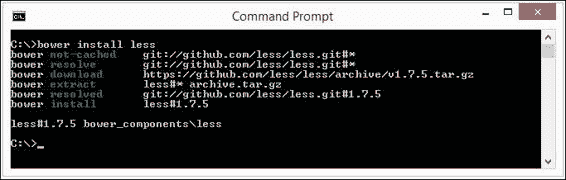

到目前为止，Bower 已经安装并可供使用。

### 使用 Bower 包

现在 Bower 已经安装，我们可以在代码中使用它——然而，主要的区别是它不包含 `lessc` 的版本，所以我们只能将其用于在代码中动态编译，并且不支持依赖于 Node 的代码开发。

考虑到这一点，我们仍然可以在开发中使用它，至少可以证明我们的代码是可行的——为此，我们只需要对我们的代码进行一个更改。如果我们打开一个 `project.html` 的副本，我们可以将高亮行更改为使用 Bower 版本的 Less，而不是原始版本：

```js
<link rel="stylesheet/less" href="include.less">
<script src="http://localhost/chapter3/bower_components/less/dist/le
ss-1.7.3.js"></script>
  <script type="text/javascript">
  </script>
```

当然，我们可以进一步扩展这一点——Bower 运作方式与 Node 非常相似，允许我们产生 `.json` 包，就像我们在上一章中为 Node 所做的那样。

### 注意

如果你想了解更多关于为 Bower 生成包的信息，那么 Bob Yexley 在 [`bob.yexley.net/creating-and-maintaining-your-own-bower-package/`](http://bob.yexley.net/creating-and-maintaining-your-own-bower-package/) 有一个有用的文章。

让我们现在把注意力转向熟悉 Less 语法。在我们这样做之前，有一个重要的观点我们需要注意，那就是在客户端使用 Less 的风险。

# 在客户端使用 Less 的风险

到目前为止，我们已经介绍了如何在代码中安装 Less 并使用它将代码编译成有效的 CSS，因为每个页面都是这样显示的。

确实，我们应该准备好开始使用 Less，对吧？毕竟，我们已经有了库，我们知道如何添加它，并且对样式编译后的预期有所了解……或者也许不是。我们错过了一个关键点；让我解释一下。

当 Less 首次推出时，它最初是用 Ruby 编写的；这意味着代码必须首先编译，然后才能将其结果包含在网站页面中，作为有效的 CSS。尽管这是一个完全有效的程序，但它使得开发速度变慢，因为需要额外的步骤来编译 Less 代码并将其包含在网页中。

将库重置为 JavaScript 导致速度提高了 30% 到 40%——这导致了直接在代码中包含库和原始 Less 代码的诱惑。这足够好，同时消除了单独编译代码的需要。

然而，出于多种原因，这已经不再被认为是良好的实践，至少对于生产网站来说是这样：

+   JavaScript 可以被关闭——依赖于 JavaScript 来控制网站的样式意味着如果关闭 JavaScript，网站将会出错，导致网站变得混乱！

+   依赖于基于 JavaScript 的库意味着必须向服务器发出另一个 HTTP 请求，这可能导致加载时间增加，尤其是对于脚本密集型网站。

+   在内容丰富的网站上，有很多样式，这可能导致渲染时间的明显增加，因为样式必须在内容渲染之前动态编译。

+   大多数移动平台无法动态处理 Less 的编译（以及相关的 JavaScript 文件），它们将直接终止执行，这会导致混乱。

这并不意味着在客户端编译是完全禁止的，它应该仅限于工作在开发环境中，或者在需要将库本地存储的实例中，例如在 HTML5 应用程序中。

你会注意到，本书中的许多示例将使用 Less 客户端。这是为了确保你，作为读者，能够体验到整个过程；由于我们是在开发/演示环境中工作，这并不是一个问题。当在产品网站上工作时，Less 代码应始终先预编译，然后再添加到网站上。

# 探索 Less 使用的语法

关于安装的理论就到这里吧！让我们继续，看看构成 Less 的语法。在接下来的几章中，我们将深入探讨库的每个部分；在这样做之前，我们将快速浏览库的一些重要部分，从变量开始。

## 使用变量

如果我们需要编写 CSS 样式，很可能会包含一个或多个出现在多个地方的风格。一个很好的例子是许多形状，我们可能需要使用相同的值来设置边框或前景色：

```js
.shape1 {
  color: #5cb100;
  border: 1px solid #5cb100;
}

.shape2 {
  background: #fff;
  color: #5cb100;
}
.shape3 {
  border: 1px solid #5cb100;
}
```

作为网页设计师，我们可以在代码中简单地使用相同的颜色值，并且在不适当的情况下，这是一个完全有效的选项。然而，如果我们已经设置了一套特定的颜色，却发现它们都需要更改，会发生什么呢？

每个风格都可以单独更改，尽管这假设我们能够更改每个实例——在一个风格繁重的网站上，即使我们尽力，也总会错过一个！

我们可以通过使用变量来存储每个颜色的常量值，并在整个样式表中使用它来轻松解决这个问题：

```js
@my-color: #5cb100;

.shape1 { color: @my-color; border: 1px solid @my-color; }
.shape2 { background: #fff; color: @my-color; }
.shape3 { border: 1px solid @my-color; }
```

这意味着，如果我们选择更改原始颜色用于其他目的，那么我们只需更改分配给相关变量的颜色值，Less 将自动更新代码中该变量的每个实例。

在我们的例子中，我们设置了一个变量来存储颜色值`#5cb100`——如果我们想更改这个值，那么我们只需更改起始处分配的变量即可。然后 Less 将处理更新所有使用该变量的实例，因此我们可以确信更改已在我们整个代码中生效。

我们将在第四章中进一步探讨变量，*使用变量、混合和函数*。

## 程序化更改变量

虽然我们可以将变量设置为静态值，但我们可能会遇到需要从代码内部程序化地更改分配给 Less 变量的值的实例。

希望这不会是您需要经常做的事情，但至少了解它是如何工作的是有用的。让我们快速看一下它是如何工作的，使用一个包含几个输入字段和一个简单的 **提交** 按钮的示例表单。

在一个新文件中，打开我们之前创建的 `project.html` 文件副本，然后按照所示修改代码：

```js
<link rel="stylesheet/less" href="css/object.less">
<script src="img/less.min.js"></script>
<script type="text/javascript">
  less.modifyVars({
    '@ button-color': '#61783F'
  });
</script>
```

接下来，在 `<body>` 标签之间添加以下代码：

```js
  <form action="demo_form.aspx">
    First name: <input type="text" name="fname"><br>
    Last name: <input type="text" name="lname"><br>
    <input type="submit" value="Submit" id="submitbtn">
  </form>
```

最后，将以下 Less 样式添加到一个新文件中，并将其保存为 `object.less`：

```js
@button-color: #4D926F;

input { margin-top: 10px; }

#submitbtn {
  background-color: @button-color;
  margin-top: 10px;
  padding: 3px;    
  color: #fff;
}
```

在我们的示例中，我们添加了对 Less 对象的引用，然后使用 `modifyVars` 方法将 `object.less` 中指定的 `@button-color` 变量的颜色更改为 `#61783F`。我们将在 第四章 *使用变量、混合和函数* 中更详细地介绍变量。

## 创建混合

Less 的下一个关键元素是创建混合，或者说是预定义的 Less 代码块，我们可以将其从一条规则集中重用，作为另一条规则集的一部分。因此，我们以下面的 CSS 块为例：

```js
.green-gradient {
  background: #5cb100;  
  background: linear-gradient(to top, #5cb100, #305d00);
  background: -o-linear-gradient(top, #5cb100, #305d00);
  background: -webkit-linear-gradient(top, #5cb100, #305d00);
}
```

在这里，我们向一个名为 `.green-gradient` 的预设样式规则添加了深绿色的渐变色。到目前为止一切顺利；这将产生一个从绿色到非常深绿色的渐变，完全可用。

我们可以为每个需要类似样式的对象重复这段代码块，但这会迅速导致大量不必要的代码膨胀。相反，我们可以在另一个样式内包含代码块作为混合：

```js
.shape1 {
  .green-gradient;
  border: 1px solid #ccc;
  border-radius: 5px;
}
```

这将生成以下有效的 CSS——混合代码被突出显示：

```js
.shape1 {
  background: #5cb100;background: linear-gradient(to top, #5cb100, #305d00);
  background: -o-linear-gradient(top, #5cb100, #305d00);
  background: -webkit-linear-gradient(top, #5cb100, #305d00);
  border: 1px solid #ccc;
  border-radius: 5px;
}
```

使用这种方法意味着我们可以减少需要编写的代码量，同时仍然产生相同的结果。正如您将在 第四章 *使用变量、混合和函数* 中看到的，我们将更进一步——通过一些精心的规划，我们可以开始构建一个可以用于未来项目的混合库。关键在于创建足够通用的混合，这样就可以根据需要重用。其他人已经创建了这样的库并在网上提供，我们将使用一些更知名的工具，例如 **3L, More or Less** 和 **LESSHat**，在我们的代码示例中。

Less 的好处在于，当我们包含这些混合库时，Less 只会包含那些在我们的代码中被引用的库中的混合。虽然一开始可能看起来我们包含了大量的额外代码，但实际情况是只有一小部分代码被使用——这都归结于我们如何精心规划需要使用多少代码！

## Less 中的嵌套样式

接下来，让我们将注意力转向 Less 库的另一个关键部分：嵌套样式的功能。不，我并不是在谈论鸟类的习性（如果您不介意这个双关语），而是一种在创建样式时减少重复的方法。让我详细解释一下。

想象一下，你有一块类似于以下代码的代码块，其中为子元素相对于其父元素创建了一系列 CSS 样式：

```js
#header { color: black; }
#header .navigation { font-size: 12px; }
#header .logo { width: 300px; }
```

从表面上看，这似乎是正常的代码，对吧？绝对没错，它没有任何问题。然而，我们可以做得更好——在定义每个子元素的类样式时，每个样式规则中都有必要的重复程度。

使用 Less，我们可以更有效地嵌入或嵌套我们的样式。我们的代码将看起来像这样：

```js
#header {
  color: black;
  .navigation {
    font-size: 12px;
  }
  .logo { width: 300px; }
}
```

承认这一点可能并不总是能减少在编辑器中编写代码所需的行数。然而，这并不是练习的目的——关键在于使代码更易于阅读，因为与特定元素相关的样式被分组在一起，这样就可以更清楚地了解它们的作用。你会发现，尤其是在较大的网站上，这有时意味着我们需要编写的行数会减少——这都取决于周密的计划！我们将在第五章中更详细地介绍嵌套，*Less 中的继承、覆盖和嵌套*。

## 使用操作符计算值

到目前为止，我们的快速预览已经带我们了解了创建变量、基本混合和通过嵌套重新排序代码。现在，我们将进一步提高难度，看看代码中使用操作符的情况。

操作符？惊讶吗？我确信你会的。让我们看看当我们把它们用在代码中会发生什么。想象一下，屏幕上有几个形状，它们的大小和位置都恰到好处。我们可以为每个元素使用单独的样式规则，但这需要仔细的计算来确保所有元素都在正确的位置，尤其是如果任何元素需要重新定位的话。

相反，我们可以使用简单的数学来自动计算每个元素的大小和位置，基于一个或多个给定值：

```js
@basic-width: 100px;

.shape1 { width: @basic-width; }
.shape2 { width: @basic-width * 2; }
```

当然，这需要每个计算都要完成，但一旦完成，我们只需要更改初始值集，它将自动更新其他所有值。

### 注意

值得注意的是，在 Less 中有一个严格的数学选项可用，它只计算括号内封装的数学表达式，例如以下代码：

```js
.class {
  height: calc(100% - 10px);
}
```

你可以在[`lesscss.org/usage/#command-line-usage-strict-math`](http://lesscss.org/usage/#command-line-usage-strict-math)了解更多关于这个选项的信息。

在我们的例子中，我们设置了一个初始变量 `@basic-width` 为 100 px，然后使用它来加倍 `shape2` 的宽度。一旦代码被编译，它将生成以下 CSS：

```js
.shape1 { width: 100px; }
.shape2 { width: 200px; }
```

如果我们将 `.shape1` 的值更改为例如 `75px`，那么 `.shape2` 的宽度将被重新计算为 2 x 75px，即 `150px`。我们将在本书的后面部分更深入地探讨操作符的使用。

## 在 Less 中扩展现有样式

这是 Less 中的一个相对较新的功能，它几乎与正常 mixin 完全相反。它需要一点时间来习惯，所以让我们看看一个简单的例子——想象你有一个使用以下样式规则的`div`标签：

```js
div { background-color: #e0e0e0; }
```

`div`标签产生的背景颜色是浅灰色。我们可以用这个来扩展另一个元素：

```js
p:extend(div) { color: #101010; }
```

这会编译成以下代码：

```js
div, p { background-color: #e0e0e0; }
p { color: #101010; }
```

与将 mixin 类的所有属性添加到现有类中不同，它将扩展选择器添加到现有选择器中，这样扩展类的输出将包括两组样式。

这种方法的优点是它产生的效果与使用 mixins 类似，但不会像使用 mixins 时有时会出现的膨胀。它是通过获取现有选择器的内容，在这个例子中是`background-color: #e0e0e0`，并将其分配给新选择器`p`来实现的。这样，我们可以更精确地重用现有元素中的样式，而无需引入新的 mixins。

### 提示

注意，extend 不会检查重复。如果你扩展了同一个选择器两次，它将添加两次该选择器。更多详情，请参阅[`lesscss.org/features/#extend-featureduplication-detection`](http://lesscss.org/features/#extend-featureduplication-detection)。

# 编译代码并查看结果

现在我们已经看到了 Less 的语法，让我们改变方向，关注如何将 Less 样式编译成有效的 CSS。有几种方法可以实现这一点，其中一些我们在第二章中提到过，*构建 Less 开发工具包*。目前，我们将专注于使用 Crunch!来编译我们的代码；我们将在本节的后面部分切换到使用命令行。

## 使用独立编译器

我们将从本章前面展示的变量示例开始。让我们首先启动 Crunch!，然后在主代码窗口中点击**New LESS file**按钮。默认情况下，它将创建一个名为`new.less`的新占位符文件；将示例中的代码粘贴进去。

按*Ctrl* + *S*保存文件，然后将其保存在我们之前创建的`lessjs`项目文件夹中，命名为`variables.less`：

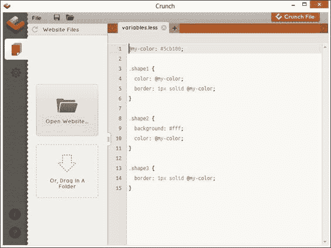

点击**Crunch File**查看编译代码的结果——它会提示你分配一个文件名，所以请使用默认名称，即与 Less 文件相同的名称，或者在这个例子中，`variables.css`：

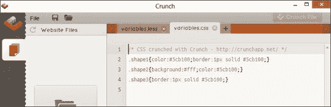

这很简单，对吧？每次我们修改我们的 Less 文件时，我们只需要保存它，然后点击**Crunch File**，文件就会自动更新。让我们通过更改分配给`@my-color`变量的颜色值来测试这一点。

在`variable.less`文件中，按照以下方式修改`@my-color`所显示的值：

```js
@my-color: #3f004b;
```

保存文件后，点击**Crunch File**——`variable.css`标签会短暂闪烁，表示已更新。点击它以查看更改：

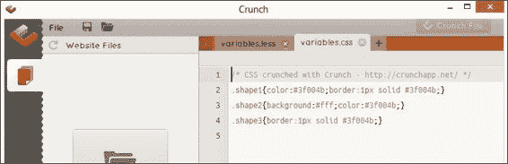

如我们所见，Crunch!已成功更新了我们的代码更改——如果存在错误，它会在代码底部显示错误消息，例如这个，以指示代码末尾缺少`}`：

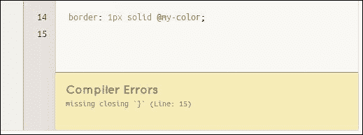

在这个例子中添加缺失的`}`将修复问题，并允许 Crunch!重新编译我们的代码而不会出现任何问题。现在让我们改变策略，专注于执行相同的操作，但这次使用命令行。

# 使用命令行编译器

到目前为止，我们使用独立编辑器来编译（或者 Crunch!——这是个双关语！）我们的代码。它已经成功地为我们生成了一些有效的 CSS，如果需要的话，可以在正常的 HTML 页面中使用。这很好，但可能不是每个人的首选选择！

我们不必使用独立编译器，而是可以通过使用命令行来实现相同的结果。虽然这有点手动，但它确实给了我们机会将编译过程作为可以直接从大多数文本编辑器中运行的命令挂钩。

## 使用命令行编译 Less 文件

通过命令行编译 Less 文件的过程非常简单。首先，打开命令提示符，并将位置更改为我们之前创建的项目文件夹，即`lessjs`文件夹。在命令提示符中，输入以下命令，然后按*Enter*：

```js
lessc variables.less variables.css
```

基本编译所需的就是这些。现在 Less 将编译`variables.less`文件，并将结果保存为同一文件夹中的`variables.css`。这意味着你可以将这个会话在后台保持开启状态，每次想要对代码进行更改时，都可以重新运行该命令。

### 注意

当使用命令行中的`lessc`时，Less 提供了一些其他选项。要查看它们，请在命令提示符中输入`lessc`以显示完整列表。

# 监视监视模式中的更改

在这个练习中，我们将查看一个简单但实用的功能，称为监视模式。这允许我们在开发过程中对任何 Less 文件进行更改，并且无需从服务器强制完全重新加载页面即可重新加载页面。值得注意的是，监视模式可以与本地文件系统或 Web 服务器一起使用——两者都将产生相同的效果。为了本书的目的，我们将假设使用后者；在这种情况下，我们将使用 WampServer，这是我们之前在第二章中介绍的，*构建 Less 开发工具包*。如果你是 Mac 用户，则可以使用 MAMP；Linux 用户在其发行版中将有可用的本地 Web 服务器选项。

我们将通过创建一个包含用户名和密码字段的简单表单来测试它。

假设我们已经安装了 WAMP，或者有可用的网络空间，首先打开你的文本编辑器，然后添加以下代码：

```js
<!DOCType html>
<html>
  <head>
    <meta charset="UTF-8">
    <title>Adding watch support</title>
    <link rel="stylesheet/less" href="include.less">
    <script src="img/less.min.js"></script>
    <script type="text/javascript">
      less.env = "development";
      less.watch();
    </script>
  </head>
<body>
  <form action="demo_form.aspx">
    Name: <input type="text" class="input" />
    Password: <input type="password" class="input" />
    <input type="submit" id="submitfrm" value="This is a button" />
  </form>
</body>
</html>
```

### 注意

注意到已经添加了`less.env = "development"`。这会将 Less 设置为开发模式——这是在这个模式下我们可以设置的几个选项之一。更多详情，值得阅读 Less 网站上的文档[`lesscss.org/usage/#using-less-in-the-browser`](http://lesscss.org/usage/#using-less-in-the-browser)。

将其保存为`www`文件夹中的`watchr.html`，默认情况下应该是`c:\wamp\www`。接下来，在另一个文件中，添加以下内容并保存为`include.less`：

```js
@color-button: #556644;
#submitfrm {
    color: #fff;
    background: @color-button;
    border: 1px solid @color-button - #222;
    padding: 5px 12px;
}
```

启动你的浏览器，然后在浏览器中输入适当的 URL 导航到它；如果一切顺利，你将看到如下内容：

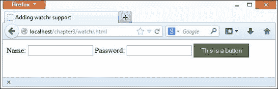

保持浏览器窗口打开。现在，让我们对我们的 Less 代码进行更改；在 Less 文件中，将`@color-button`的值更改为`#334466`：

```js
@color-button: #334466;
#submitfrm {
    color: #fff;
    background: @color-button;
    border: 1px solid @color-button - #222;
    padding: 5px 12px;
}
```

将更改保存到 Less 文件中。几分钟后，我们将看到我们的按钮颜色从深绿色变为深蓝色，如下截图所示：

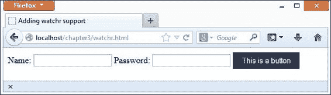

当使用 Less 时，编译后的样式存储在浏览器的**localStorage**区域，并且它们将保留在那里，直到**localStorage**区域被清除。我们可以通过按*F12*，然后点击**DOM**，并滚动到**localStorage**条目来查看这一点——假设已经安装了 Firebug：

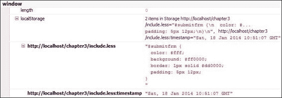

要查看任何更改，我们必须从服务器强制刷新——使用监视功能将浏览器强制进入开发模式，这会阻止浏览器缓存生成的 CSS 文件。

值得注意的是，还有其他方法可以用来监视更改，例如使用 Grunt 或 Gulp。两个很好的例子包括在[`github.com/kevinburke/observr`](https://github.com/kevinburke/observr)可用的 observr，或者可以从[`github.com/pixelass/lessc-bash`](https://github.com/pixelass/lessc-bash)下载的 lessc-bash。我们在第二章中介绍了如何使用 Grunt 监视更改，*构建 Less 开发工具包*。

# 摘要

我们现在可以开始更详细地探索 Less 语法了。在我们这样做之前，让我们回顾一下本章学到的内容。

我们从如何下载和安装 Less 开始；我们首先介绍了如何将其作为独立库下载，然后再将其整合到我们的页面中。我们还简要地看了看如何使用 CDN 链接而不是下载代码；虽然这不建议用于开发目的，但它对于生产站点来说仍然是有价值的，如果访问者已经在一个之前的网站上访问过库，浏览器可以缓存该库。

接着，我们探讨了如何在 Node 平台上进行 Less 的服务器端安装。我们看到了使用单个命令编译 Less 文件是多么简单，并且我们可以根据需要多次执行此命令。我们讨论了如何通过观察客户端使用 Less 的风险来安装 Less，以及由于对托管服务器提出的额外要求，这实际上应该仅限于开发环境中的使用。

然后，我们改变了焦点，对 Less 语法的几个关键部分进行了快速浏览，作为在后续章节中更详细探索的先导。在切换到编译一些基本代码以查看编译过程如何工作之前，我们介绍了 Less 中变量的使用、混入、嵌套、操作和扩展。我们检查了如何使用独立的编译器或命令行执行相同的操作。我们以在 Less 中使用`watch()`函数结束本章——这可以设置为监视 Less 文件中的任何更改，并强制浏览器自动刷新页面，无需手动干预。

我们现在已经介绍了如何安装 Less 以及如何在我们的代码中启动它。接下来，让我们继续前进，开始探索 Less 的功能，从混入（mixins）、函数和变量开始。
