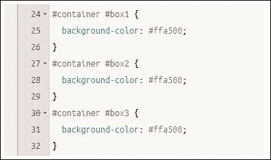

# 第五章. Less 中的继承、覆盖和嵌套

到目前为止，在我们的 Less 之旅中，我们已经看到了如何开始减少需要编写的代码；现在是时候提升一个层次，开始探讨 Less 中的一些更高级的概念。

让我先问你一个问题：关于编写样式时必须多次重复相同选择器的事情，有什么让你感到烦恼？比如在设计使用无序列表元素的菜单系统时？希望答案是重复的样式。在本章中，我们将探讨如何分组样式以避免在代码中重复选择器。我们还将介绍如何继承样式，这可以显著减少重复；我还会提供一些使用这些技术和其他技术的提示和技巧，以帮助减少代码膨胀。

足够聊天了，让我们看看本章我们将涵盖哪些内容：

+   在 Less 中嵌套样式

+   继承样式

+   Less 中的命名空间

+   Less 中样式的范围

+   避免代码膨胀的建议和技巧

+   在 Less 中导入样式表

好奇吗？你在等什么？让我们开始吧...

# 在 Less 中嵌套样式

如果你花时间编写样式，我敢肯定你经常会编写一些在其他地方相同样式表中已经存在的重复样式；如果你正在为网站的元素创建样式，例如使用 `<ul>` 或 `<li>` 的菜单系统，这种情况尤其如此。

它可能会因为重复的样式而增加大量的额外代码膨胀。幸运的是，我们可以通过使用 Less 嵌套样式的功能来减少这一点。让我们通过创建在线名片来查看这个原则是如何工作的。

对于这个练习，我们需要一些东西。首先，我们需要在卡片上放置一张图片；在这个例子中，我们将使用头像，因为这个名片将在网站上显示。为此目的有数千个图标可用；我将假设你已经选择了一个合适的图标并将其保存为 `avatar.png`。我使用了来自 [`www.iconarchive.com/show/vista-people-icons-by-icons-land/Office-Client-Male-Light-icon.html`](http://www.iconarchive.com/show/vista-people-icons-by-icons-land/Office-Client-Male-Light-icon.html) 的 Office Client Male Light 图标。

接下来是电话、电子邮件和象征性图标；这些图标来自 [`www.fontsquirrel.com/fonts/modern-pictograms`](http://www.fontsquirrel.com/fonts/modern-pictograms) 上的 Modern Pictograms 字体家族。您需要将其转换为可以嵌入网页的格式；这可以通过 [`www.convertfonts.com`](http://www.convertfonts.com) 上的免费服务来完成。

最后，在我们开始创建我们的卡片之前，我们需要一些社交媒体图标。我选择了 Chris Spooner 的手绘图标，可以从[`blog.spoongraphics.co.uk/freebies/hand-drawn-sketchy-icons-of-your-favorite-social-sites`](http://blog.spoongraphics.co.uk/freebies/hand-drawn-sketchy-icons-of-your-favorite-social-sites)下载；如果你决定使用其他图标，请相应地更改代码。

## 创建名片

首先，打开这本书附带的代码包中的`nesting.html`副本。这包含我们创建基本 vCard 所需的标记。

接下来，我们需要添加一些样式使其看起来更美观。涉及几种样式，所以请获取这本书附带的代码下载文件的副本，并从存档中提取`nesting.less`的副本。

将文件保存为`nesting.html`。如果你在浏览器中预览结果，你会看到以下截图类似的内容：


## 详细检查过程

如果我们查看`nesting.less`，你会注意到许多使用类似格式的样式。这些例子都是嵌套主题的变体，其中我们不是添加单个子选择器（从而重复代码），而是可以将相似的子选择器组合在一起并实现一个父选择器。

我们的第一个例子使用了标准的`a`选择器，我们将`:focus`、`:hover`和`:active`的样式规则组合在一起：

```js
a {
  &:focus { outline: thin dotted; }
  &:hover { outline: 0 none; }
  &:active { outline: 0 none; }
}
```

编译后会产生以下代码：

```js
a:focus { outline: thin dotted; }
a:hover { outline: 0 none; }
a:active { outline: 0 none; }
```

### 注意

在这个例子中，我们只使用了`a`来展示这个过程是如何工作的——实际上，这是一个你不会从如此简短的选择器名称中获得任何好处的例子；好处只有在使用较长的名称时才会显现。

我们的第二个例子稍微复杂一些——在这里，我们包括了一些标准的 CSS 样式，并混合了针对两个更深层次的额外子选择器的样式规则：

```js
.social {
  background-color: #e6e6e6; padding: 10px; width: 100%;
  ul { text-align: right; }
  ul li { display: inline-block; height: 48px; width: 48px; }
  ul li a { display: inline-block; height: 100%; overflow: hidden; text-decoration: none; text-indent: 100%; white-space: nowrap; width: 100%; }
}
```

嵌套的关键在于仔细检查任何类或选择器，如果有重复；让我们看看在浏览器中将要显示的 CSS 样式，针对我们刚刚讨论的`.social`代码块：

```js
.social { background-color: #e6e6e6; padding: 10px; width: 100%; }
.social ul { text-align: right; }
.social ul li { display: inline-block; height: 48px; width: 48px; }
.social ul li a { display: inline-block; height: 100%; overflow: hidden; text-decoration: none; text-indent: 100%; white-space: nowrap; width: 100%; }
```

为了确定一个样式是否可以转换为使用嵌套，我们可以查看类似的选择器；嵌套只有在选择器使用公共 ID 时才会起作用。在这个例子中，`.social`是公共选择器，因此它在我们的 Less 示例中被使用。

一个需要注意的关键点——乍一看，似乎可以使用`.social ul`代替。这会起作用，但只能针对两个额外的子选择器（`.social ul li`和`.social ul li a`）。如果我们从这个级别开始，父`.social`类将不能被包含，因为我们只能自上而下考虑哪些样式要嵌套，而不能自下而上。

### 注意

有一个一般规则是，用作分组 ID 的选择器或类不应超过两级深度；任何更多都被认为是坏习惯，并且应该真正重新审视！

让我们改变焦点，看看 Less 的另一个功能，即使用`extend`选项继承和覆盖样式。

# 使用`extend`继承和覆盖样式

到目前为止，我们使用 mixin 来帮助减少编写额外代码的需求，因为我们可以从我们的 Less 语句中轻松调用这些代码块，以产生期望的效果。

不幸的是，这仍然有其自身的缺点。假设我们创建了两个规则，这两个规则都调用相同的 mixin，并产生相同的结果（除了规则名称），那么 Less 将它们解释为两个不同的代码块，尽管它们都对两个不同的对象执行相同的样式。如果我们能合并这两个规则，使得只有一个代码块，但可以由任一规则调用，那会怎样呢？

嗯，我们可以使用 Less 中的`extend`函数来实现。这是一个真正强大的函数，为了这个目的而引入的。让我们看看这个概念，看看它是如何工作的。

假设你有一个 mixin，比如这个简单的：

```js
.stuff { color: red; }
.foo { .stuff; }
.bar { .stuff; }
```

如果我们使用类似 Crunch!的工具来编译它，那么它将显示如下：

```js
.stuff { color: red; }
.foo { color: red; }
.bar { color: red; }
```

这工作得非常完美，但显示了上述的重复样式。为了消除这种重复，我们可以使用`extend`关键字并重新编写代码如下：

```js
.foo { color: red; }
.bar { &:extend(.foo); }
```

你可以立即看到输出的差异。我们不再像以前那样将每个规则拆分成两行，而是将规则合并到一个块中，但可以由任一类调用：

```js
.foo, .bar { color: red; }
```

### 注意

值得阅读 Less 主站上关于`extend`主题的文档——在使用代码中的函数时，你需要注意一些有趣的功能。你可以在[`lesscss.org/features/#extend-feature`](http://lesscss.org/features/#extend-feature)查看文档。

选择是否使用`extend`或 mixin 的规则是选择需要最少最终输出（或最适合你的）的技术。

## 使用`extend`创建信息提示

为了了解`extend`在实际中的工作方式，让我们来看一个小练习，创建一些包含消息以提醒用户操作结果的想象中的对话框。

在我们开始我们的示例之前，我们首先需要下载一些适合用于对话框的图标。我选择使用 Andy Gongea 创建的免费图标；为了练习的目的，我们将假设你正在使用这些图标。访问[`www.graphicrating.com/2012/06/14/koloria-free-icons-set/`](http://www.graphicrating.com/2012/06/14/koloria-free-icons-set/)下载图标。你需要提取`info.png`、`error.png`、`warning.png`、`help.png`和`valid.png`图像，并将它们放入项目文件夹根目录下的`img`文件夹中。

让我们开始编写代码！打开我们在第三章中创建的`project.html`副本，即*使用 Less 入门*，然后修改以下代码中的`<head>`部分：

```js
  <title>Demo: Extending</title>
  <link rel="stylesheet/less" href="css/extend.less">
  <script src="img/less.min.js"></script>
```

接下来，移除`<body>`标签中的现有标记，并用以下内容替换：

```js
  <div class="info">Info message</div>
  <div class="success">Successful operation message</div>
  <div class="warning">Warning message</div>
  <div class="error">Error message</div>
  <div class="validation">
    <li>First name is a required field</li>
    <li>Last name is a required field</li>
    <li>Email address has been typed incorrectly</li>
    <li>Preferred language has not been selected</li>
  </div>
```

将其保存为`extend.html`。仅就其本身而言，如果我们现在预览它，它不会赢得任何风格奖项，所以让我们通过添加一些来修复它！在一个新文件中，添加以下样式：

```js
body{ font-family: Arial, Helvetica, sans-serif; font-size: 13px; }
.demo { font-style: italic; }

.box { border: 1px solid #000; margin: 10px 0px; padding:15px 10px 15px 50px; background-repeat: no-repeat;
  background-position: 10px center; width: 300px; padding-top: 15px; }

.info:extend(.box) { color: #00529B; background-color: #BDE5F8; background-image: url('../img/info.png'); }
.success:extend(.box) { color: #4F8A10; background-color: #DFF2BF; background-image:url('../img/valid.png'); }
.warning:extend(.box) { color: #9F6000; background-color: #FEEFB3; background-image: url('../img/warning.png'); }
.error:extend(.box) { color: #D8000C; background-color: #FFBABA; background-image: url('../img/error.png'); }
.validation:extend(.box) { width: 280px; padding-left: 70px; color: #D63301; background-color: #FFCCBA; background-image: url('../img/error.png'); }
```

将文件保存为`css`子文件夹中的`extend.less`；如果你已经配置了 Sublime Text 在保存时编译 Less 文件，那么它也会生成编译后的 CSS 等价文件。我们可以使用这个文件来比较文件中显示的结果和浏览器中显示的结果，当我们使用 DOM Inspector 如 Firebug 时。如果我们现在在浏览器中预览文件，我们应该看到以下截图：


虽然这是一个相对简单的例子，但花点时间研究代码，看看`extend`函数是如何工作的，是值得的。

如果你使用 mixin，你经常会发现你必须在 mixin 中包含一个基类（在我们之前的例子中是`.stuff`），这个基类包含你需要在调用类中继承的样式（在这个例子中是`.foo`和`.bar`）。

这将完美地工作，但会像我们之前看到的那样重复代码；相反，我们使用了`extend`函数将现有的`.box`类应用到我们用于对话框的每个类中，即`.info`、`.success`、`.warning`、`.error`和`.validation`。

由于`extend`是一个 Less 伪类，`extend`函数的所有痕迹都将被删除，留下的将是编译后的样式。使用此函数的实际好处可以在使用 Firebug 时看到；我们不会看到很多重复的样式，而会看到样式整洁地合并在一起，它们执行相同的功能，剩余的样式则保留在适当的位置操作剩余的元素。

## 使用`all`关键字进行扩展

一旦你开始在 Less 代码中使用`extend`关键字，你可能会发现你想扩展嵌套的样式。

不幸的是，`extend`只能根据`extend`请求中给出的内容匹配选择器；它并不总是能够匹配父选择器下的子选择器，除非指定了子选择器。让我们通过一个例子来看看这意味着什么。

想象一下，你有一段嵌套的 Less 代码如下：

```js
.module {
  padding: 10px;
  h3 { color: red; }
}
```

使用`extend`将产生以下结果：

```js
.news { &:extend(.module); }
```

`h3`样式将不会被扩展，而将被编译为单独的样式：

```js
.module, .news { padding: }
.module h3 { color: red; }
```

为了解决这个问题，我们可以使用下面的代码行中的`all`关键字：

```js
.news { &:extend(.module all); }
```

`all`关键字将扩展所有内容以产生所需的效果：

```js
.module, .news { padding: 10px; }
.module h3, .news h3 { color: red; }
```

其关键在于将其视为对原始选择器执行非破坏性的搜索和替换操作，以产生一个新的选择器。让我们通过修改之前的 `extend` 示例来使用 `all` 关键字来实际看看它。

首先，打开我们之前练习中创建的 `extend.html` 的副本，然后使用 `<h3>` 标签包围每个对话框文本消息，如高亮所示：

```js
  <div class="info"><h3>Info message</h3></div>
  <div class="success"><h3>Successful operation message</h3></div>
  <div class="warning"><h3>Warning message</h3></div>
  <div class="error"><h3>Error message</h3></div>
  <div class="validation">
    <h3>
      <li>First name is a required field</li>
      <li>Last name is a required field</li>
      <li>Email address has been typed incorrectly</li>
      <li>Preferred language has not been selected</li>
    </h3>
  An example using <span class="demo">extend:(...all):</span>
  <div class="rebase"><h3>Info message</h3></div>
```

将其保存为 `extendall.html`。在 `extend.less` 的副本中，我们需要将 `font-size` 规则从 `body` 移动到 `<h3>`，这样我们就可以稍后在代码中将其包含为一个嵌套规则。修改 `body` 的样式规则，然后立即在此规则下方添加一个新的 `<h3>` 规则，如下面的代码所示：

```js
body { font-family: Arial, Helvetica, sans-serif; }
h3 { font-size: 12px; }
```

在验证代码块中，添加三条高亮显示的行；这将为我们之前添加到 HTML 代码中的 `<h3>` 标签设置样式：

```js
.validation:extend(.box) { width: 280px; padding-left: 70px;
  color: #D63301; background-color: #FFCCBA; background-image: url('../img/error.png');
  h3 { font-size: 14px; }
}
```

我们现在可以利用 `all` 关键字；在 `.validation` 样式块下方立即添加以下代码：

```js
.rebase:extend(.validation all) {}
.rebase {
  color: #fff;
  background-color: #9a0074;  
  background-image: url('../img/help.png');
}
```

将文件保存为 `extendall.less`。如果我们在一个浏览器中预览结果，我们会看到新增的对话框出现在最后一个对话框下方，如下面的截图所示：


现在我们已经看到了它的实际应用，让我们花一点时间来考察它是如何工作的。

如我们所见，使用 `all` 属性与 `extend` 非常简单，但这确实意味着需要复制的样式应该尽可能接近期望的结果，以便使 `extend` 的使用变得有价值。

这并不意味着你不能添加额外的，或者实际上覆盖现有的样式，就像我们在这里所做的那样，但我们已经将它们保持在最小范围内。在这里，我们使用了 `extend all` 来复制 `.validation` 类并将其重命名为 `.rebase`；这包括对 `<h3>` 标签的额外样式，如果没有使用 `all` 标签，这些样式将不会被包含。然后我们简单地覆盖了三种样式来更改使用的图片、`background-color` 和文本 `color`，使其更加独特。

我们只是刚刚触及了使用 `extend` 可以做到的事情的表面——在我们改变焦点并转向查看命名空间之前，让我们花一点时间看看使用 `extend` 关键字的一些其他亮点：

+   `extend` 可以与伪类选择器一起使用，例如 `:hover` 或 `:active`；可以使用多个 `extend`，并使用空格分隔。然而，如果只使用一个 `extend`，那么它必须是语句的最后一部分。

+   你可以在规则集中使用 `&:extend`；这是一个将 `extend` 添加到规则集中每个选择器的快捷方式。

+   `extend` 可以与嵌套选择器一起使用；只要调用的 `extend` 可以与一个有效的 Less 规则匹配，它就会被扩展以使用新的类或选择器 ID。

+   默认情况下，`extend` 将寻找精确匹配，例如，`*.class` 和 `.class`，这两个是等价的，但在使用 `extend` 时不会被 Less 视为精确匹配。

+   如果你想要使用类型标识符（如`[title="identifier"]`）进行匹配，那么是否使用引号无关紧要；这些实际上是被忽略的。

`extend`关键字是 Less 文章中的一个非常有用的工具，但如果使用不当可能会引起问题。非常值得阅读 Less 网站上的主要文档[`lesscss.org/features/#extend-feature`](http://lesscss.org/features/#extend-feature)，以了解使用该函数的一些怪癖。

# Less 中的命名空间

随着时间的推移和你的 CSS 样式表变得越来越大，你可能会发现自己会问自己一个问题：*我能否将相似的样式分组，以便更容易找到？*

当然，你总是可以剪切和粘贴相似的风格，但这是一个手动过程，对吧？如果两周后你需要添加一个新的样式，而这个样式与 1500 行左右的样式相似，会发生什么？当然，必须有一种更好的方法来做这件事——确实有。欢迎来到 Less 中的命名空间！

Less 中的命名空间将你分组相似样式的需求颠倒过来；它将你样式的所有构成块组合在一起，然后允许你在为网站上的新元素添加样式时选择和选择要使用的样式。当然，如果我们需要，我们可以创建多个命名空间——我们唯一的实际指南是每个命名空间应包含具有共同元素的样式；一个很好的例子是按钮，你将在我们即将进行的练习中看到。

让我们从打开`project.html`的副本并修改如下代码所示的`<head>`标签开始创建这些按钮：

```js
<title>Demo: Namespaces</title>
<link rel="stylesheet/less" href="css/namespace.less">
<script src="img/less.min.js"></script>
```

接下来，移除`<body>`标签中现有的标记，并用以下代码替换：

```js
<input type="button" name="buy" value="Buy" class="redbutton">
<input type="button" name="clear" value="Pay by PayPal" class="purplebutton">
<input type="button" name="checkout" value="Pay by credit card" class="bluebutton">
```

将其保存为项目文件夹根目录下的`namespace.html`。我们需要应用一些样式，所以请继续添加以下 Less 样式到一个新文件；我们将将其分解为几个部分，一点一点地讲解，因为有几个重要的概念需要考虑：

```js
.background (@color1, @color2) {
  background: -webkit-gradient( linear, left top, left bottom, color-stop(0.05, @color1), color-stop(1, @color2) );
  background: -moz-linear-gradient( center top, @color1 5%, @color2 100% );
  background-color: @color1;
  border: 1px solid @color1;
}
```

我们在第四章中看到了类似的例子，*使用变量、混合和函数*；希望你能认出这是一个参数化混合。在这个例子中，我们使用它为每个按钮构建渐变；我们向它提供两个值，这两个值代表了渐变渐变过程中使用的颜色，如下面的代码所示：

```js
#button() {
  .base { border-radius: 6px; color: #fff; font-family: Arial;
font-size: 15px; font-weight: bold; font-style: normal;  height: 32px;  text-align: center; text-shadow: 1px 1px 0px #000; margin-left: 5px;
  &:active { position: relative; top: 1px; }
  }
```

### 注意

注意，这里使用的命名空间（如`#button()`）可以由类或选择器 ID 创建；有关已识别行为的更多详细信息，请参阅[`github.com/less/less.js/issues/1205`](https://github.com/less/less.js/issues/1205)。

接下来是我们 Less 样式中最重要的部分：命名空间样式的开头声明。它显示了我们将以哪个名称来分组我们的样式。我们使用了`()`，因为我们不希望 Less 在编译我们的代码时输出混合以及编译后的 CSS：

```js
  .red {
    .background(#cc1c28, #a01620);
    box-shadow: inset 0px 1px 0px 0px #b61924;
    &:hover { .background(#a01620, #cc1c28) }
  }

  .purple {
    .background(#800080, #9a009a);
    box-shadow: inset 0px 1px 0px 0px #670067;
    &:hover { .background(#9a009a, #800080) }
  }

  .blue {
    .background(#004771, #00578a);
    box-shadow: inset 0px 1px 0px 0px #0067a4;
    &:hover { .background(#00578a, #004771) }
  }
}
```

这三段代码将调用`.background(...)`mixin 来设置适当的渐变，具体取决于特定按钮当前设置的状态：

```js
.redbutton { #button > .base; #button > .red; }
.purplebutton { #button > .base; #button > .purple; }
.bluebutton { #button > .base; #button > .blue; }
```

这才是真正的魔法所在。在这里，我们为三个按钮设置了要使用的样式，即红色、紫色和蓝色。在每个按钮样式中，我们选择调用`#button`命名空间中的元素；如果创建了多个类似的命名空间，我们可以轻松地从每个命名空间中选择我们的样式，因为我们不仅限于使用一个命名空间。需要注意的是，当调用命名空间样式时，你必须使用我们示例中给出的格式。

好吧，理论就到这里。如果我们预览浏览器中的结果，我们应该期望看到类似以下内容：


一个简单易懂的例子，对吧？希望这能帮助你了解如何从样式分组中选择和选择你的样式，尤其是在项目使用大量类似元素和样式且可以从命名空间中受益时。

# Less 中变量的懒加载

到目前为止，我们已经介绍了一些创建和控制样式应用的技术。然而，贯穿所有这些的一个关键主题是你需要注意的：作用域。

是的，那个丑陋的词，作用域！无论我们多么努力避免它，在使用 Less 时，我们都必须允许它；否则，它可能会在最意想不到的时刻回来咬我们。让我解释一下我的意思：正如我们将在即将到来的练习中看到的那样，我们可以在整个 Less 代码中重复使用我们的 mixin 或变量。

然而，Less 必须有一种方式来知道哪个实例是最新的；因此，它总是取我们代码中包含的任何变量或 mixin 的最后一个实例。如果你不小心，这可能会导致一些奇怪的效果。让我们通过一个快速练习来看看这在实际中意味着什么。

首先，打开我们之前在第三章中创建的`project.html`副本，即*使用 Less 入门*，然后，按照以下代码修改`<head>`标签：

```js
  <meta charset="utf-8">
  <title>Demo: Scoping</title>
  <link href='http://fonts.googleapis.com/css?family=Over+the+Rainbow' rel='stylesheet' type='text/css'>
  <link rel="stylesheet/less" href="css/scope1.less">
```

接下来，删除现有的标记并替换为以下代码：

```js
  <div id ="container">
    <div id="box1">This is box 1</div>
    <div id="box2">This is box 2</div>
    <div id="box3">This is box 3</div>
  </div>
```

将其保存为`scope.html`。最后，尽管这只是一个简单的例子，我们仍然需要添加一些样式；请将以下内容添加到一个新文件中，并将其保存为`scope1.less`：

```js
@boxcolor: green;

html { font-family: 'Over the Rainbow', cursive; font-weight: bold; font-size: 20px; }
div {  width: 200px; height: 100px; padding: 3px; border-radius: 3px; float: left; position: absolute; }

#box1 { margin-left: 0; }
#box2 { margin-left: 225px; }
#box3 { margin-left: 450px; }

#container {
  @boxcolor: red;
  #box1 { background-color: @boxcolor; }
  #box2 { background-color: @boxcolor; }

  @boxcolor: orange;
  #box3 { background-color: @boxcolor; }
}
```

在我们在浏览器中预览结果之前，问问自己这个问题：你期望在每个框中看到什么颜色？

不，我没有发疯；请跟我一起看这个！如果你期望在框**1**和**2**中看到红色，在框**3**中看到橙色，那么我很抱歉让你失望：


等等——它们三个都是橙色！这是真的；这与 Less 中的作用域概念有关。

如果你曾经花过时间编程，那么你可能会知道，如果一个变量在语句之前刚刚被设置，那么它的值将如何被该语句使用。Less 以类似的方式使用变量，但有一个重要的区别：它使用该变量赋值的最后一个已知实例，以确定要显示的值。

### 注意

Less 中的变量被合并到代码中——这相当于懒加载，因为变量的最后一个定义实例是使用的，覆盖了该变量的任何先前实例。

如果我们查看代码，我们可以清楚地看到在 `box3` 之前，`@boxcolor` 的最后一个实例被设置为颜色值。由于颜色设置为橙色，这就是我们代码中将使用的值。我们可以从 Crunch! 中编译后的样式截图的摘录中清楚地看到这一点，其中 `#ffa500` 是橙色：



值得注意的是，当我们使用变量时设置的范围，就像我们在这里做的那样。很容易因为使用一个（错误地）分配的变量而陷入困境，这会产生意外的结果！

确保使用正确值的唯一安全方法是分配单独的变量。如果我们修改之前示例中的 Less 样式，我们可以看到这个结果：

```js
@boxcolor1: lightgreen;

html { font-family: 'Over the Rainbow', cursive; font-weight: bold; font-size: 20px; }
div {  width: 200px; height: 100px; padding: 3px; border-radius: 3px; float: left; position: absolute; }

#box1 { margin-left: 0; }
#box2 { margin-left: 225px; }
#box3 { margin-left: 450px; }

#container {
  @boxcolor2: red;
  #box1 { background-color: @boxcolor1; }
  #box2 { background-color: @boxcolor2; }

  @boxcolor3: orange;
  #box3 { background-color: @boxcolor3; }
}
```

将 Less 文件重新保存为 `scope2.less`；别忘了更改 `scope.html` 中的标记！如果我们预览浏览器中的结果，我们可以清楚地看到它所带来的差异，其中使用了单独的变量：


### 注意

在整个演示过程中，我们使用了 `box1`、`box2` 和 `box3` 作为选择器 ID——值得注意的是，这些不是语义名称；因此，它们不应该在生产环境中使用。由于我们只在演示环境中工作，以说明一个概念，因此使用这些名称的问题较小。

现在我们已经看到了使用单独变量的结果，我们也可以通过查看 Crunch! 的这个截图中的编译后的 CSS 来看到差异：


你注意到了差异吗？希望你能看到在使用变量时多么关键地需要小心，因为它们的使用范围如果不小心使用可能会产生一些奇怪的效果！让我们继续前进，因为我们需要查看一些我们已经使用但尚未深入研究的功能，即导入 Less 中的样式表。

### 小贴士

**过度使用变量**

要为网站中使用的颜色等值添加大量变量是非常容易的。这并不总是明智的做法；你应该考虑设置一个核心数量的变量，然后使用函数来计算应该使用的值。

# 将样式表导入 Less

呼吁！我们几乎完成了。我们确实在本章中涵盖了大量的内容！在我们结束本章并给出一些避免代码膨胀的提示之前，我们应该花点时间考虑一个有用的功能，我们虽然使用了它，但并没有详细探讨——这就是使用导入来管理我们的 Less 样式表。

在 Less 中导入是一个简单但有用的技巧，尤其是在管理大型样式表时。我们可以开始构建代码库，然后直接将其导入到任何未来的项目中。

这使得管理较小的文件变得容易得多，因为我们可以构建一个主文件，将每个子文件导入到一个主文件中；Less 只会编译直接从我们的主代码中引用的样式。例如，如果你的代码库文件超过 2,500 行，但只有 10 行的 mixin 被使用，那么 Less 只会将这 10 行包含在最终的编译结果中。

使用导入选项非常简单；你只需要在你的 Less 代码中添加以下语句即可：

```js
@import (XXXXXXX) "foo.less";
```

这里 `XXXXXXX` 是以下任何一种选项之一：

| 选项： | 允许我们： |
| --- | --- |
| `reference` | 这使用 Less 文件，但不会输出它，除非在代码中引用。 |
| `inline` | 这会将源文件包含在输出中，但不会对其进行处理，如果你需要导入不兼容 Less 的文件，但仍然需要将它们包含在编译的 CSS 文件中，这很有用。 |
| `less` | 这会将文件视为 Less 文件，无论文件扩展名是什么。如果你需要所有 Less 文件都具有 `.css` 扩展名，但应该被视为 Less 文件而不是纯 CSS，那么这是理想的。 |
| `css` | 这会将文件视为 CSS 文件，无论文件扩展名是什么。 |
| `once` | 这只会包含该文件一次（这是默认行为）；对于该文件的任何后续导入请求都将被忽略。 |
| `multiple` | 这会将相同的 Less 文件多次包含。这与 Less 的默认行为相反。 |

你可以从 Less 主站点了解更多关于各种选项的信息，网址是 [`lesscss.org/features/#import-options`](http://lesscss.org/features/#import-options)。

好的，让我们通过查看一些避免代码膨胀的重要提示和技巧来结束这一章。你所看到的一些内容来自于我们在本章中探索的功能，但花点时间总结一下到目前为止我们在书中涵盖的一些关键点是有用的。

# 避免代码膨胀

在设计网站时，每个设计师都应该非常重视的一个关键目标是确保他们尽可能避免代码膨胀，以便他们的最终作品能够良好运行并吸引观众。

为了帮助做到这一点，我们可以使用一些技巧来帮助减少代码膨胀。到目前为止，我们已经在本书中使用了一些，但现在似乎是一个回顾和巩固它们到一个有用的列表的好时机，你可以将其用于未来的项目：

+   旨在使用嵌套来创建更清晰的结构——这意味着你可以避免重新输入重复的选择器（例如在列表或菜单中使用`<ul>`），并且可以将代码组织得井井有条，因为相关项目被分组在一起。

+   创建变量以实现更快的维护——这些变量在其他编程语言（如 C#）中工作方式非常相似。我们可以在代码开始时设置一个变量的一个实例，然后在我们的整个代码中引用它；Less 会自动为你更新每个实例。但是要注意你创建了多少个变量，因为每个都需要宝贵的资源；更好的做法是创建一个核心组，并使用运算符动态计算出新的值。这样做的好处是，即使原始变量随后被更改，这些新值仍然可以继续工作。

+   使用 mixin 来创建我们可以在我们整个代码中引用的整个类。在大型网站上，这可以显著减少需要编写的代码量。如果你已经在使用 mixin，那么检查你的代码，看看它们是否不能被参数化；这增加了它们的灵活性，并允许你删除冗余的 mixin，因为它们可以通过调整其他 mixin 来提供。

+   采用迭代方法来开发你的 CSS，尤其是在使用 mixin 时。如果你使用与外部 Less 库中引入的 mixin 相似的 mixin，那么尝试设计出差异，这样你就可以移除自己的...

+   使用命名空间来选择和选择 mixin。这有助于将适用于类似元素（如按钮）的常见样式规则分组在一起；然后你可以选择和选择要使用的元素。尽量将每个命名空间中使用的选择器元素数量保持在最低限度；没有硬性规定，但一个好的经验法则是以下代码：

    ```js
      .redbutton {
        #base > .button
        #base > .redcolor
      }
    ```

如果你的代码在每个命名空间中使用多个选择器元素，那么你的代码可能不像它应该的那样高效...！

+   如果你正在使用命名空间，那么要注意你的 CSS 特定性，否则冲突的结果可能是嵌套太深或过度使用`!important`属性的征兆。如果你发现这种情况发生，那么你可能需要将你的命名空间分解成更小的组，这会使用更少的嵌套级别。

+   考虑使用类继承而不是选择器继承。如果你正在创建一个 mixin，稍后你会在你的选择器类中引用它，你可能发现你可以在 HTML 中简单地使用类继承。所以，作为一个例子，而不是在你的 Less 文件中使用以下内容：

    ```js
    .gradientBlack { ... }

    h3 { .gradientBlack; ... }
    .darkBox { .gradientBlack; ... }
    td.dark { .gradientBlack; ... }
    ```

    我们可以通过在样式表中只定义一次`.gradientBlack`来消除其重复使用，然后在代码中直接引用它：

    ```js
    <h3 class="gradientBlack"></h3>
    <div class="darkBox gradientBlack></div>
    <td class="dark gradientBlack"></td>
    ```

+   使用`extend`而不是 mixin 来减少代码膨胀；`extend`足够聪明，可以合并使用相同规则的样式，正如我们在本章前面所看到的，而不是简单地为每个类似样式复制代码块。

+   如果您必须继续使用 mixin，那么请使用括号来隐藏 mixin 代码，这样只有调用代码会被编译，而额外的 mixin 则不会。

+   如果您有许多需要供应商前缀的 mixin，您可以使用此 mixin 通过简单地传递需要添加前缀的属性以及相应的值来处理它们，如下面的代码所示：

    ```js
    .vendorize(@property, @value) {
      -webkit-@{property}: @value;
      -moz-@{property}: @value;
      -ms-@{property}: @value;
      -o-@{property}: @value;
      @{property}: @value;
    }
    ```

注意，这并不是所有需要供应商前缀的属性所必需的；如果 CSS3 属性只需要一个或两个供应商前缀，您可能会发现创建一个简单的 mixin 来单独处理这些前缀更容易。

### 注意

值得注意的是，一些供应商前缀使用与我们所用的示例完全不同的格式——这里的 mixin 不适用于所有属性值，例如渐变，因此需要单独的 mixin。

希望其中有一些有用的技巧，您可以在项目中使用。所有这一切的关键是使用正确的函数组合，例如使用`extends`而不是 mixin（或两者的混合），这有助于将您的代码保持最小并消除膨胀。

# 摘要

在本章中，我们介绍了一些概念，这些概念可以帮助进一步减少您需要编写的代码量——在进入下一章中 Less 的更多实际应用领域之前，让我们花点时间回顾一下。

我们从查看如何在 Less 中分组或嵌套样式开始；我们看到了这如何有助于视觉上排列样式，使其更容易管理，同时消除在引用子选择器（如构建菜单系统时使用的选择器）时重复样式的需要。

然后，我们转向 extend 函数，用于继承或覆盖现有样式，并介绍了它如何以与 mixin 类似的方式工作，同时合并相同的样式，以消除为相同样式编写单独代码块的需要。我们还探讨了使用`all`关键字来帮助继承所有样式，尤其是那些单独使用 extend 无法访问的样式。

然后，我们介绍了如何使用命名空间来分组样式和引用一个或多个元素；这允许我们将常见元素视觉上分组，同时挑选和选择要使用的样式。一旦选择，我们就看到了 Less 如何将它们编译成有效的 CSS。

最后但同样重要的是，我们快速浏览了在 Less 中设置正确的作用域，以确保我们的变量具有正确的值。我们从示例中看到了如何容易地出错以及正确使用代码中的作用域的重要性。然后，我们结束了关于将 Less 文件导入 CSS 的查看，并基于我们在书中迄今为止看到的 Less 的一些关键区域提供了一些关于消除代码膨胀的提示和技巧。

在下一章中，我们将从理论转向，探讨将基于 CSS 的网站迁移到使用 Less 的一些实际方面。
