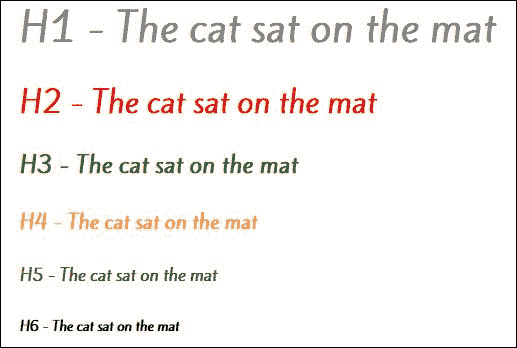
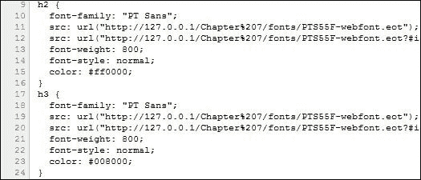
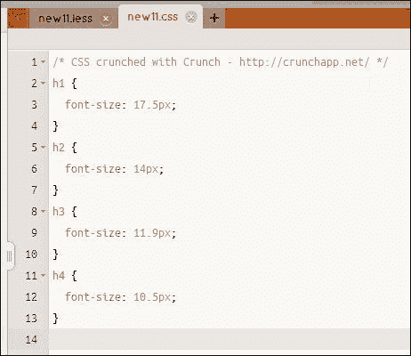
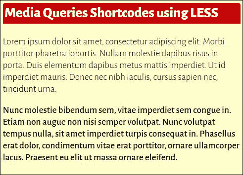
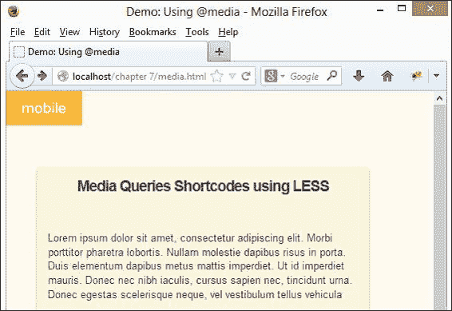
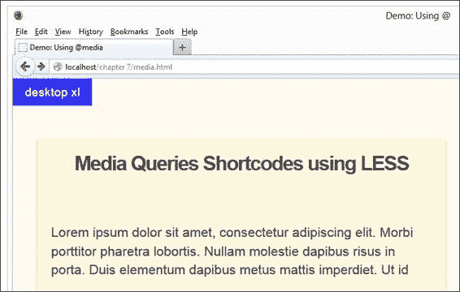

# 第七章。使用 Less 操作字体

我们探讨了如何使用 Less 的各种元素，创建了一个基本的页面来使用 Less，并介绍了如何将网站迁移到使用 Less……那么接下来是什么？

嗯，是的，处理文本或更具体地说，字体！

在任何网站上，内容都是王——实现正确影响的一部分是仔细选择应在您的网站上使用的字体。如果我们正在设计一个新闻网站，我们不会使用基于脚本的字体，因为文本应该是清晰易读的。然而，对于代表裁缝店出售的连衣裙的流动线条，脚本字体将是完美的。

这一切都关乎选择正确的样式；Less 完美地帮助我们管理页面中决定使用的任何字体的样式、颜色和大小。在本章中，您将看到如何使用一些简单的原则，让 Less 轻松管理字体。我们将涵盖以下主题：

+   创建字体混合

+   使用变量动态确定大小

+   使用预构建库

+   支持 Less 中的`@media`和`@font-face`

你准备好享受字体带来的乐趣了吗？让我们开始吧！

# 创建简单的字体混合

处理字体的关键是先从简单开始，然后逐步构建——没有比创建一个简单的混合来管理如字体名称这样的属性更好的起点了。让我们创建一个简单的例子，看看它是如何发挥作用的；以下是我们的混合将生成的内容：



好吧，让我们开始创建我们的混合；我们将从为我们的演示准备标记开始：

1.  打开我们在第三章中创建的`project.html`文件副本，然后按照以下方式修改它：

    ```js
     <title>Demo: Creating simple font mixins</title>
     <link href='http://fonts.googleapis.com/css?family=Kite+One' rel='stylesheet' type='text/css'>
     <link rel="stylesheet/less" href="css/basicfonts.less">
        <script src="img/less.min.js"></script>
    ```

1.  接下来，将以下标记添加到`<body>`部分：

    ```js
        <h1>H1 - The cat sat on the mat</h1>
        <h2>H2 - The cat sat on the mat</h2>
        <h3>H3 - The cat sat on the mat</h3>
        <h4>H4 - The cat sat on the mat</h4>
        <h5>H5 - The cat sat on the mat</h5>
        <h6>H6 - The cat sat on the mat</h6>
    ```

1.  将文件保存为`basicfonts.html`。在另一个文件中，添加以下 Less 样式：

    ```js
    .fontfamily() { font-family: 'Kite One', Arial, sans-serif; }

    h1 { .fontfamily; color: #808080; }
    h2 { .fontfamily; color: #ff0000; }
    h3 { .fontfamily; color: #008000; }
    h4 { .fontfamily; color: #ffa500; }
    h5 { .fontfamily; color: #800080; }
    h6 { .fontfamily; color: #000000; }
    ```

1.  将其保存为`basicfonts.less`。如果您在浏览器中预览结果，您将看到六个语句以递减的字体大小出现。

那么，让我们花点时间考虑一下这里发生了什么：我们创建了一个简单的混合，将`.fontfamily`替换为`'Kite One', Arial, sans-serif;`作为页面语句的字体族。一旦 Less 文件被编译，每个`H`样式都将使用 Kite One 作为基本字体（以各种大小），如果 Kite One 不可用，则回退到使用 Arial 或 sans-serif。

## 扩展混合

在前面的例子中，我们可以在这里停止——毕竟，我们创建的混合工作得很好。然而，这并不是我们能做的最好的；如果我们在整个代码中创建类似的混合，那么如果字体名称需要更改，确保所有混合都更新将很快变得非常困难。

相反，我们可以进行一个简单的更改并使用变量名称。为了了解这意味着什么，打开`basicfonts.less`并在开头添加这两行：

```js
@font-family-sans-serif: "Helvetica Neue", Helvetica, Arial, sans-serif;
.fontfamily() { font-family:  @font-family-sans-serif }
h1 { .fontfamily; color: #808080; }
```

你可能会问，为什么要进行这种改动？答案很简单：这减少了代码需要更新的实例数量。如果你更改了作为`@font-family-sans-serif`变量一部分引用的字体，那么 Less 会自动处理代码的更新——这意味着又少了一项工作要做！在这里，我们只需要更改一个实例；如果我们的代码中有许多实例，那么在编译我们的代码时，Less 会自动更新它们。

让我们继续前进，把注意力转向更改我们使用的字体大小——毕竟，如果所有东西都是同一大小，那就太无聊了，对吧？

# 使用 Less 中的@font-face

在网页中使用字体的一个缺点是，它们必须存在于你的最终用户个人电脑或笔记本电脑上。自然地，随着市场上现在可用的 PC、笔记本电脑和移动设备的混合，几乎不可能保证字体存在！

我说不可能；我们可以在 PC 或笔记本电脑上使用一些字体，例如 Arial、Times New Roman 或 Verdana；它们不是坏字体，但它们被过度使用，并不特别。当然，我们可以使用外部服务，例如 Google Fonts——就像我们在本章早些时候的*创建简单的字体混合*部分所做的那样。

然而，我们可以通过使用`@font-face`将任何字体嵌入到我们的页面中做得更好。我说的是任何字体，但该字体的许可证必须允许在页面中嵌入。幸运的是，如果我们使用像 Font Squirrel（我们将在下一个练习中使用）这样的网站，我们可以在选择字体时轻松检查并消除任何不符合这一标准的字体。

谈话到此为止；让我们把注意力转向使用`@font-face`，这样我们就可以看到它是如何工作的。我们将在一个非常简单的演示中使用它；虽然它可能不会展示很多，但它完美地说明了如何使用 Less 与`@font-face`一起使用。

## 下载字体文件

在我们开始编写代码之前，我们需要下载一个合适的字体——毕竟，使用 Arial 或 Times New Roman 这样的字体无法使演示公正！请执行以下步骤：

1.  对于这个演示，我们将从 Font Squirrel 网站（[`www.fontsquirrel.com`](http://www.fontsquirrel.com)）使用一个字体。让我们首先浏览到 Font Squirrel 网站，下载 PT Sans 字体，我们将在我们的演示中使用它。我们可以从[`www.fontsquirrel.com/fonts/PT-Sans`](http://www.fontsquirrel.com/fonts/PT-Sans)下载它。在这里，我们还可以检查许可证的详细信息，并查看屏幕上显示的字体的样本。

1.  点击**Webfont Kit**标签，然后点击**Download @Font-Face Kit**按钮下载字体；将压缩归档保存到项目文件夹中，命名为`PT-Sans-fontfacekit.zip`。

1.  现在，打开`ptsans_regular_macroman`文件夹，从中提取四个 Webfont 文件，并将它们放置在我们项目文件夹中的`fonts`子文件夹中。

我们将在本章后面的*处理不同权重*部分重新访问这个字体。

## 将字体嵌入到我们的演示中

好的，现在我们已经有了字体文件，让我们开始编写代码：

1.  打开你选择的编辑器——我假设这个练习的目的使用的是 Sublime Text。

1.  打开我们在本书开头创建的`projects.html`副本，然后按以下方式修改它：

    ```js
        <meta charset="utf-8">

    <title>Demo: Using @font-face</title>
     <link rel="stylesheet/less" href="css/fontface.less">
        <script src="img/less.min.js"></script>
    ```

1.  在`<body>`部分添加以下标记：

    ```js
        <h1>H1 - The cat sat on the mat</h1>
        <h2>H2 - The cat sat on the mat</h2>
        <h3>H3 - The cat sat on the mat</h3>
        <h4>H4 - The cat sat on the mat</h4>
        <h5>H5 - The cat sat on the mat</h5>
        <h6>H6 - The cat sat on the mat</h6>
    ```

1.  将其保存为`fontface.html`。正如我们清楚地看到的，这是一个非常简单的演示——足以展示如何使用`@font-face`——它从未打算变得复杂！没有所有重要的样式，它就不完整；所以，请继续添加以下内容到一个新文件，并将其保存为`fontface.less`：

    ```js
    .font-face(@family, @filename: @family) {
      font-family: "@{family}";

      @font-face {
        font-family: "@{family}";
        @file: "../fonts/@{filename}";
        src: url("@{file}.eot");
        src: url("@{file}.eot?#iefix") format("eot"),
             url("@{file}.woff") format("woff"),
             url("@{file}.ttf") format("truetype"),
             url("@{file}.svg#webfont") format("svg");
      }
    }

    @name: PTS55F-webfont;
    @family: "PT Sans";

    h1 { .font-face(@family, @name); color: #808080; }
    h2 { .font-face(@family, @name); color: #ff0000; }
    h3 { .font-face(@family, @name); color: #008000; }
    h4 { .font-face(@family, @name); color: #ffa500; }
    h5 { .font-face(@family, @name); color: #800080; }
    h6 { .font-face(@family, @name); color: #000000; }
    ```

1.  如果你在浏览器中预览结果，你可以期待看到类似以下截图的内容：

这是一种简单的方法来展示如何使用 Less 中的`@font-face`；在这里，我们使用 PT Sans 字体显示了一个简单的句子，并为每个字体大小使用了不同的颜色。在每次调用`.font-face`混合时，我们传递字体名称和要使用的颜色；混合根据所使用的浏览器选择最合适的字体格式：

| 字体格式 | 支持该格式的浏览器 |
| --- | --- |
| `TTF` | 这在大多数浏览器中工作，除了 IE 和 iPhone |
| `EOT` | 这是一种仅适用于 IE 的专有字体格式——目前不是 W3C 推荐的标准 |
| `WOFF` | 这是一个压缩的、新兴的标准——目前除 Opera Mini 外，大多数浏览器都支持 |
| `SVG` | 仅适用于 iPhone/iPad |

如果你只能访问一种格式，那么 WOFF 是最好的选择；否则，尽可能包含所有四种格式的字体。

# 使用预构建库处理字体

在上一个示例中，我们使用了`@font-face`将自定义字体嵌入到我们的页面中；这消除了对我们可以使用字体的任何限制，因为我们可以下载并使用适合的授权字体。这很好，但我们还能做得更好——Less 的一个原则是 DRY（Don't Repeat Yourself），我们在本书中较早地介绍了这个原则；这是一个完美的机会来实践我们所宣扬的！

我们不需要创建新的混合来处理`@font-face`，我们可以使用预构建库来为我们处理`@font-face`混合。这意味着我们可以删除大量代码，因为我们将从预构建库中使用混合——让我们看看它是如何工作的：

1.  打开`fontface.html`的副本，并按以下方式更改到 Less 文件的链接：

    ```js
      <title>Demo: Using @font-face</title>

    <link rel="stylesheet/less" href="css/fontface-ml.less">
      <script src="img/less.min.js"></script>
    </head>
    ```

1.  将其保存为`fontface-ml.html`。在新的文件中，添加以下代码：

    ```js
    @import "lesshat.less";
    @my-font-name: 'pt_sansregular';
    @fontfile: '../fonts/PTS55F-webfont';

    @font-face {
      .font-face(@my-font-name, @fontfile);
    }

    .myfont() {
      font-family: @my-font-name, arial;
    }

    h1 { .myfont; color: #808080; }
    h2 { .myfont; color: #ff0000; }
    h3 { .myfont; color: #008000; }
    h4 { .myfont; color: #ffa500; }
    h5 { .myfont; color: #800080; }
    h6 { .myfont; color: #000000; }
    ```

1.  这将是我们的 Less 样式表——请将其保存为`fontface-ml.less`。

如果你在浏览器中预览结果，与上一个练习的结果相比，你应该看到几乎或没有差异。那么，有什么不同呢？我听到你问：为什么使用预构建库？

答案很简单：你忘记了其中一个关键原则——当使用 Less 时，不管库有多大，Less 只会包含在编译过程中*直接引用在代码中的*样式。

如果你浏览一下库，你会在大约第 `1362` 行看到 `@font-face` 混合器：

```js
.font-face(@fontname, @fontfile, @fontweight: normal, @fontstyle: normal) {
  font-family: "@{fontname}";
  src: url("@{fontfile}.eot");
  src: url("@{fontfile}.eot?#iefix") format("embedded-opentype"),
       url("@{fontfile}.woff") format("woff"),
       url("@{fontfile}.ttf") format("truetype"),
       url("@{fontfile}.svg#@{fontname}") format("svg");
  font-weight: @fontweight;
  font-style: @fontstyle;
}
```

在这个例子中，我们只使用了这些内容——我们可以使用 DOM 检查器，例如 Firebug，来查看编译后的 CSS 样式，如本截图所示：



在我们这样的小例子中，好处可能并不立即明显——一旦扩展到更大的网站，这将显著减少你需要编写的代码量。在这种情况下使用预构建库的关键在于选择正确的库——我们能够从预构建库中使用的越多，就越好！

好的，我们现在已经放置了正确的字体；我们需要确保它们可以在我们的页面上适当地调整大小。幸运的是，Less 包含一些有用的功能，可以帮助我们轻松地设置字体大小——让我们看看我们如何使用库来帮助我们设置页面上的字体大小。

# 使用变量计算尺寸

现在我们已经选择了想要使用的字体，我们需要确保我们能够为特定场合设置正确的尺寸；幸运的是，Less 有许多我们可以使用的技巧来创建我们的 CSS 样式。

最简单的方法是将字体大小分配给一个集合变量，然后在你的代码中引用这个变量：

```js
@font-size-base: 14px;
```

一旦设置了初始变量，我们就可以通过将基本值乘以一系列递增的数字来自动创建一系列字体大小：

```js
@font-size-large: @font-size-base * 1.25;
@font-size-small: @font-size-base * 0.85;
@font-size-mini: @font-size-base * 0.75;
```

当使用预编译器编译时，Less 会将这些转换为有效的 CSS 字体大小，如本截图所示：



这是一种定义字体大小的非常简单的方法；如果我们需要更改字体大小，我们只需要更改 `@font-size-base` 的值，Less 将自动更新其他值。

## 顺应时代潮流

使用像素来定义字体大小是一种一致、可靠的方法——如果你为一个元素指定了 `14px` 的值，那么该元素的大小将是 `14px`。然而，对于使用 IE 的用户，当使用缩放功能时，大小不会很好地级联。

相反，我们可以使用 `rem` 单位——这会保持其值相对于根（HTML）元素，而不是其父元素。你可能注意到我跳过了将 `em` 作为选项的使用。`em` 值是相对于父元素设置的，这意味着如果您的访客决定在 IE 中使用缩放功能，元素将不会很好地调整大小！

### 注意

关于使用`rem`、`em`和`px`作为字体大小格式的优缺点的好讨论，请参阅 Jonathan Snook 的文章——尽管它已经几年了，但它仍然包含一些有用的细节——在[`snook.ca/archives/html_and_css/font-size-with-rem`](http://snook.ca/archives/html_and_css/font-size-with-rem)。

在现代浏览器中，对`rem`的支持很好，所以我们只需要为版本低于 8 的任何 IE 版本提供回退支持。

考虑到这一点，我们可以创建一个如下所示的 mixin 来处理使用`rem`值的大小值，但对于仍然需要使用 IE8 或以下版本的人来说，有一个像素回退：

```js
.font-size(@sizeValue){
  @remValue: @sizeValue/10;
  @pxValue: @sizeValue;
  font-size: unit(@pxValue,px);
  font-size: unit(@remValue,rem);
}

p { .font-size(13); }
```

编译后，这将生成以下 CSS：

```js
html { font-size: 62.5%; }
p { font-size: 13px; font-size: 1.3rem; }
```

大多数现代浏览器将无问题支持使用`rem`元素，或者在适当的情况下回退到使用像素等效值。太好了！我们现在已经正确设置了字体大小；我们可以出发了，对吧？或者，我们是…？

# 处理不同的权重

嗯，也许不是；如果我们正在使用特定字体的多个变体呢？在使用 Less 时这不是问题——我们可以以常规方式引用我们的字体，并使用 Less 命名空间功能来选择和决定为每个 HTML 元素使用哪种字体样式。让我们看看这在实践中意味着什么。

让我们从下载本书附带的代码副本开始；从代码下载中，提取包含我们基本文本和 HTML 标记的`weights.html`文件。在项目文件夹内保存该文件的副本。

接下来，将以下内容添加到一个新文档中，并将其保存为`weights.less`：

```js
@Alegreya-Sans: "Alegreya Sans",sans-serif;

#SansFont() {
  &.light { font-family: @Alegreya-Sans; font-weight: 300; }
  &.bold { font-family: @Alegreya-Sans; font-weight: 500; }
  &.extrabold { font-family: @Alegreya-Sans; font-weight: 800; }
}

.para1 { #SansFont > .light; }
.para2 { #SansFont > .bold; }
h1 { #SansFont > .extrabold; }

section { 
  background-color: #ffc; border-radius: 5px;padding: 5px; 
  border: 1px solid black; width: 400px;
  box-shadow: 3px 3px 5px 0px rgba(50, 50, 50, 0.75);
  h1 { background-color: #c00; margin-top: 0px; color: #fff; border-top-left-radius: 4px; border-top-right-radius: 4px; padding: 3px; }
}
```

如果你在一个浏览器中预览结果，你会看到类似于以下截图的内容：



使用 Less 命名空间功能是处理字体的好方法。在这个例子中，我们又触及了我们之前在第五章中介绍的技术，即*Less 中的继承、覆盖和嵌套*，在那里我们可以选择和决定 Less 编译成有效 CSS 的样式。

在这种情况下，我们正在引入 Google 的 Web 字体之一，在调用`.para1`、`.para2`和`h1`之前，创建三个样式作为嵌套块。这是一个帮助将常见样式组合在一起的好技术——使用它的真正好处是帮助更好地组织你的 Less 样式；Less 将调用样式（即`.para1`、`.para2`和`h1`）转换为有效的 CSS。

### 小贴士

不要忘记在你的命名空间块中包含`()`，以防止 Less 将其编译为有效的 CSS 块。

现在我们已经介绍了使用 Less 帮助管理字体的基础知识，让我们继续看看使用 Less 处理字体的更多示例，从创建响应式设计的`@media`查询开始。

# 在 Less 中使用@media

在使用移动设备和响应式设计的时代，构建网站的一个关键要素是允许它们在移动设备上使用，例如 iPad 或智能手机。

响应式设计的关键是 `@media` 规则——我们可以使用它来定义特定断点或屏幕状态大小的样式，以适应不同的设备。为了说明使用 Less 时它是如何工作的，我们将使用 Eric Rasch 创建的简化示例作为示例网页的基础：



### 注意

Eric 的原始示例可在 [`codepen.io/ericrasch/HzoEx`](http://codepen.io/ericrasch/HzoEx) 找到。

对于这个演示，我们将打破常规，使用本书附带的代码下载中可用的 `media.html` 和 `media.less` 文件的副本。我建议你在安装了 DOM 检查器的浏览器中运行这个演示，这样你就可以在我们调整浏览器大小时看到不同的样式。

`media.html` 文件包含一些使用 **Lorem Ipsum** 生成器在 [`www.lipsum.com`](http://www.lipsum.com) 生成的简单文本；这是为了表示一个标准网页。

由于空间原因，我们将处理 `media.less` 文件中的重要元素——此文件中的其余 Less 标记纯粹是为了使页面看起来吸引人。

## 创建一个基本的媒体查询

在我们详细查看 Less 文件之前，让我们先提醒自己一个基本的 `@media` 查询看起来是什么样子：

```js
@media all and (max-width: 699px) and (min-width: 520px) {
  body { background: #ccc; }
}
```

这意味着当屏幕尺寸在 520 px 和 699 px 之间时，将背景颜色设置为 `#ccc`（浅灰色）。

## 检查 Less 文件

这是一个简单的媒体查询，对吧？让我们将其应用到我们的 Less 文件中。

在 `media.less` 中，我们可以看到几个部分——第一个部分声明了多个变量；这些包括我们将使用的每个断点，以及我们将应用于页面文本中的字体大小：

```js
@mobile: ~"only screen and (max-width: 529px)";
@tablet: ~"only screen and (min-width: 530px) and (max-width: 949px)";
@desktop: ~"only screen and (min-width: 950px) and (max-width: 1128px)";
@desktop-xl: ~"only screen and (min-width: 1129px)";

@font-size-base:  14px;
@font-size-large: @font-size-base * 1.25; 
@font-size-small: @font-size-base * 0.85; 
@font-size-mini:  @font-size-base * 0.75; 
```

你注意到 `@tablet` 变量以及它与我们的示例有多相似吗？诚然，我们的不会用于像这个平板电脑这么大的设备，但格式保持不变，无论定义的尺寸大小如何。

接下来是应用样式到每个 `@media` 规则的 mixin。`body:after` 语句将屏幕左上角的标签更改为显示特定屏幕尺寸正在使用的断点。部分规则确定用于 `<section>` 块的宽度和字体大小：

```js
.mediaMixin(@background, @content, @width, @fontsize) {
  body:after { background: @background; content: @content; }
  section { width: @width; font-size: @fontsize;  }
}
```

我们以最重要的部分结束——这将我们定义的所有 mixin 和变量结合起来，以到达我们编译样式表中将要有的 `@media` CSS 规则：

```js
@media @mobile { .mediaMixin( orange; "mobile"; 85%; @font-size-mini ); }
@media @tablet { .mediaMixin( purple; "tablet"; 37%; @font-size-small ); }
@media @desktop { .mediaMixin( green; "desktop"; 40%; @font-size-base ); }
@media @desktop-xl { .mediaMixin( blue; "desktop xl"; 45%; @font-size-large );
```

如果我们运行代码下载中的示例，并将屏幕调整到最大尺寸（即，对于此示例，大于 `1129px`），我们可以看到正在使用的断点为 **桌面 xl**：



我们的例子是如何工作的？很简单；我们使用变量和混合器的组合来重现每个 `@media` 查询所需的代码。虽然我们可以更改每个断点以匹配我们想要支持的设备，但这里使用的范围应该覆盖大多数设备。

在每个语句中，我们调用 `.mediaMixin` 混合器，并将其传递所需的背景、内容（描述我们正在使用的断点）、包含内容的 `<section>` 的宽度和字体大小。Less 将每个实例编译成有效的 CSS 规则，然后浏览器将其解释为适当的规则。我们将在第八章 Media Queries with Less 中更深入地探讨使用 `@media`。

### 小贴士

如果您已安装 Firefox，尝试在查看此演示时按 *Ctrl* + *Shift* + *M* 激活响应式设计模式——它将演示效果展示得非常出色！

我们几乎完成了使用 Less 处理字体的旅程；在我们继续之前，让我们稍微放松一下，看看使用 Less 可以创建的一些效果。

# 使用 Less 创建特殊效果

Less 的美妙之处在于，如果您创建了有效的 Less 代码，它将编译成有效的 CSS——这意味着我们可以用它产生一些有趣的效果，尤其是在处理字体时。

如果您在互联网上花点时间搜索 CSS3 类型的效果，您无疑会遇到一些很好的例子——为了说明我的意思，让我们花点时间尝试使用 Less 重新制作两个效果：letterpress 和 emboss。为此演示，我们将使用本章前面创建的 `weights.html` 页面的副本，并将标题修改得更有强调性。

让我们从打开之前演示中使用的 `weights.html` 副本并再次将其保存为 `sfx.html` 开始。

接下来，打开 `weights.less` 的副本，并添加如下高亮显示的混合器：

```js
@Alegreya-Sans: "Alegreya Sans",sans-serif;

.letterpress() { text-shadow: 0px 1px 0px rgba(0, 0, 0, 0.5); }
.emboss() { box-shadow: 0px 1px 3px rgba(0, 0, 0, 0.5); }

```

混合器只有在从我们的 Less 语句中调用它们时才会被使用；所以，请按照如下所示修改 `h1` 块：

```js
h1 { 
 .emboss;
 .letterpress;
  background-color: #c00;
```

将文件保存为 `sfx.less`。如果您在浏览器中预览结果，应该会看到标题的强调性更强，如截图所示：


Less 的好处之一是我们可以轻松地将类似的效果应用到任何文本上——这只需要一点小心和计划。

在这个例子中，我们使用了 `text-shadow` 和 `box-shadow`，并传递了正确的值组合来产生标题中使用的 letterpress 和 emboss 效果。值得运行这个示例的演示来看到全色的效果——在打印中并不能完全体现其效果！

不应该将其用作在网站上添加大量不同文本效果的借口——这很可能会让您的访客感到厌烦。只要稍加注意，像我们这里使用的两种效果这样的文本效果就可以在我们的页面上添加真正的强调，而不需要使用图像。

## 进一步探索效果

等等——我们肯定不需要做更多的事情，除了计划我们将要使用的效果，对吧？错了，这就是规划介入的地方：如果我们仔细选择我们使用的任何外部混入函数库，我们可以为自己节省更多的工作。

例如，我们在这里使用了 `text-shadow` 来产生压印示例；这至少在一个外部混入函数库中可用，即 LESS Elements（我们在第六章迁移您的网站到 Less 中介绍过），可在 [`www.lesselements.com`](http://www.lesselements.com) 获取。

假设您已经在项目中使用了 LESS Elements，我们所需做的只是包含我们的调用语句——混入函数已经成为了 LESS Elements 库的一部分。是的，虽然这意味着我们不一定能减少项目中的整体代码量，但它确实意味着我们需要编写的代码更少，这肯定是一件好事！

# 摘要

哇，真是一次旅行！我们涵盖了在使用 Less 处理字体时的大量内容；让我们花点时间回顾一下本章我们学到了什么。

我们开始学习如何创建一个简单的混入函数，帮助设置要使用的字体家族和颜色；然后我们看到了如何扩展混入函数以将我们的字体选择存储为变量。接下来，我们探讨了在使用 Less 时如何使用 `@font-face`，以及这消除了我们在页面中可以使用字体的任何限制。

我们还看到了我们如何在我们的代码中使用预构建的库，这有助于节省编写混入函数的时间，因为它们可以从像 LESS Hat 这样的库中引用。然后我们转向查看管理字体大小可用的各种方法，包括使用 `rem` 以及为什么使用 `ems` 并不一定像它看起来那样好。

然后，我们转向使用 Less 创建 `@media` 查询作为响应式设计的一部分，并在本章结束时简要地查看了一些在使用 Less 时可以创建的特殊字体效果。

在下一章中，我们将更详细地探讨在为多个设备构建网站时的一项关键技术——即，如何在使用 Less 时使用 `@media` 规则。
