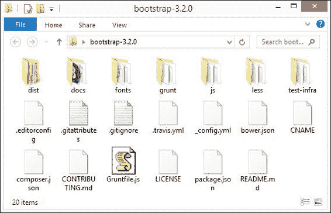
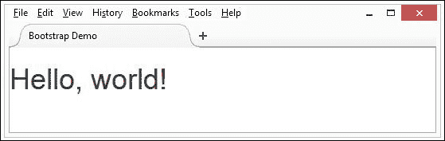
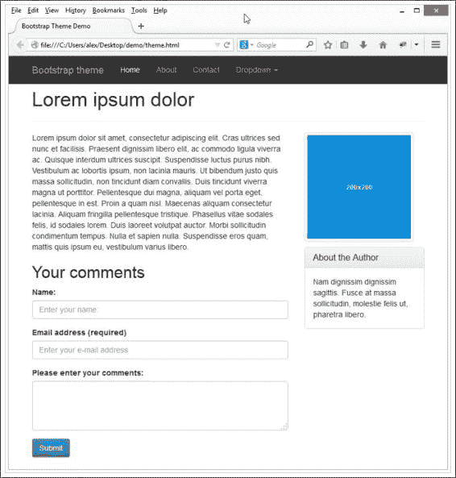
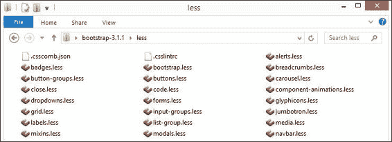
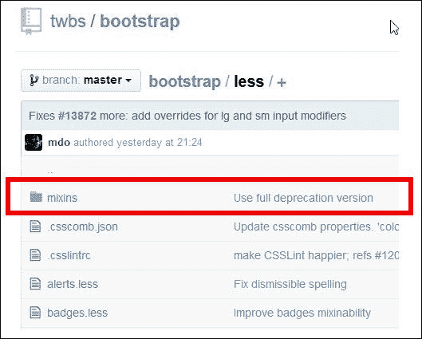
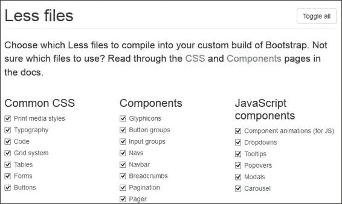
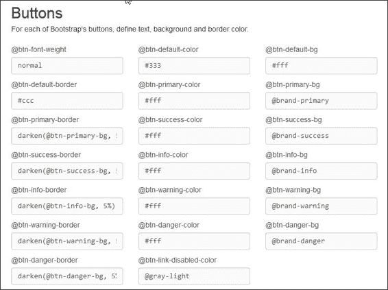
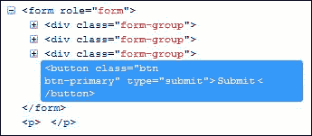
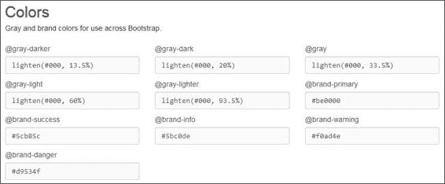
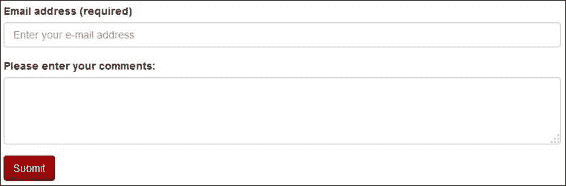

# 第十章：使用 Less 与 Bootstrap

要使用 Bootstrap 还是不要使用 Bootstrap，这是一个问题...

除了莎士比亚的《哈姆雷特》中的明显误引之外，许多开发者可能会问自己是否想要在他们的下一个项目中使用框架。

框架的一个明显优势是它们可以帮助您非常快速地将网站搭建起来——Bootstrap 也不例外。作为 Twitter 为统一其内部项目而开发的内部工具，Bootstrap 迅速成为 GitHub 上排名第一的项目，其用户群体包括 NASA 和 MSNBC。

那么，为什么在关于 Less 的书中要谈论这个呢？很简单；正如您将发现的，Bootstrap 是基于 Less 构建的；它是帮助您习惯使用 Less 的完美工具。在本章中，我们将涵盖以下主题：

+   Bootstrap 的 Less 文件结构

+   Bootstrap 的混入

+   为您的网站配置 Bootstrap

+   开发使用 Bootstrap 的工作流程

好奇吗？让我们开始吧...！

# 解构 Bootstrap 的 Less 文件结构

因此，您已经决定冒险使用 Bootstrap；它，就像互联网上可用的许多其他框架一样，是帮助快速搭建网站的好方法。然而，本章是关于 Less 在 Bootstrap 中的应用，对吧？绝对如此；Less 在生成用于样式化 Bootstrap 库中每个元素的 CSS 中发挥着关键作用。为了了解这一点，让我们更详细地查看库。首先，我们将从官方网站下载它。

## 下载库

我们首先需要下载库的一个副本——为此，请访问 [`getbootstrap.com/`](http://getbootstrap.com/) 并点击**下载 Bootstrap**。Bootstrap 库在撰写本文时处于版本 3.2.0，可以通过多种方式获得，包括通过 CDN 或使用 Bower。

我们感兴趣的版本是源代码版本，所以请点击**源代码**并保存存档的副本到安全的地方。一旦下载，将内容的一个副本提取到您的硬盘驱动器上——在打开存档时，我们将看到以下内容：



我们感兴趣的文件夹自然是 `less` 文件夹——如果我们打开它，我们可以在文件夹内看到一系列 Less 混入文件。

有许多 Less 文件包含我们可以用于构建启用 Bootstrap 网站的混入（mixins），它们可以分为四个类别，即：

+   工具

+   布局

+   皮肤

+   组件

我们将在本章后面的**解构 Bootstrap 的混入**部分中涵盖这些类别。同时，让我们继续前进，熟悉在您的网站上安装 Bootstrap。

# 为您的网站配置 Bootstrap

虽然我们已经下载了 Bootstrap 的源代码版本，但这并不是您默认会使用的版本。

嘿？我听到你在问。你完全有理由这样做——毕竟，下载了你不会使用的东西有什么意义，对吧……？好吧，我们将在本章后面使用它；现在，知道这包含了构成 Bootstrap 样式的所有混合器，并且这些混合器可以在以后日期轻松自定义就足够了。

目前，我们将使用编译版本。在章节后面的“构建更真实的网站”部分，我们将看到当我们直接访问 Bootstrap 混合文件时会发生什么效果。

让我们改变一下方向，看看添加 Bootstrap 到你的网站需要什么：

1.  首先，在你的硬盘上创建一个新的文件夹，并将其命名为 `projects`。

1.  将我们在上一节中下载的 `bootstrap` 文件夹的内容复制到这个文件夹中。

1.  打开你选择的文本编辑器，并添加以下代码：

    ```js
    <!DOCTYPE html>
    <html lang="en">
      <head>
        <title>Bootstrap Demo</title>
      </head>
      <body>
        <h1>Hello, world!</h1>
      </body>
    </html>
    ```

1.  接下来，在 `</head>` 标签之前添加以下行——这些是由 Bootstrap 用于使网站响应式的：

    ```js
    <meta charset="utf-8">
    <meta http-equiv="X-UA-Compatible" content="IE=edge">
    <meta name="viewport" content="width=device-width, initial-scale=1">
    ```

1.  我们需要添加 Bootstrap 的基本样式，所以请立即在关闭 `</head>` 标签之前添加以下行：

    ```js
    <link href="css/bootstrap.min.css" rel="stylesheet">
    ```

1.  将文件保存为 `bootstrap.html` 在 `projects` 文件夹中——如果我们预览结果，我们会看到这样：

当然，这不会让世界变得不同，但它确实说明了安装 Bootstrap 是多么容易！我们将在本章后面的“构建更真实的网站”部分深入探讨一个真实世界的例子。需要记住的关键点是，Bootstrap 是一组有效的 CSS 样式规则——只要我们在代码的适当位置使用适当的规则，我们就可以使用它们来制作任何东西。Bootstrap 对于帮助构建基本网站非常理想；然后它为我们提供了在以后日期将其发展成为更复杂事物的基石。

## 使用 Internet Explorer 8 或以下版本

在我们查看制作更详细的内容之前，我们需要在使用 Bootstrap 时注意一些事情——这关系到我们老朋友，也就是 Internet Explorer。

之前的演示在现代浏览器中可以完美工作——值得注意的是，如果你仍然需要使用 IE8，那么你需要在你的 `<head>` 部分添加以下代码：

```js
<!-- HTML5 Shim and Respond.js IE8 support of HTML5 elements and media queries -->
<!-- WARNING: Respond.js doesn't work if you view the page via file:// -->
<!--[if lt IE 9]>
  <script src = "https://oss.maxcdn.com/libs/html5shiv/3.7.0/html5shiv.js">
</script>
  <script src = "https://oss.maxcdn.com/libs/respond.js/1.4.2/respond.min.js">
</script>
<![endif]-->
```

Internet Explorer 8（或更低版本）默认不支持 HTML5，因此我们需要使用两个 JavaScript 库来为 HTML5 和媒体查询提供回退支持。

好的；你还在吗，我希望？好的；让我们继续。这是一个深入研究使用 Bootstrap 构建更真实示例的绝佳机会。

# 构建更真实的网站

虽然我们可以使用 Bootstrap 来制作各种不同的网站，但 Bootstrap 真正发挥其作用是在用于模拟网站时。即使颜色一开始并不完美，至少也能感受到页面或网站在布局方面的样子。这并不是说颜色方案应该被忽视；一旦我们有了网站布局的清晰想法，它们可以随后进行。

为了说明 Bootstrap 在创建模拟页面方面的有用性，我们将查看创建一个可以作为博客文章或网站上的在线文章的示例页面。为了这个示例的目的，我们需要这本书附带的代码下载的副本——它包含所需的 HTML 标记的副本；由于空间原因，我们无法在文本中全部复制！好吧——现在我们已经有了代码下载的副本，让我们开始吧：

1.  从代码下载中提取`blogpage.html`文件的副本，它包含我们示例页面的 HTML 标记。将文件保存在我们在上一个练习中创建的`projects`文件夹中。

1.  打开你选择的文本编辑器，然后将以下行添加到文件的`<head>`标签中：

    ```js
        <meta charset="utf-8">
        <meta http-equiv="X-UA-Compatible" content="IE=edge">
        <meta name="viewport" content="width=device-width, initial-scale=1">
        <title>Bootstrap Theme Demo</title>
        <link href="css/bootstrap.min.css" rel="stylesheet">
        <link href="css/bootstrap-theme.min.css" rel="stylesheet">
    ```

1.  接下来，我们需要下载一个小型的 JavaScript 文件——这是 Ivan Malopinsky 的 Holder 插件。这个插件对于运行 Bootstrap 不是必需的，但它为图像占位符提供了很好的效果。Holder 可以从[`github.com/imsky/holder/zipball/v2.3.2`](http://github.com/imsky/holder/zipball/v2.3.2)下载，并将`holder.js`从存档中提取到我们`projects`文件夹内的`js`文件夹中。

    ### 提示

    代码下载中有一个这个插件的压缩版本，存储为`docs.min.js`。

1.  保存`blogpage.html`—如果我们在一个浏览器中预览结果，我们就可以看到我们模拟的页面在所有细节上的完美展示。

那么，这里发生了什么？虽然看起来我们有很多代码，但实际上，我们只有一个重要的代码块：

```js
    <meta charset="utf-8">
    <meta http-equiv="X-UA-Compatible" content="IE=edge">
    <meta name="viewport" content="width=device-width, initial-scale=1">
    ...
    <link href="css/bootstrap.min.css" rel="stylesheet">
```

你可能会问，这为什么如此重要？好吧，这很简单——Bootstrap 是关于提供一套完整的样式功能集，可以帮助你快速启动。Bootstrap 并不是要永久替代，但它是一个很好的起点来开发你自己的样式。确实，正如我们将在第十一章中看到的那样，*使用 Less 抽象 CSS 框架*，仅仅依赖 Bootstrap 并不总是好事！

在这个例子中，我们设置了三个元标签——这些标签处理要使用的字符集、在显示页面时应支持 IE 的版本以及移动设备上的网站显示。

### 注意

如果你想要了解更多关于 IE 兼容性和视口标签的信息，那么阅读微软在[`www.modern.ie/en-us/performance/how-to-use-x-ua-compatible`](https://www.modern.ie/en-us/performance/how-to-use-x-ua-compatible)上的文章是值得的，该文章描述了设置此标签的最佳实践。Mozilla 有一篇有用的文章介绍了如何在代码中应用视口标签，你可以通过访问[`developer.mozilla.org/en/docs/Mozilla/Mobile/Viewport_meta_tag`](https://developer.mozilla.org/en/docs/Mozilla/Mobile/Viewport_meta_tag)来查看。

前两个可以在大多数网站上看到——真正有趣的是指向 Bootstrap CSS 文件的链接。这是一个预编译文件，包含了 Bootstrap 的样式，这些样式是从构成库的 Less 混入生成的。我们在代码中引用了它，并使用它来应用 HTML 标记中定义的样式。

### 注意

然而，值得注意的是，如果你想使用 Bootstrap 附带的一些 jQuery 插件，那么你还需要添加对 jQuery 本身的链接以及 Bootstrap 插件的链接：

```js
<script src="img/jquery-2.1.1.min.js"></script>
<script src="img/bootstrap.min.js"></script>
```

如果你仍然需要支持 IE8 或更低版本，那么将 jQuery 的引用更改为`jquery-1.11.1.min.js`；jQuery 2 版本在这些早期版本的 IE 中不受支持。

# 编译 Bootstrap 的 CSS 和 JavaScript

现在我们已经看到了 Bootstrap 如何有效地帮助我们启动网站，我们可以决定想要从仅仅使用预编译的 CSS 文件转向自己编译代码。

做这件事的主要原因是为了更新或修改代码以适应我们的需求——我们不应该忘记 Bootstrap 旨在以这种方式进行定制！幸运的是，Bootstrap 使用 Grunt，我们之前在书中讨论并安装了它（在第二章，*构建 Less 开发工具包*）。Bootstrap 自带预配置的`package.json`文件，使得编译变得非常简单。我们只需要做的是：

1.  打开一个命令提示符窗口，然后导航到`/bootstrap`文件夹的根目录，并输入以下命令：

    ```js
    npm install

    ```

    这将自动安装编译 Bootstrap 所需的全部依赖。

1.  在同一个命令窗口中，输入以下内容：

    ```js
    grunt

    ```

    这将运行 JSHint 和 QUnit 测试，并将 CSS 和 JavaScript 文件编译到 Bootstrap 文件夹内的`/dist`文件夹中。

这很简单，对吧？好，让我们继续前进，认识一下 Bootstrap 自带的一些混入（mixins）。

# 检查 Bootstrap 的混入

在本章的开头，我们简要地看了 Bootstrap 库下载的文件结构；现在是一个深入了解这个结构的绝佳机会。

如果我们打开下载的存档的副本并导航到 `less` 子文件夹的根目录，我们可以看到这些混合器分布在 29 个混合器文件中，可以分为以下类别：工具类、组件、皮肤和布局。



大多数这些混合器都关注于提供 Bootstrap 的核心样式——特别值得注意的是：

+   `bootstrap.less`: 这是主 Less 文件，当编译和压缩后，将形成 `bootstrap.min.css`

+   `theme.less`: 这包含了一些核心主题样式

注意，如果你直接从 GitHub 下载 Bootstrap 版本，你会注意到这个额外的文件夹：



这个文件夹包含了控制主题样式的混合器；如果我们查看文件夹内部，我们会看到一些额外的混合器，这些混合器用于创建生产下载文件中将成为 `bootstrap-theme.min.css` 的内容。

如果我们进一步探索这个文件夹，我们会看到其中存储的大多数文件都有与核心混合器相同的名称，但它们包含的样式是 Bootstrap 中主题的基础。值得注意的是，这些混合器不是在 [`www.getbootstrap.com`](http://www.getbootstrap.com) 可用的 Less 下载存档的一部分；要使用它们，我们需要直接从 GitHub 下载并使用 Grunt/Node.js 编译。

### 注意

Bootstrap 中可用于的所有混合器都存储在 `\less` 子文件夹中——你还可以在 GitHub 上查看原始源文件版本，地址为 [`github.com/twbs/bootstrap/tree/master/less`](https://github.com/twbs/bootstrap/tree/master/less)。变量存储在 `variables.less` 中——这在上文提到的 `\less` 文件夹中，并在 GitHub 上可访问 [`github.com/twbs/bootstrap/blob/master/less/variables.less`](https://github.com/twbs/bootstrap/blob/master/less/variables.less)。

现在我们已经看到了库的构成，让我们花点时间反思一下库中可用的某些混合器。

# 解构 Bootstrap 的混合器

如果我们要查看 Bootstrap 中可用于的混合器，我们可以看到它们被分成几个组。这些组包括：

+   核心变量和混合器

+   重置和依赖

+   核心 CSS

+   组件文件

+   使用 JavaScript 的组件文件

+   工具类

让我们逐一详细地看看每一个，从核心变量和混合器开始。

## 核心变量和混合器

核心变量和混合器可能是所有混合器中最小的一组，但却是最重要的——它包含了 `variables.less`，其中列出了 Bootstrap 中可用的所有预定义变量。这个组中包含的第二个文件是 `mixins.less`。虽然它的设计更简单，但同样扮演着重要的角色：它包含了用于构建 `bootstrap-theme.css` 文件的 `@import` 语句。

## 重置和依赖

在分组中接下来的是重置和依赖混合，引用一句俗语，这些“名副其实”！`Normalize.less`使用了 Nicolas Gallagher 创建的`normalize.css`项目，该项目也可在 GitHub 上找到，并可以从[`github.com/necolas/normalize.css`](https://github.com/necolas/normalize.css)下载。

如果我们将网站设置为可打印的，那么`print.less`是必不可少的；它包含将 Bootstrap 重新对齐所需的媒体查询，以便允许打印。`Glyphicons.less`是库的有用部分——它控制显示 Bootstrap 库中包含的任何图标的样式。

## 核心 CSS 样式

在接下来的分组中，我们有一些执行不同角色的混合文件：

| 混入文件名 | 用途 |
| --- | --- |
| `scaffolding.less` | 控制基本网站上的元素，直接或间接（通过引用其他混合文件的样式） |
| `type.less` | 设置 H1 到 H6 字体大小的默认字体大小，以及一些额外的样式，如警告或信息文本 |
| `code.less` | 使用如`<code>`和`<pre>`等标记时确定样式 |
| `grid.less` | 设置用于控制 Bootstrap 响应式网格功能的基本样式 |
| `tables.less` | 控制我们插入网站中的任何表格的样式 |
| `forms.less` | 将样式应用于我们网站内托管的所有表单 |
| `buttons.less` | 设置应用于我们网站上任何按钮的基本样式 |

## 组件

到目前为止，我们查看的大多数样式都涵盖了网站的结构；让我们看看组成我们可以添加到任何网站中的视觉元素的组件文件：

| 混入文件名 | 用以定义样式 |
| --- | --- |
| `component-animations.less` | 对网站上的任何组件进行动画处理 |
| `dropdowns.less` | 下拉菜单 |
| `button-groups.less` | 分组按钮 |
| `input-groups.less` | 输入字段 |
| `navs.less, navbar.less` | 导航栏和按钮 |
| `forms.less` | 表单和非表单元素 |
| `breadcrumbs.less` | 面包屑路径 |
| `pagination.less, pager.less` | 网站中的分页 |
| `labels.less` | 各种标签样式，例如警告或危险样式 |
| `badges.less` | 按钮或导航中的徽章 |
| `jumbotron.less` | 巨幕 |
| `thumbnails.less` | 缩略图图像和标题 |
| `alerts.less` | 警告信息和对话框 |
| `progress-bars.less` | 进度条 |
| `media.less` | 媒体对象，如视频和图像 |
| `list-group.less` | 分组或链接列表中的项目 |
| `panels.less` | 面板和面板元素，例如标题 |
| `responsive-embed.less` | 响应式嵌入项目，如 iFrames |
| `wells.less` | Wells |
| `close.less` | 关闭图标 |

## 工具类

核心 Bootstrap 文件中的最后一组包含的是实用工具类——这些存储在 `utilities.less` 和 `responsive-utilities.less` 中。这些文件包含一些与任何其他混合文件不直接相关的样式，但仍然在 Bootstrap 网站上发挥作用。例如，`.clearfix()` 混合和用于切换内容的混合。 

现在让我们改变焦点，关注构成 Bootstrap 主题样式的混合文件。

# 拆解 Bootstrap 的主题混合

除了核心样式和混合之外，Bootstrap 还提供了一些额外的混合，这些混合被整合到 Bootstrap 主题的 JavaScript 和 CSS 文件中。

您可以在 GitHub 仓库中 `less` 文件夹下的 `mixins` 子文件夹中查看这些内容——值得注意的是，当从 [`www.getbootstrap.com`](http://www.getbootstrap.com) 下载文件时，这些内容不会出现在“源代码”选项中。让我们看看这个文件夹里有什么——混合分为几个组。

## 通用工具

| 混合文件名称 | 用途 |
| --- | --- |
| `hide-text.less` | 在使用 CSS 图像替换时隐藏图像 |
| `opacity.less` | 设置透明度级别 |
| `image.less` | 使图像响应式。 |
| `labels.less` | 定义标签的颜色 |
| `reset-filter.less` | 当移除渐变背景时，为 IE 重置过滤器 |
| `resize.less` | 如果溢出不可见，则调整任何元素的尺寸 |
| `responsive-visibility.less` | 为 `responsive-utilities.less` 提供响应式状态 |
| `size.less` | 使用快捷混合设置对象的高度和宽度 |
| `tab-focus.less` | 为标签添加 `Webkit-style` 焦点 |
| `text-emphasis.less` | 为文本添加强调 |
| `text-overflow.less` | 处理文本溢出——需要设置 `display: inline` 或 `display: block` 以实现适当的样式 |

## 组件

尽管我们现在已经定义了大多数 Bootstrap 组件所需的样式，但仍有一些样式是特定于主题文件的；这些样式在以下混合组中处理：

| 混合文件名称 | 用途 |
| --- | --- |
| `alerts.less` | 设置警告中的背景、边框和前景色值，以及 `<hr>` 元素和警告内的链接。 |
| `buttons.less` | 创建默认样式，以及 `:hover`、`:focus`、`:active` 和 `disabled` 样式按钮。 |
| `panels.less` | 定义用于面板元素的色彩。 |
| `pagination.less` | 处理页面分页的样式设置。 |
| `list-group.less` | 定义选择或悬停在列表元素上时使用的样式。 |
| `nav-divider.less` | 设置下拉菜单或导航列表中的分隔符。 |
| `forms.less` | 生成用于表单的验证样式。 |
| `progress-bar.less` | 为进度条设置背景色。 |
| `table-row.less` | 设置用于控制表格行外观的额外样式。 |

## 皮肤

到目前为止，我们已经定义了许多主题样式；其中一些是在应用 Bootstrap 主题文件时添加的：

| Mixin 文件名称 | 描述 |
| --- | --- |
| `background-variant.less` | 此 mixin 在悬停时设置并加深背景颜色。 |
| `border-radius.less` | 随着`border-radius`的本地浏览器支持的到来，此 mixin 并非严格必需，但为了以成对的方式设置半径值，它是有用的。 |
| `gradients.less` | 此 mixin 设置了多种渐变格式的样式，例如条纹和径向渐变。 |

## 布局

任何主题的关键部分是将元素正确地定位在页面上；这个 mixin 组合处理了 Bootstrap 主题的这个问题：

| Mixin 文件名称 | 用于 |
| --- | --- |
| `clearfix.less` | 实现由 Nicholas Gallagher 在 [`nicolasgallagher.com/micro-clearfix-hack/`](http://nicolasgallagher.com/micro-clearfix-hack/) 创建的微清除浮动技巧 |
| `center-block.less` | 在主题中居中对齐块级元素 |
| `nav-vertical-align.less` | 在导航栏中垂直居中元素 |
| `grid-framework.less` | 从任何给定的`@grid-columns`值生成正确的网格类数量。由 Bootstrap 提供 |
| `grid.less` | 生成语义网格列 |

现在我们已经了解了库的构成，我们可能很想知道是否可以使用库中的不同元素，而不仅仅是将库直接集成到我们的代码中，这样会浪费资源。然而，如果我们想实际*更改一些默认样式，而无需下载所有内容*呢？幸运的是，这是可能的——让我们看看如何自定义您的 Bootstrap 下载。

# 自定义我们的下载

到目前为止，我们使用了 Bootstrap 的标准下载——虽然这为我们服务得很好，但开始引入我们自己的样式可能会有些尴尬。

幸运的是，Bootstrap 团队为我们提供了一种方法，允许我们构建自定义下载；虽然可能需要一点工作来确定要输入的值，但它至少允许我们根据喜好调整值！让我们看看它是如何工作的。

### 注意

在这样做之前，我们需要对我们的代码进行一个小小的修改——打开你的`blogpage.html`副本，并注释掉这一行：

```js
<link href="css/bootstrap-theme.css" rel="stylesheet">
```

现在，不必担心。为什么？所有的一切很快就会变得清晰！

首先，浏览 [`getbootstrap.com/customize/#less-variables-section`](http://getbootstrap.com/customize/#less-variables-section)——在这里，我们可以看到一系列我们可以选择包含或排除在下载中的选项。如果你花过时间使用 jQuery UI，那么这个过程应该很熟悉——这是一个选择或取消选择适当的复选框以包含我们下载中所需组件的问题。

这是一个三步过程——让我们首先选择我们想要在下载中使用的基 CSS、组件和实用工具。



接下来，我们需要更改我们打算包含在下载中的每个组件的值。一个很好的例子是 **按钮** 部分——我们创建了一个按钮作为我们评论表单的一部分，所以让我们继续更改图像上的颜色，作为我们的定制下载的一部分。



让我们回到之前深入研究的 `blogpage.html` 演示——如果我们使用 DOM 检查器，例如 Firebug，查看按钮的源代码，我们可以看到正在使用的类。



我们可以清楚地看到正在使用的两个类——基础 `.btn` 和 `.btn-primary`。使用 DOM 检查器，例如 Firebug，我们可以看到 `.btn` 的编译样式：

```js
.btn {
    -moz-user-select: none;
    background-image: none;
    border: 1px solid transparent;
    border-radius: 4px;
    cursor: pointer;
    display: inline-block;
    font-size: 14px;
    font-weight: normal;
    line-height: 1.42857;
    margin-bottom: 0;
    padding: 6px 12px;
    text-align: center;
    vertical-align: middle;
    white-space: nowrap;
}
```

单独来看，这不会展示太多——一旦我们查看 `.btn-primary` 类，它就会真正开始有意义：

```js
.btn-primary {
    background-color: #428bca;
    border-color: #357ebd;
    color: #fff;
}
```

在这个阶段，如果我们浏览 [`getbootstrap.com/customize/#less-variables`](http://getbootstrap.com/customize/#less-variables)，我们就可以看到我们下载中可以自定义的所有 Less 变量。我们可以看到 `#428bca` 的值是由 `@btn-primary` 的值设置的。

然而，不那么容易注意到的是 `#357ebd` 的设置方式——这个值是通过 `@btn-primary-border` 变量设置的，它被加深了 5%。

### 小贴士

要查看颜色变亮或变暗的效果，请访问十六进制颜色工具网站 [`www.hexcolortool.com`](http://www.hexcolortool.com)，输入你的十六进制值（不带井号），然后点击 **变亮** 或 **变暗** 以查看一系列颜色及其值。

我们还可以看到按钮的颜色是如何设置的——值得浏览 GitHub 上的 `buttons.less` 混合文件 [`github.com/twbs/bootstrap/blob/master/less/buttons.less`](https://github.com/twbs/bootstrap/blob/master/less/buttons.less)，在那里我们可以看到第 60 行的混合效果：

```js
.btn-primary {
  .button-variant(@btn-primary-color; @btn-primary-bg; @btn-primary-border);
}
```

现在我们已经看到了变量是如何链接到混合的，让我们通过为我们的按钮设置一个漂亮的红色阴影来更改我们的下载。

## 修改下载中的值

修改 Bootstrap 的代码下载非常简单——我们只需选择我们的主颜色，更改已显示的颜色，然后在页面底部点击 **下载** 以获取我们的定制库。现在让我们来做这件事——你会看到有多简单：

1.  首先，浏览 [`getbootstrap.com/customize/#less-variables`](http://getbootstrap.com/customize/#less-variables) 并更改 `@brand-primary` 的值为 `#be0000`，如图所示：

1.  接下来，滚动到页面底部，点击 **编译和下载**—当提示保存文件夹时，将其保存到安全位置。

    我们现在有了库，但需要更新我们的代码。记得我让你注释掉引用`bootstrap-theme.css`文件的行吗？好吧，这就是原因：定制的下载只适用于核心样式，而不适用于已应用的主题。如果我们没有注释掉这一行，那么我们的更改将是多余的——主题会覆盖它！

1.  到目前为止，请继续在我们的项目文件夹中重命名 CSS 文件夹——打开我们刚刚下载的存档文件，并将`css`文件夹复制到项目文件夹中。

如果我们浏览`blogpage.html`文件的副本并刷新屏幕，我们可以看到**提交**按钮上使用的更新后的颜色。



如果我们打开一个 DOM 检查器，例如 Firebug，我们可以看到代码已经更改：

```js
.btn {
  ...

border: 1px solid transparent;
  ...
}
```

查看`.btn-primary`样式，我们可以看到由于我们的 CSS 更改而产生的新值：

```js
.btn-primary {
  background-color: #be0000;
  border-color: #a50000;
  color: #fff;
}

.btn-primary {
  background-image: linear-gradient(to bottom, #be0000 0px, #810000 100%);
  background-repeat: repeat-x;
  border-color: #700;
}
```

我们可以更改很多样式——世界是我们的牡蛎！为了帮助更改颜色，改变现有的十六进制颜色代码比替换显式颜色函数更容易。如果我们保留计算语句不变，那么我们可以确保它们正确渲染更新颜色的正确色调，例如`:hover`。

### 小贴士

伴随本书的代码下载中包含了一个修改过的 CSS 文件夹版本，它包含了这种颜色更改。你需要提取`REDcss`文件夹的副本并重命名它，以替换 Bootstrap 附带默认的`css`文件夹。

让我们改变一下节奏，继续前进——使用 Bootstrap 的一个关键部分是开发你自己的工作流程过程；虽然没有正确或错误答案，但我们将查看一个你可以为你的项目开发的例子。

# 开发使用 Bootstrap 的工作流程

现在我们已经看到了如何为创建基本网站配置 Bootstrap，我们使用 Bootstrap 的旅程中的最后一个关键阶段是开始开发一个帮助我们尽可能高效的工作流程。

最终，设计我们的工作流程将是一件非常个人化的事情——同样的方法并不适合每个人！关键在于找到适合你的方法；为了给你一个如何着手的方法，值得阅读 Erik Flowers 的一篇文章，该文章可在[`www.helloerik.com/bootstrap-3-less-workflow-tutorial`](http://www.helloerik.com/bootstrap-3-less-workflow-tutorial)找到。

总结来说，他的工作流程集中在以下步骤：

1.  从[`www.getbootstrap.com`](http://www.getbootstrap.com)下载 Bootstrap 库的副本。

1.  决定你想要使用哪种方法来编译你的 Less 文件——是使用像 Crunch!这样的预处理器应用程序，通过命令行，还是作为 Sublime Text 等编辑器的附加包？

1.  创建一个源文件夹来存放你的 Less 文件——名称不是关键，只要你知道它存储了什么和在哪里。

1.  在源文件夹中创建一个名为`vendor`的文件夹，并将 Bootstrap Less 文件的副本存储在其中——这是为了帮助你避免修改核心文件，这些文件在升级 Bootstrap 时会被覆盖。

1.  在你的源文件夹中，创建一个名为`styles.less`的文件，该文件导入`bootstrap/bootstrap.less`。

1.  将所需的任何其他 Less 文件存储在顶级源文件夹中，然后使用相同的格式将它们导入到`styles.less`中。

1.  将你的 Less 样式规则添加到这些单独的文件中，而不是`styles.less`文件中。

1.  将`styles.less`编译到你想引用`styles.css`的任何位置；根据需要，单独或作为使用 Grunt 等包的一部分来最小化或压缩文件。

虽然涉及几个步骤，但这应该能让你对示例工作流程有一个感觉——值得注意的是，其中一些可以，潜在地，自动化；这个问题的关键是确保它与你的开发工作流程中现有的任何流程相匹配。

# 摘要

对于最初是为 Twitter 内部使用而创建的项目，Bootstrap 迅速成为 GitHub 上世界上最受欢迎的项目之一。让我们花点时间回顾一下本章中我们涵盖的内容。

我们的旅程从下载库开始，然后配置它在我们的项目中使用。然后我们创建了一个基本示例来展示如何轻松地将它添加到项目中；然后我们将其发展成一个更现实的示例，以便更好地展示 Bootstrap 的外观。

我们继续前进，探讨了如何轻松编译 Bootstrap 的混入（mixins）以生成有效的 CSS 代码；然后我们覆盖了代码下载中的`less`文件夹的结构，以便查看可用的混入以及它们如何构成 Bootstrap。然后我们通过深入了解如何自定义下载来更好地满足我们的需求，完成了对 Bootstrap 的探讨。

让我们继续前进——在下一章中，我们将探讨如何使用 Less 抽象 CSS 框架，以及为什么使用 Bootstrap 实际上并不像最初看起来那么好！
