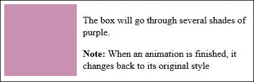
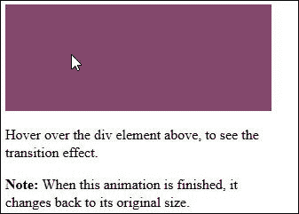
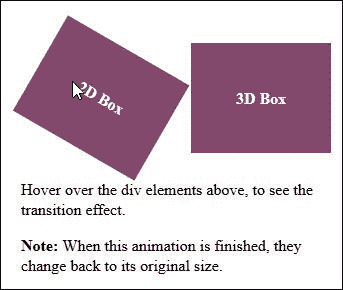

# 第十三章。使用 Less 进行动画

你见过多少使用 Flash 的动画网站？好吧，相当多。我敢打赌，你一有机会就想跳过动画，对吧？

是的，我想是这样的；现在没有多少人举手了…

我们不能忘记那些使用 Flash 的网站的老日子，我们经常想跳过那些设计糟糕的动画，这些动画往往不提供任何有用的内容，反而使网站变慢。听起来熟悉吗？

幸运的是，情况已经有所改变；在接下来的几页中，我们将看到如何使用 CSS3 动画来达到原本需要 Flash 才能实现的效果。CSS3 动画的使用消除了对重型 Flash 插件的需求（对于现代浏览器而言），并且如果做得恰当，可以使网站运行更快，浏览体验更愉快，对最终用户更具吸引力。我们将深入研究使用 Less 来简化编码一些真实世界示例的过程，以便使我们的开发工作流程变得更加容易。

在本章中，我们将涵盖以下主题：

+   CSS 动画的工作原理

+   过渡和变换

+   动画菜单

+   使用 Less 简化动画标记

感兴趣吗？让我们开始吧…

# 介绍动画

在互联网的早期，经常可以看到动画 GIF，它们经常被随意地贴在网站上——通常的借口是它们“看起来很酷”，即使它们实际上并没有真正起到任何作用！

现在，动画越来越多地被用于互联网上——这通常以 SVG 图像、背景视频、声音等形式出现。这种越来越被使用的技术如 Flash，但随着 HTML5 的出现，设计师们找到了在浏览器中不使用 Flash 就能原生地重现许多效果的方法。

现在，浏览器厂商正在为他们的每个产品版本添加越来越多的功能；这意味着 CSS3 动画正在逐渐取代 Flash，以至于 Adobe 已经停止为移动平台开发 Flash，转而专注于 HTML5。

在接下来的几页中，我们将游览 CSS3 动画，查看各种元素，如过渡和变换，以及我们如何使用 Less 来帮助简化动画开发的过程。你可能会惊讶地发现，当使用 Less 制作动画时，并没有很多新技术需要掌握——实际上，我们迄今为止所涵盖的所有技术都可以用来帮助使开发过程变得更简单。

让我们先快速看一下什么是一个好的动画——毕竟，如果它们不成功，就没有创建它们的必要了！

# 创建一个好的动画

你有多经常查看一个网站，却发现它看起来就像有人在偏头痛中大脑的内部？太多的网站屈服于将一切动画化的诱惑——动画是一个秘密成分，当使用得当时会产生最大的影响。

那么，什么因素使动画变得出色？这取决于网站的环境，但有一些好的建议，每个设计师都应该遵循：

+   不要过度使用吸引注意力的元素——访客希望感觉他们可以控制他们的浏览体验，所以当他们到达所需信息时立即弹出订阅对话框是非常不恰当的！用它来突出他们可能错过的内容，而不是分散他们的注意力。

+   当动画用于突出上下文和导航功能时，动画效果很好；一个很好的例子是提供有用本地信息的动画侧边栏。侧边栏的内容会频繁更改，因此使用动画可以帮助指出新信息给用户。

+   在一些网站上，讲述故事是使用动画的一种方式。虽然这可能对某些网站来说有些过度，但流行的全页滚动效果效果很好，因为它暗示还有更多内容可以阅读，这有助于保持用户的兴趣。

+   如果使用了动画，那么让它看起来真实可信。你可以在元素上使用任何效果，例如弹跳或震动，但如果它们不可信，那么用户会发现它们是干扰，并且会感到非常不快！

现在让我们继续前进，将我们的注意力转向更深入的话题：动画是如何工作的？这是创建成功动画的关键。正如我们即将看到的，不同类型的动画看起来很相似，但它们有一些关键的区别；这可能会影响我们如何使用它们来在我们的网站上开发效果。

# CSS 动画的工作原理

我们已经讨论了动画的一般概念，但这个术语涵盖了至少四种我们可以在 Less 中使用的不同类型。它们是动画、过渡、2D 变换和 3D 变换。

在这四个属性中，有两个需要特别注意它们的工作方式：动画和过渡。这并不意味着变换不那么重要——情况并非如此。它们只是以与过渡不同的方式工作，更容易理解和使用。

动画和过渡看起来可以提供相同的结果，但它们的工作方式不同。两个关键的区别是：

+   过渡基于两种状态——如果我们切换 CSS 状态或触发了一个伪类，例如 `:hover` 或 `:focus`，它将改变元素从起始位置到结束位置。

+   动画可以使用多个 `@keyframes` 或在起始状态和结束状态之间设置的位置。

剩下的两个动画属性，2D 和 3D 变换，它们的工作方式并不相同——它们可以操纵元素的大小和外观，但通常是在原地（尽管它们可以在元素移动时使用）。

既然我们已经了解了动画的工作原理，现在是深入了解每种动画属性的好时机。

# 介绍动画类型

当我们谈论创建动画时，这可以理解为我们在移动内容；虽然这是完全正确的，但我们不仅限于简单地移动元素。我们同样可以将元素从一个状态过渡到另一个状态，或者弯曲并操纵它们在屏幕上的外观。让我们更详细地查看每种动画类型，从动画开始。

## 动画内容

使用动画内容来移动对象，可以用作 Flash 的替代品。它们定义了一组元素属性的变化——我们可以在定义动画时控制这些属性的行为，包括它们的频率。

动画和过渡之间的关键区别在于，动画可以在没有任何用户交互的情况下触发，一旦页面加载即可。过渡只能在元素变得活跃时触发，例如`button`元素或`div`元素。

简单动画将遵循以下格式：

```js
animation: <name of animation> <duration of the animation>
```

让我们通过创建一个简单的动画来改变框的颜色来测试这个。为此，我们需要这本书附带的代码下载副本；从这些代码中提取`animatebox.html`和`animatebox.css`的副本。

如果我们运行演示，我们可以期待看到框经过几种紫色调，然后恢复到原始颜色，如下面的截图所示：



这里的关键是我们的 CSS 中的`@keyframes animbox`；这包含了动画中每个关键帧应进行的更改。我们不得不包含它两次以支持 Chrome、Safari 和 Opera：

```js
/* Chrome, Safari, Opera */
@-webkit-keyframes animbox { 
  0% { background: #85486d; }
  25% { background: #9F6287; }
  50% { background: #B87BA0; }
  100% { background: #D295BA; }
}

/* Standard syntax */
@keyframes animbox {
  0% { background: #85486d; }
  25% { background: #9F6287; }
  50% { background: #B87BA0; }
  100% { background: #D295BA; }
}
```

动画有点抖动——这将是由于每个关键帧之间的大间隔；我们可以使用更小的间隔来获得更平滑的体验。

### 注意

你可以在[`www.w3schools.com/css/css3_animations.asp`](http://www.w3schools.com/css/css3_animations.asp)了解更多关于 CSS3 动画的不同属性。

让我们继续并看看过渡是如何工作的。

## 过渡元素

过渡实际上是将元素从其原始状态转换为新状态的动画；动画与过渡的关键区别在于，过渡只能在它们被明确触发时发生——例如，当鼠标悬停在 DIV 或按钮上时。

简单过渡将遵循以下格式：

```js
transition: <the css property you want to add the effect to> <the effect duration>
```

让我们通过创建一个简单的过渡来增加一个框的大小来测试这个。为此，我们需要这本书附带的代码下载副本；从这些代码中提取`transitionbox.html`和`transitionbox.css`的副本。如果我们运行这个演示，我们可以期待看到框的大小增加，然后恢复到原始大小：



这里的关键是我们的 CSS 中`#transitionbox` DIV 的过渡代码——这包含了动画中每个关键帧应进行的更改。我们不得不包含它两次以支持 WebKit 浏览器：

```js
    -webkit-transition: width 2s; transition: width 2s;
```

如果两秒钟不够，我们总是可以调整动画执行所需的时间。

### 注意

你可以在 [`www.w3schools.com/css/css3_transitions.asp`](http://www.w3schools.com/css/css3_transitions.asp) 了解更多关于 CSS3 动画的不同属性。

现在我们继续前进，看看剩下的两个选项，即 2D 和 3D 变换。

## 变换元素

初看之下，你可能会误以为变换和过渡是相同的；毕竟，你可以轻松地使用 `translate()` 来移动一个对象，而动画则可以用来实现其他效果。

然而，有两个关键的区别：过渡可以作为动画元素的一部分应用，而变换则是完全独立的。过渡允许你将更改应用于几乎任何 CSS 属性，而变换则用于移动、缩放、旋转、旋转或拉伸页面上的任何元素：



一个简单的变换将遵循以下格式：

```js
transform: <the transform action you want to use>(<the value to apply to the transform>)
```

让我们通过创建两个简单的变换来测试这一点：第一个变换对一个盒子执行 2D 旋转，第二个变换则沿着第二个盒子的 *x* 轴执行 3D 旋转。

为了做到这一点，我们需要这本书附带的代码下载的副本；从中提取 `transformbox.html` 和 `transformbox.css` 的副本。如果我们运行这个演示，我们预计在悬停在任何一个上面时，两个盒子都会旋转；左侧的盒子旋转了 30 度，右侧的盒子在其 *x* 轴上旋转了 130 度，如本节开头所示截图所示。

关键在于我们 CSS 中的变换代码——对于第一个盒子，我们将其旋转 30 度；第二个盒子在其 *x* 轴上旋转 130 度。注意 2D 变换的支持比 3D 变换要好得多；我们仍然需要为大多数桌面浏览器使用 `webkit` 前缀：

```js
#transform2dbox:hover { 
  transform: rotate(30deg); 
} 

#transform3dbox:hover {
  -webkit-transform: rotateX(130deg); /* Chrome, Safari, Opera */
  transform: rotateX(130deg);
}
```

一旦浏览器对 3D 变换的支持得到改善，我们就可以从第二个演示的第二行中删除第一行。

### 注意

你可以在 [`www.w3schools.com/css/css3_2dtransforms.asp`](http://www.w3schools.com/css/css3_2dtransforms.asp) 和 [`www.w3schools.com/css/css3_3dtransforms.asp`](http://www.w3schools.com/css/css3_3dtransforms.asp) 了解更多关于 CSS3 变换的不同属性。

我们在探索这些迷你演示的过程中稍微提到了对 CSS3 动画的支持；现在是详细探讨支持的合适时机。

## 支持浏览器中的动画

在继续之前，我们需要讨论一个小问题，那就是浏览器的支持。在这里，你应该在使用动画时不会有任何麻烦；CSS3 动画的所有关键元素已经由主要浏览器支持了一段时间：

| IE | Firefox | Chrome | Safari | Opera |
| --- | --- | --- | --- | --- |
| 10+ | 5+ | 5+ | 4+ | 12+ |

请务必查看网站 **Can I Use** ([`www.caniuse.com`](http://www.caniuse.com))，因为一些动画的新元素在撰写时可能仍然需要供应商前缀。

移动设备支持同样良好；唯一的例外是 Opera Mini，它不支持动画。Android 的 Chrome 在开始时有点问题，但这个问题已经解决，所以支持不会成为问题。然而，重要的是要记住，移动设备没有快速的处理器，所以复杂的动画将运行缓慢，并且在这个平台上应该尽量减少。

好的，理论就到这里！让我们继续到你们一直等待的部分：编写一些代码。

# 使用 Less 简化动画标记

好的，我们终于到了你一定迫不及待想要到达的点：编写一些代码！别担心，我们很快就会到达那里。我只是想涵盖一个小但关键的观点，关于我们如何使用 Less 使编码动画更简单。为了说明这一点，我们将重新工作本章中我们之前创建的动画演示的关键部分。

如果我们回顾动画演示的关键部分，我们有以下内容：

```js
/* Chrome, Safari, Opera */
@-webkit-keyframes animbox {
  0% { background: #85486d; }
  25% { background: #9F6287; }
  50% { background: #B87BA0; }
  100% { background: #D295BA; }
}

/* Standard syntax */
@keyframes animbox {
  0% { background: #85486d; }
  25% { background: #9F6287; }
  50% { background: #B87BA0; }
  100% { background: #D295BA; }
}
```

看起来相当合理，对吧？嗯，就像往常一样，我们可以做得更好！让我们看看我们如何做到：

1.  我们可以做的第一个改变是将 `animatebox.css` 保存为 `animatebox.less`——我们将引入一些混合器，因此将其保存为 Less 文件将允许我们在本练习的后续部分将其编译成有效的 CSS。

1.  我们需要修改 HTML 标记以包含对新 Less 文件和 Less 库的引用；因此，请在 `<head>` 标记之间添加以下内容：

    ```js
      <link rel="stylesheet/less" href="css/animatebox-updated.less">
      <script src="img/less.min.js"></script>
    ```

1.  接下来，让我们将 `@keyframes` 代码转换为一个通用的动画混合器——删除代码末尾现有的两个块（第 15-29 行），然后用以下代码替换它：

    ```js
    .keyframes (@name, @color0, @color25, @color50, @color100) {
        @-webkit-keyframes @name { 
            0% {background: @color0} 
            25%  {background: @color25;}
            50%  {background: @color50;}
            100% {background: @color100;}
        }

        @keyframes @name { 
            0% {background: @color0} 
            25%  {background: @color25;}
            50%  {background: @color50;}
            100% {background: @color100;}
        }
    }
    ```

1.  接下来，我们添加一个新的混合器，它引用了我们刚刚创建的 `@keyframes` 代码：

    ```js
    .keyframes(animbox, #85486d, #9F6287, #B87BA0, #B87BA0);
    ```

如果我们重新运行演示，我们应该看到效果没有变化。那么有什么不同，我们为什么在这里这样做？嗯，我们这样做有几个好处。

我们将 `@keyframes` 代码移动到了自己的混合器中——虽然这里的代码可能看起来没有缩短，但当我们创建更大、更复杂的动画并需要重复以允许供应商前缀时，好处将真正显现。

`.keyframes` 混合器现在可以放入我们的混合器库中；这意味着我们可以将库导入未来的项目中：

```js
@import "animations.less";
```

在我们的代码中引用混合器：

```js
.some-animation {
  .keyframes(…);
  …
}
```

使用 Less 简化我们的代码并不仅仅是让它更短；它还关于使其可重用并更容易添加到未来的项目中！

### 小贴士

代码中有一个更新的演示可用——提取并运行 `animatebox-updated.html` 来查看结果。

让我们继续，并专注于 Less 的实际应用。你有多少次为网站设计菜单，然后想到它变得越来越代码重复，需要动画？好吧，可能是一个有点牵强的问题，但这是可能的……

# 创建动画菜单

菜单是许多网站的典范；我们都需要某种形式的导航，但导航菜单的样式很大程度上取决于网站设计师的想象力。

我们甚至可以更进一步，给菜单添加一些有用的效果；我们至少可以动画下拉动作，使它们滑入得更加优雅。为了做到这一点，我们将回顾书中早期的一个练习——记得，在第四章，*使用变量、混入和函数*中，我们创建了一个使用一些 Less 函数的简单网页？好吧，我们将在这个页面上添加一个菜单，完成后，它将看起来类似于这个：


好的，让我们开始吧：

1.  对于这个练习，我们需要这本书附带的代码下载副本；从中，提取`menus.html`的副本。它包含来自第四章，*使用变量、混入和函数*的代码副本，以及为我们菜单添加的额外标记和一些对导入 Less 文件的细微更改。

1.  接下来，打开你选择的文本编辑器，并将以下代码添加到一个新文件中——我们将逐节分析它，从我们的菜单的主要容器开始：

    ```js
    #navigation { 
      width: 788px; height: 35px; font-family: 'Kite One', sans-serif; font-weight: normal; font-size: 14px;
      ul { position: relative; z-index: 1000; list-style: none; margin: 0; padding: 0; }
    }
    ```

1.  接下来是顶级菜单项：

    ```js
    #navigation > ul > li {
      position: relative; float: left; margin-right: 10px;
      &:hover ul ul { height: 0; } 
      &:hover ul { height: 220px; } 
      & > a:hover ul { height: 220px; }
    }
    ```

1.  这些条目需要变成链接；所以，请继续添加这个样式规则：

    ```js
    #navigation > ul > li > a { 
      background-color: #2c2c2c; color: #aaaaaa; display: block; padding: 8px 14px; text-decoration: none; transition: background-color 0.3s ease 0s; 
      &:hover { 
        background-color: #666666; color: #eeeeee;
        ul ul { height: 0; }
      }
    }
    ```

1.  一些我们的子菜单有二级子菜单，所以我们需要在我们的样式中考虑到这些子菜单：

    ```js
    #navigation ul ul {
      width: 340px; position: absolute; z-index: 100; height: 0; overflow: hidden; transition: height 0.3s ease-in; 
      li { 
        background-color: #eaeaea; width: 170px; 
        transition: background-color 0.3s ease; 
        &:hover { 
          background-color: #999; 
          & > a { color: #ffffff; }
                & > ul { height: 220px; }
        }
      }
    }
    ```

1.  这种样式适用于我们的第一级子菜单：

    ```js
    #navigation ul ul li a { 
      display: block; text-decoration: none; margin: 0 12px;     padding: 5px 0; color: #4c4c4c; 
      &:hover { 
        color: #ffffff; 
        & > ul { height: 220px; }
      }
    }
    ```

1.  最后，但绝对不是最不重要的——这为我们的二级子菜单提供了容器：

    ```js
    #navigation ul ul ul {
      left: 170px; width: 170px; 
      li a { border: 0 !important; }
    }
    ```

1.  我们需要一个箭头来告诉子菜单的用户，所以现在让我们添加一个箭头：

    ```js
    .arrow { background: url(arrow.png) right center no-repeat;
    }
    ```

1.  将文件保存为`menus.less`。我们的`menus.html`文件已经有一个链接到它，还有一个链接到`base.less`；后者包含来自第四章，*使用变量、混入和函数*的原始代码，但已适当地重命名文件。

在这个阶段，如果我们预览结果，我们可以看到新的菜单，如图所示，这是本练习开始时的截图。

那么，我们在这里做了什么？在这个例子中，我们保持了非常简单；`menus.less`中的大多数样式都是为了提供基本的样式来渲染我们的菜单。

我们添加了三个过渡语句，以给我们的菜单添加微妙的触感，使它们每个都能更平滑地滑入，然后突然出现。记住，动画元素可以为网站提供额外的动态感；在这个例子中，如果变换样式不被理解，那么菜单仍然可以工作，但不会在屏幕上优雅地渲染。

# 使用 Less 的库

在过去的几页中，我们创建了一些不同复杂性的优秀演示——它们展示了可以使用动画做什么，以及我们如何使用 Less。

问题在于，这里有一个小但关键的问题。有多少人注意到我们是从头开始创建每个演示的，包括所有的混合？我想是这样，Less 的一个原则是 DRY（不要重复自己）。

如果我们回顾一下第四章，*使用变量、混合和函数*，我们讨论的主题之一是在我们的代码中使用外部库。这样做意味着我们可以避免编写大量的混合——虽然我们这里的例子可能过于简单，不足以证明使用外部库的必要性，但在更复杂的网站上我们肯定需要至少使用一个外部库。

幸运的是，当处理动画时，我们可以继续使用 DRY（不要重复自己）的原则；有一些基于 Less 的库可以处理动画属性（这包括过渡和变换）：

+   LESS Prefixer ([`lessprefixer.com/`](http://lessprefixer.com/))

+   More-or-less ([`more-or-less.org/`](http://more-or-less.org/))

+   Animate.less ([`github.com/machito/animate.less`](https://github.com/machito/animate.less))

+   LESS Hat ([`github.com/madebysource/lesshat`](https://github.com/madebysource/lesshat))

+   Bootstrap 的 LESS ([`github.com/twbs/bootstrap/`](https://github.com/twbs/bootstrap/))

+   LESS Elements ([`www.lesselements.com/`](http://www.lesselements.com/))

我们甚至可以更进一步——如果 Less 中没有你喜欢的库，我们总是可以使用一个普通的 CSS 库。

这里的技巧是将它保存为 Less 文件，并以通常的方式将其合并。随着时间的推移，我们可以逐步将其转换为我们的技能提高。这种方法的优点是 Less 仍然会以正常的方式编译原始版本——别忘了，毕竟 Less 是 CSS 的超集。考虑到这一点，让我们看看一些纯 CSS 动画库的例子：

+   魔法 CSS ([`github.com/miniMAC/magic`](https://github.com/miniMAC/magic))

+   Animate.css ([`github.com/daneden/animate.css`](https://github.com/daneden/animate.css))

+   Effeckt.css ([`github.com/h5bp/Effeckt.css`](https://github.com/h5bp/Effeckt.css)))

现在我们已经看到了一些我们可以使用的库的细节，让我们花点时间尝试将其中之一转换为 Less。我听到你问，“我为什么要这样做？”简单，虽然有一些好的 Less 库可用，但你可能会找到一个你更喜欢的 CSS 动画库，但没有 Less 版本。如果你找到了，那么我们就需要将其转换为使用 Less！

## 从其他库转换

Less 的美丽之处在于它是 CSS 的超集——这意味着将现有的 CSS 库转换为它的 Less 等价物比最初看起来要容易。其背后的技巧全在于规划——为了证明这一点，让我们通过使用 Magic CSS 动画库的简单示例来操作。

让我们从下载库的副本开始——我们可以通过浏览到[`raw.githubusercontent.com/miniMAC/magic/master/magic.css`](https://raw.githubusercontent.com/miniMAC/magic/master/magic.css)并保存本地副本来完成此操作。使用你选择的文本编辑器打开`magic.css`的副本，然后将其重新保存为`magic.less`——就这样！

如果你期待更多，我很抱歉让你失望；从技术上讲，这是将库转换为它的 Less 等价物的最低要求。然后我们可以使用 Crunch!编译它，或者如果你已经按照第二章中的详细说明配置了 Sublime Text，那么编译将在你保存工作的时候完成。

现在，我们可以保持这个状态，但……我们的代码中有相当多的重复，这并不理想；我们肯定可以做得更好。现在让我们解决这个重复问题：

1.  创建一个新文件，并将其保存为与原始`magic.less`文件相同的文件夹中的`keyframes.less`。

1.  在第 468 行或附近查找`@-moz-keyframes magic {`——从这一行选择到末尾，这将是在第 4595 行或附近。

1.  将以下内容复制粘贴到您刚刚创建的`keyframes.less`文件中，然后保存文件。

1.  回到`magic.less`。你需要导入你刚刚创建的新文件；所以，请继续在顶部添加以下行：

    ```js
    @import "keyframes.less";
    ```

1.  你也可以通过在`@import`语句下方立即添加以下行来改进动画类：

    ```js
    .vendor(@property, @value) {
      -webkit-@{property}: @value;
      -moz-@{property}: @value;
      -ms-@{property}: @value;
      -o-@{property}: @value;
      @{property}: @value;
    }
    ```

1.  现在来到了繁琐的部分：你需要将每个动画类转换为使用新的 mixin。让我们以第一个为例，它是`.magictime`：

    ```js
    .magictime {
      -webkit-animation-duration: 1s;
      -moz-animation-duration: 1s;
      -ms-animation-duration: 1s;
      -o-animation-duration: 1s;
      animation-duration: 1s;
      -webkit-animation-fill-mode: both;
      -moz-animation-fill-mode: both;
      -ms-animation-fill-mode: both;
      -o-animation-fill-mode: both;
      animation-fill-mode: both;
    }
    ```

1.  我们可以轻松地将动画类转换过来——这个技巧在于使用诸如 Sublime Text 之类的工具中的**搜索和替换**。我们可以更新`animation-duration`和`animation-fill-mode`行以使用 Less mixin，然后删除剩余的行。

1.  一旦完成搜索和替换工作，剩余的行可以完全删除。我们将得到以下作为第一个示例：

    ```js
    .magictime {
      .vendor(animation-duration, 1s);
      .vendor(animation-fill-mode, both);
    }
    ```

1.  我们可以使用相同的过程，直到将`magic.less`中的所有动画类都转换完毕。

到目前为止，我们将有一个半转换的 CSS 文件——这将完美地工作。然而，我们可以使用同样的原则同时转换`keyframes.less`文件——这将是留给你自己解决的问题！提示：代码下载中有一个示例，如果你真的卡住了...

## 使用供应商前缀——一个警告

话虽如此，我们必须关注的一个重要观点是：我们花了这么多时间转换文件，但我们可能正在遵循一个坏习惯！嗯——你怎么看待这个问题，我听到你问？

好吧，有些人会争论这个过程是一个反模式——一种不应该遵循的实践，因为它可能会使 CSS 比实际需要的更冗长。

### 注意

关于反模式，你可以参考 Mark Daggett 的有用文章，值得一读，可在[`markdaggett.com/blog/2011/12/04/css-anti-patterns/`](http://markdaggett.com/blog/2011/12/04/css-anti-patterns/)找到。

我们可以进一步补充，因为供应商前缀会来来去去；将它们移动到一个文件中可能会帮助我们减少需要编写的代码量，但会假设供应商前缀对所有属性都是相同的。这不会是事实——问题是，我们无法在动画属性不再需要它们之前移除任何一个，而这可能还需要一段时间！

我在这里使用这个过程纯粹是为了说明它是如何完成的——这并不意味着它应该这样做。更好的做法是使用 Autoprefixer，例如 Alejandro Beltrán 的 Autoprefixer，它可以在[`github.com/ai/autoprefixer`](https://github.com/ai/autoprefixer)找到。有一个 Autoprefixer 的插件可以允许它在 Sublime Text 中工作——这个插件可以从[`github.com/sindresorhus/sublime-autoprefixer`](https://github.com/sindresorhus/sublime-autoprefixer)下载。

好的，让我们暂时放下编码，继续前进。我们花了一些时间使用 Less 来创建动画，并将一些从 CSS 转换过来。不过，有一个让人烦恼的问题，我相信你们也会问：使用 CSS 真的比使用 JavaScript 更好，还是其中还有更多我们最初没有意识到的内容？

# 使用 CSS 或 JavaScript

如果你曾经使用过 JavaScript（更有可能，jQuery），那么你就会知道我们可以用它来制作一些复杂的动画。在 CSS 中实现相同的效果可能会让一些人眼前一亮，但他们可能会问：哪个更好？如果你认为是 CSS，那么你是对的……也是错的！让我来解释一下。

传统观念一直认为 CSS 更好——毕竟，JavaScript 和 jQuery 使用自定义动画处理程序，这些处理程序每秒会在 30 到 60 次之间重复代码。这会给浏览器带来比仅运行纯 CSS 更大的压力。

然而，很多人都在为其中任何一个技术辩护；在网站上使用这两种技术都有明确的论点和反对意见。例如，在 CSS-Tricks 网站上，Jack Doyle（专业动画库 GSAP 的创建者）详细阐述了为什么使用 CSS3 动画并不总是正确的方向；CSS3 还有很长的路要走才能与 Flash 相媲美。

开发者 David Walsh 已经写了一篇同样有用的文章，该文章还解释了为什么可能会有一些情况下我们应该使用 CSS 或 JavaScript，以及前者的限制可能需要使用后者。然而，要真正扭转局面，请转到[`css3.bradshawenterprises.com/blog/jquery-vs-css3-transitions/`](http://css3.bradshawenterprises.com/blog/jquery-vs-css3-transitions/)；你可以看到一个很好的演示，证明当使用 jQuery 等 JavaScript 库来动画化大量元素时，它们的性能实际上比 CSS 差。

### 注意

David 的文章可在[`davidwalsh.name/css-js-animation`](http://davidwalsh.name/css-js-animation)找到；它绝对值得一读！

没有正确或错误答案；唯一确定的方法是使用 Chrome 开发者工具等工具测试你的动画，以评估对浏览器的影响。不过，一个很好的经验法则是使用纯 CSS 进行动画和 2D 变换。然而，如果你的动画涉及复杂的基于时间线的效果或你移动了大量元素，那么 JavaScript 将是一个更好的选择（动画通常需要比 JavaScript 更多的代码来创建相同的效果）。

只有测试才能告诉你是否做出了正确的选择；从查看你能在 CSS 中实现多少开始，如果 CSS 无法处理你的需求或对浏览器管理效果效率要求过高，则回退到使用 JavaScript。

### 注意

你可以在[`css-tricks.com/myth-busting-css-animations-vs-javascript/`](http://css-tricks.com/myth-busting-css-animations-vs-javascript/)上阅读完整的帖子。

好的，让我们继续前进；我们已经看到了为什么选择是否需要使用 jQuery 而不是 Less/CSS 很重要。假设你仍然使用 Less/CSS 来提供某种形式的动画，有一些技巧我们可以使用来帮助提高这些动画的性能；现在让我们来看看这些技巧。

# 提高动画的性能

与 CSS 动画一起工作可以非常有成效，但我们必须注意性能——如果没有谨慎处理，动画可能会导致浏览器不必要的负担，或者在移动设备上工作时会耗尽电池电量！

不幸的是，存在许多可能影响性能的因素，我们可能无法控制：

+   **浏览器性能**: 所有浏览器在处理 CSS3 和 JavaScript 时表现都不同。

+   **GPU 性能**: 一些浏览器现在将动画和过渡操作卸载到 GPU 上，在这种情况下，速度/性能受 GPU 限制。如果你使用的是集成 Intel GPU，与 NVIDIA 或 AMD 独立显卡相比，它可能不会非常流畅。

+   **CPU 性能**: 如果浏览器没有卸载到 GPU（因此成为瓶颈），主 CPU 将被使用。

+   **浏览器中打开的其他标签页/窗口的数量**：浏览器通常在标签页之间共享进程，因此其他标签页或浏览器中发生的其他动画或 CPU 消耗操作可能会造成性能下降。

+   **在 CSS 代码中使用渐变或阴影属性**：这可能会对性能造成重大影响，因此在动画元素时避免使用这些属性。

目前，提高性能的最好方法是将同时进行动画或过渡的事物数量限制在最少。

## 强制 CSS 动画使用硬件加速

虽然并非所有希望都破灭了——我们可以在代码中添加一个简单的属性`transform: translateZ(0);`来强制浏览器在桌面或移动浏览器中触发硬件加速。这将把渲染任务交给 GPU，而不是 CPU。

例如，如果我们有一个名为`.animate`的类，它看起来会像这样：

```js
.accelarate {
 -webkit-transform: translateZ(0);
 -moz-transform: translateZ(0);
 -ms-transform: translateZ(0);
 -o-transform: translateZ(0);
 transform: translateZ(0);

  //Add other properties below this line...
  ...
}
```

注意我们为什么需要为每个浏览器添加供应商前缀？`translateZ(0)`属性仍然是实验性的，因此需要所有供应商前缀以确保完全支持。浏览器支持良好，但需要注意，过度使用它可能会导致性能问题和电池耗尽。

要查看性能是否受到影响的一个好方法是使用 Chrome 的**时间轴**和**配置文件**选项，在**开发者工具**选项中。请查看 Addy Osmani 在[`addyosmani.com/blog/performance-optimisation-with-timeline-profiles/`](http://addyosmani.com/blog/performance-optimisation-with-timeline-profiles/)上的文章，他讨论了如何使用开发工具来衡量性能。这篇文章已经 2-3 年了，开发工具的工作方式已经有所变化，但原则仍然是有效的。

# 摘要

在网页或网站上对元素进行动画处理就像走钢丝——一步走错就能将一个看起来令人惊叹的网站变成一个真正的狗食般的混乱，这会让所有访问者都感到沮丧！在本章中，我们介绍了动画的基础知识，并看到了如何使用 Less 简化这个过程。在我们进入下一章之前，让我们花点时间回顾一下我们学到了什么。

我们首先简单介绍了什么是好的动画，然后转向检查 CSS 动画的工作原理。然后我们探讨了不同类型的动画，最后涵盖了这项技术至关重要的浏览器支持。

接下来，我们研究了如何通过重新设计一个简单的动画演示来使用 Less，从而简化动画样式的创建。然后我们转向创建一个更贴近现实世界的例子，即一个简单的菜单演示，它使用过渡来动画化下拉元素。在完成演示后，我们继续探讨如何使用 Less 库来帮助我们进行动画样式设计，并看到第四章中*使用变量、混入和函数*的原则在开发动画样式时可以轻松应用。在介绍了一些 CSS 动画库的例子之后，我们查看如何将其中之一转换为它的 Less 等价物。

在继续之前，我们讨论了监控供应商前缀的重要性以及有些人如何看待使用供应商混入（mixins）作为一种应被劝阻的反实践。然后我们讨论了性能可能受到一些我们无法控制的因素的影响，在查看我们如何启用硬件加速以提升性能之前。

哇！这是一次多么精彩的旅行！然而，这还没有结束：在这本书的最后一章，我们将探讨你如何为 Less 库做出贡献并帮助其扩展。毕竟，没有我们的帮助，它今天不可能达到这样的地位…！
