# 第一章：设置

在本章中，您将为本书的其余部分设置本地环境。无论您使用的是 macOS、Linux 还是 Windows，我们都将安装 Node，并查看我们如何运行 Node 应用程序。

我们将讨论 Node 是什么，为什么您会想要使用它，以及为什么您会想要使用 Node 而不是像 Rails、C++、Java 或任何其他可以完成类似任务的语言。在本章结束时，您将运行您的第一个 Node 应用程序。这将是简单的，但它将使我们走上创建真实生产 Node 应用程序的道路，这是本书的目标。

更具体地，我们将涵盖以下主题：

+   Node.js 安装

+   Node 是什么

+   为什么使用 Node

+   Atom

+   Hello World

# Node.js 安装

在我们开始讨论 Node 是什么以及它为什么有用之前，您需要先在您的计算机上安装 Node，因为在接下来的几节中，我们将想要运行一些 Node 代码。

现在，要开始，我们只需要两个程序-一个浏览器，我将在整本书中都使用 Chrome，但任何浏览器都可以，还有终端。我将使用**Spotlight**打开终端，在我的操作系统中它就是这个名字。

如果您使用 Windows，寻找命令提示符，您可以使用 Windows 键搜索，然后输入`command prompt`，在 Linux 上，您要寻找命令行，尽管根据您的发行版，它可能被称为终端或命令提示符。

现在，一旦您打开了该程序，您将看到一个屏幕，如下面的截图所示：

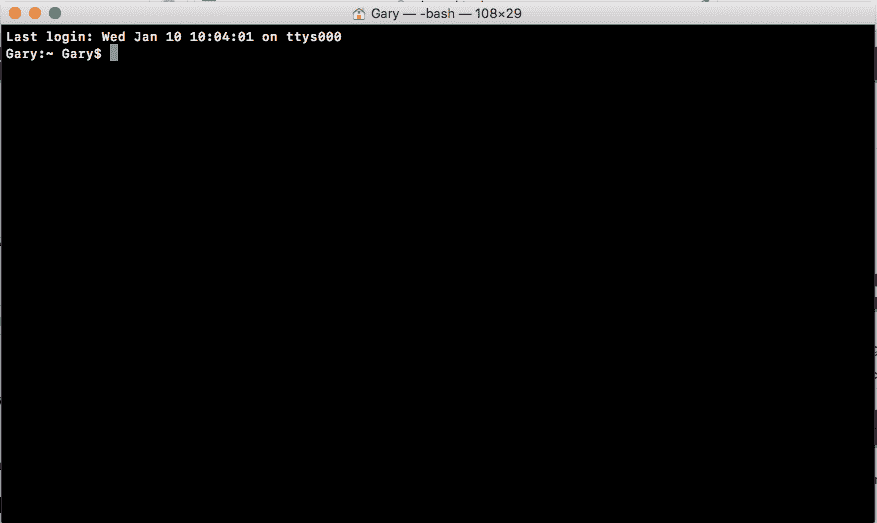

基本上，它在等待您运行一个命令。在整本书中，我们将从终端运行相当多的命令。我将在几节后讨论它，所以如果您以前从未使用过这个，您可以开始舒适地进行导航。

# Node.js 版本确认

在浏览器中，我们可以转到[nodejs.org](http://nodejs.org)下载最新版本的 Node 安装程序（如下所示）。在本书中，我们将使用最新版本 9.3.0：

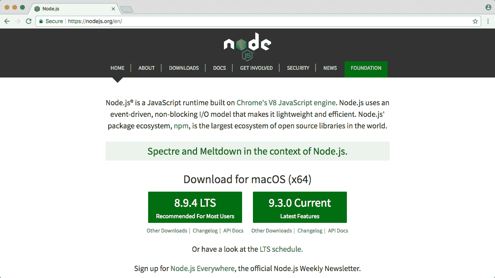

重要的是安装 Node.js 的 V8 版本。它不一定要是 4.0，可以是 1.0，但重要的是它在 V8 分支上，因为 V8 带来了大量新功能，包括您可能在浏览器中使用 ES6 喜欢的所有功能。

ES6 是 JavaScript 的下一个版本，它带来了很多我们将在整本书中使用的优秀增强功能。如果您查看下面的图片，Node.js 长期支持发布计划([`github.com/nodejs/LTS`](https://github.com/nodejs/LTS))，您会看到当前的 Node 版本是 V8，发布于 2017 年 4 月：

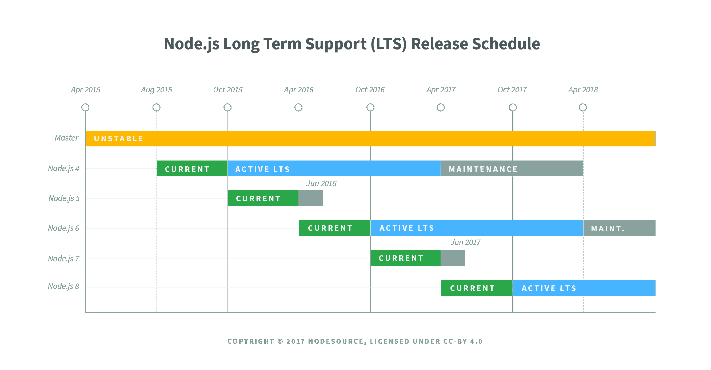

在继续之前，我想谈谈 Node 的发布周期。我在上面的图片中所看到的是官方发布周期，这是由 Node 发布的。您会注意到，只有在偶数 Node 版本旁边才会找到活跃的 LTS，蓝色条和维护条。现在，LTS 代表长期支持，这是推荐大多数用户使用的版本。我建议您坚持当前提供的 LTS 选项（Node v 8.9.4 LTS），尽管左侧的任何内容都可以，这显示在[nodejs.org](http://nodejs.org)上的两个绿色按钮上。

现在，您可以看到，主要版本号每六个月增加一次。无论有任何大的全面性变化，这都会像钟表一样发生，即使没有发生任何重大变化。这不像 Angular，从 1.0 跳到 2.0 几乎就像使用完全不同的库一样。这在 Node 中并不是这种情况，您从本书中得到的是 Node 所提供的最新和最好的东西。

# 安装 Node

一旦确认并选择了版本，我们所要做的就是在 Node 网站([nodejs.org](http://nodejs.org))上点击所需版本按钮并下载安装程序。安装程序是那种基本的*点击几次下一步就完成*类型的安装程序，不需要运行任何花哨的命令。我将启动安装程序。如下截图所示，它只会问几个问题，然后让我们通过所有问题点击下一步或继续：

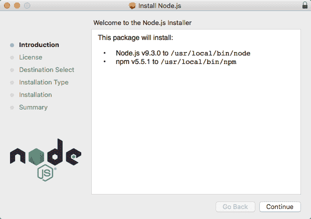

您可能想要指定自定义目标，但如果您不知道这意味着什么，并且通常在安装程序时不这样做，请跳过该步骤。在下一个截图中，您可以看到我只使用了 58.6 MB，没有问题。

我将通过输入我的密码来运行安装程序。一旦我输入密码，安装 Node 应该只需要几秒钟：

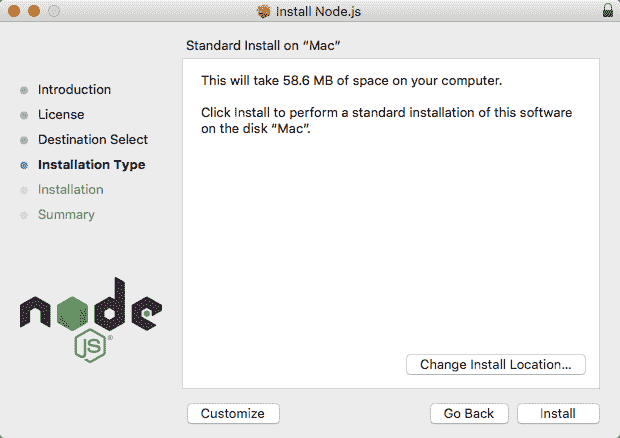

如下截图所示，我们有一条消息，说安装已成功完成，这意味着我们可以开始了：

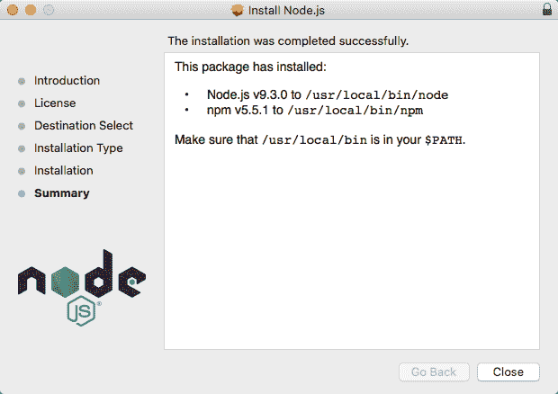

# 验证安装

现在 Node 已经成功安装，我们可以通过在终端中运行 Node 来验证。在终端中，我将通过退出终端并重新打开来关闭它：

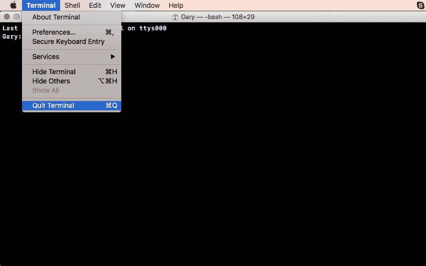

我之所以打开它是因为我们安装了一个新的命令，有些终端需要在运行新命令之前重新启动。

在我们的情况下，我们重新启动了一些东西，我们可以运行我们全新的命令，所以我们会输入它：

```js
node -v
```

在这个命令中，我们正在运行 Node 命令，并传入所谓的**标志**，即连字符后跟一个字母。它可以是`a`，可以是`j`，或者在我们的情况下是`v`。这个命令将打印当前安装的 Node 版本。

我们可能会遇到这样的错误：

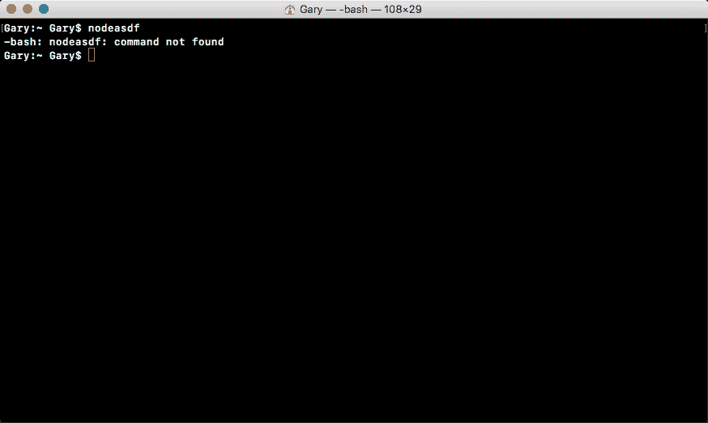

如果您尝试运行一个不存在的命令，比如`nodeasdf`，您将看到命令未找到。如果您看到这个，通常意味着 Node 安装程序没有正确工作，或者您根本没有运行它。

然而，在我们的情况下，使用`v`标志运行 Node 应该会得到一个数字。在我们的情况下，它是版本 9.3.0。如果您已经安装了 Node，并且看到类似下一个截图的东西，那么您已经完成了。在下一节中，我们将开始探索 Node 到底是什么。

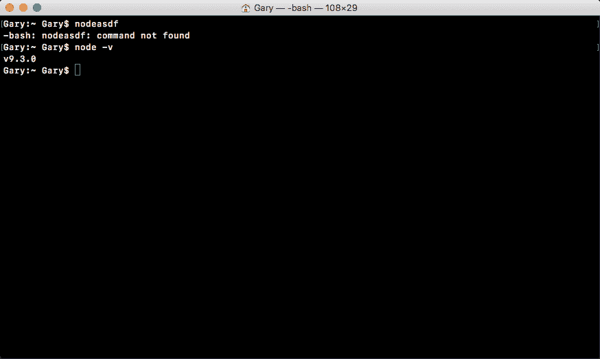

# 什么是 Node？

Node 诞生于原始开发人员将 JavaScript 带到了您的机器上作为一个独立的进程，而不仅仅是在浏览器中运行。这意味着我们可以在浏览器之外使用 JavaScript 创建应用程序。

现在，JavaScript 以前的功能集是有限的。当我在浏览器中使用它时，我可以做一些事情，比如更新 URL 和删除 Node 标志，添加点击事件或其他任何东西，但我实际上不能做更多。

有了 Node，我们现在有了一个看起来更类似于其他语言（如 Java、Python 或 PHP）的功能集。其中一些如下：

+   我们可以使用 JavaScript 语法编写 Node 应用程序

+   您可以操纵您的文件系统，创建和删除文件夹

+   您可以直接创建查询数据库

+   您甚至可以使用 Node 创建 Web 服务器

这些是过去不可能的事情，现在却因为 Node 而成为可能。

现在，Node 和在浏览器中执行的 JavaScript 都在完全相同的引擎上运行。它被称为 V8 JavaScript 运行时引擎。这是一个将 JavaScript 代码编译成更快的机器代码的开源引擎。这是 Node.js 如此快速的一个重要部分。

机器码是低级代码，你的计算机可以直接运行它，而无需解释。你的计算机只知道如何运行某些类型的代码，例如，你的计算机不能直接运行 JavaScript 代码或 PHP 代码，而是需要先将其转换为低级代码。

使用这个 V8 引擎，我们可以将我们的 JavaScript 代码编译成更快的机器码，并执行它。这就是所有这些新功能的来源。V8 引擎是用一种叫做 C++的语言编写的。因此，如果你想扩展 Node 语言，你不会编写 Node 代码，而是编写建立在 V8 已有基础上的 C++代码。

现在，我们不会在这本书中编写任何 C++代码。这本书不是关于扩展 Node，而是关于使用 Node。因此，我们只会编写 JavaScript 代码。

说到 JavaScript 代码，让我们开始在终端内编写一些。在整本书中，我们将创建文件并执行这些文件，但我们实际上可以通过运行`node`命令来创建一个全新的 Node 进程。

参考下面的截图，我有一个小的右尖括号，它正在等待 JavaScript Node 代码，而不是一个新的命令提示符命令：

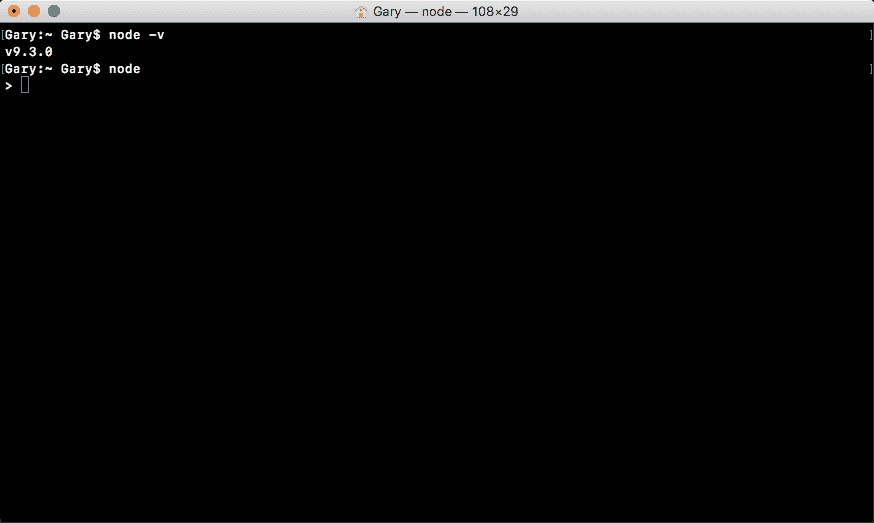

这意味着我可以运行像`console.log`这样的东西，你可能已经知道，它会将消息记录到屏幕上。`log`是一个函数，所以我会像这样调用它，打开和关闭括号，并在两个单引号内传递一个字符串，一个消息`Hello world!`，就像下面的命令行中所示：

```js
console.log('Hello world!');
```

这将在屏幕上打印出 Hello world。如果我按下*enter*，Hello world！就会像你期望的那样打印出来，就像下面的代码输出中所示：

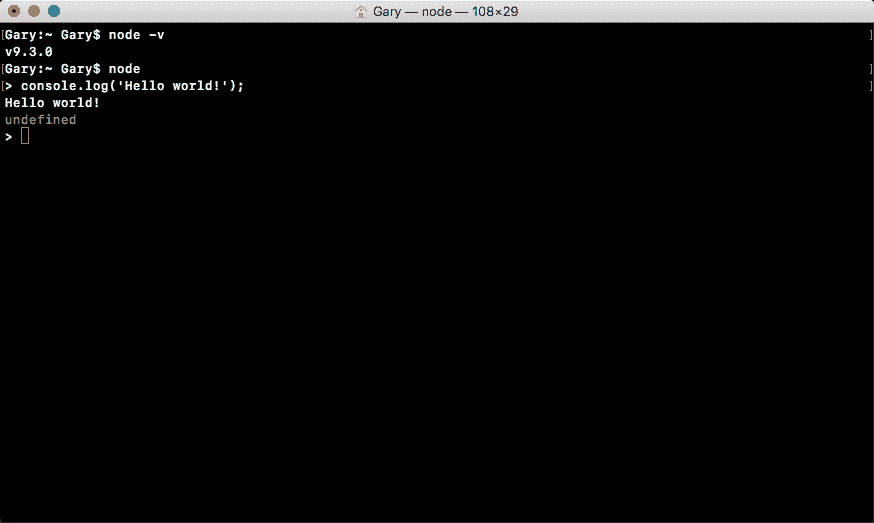

现在，在幕后实际发生了什么？这就是 Node 的工作原理。它接受你的 JavaScript 代码，将其编译成机器码，然后执行它。在上面的代码中，你可以看到它执行了我们的代码，打印出了 Hello world！现在，当我们执行这个命令时，V8 引擎在幕后运行，并且也在 Chrome 浏览器内运行。

如果我在 Chrome 中打开开发者工具，可以通过设置 | 更多工具 | 开发者工具来实现：

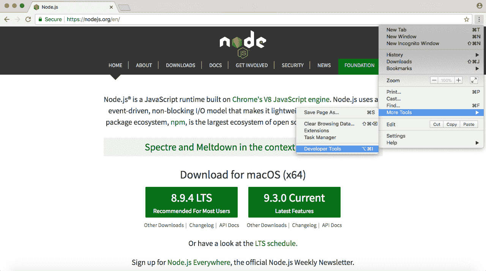

我可以忽略大部分的东西。我只是在寻找控制台选项卡，就像下面的截图中所示的那样：

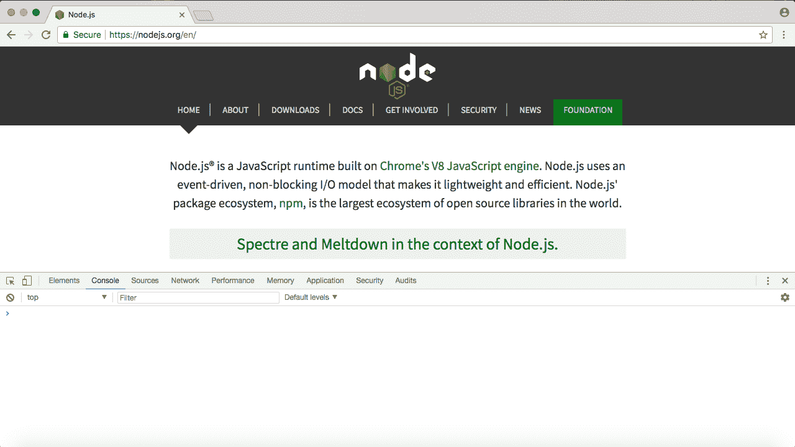

上面的截图显示了控制台，这是一个可以运行一些 JavaScript 代码的地方。我可以输入完全相同的命令`console.log('Hello world!');`并运行它：

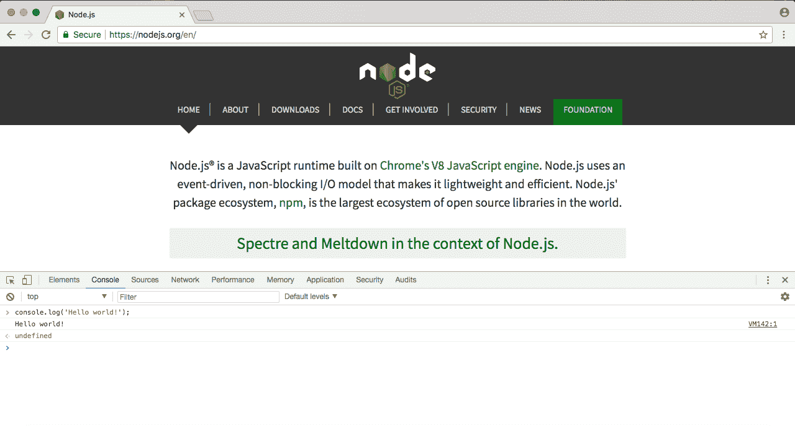

正如你在上面的截图中所看到的，Hello world！打印到了屏幕上，这与我们之前在终端中运行时得到的完全相同的结果。在这两种情况下，我们都是通过 V8 引擎运行它，输出也是相同的。

现在，我们已经知道这两者是不同的。Node 具有文件系统操作等功能，而浏览器具有操作窗口内显示内容的功能。让我们花点时间来探索它们的区别。

# 使用 Node 和浏览器进行 JavaScript 编码的区别

在浏览器中，如果你进行过任何 JavaScript 开发，你可能已经使用过`window`：

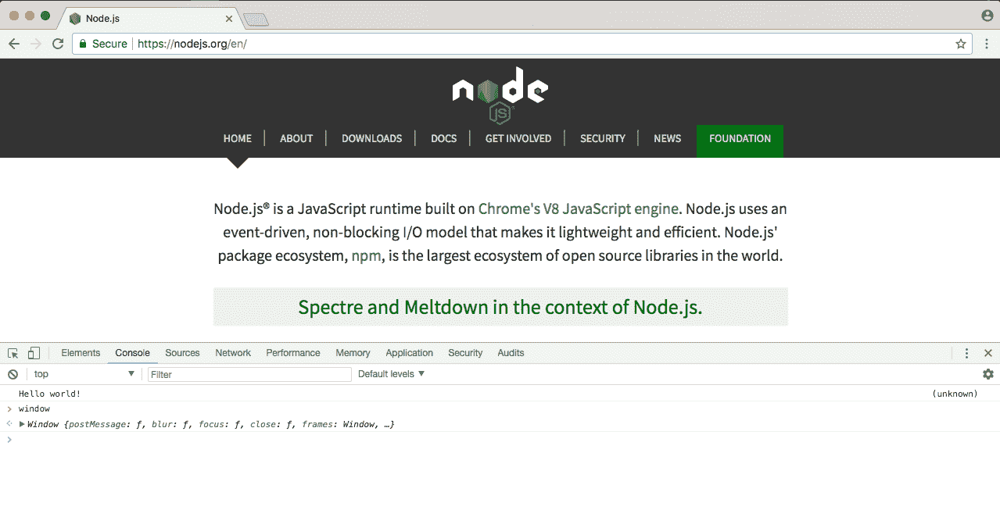

Window 是全局对象，它基本上存储了你可以访问的一切。在下面的截图中，你可以看到诸如数组、各种 CSS 操作和 Google Analytics 关键字等内容；基本上你创建的每个变量都存在于 Window 内：

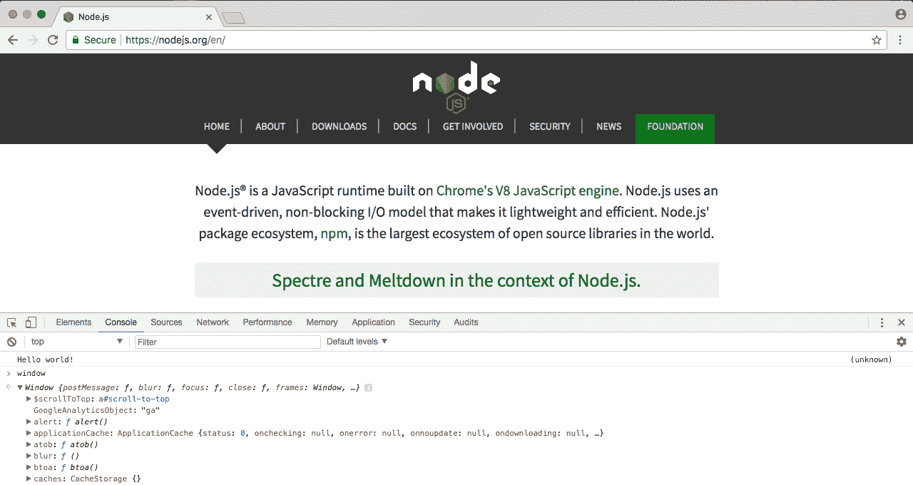

在 Node 内部，我们有一个类似的东西叫做`global`，如下所示：

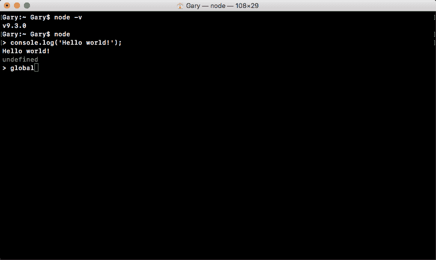

它不叫`window`，因为在 Node 中没有浏览器窗口，因此它被称为`global`。`global`对象存储了许多与`window`相同的东西。在下面的截图中，你可以看到一些可能很熟悉的方法，比如`setTimeout`和`setInterval`：

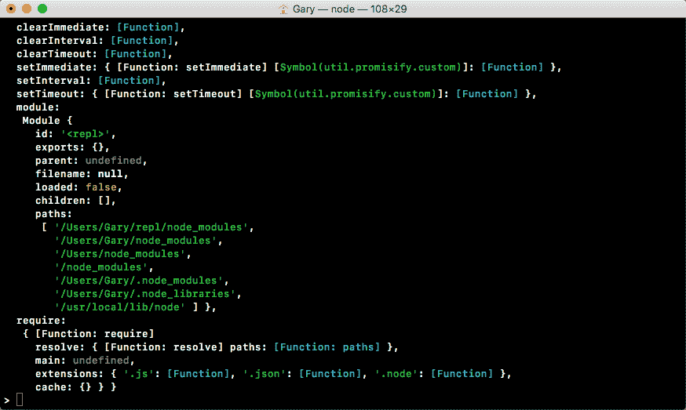

如果我们看一下这段代码的截图，我们会发现大部分东西都是在 window 中定义的，只有一些例外，如下面的截图所示：

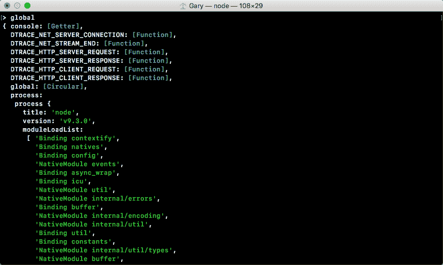

现在，在 Chrome 浏览器中，我也可以访问`document`：

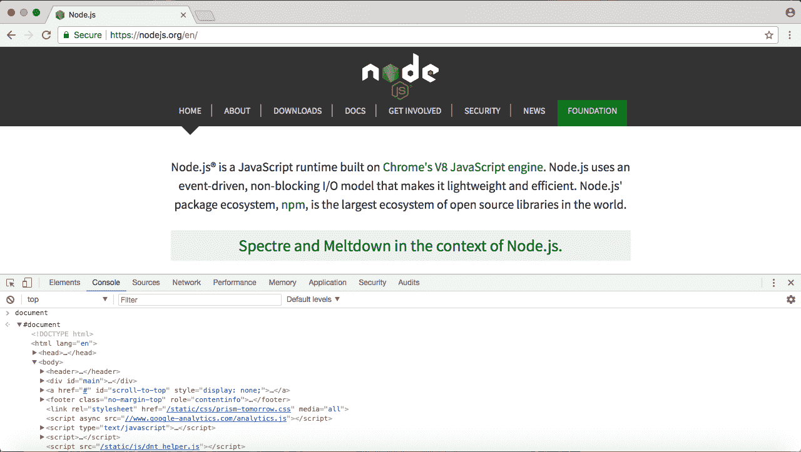

`document`对象在 Node 网站中存储了对**文档对象模型**（**DOM**）的引用。`document`对象显示了我在浏览器视口中的内容，如下面的截图所示：

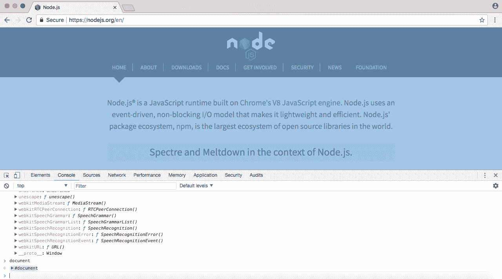

我可以更改文档以更新在浏览器视口中显示的内容。当然，在 Node 中我们没有这个 HTML `document`，但我们有类似的东西，叫做`process`。你可以通过从 Node 运行 process 来查看它，在下面的截图中，我们有关于正在执行的特定 Node 进程的大量信息：

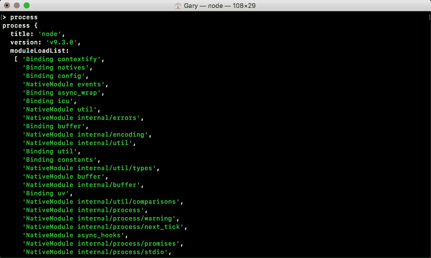

这里还有一些方法可以关闭当前的 Node 进程。我想让你运行`process.exit`命令，并将数字零作为参数传入，表示退出时没有错误：

```js
process.exit(0);
```

当我运行这个命令时，你可以看到我现在回到了命令提示符，如下面的截图所示：

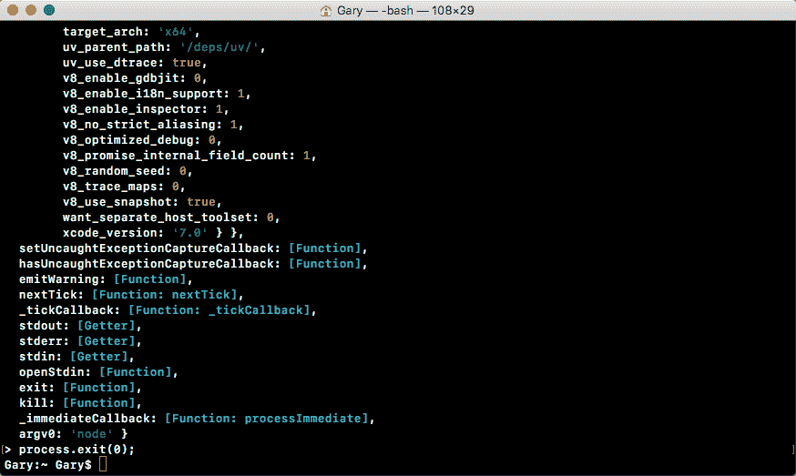

我已经离开了 Node，现在可以运行任何常规的命令提示符命令，比如检查我的 Node 版本。我可以通过运行`node`随时重新进入 Node，并且可以通过两次按下*control* + *C*来离开，而不使用`process.exit`命令。

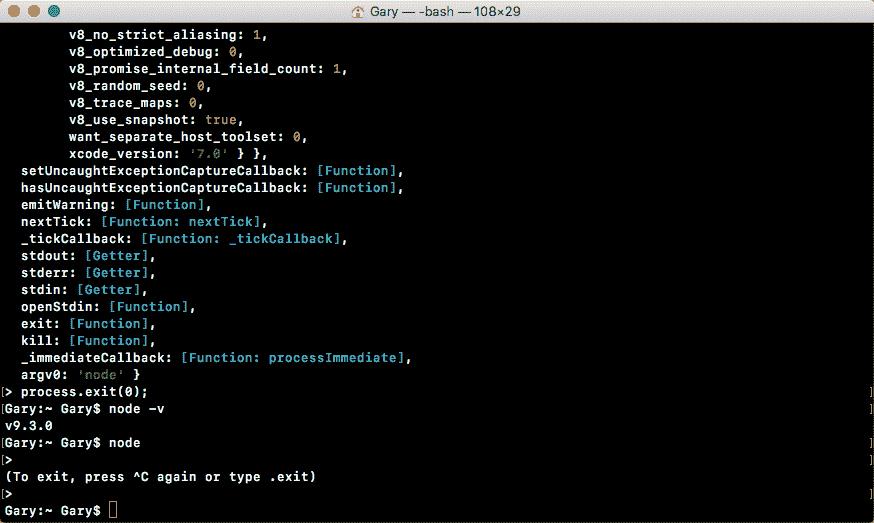

现在，我又回到了我的常规命令提示符。所以，这些是显而易见的差异，在浏览器中你有可视区域，window 变成了 global，而 document 基本上变成了 process。当然，这是一个概括，但这些是一些大的变化。我们将在整本书中探索所有细微之处。

现在，当有人问你什么是 Node 时，你可以说*Node 是一个使用 V8 引擎的 JavaScript 运行时*。当他们问你 V8 引擎是什么时，你可以说*V8 引擎是一个用 C++编写的开源 JavaScript 引擎，它接受 JavaScript 代码并将其编译成机器代码。它被用在 Node.js 内部，也被用在 Chrome 浏览器中*。

# 为什么使用 Node

在本节中，我们将探讨 Node.js 背后的原因。为什么它在创建后端应用方面如此出色？为什么像 Netflix、Uber 和 Walmart 这样的公司正在越来越多地使用 Node.js 在生产中？

正如你可能已经注意到的，由于你正在学习这门课程，当人们想要学习一门新的后端语言时，他们越来越多地转向 Node 作为他们想要学习的语言。Node 技能组合需求很高，无论是需要每天使用 Node 来编译他们的应用程序的前端开发人员，还是使用 Node.js 创建应用程序和实用程序的工程师。所有这些都使 Node 成为了首选的后端语言。

现在，如果我们看一下 Node 的主页，我们会发现三个句子，如下面的截图所示：

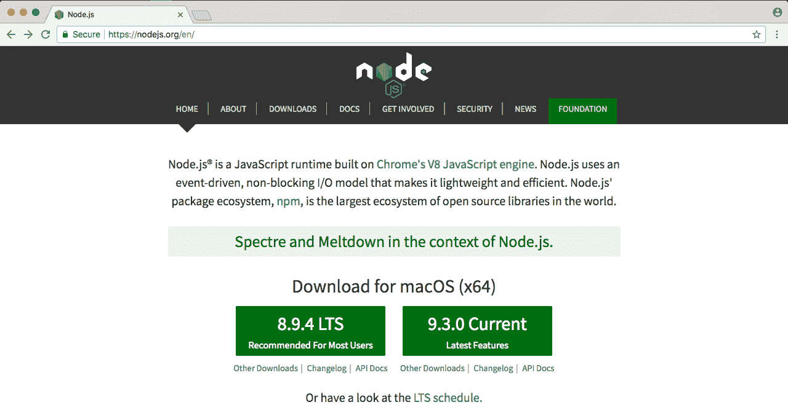

在上一节中，我们解释了第一个句子。我们看了 Node.js 是什么。图片中只有三个句子，所以在本节中，我们将看一下后面的两个句子。我们现在来读一下，然后我们将分解它，学习 Node 为什么如此出色。

第一句话，Node.js 使用事件驱动的、非阻塞 I/O 模型，使其轻量高效；我们现在将探索所有这些。第二句话，我们将在本节结束时探讨——Node.js 的打包生态系统 npm 是世界上最大的开源库生态系统。现在，这两句话中包含了大量的信息。

我们将介绍一些代码示例，深入研究一些图表和图形，探讨 Node 的不同之处以及它的优点。

Node 是一个事件驱动的、非阻塞的语言。那么，什么是 I/O？I/O 是您的应用程序一直在做的事情。当您读取或写入数据库时，这就是 I/O，它是输入/输出的缩写。

这是您的 Node 应用程序与物联网中其他事物的通信。这可能是数据库读写请求，您可能正在更改文件系统中的一些文件，或者您可能正在向单独的 Web 服务器发出 HTTP 请求，例如 Google API，以获取用户当前位置的地图。所有这些都使用 I/O，而 I/O 需要时间。

非阻塞 I/O 非常好。这意味着当一个用户从 Google 请求 URL 时，其他用户可以请求数据库文件读写访问，他们可以请求各种各样的事情，而不会阻止其他人完成一些工作。

# 阻塞和非阻塞软件开发

让我们继续看看阻塞和非阻塞软件开发之间的区别：

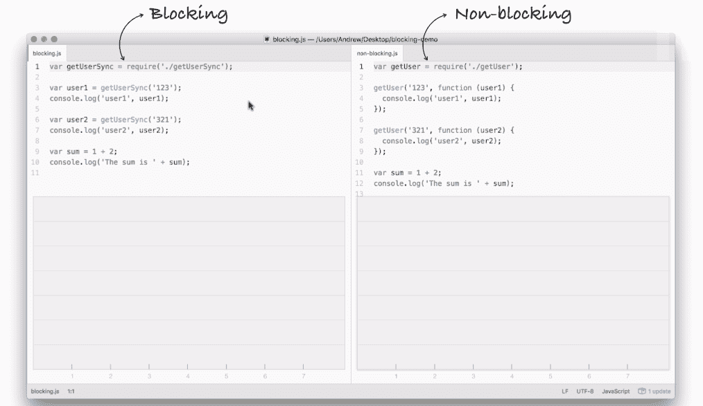

在前面的截图中，我有两个将要执行的文件。但在进行之前，首先让我们探索每个文件的操作方式，以及完成程序所需的步骤。 

这将帮助我们了解阻塞和非阻塞之间的重大差异，我在图像的左侧显示了阻塞，这不是 Node 使用的方式，而非阻塞在右侧，这正是我们书中所有 Node 应用程序的运行方式。

您不必了解诸如 require 之类的具体细节，才能理解这个代码示例中发生了什么。我们将以非常一般的方式来分解事物。每个代码的第一行负责获取一个被调用的函数。这个函数将是我们模拟的 I/O 函数，它将去数据库，获取一些用户数据并将其打印到屏幕上。

请参考前面的代码图像。在我们加载函数之后，两个文件都尝试使用 ID 为`123`的用户。当它获取到该用户时，首先打印`user1`字符串到屏幕上，然后继续获取 ID 为`321`的用户，并将其打印到屏幕上。最后，两个文件都将`1 + 2`相加，将结果 3 存储在`sum`变量中，并将其打印到屏幕上。

尽管它们都做同样的事情，但它们的方式却大不相同。让我们逐步分解各个步骤。在下面的代码图像中，我们将介绍 Node 执行的内容以及所需的时间：

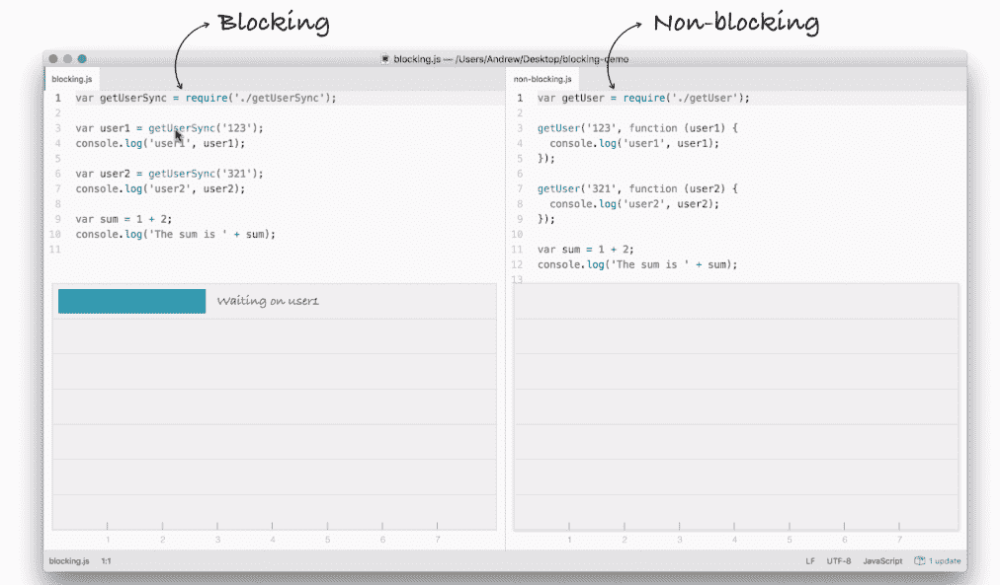

您可以考虑前面截图中显示的秒数；这并不重要，只是为了显示两个文件之间的相对操作速度。

# 阻塞 I/O 的工作方式

阻塞示例可以如下所示：

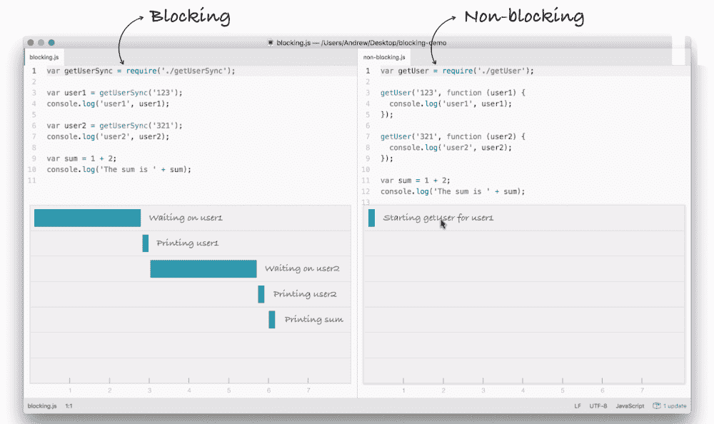

在我们的阻塞示例中，首先发生的事情是我们在代码的第 3 行获取用户：

```js
var user1 = getUserSync('123');
```

现在，这个请求需要我们去数据库，这是一个 I/O 操作，需要一点时间。在我们的例子中，我们将说它需要三秒。

接下来，在代码的第 4 行，我们将用户打印到屏幕上，这不是一个 I/O 操作，它会立即运行，将`user1`打印到屏幕上，如下图所示：

```js
console.log('user1', user1); 
```

正如你在下面的屏幕截图中所看到的，这几乎不需要时间：

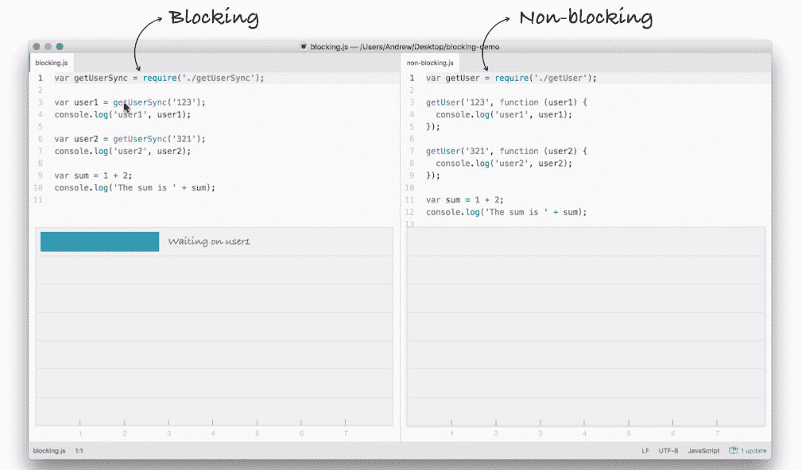

接下来，我们等待获取`user2`：

```js
var user2 = getUserSync('321');
```

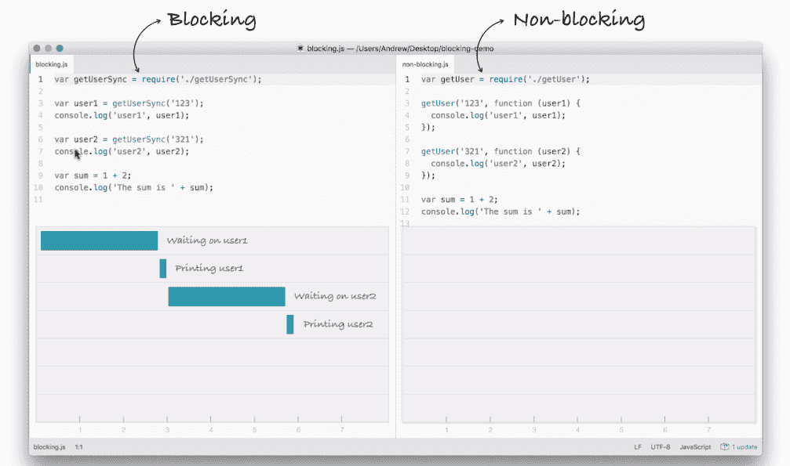

当`user2`返回时，正如你所期望的那样，我们将其打印到屏幕上，这正是第 7 行发生的事情：

```js
console.log('user2', user2);
```

最后，我们将数字相加并将其打印到屏幕上：

```js
var sum = 1 + 2; 
console.log('The sum is ' + sum); 
```

这些都不是 I/O 操作，所以在这里，我们的总和几乎立即打印到屏幕上。

这就是阻塞的工作原理。它被称为阻塞，因为当我们从数据库获取数据时，也就是进行 I/O 操作时，我们的应用程序无法做其他任何事情。这意味着我们的机器会空闲地等待数据库的响应，甚至不能做一些简单的事情，比如将两个数字相加并将它们打印到屏幕上。在阻塞系统中这是不可能的。

# 工作中的非阻塞 I/O

在我们的非阻塞示例中，这就是我们将构建我们的 Node 应用程序的方式。

让我们逐行分解这个代码示例。首先，事情的开始方式与我们在阻塞示例中讨论的方式非常相似。我们将为`user1`启动`getUser`函数，这正是我们之前所做的：

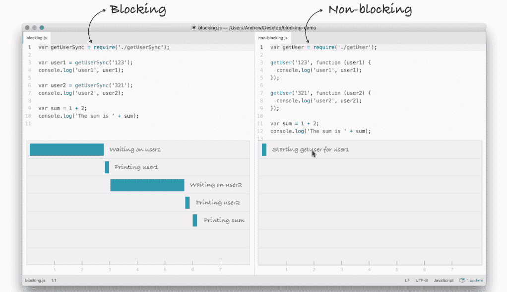

但我们并没有等待，我们只是启动了那个事件。这都是 Node.js 内部事件循环的一部分，我们将会详细探讨这个问题。

请注意，这需要一点时间；我们只是开始请求，我们并没有等待数据。我们接下来要做的可能会让你感到惊讶。我们没有将`user1`打印到屏幕上，因为我们仍在等待该请求返回，而是开始获取 ID 为`321`的`user2`的过程：

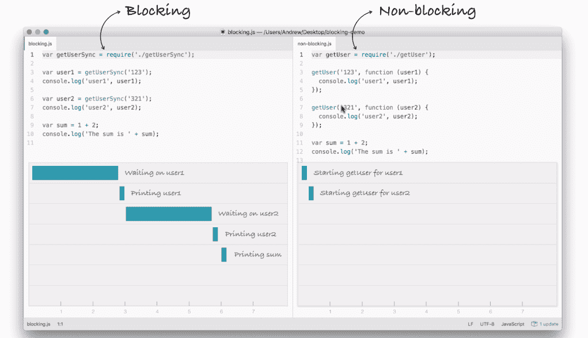

在代码的这一部分中，我们启动了另一个事件，这需要一点时间来完成-这不是一个 I/O 操作。现在，在幕后，数据库的获取是 I/O 操作，但启动事件，调用这个函数并不是，所以它会非常快速地发生。

接下来，我们打印总和。总和与这两个用户对象无关。它们基本上没有关联，所以在打印`sum`变量之前，我们不需要等待用户返回，如下面的屏幕截图所示：

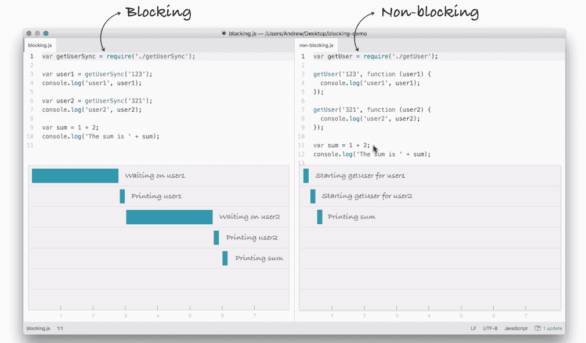

打印总和之后会发生什么？嗯，我们有点线框，如下面的屏幕截图所示：

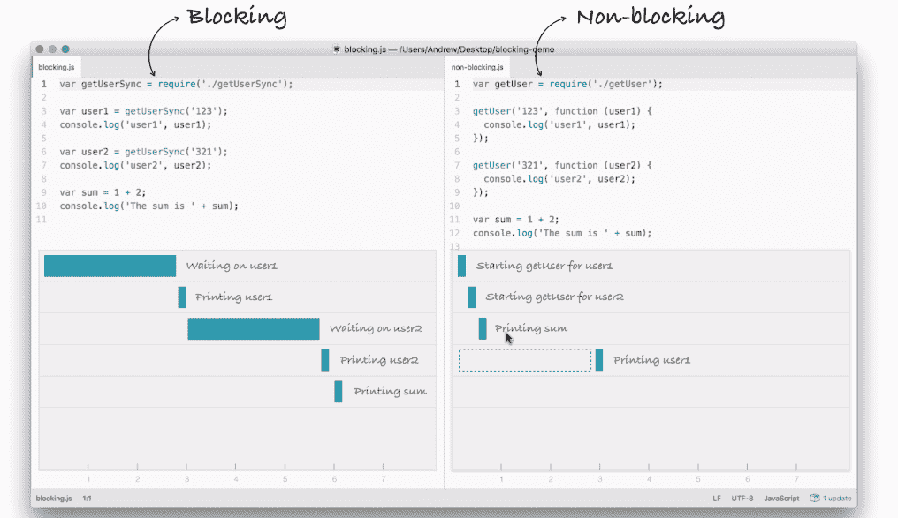

这个框表示我们的事件得到响应所需的模拟时间。现在，这个框的宽度与阻塞示例的第一部分（等待 user1）中的框完全相同，如下所示：

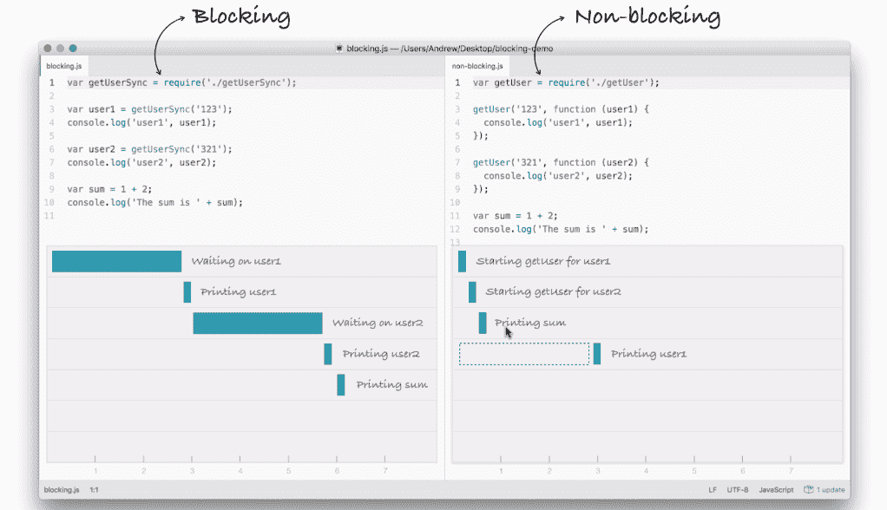

使用非阻塞并不会使我们的 I/O 操作变得更快，但它可以让我们同时运行多个操作。

在非阻塞的例子中，我们在半秒钟之前启动了两个 I/O 操作，在三秒半之间，两者都返回，如下面的屏幕截图所示：

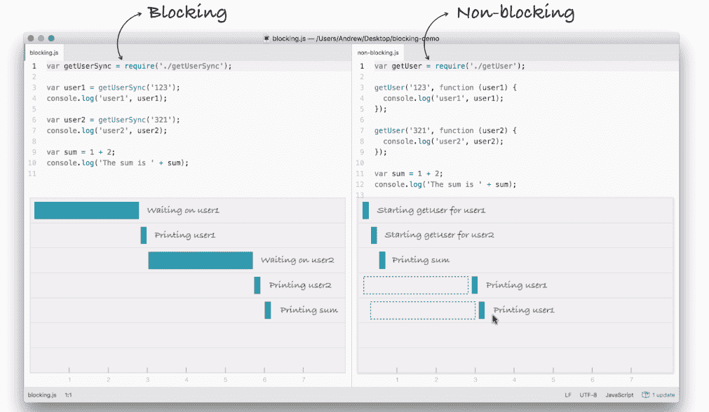

现在，结果是整个应用程序完成得更快。如果比较执行这两个文件所花费的时间，非阻塞版本在三秒多一点结束，而阻塞版本则需要六秒多一点。相差 50%。这 50%来自于阻塞中我们有两个请求，每个请求需要三秒，而在非阻塞中，我们有两个请求，每个请求需要三秒，但它们同时运行。

使用非阻塞模式，我们仍然可以做一些事情，比如打印总和，而不必等待数据库回应。现在，这就是两者之间的重大区别；阻塞，一切按顺序发生，在非阻塞中，我们启动事件，附加回调，这些回调稍后被触发。我们仍然打印出`user1`和`user2`，只是当数据返回时才这样做，因为数据不会立即返回。

在 Node.js 中，事件循环会为事件附加一个监听器，比如数据库回应完成。当它完成时，在非阻塞情况下调用你传递的回调函数，然后我们将其打印到屏幕上。

现在，想象一下这是一个网页服务器，而不是前面的例子。这意味着如果一个网页服务器来查询数据库，我们不能处理其他用户的请求而不启动一个单独的线程。现在，Node.js 是单线程的，这意味着你的应用程序在一个单一的线程上运行，但由于我们有非阻塞 I/O，这不是一个问题。

在阻塞的情况下，我们可以在两个单独的线程上处理两个请求，但这并不是很好扩展，因为对于每个请求，我们都必须增加应用程序使用的 CPU 和 RAM 资源的数量，而且这很糟糕，因为这些线程仍然处于空闲状态。仅仅因为我们可以启动其他线程并不意味着我们应该这样做，我们正在浪费没有做任何事情的资源。

在非阻塞的情况下，我们不是通过创建多个线程来浪费资源，而是在一个线程上做所有事情。当一个请求进来时，I/O 是非阻塞的，所以我们不会占用比根本没有发生更多的资源。

# 使用终端的阻塞和非阻塞示例

让我们实时运行这些示例，看看我们得到什么。我们有两个文件（`blocking`和`non-blocking`文件），我们在上一节中看到了。

我们将运行这两个文件，我正在使用 Atom 编辑器来编辑我的文本文件。这些是我们将在本节后面设置的东西，这只是为了让你看看，你不需要运行这些文件。

现在，`blocking`和`non-blocking`文件，都将被运行，并且它们将以不同的方式做与我们在上一节中所做的类似的事情。两者都使用 I/O 操作，`getUserSync`和`getUser`，每个操作需要 5 秒。时间没有区别，只是它们执行的顺序使非阻塞版本快得多。

现在，为了模拟和展示工作原理，我将添加一些`console.log`语句，如下面的代码示例所示，`console.log('starting user1')`，`console.log('starting user2')`。

这将让我们看到终端内部的工作原理。通过运行`node blocking.js`，这就是我们运行文件的方式。我们输入`node`，然后指定文件名，如下面的代码所示：

```js
 node blocking.js 
```

当我运行文件时，我们会得到一些输出。开始用户 1 打印到屏幕上，然后停在那里：

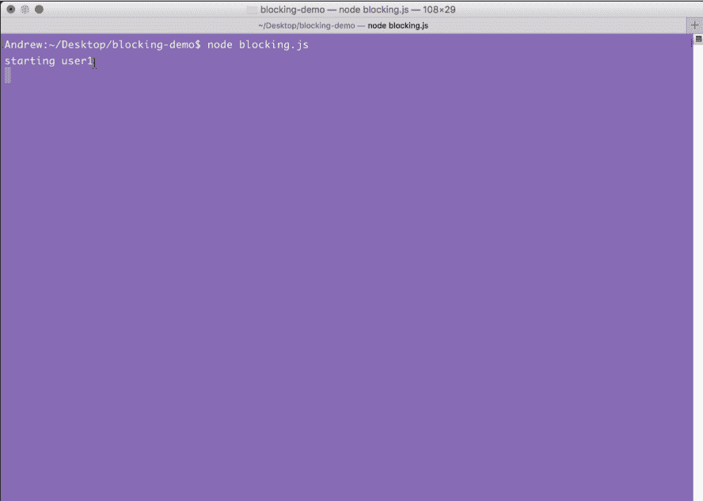

现在，我们有用户 1 对象打印到屏幕上，名字是 Andrew，并且开始用户 2 打印到屏幕上，如下面的代码输出所示：

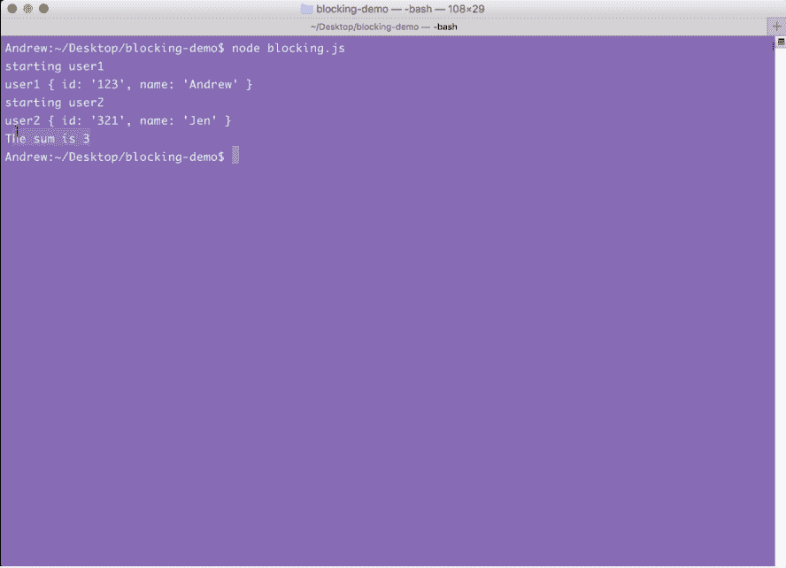

之后，大约 5 秒后，用户 2 对象带着名字 Jen 回来。

如前面的屏幕截图所示，我们的两个用户已经打印到屏幕上，最后我们的总和，即 3，打印到屏幕上；一切都很顺利。

请注意，开始用户 1 立即后面就是用户 1 的完成，开始用户 2 立即后面就是用户 2 的完成，因为这是一个阻塞应用程序。

现在，我们将运行非阻塞文件，我称之为`non-blocking.js`。当我运行这个文件时，开始用户 1 打印，开始用户 2 打印，然后总和连续打印：

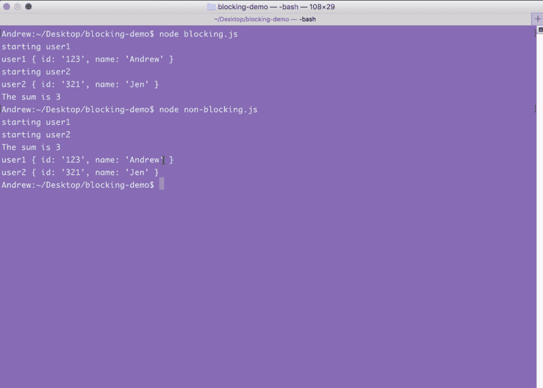

大约 5 秒后，基本上在同一时间，用户 1 和用户 2 都在屏幕上打印出来。

这就是非阻塞的工作原理。仅仅因为我们启动了一个 I/O 操作，并不意味着我们不能做其他事情，比如启动另一个操作并将一些数据打印到屏幕上，在这种情况下只是一个数字。这就是重大的区别，也是非阻塞应用程序如此出色的地方。它们可以在完全相同的时间做很多事情，而不必担心多线程应用程序的混乱。

让我们回到浏览器，再次查看 Node 网站上的那些句子：

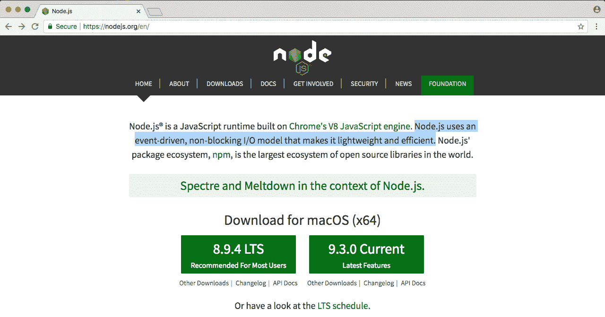

Node.js 使用事件驱动的、非阻塞的 I/O 模型，使其轻量级和高效，我们在实际操作中看到了这一点。

因为 Node 是非阻塞的，我们能够将应用程序所需的时间减少了一半。这种非阻塞 I/O 使我们的应用程序非常快速，这就是轻量级和高效的作用所在。

# Node 社区-解决问题的开源库

现在，让我们去看 Node 网站上的最后一句话，如下截图所示：

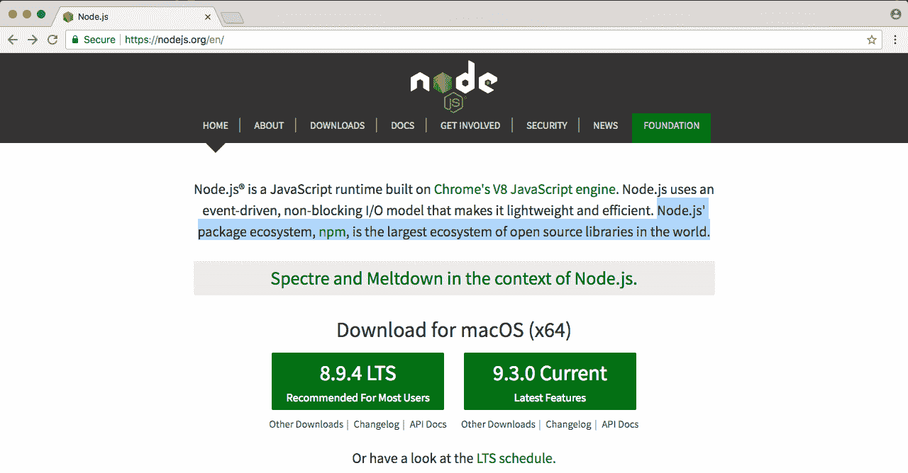

Node.js 的软件包生态系统 npm 是世界上最大的开源库生态系统。这正是使 Node 如此出色的地方。这是锦上添花-社区，每天都有人开发新的库，解决 Node.js 应用程序中的常见问题。

诸如验证对象、创建服务器以及使用套接字实时提供内容等事情。所有这些都已经有库构建好了，所以你不必担心这些。这意味着你可以专注于与你的应用程序相关的特定事物，而不必在你甚至写真正的代码之前创建所有这些基础设施，这些代码是针对你应用程序的特定用例的。

现在，npm 可以在[npmjs.org](http://npmjs.org)上找到，这是我们将寻求许多第三方模块的网站：

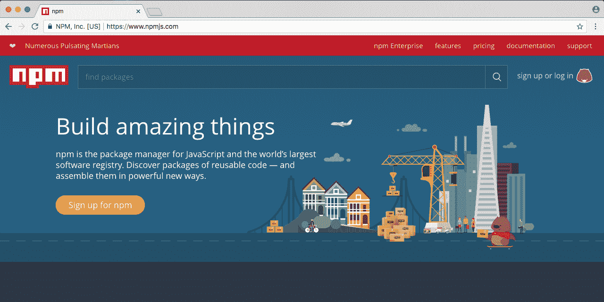

如果你试图在 Node 中解决一个通用的问题，很有可能已经有人解决了。例如，如果我想验证一些对象，比如我想验证一个名字属性是否存在，以及是否有一个长度为三的 ID。我可以去谷歌或者去 npm；我通常选择谷歌，然后搜索`npm validate object`。

当我谷歌搜索时，我只会寻找[npmjs.com](http://npmjs.com)的结果，你可以发现前三个结果都来自那里：

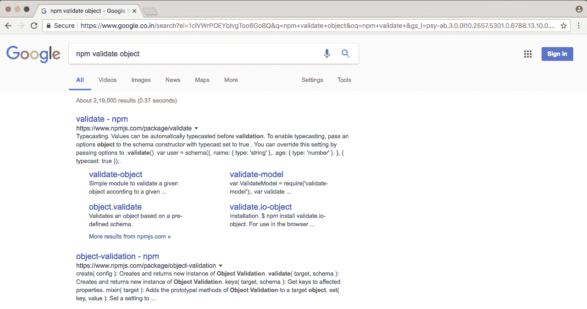

我可以点击第一个，这将让我探索文档，看看它是否适合我：

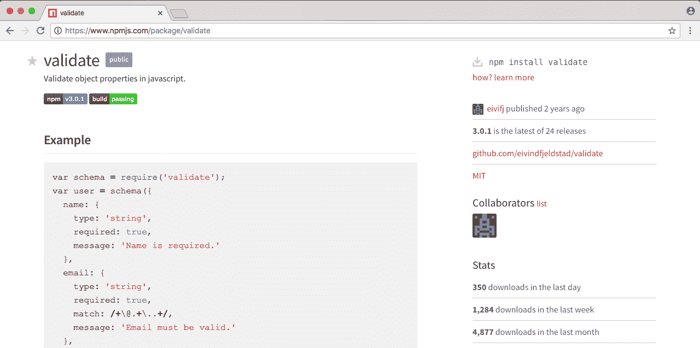

这个看起来很不错，所以我可以毫不费力地将它添加到我的应用程序中。

现在，我们将通过这个过程。别担心，我不会让你不知所措地如何添加第三方模块。我们将在书中使用大量的第三方模块，因为这才是真正的 Node 开发者所做的。他们利用了出色的开发者社区，这也是使 Node 如此出色的最后一点。

这就是为什么 Node 能够达到当前的强大地位，因为它是非阻塞的，这意味着它非常适合 I/O 应用程序，并且有一个出色的开发者社区。因此，如果你想要完成任何事情，有可能已经有人编写了代码来完成它。

这并不是说你永远不应该再次使用 Rails 或 Python 或任何其他阻塞语言，这不是我的意思。我真正想向你展示的是 Node.js 的强大之处，以及你如何使你的应用程序变得更好。像 Python 这样的语言有一些库，比如旨在为 Python 添加非阻塞特性的 Twisted。尽管存在一个大问题，那就是所有的第三方库仍然是以阻塞方式编写的，所以你在使用哪些库方面受到了很大的限制。

由于 Node 是从头开始构建的非阻塞式，[npmjs.com](http://npmjs.com)上的每个库都是非阻塞式的。所以你不必担心找到一个是非阻塞式的还是阻塞式的；你可以安装一个模块，知道它是从头开始使用非阻塞式思想构建的。

在接下来的几节中，你将编写你的第一个应用程序，并从终端运行它。

# 不同的文本编辑器用于节点应用程序

在这一节中，我想给你介绍一下你可以用来阅读本书的各种文本编辑器。如果你已经有一个你喜欢使用的，你可以继续使用你已经有的。在本书中，没有必要更换编辑器来完成任何工作。

现在，如果你没有一个，并且正在寻找一些选择，我总是建议使用**Atom**，你可以在[atom.io](http://atom.io)找到它。它是免费的，开源的，并且可以在所有操作系统上使用，包括 Linux、macOS 和 Windows。它是由 GitHub 背后的人创建的，这是我在本书中将要使用的编辑器。有一个很棒的主题和插件开发社区，所以你真的可以根据自己的喜好进行定制。

除了 Atom 之外，还有一些其他选择。我听到很多人在谈论**Visual Studio Code**。它也是开源的，免费的，并且可以在所有操作系统上使用。如果你不喜欢 Atom，我强烈建议你试试这个，因为我听到很多好评。

接下来，我们总是有**Sublime Text**，你可以在[sublimetext.com](http://sublimetext.com)找到。现在，Sublime Text 并不是免费的，也不是开源的，但是很多人确实喜欢使用它。我更喜欢 Atom，因为它与 Sublime Text 非常相似，但我觉得它更快速、更容易使用，而且它是免费和开源的。

现在，如果你正在寻找一个更高级的编辑器，拥有所有 IDE 的功能，而不是一个文本编辑器，我总是推荐**JetBrains**。他们的产品都不是免费的，尽管它们都有 30 天的免费试用期，但它们确实是最好的工具。如果你发现自己处于公司环境中，或者你在一家公司愿意为编辑器付费的工作中，我总是建议你选择 JetBrains。他们的所有编辑器都配备了你所期望的所有工具，比如版本控制集成、调试工具和内置的部署工具。

所以，请花点时间，下载你想要使用的，玩弄一下，确保它符合你的需求，如果不符合，再尝试另一个。

# Hello World - 创建和运行第一个 Node 应用程序

在这一节中，你将创建并运行你的第一个 Node 应用程序。嗯，它将是一个简单的应用程序。它将演示整个过程，从创建文件到从终端运行它们。

# 创建 Node 应用程序

第一步是创建一个文件夹。我们创建的每个项目都将放在自己的文件夹中。我将在 macOS 上打开**Finder**并导航到我的桌面。我希望你也能在你的操作系统上打开桌面，无论你是在 Linux、Windows 还是 macOS 上，并创建一个名为`hello-world`的全新文件夹。

我不建议在项目文件或文件夹名称中使用空格，因为这只会使在终端内导航变得更加混乱。现在，我们有了这个`hello-world`文件夹，我们可以在编辑器中打开它。

现在我将使用 c*ommand* + *O*（Windows 用户为*Ctrl* + *O*）来打开，然后我将导航到桌面并双击我的 hello-world 文件夹，如下所示：

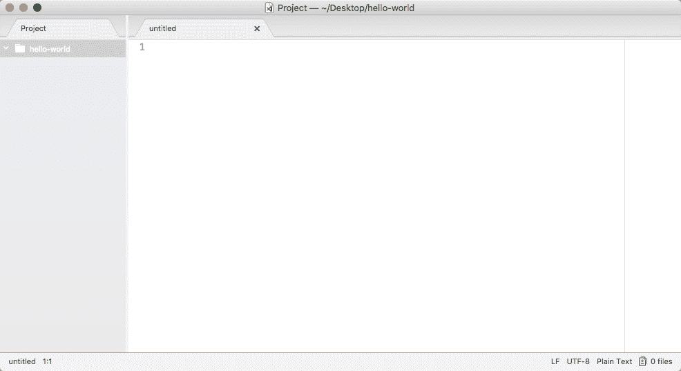

在左边，我有我的文件，没有。所以，让我们创建一个新的。我将在项目的根目录中创建一个新文件，我们将把它命名为`app.js`，如下所示：

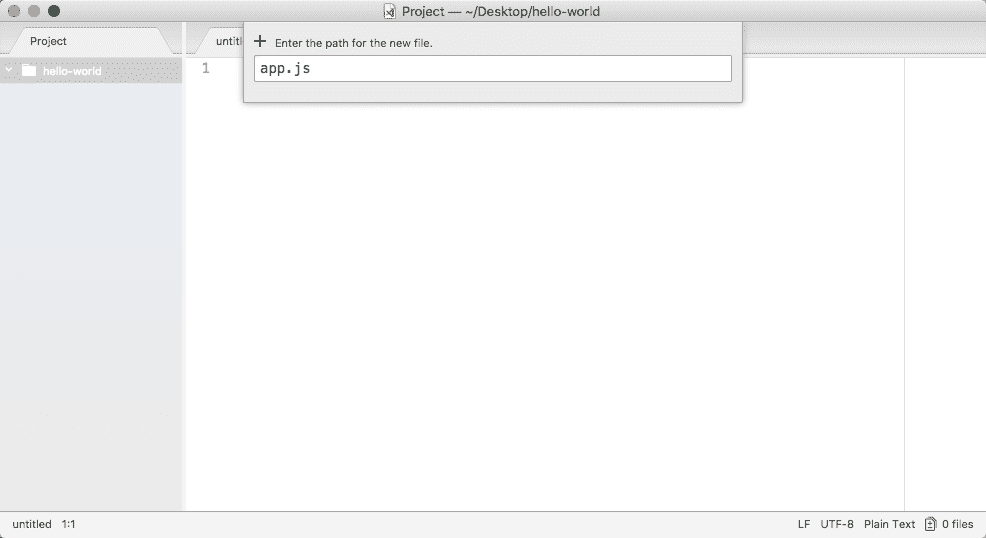

这将是我们在 Node 应用程序中唯一的文件，而且在这个文件中，我们可以编写一些代码，当我们启动应用程序时，它将被执行。

在未来，我们将做一些疯狂的事情，比如初始化数据库和启动 Web 服务器，但现在我们将简单地使用`console.log`，这意味着我们正在访问控制台对象上的日志属性。这是一个函数，所以我们可以用括号调用它，然后我们将一个字符串作为一个参数传递进去，`Hello world!`。我会在末尾加上一个分号并保存文件，如下所示的代码：

```js
console.log('Hello world!');
```

这将是我们运行的第一个应用程序。

现在，请记住，这门课程有一个基本的 JavaScript 要求，所以这里的任何东西对你来说都不应该太陌生。我将在这门课程中涵盖所有新鲜的内容，但基础知识，比如创建变量，调用函数，这些应该是你已经熟悉的。

# 运行 Node 应用程序

现在我们有了`app.js`文件，唯一剩下的事情就是运行它，我们将在终端中进行。现在，要运行这个程序，我们必须导航到我们的项目文件夹中。如果你对终端不熟悉，我会给你一个快速的复习。

你可以随时使用`pwd`在 Linux 或 macOS 上，或者在 Windows 上使用`dir`命令来查看你所在的位置。当你运行它时，你会看到类似于以下截图的内容：

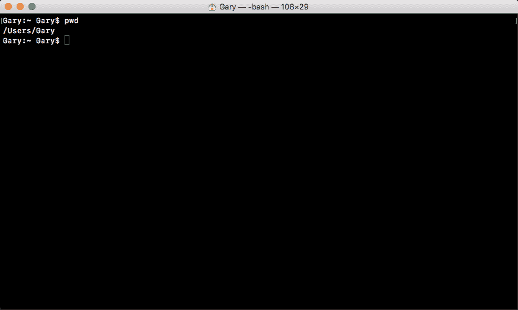

我在`Users`文件夹中，然后我在我的用户文件夹中，我的用户名恰好是`Gary`。

当你打开终端或命令提示符时，你将会在你的用户目录中开始。

我们可以使用`cd`进入桌面，就像这样：

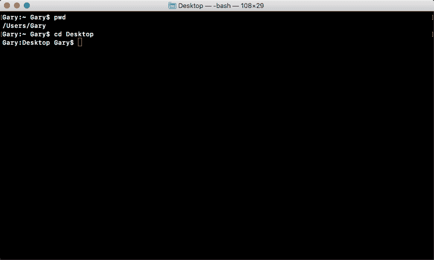

现在我们坐在桌面上。你可以从计算机的任何地方运行另一个命令`cd /users/Gary/desktop`。这将导航到你的桌面，无论你位于哪个文件夹。命令`cd desktop`要求你在用户目录中才能正确工作。

现在我们可以通过 cd 进入我们的项目目录，我们称之为`hello-world`，如下命令所示：

```js
cd hello-world
```

通过以下截图：

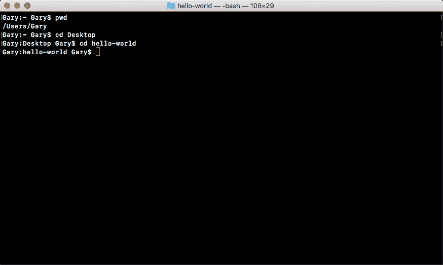

一旦我们在这个目录中，我们可以在 Linux 或 Mac 上运行`ls`命令（在 Windows 上是`dir`命令）来查看我们所有的文件，而在这种情况下，我们只有一个，我们有`app.js`：

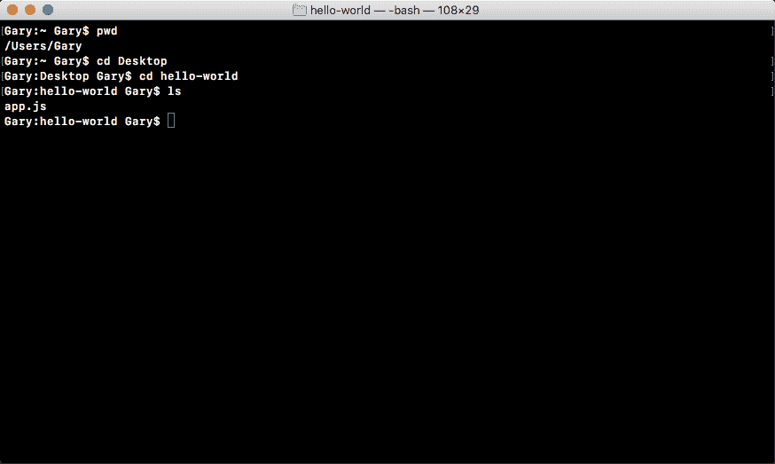

这是我们将要运行的文件。

现在，在你做任何其他事情之前，请确保你在`hello-world`文件夹中，并且你应该有`app.js`文件。如果有的话，我们要做的就是运行`node`命令，后面跟一个空格，这样我们就可以传入一个参数，那个参数就是文件名`app.js`，如下所示：

```js
node app.js
```

一旦你准备好了，按下*enter*，然后我们就可以看到，Hello world!打印到屏幕上，如下所示：

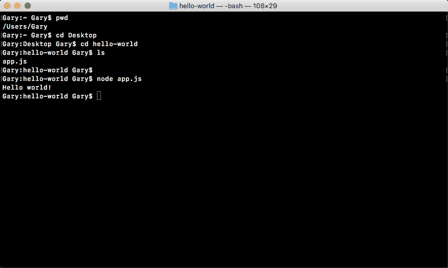

这就是创建和运行一个非常基本的 Node 应用程序所需的全部步骤。虽然我们的应用程序没有做任何酷炫的事情，但我们将在整本书中使用这个创建文件夹/文件并在终端中运行它们的过程，所以这是我们开始制作真实世界 Node 应用程序的一个很好的开始。

# 总结

在本章中，我们接触了 Node.js 的概念。我们看了一下 Node 是什么，我们了解到它是建立在 V8 JavaScript 引擎之上的。然后我们探讨了为什么 Node 变得如此流行，它的优势和劣势。我们看了一下我们可以选择的不同文本编辑器，最后，你创建了你的第一个 Node 应用程序。

在下一章中，我们将深入并创建我们的第一个应用程序。我真的很兴奋开始编写真实世界的应用程序。
