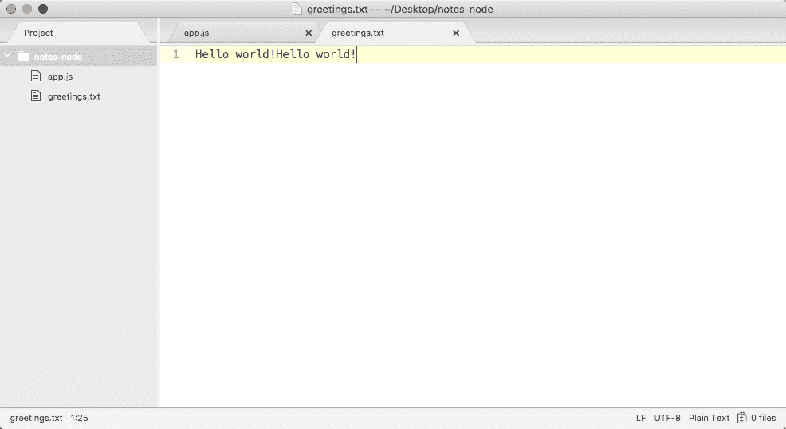
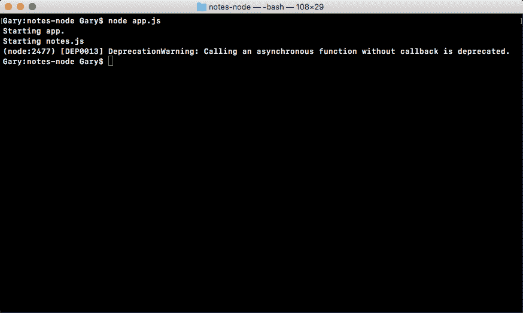
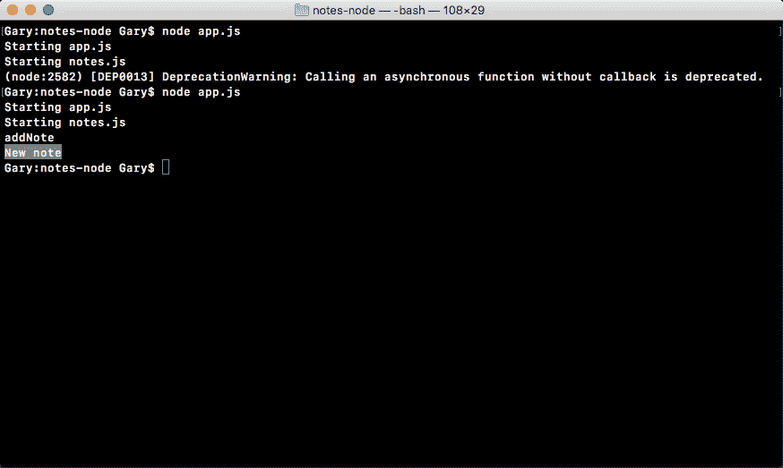
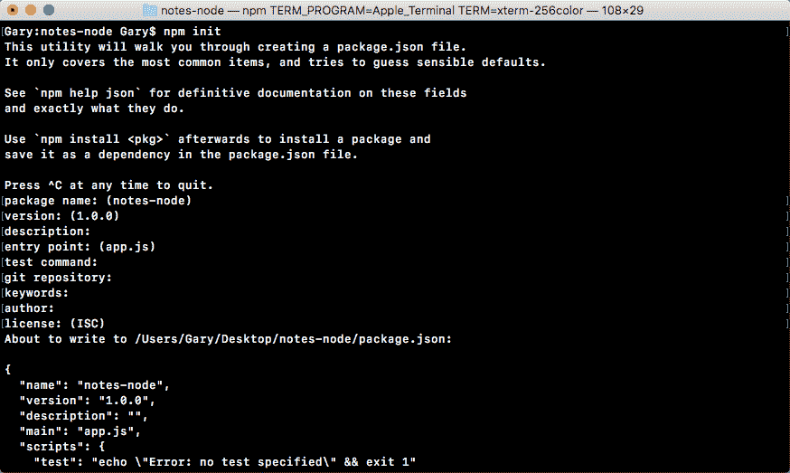
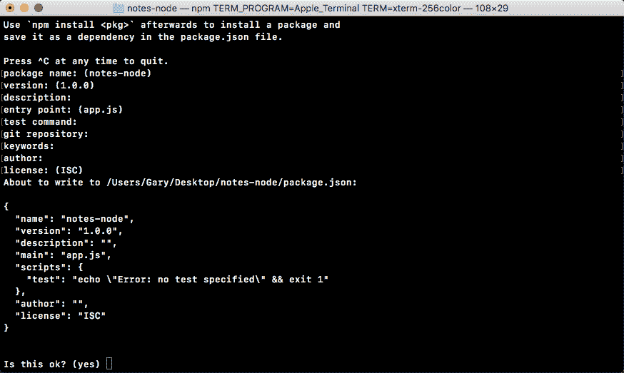
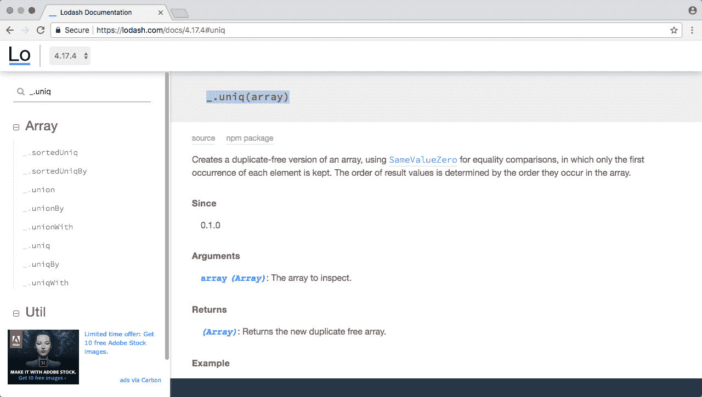
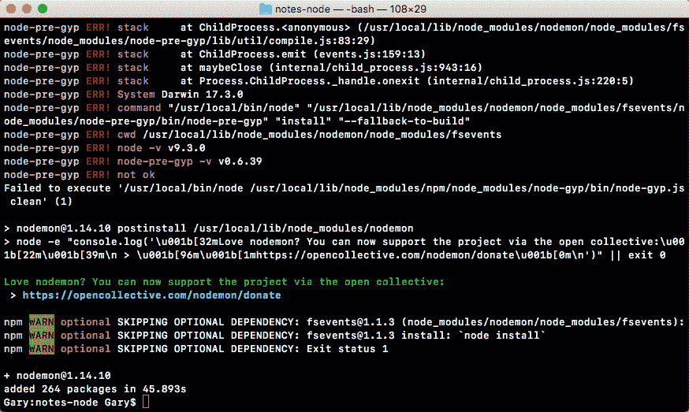
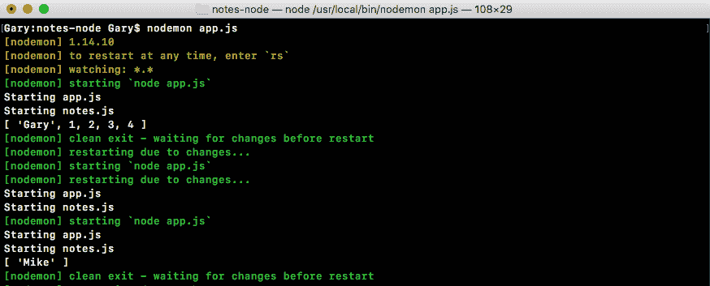
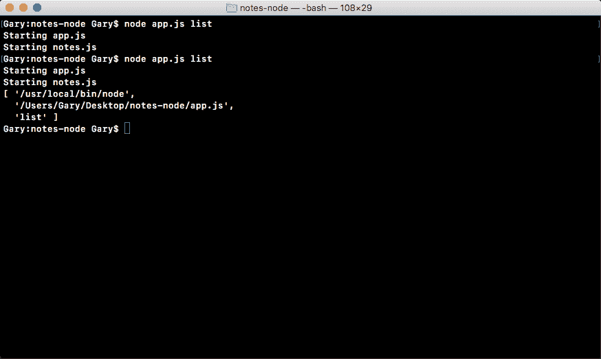
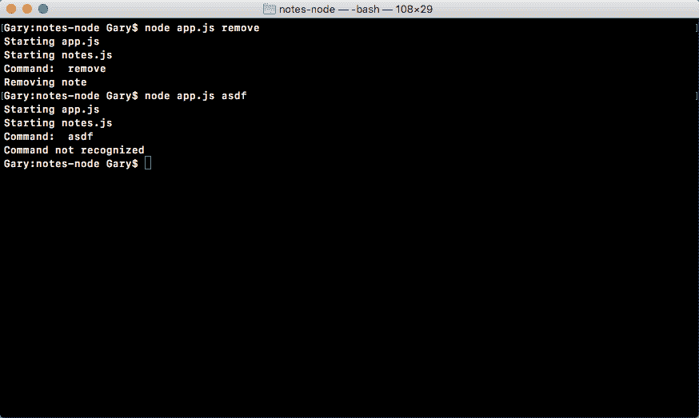

# 第二章：Node 基础-第一部分

在本章中，你将学到很多关于构建 Node 应用的知识，你将实际上构建你的第一个 Node 应用程序。这将是真正有趣的开始。

我们将开始学习所有内置到 Node 中的模块。这些是让你能够以前从未能够做到的 JavaScript 的对象和函数。我们将学习如何做一些事情，比如读写文件系统，这将在 Node 应用程序中用来持久化我们的数据。

我们还将研究第三方 npm 模块；这是 Node 变得如此受欢迎的一个重要原因。npm 模块为你提供了一个很好的第三方库集合，你可以使用它们，它们也有非常常见的问题。因此，你不必一遍又一遍地重写那些样板代码。在本章中，我们将使用第三方模块来帮助获取用户输入。

本章将专门涵盖以下主题：

+   模块基础

+   引入自己的文件

+   第三方模块

+   全局模块

+   获取输入

# 模块基础

在本节中，你将最终学习一些 Node.js 代码，我们将以讨论 Node 中的模块开始。模块是功能单元，所以想象一下，我创建了一些做类似事情的函数，比如一些帮助解决数学问题的函数，例如加法、减法和除法。我可以将它们捆绑成一个模块，称之为 Andrew-math，其他人可以利用它。

现在，我们不会讨论如何制作我们自己的模块；事实上，我们将讨论如何使用模块，这将使用 Node 中的一个函数`require()`来实现。`require()`函数将让我们做三件事：

+   首先，它让我们加载 Node.js 捆绑的模块。这些包括 HTTP 模块，它让我们创建一个 Web 服务器，以及`fs`模块，它让我们访问机器的文件系统。

我们还将在后面的部分中使用`require()`来加载第三方库，比如 Express 和 Sequelize，这将让我们编写更少的代码。

+   我们将能够使用预先编写的库来处理复杂的问题，我们所需要做的就是通过调用一些方法来实现`require()`。

+   我们将使用`require()`来引入我们自己的文件。它将让我们将应用程序分解为多个较小的文件，这对于构建真实世界的应用程序至关重要。

如果你的所有代码都在一个文件中，测试、维护和更新将会非常困难。现在，`require()`并不那么糟糕。在本节中，我们将探讨`require()`的第一个用例。

# 使用`require()`的情况

我们将看一下两个内置模块；我们将弄清楚如何引入它们和如何使用它们，然后我们将继续开始构建那个 Node 应用程序的过程。

# 应用程序的初始化

我们在终端中的第一步是创建一个目录来存储所有这些文件。我们将使用`cd Desktop`命令从我们的主目录导航到桌面：

```js
cd Desktop
```

然后，我们将创建一个文件夹来存储这个项目的所有课程文件。

现在，这些课程文件将在每个部分的资源部分中提供，因此如果你遇到困难，或者你的代码出了问题，你可以下载课程文件，比较你的文件，找出问题所在。

现在，我们将使用`mkdir`命令来创建那个文件夹，这是**make directory**的缩写。让我们将文件夹命名为`notes-node`，如下所示：

```js
mkdir notes-node
```

我们将在 Node 中制作一个笔记应用，所以`notes-node`似乎很合适。然后我们将`cd`进入`notes-node`，然后我们可以开始玩一些内置模块：

```js
cd notes-node
```

这些模块是内置的，所以不需要在终端中安装任何东西。我们可以直接在我们的 Node 文件中引入它们。

在这个过程中的下一步是打开 Atom 文本编辑器中的那个目录。所以打开我们刚刚在桌面上创建的目录，你会在那里找到它，如下面的截图所示：


现在，我们需要创建一个文件，并将该文件放在项目的根目录中：


我们将把这个文件命名为`app.js`，这是我们应用程序的起点：


我们将编写其他在整个应用程序中使用的文件，但这是我们唯一会从终端运行的文件。这是我们应用程序的初始化文件。

# 使用 require()的内置模块

现在，为了开始，我将首先使用`console.log`打印`Starting app`，如下面的代码所示：

```js
console.log('Starting app');
```

我们这样做的唯一原因是为了跟踪我们的文件如何执行，我们只会在第一个项目中这样做。在以后，一旦你熟悉了文件的加载和运行方式，我们就可以删除这些`console.log`语句，因为它们将不再必要。

在调用`console.log`开始应用程序之后，我们将使用`require()`加载一个内置模块。

我们可以在 Node.js API 文档中获得所有内置模块的完整列表。

要查看 Node.js API 文档，请转到[nodejs.org/api](http://nodejs.org/api)。当你访问这个 URL 时，你会看到一个很长的内置模块列表。使用**文件系统**模块，我们将创建一个新文件和**OS**模块。OS 模块将让我们获取当前登录用户的用户名等信息。 

# 在文件系统模块中创建和追加文件

不过，首先我们将从文件系统模块开始。我们将逐步介绍如何创建文件并追加内容：


当你查看内置模块的文档页面时，无论是文件系统还是其他模块，你都会看到一个很长的列表，列出了你可以使用的所有不同函数和属性。在本节中，我们将使用的是`fs.appendFile`。

如果你点击它，它会带你到具体的文档页面，这是我们可以找出如何使用`appendFile`的地方，如下面的截图所示：


现在，`appendFile`非常简单。我们将向它传递两个字符串参数（如前面的截图所示）：

+   一个是文件名

+   另一个是我们想要追加到文件中的数据

这是我们调用`fs.appendFile`所需要提供的全部内容。在我们调用`fs.appendFile`之前，我们需要先引入它。引入的整个目的是让我们加载其他模块。在这种情况下，我们将从`app.js`中加载`fs`模块。

让我们创建一个变量，使用`const`来定义它。

由于我们不会操纵模块返回的代码，所以不需要使用`var`关键字；我们将使用`const`关键字。

然后我们会给它一个名字，`fs`，并将其设置为`require()`，如下面的代码所示：

```js
const fs = require()
```

在这里，`require()`是一个可以在任何 Node.js 文件中使用的函数。你不需要做任何特殊的事情来调用它，只需要像前面的代码中所示的那样调用它。在参数列表中，我们只需要传入一个字符串。

现在，每次调用`require()`时，无论是加载内置模块、第三方模块还是你自己的文件，你只需要传入一个字符串。

在我们的例子中，我们将传入模块名`fs`，并在末尾加上一个分号，如下面的代码所示：

```js
const fs = require('fs');
```

这将告诉 Node，你想要获取`fs`模块的所有内容，并将它们存储在`fs`变量中。此时，我们可以访问`fs`模块上的所有可用函数，包括`fs.appendFile`，我们在文档中探索过。

回到 Atom，我们可以通过调用 `fs.appendFile` 来调用 `appendFile`，传入我们将使用的两个参数；第一个将是文件名，所以我们添加 `greetings.txt`，第二个将是你想要追加到文件中的文本。在我们的例子中，我们将追加 `Hello world!`，如下面的代码所示：

```js
fs.appendFile('greetings.txt', 'Hello world!');
```

让我们保存文件，如上面的命令所示，并从终端运行它，看看会发生什么。

**在 Node v7 上运行程序时的警告** 如果你在 Node v7 或更高版本上运行，当你在终端内运行程序时会收到一个小警告。现在，在 v7 上，它仍然可以工作，只是一个警告，但你可以使用以下代码来摆脱它：

```js
// Orignal line 
fs.appendFile('greetings.txt', 'Hello world!');

// Option one
fs.appendFile('greetings.txt', 'Hello world!', function (err){
  if (err) { 
    console.log('Unable to write to file');
  }
});

// Option two
fs.appendFileSync('greetings.txt', 'Hello world!');
```

在上面的代码中，我们有我们程序中的原始行。

在这里的 `Option one` 是将回调添加为追加文件的第三个参数。当发生错误或文件成功写入时，此回调将被执行。在选项一中，我们有一个 `if` 语句；如果有错误，我们只是在屏幕上打印一条消息 `Unable to write to file`。

现在，在上面的代码中，我们的第二个选项 `Option two` 是调用 `appendFileSync`，这是一个同步方法（我们稍后会详细讨论）；这个函数不需要第三个参数。你可以像上面的代码中所示那样输入它，你就不会收到警告。

因此，如果你看到警告，选择其中一种选项，两者都可以工作得差不多。

如果你使用的是 v6，你可以坚持使用上面代码中的原始行，尽管你可能会使用下面这两个选项之一来使你的代码更具未来性。

不要担心，我们将在整本书中广泛讨论异步和同步函数，以及回调函数。我在代码中给你的只是一个模板，你可以在你的文件中写下来以消除错误。在几章中，你将准确理解这两种方法是什么，以及它们是如何工作的。

如果我们在终端中进行追加，`node app.js`，我们会看到一些很酷的东西：


如前面的代码所示，我们得到了我们的一个 `console.log` 语句，`Starting app.`。所以我们知道应用程序已经正确启动了。此外，如果我们转到 Atom，我们实际上会看到一个全新的 `greetings.txt` 文件，如下面的代码所示。这是由 `fs.appendFile` 创建的文本文件：

```js
console.log('Starting app.');

const fs = require('fs');

fs.appendFile('greetings.txt', 'Hello world!');
```

在这里，`fs.appendFile` 尝试将 `greetings.txt` 追加到一个文件中；如果文件不存在，它就会简单地创建它：


你可以看到我们的消息 `Hello world!` 在 `greetings.txt` 文件中打印到屏幕上。在短短几分钟内，我们就能够加载一个内置的 Node 模块并调用一个函数，让我们创建一个全新的文件。

如果我们再次调用它，通过使用上箭头键和回车键重新运行命令，并回到 `greetings.txt` 的内容，你会看到这一次我们有两次 `Hello world!`，如下所示：



它每次运行程序都会追加 `Hello world!` 一次。我们有一个应用程序，在我们的文件系统上创建一个全新的文件，如果文件已经存在，它就会简单地添加到它。

# 在 require()中的 OS 模块

一旦我们创建并追加了 `greetings.txt` 文件，我们将自定义这个 `greeting.txt` 文件。为了做到这一点，我们将探索另一个内置模块。我们将在未来使用不仅仅是 `appendFile`。我们将探索其他方法。对于本节，真正的目标是理解 `require()`。`require()` 函数让我们加载模块的功能，以便我们可以调用它。

我们将使用的第二个模块是 OS，我们可以在文档中查看它。在 OS 模块中，我们将使用在最底部定义的方法，os.userInfo([options])：


os.userInfo([options])方法被调用并返回有关当前登录用户的各种信息，例如用户名，这就是我们要提取的信息：


使用来自操作系统的用户名，我们可以自定义`greeting.txt`文件，以便它可以说`Hello Gary!`而不是`Hello world!`。

要开始，我们必须要求 OS。这意味着我们将回到 Atom 内部。现在，在我创建`fs`常量的下面，我将创建一个名为`os`的新常量，将其设置为`require()`; 这作为一个函数调用，并传递一个参数，模块名称`os`，如下所示：

```js
console.log('Starting app.');

const fs = require('fs');
const os = require('os');

fs.appendFile('greetings.txt', 'Hello world!');
```

从这里开始，我们可以开始调用 OS 模块上可用的方法，例如 os.userInfo([optional])。

让我们创建一个名为`user`的新变量来存储结果。变量 user 将被设置为`os.userInfo`，我们可以调用`userInfo`而不带任何参数：

```js
console.log('Starting app.');

const fs = require('fs');
const os = require('os');

var user = os.userInfo();

fs.appendFile('greetings.txt', 'Hello world!');
```

现在，在我们对`fs.appendFile`行执行任何操作之前，我将对其进行注释，并使用`console.log`打印用户变量的内容：

```js
console.log('Starting app.');

const fs = require('fs');
const os = require('os');

var user = os.userInfo();
console.log(user);
// fs.appendFile('greetings.txt', 'Hello world!');
```

这将让我们准确地探究我们得到了什么。在终端中，我们可以使用上箭头键和回车键重新运行我们的程序，并且在下面的代码中，你可以看到我们有一个带有一些属性的对象：


我们有`uid`，`gid`，`username`，`homedir`和`shell`。根据您的操作系统，您可能不会拥有所有这些，但您应该始终拥有`username`属性。这是我们关心的。

这意味着回到 Atom 内部，我们可以在`appendFile`中使用`user.username`。我将删除`console.log`语句并取消注释我们对`fs.appendFile`的调用：

```js
console.log('Starting app.');

const fs = require('fs');
const os = require('os');

var user = os.userInfo();

fs.appendFile('greetings.txt', 'Hello world!');
```

现在，在`fs.appendFile`中的`world`处，我们将其与`user.username`交换。我们可以以两种方式做到这一点。

# 连接用户.username

第一种方法是删除`world!`并连接`user.username`。然后我们可以使用`+`（加号）运算符连接另一个字符串，如下面的代码所示：

```js
console.log('Starting app.');

const fs = require('fs');
const os = require('os');

var user = os.userInfo();

fs.appendFile('greetings.txt', 'Hello' + user.username + '!');
```

现在，如果我们运行这个，一切都会按预期工作。在终端中，我们可以重新运行我们的应用程序。它会打印`Starting app`：


在`greetings.txt`文件中，你应该看到类似`Hello Gary!`的东西打印到屏幕上，如下所示：


使用`fs`模块和`os`模块，我们能够获取用户的用户名，创建一个新文件并存储它。

# 使用模板字符串

第二种方法是使用 ES6 功能模板字符串来交换`fs.appendFile`中的`world`与`user.username`。模板字符串以`` ` ``（对勾）运算符开头和结尾，位于键盘上*1*键的左侧。然后你像平常一样打字。

这意味着我们首先输入`hello`，然后我们会用`!`（感叹号）标记添加一个空格，在`!`之前，我们会放置名字：

```js
console.log('Starting app.');

const fs = require('fs');
const os = require('os');

var user = os.userInfo();

fs.appendFile('greetings.txt', `Hello !`);
```

要在模板字符串中插入 JavaScript 变量，你需要使用`$`（美元）符号，后面跟上大括号。然后我们将引用一个变量，比如`user.username`：

```js
console.log('Starting app.');

const fs = require('fs');
const os = require('os');

var user = os.userInfo();

fs.appendFile('greetings.txt', `Hello ${user.username}!`);
```

请注意，Atom 编辑器实际上可以识别出大括号的语法。

这就是使用模板字符串所需要的。它是一个 ES6 功能，因为你使用的是 Node v6。这种语法比我们先前看到的字符串/串联版本容易理解和更新。

如果你运行这段代码，它将产生完全相同的输出。我们可以运行它，查看文本文件，这一次我们有两次`Hello Gary!`，这正是我们想要的：


有了这个配置，我们现在已经完成了我们非常基础的示例，并准备在下一节中开始创建我们的笔记应用程序的文件并在`app.js`中要求它们。

首先，你已经学到了我们可以使用`require`来加载模块。这让我们可以使用 Node 开发者、第三方库或者自己编写的现有功能，并将其加载到文件中，以便可以重复使用。创建可重复使用的代码对于构建大型应用程序至关重要。如果每次都必须在应用程序中构建所有内容，那么没有人会有所作为，因为他们会被困在构建基础设施上，比如 HTTP 服务器和 Web 服务器等。这些东西已经有模块了，我们将利用 npm 社区的伟大作用。在这种情况下，我们使用了两个内置模块，`fs`和`os`。我们使用`require`将它们加载进来，并将模块结果存储在两个变量中。这些变量存储了模块中提供给我们的所有内容；在`fs`的情况下，我们使用`appendFile`方法，而在 OS 的情况下，我们使用`userInfo`方法。一起，我们能够获取用户名并将其保存到文件中，这太棒了。

# 要求自己的文件

在本节中，你将学习如何使用`require()`来加载项目中创建的其他文件。这将让你将函数从`app.js`移到更具体的文件中；这将使你的应用程序更容易扩展、测试和更新。要开始，我们要做的第一件事就是创建一个新文件。

# 创建一个新文件来加载其他文件

在我们的笔记应用程序的上下文中，新文件将存储各种用于编写和阅读笔记的函数。目前，你不需要担心该功能，因为我们稍后将详细介绍，但我们将创建文件，它最终将存放在那里。这个文件将是`notes.js`，我们将把它保存在应用程序的根目录下，就在`app.js`和`greetings.txt`旁边，如下所示：


目前，我们在`notes`中所做的就是使用`console.log`打印一小段日志，显示文件已经被执行，使用以下代码：

```js
console.log('Starting notes.js');
```

现在，我们在`notes`的顶部和`app.js`的顶部都有了`console.log`。我将把`app.js`中的`console.log`从`Starting app.`更改为`Starting app.js`。有了这个配置，我们现在可以 require notes 文件。它没有导出任何功能，但没关系。

顺便说一下，当我说导出时，我指的是 notes 文件没有任何其他文件可以利用的函数或属性。

我们将在后面的部分讨论如何导出东西。不过，目前我们将以与加载内置 Node 模块相同的方式加载我们的模块。

让我们创建`const`；我会将其命名为 notes，将其设置为从`require()`返回的结果：

```js
console.log('Starting app.js');

const fs = require('fs');
const os = require('os');
const notes = require('');

var user = os.userInfo();

fs.appendFile('greetings.txt', `Hello ${user.username}!`);
```

在括号内，我们将传入一个参数，这个参数将是一个字符串，但它会有一点不同。在之前的部分中，我们键入了模块名称，但在这种情况下，我们拥有的不是一个模块，而是一个文件，`notes.js`。我们需要做的是告诉 Node 文件的位置，使用相对路径。

现在，相对路径以`./`（点斜杠）开头，指向文件所在的当前目录。在这种情况下，这将指向我们的项目根目录`notes-node`的`app.js`目录。从这里开始，我们不必进入任何其他文件夹来访问`notes.js`，它就在我们项目的根目录中，所以我们可以输入它的名称，如下面的代码所示：

```js
console.log('Starting app.js');

const fs = require('fs');
const os = require('os');
const notes = require('./notes.js');

var user = os.userInfo();

fs.appendFile('greetings.txt', `Hello ${user.username}!`);
```

有了这个配置，当我们保存`app.js`并运行我们的应用程序时，我们就可以看到发生了什么。我将使用`node app.js`命令运行应用程序：



如前面的代码输出所示，我们得到了两个日志。首先，我们得到了`Starting app.js`，然后我们得到了`Starting notes.js`。现在，`Starting notes.js`来自于`note.js`文件，并且它只能执行，因为我们在`app.js`内部需要了这个文件。

从`app.js`文件中注释掉这条命令行，如下所示：

```js
console.log('Starting app.js');

const fs = require('fs');
const os = require('os');
// const notes = require('./notes.js');

var user = os.userInfo();

fs.appendFile('greetings.txt', `Hello ${user.username}!`);
```

保存文件，并从终端重新运行它；您可以看到`notes.js`文件从未被执行，因为我们从未明确地触摸它。

我们从来没有像前面的示例那样在终端中调用它，并且我们也从未 require 过。

目前，我们将需要 require 它，所以我将取消注释。

顺便说一下，我使用命令/（斜线）来快速注释和取消注释行。这是大多数文本编辑器中可用的键盘快捷键；如果您使用的是 Windows 或 Linux，它可能不是*command*，可能是*Ctrl*或其他内容。

# 从 notes.js 中导出文件以在 app.js 中使用

现在，焦点将是从`notes.js`中导出东西，我们可以在`app.js`中使用。在`notes.js`内部（实际上，在我们所有的 Node 文件中），我们可以访问一个名为`module`的变量。我会用`console.log`来将`module`打印到屏幕上，这样我们就可以在终端中探索它，如下所示：

```js
console.log('Starting notes.js');

console.log(module);
```

让我们重新运行文件来探索它。如下截图所示，我们得到了一个相当大的对象，即与`notes.js`文件相关的不同属性：


现在，说实话，我们将不会使用大部分这些属性。我们有诸如`id`、`exports`、`parent`和`filename`之类的东西。在本书中，我们唯一会使用的属性是`exports`。

`exports`对象位于`module`属性上，该对象上的一切都会被导出。此对象会被设置为`const`变量`notes`。这意味着我们可以在其上设置属性，它们将被设置在 notes 上，并且我们可以在`app.js`内部使用它们。

# exports 对象工作的一个简单示例

让我们快速看看它是如何工作的。我们将定义一个`age`属性使用`module.exports`，刚刚在终端中探索过的对象。我们知道这是一个对象，因为我们在之前的截图中可以看到（`exports: {}`）；这意味着我可以添加一个属性`age`，并将其设置为我的年龄`25`，如下所示：

```js
console.log('Starting notes.js');

module.exports.age = 25;
```

然后我可以保存这个文件并移动到`app.js`利用这个新的`age`属性。在当前情况下，`const`变量 notes 将存储我所有的输出，现在只有 age。

在`fs.appendFile`中，`greeting.txt`文件后面，我将添加`You are`，然后是年龄。在模板字符串内，我们将使用`$`和花括号，`notes.age`，以及末尾的句号，如下所示：

```js
console.log('Starting app.js');

const fs = require('fs');
const os = require('os');
const notes = require('./notes.js');

var user = os.userInfo();

fs.appendFile('greetings.txt', `Hello ${user.username}! You are ${notes.age}.`);
```

现在我们的问候应该是`Hello Gary! You are 25`。它得到了我们单独文件（即`note.js`）中的`25`值，这太棒了。

让我们花点时间使用上箭头键和回车键在终端重新运行程序：


回到应用程序内部，我们可以打开`greetings.txt`，如下截图所示，我们有`Hello Gary! You are 25`：


使用`require()`，我们能够引入一个我们创建的文件，这个文件存储了对项目其他部分有利的一些属性。

# 导出函数

很明显，上面的例子是相当刻意的。我们不会导出静态数字；导出的真正目的是能够导出在`app.js`内部使用的函数。让我们花点时间导出两个函数。在`notes.js`文件中，我将设置`module.exports.addnote`等于一个函数；`function`关键字后跟随圆括号，然后是花括号：

```js
console.log('Starting notes.js');

module.exports.addNote = function () {

} 
```

现在，在整个课程中，我将尽可能使用箭头函数，如前面的代码所示。要将常规的 ES5 函数转换为箭头函数，你只需删除`function`关键字，然后在括号和开放花括号之间用`=>`符号替换，如下所示：

```js
console.log('Starting notes.js');

module.exports.addNote = () => {

} 
```

现在，箭头函数还有一些更微妙的地方需要在整本书中讨论，但如果你有一个匿名函数，你可以毫不费力地用箭头函数代替。主要区别在于箭头函数不会绑定`() => {}`关键字或参数数组，这是我们将在整本书中探讨的。所以如果你遇到一些错误，知道箭头函数可能是引起错误的原因是很好的。

不过目前，我们将保持事情非常简单，使用`console.log`来打印`addNote`。这将让我们知道`addNote`函数已被调用。我们将返回一个字符串，`'New note'`，如下所示：

```js
console.log('Starting notes.js');

module.exports.addNote = () => {
  console.log('addNote');
  return 'New note';
};
```

现在，`addNote`函数在`notes.js`中被定义了，但我们可以在`app.js`中利用它。

让我们快速地注释掉`app.js`中的`appendFile`和用户行：

```js
console.log('Starting app.js');

const fs = require('fs');
const os = require('os');
const notes = require('./notes.js');

// var user = os.userInfo();
//
// fs.appendFile('greetings.txt', `Hello ${user.username}! You are ${notes.age}.`);
```

我将添加一个变量，称为结果，（简称`res`），并将其设置为`notes.addNote`的返回结果：

```js
console.log('Starting app.js');

const fs = require('fs');
const os = require('os');
const notes = require('./notes.js');

var res = notes.addNote();

// var user = os.userInfo();
//
// fs.appendFile('greetings.txt', `Hello ${user.username}! You are ${notes.age}.`);
```

现在，`addNote`函数目前只是一个虚拟函数。它不需要任何参数，也实际上什么也不做，所以我们可以无需任何参数地调用它。

然后我们将打印结果变量，如下面的代码所示，我们期望结果变量等于字符串`New note`：

```js
console.log('Starting app.js');

const fs = require('fs');
const os = require('os');
const notes = require('./notes.js');

var res = notes.addNote();
console.log(res);

// var user = os.userInfo();
//
// fs.appendFile('greetings.txt', `Hello ${user.username}! You are ${notes.age}.`);
```

如果我保存我的两个文件（`app.js`和`notes.js`），然后在终端重新运行，你会看到`New note`打印到屏幕最后并在`addNote`之前打印：



这意味着我们成功地引入了我们称为`addNote`的笔记文件，并且它的返回结果成功地返回给了`app.js`。

使用这个确切的模式，我们将能够在我们的`notes.js`文件中定义添加和删除笔记的函数，但我们将能够在我们的应用程序内的任何地方调用它们，包括在`app.js`中。

# 练习 - 在导出对象中添加一个新函数

现在是时候进行一个快速的挑战了。我想让你在`notes.js`中创建一个名为`add`的新函数。这个`add`函数将被设置在`exports`对象上。

记住，`exports`是一个对象，所以你可以设置多个属性。

这个`add`函数将接受两个参数`a`和`b`；它会将它们相加并返回结果。然后在`app.js`中，我想让你调用`add`函数，传入两个你喜欢的数字，比如`9`和`-2`，然后将结果打印到屏幕上并确保它正常工作。

你可以开始移除对`addNote`的调用，因为在这个挑战中将不再需要它。

所以，请花一点时间，在`notes.js`内创建`add`函数，在`app.js`内调用它，并确保正确的结果打印到屏幕上。进行得如何？希望你能够创建该函数并从`app.js`中调用它。

# 练习的解决方案

过程中的第一步是定义新函数。在`notes.js`中，我将`module.exports.add`设置为该函数，如下所示：

```js
console.log('Starting notes.js');

module.exports.addNote = () => {
  console.log('addNote');
  return 'New note';
}; 

module.exports.add =
```

让我们将其等于箭头函数。如果你使用普通函数，那完全没问题，我只是更喜欢在我可以的时候使用箭头函数。此外，在括号内，我们将会有两个参数，我们将得到`a`和`b`，就像这里展示的一样：

```js
console.log('Starting notes.js');

module.exports.addNote = () => {
  console.log('addNote');
  return 'New note';
}; 

module.exports.add = (a, b) => {

};
```

我们需要做的只是返回结果，这非常简单。所以我们将输入`return a + b`：

```js
console.log('Starting notes.js');

module.exports.addNote = () => {
  console.log('addNote');
  return 'New note';
}; 

module.exports.add = (a, b) => {
  return a + b;
};
```

现在，这是你的挑战的第一部分，在`notes.js`中定义一个实用函数；第二部分是实际在`app.js`中使用它。

在`app.js`中，我们可以通过打印带有冒号`:`的`console.log`结果来使用我们的函数（这只是为了格式化）。作为第二个参数，我们将打印实际结果，`notes.add`。然后，我们将两个数字相加；我们将加上`9`和`-2`，就像这段代码展示的那样：

```js
console.log('Starting app.js');

const fs = require('fs');
const os = require('os');
const notes = require('./notes.js');

console.log('Result:', notes.add(9, -2));

// var user = os.userInfo();
//
// fs.appendFile('greetings.txt', `Hello ${user.username}! You are ${notes.age}.`);
```

在这种情况下，结果应该是`7`。如果我们运行程序，你可以看到，我们得到了`7`，它打印到屏幕上：


如果你能理解这个，恭喜你，你成功完成了你的第一个挑战。这些挑战将分布在整本书中，并且会变得越来越复杂。但不要担心，我们会将挑战描述得很明确；我会告诉你我想要什么，以及我想要它如何完成。现在，你可以尝试不同的方法去做，真正的目标是让你能够独立编写代码，而不是跟随他人的步伐。这才是真正的学习过程。

在下一节中，我们将探讨如何使用第三方模块。从那里开始，我们将开始构建笔记应用程序。

# 第三方模块

你现在已经知道了使用`require()`的三种方式中的两种，在本节中，我们将探索最后一种方式，即要求你从 npm 安装的软件包中获取。正如我在第一章中提到的，npm 是 Node 变得如此奇妙的重要部分。有一个庞大的开发者社区已经创建了成千上万的软件包，已经解决了 Node 应用程序中一些最常见的问题。我们将在整本书中利用相当多的软件包。

# 使用 npm 模块创建项目

现在，在 npm 软件包中，没有什么神奇的，这是普通的 Node 代码，旨在解决特定的问题。你想要使用它的原因是，这样你就不必花费所有时间编写这些已经存在的实用函数；它们不仅存在，而且已经经过测试，已经被证明有效，而且其他人已经使用它们并记录了它们。

现在，这么多话说了，我们应该如何开始呢？好吧，要开始，我们实际上必须从终端运行一个命令，告诉我们的应用程序我们想要使用 npm 模块。这个命令将在终端上运行。确保你已经进入了你的项目文件夹，并且在`notes-node`目录中。当你安装了 Node 时，你也安装了一个叫做 npm 的东西。

有一段时间，npm 代表**Node 包管理器**，但那现在是一个笑话，因为有很多东西在 npm 上并不特定于 Node。许多前端框架，如 jQuery 和 react，现在也存在于 npm 上，所以他们几乎抛弃了 Node 包管理器的解释，在他们的网站上，现在他们循环播放一堆与 npm 相匹配的滑稽事情。

我们将运行一些 npm 命令，你可以通过运行`npm`，一个空格，和`-v`（我们正在用`v`标志运行 npm）。这将打印版本，如下面的代码所示：


如果你的版本略有不同，也没有关系；重要的是你已经安装了 npm。

现在，我们将在终端中运行一个名为`npm init`的命令。这个命令将提示我们回答关于我们的 npm 项目的一些问题。我们可以运行这个命令，并且可以按照下面的截图循环回答问题：


在上述截图中，顶部是正在发生的事情的快速描述，下面将开始提出一些问题，如下面的截图所示：



这些问题包括以下内容：

+   名称：你的名称不能包含大写字符或空格；你可以使用`notes-node`，例如。你可以按“回车”使用默认值，括号中就是默认值。

+   版本：1.0.0 也可以正常工作；我们将大多数设置保留在默认值。

+   描述：我们暂时可以将其保留为空。

+   入口点：这将是`app.js`，确保它正确显示。

+   测试命令：我们将在本书的后面探索测试，所以现在可以将其保留为空。

+   git 仓库：我们现在也将其保留为空。

+   关键词：这些用于搜索模块。我们不会发布这个模块，所以可以将其保留为空。

+   作者：你可能会输入你的名字。

+   许可证：对于许可证，我们暂时将使用 ISC；因为我们不打算发布它，所以这并不重要。

回答了这些问题后，如果我们按“回车”，我们将在屏幕上看到以下内容和一个最终问题：



现在，我想驱散这个命令有任何神奇的谣言。这个命令所做的就是在你的项目内创建一个单个文件。它将位于项目的根目录，并且被称为`package.json`，该文件将与上述截图完全一样。

对于最后一个问题，如上面截图下面所示，你可以按“回车”或者输入`yes`来确认这是你想要做的事情：


现在我们已经创建了文件，我们可以实际在项目内查看它。如下面的代码所示，我们有`package.json`文件：

```js
{
  "name": "notes-node",
  "version": "1.0.0",
  "description": "",
  "main": "app.js",
  "scripts": {
    "test": "echo \"Error: no test specified\" && exit 1"
  },
  "author": "",
  "license": "ISC"
}
```

并且这就是它，这是对你的应用程序的简单描述。就像我提到的，我们不打算将我们的应用程序发布到 npm 上，所以很多这些信息对我们来说并不重要。然而，重要的是，`package.json`是我们定义要在应用程序中安装的第三方模块的地方。

# 在我们的应用程序中安装 lodash 模块

要在应用程序中安装模块，我们将在终端中运行一个命令。在本章中，我们将安装一个名为`lodash`的模块。`lodash`模块附带了大量的实用方法和函数，使得在 Node 或 JavaScript 中开发变得更加容易。让我们看看我们到底要接触到什么，让我们进入浏览器。

我们将前往[`www.npmjs.com`](https://www.npmjs.com)。然后我们将搜索`lodash`包，你会看到它出现在下面的截图中：


当你点击它时，你应该会进入到包页面，包页面将向你展示有关该模块的很多统计信息和文档，如下所示：


现在，我在寻找新模块时使用`lodash`包页面；我喜欢看看它有多少下载量以及上次更新是什么时候。在包页面上，你可以看到它最近更新过，这很棒，这意味着该包很可能与 Node 的最新版本兼容，如果你向页面下方看，你会看到这实际上是一个最受欢迎的 npm 包之一，每天有超过一百万次的下载。我们将使用这个模块来探索如何安装 npm 模块以及如何在项目中实际使用它们。

# 安装 lodash

要安装`lodash`，你需要的第一件事就是获取一个模块名，就是`lodash`。一旦你有了这个信息，你就可以开始安装了。

进入终端，我们将运行`npm install`命令。在安装后，我们将指定模块`lodash`。单独运行这个命令也可以；但我们还会提供`save`标志。

`npm install lodash`命令将安装该模块，`save`标志，即`--`（两个）破折号后跟单词`save`，将更新`package.json`文件的内容。让我们运行这个命令：

```js
npm install loadsh --save
```

上述命令将前往 npm 服务器并获取代码，然后将其安装到你的项目中，每当你安装一个 npm 模块时，它都将存放在`node_modules`文件夹中。

现在，如果你打开`node_modules`文件夹，你会看到下面的代码所示的`lodash`文件夹。这就是我们刚刚安装的模块：

```js
{
  "name": "notes-node",
  "version": "1.0.0",
  "description": "",
  "main": "app.js",
  "scripts": {
    "test": "echo \"Error: no test specified\" && exit 1"
  },
  "author": "",
  "license": "ISC",
  "dependencies": {
    "lodash": "^4.17.4"
  }
}
```

就像您在上图的`package.json`中所看到的那样，我们还进行了一些自动更新。有一个新的`dependencies`属性，其中有一个键值对对象，其中键是我们想在项目中使用的模块，值是版本号，本例中是最新版本，版本`4.17.4`。有了这个，我们现在可以在项目中引入我们的模块了。

在`app.js`内部，我们可以通过相同的要求过程利用`lodash`中的所有内容。我们将创建一个`const`，我们将把这个`const`命名为`_`（这是`lodash`实用程序库的常见名称），并将其设置为`require()`。在 require 括号内，我们将传入与`package.json`文件中完全相同的模块名称。这是您在运行`npm install`时所使用的相同模块名称。然后，我们会输入`lodash`，如下所示：

```js
console.log('Starting app.js');

const fs = require('fs');
const os = require('os');
const _ = require('lodash');
const notes = require('./notes.js');

console.log('Result:', notes.add(9, -2));

// var user = os.userInfo();
//
// fs.appendFile('greetings.txt', `Hello ${user.username}! You are ${notes.age}.`);
```

现在，操作的顺序非常重要。Node 首先会查找`lodash`的核心模块。它找不到核心模块，所以下一个地方它会查找是`node_modules`文件夹。如下代码所示，它会找到`lodash`并加载该模块，返回任何它提供的输出：

```js
console.log('Starting app.js');

const fs = require('fs');
const os = require('os');
const _ = require('lodash');
const notes = require('./notes.js');

console.log('Result:', notes.add(9, -2));

// var user = os.userInfo();
//
// fs.appendFile('greetings.txt', `Hello ${user.username}! You are ${notes.age}.`);
```

# 使用 Lodash 的实用工具

现在，有了输出，我们可以利用 Lodash 带来的一些实用工具。我们将在本节快速探讨其中的两个，并且在整本书中将更多地探索，因为 Lodash 基本上就是一组非常实用的工具。在我们开始之前，我们应该先看一下文档，这样我们才知道我们要做什么。

当您使用 npm 模块时，这是一个非常常见的步骤：首先安装它；第二，你必须查看那些文档，并确保你能做你想做的事情。

在 npm 页面上，点击那里给出的 lodash 链接，或者前往[lodash.com](https://lodash.com)，点击 API 文档页面，如下所示：


您可以查看您可用的各种方法，如下截图所示：


在我们的情况下，我们将使用*command* + *F*（Windows 用户为*Ctrl* + *F*）来搜索`_.isString`。然后在文档中，我们可以点击它，将其在主页面打开，如下截图所示：


`_.isString`是与 `lodash` 一起的一个实用工具，如果您传入的变量是字符串，它将返回`true`，如果您传入的值不是字符串，它将返回`false`。我们可以在 Atom 中使用它来验证。让我们来试一试。

# 使用 _.isString 实用工具

要使用`_.isString`实用程序，我们将在`app.js`中添加`console.log`以显示结果并且我们将使用`_.isString`，传入一些值。首先让我们传入`true`，然后我们可以复制这行，并传入一个字符串，比如`Gary`，如下所示：

```js
console.log('Starting app.js');

const fs = require('fs');
const os = require('os');
const _ = require('lodash');
const notes = require('./notes.js');

console.log(_.isString(true));
console.log(_.isString('Gary'));

// console.log('Result:', notes.add(9, -2));

// var user = os.userInfo();
//
// fs.appendFile('greetings.txt', `Hello ${user.username}! You are ${notes.age}.`);
```

我们可以在终端中使用先前使用的相同命令`node app.js`来运行我们的文件：


当我们运行文件时，我们会得到两个提示，一个是我们已经开始了两个文件，一个是`false`，然后是`true`。 `false` 是因为布尔值不是字符串，`true` 是因为 `Gary` 确实是一个字符串，所以它通过了`_.isString`的测试。这是`lodash`捆绑的许多实用函数中的一个。

现在，`lodash`可以做的远不止简单的类型检查。它附带了一堆其他我们可以利用的实用方法。让我们探索另一个实用程序。

# 使用 _.uniq

回到浏览器中，我们可以再次使用`command + F`来搜索一个新的实用程序，即`_.uniq`：



这个唯一的方法，简单地获取一个数组，并返回删除所有重复项的数组。这意味着如果我有好几次相同的数字或相同的字符串，它将删除任何重复内容。让我们运行一下。

回到 Atom 中，我们可以将这个实用工具添加到我们的项目中，我们将注释掉`_.isString`的调用，并且我们将创建一个名为`filteredArray`的变量。这将是没有重复项的数组，我们将调用`_.uniq`。

现在，正如我们所知，这需要一个数组。由于我们正在尝试使用唯一功能，我们将传入一个具有一些重复项的数组。将你的名字作为字符串用两次；我将使用一次我的名字，然后跟着数字`1`，然后再用一次我的名字。然后我可以使用`1`，`2`，`3`和`4`，如下所示：

```js
console.log('Starting app.js');

const fs = require('fs');
const os = require('os');
const _ = require('lodash');
const notes = require('./notes.js');

// console.log(_.isString(true));
// console.log(_.isString('Gary'));
var filteredArray = _.uniq(['Gary', 1, 'Gary', 1, 2, 3, 4]);
console.log();

// console.log('Result:', notes.add(9, -2));

// var user = os.userInfo();
//
// fs.appendFile('greetings.txt', `Hello ${user.username}! You are ${notes.age}.`);
```

现在，如果一切按计划进行，我们应该得到一个删除了所有重复项的数组，这意味着我们将有一个`Gary`的实例，一个`1`的实例，然后没有重复的`2`，`3`和`4`。

最后要做的事情是用`console.log`打印出来，这样我们就可以在终端中查看了。我将把这个`filteredArray`变量传递给我们的`console.log`语句，如下面的代码所示：

```js
console.log('Starting app.js');

const fs = require('fs');
const os = require('os');
const _ = require('lodash');
const notes = require('./notes.js');

// console.log(_.isString(true));
// console.log(_.isString('Gary'));
var filteredArray = _.uniq(['Gary', 1, 'Gary', 1, 2, 3, 4]);
console.log(filteredArray);

// console.log('Result:', notes.add(9, -2));

// var user = os.userInfo();
//
// fs.appendFile('greetings.txt', `Hello ${user.username}! You are ${notes.age}.`);
```

从这里，我们可以在 Node 中运行我们的项目。我将使用上次的命令，然后我可以按下回车键，你会看到我们得到了一个删除了所有重复项的数组，如下代码输出所示：


我们有一个字符串`Gary`的实例，一个数字`1`的实例，然后有`2`，`3`，`4`，正是我们所期望的。

`lodash`工具确实是无穷无尽的。有很多函数，一开始探索起来可能有点压倒，但当你开始创建更多的 JavaScript 和 Node 项目时，你会发现自己在排序、过滤或类型检查方面一遍又一遍地解决许多相同的问题，在这种情况下，最好使用`lodash`这样的工具来完成这一工作。`lodash`工具之所以如此优秀，有以下几个原因：

+   你不必不断地重写你的方法

+   经过充分测试，已在生产环境中使用过

如果有任何问题，现在已经解决了。

# `node_modules`文件夹

现在你知道如何使用第三方模块了，我还想讨论一件事。那就是`node_modules`文件夹的一般情况。当你将你的 Node 项目放在 GitHub 上，或者你在拷贝它或发送给朋友时，`node_modules`文件夹实际上不应该跟着一起走。

`node_modules`文件夹包含生成的代码。这不是你编写的代码，你不应该对 Node 模块内部的文件进行任何更新，因为很有可能下次安装一些模块时它们会被覆盖。

在我们的情况下，我们已经在`package.json`文件中定义了模块和版本，如下面的代码所示，因为我们使用了方便的`save`标志：

```js
{
  "name": "notes-node",
  "version": "1.0.0",
  "description": "",
  "main": "app.js",
  "scripts": {
    "test": "echo \"Error: no test specified\" && exit 1"
  },
  "author": "",
  "license": "ISC",
  "dependencies": {
    "lodash": "^4.17.4"
  }
}
```

这实际上意味着我们可以彻底删除`node_modules`文件夹。现在，我们可以拷贝这个文件夹并给朋友，可以放在 GitHub 上，或者任何我们想做的事情。当我们想要恢复`node_modules`文件夹时，我们只需在终端内运行`npm install`命令，而不带任何模块名或任何标志。

当不带任何名称或标志运行此命令时，它将加载你的`package.json`文件，抓取所有的依赖项并安装它们。运行完这个命令后，`node_modules`文件夹将看起来和我们删除它之前一模一样。现在，当你使用 Git 和 GitHub 时，你只需忽略`node_modules`文件夹，而不是删除它。

现在，到目前为止我们所探索的内容是我们将在整本书中经常进行的过程。因此，如果 npm 看起来还很陌生，或者你不太确定它到底有什么用，当我们与第三方模块做更多事情时，它将变得清晰明了，而不仅仅是进行类型检查或在数组中查找唯一的项目。npm 社区背后有着巨大的力量，我们将充分利用这一点，以便我们创建真实世界的应用。

# 全局模块

我得到的一个主要的抱怨是学生们每次想要在文本编辑器内看到他们刚刚做出的更改时，都必须从终端重新启动应用。因此，在这一部分，我们将学习如何在文件更改时自动重新启动应用程序。这意味着，如果我从`Gary`更改为`Mike`并保存，它将在终端上自动重新启动。

# 安装 nodemon 模块

现在，为了在我们对文件进行更改时自动重新启动我们的应用程序，我们必须安装一个命令行实用程序，并且我们将使用 npm 来完成这个步骤。要开始，请打开 Google Chrome（或您使用的浏览器）并转到[`www.npmjs.com`](https://www.npmjs.com)，就像我们在*I*nstalling the* *lodash* *module in our app*部分以及我们正在寻找的模块之前所做的一样，这个模块叫做**nodemon**。

nodemon 将负责监视我们应用程序的更改，并在这些更改发生时重新启动应用程序。正如我们在下面截图中所见，我们还可以查看`nodemon`的文档，以及其他各种内容，比如当前版本号等：


您还将注意到它是一个非常受欢迎的模块，每天有超过 30,000 次下载。现在，这个模块与我们上一节使用的`lodash`有些不同。`lodash`会被安装并添加到我们项目的`package.json`文件中，如下所示： 

```js
{
 "name": "notes-node",
 "version": "1.0.0",
 "description": "",
 "main": "app.js",
 "scripts": {
 "test": "echo \"Error: no test specified\" && exit 1"
 },
 "author": "",
 "license": "ISC",
 "dependencies": {
 "lodash": "^4.17.4"
 }
}
```

这意味着它进入我们的`node_modules`文件夹，我们可以在我们的`app.js`文件中引用它（更多细节请参考前面的部分）。但是，Nodemon 的工作方式有些不同。这是一个从终端执行的命令行实用程序。这将是启动我们应用程序的一个全新方式，并且要安装模块以在命令行中运行，我们必须调整上一节中使用的`install`命令。

现在，我们可以以类似的方式开始，但是稍微不同。我们将使用`npm install`并输入名字，就像我们在*Installing the* *lodash* *module in our app*部分所做的那样，但是我们将使用`g`标志而不是使用`save`标志，`g`标志代表全局，如下所示：

```js
npm install nodemon -g
```

该命令会在您的机器上将`nodemon`安装为全局实用程序，这意味着它不会添加到您具体的项目中，你也不会需要`nodemon`。相反，你将在终端中运行`nodemon`命令，如下所示：



当我们使用前面的命令安装`nodemon`时，它将去 npm 中获取与`nodemon`一起的所有代码。

它会将其添加到 Node 和 npm 位于您机器上的安装位置，而不是添加到您正在工作的项目之外。

`npm install nodemon -g`命令可以在您机器上的任何地方执行；它不需要在项目文件夹中执行，因为它实际上并不更新项目。不过，这样一来，我们现在在我们的机器上有了一个全新的命令，`nodemon`。

# 执行 nodemon

Nodemon 将像 Node 一样执行，我们键入命令，然后键入我们要启动的文件。在我们的案例中，`app.js`是我们项目的根。运行时，您将会看到一些东西，如下所示：


我们将看到我们应用程序的输出，以及显示发生了什么的`nodemon`日志。如前面的代码所示，您可以看到`nodemon`正在使用的版本，它监视的文件以及它实际运行的命令。此时，已经等待进行更多更改；它已经运行完整个应用程序，并将继续运行，直到发生另一个更改或直到您关闭它。

在 Atom 中，我们将对我们的应用程序进行一些更改。让我们开始通过在`app.js`中将`Gary`更改为`Mike`，然后将`filteredArray`变量更改为`var filteredArray = _.uniq(['Mike'])`，如下所示的代码：

```js
console.log('Starting app.js');

const fs = require('fs');
const os = require('os');
const _ = require('lodash');
const notes = require('./notes.js');

// console.log(_.isString(true));
// console.log(_.isString('Gary'));
var filteredArray = _.uniq(['Mike']);
console.log(filteredArray);
```

现在，我将保存文件。在终端窗口中，您可以看到应用程序已自动重新启动，并且在瞬间屏幕上显示了新的输出：



如前面的截图所示，我们现在有一个包含一个字符串`Mike`的数组。这就是`nodemon`的真正威力。

您可以创建您的应用程序，并它们将在终端中自动重启，这非常有用。这将节省您大量时间和许多头痛。每次进行小修改时，您都不必来回切换。这还可以防止很多错误，比如当您正在运行 Web 服务器时，您进行了更改，但忘记重新启动 Web 服务器。您可能认为您的更改与预期不同，因为应用程序不按预期工作，但实际上，您只是从未重新启动应用程序。

在大部分情况下，我们将在整本书中使用`nodemon`，因为它非常有用。它仅用于开发目的，这正是我们在本地机器上正在进行的操作。现在，我们将继续并开始探索如何从用户那里获取输入来创建我们的笔记应用程序。这将是接下来几节的主题。

在开始之前，我们应该清理本节中已经编写的大部分代码。我将删除`app.js`中所有被注释掉的代码。然后，我将简单地删除`os`，因为在整个项目中我们将不再使用它，而我们已经有了`fs`、`os`和`lodash`。我还将在第三方和 Node 模块与我编写的文件之间添加一个空格，这些文件如下：

```js
console.log('Starting app.js');

const fs = require('fs');
const _ = require('lodash');

const notes = require('./notes.js');
```

我发现这是一个很好的语法，让人很容易快速浏览第三方模块或 Node 模块，或者我创建和需要的模块。

接下来，在`notes.js`中，我们将移除`add`函数；这仅用于示范目的，如下图所示。然后我们可以保存`notes.js`和`app.js`文件，`nodemon`将自动重新启动：

```js
console.log('Starting notes.js');

module.exports.addNote = () => {
  console.log('addNote');
  return 'New note';
};

module.exports.add = (a, b) => {
  return a + b;
};
```

现在我们可以删除`greetings.txt`文件。这是用来演示`fs`模块如何工作的，既然我们已经知道它是如何工作的，我们可以删除那个文件。最后但并非最不重要的，我们总是可以使用 C*trl* + *C*关闭`nodemon`。现在我们回到了常规的终端。

有了这个，现在我们应该继续，弄清楚如何从用户那里获取输入，因为这是用户可以创建笔记、删除笔记和获取他们的笔记的方式。

# 获取输入

如果用户想要添加一条笔记，我们需要知道笔记的标题以及笔记的内容。如果他们想要获取一条笔记，我们需要知道他们想要获取的笔记的标题，所有这些信息都需要输入我们的应用程序。而且笔记应用程序在获取动态用户输入之前不会有什么特别之处。这就是使您的脚本变得有用和令人敬畏的原因。

现在，在本书中，我们将创建多种不同方式从用户那里获取输入的笔记应用程序。我们将使用套接字 I/O 从网络应用程序中实时获取信息，我们将创建我们自己的 API，以便其他网站和服务器可以向我们的应用程序发出 Ajax 请求，但在本节中，我们将以一个非常基本的示例开始解释如何获取用户输入。

我们将在命令行内从用户那里获取输入。这意味着当您在命令行中运行应用程序时，您将能够传入一些参数。这些参数将在 Node 内部可用，然后我们可以对它们进行其他操作，例如创建一个笔记、删除一个笔记或返回一个笔记。

# 在命令行内获取用户输入

要开始，让我们从终端运行我们的应用程序。我们将类似于我们在较早的章节中运行它的方式运行它：我们将以`node`开头（我不使用`nodemon`，因为我们将更改输入），然后我们将使用`app.js`，这是我们想要运行的文件，但是我们仍然可以输入其他变量。

我们可以传递各种命令行参数。我们可以有一个命令，这将告诉应用程序要做什么，无论您想要添加一个笔记，删除一个笔记，还是列出一个笔记。

如果我们想要添加一条笔记，可能看起来像下面的命令：

```js
node app.js add
```

这条命令会添加一条笔记；我们可以使用`remove`命令来移除一条笔记，如下所示：

```js
node app.js remove
```

我们可以使用`list`命令列出所有的笔记：

```js
node app.js list
```

现在，当我们运行这条命令时，应用程序仍然会按预期工作。只是因为我们传入了一个新的参数，并不意味着我们的应用程序会崩溃：


实际上，我们已经可以访问`list`参数了，只是我们没有在应用程序中使用它。

要访问应用程序初始化时使用的命令行参数，您需要使用我们在第一章中探讨过的`process`对象。

我们可以使用`console.log`将所有的参数打印到屏幕上以输出它们；它在进程对象上，我们要寻找的属性是`argv`。

`argv`对象简称为参数向量，或者在 JavaScript 的情况下更像是参数数组。这将是传入的所有命令行参数的数组，我们可以使用它们开始创建我们的应用程序。

现在保存`app.js`文件，它将如下所示：

```js
console.log('Starting app.js');

const fs = require('fs');
const _ = require('lodash');

const notes = require('./notes.js');

console.log(process.argv);
```

然后我们将重新运行这个文件：



现在，正如前面的命令输出所示，我们有以下三个条目：

+   第一个指向所使用的 Node 的可执行文件。

+   第二个指向启动的应用程序文件；在这种情况下，它是`app.js`。

+   第三个就是我们的命令行参数开始发挥作用的地方。在其中，我们有我们的`list`显示为字符串。

这意味着我们可以访问数组中的第三个项目，那将是我们笔记应用程序的命令。

# 访问笔记应用程序的命令行参数

现在，让我们来访问数组中的命令行参数。我们将创建一个名为`command`的变量，并将其设置为`process.argv`，然后我们将获取第三个位置上的项目（就像前面的命令输出中所示的`list`一样），这在这里显示为了 2：

```js
var command = process.argv[2];
```

然后我们可以通过记录`command`字符串来将其输出到屏幕上。然后，作为第二个参数，我将传入实际使用的命令：

```js
console.log('Command: ' , command);
```

这只是一个简单的日志，用于跟踪应用程序的执行情况。酷的东西将在我们添加根据该命令执行不同操作的 if 语句时出现。

# 添加 if/else 语句

让我们在`console.log('Command: ', command);`下面创建一个 if/else 块。我们将添加`if (command === 'add')`，如下所示：

```js
console.log('Starting app.js');

const fs = require('fs');
const _ = require('lodash');

const notes = require('./notes.js');

var command = process.argv[2];
console.log('Command: ', command);

if (command === 'add') 
```

在这种情况下，我们将通过添加`new note`的过程来添加一个新的笔记。现在，我们在这里没有指定其他参数，比如标题或正文（我们将在后面的部分中讨论这个问题）。目前，如果命令确实等于`add`，我们将使用`console.log`打印`Adding new note`，如下面的代码所示：

```js
console.log('Starting app.js');

const fs = require('fs');
const _ = require('lodash');

const notes = require('./notes.js');

var command = process.argv[2];
console.log('Command: ', command);

if (command === 'add') {
  console.log('Adding new note');
}
```

我们可以使用`list`这样的命令做同样的事情。我们将添加`else if (command === 'list')`，如下所示：

```js
console.log('Starting app.js');

const fs = require('fs');
const _ = require('lodash');

const notes = require('./notes.js');

var command = process.argv[2];
console.log('Command: ', command);

if (command === 'add') {
  console.log('Adding new note');
} else if (command === 'list')
```

如果命令确实等于字符串`list`，我们将使用`console.log`运行以下代码块打印`Listing all notes`。我们还可以添加一个 else 子句，如果没有命令的话，打印`Command not recognized`，如下所示：

```js
console.log('Starting app.js');

const fs = require('fs');
const _ = require('lodash');

const notes = require('./notes.js');

var command = process.argv[2];
console.log('Command: ', command);

if (command === 'add') {
  console.log('Adding new note');
} else if (command === 'list') {
  console.log('Listing all notes');
} else {
  console.log('Command not recognized');
}
```

有了这个设置，我们现在可以第三次运行我们的应用程序，在这一次中，你将会看到我们的命令等于列表，并且所有的笔记都会显示出来，如下面的代码所示：

```js
if (command === 'add') {
  console.log('Adding new note');
} else if (command === 'list') {
  console.log('Listing all notes');
} else {
  console.log('Command not recognized');
}
```

这意味着我们能够使用我们的参数来运行不同的代码。请注意，我们并没有运行`Adding new note`和`Command not recognized`。但是，我们可以将`node app.js`命令从`list`切换到`add`，在这种情况下，我们将会得到`Adding new note`的打印，如下面的截图所示：


如果我们运行一个不存在的命令，比如`read`，你会看到`Command not recognized`被打印出来，如下面的截图所示：


# 练习 - 在 if 块中添加两个 else if 子句

现在，我想让你在我们的 if 块中添加另外两个`else if`子句，如下所示：

+   其中一个将用于`read`命令，负责获取个别的笔记

+   另一个叫做`remove`的命令将负责删除笔记

你需要做的就是为它们都添加`else if`语句，然后快速地用`console.log`打印出`Fetching note`或`Removing note`之类的东西。

花点时间来解决这个挑战。当您添加了这两个`else if`子句后，从终端运行它们并确保您的日志显示出来。如果显示出来，您就完成了，可以继续进行下一步。

# 练习的解决方案

对于解决方案，我首先要做的是为`read`添加一个`else if`。我将打开和关闭我的大括号，然后在中间按下*enter*，以便所有内容都被格式化正确。

在`else if`语句中，我将检查`command`变量是否等于字符串`read`，如下所示：

```js
console.log('Starting app.js');

const fs = require('fs');
const _ = require('lodash');

const notes = require('./notes.js');

var command = process.argv[2];
console.log('Command: ', command);

if (command === 'add') {
  console.log('Adding new note');
} else if (command === 'list') {
  console.log('Listing all notes');
} else if () {

} else {
  console.log('Command not recognized');
}
```

在未来，我们将调用更新本地数据库的方法以更新笔记。

目前，我们将使用`console.log`来打印`Reading note`：

```js
console.log('Starting app.js');

const fs = require('fs');
const _ = require('lodash');

const notes = require('./notes.js');

var command = process.argv[2];
console.log('Command: ', command);

if (command === 'add') {
  console.log('Adding new note');
} else if (command === 'list') {
  console.log('Listing all notes');
} else if (command === 'read') {

} else {
  console.log('Command not recognized');
}
```

您需要做的下一件事是添加一个`else if`子句，检查`command`是否等于`remove`。在`else if`中，我将打开和关闭我的条件，并按下*enter*，就像我在前一个`else if`子句中所做的那样；这一次，我将添加`if` `command`等于`remove`，我们想要删除笔记。在那种情况下，我们只需使用`console.log`来打印`Reading note`，如下面的代码所示：

```js
console.log('Starting app.js');

const fs = require('fs');
const _ = require('lodash');

const notes = require('./notes.js');

var command = process.argv[2];
console.log('Command: ', command);

if (command === 'add') {
  console.log('Adding new note');
} else if (command === 'list') {
  console.log('Listing all notes');
} else if (command === 'read') {
  console.log('Reading note');
} else {
  console.log('Command not recognized');
}
```

有了这个，我们就完成了。如果我们参考代码块，我们已经添加了可以在终端上运行的两个新命令，并且我们可以测试这些命令：

```js
if (command === 'add') {
  console.log('Adding new note');
} else if (command === 'list') {
  console.log('Listing all notes');
} else if (command === 'read') {
  console.log('Reading note');
} else {
  console.log('Command not recognized');
}
```

首先，我将用`read`命令运行`node app.js`，然后`Reading note`显示出来：

```js
console.log('Starting app.js');

const fs = require('fs');
const _ = require('lodash');

const notes = require('./notes.js');

var command = process.argv[2];
console.log('Command: ', command);

if (command === 'add') {
  console.log('Adding new note');
} else if (command === 'list') {
  console.log('Listing all notes');
} else if (command === 'read') {
  console.log('Reading note');
} else if (command == 'remove') {
  console.log('Removing note');
} else {
  console.log('Command not recognized');
}
```

然后我会重新运行命令；这一次，我将使用`remove`。当我这样做时，屏幕上会打印出`Removing note`，就像这个屏幕截图中显示的那样：



我将用一个不存在的命令结束我的测试，当我运行它时，您可以看到`Command not recognized`出现了。

# 获取特定的笔记信息

现在，我们在前面的小节中所做的是第 1 步。我们现在支持各种命令。我们需要弄清楚的下一件事是如何获取更具体的信息。例如，您想删除哪个笔记？您想读哪个笔记？在添加笔记时，您希望笔记文本是什么？我们都需要从终端获取这些信息。

现在，获取它将与我们早些时候所做的非常相似，为了向您展示它是什么样子，我们将再次使用以下命令打印整个`argv`对象：

```js
console.log(process.argv);
```

接下来，我们可以在终端运行一个更复杂的命令。假设我们要使用`node app.js remove`命令来删除一个笔记，我们可以通过它的标题来做到这一点。我们可能会使用`title`参数，它看起来像下面的代码：

```js
node app.js remove --title
```

在这个`title`参数中，我们有`--`（两个）破折号，后面是参数名`title`，然后是`=`（等号）。然后我们可以输入我们的笔记标题。也许笔记标题是`secrets`。这样就可以将标题参数传递到我们的应用程序中。

现在，你可以以以下方式格式化`title`参数：

+   你可以像前面的命令一样拥有标题`secrets`。

+   你可以将标题等于引号内的`secrets`，这样可以让我们在标题中使用空格：

```js
 node app.js remove --title=secrets
```

+   你可以完全去掉`=`（等号），只需留下一个空格：

```js
 node app.js remove --title="secrets 2"
```

无论你选择如何格式化你的参数，这都是传递标题的有效方式。

正如你在前面的截图中看到的那样，当我包装我的字符串时，我使用双引号。现在，如果你切换到单引号，它不会在 Linux 或 OS X 上断开，但在 Windows 上会断开。这意味着当你传递命令行参数，如标题或笔记正文时，如果存在空格，你会想要用双引号而不是单引号。所以，如果你正在使用 Windows，并且在参数方面遇到了一些意外的行为，请确保你使用的是双引号而不是单引号；这应该解决问题。

目前，我将保留`=`（等号）和引号，并重新运行命令:

```js
node app.js remove --title="secrets 2"
```

当我运行命令时，您可以在以下代码输出中看到我们有两个参数：


这些是我们不需要的参数，然后我们有我们的`删除`命令，这是第三个，现在我们有一个新的第四个字符串，标题等于`secrets 2`。我们的参数已成功传递到应用程序中。问题是它不太容易使用。在第四个字符串中，我们必须解析出键`title`和值`secrets 2`。

当我们使用命令时，它是前一节中的第三个参数，它在我们的应用程序内使用起来更容易。我们只需从参数数组中取出它，并通过使用命令变量引用它，并检查它是否等于`添加`，`列表`，`读取`或`删除`。

随着我们使用不同的样式传递参数，事情变得更加复杂。如果我们使用空格而不是`=`（等号）重新运行上一个命令，如下面的代码所示，这是完全有效的，我们的参数数组现在看起来完全不同：


在上面的代码输出中，您可以看到标题作为第四项，值作为第五项，这意味着我们必须添加其他条件来解析。这很快就会变得痛苦，这就是为什么我们不会这样做。

在下一章中，我们将使用一个名为 yargs 的第三方模块来使解析命令行参数变得轻松。与我们之前展示的字符串不同，我们将得到一个对象，其中 title 属性等于`secrets 2`字符串。这将使实现其余笔记应用程序变得非常容易。

现在，解析某些类型的命令行参数，例如键值对，变得更加复杂，这就是为什么在下一章中，我们将使用 yargs 来做到这一点。

# 摘要

在本章中，我们学会了如何使用 require 加载 Node.js 提供的模块。我们为笔记应用程序创建了我们的文件，并在`app.js`中引入它们。我们探索了如何使用内置模块，以及如何使用我们定义的模块。我们发现了如何要求我们创建的其他文件，并如何从这些文件中导出属性和函数等东西。

我们稍微探索了 npm，我们如何使用`npm init`生成`package.json`文件，以及我们如何安装和使用第三方模块。接下来，我们探索了`nodemon`模块，使用它在我们对文件进行更改时自动重新启动我们的应用程序。最后，我们学会了如何从用户那里获取输入，这对创建笔记应用程序是必要的。我们了解到我们可以使用命令行参数将数据传递给我们的应用程序。

在下一章中，我们将探索一些更有趣的 Node 基本概念，包括 yargs，JSON 和重构。
