# 第三章：Node 基础知识-第二部分

在这一章中，我们将继续讨论一些更多的 node 基础知识。我们将探讨 yargs，并看看如何使用`process.argv`和 yargs 来解析命令行参数。之后，我们将探讨 JSON。JSON 实际上就是一个看起来有点像 JavaScript 对象的字符串，与之不同的是它使用双引号而不是单引号，并且所有的属性名称，比如`name`和`age`，在这种情况下都需要用引号括起来。我们将探讨如何将对象转换为字符串，然后定义该字符串，使用它，并将其转换回对象。

在我们完成了这些之后，我们将填写`addNote`函数。最后，我们将进行重构，将功能移入单独的函数并测试功能。

更具体地，我们将讨论以下主题：

+   yargs

+   JSON

+   添加注释

+   重构

# yargs

在本节中，我们将使用 yargs，一个第三方的 npm 模块，来使解析过程更加容易。它将让我们访问诸如标题和正文信息之类的东西，而无需编写手动解析器。这是一个很好的例子，说明何时应该寻找一个 npm 模块。如果我们不使用模块，对于我们的 Node 应用程序来说，使用经过测试和彻底审查的第三方模块会更加高效。

首先，我们将安装该模块，然后将其添加到项目中，解析诸如标题和正文之类的内容，并调用在`notes.js`中定义的所有函数。如果命令是`add`，我们将调用`add note`。

# 安装 yargs

现在，让我们查看 yargs 的文档页面。了解自己将要涉足的领域总是一个好主意。如果你在 Google 上搜索`yargs`，你应该会发现 GitHub 页面是你的第一个搜索结果。如下截图所示，我们有 yargs 库的 GitHub 页面：

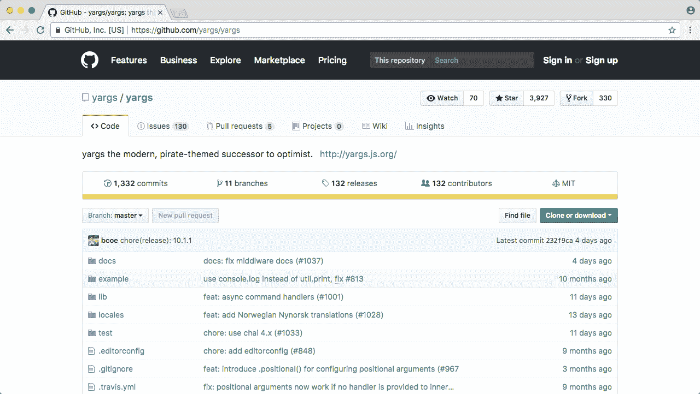

现在，yargs 是一个非常复杂的库。它有很多功能来验证各种输入，并且有不同的方式来格式化输入。我们将从一个非常基本的例子开始，尽管在本章中我们将介绍更复杂的例子。

如果你想查看我们在本章中没有讨论的任何其他功能，或者你只是想看看我们讨论过的某些功能是如何工作的，你可以在[yarg 文档](http://yargs.js.org/docs/)中找到它。

现在，我们将进入终端，在我们的应用程序中安装这个模块。为了做到这一点，我们将使用`npm install`，然后是模块名称`yargs`，在这种情况下，我将使用`@`符号来指定我想要使用的模块的特定版本，即 11.0.0，这是我写作时最新的版本。接下来，我将添加`save`标志，正如我们所知，这会更新`package.json`文件：

```js
npm install yargs@11.0.0 --save
```

如果我不加`save`标志，yargs 将被安装到`node_modules`文件夹中，但如果我们稍后清空该`node_modules`文件夹并运行`npm install`，yargs 将不会被重新安装，因为它没有列在`package.json`文件中。这就是为什么我们要使用`save`标志的原因。

# 运行 yargs

现在我们已经安装了 yargs，我们可以进入 Atom，在`app.js`中开始使用它。yargs 的基础，它的功能集的核心，非常简单易用。我们要做的第一件事就是像我们在上一章中使用`fs`和`lodash`一样，将其`require`进来。让我们创建一个常量并将其命名为`yargs`，将其设置为`require('yargs')`，如下所示：

```js
console.log('Starting app.js');

const fs = require('fs');
const _ = require('lodash');
const yargs = require('yargs');

const notes = require('./notes.js');

var command = process.argv[2];
console.log('Command:', command);
console.log(process.argv);

if (command === 'add') {
  console.log('Adding new note');
} else if (command === 'list') {
  console.log('Listing all notes');
} else if (command === 'read') {
  console.log('Reading note');
} else if (command === 'remove') {
  console.log('Removing note');
} else {
  console.log('Command not recognized');
}
```

从这里，我们可以获取 yargs 解析的参数。它将获取我们在上一章中讨论过的`process.argv`数组，但它在后台解析它，给我们比 Node 给我们的更有用的东西。就在`command`变量的上面，我们可以创建一个名为`argv`的`const`变量，将其设置为`yargs.argv`，如下所示：

```js
console.log('Starting app.js');

const fs = require('fs');
const _ = require('lodash');
const yargs = require('yargs');

const notes = require('./notes.js');

const argv = yargs.argv;
var command = process.argv[2];
console.log('Command:', command);
console.log(process.argv);

if (command === 'add') {
  console.log('Adding new note');
} else if (command === 'list') {
  console.log('Listing all notes');
} else if (command === 'read') {
  console.log('Reading note');
} else if (command === 'remove') {
  console.log('Removing note');
} else {
  console.log('Command not recognized');
}
```

`yargs.argv`模块是 yargs 库存储应用程序运行的参数版本的地方。现在我们可以使用`console.log`打印它，这将让我们查看`process.argv`和`yargs.argv`变量；我们还可以比较它们，看看 yargs 的不同之处。对于使用`console.log`打印`process.argv`的命令，我将把第一个参数命名为`Process`，这样我们就可以在终端中区分它。我们将再次调用`console.log`。第一个参数将是`Yargs`字符串，第二个参数将是来自 yargs 的实际`argv`变量：

```js
console.log('Starting app.js');

const fs = require('fs');
const _ = require('lodash');
const yargs = require('yargs');

const notes = require('./notes.js');

const argv = yargs.argv;
var command = process.argv[2];
console.log('Command:', command);
console.log('Process', process.argv);
console.log('Yargs', argv);

if (command === 'add') {
  console.log('Adding new note');
} else if (command === 'list') {
  console.log('Listing all notes');
} else if (command === 'read') {
  console.log('Reading note');
} else if (command === 'remove') {
  console.log('Removing note');
} else {
  console.log('Command not recognized');
}
```

现在我们可以以几种不同的方式运行我们的应用程序（参考前面的代码块），看看这两个`console.log`语句的区别。

首先，我们将使用`add`命令运行`node app.js`，我们可以运行这个非常基本的例子：

```js
node app.js add
```

我们已经从上一章知道了`process.argv`数组的样子。有用的信息是数组中的第三个字符串，即'add'。在第四个字符串中，Yargs 给了我们一个看起来非常不同的对象：

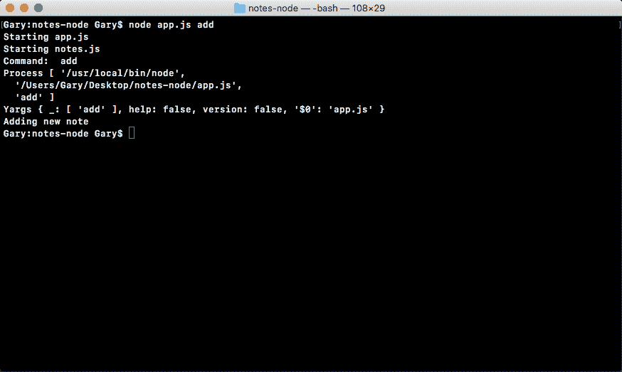

如前面的代码输出所示，首先是下划线属性，然后存储了 add 等命令。

如果我要添加另一个命令，比如`add`，然后我要添加一个修饰符，比如`encrypted`，你会看到`add`是第一个参数，`encrypted`是第二个参数，如下所示：

```js
node app.js add encrypted
```

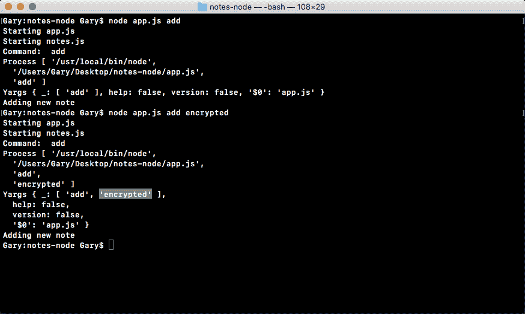

到目前为止，yargs 并没有表现出色。这并不比我们在上一个例子中拥有的更有用。它真正发挥作用的地方是当我们开始传递键值对时，比如我们在*Node 基础知识-第一部分*的*获取输入*部分中使用的标题示例中。我可以将我的`title`标志设置为`secrets`，按*enter*，这一次，我们得到了更有用的东西：

```js
node app.js add --title=secrets
```

在下面的代码输出中，我们有第三个字符串，我们需要解析以获取值和键，而在第四个字符串中，我们实际上有一个带有值为 secrets 的标题属性：

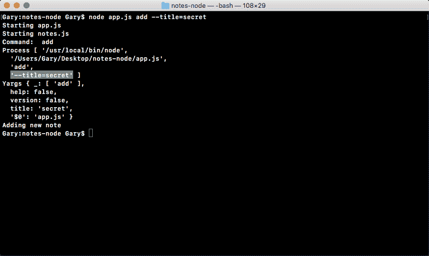

此外，yargs 已经内置了对您可能指定的所有不同方式的解析。

我们可以在`title`后面插入一个空格，它仍然会像以前一样工作；我们可以在`secrets`周围添加引号，或者添加其他单词，比如`Andrew 的秘密`，它仍然会正确解析，将`title`属性设置为`Andrew 的秘密`字符串，如下所示：

```js
node app.js add --title "secrets from Andrew"
```

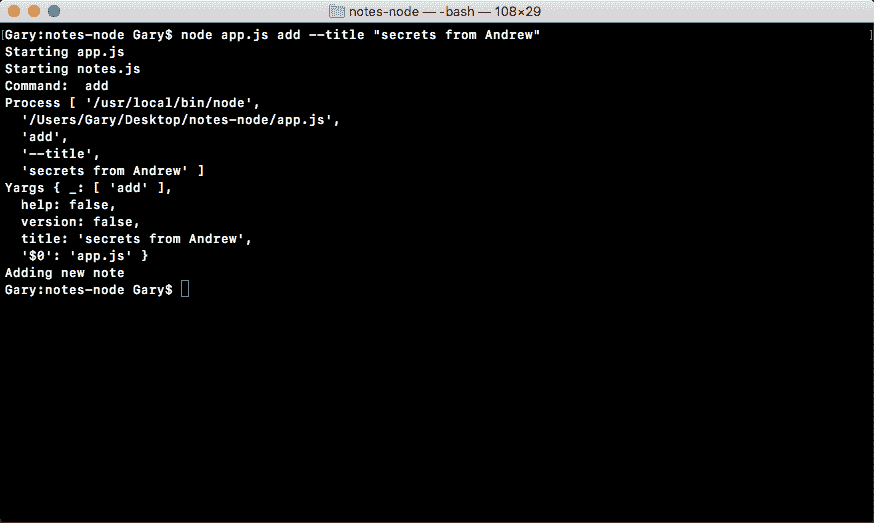

这就是 yargs 真正发挥作用的地方！它使解析参数的过程变得更加容易。这意味着在我们的应用程序中，我们可以利用这种解析并调用适当的函数。

# 使用 add 命令

让我们以`add`命令为例，解析您的参数并调用函数。一旦调用`add`命令，我们希望调用`notes`中定义的一个函数，这个函数将负责实际添加笔记。`notes.addNote`函数将完成这项工作。现在，我们想要传递给`addNote`函数什么？我们想要传递两件事：标题，可以在`argv.title`上访问，就像我们在前面的例子中看到的那样；和正文，`argv.body`：

```js
console.log('Starting app.js');

const fs = require('fs');
const _ = require('lodash');
const yargs = require('yargs');

const notes = require('./notes.js');

const argv = yargs.argv;
var command = process.argv[2];
console.log('Command:', command);
console.log('Process', process.argv);
console.log('Yargs', argv);

if (command === 'add') {
  console.log('Adding new note');
  notes.addNote(argv.title, argv.body);
} else if (command === 'list') {
  console.log('Listing all notes');
} else if (command === 'read') {
  console.log('Reading note');
} else if (command === 'remove') {
  console.log('Removing note');
} else {
  console.log('Command not recognized');
}
```

目前，这些命令行参数`title`和`body`并不是必需的。因此从技术上讲，用户可以在没有其中一个的情况下运行应用程序，这将导致应用程序崩溃，但在未来，我们将要求这两者都是必需的。

现在我们已经放置了`notes.addNote`，我们可以删除我们之前的`console.log`语句，这只是一个占位符，然后我们可以进入笔记应用程序`notes.js`。

在`notes.js`中，我们将通过创建一个与我们在`app.js`中使用的方法同名的变量来开始，然后将其设置为一个匿名箭头函数，如下所示：

```js
var addNote = () => {

};
```

但是，仅仅这样还不太有用，因为我们没有导出`addNote`函数。在变量下面，我们可以以稍微不同的方式定义`module.exports`。在之前的部分中，我们添加属性到`exports`来导出它们。我们实际上可以定义一个整个对象，将其设置为`exports`，在这种情况下，我们可以将`addNote`设置为前面代码块中定义的`addNote`函数：

```js
module.exports = {
  addNote: addNote
};
```

在 ES6 中，实际上有一个快捷方式。当你设置一个对象属性和一个变量的值，它们都完全相同时，你可以省略冒号和值。无论哪种方式，结果都是相同的。

在前面的代码中，我们将一个对象设置为`module.exports`，这个对象有一个属性`addNote`，指向我们在前面的代码块中定义的`addNote`函数的变量。

再次强调，在 ES6 中，`addNote:`和`addNote`在 ES6 内部是相同的。我们将在本书中始终使用 ES6 语法。

现在我可以拿到我的两个参数，`title`和`body`，并且实际上对它们做一些事情。在这种情况下，我们将调用`console.log`和`Adding note`，将两个参数作为`console.log`的第二个和第三个参数传递进去，`title`和`body`，如下所示：

```js
var addNote = (title, body) => {
  console.log('Adding note', title, body);
};
```

现在我们处于一个非常好的位置，可以使用`title`和`body`运行`add`命令，并查看我们是否得到了我们期望的结果，也就是前面代码中显示的`console.log`语句。

在终端中，我们可以通过`node app.js`运行应用程序，然后指定文件名。我们将使用`add`命令；这将运行适当的函数。然后，我们将传入`title`，将其设置为`secret`，然后我们可以传入`body`，这将是我们的第二个命令行参数，将其设置为字符串`This is my secret`：

```js
node app.js add --title=secret --body="This is my secret"
```

在这个命令中，我们指定了三件事：`add`命令，`title`参数，设置为`secret`；和`body`参数，设置为`"This is my secret"`。如果一切顺利，我们将得到适当的日志。让我们运行这个命令。

在下面的命令输出中，你可以看到`Adding note secret`，这是标题；和`This is my secret`，这是正文：

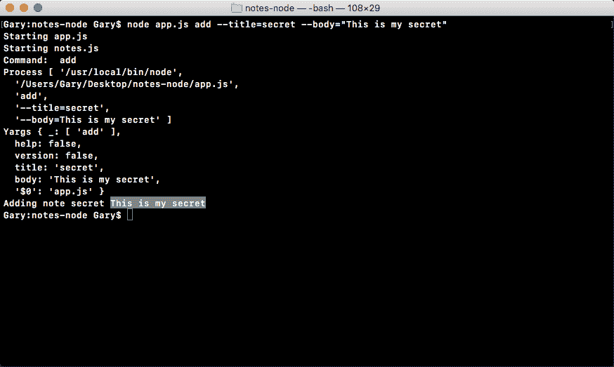

有了这个，我们现在有了一个设置好并准备好的方法。我们接下来要做的是转换我们拥有的其他命令——`list`，`read`和`remove`命令。让我们再看一个命令，然后你可以自己练习另外两个。

# 使用`list`命令

现在，使用`list`命令，我将删除`console.log`语句并调用`notes.getAll`，如下所示：

```js
console.log('Starting app.js');

const fs = require('fs');
const _ = require('lodash');
const yargs = require('yargs');

const notes = require('./notes.js');

const argv = yargs.argv;
var command = process.argv[2];
console.log('Command:', command);
console.log('Process', process.argv);
console.log('Yargs', argv);

if (command === 'add') {
  notes.addNote(argv.title, argv.body);
} else if (command === 'list') {
  notes.getAll();
} else if (command === 'read') {
  console.log('Reading note');
} else if (command === 'remove') {
  console.log('Removing note');
} else {
  console.log('Command not recognized');
}
```

在某个时候，`notes.getAll`将返回所有的笔记。现在，`getAll`不需要任何参数，因为它将返回所有的笔记，而不管标题是什么。`read`命令将需要一个标题，`remove`也将需要你想要删除的笔记的标题。

现在，我们可以创建`getAll`函数。在`notes.js`中，我们将再次进行这个过程。我们将首先创建一个变量，称之为`getAll`，并将其设置为一个箭头函数，这是我们之前使用过的。我们从我们的参数`list`开始，然后设置箭头(`=>`)，这是等号和大于号。接下来，我们指定我们想要运行的语句。在我们的代码块中，我们将运行`console.log(Getting all notes)`，如下所示：

```js
var getAll = () => {
  console.log('Getting all notes');
};
```

在添加分号之后的最后一步是将`getAll`添加到`exports`中，如下面的代码块所示：

```js
module.exports = {
  addNote,
  getAll
};
```

请记住，在 ES6 中，如果你有一个属性的名称与值相同，这个值是一个变量，你可以简单地删除值变量和冒号。

现在我们在`notes.js`中有了`getAll`，并且在`app.js`中已经连接好了，我们可以在终端中运行。在这种情况下，我们将运行`list`命令：

```js
node app.js list
```

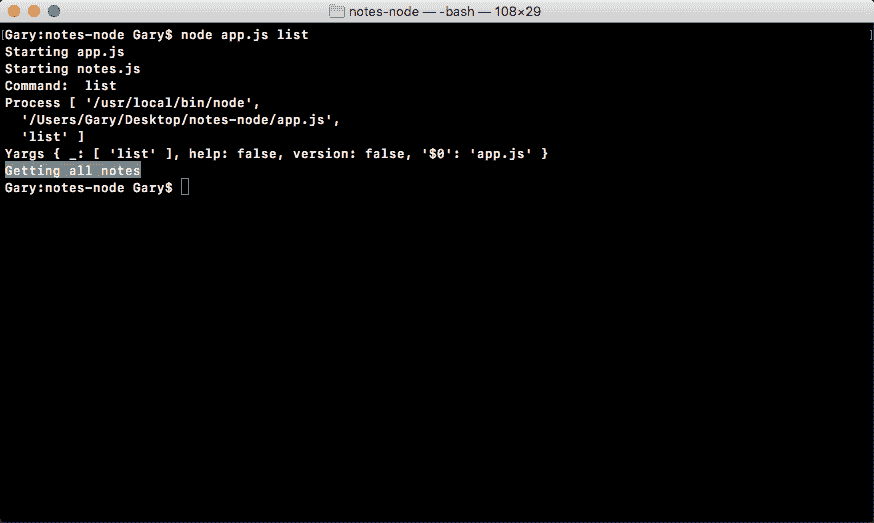

在前面的代码输出中，你可以看到屏幕上打印出了`Getting all notes`。现在我们已经有了这个，我们可以从`app.js`的`command`变量中删除`console.log('Process', process.argv)`。结果代码将如下所示：

```js
console.log('Starting app.js');

const fs = require('fs');
const _ = require('lodash');
const yargs = require('yargs');

const notes = require('./notes.js');

const argv = yargs.argv;
var command = process.argv[2];
console.log('Command:', command);
console.log('Yargs', argv);

if (command === 'add') {
  notes.addNote(argv.title, argv.body);
} else if (command === 'list') {
  notes.getAll();
} else if (command === 'read') {
  console.log('Reading note');
} else if (command === 'remove') {
  console.log('Removing note');
} else {
  console.log('Command not recognized');
}
```

我们将保留 yargs 日志，因为我们将在本章中探索其他使用 yargs 的方法和方式。

现在我们已经有了`list`命令，接下来，我想让你为`read`和`remove`命令创建一个方法。

# 读取命令

当使用`read`命令时，我们希望调用`notes.getNote`，传入`title`。现在，`title`将被传递并使用 yargs 进行解析，这意味着我们可以使用`argv.title`来获取它。这就是在调用函数时所需要做的一切：

```js
console.log('Starting app.js');

const fs = require('fs');
const _ = require('lodash');
const yargs = require('yargs');

const notes = require('./notes.js');

const argv = yargs.argv;
var command = process.argv[2];
console.log('Command:', command);
console.log('Yargs', argv);

if (command === 'add') {
  notes.addNote(argv.title, argv.body);
} else if (command === 'list') {
  notes.getAll();
} else if (command === 'read') {
  notes.getNote(argv.title);
} else if (command === 'remove') {
  console.log('Removing note');
} else {
  console.log('Command not recognized');
}
```

下一步是定义`getNote`，因为目前它并不存在。在`notes.js`中，在`getAll`变量的下面，我们可以创建一个名为`getNote`的变量，它将是一个函数。我们将使用箭头函数，并且它将接受一个参数；它将接受`note`的标题。`getNote`函数接受标题，然后返回该笔记的内容：

```js
var getNote = (title) => {

};
```

在`getNote`中，我们可以使用`console.log`打印一些类似于`Getting note`的内容，后面跟着你将要获取的笔记的标题，这将是`console.log`的第二个参数：

```js
var getNote = (title) => {
  console.log('Getting note', title);
};
```

这是第一个命令，我们现在可以在继续第二个命令`remove`之前进行测试。

在终端中，我们可以使用`node app.js`来运行文件。我们将使用新的`read`命令，传入一个`title`标志。我将使用不同的语法，其中`title`被设置为引号外的值。我将使用类似`accounts`的东西：

```js
node app.js read --title accounts
```

这个`accounts`值将在将来读取`accounts`笔记，并将其打印到屏幕上，如下所示：

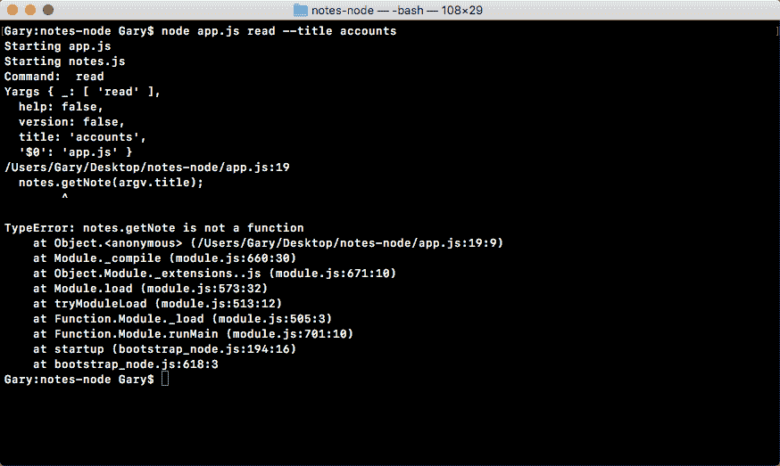

如你在前面的代码输出中所看到的，我们得到了一个错误，现在我们将对其进行调试。

# 处理解析命令中的错误

遇到错误并不是世界末日。通常出现错误意味着你可能有一个小的拼写错误或者在过程中忘记了一步。所以，我们首先要弄清楚如何解析这些错误消息，因为代码输出中得到的错误消息可能会让人望而生畏。让我们来看一下代码输出中的错误：


正如你所看到的，第一行显示了错误发生的位置。它在我们的`app.js`文件中，冒号后面的数字 19 是行号。它准确地告诉你事情出了问题的地方。`TypeError: notes.getNote is not a function`行清楚地告诉你你尝试运行的`getNote`函数不存在。现在我们可以利用这些信息来调试我们的应用程序。

在`app.js`中，我们看到我们调用了`notes.getNote`。一切看起来很好，但当我们进入`notes.js`时，我们意识到我们实际上从未导出`getNote`。这就是为什么当我们尝试调用该函数时，我们会得到`getNote is not a function`。我们只需要做的就是导出`getNote`，如下所示：

```js
module.exports = {
  addNote,
  getAll,
  getNote
};
```

现在当我们保存文件并从终端重新运行应用程序时，我们将得到我们期望的结果——`Getting note`后面跟着标题，这里是`accounts`：

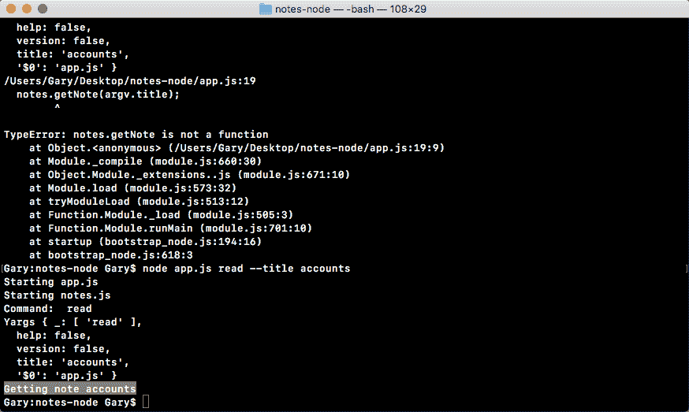

这就是我们如何调试我们的错误消息。错误消息包含非常有用的信息。在大多数情况下，前几行是你编写的代码，其他行是内部 Node 代码或第三方模块。在我们的情况下，堆栈跟踪的第一行很重要，因为它准确地显示了错误发生的位置。

# 删除命令

现在，由于`read`命令正在工作，我们可以继续进行最后一个命令`remove`。在这里，我将调用`notes.removeNote`，传入标题，正如我们所知道的在`argv.title`中可用：

```js
console.log('Starting app.js');

const fs = require('fs');
const _ = require('lodash');
const yargs = require('yargs');

const notes = require('./notes.js');

const argv = yargs.argv;
var command = process.argv[2];
console.log('Command:', command);
console.log('Yargs', argv);

if (command === 'add') {
  notes.addNote(argv.title, argv.body);
} else if (command === 'list') {
  notes.getAll();
} else if (command === 'read') {
  notes.getNote(argv.title);
} else if (command === 'remove') {
  notes.removeNote(argv.title);
} else {
  console.log('Command not recognized');
}
```

接下来，我们将在我们的笔记 API 文件中定义 `removeNote` 函数，就在 `getNote` 变量的下面：

```js
var removeNote = (title) => { 
 console.log('Removing note', title);
};
```

现在，`removeNote` 将与 `getNote` 工作方式基本相同。它只需要标题；它可以使用这些信息来查找笔记并从数据库中删除它。这将是一个接受 `title` 参数的箭头函数。

在这种情况下，我们将打印 `console.log` 语句 `Removing note`；然后，作为第二个参数，我们将简单地打印 `title` 回到屏幕上，以确保它成功地通过了这个过程。这一次，我们将导出我们的 `removeNote` 函数；我们将使用 ES6 语法来定义它：

```js
module.exports = {
  addNote,
  getAll,
  getNote,
  removeNote
};
```

最后要做的事情是测试它并确保它有效。我们可以使用上箭头键重新加载上一个命令。我们将 `read` 改为 `remove`，这就是我们需要做的全部。我们仍然传入 `title` 参数，这很好，因为这是 `remove` 需要的：

```js
node app.js remove --title accounts
```

当我运行这个命令时，我们得到了我们预期的结果。移除笔记打印到屏幕上，如下面的代码输出所示，然后我们得到了我们应该移除的笔记的标题，即 accounts：

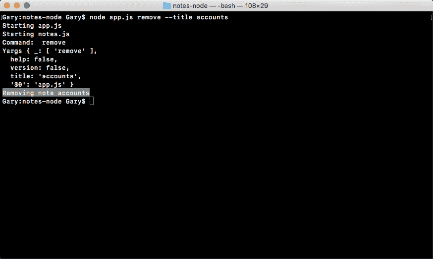

看起来很棒！这就是使用 yargs 解析你的参数所需的全部内容。

有了这个，我们现在有了一个地方来定义所有这些功能，用于保存、读取、列出和删除笔记。

# 获取命令

在我们结束本节之前，我想讨论的最后一件事是——我们如何获取 `command`。

正如我们所知，`command` 在 `_` 属性中作为第一个且唯一的项可用。这意味着在 `app.js` 中，`var command` 语句中，我们可以将 `command` 设置为 `argv`，然后 `._`，然后我们将使用 `[]` 来抓取数组中的第一个项目，如下面的代码所示：

```js
console.log('Starting app.js');

const fs = require('fs');
const _ = require('lodash');
const yargs = require('yargs');

const notes = require('./notes.js');

const argv = yargs.argv;
var command = argv._[0];
console.log('Command:', command);
console.log('Yargs', argv);

if (command === 'add') {
  notes.addNote(argv.title, argv.body);
} else if (command === 'list') {
  notes.getAll();
} else if (command === 'read') {
  notes.getNote(argv.title);
} else if (command === 'remove') {
  notes.removeNote(argv.title);
} else {
  console.log('Command not recognized');
}
```

有了这个功能，我们现在有了相同的功能，但我们将在所有地方使用 yargs。如果我重新运行上一个命令，我们可以测试功能是否仍然有效。它确实有效！如下面的命令输出所示，我们可以看到命令：remove 显示出来：

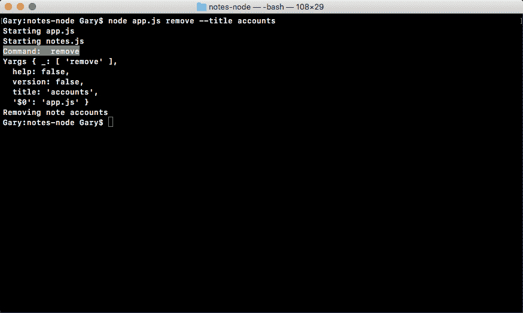

接下来，我们将研究填写各个函数。我们首先来看一下如何使用 JSON 将我们的笔记存储在文件系统中。

# JSON

现在你知道如何使用 `process.argv` 和 yargs 解析命令行参数，你已经解决了 `notes` 应用程序的第一部分难题。现在，我们如何从用户那里获取独特的输入呢？解决这个难题的第二部分是解决我们如何存储这些信息。

当有人添加新的笔记时，我们希望将其保存在某个地方，最好是在文件系统上。所以下次他们尝试获取、移除或读取该笔记时，他们实际上会得到该笔记。为了做到这一点，我们需要引入一个叫做 JSON 的东西。如果你已经熟悉 JSON，你可能知道它非常受欢迎。它代表 JavaScript 对象表示法，是一种用字符串表示 JavaScript 数组和对象的方法。那么，为什么你会想要这样做呢？

嗯，你可能想这样做是因为字符串只是文本，而且几乎在任何地方都得到支持。我可以将 JSON 保存到文本文件中，然后稍后读取它，将其解析回 JavaScript 数组或对象，并对其进行操作。这正是我们将在本节中看到的。

为了探索 JSON 以及它的工作原理，让我们继续在我们的项目中创建一个名为 `playground` 的新文件夹。

在整本书中，我将创建 `playground` 文件夹和各种项目，这些项目存储简单的一次性文件，不是更大应用程序的一部分；它们只是探索新功能或学习新概念的一种方式。

在 `playground` 文件夹中，我们将创建一个名为 `json.js` 的文件，这是我们可以探索 JSON 工作原理的地方。让我们开始，让我们创建一个非常简单的对象。

# 将对象转换为字符串

首先，让我们创建一个名为`obj`的变量，将其设置为一个对象。在这个对象上，我们只定义一个属性`name`，并将其设置为你的名字；我将这个属性设置为`Andrew`，如下所示：

```js
var obj = {
  name: 'Andrew'
};
```

现在，假设我们想要获取这个对象并对其进行操作。例如，我们想要将其作为字符串在服务器之间发送并保存到文本文件中。为此，我们需要调用一个 JSON 方法。

让我们定义一个变量来存储结果`stringObj`，并将其设置为`JSON.stringify`，如下所示：

```js
var stringObj = JSON.stringify(obj);
```

`JSON.stringify`方法接受你的对象，这里是`obj`变量，并返回 JSON 字符串化的版本。这意味着存储在`stringObj`中的结果实际上是一个字符串。它不再是一个对象，我们可以使用`console.log`来查看。我将使用`console.log`两次。首先，我们将使用`typeof`运算符打印字符串对象的类型，以确保它实际上是一个字符串。由于`typeof`是一个运算符，它以小写形式输入，没有驼峰命名法。然后，传入要检查其类型的变量。接下来，我们可以使用`console.log`来打印字符串本身的内容，打印`stringObj`变量，如下所示：

```js
console.log(typeof stringObj);
console.log(stringObj);
```

我们在这里所做的是将一个对象转换为 JSON 字符串，并将其打印到屏幕上。在终端中，我将使用以下命令导航到`playground`文件夹中：

```js
cd playground
```

现在，无论你在哪里运行命令都无所谓，但在将来当我们在`playground`文件夹中时，这将很重要，所以花点时间进入其中。

现在，我们可以使用`node`来运行我们的`json.js`文件。运行文件时，我们会看到两件事：

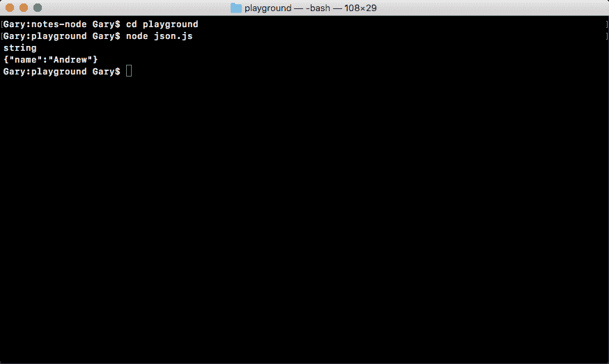

如前面的代码输出所示，首先我们会得到我们的类型，它是一个字符串，这很好，因为记住，JSON 是一个字符串。接下来，我们将得到我们的对象，它看起来与 JavaScript 对象非常相似，但有一些区别。这些区别如下：

+   首先，你的 JSON 将自动用双引号包裹其属性名称。这是 JSON 语法的要求。

+   接下来，你会注意到你的字符串也被双引号包裹，而不是单引号。

现在，JSON 不仅支持字符串值，还可以使用数组、布尔值、数字或其他任何类型。所有这些类型在你的 JSON 中都是完全有效的。在这种情况下，我们有一个非常简单的示例，其中有一个`name`属性，它设置为`"Andrew"`。

这是将对象转换为字符串的过程。接下来，我们将定义一个字符串，并将其转换为我们可以在应用程序中实际使用的对象。

# 定义一个字符串并在应用程序中使用

让我们开始创建一个名为`personString`的变量，并将其设置为一个字符串，使用单引号，因为 JSON 在其内部使用双引号，如下所示：

```js
var personString = '';
```

然后我们将在引号中定义我们的 JSON。我们将首先打开和关闭一些花括号。我们将使用双引号创建我们的第一个属性，我们将其称为`name`，并将该属性设置为`Andrew`。这意味着在闭合引号之后，我们将添加`:`；然后我们将再次打开和关闭双引号，并输入值`Andrew`，如下所示：

```js
var personString = '{"name": "Andrew"}';
```

接下来，我们可以添加另一个属性。在值`Andrew`之后，我将在逗号后创建另一个属性，称为`age`，并将其设置为一个数字。我可以使用冒号，然后定义数字而不使用引号，例如`25`：

```js
var personString = '{"name": "Andrew","age": 25}';
```

你可以继续使用你的名字和年龄，但确保其余部分看起来与这里看到的完全相同。

现在，假设我们从服务器获取了先前定义的 JSON，或者我们从文本文件中获取了它。目前它是无用的；如果我们想获取`name`值，没有好的方法可以做到，因为我们使用的是一个字符串，所以`personString.name`不存在。我们需要将字符串转换回对象。

# 将字符串转换回对象

要将字符串转换回对象，我们将使用`JSON.stringify`的相反操作，即`JSON.parse`。让我们创建一个变量来存储结果。我将创建一个`person`变量，并将其设置为`JSON.parse`，传入作为唯一参数要解析的字符串，即`person`字符串，我们之前定义过的：

```js
var person = JSON.parse(personString);
```

现在，这个变量将把你的 JSON 从字符串转换回其原始形式，可以是数组或对象。在我们的情况下，它将其转换回对象，并且我们有`person`变量作为对象，如前面的代码所示。此外，我们可以使用`typeof`运算符证明它是一个对象。我将使用`console.log`两次，就像我们之前做过的那样。

首先，我们将打印`person`的`typeof`，然后我们将打印实际的`person`变量，`console.log(person)`：

```js
console.log(typeof person);
console.log(person);
```

有了这个，我们现在可以在终端中重新运行命令；我将实际启动`nodemon`并传入`json.js`：

```js
nodemon json.js 
```

如下所示的代码输出，您现在可以看到我们正在使用一个对象，这很棒，我们有我们的常规对象：

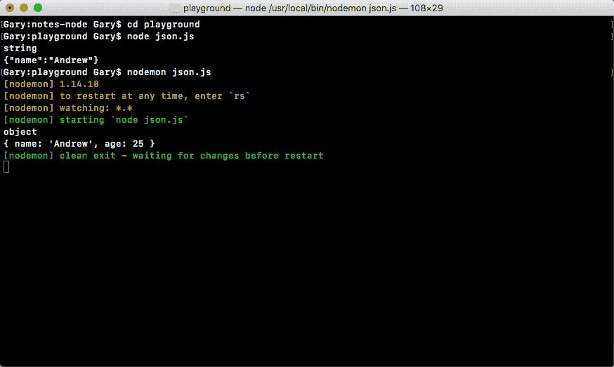

我们知道`Andrew`是一个对象，因为它没有用双引号包裹；值没有引号，我们使用单引号`Andrew`，这在 JavaScript 中是有效的，但在 JSON 中是无效的。

这是将对象转换为字符串，然后将字符串转换回对象的整个过程，这正是我们将在`notes`应用程序中做的。唯一的区别是，我们将取以下字符串并将其存储在文件中，然后稍后，我们将使用`JSON.parse`从文件中读取该字符串，将其转换回对象，如下面的代码块所示：

```js
// var obj = {
//  name: 'Andrew'
// };
// var stringObj = JSON.stringify(obj);
// console.log(typeof stringObj);
// console.log(stringObj);

var personString = '{"name": "Andrew","age": 25}';
var person = JSON.parse{personString};
console.log(typeof person);
console.log(person);
```

# 将字符串存储在文件中

基本知识已经就位，让我们再进一步，也就是将字符串存储在文件中。然后，我们希望使用`fs`模块读取该文件的内容，并打印一些属性。这意味着我们需要将从`fs.readfilesync`获取的字符串转换为对象，使用`JSON.parse`。

# 在 playground 文件夹中写入文件

让我们继续注释掉到目前为止的所有代码，从干净的板上开始。首先，让我们加载`fs`模块。`const`变量`fs`将被设置为`require`，我们将传递过去使用过的`fs`模块，如下所示：

```js
// var obj = {
//  name: 'Andrew'
// };
// var stringObj = JSON.stringify(obj);
// console.log(typeof stringObj);
// console.log(stringObj);

// var personString = '{"name": "Andrew","age": 25}';
// var person = JSON.parse(personString);
// console.log(typeof person);
// console.log(person);

const fs = require('fs');
```

接下来要做的是定义对象。这个对象将被存储在我们的文件中，然后将被读取并解析。这个对象将是一个名为`originalNote`的变量，我们将称它为`originalNote`，因为后来，我们将重新加载它并将该变量称为`Note`。

现在，`originalNote`将是一个常规的 JavaScript 对象，有两个属性。我们将有`title`属性，将其设置为`Some title`，和`body`属性，将其设置为`Some body`，如下所示：

```js
var originalNote = {
  title: 'Some title',
  body: 'Some body'
};
```

您需要做的下一步是获取原始注释并创建一个名为`originalNoteString`的变量，并将该变量设置为我们之前定义的对象的 JSON 值。这意味着您需要使用我们在本节先前使用过的两种 JSON 方法之一。

现在，一旦你有了`originalNoteString`变量，我们就可以将文件写入文件系统。我会为你写下这一行，`fs.writeFileSync`。我们之前使用的`writeFileSync`方法需要两个参数。一个是文件名，由于我们使用的是 JSON，使用 JSON 文件扩展名很重要。我会把这个文件叫做`notes.json`。另一个参数将是文本内容，`originalNoteString`，它还没有被定义，如下面的代码块所示：

```js
// originalNoteString
fs.writeFileSync('notes.json', originalNoteString);
```

这是整个过程的第一步；这是我们将文件写入`playground`文件夹的方法。下一步是读取内容，使用之前的 JSON 方法进行解析，并打印其中一个属性到屏幕上，以确保它是一个对象。在这种情况下，我们将打印标题。

# 读取文件中的内容

打印标题的第一步是使用我们尚未使用过的方法。我们将使用文件系统模块上可用的`read`方法来读取内容。让我们创建一个名为`noteString`的变量。`noteString`变量将被设置为`fs.readFileSync`。

现在，`readFileSync`与`writeFileSync`类似，只是它不需要文本内容，因为它会为你获取文本内容。在这种情况下，我们只需指定第一个参数，即文件名`notes.JSON`：

```js
var noteString = fs.readFileSync('notes.json');
```

现在我们有了字符串，你的工作就是拿到那个字符串，使用前面的方法之一，将它转换回对象。你可以将那个变量叫做`note`。接下来，唯一剩下的事情就是测试一切是否按预期工作，通过使用`console.log(typeof note)`来打印。然后，在这之下，我们将使用`console.log`来打印标题，`note.title`：

```js
// note
console.log(typeof note);
console.log(note.title);
```

现在，在终端中，你可以看到（参考下面的截图），我保存了一个损坏的文件，并且它崩溃了，这是使用`nodemon`时预期的结果：

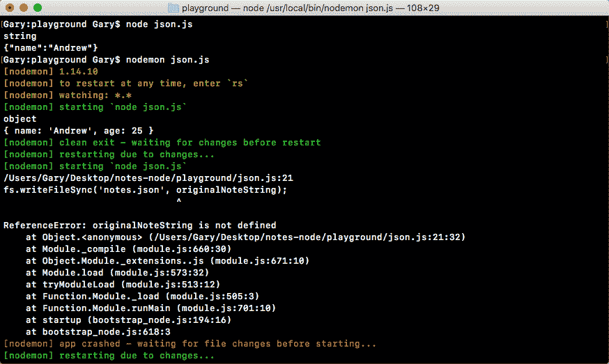

为了解决这个问题，我要做的第一件事是填写`originalNoteString`变量，这是我们之前注释掉的。现在它将成为一个名为`originalNoteString`的变量，并且我们将把它设置为`JSON.stringify`的返回值。

现在，我们知道`JSON.stringify`将我们的普通对象转换为字符串。在这种情况下，我们将把`originalNote`对象转换为字符串。下一行，我们已经填写好了，将保存该 JSON 值到`notes.JSON`文件中。然后我们将读取该值出来：

```js
var originalNoteString = JSON.stringify(originalNote);
```

下一步将是创建`note`变量。`note`变量将被设置为`JSON.parse`。

`JSON.parse`方法将字符串 JSON 转换回普通的 JavaScript 对象或数组，取决于你保存的内容。在这里，我们将传入`noteString`，这是我们从文件中获取的：

```js
var note = JSON.parse(noteString);
```

有了这个，我们现在完成了。当我保存这个文件时，`nodemon`将自动重新启动，我们不会看到错误。相反，我们期望看到对象类型以及笔记标题。在终端中，我们有对象和一些标题打印到屏幕上：

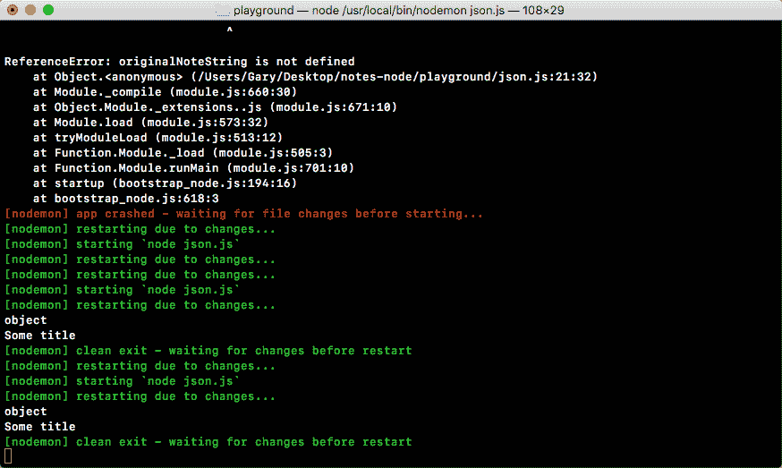

有了这个，我们已经成功完成了挑战。这正是我们将保存我们的笔记的方法。

当有人添加新的笔记时，我们将使用以下代码来保存它：

```js
var originalNote = {
  title: 'Some title',
  body: 'Some body'
};
var originalNoteString = JSON.stringify(originalNote);
fs.writeFileSync('notes.json', originalNoteString);
```

当有人想要阅读他们的笔记时，我们将使用以下代码来读取它：

```js
var noteString = fs.readFileSync('notes.json');
var note = JSON.parse(noteString);
console.log(typeof note);
console.log(note.title);
```

现在，如果有人想要添加一条笔记呢？这将要求我们首先读取所有的笔记，然后修改笔记数组，然后使用代码（参考前面的代码块）将新数组保存回文件系统中。

如果你打开`notes.JSON`文件，你可以看到我们的 JSON 代码就在文件中：

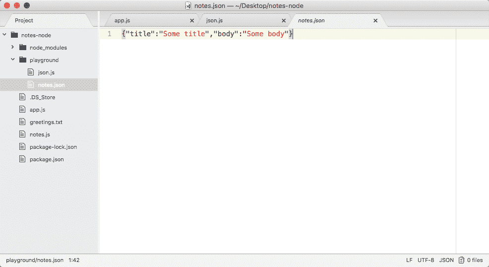

`.json`实际上是大多数文本编辑器支持的文件格式，因此我已经内置了一些不错的语法高亮。现在，在下一节中，我们将填写`addNote`函数，使用刚刚在本节中使用的完全相同的逻辑。

# 添加和保存笔记

在上一节中，您学习了如何在 Node.js 中处理 JSON，这是我们将在`notes.js`应用程序中使用的确切格式。当您首次运行命令时，我们将加载可能已经存在的所有笔记。然后我们将运行命令，无论是添加、删除还是阅读笔记。最后，如果我们已经更新了数组，就像我们在添加和删除笔记时所做的那样，我们将这些新的笔记保存回 JSON 文件中。

现在，所有这些将发生在我们在`notes.js`应用程序中定义的`addNote`函数内部，我们已经连接了这个函数。在之前的部分中，我们运行了`add`命令，这个函数执行了`title`和`body`参数。

# 添加笔记

要开始添加笔记，我们要做的第一件事是创建一个名为`notes`的变量，暂时将其设置为空数组，就像下面这样使用我们的方括号：

```js
var addNote = (title, body) => {
  var notes = [];
};
```

现在我们有了空数组，我们可以继续创建一个名为`note`的变量，这是单个笔记。这将代表新的笔记：

```js
var addNote = (title, body) => {
  var notes = [];
  var note = {

  }
};
```

在这一点上，我们将有两个属性：一个`title`和一个`body`。现在，`title`可以设置为`title`变量，但是，正如我们所知，在 ES6 中，当两个值相同时，我们可以简单地将其删除；因此，我们将添加`title`和`body`如下所示：

```js
var addNote = (title, body) => {
  var notes = [];
  var note = {
    title,
    body
  };
};
```

现在我们有了`note`和`notes`数组。

# 将笔记添加到笔记数组中

添加笔记过程中的下一步将是将`note`添加到`notes`数组中。`notes.push`方法将让我们做到这一点。数组上的`push`方法允许您传入一个项目，该项目将被添加到数组的末尾，在这种情况下，我们将传入`note`对象。因此，我们有一个空数组，并且我们添加了一个项目，如下面的代码所示；接下来，我们将其推入，这意味着我们有一个包含一个项目的数组：

```js
var addNote = (title, body) => {
  var notes = [];
  var note = {
    title,
    body
  };

  notes.push(note);
};
```

下一步将是更新文件。现在，我们没有文件，但我们可以加载一个`fs`函数并开始创建文件。

在`addNote`函数的上面，让我们加载`fs`模块。我将创建一个名为`fs`的`const`变量，并将其设置为`require`的返回结果，并且我们将要求`fs`模块，这是一个核心的 node 模块，因此不需要使用 NPM 安装它：

```js
const fs = require('fs');
```

有了这个，我们可以在`addNote`函数内部利用`fs`。

在我们将项目推入`notes`数组之后，我们将调用`fs.writeFileSync`，这是我们以前使用过的。我们知道我们需要传入两件事：文件名和我们想要保存的内容。对于文件，我将调用`notes-data.JSON`，然后我们将传入要保存的内容，这种情况下将是`stringify` notes 数组，这意味着我们可以调用`JSON.stringify`传入`notes`：

```js
notes.push(note);
fs.writeFileSync('notes-data.json', JSON.stringify(notes));
```

我们本可以将`JSON.stringfy(notes)`拆分为自己的变量，并在上面的语句中引用该变量，但由于我们只会在一个地方使用它，我认为这是更好的解决方案。

在这一点上，当我们添加一个新的笔记时，它将更新`notes-data.JSON`文件，该文件将在机器上创建，因为它不存在，并且笔记将位于其中。现在，重要的是要注意，当前每次添加新的笔记时，它将擦除所有现有的笔记，因为我们从未加载现有的笔记，但我们可以开始测试这个笔记是否按预期工作。

我将保存文件，在终端内部，我们可以使用`node app.js`运行这个文件。因为我们想要添加一个`note`，我们将使用我们设置的`add`命令，然后我们将指定我们的标题和正文。`title`标志可以设置为`secret`，对于`body`标志，我将把它设置为`Some body here`字符串，如下所示：

```js
node app.js add --title=secret --body="Some body here"
```

现在，当我们从终端运行这个命令时，我们将看到我们所期望的结果：

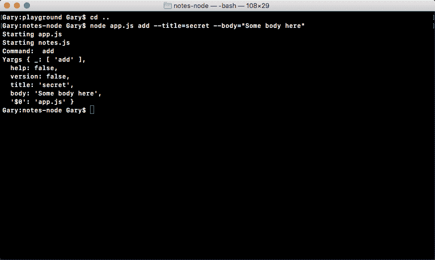

如前面的屏幕截图所示，我们看到了我们添加的一些文件命令：我们看到`add`命令被执行了，并且我们有我们的 Yargs 参数。标题和正文参数也显示出来了。在 Atom 中，我们还看到了一个新的`notes-data.json`文件，在下面的屏幕截图中，我们有我们的笔记，有`secret`标题和`Some body here`正文：

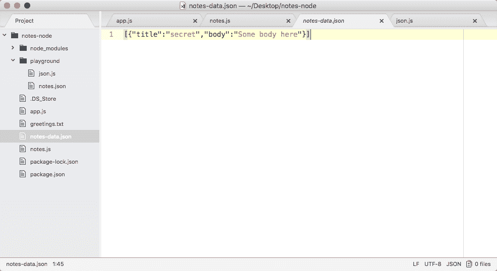

这是连接`addNote`函数的第一步。我们有一个现有的`notes`文件，我们确实希望利用这些笔记。如果笔记已经存在，我们不希望每次有人添加新笔记时都将它们简单地清除。这意味着在`notes.js`中，在`addNote`函数的开头，我们将获取这些笔记。

# 获取新笔记

我将添加获取新笔记的代码，在那里我定义了`notes`和`note`变量。如下面的代码所示，我们将使用`fs.readFileSync`，这是我们已经探索过的。这将获取文件名，在我们的情况下是`notes-data.JSON`。现在，我们将希望将`readFileSync`的返回值存储在一个变量上；我将称这个变量为`notesString`：

```js
var notesString = fs.readFileSync('notes-data.json');
```

由于这是字符串版本，我们还没有通过`JSON.parse`方法传递它。因此，我可以将`notes`（我们在`addNote`函数中之前定义的变量）设置为`JSON.parse`方法的返回值。然后`JSON.parse`将获取我们从文件中读取的字符串，并将其解析为一个数组；我们可以像这样传递`notesString`：

```js
notes = JSON.parse(notesString);
```

有了这个，添加新的笔记将不再删除已经存在的所有笔记。

在终端中，我将使用上箭头键加载上一个命令，并导航到`title`标志，将其更改为`secret2`，然后重新运行命令：

```js
node app.js add --title=secret2 --body="Some body here"
```

在 Atom 中，这次你可以看到我们的文件中现在有两个笔记：

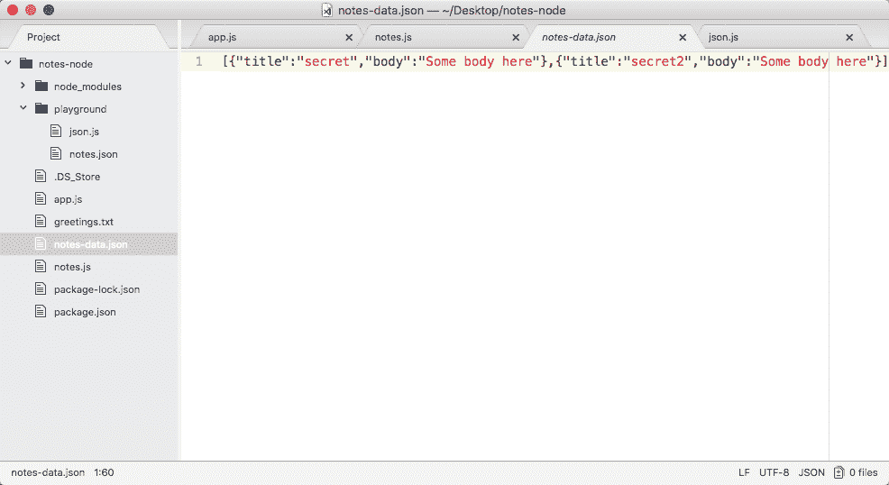

我们有一个包含两个对象的数组；第一个对象的标题是`secret`，第二个对象的标题是`secret2`，这太棒了！

# 尝试和捕获代码块

现在，如果`notes-data.json`文件不存在，当用户第一次运行命令时，程序将崩溃，如下面的代码输出所示。我们可以通过简单地删除`note-data.JSON`文件后重新运行上一个命令来证明这一点：

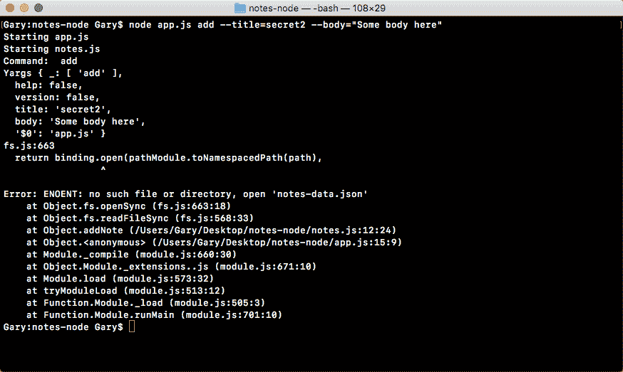

在这里，你可以看到我们实际上遇到了一个 JavaScript 错误，没有这样的文件或目录；它试图打开`notes-data.JSON`文件，但并不成功。为了解决这个问题，我们将使用 JavaScript 中的`try`-`catch`语句，希望你之前已经见过。为了快速复习一下，让我们来看一下。

要创建一个`try`-`catch`语句，你所要做的就是输入`try`，这是一个保留关键字，然后打开和关闭一对花括号。花括号内部是将要运行的代码。这是可能会或可能不会抛出错误的代码。接下来，你将指定`catch`块。现在，`catch`块将带有一个参数，一个错误参数，并且还有一个将运行的代码块：

```js
try{

} catch (e) {

}
```

只有在`try`中的一个错误实际发生时，此代码才会运行。因此，如果我们使用`readFileSync`加载文件并且文件存在，那就没问题，`catch`块将永远不会运行。如果失败，`catch`块将运行，我们可以做一些事情来从错误中恢复。有了这个，我们将把`noteString`变量和`JSON.parse`语句移到`try`中，如下所示：

```js
try{
  var notesString = fs.readFileSync('notes-data.json');
  notes = JSON.parse(notesString);
} catch (e) {

}
```

就是这样；不需要发生其他任何事情。我们不需要在`catch`中放任何代码，尽管您需要定义`catch`块。现在，让我们看看运行整个代码时会发生什么。

首先发生的事情是我们创建静态变量——没有什么特别的——然后我们尝试加载文件。如果`notesString`函数失败，那没关系，因为我们已经定义`notes`为空数组。如果文件不存在并且加载失败，那么我们可能希望`notes`为空数组，因为显然没有`notes`，也没有文件。

接下来，我们将把数据解析成 notes。如果`notes-data.JSON`文件中有无效数据，这两行可能会失败。通过将它们放在`try`-`catch`中，我们基本上保证程序不会出现意外情况，无论文件是否存在，但包含损坏的数据。

有了这个，我们现在可以保存`notes`并重新运行之前的命令。请注意，我没有放置`notes-data`文件。当我运行命令时，我们没有看到任何错误，一切似乎都按预期运行：

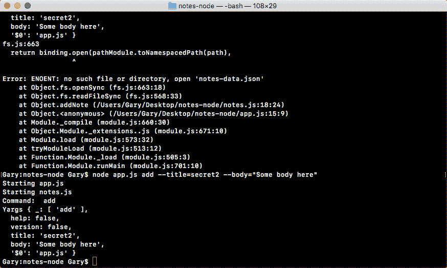

当您现在访问 Atom 时，您会发现`notes-data`文件确实存在，并且其中的数据看起来很棒：

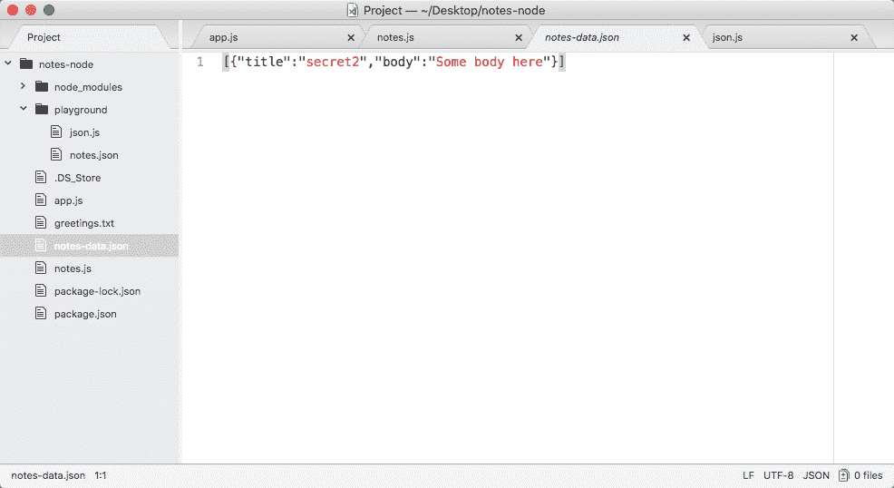

这就是我们需要做的一切，获取 notes，使用新 note 更新 notes，最后将 notes 保存到屏幕上。

现在，`addNote`还存在一个小问题。目前，`addNote`允许重复的标题；我可以在 JSON 文件中已经有一个标题为`secret`的 note。我可以尝试添加一个标题为`secret`的新 note，它不会抛出错误。我想要做的是使标题唯一，这样如果已经有一个具有该标题的 note，它将抛出错误，让您知道需要使用不同的标题创建 note。

# 使标题唯一

使标题唯一的第一步是在加载 note 后循环遍历所有 note，并检查是否有任何重复项。如果有重复项，我们将不调用以下两行：

```js
notes.push(note);
fs.writeFileSync('notes-data.json', JSON.stringify(notes));
```

如果没有重复项，那就没问题，我们将调用前面代码块中显示的两行，更新`notes-data`文件。

现在，我们将在以后重构这个函数。事情变得有点混乱，有点失控，但目前，我们可以将这个功能直接添加到函数中。让我们继续并创建一个名为`duplicateNotes`的变量。

`duplicateNotes`变量最终将存储一个数组，其中包含`notes`数组中已经存在的具有您尝试创建的 note 标题的 note。现在，这意味着如果`duplicateNotes`数组有任何项目，那就不好。这意味着该 note 已经存在，我们不应该添加该 note。`duplicateNotes`变量将被设置为对`notes`的调用，这是我们的`notes.filter`数组：

```js
var duplicateNotes = notes.filter();
```

`filter`方法是一个接受回调的数组方法。我们将使用箭头函数，回调将使用参数调用。在这种情况下，它将是单数形式；如果我有一个 notes 数组，它将被调用为一个单独的 note：

```js
var duplicateNotes = notes.filter((note) => {

});
```

这个函数会为数组中的每个项目调用一次，并且你有机会返回 true 或 false。如果你返回 true，它会保留数组中的那个项目，最终会保存到`duplicateNotes`中。如果你返回 false，它生成的新数组就不会包含`duplicateNotes`变量中的那个项目。我们只需要在标题匹配时返回 true，这意味着我们可以返回`note.title === title`，如下所示：

```js
var duplicateNotes = notes.filter((note) => {
  return note.title === title;
});
```

如果标题相等，那么前面的`return`语句将返回 true，并且该项目将保留在数组中，这意味着有重复的笔记。如果标题不相等，这很可能是情况，那么该语句将返回 false，这意味着没有重复的笔记。现在，我们可以使用箭头函数来简化一下。

箭头函数实际上允许你在只有一个语句的情况下删除花括号。

我将使用箭头函数，如下所示：

```js
var duplicateNotes = notes.filter((note) => note.title === title);
```

在这里，我已经删除了除了`note.title === title`之外的所有内容，并在箭头函数语法的前面添加了这个。

这在 ES6 箭头函数中是完全有效的。你的参数在左边，箭头在中间，右边是一个表达式。这个表达式不需要分号，它会自动返回作为函数结果。这意味着我们这里的代码与之前的代码是相同的，只是更简单，而且只占用一行。

现在我们有了这个设置，我们可以继续检查`duplicateNotes`变量的长度。如果`duplicateNotes`的长度大于`0`，这意味着我们不想保存这个笔记，因为已经存在一个具有相同标题的笔记。如果它是`0`，我们将保存这个笔记。

```js
if(duplicateNotes.length === 0) {

}
```

在这里，在`if`条件内部，我们正在将笔记的长度与数字 0 进行比较。如果它们相等，那么我们确实想要将笔记推送到`notes`数组中并保存文件。我将删除以下两行：

```js
notes.push(note);
fs.writeFileSync('notes-data.json', JSON.stringify(notes));
```

让我们把它们粘贴到`if`语句的内部，如下所示：

```js
if(duplicateNotes.length === 0) {
  notes.push(note);
  fs.writeFileSync('notes-data.json', JSON.stringify(notes));
}
```

如果它们不相等，也没关系；在这种情况下，我们将什么也不做。

有了这个设置，我们现在可以保存我们的文件并测试这个功能。我们有我们的`notes-data.json`文件，这个文件已经有一个标题为`secret2`的笔记。让我们重新运行之前的命令，尝试添加一个具有相同标题的新笔记：

```js
node app.js add --title=secret2 --body="Some body here"
```

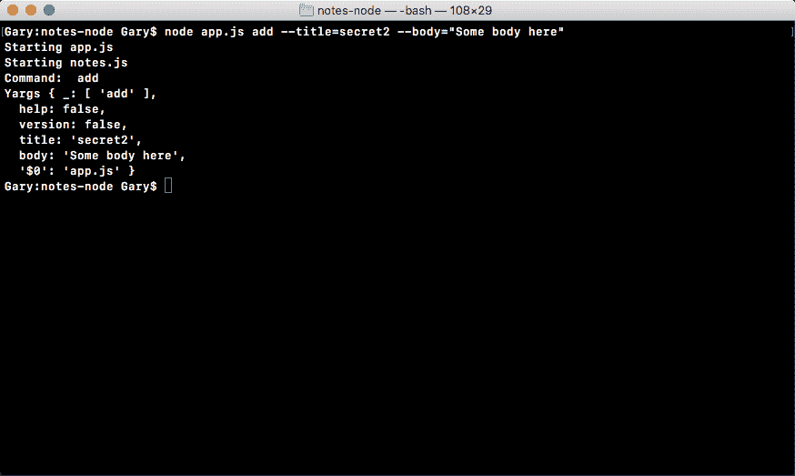

你现在在终端中，所以我们将回到我们的 JSON 文件。你可以看到，我们仍然只有一个笔记：

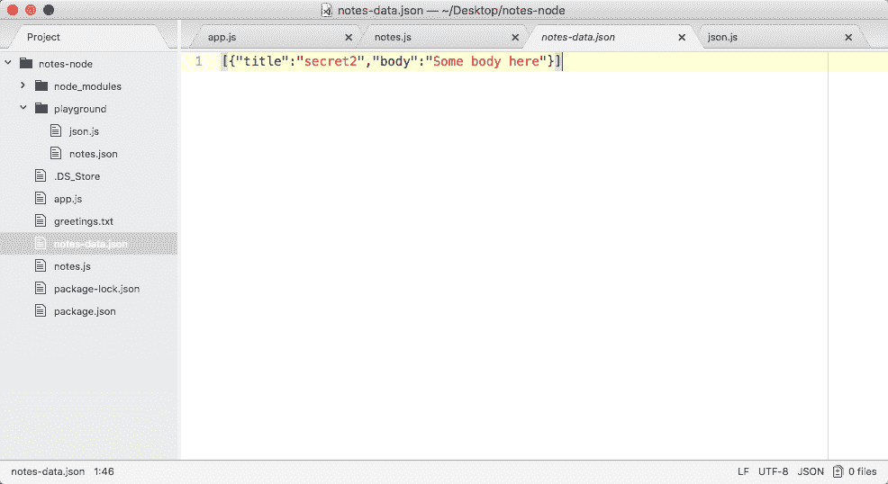

现在我们应用程序中的所有标题都将是唯一的，所以我们可以使用这些标题来获取和删除笔记。

让我们继续测试其他笔记是否仍然可以添加。我将把`title`标志从`secret2`改为`secret`，然后运行该命令：

```js
node app.js add --title=secret --body="Some body here"
```

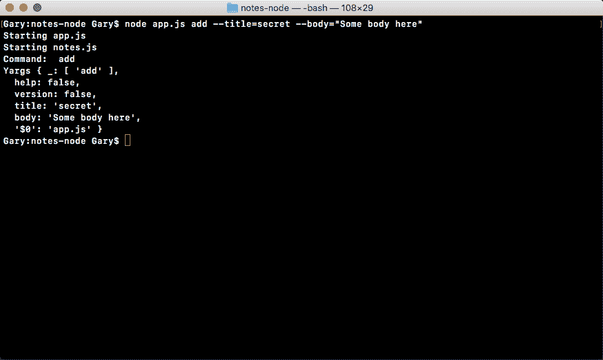

在我们的`notes-data`文件中，你可以看到两个笔记都显示出来：

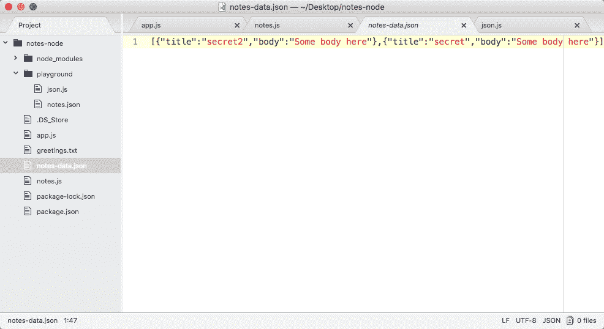

正如我之前提到的，接下来我们将进行一些重构，因为加载文件的代码和保存文件的代码将在我们已经定义和/或将要定义的大多数函数中使用（即`getAll`、`getNote`和`removeNote`函数）。

# 重构

在前面的部分中，你创建了`addNote`函数，它工作得很好。它首先创建一些静态变量，然后我们获取任何现有的笔记，检查重复项，如果没有，我们将其推送到列表上，然后将数据保存回文件系统。

唯一的问题是，我们将不断重复执行这些步骤。例如，对于`getAll`，我们的想法是获取所有的笔记，并将它们发送回`app.js`，以便它可以将它们打印到用户的屏幕上。在`getAll`语句的内部，我们首先要做的是有相同的代码；我们将有我们的`try`-`catch`块来获取现有的笔记。

现在，这是一个问题，因为我们将在整个应用程序中重复使用代码。最好将获取笔记和保存笔记拆分为单独的函数，我们可以在多个位置调用这些函数。

# 将功能移入各个函数

为了解决问题，我想首先创建两个新函数：

+   `fetchNotes`

+   `saveNotes`

第一个函数`fetchNotes`将是一个箭头函数，它不需要接受任何参数，因为它将从文件系统中获取笔记，如下所示：

```js
var fetchNotes = () => {

};
```

第二个函数`saveNotes`将需要接受一个参数。它将需要接受要保存到文件系统的`notes`数组。我们将设置它等于一个箭头函数，然后提供我们的参数，我将其命名为`notes`，如下所示：

```js
var saveNotes = (notes) => {

};
```

现在我们有了这两个函数，我们可以开始将一些功能从`addNote`中移动到各个函数中。

# 使用 fetchNotes

首先，让我们做`fetchNotes`，它将需要以下`try`-`catch`块。

我将它从`addNote`中剪切出来，粘贴到`fetchNotes`函数中，如下所示：

```js
var fetchNotes = () => {
  try{
    var notesString = fs.readFileSync('notes-data.json');
    notes = JSON.parse(notesString);
  } catch (e) {

}
};
```

仅此还不够，因为目前我们没有从函数中返回任何内容。我们想要做的是返回这些笔记。这意味着我们不会将`JSON.parse`的结果保存到我们尚未定义的`notes`变量上，而是简单地将其返回给调用函数，如下所示：

```js
var fetchNotes = () => {
  try{
    var notesString = fs.readFileSync('notes-data.json');
    return JSON.parse(notesString);
  } catch (e) {

}
};
```

因此，如果我在`addNote`函数中调用`fetchNotes`，如下所示，我将得到`notes`数组，因为在前面的代码中有`return`语句。

现在，如果没有笔记，可能根本没有文件；或者有一个文件，但数据不是 JSON，我们可以返回一个空数组。我们将在`catch`中添加一个`return`语句，如下面的代码块所示，因为请记住，如果`try`中的任何内容失败，`catch`就会运行：

```js
var fetchNotes = () => {
  try{
    var notesString = fs.readFileSync('notes-data.json');
    return JSON.parse(notesString);
  } catch (e) {
    return [];
}
};
```

现在，这让我们进一步简化了`addNote`。我们可以删除空格，并且可以取出我们在`notes`变量上设置的数组，并将其删除，而是调用`fetchNotes`，如下所示：

```js
var addNote = (title, body) => {
  var notes = fetchNotes();
  var note = {
      title,
      body
};
```

有了这个，我们现在有了与之前完全相同的功能，但是我们有了一个可重用的函数`fetchNotes`，我们可以在`addNote`函数中使用它来处理应用程序将支持的其他命令。

我们已经将代码拆分到一个地方，而不是复制代码并将其放在文件的多个位置。如果我们想要更改此功能的工作方式，无论是更改文件名还是一些逻辑，比如`try`-`catch`块，我们只需更改一次，而不必更改每个函数中的代码。

# 使用 saveNotes

现在，`saveNotes`的情况与`fetchNotes`函数一样。`saveNotes`函数将获取`notes`变量，并使用`fs.writeFileSync`来保存。我将剪切`addNote`中执行此操作的行（即`fs.writeFileSync('notes-data.json', JSON.stringfy(notes));`），并将其粘贴到`saveNotes`函数中，如下所示：

```js
var saveNotes = (notes) => {
  fs.writeFileSync('notes-data.json', JSON.stringify(notes));
};
```

现在，`saveNotes`不需要返回任何内容。在这种情况下，我们将在`addNote`函数的`if`语句中复制`saveNotes`中的行，并调用`saveNotes`，如下所示：

```js
if (duplicateNotes.length === 0) {
  notes.push(note);
  saveNotes();
}
```

这可能看起来有点多余，我们实际上是用不同的行替换了一行，但开始养成创建可重用函数的习惯是一个好主意。

现在，如果没有数据调用`saveNotes`是行不通的，我们想要传入`notes`变量，这是我们在`saveNotes`函数中之前定义的`notes`数组：

```js
if (duplicateNotes.length === 0) {
  notes.push(note);
  saveNotes(notes);
}
```

有了这个，`addNote`函数现在应该像我们进行重构之前一样工作。

# 测试功能

在这个过程中的下一步将是通过创建一个新的笔记来测试这个功能。我们已经有两个笔记，在`notes-data.json`中有一个标题是`secret`，一个标题是`secret2`，让我们使用终端中的`node app.js`命令来创建第三个笔记。我们将使用`add`命令并传入一个标题`to buy`和一个正文`food`，就像这里显示的那样：

```js
node app.js add --title="to buy" --body="food"
```

这应该会创建一个新的笔记，如果我运行这个命令，你会看到我们没有任何明显的错误：

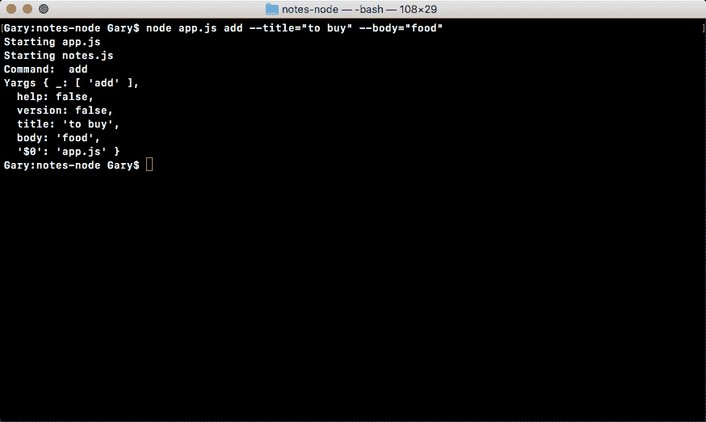

在我们的`notes-data.json`文件中，如果我向右滚动，我们有一个全新的笔记，标题是`to buy`，正文是`food`：

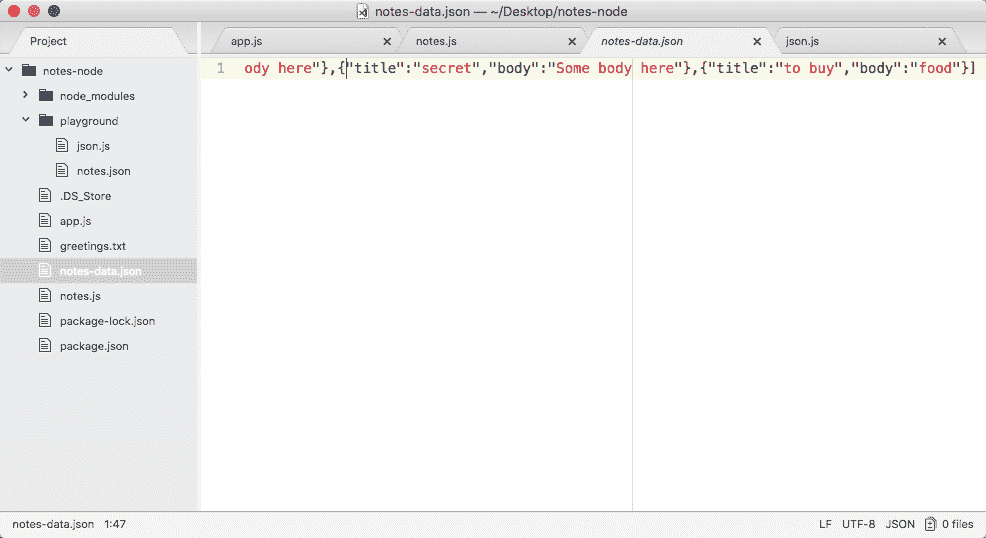

所以，即使我们重构了代码，一切都按预期工作。现在，我想在`addNote`中的下一步是花点时间返回正在添加的笔记，这将发生在`saveNotes`返回之后。所以我们将返回`note`：

```js
if (duplicateNotes.length === 0) {
  notes.push(note);
  saveNotes(notes);
  return note;
}
```

这个`note`对象将被返回给调用该函数的人，而在这种情况下，它将被返回给`app.js`，我们在`app.js`文件的`add`命令的`if else`块中调用它。我们可以创建一个变量来存储这个结果，我们可以称之为`note`：

```js
if (command === 'add')
  var note = notes.addNote(argv.title, argv.body);
```

如果`note`存在，那么我们知道笔记已经创建。这意味着我们可以继续打印一条消息，比如`Note created`，然后我们可以打印`note`的标题和`note`的正文。现在，如果`note`不存在，如果它是未定义的，这意味着有一个重复的标题已经存在。如果是这种情况，我希望你打印一个错误消息，比如`Note title already in use`。

你可以用很多不同的方法来做这个。不过，目标是根据是否返回了笔记来打印两条不同的消息。

现在，在`addNote`中，如果`duplicateNotes`的`if`语句从未运行，我们就没有显式调用`return`。但是你知道，在 JavaScript 中，如果你不调用`return`，那么`undefined`会自动返回。这意味着如果`duplicateNotes.length`不等于零，将返回 undefined，我们可以将其用作我们语句的条件。

首先，我要做的是在我们在`app.js`中定义的`note`变量旁边创建一个`if`语句：

```js
if (command === 'add') {
  var note = notes.addNote(argv.title, argv.body);
  if (note) {

  }
```

如果事情进展顺利，这将是一个对象，如果事情进展不顺利，它将是未定义的。这里的代码只有在它是一个对象的时候才会运行。在 JavaScript 中，`Undefined`的结果会使 JavaScript 中的条件失败。

现在，如果笔记成功创建，我们将通过以下`console.log`语句向屏幕打印一条消息：

```js
if (note) {
  console.log('Note created');
}
```

如果事情进展不顺利，在`else`子句中，我们可以调用`console.log`，并打印一些像`Note title taken`这样的东西，就像这里显示的那样：

```js
if (note) {
  console.log('Note created');
} else {
  console.log('Note title taken');
}
```

现在，如果事情进展顺利，我们想要做的另一件事是打印`notes`的内容。我会首先使用`console.log`打印几个连字符。这将在我的笔记上方创建一些空间。然后我可以使用`console.log`两次：第一次我们将打印标题，我会添加`Title:`作为一个字符串来显示你究竟看到了什么，然后我可以连接标题，我们可以在`note.title`中访问到，就像这段代码中显示的那样：

```js
if (note) {
  console.log('Note created');
  console.log('--');
  console.log('Title: ' + note.title);
```

现在，上面的语法使用了 ES5 的语法；我们可以用我们已经讨论过的内容，即模板字符串，来换成 ES6 的语法。我们会添加`Title`，一个冒号，然后我们可以使用我们的美元符号和花括号来注入`note.title`变量，就像这里显示的那样：

```js
console.log(`Title: ${note.title}`);
```

同样地，我会在此之后添加`note.body`来打印笔记的正文。有了这个，代码应该看起来像这样：

```js
if (command === 'add') {
  var note = note.addNote(argv.title, argv.body);
  if (note) {
    console.log('Note created');
    console.log('--');
    console.log(`Title: ${note.title}`);
    console.log(`Body: ${note.body}`);
  } else {
    console.log('Note title taken');
}
```

现在，我们应该能够运行我们的应用程序并看到标题和正文笔记都被打印出来。在终端中，我会重新运行之前的命令。这将尝试创建一个已经存在的购买笔记，所以我们应该会得到一个错误消息，你可以在这里看到`Note title taken`：

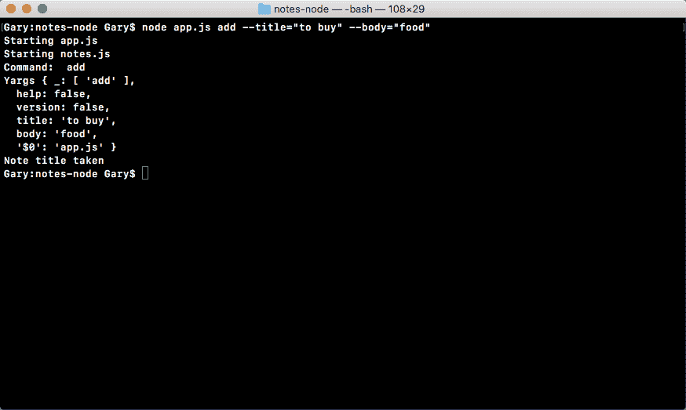

现在，我们可以重新运行命令，将标题更改为其他内容，比如`从商店购买`。这是一个独特的`note`标题，因此笔记应该可以顺利创建：

```js
node app.js add --title="to buy from store" --body="food"
```

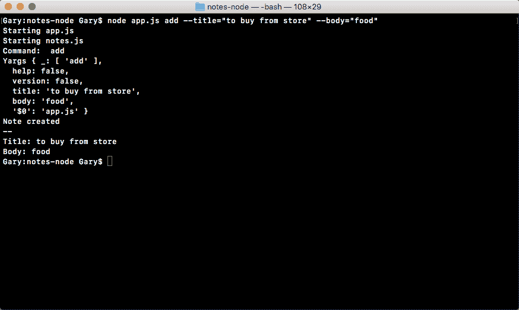

如前面的输出所示，您可以看到我们确实得到了这样的结果：我们有我们的笔记创建消息，我们的小间隔，以及我们的标题和正文。

`addNote`命令现在已经完成。当命令实际完成时，我们会得到一个输出，并且我们有所有在后台运行的代码，将笔记添加到存储在我们文件中的数据中。

# 总结

在本章中，您了解到在`process.argv`中解析可能会非常痛苦。我们将不得不编写大量手动代码来解析那些连字符、等号和可选引号。然而，yargs 可以为我们完成所有这些工作，并将其放在一个非常简单的对象上，我们可以访问它。您还学会了如何在 Node.js 中使用 JSON。

接下来，我们填写了`addNote`函数。我们能够使用命令行添加笔记，并且能够将这些笔记保存到一个 JSON 文件中。最后，我们将`addNote`中的大部分代码提取到单独的函数`fetchNotes`和`saveNotes`中，这些函数现在是独立的，并且可以在整个代码中重复使用。当我们开始填写其他方法时，我们可以简单地调用`fetchNotes`和`saveNotes`，而不必一遍又一遍地将内容复制到每个新方法中。

在下一章中，我们将继续探讨有关 node 的基本知识。我们将探索与 node 相关的一些更多概念，比如调试；我们将处理`read`和`remove`笔记命令。除此之外，我们还将学习有关 yargs 和箭头函数的高级特性。
