# 第四章：Node 基础知识-第三部分

我们开始为笔记应用程序中的所有其他命令添加支持。我们将看看如何创建我们的`read`命令。`read`命令将负责获取单个笔记的正文。它将获取所有笔记并将它们打印到屏幕上。除此之外，我们还将研究如何调试损坏的应用程序，并了解一些新的 ES6 功能。您将学习如何使用内置的 Node`debugger`。

然后，您将学习更多关于如何配置 yargs 以用于命令行界面应用程序。我们将学习如何设置命令、它们的描述和参数。我们将能够在参数上设置各种属性，例如它们是否是必需的等等。

# 删除笔记

在这一部分，当有人使用`remove`命令并传入他们想要移除的笔记的标题时，您将编写删除笔记的代码。在上一章中，我们已经创建了一些实用函数来帮助我们获取和保存笔记，所以代码实际上应该非常简单。

# 使用`removeNote`函数

这个过程的第一步是填写我们在之前章节中定义的`removeNote`函数，这将是您的挑战。让我们从`notes.js`文件的`removeNote`函数中删除`console.log`。您只需要编写三行代码就可以完成这项任务。

现在，第一行将获取笔记，然后工作将是过滤掉笔记，删除参数标题的笔记。这意味着我们想要遍历笔记数组中的所有笔记，如果它们中的任何一个标题与我们想要删除的标题匹配，我们就想要摆脱它们。这可以使用我们之前使用的`notes.filter`函数来完成。我们只需要在`duplicateNotes`函数中的等式语句中切换为不等式，这段代码就可以做到这一点。

它将遍历笔记数组。每当它找到一个与标题不匹配的笔记时，它将保留它，这是我们想要的，如果它找到标题，它将返回`false`并将其从数组中删除。然后我们将添加第三行，即保存新的笔记数组：

```js
var removeNote = (title) => {
  // fetch notes
  // filter notes, removing the one with title of argument
  // save new notes array
};
```

上述代码行是您需要填写的唯一三行。不要担心从`removeNote`返回任何内容或填写`app.js`中的任何内容。

对于`fetchNotes`行的第一件事是创建一个名为`notes`的变量，就像我们在上一章的`addNote`中所做的一样，并将其设置为从`fetchNotes`返回的结果：

```js
var removeNote = (title) => {
  var notes = fetchNotes();
  // filter notes, removing the one with title of argument
  // save new notes array
};
```

此时，我们的笔记变量存储了所有笔记的数组。我们需要做的下一件事是过滤我们的笔记。

如果有一个具有这个标题的笔记，我们想要删除它。这将通过创建一个新变量来完成，我将称其为`filteredNotes`。在这里，我们将`filteredNotes`设置为将从`notes.filter`返回的结果，这是我们之前已经使用过的：

```js
var removeNote = (title) => {
  var notes = fetchNotes();
  // filter notes, removing the one with title of argument
  var filteredNotes = notes.filter();
  // save new notes array
};
```

我们知道`notes.filter`接受一个函数作为它唯一的参数，并且该函数被调用时会用数组中的单个项目。在这种情况下，它将是一个`note`。我们可以使用 ES6 箭头语法在一行上完成所有这些。

如果我们只有一条语句，我们不需要打开和关闭大括号。

这意味着在这里，如果`note.title`不等于传入函数的标题，我们可以返回`true`：

```js
var removeNote = (title) => {
  var notes = fetchNotes();
  var filteredNotes = notes.filter((note) => note.title !== title);
  // save new notes array
};
```

这将用所有标题与传入标题不匹配的所有笔记填充`filteredNotes`。如果标题与传入的标题匹配，它将不会被添加到`filteredNotes`中，因为我们的过滤函数。

最后要做的是调用`saveNotes`。在这里，我们将调用`saveNotes`，传入我们在`filteredNotes`变量下拥有的新笔记数组：

```js
var removeNote = (title) => {
  var notes = fetchNotes();
  var filteredNotes = notes.filter((note) => note.title !== title);
  saveNotes(filteredNotes);
  // save new notes array
};
```

如果我们传入笔记，它不会按预期工作；我们正在过滤掉笔记，但实际上并没有保存这些笔记，因此它不会从 JSON 中删除。我们需要像前面的代码中所示那样传递`filteredNotes`。我们可以通过保存文件并尝试删除我们的笔记来测试这些。

我将尝试从`notes-data.json`文件中删除`secret2`。这意味着我们需要做的就是运行我们在`app.js`中指定的命令`remove`（参考下面的代码图像，然后它将调用我们的函数）。

我将使用`app.js`运行 Node，并传入`remove`命令。我们需要为 remove 提供的唯一参数是标题；无需提供正文。我将把这个设置为`secret2`：

```js
node app.js remove --title=secret2
```

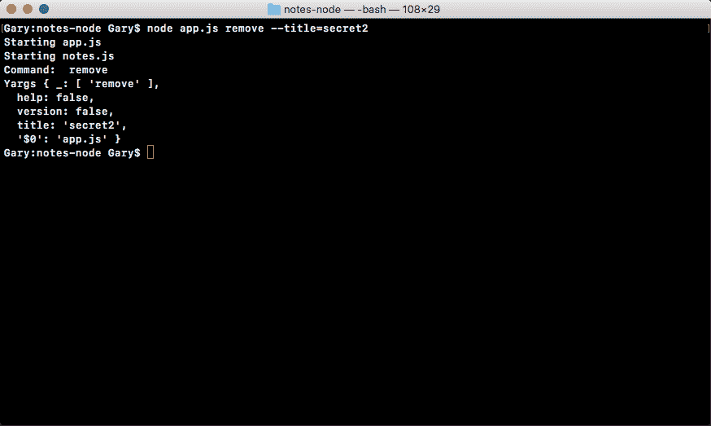

如屏幕截图所示，如果我按*enter*，你会看到我们没有得到任何输出。虽然我们有删除打印命令，但没有消息表明是否删除了笔记，但我们稍后会在本节中添加。

现在，我们可以检查数据。在这里你可以看到`secret2`不见了：


这意味着我们的 remove 方法确实按预期工作。它删除了标题匹配的笔记，并保留了所有标题不等于`secret2`的笔记，这正是我们想要的。

# 打印删除笔记的消息

现在，我们要做的下一件事是根据是否实际删除了笔记来打印消息。这意味着调用`removeNote`函数的`app.js`需要知道是否删除了笔记。我们如何弄清楚呢？在`notes.js removeNotes`函数中，我们如何可能返回那个信息？

我们可以这样做，因为我们有两个非常重要的信息。我们有原始笔记数组的长度和新笔记数组的长度。如果它们相等，那么我们可以假设没有笔记被删除。如果它们不相等，我们将假设已经删除了一个笔记。这正是我们要做的。

如果`removeNote`函数返回`true`，那意味着已删除一个笔记；如果返回`false`，那意味着没有删除笔记。在`removeNotes`函数中，我们可以添加返回，如下面的代码所示。我们将检查`notes.length`是否不等于`filteredNotes.length`：

```js
var removeNote = (title) => {
  var notes = fetchNotes();
  var filteredNotes = notes.filter((note) => note.title !== title);
  saveNotes(filteredNotes);

 return notes.length !== filteredNotes.length;
};
```

如果它们不相等，它将返回`true`，这是我们想要的，因为已经删除了一个笔记。如果它们相等，它将返回`false`，这很好。

现在，在`app.js`中，我们可以在`removeNote`的`else if`块中添加几行代码，以使此命令的输出更加友好。要做的第一件事是存储布尔值。我将创建一个名为`noteRemoved`的变量，并将其设置为返回的结果，如下面的代码所示，它将是`true`或`false`：

```js
} else if (command == 'remove') {
  var noteRemoved = notes.removeNote(argv.title);
}
```

在下一行，我们可以创建我们的消息，我将使用三元运算符在一行上完成所有这些。现在，三元运算符允许您指定条件。在我们的情况下，我们将使用一个变量消息，并将其设置为条件`noteRemoved`，如果删除了一个笔记，则为`true`，如果没有，则为`false`。

现在，三元运算符可能有点令人困惑，但在 JavaScript 和 Node.js 中非常有用。三元运算符的格式是首先添加条件，问号，要运行的真值表达式，冒号，然后是要运行的假值表达式。

在条件之后，我们将放一个空格，然后是一个问号和一个空格；这是如果条件为真时将运行的语句。如果`noteRemoved`条件通过，我们要做的是将消息设置为`Note was removed`：

```js
 var message = noteRemoved ? 'Note was removed' :
```

现在，如果`noteRemoved`是`false`，我们可以在前一个语句的冒号后面指定该条件。在这里，如果没有笔记被删除，我们将使用文本`Note not found`：

```js
var message = noteRemoved ? 'Note was removed' : 'Note not found';
```

现在，有了这个，我们可以测试一下我们的消息。最后要做的就是使用`console.log`将消息打印到屏幕上：

```js
var noteRemoved = notes.removeNote(argv.title);
var message = noteRemoved ? 'Note was removed' : 'Note not found';
console.log(message);
```

这使我们避免了使我们的`else-if`子句变得不必要复杂的`if`语句。

回到 Atom 中，我们可以重新运行上一个命令，在这种情况下，没有笔记会被删除，因为我们已经删除了它。当我运行它时，你可以看到`Note not found`打印到屏幕上：

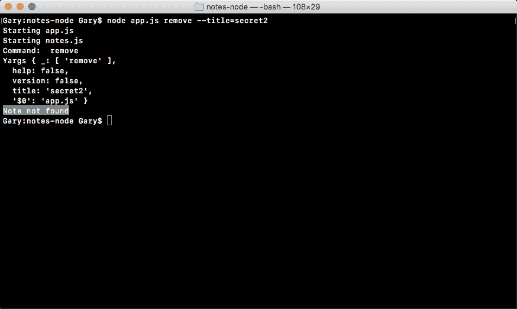

现在，我将删除一个确实存在的笔记；在`notes-data.json`中，我有一个标题为 secret 的笔记，如下所示：

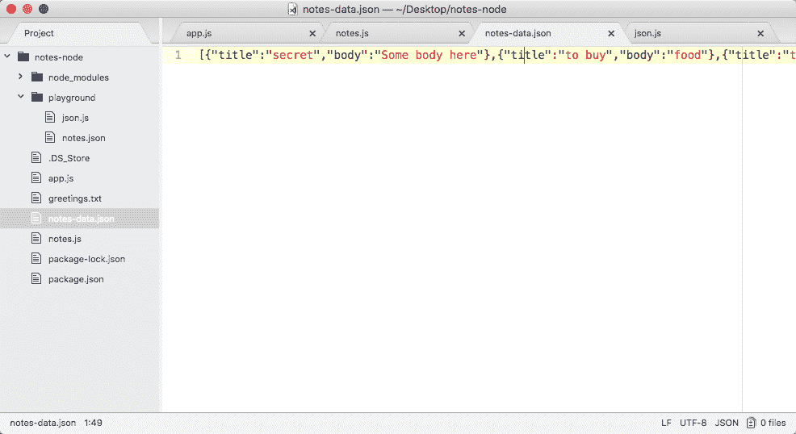

让我们重新运行在终端中删除标题中的`2`的命令。当我运行这个命令时，你可以看到`Note was removed`打印到屏幕上：

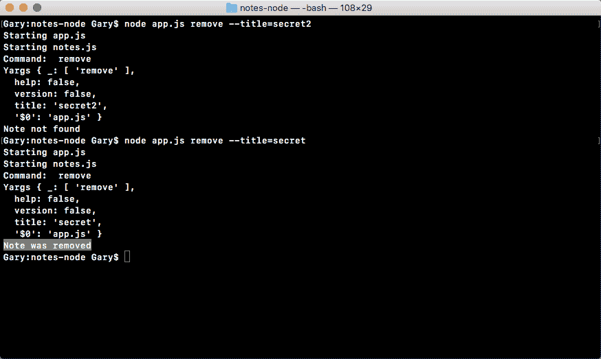

这就是本节的全部内容；我们现在已经有了我们的`remove`命令。

# 阅读笔记

在本节中，您将负责填写`read`命令的其余部分。现在，`read`命令确实有一个 else-if 块，在`app.js`中找到我们调用`getNote`的地方：

```js
} else if (command === 'read') {
  notes.getNote(argv.title);
```

`getNote`在`notes.js`中定义，尽管目前它只是打印一些虚拟文本：

```js
var getNote = (title) => {
  console.log('Getting note', title);
};
```

在本节中，您需要连接这两个函数。

首先，您需要对`getNote`的返回值做一些处理。如果我们的`getNote`函数找到了笔记对象，它将返回该笔记对象。如果没有找到，它将返回 undefined，就像我们在上一章节*添加和保存笔记*中讨论的`addNote`一样。

存储了该值之后，您将使用`console.log`进行一些打印，类似于我们这里所做的：

```js
if (command === 'add') {
  var note = notes.addNote(argv.title, argv.body);
  if (note) {
    console.log('Note created');
    console.log('--');
    console.log(`Title: ${note.title}`);
    console.log(`Body: ${note.body}`);
  } else {
    console.log('Note title taken');
  }
```

显然，`Note created`将类似于`Note read`，`Note title taken`将类似于`Note not found`，但是一般的流程将完全相同。现在，一旦您在`app.js`中连接了这一切，您可以继续填写函数的`notes.js`。

现在，在`notes.js`中的函数不会太复杂。您需要做的只是获取笔记，就像我们在以前的方法中所做的那样，然后您将使用`notes.filter`，我们探索了只返回标题与作为参数传入的标题匹配的笔记。现在，在我们的情况下，这要么是零个笔记，这意味着找不到笔记，要么是一个笔记，这意味着我们找到了人们想要返回的笔记。

接下来，我们确实需要返回那个笔记。重要的是要记住，`notes.filter`的返回值始终是一个数组，即使该数组只有一个项目。您需要做的是返回数组中的第一个项目。如果该项目不存在，那没关系，它将返回 undefined，这正是我们想要的。如果存在，那很好，这意味着我们找到了笔记。这个方法只需要三行代码，一个用于获取，一个用于过滤，一个用于返回语句。现在，一旦您完成了所有这些，我们将对其进行测试。

# 使用 getNote 函数

让我们来处理这个方法。现在，我要做的第一件事是在`app.js`中填写一个名为 note 的变量，它将存储从`getNote`返回的值：

```js
} else if (command === 'read') {
  var note = notes.getNote(argv.title);
```

现在，这可能是一个单独的笔记对象，也可能是 undefined。在下一行，我可以使用`if`语句来打印消息，如果它存在，或者如果它不存在。我将使用`if` note，并且我将附加一个`else`子句：

```js
} else if (command === 'read') {
  var note = notes.getNote(argv.title);
  if (note) {

  } else {

  }
```

这个`else`子句将负责在找不到笔记时打印错误。让我们先从这个开始，因为它非常简单，`console.log`，`Note not found`，如下所示：

```js
  if (note) {

  } else {
    console.log('Note not found');  
  }
```

现在我们已经填写了`else`子句，我们可以填写`if`语句。对于这一点，我将打印一条小消息，`console.log ('Note found')`就可以了。然后我们可以继续打印实际的笔记详情，我们已经有了这段代码。我们将添加连字符间隔，然后有我们的笔记标题和笔记正文，如下所示：

```js
if (note) {
    console.log('Note found');
    console.log('--');
    console.log(`Title: ${note.title}`);
    console.log(`Body: ${note.body}`);    
  } else {
    console.log('Note not found');  
  }
```

现在我们已经完成了`app.js`的内部，我们可以进入`notes.js`文件，并填写`getNote`方法，因为目前它没有对传入的标题做任何处理。

在 notes 中，你需要做的是填写这三行。第一行将负责获取笔记。我们在上一节中已经用`fetchNotes`函数做过了：

```js
var getNote = (title) => {
  var notes = fetchNotes();
};
```

现在我们已经准备好了笔记，我们可以调用`notes.filter`，返回所有的笔记。我将创建一个名为`filteredNotes`的变量，将其设置为`notes.filter`。现在，我们知道 filter 方法需要一个函数，我将定义一个箭头函数（`=>`）就像这样：

```js
var filteredNotes = notes.filter(() => {

});
```

在箭头函数（`=>`）中，我们将传入的单个笔记，并在笔记标题，也就是我们在 JSON 文件中找到的笔记标题，等于标题时返回`true`：

```js
var filteredNotes = notes.filter(() => {
    return note.title === title;
  });
};
```

当笔记标题匹配时，这将返回`true`，如果不匹配则返回 false。或者，我们可以使用箭头函数，我们只有一行代码，如下所示，我们返回了一些东西；我们可以剪切掉我们的条件，删除大括号，然后简单地将该条件粘贴到这里：

```js
var filteredNotes = notes.filter((note) => note.title === title);
```

这具有完全相同的功能，只是更短，更容易查看。

现在我们已经有了所有的数据，我们只需要返回一些东西，我们将返回`filteredNotes`数组中的第一个项目。接下来，我们将获取第一个项目，也就是索引为零的项目，然后我们只需要使用`return`关键字返回它：

```js
var getNote = (title) => {
  var notes = fetchNotes();
  var filteredNotes = notes.filter((note) => note.title === title);
  return filteredNotes[0];
};
```

现在，有可能`filteredNotes`，第一个项目不存在，没关系，它将返回 undefined，在这种情况下，我们的 else 子句将运行，打印`找不到笔记`。如果有笔记，太好了，那就是我们想要打印的笔记，在`app.js`中我们就是这样做的。

# 运行`getNote`函数

既然我们已经准备就绪，我们可以通过在终端中运行我们的应用程序`node app.js`来测试这个全新的功能。我将使用`read`命令，并传入一个标题等于我知道在`notes-data.json`文件中不存在的字符串：

```js
node app.js read --title="something here"
```

当我运行命令时，我们得到了`找不到笔记`，如图所示，这正是我们想要的：

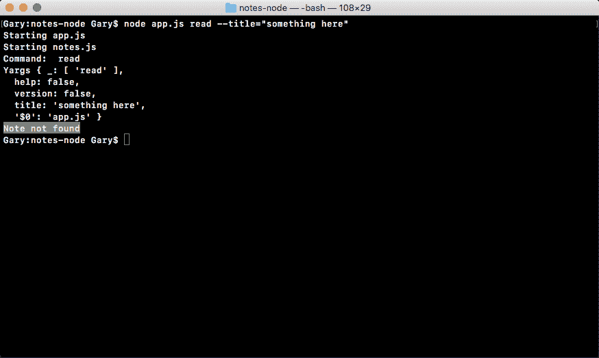

现在，如果我尝试获取一个标题存在的笔记，我期望那个笔记会返回。

在数据文件中，我有一个标题为`购买`的笔记；让我们尝试获取它。我将使用上箭头键填充上一个命令，并将标题替换为`to space`，购买，并按*enter*：


如前面的代码所示，您可以看到`找到笔记`打印到屏幕上，这太棒了。在`找到笔记`之后，我们有我们的间隔符，然后是标题`购买`和正文`食物`，正如它出现在数据文件中一样。有了这个，我们就完成了`read`命令。

# DRY 原则

现在，在我们结束本节之前，我还想解决一件事。在`app.js`中，我们现在在两个地方有相同的代码。我们在`add`命令以及`read`命令中都有空格或标题正文：

```js
if (command === 'add') {
  var note = notes.addNote(argv.title, argv.body);
  if (note) {
    console.log('Note created');
    console.log('--');
    console.log(`Title: ${note.title}`);
    console.log(`Body: ${note.body}`);
  } else {
    console.log('Note title taken');
  }
 } else if (command === 'list') {
   notes.getAll();
 } else if (command === 'read') {
   var note = notes.getNote(argv.title);
   if (note) {
     console.log('Note found');
     console.log('--');
     console.log(`Title: ${note.title}`);
     console.log(`Body: ${note.body}`);
   } else {
     console.log('Note not found');
 }
```

当你发现自己在复制和粘贴代码时，最好将其拆分成一个函数，两个位置都调用该函数。这就是**DRY 原则**，它代表**不要重复自己**。

# 使用 logNote 函数

在我们的情况下，我们在重复自己。最好将其拆分成一个函数，我们可以从两个地方调用它。为了做到这一点，我们要做的就是在`notes.js`中创建一个名为`logNote`的函数。

现在，在`notes.js`中，在`removeNote`函数下面，我们可以将这个全新的函数命名为`logNote`。这将是一个带有一个参数的函数。这个参数将是笔记对象，因为我们想要打印标题和正文。如下所示，我们期望传入笔记：

```js
var logNote = (note) => {

};
```

现在，填写`logNote`函数将会非常简单，特别是当你解决 DRY 问题时，因为你可以简单地将重复的代码剪切出来，然后粘贴到`logNote`函数中。在这种情况下，变量名已经对齐，所以不需要更改任何内容：

```js
var logNote = (note) => {
  console.log('--');
  console.log(`Title: ${note.title}`);
  console.log(`Body: ${note.body}`);
};
```

现在我们已经有了`logNote`函数，我们可以在`app.js`中进行更改。在`app.js`中，我们已经删除了`console.log`语句，我们可以调用`notes.logNote`，传入笔记对象就像这样：

```js
else if (command === 'read') {
  var note = notes.getNote(argv.title);
  if (note) {
    console.log('Note found');
    notes.logNote(note);
  } else {
    console.log('Note not found');
 }
```

在`add`命令的`if`块中也可以做同样的事情。我可以删除这三个`console.log`语句，并调用`notes.logNote`，传入笔记：

```js
if (command === 'add') {
  var note = notes.addNote(argv.title, argv.body);
  if (note) {
    console.log('Note created');
    notes.logNote(note);
 } else {
   console.log('Note title taken');
 }
```

现在我们已经有了这个，我们可以重新运行我们的程序，希望我们看到的是完全相同的功能。

在重新运行程序之前要做的最后一件事是在`notes.js`文件的`exports`模块中导出`logNote`函数。`LogNote`将被导出，我们使用 ES6 语法来做到这一点：

```js
module.exports = {
  addNote,
  getAll,
  getNote,
  removeNote,
  logNote
};
```

有了这个，我现在可以使用上箭头键重新运行 Terminal 中的上一个命令，然后按*enter*：

```js
node app.js read --title="to buy"
```

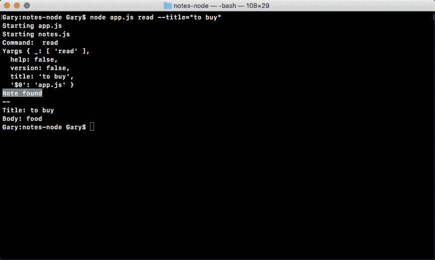

如所示，我们得到`Note found`打印到屏幕上，标题和正文就像以前一样。我还将测试`add`命令，以确保它正常工作，`node app.js add`；我们将使用一个标题`things to do`和一个正文`go to post office`：

```js
node app.js add --title="things to do" --body="go to post office"
```

现在，当我按下*enter*，我们期望打印的日志与之前的`add`命令一样，这正是我们得到的：

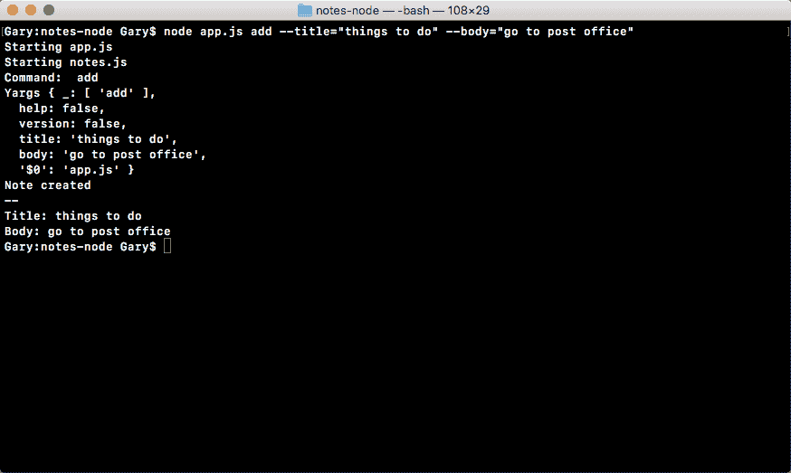

笔记创建后打印，我们得到我们的间隔，然后得到我们的标题和正文。

在下一节中，我们将涵盖本书中最重要的一个主题；调试。知道如何正确地调试程序将在你的 Node.js 职业生涯中节省你数百个小时。如果你没有正确的工具，调试可能会非常痛苦，但一旦你知道如何做，它其实并不那么糟糕，而且可以节省你大量的时间。

# 调试

在本节中，我们将使用内置的`debugger`，这可能看起来有点复杂，因为它在命令行中运行。这意味着你必须使用命令行界面，这并不总是最令人愉快的事情。不过，在下一节中，我们将安装一个使用 Chrome DevTools 来调试你的 Node 应用程序的第三方工具。这个看起来很棒，因为 Chrome DevTools 非常出色。

# 在调试模式下执行程序

在继续之前，我们将了解到我们确实需要创建一个调试的地方，这将在一个游乐场文件中进行，因为我们要编写的代码对`notes`应用程序本身并不重要。在 notes 应用程序中，我将创建一个名为`debugging.js`的新文件：

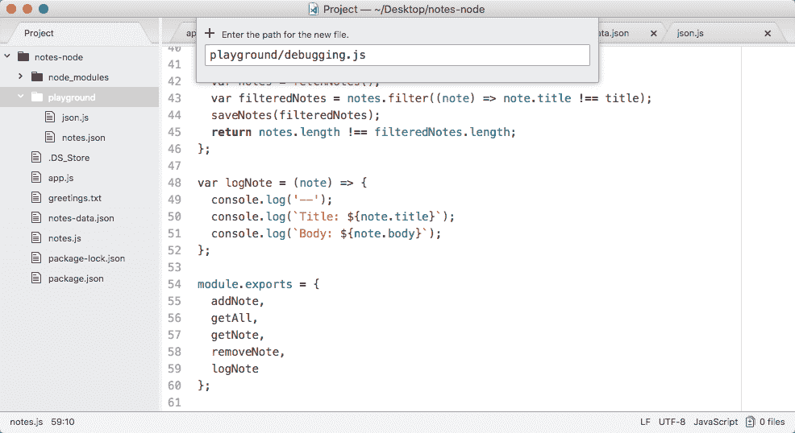

在`debugging.js`中，我们将从一个基本示例开始。我们将创建一个名为`person`的对象，在该对象上，我们暂时设置一个属性名。将其设置为你的名字，我将我的设置为字符串`Andrew`，如下所示：

```js
var person = {
  name: 'Andrew'
};
```

接下来我们将设置另一个属性，但在下一行，`person.age`。我将我的设置为我的年龄，`25`：

```js
var person = {
  name: 'Andrew'
};

person.age = 25;
```

然后我们将添加另一个语句来更改名称，`person.name`等于`Mike`之类的东西：

```js
var person = {
  name: 'Andrew'
};

person.age = 25;

person.name = 'Mike';
```

最后，我们将`console.log`打印`person`对象，代码将如下所示：

```js
var person = {
  name: 'Andrew'
};

person.age = 25;

person.name = 'Mike';

console.log(person);
```

现在，实际上在这个例子中我们已经有了一种调试的形式，我们有一个`console.log`语句。

当你进行 Node 应用程序开发过程时，你可能已经使用了`console.log`来调试你的应用程序。也许有些东西不像预期的那样工作，你想准确地弄清楚那个变量里面存储了什么。例如，如果你有一个解决数学问题的函数，也许在函数的某个部分方程式是错误的，你得到了一个不同的结果。

使用`console.log`可能是一个非常好的方法，但它的功能非常有限。我们可以通过在终端中运行它来查看，我将运行以下命令：

```js
node playground/debugging.js
```

当我运行文件时，我确实可以在屏幕上打印出我的对象，这很好，但是，你知道，如果你想调试除了`person`对象之外的东西，你必须添加另一个`console.log`语句来做到这一点。

想象一下，你有一个类似我们的`app.js`文件，你想看看命令等于什么，然后你想看看`argv`等于什么，这可能需要花费很多时间来添加和删除那些`console.log`语句。有一种更好的调试方法。这就是使用 Node 的`debugger`。现在，在我们对项目进行任何更改之前，我们将看看`debugger`在终端内部是如何工作的，正如我在本节开头警告过你的，内置的 Node`debugger`虽然有效，但有点丑陋和难以使用。

不过，现在，我们将以基本相同的方式运行应用程序，只是这一次我们将输入`node inspect`。Node debug 将以与常规 Node 命令完全不同的方式运行我们的应用程序。我们在 playground 文件夹中运行相同的文件，它叫做`debugging.js`：

```js
node inspect playground/debugging.js
```

当你按下*enter*时，你应该会看到类似这样的东西：

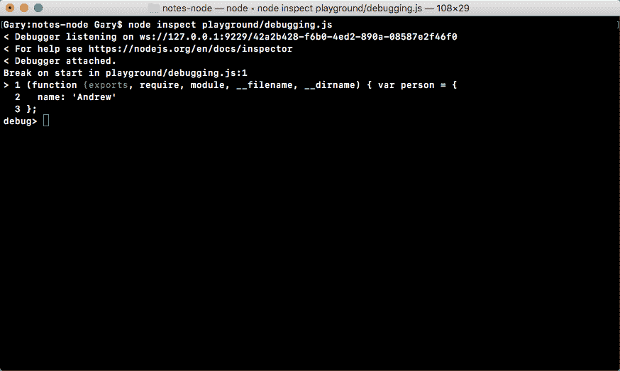

在输出中，我们可以忽略前两行。这基本上意味着`debugger`已经正确设置，并且能够监听后台运行的应用程序。

接下来，我们在 playground 调试中有我们的第一个换行符在第一行，紧接着它你可以看到带有一个小尖号（`>`）的第一行。当你首次以调试模式运行你的应用程序时，它会在执行第一条语句之前暂停。当我们暂停在像第一行这样的行上时，这意味着这行还没有执行，所以在这个时间点上我们甚至还没有`person`变量。

现在，正如你在前面的代码中所看到的，我们还没有返回到命令行，Node 仍在等待输入，我们可以运行一些不同的命令。例如，我们可以运行`n`，它是下一个的缩写。你可以输入`n`，按下*enter*，这会移到下一个语句。

我们有下一条语句，第一行的语句被执行了，所以`person`变量确实存在。然后我可以再次使用`n`去到下一个语句，我们在那里声明`person.name`属性，将它从`Andrew`更新为`Mike`：

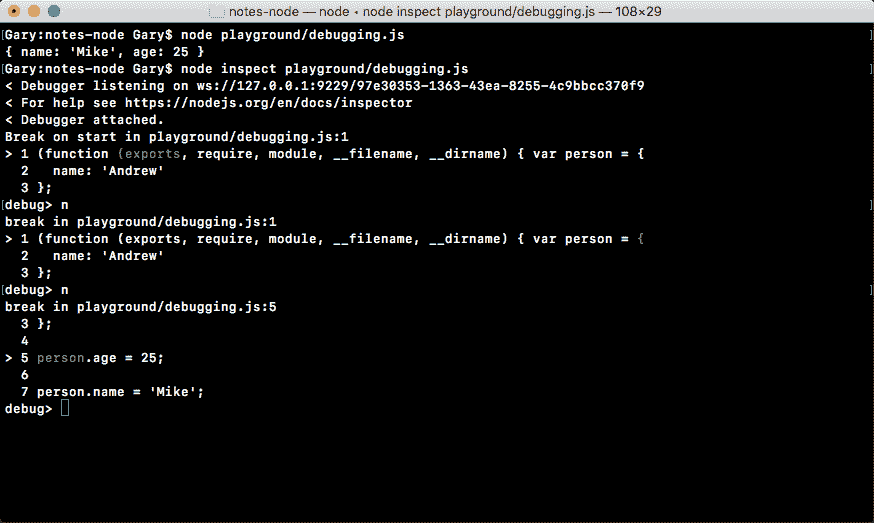

注意，在这一点上，年龄确实存在，因为那行已经执行过了。

现在，`n`命令会逐条执行你的整个程序。如果你意识到你不想在整个程序中这样做，这可能需要花费很多时间，你可以使用`c`。`c`命令是**Continue**的缩写，它会一直执行到程序的最后。在下面的代码中，你可以看到我们的`console.log`语句运行了名字`Mike`和年龄`25`：

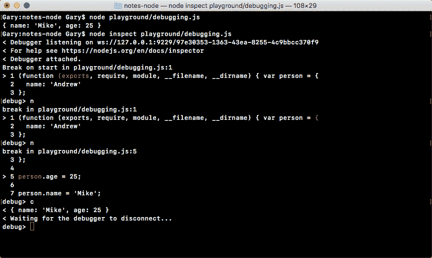

这就是如何使用`debug`关键字的一个快速示例。

现在，我们实际上并没有进行任何调试，我们只是运行了整个程序，因为在写这些命令时有点陌生，比如下一个和继续，我决定在没有调试的情况下进行一次干运行。你可以使用*control* + *C*来退出`debugger`并返回到终端。

我将使用`clear`来清除所有输出。现在我们对如何在`debug`模式下执行程序有了一个基本的了解，让我们看看我们实际上如何进行一些调试。

# 使用调试

我将使用上箭头键两次重新运行程序，返回到 Node `debug`命令。然后，我将运行程序，并连续按两次`n`，`n`：

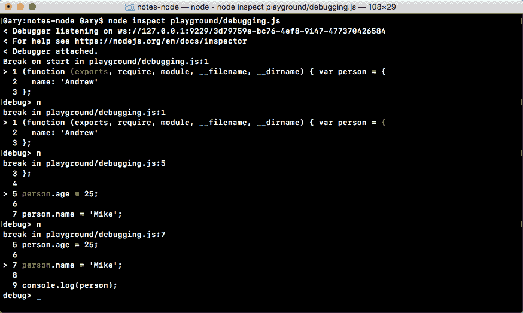

此时，我们在第七行，这就是当前的断点所在。从这里，我们可以使用一个叫做`repl`的命令进行一些调试，它代表**读取-求值-打印-循环**。在我们的情况下，`repl`命令会将你带到`debugger`的一个完全独立的区域。当你使用它时，你实际上是在一个 Node 控制台中：

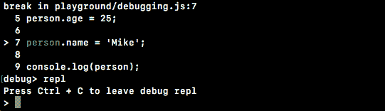

你可以运行任何 Node 命令，例如，我可以使用`console.log`打印出`test`，然后`test`就会打印出来。

我可以创建一个变量`a`，它等于`1`加`3`，然后我可以引用`a`，我可以看到它等于`4`，如下所示：

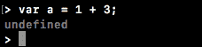

更重要的是，我们可以访问当前程序的状态，也就是在第七行执行之前的状态。我们可以使用这个来打印出`person`，如下面的代码所示，你可以看到`person`的名字是`Andrew`，因为第七行还没有执行，年龄是`25`，正如程序中显示的那样：

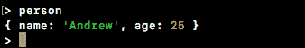

这就是调试变得非常有用的地方。能够在某个特定时间点暂停程序将使查找错误变得非常容易。我可以做任何我想做的事情，我可以打印出`person`的名字属性，并且它会在屏幕上打印出`Andrew`，如下所示：

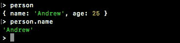

现在，我们还是有这个问题。我必须通过程序按下`next`。当你有一个非常长的程序时，可能需要运行数百或数千个语句，然后才能到达你关心的点。显然这不是理想的，所以我们要找到更好的方法。

让我们使用*control* + *C*退出`repl`；现在我们回到了`debugger`。

从这里开始，我们将在`debugging.js`中对我们的应用程序进行快速更改。

假设我们想要在第七行暂停，介于`person`年龄属性更新和`person`名字属性更新之间。为了暂停，我们要做的是运行语句`debugger`：

```js
var person = {
  name: 'Andrew'
};

person.age = 25;

debugger;

person.name = 'Mike';

console.log(person);
```

当你有一个像之前一样的`debugger`语句时，它告诉 Node `debugger`在这里停下，这意味着你可以使用`c`（continue）来继续，而不是使用`n`（next）逐条语句执行，它会一直执行，直到程序退出或者看到一个`debugger`关键字。

现在，在终端中，我们将重新运行程序，就像之前一样。这一次，我们不会按两次`n`，而是使用`c`来继续：

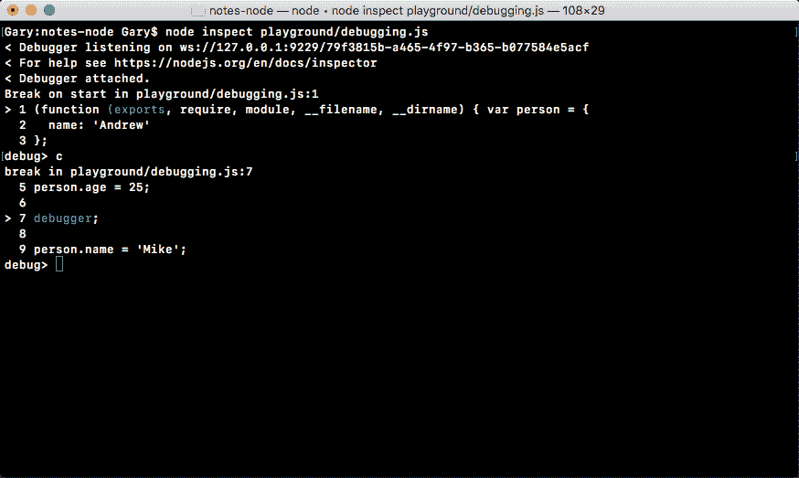

现在，当我们第一次使用`c`时，它到达了程序的末尾，打印出了我们的对象。这一次它会继续，直到找到`debugger`关键字。

现在，我们可以使用`repl`，访问任何我们喜欢的东西，例如，`person.age`，如下所示：

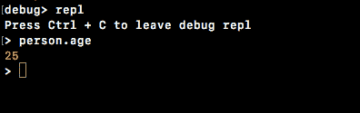

一旦我们完成调试，我们可以退出并继续执行程序。同样，我们可以使用*control* + *C*来退出`repl`和`debugger`。

真正的调试基本上都是使用`debugger`关键字。你可以把它放在程序的任何地方，以调试模式运行程序，最终它会到达`debugger`关键字，然后你可以做一些事情。例如，你可以探索一些变量值，运行一些函数，或者玩弄一些代码来找到错误。没有人真的使用`n`来逐行打印程序，找到导致问题的那一行。那太费时间了，而且不现实。

# 在笔记应用程序中使用调试器

现在你对`debugger`有了一点了解，我希望你在我们的笔记应用内使用它。我们将在`notes.js`内添加`debugger`语句到`logNote`函数的第一行。然后我将以调试模式运行程序，传入一些参数，这些参数将导致`logNote`运行；例如，读取一个笔记，在笔记被获取后，它将调用`logNote`。

现在，一旦我们在`logNote`函数中有了`debugger`关键字，并以这些参数在调试模式下运行它，程序应该在这一点停止。一旦程序以调试模式启动，我们将使用`c`来继续，它会暂停。接下来，我们将打印出笔记对象并确保它看起来没问题。然后，我们可以退出`repl`并退出`debugger`。

现在，首先我们在这里添加`debugger`语句：

```js
var logNote = (note) => {
  debugger;
  console.log('--');
  console.log(`Title: ${note.title}`);
  console.log(`Body: ${note.body}`);
};
```

我们可以保存文件，现在我们可以进入终端；我们的应用内不需要做其他任何事情。

在终端内，我们将运行我们的`app.js`文件，`node debug app.js`，因为我们想以调试模式运行程序。然后我们可以传入我们的参数，比如`read`命令，我将传入一个标题，`"to buy"`如下所示：

```js
node debug app.js read --title="to buy"
```

在这种情况下，我有一个标题为`"to buy"`的笔记，如下所示：

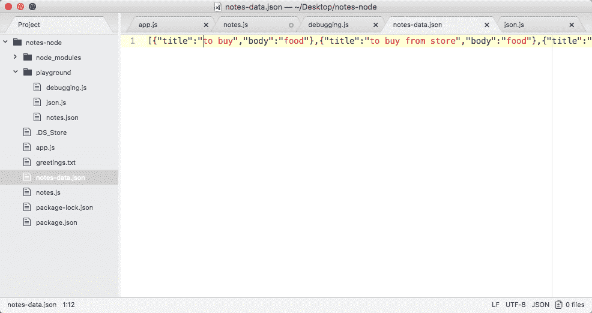

现在，当我运行上述命令时，它会在第一条语句运行之前暂停，这是预期的：

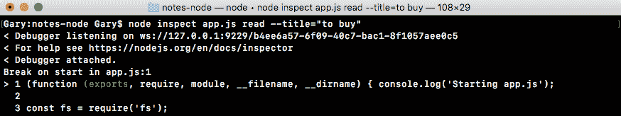

我现在可以使用`c`来继续程序。它会运行尽可能多的语句，直到程序结束或找到`debugger`关键字，如下面的代码所示，你可以看到`debugger`被找到，我们的程序已经停在`notes.js`的第`49`行：

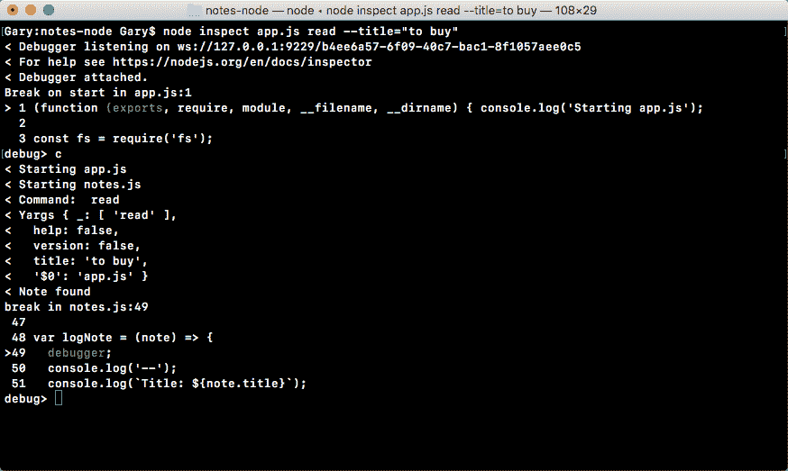

这正是我们想要做的。现在，从这里，我将进入`repl`并打印出笔记参数，如下面的代码所示，你可以看到我们有一个标题为`to buy`和正文为`food`的笔记：

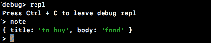

现在，如果这个语句出现了错误，也许屏幕上打印了错误的东西，这将给我们一个很好的想法。无论传递给`note`的是什么，显然都被用在`console.log`语句内，所以如果打印出了问题，最有可能是`logNote`函数内传递的问题。

现在我们已经打印了`note`变量，我们可以关闭`repl`，我们可以使用*control* + *C*或`quit`来退出`debugger`。

现在我们回到了常规终端，我们已经成功完成了 Node 应用内的调试。在下一节中，我们将看一种不同的方法来做同样的事情，这种方法有一个更好的图形用户界面，我发现它更容易导航和使用。

# 列出笔记

现在我们在调试方面取得了一些进展，让我们回到我们应用的命令，因为只剩下一个要填写的命令了（我们已经分别在第三章、*Node 基础知识-第二部分*和本章中涵盖了`add`、`read`和`remove`命令）。这是`list`命令，它将非常容易，`list`命令中没有复杂的情况。

# 使用`getAll`函数

为了开始，我们所需要做的就是填写`list notes`函数，这种情况下我们称之为`getAll`。`getAll`函数负责返回每一个笔记。这意味着它将返回一个对象数组，即我们所有笔记的数组。

我们所要做的就是返回`fetchNotes`，如下所示：

```js
var getAll = () => {
  return fetchNotes();
}
```

无需过滤，也无需操作数据，我们只需要将数据从`fetchNotes`传递回`getAll`。现在我们已经做好了这一点，我们可以在`app.js`内填写功能。

我们必须创建一个变量来存储便签，我本来打算称它为 notes，但我可能不应该这样做，因为我们已经声明了一个 notes 变量。我将创建另一个变量，称为`allNotes`，将其设置为从`getAll`返回的值，我们知道这是因为我们刚刚填写了返回所有便签的内容：

```js
else if (command === 'list') {
  var allNotes = notes.getAll();
}
```

现在我可以使用`console.log`打印一条小消息，我将使用模板字符串，这样我就可以注入要打印的实际便签数量。

在模板字符串中，我将添加`打印`，然后使用`$`（美元）符号和大括号，`allNotes.length`：这是数组的长度，后跟带有`s`的便签，括号中的`s`用于处理单数和复数情况，如下面的代码块所示：

```js
else if (command === 'list') {
  var allNotes = notes.getAll();
  console.log(`Printing ${allNotes.length} note(s).`);
}
```

因此，如果有六条便签，它会说打印六条便签。

既然我们已经有了这个，我们必须继续实际打印每个便签的过程，这意味着我们需要为`allNotes`数组中的每个项目调用`logNote`一次。为此，我们将使用`forEach`，这是一个类似于 filter 的数组方法。

Filter 允许您通过返回`true`或`false`来操作数组以保留项目或删除项目；`forEach`只是为数组中的每个项目调用一次回调函数。在这种情况下，我们可以使用`allNotes.forEach`，传入一个回调函数。现在，该回调函数将是一个箭头函数（`=>`），在我们的情况下，它将被调用`note`变量，就像 filter 一样。我们将调用`notes.logNote`，传入`note`参数，就像这里一样：

```js
else if (command === 'list') {
  var allNotes = notes.getAll();
  console.log(`Printing ${allNotes.length} note(s).`);
  allNotes.forEach((note) => {
    notes.logNote(note);
  });
}
```

现在我们已经有了这个，我们可以通过在这里添加`logNote`调用来简化它：

```js
else if (command === 'list') {
  var allNotes = notes.getAll();
  console.log(`Printing ${allNotes.length} note(s).`);
  allNotes.forEach((note) => notes.logNote(note));
}
```

这完全是相同的功能，只是使用了表达式语法。现在我们已经有了箭头函数（`=>`），我们正在为所有便签数组中的每个项目调用`notes.logNote`一次。让我们保存`app.js`文件并在终端中测试一下。

为了测试`list`命令，我将使用`node app.js`和`list`命令。不需要传递任何参数：

```js
node app.js list
```

当我运行这个程序时，我确实得到了`打印 3 条便签`，然后我得到了我的`3 条购买便签`，`从商店购买`和`要做的事情`，如下面的代码输出所示，这太棒了：

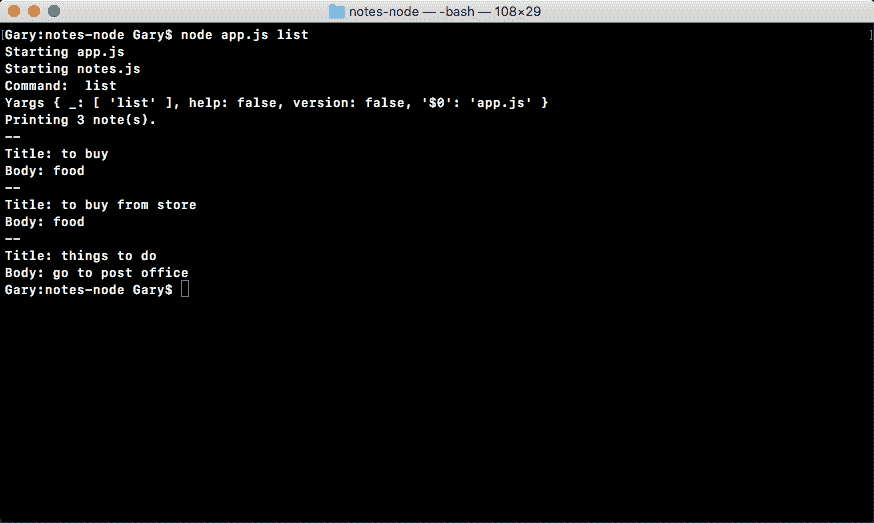

有了这个，我们所有的命令现在都可以工作了。我们可以添加便签，删除便签，阅读单个便签，并列出存储在我们的 JSON 文件中的所有便签。

接下来，我想清理一些命令。在`app.js`和`notes.js`中，我们有一些不再需要的`console.log`语句打印出一些东西。

在`app.js`的顶部，我将删除`console.log('Starting app.js')`语句，使常量`fs`成为第一行。

我还将删除两个语句：`console.log('Command: ', command)`和`console.log('Yargs', argv)`，打印命令和`yargs`变量值。

在`notes.js`中，我还将删除文件顶部的`console.log('Stating notes.js')`语句，因为它不再需要，将常量`fs`放在顶部。

当我们首次开始探索不同的文件时，它绝对是有用的，但现在我们已经把一切都放在了一起，就没有必要了。如果我重新运行`list`命令，这次你可以看到它看起来更整洁了：

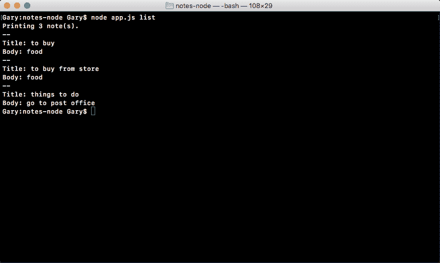

`打印三条便签`是出现的第一行。有了这个，我们已经完成了我们的命令。

在下一节中，我们将稍微深入地看一下如何配置 yargs。这将让我们为我们的命令要求某些参数。因此，如果有人尝试添加一个没有标题的便签，我们可以警告用户并阻止程序执行。

# 高级 yargs

在我们深入讨论 yargs 的高级内容之前，首先，我想查看一下 yargs 文档，这样你至少知道 yargs 的信息是从哪里来的。你可以通过谷歌搜索`npm yargs`来获取。我们将前往 npm 上的 yargs 包页面。这里有 yargs 的文档，如下所示：

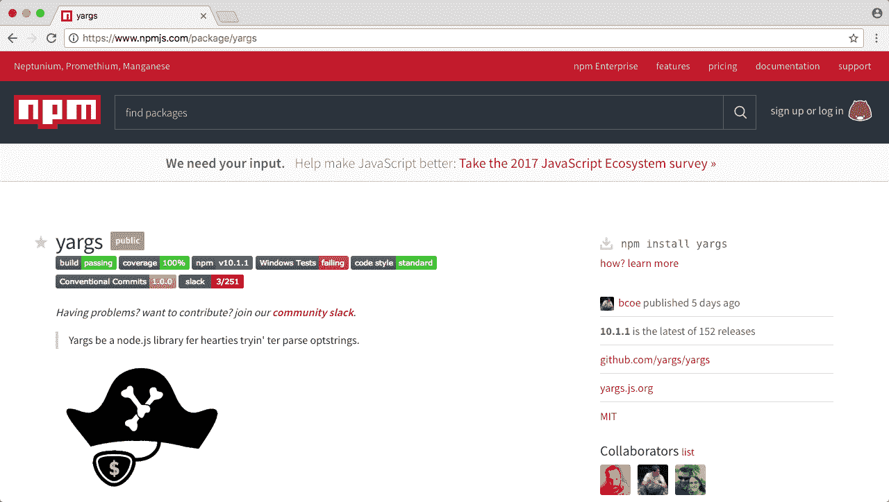

现在 yargs 文档没有目录，这使得导航变得有点困难。它以一些没有特定顺序的示例开始，然后最终列出了你可以使用的所有方法，这就是我们要找的。

所以我将使用*command* + *F*（*C**trl* + *F*）在页面上搜索方法，如下面的截图所示，我们得到了方法标题，这就是我们要找的：

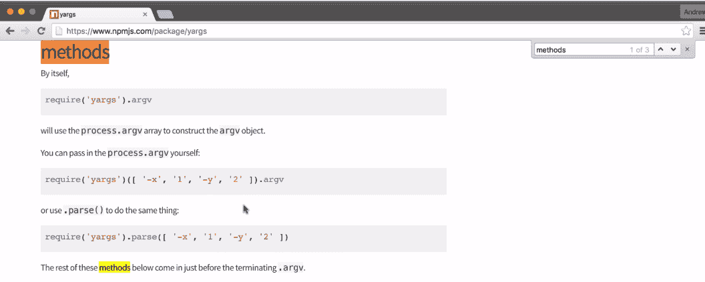

如果你在页面上滚动，你会开始看到一个字母顺序的列表，列出了你在 yargs 中可以访问的所有方法。我们特别寻找`.command`；这是我们可以用来配置我们的四个命令：`add`，`read`，`remove`和`list` notes 的方法：

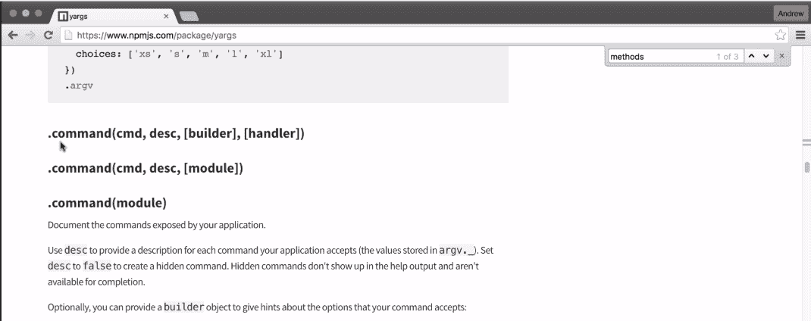

我们将指定它们需要哪些选项，如果有的话，我们还可以设置描述和帮助功能。

# 在 yargs 上使用链式语法

现在，为了开始，我们需要在`app.js`中进行一些更改。我们将从`add`命令开始（有关更多信息，请参阅上一章节中的*添加和保存笔记*部分）。

我们想在`app.js`中的`argv`函数中添加一些有用的信息，将：

+   让 yargs 验证`add`命令是否被正确执行，并

+   让用户知道`add`命令应该如何执行

现在我们将进行属性调用的链式调用，这意味着在访问`.argv`之前，我想调用`.command`，然后我将在命令的返回值上调用`.argv`，如下所示：

```js
const argv = yargs
  .command()
  .argv;
```

现在，如果你使用过 jQuery，这种链式语法可能看起来很熟悉，支持许多不同的库。一旦我们在`yargs`上调用`.command`，我们将传入三个参数。

第一个是命令名称，用户在终端中输入的方式，我们的情况下是`add`：

```js
const argv = yargs
  .command('add')
  .argv;
```

然后我们将传入另一个字符串，这将是对命令做什么的描述。这将是一种用户可以阅读的英文可读描述，以便用户可以阅读以确定是否是他们想要运行的命令：

```js
const argv = yargs
  .command('add', 'Add a new note')
  .argv;
```

接下来的是一个对象。这将是一个选项对象，让我们指定这个命令需要什么参数。

# 调用`.help`命令

现在，在我们进入选项对象之前，让我们在命令之后再添加一个调用。我们将调用`.help`，这是一个方法，所以我们将它作为一个函数调用，我们不需要传入任何参数：

```js
const argv = yargs
  .command('add', 'Add a new note', {

  })
  .help()
  .argv;
```

当我们添加这个帮助调用时，它设置了`yargs`在有人运行程序时返回一些非常有用的信息。例如，我可以运行`node app.js`命令并带有`help`标志。`help`标志是因为我们调用了那个帮助方法，当我运行程序时，你可以看到我们有哪些可用的选项：

```js
node app.js --help
```

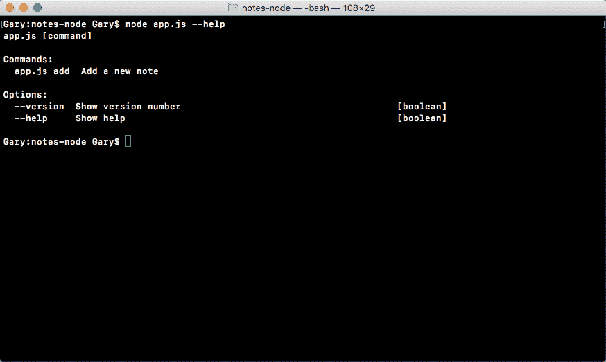

如前面的输出所示，我们有一个命令`add Add a new note`，以及当前命令`help`的`help`选项。如果我们运行`node app.js add`命令并带有`help`，情况也是如此，如下所示：

```js
node app.js add --help
```

在这个输出中，我们可以查看`add`命令的所有选项和参数，这种情况下是没有的，因为我们还没有设置：

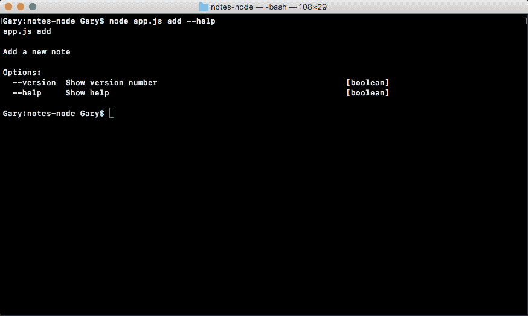

# 添加选项对象

让我们在 Atom 中重新添加选项和参数。为了添加属性，我们将更新选项对象，其中键是属性名称，无论是标题还是正文，值是另一个对象，让我们指定该属性应该如何工作，如下所示：

```js
const argv = yargs
  .command('add', 'Add a new note', {
    title: {

    }
  })
  .help()
  .argv;
```

# 添加标题

在标题的情况下，我们将在左侧添加标题，并在右侧放置我们的选项对象。在标题中，我们将配置三个属性`describe`，`demand`和`alias`：

`describe`属性将被设置为一个字符串，这将描述应该传递给标题的内容。在这种情况下，我们可以使用`Title of note`：

```js
const argv = yargs
  .command('add', 'Add a new note', {
    title: {
      describe: 'Title of note'
    }
  })
  .help()
  .argv;
```

接下来我们配置`demand`。它将告诉 yarg 这个参数是否是必需的。`demand`默认为`false`，我们将把它设置为`true`：

```js
const argv = yargs
  .command('add', 'Add a new note', {
    title: {
      describe: 'Title of note',
      demand: true
    }
  })
  .help()
  .argv;
```

现在，如果有人尝试运行 add 命令而没有标题，它将失败，我们可以证明这一点。我们可以保存`app.js`，在终端中，我们可以重新运行我们之前的命令，删除`help`标志，当我这样做时，你会看到一个警告，`Missing required argument: title`如下所示：

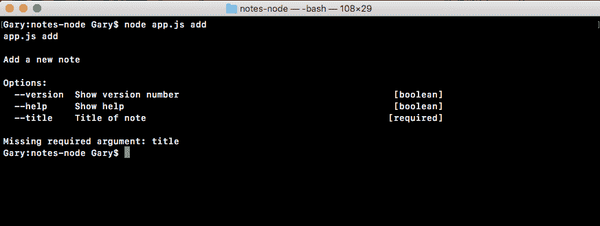

请注意，在输出中，标题参数是`Title of note`，这是我们使用的描述字符串，并且在右侧是`required`，让您知道在调用`add`命令时必须提供标题。

除了`describe`和`demand`，我们还将提供第三个选项，这称为`alias`。`alias`让您提供一个快捷方式，这样您就不必输入`--title`；您可以将别名设置为单个字符，如`t`：

```js
const argv = yargs
  .command('add', 'Add a new note', {
    title: {
      describe: 'Title of note',
      demand: true,
      alias: 't'
    }
  })
  .help()
  .argv;
```

完成后，您现在可以使用新的语法在终端中运行命令。

让我们运行我们的 add 命令，`node app.js add`，而不是`--title`。我们将使用`-t`，这是标志版本，我们可以将其设置为任何我们喜欢的值，例如，`flag title`将是标题，`--body`将被设置为`body`，如下面的代码所示。请注意，我们还没有设置 body 参数，所以没有`alias`：

```js
node app.js add -t="flag title" --body="body"
```

如果我运行这个命令，一切都按预期工作。标志标题出现在应该出现的地方，即使我们使用了字母`t`的别名版本，如下所示：

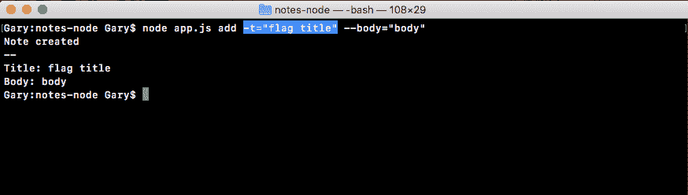

# 添加正文

现在我们已经配置了标题，我们可以为正文做完全相同的事情。我们将指定我们的选项对象并提供这三个参数：`describe`，`demand`和`alias`用于`body`：

```js
const argv = yargs
  .command('add', 'Add a new note', {
    title: {
      describe: 'Title of note',
      demand: true,
      alias: 't'
    },
    body: {

 }
  })
  .help()
  .argv;
```

第一个是`describe`，这个很容易。`describe`将被设置为一个字符串，在这种情况下，`Body of note`将完成任务：

```js
const argv = yargs
  .command('add', 'Add a new note', {
    title: {
      describe: 'Title of note',
      demand: true,
      alias: 't'
    },
    body: {
      describe: 'Body of note'
    }
  })
  .help()
  .argv;
```

接下来是`demand`，为了添加一个注释，我们需要一个`body`。所以我们将`demand`设置为`true`，就像我们之前为`title`做的那样：

```js
const argv = yargs
  .command('add', 'Add a new note', {
    title: {
      describe: 'Title of note',
      demand: true,
      alias: 't'
    },
    body: {
      describe: 'Body of note'
      demand: true
    }
  })
  .help()
  .argv;
```

最后但并非最不重要的是`alias`。`alias`将被设置为一个单个字母，我将使用字母`b`代表`body`：

```js
const argv = yargs
  .command('add', 'Add a new note', {
    title: {
      describe: 'Title of note',
      demand: true,
      alias: 't'
    },
    body: {
      describe: 'Body of note'
      demand: true,
      alias: 'b'
    }
  })
  .help()
  .argv;
```

有了这个设置，我们现在可以保存`app.js`，在终端中，我们可以花点时间重新运行`node app.js add`，并使用`help`标志：

```js
node app.js add --help
```

当我们运行这个命令时，现在应该会看到正文参数出现，甚至可以看到它显示了标志版本，如下面的输出所示，别名`-b`（`Body of note`），并且是必需的：

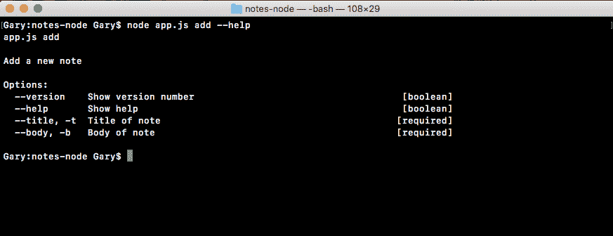

现在我将运行`node app.js add`，传入两个参数`t`。我将把它设置为`t`，`b`设置为`b`。

当我运行命令时，一切都按预期工作：

```js
node app.js add -t=t -b=b
```

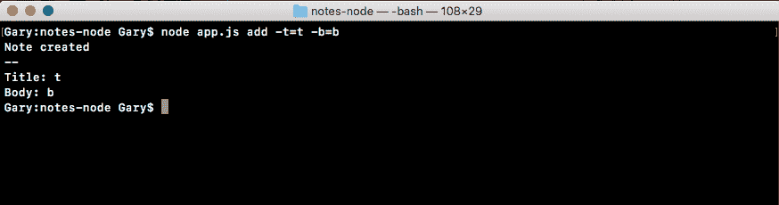

如前面的输出截图所示，创建了一个标题为`t`，正文为`b`的新便笺。有了这个设置，我们现在已经成功完成了`add`命令的设置。我们有我们的`add`命令标题，一个描述，以及为该命令指定参数的块。现在我们还有三个命令需要添加支持，所以让我们开始做吧。

# 添加对读取和删除命令的支持

在下一行，我将再次调用`.command`，传入命令名称。让我们先执行`list`命令，因为这个命令非常简单，不需要任何参数。然后我们将为`list`命令传入描述，“列出所有便笺”，如下所示：

```js
.command('list', 'List all notes')
.help()
.argv;
```

接下来，我们将再次调用命令。这次我们将为`read`命令执行命令。`read`命令读取一个单独的便笺，所以对于`read`命令的描述，我们将使用类似“读取便笺”的内容：

```js
.command('list', 'List all notes')
.command('read', 'Read a note')
.help()
.argv;
```

现在`read`命令确实需要标题参数。这意味着我们需要提供该选项对象。我将从`add`命令中取出`title`，复制它，并粘贴到`read`命令的选项对象中：

```js
.command('list', 'List all notes')
.command('read', 'Read a note', {
  title: {
    describe: 'Title of note',
    demand: true,
    alias: 't'
  }
})
.help()
.argv;
```

您可能刚刚注意到，我们有重复的代码。标题配置刚刚被复制并粘贴到多个位置。如果这是 DRY 的话，如果它在一个变量中，我们可以在`add`和`read`命令中引用它，那将是非常好的。

在我们调用`read`命令的地方后面，将调用`remove`命令。现在，`remove`命令将有一个描述。我们将坚持使用一些简单的描述，比如“删除便笺”，并且我们将提供一个选项对象：

```js
.command('remove', 'Remove a note', {

})
```

现在我可以添加与`read`命令相同的选项对象。但是，在该选项对象中，我将标题设置为`titleOptions`，如下所示，以避免重复的代码。

```js
.command('remove', 'Remove a note', {
  title: titleOptions
})
```

# 添加`titleOption`和`bodyOption`变量

现在我还没有创建`titleOptions`对象，所以代码目前可能会失败，但这是一个一般的想法。我们希望创建`titleOptions`对象一次，并在我们使用它的所有位置，为`add`，`read`和`remove`命令引用它。我可以像这样为`read`和`add`命令添加`titleOptions`：

```js
.command('add', 'Add a new note', {
  title: titleOptions,
  body: {
    describe: 'Body of note',
    demand: true,
    alias: 'b'
  }
})
.command('list', 'List all notes')
.command('read', 'Read a note', {
  title: titleOptions
})
.command('remove', 'Remove a note', {
title: titleOptions
})
```

现在，在常量`argv`之前，我可以创建一个名为`titleOptions`的常量，并将其设置为我们之前为`add`和`read`命令定义的对象，即`describe`，`demand`和`alias`，如下所示：

```js
const titleOptions = {
  describe: 'Title of note',
  demand: true,
  alias: 't'
};
```

现在我们已经准备好了`titleOptions`，这将按预期工作。我们拥有了之前完全相同的功能，但是现在我们将`titleOptions`放在了一个单独的对象中，这符合我们在*读取便笺*部分讨论的 DRY 原则。

现在，我们也可以为正文做同样的事情。这可能看起来有点多余，因为我们只在一个地方使用它，但是如果我们坚持将它们分解成变量，我也会在正文的情况下这样做。在`titleOptions`常量之后，我可以创建一个名为`bodyOptions`的常量，将其设置为我们在前面的小节中为`add`命令定义的正文的选项对象：

```js
const bodyOptions = {
  describe: 'Body of note',
  demand: true,
  alias: 'b'
};
```

有了这个设置，我们现在已经完成了。我们有`add`，`read`和`remove`，所有这些都已经设置好了，引用了`titleObject`和`bodyObject`变量。

# 测试删除命令

让我们在终端中测试`remove`命令。我将列出我的便笺，使用`node app.js list`，这样我就可以看到我需要删除哪些便笺：

```js
node app.js list
```

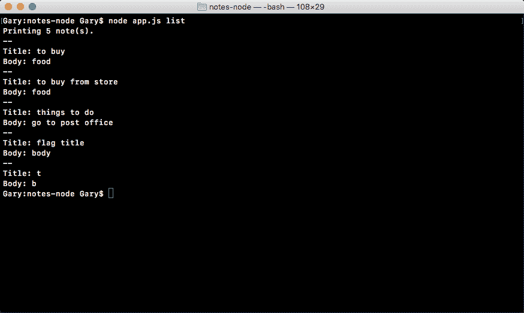

我将使用`node app.js remove`命令和我们的标志`t`删除标题为`t`的便笺：

```js
node app.js remove -t="t"
```

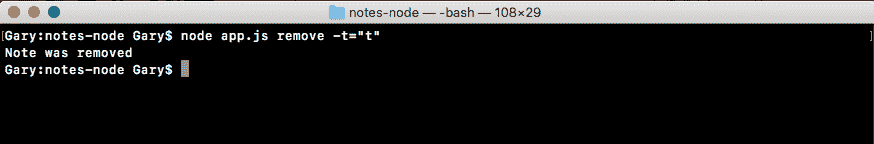

我们将删除标题为`t`的便笺，如前所示，“便笺已删除”将打印到屏幕上。如果我两次使用上箭头键，我可以再次列出便笺，你会看到标题为`t`的便笺确实已经消失了：

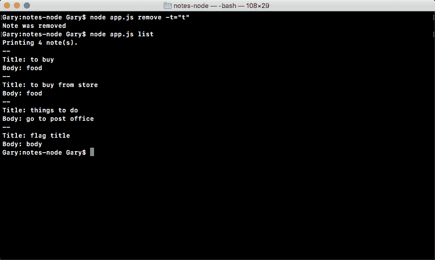

让我们使用`node app.js remove`命令再删除一条笔记。这次我们将使用`--title`，这是参数名，我们要`remove`的笔记具有标题标志标题，如下所示：

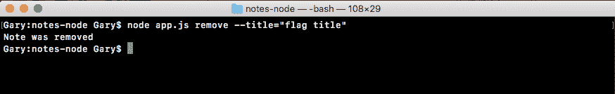

当我删除它时，它会显示`Note was removed`，如果我重新运行`list`命令，我可以看到我们还剩下三条笔记，笔记确实被删除了，如下所示：

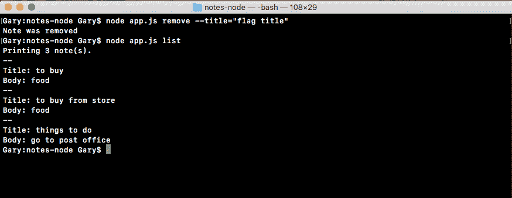

这就是笔记应用程序的全部内容。

# 箭头函数

在本节中，您将学习箭头函数的各个方面。这是一个 ES6 功能，我们已经稍微了解了一下。在`notes.js`中，我们在一些基本示例中使用它来创建方法，比如`fetchNotes`和`saveNotes`，我们还将它传递给一些数组方法，比如 filter，对于每个数组，我们将它用作在数组中的每个项目上调用的回调函数。

现在，如果你尝试用箭头函数替换程序中的所有函数，很可能不会按预期工作，因为两者之间存在一些差异，了解这些差异非常重要，这样你就可以决定使用常规的 ES5 函数还是 ES6 箭头函数。

# 使用箭头函数

本节的目标是为您提供知识，以便做出选择，我们将通过在 playground 文件夹中创建一个名为`arrow-function.js`的新文件来开始：

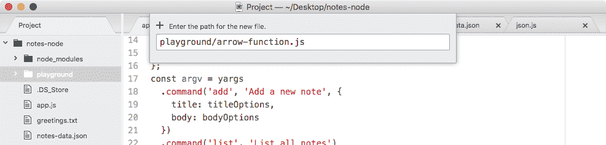

在这个文件中，我们将玩几个例子，讨论箭头函数的一些微妙之处。在文件内输入任何内容之前，我将用`nodemon`启动这个文件，这样每次我们做出更改时，它都会自动在终端中刷新。

如果你还记得，`nodemon`是我们在第二章中安装的实用程序，*Node 基础知识-第一部分*。它是一个全局的 npm 模块。`nodemon`是要运行的命令，然后我们只需像对待其他 Node 命令一样传入文件路径。因为我们要进入`playground`文件夹，文件本身叫做`arrow-function.js`，我们将运行以下命令：

```js
nodemon playground/arrow-function.js
```

我们将运行文件，除了`nodemon`日志之外，屏幕上什么都不会打印，如下所示：

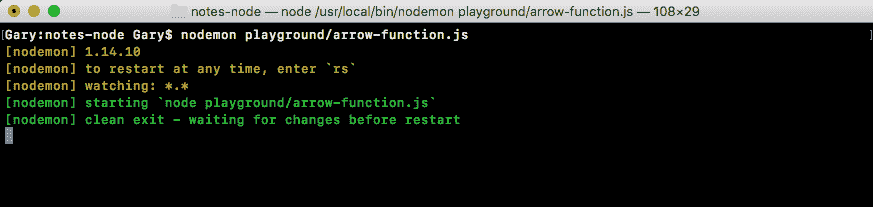

要开始，在`arrowfunction.js`文件中，我们将创建一个名为 square 的函数，通过创建一个名为 square 的变量并将其设置为箭头函数。

为了创建我们的箭头函数(`=>`)，我们首先要在括号内提供参数。因为我们将对一个数字进行平方，所以我们只需要一个数字，我将把这个数字称为`x`。如果我传入 3，我应该期望得到 9，如果我传入 9，我会期望得到 81。

在参数列表之后，我们必须通过将等号和大于号放在一起来放置箭头函数(`=>`)，创建我们漂亮的小箭头。从这里开始，我们可以在花括号内提供我们想要执行的所有语句：

```js
var square = (x) => {

};
```

接下来，我们可能会创建一个名为 result 的变量，将其设置为`x`乘以`x`，然后我们可能会使用`return`关键字返回结果变量，如下所示：

```js
var square = (x) => {
  var result = x * x;
  return result;
};
```

现在，显然这可以在一行上完成，但这里的目标是说明当你使用语句箭头函数(`=>`)时，你可以在这些花括号之间放置任意多的行。让我们调用一个平方，我们将使用`console.log`来做到这一点，这样我们就可以将结果打印到屏幕上。我会调用 square；我们将用`9`调用 square，`9`的平方将是`81`，所以我们期望`81`打印到屏幕上：

```js
var square = (x) => {
  var result = x * x;
  return result;
};
console.log(square(9));
```

我会保存箭头函数(`=>`)文件，在终端中，`81`就像我们预期的那样显示出来：

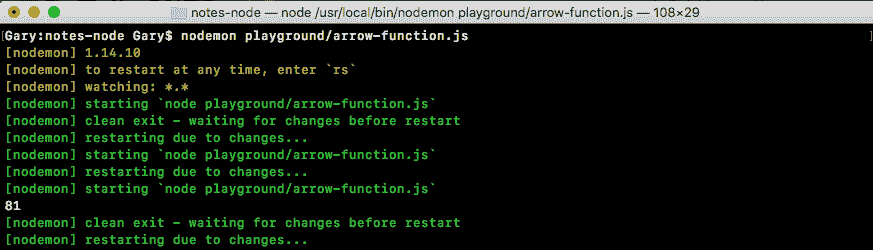

现在我们在之前的例子中使用的语法是箭头函数(`=>`)的语句语法。我们之前也探讨了表达式语法，它让你在返回一些表达式时简化你的箭头函数。在这种情况下，我们只需要指定我们想要返回的表达式。在我们的例子中，就是`x`乘以`x`：

```js
var square = (x) => x * x;
console.log(square(9));
```

你不需要显式添加`return`关键字。当你使用不带大括号的箭头函数(`=>`)时，它会隐式地为你提供。这意味着我们可以保存之前显示的函数，完全相同的结果会打印到屏幕上，`81`出现。

这是箭头函数的一个巨大优势，当你在`notes.js`文件中使用它们时。它让你简化你的代码，保持一行，使你的代码更容易维护和扫描。

现在，有一件事我想指出：当你有一个只有一个参数的箭头函数(`=>`)时，你实际上可以省略括号。如果你有两个或更多的参数，或者你有零个参数，你需要提供括号，但如果你只有一个参数，你可以不用括号引用它。

如果我以这种状态保存文件，`81`仍然打印到屏幕上；这很好，我们有一个更简单的箭头函数(`=>`)版本：

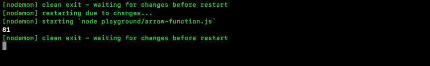

现在我们已经有了一个基本的例子，我想继续进行一个更复杂的例子，探讨常规函数和箭头函数之间的细微差别。

# 探索常规函数和箭头函数之间的差异

为了说明区别，我会创建一个名为`user`的变量，它将是一个对象。在这个对象上，我们会指定一个属性，名字。将名字设置为字符串，你的名字，在这种情况下我会将其设置为字符串`Andrew`：

```js
var user = {
  name: 'Andrew'
};
```

然后我们可以在`user`对象上定义一个方法。在名字后面，我在行末加上逗号，我会提供方法`sayHi`，将其设置为一个不带任何参数的箭头函数(`=>`)。暂时，我们会让箭头函数非常简单：

```js
var user = {
  name: 'Andrew',
  sayHi: () => {

  }
};
```

在`sayHi`里我们要做的就是使用`console.log`打印到屏幕上，在模板字符串里是`Hi`：

```js
var user = {
  name: 'Andrew',
  sayHi: () => {
    console.log(`Hi`);
  }
};
```

我们还没有使用模板字符串，但我们以后会使用，所以我会在这里使用它们。在用户对象之后，我们可以通过调用它来测试`sayHi`，`user.sayHi`：

```js
var user = {
  name: 'Andrew',
  sayHi: () => {
    console.log(`Hi`);
  }
};
user.sayHi();
```

我会称之为然后保存文件，我们期望`Hi`打印到屏幕上，因为我们的箭头函数(`=>`)只是使用`console.log`打印一个静态字符串。在这种情况下，没有任何问题；你可以毫无问题地用箭头函数(`=>`)替换常规函数。

当你使用箭头函数时，首先会出现的问题是箭头函数不会绑定`this`关键字。所以如果你在函数内部使用`this`，当你用箭头函数(`=>`)替换它时，它不会起作用。现在，`this`绑定；指的是父绑定，在我们的例子中没有父函数，所以这将指向全局的`this`关键字。现在我们的`console.log`不使用`this`，我会用一个使用`this`的情况来替换它。

我们会在`Hi`后面加一个句号，然后我会说我是，接着是名字，通常我们可以通过`this.name`来访问：

```js
var user = {
  name: 'Andrew',
  sayHi: () => {
    console.log(`Hi. I'm ${this.name}`);
  }
};
user.sayHi();
```

如果我尝试运行这段代码，它不会按预期工作；我们会得到`Hi` I'm undefined 打印到屏幕上，如下所示：


为了解决这个问题，我们将看一种替代箭头函数的语法，当你定义对象字面量时非常好用，就像我们在这个例子中所做的那样。

在`sayHi`之后，我将使用不同的 ES6 特性创建一个名为`sayHiAlt`的新方法。ES6 为我们提供了一种在对象上创建方法的新方式；你提供方法名`sayHiAlt`，然后直接跳过冒号到括号。虽然它是一个常规函数，但不是箭头函数(`=>`)，所以也不需要函数关键字。然后我们继续到大括号，如下所示：

```js
var user = {
  name: 'Andrew',
  sayHi: () => {
    console.log(`Hi. I'm ${this.name}`);
  },
  sayHiAlt() {

  }
};
user.sayHi();
```

在这里，我可以有与`sayHi`函数中完全相同的代码，但它将按预期工作。它将打印`Hi. I'm Andrew`。我将在下面调用`sayHiAlt`而不是常规的`sayHi`方法：

```js
var user = {
  name: 'Andrew',
  sayHi: () => {
    console.log(`Hi. I'm ${this.name}`);
  },
  sayHiAlt() {
    console.log(`Hi. I'm ${this.name}`);
  }
};
user.sayHiAlt();
```

在终端中，你可以看到`Hi. I'm Andrew`打印到屏幕上：


`sayHiAlt`语法是一种可以解决在对象字面量上创建函数时的`this`问题的语法。现在我们知道`this`关键字不会被绑定，让我们探索箭头函数的另一个怪癖，它也不会绑定参数数组。

# 探索参数数组

常规函数，比如`sayHiAlt`，将在函数内部有一个可访问的参数数组：

```js
var user = {
  name: 'Andrew',
  sayHi: () => {
    console.log(`Hi. I'm ${this.name}`);
  },
  sayHiAlt() {
    console.log(arguments);
    console.log(`Hi. I'm ${this.name}`);
  }
};
user.sayHiAlt();
```

现在，它不是一个实际的数组，更像是一个带有数组属性的对象；但是 arguments 对象确实在常规函数中指定。如果我传入 1、2 和 3 并保存文件，当我们记录 arguments 时，我们将得到它：

```js
var user = {
  name: 'Andrew',
  sayHi: () => {
    console.log(`Hi. I'm ${this.name}`);
  },
  sayHiAlt() {
    console.log(arguments);
    console.log(`Hi. I'm ${this.name}`);
  }
};
user.sayHiAlt(1, 2, 3);
```

在`nodemon`中，它需要快速重启，然后我们有我们的对象：

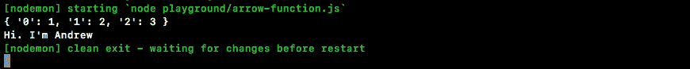

我们有 1、2 和 3，我们为每个属性名有索引，这是因为我们使用了常规函数。但是，如果我们切换到箭头函数(`=>`)，它将不会按预期工作。

我将在我的箭头函数(`=>`)中添加`console.log(arguments)`，并切换回调用`sayHiAlt`到原始方法`sayHi`，如下所示：

```js
var user = {
  name: 'Andrew',
  sayHi: () => {
    console.log(arguments);
    console.log(`Hi. I'm ${this.name}`);
  },
  sayHiAlt() {
    console.log(arguments);
    console.log(`Hi. I'm ${this.name}`);
  }
};
user.sayHi(1, 2, 3);
```

当我保存在`arrow-function.js`文件中时，我们将得到与之前完全不同的东西。实际上我们将得到全局的 arguments 变量，这是我们探索的包装函数的 arguments 变量：

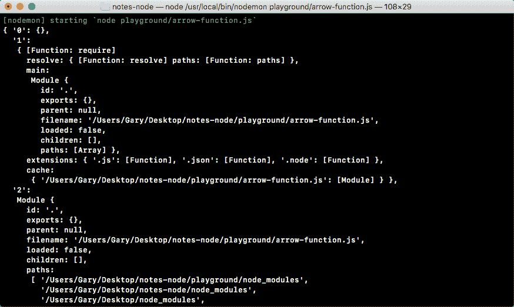

在之前的截图中，我们有像 require 函数、定义、我们的模块对象和一些字符串路径到文件和当前目录的东西。显然这不是我们期望的，这是你在使用箭头函数时必须注意的另一件事；你不会得到`arguments`关键字，你也不会得到你期望的`this`绑定（在`sayHi`语法中定义）。

这些问题主要出现在你尝试在对象上创建方法并使用箭头函数时。在这种情况下，我强烈建议你切换到我们讨论的`sayHiAlt`语法。你会得到一个简化的语法，但你也会得到`this`绑定和你期望的 arguments 变量。

# 总结

在本章中，我们能够重用我们在之前章节中已经创建的实用函数，使填写删除笔记的过程变得更加容易。在`app.js`中，我们处理了`removeNote`函数的执行，如果成功执行，我们打印一条消息；如果没有，我们打印另一条消息。

接下来，我们成功填写了`read`命令，并创建了一个非常酷的实用函数，我们可以在多个地方利用它。这使我们的代码保持干净，并防止我们在应用程序内的多个地方重复相同的代码。

然后我们讨论了一下快速调试的简介。基本上，调试是一个让你可以在任何时间点停止程序并玩弄程序的过程。这意味着你可以玩弄存在的变量、函数或者 Node 内部的任何东西。我们更多地了解了 yargs，它的配置，设置命令，它们的描述和参数。

最后，你更多地探索了箭头函数，它们的工作原理，何时使用它们，何时不使用它们。一般来说，如果你不需要 this 关键字或者 arguments 关键字，你可以毫无问题地使用箭头函数，我总是更喜欢在可以的时候使用箭头函数而不是普通函数。

在下一章中，我们将探讨异步编程以及如何从第三方 API 获取数据。我们将更多地使用普通函数和箭头函数，你将能够第一手看到如何在两者之间进行选择。
