# 第五章：Node.js 中异步编程的基础知识

如果你读过任何关于 Node 的文章，你可能会遇到四个术语：异步、非阻塞、事件驱动和单线程。所有这些都是描述 Node 的准确术语；问题是通常就到此为止，而且这些术语非常抽象。Node.js 中的异步编程主题已经分为三章。在接下来的三章中，我们的目标是通过在我们的天气应用程序中使用所有这些术语，使异步编程变得非常实用。这是我们将在这些章节中构建的项目。

本章节主要讲解异步编程的基础知识。我们将深入了解与异步编程相关的基本概念、术语和技术。我们将学习如何向地理位置 API 发出请求。我们需要进行异步 HTTP 请求。让我们深入了解 Node 中异步编程的基础知识。

具体来说，我们将研究以下主题：

+   异步程序的基本概念

+   调用栈和事件循环

+   回调函数和 API

+   HTTPS 请求

# 异步程序的基本概念

在本节中，我们将创建我们的第一个异步非阻塞程序。这意味着我们的应用程序将在等待其他事件发生时继续运行。在本节中，我们将看一个基本的例子；然而，在本章中，我们将构建一个与第三方 API（如 Google API 和天气 API）通信的天气应用程序。我们需要使用异步代码从这些来源获取数据。

为此，我们只需要在桌面上创建一个新的文件夹。我会进入我的桌面并使用`mkdir`创建一个新目录，我会将其命名为`weather-app`。然后我只需要进入 weather app：

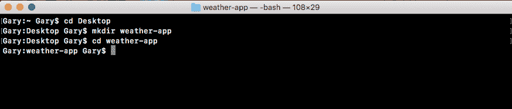

现在，我将使用`clear`命令清除终端输出。

现在，我们可以在 Atom 中打开`weather app`目录：

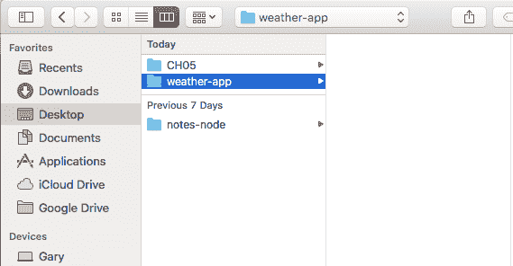

这是我们在整个章节中将使用的目录。在本节中，我们不会立即构建天气应用程序，而是先尝试一下异步特性。所以在`weather-app`中，我们将创建`playground`文件夹。

这段代码不会成为天气应用程序的一部分，但在后面创建天气应用程序时，它将非常有用。现在在`playground`中，我们可以创建这一节的文件。我们将其命名为`async-basics.js`，如下所示：

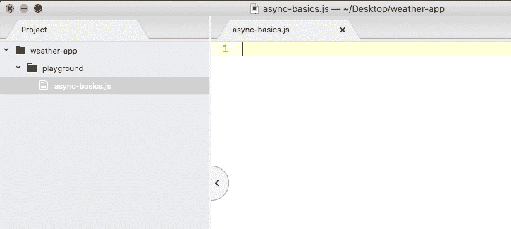

# 说明异步编程模型

为了说明异步编程模型的工作原理，我们将从一个简单的例子开始，使用`console.log`。让我们通过以同步的方式添加一些`console.log`语句来开始。我们将在应用程序的开头创建一个`console.log`语句，显示`Starting app`，然后在结尾添加第二个`console.log`语句，显示`Finishing up`，如下所示：

```js
console.log('Starting app');

console.log('Finishing up');
```

现在这些语句将始终同步运行。无论你运行程序多少次，`Starting app`都会在`Finishing up`之前显示。

为了添加一些异步代码，我们将看一下 Node 提供的一个名为`setTimeout`的函数。`setTimeout`函数是一个很好的方法，可以说明非阻塞编程的基础知识。它接受两个参数：

+   第一个是一个函数。这将被称为回调函数，并且会在一定时间后触发。

+   第二个参数是一个数字，它告诉你想要等待的毫秒数。所以如果你想等待一秒，你需要传入一千毫秒。

让我们调用`setTimeout`，将箭头函数(`=>`)作为第一个参数。这将是回调函数。它将立即触发；也就是说，在超时结束后，两秒后触发。然后我们可以设置我们的第二个参数，即延迟`2000`毫秒，等于这两秒：

```js
console.log('Starting app');

setTimeout(() => {

}, 2000);
```

在箭头函数(`=>`)中，我们将使用`console.log`语句，以便我们可以确定我们的函数何时触发，因为该语句将打印到屏幕上。我们将添加`console.log`，然后在回调函数内完成工作，如下所示：

```js
setTimeout(() => {
  console.log('Inside of callback');
}, 2000);
```

有了这个，我们实际上已经准备好运行我们的第一个异步程序了，我将不使用`nodemon`来执行它。我将使用基本的 Node 命令从终端运行这个文件；`node playground`和`playground`文件夹中的文件`async-basic.js`： 

```js
node playground/async-basics.js
```

现在要特别注意当我们按下回车键时发生了什么。我们会立即看到两条消息显示出来，然后两秒后我们的最终消息`Inside of callback`打印到屏幕上：

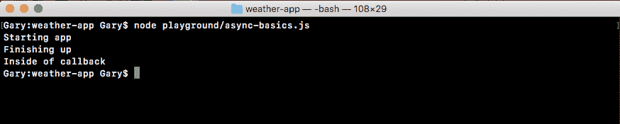

这些消息显示的顺序是：首先我们得到`Starting app`；几乎立即，`Finishing up`打印到屏幕上，最后（两秒后），`Inside of callback`如前面的代码所示。在文件内部，这不是我们编写代码的顺序，但这是代码执行的顺序。

`Starting app`语句按我们的预期打印到屏幕上。接下来，我们调用`setTimeout`，但实际上我们并没有告诉它等待两秒。我们正在注册一个回调，将在两秒后触发。这将是一个异步回调，这意味着在这两秒内 Node 可以做其他事情。在这种情况下，它会继续执行`Finishing up`消息。现在，由于我们使用`setTimeout`注册了这个回调，它将在某个时间点触发，两秒后我们确实看到`Inside of callback`打印到屏幕上。

通过使用非阻塞 I/O，我们能够等待，这种情况下是两秒，而不会阻止程序的其余部分执行。如果这是阻塞 I/O，我们将不得不等待两秒钟才能触发此代码，然后`Finishing up`消息将打印到屏幕上，显然这是不理想的。

现在这是一个相当牵强的例子，我们不会在我们的真实应用程序中使用`setTimeout`来创建不必要的任意延迟，但原则是相同的。例如，当我们从 Google API 获取数据时，我们需要等待大约 100 到 200 毫秒才能收到数据，我们不希望程序的其余部分只是空闲，它将继续执行。我们将注册一个回调，一旦数据从 Google 服务器返回，该回调将被触发。即使实际发生的事情完全不同，但相同的原则也适用。

现在，我们想在这里写另一个`setTimeout`。我们想要注册一个`setTimeout`函数，打印一条消息; 类似`Second setTimeout works`。这将在回调函数内部，我们想要注册一个延迟`0`毫秒，没有延迟。让我们填写 async 基础`setTimeout`。我将使用箭头函数(`=>`)调用`setTimeout`，传入`0`毫秒的延迟，如下面的代码所示。在箭头函数(`=>`)中，我将使用`console.log`，以便我可以看到这个函数何时执行，我将使用`Second setTimeout`作为文本：

```js
setTimeout(() => {
  console.log('Second setTimeout');
}, 0);
```

现在我们已经准备好从终端运行程序了，非常重要的是要注意语句打印的顺序。让我们运行程序：

```js
node playground/async-basics.js
```

立即我们得到三个语句，然后在最后，两秒后，我们得到我们的最终语句：

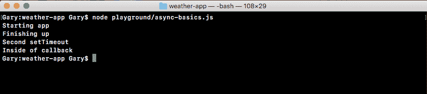

我们从`Starting app`开始，这是有道理的，它在顶部。然后我们得到`Finishing up`。在`Finishing up`之后，我们得到`Second setTimeout`，这似乎很奇怪，因为我们明确告诉 Node 我们希望在`0`毫秒后运行这个函数，这应该立即运行它。但在我们的示例中，`Second setTimeout`在`Finishing up`之后打印出来。

最后，`Inside of callback`打印到屏幕上。这种行为完全是预期的。这正是 Node.js 应该运行的方式，而在下一节中，我们将通过这个例子来详细展示幕后发生了什么。我们将从一个更基本的示例开始，向你展示调用堆栈的工作方式，我们将在下一节中详细讨论这一点，然后我们将继续进行一个更复杂的示例，其中附加了一些异步事件。我们将讨论为什么`Second setTimeout`在`Finishing up`消息之后出现。

# 调用堆栈和事件循环

在上一节中，我们最终创建了我们的第一个异步应用程序，但不幸的是，我们提出了更多问题，而不是得到了答案。尽管我们使用了异步编程，但我们并不确切知道它是如何工作的。我们本节的目标是理解程序运行的方式。

例如，为什么以下代码中的两秒延迟不会阻止应用程序的其余部分运行，为什么`0`秒延迟会导致函数在`Finishing up`打印到屏幕后执行？

```js
console.log('Starting app');

setTimeout(() => {
  console.log('Inside of callback');
}, 2000);

setTimeout(() => {
  console.log('Second setTimeout');
}, 0);

console.log('Finishing up');
```

这些都是我们将在本节中回答的问题。本节将带你深入了解异步程序运行时 V8 和 Node 中发生的事情。现在让我们直接深入了解异步程序的运行方式。我们将从一些基本的同步示例开始，然后继续找出异步程序中究竟发生了什么。

# 同步程序示例

以下是示例一。在左侧是代码，一个基本的同步示例，右侧是发生在幕后的一切，调用堆栈、我们的 Node API、回调队列和事件循环：

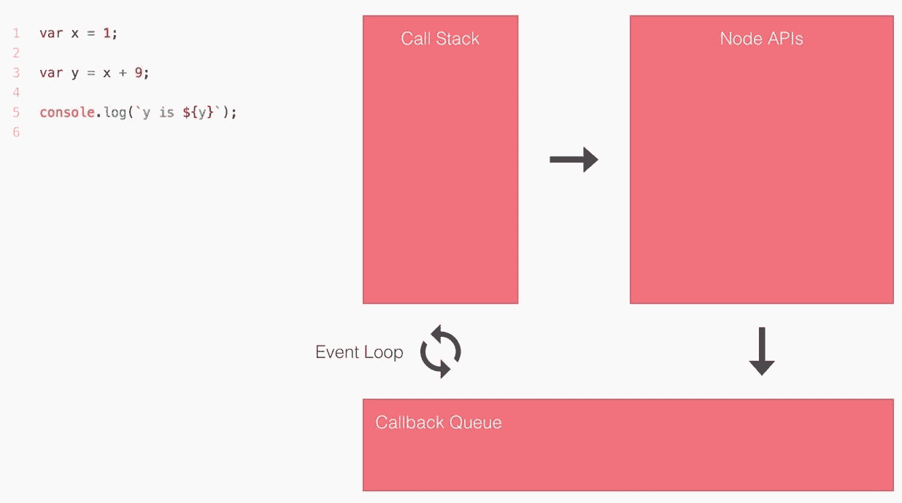

现在，如果你曾经阅读过有关 Node 工作原理的文章或观看过任何视频课程，你很可能听说过这些术语中的一个或多个。在本节中，我们将探讨它们如何共同组成一个真实的、可工作的 Node 应用程序。现在，对于我们的第一个同步示例，我们只需要担心调用堆栈。调用堆栈是 V8 的一部分，对于我们的同步示例，它是唯一要运行的东西。我们不使用任何 Node API，也不进行任何异步编程。

# 调用堆栈

调用堆栈是一个非常简单的数据结构，用于跟踪 V8 内部的程序执行。它跟踪当前正在执行的函数和已触发的语句。调用堆栈是一个非常简单的数据结构，可以做两件事：

+   你可以在顶部添加一些东西

+   你可以移除顶部的项目

这意味着如果数据结构的底部有一个项目，上面有一个项目，你不能移除底部的项目，你必须移除顶部的项目。如果已经有两个项目，你想要添加一个项目，它必须放在上面，因为这就是调用堆栈的工作方式。

想象一下它就像一罐薯片或一罐网球：如果里面已经有一个项目，你再放一个进去，你刚刚放进去的项目不会成为底部项目，它将成为顶部项目。此外，你不能从一罐网球中移除底部的网球，你必须先移除顶部的网球。这正是调用堆栈的工作方式。

# 运行同步程序

现在当我们开始执行下面截图中显示的程序时，首先会发生的事情是 Node 将运行 main 函数。main 函数是我们在 nodemon 中看到的包装函数（参见第二章中的*安装 nodemon 模块*部分，*Node 基础知识第一部分*），当我们通过 Node 运行所有文件时，它会包装在所有文件周围。在这种情况下，通过告诉 V8 运行 main 函数，我们开始了程序。

如下面的截图所示，我们在程序中的第一件事是创建一个变量`x`，将其设置为`1`，这是将要运行的第一个语句：

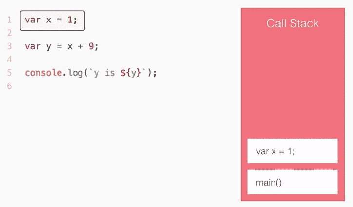

注意它出现在 main 的上面。现在这个语句将运行，创建变量。一旦完成，我们可以将其从调用堆栈中移除，并继续下一个语句，其中我们将变量`y`设置为`x`，`x`是`1`加`9`。这意味着`y`将等于`10`：

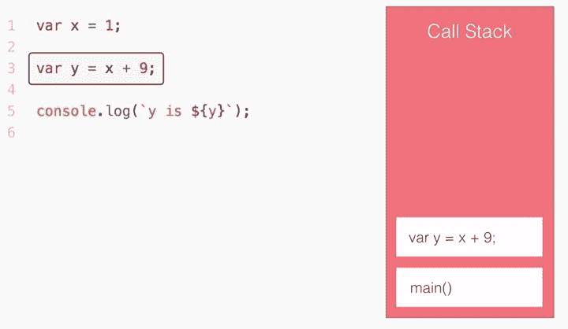

如前面的截图所示，我们这样做并继续下一行。下一行是我们的`console.log`语句。`console.log`语句将在屏幕上打印`y`是`10`。我们使用模板字符串来注入`y`变量：

```js
console.log(`y is ${y}`);
```

当我们运行这行时，它被弹出到调用堆栈上，如下所示：

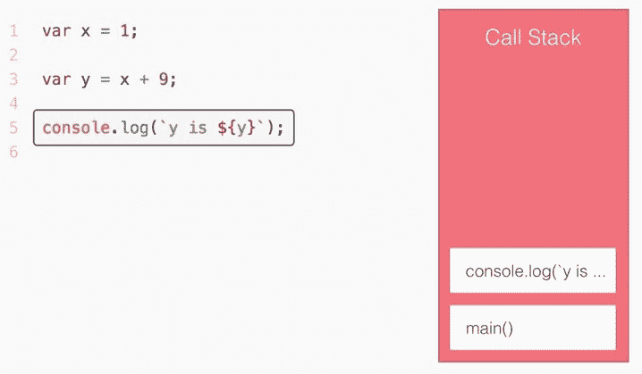

一旦语句完成，它就会被移除。此时，我们已经执行了程序中的所有语句，程序几乎完成了。主函数仍在运行，但由于函数结束，它会隐式返回，当它返回时，我们将 main 从调用堆栈中移除，程序就完成了。此时，我们的 Node 进程已关闭。现在这是使用调用堆栈的一个非常基本的例子。我们进入了 main 函数，然后逐行通过程序。

# 一个复杂的同步程序示例

让我们来看一个稍微复杂一点的例子，我们的第二个例子。如下面的代码所示，我们首先定义一个`add`函数。`add`函数接受参数`a`和`b`，将它们相加并将结果存储在一个名为`total`的变量中，然后返回`total`。接下来，我们将`3`和`8`相加，得到`11`，将其存储在`res`变量中。然后，我们使用`console.log`语句打印出响应，如下所示：

```js
var add = (a, b) => {
 var total = a + b;

 return total;
};

var res = add(3, 8);

console.log(res);
```

就是这样，没有发生任何同步的事情。再次强调，我们只需要调用堆栈。发生的第一件事是我们执行 main 函数；这启动了我们这里的程序：

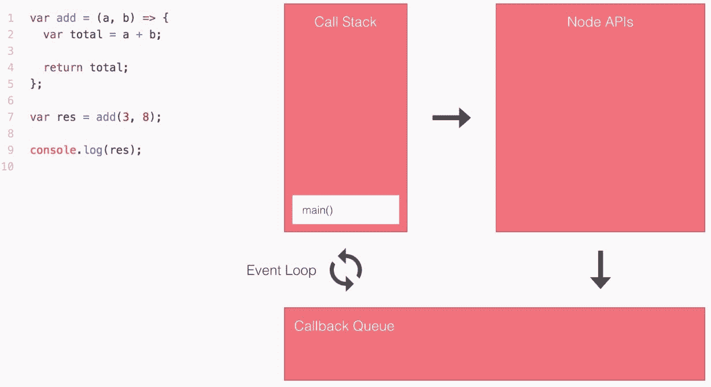

然后我们运行第一个语句，其中我们定义`add`变量。我们实际上并没有执行函数，我们只是在这里定义它：

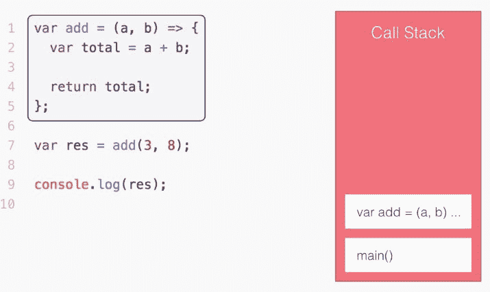

在前面的图像中，`add()`变量被添加到调用堆栈上，并且我们定义了`add`。下一行，第 7 行，是我们调用`add`变量，将返回值存储在 response 变量中：

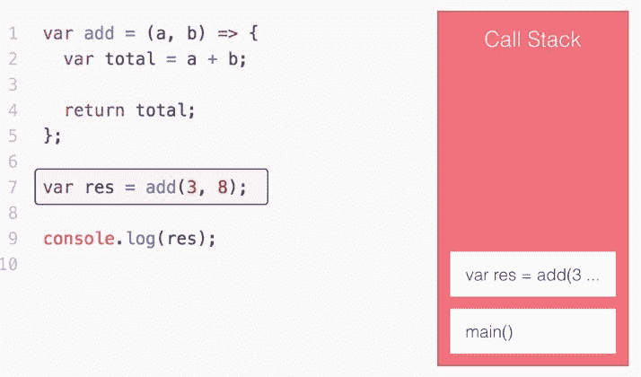

当你调用一个函数时，它会被添加到调用堆栈的顶部。当你从一个函数返回时，它会从调用堆栈中移除。

在这个例子中，我们将调用一个函数。所以我们将`add()`添加到调用堆栈上，并开始执行该函数：

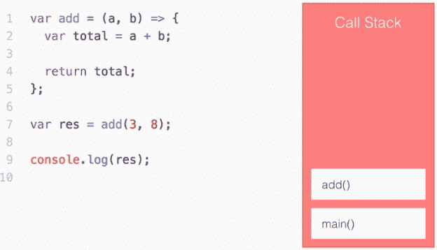

正如我们所知，当我们添加 main 时，我们开始执行 main，当我们添加`add()`时，我们开始执行 add。`add`内的第一行将`total`变量设置为`a + b`，即`11`。然后我们使用`return total`语句从函数中返回。这是下一个语句，当这个语句运行时，`add`被移除：

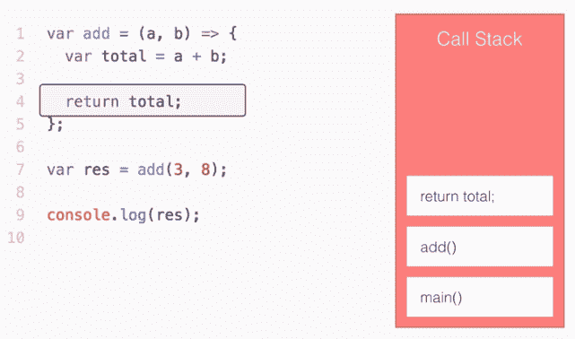

因此，当`return total`完成时，`add()`被移除，然后我们继续执行程序中的最后一行，我们的`console.log`语句，其中我们将`11`打印到屏幕上：

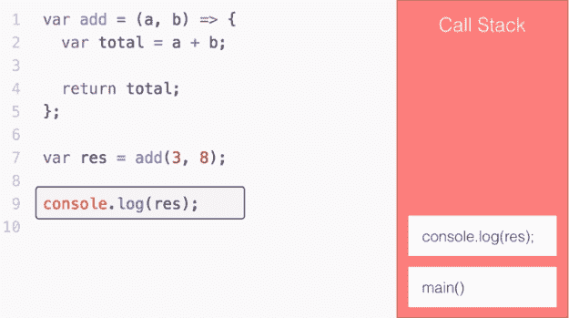

`console.log`语句将运行，将`11`打印到屏幕上并完成执行，现在我们已经到达主函数的末尾，在隐式返回时从调用栈中移除。这是程序通过 V8 调用栈运行的第二个示例。

# 异步程序示例

到目前为止，我们还没有使用 Node APIs、回调队列或事件循环。下一个示例将使用所有四个（调用栈、Node APIs、回调队列和事件循环）。如下面截图左侧所示，我们有一个异步示例，与上一节中写的完全相同：

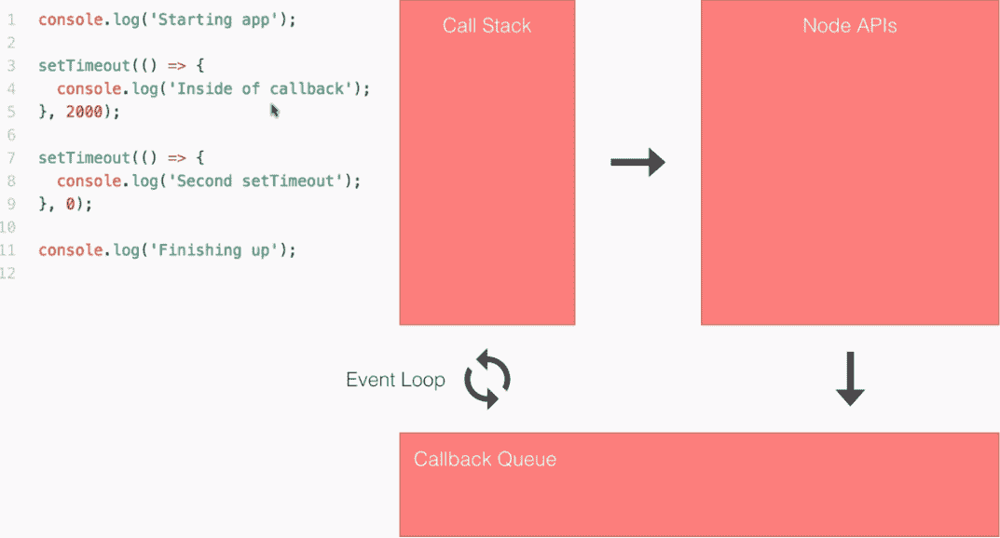

在这个示例中，我们将使用调用栈、Node APIs、回调队列和事件循环。所有这四个都将在我们的异步程序中发挥作用。现在事情将开始如你所期望的那样。首先发生的是我们将主函数添加到调用栈中运行。这告诉 V8 启动我们在上一截图左侧的代码，再次显示如下：

```js
console.log('Starting app');

setTimeout(() => {
  console.log('Inside of callback');
}, 2000);

setTimeout(() => {
  console.log('Second setTimeout');
}, 0);

console.log('Finishing up');
```

这段代码中的第一个语句非常简单，是一个`console.log`语句，将`Starting app`打印到屏幕上：

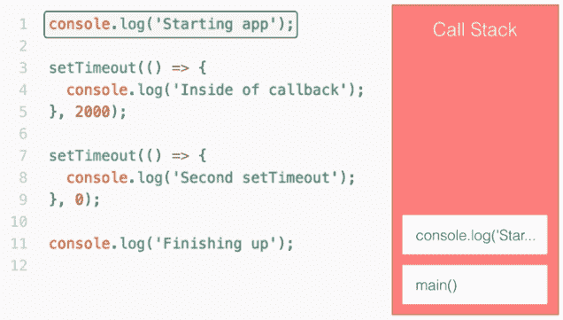

这个语句会立即运行，然后我们继续执行第二个语句。第二个语句是开始变得有趣的地方，这是对`setTimeout`的调用，它确实是一个 Node API。它在 V8 内部不可用，这是 Node 给我们提供的：

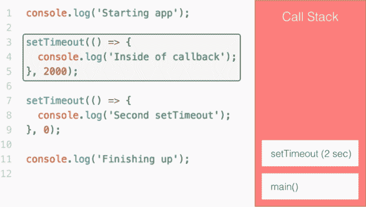

# 异步编程中的 Node API

当我们调用`setTimeout (2 sec)`函数时，实际上是在 Node APIs 中注册事件回调对。事件就是等待两秒，回调函数是我们提供的函数，也就是第一个参数。当我们调用`setTimeout`时，它会像下面这样在 Node APIs 中注册：

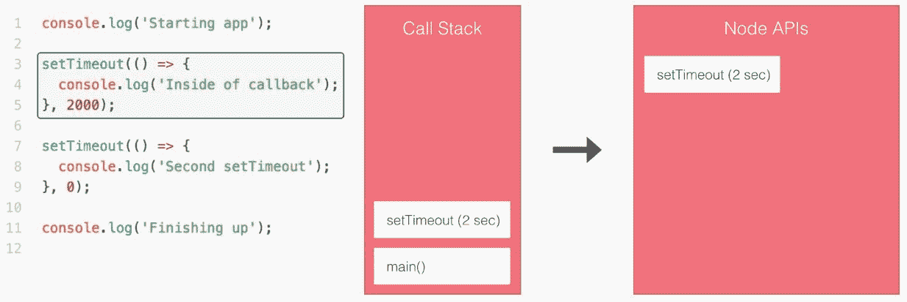

现在这个语句将结束，调用栈将继续执行，`setTimeout`将开始倒计时。`setTimeout`正在倒计时，并不意味着调用栈不能继续执行它的工作。调用栈一次只能运行一件事情，但即使调用栈在执行，我们也可以有事件等待处理。现在运行的下一个语句是另一个对`setTimeout`的调用：

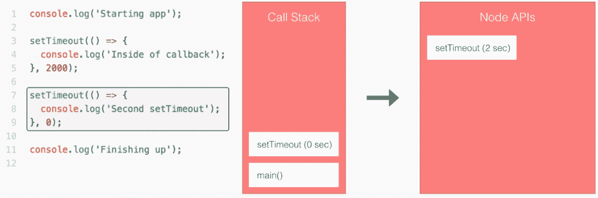

在这里，我们注册了一个延迟为`0`毫秒的`setTimeout`回调函数，发生了完全相同的事情。这是一个 Node API，将如下截图所示注册：

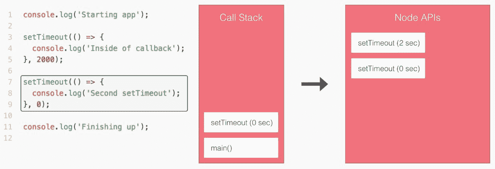

`setTimeout (0 sec)`语句被注册，调用栈移除该语句。

# 异步编程中的回调队列

在这一点上，让我们假设`setTimeout`，那个零秒延迟的函数，已经完成。当它完成时，它不会立即被执行；它会把回调函数移动到回调队列中，如下所示：

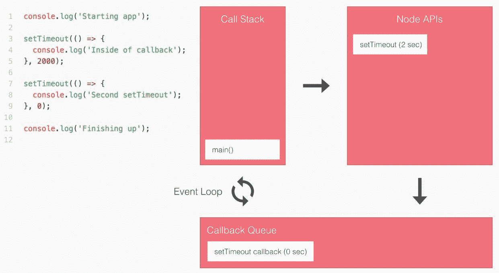

回调队列是所有准备好被触发的回调函数。在前面的截图中，我们将函数从 Node API 移动到回调队列中。现在回调队列是我们的回调函数将等待的地方；它们需要等待调用栈为空。

当调用栈为空时，我们可以运行第一个函数。在它之后还有另一个函数。在第一个函数运行之前，我们必须等待第二个函数运行，这就是事件循环发挥作用的地方。

# 事件循环

事件循环查看调用堆栈。如果调用堆栈不为空，则不执行任何操作，因为它无法执行任何操作，一次只能运行一件事。如果调用堆栈为空，事件循环会说好的，让我们看看是否有任何要运行的东西。在我们的情况下，有一个回调函数，但是因为我们没有空的调用堆栈，事件循环无法运行它。所以让我们继续示例。

# 运行异步代码

我们程序中的下一件事是运行我们的`console.log`语句，将`Finishing up`打印到屏幕上。这是在终端中显示的第二条消息：

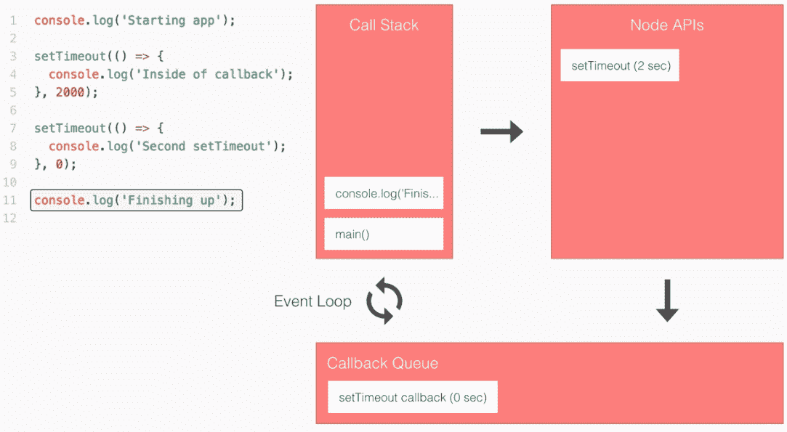

这个语句运行，我们的主函数完成，并从调用堆栈中移除。

此时，事件循环说，嘿，我看到我们的调用堆栈中没有任何内容，而回调队列中有内容，所以让我们运行那个回调函数。它将获取回调并将其移动到调用堆栈中；这意味着函数正在执行：

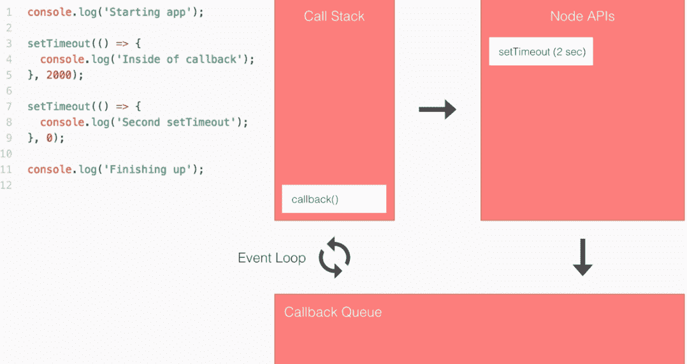

它将运行第一行，该行位于第`8`行，`console.log`，将`Second setTimeout`打印到屏幕上。这就是为什么在我们之前的部分示例中，`Second setTimeout`在`Finishing up`之后出现的原因，因为在调用堆栈完成之前，我们无法运行回调。由于`Finishing up`是主函数的一部分，它将始终在`Second setTimeout`之前运行。

在我们的`Second setTimeout`语句完成后，函数将隐式返回，并且回调将从调用堆栈中移除：

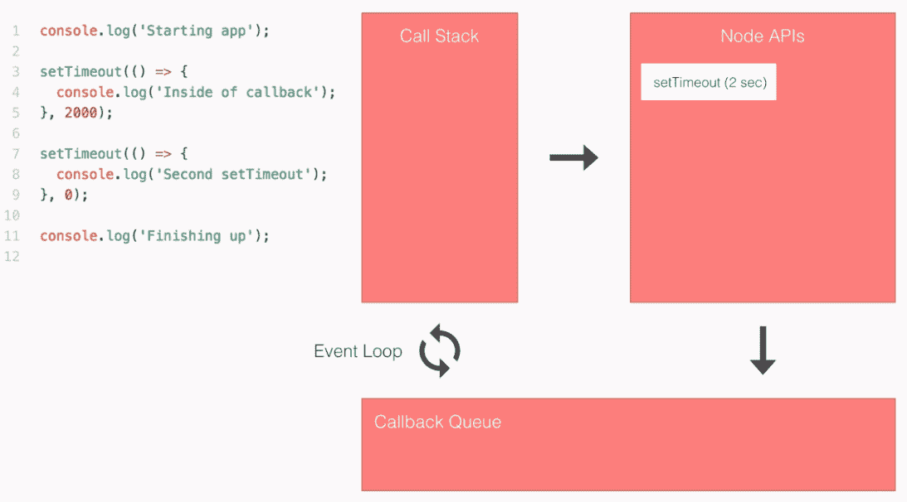

此时，调用堆栈中没有任何内容，回调队列中也没有任何内容，但是我们的 Node API 中仍然有内容，我们仍然注册了一个事件监听器。因此，Node 进程尚未完成。两秒后，`setTimeout(2 sec)`事件将触发，并将回调函数移动到回调队列中。它将从 Node API 中移除，并添加到回调队列中：

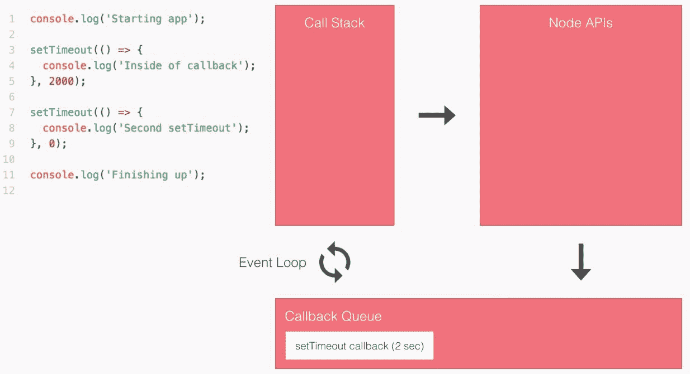

此时，事件循环将查看调用堆栈，并看到它是空的。然后它会快速查看回调队列，并确实有要运行的内容。它会怎么做？它将获取该回调，将其添加到调用堆栈中，并开始执行该过程。这意味着我们将运行回调中的一个语句。完成后，回调函数将隐式返回，程序完成：

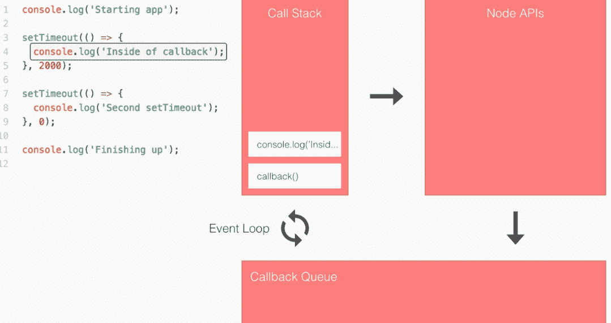

这正是我们的程序运行的方式。这说明了我们如何能够使用 Node API 注册我们的事件，以及为什么当我们使用`setTimeout`为零时，代码不会立即运行。它需要通过 Node API 和回调队列才能在调用堆栈上执行。

现在，正如我在本节开头提到的，调用堆栈、Node API、回调队列和事件循环是非常令人困惑的话题。它们令人困惑的一个重要原因是因为我们实际上从未直接与它们交互；它们是在幕后发生的。我们没有调用回调队列，我们没有触发事件循环方法来使这些事情工作。这意味着在有人解释之前，我们不知道它们的存在。这些是非常难以理解的话题。通过编写真正的异步代码，它将变得更加清晰。

现在我们对代码在幕后执行的一些想法，我们将继续本章的其余部分，并开始创建一个与第三方 API 交互的天气应用程序。

# 回调函数和 API

在本节中，我们将深入研究回调函数，并使用它们从 Google 地理位置 API 中获取一些数据。这将是一个接受地址并返回纬度和经度坐标的 API，这对于天气应用来说非常重要。这是因为我们使用的天气 API 需要这些坐标，并返回实时天气数据，如温度、五天预报、风速、湿度和其他天气信息。

# 回调函数

在我们开始进行 HTTPS 请求之前，让我们谈谈回调函数，我们已经使用过它们。参考以下代码（我们在上一节中使用过）：

```js
console.log('Starting app');

setTimeout(() => {
  console.log('Inside of callback');
}, 2000);

setTimeout(() => {
  console.log('Second setTimeout');
}, 0);

console.log('Finishing up');
```

在`setTimeout`函数内部，我们使用了一个`callback`函数。一般来说，`callback`函数被定义为作为参数传递给另一个函数并在某些事件发生后执行的函数。现在这是一个一般性的定义，在 JavaScript 中没有严格的定义，但在这种情况下它确实满足函数的要求：

```js
setTimeout(() => {
  console.log('Inside of callback');
}, 2000);
```

在这里，我们有一个函数，并将其作为参数传递给另一个函数，`setTimeout`，并在某个事件——两秒后执行。现在事件可能是其他事情，它可能是数据库查询完成，它可能是 HTTP 请求返回。在这些情况下，你将需要一个回调函数，就像我们的情况一样，对数据进行一些操作。在`setTimeout`的情况下，我们不会得到任何数据，因为我们没有请求任何数据；我们只是创建了一个任意的延迟。

# 创建回调函数

现在在我们实际向 Google 发出 HTTP 请求之前，让我们在`playground`文件夹中创建一个回调函数示例。让我们创建一个名为`callbacks.js`的新文件：

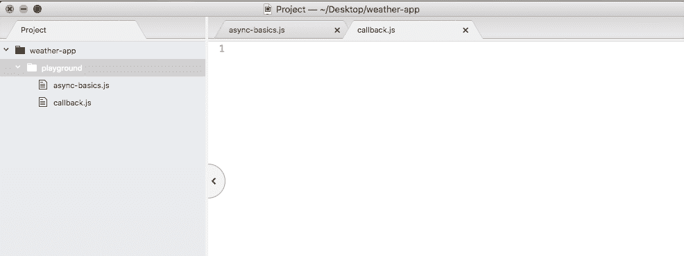

在文件内，我们将创建一个虚构的示例，展示回调函数在幕后的样子。我们将在整本书中创建真实的示例，并使用许多需要回调的函数。但在本章中，我们将从一个简单的示例开始。

让我们开始，让我们创建一个名为`getUser`的变量。这将是我们定义的函数，当我们将回调传递给另一个函数时，它将向我们展示幕后发生的事情。`getUser`回调将是一些模拟从数据库或某种 Web API 中获取用户的样子。它将是一个函数，所以我们将使用箭头函数（`=>`）来设置它：

```js
var getUser = () => {

};
```

箭头函数（`=>`）将接受一些参数。它将接受的第一个参数是`id`，它将是一个代表每个用户的唯一数字。我可能有一个`id`是`54`，你可能有一个`id`是`2000`；无论如何，我们都需要`id`来找到一个用户。接下来我们将得到一个回调函数，这是我们稍后将用数据调用的函数，用那个用户对象：

```js
var getUser = (id, callback) => {

};
```

这正是当你将一个函数传递给`setTimeout`时发生的情况。

`setTimeout`函数的定义如下：

`var getUser = (callback, delay) => {`

`};`

它有一个回调和一个延迟。你拿到回调，然后在一定的时间后调用它。在我们的情况下，我们将交换顺序，先是`id`，然后是回调。

现在我们可以在实际填写之前调用这个函数。我们将调用`getUser`，就像我们在上一个代码示例中使用`setTimeout`一样。我将调用`getUser`，传入这两个参数。第一个将是一些`id`；因为我们现在是假的，所以并不重要，我会选择`31`。第二个参数将是当用户数据返回时我们想要运行的函数，这一点非常重要。如下所示，我们将定义该函数：

```js
getUser(31, () => {

});
```

现在单独的回调并不是真正有用的；只有在我们实际获取用户数据后才能运行这个函数，这就是我们在这里期望的：

```js
getUser(31, (user) => {

});
```

我们期望`user`对象，诸如`id`、`name`、`email`、`password`等，作为回调函数的参数返回。然后在箭头函数(`=>`)中，我们实际上可以对这些数据做一些操作，例如，在 Web 应用程序中显示它，响应 API 请求，或者在我们的情况下，我们可以简单地将其打印到控制台上，`console.log(user)`：

```js
getUser(31, (user) => {
  console.log(user);
});
```

现在我们已经调用了，让我们填写`getUser`函数，使其像我们定义的那样工作。

我要做的第一件事是创建一个虚拟对象，它将成为`user`对象。将来，这将来自数据库查询，但现在我们将创建一个名为`user`的变量，并将其设置为某个对象：

```js
var getUser = (id, callback) => {
  var user = {

  }
};
```

让我们将`id`属性设置为用户传入的`id`，并将`name`属性设置为某个名称。我会使用`Vikram`：

```js
var getUser = (id, callback) => {
  var user = {
    id: id,
    name: 'Vikram'
  };
};
```

现在我们有了`user`对象，我们想要做的是调用回调，将其作为参数传递。然后我们将能够实际运行`getUser(31, (user)`函数，将`user`打印到屏幕上。为了做到这一点，我们将像调用任何其他函数一样调用回调函数，只需通过名称引用它并添加括号，就像这样：

```js
var getUser = (id, callback) => {
  var user = {
    id: id,
    name: 'Vikram'
  };
  callback();
};
```

现在，如果我们这样调用函数，我们不会从`getUser`传递任何数据回到回调函数。在这种情况下，我们期望传回一个`user`，这就是为什么我们要像这样指定`user`：

```js
callback(user);
```

现在命名并不重要，我碰巧称之为`user`，但我可以很容易地称之为`userObject`和`userObject`如下所示：

```js
callback(user);
};

getUser(31, (userObject) => {
  console.log(userObject);
});
```

重要的是参数的位置。在这种情况下，我们将第一个参数称为`userObject`，并且第一个参数传回的确实是`userObject`。有了这个，我们现在可以运行我们的例子。

# 运行回调函数

在终端中，我们将使用`node`运行回调函数，它在`playground`文件夹中，我们调用文件`callbacks.js`：

```js
node playground/callback.js
```

当我们运行文件时，我们的数据立即打印到屏幕上：

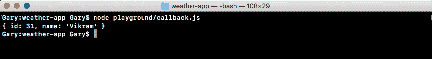

我们使用同步编程创建了一个回调函数。现在正如我提到的，这仍然是一个人为的例子，因为在这种情况下不需要回调。我们可以简单地返回用户对象，但在这种情况下，我们不会使用回调，这里的重点是探索幕后发生的事情以及我们如何实际调用作为参数传入的函数。

# 使用`setTimeout`模拟延迟

现在，我们还可以使用`setTimeout`来模拟延迟，所以让我们这样做。在我们的代码中，在`callback (user)`语句之前，我们将像在上一节中一样使用`setTimeout`。我们将传入一个箭头函数(`=>`)作为第一个参数，并使用`3000`毫秒设置 3 秒的延迟：

```js
  setTimeout(() => {

  }, 3000);
  callback(user);
};
```

现在我可以取出我的回调调用，从第 10 行删除它，并将其添加到回调函数中，如下所示：

```js
setTimeout(() => {
    callback(user);
  }, 3000);
};
```

现在在三秒钟后，我们将不会响应`getUser`请求。现在这将更多或多少类似于我们创建回调的真实例子时发生的情况，我们传入一个回调，无论是从数据库请求还是从 HTTP 端点请求，都会发生某种延迟，然后回调被触发。

如果我保存`callbacks.js`并从终端重新运行代码，你会看到我们等待了三秒钟，这是模拟的延迟，然后`user`对象打印到屏幕上：

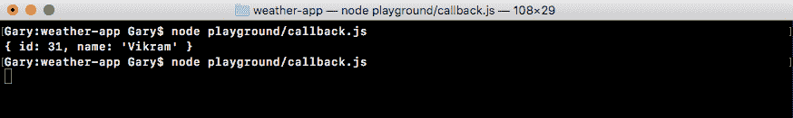

这正是我们需要理解的原则，以便开始使用回调，并且这正是我们将在本节中开始做的事情。

# 向地理位置 API 发出请求

我们将要向 Geolocation API 发出的请求实际上可以在浏览器中模拟，然后再在 Node 中发出请求，这正是我们想要做的。所以跟着 URL 一起进行，[`maps.googleapis.com/maps/api/geocode/json`](https://maps.googleapis.com/maps/api/geocode/json)。

现在这是实际的终端 URL，但是我们必须指定我们想要地理编码的地址。我们将使用查询字符串来做到这一点，这将在问号后面提供。然后，我们可以设置一组键值对，并且可以使用 URL 中的和号添加多个，例如：[`maps.googleapis.com/maps/api/geocode/json?key=value&keytwo=valuetwo`](https://maps.googleapis.com/maps/api/geocode/json?key=value&keytwo=valuetwo)。

在我们的案例中，我们只需要一个查询字符串地址，[`maps.googleapis.com/maps/api/geocode/json?address`](https://maps.googleapis.com/maps/api/geocode/json?address)，对于地址查询字符串，我们将把它设置为一个地址。为了填写查询地址，我将开始输入`1301 lombard street philadelphia`。

请注意，我们在 URL 中使用了空格。这只是为了说明一个观点：我们可以在浏览器中使用空格，因为它会自动将这些空格转换为其他内容。然而，在 Node 中，我们将不得不自己处理这个问题，我们稍后会在本节中讨论这个问题。现在，如果我们保留这些空格，按下回车键，我们可以看到它们自动为我们转换：


空格字符被转换为`%20`，这是空格的编码版本。在这个页面上，我们有所有返回的数据：

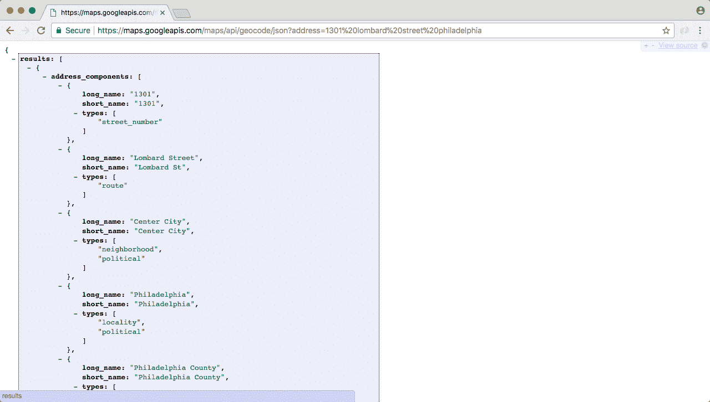

现在我们将使用一个名为 JSONView 的扩展，它适用于 Chrome 和 Firefox。

我强烈建议安装 JSONView，因为我们应该看到我们的 JSON 数据的更好版本。它让我们可以最小化和展开各种属性，并且使得导航变得非常容易。

如前面的屏幕截图所示，这个页面上的数据正是我们需要的。我们有一个 address_components 属性，我们不需要它。接下来，我们有一个格式化的地址，这真的很好，它包括了州、邮政编码和国家，这些我们甚至没有在地址查询中提供。

然后，我们得到了我们真正想要的东西：在几何学中，我们有位置，这包括纬度和经度数据。

# 在我们的代码中使用 Google Maps API 数据

现在，我们从 Google Maps API 请求中得到的只是一些 JSON 数据，这意味着我们可以将这些 JSON 数据转换为 JavaScript 对象，并在我们的代码中开始访问这些属性。为了做到这一点，我们将使用一个第三方模块，让我们在我们的应用程序中进行这些 HTTP 请求；这个模块叫做请求。

我们可以通过访问[`www.npmjs.com/package/request`](https://www.npmjs.com/package/request)来访问它。当我们访问这个页面时，我们将看到所有的文档和我们可以使用请求软件包进行 HTTP 请求的所有不同方式。不过，现在我们将坚持一些基本的例子。在请求文档页面的右侧，我们可以看到这是一个非常受欢迎的软件包，在过去的一天里有七十万次下载：

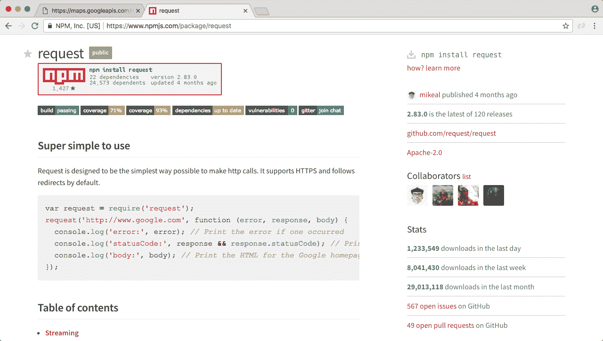

为了开始，我们将在我们的项目中安装该软件包，并向该 URL 发出请求。

# 安装请求软件包

要安装该软件包，我们将转到终端并使用`npm init`来安装模块，以创建`package.json`文件：

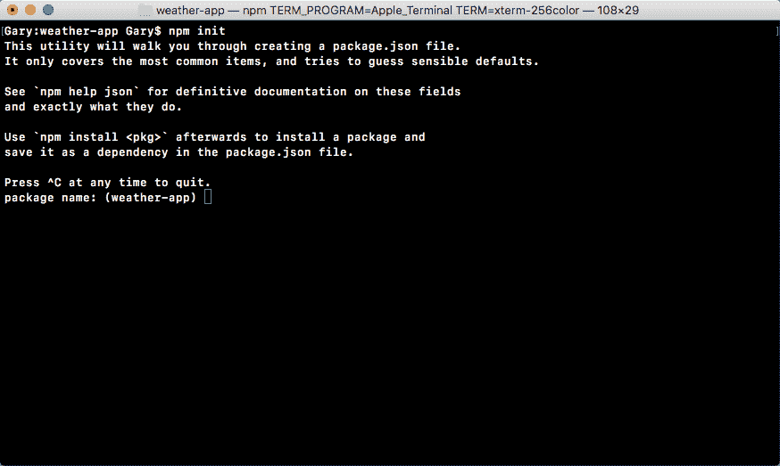

我们将运行这个命令，并使用回车键使用每个选项的默认值：

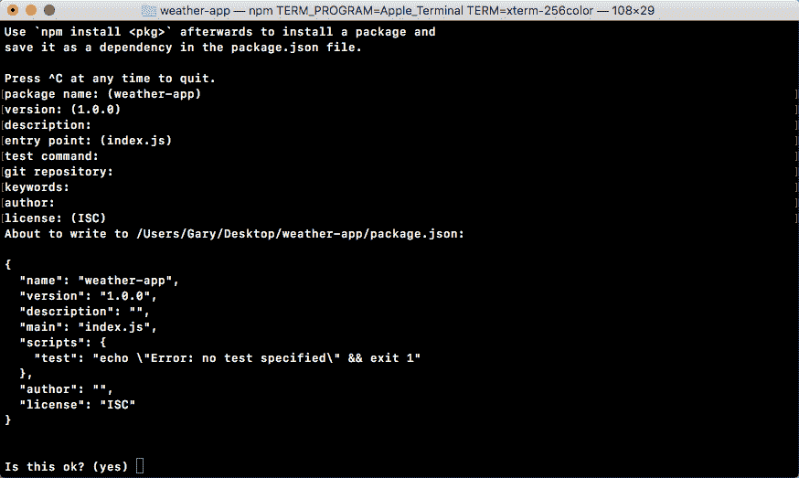

最后，我们将输入`yes`并再次按下回车键。

现在我们有了`package.json`文件，我们可以使用`npm install`，然后是模块名称，request，我会指定一个版本。您可以在 npm 页面上找到模块的最新版本。撰写时的最新版本是`2.73.0`，所以我们将添加`@2.73.0`。然后我们可以指定保存标志，因为我们确实希望将此模块保存在我们的`package.json`文件中：

```js
npm install request@2.73.0 --save
```

这对于运行天气应用程序至关重要。

# 将请求用作函数

现在我们已经安装了请求模块，我们可以开始使用它。在 Atom 中，我们将通过在项目的根目录中创建一个名为`app.js`的新文件，向该 URL 发出请求，来结束本节。这将是天气应用程序的起点。天气应用程序将是我们创建的最后一个命令行应用程序。将来，我们将为 Web 应用程序以及使用 Socket.IO 创建实时应用程序的后端。但是为了说明异步编程，命令行应用程序是最好的方式。

现在，我们有了我们的应用文件，我们可以开始加载`request`，就像我们加载其他 npm 模块一样。我们将创建一个常量变量，称之为`request`，并将其设置为`require(request)`，如下所示：

```js
const request = require('request');
```

现在我们需要做的是发出一个`request`。为了做到这一点，我们将不得不调用`request`函数。让我们调用它，这个函数需要两个参数：

+   第一个参数将是一个选项对象，我们可以在其中配置各种信息

+   第二个将是一个回调函数，一旦数据从 HTTP 端点返回，就会被调用

```js
request({}, () => {

});
```

在我们的情况下，一旦 JSON 数据，即来自 Google Maps API 的数据，返回到 Node 应用程序中，它就会被调用。我们可以添加从`request`返回的参数。现在，这些是在`request`文档中概述的参数，我并没有为这些参数编写名称：

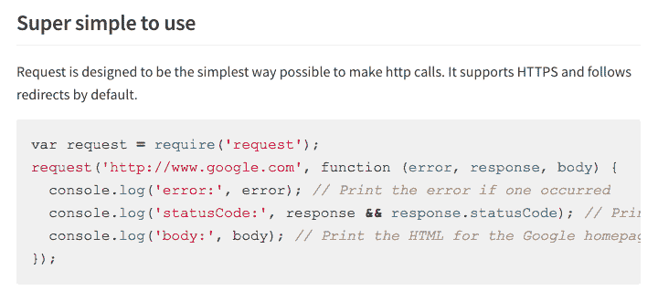

在文档中，您可以看到他们称之为**error**，**response**和**body**。这正是我们将要调用的。因此，在 Atom 中，我们可以添加`error`，`response`和`body`，就像文档中一样。

现在我们可以填写选项对象，这是我们将要指定的与我们的`request`相关的唯一事物。在这种情况下，其中一个唯一的事物是 URL。URL 准确地指定了您要请求的内容，在我们的情况下，我们在浏览器中有这个。让我们粘贴 URL，就像它出现的那样，将其粘贴到 URL 属性的字符串中：

```js
request({
  url: 'https://maps.googleapis.com/maps/api/geocode/json?address=1301%20lombard%20street%20philadelphia',
}, (error, response, body) => {

});
```

现在我们已经有了 URL 属性，我们可以在最后加上一个逗号，然后按下回车键。因为我们将指定另一个属性，我们将把`json`设置为`true`：

```js
request({
  url: 'https://maps.googleapis.com/maps/api/geocode/json?address=1301%20lombard%20street%20philadelphia',
  json: true
}, (error, response, body) => {

});
```

这告诉`request`返回的数据将是 JSON 数据，它应该继续，获取 JSON 字符串，并将其转换为对象。这让我们跳过了一步，这是一个非常有用的选项。

有了这个，我们现在可以在回调中做一些事情。将来，我们将使用这个经度和纬度来获取天气。现在，我们将简单地通过使用`console.log`将`body`打印到屏幕上。我们将把`body`参数传递给`console.log`，如下所示：

```js
request({
  url: 'https://maps.googleapis.com/maps/api/geocode/json?address=1301%20lombard%20street%20philadelphia',
  json: true
}, (error, response, body) => {
  console.log(body);
});
```

现在我们已经设置了我们的第一个 HTTP 请求，并且有一个回调函数，当数据返回时将会触发，我们可以从终端运行它。

# 运行请求

要运行请求，我们将使用`node`并运行`app.js`文件：

```js
node app.js
```

当我们这样做时，文件将开始执行，并且在数据打印到屏幕之前会有一个非常短的延迟：

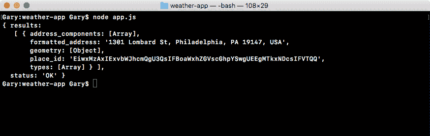

我们得到的正是我们在浏览器中看到的。一些属性，比如`address_components`，在这种情况下显示为对象，因为我们将其打印到屏幕上。但这些属性确实存在；我们将在本章后面讨论如何获取它们。不过，我们现在有我们的`formatted_address`，如前面的屏幕截图所示，`geometry`对象，`place_id`和`types`。这是我们将用来获取经度和纬度，并稍后获取天气数据的内容。

现在我们已经完成了这一步。我们已经向 Google 地理位置 API 发出了请求，并且正在收到数据。我们将在下一节继续创建天气应用程序。

# 漂亮地打印对象

在我们继续学习 HTTP 和`error`、`response`和`body`中确切的内容之前，让我们花一点时间来谈谈如何漂亮地打印一个对象到屏幕上。正如我们在上一小节中看到的，当我们用`node app.js`运行我们的应用程序时，body 会打印到屏幕上。

但由于有很多嵌套在一起的对象，JavaScript 开始裁剪它们：

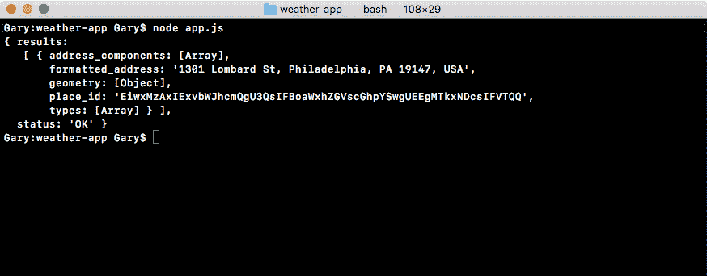

如前面的屏幕截图所示，它告诉我们一个对象在`results`中，但我们无法看到确切的属性是什么。这发生在`address_components`、`geometry`和`types`中。显然这是没有用的；我们想要做的是确切地看到对象中的内容。

# 使用 body 参数

为了探索所有属性，我们将看一种漂亮地打印我们的对象的方法。这将需要一个非常简单的函数调用，一个我们实际上已经使用过的函数，`JSON.stringify`。这是一个将你的 JavaScript 对象（`body`）转换为字符串的函数，记住我们使用`json: true`语句告诉`request`将 JSON 转换为对象。在`console.log`语句中，我们将取得该对象，传入`body`，并提供如下参数：

```js
const request = require('request');

request({
  url: 'https://maps.googleapis.com/maps/api/geocode/json?address=1301%20lombard%20street%20philadelphia',
  json: true
}, (error, response, body) => {
  console.log(JSON.stringify(body));
});
```

现在，这就是我们通常使用`JSON.stringify`的方式，在过去我们只提供了一个参数，即我们想要`stringify`的对象，在这种情况下，我们将提供另外一些参数。下一个参数用于过滤属性。我们不想使用它，通常是无用的，所以我们暂时将其留空：

```js
console.log(JSON.stringify(body, undefined));
```

我们需要提供它的原因是，第三个参数是我们想要的东西。第三个参数将格式化 JSON，并且我们将指定每个缩进使用多少空格。我们可以选择`2`或`4`，取决于你的偏好。在这种情况下，我们将选择`2`：

```js
console.log(JSON.stringify(body, undefined, 2));
```

我们将保存文件并从终端重新运行它。当我们`stringify`我们的 JSON 并将其打印到屏幕上时，当我们重新运行应用程序时，我们将看到整个对象显示出来。没有任何属性被裁剪，无论它有多复杂，我们都可以看到整个`address_components`数组，所有内容都显示出来：

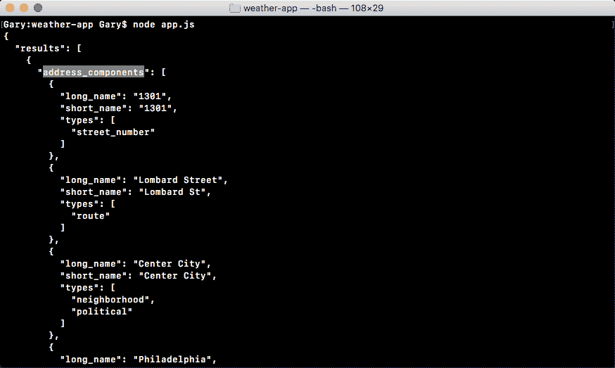

接下来，我们有我们的几何对象，这是我们的纬度和经度存储的地方，你可以在这里看到它们的显示：

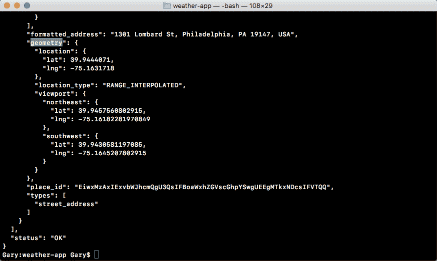

然后在下面，我们有我们的`types`，之前被截断了，尽管它是一个包含一个字符串的数组：

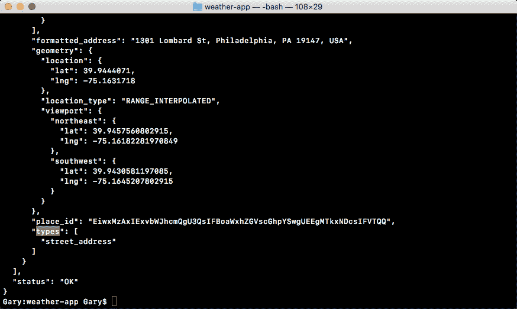

现在我们知道如何漂亮地打印我们的对象，扫描控制台内部的数据将会更容易——我们的属性不会被裁剪，它的格式使得数据更易读。在下一节中，我们将开始深入研究 HTTP 和回调中的所有参数。

# 组成 HTTPS 请求

在前一节中，我们的目标不是理解 HTTP 的工作原理，或者确切的参数`error`、`response`和`body`的含义，目标是提供一个回调的真实示例，而不是我们迄今为止使用`setTimeout`的人为示例：

```js
const request = require('request');

request({
 url: 'https://maps.googleapis.com/maps/api/geocode/json?address=1301%20lombard%20street%20philadelphia',
 json: true
}, (error, response, body) => {
 console.log(JSON.stringify(body, undefined, 2));
});
```

在前面的案例中，我们有一个真正的回调，一旦 HTTP 请求从谷歌服务器返回，就会被触发。我们能够打印`body`，并且我们看到了网站上的确切内容。在本节中，我们将深入研究这些参数，让我们首先来看一下`body`参数。这是`request`传递给回调函数的第三个参数。

现在，`body`不是`request`模块的独有内容（`body`是 HTTP 的一部分，代表**超文本传输协议**）。当您向网站发出请求时，返回的数据就是请求的`body`。我们实际上在生活中已经无数次使用了`body`。每当我们在浏览器中请求 URL 时，屏幕上呈现的内容就是`body`。

在[`www.npmjs.com`](https://www.npmjs.com)的情况下，返回的`body`是浏览器知道如何渲染的 HTML 网页。`body`也可以是一些 JSON 信息，这是我们谷歌 API 请求的情况。无论哪种情况，`body`都是从服务器返回的核心数据。在我们的情况下，`body`存储了我们需要的所有位置信息，我们将使用这些信息来提取本节中的格式化地址、纬度和经度。

# 响应对象

在我们深入讨论`body`之前，让我们先讨论一下`response`对象。我们可以通过将其打印到屏幕上来查看`response`对象。让我们在代码中将`console.log`语句中的`body`替换为`response`：

```js
const request = require('request');
request({
  url: 'https://maps.googleapis.com/maps/api/geocode/json?address=1301%20lombard%20street%20philadelphia',
  json: true
}, (error, response, body) => {
  console.log(JSON.stringify(response, undefined, 2));
});
```

然后保存文件，并通过运行`node app.js`命令在终端内重新运行。我们将等待请求返回时出现一点延迟，然后我们会得到一个非常复杂的对象：

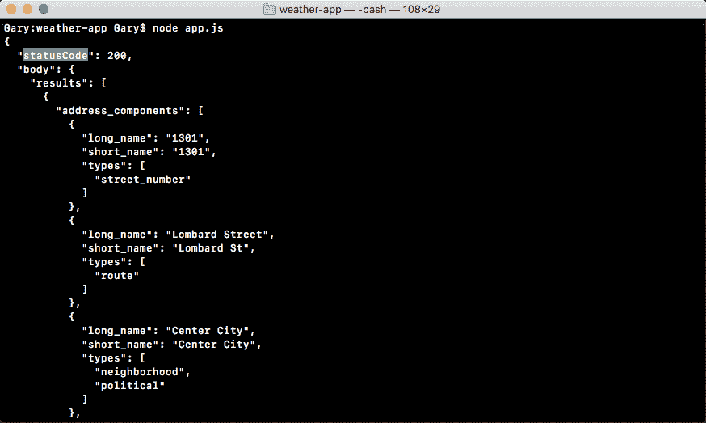

在前面的截图中，我们可以看到`response`对象中的第一件事是状态码。状态码是从 HTTP 请求返回的东西；它是响应的一部分，告诉您请求的情况如何。

在这种情况下，`200`表示一切都很顺利，你可能熟悉一些状态码，比如 404 表示页面未找到，或者 500 表示服务器崩溃。在本书中，我们将使用其他的 body 代码。

我们将创建自己的 HTTP API，因此您将熟悉如何设置和使用状态码。

在本节中，我们只关心状态码是`200`，这表示事情进行得很顺利。在`response`对象中，接下来我们实际上有`body`重复，因为它是`response`的一部分。由于它是从服务器返回的最有用的信息，请求模块的开发人员选择将其作为第三个参数，尽管你可以像在这种情况下清楚地看到的那样，使用`response.body`来访问它。在这里，我们已经查看了所有的信息，地址组件、格式化地址几何等等。

在`body`参数旁边，我们有一个叫做`headers`的东西，如下所示：

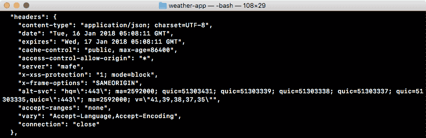

现在，`headers`是 HTTP 协议的一部分，它们是键值对，就像你在前面的截图中看到的那样，键和值都是字符串。它们可以在请求中从 Node 服务器发送到谷歌 API 服务器，也可以在谷歌 API 服务器的响应中发送回 Node 服务器。

标头很棒，有很多内置的标头，比如`content-type`。`content-type`是网站的 HTML，在我们的案例中是`application/json`。我们将在后面的章节中更多地讨论标头。这些标头中大多数对我们的应用程序不重要，大多数我们永远不会使用。当我们在本书后面创建自己的 API 时，我们将设置自己的标头，所以我们将非常熟悉这些标头的工作方式。现在，我们可以完全忽略它们，我只想让你知道的是，你看到的这些标头是由 Google 设置的，它们是从他们的服务器返回的标头。

在标头旁边，我们有请求对象，它存储了关于所做请求的一些信息：

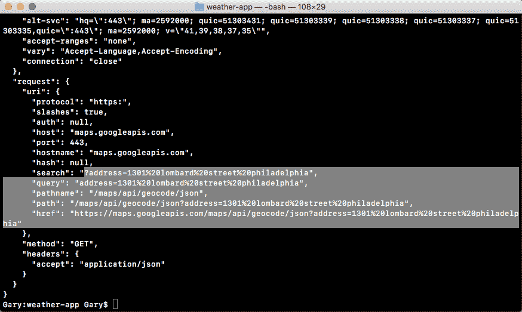

如前面的屏幕截图所示，您可以看到协议 HTTPS，主机，`maps.googleapis.com`网站，以及其他一些内容，比如地址参数，整个 URL，以及存储在这部分的请求的其他内容。

接下来，我们还有我们自己的标头。这些是从 Node 发送到 Google API 的标头。

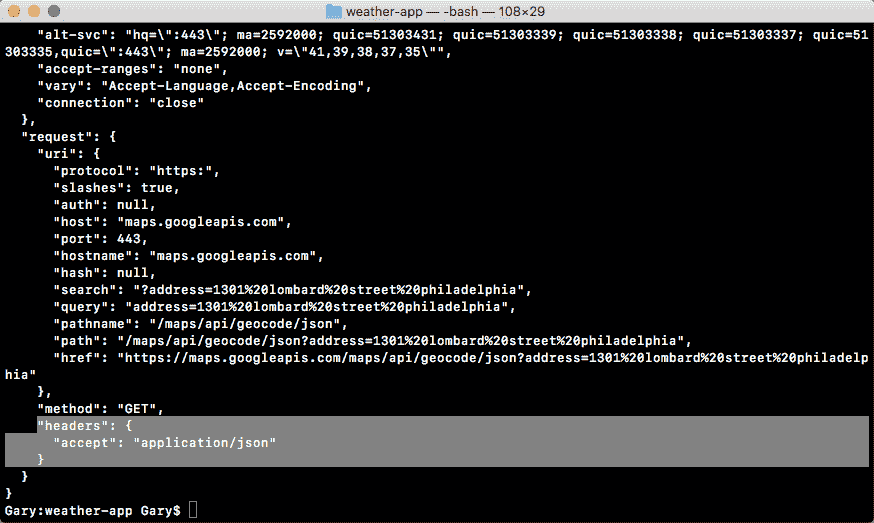

当我们在代码中的选项对象中添加`json: true`时，这个标头就被设置了。我们告诉请求我们想要 JSON 返回，请求继续告诉 Google，“嘿，我们想要接受一些 JSON 数据，所以如果你能用这种格式发送回来就行了！”这正是 Google 所做的。

这是`response`对象，它存储了关于`response`和请求的信息。虽然我们不会使用`response`参数中的大多数内容，但知道它们存在是很重要的。所以如果你需要访问它们，你知道它们在哪里。我们将在整本书中使用一些这些信息，但正如我之前提到的，大部分都是不必要的。

大多数情况下，我们将访问 body 参数。我们将使用的一个东西是状态。在我们的案例中是`200`。当我们确保请求成功完成时，这将是重要的。如果我们无法获取位置或者如果我们在状态码中得到错误，我们就不想继续尝试获取天气，因为显然我们没有纬度和经度信息。

# 错误参数

现在，我们可以继续进行最后的错误处理。正如我刚才提到的，状态码可以显示出现了错误，但这将是在 Google 服务器上的错误。也许 Google 服务器有语法错误，他们的程序崩溃了，也许你发送的数据是无效的，例如，你发送了一个不存在的地址。这些错误将通过状态码变得明显。

错误参数包含的是与进行 HTTP 请求的过程相关的错误。例如，也许域名是错误的：如果我在 URL 中删除`s`和点，用`go`替换，那么在我们的代码中，我得到的 URL 很可能是不存在的：

```js
const request = require('request');

request({
  url: 'https://mapogleapis.com/maps/api/geocode/json?address=1301%20lombard%20street%20philadelphia',
```

在这种情况下，我会在错误对象中得到一个错误，因为 Node 无法进行 HTTP 请求，甚至无法将其连接到服务器。如果我发出请求的机器没有互联网访问权限，也会出现错误。它将尝试连接到 Google 服务器，但会失败，我们将会得到一个错误。

现在，我们可以通过从 URL 中删除这些文本并发出请求来检查错误对象。在这种情况下，我将把 response 换成`error`，如下所示：

```js
const request = require('request');

request({
  url: 'https://mapogleapis.com/maps/api/geocode/json?address=1301%20lombard%20street%20philadelphia',
  json: true
}, (error, response, body) => {
  console.log(JSON.stringify(error, undefined, 2));
});
```

现在，在终端中，让我们通过运行`node app.js`命令重新运行应用程序，我们可以看到我们得到了什么：

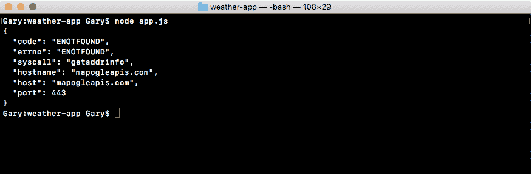

当我们发出错误请求时，我们的错误对象会打印到屏幕上，我们真正关心的是错误代码。在这种情况下，我们有`ENOTFOUND`错误。这意味着我们的本地机器无法连接到提供的主机。在这种情况下，`mapogleapis.com`不存在，所以我们会在这里得到一个错误。

这些将是系统错误，例如您的程序无法连接到互联网或找不到域名。当我们为应用程序创建一些错误处理时，这也将非常重要，因为有可能用户的机器无法连接到互联网。我们将要确保根据错误对象中的内容采取适当的行动。

如果我们可以修复 URL，将其设置回[maps.googleapis.com](https://developers.google.com/maps/)，然后使用上箭头键和*enter*键进行完全相同的请求，请求错误对象将为空，并且您可以看到 null 打印到屏幕上：

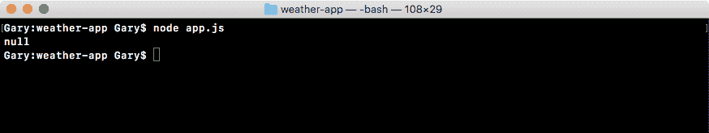

在这种情况下，一切都很顺利，没有错误，并且它能够成功获取数据，这应该是可以的，因为我们有一个有效的 URL。这是对 body、`response`和错误参数的快速概述。随着我们添加错误处理，我们将更详细地使用它们。

# 从 body 对象中打印数据

现在，我们将从 body 中将一些数据打印到屏幕上。让我们从打印格式化地址开始，然后我们将负责打印纬度和经度。

# 打印格式化地址

我们将首先找出格式化地址在哪里。为此，我们将转到浏览器并使用 JSONView。在浏览器页面底部，当我们在项目上高亮显示时，可以看到一个小蓝条出现，并且随着我们切换项目而改变。例如，对于格式化地址，我们访问`results`属性，results 是一个数组。在大多数地址的情况下，您只会得到一个结果：

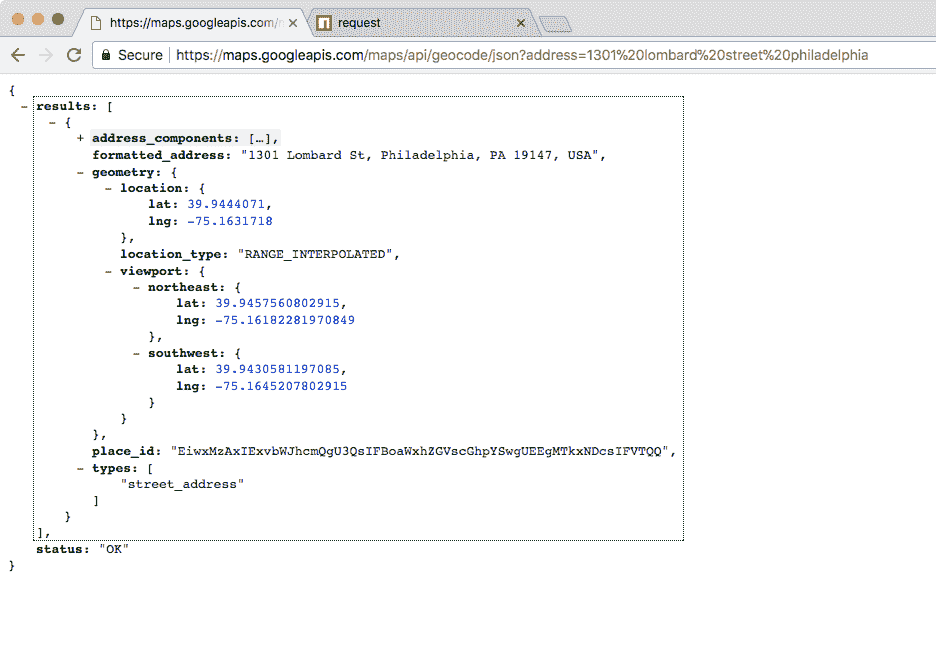

我们每次都会使用第一个结果，所以我们有索引`0`，然后是`.formatted_address`属性。这最后一行正是我们需要在 Node 代码中输入的内容。

在 Atom 中，在我们的代码中，我们将删除`console.log`语句，并将其替换为一个新的`console.log`语句。我们将使用模板字符串为此添加一些漂亮的格式。我们将添加`Address`后跟一个冒号和一个空格，然后我将使用美元符号和大括号注入地址。我们将访问 body、results 和 results 数组中的第一项，然后是 formatted address，如下所示：

```js
const request = require('request');

request({
 url: 'https://maps.googleapis.com/maps/api/geocode/json?address=1301%20lombard%20street%20philadelphia',
 json: true
}, (error, response, body) => {
 console.log(`Address: ${body.results[0].formatted_address}`);
});
```

有了这个，我现在可以在末尾加上一个分号并保存文件。接下来，我们将在终端中重新运行应用程序，这一次我们将在屏幕上打印出我们的地址，如下所示：

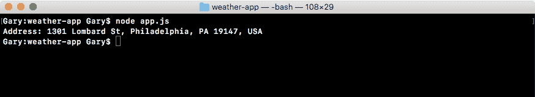

现在我们已经在屏幕上打印出地址，接下来我们想打印出纬度和经度。

# 打印纬度和经度

为了开始，在 Atom 中，我们将在我们为格式化地址添加的`console.log`旁边添加另一行`console.log`。我们将再次使用模板字符串添加一些漂亮的格式。让我们首先打印纬度。

为此，我们将添加纬度后跟一个冒号。然后，我们可以使用带有大括号的美元符号注入我们的变量。然后，我们想要的变量在 body 中。就像格式化地址一样，它也在第一个 results 项中；在索引为零的 results 中。接下来，我们将进入 geometry。从 geometry 中，我们将获取位置属性，即纬度`.lat`，如下所示：

```js
  console.log(`Address: ${body.results[0].formatted_address}`);
  console.log(`Latitude: ${body.results[0].geometry.location.lat}`);
});
```

现在我们已经做好了，我们将对经度做同样的操作。我们将在代码的下一行添加另一个`console.log`语句。我们将再次使用模板字符串，首先输入经度。之后，我们会加上一个冒号，然后注入数值。在这种情况下，数值在 body 中；它在相同的 results 项中，第一个。我们将再次进入 geometry 位置。我们将访问`.lng`而不是`.lat`。然后我们可以在末尾加上一个分号并保存文件。这将看起来像下面这样：

```js
  console.log(`Address: ${body.results[0].formatted_address}`);
  console.log(`Latitude: ${body.results[0].geometry.location.lat}`);
  console.log(`Longitude: ${body.results[0].geometry.location.lng}`);
});
```

现在我们将从终端进行测试。我们将重新运行先前的命令，并且如下截图所示，您可以看到我们的纬度为`39.94`，经度为`-75.16`打印到屏幕上：

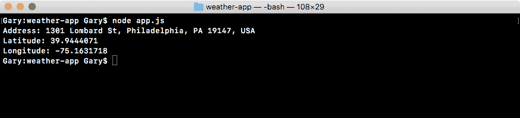

而这些值在 Chrome 浏览器中也是完全相同的，`39.94`，`-75.16`。有了这个，我们现在成功地获取了我们需要向天气 API 发出请求的数据。

# 总结

在本章中，我们已经介绍了异步编程的基本示例。接下来，我们讨论了在运行异步代码时发生了什么。我们对程序的运行方式以及在幕后发生的工具和技巧有了一个很好的了解。我们通过几个示例说明了调用堆栈、Node API、回调队列和事件循环的工作原理。

然后，我们学习了如何使用请求模块来发出 HTTP 请求以获取一些信息，我们请求的 URL 是 Google Maps 地理编码 URL，并且我们传入了我们想要获取纬度和经度的地址。然后我们使用了一个回调函数，一旦数据返回，就会触发该函数。

在*回调函数和 API*部分的结尾，我们研究了一个关于如何在想要将对象打印到控制台时如何格式化对象的快速提示。最后，我们研究了 HTTPS 请求的组成部分。

在下一章中，我们将为这个回调函数添加一些错误处理，因为这对于我们的 HTTP 请求非常重要。有可能出现问题，当出现问题时，我们希望通过将错误消息打印到屏幕上来处理该错误。
