# 第六章：异步编程中的回调

本章是我们在 Node.js 中的异步编程的第二部分。在本章中，我们将看到回调、HTTP 请求等。我们将处理回调中发生的许多错误。我们在`app.js`中的请求有很多错误的处理方式，我们将想要弄清楚如何在异步编程中从回调函数中恢复错误。

接下来，我们将把我们的请求代码块移到一个单独的文件中，并抽象出许多细节。我们将讨论这意味着什么，以及为什么对我们很重要。我们将使用 Google 的地理位置 API，并使用 Dark Sky API 来获取像邮政编码这样的位置信息，并将其转换为实时的天气信息。

然后，我们将开始连接天气预报 API，获取地理编码的地址的实时天气数据。我们将在`geocodeAddress`的回调函数中添加我们的请求。这将让我们使用参数列表中地址的动态经纬度坐标`lat`/`lng`，并获取该位置的天气。

具体来说，我们将研究以下主题：

+   编码用户输入

+   回调错误

+   抽象回调

+   连接天气搜索

+   链接回调

# 编码用户输入

在本节中，您将学习如何为天气应用程序设置 yargs。您还将学习如何包含用户输入，这对我们的应用程序非常重要。

如前一章节所示，*HTTPS 请求*部分，用户不会在终端中输入编码后的地址；相反，他们将输入一个普通文本地址，如`1301 Lombard Street`。

现在这对我们的 URL 不起作用，我们需要对这些特殊字符进行编码，比如空格，用`%20`替换它们。现在`%20`是空格的特殊字符，其他特殊字符有不同的编码值。我们将学习如何对字符串进行编码和解码，以便设置我们的 URL 是动态的。它将基于终端提供的地址。这就是我们将在本节讨论的全部内容。在本节结束时，您将能够输入任何您喜欢的地址，并看到格式化的地址、纬度和经度。

# 安装 yargs

在我们开始进行任何编码之前，我们必须从用户那里获取地址，而在设置 yargs 之前，我们必须安装它。在终端中，我们将运行`npm install`命令，模块名称是`yargs`，我们将寻找 10.1.1 版本，这是写作时的最新版本。我们将使用`save`标志来运行此安装，如下面的截图所示：

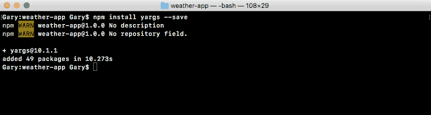

现在`save`标志很棒，因为你记得。它会更新`package.json`文件，这正是我们想要的。这意味着我们可以摆脱占用大量空间的 node 模块文件夹，但我们总是可以使用`npm install`重新生成它。

如果你只运行`npm install`，不加其他模块名称或标志。它将通过`package.json`文件查找要安装的所有模块，并安装它们，将你的 node 模块文件夹恢复成你离开时的样子。

在安装过程中，我们在`app.js`文件中进行了一些配置。因此，我们可以首先加载 yargs。为此，在`app.js`文件中，在请求常量旁边，我将创建一个名为`yargs`的常量，将其设置为`require(yargs)`，就像这样：

```js
const request = require('request');
const yargs = require('yargs');
```

现在我们可以继续进行配置。接下来我们将创建另一个常量叫做`argv`。这将是存储最终解析输出的对象。它将从 process 变量中获取输入，通过`yargs`处理，结果将直接存储在`argv`常量中。这将被设置为`yargs`，我们可以开始添加一些调用：

```js
const request = require('request');
const yargs = require('yargs');

const argv = yargs
```

现在，当我们创建笔记应用程序时，有各种命令，您可以添加一个需要一些参数的笔记，列出一个只需要标题的笔记，列出所有不需要任何参数的笔记，并且我们在 `yargs` 中指定了所有这些。

天气应用程序的配置将会简单得多。没有命令，唯一的命令将是获取天气，但如果我们只有一个命令，为什么还要让用户输入呢。在我们的情况下，当用户想要获取天气时，他们只需输入 `node app.js`，然后跟上 `address` 标志，就像这样：

```js
node app.js --address
```

然后他们可以在引号内输入他们的地址。在我的情况下，可能是 `1301 lombard street`：

```js
node app.js --address '1301 lombard street'
```

这正是命令将被执行的方式。不需要像获取天气这样的实际命令，我们直接从文件名进入我们的参数。

# 配置 yargs

要配置 yargs，事情看起来会有点不同，但仍然非常相似。在 Atom 中，我将开始调用 `.options`，这将让我们配置一些顶级选项。在我们的情况下，我们将传入一个对象，其中我们配置所有我们需要的选项。现在我将像我对所有链接调用所做的那样格式化它，将调用移到下一行，并将其缩进，就像这样：

```js
const argv = yargs
  .options({

})
```

现在我们可以设置我们的选项，在这种情况下我们只有一个，那就是 `a` 选项；`a` 将是地址的缩写。我可以在选项中输入地址，然后在别名中输入 `a`，或者我可以在选项中输入 `a`，然后在别名中输入地址。在这种情况下，我将像这样输入 a：

```js
const argv = yargs   
  .options({
    a: {

    }
  })
```

接下来，我可以继续提供那个空对象，然后我们将通过与笔记应用程序中使用的完全相同的选项进行。我们将要求它。如果您要获取天气，我们需要一个地址来获取天气，所以我将设置 `demand` 等于 `true`：

```js
const argv = yargs
  .options({
    a: {
       demand: true,
    }
  })
```

接下来，我们可以设置一个 `alias`，我将把 `alias` 设置为 `address`。最后我们将设置 `describe`，我们可以将 `describe` 设置为任何我们认为有用的东西，在这种情况下，我将选择 `Address to fetch weather for`，如下所示：

```js
const argv = yargs
  .options({
    a: {
      demand: true,
      alias: 'address',
 describe: 'Address to fetch weather for'
    }
  })
```

这些是我们为笔记应用程序提供的三个选项，但我将添加第四个选项，以使我们的天气应用程序的 yargs 配置更加完善。这将是一个名为 `string` 的选项。现在 `string` 接受一个布尔值，要么是 `true` 要么是 `false`。在我们的情况下，我们希望值为 `true`。这告诉 `yargs` 始终将 `a` 或 `address` 参数解析为字符串，而不是其他类型，比如数字或布尔值：

```js
const argv = yargs
  .options({
    a: {
      demand: true,
      alias: 'address',
      describe: 'Address to fetch weather for',
      string: true
    }
  })
```

在终端中，如果我删除实际的字符串 `address`，`yargs` 仍然会接受它，它只会认为我正在尝试添加一个布尔标志，在某些情况下可能很有用。例如，我想要以摄氏度还是华氏度获取？但在我们的情况下，我们不需要任何 `true` 或 `false` 标志，我们需要一些数据，所以我们将字符串设置为 `true`，以确保我们获得这些数据。

现在我们已经配置好了选项配置，我们可以继续添加我们已经探索过的一些其他调用。我将添加 `.help`，如下面的代码所示，调用它将添加 `help` 标志。这在某人第一次使用命令时非常有用。然后我们可以访问 `.argv`，它接受所有这些配置，通过我们的参数运行它，并将结果存储在 `argv` 变量中：

```js
const argv = yargs
  .options({
    a: {
      demand: true,
      alias: 'address',
      describe: 'Address to fetch weather for',
      string: true
    }
  })
  .help()
 .argv;
```

现在 `help` 方法添加了 `help` 参数，我们还可以通过调用 `.alias` 来添加它的别名。现在 `.alias` 接受两个参数，您要为其设置别名的实际参数和别名。在我们的情况下，当我们调用 `help` 时，已经注册了 `help`，我们将设置一个别名，它将只是字母 `h`，很棒：

```js
.help()
.alias('help', 'h')
.argv;
```

现在我们已经设置了各种非常好的配置，例如，在终端中，我现在可以运行 `help`，并且可以看到这个应用程序的所有帮助信息：

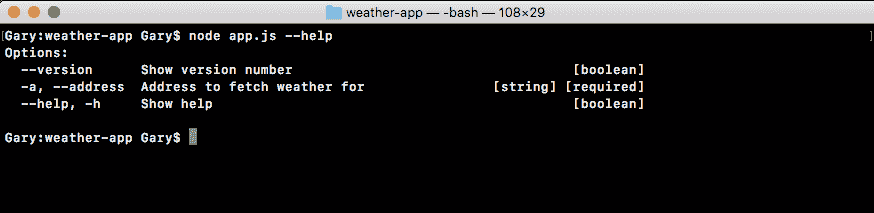

我也可以使用快捷键`-h`，然后我会得到完全相同的数据：

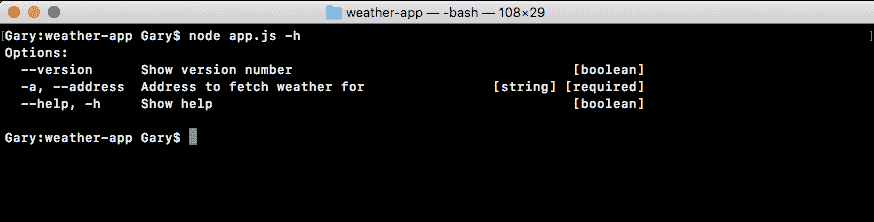

# 将地址打印到屏幕上

现在地址也被传递了，但我们没有将其打印到屏幕上，所以让我们这样做。在配置之后，让我们使用`console.log`将整个`argv`变量打印到屏幕上。这将包括`yargs`解析的所有内容：

```js
  .help()
  .alias('help', 'h')
  .argv;
console.log(argv);
```

让我们继续在终端中重新运行它，这次传入一个地址。我会使用`a`标志，并指定类似`1301 lombard street`的内容，然后关闭引号，按*enter*：

```js
node app.js -a '1301 lombard street'
```

当我们这样做时，我们得到了我们的对象，并且如代码输出所示，我们有 1301 Lombard St, Philadelphia, PA 19147, USA，纯文本地址：

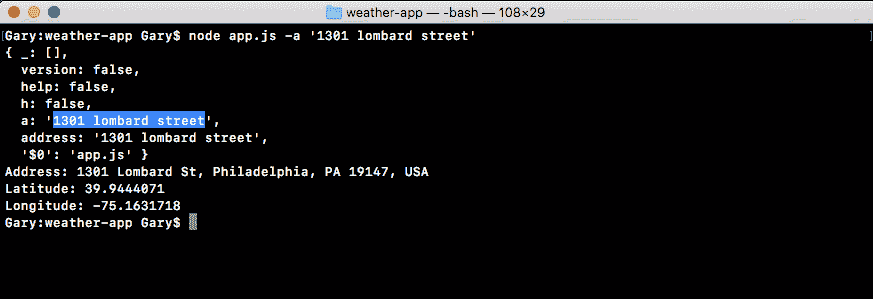

在上面的截图中，请注意我们恰好获取了该地址的纬度和经度，但这只是因为我们在`app.js`中的 URL 中硬编码了它。为了让在 URL 中显示的地址是在参数中输入的地址，我们仍然需要做一些更改。

# 编码和解码字符串

为了探索如何对字符串进行编码和解码，我们将进入终端。在终端中，首先我们将使用`clear`命令清除屏幕，然后通过输入`node`命令启动一个节点进程，如下所示：

```js
node
```

在这里，我们可以运行任何我们喜欢的语句。当我们探索一个非常基本的节点或 JavaScript 功能时，我们首先会查看一些示例，然后再将其添加到我们的实际应用程序中。我们将查看两个函数，`encodeURIComponent`和`decodeURIComponent`。我们将首先开始编码。

# 编码 URI 组件

编码，该方法称为`encodeURIComponent`，将 URI 组件编码为大写，并且只需要一个参数，即要编码的字符串。在我们的情况下，该字符串将是地址，类似于`1301 lombard street philadelphia`。当我们通过`encodeURIComponent`运行这个地址，我们得到编码版本：

```js
encodeURIComponent('1301 lombard street philadelphia')
```

如下面的代码输出所示，我们可以看到所有的空格，比如 1301 和 lombard 之间的空格，都被替换为它们的编码字符，对于空格的情况，它是%20。通过`encodeURIComponent`传递我们的字符串，我们将创建一个准备好被注入到 URL 中的内容，以便我们可以发出动态请求。

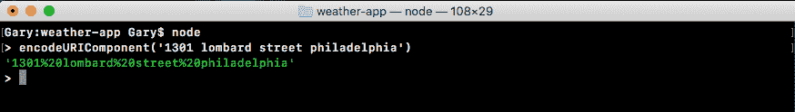

# 解码 URI 组件

现在`encodeURIComponent`的替代方法是。这将接受一个编码的字符串，就像前面的例子中一样，并将所有特殊字符，比如`%20`，转换回它们的原始值，即空格。为此，在`decodeURIComponent`中，我们再次传递一个字符串。

让我们继续输入我们的名字和姓氏。在我的情况下，是`Andrew`，而不是它们之间的空格，我会添加`%20`，我们知道这是空格的编码字符。由于我们正在尝试解码一些内容，这里有一些编码字符是很重要的。一旦你的代码看起来像下面的代码，带有你的名字和姓氏，你可以继续按*enter*，然后我们得到的是解码版本：

```js
decodeURIComponent('Andrew%20Mead')
```

如下面的代码输出所示，我有 Andrew Mead，`%20`被空格替换，正是我们预期的。这就是我们如何在我们的应用程序中对 URI 组件进行编码和解码：


# 从 argv 中提取地址

现在我们想要从`argv`中提取地址，我们已经看到它在那里，我们想要对其进行编码，并且我们想要将其注入到`app.js`文件中的 URL 中，替换地址：

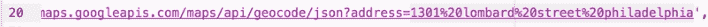

这将基本上创建我们一直在谈论的动态请求。我们将能够输入任何地址，无论是地址、邮政编码还是城市州组合，我们都将能够获取格式化的地址、纬度和经度。

为了开始，我将首先获取编码后的地址。让我们在`app.js`中创建一个名为`encodedAddress`的变量，放在`argv`变量旁边，我们可以在其中存储结果。我们将把这个变量设置为我们刚刚在终端中探索的方法的返回值，`encodeURIComponent`。这将获取纯文本地址并返回编码后的结果。

现在我们需要传入字符串，并且我们可以在`argv.address`中找到它，这是别名：

```js
  .help()
  .alias('help', 'h')
  .argv;
var encodedAddress = encodeURIComponent(argv.address);
```

在这里，我们可以使用`argv.a`以及`argv.address`，两者都可以正常工作。

现在我们已经得到了编码的结果，剩下的就是将其注入到 URL 字符串中。在`app.js`中，我们目前使用的是普通字符串。我们将其替换为模板字符串，这样我就可以在其中注入变量。

现在我们有了模板字符串，我们可以突出显示静态地址，它在`philadelphia`结束并延伸到`=`号，然后将其删除，而不是输入静态地址，我们可以注入动态变量。在我的花括号内，`encodedAddress`，如下所示：

```js
var encodedAddress = encodeURIComponent(argv.address);

request({
  url: `https://maps.googleapis.com/maps/api/geocode/json?address=${encodedAddress}`,
```

有了这个，我们现在完成了。我们从终端获取地址，对其进行编码，并在`geocode`调用中使用。因此，格式化的地址、纬度和经度应该匹配。在终端中，我们将使用*control* + *C*两次关闭 node，并使用 clear 清除终端输出。

然后我们可以使用`node app.js`运行我们的应用，传入`a`或`address`标志。在这种情况下，我们将只使用`a`。然后我们可以输入一个地址，例如`1614 south broad street philadelphia`，如下所示：

```js
node app.js -a '1614 south broad street philadelphia'
```

当你运行它时，你应该会有一个小延迟，当我们从地理编码 URL 获取数据时。

在这种情况下，我们会发现它实际上比我们预期的要慢一点，大约三到四秒，但我们确实得到了地址：

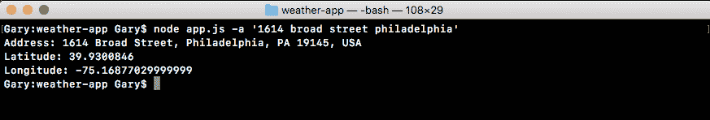

这里我们有一个格式化的地址，包括正确的邮政编码、州和国家，还有显示经纬度。我们将尝试一些其他例子。例如，对于宾夕法尼亚州的一个名叫查尔方特的小镇，我们可以输入`chalfont pa`，这并不是一个完整的地址，但是谷歌地理编码 API 会将其转换为最接近的地址，如下所示：

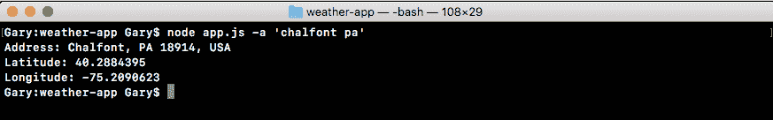

我们可以看到这实际上是查尔方特镇的地址，邮编为 18914，所在州为美国。接下来，我们有该镇的一般纬度和经度数据，这对获取天气数据将很有用。天气在几个街区内并不会有太大变化。

现在我们的数据是动态获取的，我们可以继续下一节，处理回调函数中发生的错误。这个请求有很多可能出错的地方，我们需要弄清楚如何在异步编程中从回调函数中恢复错误。

# 回调错误

在这一部分，我们将学习如何处理回调函数中的错误，因为正如你可能猜到的那样，事情并不总是按计划进行。例如，我们的应用的当前版本存在一些很大的缺陷，如果我尝试使用`node app.js`来获取天气，使用`a`标志输入一个不存在的邮政编码，比如`000000`，程序会崩溃，这是一个很大的问题。它正在进行。它正在获取数据，最终数据会返回并且我们会得到一个错误，如下所示：

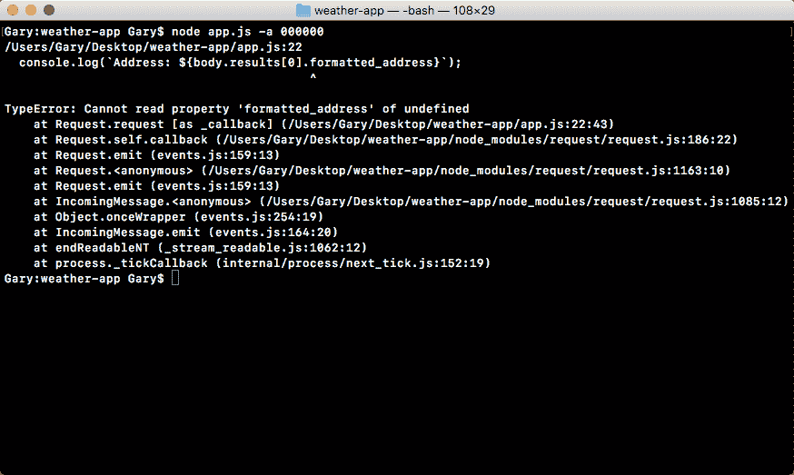

它试图获取不存在的属性，比如`body.results[0].formatted_address`不是一个真实的属性，这是一个大问题。

我们当前的回调期望一切都按计划进行。它不关心错误对象，也不关注响应代码；它只开始打印它想要的数据。这是快乐的路径，但在现实世界的 node 应用程序中，我们也必须处理错误，否则应用程序将变得非常无用，当事情似乎不如预期工作时，用户可能会变得非常沮丧。

为了做到这一点，我们将在回调函数中添加一组`if`/`else`语句。这将让我们检查某些属性，以确定这次调用，即我们在`app.js`中的 URL，是否应该被视为成功或失败。例如，如果响应代码是 404，我们可能希望将其视为失败，并且我们将要做一些事情，而不是尝试打印地址、纬度和经度。不过，如果一切顺利，这是一个完全合理的做法。

检查 Google API 请求中的错误

+   机器错误，例如无法连接到网络，通常会显示在错误对象中，

+   来自其他服务器，Google 服务器的错误，这可能是无效的地址

为了开始，让我们看看当我们向 Google API 传递错误数据时会发生什么。

# 

要查看像之前的示例调用返回的实际内容，其中我们有一个无效地址，我们将转到浏览器并打开我们在`app.js`文件中使用的 URL：

在本节中，我们将担心两种类型的错误。那将是：

我们将从浏览器历史记录中删除之前使用的地址，并输入`000000`，然后按*enter*：

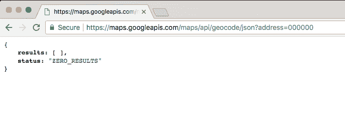

我们得到了结果，但没有结果，状态显示`ZERO_RESULTS`，这是非常重要的信息。我们可以使用状态文本值来确定请求是否成功。如果我们传入一个真实的邮政编码，比如`19147`，它是`费城`，我们将得到我们的结果，如下图所示，`status`将被设置为`OK`：

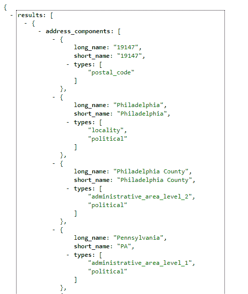

我们可以使用这个状态来确定事情进行得很顺利。在这些状态属性和我们应用程序中的错误对象之间，我们可以确定在回调函数中究竟要做什么。

# 添加回调错误的 if 语句

我们要做的第一件事是添加一个如下所示的`if`语句，检查错误对象是否存在：

```js
request({
  url: `https://maps.googleapis.com/maps/api/geocode/json?address=${encodedAddress}`,
  json: true
}, (error, response, body) => {
  if (error) {

 }
```

如果错误对象存在，这将运行我们代码块中的代码，如果不存在，我们将继续进入下一个`else if`语句，如果有的话。

如果有错误，我们只会添加一个`console.log`和一个屏幕消息，类似于`无法连接到 Google 服务器`：

```js
if (error) {
  console.log('Unable to connect Google servers.');
}
```

这将让用户知道我们无法连接到用户服务器，而不是他们的数据出了问题，比如地址无效。这就是错误对象中的内容。

现在我们要做的下一件事是添加一个`else if`语句，并在条件中检查状态属性。如果状态属性是`ZERO_RESULTS`，就像邮政编码`000000`一样，我们希望做一些事情，而不是尝试打印地址。在 Atom 中的我们的条件中，我们可以使用以下语句进行检查：

```js
if (error) {
  console.log('Unable to connect Google servers.');
} else if (body.status === 'ZERO_RESULTS') {

}
```

如果是这种情况，我们将打印一个不同的消息，而不是`无法连接到 Google 服务器`，对于这个消息，我们可以使用`console.log`打印`无法找到该地址。`：

```js
if (error) {
  console.log('Unable to connect Google servers.');
} else if (body.status === 'ZERO_RESULTS') {
  console.log('Unable to find that address.');
}
```

这让用户知道这不是连接的问题，我们只是无法找到他们提供的地址，他们应该尝试其他的东西。

现在我们已经处理了系统错误的错误处理，比如无法连接到 Google 服务器，以及输入错误的错误处理，在这种情况下，我们无法找到该地址的位置，这太棒了，我们已经处理了我们的两个错误。

现在`body.status`属性出现在`else if`语句中，这不会出现在每个 API 中，这是特定于 Google Geocode API 的。当您探索新的 API 时，重要的是尝试各种数据，好的数据，比如真实地址和坏的数据，比如无效的邮政编码，以确定您可以使用哪些属性来确定请求是否成功，或者是否失败。

在我们的情况下，如果状态是`ZERO_RESULTS`，我们知道请求失败了，我们可以相应地采取行动。在我们的`app`中，现在我们将添加我们的最后一个`else if`子句，如果事情进展顺利。

# 在检查 body 状态属性时添加 if else 语句

现在我们想要添加`else if`子句，检查`body.status`属性是否等于`OK`。如果是，我们可以继续运行代码块内的这三行代码：

```js
  console.log(`Address: ${body.results[0].formatted_address}`);
  console.log(`Latitude: ${body.results[0].geometry.location.lat}`);
  console.log(`Longitude: ${body.results[0].geometry.location.lng}`);
});
```

如果不是，这些行不应该运行，因为代码块不会执行。然后我们将在终端内测试一下，尝试获取`00000`的地址，并确保程序不会崩溃，而是打印我们的错误消息到屏幕上。然后我们继续搞砸应用程序中的 URL，删除一些重要的字符，并确保这次我们收到`无法连接到 Google 服务器。`的消息。最后，我们将看看当我们输入一个有效地址时会发生什么，并确保我们的三个`console.log`语句仍然执行。

首先，我们将添加`else if`语句，并在条件内检查`body.status`是否为`OK`：

```js
if (error) {
  console.log('Unable to connect Google servers.');
} else if (body.status === 'ZERO_RESULTS') {
  console.log('Unable to find that address.');
} else if (body.status === 'OK') {

}
```

如果是`OK`，那么我们将简单地将三个`console.log`行（在上一个代码块中显示）移到`else if`条件中。如果是`OK`，我们将运行这三个`console.log`语句：

```js
if (error) {
  console.log('Unable to connect Google servers.');
} else if (body.status === 'ZERO_RESULTS') {
  console.log('Unable to find that address.');
} else if (body.status === 'OK') {
  console.log(`Address: ${body.results[0].formatted_address}`);
 console.log(`Latitude: ${body.results[0].geometry.location.lat}`);
 console.log(`Longitude: ${body.results[0].geometry.location.lng}`);
}
```

现在我们有一个非常好处理错误的请求。如果出了问题，我们有一个特殊的消息，如果事情顺利，我们打印用户期望的内容，地址，纬度和经度。接下来我们将测试这个。

# 测试 body 状态属性

为了在终端中测试这一点，我们将首先重新运行具有无效地址的命令：

```js
node app.js -a 000000
```

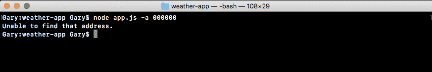

当我们运行这个命令时，我们看到`无法找到地址。`打印到屏幕上。程序不会崩溃，打印一堆错误，而是简单地在屏幕上打印一条消息。这是因为我们在第二个`else if`语句中的代码尝试访问那些不存在的属性，不再运行，因为我们的第一个`else if`条件被捕获，我们只是将消息打印到屏幕上。

现在我们还想测试第一个消息（`无法连接到 Google 服务器。`）在应该打印时是否打印。为此，我们将在我们的代码中删除一部分 URl，比如`s`和`.`，然后保存文件：

```js
request({
  url: `https://mapgoogleapis.com/maps/api/geocode/json?address=${encodedAddress}`,
  json: true
}, (error, response, body) => {
  if (error) {
    console.log('Unable to connect Google servers.');
  } else if (body.status === 'ZERO_RESULTS') {
   console.log('Unable to find that address.');
  } else if (body.status === 'OK') {
    console.log(`Address: ${body.results[0].formatted_address}`);
    console.log(`Latitude: ${body.results[0].geometry.location.lat}`);
    console.log(`Longitude: ${body.results[0].geometry.location.lng}`);
  }
});
```

然后我们将重新运行终端中的上一个命令。这一次，我们可以看到`无法连接到 Google 服务器。`像应该一样打印到屏幕上：

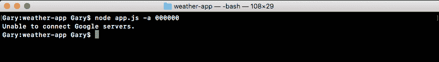

现在我们可以测试最后一件事，首先调整 URL 使其正确，然后从终端获取有效地址。例如，我们可以使用`node app.js`，将`address`设置为`08822`，这是新泽西州的一个邮政编码：

```js
node app.js --address 08822
```

当我们运行这个命令时，我们确实得到了 Flemington, NJ 的格式化地址，包括邮政编码和州，我们的纬度和经度如下所示：

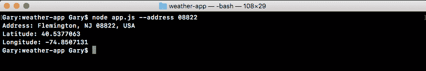

现在我们有了完整的错误处理模型。当我们向谷歌提供有问题的地址时，比如`ZERO_RESULTS`，错误对象将被填充，因为从请求的角度来看，这不是一个错误，实际上它在响应对象中，这就是为什么我们必须使用`body.status`来检查错误。

这就是本节的内容，我们现在已经有了错误处理，我们处理系统错误，谷歌服务器错误，还有我们的成功案例。

# 抽象回调

在这一节中，我们将重构`app.js`，将与地理编码相关的复杂逻辑移动到一个单独的文件中。目前，所有与发出请求和确定请求是否成功相关的逻辑，我们的`if else`语句，都存在于`app.js`中：

```js
request({
  url: `https://maps.googleapis.com/maps/api/geocode/json?address=${encodedAddress}`,
  json: true
}, (error, response, body) => {
  if (error) {
    console.log('Unable to connect Google servers.');
  } else if (body.status === 'ZERO_RESULTS') {
   console.log('Unable to find that address.');
  } else if (body.status === 'OK') {
    console.log(`Address: ${body.results[0].formatted_address}`);
    console.log(`Latitude: ${body.results[0].geometry.location.lat}`);
    console.log(`Longitude: ${body.results[0].geometry.location.lng}`);
  }
});
```

这并不是可以重复使用的，而且它真的不属于这里。在我们添加更多与获取天气预报相关的逻辑之前，我想要做的是把这部分代码拆分成自己的函数。这个函数将会存在于一个单独的文件中，就像我们为笔记应用程序所做的那样。

在`notes app`中，我们有一个单独的文件，其中有用于添加、列出和从我们的本地相邻文件中删除笔记的函数。我们将创建一个单独的函数，负责对给定地址进行地理编码。尽管逻辑将保持不变，实际上是没有办法绕过它的，它将被从`app.js`文件中抽象出来，并放到自己的位置中。

# 重构 app.js 和代码到 geocode.js 文件

首先，我们需要创建一个新的目录和一个新的文件，然后我们将为该函数添加一些更高级的功能。但在此之前，我们将看看 require 语句会是什么样子。

# 处理请求语句

我们将通过一个名为`geocode`的常量变量加载模块，并将其设置为`require`，因为我们需要一个本地文件，所以我们会添加相对路径，`./geocode/geocode.js`：

```js
const geocode = require('./geocode/geocode.js');
```

这意味着你需要在`weather-app`文件夹中创建一个名为`geocode`的目录，以及一个名为`geocode.js`的文件。因为我们有一个`.js`扩展名，所以我们实际上可以在我们的 require 调用中省略它。

现在，在`app.js`文件中，紧挨着`.argv`对象，我们需要调用`geocode.geocodeAddress`。`geocodeAddress`函数，它将负责`app.js`中当前所有逻辑。`geocodeAddress`函数将获取地址，`argv.address`：

```js
geocode.geocodeAddress(argv.address);
```

它将负责做所有事情，编码 URL，发出请求，并处理所有错误情况。这意味着在新文件中，我们需要导出`geocodeAddress`函数，就像我们从`notes application`文件中导出函数一样。接下来，我们在这里有所有的逻辑：

```js
var encodedAddress = encodedURIComponent(argv.address);

request({
  url: `https://maps.googleapis.com/maps/api/geocode/json?address=${encodedAddress}`,
  json: true
}, (error, response, body) => {
  if (error) {
    console.log('Unable to connect Google servers.');
  } else if (body.status === 'ZERO_RESULTS') {
   console.log('Unable to find that address.');
  } else if (body.status === 'OK') {
    console.log(`Address: ${body.results[0].formatted_address}`);
    console.log(`Latitude: ${body.results[0].geometry.location.lat}`);
    console.log(`Longitude: ${body.results[0].geometry.location.lng}`);
  }
});
```

这个逻辑需要被移动到`geocodeAddress`函数中。现在我们可以直接复制并粘贴上面显示的代码，有些更复杂的逻辑确实无法避免，但我们需要做一些改变。我们需要将请求加载到新文件中，因为我们使用了它，而且它不会在默认情况下被该文件所需。然后我们可以继续清理代码中的请求调用，因为我们不会在这个文件中使用它。

接下来，`argv`对象将不再存在，我们将通过第一个参数传递进来，就像`geocode.Address`语句中的`argv.address`一样。这意味着我们需要用我们称呼第一个参数的任何东西来替换它，比如 address。一旦这样做了，程序应该会和在`app.js`中没有任何更改的情况下一样工作，功能上不应该有任何改变。

# 创建地理编码文件

首先，让我们在`weather-app`文件夹中创建一个全新的目录，这是我们需要做的第一件事。这个目录叫做`geocode`，与我们在`geocode`变量中的 require 语句相匹配。在`geocode`文件夹中，我们将创建我们的文件`geocode.js`：

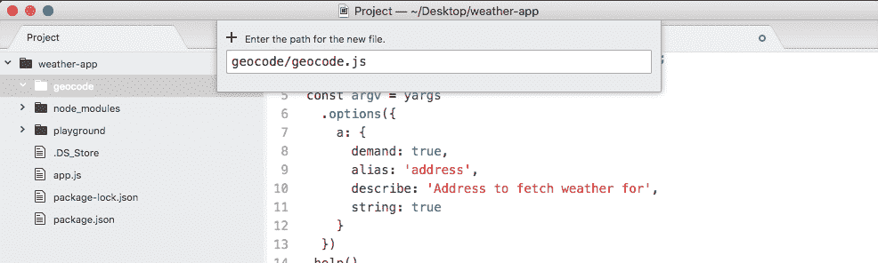

现在在`geocode.js`中，我们可以开始加载请求，让我们创建一个名为`request`的常量，并将其设置为`require('request')`：

```js
const request = require('request');
```

现在我们可以继续定义负责地理编码的函数，这个函数将被称为`geocodeAddress`。我们将创建一个名为`geocodeAddress`的变量，将其设置为一个箭头函数，并且这个箭头函数将接收一个`address`参数：

```js
var geocodeAddress = (address) => {

};
```

这是未编码的纯文本地址。现在在将代码从`app.js`复制到此函数体之前，我们要使用`module.exports`导出我们的`geocodeAddress`函数，我们知道它是一个对象。我们放在`module.exports`对象上的任何东西都将对任何需要此文件的文件可用。在我们的情况下，我们希望使`geocodeAddress`属性可用，将其设置为我们在前面的语句中定义的`geocodeAddress`函数：

```js
var geocodeAddress = (address) => {

};

module.exports.geocodeAddress = geocodeAddress;
```

现在是时候将`app.js`中的所有代码复制到`geocode.js`中了。我们将剪切请求函数代码，移动到`geocode.js`中，并将其粘贴到我们函数的主体中：

```js
var geocodeAddress = (address) => {
  var encodedAddress = encodedURIComponent(argv.address);

  request({
    url: `https://maps.googleapis.com/maps/api/geocode/json?address=${encodedAddress}`,
    json: true
  }, (error, response, body) => {
    if (error) {
      console.log('Unable to connect Google servers.');
    } else if (body.status === 'ZERO_RESULTS') {
      console.log('Unable to find that address.');
    } else if (body.status === 'OK') {
      console.log(`Address: ${body.results[0].formatted_address}`);
      console.log(`Latitude: ${body.results[0].geometry.location.lat}`);
      console.log(`Longitude: ${body.results[0].geometry.location.lng}`);
    }
  });
};

module.exports.geocodeAddress = geocodeAddress;
```

在这段代码中，我们唯一需要更改的是如何获取纯文本地址。我们不再有`argv`对象，而是将`address`作为参数传入。最终的代码将如下代码块所示：

```js
const request = require('request');

var geocodeAddress = (address) => {
  var encodedAddress = encodedURIComponent(argv.address);

  request({
    url: `https://maps.googleapis.com/maps/api/geocode/json?address=${encodedAddress}`,
    json: true
  }, (error, response, body) => {
    if (error) {
      console.log('Unable to connect Google servers.');
    } else if (body.status === 'ZERO_RESULTS') {
      console.log('Unable to find that address.');
    } else if (body.status === 'OK') {
      console.log(`Address: ${body.results[0].formatted_address}`);
      console.log(`Latitude: ${body.results[0].geometry.location.lat}`);
      console.log(`Longitude: ${body.results[0].geometry.location.lng}`);
    }
  });
};

module.exports.geocodeAddress = geocodeAddress;
```

有了这个，我们现在完成了`geocode`文件。它包含了所有复杂的逻辑，用于发出和完成请求。在`app.js`中，我们可以通过删除一些额外的空格和移除不再在此文件中使用的请求模块来清理代码。最终的`app.js`文件将如下代码块所示：

```js
const yargs = require('yargs');

const geocode = require('./geocode/geocode');

const argv = yargs
  .options({
    a: {
      demand: true,
      alias: 'address',
      describe: 'Address to fetch weather for',
      string: true
    }
  })
  .help()
  .alias('help', 'h')
  .argv;

geocode.geocodeAddress(argv.address);
```

现在在这一点上，功能应该完全相同。在终端中，我将继续运行一些来确认更改是否有效。我们将使用`a`标志搜索一个存在的邮政编码，比如`19147`，如图所示，我们可以看到地址、纬度和经度：

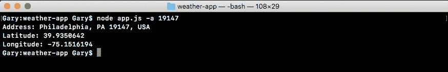

现在我们将这个邮政编码更改为一个不存在的邮政编码，比如`000000`，当我们通过地理编码器运行这个时，你会看到“无法找到地址”打印到屏幕上：

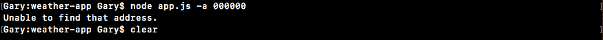

这意味着`geocode.js`中的所有逻辑仍然有效。现在，下一步是向`geocodeAddress`添加回调函数的过程。

# 向 geocodeAddress 添加回调函数

重构代码和`app.js`的目标不是为了摆脱回调，目标是将与编码数据、发出请求和检查错误相关的所有复杂逻辑抽象出来。`app.js`不应该关心任何这些，它甚至不需要知道是否曾经发出过 HTTP 请求。`app.js`唯一需要关心的是将地址传递给函数，并对结果进行处理。结果可以是错误消息或数据，格式化的地址、纬度和经度。

# 在 app.js 中的 geocodeAddress 函数中设置函数

在我们继续在`geocode.js`中进行任何更改之前，我们要看一下我们将如何在`app.js`中构造事物。我们将向`geocodeAddress`传递一个箭头函数，这将在请求返回后被调用：

```js
geocode.geocodeAddress(argv.address, () => {

});
```

在括号中，我们将期望两个参数，`errorMessage`，它将是一个字符串，和`results`，它将包含地址、纬度和经度：

```js
geocode.geocodeAddress(argv.address, (errorMessage, results) => {

});
```

在这两者中，只有一个会一次可用。如果我们有错误消息，我们将没有结果，如果我们有结果，我们将没有错误消息。这将使箭头函数中的逻辑，确定调用是否成功，变得更简单。我们将能够使用`if`语句，`if (errorMessage)`，如果有错误消息，我们可以简单地使用`console.log`语句将其打印到屏幕上：

```js
geocode.geocodeAddress(argv.address, (errorMessage, results) => {
  if (errorMessage) {
    console.log(errorMessage);
  }
});
```

我们不需要深入任何对象并准确了解发生了什么，所有这些逻辑都在`geocode.js`中抽象出来。现在如果`else`子句中没有错误消息，我们可以继续打印结果。我们将使用我们在上一章中讨论过的漂亮打印方法，我们将添加`console.log(JSON.stringify)`语句，并且漂亮打印结果对象，这个对象将包含一个地址属性、一个纬度属性和一个经度属性。

然后，我们将`undefined`参数作为我们的第二个参数。这跳过了我们不需要的过滤函数，然后我们可以指定间距，这将以一种非常好的方式格式化，我们将使用两个空格，如下所示：

```js
geocode.geocodeAddress(argv.address, (errorMessage, results) => {
  if (errorMessage) {
    console.log(errorMessage);
  } else {
    console.log(JSON.stringify(results, undefined, 2));
  }
});
```

现在我们已经在`app.js`的`geocodeAddress`函数中设置好了我们的函数，并且对它的外观有了一个很好的想法，我们可以继续在`geocode.js`中实现它。

# 在`geocode.js`文件中实现回调函数

在我们的参数定义中，我们不仅期望一个地址参数，还期望一个回调参数，我们可以在任何时候调用这个回调参数。我们将在三个地方调用它。我们将在`if (error)`块内部调用它一次，而不是调用`console.log`，我们将简单地用`Unable to connect to Google servers.`字符串调用回调。这个字符串将是我们在`app.js`中的`geocodeAddress`函数中定义的错误消息。

为了做到这一点，我们所需要做的就是将我们的`console.log`调用更改为`callback`调用。我们将作为第一个参数传递我们的错误消息。我们可以将字符串完全按照它在`console.log`中出现的方式，移动到`callback`的参数中。然后我可以删除`console.log`调用并保存文件。结果代码将如下所示：

```js
request({
  url: `https://maps.googleapis.com/maps/api/geocode/json?address=${encodedAddress}`,
  json: true
}, (error, response, body) => {
  if (error) {
    callback('Unable to connect to Google servers.');
  }
```

现在我们可以在下一个`else if`块中做完全相同的事情，用我们的另一个`console.log`语句替换`zero results`时的`console.log`。

```js
if (error) {
  callback('Unable to connect Google servers.');
} else if (body.status === 'ZERO_RESULTS') {
  callback('Unable to find that address.');
}
```

现在最后的`else if`块会有点棘手。这有点棘手，因为我们并没有确切的对象。我们还需要为第一个参数创建一个`undefined`变量，因为当事情顺利进行时不会提供错误消息。我们只需要调用`callback`，将一个`undefined`变量作为第一个参数传递，就可以创建未定义的错误消息。然后我们可以继续指定我们的对象作为第二个参数，这个对象将会完全符合`geocodeAddress`函数中的结果。

```js
} else if (body.status === 'OK') {
  callback(undefined, {

  })
  console.log(`Address: ${body.results[0].formatted_address}`);
  console.log(`Latitude: ${body.results[0].geometry.location.lat}`);
  console.log(`Longitude: ${body.results[0].geometry.location.lng}`);
}
```

正如我提到的，结果有三个属性：第一个将是格式化的地址，所以让我们先解决这个问题。我们将把`address`设置为`body.results`，就像我们在`console.log`语句的`Address`变量中一样。

```js
} else if (body.status === 'OK') {
  callback(undefined, {
    address: body.results[0].formatted_address
  })
  console.log(`Address: ${body.results[0].formatted_address}`);
  console.log(`Latitude: ${body.results[0].geometry.location.lat}`);
  console.log(`Longitude: ${body.results[0].geometry.location.lng}`);
}
```

在这里，我们正在使事情变得更容易，而不是在`app.js`中深层嵌套的复杂属性，我们将能够访问一个简单的`address`属性，对于`console.log`语句的`Latitude`和`Longitude`也是同样的做法。

接下来，我们将获取让我们获取纬度的代码，并添加我的第二个属性`latitude`，将其设置为我们从`console.log`语句中获取的代码。然后我们可以继续添加最后一个属性，即`longitude`，将其设置为`latitude`代码，用`lng`替换`lat`。现在我们已经完成了这一步，我们可以在末尾添加一个分号，并删除`console.log`语句，因为它们已经不再需要了，这样我们就完成了：

```js
if (error) {
  callback('Unable to connect Google servers.');
} else if (body.status === 'ZERO_RESULTS') {
  callback('Unable to find that address.');
} else if (body.status === 'OK') {
  callback(undefined, {
    address: body.results[0].formatted_address,
    latitude: body.results[0].geometry.location.lat,
    longitude: body.results[0].geometry.location.lng
  });
}
```

现在我们可以重新运行文件，当我们这样做时，我们将向`geocodeAddress`传递一个地址，这将发出请求，当请求返回时，我们将能够以一种非常简单的方式处理响应。

# 在`geocode.js`文件中测试回调函数

在终端中，我们将返回运行两个`node app.js`命令；使用邮政编码`19147`的命令，一切都按预期工作，以及一个错误的邮政编码`000000`，以显示错误消息。

如下所示的代码输出中，我们可以看到我们的结果对象具有一个地址属性，一个纬度属性和一个经度属性：

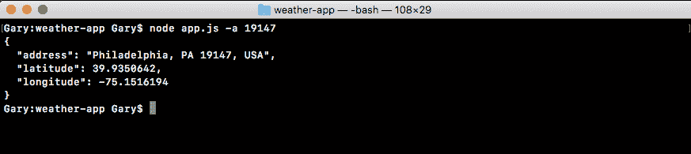

如果邮政编码错误，我们只需确保错误消息仍然显示出来，确实如此，无法找到该地址。打印到屏幕上，如下所示：


这是因为`app.js`中的`geocodeAddress`函数中的`if`语句。

在将所有这些逻辑抽象到`geocode`文件之后，`app.js`文件现在变得简单得多，更容易维护。我们还可以在多个位置调用`geocodeAddress`。如果我们想要重用代码，我们不必复制和粘贴代码，这不符合**DRY**原则，即**不要重复自己**，相反，我们可以做 DRY 的事情，就像我们在`app.js`文件中所做的那样，简单地调用`geocodeAddress`。有了这个设置，我们现在已经完成了获取`geocode`数据。

# 连接天气搜索

在这一部分，您将向天气 API 发出您的第一个请求，并且一开始我们将以静态方式进行，这意味着它不会使用我们传入的地址的实际纬度和经度，我们将简单地有一个静态的 URL。我们将发出请求，并探索我们在主体中得到的数据。

# 在浏览器中探索 API 的工作原理

现在，在我们可以向 Atom 添加任何内容之前，我们想要先探索一下这个 API，这样我们就可以看到它在浏览器中的工作原理。这将让我们更好地了解当我们向 API 传递纬度和经度时，我们会得到什么样的天气数据。为了做到这一点，我们将前往浏览器，并访问一些 URL。

首先让我们去[forecast.io](http://forecast.io)。这是一个普通的天气网站，您输入您的位置，就会得到您所期望的所有天气信息：

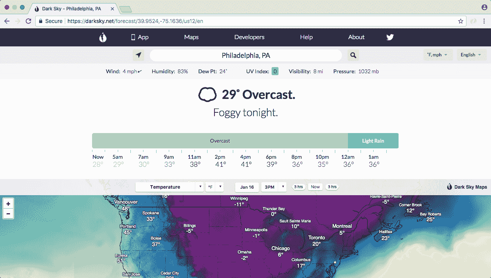

如前面的图像所示，网站上有警告、雷达、当前天气，还有周报预测，如下图所示：

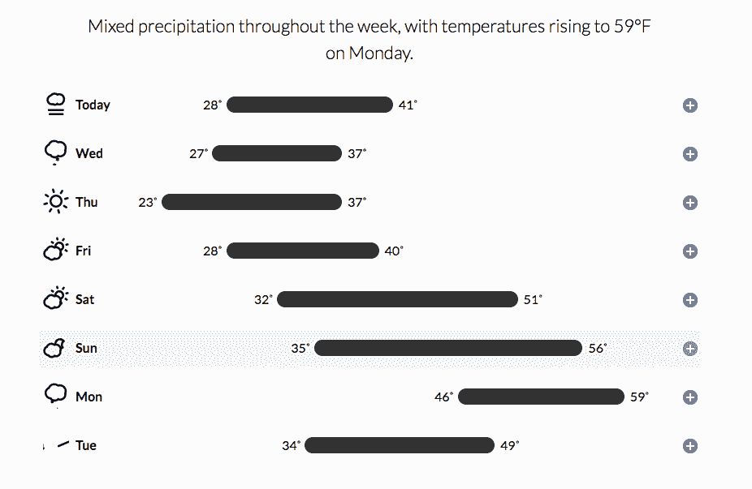

这类似于[weather.com](http://weather.com)，但[forecast.io](http://forecast.io)的一个很酷的地方是，驱动这个网站的 API 实际上是可以供开发者使用的。您可以向我们的 URL 发出请求，获取完全相同的天气信息。

这正是我们将要做的，当我们可以通过访问网站[developer.forecast.io](http://developer.forecast.io)来探索 API。在这里，我们可以注册一个免费的开发者账户，以便开始发出天气请求：

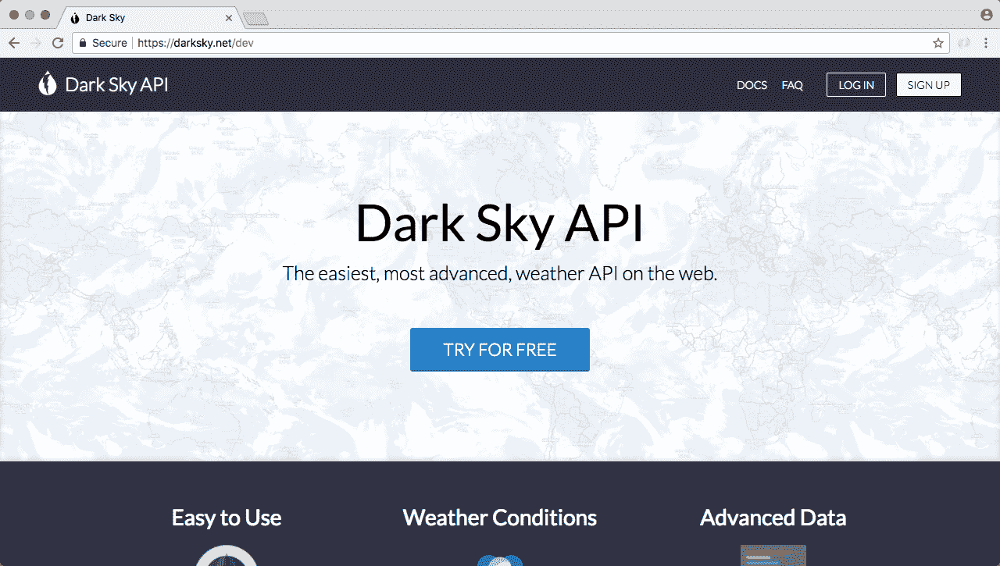

Dark Sky Forecast API 每天为您提供 1,000 次免费请求，我认为我们不会超过这个限制。在 1,000 次请求之后，每次请求的成本是一千分之一的一分钱，因此您每花一分钱就可以获得一千次请求。我们永远不会超过这个限制，所以不用担心。开始时不需要信用卡，您只需在发出一千次请求后就会被切断。

要开始，您需要注册一个免费账户，这非常简单，我们只需要一个电子邮件和一个密码。一旦我们创建了一个账户，我们就可以看到如下所示的仪表板：

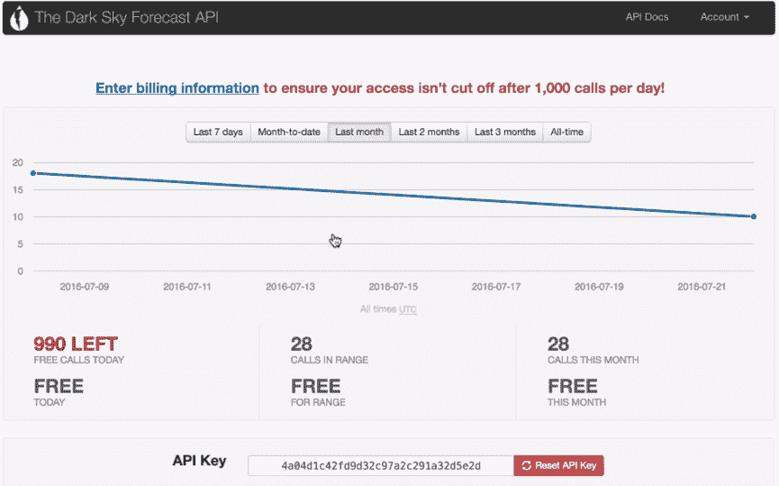

我们从这个页面需要的唯一信息是我们的 API 密钥。API 密钥就像一个密码，它将成为我们请求的 URL 的一部分，并且将帮助[forecast.io](http://forecast.io)跟踪我们每天发出的请求数量。现在我将拿到这个 API 密钥并粘贴到`app.js`中，这样我们以后需要时就可以访问它。

接下来，我们将探索文档，我们需要提供的实际 URL 结构，以便获取给定纬度和经度的天气。我们可以通过单击 API 文档链接按钮来获取，该按钮位于 The Dark Sky Forecast API 页面右上方。这将引导我们到以下页面：

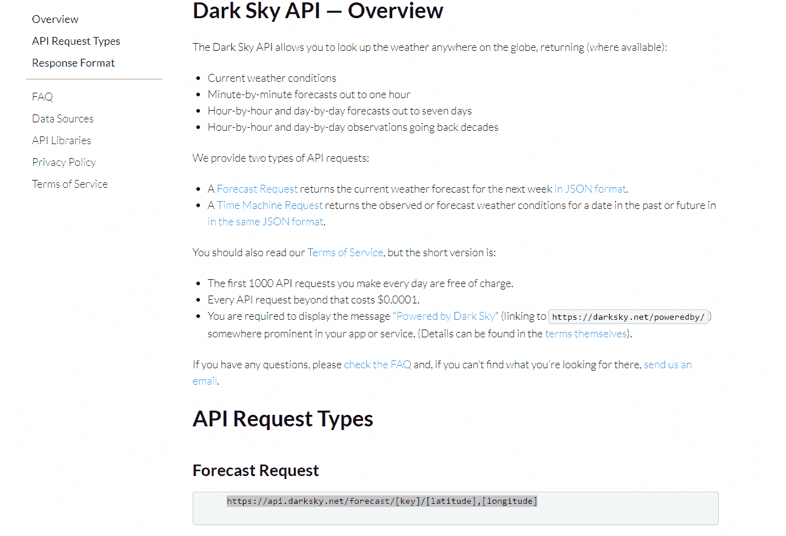

在 API 文档链接中，我们有一个天气预报请求 URL。如前图所示，这个 URL 正是我们需要发出请求以获取数据的 URL。

# 探索实际的代码 URL

在将此 URL 添加到我们的应用程序并使用请求库之前，我们需要找到实际的 URL，我们可以用它来发出请求。为此，我们将复制它并粘贴到一个新的标签页中：

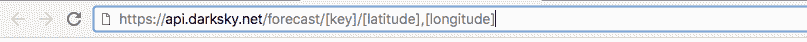

现在，我们确实需要替换一些 URL 信息。例如，我们有需要替换的 API 密钥，我们还有纬度和经度。这两者都需要用真实的数据替换。让我们从 API 密钥开始，因为我们已经将它复制并粘贴到`app.js`中。我们将复制 API 密钥，并用实际值替换`[key]`。

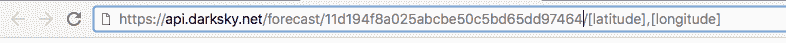

接下来，我们可以获取一组经度和纬度坐标。为此，进入终端并运行我们的应用程序，`node app.js`，对于地址，我们可以使用任何邮政编码，比如`19146`来获取纬度和经度坐标。

接下来，我们将复制这些内容并放入 URL 中。纬度放在斜杠和逗号之间，经度将放在逗号之后，如下所示：

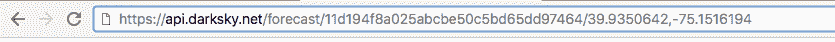

一旦我们有了一个真实的 URL，其中所有这三个信息都被实际信息替换掉，我们就可以发出请求，我们将得到的是天气预报信息：

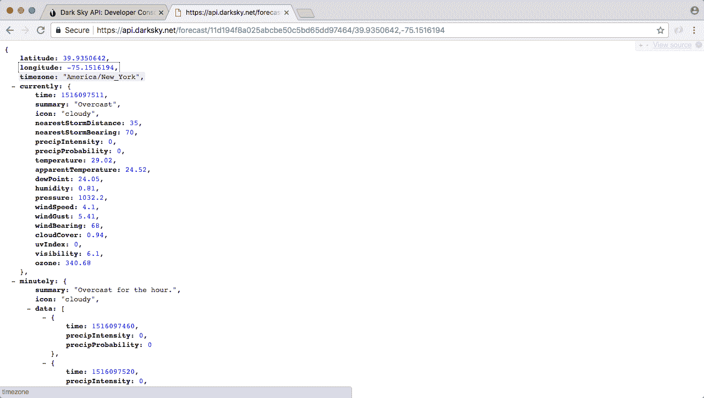

请记住，这种方式显示在前面的图像中的信息是由 JSONView 生成的，我强烈建议安装它。

现在我们得到的数据是令人不知所措的。我们有按分钟的预报，按小时的预报，按周的预报，按天的预报，各种各样的信息，这些信息非常有用，但也非常令人不知所措。在本章中，我们将使用`currently`中的第一个对象。这存储了所有当前的天气信息，比如当前的摘要是晴朗，温度，降水概率，湿度，很多真正有用的信息都在其中。

在我们的情况下，我们真正关心的是温度。费城的当前温度显示为`84.95`度。这是我们想在应用程序中使用的信息，当有人搜索特定位置的天气时。

# 使用静态 URL 请求天气应用程序

现在，为了玩转天气 API，我们将采用在上一节中定义的完全相同的 URL，并在`app.js`中发出请求。首先，我们需要做一些设置工作。

在`app.js`中，我们将注释掉到目前为止的所有内容，并在我们的 API 密钥旁边，我们将调用请求，请求这个确切的 URL，就像我们在上一节/章节中为地理编码 API 所做的那样，然后我们将打印出`body.currently.temperature`属性到屏幕上，这样当我们运行应用程序时，我们将看到我们使用的纬度和经度的当前温度。在我们的情况下，它是代表费城的静态纬度和经度。

为了开始，我们将加载请求。现在我们之前在`app.js`文件中有它，然后我们在上一节中将它移除了，但是我们将再次添加它。我们将它添加到注释掉的代码旁边，通过创建一个名为`request`的常量，并加载它，`const request`等于`require('request')`：

```js
const request = require('request');
```

现在我们可以继续进行实际请求，就像我们为地理编码 API 所做的那样，通过调用`request`，这是一个与此函数相同的函数：

```js
const request = require('request');

request();
```

我们必须传入我们的两个参数，选项对象是第一个，第二个是箭头函数：

```js
request({}, () => {

});
```

这是我们的回调函数，一旦 HTTP 请求完成就会触发。在填写实际函数之前，我们要设置我们的选项。有两个选项，URL 和 JSON。我们将`url`设置为静态字符串，即我们在浏览器中的确切 URL：

```js
request({
 url: 'https://api.forecast.io/forecast/4a04d1c42fd9d32c97a2c291a32d5e2d/39.9396284,-75.18663959999999',

}, () => {
```

然后在逗号后的下一行，我们可以将`json`设置为`true`，告诉请求库继续解析该 JSON，这就是它的作用：

```js
request({
 url: 'https://api.forecast.io/forecast/4a04d1c42fd9d32c97a2c291a32d5e2d/39.9396284,-75.18663959999999',
 json: true
}, () => {
```

从这里，我们可以继续添加我们的回调参数；`error`，`response`和`body`。这些是我们在`geocode.js`文件的`geocoding`请求的`if`块中具有的完全相同的三个参数：

```js
request({
 url: 'https://api.forecast.io/forecast/4a04d1c42fd9d32c97a2c291a32d5e2d/39.9396284,-75.18663959999999',
 json: true
}, (error, response, body) => {

});
```

既然我们已经做到了这一点，我们需要做的最后一件事就是打印当前温度，这是在`body`中使用`console.log`语句可用的。我们将使用`console.log`来打印`body.currently.temperature`，如下所示：

```js
request({
 url: 'https://api.forecast.io/forecast/4a04d1c42fd9d32c97a2c291a32d5e2d/39.9396284,-75.18663959999999',
 json: true
}, (error, response, body) => {
  console.log(body.currently.temperature);
});
```

既然我们已经打印了温度，我们需要通过从终端运行来测试它。在终端中，我们将重新运行之前的命令。这里实际上没有使用地址，因为我们已经注释掉了那段代码，我们得到的是 28.65，如代码输出所示：

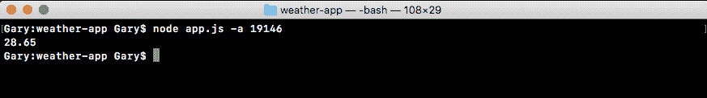

我们的天气 API 调用已经在应用程序中工作。

# 回调函数中的错误处理

现在我们确实想在回调函数中添加一些错误处理。我们将在错误对象上处理错误，还将处理从[forecast.io](http://forecast.io)服务器返回的错误。首先，就像我们为地理编码 API 所做的那样，我们将检查错误是否存在。如果存在，这意味着我们无法连接到服务器，因此我们可以打印一条向用户传达该消息的消息，`console.log`类似于`无法连接到 forecast.io 服务器。`：

```js
request({
 url: 'https://api.forecast.io/forecast/4a04d1c42fd9d32c97a2c291a32d5e2d/39.9396284,-75.18663959999999',
 json: true
}, (error, response, body) => {
  if (error){
    console.log('Unable to connect to Forecast.io server.');
  }
  console.log(body.currently.temperature);
});
```

现在我们已经处理了一般错误，我们可以继续处理[forecast.io](http://forecast.io) API 抛出的特定错误。当 URL 的格式，即纬度和经度不正确时，就会发生这种情况。

例如，如果我们删除 URL 中包括逗号的一些数字，然后按*enter*，我们将得到 400 Bad Request：

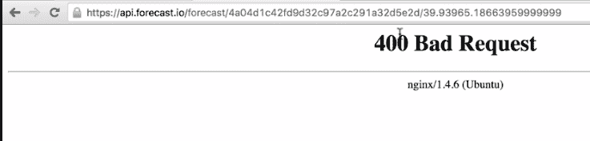

这是实际的 HTTP 状态码。如果你还记得`geolocation` API 中的`body.status`属性，它要么是`OK`，要么是`ZERO_RESULTS`。这与该属性类似，只是这里使用了 HTTP 机制，而不是谷歌使用的某种自定义解决方案。在我们的情况下，我们将检查状态码是否为 400。现在，如果我们有一个错误的 API 密钥，我将在 URL 中添加一些 e，我们也会得到 400 Bad Request：

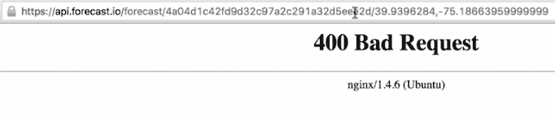

因此，这两个错误都可以使用相同的代码来处理。

在 Atom 中，我们可以通过检查状态码属性来处理这个问题。在我们的`if`语句的闭合大括号之后，我们将添加`else if`块，`else if (response.statusCode)`，这是我们在详细查看响应参数时查看的属性。如果出现问题，`response.statusCode`将等于`400`，这正是我们要在这里检查的：

```js
if (error){
  console.log('Unable to connect to Forecast.io server.');
} else if (response.statusCode === 400) {

}
```

如果状态码是`400`，我们将打印一条消息，`console.log('无法获取天气')`：

```js
if (error){
  console.log('Unable to connect to Forecast.io server.');
} else if (response.statusCode === 400) {
  console.log('Unable to fetch weather.');
}
```

现在我们已经处理了这两个错误，我们可以继续处理成功的情况。为此，我们将添加另一个`else if`块，其中`response.statusCode`等于`200`。如果一切顺利，状态码将等于`200`，在这种情况下，我们将把当前温度打印到屏幕上。

我将删除`console.log(body.currently.temperature)`行，并将其粘贴到 else if 代码块中：

```js
  if (error){
    console.log('Unable to connect to Forecast.io server.');
  } else if (response.statusCode === 400) {
    console.log('Unable to fetch weather.');
  } else if (response.statusCode === 200) {
    console.log(body.currently.temparature);
  }
});
```

# 另一种错误处理方式

还有另一种方法来表示我们整个 if 块代码。以下是一个更新的代码片段，我们实际上可以用这段代码替换当前回调函数中的所有内容：

```js
if (!error && response.statusCode === 200) {
  console.log(body.currently.temperature);
} else {
  console.log('Unable to fetch weather.');
}
```

这个条件检查是否没有错误并且响应状态码是`200`，如果是这样，我们该怎么办？我们只需像上次一样打印温度，那是在最底部的`else if`子句中。现在我们在更新的代码片段中有一个`else`情况，所以如果有错误或状态码不是`200`，我们将继续打印这条消息到屏幕上。这将处理服务器没有网络连接，或者来自无效或损坏 URL 的 404。好了，使用这段代码，一切应该按照最新版本的天气 API 预期的那样工作。

# 测试回调中的错误处理

现在我们已经放置了一些错误处理，我们可以继续测试我们的应用程序是否仍然有效。从终端中，我们将重新运行之前的命令，我们仍然得到一个温度 28.71：

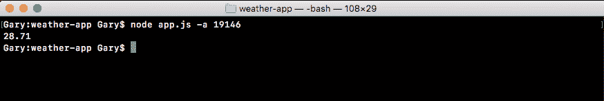

在 Atom 中，我们将通过去掉逗号来清除一些数据，保存文件：

```js
request({
 url: 'https://api.forecast.io/forecast/4a04d1c42fd9d32c97a2c291a32d5e2d/39.9396284-75.18663959999999',
 json: true
}, (error, response, body) => {
  if (error){
    console.log('Unable to connect to Forecast.io server.');
  } else if (response.statusCode === 400) {
    console.log('Unable to fetch weather.');
  } else if (response.statusCode === 200) {
    console.log(body.currently.temparature);
  }
});
```

当我们从终端重新运行它时，这次，我们期望“无法获取天气。”打印到屏幕上，当我重新运行应用程序时，这正是我们得到的，如下所示：

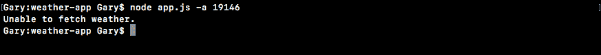

现在，让我们把逗号加回去，测试我们代码的最后一部分。为了测试错误，我们可以通过从`forecast.io`中删除点这样的东西来测试：

```js
request({
 url: 'https://api.forecastio/forecast/4a04d1c42fd9d32c97a2c291a32d5e2d/39.9396284,-75.18663959999999',
 json: true
}, (error, response, body) => {
```

我们可以重新运行应用程序，我们会看到“无法连接到 Forecast.io 服务器。”：

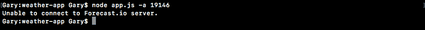

我们所有的错误处理都很好用，如果没有错误，适当的温度将打印到屏幕上，这太棒了。

# 链接回调

在这一节中，我们将把我们在上一节中创建的代码分解成自己的文件。类似于我们在调用`geocodeAddress`时所做的地理编码 API 请求，而不是实际在`app.js`中进行请求调用。这意味着我们将创建一个新文件夹，一个新文件，并在其中创建一个导出的函数。

之后，我们将继续学习如何将回调链接在一起。因此，当我们从终端获取该地址时，我们可以将其转换为坐标。然后我们可以将这些坐标转换为温度信息，或者我们想要从 Forecast API 的返回结果中获取的任何天气数据。

# 重构我们在 weather.js 文件中的请求调用

现在在我们进行重构之前，我们将创建一个全新的文件，并且我们将担心将我们在上一节中创建的代码放入该函数中。然后我们将创建回调。

# 在 weather 文件中定义新函数 getWeather

首先，让我们创建目录。目录将被称为`weather`。在`weather`目录中，我们将创建一个名为`weather.js`的新文件。

现在在这个文件中，我们可以将我们从`app.js`中的所有代码复制到`weather.js`中：

```js
const request = require('request');

request({
  url: 'https://api.forecast.io/forecast/4a04d1c42fd9d32c97a2c291a32d5e2d/39.9396284,-75.18663959999999',
  json: true
}, (error, response, body) => {
  if (error) {
    console.log('Unable to connect to Forecast.io server.');
  } else if (response.statusCode === 400) {
    console.log('Unable to fetch weather.');
  } else if (response.statusCode === 200) {
    console.log(body.currently.temperature);
  }
});
```

为了将这段代码转换为创建该函数所需的唯一事情，我们将调用请求移到其中。我们将创建一个名为`getWeather`的全新函数，放在`request`变量旁边：

```js
const request = require('request');
var getWeather = () => {

};
```

`getWeather`将需要一些参数，但这将稍后添加。现在我们将保持参数列表为空。接下来，我们将把我们对请求的调用移到`getWeather`函数内部：

```js
const request = require('request');
var getWeather = () => {
  request({
   url: 'https://api.forecast.io/forecast/4a04d1c42fd9d32c97a2c291a32d5e2d/39.9396284,-75.18663959999999',
   json: true
}, (error, response, body) => {
  if (error) {
    console.log('Unable to connect to Forecast.io server.');
  } else if (response.statusCode === 400) {
    console.log('Unable to fetch weather.');
  } else if (response.statusCode === 200) {
    console.log(body.currently.temperature);
  }
});
};
```

然后，我们可以继续导出这个`getWeather`函数。我们将添加`module.exports.getWeather`并将其设置为我们定义的`getWeather`函数：

```js
module.exports.getWeather = getWeather;
```

# 在 app.js 中提供 weather 目录

现在我们已经准备就绪，可以继续进入`app.js`添加一些代码。我们需要做的第一件事是删除 API 密钥。我们不再需要它。然后我们将突出显示所有注释掉的代码，并使用命令`/`取消注释。

现在我们将导入`weather.js`文件。我们将创建一个名为`weather`的`const`变量，并将其设置为`require`返回的结果：

```js
const yargs = require('yargs');

const geocode = require('./geocode/geocode');
const weather = require('');
```

在这种情况下，我们正在引入我们刚刚创建的全新文件。我们将提供一个相对路径`./`，因为我们正在加载我们编写的文件。然后我们将提供名为`weather`的目录，后跟名为`weather.js`的文件。我们可以省略`js`扩展名，因为我们已经知道：

```js
const weather = require('./weather/weather');
```

现在我们已经加载了天气 API，我们可以继续调用它。我们将注释掉对`geocodeAddress`的调用，并运行`weather.getWeather()`：

```js
// geocode.geocodeAddress(argv.address, (errorMessage, results) => {
//  if (errorMessage) {
//    console.log(errorMessage);
//  } else {
//    console.log(JSON.stringify(results, undefined, 2));
//  }
//});

weather.getWeather();
```

正如我之前提到的，后面将有参数。现在我们将把它们留空。我们可以从终端运行我们的文件。这意味着我们应该看到我们在上一节中硬编码的坐标的天气打印出来。因此，我们将运行`node app.js`。因为我们没有注释掉 yargs 代码，所以我们需要提供一个地址。因此，我们将添加一个虚拟地址。我将使用新泽西州的邮政编码：

```js
node app.js -a 08822
```

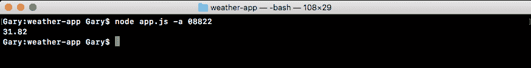

现在，`geolocation`代码从未运行，因为它被注释掉了。但是我们正在运行已移至新文件的天气代码。我们确实看到了温度为 31.82 度，这意味着代码在新文件中得到了正确执行。

# 在`getWeather`函数中传递参数

现在我们需要传入一些参数，包括回调函数和天气文件中的`getWeather`变量。我们需要使用这些参数来代替静态的`lat`/`lng`对。我们还需要调用回调函数，而不是使用`console.log`。在我们实际更改`weather.js`代码之前，我们需要做的第一件事是更改`app.js`代码。需要添加三个参数。这些是`lat`，`lng`和`callback`。

首先，我们需要传入纬度。我们将从`weather.js`中的 URL 中获取静态数据，复制它，并将其粘贴到`app.js`的参数列表中作为第一个参数。接下来是经度。我们将从 URL 中获取它，复制它，并将其粘贴到`app.js`中作为第二个参数：

```js
// lat, lng, callback
weather.getWeather(39.9396284, -75.18663959999999);
```

然后我们可以继续提供第三个参数，这将是回调函数。一旦天气数据从 API 返回，这个函数将被触发。我将使用一个箭头函数，它将得到我们在上一节中讨论过的那两个参数：`errorMessage`和`weatherResults`：

```js
weather.getWeather(39.9396284, -75.18663959999999, (errorMessage, weatherResults) => {

});
```

`weatherResults`对象包含我们想要的任何温度信息。在这种情况下，它可以是温度和实际温度。现在，我们已经在`geocodeAddress`中使用`weatherResults`代替`results`，这是因为我们想要区分`weatherResults`和`geocodeAddress`中的`results`变量。

# 在`getWeather`函数中打印`errorMessage`

在`app.js`中的`getWeather`函数内部，我们现在需要使用`if`-`else`语句来根据错误消息是否存在来打印适当的内容到屏幕上。如果有`errorMessage`，我们确实希望使用`console.log`来打印它。在这种情况下，我们将传入`errorMessage`变量：

```js
weather.getWeather(39.9396284, -75.18663959999999, (errorMessage, weatherResults) => {
  if (errorMessage) {
    console.log(errorMessage);
  }
});
```

现在如果没有错误消息，我们将使用`weatherResults`对象。稍后我们将打印一个漂亮格式的消息。现在我们可以简单地使用我们在上一章中讨论过的漂亮打印技术，即在`console.log`中调用`JSON.stringify`来打印`weatherResults`对象：

```js
weather.getWeather(39.9396284, -75.18663959999999, (errorMessage, weatherResults) => {
  if (errorMessage) {
    console.log(errorMessage);
  } else {
    console.log(JSON.stringify());
  }
});
```

在`JSON.stringify`的括号内，我们将提供这三个参数，实际对象；`weatherResults`，我们的过滤函数的`undefined`，以及缩进的数字。在这种情况下，我们将再次选择`2`：

```js
weather.getWeather(39.9396284, -75.18663959999999, (errorMessage, weatherResults) => {
  if (errorMessage) {
    console.log(errorMessage);
  } else {
    console.log(JSON.stringify(weatherResults, undefined, 2));
  }
});
```

现在我们已经用所有三个参数调用了`getWeather`，我们可以继续实际在`weather.js`中实现这个调用。

# 在 weather.js 文件中实现 getWeather 回调

首先，我们将使`weather.js`文件中的 URL 动态化，这意味着我们需要用模板字符串替换 URL 字符串。一旦我们有了模板字符串，我们就可以将纬度和经度的参数直接注入 URL 中。

# 添加动态纬度和经度

让我们继续定义传入的所有参数。我们添加`lat`，`lng`和我们的`callback`：

```js
var getWeather = (lat, lng, callback) => {
```

首先让我们注入那个纬度。我们将取出静态纬度，然后在斜杠和逗号之间使用花括号和美元符号注入它。这让我们能够将一个值注入到我们的模板字符串中；在这种情况下是`lat`。然后我们可以在逗号后面做完全相同的事情，注入经度。我们将删除静态经度，使用美元符号和花括号将变量注入到字符串中：

```js
var getWeather = (lat, lng, callback) => {
  request({
    url: `https://api.forecast.io/forecast/4a04d1c42fd9d32c97a2c291a32d5e2d/${lat},${lng}`,
```

现在 URL 是动态的，我们在`getWeather`中需要做的最后一件事是将我们的`console.log`调用更改为`callback`调用。

# 将 console.log 调用更改为 callback 调用

要将我们的`console.log`更改为`callback`调用，对于前两个`console.log`调用，我们可以将`console.log`替换为`callback`。这将与我们在`app.js`中指定的参数对齐，第一个是`errorMessage`，第二个是`weatherResults`。在这种情况下，我们将传递`errorMessage`，第二个参数是`undefined`，这应该是的。我们可以对`Unable to fetch weather`做同样的事情：

```js
if (error) {
  callback('Unable to connect to Forecast.io server.');
} else if (response.statusCode === 400) {
  callback('Unable to fetch weather.');
}
```

现在第三个`console.log`调用将会更复杂一些。我们将不得不创建一个对象，而不仅仅是传递温度。我们将用第一个参数调用`callback`，因为在这种情况下没有`errorMessage`。相反，我们将提供`weatherResults`对象：

```js
if (error) {
  callback('Unable to connect to Forecast.io server.');
} else if (response.statusCode === 400) {
  callback('Unable to fetch weather.');
} else if (response.statusCode === 200) {
  callback(undefined, {

  })
  console.log(body.currently.temperature);
}
```

在括号内，我们可以定义我们喜欢的所有温度属性。在这种情况下，我们将定义`temperature`，将其设置为`body.currently`，它存储所有`currently`天气数据，`.temperature`：

```js
else if (response.statusCode === 200) {
  callback(undefined, {
    temperature: body.currently.temperature
  })
  console.log(body.currently.temperature);
}
```

现在我们有了`temperature`变量，我们可以继续为对象提供第二个属性，即`实际温度`。实际温度将考虑湿度、风速和其他天气条件。实际温度数据在当前称为`apparentTemperature`的属性下可用。我们将提供它。作为值，我们将使用相同的东西。这将使我们得到`currently`对象，就像我们为温度所做的那样。这将是`body.currently.apparentTemperature`：

```js
else if (response.statusCode === 200) {
  callback(undefined, {
    temperature: body.currently.temperature,
    apparentTemperature: body.currently.apparentTemperature
  })
  console.log(body.currently.temperature);
}
```

现在我们有了两个属性，所以我们可以继续删除那个`console.log`语句。添加一个分号。最终的代码将如下所示：

```js
const request = require('request');

var getWeather = (lat, lng, callback) => {
  request({
    url: `https://api.forecast.io/forecast/4a04d1c42fd9d32c97a2c291a32d5e2d/${lat},${lng}`,
    json: true
  }, (error, response, body) => {
    if (error) {
      callback('Unable to connect to Forecast.io server.');
    } else if (response.statusCode === 400) {
      callback('Unable to fetch weather.');
    } else if (response.statusCode === 200) {
      callback(undefined, {
        temperature: body.currently.temperature,
        apparentTemperature: body.currently.apparentTemperature
      });
    }
  });
};

module.exports.getWeather = getWeather;
```

现在我们可以继续运行应用程序。我们已经在`weather.js`文件和`app.js`文件中都连接了`getWeather`函数。现在我们再次使用静态坐标，但这将是我们最后一次使用静态数据运行文件。从终端中，我们将重新运行应用程序：

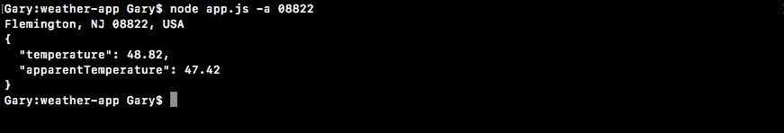

如图所示，我们将我们的温度对象打印到屏幕上。我们有我们的温度属性 48.82，还有明显温度，已经达到了 47.42 度。

有了这个，我们现在准备好学习如何将我们的回调链接在一起。这意味着在`app.js`中，我们将获取从`geocodeAddress`返回的结果，将它们传递给`getWeather`，并用它来打印您在终端中提供的地址的动态天气。在这种情况下，我们将获取新泽西镇的地址。与我们在`app.js`文件中使用的静态地址相反，那个纬度/经度对是为费城的。

# 将 geocodeAddress 和 getWeather 回调链接在一起

首先，我们必须将我们的`getWeather`调用移动到`geocodeAddress`的`callback`函数中。因为在这个`callback`函数中是我们唯一可以访问纬度和经度对的地方。

现在，如果我们打开`geocode.js`文件，我们可以看到我们得到`formatted_address`作为地址属性，我们得到`latitude`作为纬度，我们得到`longitude`作为经度。我们将开始连接这些。

# 将 getWeather 调用移到 geocodeAddress 函数中

首先，我们需要在`app.js`中删除`geocodeAddress`的注释。

接下来，我们将继续，将成功情况下的`console.log`语句替换为一个将打印格式化地址的`console.log`调用：

```js
geocode.geocodeAddress(argv.address, (errorMessage, results) => {
  if (errorMessage) {
    console.log(errorMessage);
  } else {
    console.log(results.address);
  }
});
```

这将在屏幕上打印地址，这样我们就知道我们获取天气数据的确切地址。

现在我们已经让`console.log`打印出地址，我们可以把`getWeather`调用移到`console.log`行的下面：

```js
geocode.geocodeAddress(argv.address, (errorMessage, results) => {
  if (errorMessage) {
    console.log(errorMessage);
  } else {
    console.log(results.address);
    weather.getWeather(39.9396284, -75.18663959999999, 
    (errorMessage, weatherResults) => {
      if (errorMessage) {
        console.log(errorMessage);
      } else {
        console.log(JSON.stringify(weatherResults, undefined, 2));
      }
    });
  }
});
```

有了这个，我们现在非常接近实际将这两个回调链接在一起。唯一剩下的就是用动态坐标替换这些静态坐标，这些动态坐标将在`results`对象中可用。

# 用动态坐标替换静态坐标

第一个参数将是`results.latitude`，我们在`app.js`中定义的对象。第二个参数将是`results.longitude`：

```js
geocode.geocodeAddress(argv.address, (errorMessage, results) => {
  if (errorMessage) {
    console.log(errorMessage);
  } else {
    console.log(results.address);
    weather.getWeather(results.latitude, results.longitude, 
    (errorMessage, weatherResults) => {
      if (errorMessage) {
        console.log(errorMessage);
      } else {
        console.log(JSON.stringify(weatherResults, undefined, 2));
      }
    });
  }
});
```

这就是我们需要做的一切，将数据从`geocodeAddress`传递给`getWeather`。这将创建一个在终端中打印我们动态天气的应用程序。

现在在我们继续运行之前，我们将用更格式化的对象调用替换它。我们将从`weather.js`文件中获取`temperature`变量和`apparentTemperature`变量的信息，并在`app.js`中的字符串中使用它们。这意味着我们可以删除`getWeather`调用的`else`块中的`console.log`，并用不同的`console.log`语句替换它：

```js
if (errorMessage) {
  console.log(errorMessage);
} else {
  console.log();
}
```

我们将使用模板字符串，因为我们计划注入一些变量，这些变量是当前的温度。我们将使用`weatherResults.temperature`进行注入。然后我们可以继续添加一个句号，然后添加类似于：`It feels like`，后面跟着`apparentTemperature`属性，我将使用`weatherResults.apparentTemperature`进行注入。之后我会加一个句号：

```js
if (errorMessage) {
  console.log(errorMessage);
} else {
  console.log(`It's currently ${weatherResults.temperature}. It feels like 
    ${weatherResults.apparentTemperature}`);
}
```

我们现在有一个`console.log`语句，可以将天气打印到屏幕上。我们还有一个可以将地址打印到屏幕上的语句，我们还为`geocodeAddress`和`getWeather`都设置了错误处理程序。

# 测试回调链的链接

让我们继续测试，通过在终端中重新运行`node app.js`命令。我们将使用相同的邮政编码`08822`：

```js
node app.js -a 08822
```

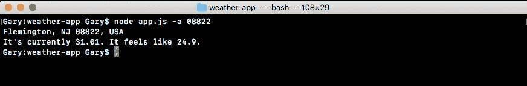

当我们运行它时，我们得到了 Flemington, NJ 作为格式化的地址，当前温度是 31.01 度。体感温度是 24.9 度。现在为了测试这个是否有效，我们将在引号内输入其他内容，比如`Key West fl`：

```js
node app.js -a 'Key West fl'
```

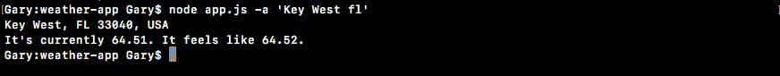

当我们运行这个命令时，我们确实得到了 Key West, FL 作为格式化的地址，当前温度是 64.51 度。体感温度是 64.52 度。

有了这个，天气应用程序现在已经连接起来了。我们获取地址，使用 Google Geocoding API 获取纬度/经度对。然后我们使用我们的预报 API 将这个纬度/经度对转换成温度信息。

# 总结

在本章中，我们学习了如何为`weather-app`文件设置 yargs，以及如何在其中包含用户输入。接下来，我们研究了如何处理回调函数中的错误以及如何从这些错误中恢复。我们只是在`callback`函数中添加了`else`/`if`语句。回调函数只是一个函数，所以为了弄清楚事情是顺利进行还是出了问题，我们必须使用`else`/`if`语句，这让我们可以根据我们是否认为请求进行顺利来执行不同的操作，比如打印不同的消息。然后，我们发出了第一个天气 API 请求，并研究了根据经纬度组合获取天气的方法。

上一次，我们讨论了链接`geocodeAddress`和`getWeather`调用函数。我们将最初在`app.js`中的请求调用移动到了`weather.js`中，并在那里定义了它。我们使用回调将`weather.js`中的数据传递到了我们导入`weather.js`文件的`app.js`中。然后，在`geocodeAddress`的回调中调用`getWeather`，在`getWeather`的回调中将天气特定信息打印到屏幕上。所有这些都是使用回调函数完成的。

在下一章中，我们将讨论使用 ES6 promises 来同步异步代码的另一种方法。
