# 第七章：异步编程中的 promises

在前两章中，我们学习了 Node 中许多重要的异步编程概念。本章是关于 promises 的。自 ES6 以来，JavaScript 中就有了 promises。尽管它们在第三方库中已经存在了相当长的时间，但它们最终进入了核心 JavaScript 语言，这很棒，因为它们是一个真正棒的特性。

在本章中，我们将学习 promise 的工作原理，开始了解它们为什么有用，以及它们为什么甚至存在于 JavaScript 中。我们将看一下一个叫做 axios 的库，它支持 promises。这将让我们简化我们的代码，轻松地创建我们的 promise 调用。我们实际上将在最后一节重新构建整个天气应用程序。

具体来说，我们将研究以下主题：

+   ES6 promises 简介

+   高级 promises

+   使用 promises 的天气应用程序

# ES6 promises 简介

Promises 旨在解决我们的应用程序中存在大量异步代码时出现的许多问题。它们使我们更容易管理我们的异步计算，比如从数据库请求数据。或者在天气应用程序的情况下，比如从 URL 获取数据。

在`app.js`文件中，我们使用回调做了类似的事情：

```js
const yargs = require('yargs');

const geocode = require('./geocode/geocode');
const weather = require('./weather/weather');

const argv = yargs
  .options({
    a: {
      demand: true,
      alias: 'address',
      describe: 'Address to fetch weather for',
      string: true
    }
  })
  .help()
  .alias('help', 'h')
  .argv;

geocode.geocodeAddress(argv.address, (errorMessage, results) => {
  if (errorMessage) {
    console.log(errorMessage);
  } else {
    console.log(results.address);
    weather.getWeather(results.latitude, results.longitude, (errorMessage, weatherResults) => {
      if (errorMessage) {
        console.log(errorMessage);
      } else {
        console.log(`It's currently ${weatherResults.temperature}. It feels like ${weatherResults.apparentTemperature}.`);
      }
    });
  }
});
```

在这段代码中，我们有两个回调：

+   传递给`geocodeAddress`的一个

+   传递给`getWeather`的一个

我们使用这个来管理我们的异步操作。在我们的情况下，这些操作包括从 API 获取数据，使用 HTTP 请求。在这个例子中，我们可以使用 promises 来使代码更加简洁。这正是本章的目标。

在本节中，我们将探讨 promise 的基本概念。我们暂时不会比较和对比回调和 promise，因为有很多微妙之处，不能在不知道 promise 如何工作的情况下描述。因此，在我们讨论它们为什么更好之前，我们将简单地创建一些。

# 创建一个例子 promise

在 Atom 中，我们将在`playground`文件夹中创建一个新文件，并将其命名为`promise.js`。在我们定义 promise 并讨论它们的工作原理之前，我们将通过一个简单的例子来运行，因为这是学习任何东西的最佳方式——通过一个例子并看到它是如何工作的。

首先，我们将通过一个非常基本的例子来开始。我们将坚持核心 promise 功能。

要开始这个非常简单的例子，我们将创建一个名为`somePromise`的变量。这将最终存储 promise 对象。我们将在这个变量上调用各种方法来处理 promise。我们将把`somePromise`变量设置为 promise 构造函数的返回结果。我们将使用`new`关键字创建 promise 的新实例。然后，我们将提供我们想要创建新实例的东西，`Promise`，如下所示：

```js
var somePromise = new Promise
```

现在这个`Promise`函数，实际上是一个函数——我们必须像调用函数一样调用它；也就是说，它需要一个参数。这个参数将是一个函数。我们将使用一个匿名箭头函数(`=>`)，在其中，我们将做所有我们想做的异步工作：

```js
var somePromise = new Promise(() => {

});
```

它将被抽象化，有点像我们在`geocode.js`文件的`geocodeAddress`函数中抽象化 HTTP 请求一样：

```js
const request = require('request');

var geocodeAddress = (address, callback) => {
  var encodedAddress = encodeURIComponent(address);

  request({
    url: `https://maps.googleapis.com/maps/api/geocode/json?address=${encodedAddress}`,
    json: true
  }, (error, response, body) => {
    if (error) {
      callback('Unable to connect to Google servers.');
    } else if (body.status === 'ZERO_RESULTS') {
      callback('Unable to find that address.');
    } else if (body.status === 'OK') {
      callback(undefined, {
        address: body.results[0].formatted_address,
        latitude: body.results[0].geometry.location.lat,
        longitude: body.results[0].geometry.location.lng
      });
    }
  });
};

module.exports.geocodeAddress = geocodeAddress;
```

`geocodeAddress`函数中的所有复杂逻辑确实需要发生，但`app.js`文件不需要担心它。`app.js`文件中的`geocode.geocodeAddress`函数有一个非常简单的`if`语句，检查是否有错误。如果有错误，我们将打印一条消息，如果没有，我们将继续。同样的情况也适用于 promises。

`new Promise`回调函数将使用两个参数`resolve`和`reject`调用：

```js
var somePromise = new Promise((resolve, reject) => {

});
```

这就是我们管理承诺状态的方式。当我们做出承诺时，我们正在做出承诺；我们在说，“嘿，我会去并且为你获取那个网站的数据。”现在这可能会顺利进行，这种情况下，你会`resolve`承诺，将其状态设置为实现。当一个承诺实现时，它已经出去并且做了你期望它做的事情。这可能是一个数据库请求，一个 HTTP 请求，或者完全不同的东西。

现在当你调用`reject`时，你是在说，“嘿，我们试图完成那件事，但我们就是无法。”所以承诺被认为是被拒绝的。这是你可以设置一个承诺的两种状态——实现或拒绝。就像在`geocode.js`中一样，如果事情顺利进行，我们要么为错误提供一个参数，要么为第二个参数提供一个参数。不过，承诺给了我们两个可以调用的函数。

现在，为了准确说明我们如何使用这些，我们将调用`resolve`。再次强调，这不是异步的。我们还没有做任何事情。所以所有这些都将在终端中实时发生。我们将使用一些数据调用`resolve`。在这种情况下，我将传入一个字符串`嘿。它起作用了！`如下所示：

```js
var somePromise = new Promise((resolve, reject) => {
     resolve('Hey. It worked!');
});
```

现在这个字符串就是承诺实现的价值。这正是某人会得到的。在应用文件中的`geocode.geocodeAddress`函数的情况下，它可能是数据，无论是结果还是错误消息。但在我们的情况下，我们使用`resolve`，所以这将是用户想要的实际数据。当事情顺利进行时，“嘿。它起作用了！”就是他们期望的。

现在你只能给`resolve`和`reject`传递一个参数，这意味着如果你想提供多个信息，我建议你解决或拒绝一个对象，你可以在上面设置多个属性。但在我们的情况下，一个简单的消息“嘿。它起作用了！”就可以了。

# 然后调用承诺方法

现在，为了在承诺被实现或拒绝时实际执行某些操作，我们需要调用一个名为`then`的承诺方法；`somePromise.then`。`then`方法让我们为成功和错误情况提供`回调`函数。这是回调和承诺之间的一个区别。在回调中，我们有一个无论如何都会触发的函数，参数让我们知道事情是否顺利进行。而在承诺中，我们将有两个函数，这将决定事情是否按计划进行。

现在在我们深入添加两个函数之前，让我们先从一个函数开始。在这里，我将调用`then`，传入一个函数。只有在承诺实现时，这个函数才会被调用。这意味着它按预期工作。当它这样做时，它将被调用并传递给`resolve`。在我们的情况下，它是一个简单的`message`，但在数据库请求的情况下，它可以是像用户对象这样的东西。不过，现在我们将坚持使用`message`：

```js
somePromise.then((message) => {

})
```

这将在屏幕上打印`message`。在回调中，当承诺得到实现时，我们将调用`console.log`，打印“成功”，然后作为第二个参数，我们将打印实际的`message`变量：

```js
somePromise.then((message) => {
  console.log('Success: ', message);
})
```

# 在终端中运行承诺示例

现在我们已经有了一个非常基本的承诺示例，让我们使用我们在上一章中安装的`nodemon`从终端运行它。我们将添加`nodemon`，然后进入`playground`文件夹，`/promise.js`。

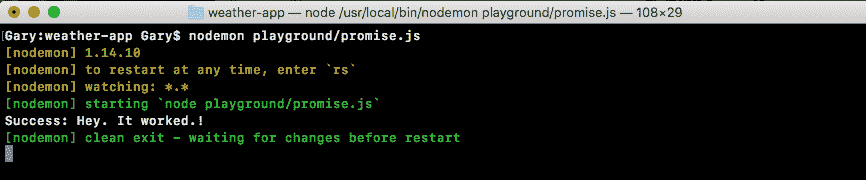

当我们立即这样做时，我们的应用程序运行并且我们获得成功。“嘿。它起作用了！”这是瞬间发生的。没有延迟，因为我们还没有异步地做任何事情。现在当我们首次探索回调时（参见第五章，*Node.js 中异步编程的基础*），我们使用`setTimeout`来模拟延迟，这正是我们在这种情况下要做的。

在我们的`somePromise`函数中，我们将调用`setTimeout`，传入两个参数：延迟后要调用的函数和以毫秒为单位的延迟。我将选择`2500`，即 2.5 秒：

```js
var somePromise = new Promise((resolve, reject) => {
 setTimeout(() => {

}, 2500);
```

现在在这 2.5 秒之后，然后，只有在这时，我们才希望`resolve`承诺。这意味着我们的函数，我们传递给`then`的函数将在 2.5 秒后才会被调用。因为，正如我们所知，这将在承诺解决之前不会被调用。我将保存文件，这将重新启动`nodemon`：


在终端中，你可以看到我们有延迟，然后`success: Hey it worked!`打印到屏幕上。这 2.5 秒的延迟是由`setTimeout`引起的。延迟结束后（在这种情况下是人为延迟，但以后将是真正的延迟），我们能够用数据`resolve`。

# 承诺中的错误处理

现在有可能事情并不顺利。我们必须在 Node 应用程序中处理错误。在这种情况下，我们不会调用`resolve`，而是会调用`reject`。让我们注释掉`resolve`行，并创建第二行，在这一行中我们调用`reject`。我们将以与调用`resolve`相同的方式调用`reject`。我们必须传入一个参数，在这种情况下，一个简单的错误消息如`无法实现承诺`就可以了。

```js
var somePromise = new Promise((resolve, reject) => {
  setTimeout(() => {
    // resolve('Hey. It worked!');
    reject('Unable to fulfill promise');
  }, 2500);
});
```

现在当我们调用`reject`时，我们告诉承诺它已被拒绝。这意味着我们尝试的事情并不顺利。目前，我们没有处理这一点的参数。正如我们提到的，这个函数只有在事情按预期进行时才会被调用，而不是在出现错误时。如果我保存文件并在终端中重新运行它，我们将得到一个拒绝的承诺：

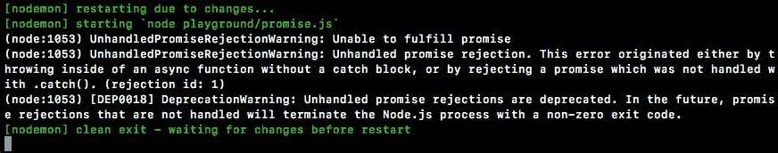

然而，我们没有一个处理程序，所以什么都不会打印到屏幕上。这将是一个相当大的问题。我们需要对错误消息做些什么。也许我们会警告用户，或者我们会尝试一些其他代码。

如前面的代码输出所示，我们可以看到在重新启动和退出之间没有打印任何内容。为了处理错误，我们将在`then`方法中添加第二个参数。这个第二个参数让我们能够处理承诺中的错误。这个参数将被执行，并用该值调用。在这种情况下，它是我们的消息。我们将创建一个名为`errorMessage`的参数，如下所示：

```js
somePromise.then((message) => {
  console.log('Success: ', message);
}, (errorMessage) => {

});
```

在参数中，我们可以对其进行一些操作。在这种情况下，我们将使用`console.log`将其打印到屏幕上，打印带有冒号和空格的`Error`，然后是被拒绝的实际值：

```js
}, (errorMessage) => {
  console.log('Error: ', errorMessage);
});
```

现在我们已经有了这个，我们可以通过保存文件来刷新事情。现在我们将在终端中看到我们的错误消息，因为我们现在有一个可以做一些事情的地方：


在这里，我们有一个地方可以将消息打印到屏幕上；`无法实现承诺`打印到屏幕上，这正如预期的那样。

# 承诺的优点

我们现在有一个可以被解决或拒绝的承诺。如果它被解决，意味着承诺已经实现，我们有一个处理它的函数。如果它被拒绝，我们也有一个处理它的函数。这是承诺很棒的原因之一。你可以根据承诺是否被解决或拒绝来提供不同的函数。这让你避免了在我们的代码中使用大量复杂的`if`语句，我们需要在`app.js`中管理实际回调是否成功或失败。

现在在承诺中，重要的是要理解你只能`resolve`或`reject`一次承诺。如果你`resolve`了一个承诺，你就不能在以后`reject`它，如果你用一个值`resolve`它，你就不能在以后改变主意。考虑这个例子，我有一个像下面这样的代码；在这里我首先`resolve`然后我`reject`：

```js
var somePromise = new Promise((resolve, reject) => {
  setTimeout(() => {
    resolve('Hey. It worked!');
    reject('Unable to fulfill promise');
  }, 2500);
});

somePromise.then((message) => {
  console.log('Success: ', message);
}, (errorMessage) => {
  console.log('Error: ', errorMessage);
});
```

在这种情况下，我们将看到我们的成功`message`打印到屏幕上。我们永远不会看到`errorMessage`，因为，正如我刚才说的，你只能执行其中一个操作一次。你只能一次`resolve`或一次`reject`。你不能两次都做；你不能两次做任何一种。 

这是回调的另一个巨大优势。没有什么能阻止我们意外地两次调用`callback`函数。例如，让我们考虑`geocode.js`文件。让我们在 geocode 请求调用的`if`块中添加另一行，如下所示：

```js
const request = require('request');

var geocodeAddress = (address, callback) => {
  var encodedAddress = encodeURIComponent(address);

  request({
    url: `https://maps.googleapis.com/maps/api/geocode/json?address=${encodedAddress}`,
    json: true
  }, (error, response, body) => {
    if (error) {
      callback('Unable to connect to Google servers.');
      callback();
```

这是一个更明显的例子，但它很容易隐藏在复杂的`if-else`语句中。在这种情况下，我们`app.js`中的`callback`函数确实会被调用两次，这可能会给我们的程序带来很大的问题。在 promise 示例中，无论你尝试多少次调用`resolve`或`reject`，这个函数只会被触发一次，这个回调永远不会被调用两次。

我们可以通过再次调用`resolve`来证明这一点。在 promise 示例中，让我们保存文件并进行以下更改：

```js
var somePromise = new Promise((resolve, reject) => {
  setTimeout(() => {
    resolve('Hey. It worked!');
    resolve();
    reject('Unable to fulfill promise');
  }, 2500);
});
```

现在，让我们刷新一下；我们将用我们的消息`Hey. It worked!`来`resolve`，我们永远不会再次触发函数，因为，正如我们所说的，promise 已经解决。一旦将 promise 的状态设置为已满足或已拒绝，就不能再次设置它。

在 promise 的`resolve`或`reject`函数被调用之前，promise 处于一种称为待定的状态。这意味着你正在等待信息返回，或者你正在等待异步计算完成。在我们的例子中，当我们等待天气数据返回时，promise 将被视为待定。当 promise 被满足或拒绝时，它被认为是已解决的。

无论你选择哪一个，你都可以说 promise 已经完成，这意味着它不再是待定的。在我们的例子中，这将是一个已完成的 promise，因为`resolve`就是在这里调用的。这些只是 promise 的一些好处。你不必担心回调被调用两次，你可以提供多个函数——一个用于成功处理，一个用于错误处理。这真的是一个很棒的工具！

现在我们已经快速介绍了 promise 的工作原理，只是基本原理，我们将转向稍微复杂一些的内容。

# 高级 promise

在本节中，我们将探讨使用 promise 的另外两种方法。我们将创建接受输入并返回 promise 的函数。此外，我们将探索 promise 链式调用，这将让我们组合多个 promise。

# 提供 promise 的输入

现在我们在上一节讨论的示例中的问题是，我们有一个 promise 函数，但它不接受任何输入。当我们使用真实世界的 promise 时，这很可能永远不会发生。我们将想要提供一些输入，比如从数据库中获取用户的 ID，请求的 URL，或者部分 URL，例如只有地址组件。

为了做到这一点，我们必须创建一个函数。在这个例子中，我们将创建一个名为`asyncAdd`的函数。

```js
var asyncAdd = () => {

}
```

这将是一个使用`setTimeout`模拟异步功能的函数。实际上，它只是将两个数字相加。但是，它将准确地说明我们需要在本章后面做的事情，以便使用 promise 来获取我们的天气应用程序。

现在在函数中，我们将使用`a`和`b`两个参数，并返回一个 promise：

```js
var asyncAdd = (a, b) => {

};
```

因此，无论谁调用这个`asyncAdd`方法，他们都可以传入输入，但他们也可以得到 promise，以便他们可以使用 then 来同步并等待它完成。在`asyncAdd`函数内部，我们将使用`return`来做到这一点。我们将使用完全相同的`new Promise`语法来`return`一个`new Promise`对象，就像我们创建`somePromise`变量时所做的那样。现在这是相同的函数，所以我们确实需要提供构造函数，该构造函数使用`resolve`和`reject`两个参数进行调用，就像这样：

```js
var asyncAdd = (a, b) => {
 return new Promise((resolve, reject) => {

 });
```

现在我们有一个`asyncAdd`函数，它接受两个数字并返回一个 promise。唯一剩下的事情就是实际模拟延迟，并调用`resolve`。为此，我们将使用`setTimeout`来模拟延迟。然后我们将传入我的`callback`函数，将延迟设置为 1.5 秒，或`1500`毫秒：

```js
return new Promise((resolve, reject) => {
 setTimeout(() => {

 }, 1500)
 });
```

在`callback`函数中，我们将编写一个简单的`if-else`语句，检查`a`和`b`的类型是否都是数字。如果是，太好了！我们将`resolve`这两个数字相加的值。如果它们不是数字（一个或多个），那么我们将`reject`。为此，我们将使用`if`语句和`typeof`运算符：

```js
setTimeout(() => {
  if (typeof a === 'number')
 }, 1500);
```

在这里，我们使用`typeof`对象来获取变量之前的字符串类型。此外，我们检查它是否等于一个数字，这是当我们有一个数字时`typeof`将返回的内容。现在类似于`a`，我们将添加`typeof b`，它也是一个数字：

```js
    if (typeof a === 'number' && typeof b === 'number') {}
```

我们可以将这两个数字相加，解析出值。在`if`语句的代码块内，我们将调用`resolve`，传入`a + b`：

```js
 return new Promise((resolve, reject) => {
   setTimeout(() => {
     if (typeof a === 'number' && typeof b === 'number') { 
       resolve(a + b);
     }
   }, 1500);
```

这将把这两个数字相加，传入一个参数给`resolve`。现在这是一个快乐的路径，当`a`和`b`都是数字时。如果事情不顺利，我们会想要添加`reject`。我们将使用`else`块来做这个。如果前面的条件失败，我们将通过调用`reject('Arguments must be numbers')`来`reject`：

```js
   if (typeof a === 'number' && typeof b === 'number') { 
     resolve(a + b);
   } else {
     reject('Argumets must be numbers');
   }
```

现在我们有一个`asyncAdd`函数，它接受两个变量`a`和`b`，返回一个 promise，任何调用`asyncAdd`的人都可以添加一个 then 调用到返回结果上，以获得该值。

# 返回 promise

现在这到底是什么样子？为了展示这一点，首先我们将注释掉`promise.js`中`newPromise`变量中的所有代码。接着，我们将调用`asyncAdd`变量，我们将调用`asyncAdd`。我们将像调用任何其他函数一样调用它，传入两个值。请记住，这可以是数据库 ID 或任何其他异步函数的内容。在我们的例子中，它只是两个数字。假设是`5`和`7`。现在这个函数的返回值是一个 promise。我们可以创建一个变量并在该变量上调用 then，但我们也可以直接使用`then`方法，如下所示：

```js
asyncAdd(5, 7).then
```

这正是我们在使用 promise 时要做的事情；我们将添加 then，传入我们的回调。第一个回调是成功的情况，第二个是错误的情况：

```js
ouldasyncAdd(5, 7).then(() => {
}, () => {

});
```

在第二个回调中，我们将得到我们的`errorMessage`，我们可以使用`console.log(errorMessage);`语句将其记录到屏幕上，如下所示：

```js
asyncAdd(5, 7).then(() => {

}, (errorMessage) => {
 console.log(errorMessage);
});
```

如果一个或多个数字实际上不是数字，`error`函数将会触发，因为我们调用了`reject`。如果两个都是数字，我们将得到结果并将其打印到屏幕上，使用`console.log`。我们将添加`res`并在箭头函数（`=>`）内部添加`console.log`语句，并打印带有冒号的字符串`Result`。然后，作为`console.log`的第二个参数，我们将传入实际的数字，这将打印到屏幕上： 

```js
asyncAdd(5, 7).then(() => {
 console.log('Result:', res);
}, (errorMessage) => {
 console.log(errorMessage);
});
```

现在我们已经在适当的位置有了我们的 promise `asyncAdd`函数，让我们在终端中测试一下。为此，我们将运行`nodemon`来启动`nodemon playground/promise.js`：

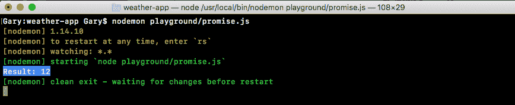

我们将立即得到延迟和结果，`12`打印到屏幕上。这太棒了！我们能够创建一个接受动态输入的函数，但仍然返回一个 promise。

现在请注意，我们已经将通常需要回调的异步函数包装成使用 promise 的形式。这是一个很方便的功能。当你开始在 Node 中使用 promise 时，你会意识到有些东西不支持 promise，而你希望它们支持。例如，我们用来进行 HTTP 请求的 request 库不支持原生的 promise。然而，我们可以将我们的请求调用包装在一个 promise 中，这是我们稍后将要做的。不过，现在我们有一个基本的例子说明了这是如何工作的。接下来，我们想谈谈 promise chaining。

# Promise chaining

Promise chaining 是指多个 promise 按顺序运行的概念。例如，我想要将地址转换为坐标，然后将这些坐标转换为天气信息；这是需要同步两件事情的一个例子。而且，我们可以很容易地使用 promise chaining 来做到这一点。

为了链接我们的 promise，在我们的成功调用中，我们将返回一个新的 promise。在我们的例子中，我们可以通过再次调用`asyncAdd`来`return`一个新的 promise。我将在`res`和`console.log`语句旁边调用`asyncAdd`，传入两个参数：结果，前一个 promise 返回的任何东西，以及某种新的数字；让我们使用`33`：

```js
asyncAdd(5, 7).then((res) => {
 console.log('Result:', res);
 return asyncAdd(res, 33);
```

现在我们返回了一个 promise，所以我们可以通过再次调用`then`方法来添加我的链式操作。`then`方法将在我们关闭前一个`then`方法的括号后被调用。这也将接受一个或多个参数。我们可以传入一个成功处理程序，它将是一个函数，以及一个错误处理程序，它也将是一个函数：

```js
 asyncAdd(5, 7).then((res) => {
   console.log('Result:', res);
   return asyncAdd(res, 33);
 }, (errorMessage) => {
   console.log(errorMessage);
 }).then(() => {

 }, () => {

 })
```

现在我们已经设置好了我们的`then`回调，我们可以填写它们。再一次，我们将得到一个结果；这将是`5`加`7`的结果，即`12`，再加`33`，将是`45`。然后，我们可以打印`console.log ('Should be 45')`。接下来，我们将打印结果变量的实际值：

```js
}).then((res) => {
 console.log('Should be 45', res);
}, () => {
});
```

现在我们的错误处理程序也将是一样的。我们将有`errorMessage`，并使用`console.log`将其打印到屏幕上，打印`errorMessage`：

```js
}).then((res) => {
 console.log('Should be 45', res);
}, (errorMessage) => {
 console.log(errorMessage);
});
```

现在我们有了一些链式操作。我们的第一个`then`回调函数将根据我们第一个`asyncAdd`调用的结果触发。如果顺利进行，第一个将触发。如果进行不顺利，第二个函数将触发。我们的第二个 then 调用将基于`asyncAdd`调用，我们在其中添加`33`。这将让我们将两个结果链接在一起，我们应该得到`45`打印在屏幕上。我们将保存这个文件，这将重新启动`nodemon`中的事情。最终，我们会得到我们的两个结果：`12`和我们的`Should be 45`。如下图所示，我们得到了`Result: 12`和`Should be 45`，打印在屏幕上：


# promise 链中的错误处理

现在谈到错误处理时，有一些怪癖；所以，我们将模拟一些错误。首先，让我们模拟第二个`asyncAdd`调用中的错误。我们知道可以通过传入一个非数字的值来实现这一点。在这种情况下，让我们用引号括起`33`：

```js
 asyncAdd(5, 7).then((res) => {
   console.log('Result:', res);
   return asyncAdd(res, '33');
 }, (errorMessage) => {
   console.log(errorMessage);
 }).then((res) => {
   console.log('Should be 45', res);
 }, (errorMessage) => {
   concole.log(errorMessage);
 })
```

这将是一个字符串，我们的调用应该`reject`。现在我们可以保存文件并看看会发生什么：

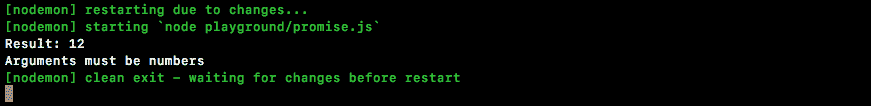

我们得到`Result: 12`，然后我们得到我们的错误，`Arguments must be numbers`。正如我们所期望的那样，这会打印在屏幕上。我们没有得到`Should be 45`，而是得到了我们的错误消息。

但是，当 promise 链中的早期某个东西被拒绝时，事情就会变得有点棘手。让我们用数字`33`替换`'33'`。然后让我们用字符串`'7'`替换`7`，如下所示：

```js
 asyncAdd(5, '7').then((res) => {
   console.log('Result:', res);
   return asyncAdd(res, 33);
 }, (errorMessage) => {
   console.log(errorMessage);
 }).then((res) => {
   console.log('Should be 45', res);
 }, (errorMessage) => {
   concole.log(errorMessage);
 })
```

这将导致我们的第一个 promise 失败，这意味着我们将永远看不到结果。我们应该看到错误消息打印在屏幕上，但这不会发生：

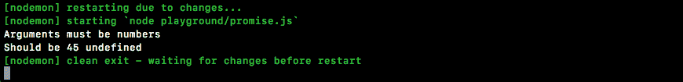

当我们重新启动时，确实会将错误消息打印到屏幕上，但然后我们还会得到`Should be 45 undefined`。第二个`console.log`正在运行，因为我们在第二个`asyncAdd`函数中提供了一个错误处理程序。它正在运行错误处理程序。然后它说，*好的，现在事情一定很好，我们运行了错误处理程序。让我们继续进行下一个 then 调用，调用成功案例*。

# catch 方法

要修复错误，我们可以从两个`then`调用中删除我们的错误处理程序，并用一个调用替换它们，即在最底部调用一个不同的方法，我们将称之为`.catch`：

```js
asyncAdd(5, '7').then((res) => {
 console.log('Result:', res);
 return asyncAdd(res, 33);
}).then((res) => {
 console.log('Should be 45', res);
}).catch;
```

catch promise 方法类似于 then，但它只接受一个函数。如下面的代码所示，如果我们的任何 promise 调用失败，我们可以指定一个错误处理程序。我们将获取`errorMessage`并使用`console.log(errorMessage)`将其打印到屏幕上：

```js
asyncAdd(5, '7').then((res) => {
 console.log('Result:', res);
 return asyncAdd(res, 33);
}).then((res) => {
 console.log('Should be 45', res);
}).catch((errorMessage) => {
 console.log(errorMessage)
});
```

不过，如果现在有些模糊，没关系，只要你开始看到我们到底在做什么。我们正在将一个 promise 的结果传递给另一个 promise。在这种情况下，结果的工作方式与预期完全相同。第一个 promise 失败，我们得到了打印到屏幕上的`Arguments must be numbers`。此外，我们没有得到那个破碎的语句，我们尝试打印`45`，但我们得到了 undefined。使用 catch，我们可以指定一个错误处理程序，它将对我们之前的所有失败进行处理。这正是我们想要的。

# 承诺中的请求库

现在正如我之前提到的，有些库支持 promise，而另一些则不支持。请求库不支持 promise。我们将创建一个包装请求并返回 promise 的函数。我们将使用前一章中的`geocode.js`文件中的一些功能。

首先，让我们讨论一下快速设置，然后我们将实际填写它。在`playground`文件夹中，我们可以创建一个新文件来存储这个，名为`promise-2.js`：

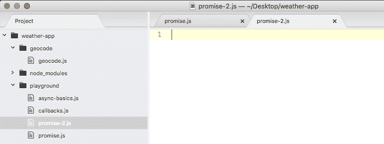

我们将创建一个名为`geocodeAddress`的函数。`geocodeAddress`函数将接受纯文本地址，并返回一个 promise：

```js
var geocodeAddress = (address) => {

};
```

`geocodeAddress`函数将返回一个 promise。因此，如果我传入一个邮政编码，比如`19146`，我会期望返回一个 promise，我可以附加一个`then`调用。这将让我等待该请求完成。在这里，我将添加一个调用`then`，传入我的两个函数：当 promise 被实现时的成功处理程序和当 promise 被拒绝时的错误处理程序：

```js
geocodeAddress('19146').then(() => {

}, () => {

})
```

现在当事情顺利进行时，我期望得到带有地址、`纬度`和`经度`的`location`对象，当事情进行不顺利时，我期望得到错误消息：

```js
geocodeAddress('19146').then((location) => {

}, (errorMessage) => {

})
```

当错误消息发生时，我们将只是使用`console.log(errorMessage)`将其打印到屏幕上。目前，当事情顺利进行并且成功案例运行时，我们将使用我们的漂亮打印技术，`console.log`打印整个对象。然后，我们将调用`JSON.stringify`，就像我们以前做过很多次一样，传入三个参数——对象，未定义的过滤方法——我们在书中永远不会使用，以及数字`2`作为我们想要用作缩进的空格数：

```js
geocodeAddress('19146').then((location) => {
 console.log(JSON.stringify(location, undefined, 2));
}, (errorMessage) => {
 console.log(errorMessage); 
});
```

这就是我们想要创建的功能正常工作的函数。这个`then`调用应该像前面的代码中显示的那样工作。

要开始，我将通过调用`return new Promise`返回 promise，传入我的构造函数：

```js
var geocodeAddress = (address) => {
 return new Promise(() => {

 });
};
```

在函数内部，我们将添加对请求的调用。让我们提供`resolve`和`reject`参数：

```js
 return new Promise((resolve, reject) => {
 });
};
```

现在我们已经设置好了我们的`Promise`，我们可以在代码顶部加载请求模块，创建一个名为`request`的常量，并将其设置为`require('request')`的返回结果：

```js
const request = require('request');

var geocodeAddress = (address) => {
```

接下来，我们将进入`geocode.js`文件，获取`geocodeAddress`函数内的代码，并将其移动到`promise-2`文件中的构造函数内：

```js
const request = require('request');
var geocodeAddress = (address) => {
 return new Promise((resolve, reject) => {
 var encodedAddress = encodeURIComponent(address);

request({
 url: `https://maps.googleapis.com/maps/api/geocode/json?address=${encodedAddress}`,
 json: true
 }, (error, response, body) => {
   if (error) {
   callback('Unable to connect to Google servers.');
 } else if (body.status === 'ZERO_RESULTS') {
   callback('Unable to find that address.');
 } else if (body.status === 'OK') {
   callback(undefined, {
     address: body.results[0].formatted_address,
     latitude: body.results[0].geometry.location.lat,
     longitude: body.results[0].geometry.location.lng
     });
    }
   });
 });
};
```

现在我们基本上可以开始了；我们只需要改变一些东西。我们需要做的第一件事是替换我们的错误处理程序。在代码的`if`块中，我们用一个参数调用了我们的`callback`处理程序；相反，我们将调用`reject`，因为如果这段代码运行，我们希望`reject`这个 promise。在下一个`else`块中也是一样的。如果我们得到了`ZERO_RESULTS`，我们将调用`reject`。这确实是一个失败，我们不想假装我们成功了：

```js
if (error) {
   reject('Unable to connect to Google servers.');
 } else if (body.status === 'ZERO_RESULTS') {
   reject('Unable to find that address.');
```

现在在下一个`else`块中，事情进展顺利；在这里我们可以调用`resolve`。此外，我们可以删除第一个参数，因为我们知道`resolve`和`reject`只接受一个参数：

```js
if (error) { 
  reject('Unable to connect to Google servers.');
 } else if (body.status === 'ZERO_RESULTS') {
   reject('Unable to find that address.');
 } else if (body.status === 'OK') {
   resolve(
```

我们可以指定多个值，因为我们在对象上`resolve`了属性。既然我们已经做到了这一点，我们就完成了。我们可以保存我们的文件，重新在终端中运行它，然后测试一下。

# 测试请求库

为了测试，我们将保存文件，进入终端，关闭`promise.js`文件的`nodemon`。我们将运行`promise.js`文件的`node`。它在`playground`文件夹中，名为`promise-2.js`：

```js
node playground/promise-2.js
```

现在，当我们运行这个程序时，我们实际上正在发出 HTTP 请求。如下面的代码输出所示，我们可以看到数据返回的确如我们所期望的那样：

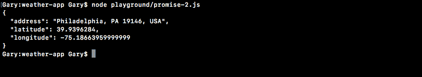

我们得到了我们的`address`、`latitude`和`longitude`变量。这太棒了！现在让我们测试一下，当我们传入一个无效的地址时会发生什么，比如 5 个零，这是我们以前用来模拟错误的：

```js
const request = require('request');

var geocodeAddress = (address) => {
  return new Promise((resolve, reject) => {
    var encodedAddress = encodeURIComponent(address);

  request({
   url: `https://maps.googleapis.com/maps/api/geocode/json?address=${encodedAddress}`,
   json: true
 }, (error, response, body) => {
   if (error) {
     reject('Unable to connect to Google servers.');
   } else if (body.status === 'ZERO_RESULTS') {
     reject('Unable to find that address.');
   } else if (body.status === 'OK') {
     resolve({
       address: body.results[0].formatted_address,
       latitude: body.results[0].geometry.location.lat,
       longitude: body.results[0].geometry.location.lng
      });
     }
   });
  });
};
```

我们将保存文件，重新运行程序，屏幕上打印出`无法找到该地址。`：


这仅仅是因为我们调用了`reject`。我们将在`Promise`构造函数中调用`reject`。我们有我们的错误处理程序，它将消息打印到屏幕上。这是一个将不支持 promise 的库包装成 promise 的示例，创建一个准备好的 promise 函数。在我们的情况下，该函数是`geocodeAddress`。

# 带有 promise 的天气应用程序

在本节中，我们将学习如何使用内置 promise 的库。我们将探索 axios 库，它与 request 非常相似。不过，它使用 promise 而不是像 request 那样使用回调。因此，我们不必将我们的调用包装在 promise 中以获得 promise 功能。我们实际上将在本节中重新创建整个天气应用程序。我们只需要编写大约 25 行代码。我们将完成整个过程：获取地址、获取坐标，然后获取天气。

# 从 app.js 文件中获取天气应用程序代码

要从 app.js 文件中获取天气应用程序代码，我们将复制`app.js`，因为我们在原始的`app.js`文件中配置了`yargs`，我们希望将代码转移到新项目中。没有必要重写它。在`weather`目录中，我们将复制`app.js`，给它一个新的名字，`app-promise.js`。

在`app-promise.js`中，在我们添加任何内容之前，让我们先删除一些东西。我们将删除`geocode`和`weather`变量声明。我们将不需要引入任何文件：

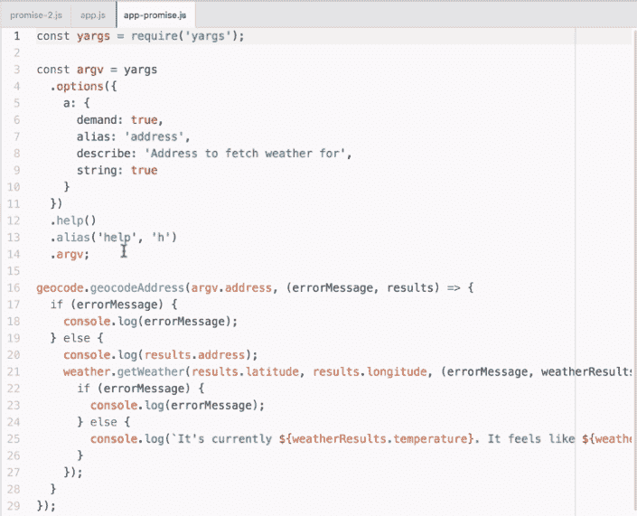

然后我将删除我们`yargs`配置之后的所有内容，这种情况下只有我们对`geocodeAddress`的调用。结果代码将如下所示：

```js
const yargs = require('yargs');

const argv = yargs
 .options({
   a: {
     demand: true,
     alias: 'address',
     describe: 'Address to fetch weather for',
     string: true
   }
 })
 .help()
 .alias('help', 'h')
 .argv;
```

# Axios 文档

现在我们有了一个干净的板子，我们可以开始安装新的库。在运行`npm install`命令之前，我们将看看在哪里可以找到文档。我们可以通过访问以下网址获取：[`www.npmjs.com/package/axios`](https://www.npmjs.com/package/axios)。如下面的截图所示，我们有 axios npm 库页面，我们可以查看有关它的各种信息，包括文档：


在这里我们可以看到一些看起来很熟悉的东西。我们调用了`then`和`catch`，就像我们在 axios 之外使用 promise 时一样。

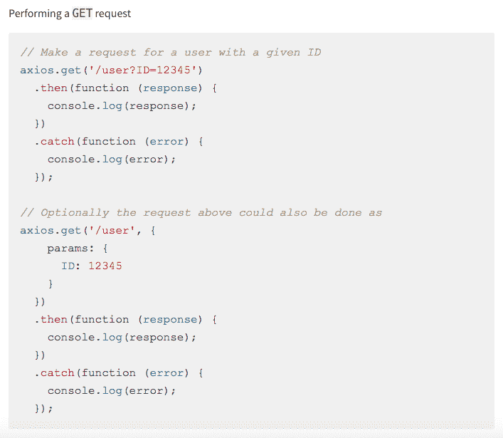

在这个页面的统计栏中，你可以看到这是一个非常受欢迎的库。最新版本是 0.13.1。这正是我们将要使用的确切版本。当你在项目中使用 axios 时，可以随时访问这个页面。这里有很多非常好的例子和文档。不过，现在我们可以安装它。

# 安装 axios

要安装 axios，在终端中，我们将运行`npm install`；库的名称是`axios`，我们将使用`save`标志指定版本`0.17.1`来更新`package.json`文件。现在我可以运行`install`命令，来安装 axios：

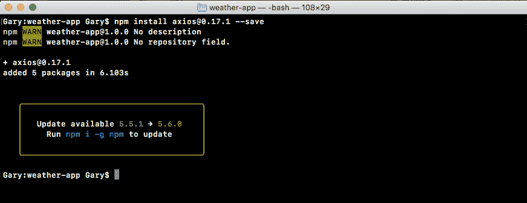

# 在`app-promise`文件中进行调用

在我们的`app-promise`文件中，我们可以通过在顶部加载`axios`来开始。我们将创建一个常量叫做`axios`，将其设置为`require('axios')`，如下所示：

```js
const yargs = require('yargs');
const axios = require('axios');
```

既然我们已经准备就绪，我们实际上可以开始在代码中进行调用了。这将涉及我们从地理编码和天气文件中提取一些功能。因此，我们将打开`geocode.js`和`weather.js`文件。因为我们将从这些文件中提取一些代码，比如 URL 和一些错误处理技术。尽管我们会在遇到时讨论它们的不同之处。

我们需要做的第一件事是对地址进行编码并获取地理编码 URL。现在这些操作发生在`geocode.js`中。因此，我们实际上会复制`encodedAddress`变量行，即我们创建编码地址的行，并将其粘贴到`app-promise`文件中，跟在`argv`变量后面。

```js
  .argv;

var encodedAddress = encodeURIComponent(argv.address);
```

现在我们需要稍微调整一下这个。`address`变量不存在；但是我们有`argv.address`。因此，我们将`address`替换为`argv.address`：

```js
var encodeAddress = encodeURIComponent(argv.address);
```

现在我们有了编码后的地址；在我们开始使用 axios 之前，我们需要获取的下一件事是我们想要发出请求的 URL。我们将从`geocode.js`文件中获取。在`app-promise.js`中，我们将创建一个名为`geocodeURI`的新变量。然后，我们将从`geocode.js`中获取 URL，从开头的反引号到结束的反引号，复制并粘贴到`app-promise.js`中，赋值给`geocodeURI`：

```js
var encodedAddress = encodeURIComponent(argv.address);
var geocodeUrl = `https://maps.googleapis.com/maps/api/geocode/json?address=${encodedAddress}`;
```

现在我们在 URL 中使用了编码的`address`变量；这没问题，因为它确实存在于我们的代码中。因此，在这一点上，我们有了我们的`geocodeUrl`变量，我们可以开始制作我们的第一个 axios 请求了。

# 发出 axios 请求

在我们的情况下，我们将获取地址并获取`纬度`和`经度`。为了发出请求，我们将调用 axios 上可用的一个方法，`axios.get`。

```js
var geocodeUrl = `https://maps.googleapis.com/maps/api/geocode/json?address=${encodedAddress}`;

axios.get
```

`get`是让我们发出 HTTP get 请求的方法，这正是我们在这种情况下想要做的。而且，设置起来非常简单。当你期望 JSON 数据时，你所要做的就是传入`geocodeUrl`变量中的 URL。无需提供任何其他选项，比如让它知道它是`JSON`的选项。axios 知道如何自动解析我们的 JSON 数据。`get`返回的实际上是一个 promise，这意味着我们可以使用`.then`来在 promise 被实现或被拒绝时运行一些代码，无论事情进行得好还是糟：

```js
axios.get(geocodeUrl).then()
```

在`then`中，我们将提供一个函数。这将是成功的情况。成功的情况将被调用一个参数，`axios`库建议你将其称为`response`：

```js
axios.get(geocodeUrl).then((response) => {

});
```

从技术上讲，我们可以随意调用任何你喜欢的东西。现在在函数内部，我们将获得与我们在请求库内部获得的所有相同的信息；诸如我们的头部、响应和请求头部，以及正文信息；各种有用的信息。不过，我们真正需要的是`response.data`属性。我们将使用`console.log`打印出来。

```js
axios.get(geocodeUrl).then((response) => {
  console.log(response.data);
});
```

现在我们已经做好了准备，我们可以运行我们的`app-promise`文件，传入一个有效的地址。此外，我们可以看看当我们发出请求时会发生什么。

在命令行（终端）中，我们将首先使用`clear`命令清除终端输出。然后我们可以运行`node``app-promise.js`，传入一个地址。让我们使用一个有效的地址，例如`1301 lombard street, philadelphia`：

```js
node app-promise.js -a '1301 lombard street philadelphia
```

请求发出。我们得到了什么？我们得到了与我们在前几章中使用其他模块时看到的结果对象完全相同的结果：

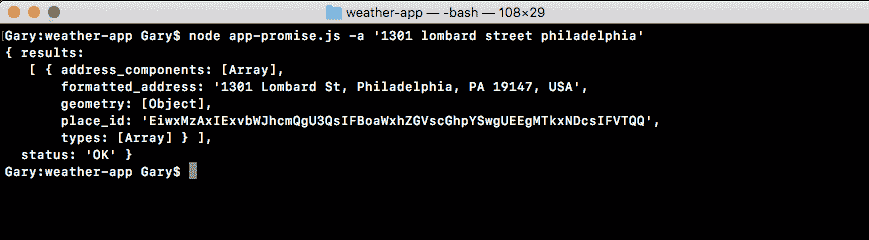

这种情况下唯一的区别是我们使用了内置的 promises，而不是必须将其包装在 promises 中或使用回调。

# axios 请求中的错误处理

现在除了我们在上一个示例中使用的成功处理程序之外，我们还可以添加一个调用 catch 的调用，让我们捕获可能发生的所有错误。我们将获得错误对象作为唯一的参数；然后我们可以对该错误对象进行处理：

```js
axios.get(geocodeUrl).then((response) => {
 console.log(response.data);
});catch((e) => {

});
```

在函数内部，我们将使用`console.log`来启动事情，打印错误参数：

```js
}).catch((e) => {
 console.log(e)
});
```

现在让我们通过删除 URL 中的点来模拟错误：

```js
var encodedAddress = encodeURIComponent(argv.address);
var geocodeUrl = `https://mapsgoogleapis.com/maps/api/geocode/json?address=${encodedAddress}`;

axios.get(geocodeUrl).then((response) => {
   console.log(response.data);
}).catch((e) => {
   console.log(e)
});
```

我们可以看看当我们重新运行程序时会发生什么。现在我这样做是为了探索`axios`库。我知道会发生什么。这不是我这样做的原因。我这样做是为了向你展示你应该如何处理新的库。当你得到一个新的库时，你想玩弄它的所有不同工作方式。当我们有一个请求失败时，错误参数中究竟会返回什么？这是重要的信息；所以当你编写一个真实的应用程序时，你可以添加适当的错误处理代码。 

在这种情况下，如果我们重新运行完全相同的命令，我们将收到一个错误：

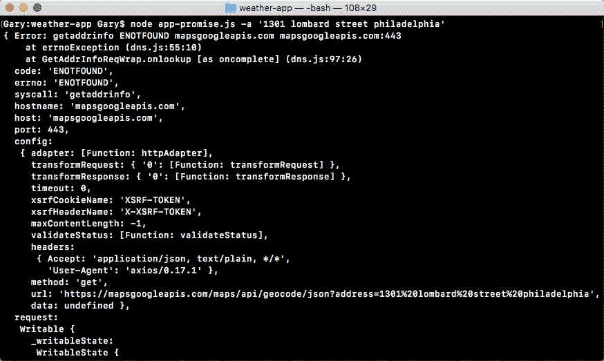

正如你所看到的，屏幕上真的没有什么可打印的。我们有很多非常神秘的错误代码，甚至`errorMessage`属性，通常包含一些好的内容或者没有。然后我们有一个错误代码，后面跟着 URL。相反，我们希望打印一个纯文本的英文消息。

为此，我们将使用一个`if-else`语句，检查代码属性是什么。这是错误代码，在这种情况下是`ENOTFOUND`；我们知道这意味着它无法连接到服务器。在`app-promise.js`中，在错误处理程序内部，我们可以通过使用`if`来添加这个条件：

```js
}).catch((e) => {
 if (e.code === 'ENOTFOUND') {

}
```

如果是这种情况，我们将使用`console.log`在屏幕上打印某种自定义消息：

```js
}).catch((e) => {
  if (e.code === 'ENOTFOUND') {
   console.log('Unable to connect to API servers.');
  } 
  console.log(e);
 });
```

现在我们有了一个处理这种特定情况的错误处理程序。所以我们可以删除我们对`console.log`的调用：

```js
axios.get(geocodeUrl).then((response) => {
  console.log(response.data);
}).catch((e) => {
  if (e.code === 'ENOTFOUND') {
    console.log('Unable to connect to API servers.');
 }
});
```

现在，如果我们保存文件，并从终端重新运行事情，我们应该会得到一个更好的错误消息打印到屏幕上：

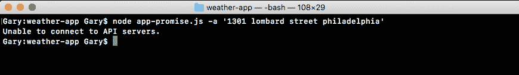

这正是我们得到的：“无法连接到 API 服务器”。现在我会把那个点加回去，这样事情就开始运作了。我们可以担心返回的响应。

# ZERO_RESULT 状态的错误处理

你记得，在 geocode 文件中，有一些事情我们需要做。我们已经处理了与服务器连接相关的错误，但还有另一个待处理的错误，即，如果`body.status`属性等于`ZERO_RESULTS`。在这种情况下，我们想打印一个错误消息。

为此，我们将在`app-promise`中创建我们自己的错误。我们将在`axios.get`函数中抛出一个错误。这个错误将导致它之后的所有代码都不会运行。它将直接进入错误处理程序。

现在我们只想在 status 属性设置为`ZERO_RESULTS`时抛出错误。我们将在`get`函数的顶部添加一个`if`语句来检查“if（response.data.status）”是否等于`ZERO_RESULTS`：

```js
axios.get(geocodeUrl).then((response) => {
  if (response.data.status === 'ZERO_RESULTS') {

  }
```

如果是这种情况，那么事情就变糟了，我们不想继续进行天气请求。我们想运行我们的 catch 代码。为了抛出一个新的错误，让我们的 promise 可以捕获，我们将使用一个称为`throw new Error`的语法。这将创建并抛出一个错误，让 Node 知道出了问题。我们可以提供我们自己的错误消息，对用户来说是可读的：`无法找到该地址`：

```js
axios.get(geocodeUrl).then((response) => {
  if (response.data.status === 'ZERO_RESULTS') {
    throw new Error('Unable to find that address.');
  }
```

这是一个消息，将让用户准确地知道出了什么问题。现在当这个错误被抛出时，相同的 catch 代码将运行。目前，我们只有一个`if`条件，检查代码属性是否为`ENOTFOUND`。所以我们将添加一个`else`子句：

```js
axios.get(geocodeUrl).then((response) => {
 if (response.data.status === 'ZERO_RESULTS') {
   throw new Error('Unable to find that address.');
 }

 console.log(response.data);
}).catch((e) => {
 if (e.code === 'ENOTFOUND') {
   console.log('Unable to connect to API servers.');
 } else {

 }
});
```

在`else`块中，我们可以打印错误消息，这是我们使用`e.`消息属性在 throw `new Error`语法中键入的字符串，如下所示：

```js
axios.get(geocodeUrl).then((response) => {
 if (response.data.status === 'ZERO_RESULTS') {
   throw new Error('Unable to find that address.');
 }

 console.log(response.data);
}).catch((e) => {
  if (e.code === 'ENOTFOUND') {
   console.log('Unable to connect to API servers.');
 } else {
   console.log(e.message);
 }
});
```

如果错误代码不是`ENOTFOUND`，我们将简单地将消息打印到屏幕上。如果我们得到零结果，就会发生这种情况。所以让我们模拟一下，以确保代码能正常工作。在终端中，我们将重新运行之前的命令，传入一个邮政编码。起初，我们将使用一个有效的邮政编码`08822`，我们应该得到我们的数据。然后我们将使用一个无效的邮政编码：`00000`。

当我们用有效地址运行请求时，我们得到这个：

！[](img/c125c1ba-ce47-4adb-9d2f-6f996c2bf381.png)

当我们用无效的地址运行请求时，我们得到了错误：

！[](img/3acd268c-c83b-486e-98a9-87c2e2ad37eb.png)

通过调用`throw new Error`，我们立即停止了这个函数的执行。所以`console.log`与`e.message`永远不会打印，这正是我们想要的。现在我们的错误处理程序已经就位，我们可以开始生成天气 URL 了。

# 生成天气 URL

为了生成天气 URL，我们将从`weather`文件中复制 URL，将其带有引号的部分放入`app-promise`文件中。我们将创建一个名为`weatherUrl`的新变量，将其设置为复制的 URL：

```js
url: `https://api.forecast.io/forecast/4a04d1c42fd9d32c97a2c291a32d5e2d/${lat},${lng}`,
```

现在`weatherUrl`确实需要一些信息。我们需要`纬度`和`经度`。我们有两个变量`lat`和`lng`，所以让我们创建它们，从响应对象中获取适当的值，`var lat`和`var lng`：

```js
var lat;
var lng;
url: `https://api.forecast.io/forecast/4a04d1c42fd9d32c97a2c291a32d5e2d/${lat},${lng}`,
```

现在，为了取出它们，我们必须经历挖掘对象的过程。我们以前做过。我们将在响应对象的数据属性中查找，这类似于请求库中的 body。然后我们将进入`results`，获取第一个项目并访问`geometry`属性，然后我们将访问`location.lat`：

```js
var lat = response.data.results[0].geometry.location.lat;
```

现在同样，我们可以为`longitude`变量添加内容：

```js
var lat = response.data.results[0].geometry.location.lat;
var lng = response.data.results[0].geometry.location.lng;
```

现在，在我们发出天气请求之前，我们要打印格式化的地址，因为之前的应用程序也这样做了。在我们的`console.log(response.data)`语句中，我们将进入数据对象获取格式化的地址。这也是在结果数组的第一项上。我们将访问`formatted_address`属性：

```js
var lat = response.data.results[0].geometry.location.lat;
var lng = response.data.results[0].geometry.location.lng;
var weatherUrl = `https://api.forecast.io/forecast/4a04d1c42fd9d32c97a2c291a32d5e2d/${lat},${lng}`;
console.log(response.data.results[0].formatted_address);
```

现在我们的格式化地址已经打印到屏幕上，我们可以通过返回一个新的 promise 来进行第二次调用。这将让我们链接这些调用在一起。

# 链接承诺调用

要开始，我们将返回一个调用`axios.get`，传入 URL。我们刚刚定义了它，它是`weatherUrl`：

```js
 var lat = response.data.results[0].geometry.location.lat;
 var lng = response.data.results[0].geometry.location.lng;
 var weatherUrl = `https://api.forecast.io/forecast/4a04d1c42fd9d32c97a2c291a32d5e2d/${lat},${lng}`;
 console.log(response.data.results[0].formatted_address);
 return axios.get(weatherUrl);
```

现在我们有了这个调用返回，我们可以在之前的`then`调用和 catch 调用之间再添加一个`then`调用，通过调用 then，传递一个函数，就像这样：

```js
 return axios.get(weatherUrl);
}).then(() => {

}).catch((e) => {
 if (e.code === 'ENOTFOUND') {
```

当天气数据返回时，将调用此函数。我们将得到相同的响应参数，因为我们使用相同的方法`axios.get`：

```js
}).then((response) => {
```

在`then`调用中，我们不必担心抛出任何错误，因为我们从未需要访问 body 属性来检查是否出了问题。对于天气请求，如果这个回调运行，那么事情就对了。我们可以打印天气信息。为了完成这个任务，我们将创建两个变量：

+   `temperature`

+   `apparentTemperature`

`temperature`变量将被设置为`response.data`。然后我们将访问`currently`属性。然后我们将访问温度。我们将提取出第二个变量，实际温度或`apparentTemperature`，这是属性名称，`var apparentTemperature`。我们将把这个设置为`response.data.currently.apparentTemperature`：

```js
}).then((response) => {
 var temperature = response.data.currently.temperature;
 var apparentTemperature = response.data.currently.apparentTemperature;
```

现在我们已经将两个东西提取到变量中，我们可以将这些东西添加到`console.log`中。我们选择定义两个变量，这样我们就不必将两个非常长的属性语句添加到`console.log`中。我们可以简单地引用这些变量。我们将添加`console.log`，并在`console.log`语句中使用模板字符串，这样我们可以在引号中插入前面提到的两个值：`当前温度`，然后是`温度`。然后我们可以添加一个句号，`感觉像`，然后是`apparentTemperature`：

```js
}).then((response) => {
 var temperature = response.data.currently.temperature;
 var apparentTemperature = response.data.currently.apparentTemperature;
 console.log(`It's currently ${temperature}. It feels like ${apparentTemperature}.`);
```

现在我们的字符串已经打印到屏幕上，我们可以测试我们的应用程序是否按预期工作。我们将保存文件，在终端中，我们将重新运行两个命令之前的命令，其中我们有一个有效的邮政编码：

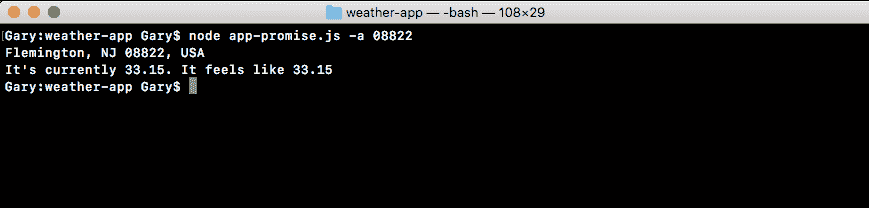

当我们运行这个代码时，我们得到了`新泽西州`的`Flemington`的天气信息。当前温度是`84`华氏度，但感觉像`90`华氏度。如果我们运行的是一个错误的地址，我们会得到错误消息：


所以一切看起来都很棒！使用`axios`库，我们能够像`app-promise`一样链式调用 promise，而不需要做任何太疯狂的事情。`axios get`方法返回一个 promise，所以我们可以直接使用`then`访问它。

在代码中，我们使用`then`一次来处理地理位置数据。我们将地址打印到屏幕上。然后我们返回另一个 promise，在其中我们请求天气。在我们的第二个`then`调用中，我们将天气打印到屏幕上。我们还添加了一个`catch`调用，用于处理任何错误。如果我们的任何一个 promise 出现问题，或者我们抛出错误，`catch`将被触发，将消息打印到屏幕上。

这就是使用 axios 设置 HTTP 请求的 promise 所需的全部内容。人们喜欢 promise 而不是传统回调的一个原因是，我们可以简单地链式调用而不是嵌套。所以我们的代码不会缩进到疯狂的水平。正如我们在上一章的`app.js`中看到的，我们深入了几个缩进级别，只是为了将两个调用组合在一起。如果我们需要添加第三个，情况会变得更糟。有了 promise，我们可以保持一切在同一级别，使我们的代码更容易维护。

# 摘要

在本章中，我们通过一个快速的例子介绍了 promise 的工作原理，只是介绍了非常基础的内容。异步是 Node.js 的一个关键部分。我们介绍了回调和 promise 的基础知识。我们看了一些例子，创建了一个相当酷的天气应用程序。

这就是我们的异步 Node.js 编程的结束，但这并不意味着你必须停止构建天气应用程序。有一些想法可以让你继续这个项目。首先，你可以加载更多的信息。我们从天气 API 得到的响应除了当前温度之外还包含了大量的其他信息。如果你能在其中加入一些东西，比如高/低温度或降水几率，那就太棒了。

接下来，拥有默认位置的能力将是非常酷的。会有一个命令让我设置一个默认位置，然后我可以在没有位置参数的情况下运行天气应用程序来使用默认位置。我们也可以指定一个位置参数来搜索其他地方的天气。这将是一个很棒的功能，它的工作方式有点类似于 Notes 应用程序，我们可以将数据保存到文件系统中。

在下一章中，我们将开始创建异步的网络服务器。我们将制作异步的 API。此外，我们将创建实时的 Socket.IO 应用程序，这也将是异步的。我们将继续创建 Node 应用程序，将其部署到服务器上，使这些服务器对任何具有网络连接的人都可以访问。
