# 第八章：Node 中的 Web 服务器

在本章中，我们将涵盖大量令人兴奋的内容。我们将学习如何创建 Web 服务器，以及如何将版本控制集成到 Node 应用程序中。现在，为了完成所有这些工作，我们将看一下一个叫做 Express 的框架。它是最受欢迎的 npm 库之一，原因很充分。它使得诸如创建 Web 服务器或 HTTP API 之类的工作变得非常容易。这有点类似于我们在上一章中使用的 Dark Sky API。

现在大多数课程都是从 Express 开始的，这可能会让人困惑，因为它模糊了 Node 和 Express 之间的界限。我们将通过将 Express 添加到全新的 Node 应用程序来开始。

具体来说，我们将涵盖以下主题：

+   介绍 Express

+   静态服务器

+   渲染模板

+   高级模板

+   中间件

# 介绍 Express

在本节中，您将创建自己的第一个 Node.js Web 服务器，这意味着您将有一种全新的方式让用户访问您的应用程序。而不是让他们从终端运行它并传递参数，您可以给他们一个 URL，他们可以访问以查看您的 Web 应用程序，或者一个 URL，他们可以发出 HTTP 请求以获取一些数据。

这将类似于我们在之前的章节中使用地理编码 API 时所做的。不过，我们将能够创建自己的 API，而不是使用 API。我们还将能够为诸如作品集网站之类的静态网站设置一个静态网站。这两者都是非常有效的用例。现在，所有这些都将使用一个叫做**Express**的库来完成，这是最受欢迎的 npm 库之一。实际上，这是 Node 变得如此受欢迎的原因之一，因为它非常容易制作 REST API 和静态 Web 服务器。

# 配置 Express

Express 是一个直截了当的库。现在有很多不同的配置方式。所以它可能会变得非常复杂。这就是为什么在接下来的几章中我们将使用它的原因。首先，让我们创建一个目录，我们可以在其中存储这个应用程序的所有代码。这个应用程序将是我们的 Web 服务器。

在桌面上，让我们通过在终端中运行`mkdir node-web-server`命令来创建一个名为`node-web-server`的目录：

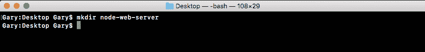

创建了这个目录后，我们将使用`cd`进入其中：

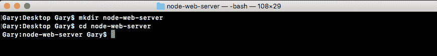

我们还将在 Atom 中打开它。在 Atom 中，我们将从桌面打开它：

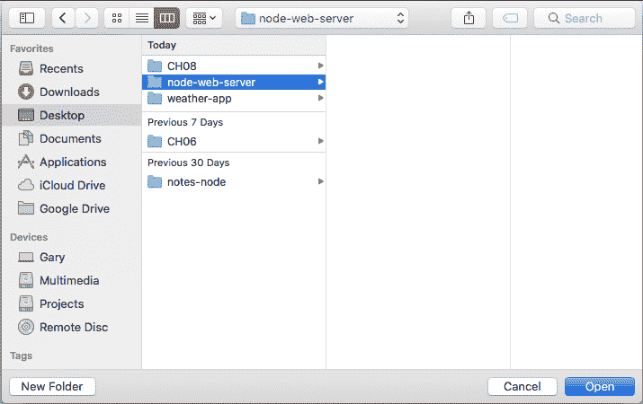

在继续之前，我们将运行`npm init`命令，以便生成`package.json`文件。如下所示，我们将运行`npm init`：

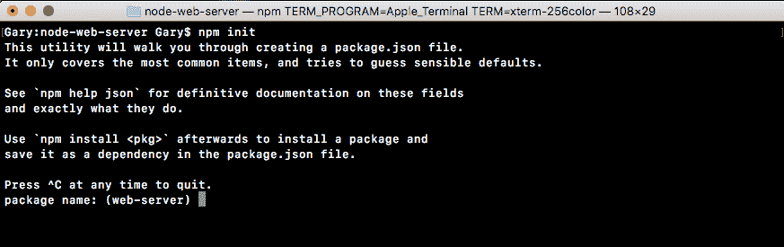

然后，我们将通过在以下截图中显示的所有选项中按*enter*来使用默认值。目前没有必要自定义任何选项：

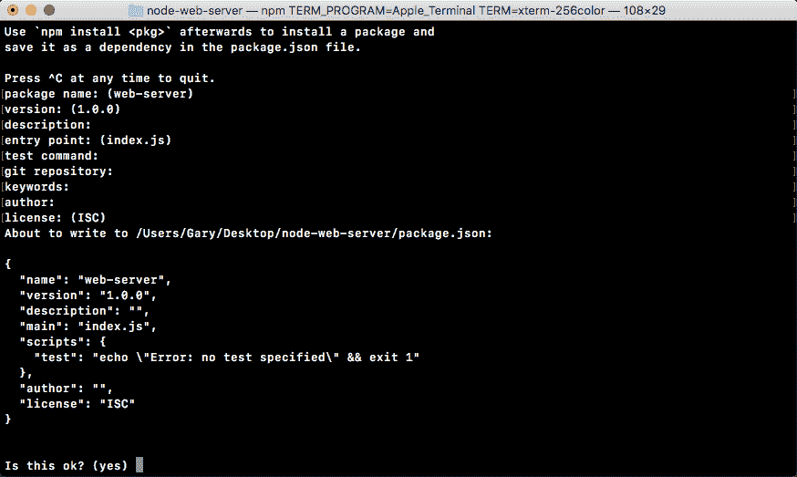

然后我们将在最后一个语句`Is this ok? (yes)`中输入`yes`，`package.json`文件就位了：

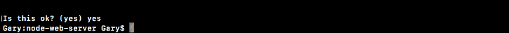

# Express 文档网站

如前所述，Express 是一个非常庞大的库。有一个专门的网站专门用于 Express 文档。您可以访问[www.expressjs.com](http://expressjs.com/)查看网站提供的所有内容，而不是简单的`README.md`文件：

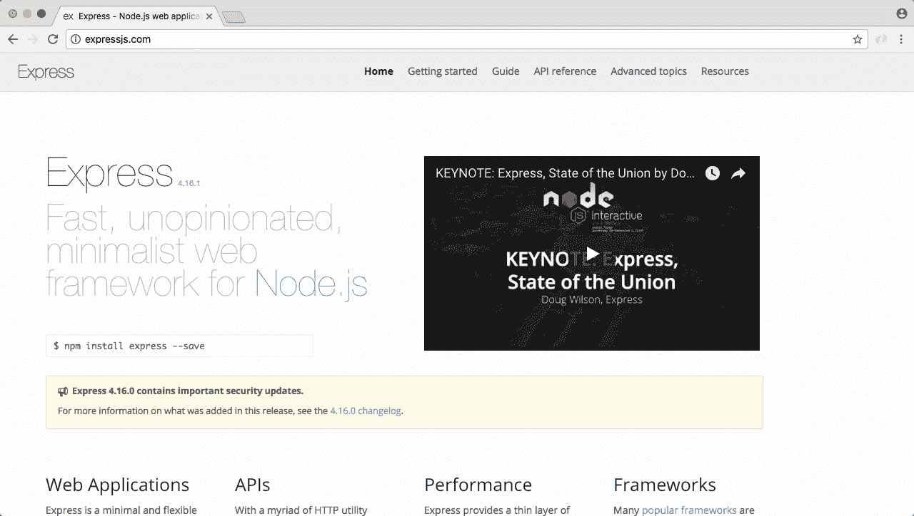

我们将找到入门、帮助文章等。该网站有一个“指南”选项，可以帮助您执行诸如路由、调试、错误处理和 API 参考之类的操作，因此我们可以准确了解我们可以访问的方法以及它们的作用。这是一个非常方便的网站。

# 安装 Express

现在我们有了我们的`node-web-server`目录，我们将安装 Express，这样我们就可以开始制作我们的 Web 服务器。在终端中，我们将首先运行`clear`命令以清除输出。然后我们将运行`npm install`命令。模块名称是`express`，我们将使用最新版本`@4.16.0`。我们还将提供`save`标志来更新我们的`package.json`文件中的依赖项，如下所示：

```js
npm install express@4.16.0 --save
```

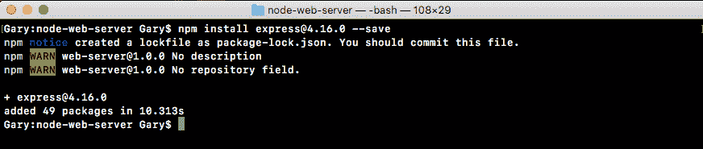

再次，我们将使用`clear`命令来清除终端输出。

现在我们已经安装了`Express`，我们可以在 Atom 中创建我们的 Web 服务器。为了运行服务器，我们需要一个文件。我会把这个文件叫做`server.js`。它将直接放在我们应用程序的根目录中：

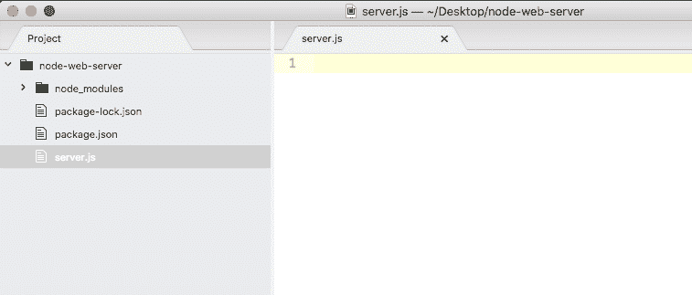

这是我们将配置各种路由的地方，像网站的根目录，像`/about`这样的页面等。这也是我们将启动服务器的地方，将其绑定到我们机器上的端口。现在我们将部署到一个真正的服务器。稍后我们将讨论这是如何工作的。现在，我们大部分的服务器示例将发生在我们的本地主机上。

在`server.js`中，我们要做的第一件事是通过创建一个常量`express`并将其设置为`require('express')`来加载 Express：

```js
const express = require('express');
```

接下来，我们要做的是创建一个新的 Express 应用程序。为此，我们将创建一个名为 app 的变量，并将其设置为从调用`express`作为函数返回的结果：

```js
const express = require('express');

var app = express();
```

现在我们不需要传递任何参数到`express`中。我们将进行大量的配置，但这将以不同的方式进行。

# 创建一个应用程序

为了创建一个应用程序，我们只需要调用这个方法。在变量`app`旁边，我们可以开始设置所有我们的 HTTP 路由处理程序。例如，如果有人访问网站的根目录，我们将想要发送一些东西回去。也许是一些 JSON 数据，也许是一个 HTML 页面。

我们可以使用`app.get`函数注册一个处理程序。这将让我们为 HTTP get 请求设置一个处理程序。我们必须传入`app.get`的两个参数： 

+   第一个参数将是一个 URL

+   第二个参数将是要运行的函数；告诉 Express 要发送什么回去给发出请求的人的函数

在我们的情况下，我们正在寻找应用程序的根。所以我们可以只使用斜杠（`/`）作为第一个参数。在第二个参数中，我们将使用一个简单的箭头函数（`=>`）如下所示：

```js
const express = require('express');

var app = express();

app.get('/', (req, res) => {

};
```

现在箭头函数（`=>`）将被调用两个参数。这对于 Express 的工作方式非常重要：

+   第一个参数是请求（`req`），存储了关于进来的请求的大量信息。像使用的标头、任何主体信息，或者用请求到路径的方法。所有这些都存储在请求中。

+   第二个参数，respond（`res`），有很多可用的方法，所以我们可以以任何我们喜欢的方式响应 HTTP 请求。我们可以自定义发送回去的数据，还可以设置我们的 HTTP 状态码。

我们将详细探讨这两者。不过现在，我们将使用一个方法，`res.send`。这将让我们响应请求，发送一些数据回去。在`app.get`函数中，让我们调用`res.send`，传入一个字符串。在括号中，我们将添加`Hello Express!`：

```js
app.get('/', (req, res) => {
  res.send('Hello Express!');
});
```

这是 HTTP 请求的响应。所以当有人查看网站时，他们将看到这个字符串。如果他们从应用程序发出请求，他们将得到`Hello Express!`作为主体数据。

现在在这一点上，我们还没有完全完成。我们已经设置了其中一个路由，但是应用程序实际上永远不会开始监听。我们需要做的是调用`app.listen`。`app.listen`函数将在我们的机器上将应用程序绑定到一个端口。在这种情况下，对于我们的本地主机应用程序，我们将使用端口`3000`，这是一个非常常见的用于本地开发的端口。在本章的后面，我们将讨论如何根据您用于将应用程序部署到生产环境的服务器来自定义此设置。不过，像`3000`这样的数字是有效的：

```js
app.get('/', (req, res) => {
  res.send('Hello Express!');
});

app.listen(3000);
```

有了这个设置，我们现在完成了。我们有了我们的第一个 Express 服务器。我们实际上可以从终端运行它，并在浏览器中查看它。在终端中，我们将使用`nodemon server.js`来启动我们的应用程序：

```js
nodemon server.js
```

这将启动应用程序，并且您将看到应用程序从未真正完成，如下所示：

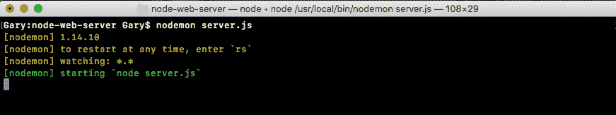

现在它正在挂起。它正在等待请求开始进来。使用`app.listen`的应用程序永远不会停止。您必须手动使用*control* + *C*关闭它们，就像我们以前做过的那样。如果您的代码中有错误，它可能会崩溃。但是它通常不会停止，因为我们在这里设置了绑定。它将监听请求，直到您告诉它停止。

现在服务器已经启动，我们可以进入浏览器，打开一个新标签，访问网站，`localhost:`后跟端口`3000`：

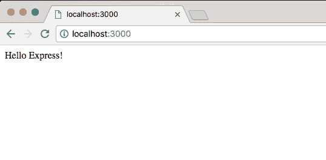

这将加载网站的根目录，并且我们指定了该路由的处理程序。Hello Express!显示出来，这正是我们所期望的。现在没有花哨。没有格式。我们只是从服务器向发出请求的客户端发送一个字符串。

# 在浏览器中探索应用程序请求的开发者工具

接下来，我们想打开开发者工具，以便我们可以探索在发出请求时发生了什么。在 Chrome 中，您可以使用设置|更多工具|开发者工具来打开开发者工具：

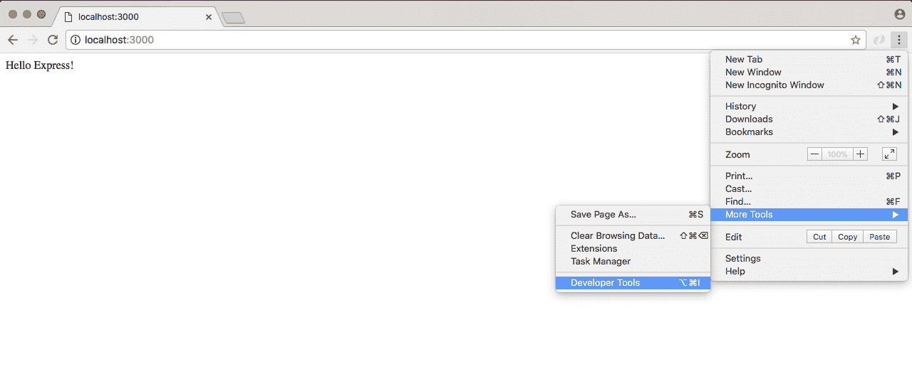

或者您可以使用与操作系统的开发者工具一起显示的键盘快捷键。

我强烈建议您记住这个键盘快捷键，因为在使用 Node 时，您将大量使用`开发者工具`。

我们现在将打开开发者工具，它应该看起来与我们运行 Node Inspector 调试器时使用的工具类似。它们有点不同，但是思想是一样的：

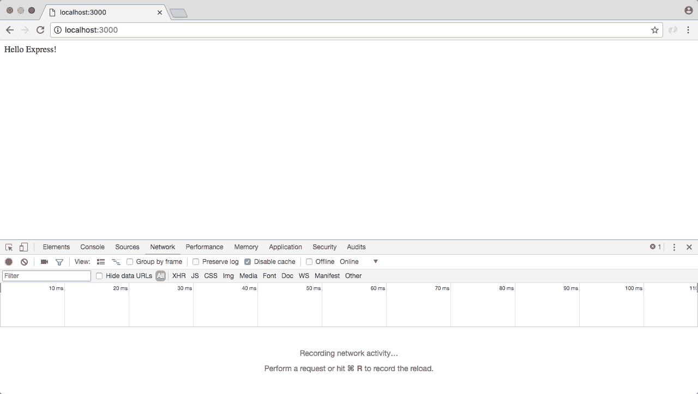

我们在顶部有一堆标签，然后我们在页面下方有我们特定标签的信息。在我们的情况下，我们想转到网络标签，目前我们什么都没有。因此，我们将在打开标签的情况下刷新页面，我们在这里看到的是我们的本地主机请求：

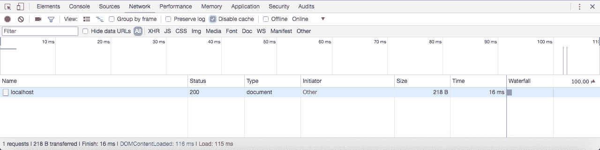

这是负责在屏幕上显示 Hello Express!的请求。实际上，我们可以单击请求以查看其详细信息：

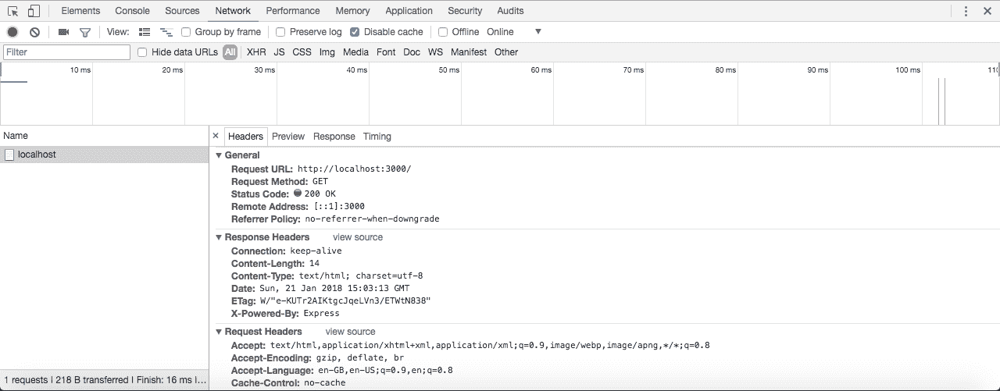

这个页面一开始可能有点压倒性。有很多信息。在顶部，我们有一些一般信息，例如被请求的 URL，客户端想要的方法；在这种情况下，我们发出了一个 GET 请求，并且返回的状态代码。默认状态代码为 200，表示一切顺利。我们想要指出的是一个响应头。

在响应标头下，我们有一个叫做 Content-Type 的标头。这个标头告诉客户端返回了什么类型的数据。现在这可能是像 HTML 网站、一些文本或一些 JSON 数据，而客户端可能是一个网络浏览器、iPhone、安卓设备或任何其他具有网络功能的计算机。在我们的情况下，我们告诉浏览器返回的是一些 HTML，所以为什么不按照这样的方式进行渲染呢。我们使用了 text/html Content-Type。这是由 Express 自动设置的，这也是它如此受欢迎的原因之一。它为我们处理了很多这样的琐事。

# 将 HTML 传递给 res.send

现在我们有了一个非常基本的例子，我们想要把事情提升到一个新的水平。在 Atom 中，我们实际上可以通过将我们的`Hello Express!`消息放在一个`h1`标签中，直接在 send 中提供一些 HTML。在本节的后面，我们将设置一个包含 HTML 文件的静态网站。我们还将研究模板化以创建动态网页。但现在，我们实际上可以只是将一些 HTML 传递给`res.send`：

```js
app.get('/', (req, res) => {
  res.send('<h1>Hello Express!</h1>');
});

app.listen(3000);
```

我们保存服务器文件，这应该会重新启动浏览器。当我们刷新浏览器时，我们会看到 Hello Express!打印到屏幕上：

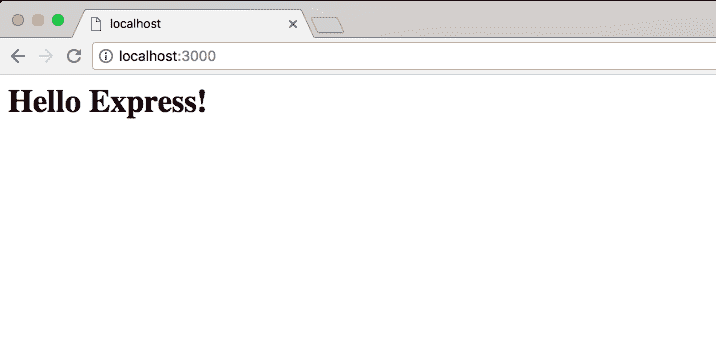

不过这一次，我们把它放在了一个`h1`标签中，这意味着它是由默认的浏览器样式格式化的。在这种情况下，它看起来很漂亮而且很大。有了这个，我们现在可以在网络选项卡中打开请求，我们得到的是和之前完全一样的东西。我们仍然告诉浏览器它是 HTML。这一次唯一的区别是：我们实际上有一个 HTML 标签，所以它会使用浏览器的默认样式进行渲染。

# 发送 JSON 数据回去

我们接下来要看的是如何发送一些 JSON 数据回去。使用 Express 发送 JSON 非常容易。为了说明我们如何做到这一点，我们将注释掉当前对`res.send`的调用，并添加一个新的调用。我们将调用`res.send`，传入一个对象：

```js
app.get('/', (req, res) => {
  // res.send('<h1>Hello Express!</h1>');
  res.send({

  })
});
```

在这个对象上，我们可以提供任何我们喜欢的东西。我们可以创建一个`name`属性，将它设置为任何名字的字符串版本，比如`Andrew`。我们可以创建一个名为`likes`的属性，将它设置为一个数组，并且可以指定一些我们可能喜欢的东西。让我们把`Biking`添加为其中之一，然后再添加`Cities`作为另一个：

```js
  res.send({
    name: 'Andrew',
    likes: [
      'Biking',
      'Cities'
    ]
  });
```

当我们调用`res.send`并传入一个对象时，Express 会注意到。Express 会将其转换为 JSON，并发送回浏览器。当我们保存`server.js`并且 nodemon 刷新时，我们可以刷新浏览器，我们得到的是我的数据使用 JSON 视图格式化的结果：

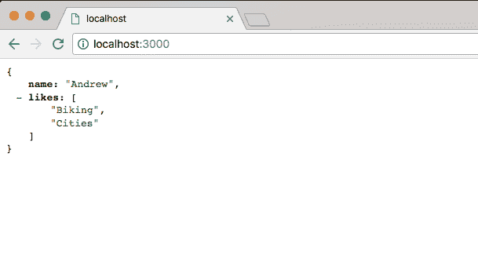

这意味着我们可以折叠属性并快速导航 JSON 数据。

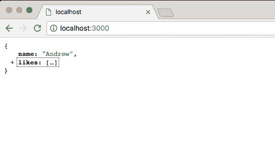

现在 JSON 视图之所以能够捕捉到这一点，是因为我们在上一个请求中探索的 Content-Type 标头实际上发生了变化。如果我打开`localhost`，很多东西看起来都一样。但现在 Content-Type 变成了 application/json Content-Type：

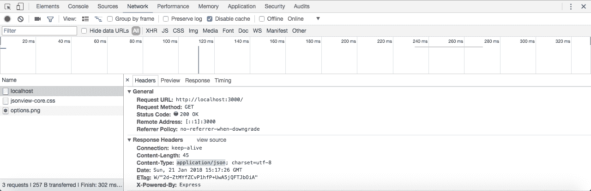

这个 Content-Type 告诉请求者，它是一个安卓手机、一个 iOS 设备，还是浏览器，JSON 数据正在返回，它应该解析为这样。这正是浏览器在这种情况下所做的。

Express 还可以很容易地设置除根路由之外的其他路由。我们可以在 Atom 中调用`app.get`来探索这一点。我们将调用`app.get`。我们将创建第二个路由。我们将这个叫做`about`：

```js
app.get('/about')

app.listen(3000);
```

注意我们只是使用了`/about`作为路由。保持斜杠的位置很重要，但在那之后你可以输入任何你喜欢的东西。在这种情况下，我们将有一个`/about`页面供某人访问。然后我会提供处理程序。处理程序将接收`req`和`res`对象：

```js
app.get('/about', (req, res) => {

});

app.listen(3000);
```

这将让我们弄清楚是什么样的请求进来了，以及让我们对该请求做出响应。现在，为了说明我们可以创建更多页面，我们将保持响应简单，`res.send`。在字符串内部，我们将打印`About Page`：

```js
app.get('/about', (req, res) => {
  res.send('About Page');
});
```

现在当我们保存`server.js`文件时，服务器将重新启动。在浏览器中，我们可以访问`localhost:3000/about`。在`/about`处，我们现在应该看到我们的新数据，这正是我们得到的，About Page 显示如下：

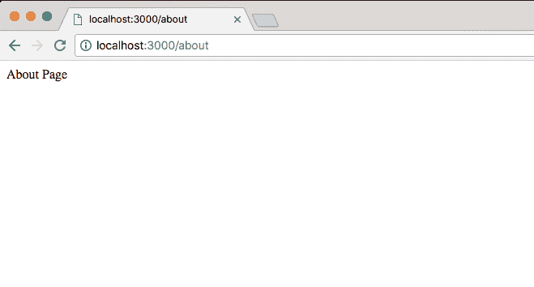

使用`app.get`，我们可以指定尽可能多的路由。目前我们只有一个`about`路由和一个`/`路由，也被称为根路由。根路由返回一些数据，恰好是 JSON，而 about 路由返回一点 HTML。现在我们已经有了这个设置，并且对于如何在 Express 中设置路由有了一个非常基本的理解，我们希望你创建一个新的路由`/bad`。这将模拟当请求失败时会发生什么。

# JSON 请求中的错误处理

为了显示 JSON 的错误处理请求，我们将调用`app.get`。这个`app.get`将让我们为 get HTTP 请求注册另一个处理程序。在我们的情况下，我们正在寻找的路由将在引号内，即`/bad`。当有人请求这个页面时，我们想要做的将在回调中指定。回调将使用我们的两个参数，`req`和`res`。我们将使用一个箭头函数(`=>`)，这是我到目前为止所有处理程序都使用的：

```js
app.get('/bad', (req, res) => {

  });

app.listen(3000);
```

在箭头函数(`=>`)内部，我们将通过调用`res.send`发送一些 JSON。但我们不是传递一个字符串，或一些字符串 HTML，而是传递一个对象：

```js
app.get('/bad', (req, res) => {
  res.send({

  });
});
```

现在我们已经有了我们的对象，我们可以指定要发送回去的属性。在这种情况下，我们将设置一个`errorMessage`。我们将把我的错误消息属性设置为一个字符串，`无法处理请求`：

```js
app.get('/bad', (req, res) => {
  res.send({
    errorMessage: 'Unable to handle request'
  });
});
```

接下来我们将保存文件，在 nodemon 中重新启动它，并在浏览器中访问它。确保我们的错误消息正确显示。在浏览器中，我们将访问`/bad`，按下*enter*，我们会得到以下内容：

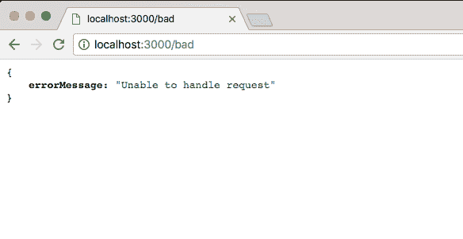

我们的 JSON 数据显示出来了。我们有错误消息，还有消息显示出来：无法处理请求。现在，如果你正在使用 JSON 视图，并且想查看原始的 JSON 数据，你实际上可以点击“查看源代码”，它会在新标签页中显示出来。在这里，我们正在查看原始的 JSON 数据，所有内容都用双引号括起来。

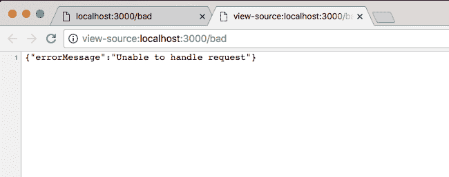

我将坚持使用 JSON 视图数据，因为它更容易导航和查看。我们现在有一个非常基本的 Express 应用程序正在运行。它在端口`3000`上监听，并且目前有 3 个 URL 的处理程序：当我们获取页面的根目录时，当我们获取`/about`时，以及当我们对`/bad`发出 get 请求时。

# 静态服务器

在这一部分，我们将学习如何设置一个静态目录。因此，如果我们有一个包含 HTML、CSS、JavaScript 和图像的网站，我们可以提供这些内容，而不需要为每个文件提供自定义路由，这将是一个真正的负担。现在设置这个非常简单。但在我们对`server.js`进行任何更新之前，我们需要在项目中创建一些静态资产，这样我们才能提供服务。

# 制作一个 HTML 页面

在这种情况下，我们将制作一个 HTML 页面，我们将能够在浏览器中查看。在我们开始之前，我们需要创建一个新的目录，这个目录中的所有内容都可以通过网络服务器访问，所以重要的是不要在这里放任何你不希望别人看到的东西。

目录中的所有内容都应该是任何人都可以查看的。我们将创建一个公共文件夹来存储所有静态资产，在这里我们将创建一个 HTML 页面。我们将通过创建一个名为`help.html`的文件为我们的示例项目创建一个帮助页面：

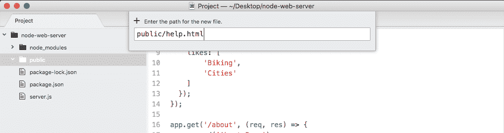

现在在`help.html`中，我们将创建一个快速的基本 HTML 文件，尽管我们不会涉及 HTML 的所有微妙之处，因为这不是一本真正的 HTML 书。相反，我们将只设置一个基本页面。

我们需要做的第一件事是创建一个`DOCTYPE`，让浏览器知道我们正在使用的 HTML 版本。看起来会像这样：

```js
<!DOCTYPE html>
```

在开标签和感叹号之后，我们会输入大写的`DOCTYPE`。然后，我们提供 HTML5 的实际`DOCTYPE`，最新版本。然后我们可以使用大于号来关闭事物。在下一行，我们将打开我们的`html`标签，以便定义整个 HTML 文件：

```js
<!DOCTYPE html>
<html>
</html>
```

在`html`内部，有两个标签我们将使用：`head`标签让我们配置我们的文档，和`body`标签包含我们想要呈现在屏幕上的所有内容。

# head 标签

我们将首先创建`head`标签：

```js
<!DOCTYPE html>
<html>
  <head>

  </head>
</html>
```

在`head`中，我们将提供两个信息，`charset`和`title`标签：

+   首先，我们必须设置`charset`，让浏览器知道如何呈现我们的字符。

+   接下来我们将提供`title`标签。`title`标签让浏览器知道在标题栏中呈现什么内容，通常是新标签。

如下面的代码片段所示，我们将设置`meta`。在`meta`上，我们将使用等号设置`charset`属性，并提供值`utf-8`：

```js
  <head>
    <meta charset="utf-8">
  </head>
```

对于`title`标签，我们可以将其设置为任何我们喜欢的内容；`Help Page`似乎很合适：

```js
  <head>
    <meta charset="utf-8">
    <title>Help Page</title>
  </head>
```

# body 标签

现在我们的`head`已经配置好，我们可以在网站的正文中添加一些内容。这些内容实际上将在视口内可见。在`head`旁边，我们将打开和关闭`body`标签：

```js
  <body>

  </body>
```

在`body`中，我们将再次提供两个内容：一个`h1`标题和一个`p`段落标签。

标题将与我们在`head`中使用的`title`标签匹配，Help Page，段落将只有一些填充文本——`这里有一些文本`：

```js
<!DOCTYPE html>
<html>
  <head>
    <meta charset="utf-8">
    <title>Help Page</title>
  </head>
  <body>
    <h1>Help Page</h1>
    <p>Some text here</p>
  </body>
</html>
```

现在我们有一个 HTML 页面，目标是能够在 Express 应用程序中提供此页面，而无需手动配置。

# 在 Express 应用程序中提供 HTML 页面

我们将使用 Express 中间件来在 Express 应用程序中提供我们的 HTML 页面。中间件让我们配置我们的 Express 应用程序的工作方式，并且在整本书中我们将广泛使用它。现在，我们可以将其视为第三方附加组件。

为了添加一些中间件，我们将调用`app.use`。`app.use`接受我们想要使用的中间件函数。在我们的情况下，我们将使用内置的中间件。因此，在`server.js`中，在`app`变量语句旁边，我们将提供`express`对象的函数：

```js
const express = require('express');

var app = express();

app.use();
```

在下一章中，我们将制作自己的中间件，所以很快就会清楚究竟传递了什么。现在，我们将传递`express.static`并将其作为一个函数调用：

```js
var app = express();

app.use(express.static());
```

现在`express.static`需要获取要提供的文件夹的绝对路径。如果我们想要提供`/help`，我们需要提供`public`文件夹的路径。这意味着我们需要指定从硬盘根目录开始的路径，这可能会很棘手，因为您的项目会移动。幸运的是，我们有`__dirname`变量：

```js
app.use(express.static(__dirname));
```

这是由我们探索的包装函数传递给我们文件的变量。`__dirname`变量存储着您项目的目录路径。在这种情况下，它存储着`node-web-server`的路径。我们只需连接`/public`，告诉它使用这个目录作为我们的服务器。我们将使用加号和字符串`/public`进行连接：

```js
app.use(express.static(__dirname + '/public'));
```

有了这个设置，我们现在已经完成了。我们的服务器已经设置好，没有其他事情要做。现在我们应该能够重新启动我们的服务器并访问`/help.html`。我们现在应该能够看到我们的 HTML 页面。在终端中，我们现在可以使用`nodemon server.js`来启动应用程序：

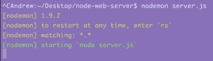

一旦应用程序运行起来，我们就可以在浏览器中访问它。我们将首先转到`localhost:3000`：

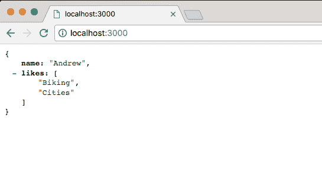

在这里，我们得到了我们的 JSON 数据，这正是我们所期望的。如果我们将该 URL 更改为`/help.html`，我们应该会看到我们的帮助页面渲染：

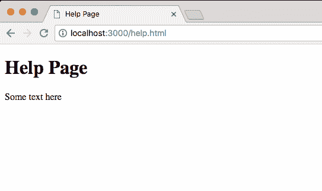

这正是我们得到的，我们的帮助页面显示在屏幕上。我们将帮助页面标题设置为标题，然后是一些文本段落作为正文。能够轻松设置静态目录已经使 Node 成为简单项目的首选，这些项目实际上并不需要后端。如果您想创建一个仅用于提供目录的 Node 应用程序，您可以在`server.js`文件中用大约四行代码完成：前三行和最后一行。

# 对`app.listen`的调用

现在我们要讨论的另一件事是对`app.listen(3000)`的调用。`app.listen`确实需要第二个参数。这是可选的。这是一个函数。这将让我们在服务器启动后执行某些操作，因为启动可能需要一点时间。在我们的情况下，我们将为`console.log`分配一条消息：`服务器已在 3000 端口上启动`：

```js
app.listen(3000, () => {
  console.log('Server is up on port 3000');
});
```

现在对于启动应用程序的人来说，服务器实际上已经准备就绪，因为消息将打印到屏幕上。如果我们保存`server.js`，并返回到终端，我们可以看到`服务器已在 3000 端口上启动`打印出来：

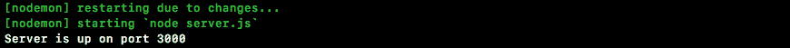

回到浏览器，我们可以刷新，得到完全相同的结果：

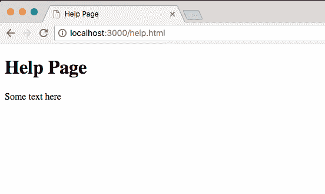

这就是本节的全部内容。我们现在有一个静态目录，可以在其中包含 JavaScript、CSS、图像或任何其他文件类型。

# 渲染模板

在最后几节中，我们看了多种使用 Express 渲染 HTML 的方法。我们将一些 HTML 传递给`response.send`，但显然这并不理想。在字符串中编写标记是真正痛苦的。我们还创建了一个公共目录，可以在其中放置我们的静态 HTML 文件，例如我们的`help`文件，并将其提供给浏览器。这两种方法都很好，但还有第三种解决方案，这将是本节的主题。解决方案是模板引擎。

模板引擎将允许您以动态方式呈现 HTML，我们可以在模板中注入值，例如用户名或当前日期，就像我们在 Ruby 或 PHP 中所做的那样。使用这个模板引擎，我们还将能够为诸如页眉或页脚之类的可重用标记创建可重用的标记，这将在您的许多页面上都是相同的。这个模板引擎，handlebars，将是本节和下一节的主题，所以让我们开始吧。

# 安装 hbs 模块

我们要做的第一件事是安装`hbs`模块。这是 Express 的 handlebars 视图引擎。现在有很多其他 Express 视图引擎，例如 EJS 或 Pug。我们将选择 handlebars，因为它的语法很棒。这是一个很好的开始方式。

现在我们将在浏览器中看到一些内容。首先，我们将访问[handlebarsjs.com](http://handlebarsjs.com/)。这是 handlebars 的文档。它向您展示了如何使用其所有功能，因此如果我们想使用任何内容，我们总是可以在这里学习如何使用它。

现在我们将安装一个包装在 handlebars 周围的模块。它将让我们将其用作 Express 视图引擎。要查看此内容，我们将转到[npmjs.com/package/hbs](https://www.npmjs.com/package/hbs)。

这是所有软件包的 URL 结构。因此，如果您想找到软件包页面，只需键入`npmjs.com/package/软件包名称`。

这个模块非常受欢迎。这是一个非常好的视图引擎。他们有很多文档。我只是想让你知道这也存在。现在我们可以安装并将其集成到我们的应用程序中。在终端中，我们将使用`npm install`安装`hbs`，模块名称是`hbs`，最新版本是`@4.0.1`。我将使用`save`标志来更新`package.json`：

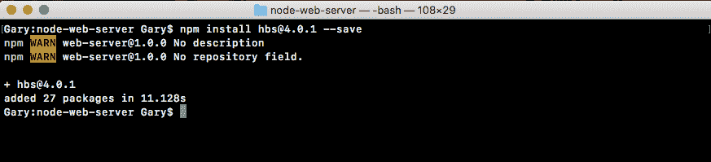

现在实际上配置 Express 使用这个 handlebars 视图引擎非常简单。我们所要做的就是导入它并在我们的 Express 配置中添加一个语句。我们将在 Atom 中做到这一点。

# 配置 handlebars

在 Atom 中，让我们开始加载 handlebars `const hbs = require hbs`，如所示，从这里我们可以添加一行：

```js
const express = require('express');
const hbs = require('hbs');
```

接下来，让我们调用`app.set`，在那里我们为 Express 静态调用`app.use`：

```js
app.set
app.use(express.static(__dirname + '/public'));
```

这让我们设置一些与 Express 相关的配置。有很多内置的配置。我们稍后会谈论更多。现在，我们要做的是传入一个键值对，其中键是你想要设置的东西，值是你想要使用的值。在这种情况下，我们设置的键是`view engine`。这将告诉 Express 我们想要使用的视图引擎，并且我们将在引号内传入`hbs`：

```js
app.set('view engine', 'hbs');
app.use(express.static(__dirname + '/public'));
```

这就是我们需要做的一切。

# 我们的第一个模板

现在，为了创建我们的第一个模板，我们想要做的是在项目中创建一个名为`views`的目录。`views`是 Express 用于模板的默认目录。所以我们将添加`views`目录，然后在其中添加一个模板。我们将为我们的关于页面创建一个模板。

在 views 中，我们将添加一个新文件，文件名将是`about.hbs`。`hbs` handlebars 扩展名很重要。确保包含它。

现在 Atom 已经知道如何解析`hbs`文件。在`about.hbs`文件的底部，显示当前语言的地方，使用括号内的 HTML mustache。

Mustache 被用作这种类型的 handlebars 语法的名称，因为当你输入大括号（`{`）时，它们看起来有点像胡须。

我们要做的是开始使用`help.html`的内容并直接复制它。让我们复制这个文件，这样我们就不必重写那个样板，然后我们将它粘贴到`about.hbs`中：

```js
<!DOCTYPE html>
<html>
  <head>
    <meta charset="utf-8">
    <title>Help Page</title>
  </head>
  <body>
    <h1>Help Page</h1>
    <p>Some text here</p>
  </body>
</html>
```

现在我们可以尝试渲染这个页面。我们将把`h1`标签从帮助页面改为关于页面：

```js
  <body>
    <h1>About Page</h1>
    <p>Some text here</p>
  </body>
```

我们将在稍后讨论如何在此页面内动态渲染内容。在那之前，我们只想让它渲染。

# 获取静态页面进行渲染

在`server.js`中，我们已经有了一个`/about`的根目录，这意味着我们可以渲染我们的 hbs 模板，而不是发送回这个关于页面字符串。我们将删除我们对`res.send`的调用，并将其替换为`res.render`：

```js
app.get('/about', (req, res) => {
  res.render
});
```

Render 将让我们使用我们当前视图引擎设置的任何模板进行渲染`about.hbs`文件。我们确实有关于模板，我们可以将该名称`about.hbs`作为第一个且唯一的参数传递。我们将渲染`about.hbs`：

```js
app.get('/about', (req, res) => {
  res.render('about.hbs');
});
```

这就足以让静态页面渲染。我们将保存`server.js`，在终端中清除输出，然后使用`nodemon server.js`运行我们的服务器：

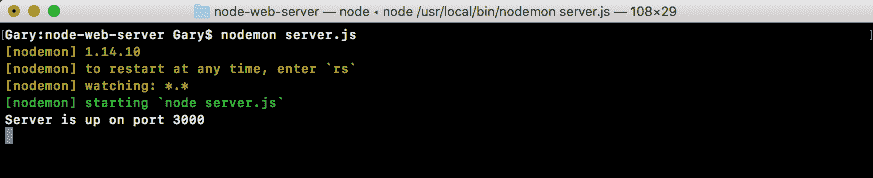

一旦服务器运行起来，它就会显示在端口`3000`上。我们可以打开`/about` URL 并查看我们得到了什么。我们将进入 Chrome 并打开`localhost:3000 /about`，当我们这样做时，我们得到以下结果：

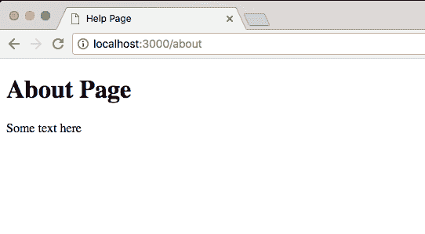

我们得到了我的关于页面的渲染，就像我们期望的那样。我们有一个`h1`标签，显示得很大，我们有一个段落标签，显示如下。到目前为止，我们已经使用了 hbs，但实际上我们还没有使用它的任何功能。现在，我们正在渲染一个动态页面，所以我们可能根本不需要它。我想要做的是讨论一下我们如何在模板中注入数据。

# 在模板中注入数据

让我们想一些我们想要在 handlebars 文件中使动态的东西。首先，我们将使这个`h1`标签动态，以便页面名称传递到`about.hbs`页面中，我们还将添加一个页脚。现在，我们只需将其设置为一个简单的`footer`标签：

```js
    <footer>

    </footer>
  </body>
</html>
```

在`footer`内，我们将添加一个段落，这个段落将包含我们网站的版权。我们只是说版权，然后是年份，2018 年：

```js
    <footer>
      <p>Copyright 2018</p>
    </footer>
```

现在年份也应该是动态的，这样当年份变化时，我们不必手动更新我们的标记。我们将看看如何使 2018 年和关于页面都是动态的，这意味着它们被传递而不是在 handlebars 文件中输入。

为了做到这一点，我们需要做两件事：

+   我们将不得不将一些数据传递到模板中。这将是一个对象，一组键值对，

+   我们将不得不学习如何在 handlebars 文件中提取一些键值对

传递数据非常简单。我们所要做的就是在`server.js`中的`res.render`指定第二个参数。这将接受一个对象，在这个对象上，我们可以指定任何我们喜欢的东西。我们可能有一个`pageTitle`，它被设置为`About Page`：

```js
app.get('/about', (req, res) => {
  res.render('about.hbs', {
    pageTitle: 'About Page'
  });
});
```

我们有一个数据片段被注入到模板中。虽然还没有被使用，但确实被注入了。我们也可以添加另一个，比如`currentYear`。我们将把`currentYear`放在`pageTitle`旁边，并将`currentYear`设置为 JavaScript 构造函数的实际年份。这将看起来像这样：

```js
app.get('/about', (req, res) => {
  res.render('about.hbs', {
    pageTitle: 'About Page',
    currentYear: new Date().getFullYear()
  });
});
```

我们将创建一个新的日期，它将创建一个日期对象的新实例。然后，我们将使用一个叫做`getFullYear`的方法，它返回年份。在这种情况下，它将返回`2018`，就像这样`.getFullYear`。现在我们有了`pageTitle`和`currentYear`。这两者都被传递进来了，我们可以使用它们。

为了使用这些数据，我们在模板内部要使用 handlebars 语法，看起来有点像下面的代码。我们首先在`h1`标签中打开两个大括号，然后关闭两个大括号。在大括号内，我们可以引用我们传入的任何 props。在这种情况下，让我们使用`pageTitle`，在我们的版权段落内，我们将使用双大括号内的`currentYear`：

```js
  <body>
    <h1>{{pageTitle}}</h1>
    <p>Some text here</p>

    <footer>
      <p>Copyright 2018</p>
    </footer>
  </body>
</html>
```

有了这个，我们现在有两个动态数据片段被注入到我们的应用程序中。现在 nodemon 应该在后台重新启动了，所以没有必要手动做任何事情。当我们刷新页面时，我们仍然会得到 About Page，这很好：

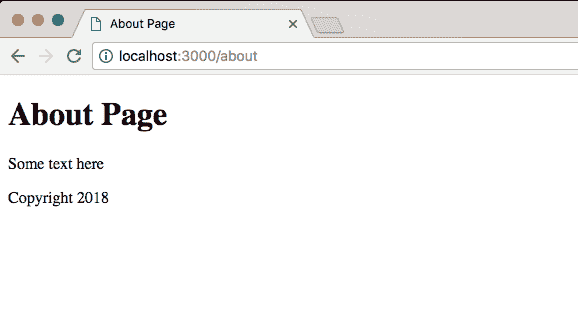

这来自我们在`server.js`中定义的数据，我们得到了版权 2018 年。嗯，这个网页非常简单，看起来并不那么有趣。至少你知道如何创建那些服务器并将数据注入到你的网页中。从这里开始，你只需要添加一些自定义样式，让事情看起来不错。

在继续之前，让我们进入 about 文件并替换标题。目前，它说`Help Page`。这是从公共文件夹中留下的。让我们把它改成`Some Website`：

```js
<!DOCTYPE html>
<html>
  <head>
    <meta charset="utf-8">
    <title>Some Website</title>
  </head>
  <body>
    <h1>{{pageTitle}}</h1>
    <p>Some text here</p>

    <footer>
      <p>Copyright 2018</p>
    </footer>
  </body>
</html>
```

现在我们已经有了这个位置。接下来，我们将创建一个全新的模板，当有人访问我们网站的根目录`/`时，这个模板将被渲染。现在，我们当前渲染一些 JSON 数据：

```js
app.get('/', (req, res) => {
  // res.send('<h1>Hello Express!</h1>');
  res.send({
    name: 'Andrew',
    likes: [
      'Biking',
      'Cities'
    ]
  });
```

我们想要的是用`response.render`来替换这个，渲染一个全新的视图。

# 渲染网站根目录的模板

要开始，我们将复制`about.hbs`文件，这样我们就可以开始根据我们的需求定制它。我们将复制它，并将其命名为`home.hbs`：

```js
<!DOCTYPE html>
<html>
  <head>
    <meta charset="utf-8">
    <title>Some Website</title>
  </head>
  <body>
    <h1>{{pageTitle}}</h1>
    <p>Some text here</p>

    <footer>
      <p>Copyright 2018</p>
    </footer>
  </body>
</html>
```

从这里开始，大部分事情都将保持不变。我们将保持`pageTitle`不变。我们还将保持`Copyright`和`footer`不变。但我们想要改变的是这个段落。`About Page`作为静态的是可以的，但对于`home`页面，我们将把它设置为，双大括号内的`welcomeMessage`属性：

```js
  <body>
    <h1>{{pageTitle}}</h1>
    <p>{{welcomeMessage}}</p>

    <footer>
      <p>Copyright {{currentYear}}</p>
    </footer>
  </body>
```

现在`welcomeMessage`只能在`home.hbs`上使用，这就是为什么我们在`home.hbs`中指定它而不在`about.hbs`中指定它。

接下来，我们需要在回调函数中调用 response render。这将让我们实际渲染页面。我们将添加`response.render`，传入我们要渲染的模板名称。这个叫做`home.hbs`。然后我们将传入我们的数据：

```js
app.get('/', (req, res) => {
  res.render('home.hbs', {

  })
});
```

现在开始，我们可以传入页面标题。我们将把这个设置为`主页`，然后我们将传入一些通用的欢迎消息 - `欢迎来到我的网站`。然后我们将传入`currentYear`，我们已经知道如何获取`currentYear: new Date()`，并且在日期对象上，我们将调用`getFullYear`方法：

```js
 res.render('home.hbs', {
    pageTitle: 'Home Page',
    welcomeMessage: 'Welcome to my website',
    currentYear: new Date().getFullYear()
  })
```

有了这个设置，我们所需要做的就是保存文件，这将自动使用 nodemon 重新启动服务器并刷新浏览器。当我们这样做时，我们会得到以下结果：

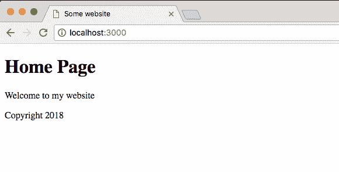

我们得到我们的主页标题，我们的欢迎来到我的网站的消息，以及我的 2018 年版权。如果我们去到`/about`，一切看起来仍然很棒。我们有我们的动态页面标题和版权，以及我们的静态`some text here`文本：

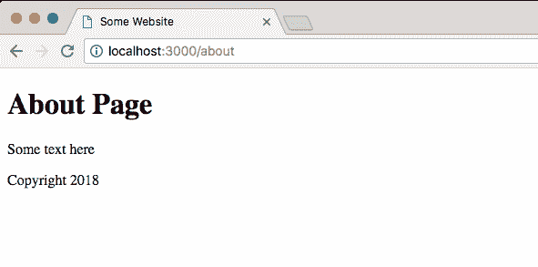

有了这个设置，我们现在已经完成了 handlebars 的基础知识。我们看到了这在现实世界的 web 应用中是如何有用的。除了像版权这样的现实例子，您可能使用它的其他原因是为了注入某种动态用户数据 - 诸如用户名和电子邮件或其他任何东西。

现在我们已经基本了解了如何使用 handlebars 创建静态页面，我们将在下一部分中看一些 hbs 的更高级功能。

# 高级模板

在这一部分，我们将学习一些更高级的功能，这些功能可以更容易地渲染我们的标记，特别是在多个地方使用的标记，它将更容易地将动态数据注入到您的网页中。

为了说明我们将要谈论的第一件事，我想打开`about.hbs`和`home.hbs`，你会注意到底部它们都有完全相同的页脚代码如下：

```js
<footer>
  <p>Copyright {{currentYear}}</p>
</footer>
```

我们为两者都有一个小版权消息，它们都有相同的头部区域，即`h1`标签。

现在这并不是问题，因为我们有两个页面，但随着您添加更多页面，更新页眉和页脚将变得非常麻烦。您将不得不进入每个文件并在那里管理代码，但我们将讨论的是另一种叫做 partial 的东西。

# 添加 partials

Partial 是您网站的部分片段。这是您可以在模板中重复使用的东西。例如，我们可能有一个页脚 partial 来渲染页脚代码。您可以在任何需要页脚的页面上包含该 partial。您也可以对页眉做同样的事情。为了开始，我们需要做的第一件事是稍微调整我们的`server.js`文件，让 handlebars 知道我们想要添加对 partials 的支持。

为了做到这一点，我们将在`server.js`文件中添加一行代码，这是我们之前声明视图引擎的地方，它看起来会像这样（`hbs.registerPartials`）：

```js
hbs.registerPartials
app.set('view engine', 'hbs');
app.use(express.static(__dirname + '/public'));
```

现在`registerPartials`将使用您想要用于所有 handlebar 部分文件的目录，并且我们将指定该目录作为第一个和唯一的参数。再次强调，这确实需要是绝对目录，所以我将使用`__dirname`变量：

```js
hbs.registerPartials(__dirname)
```

然后我们可以连接路径的其余部分，即`/views`。在这种情况下，我希望您使用`/partials`。

```js
hbs.registerPartials(__dirname + '/views/partials')
```

我们将把我们的`partial`文件直接放在`views`文件夹中的一个目录中。现在我们可以在 views 中创建一个名为`partials`的文件夹。

在`partials`中，我们可以放置任何我们喜欢的 handlebars 部分。为了说明它们是如何工作的，我们将创建一个名为`footer.hbs`的文件：

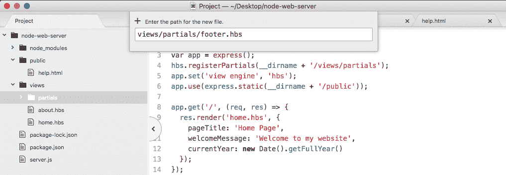

在`footer.hbs`中，我们将可以访问相同的 handlebars 功能，这意味着我们可以编写一些标记，我们可以注入变量，我们可以做任何我们喜欢的事情。现在，我们将做的是粘贴`footer`标签，粘贴到`footer.hbs`中：

```js
<footer>
  <p>Copyright {{getCurrentYear}}</p>
</footer>
```

现在我们有了我们的`footer.hbs`文件，这就是部分，我们可以在`about.hbs`和`home.hbs`中包含它。为了做到这一点，我们将删除部分中已有的代码，并用两个大括号打开和关闭它。现在，我们不再想要注入数据，而是想要注入一个模板，其语法是添加一个大于符号和一个空格，然后是部分名称。在我们的情况下，该部分称为`footer`，所以我们可以在这里添加它：

```js
    {{> footer}}
  </body>
</html>
```

然后我可以保存`about`并在`home.hbs`中做同样的事情。我们现在有了我们的页脚部分。它在两个页面上都渲染出来了。

# 部分的工作

为了说明这是如何工作的，我将启动我的服务器，默认情况下是`nodemon`；它不会监视你的 handlebars 文件。所以如果你做出了更改，网站不会像你期望的那样渲染。我们可以通过运行`nodemon`，传入`server.js`并提供`-e`标志来解决这个问题。这让我们可以指定我们想要监视的所有扩展名。在我们的情况下，我们将监视服务器文件的 JS 扩展名，逗号后是`hds`扩展名：

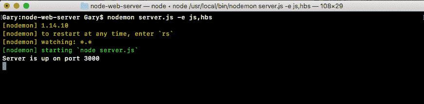

现在我们的应用程序已经启动，我们可以在浏览器中刷新一下，它们应该看起来一样。我们有关于页面和页脚：

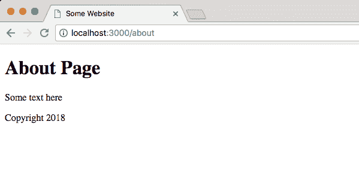

我们的主页上有完全相同的页脚：

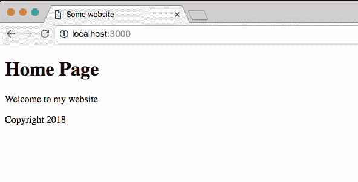

现在的优势是，如果我们想要更改页脚，我们只需在`footer.hbs`文件中进行更改。

我们可以在我们的`footer`段落标签中添加一些内容。让我们添加一个由`Andrew Mead`创建的小消息，带有一个`-`：

```js
<footer>
 <p>Created By Andrew Mead - Copyright {{CurrentYear}}</p>
</footer>
```

现在，保存文件，当我们刷新浏览器时，我们有了全新的主页页脚：

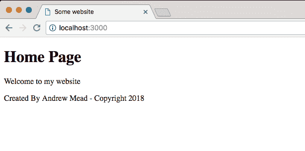

我们有了关于页面的全新页脚：

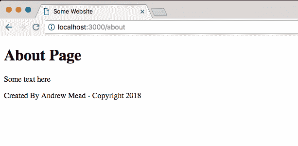

它将显示在主页和关于页面上。在这两个页面中都不需要手动做任何事情，这就是部分的真正力量。你有一些代码，想要在网站内重用它，所以你只需创建一个部分，然后在你喜欢的地方注入它。

# 头部部分

现在我们已经有了页脚部分，让我们创建头部部分。这意味着我们需要创建一个全新的文件`header.hbs`。我们将想要在该文件中添加`h1`标签，然后在`about.hbs`和`home.hbs`中渲染部分。两个页面应该看起来一样。

我们将从头部文件夹中创建一个名为`header.hbs`的新文件。

在`header.hbs`中，我们将从我们的网站中取出`h1`标签，粘贴到里面并保存：

```js
<h1>{{pageTitle}}</h1>
```

现在我们可以在`about`和`home`文件中使用这个头部部分。在`about`中，我们需要使用双大括号和大于符号的语法，然后是部分名称`header`。我们将在`home`页面上做完全相同的事情。在`home`页面上，我们将删除我们的`h1`标签，注入`header`并保存文件：

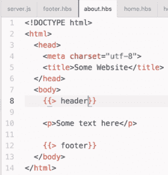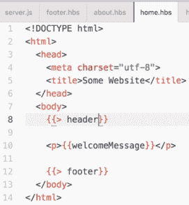

现在我们将创建一些略有不同的东西，以便我们可以测试它是否真的在使用部分。我们将在`header.hbs`中的`h1`标签后面输入`123`：

```js
<h1>{{pageTitle}}</h1>123
```

现在所有文件都已保存，我们应该可以刷新浏览器，看到打印的`about`页面上有 123，这太棒了：

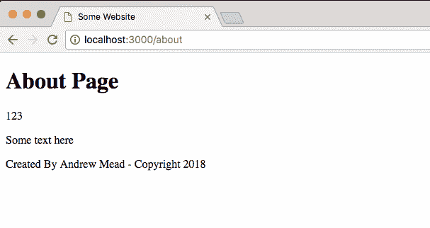

这意味着`header`部分确实起作用，如果我回到`home`页面，一切看起来仍然很棒：

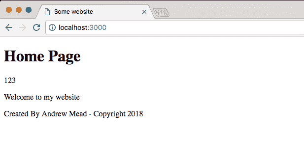

现在我们已经将标题拆分为自己的文件，我们可以做很多事情。我们可以将我们的`h1`标签放入`header 标签`中，这是在 HTML 中声明标题的适当方式。如图所示，我们添加了一个打开和关闭的`header`标签。我们可以取出`h1`，然后将其放在里面：

```js
<header>
 <h1>{{pageTitle}}</h1>
</header>
```

我们还可以向我们网站的其他页面添加一些链接。我们可以通过添加`a`标签为主页添加一个锚标签：

```js
<header>
 <h1>{{pageTitle}}</h1>
 <p><a></a></p>
</header>
```

在`a`标签内，我们将指定我们想要显示的链接文本。我会选择“主页”，然后在`href`属性内部，我们可以指定链接应该带您去的路径，即`/`：

```js
<header>
 <h1>{{pageTitle}}</h1>
 <p><a href="/">Home</a></p>
</header>
```

然后我们可以使用相同的段落标签，复制它并粘贴到下一行，并为`about`页面创建一个链接。我会将页面文本更改为“关于”，链接文本和 URL，而不是转到`/`，将转到`/about`：

```js
<header>
 <h1>{{pageTitle}}</h1>
 <p><a href="/">Home</a></p>
 <p><a href="/about">About</a></p>
</header>
```

现在我们已经对我们的`header`文件进行了更改，并且它将在我们网站的所有页面上都可用。我在`home`页面。如果我刷新它，我会得到主页和关于页面的链接：

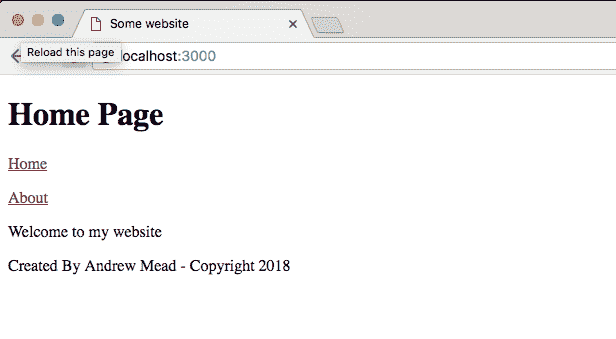

我可以点击“关于”去关于页面：

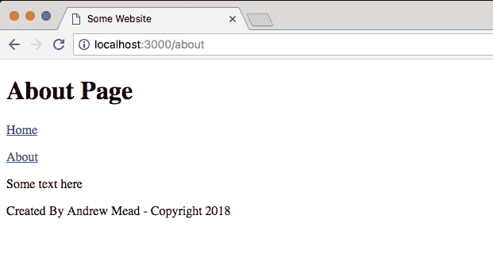

同样，我可以点击主页直接返回。现在我们网站内部的所有这些都更容易管理。

# Handlebars 助手

现在在我们继续之前，我想谈谈另一件事，那就是 handlebars 助手。 Handlebars 助手将是我们注册函数以动态创建一些输出的方式。例如，在`server.js`中，我们当前在我们的`app.get`模板中注入当前年份，这实际上并不是必要的。

有一种更好的方法来传递这些数据，并且不需要提供这些数据，因为我们将始终使用完全相同的函数。我们将始终获取新日期`getfullYear`返回值并将其传递。相反，我们将使用部分，并且我们将立即设置我们的部分。现在，部分只不过是您可以从 handlebars 模板内部运行的函数。

我们需要做的就是注册它，我将在`server.js`中执行此操作，从我们设置 Express 中间件的位置继续。如下所示，我们将调用`hbs.register`，并且我们将注册一个助手，因此我们将调用`registerHelper`：

```js
hbs.registerPartials(__dirname + '/views/partials')
app.set('view engine', 'hbs');
app.use(express.static(__dirname + '/public'));

hbs.registerHelper();
```

现在`registerHelper`接受两个参数：

+   助手的名称作为第一个参数

+   作为第二个参数运行的函数。

这里的第一个参数将是我们的`getCurrentYear`。我们将创建一个助手，返回当前年份：

```js
hbs.registerHelper('getCurrentYear',);
```

第二个参数将是我们的函数。我将使用箭头函数（`=>`）：

```js
hbs.registerHelper('getCurrentYear', () => {

});
```

我们从此函数返回的任何内容都将在`getCurrentYear`调用的位置呈现。这意味着，如果我们在`footer`内部调用`getCurrentYear`，它将从函数返回年份，并且该数据将被呈现。

在`server.js`中，我们可以通过使用`return`并且具有与我们`app.get`对象完全相同的代码来返回年份：

```js
hbs.registerHelper('getCurrentYear'), () => {
 return new Date().getFullYear()
});
```

我们将创建一个新日期，并调用其`getFullYear`方法。现在我们有了一个助手，我们可以从我们的每一个渲染调用中删除这些数据：

```js
hbs.registerHelper('getCurrentYear, () => {
 return new Date().getFullYear()
});

app.get('/', (req, res) => {
 res.render('home.hbs', {
   pageTitle: 'Home Page',
   welcomeMessage: 'Welcome to my website'
 });
});

app.get('/about', (req, res) => {
 res.render('about.hbs', {
   pageTitle: 'About Page'
 });
});
```

这将非常棒，因为实际上没有必要为每个页面计算它，因为它总是相同的。现在我们已经从渲染的各个调用中删除了这些数据，我们将不得不在`footer.hbs`文件中使用`getCurrentYear`：

```js
<footer>
 <p>Created By Andrew Mead - Copyright {{getCurrentYear}}</p>
</footer>
```

而不是引用当前年份，我们将使用助手`getCurrentYear`，并且不需要任何特殊语法。当您在花括号内使用某些东西时，显然不是部分，handlebars 首先会查找具有该名称的助手。如果没有助手，它将查找具有`getCurrentYear`名称的数据片段。

在这种情况下，它将找到辅助程序，因此一切都将按预期工作。现在我们可以保存`footer.hbs`，返回浏览器，然后刷新。当我刷新页面时，我们仍然在主页上得到版权 2018：

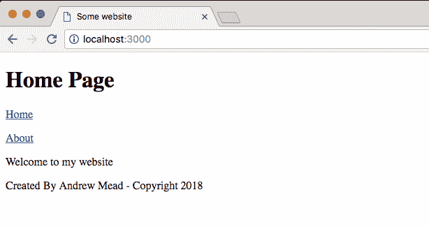

如果我去关于页面，一切看起来都很好：

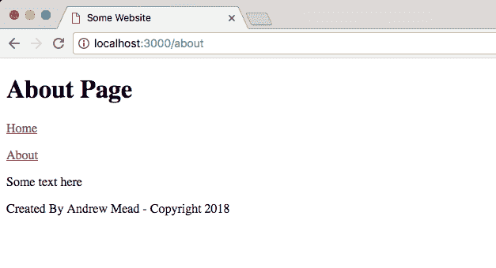

我们可以通过简单地返回其他内容来证明数据是从我们的辅助程序返回的。让我们在`server.js`中注释掉我们的辅助程序代码，并在注释之前，我们可以使用`return test`，就像这样：

```js
hbs.registerHelper('getCurrentYear', () => {
 return 'test';//return new Date().getFullYear()
});
```

现在我们可以保存`server.js`，刷新浏览器，然后我们会看到测试显示如下：

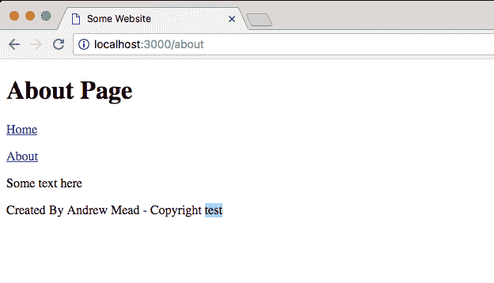

因此，在版权词之后呈现的数据确实来自该辅助程序。现在我们可以删除代码，以便返回正确的年份。

# 辅助程序中的参数

辅助程序还可以接受参数，这真的很有用。让我们创建一个将成为大写辅助程序的第二个辅助程序。我们将称之为`screamIt`辅助程序，它的工作是获取一些文本，并以大写形式返回该文本。

为了做到这一点，我们将再次调用`hbs.registerHelper`。这个辅助程序将被称为`screamIt`，它将接受一个函数，因为我们确实需要运行一些代码才能做任何有用的事情：

```js
hbs.registerHelper('getCurrentYear', () => {
  return new Date().getFullYear()
});

hbs.registerHelper('screamIt', () => {

});
```

现在`screamIt`将接受要大声喊出的`text`，它将只是调用该字符串的`toUpperCase`方法。我们将返回`text.toUpperCase`，就像这样：

```js
hbs.registerHelper('screamIt', (text) => {
  return text.toUpperCase();
});
```

现在我们可以在我们的文件中实际使用`screamIt`。让我们进入`home.hbs`。在这里，我们在`p`标签中有我们的欢迎消息。我们将删除它，然后大声喊出欢迎消息。为了将数据传递给我们的辅助程序之一，我们首先必须按名称引用辅助程序`screamIt`，然后在空格后，我们可以指定要作为参数传递的任何数据。

在这种情况下，我们将传递欢迎消息，但我们也可以通过键入一个空格并传递一些其他我们无法访问的变量来传递两个参数：

```js
<!DOCTYPE html>
<html>
  <head>
    <meta charset="utf-8">
    <title>Some Website</title>
  </head>
  <body>
    {{> header}}

    <p>{{screamIt welcomeMessage}}</p>

    {{> footer}}
  </body>
</html>
```

目前，我们将像这样使用它，这意味着我们将调用`screamIt`辅助程序，传入一个参数`welcomeMessage`。现在我们可以保存`home.hbs`，返回浏览器，转到主页，如下所示，我们得到了 WELCOME TO MY WEBSITE 的全大写：

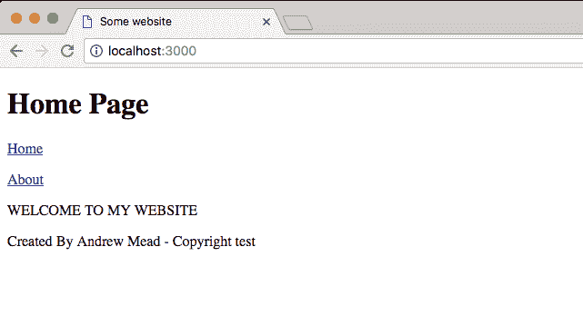

使用 handlebars 辅助程序，我们可以创建既不带参数的函数，也带参数的函数。因此，当您需要在网页内部对数据执行某些操作时，可以使用 JavaScript。现在我们已经做到了。

# Express 中间件

在本节中，您将学习如何使用 Express 中间件。Express 中间件是一个很棒的工具。它允许您添加到 Express 现有功能中。因此，如果 Express 没有做您想要做的事情，您可以添加一些中间件并教它如何做这件事。现在我们已经使用了一点中间件。在`server.js`文件中，我们使用了一些中间件，并教 Express 如何从`static`目录中读取，如下所示：

```js
app.use(express.static(__dirname + '/public'));
```

我们调用了`app.use`，这是您注册中间件的方式，然后我们提供了要使用的中间件函数。

现在中间件可以做任何事情。您可以执行一些代码，例如将某些内容记录到屏幕上。您可以对请求或响应对象进行更改。在下一章中，当我们添加 API 身份验证时，我们将这样做。我们将确保发送正确的标头。该标头将期望具有 API 令牌。我们可以使用中间件来确定某人是否已登录。基本上，它将确定他们是否应该能够访问特定路由，我们还可以使用中间件来响应请求。我们可以像在任何其他地方一样，使用`response.render`或`response.send`从中间件发送一些内容回来。

# 探索中间件

为了探索中间件，我们将创建一些基本的中间件。在我们调用`app.use`注册我们的 Express 静态中间件之后，我们将再次调用`app.use`：

```js
app.use(express.static(__dirname + '/public'));

app.use();
```

现在`app.use`是用来注册中间件的方法，它接受一个函数。因此，我们将传递一个箭头函数（`=>`）：

```js
app.use(() =>  {

});
```

`use`函数只接受一个函数。不需要添加任何其他参数。将使用此函数调用请求（`req`）对象，响应（`res`）对象和第三个参数`next`：

```js
app.use((req, res, next) =>  {

});
```

现在请求和响应对象，现在应该看起来很熟悉。这些正是我们注册处理程序时得到的完全相同的参数。`next`参数是让事情变得有点棘手的地方。`next`参数存在是为了告诉 Express 何时完成您的中间件函数，这很有用，因为您可以将尽可能多的中间件注册到单个 Express 应用程序中。例如，我有一些中间件用于提供目录。我们将编写一些日志，将一些请求数据记录到屏幕上，我们还可以编写第三个部分，用于帮助应用程序性能，跟踪响应时间，所有这些都是可能的。

现在在`app.use`函数内部，我们可以做任何我们喜欢的事情。我们可以将一些东西记录到屏幕上。我们可能会进行数据库请求，以确保用户已经通过身份验证。所有这些都是完全有效的，我们使用`next`参数告诉 Express 我们何时完成。因此，如果我们执行一些异步操作，中间件将不会继续。只有当我们调用`next`时，应用程序才会继续运行，就像这样：

```js
app.use((req, res, next) =>  {
  next();
});
```

这意味着如果您的中间件不调用`next`，则每个请求的处理程序都不会触发。我们可以证明这一点。让我们调用`app.use`，传入一个空函数：

```js
app.use((req, res, next) =>  {

});
```

让我们保存文件，在终端中，我们将使用`server.js`运行我们的应用程序，使用`nodemon`：

```js
nodemon server.js
```

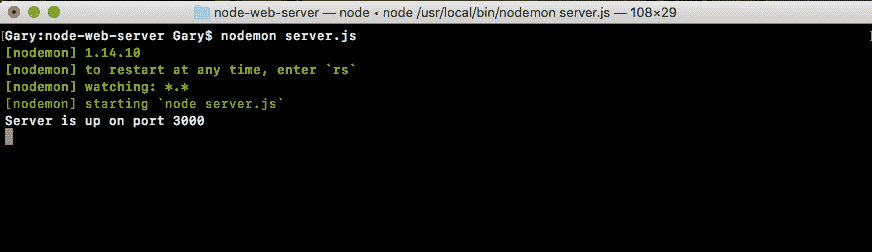

我将进入浏览器，然后请求主页。我将刷新页面，您可以看到顶部正在尝试加载，但永远不会完成：

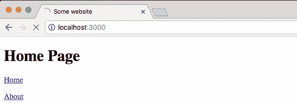

现在问题不是它无法连接到服务器。它可以很好地连接到服务器。真正的问题是在我们的应用程序内部，我们有一些不调用`next`的中间件。为了解决这个问题，我们只需这样调用`next`：

```js
app.use((req, res, next) => {
  next();
});
```

现在当浏览器内部刷新时，我们得到了我们期望的主页：

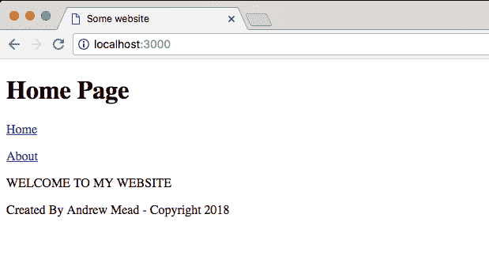

唯一的区别是现在我们有一个地方可以添加一些功能。

# 创建记录器

在`app.use`内部，我们将开始创建一个记录器，记录所有发送到服务器的请求。我们将存储一个时间戳，以便我们可以看到某人何时请求特定 URL。

在中间件内部开始，让我们获取当前时间。我将创建一个名为`now`的变量，将其设置为`newDate`，创建我们的日期对象的一个新实例，并调用`toString`方法：

```js
app.use((req, res, next) => {
 var now = new Date().toString();
 next();
});
```

`toString`方法创建一个格式良好的日期，一个可读的时间戳。现在我们有了我们的`now`变量，我们可以通过调用`console.log`来开始创建实际的记录器。

让我们调用`console.log`，传入我喜欢的任何内容。让我们在反引号内传入`now`变量，并在后面加上一个冒号：

```js
app.use((req, res, next) => {
  var now = new Date().toString();

  console.log(`${now};`)
  next();
});
```

现在如果我保存我的文件，因为`nodemon`正在运行，终端中的东西将重新启动。当我们再次请求网站并进入终端时，我们应该看到日志：

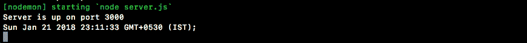

目前只是一个时间戳，但我们正在正确的轨道上。现在一切都正常，因为我们调用了`next`，所以在这个`console.log`调用打印到屏幕后，我们的应用程序会继续并提供页面。

在中间件中，我们可以通过探索请求对象添加更多功能。在请求对象上，我们可以访问有关请求的一切内容-HTTP 方法、路径、查询参数以及来自客户端的任何内容。无论客户端是应用程序、浏览器还是 iPhone，所有这些都将在请求对象中可用。现在我们要提取的是 HTTP 方法和路径。

如果您想查看您可以访问的所有内容的完整列表，可以转到[expressjs.com](http://expressjs.com/)，并转到 API 参考：

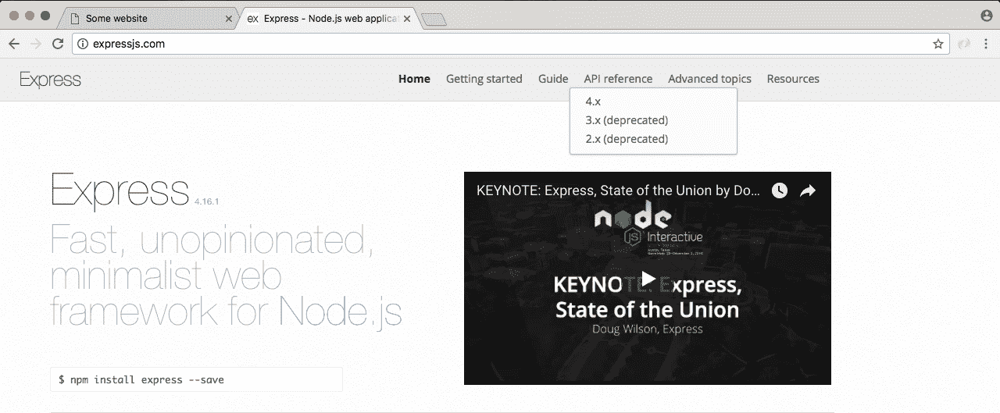

我们碰巧使用的是 Express 的 4.x 版本，因此我们将点击该链接：

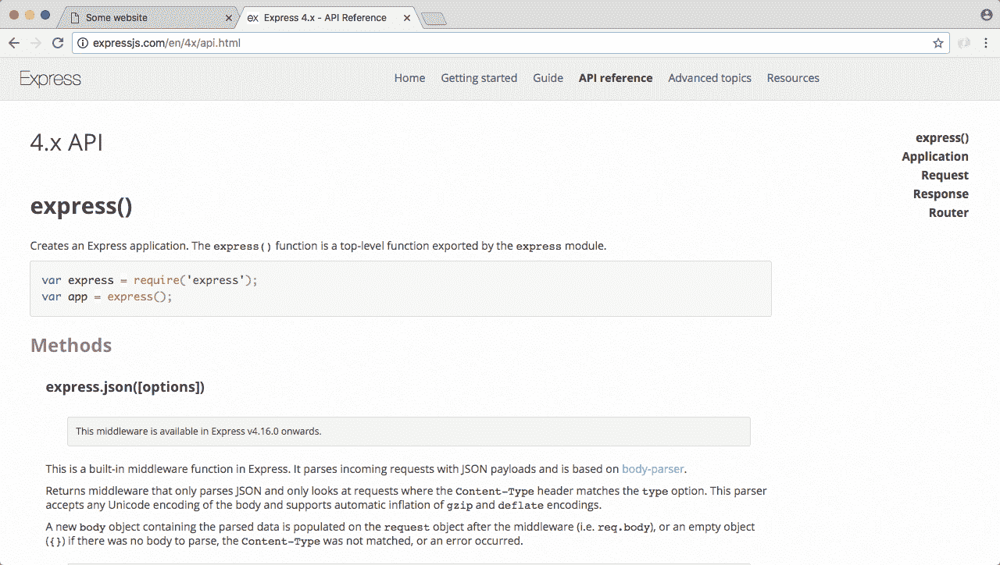

在此链接的右侧，我们有请求和响应。我们将查找请求对象，因此我们将点击它。这将引导我们到以下内容：

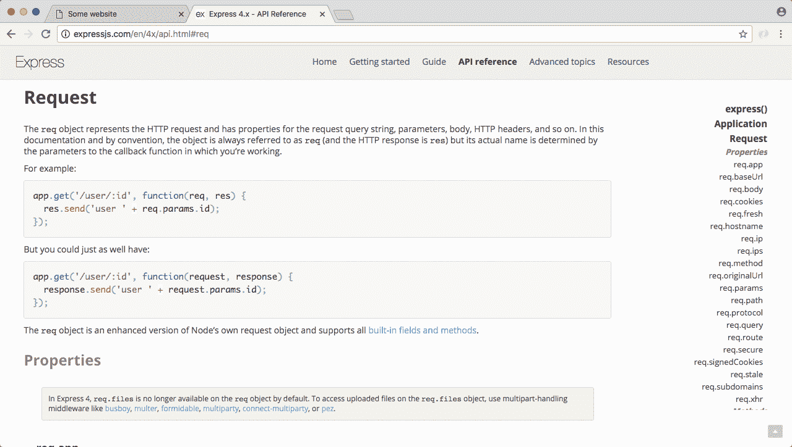

我们将使用两个请求属性：`req.url`和`req.method`。在 Atom 中，我们可以开始实现这些，将它们添加到`console.log`中。在时间戳之后，我们将打印 HTTP 方法。稍后我们将使用其他方法。目前我们只使用了`get`方法。在`console.log`中，我将注入`request.method`，将其打印到控制台：

```js
app.use((req, res, next) => {
  var now = new Date().toString();

  console.log(`${now}: ${req.method}`)
  next();
});
```

接下来，我们可以打印路径，以便我们确切知道用户请求的是哪个页面。我将通过注入另一个变量`req.url`来实现：

```js
   console.log(`${now}: ${req.method} ${req.url}`);
```

有了这个，我们现在有一个相当有用的中间件。它获取请求对象，输出一些信息，然后继续让服务器处理该请求。如果我们保存文件并从浏览器重新运行应用程序，我们应该能够进入终端并看到这个新的记录器打印到屏幕上，如下所示：

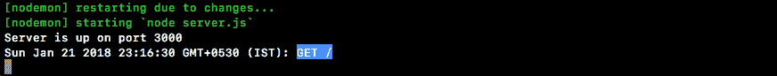

我们有我们的时间戳、HTTP 方法是`GET`，以及路径。如果我们将路径更改为更复杂的内容，例如`/about`，然后我们返回到终端，我们将看到我们访问`req.url`的`/about`：

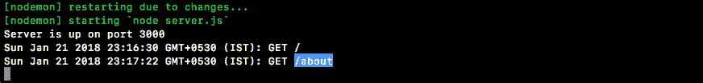

这是一种相当基本的中间件示例。我们可以再进一步。除了只是将消息记录到屏幕上，我们还将把消息打印到文件中。

# 将消息打印到文件

要将消息打印到文件中，让我们在`server.js`文件中加载`fs`。我们将创建一个常量。将其命名为`const fs`，并将其设置为从模块中获取的返回结果：

```js
const express = require('express');
const hbs = require('hbs');
const fs = require('fs');
```

现在我们可以在`app.use`中实现这一点。我们将使用当前在`console.log`中定义的模板字符串。我们将把它剪切出来，而是存储在一个变量中。我们将创建一个名为`log`的变量，将其设置为如下所示的模板字符串：

```js
app.use((req, res, next) => {
  var now = new Date().toString();
  var log = `${now}: ${req.method} ${req.url}`;

  console.log();
  next();
});
```

现在我们可以将`log`变量传递给`console.log`和`fs`方法，以便写入我们的文件系统。对于`console.log`，我们将像这样调用 log：

```js
  console.log(log);
```

对于`fs`，我将调用`fs.appendFile`。现在您记得，`appendFile`允许您添加到文件中。它需要两个参数：文件名和我们要添加的内容。我们将使用的文件名是`server.log`。我们将创建一个漂亮的日志文件，实际内容将只是`log`消息。我们需要添加一件事：我们还希望在每个请求被记录后继续下一行，因此我将连接新行字符，即`\n`：

```js
  fs.appendFile('server.log', log + '\n');
```

如果您使用的是 Node V7 或更高版本，则需要对此行进行微小调整。如下面的代码所示，我们向`fs.appendFile`添加了第三个参数。这是一个回调函数。现在是必需的。

`fs.appendFile('server.log', log + '\n', (err) => {`

`  if (err) {`

`    console.log('Unable to append to server.log.')`

`  }`

`});`如果你没有回调函数，你会在控制台中得到一个弃用警告。现在你可以看到，我们的回调函数在这里接受一个错误参数。如果有错误，我们只是在屏幕上打印一条消息。如果你将你的行改成这样，无论你的 Node 版本如何，你都将是未来的保障。如果你使用的是 Node V7 或更高版本，控制台中的警告将消失。现在警告将会说一些诸如弃用警告。调用异步函数而没有回调是被弃用的。如果你看到这个警告，做出这个改变。

现在我们已经准备就绪，我们可以测试一下。我保存文件，这应该重新启动`nodemon`中的东西。在 Chrome 中，我们可以刷新页面。如果我们回到终端，我们仍然可以得到我的日志，这很棒：

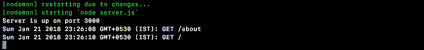

请注意，我们还有一个对`favicon.ico`的请求。这通常是在浏览器标签中显示的图标。我从以前的项目中缓存了一个。实际上并没有定义图标文件，这完全没问题。浏览器仍然会发出请求，这就是为什么它显示在前面的代码片段中。

在 Atom 中，我们现在有了我们的`server.log`文件，如果我们打开它，我们可以看到所有已经发出的请求的日志：

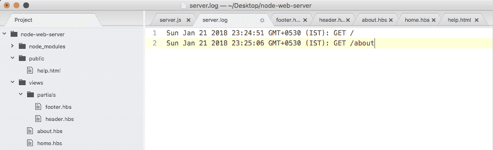

我们有时间戳，HTTP 方法和路径。使用`app.use`，我们能够创建一些中间件，帮助我们跟踪服务器的工作情况。

现在有时候你可能不想调用 next。我们学到了在做一些异步操作后可以调用 next，比如从数据库中读取，但想象一下出了问题。你可以避免调用 next 来阻止移动到下一个中间件。我们想在`views`文件夹中创建一个新的视图。我们将称之为`maintenance.hbs`。这将是一个 handlebars 模板，当网站处于维护模式时将进行渲染。

# 没有 next 对象的维护中间件

我们将从复制`home.hbs`开始制作`maintenance.hbs`文件。在`maintenance.hbs`中，我们将擦除 body 并添加一些标签：

```js
<!DOCTYPE html>
<html>
  <head>
    <meta charset="utf-8">
    <title>Some Website</title>
 </head>
 <body>

  </body>
</html>
```

如下代码所示，我们将添加一个`h1`标签来向用户打印一条小消息：

```js
 <body>
   <h1></h1>
 </body>
```

我们将使用类似`我们马上回来`的东西：

```js
 <body>
   <h1>We'll be right back</h1>
 </body>
```

接下来，我可以添加一个段落标签：

```js
 <body>
   <h1>We'll be right back</h1>
   <p>

   </p>
 </body>
```

现在我们将能够使用`p`后跟制表符。这是 Atom 中用于创建 HTML 标签的快捷方式。它适用于所有标签。我们可以输入 body 并按*enter*，或者我可以输入`p`并按*enter*，标签就会被创建。

在段落中，我会留下一条小消息：`网站目前正在更新`：

```js
 <p>
   The site is currently being updated.
 </p>
```

现在我们已经准备好了模板文件，我们可以定义我们的维护中间件。这将绕过我们的所有其他处理程序，其中我们渲染其他文件并打印 JSON，而是直接将此模板呈现到屏幕上。我们保存文件，进入`server.js`，并定义该中间件。

就在之前定义的中间件旁边，我们可以调用`app.use`，传入我们的函数。该函数将使用这三个参数：请求（`req`），响应（`res`）和`next`：

```js
app.use((req, res, next) => {

})
```

在中间件中，我们需要做的就是调用`res.render`。我们将添加`res.render`，传入我们想要渲染的文件的名称；在这种情况下，它是`maintenance.hbs`：

```js
app.use((req, res, next) => {
  res.render('maintenance.hbs');
});
```

这就是你需要做的一切来设置我们的主要中间件。这个中间件将阻止它之后的一切执行。我们不调用 next，所以实际的处理程序在`app.get`函数中，它们将永远不会被执行，我们可以测试这一点。

# 测试维护中间件

在浏览器中，我们将刷新页面，然后我们将得到以下输出：

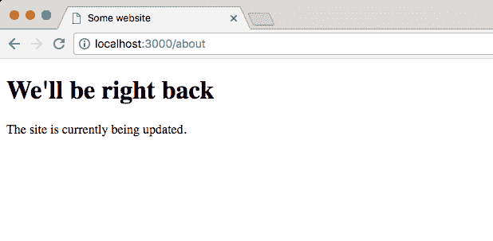

我们得到了维护页面。我们可以转到主页，然后得到完全相同的东西：

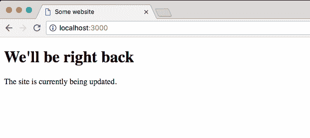

现在还有一个非常重要的中间件部分我们还没有讨论。请记住，在`public`文件夹中，我们有一个`help.html`文件，如下所示：

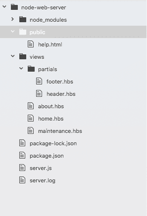

如果我们通过在浏览器中访问`localhost:3000/help.html`来查看这个问题，我们仍然会得到帮助页面。我们不会得到维护页面：

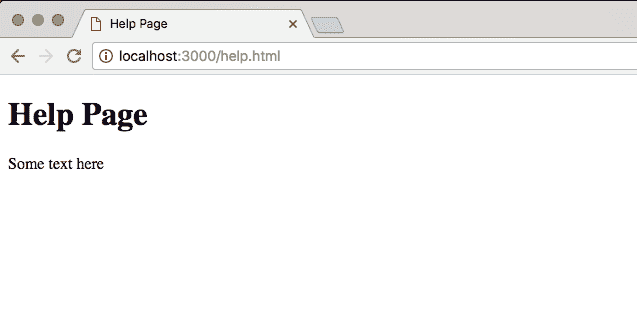

这是因为中间件是按照调用`app.use`的顺序执行的。这意味着我们首先设置 Express 静态目录，然后设置日志记录器，最后设置`maintenance.hbs`日志记录器：

```js
app.use(express.static(__dirname + '/public'));

app.use((req, res, next) => {
  var now = new Date().toString();
  var log = `${now}: ${req.method} ${req.url}`;

  console.log(log);
  fs.appendFile('server.log', log + '\n');
  next();
});

app.use((req, res, next) => {
  res.render('maintenance.hbs');
});
```

这是一个相当大的问题。如果我们还想使`public`目录文件（如`help.html`）私有，我们将不得不重新调整我们对`app.use`的调用，因为当前 Express 服务器正在 Express 静态中间件内响应，因此我们的维护中间件没有机会执行。

为了解决这个问题，我们将采取`app.use` Express 静态调用，从文件中删除，并在呈现维护文件到屏幕后添加。结果代码将如下所示：

```js
app.use((req, res, next) => {
  var now = new Date().toString();
  var log = `${now}: ${req.method} ${req.url}`;

  console.log(log);
  fs.appendFile('server.log', log + '\n');
  next();
});

app.use((req, res, next) => {
  res.render('maintenance.hbs');
});

app.use(express.static(__dirname + '/public'));
```

现在，无论我们要记录请求的内容，一切都将按预期工作。然后我们将检查是否处于维护模式，如果维护中间件函数已经就位。如果是，我们将呈现维护文件。如果不是，我们将忽略它，因为它将被注释掉或类似的情况，最后我们将使用 Express 静态。这将解决所有这些问题。如果我现在重新渲染应用程序，我会在`help.html`上看到维护页面：

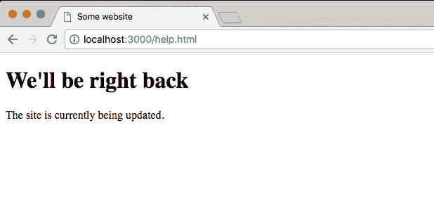

如果我回到网站的根目录，我仍然会看到维护页面：

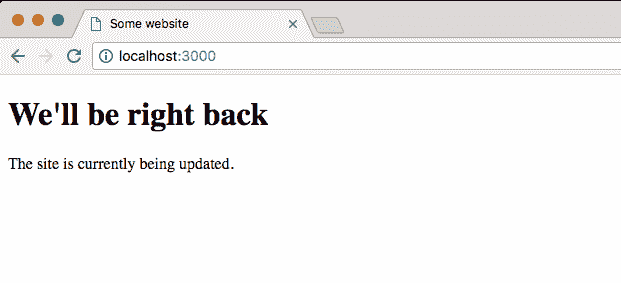

现在，一旦我们完成了维护中间件，我们总是可以将其注释掉。这将使其不再被执行，网站将按预期工作。

这是对 Express 中间件的一个快速潜入。我们将在整本书中更多地使用它。我们将使用中间件来检查我们的 API 请求是否真的经过了身份验证。在中间件内部，我们将进行数据库请求，检查用户是否确实是他们所说的那个人。

# 总结

在本章中，您学习了 Express 以及如何使用它轻松创建网站。我们看了如何设置静态 Web 服务器，因此当我们有整个目录的 JavaScript、图像、CSS 和 HTML 时，我们可以轻松地提供这些内容而无需为每个内容提供路由。这将让我们创建各种应用程序，这将贯穿整本书的内容。

接下来，我们继续学习如何使用 Express。我们看了一下如何呈现动态模板，有点像我们在 PHP 或 Ruby on Rails 文件中所做的那样。我们有一些变量，我们呈现了一个模板并注入了这些变量。然后我们学习了一些关于 handlebars 部分的知识，它让我们可以创建可重用的代码块，比如头部和页脚。我们还学习了关于 Handlebars 助手的知识，这是一种从 handlebars 模板内部运行一些 JavaScript 代码的方法。最后，我们回到了关于 Express 以及如何定制我们的请求、响应和服务器的讨论。

在下一章中，我们将探讨如何将应用程序部署到网络上。
