# 第九章：将应用程序部署到 Web

在本章中，我们将担心添加版本控制和部署我们的应用程序，因为当涉及到创建真实的 Node 应用程序时，将应用程序部署到 Web 上显然是其中非常重要的一部分。现实世界中，每家公司都使用某种形式的版本控制。这对软件开发过程至关重要，而且大多数公司都没有使用 Git。Git 已经变得非常流行，占据了版本控制的市场份额。Git 也是免费和开源的，并且有大量优质的教育材料。他们有一本关于如何学习 Git 的书。它是免费的，Stack Overflow 上充满了 Git 特定的问题和答案。

我们将使用 Git 保存我们的项目。我们还将使用它将我们的工作备份到一个名为 GitHub 的服务中，最后我们将使用 Git 将我们的项目实时部署到 Web 上。因此，我们将能够将我们的 Web 服务器部署给任何人访问。它不仅仅可以在本地主机上使用。

具体来说，我们将研究以下主题：

+   设置和使用 Git

+   设置 GitHub 和 SSH 密钥

+   将 Node 应用程序部署到 Web

+   整个开发生命周期的工作流程

# 添加版本控制

在本节中，我们将学习如何设置和使用 Git，这是一个版本控制系统。Git 将允许我们随着时间的推移跟踪我们项目的变化。当出现问题并且我们需要恢复到项目中以前工作正常的状态时，这非常有用。它还非常有用于备份我们的工作。

# 安装 Git

要开始，我们需要在计算机上安装 Git，但幸运的是，这是一个非常简单的安装过程。这是一个我们只需通过几个步骤单击“下一步”按钮的安装程序。所以让我们继续做到这一点。

1.  我们可以通过浏览器转到[git-scm.com](http://git-scm.com)来获取安装程序。

在我们继续安装之前，我想向您展示一本名为 Pro Git 的书的链接([`git-scm.com/book/en/v2`](https://git-scm.com/book/en/v2))。这是一本免费的书，也可以在线阅读。它涵盖了 Git 所提供的一切。在本章中，我们将研究一些更基本的功能，但我们可以很容易地创建一个关于 Git 的整个课程。实际上，Udemy 上有专门关于 Git 和 GitHub 的课程，所以如果您想学习更多内容，我建议阅读这本书或参加课程，无论您的首选学习方法是什么。

1.  单击主页右侧的下载按钮，适用于所有操作系统，无论是 Windows、Linux 还是 macOS。这应该会带我们到安装程序页面，我们应该能够自动下载安装程序。如果您在[SourceForge.net](http://SourceForge.net)上遇到任何问题，那么我们可能需要实际点击它以手动下载以开始下载。

1.  安装程序下载完成后，我们可以简单地运行它。

1.  接下来，通过安装程序：

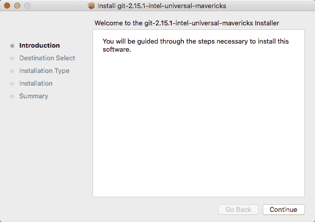

1.  点击“继续”并安装软件包：

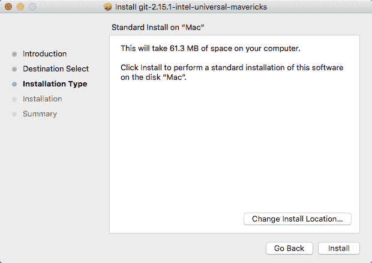

1.  完成后，我们可以继续测试安装是否成功：

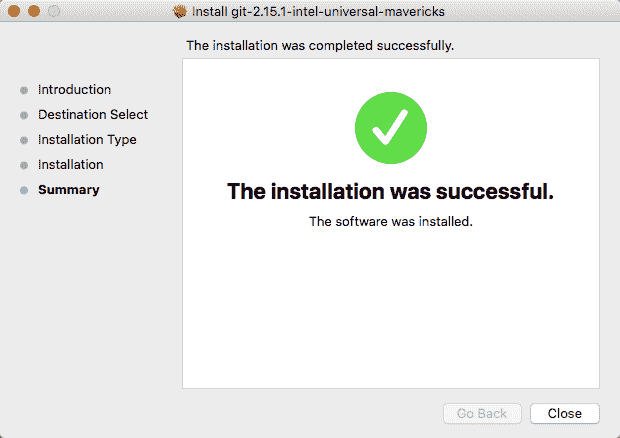

# macOS 上的 Git

如果您使用的是 macOS，您需要启动软件包安装程序，可能会收到以下消息框，表示它来自未知开发者：

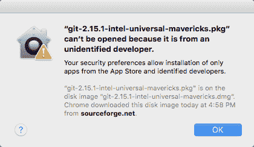

这是因为它是通过第三方分发的，而不是在 macOS 应用商店中。我们可以右键单击软件包，然后单击“打开”按钮，并确认我们确实要打开它。

一旦您到达安装程序，整个过程将非常简单。您可以在每个步骤中单击“继续”和“下一步”。

# Windows 上的 Git

但是，如果您使用的是 Windows，有一个重要的区别。在安装程序中，您将看到一个与此类似的屏幕：

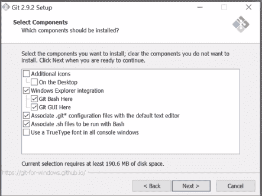

同样重要的是，您还要安装 Git Bash，如截图所示。Git Bash 是一个模拟 Linux 类型终端的程序，在我们创建下一节中的 SSH 密钥时，它将非常重要，以便唯一标识我们的机器。

# 测试安装

现在，让我们进入终端测试安装。从终端中，我们可以继续运行`git --version`。这将打印出我们安装的新版本的 Git：

```js
git --version
```

如下截图所示，我们可以看到我们有 git 版本 2.14.3：

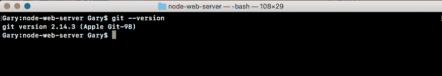

现在，如果您的终端仍然打开，并且出现类似 git 命令未找到的错误，我建议尝试重新启动终端。有时在安装新命令（如刚刚安装的`git`命令）时，这是必需的。

# 将 node-web-server 目录转换为 Git 仓库

安装 Git 成功后，我们现在可以将我们的`node-web-server`目录转换为 Git 存储库。为了做到这一点，我们将运行以下命令：

```js
git init
```

`git init`命令需要在我们项目的根目录中执行，即包含我们要跟踪的所有内容的文件夹。在我们的情况下，`node-web-server`就是那个文件夹。它包含我们的`server.js`文件，我们的`package.json`文件和所有的目录。因此，从服务器文件夹中，我们将运行`git init`：


这将在该文件夹内创建一个`.git`目录。我们可以通过运行`ls -a`命令来证明：

```js
ls -a
```

如下截图所示，我们获得了所有目录，包括隐藏的目录，而我确实有.git：

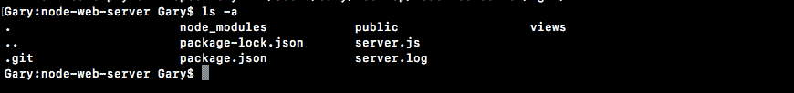

对于 Windows，可以从 Git Bash 中运行这些命令。

现在这个目录不是我们应该手动更新的东西。我们将使用终端中的命令来对 Git 文件夹进行更改。

您不希望手动进入那里搞乱事情，因为您很可能会破坏 Git 存储库，而您的辛苦工作将变得毫无意义。现在显然，如果有备份，这不是什么大问题，但实际上没有理由进入那个 Git 文件夹。

让我们使用`clear`命令清除终端输出，现在我们可以开始看 Git 的工作原理。

# 使用 Git

如前所述，Git 负责跟踪项目的更改，但默认情况下它实际上不会跟踪任何文件。我们必须告诉 Git 确切地要跟踪哪些文件，这是有很好的理由的。每个项目中都有一些文件，我们很可能不想将其添加到 Git 仓库中，我们将在稍后讨论哪些文件以及为什么。现在让我们继续运行以下命令：

```js
git status
```

现在，所有这些命令都需要在项目的根目录中执行。如果您尝试在存储库之外运行此命令，您将收到类似 git repository not found 的错误。这意味着 Git 找不到`.git`目录，无法实际获取存储库的状态。

当我们运行此命令时，我们将得到以下输出：

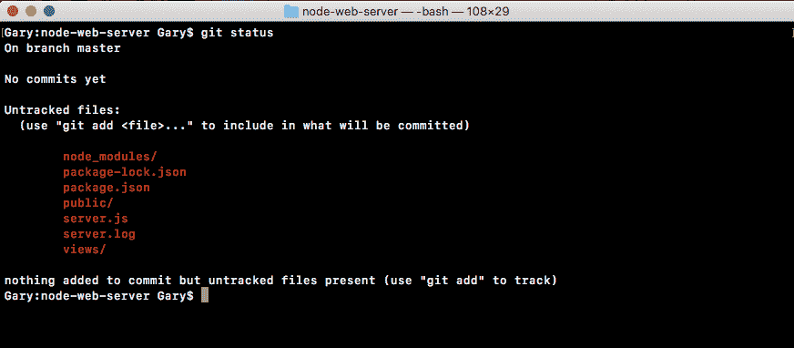

现在重要的部分是未跟踪文件标题和其下的所有文件。这些都是 Git 捕获的所有文件和文件夹，但它目前没有跟踪。Git 不知道您是否要跟踪这些文件的更改，或者您是否要将它们从存储库中忽略。

现在，例如，`views`文件夹是我们确实想要跟踪的。这对项目至关重要，我们希望确保每当有人下载存储库时，他们都会得到`views`文件夹。另一方面，日志文件实际上不需要包含在 Git 中。通常我们的日志文件不会被提交，因为它们通常包含特定时间点服务器运行时的信息。

如上面的代码输出所示，我们有`server.js`，我们的 public 文件夹和`package.json`。这些都是执行应用程序过程中必不可少的。这些肯定会被添加到我们的 Git 仓库中，而我们上面有的第一个是`node_modules`文件夹。`node_modules`文件夹是所谓的生成文件夹。

生成的文件夹可以通过运行命令轻松生成。在我们的情况下，我们可以使用`npm install`重新生成整个目录。我们不想将 Node 模块添加到我们的 Git 仓库，因为它的内容取决于您安装的 npm 版本和您使用的操作系统。最好不要添加 Node 模块，让每个使用您的存储库的人手动在他们实际运行应用程序的计算机上安装模块。

# 将未跟踪的文件添加到提交

现在我们列出了这六个文件夹和文件，所以让我们继续添加我们想要保留的四个文件夹和文件。首先，我们将使用任何`git add`命令。`git add`命令让我们告诉 Git 我们要跟踪某个文件。让我们输入以下命令：

```js
git add package.json
```

在这之后，我们可以再次运行`git status`，这次我们得到了一个非常不同的结果：

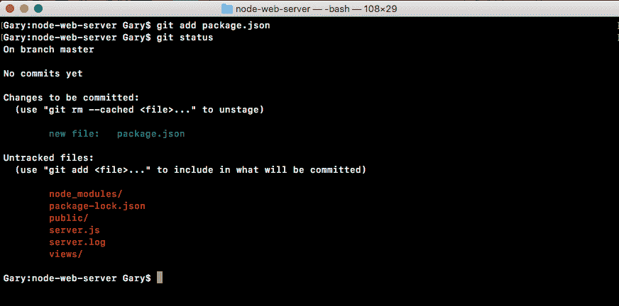

现在我们有一个初始提交标题。这是新的，我们有我们旧的未跟踪文件标题。请注意，在未跟踪的文件下，我们不再有`package.json`。它移到了初始提交标题下。这些都是在我们进行第一次提交时要保存的文件，也就是提交的文件。现在我们可以继续添加其他 3 个。我们将再次使用`git add`命令告诉 Git 我们要跟踪 public 目录。我们可以运行`git status`命令来确认它是否按预期添加了：

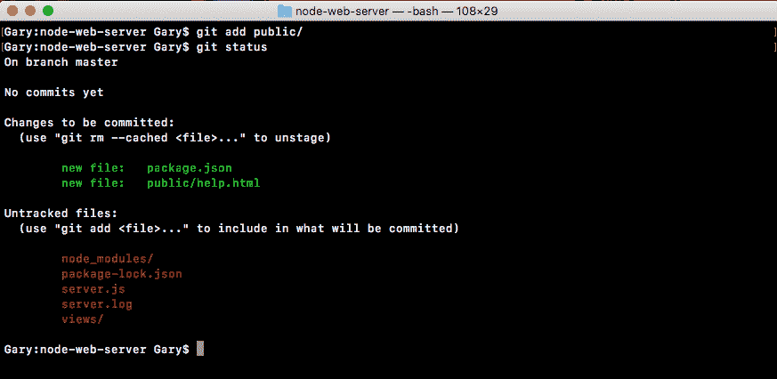

在上面的截图中，我们可以看到 public/help.html 文件现在将在我们运行提交后提交到 Git。

接下来，我们可以使用`git add server.js`添加`server.js`，并使用`git add views`添加`views`目录，就像这样：

```js
git add server.js

git add views/
```

我们将运行`git status`命令进行确认：

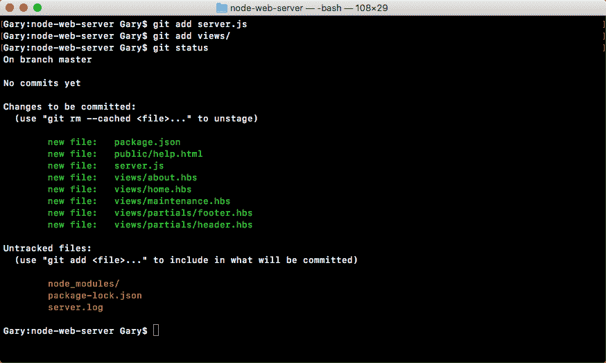

一切看起来都很好。现在未跟踪的文件将一直保留在这里，直到我们执行以下两种操作之一——要么将它们添加到 Git 存储库中，要么使用我们将在 Atom 中创建的自定义文件来忽略它们。

在 Atom 中，我们想要在我们项目的根目录中创建一个名为`.gitignore`的新文件。`gitignore`文件将成为我们的 Git 存储库的一部分，并告诉 Git 要忽略哪些文件和文件夹。在这种情况下，我们可以继续忽略`node_modules`，就像这样：

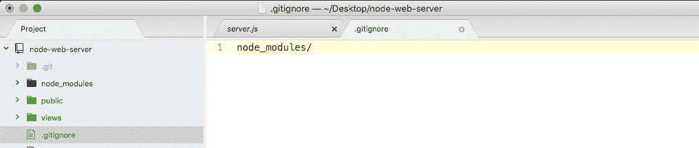

当我们保存`gitignore`文件并从终端重新运行`git status`时，我们现在会得到一个完全不同的结果：

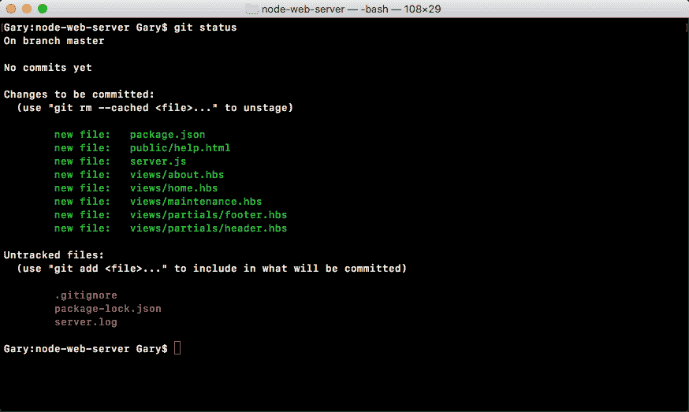

如图所示，我们有一个新的未跟踪文件—`.gitignore`—但`node_modules`目录不见了，这正是我们想要的。我们想要完全删除它，确保它永远不会被添加到 Git 仓库中。接下来，我们可以继续忽略`server.log`文件，通过输入它的名称，`server.log`：

```js
node modules/
server.log
```

我们将保存`gitignore`，再次从终端运行`git status`，确保一切看起来都很好：

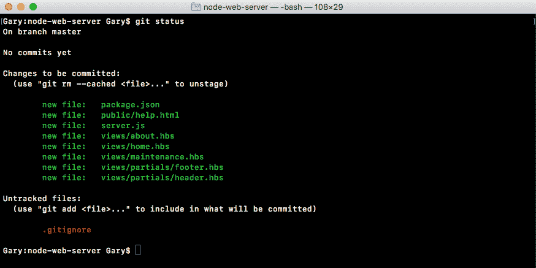

如图所示，我们有一个`gitignore`文件作为我们唯一的未跟踪文件。`server.log`文件和`node_modules`都不见了。

现在我们有了`gitignore`，我们将使用`git add .gitignore`将其添加到 Git 中，当我们运行`git status`时，我们应该能够看到所有显示的文件都在初始提交之下：

```js
git add .gitignore

git status
```

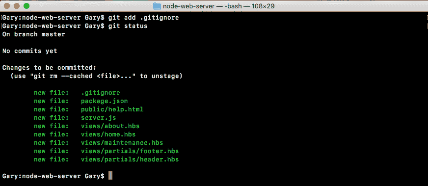

现在是时候进行提交了。提交实际上只需要两件事。它需要存储库中的一些更改。在这种情况下，我们正在教 Git 如何跟踪大量新文件，所以我们确实在改变一些东西，还需要一个消息。我们已经处理了文件部分。我们告诉 Git 我们想要保存什么，只是还没有真正保存它。

# 进行提交

为了进行我们的第一个提交并将我们的第一件事保存到 Git 存储库中，我们将运行`git commit`并提供一个标志，即`m`标志，这是短消息。在引号内，我们可以指定我们想要用于此提交的消息。使用这些消息非常重要，因此当有人查看提交历史时，可以看到对项目的所有更改的列表，这实际上是有用的。在这种情况下，`Initial commit`总是一个很好的消息，用于你的第一个提交：

```js
git commit -m 'Initial commit'
```

我将继续点击*enter*，如下面的截图所示，我们可以看到对存储库所做的所有更改：


我们在 Git 存储库中创建了一堆新文件。这些都是我们告诉 Git 我们想要跟踪的文件，这太棒了。

我们现在有了我们的第一个提交，这基本上意味着我们已经保存了项目的当前状态。如果我们对`server.js`进行了重大更改，搞砸了，不知道如何恢复到原来的状态，我们总是可以恢复，因为我们做了一个 Git 提交。现在我们将在后面的部分探讨一些更高级的 Git 功能。我们将讨论如何使用 Git 做大部分你想做的事情，包括部署到 Heroku 和推送到 GitHub。

# 设置 GitHub 和 SSH 密钥

现在你有了一个本地的 Git 存储库，我们将看看如何将代码推送到一个名为 GitHub 的第三方服务。GitHub 将让我们远程托管我们的 Git 存储库，所以如果我们的机器崩溃了，我们可以找回我们的代码，它还有很棒的协作工具，所以我们可以开源一个项目，让其他人使用我们的代码，或者我们可以保持私有，只有我们选择合作的人可以看到源代码。

现在，为了在我们的机器和 GitHub 之间进行实际通信，我们将不得不创建一个称为 SSH 密钥的东西。SSH 密钥旨在在两台计算机之间进行安全通信。在这种情况下，它将是我们的机器和 GitHub 服务器。这将让我们确认 GitHub 是他们所说的那样，它将让 GitHub 确认我们确实可以访问我们试图修改的代码。这将全部通过 SSH 密钥完成，我们将首先创建它们，然后配置它们，最后将我们的代码推送到 GitHub。

# 设置 SSH 密钥

设置 SSH 密钥的过程可能是一个真正的负担。这是一个那种话题，错误的余地真的很小。如果你输入任何错误的命令，事情就不会按预期工作。

现在，如果你使用的是 Windows，你需要在 Git Bash 中执行本节中的所有操作，而不是常规命令提示符，因为我们将使用一些在 Windows 上不可用的命令。但是，在 Linux 和 macOS 上是可用的。因此，如果你使用这两种操作系统中的任何一种，你可以继续使用本书中一直在使用的终端。

# SSH 密钥文档

在我们深入命令之前，我想向您展示一个快速指南，以防您遇到困难或有任何问题。您可以搜索 GitHub SSH 密钥，这将链接您到一篇名为生成 SSH 密钥的文章：[`help.github.com/articles/connecting-to-github-with-ssh/`](https://help.github.com/articles/connecting-to-github-with-ssh/)。一旦您到达这里，您就可以单击 SSH 面包屑，这将带您回到他们关于 SSH 密钥的所有文章：


在这些文章中，我们将专注于检查是否有密钥，生成新密钥，将密钥添加到 GitHub，最后测试一切是否按预期工作。如果您在这些步骤中遇到任何问题，您可以随时单击该步骤的指南，并且您可以选择您正在使用的操作系统，以便查看该操作系统的适当命令。既然您知道这一点，让我们一起来做吧。

# 工作中的命令

我们将从终端运行的第一个命令是检查是否有现有的 SSH 密钥。如果没有，那没关系。我们将继续创建一个。如果您不确定是否有密钥，您可以运行以下命令来确认您是否有密钥：`ls`与`al`标志。这将打印出给定目录中的所有文件，默认情况下，SSH 密钥存储在您的计算机上的用户目录中，您可以使用（`~`）作为`/.ssh`的快捷方式：

```js
ls -al ~/.ssh
```

当您运行该命令时，您将看到 SSH 目录中的所有内容：

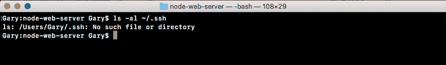

在这种情况下，我已经删除了所有我的 SSH 密钥，所以我的目录中没有任何内容。我只有当前目录和上一个目录的路径。既然我们已经做好了准备，并且确认我们没有密钥，我们可以继续生成一个。如果您已经有一个密钥，例如`id_rsa`文件，您可以跳过生成密钥的过程。

# 生成密钥

要生成一个密钥，我们将使用`ssh-keygen`命令。现在`ssh-keygen`需要三个参数。我们将传入`t`，将其设置为`rsa`。我们将传入`b`，用于字节，将其设置为`4096`。确保精确匹配这些参数，我们将设置一个大写的`C`标志，该标志将设置为您的电子邮件：

```js
ssh-keygen -t rsa -b 4096 -C 'garyngreig@gmail.com'
```

现在，实际发生在幕后的范围不在本书的讨论范围之内。SSH 密钥和设置安全性，这可能是一个完整的课程。我们将使用此命令来简化整个过程。

现在我们可以继续按*enter*键，这将在我们的`.ssh`文件夹中生成两个新文件。当您运行此命令时，您将受到几个步骤的欢迎。我希望您对所有步骤都使用默认设置：

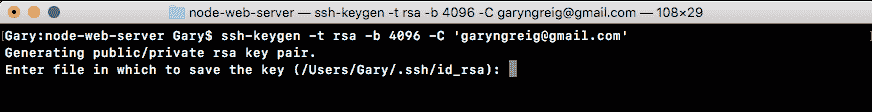

他们想要问您是否要自定义文件名。我不建议这样做。您可以直接按*enter*键：


接下来，他们会要求您输入密码，我们将不使用密码。我将按下*enter*键，不设置密码，然后需要确认密码，所以我将再次按下*enter*键：

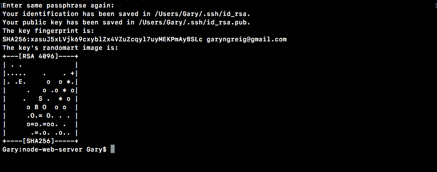

如图所示，我们收到了一条消息，说明我们的 SSH 密钥已经正确创建，并且确实保存在我们的文件夹中。

有了这个，我现在可以通过之前的命令循环运行`ls`命令，我会得到什么？

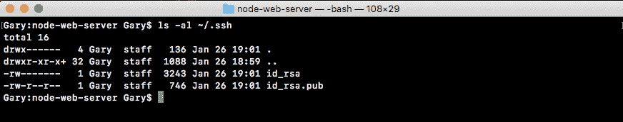

我们得到了`id_rsa`和`id_rsa.pub`文件。`id_rsa`文件包含私钥。这是您绝对不应该给任何人的密钥。它只存在于您的计算机上。`.pub`文件是公共文件。这是您将提供给 GitHub 或 Heroku 等第三方服务的文件，我们将在接下来的几节中进行操作。

# 启动 SSH 代理

现在我们的密钥已生成，我们需要做的最后一件事是启动 SSH 代理并添加此密钥，以便它知道它的存在。我们将通过运行两个命令来实现这一点。这些是：

+   `eval`

+   `ssh-add`

首先，我们将运行`eval`，然后我们将打开一些引号，在引号内，我们将使用美元符号并打开和关闭一些括号，就像这样：

```js
eval "$()"
```

在括号内，我们将键入带有`s`标志的`ssh-agent`：

```js
eval "$(ssh-agent -s)"
```

这将启动 SSH 代理程序，并且还会打印进程 ID 以确认它确实正在运行，如所示，我们得到 Agent pid 1116：


进程 ID 显然对每个人都是不同的。只要你得到这样的回复，你就可以继续了。

接下来，我们必须告诉 SSH 代理此文件的位置。我们将使用`ssh-add`来实现这一点。这需要我们的私钥文件的路径，我们在用户目录`/.ssh/id_rsa`中有：

```js
ssh-add ~/.ssh/id_rsa
```

当我运行这个时，我应该收到一个像身份添加的消息：


这意味着本地计算机现在知道了这对公钥/私钥，并且在与 GitHub 等第三方服务通信时会尝试使用这些凭据。既然我们已经准备就绪，我们就可以配置 GitHub 了。我们将创建一个帐户，设置它，然后我们将回来测试一切是否按预期工作。

# 配置 GitHub

要配置 GitHub，请按照以下步骤操作：

1.  首先进入浏览器，转到[github.com](https://github.com/)。

1.  在这里，登录到您现有的帐户或创建一个新帐户。如果您需要一个新帐户，请注册 GitHub。如果您已经有一个现有的帐户，请继续登录。

1.  一旦登录，您应该看到以下屏幕。这是您的 GitHub 仪表板：

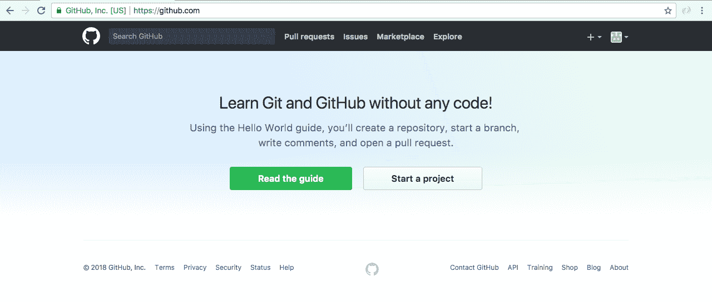

1.  从这里，导航到设置，位于左上角，通过个人资料图片。转到设置| SSH 和 GPG 密钥| SSH 密钥：

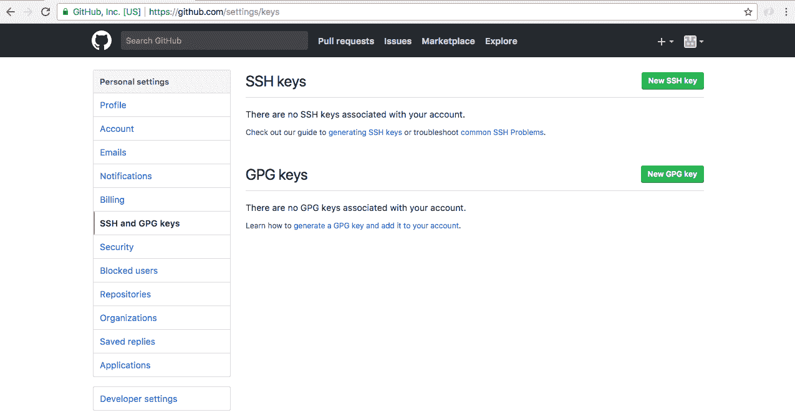

1.  从这里，我们可以添加公钥，让 GitHub 知道我们要使用 SSH 进行通信。

1.  添加新的 SSH 密钥：


在这里，您需要做两件事：给它一个名称，并添加密钥。

首先添加名称。名称可以是任何你喜欢的东西。例如，我通常使用一个唯一标识我的计算机的名称，因为我有几台电脑。我会像这样使用`MacBook Pro`。


接下来，添加密钥。

要添加密钥，我们需要获取在上一小节中生成的`id_rsa.pub`文件的内容。该文件包含 GitHub 需要的信息，以便在我们的计算机和他们的计算机之间进行安全通信。有不同的方法来获取密钥。在浏览器中，我们有添加新的 SSH 密钥到您的 GitHub 帐户文章供我们参考。

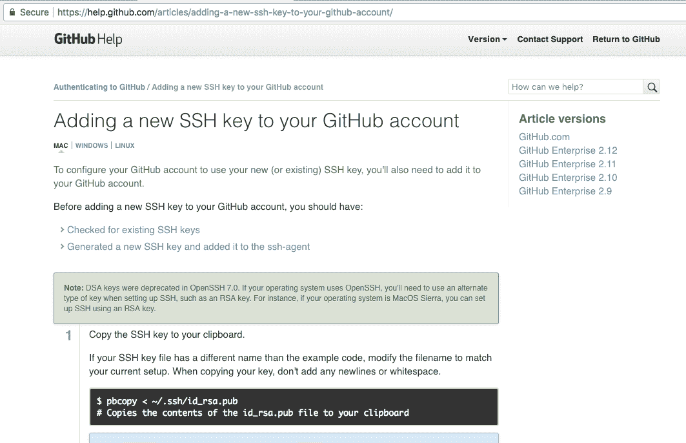

1.  这包含一个命令，您可以使用它从终端中直接复制该文件的内容到剪贴板。现在显然对于操作系统，macOS，Windows 和 Linux 是不同的，所以运行适用于您的操作系统的命令。

1.  使用 macOS 可用的`pbcopy`命令。

然后，进入终端并运行它。

```js
 pbcopy < ~/.ssh/id_rsa.pub
```

这将文件的内容复制到剪贴板。您还可以使用常规文本编辑器打开命令并复制文件的内容。我们可以使用任何方法来复制文件。重要的是你要做。

1.  现在回到 GitHub，点击文本区域并粘贴进去。

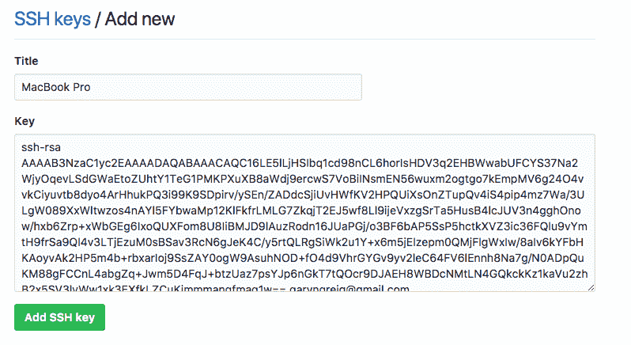

`id_rsa.pub`的内容应该以`ssh-rsa`开头，并以您使用的电子邮件结尾。

1.  完成后，继续点击“添加 SSH 密钥”。

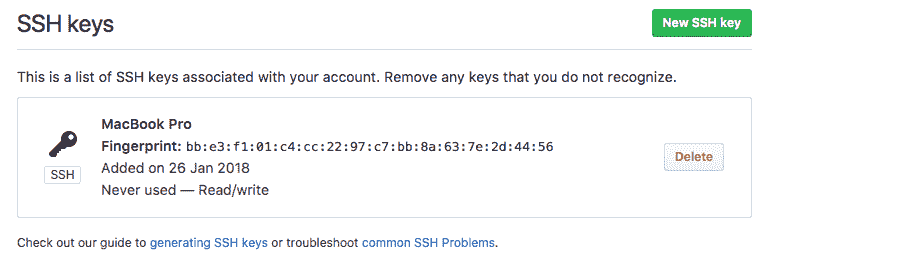

现在我们可以继续测试一下事情是否正常运行，通过在终端中运行一个命令。再次强调，这个命令可以在您的机器的任何地方执行。你不需要在你的项目文件夹中执行这个命令。

# 测试配置

为了测试我们的 GitHub 配置的工作情况，我们将使用`ssh`，它尝试建立连接。我们将使用`T`标志，后面跟着我们要连接到的 URL，获取`git@github.com`：

```js
ssh -T git@github.com
```

这将测试我们的连接。它将确保 SSH 密钥已正确设置，并且我们可以安全地与 GitHub 通信。当我运行命令时，我收到一条消息，说主机'github.com (192.30.253.113)'的真实性无法得到证实。

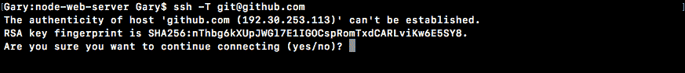

我们知道我们想要与[github.com](http://www.github.com)进行通信。我们期望通信会发生，所以我们可以继续输入`yes`：


从这里，我们会收到 GitHub 服务器的消息，如前面的屏幕截图所示。如果你看到这条消息和你的用户名，那么你已经完成了。你已经准备好创建你的第一个存储库并推送你的代码。

现在，如果你没有看到这条消息，那么在这个过程中出了问题。也许 SSH 密钥没有正确生成，或者 GitHub 没有识别它。

接下来，我们将进入 GitHub，返回到主页，并创建一个新的存储库。

# 创建一个新的存储库

要创建一个新的存储库，请按照以下步骤进行：

1.  在 GitHub 主页的右上角，导航到新存储库按钮，它应该是这样的（如果是新的存储库，点击开始新项目）：

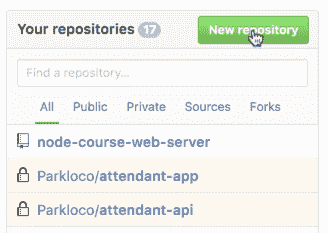

这将带我们到新的存储库页面：

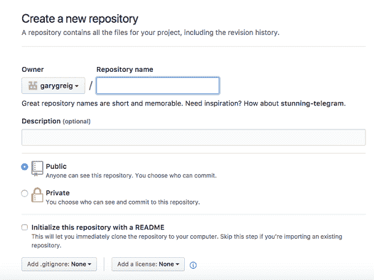

1.  在这里，我们只需要给它一个名字。我要把这个叫做`node-course-2-web-server`：

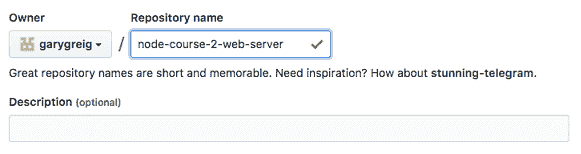

一旦你有了一个名字，你可以给它一个可选的描述，你可以选择是公共存储库还是私有存储库。

现在私有存储库会让你选择$7 的计划。如果你正在与其他公司创建项目，我建议你选择私有存储库。

1.  不过，在这种情况下，我们正在创建非常简单的项目，如果其他人发现了代码也不会有太大关系，所以继续使用公共存储库的选项。


1.  一旦你填写好这两个内容，点击创建存储库按钮：

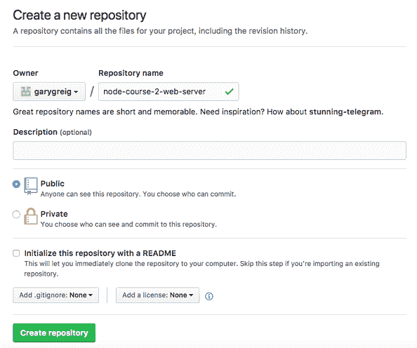

这将带你到你的存储库页面：

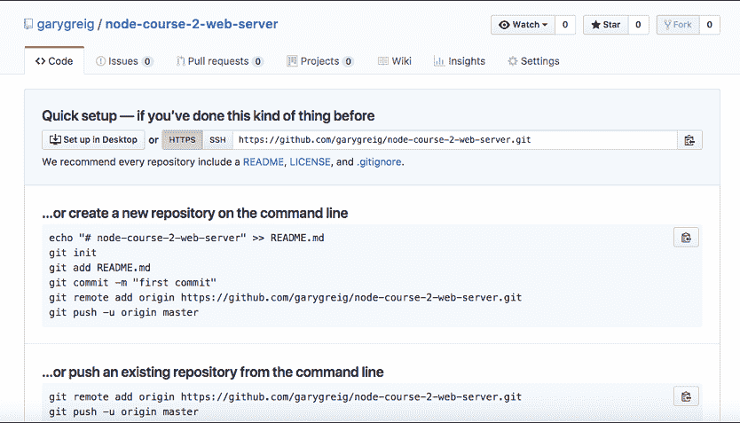

它会给你一些设置，因为目前没有代码可以查看，所以它会根据你所处的情况给你一些指示。

# 设置存储库

现在，在前面的三个设置说明中，我们不需要创建新存储库的说明。我们也不会使用从其他 URL 导入我们的代码的说明。我们已经有一个现有的存储库，我们想要从命令行推送它。

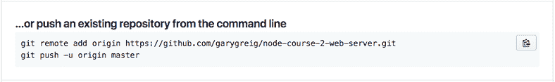

我们将从项目内运行这两个命令：

+   第一个命令将向我们的 Git 存储库添加一个新的远程

+   第二个命令将把它推送到 GitHub

远程让 Git 知道你想要同步的第三方 URL。也许我想把我的代码推送到 GitHub 与我的同事进行交流。也许我还想能够推送到 Heroku 来部署我的应用程序。这意味着你会想要两个远程。在我们的情况下，我们只会添加一个，所以我会复制这个 URL，进入终端，粘贴它，然后点击*enter*：

```js
git remote add origin https://github.com/garygreig/node-course-2-web-server.git
```

现在我们已经添加了`git remote`，我们可以继续运行第二个命令。我们将在整本书中广泛使用第二个命令。在终端中，我们可以复制并粘贴第二个命令的代码，然后运行它：

```js
git push -u origin master
```

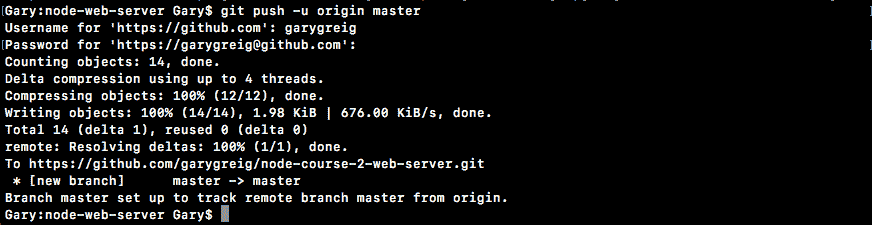

如前面的屏幕截图所示，我们可以看到一切都进行得很顺利。我们成功地将所有数据写入 GitHub，如果我们回到浏览器并刷新页面，我们将不再看到那些设置说明。相反，我们将看到我们的存储库，有点像树形视图：

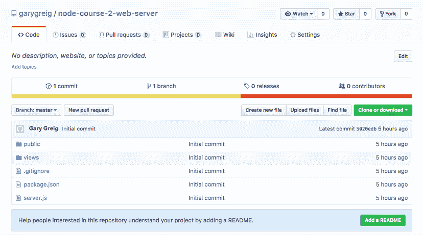

在这里我们可以看到我们有`server.js`文件，这很好。我们看不到日志文件或`node_module`文件，这很好，因为我们忽略了它。我有我的公共目录。一切都运行得非常非常好。我们还有问题跟踪，拉取请求。您可以创建一个 Wiki 页面，用于为存储库设置说明。GitHub 有很多非常棒的功能。我们将只使用最基本的功能。

在我们的存储库中，我们可以看到我们有一个提交，如果我们点击那个提交按钮，实际上可以进入提交页面，在这里我们可以看到我们输入的初始提交消息。我们在上一节中进行了提交：

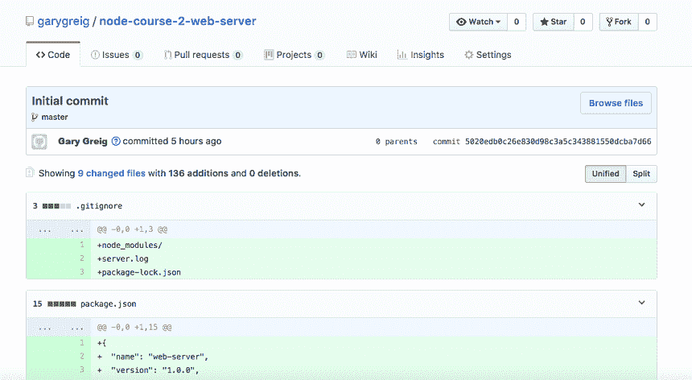

这将让我们跟踪所有我们的代码，如果我们进行了不需要的更改，可以回滚，并管理我们的存储库。现在我们的代码已经推送上去，我们完成了。

# 将 node 应用程序部署到 Web

在本节中，您将使用 Heroku 将您的 Node 应用程序实时部署到 Web。在本节结束时，您将获得一个 URL，您可以将其提供给任何人，他们将能够在其浏览器中访问该 URL 以查看应用程序。我们将通过 Heroku 完成这一点。

Heroku 是一个网站。它是一个用于管理托管在云中的 Web 应用程序的 Web 应用程序。这是一个非常棒的服务。他们几乎可以毫不费力地创建新应用程序，部署您的应用程序，更新应用程序，并添加一些很酷的附加功能，如日志记录和错误跟踪，所有这些都是内置的。现在 Heroku，就像 GitHub 一样，不需要信用卡即可注册，并且有免费的套餐，我们将使用。他们为几乎所有功能提供付费计划，但我们可以使用免费套餐来完成本节中的所有操作。

# 安装 Heroku 命令行工具

首先，我们将打开浏览器并转到[heroku.com](https://www.heroku.com/)。在这里，我们可以继续注册一个新帐户。花点时间要么登录您现有的帐户，要么注册一个新帐户。一旦登录，它会显示您的仪表板。现在您的仪表板将看起来像这样：

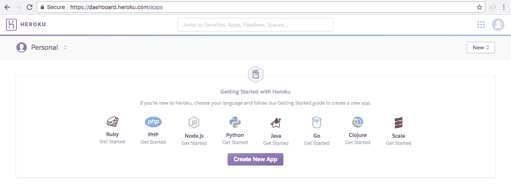

尽管可能会有一个问候语告诉您创建一个新应用程序，但您可以忽略。我有很多应用程序。您可能没有这些，这完全没问题。

接下来我们要做的是安装 Heroku 命令行工具。这将让我们能够在终端中创建应用程序，部署应用程序，打开应用程序，并且可以在终端中进行各种非常酷的操作，而不必进入 Web 应用程序。这将节省我们的时间并使开发变得更加容易。我们可以通过访问[toolbelt.heroku.com](https://devcenter.heroku.com/articles/heroku-cli)来获取下载。


在这里，我们可以获取适用于您正在运行的任何操作系统的安装程序。让我们开始下载。这是一个非常小的下载，所以应该很快。

完成后，我们可以继续进行以下步骤：

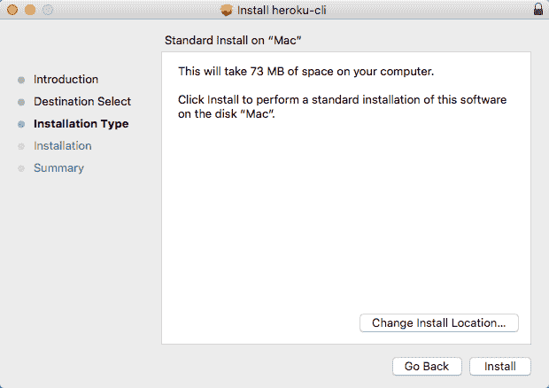

这是一个简单的安装程序，您只需点击“安装”。无需自定义任何内容。您不必输入关于您的 Heroku 帐户的任何特定信息。让我们继续完成安装程序。

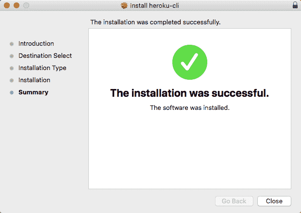

这将为我们提供一个新的终端命令，我们可以执行。在我们执行之前，我们必须在终端中本地登录，这正是我们接下来要做的事情。

# 在本地登录 Heroku 帐户

现在我们将启动终端。如果您已经运行它，您可能需要重新启动它，以便您的操作系统识别新的命令。您可以通过运行以下命令来测试它是否已正确安装：

```js
heroku --help
```

当您运行此命令时，您将看到它正在首次安装 CLI，然后我们将获得所有的帮助信息。这将告诉我们我们可以访问哪些命令以及它们的确切工作方式：

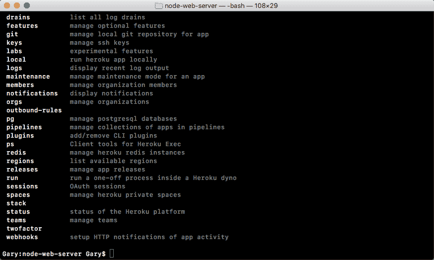

现在我们需要在本地登录 Heroku 账户。这个过程非常简单。在前面的代码输出中，我们有所有可用的命令，其中之一恰好是登录。我们可以像这样运行`heroku login`来开始这个过程：

```js
heroku login
```

我将运行`login`命令，现在我们只需使用之前设置的电子邮件和密码：

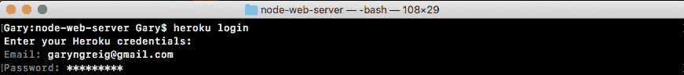

我将输入我的电子邮件和密码。密码输入是隐藏的，因为它是安全的。当我这样做时，您会看到已登录为 garyngreig@gmail.com 显示出来，这太棒了：


现在我们已经登录，并且能够成功地在我们的机器命令行和 Heroku 服务器之间进行通信。这意味着我们可以开始创建和部署应用程序。

# 获取 SSH 密钥到 Heroku

在继续之前，我们将使用`clear`命令清除终端输出，并将我们的 SSH 密钥放在 Heroku 上，有点像我们在 GitHub 上所做的，只是这次我们可以通过命令行来完成。所以这将更容易。为了将我们的本地密钥添加到 Heroku，我们将运行`heroku keys:add`命令。这将扫描我们的 SSH 目录并添加密钥：

```js
heroku keys:add
```

在这里，您可以看到它找到了`id_rsa.pub`文件的密钥：您想将其上传到 Heroku 吗？。


输入`Yes`并按*enter*：


现在我们已经上传了我们的密钥。就是这么简单。比配置 GitHub 要容易得多。从这里开始，我们可以使用`heroku keys`命令来打印当前在我们账户上的所有密钥：

```js
heroku keys
```

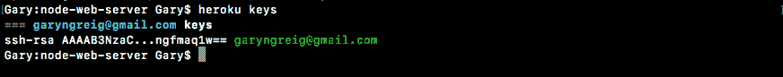

我们总是可以使用`heroku keys:remove`命令删除它们，后面跟着与该密钥相关的电子邮件。在这种情况下，我们将保留我们拥有的 Heroku 密钥。接下来，我们可以使用`v`标志和`git@heroku.com`测试我们的连接使用 SSH：

```js
ssh -v git@heroku.com
```

这将与 Heroku 服务器通信：

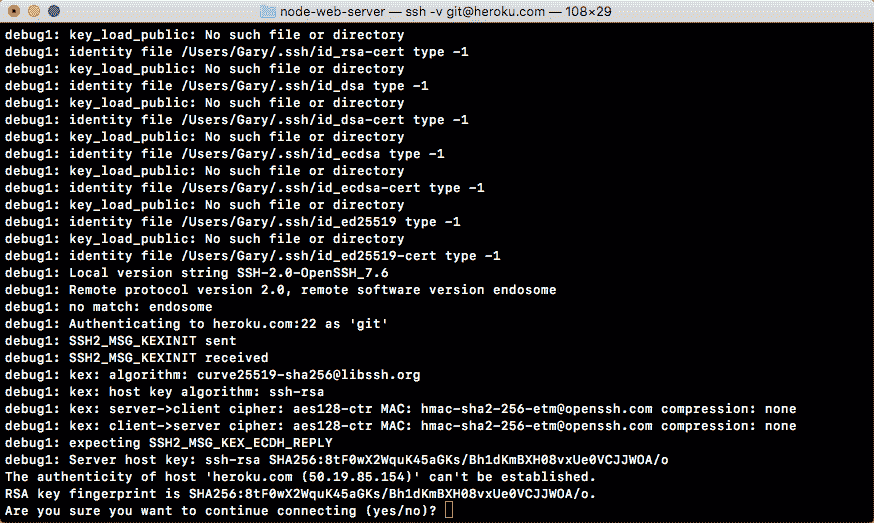

如图所示，我们可以看到它正在询问同样的问题：主机'heroku.com'的真实性无法确定，您确定要继续连接吗？输入`Yes`。

您将看到以下输出：

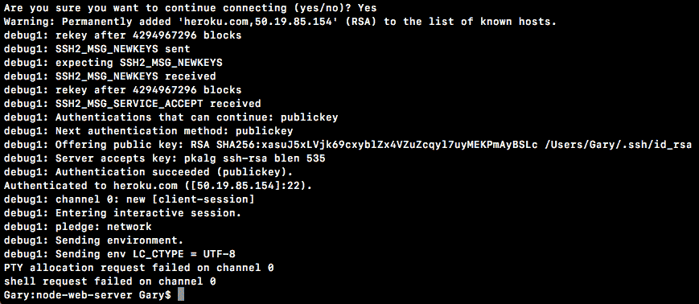

现在当您运行该命令时，您将得到大量的加密输出。您要寻找的是认证成功，然后在括号中的公钥。如果事情没有进行顺利，您将看到权限被拒绝的消息，括号中有公钥。在这种情况下，认证是成功的，这意味着我们可以继续。我将再次运行 clear，清除终端输出。

# 在 Heroku 的应用程序代码中设置

现在我们可以把注意力转向应用程序代码，因为在我们可以部署到 Heroku 之前，我们需要对代码进行两处更改。这些是 Heroku 希望您的应用程序具备的东西，以便正常运行，因为 Heroku 会自动执行很多操作，这意味着您必须为 Heroku 设置一些基本的东西。这并不复杂——一些非常简单的更改，一些一行代码。

# 在`server.js`文件中的更改

首先，在`server.js`文件的最底部，我们有端口和我们的`app.listen`静态编码在`server.js`中：

```js
app.listen(3000, () => {
  console.log('Server is up on port 3000');
});
```

我们需要使这个端口动态化，这意味着我们想要使用一个变量。我们将使用 Heroku 将设置的环境变量。Heroku 将告诉您的应用程序使用哪个端口，因为随着部署应用程序，该端口将发生变化，这意味着我们将使用该环境变量，这样我们就不必每次部署时都要更换我们的代码。

使用环境变量，Heroku 可以在操作系统上设置一个变量。您的 Node 应用程序可以读取该变量，并将其用作端口。现在所有的机器都有环境变量。您实际上可以通过在 Linux 或 macOS 上运行`env`命令或在 Windows 上运行`set`命令来查看您的机器上的环境变量。

当您这样做时，您将得到一个非常长的键值对列表，这就是所有环境变量的内容：

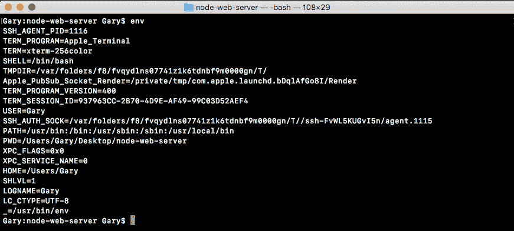

在这里，我有一个 LOGNAME 环境变量设置为 Andrew。我有一个 HOME 环境变量设置为我的主目录，还有各种各样的环境变量在我的操作系统中。

Heroku 将设置其中一个叫做`PORT`的变量，这意味着我们需要去获取那个`port`变量，并在`server.js`中使用它，而不是 3000。在`server.js`文件的顶部，我们需要创建一个叫做`port`的常量，这将存储我们将用于应用程序的端口：

```js
const express = require('express');.
const hbs = require('hbs');
const fs = require('fs');

const port
```

现在我们要做的第一件事是从`process.env`中获取一个端口。`process.env`是一个存储所有环境变量的键值对的对象。我们正在寻找一个 Heroku 将设置的叫做`PORT`的变量：

```js
const port = process.env.PORT;
```

这对 Heroku 来说将会很好，但是当我们在本地运行应用程序时，`PORT`环境变量将不存在，因此我们将使用这个语句中的 OR (`||`)运算符来设置默认值。如果`process.env.port`不存在，我们将把端口设置为`3000`：

```js
const port = process.env.PORT || 3000;
```

现在我们有一个配置为与 Heroku 一起工作并在本地运行的应用程序，就像以前一样。我们所要做的就是取`PORT`变量，并在`app.listen`中使用它，而不是`3000`。如所示，我将引用`port`，并在我们的消息中，我将用模板字符串替换它，现在我可以用注入的端口变量替换`3000`，这将随时间变化：

```js
app.listen(port, () => {
  console.log(`Server is up on port ${port}`);
});
```

有了这个设置，我们现在已经解决了应用程序的第一个问题。我现在将从终端中运行`node server.js`，就像我们在上一章中做的那样：

```js
node server.js
```

我们仍然会得到完全相同的消息：服务器在端口 3000 上运行，所以您的应用程序在本地仍然可以正常工作：

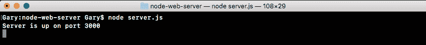

# 在 package.json 文件中的更改

接下来，我们必须在`package.json`中指定一个脚本。在`package.json`中，您可能已经注意到我们有一个`scripts`对象，在其中我们有一个`test`脚本。

这是 npm 默认设置的：


我们可以在`scripts`对象内创建各种脚本，做任何我们喜欢的事情。脚本只不过是我们从终端运行的命令，所以我们可以把这个命令`node server.js`转换成一个脚本，这正是我们要做的。

在`scripts`对象内，我们将添加一个新的脚本。脚本需要被命名为`start`：


这是一个非常特定的内置脚本，我们将把它设置为启动我们应用程序的命令。在这种情况下，它将是`node server.js`：

```js
"start": "node server.js"
```

这是必要的，因为当 Heroku 尝试启动我们的应用程序时，它不会使用您的文件名运行 Node，因为它不知道您的文件名叫什么。相反，它将运行启动脚本，启动脚本将负责执行正确的操作；在这种情况下，启动服务器文件。

现在我们可以使用终端中的`start`脚本来运行我们的应用程序，使用以下命令：

```js
npm start
```

当我这样做时，我们会得到与 npm 相关的一些输出，然后我们会得到服务器在端口 3000 上运行的消息，如果我们在浏览器中访问应用程序，一切都与上一章中完全相同：

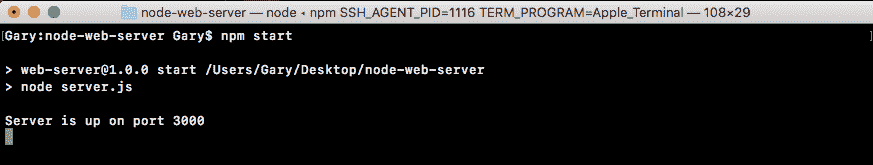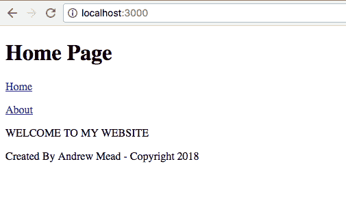

最大的区别是我们现在已经准备好使用 Heroku 了。我们也可以使用终端运行`npm test`来运行测试脚本：

```js
npm test
```

现在，我们没有指定任何测试，这是预期的：

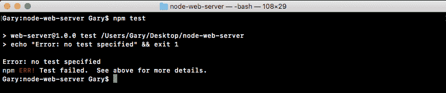

# 在 Heroku 中进行提交

该过程的下一步将是进行提交，然后我们最终可以开始将其上载到 Web 上。从终端，我们将使用本章前面探讨过的一些 Git 命令。首先是`git status`。当我们运行`git status`时，我们会看到一些新的东西：

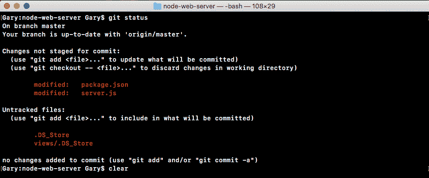

这里显示的代码输出中，我们不是有新文件，而是有修改过的文件。我们有一个修改过的`package.json`文件和一个修改过的`server.js`文件。如果我们现在运行`git commit`，这些将不会被提交；我们仍然需要使用`git add`。我们将运行`git add`并使用点作为下一个参数。点将添加所有显示的每一样东西，并将状态添加到下一个提交。

现在我只建议使用`Changes not staged for commit`标题中列出的所有内容的语法。这些是您实际想要提交的内容，在我们的情况下，这确实是我们想要的。如果我运行`git add`，然后重新运行`git status`，我们现在可以看到下一个将要提交的内容，在`Changes to be committed`标题下：

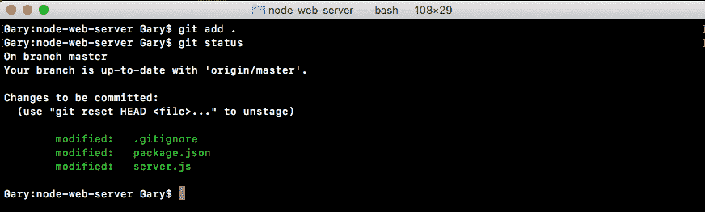

这里有我们的`package.json`文件和`server.js`文件。现在我们可以继续进行提交。

我将运行`git commit`命令，并使用`m`标志来指定我们的消息，对于这个提交，一个好的消息可能是`设置启动脚本和 heroku 端口`：

```js
git commit -m 'Setup start script and heroku port'
```

现在我们可以继续运行该命令，这将进行提交。

现在我们可以使用`git push`命令将其推送到 GitHub，我们可以省略`origin`远程，因为 origin 是默认远程。我将继续运行以下命令：

```js
git push
```

这将把它推送到 GitHub，现在我们准备实际创建应用程序，将我们的代码推送上去，并在浏览器中查看它：

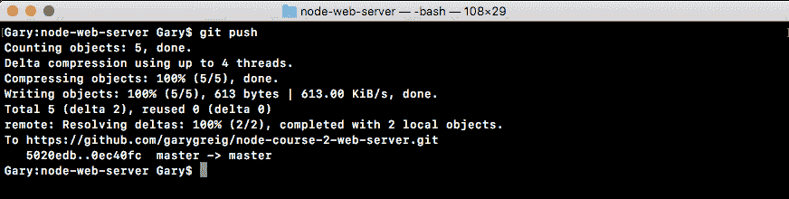

# 运行 Heroku 创建命令

该过程的下一步是从终端运行一个名为`heroku create`的命令。`heroku create`需要在应用程序内部执行：

```js
heroku create
```

就像我们运行 Git 命令一样，当我运行`heroku create`时，会发生一些事情：

+   首先，它将在 Heroku Web 应用程序中创建一个真正的新应用程序

+   它还将向您的 Git 存储库添加一个新的远程

现在记住我们有一个指向我们 GitHub 存储库的 origin 远程。我们将有一个指向我们 Heroku Git 存储库的 Heroku 远程。当我们部署到 Heroku Git 存储库时，Heroku 将会看到。它将接受更改并将其部署到 Web 上。当我们运行 Heroku create 时，所有这些都会发生：

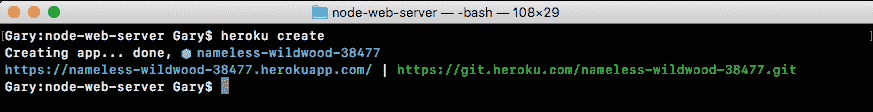

现在我们仍然需要将其推送到这个 URL，以实际执行部署过程，我们可以使用`git push`后跟`heroku`来完成：

```js
git push heroku
```

刚刚添加的全新远程是因为我们运行了`heroku create`。现在这次推送将按照正常流程进行。然后您将开始看到一些日志。

这些是来自 Heroku 的日志，让您知道您的应用程序是如何部署的。它正在进行整个过程，向您展示沿途发生了什么。这将花费大约 10 秒，在最后我们有一个成功的消息—验证部署...完成：

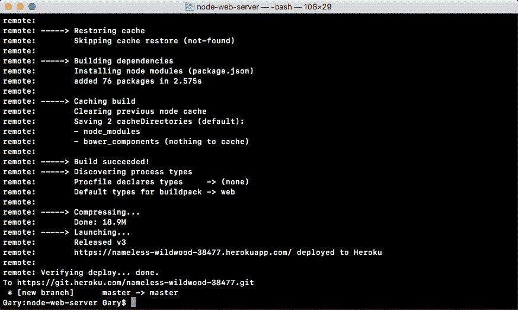

它还验证了应用程序成功部署，并且确实通过了。从这里，我们实际上有一个可以访问的 URL（[`sleepy-retreat-32096.herokuapp.com/`](https://sleepy-retreat-32096.herokuapp.com/)）。我们可以复制它，粘贴到浏览器中。我将使用以下命令：

```js
heroku open
```

`heroku open`将在默认浏览器中打开 Heroku 应用程序。当我运行这个命令时，它会切换到 Chrome，我们的应用程序会如预期般显示出来：

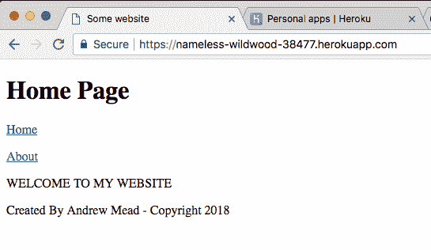

我们可以在页面之间切换，一切都像在本地一样工作。现在我们有一个 URL，这个 URL 是由 Heroku 给我们的。这是 Heroku 生成应用程序 URL 的默认方式。如果您有自己的域名注册公司，您可以继续配置其 DNS 以指向此应用程序。这将让您为 Heroku 应用程序使用自定义 URL。您将不得不参考您的域名注册商的具体说明来做到这一点，但这确实是可以做到的。

现在我们已经完成了这一步，成功地将我们的 Node 应用程序部署到 Heroku 上，并且这真是太棒了。为了做到这一点，我们所要做的就是提交更改我们的代码并将其推送到一个新的 Git 远程。部署我们的代码再也不会更容易了。

您还可以通过转到 Heroku 仪表板来管理您的应用程序。如果您刷新一下，您应该会在仪表板的某个地方看到全新的 URL。记住我的是 sleepy retreat。你的会是其他的。如果我点击 sleepy retreat，我就可以查看应用程序页面：


在这里，我们可以进行很多配置。我们可以管理活动和访问权限，这样我们就可以与他人合作。我们有指标，我们有资源，各种真正酷的东西。有了这个，我们现在已经完成了基本的部署部分。

在下一节中，您的挑战将是再次经历这个过程。您将对 Node 应用程序进行一些更改。您将提交它们，部署它们，并在 Web 上实时查看它们。我们将首先创建本地更改。这意味着我将在这里使用`app.get`注册一个新的 URL。

我们将创建一个新的页面/projects，这就是为什么我将其作为我的 HTTP get 处理程序的路由。在第二个参数中，我们可以指定我们的`callback`函数，它将被调用并传入请求和响应，就像我们对上面的其他路由，根路由和 about 路由一样，我们将调用`response.render`来渲染我们的模板。在渲染参数列表中，我们将提供两个。

第一个将是文件名。文件不存在，但我们仍然可以继续调用`render`。我会称它为`projects.hbs`，然后我们可以指定要传递给模板的选项。在这种情况下，我们将设置页面标题，将其设置为`Projects`，P 要大写。太棒了！现在，服务器文件已经全部完成了。那里不会再有更多的更改了。

我将继续前往`views`目录，创建一个名为`projects.hbs`的新文件。在这里，我们将能够配置我们的模板。首先，我将从 about 页面复制模板。因为它非常相似，我会复制它。关闭 about，粘贴到 projects，然后我只会更改这个文本为项目页面文本将在这里。然后我们可以保存文件并进行最后的更改。

我们想要做的最后一件事是更新页眉。我们现在有一个位于`/projects`的全新项目页面。所以我们要继续并将其添加到页眉链接列表中。在这里，我会创建一个新的段落标签，然后我会创建一个锚标签。链接的文本将是`Projects`，P 要大写，`href`是链接被点击时要访问的 URL。我们将把它设置为`/projects`，就像我们为 about 设置为`/about`一样。

现在我们已经完成了这一切，所有的更改都已经完成，我们准备在本地测试。我将使用`server.js`文件在本地启动应用程序。首先，我们在 localhost 3000 上启动。因此，在浏览器中，我可以切换到 localhost 标签页，而不是 Heroku 应用标签页，然后单击刷新。在这里，我们有主页，指向主页，我们有关于，指向关于，我们有项目，确实指向`/projects`，呈现项目页面。项目页面的文本将在这里。有了这个，我们现在在本地完成了。

我们已经做出了更改，已经测试过了，现在是时候进行提交了。这将在终端内进行。我将关闭服务器并运行 Git 状态。这将显示我仓库中自上次提交以来的所有更改。我有两个修改过的文件：服务器文件和标题文件，还有我的全新项目文件。所有这些看起来都很好。我想将所有这些添加到下一个提交中，所以我可以使用`Git add .`来做到这一点。

现在在我实际进行提交之前，我确实想通过运行 Git 状态来测试是否添加了正确的内容。在这里，我可以看到要提交的更改显示为绿色。一切看起来都很好。接下来，我们将运行 Git 提交来实际进行提交。这将把所有更改保存到 Git 仓库中。这次提交的消息可能是添加一个项目页面。

提交完成后，下一步需要做的是将其推送到 GitHub。这将备份我们的代码并让其他人进行协作。我将使用 Git push 来做到这一点。记住，我们可以省略 origin 远程，因为 origin 是默认远程，所以如果你省略远程，它仍然会使用默认的远程。

更新了我们的 GitHub 仓库，最后要做的事情就是部署到 Heroku，我们可以通过 Git push 将 Git 仓库推送到 Heroku 远程。当我们这样做时，我们会得到一长串日志，因为 Heroku 服务器正在安装我们的 npm 模块，构建应用程序，并实际部署它。一旦完成，我们将回到终端，然后可以在浏览器中打开 URL。现在我可以从这里复制它，或者运行 Heroku open。由于我已经在浏览器中打开了 URL，我只需刷新一下。现在你可能会在刷新应用程序时遇到一些延迟。有时，在部署新应用程序后立即启动应用程序可能需要大约 10 到 15 秒。这只会在第一次访问时发生。其他时候，当你点击刷新按钮时，它应该立即重新加载。

现在我们有了项目页面，如果我访问它，一切看起来都很棒。导航栏运行良好，项目页面确实在`/projects`处呈现。有了这个，我们现在完成了。我们已经完成了添加新功能、在本地测试、进行 Git 提交、推送到 GitHub 并部署到 Heroku 的过程。现在我们有了一个使用 Node.js 构建真实网络应用的工作流程。这也标志着本节的结束。

# 总结

你也学到了 Git、GitHub 和 Heroku。这些是我在创建应用程序时喜欢使用的工具。我喜欢使用 Git，因为它非常流行。这基本上是当今唯一的选择。我喜欢使用 GitHub，因为它有一个很棒的用户界面。它拥有大量令人惊叹的功能，几乎每个人都在使用它。有一个很棒的社区。我喜欢使用 Heroku，因为它非常简单，可以轻松部署应用程序的新版本。你可以用其他工具替换这些工具。你可以使用亚马逊网络服务等服务进行托管。你可以使用 Bitbucket 作为 GitHub 的替代品。这些都是完全可以接受的解决方案。真正重要的是你有一些适合你的工具，你有一个 Git 仓库在某个地方备份，无论是 GitHub 还是 Bitbucket，你有一个简单的部署方式，这样你就可以快速进行更改并将其快速推送给用户。

在不同的章节中，我们学习了如何将文件添加到 Git 以及如何进行第一次提交。接下来，我们设置了 GitHub 和 Heroku，然后学习了如何推送我们的代码并部署它。然后，我们学习了如何与 Heroku 通信以部署我们的代码。之后，我们学习了一些实际的工作流程，用于创建新的提交，推送到 GitHub，并部署到 Heroku。

在下一章中，我们将学习如何测试我们的应用程序。
