# 第十章：测试 Node 应用程序-第一部分

在本章中，我们将看一下如何测试我们的代码，以确保它按预期工作。现在，如果您曾经为其他语言设置过测试用例，那么您就知道开始可能有多么困难。您必须设置实际的测试基础设施。然后您必须编写您的各个测试用例。每次我没有测试一个应用程序，都是因为设置过程和可用工具对我来说是如此繁重。然后您在网上搜索信息，您会得到一些非常简单的例子，但不是用于测试异步代码等真实世界事物的例子。我们将在本章中做所有这些。我将为您提供一个非常简单的测试设置和编写测试用例。

我们将会看一下最好的可用工具，这样你就会真正兴奋地编写这些测试用例，并看到所有那些绿色的勾号。从现在开始我们也会进行测试，所以让我们深入研究一下如何测试一些代码。

# 基本测试

在这一部分，您将创建您的第一个测试用例，以便测试您的代码是否按预期工作。通过将自动测试添加到我们的项目中，我们将能够验证函数是否按其所说的那样工作。如果我们创建一个应该将两个数字相加的函数，我们可以自动验证它是否正在执行这个操作。如果我们有一个应该从数据库中获取用户的函数，我们也可以确保它正在执行这个操作。

现在在本节中开始，我们将看一下在 Node.js 项目中设置测试套件的基础知识。我们将测试一个真实世界的函数。

# 安装测试模块

为了开始，我们将创建一个目录来存储本章的代码。我们将在桌面上使用`mkdir`创建一个目录，并将其命名为`node-tests`：

```js
mkdir node-tests
```

然后我们将使用`cd`更改其中的目录，这样我们就可以运行`npm init`。我们将安装模块，这将需要一个`package.json`文件：

```js
cd node-tests

npm init
```

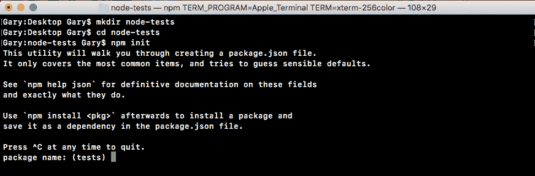

我们将使用默认值运行`npm init`，在每一步中只需简单地按下*enter*：

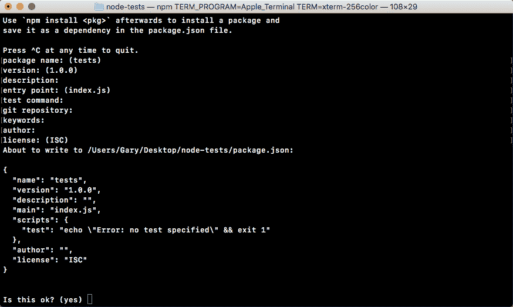

现在一旦生成了`package.json`文件，我们就可以在 Atom 中打开该目录。它在桌面上，名为`node-tests`。

从这里开始，我们准备实际定义我们想要测试的函数。本节的目标是学习如何为 Node 项目设置测试，因此我们将要测试的实际函数将会相当琐碎，但这将帮助说明如何设置我们的测试。

# 测试一个 Node 项目

让我们开始制作一个虚假模块。这个模块将有一些函数，我们将测试这些函数。在项目的根目录中，我们将创建一个全新的目录，我将把这个目录命名为`utils`：

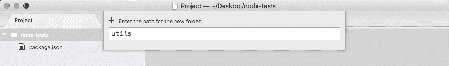

我们可以假设这将存储一些实用函数，比如将一个数字加到另一个数字上，或者从字符串中去除空格，任何不属于任何特定位置的混杂物。我们将在`utils`文件夹中创建一个名为`utils.js`的新文件，这与我们在上一章中创建`weather`和`location`目录时所做的类似模式：

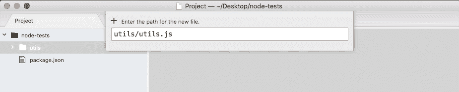

您可能想知道为什么我们有一个同名的文件夹和文件。当我们开始测试时，这将变得清晰。

现在在我们可以编写我们的第一个测试用例来确保某些东西工作之前，我们需要有东西来测试。我将创建一个非常基本的函数，它接受两个数字并将它们相加。我们将创建一个如下所示的加法器函数：

```js
module.exports.add = () => {

}
```

这个箭头函数(`=>`)将接受两个参数`a`和`b`，在函数内部，我们将返回值`a + b`。这里没有太复杂的东西：

```js
module.exports.add = () => {
  return a + b;
};
```

现在，由于我们在箭头函数(`=>`)内只有一个表达式，并且我们想要返回它，我们实际上可以使用箭头函数(`=>`)表达式语法，这使我们可以添加我们的表达式，如下面的代码所示，`a + b`，它将被隐式返回：

```js
module.exports.add = (a, b) => a + b;
```

在函数上不需要显式添加`return`关键字。现在我们已经准备好`utils.js`，让我们来探索测试。

我们将使用一个名为 Mocha 的框架来设置我们的测试套件。这将让我们配置我们的单个测试用例，并运行所有的测试文件。这对于创建和运行测试非常重要。我们的目标是使测试变得简单，我们将使用 Mocha 来实现这一点。现在我们有了一个文件和一个我们真正想要测试的函数，让我们来探索如何创建和运行测试套件。

# Mocha - 测试框架

我们将使用超级流行的测试框架 Mocha 进行测试，您可以在[mochajs.org](https://mochajs.org/)找到它。这是一个创建和运行测试套件的绝佳框架。它非常受欢迎，他们的页面上包含了有关设置、配置以及所有酷炫功能的所有信息：

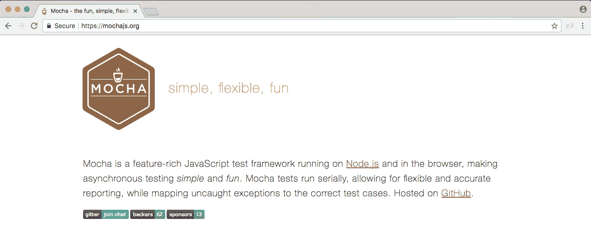

如果您在此页面上滚动，您将能够看到目录：

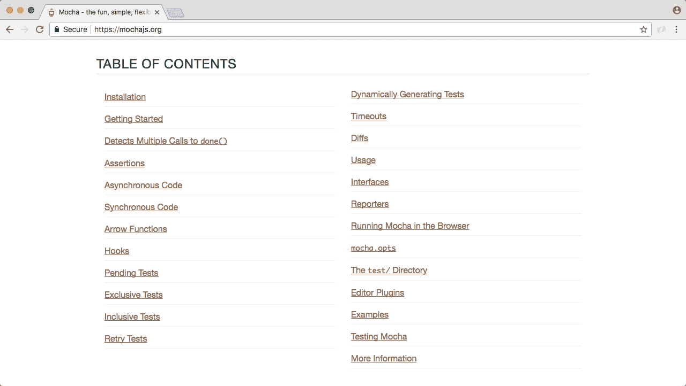

在这里，您可以探索 Mocha 提供的所有功能。我们将在本章中涵盖大部分内容，但对于我们未涵盖的任何内容，我希望您知道您可以在此页面上了解到。

现在我们已经探索了 Mocha 文档页面，让我们安装它并开始使用它。在终端中，我们将安装 Mocha。首先，让我们清除终端输出。然后我们将使用`npm install`命令进行安装。当您使用`npm install`时，您也可以使用快捷方式`npm i`。这具有完全相同的效果。我将使用`npm i`与`mocha`，指定版本`@3.0.0`。这是拍摄时的最新版本：

```js
npm i mocha@3.0.0
```

现在我们确实希望将其保存到`package.json`文件中。以前，我们使用了`save`标志，但我们将讨论一个新标志，称为`save-dev`。`save-dev`标志将仅为开发目的保存此软件包 - 这正是 Mocha 的用途。我们实际上不需要 Mocha 在像 Heroku 这样的服务上运行我们的应用程序。我们只需要在本地机器上使用 Mocha 来测试我们的代码。 

当您使用`save-dev`标志时，它会以相同的方式安装模块：

```js
npm i mocha@5.0.0 --save-dev
```

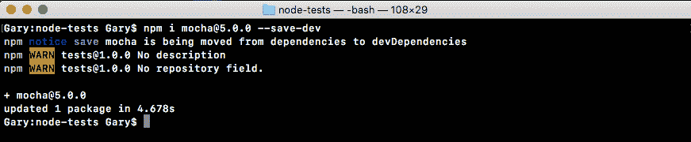

但是，如果您查看`package.json`，您会发现情况有所不同。在我们的`package.json`文件中，我们有一个`devDependencies`属性，而不是一个 dependencies 属性：

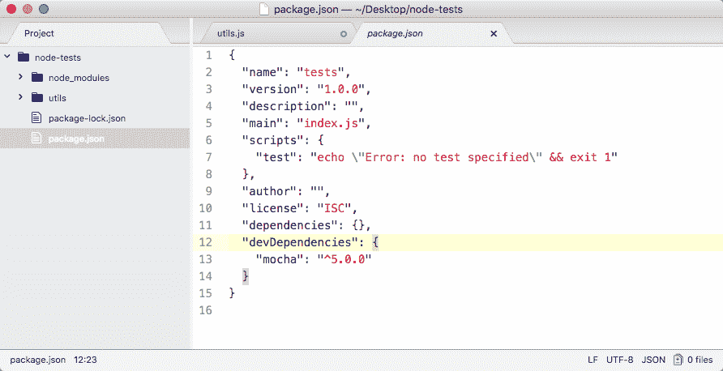

在这里，我们有 Mocha，版本号作为值。`devDependencies`非常棒，因为它们不会安装在 Heroku 上，但它们将在本地安装。这将使 Heroku 的启动时间非常快。它不需要安装实际上不需要的模块。从现在开始，我们将在大多数项目中同时安装`devDependencies`和`dependencies`。

# 为 add 函数创建一个测试文件

现在我们已经安装了 Mocha，我们可以继续创建一个测试文件。在`utils`文件夹中，我们将创建一个名为`utils.test.js`的新文件：

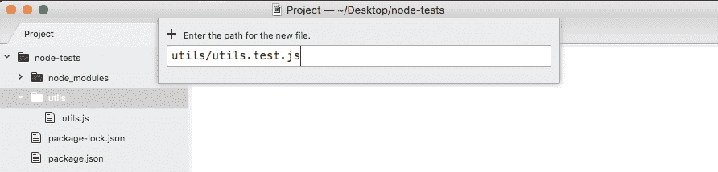

这个文件将存储我们的测试用例。我们不会将测试用例存储在`utils.js`中。这将是我们的应用程序代码。相反，我们将创建一个名为`utils.test.js`的文件。当我们使用这个`test.js`扩展名时，我们基本上告诉我们的应用程序，这将存储我们的测试用例。当 Mocha 在我们的应用程序中寻找要运行的测试时，它应该运行任何具有此扩展名的文件。

现在我们有一个测试文件，唯一剩下的事情就是创建一个测试用例。测试用例是运行一些代码的函数，如果一切顺利，测试被认为是通过的。如果事情不顺利，测试被认为是失败的。我们可以使用`it`创建一个新的测试用例。这是 Mocha 提供的一个函数。我们将通过 Mocha 运行我们的项目测试文件，所以没有理由导入它或做任何类似的事情。我们只需要像这样调用它：

```js
it();
```

现在它让我们定义一个新的测试用例，并且它需要两个参数。这些是：

+   第一个参数是一个字符串

+   第二个参数是一个函数

首先，我们将有一个关于测试具体做什么的字符串描述。如果我们正在测试加法函数是否有效，我们可能会有类似以下的内容：

```js
it('should add two numbers');
```

请注意这里与句子相符。它应该读起来像这样，`it should add two numbers`；准确描述了测试将验证的内容。这被称为**行为驱动开发**，或**BDD**，这是 Mocha 构建的原则。

现在我们已经设置了测试字符串，下一步是将一个函数添加为第二个参数：

```js
it('should add two numbers', () => {

});
```

在这个函数内部，我们将添加测试 add 函数是否按预期工作的代码。这意味着它可能会调用`add`并检查返回的值是否是给定的两个数字的适当值。这意味着我们确实需要在顶部导入`util.js`文件。我们将创建一个常量，称为`utils`，将其设置为从`utils`中获取的返回结果。我们使用`./`，因为我们将要求一个本地文件。它在同一个目录中，所以我可以简单地输入`utils`而不需要`js`扩展名，如下所示：

```js
const utils = require('./utils');

it('should add two numbers', () => {

});
```

现在我们已经加载了 utils 库，在回调函数内部我们可以调用它。让我们创建一个变量来存储返回的结果。我们将称之为 results。然后我们将它设置为`utils.add`，传入两个数字。让我们使用类似`33`和`11`的数字：

```js
const utils = require('./utils');

it('should add two numbers', () => {
  var res = utils.add(33, 11);
});
```

我们期望得到`44`。现在在这一点上，我们的测试套件内确实有一些代码，所以我们运行它。我们将通过在`package.json`中配置我们在上一章中看到的测试脚本来实现这一点。

目前，测试脚本只是简单地在屏幕上打印一条消息，说没有测试存在。我们要做的是调用 Mocha。如下面的代码所示，我们将调用 Mocha，将我们想要测试的实际文件作为唯一的参数传递进去。我们可以使用通配符模式来指定多个文件。在这种情况下，我们将使用`**`来查找每个目录中的文件。我们正在寻找一个名为`utils.test.js`的文件：

```js
"scripts": {
  "test": "mocha **/utils.test.js"
},
```

现在这是一个非常具体的模式。这不会特别有用。相反，我们也可以用星号替换文件名。现在我们正在寻找项目中以`.test.js`结尾的任何文件：

```js
"scripts": {
  "test": "mocha **/*.test.js"
},
```

这正是我们想要的。从这里，我们可以通过保存`package.json`并转到终端来运行我们的测试套件。我们将使用`clear`命令来清除终端输出，然后我们可以运行我们的`test`脚本，使用如下所示的命令：

```js
npm test
```

当我们运行这个时，我们将执行那个 Mocha 命令：

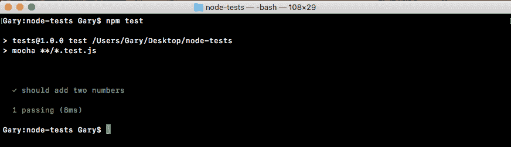

它会触发。它将获取我们所有的测试文件。它将运行所有这些文件，并在终端内打印结果，就像前面的截图中显示的那样。在这里，我们可以看到我们的测试旁边有一个绿色的勾号，`should add two numbers`。接下来，我们有一个小结，一个通过的测试，在 8 毫秒内完成。

现在在我们的情况下，我们实际上并没有断言关于返回的数字的任何内容。它可以是 700，我们也不在乎。测试将始终通过。要使测试失败，我们需要抛出一个错误。这意味着我们可以抛出一个新的错误，并将我们想要用作错误的消息传递给构造函数，如下面的代码块所示。在这种情况下，我可以说类似`值不正确`的内容：

```js
const utils = require('./utils');

it('should add two numbers', () => {
  var res = utils.add(33, 11);
  throw new Error('Value not correct')
});
```

现在有了这个，我可以保存测试文件，并从终端重新运行测试，通过重新运行`npm test`，现在我们有 0 个通过的测试和 1 个失败的测试：

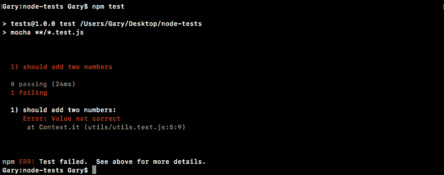

接下来，我们可以看到一个测试是应该添加两个数字，我们得到了我们的错误消息，值不正确。当我们抛出一个新的错误时，测试失败了，这正是我们想要为`add`做的。

# 为测试创建 if 条件

现在，我们将为测试创建一个`if`语句。如果响应值不等于`44`，那意味着我们有麻烦了，我们将抛出一个错误：

```js
const utils = require('./utils');

it('should add two numbers', () => {
  var res = utils.add(33, 11);

  if (res != 44){

  }
});
```

在`if`条件内部，我们可以抛出一个新的错误，我们将使用模板字符串作为我们的消息字符串，因为我确实想要在错误消息中使用返回的值。我会说`Expected 44, but got`，然后我会注入实际的值，无论发生什么：

```js
const utils = require('./utils');

it('should add two numbers', () => {
  var res = utils.add(33, 11);

  if (res != 44){
    throw new Error(`Expected 44, but got ${res}.`);
  }
});
```

现在在我们的情况下，一切都会很顺利。但是如果`add`方法没有正确工作会怎么样呢？让我们通过简单地添加另一个加法来模拟这种情况，在`utils.js`中添加上类似`22`的东西：

```js
module.exports.add = (a, b) => a + b + 22;
```

我会保存文件，重新运行测试套件：

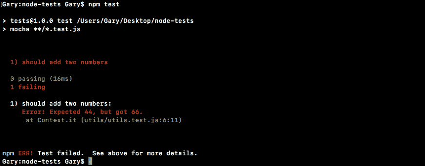

现在我们得到了一个错误消息：期望得到 44，但得到了 66。这个错误消息很棒。它让我们知道测试出了问题，甚至告诉我们确切得到了什么，以及我们期望得到了什么。这将让我们进入`add`函数，寻找错误，并希望修复它们。

创建测试用例不需要非常复杂。在这种情况下，我们有一个简单的测试用例，测试一个简单的函数。

# 测试平方函数

现在，我们将创建一个新的函数，它对一个数字进行平方并返回结果。我们将在`utils.js`文件中定义，使用`module.exports.square`。我们将把它设置为一个箭头函数(`=>`)，它接受一个数字`x`，然后我们返回`x`乘以`x`，`x * x`，就像这样：

```js
module.exports.add = (a, b) => a + b;

module.exports.square = (x) => x * x;
```

现在我们有了这个全新的`square`函数，我们将创建一个新的测试用例，确保`square`按预期工作。在`utils.test.js`中，在`add`函数的`if`条件旁边，我们将再次调用`it`函数：

```js
const utils = require('./utils');

it('should add two numbers', () => {
  var res = utils.add(33, 11);

  if (res != 44){
    throw new Error(`Expected 44, but got ${res}.`);
  }
});

it();
```

在`it`函数内部，我们将添加我们的两个参数，字符串和回调函数。在字符串内部，我们将创建我们的消息，`should square a number`：

```js
it('should square a number', () => {

});
```

在回调函数内部，我们实际上可以继续调用`square`。现在我们确实想要创建一个变量来存储结果，以便我们可以检查结果是否符合预期。然后我们可以调用`utils.square`传入一个数字。在这种情况下，我会选择`3`，这意味着我应该期望返回`9`：

```js
it('should square a number', () => {
  var res = utils.square(3);
});
```

在下一行，我们可以有一个`if`语句，如果结果不等于`9`，那么我们会抛出一个消息，因为事情出错了：

```js
it('should square a number', () => {
  var res = utils.square(3);

  if (res !== 9) {

  }
});
```

我们可以使用`throw new Error`抛出错误，传入任何我们喜欢的消息。我们可以使用普通字符串，但我总是更喜欢使用模板字符串，这样我们可以轻松地注入值。我会说类似于`Expected 9, but got`，后面跟着不正确的值；在这种情况下，这个值存储在响应变量中：

```js
it('should square a number', () => {
  var res = utils.square(3);

  if (res !== 9) {
    throw new Error(`Expected 9, but got ${res}`);
  }
});
```

现在我可以保存这个测试用例，并从终端运行测试套件。使用上箭头键和*enter*键，我们可以重新运行上一个命令：

```js
npm test
```

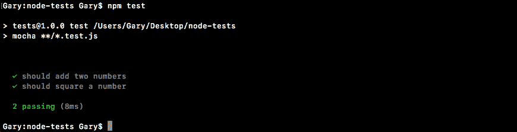

我们得到了两个通过的测试，应该添加两个数字和应该对一个数字进行平方都有对号。而且我们只用了 14 毫秒运行了两个测试，这太棒了。

现在，下一件事，我们想要做的是搞砸`square`函数，以确保当数字不正确时我们的测试失败。我会在`utils.js`中的结果上加`1`，这将导致测试失败：

```js
module.exports.add = (a, b) => a + b;

module.exports.square = (x) => x * x + 1;
```

然后我们可以从终端重新运行测试，我们应该会看到错误消息：

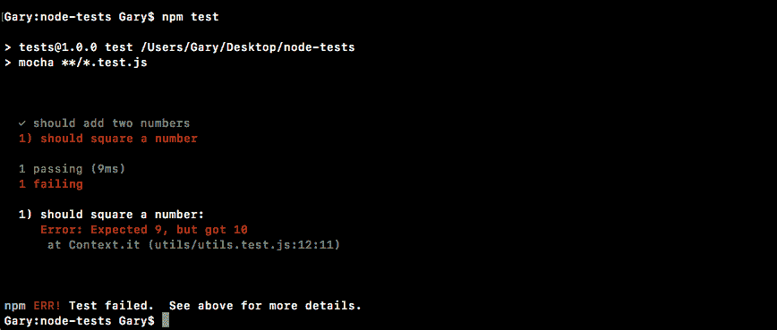

我们得到了预期的 9，但得到了 10。这太棒了。我们现在有一个能够测试`add`函数和`square`函数的测试套件。我将删除那个`+ 1`，然后我们就完成了。

我们现在有一个非常非常基本的测试套件，我们可以使用 Mocha 执行。目前，我们有两个测试，并且为了创建这些测试，我们使用了 Mocha 提供的`it`方法。在接下来的部分中，我们将探索 Mocha 给我们的更多方法，并且我们还将寻找更好的方法来进行断言。我们将使用一个断言库来帮助完成繁重的工作，而不是手动创建它们。

# 自动重新启动测试

在编写更多测试用例之前，让我们看一种自动重新运行测试套件的方法，当我们更改测试代码或应用程序代码时。我们将使用`nodemon`来实现这一点。现在，我们之前是这样使用`nodemon`的：

```js
nodemon app.js
```

我们将输入`nodemon`，然后传入一个文件，如`app.js`。每当我们应用程序中的任何代码更改时，它将重新运行`app.js`文件作为 Node 应用程序。实际上，我们可以指定我们想要在文件更改时运行的世界上的任何命令。这意味着我们可以在文件更改时重新运行`npm test`。

为此，我们将使用`exec`标志。此标志告诉`nodemon`我们将指定要运行的命令，它可能不一定是一个 Node 文件。如下命令所示，我们可以指定该命令。它将是`'npm test'`：

```js
nodemon --exec 'npm test'
```

如果您使用 Windows，请记住使用双引号代替单引号。

现在，我们可以运行`nodemon`命令。它将首次运行我们的测试套件：

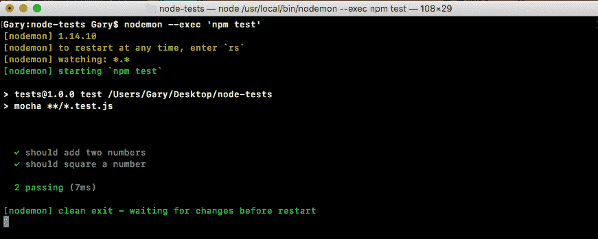

在这里，我们看到有两个测试通过。让我们继续进入应用程序`utils.js`，并对其中一个函数进行更改，以便它失败。我们将为`add`的结果添加`3`或`4`：

```js
module.exports.add = (a, b) => a + b + 4;

module.exports.square = (x) => x * x;
```

它会自动重新启动：

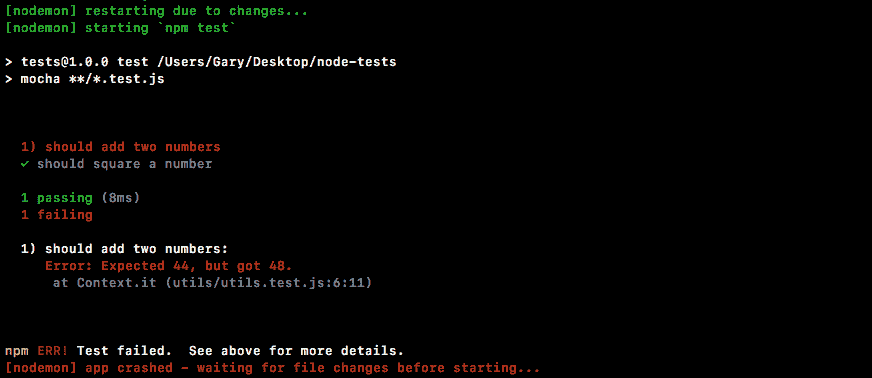

现在我们看到我们有一个测试套件，其中一个测试通过，一个测试失败。我可以随时撤消我们添加的错误，保存文件，测试套件将自动重新运行。

这将使测试应用程序变得更加容易。每当我们对应用程序进行更改时，我们就不必切换到终端并重新运行`npm test`命令。现在我们有一个可以运行的命令，我们将关闭`nodemon`并使用上箭头键再次显示它。

我们实际上可以将其移入`package.json`中的一个脚本。

在`package.json`中，我们将在测试脚本之后创建一个新的脚本。现在我们已经使用了`start`脚本和`test`脚本-这些是内置的-我们将创建一个名为`test-watch`的自定义脚本，并且我们可以运行`test-watch`脚本来启动。在`test-watch`中，我们将使用与终端中运行的完全相同的命令。这意味着我们将会使用`nodemon`。我们将使用`exec`标志，并在引号内运行`npm test`：

```js
"scripts": {
  "test": "mocha **/*.test.js",
  "test-watch": "nodemon --exec 'npm test'"
},
```

现在我们已经有了这个，我们可以从终端运行脚本，而不是每次启动自动测试套件时都要输入这个命令。

我们目前在`package.json`中拥有的脚本将在 macOS 和 Linux 上运行。它也将在使用 Linux 的 Heroku 上运行。但它在 Windows 上不起作用。以下脚本将起作用：

`"test-watch": "nodemon --exec \"npm test\""`.

如您所见，我们正在转义围绕`npm test`的引号，并且我们正在使用双引号，正如我们所知，这是 Windows 支持的唯一引号。此脚本将消除您看到的任何错误，例如找不到 npm，如果您将`npm tests`用单引号括起来并在 Windows 上运行脚本时会出现。因此，请使用上述脚本以实现跨操作系统的兼容性。

要在终端中运行具有自定义名称的脚本，例如`test-watch`，我们只需要运行`npm run`，然后是脚本名称`test-watch`，如下命令所示：

```js
npm run test-watch
```

如果我这样做，它会启动。我们将得到我们的测试套件，它仍在等待变化，如下所示：

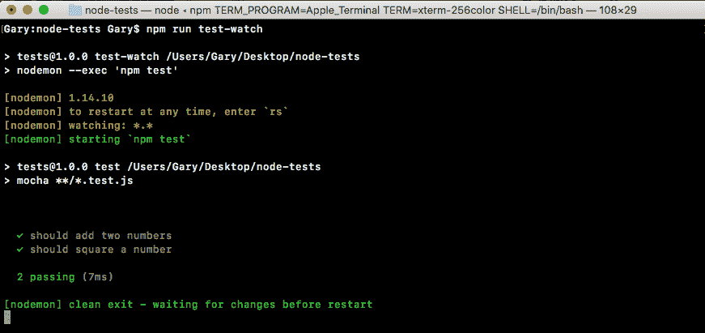

现在，每次你启动测试套件，你可以简单地使用`npm run test-watch`。这将启动`test-watch`脚本，它会启动`nodemon`。每当你的项目发生变化，它都会重新运行`npm test`，并将测试套件的结果显示在屏幕上。

现在我们有了一种自动重新启动测试套件的方法，让我们继续深入了解在 Node 中进行测试的具体内容。

# 在测试 Node 模块中使用断言库

在前面的部分，我们制作了两个测试用例来验证`utils.add`和我们的`utils.square`方法是否按预期工作。我们使用了一个`if`条件来做到这一点，也就是说，如果值不是`44`，那就意味着出了问题，我们就会抛出一个错误。在本节中，我们将学习如何使用一个断言库，它将为我们处理`utils.test.js`代码中的所有`if`条件：

```js
if (res !== 44)
  throw new Error(`Expected 44, but got ${res}.`)
}
```

因为当我们添加越来越多的测试时，代码最终会变得非常相似，没有理由一直重写它。断言库让我们可以对值进行断言，无论是关于它们的类型，值本身，还是数组是否包含元素，诸如此类的各种事情。它们真的很棒。

我们将使用的是 expect。你可以通过谷歌搜索`mjackson expect`来找到它。这就是我们要找的结果：

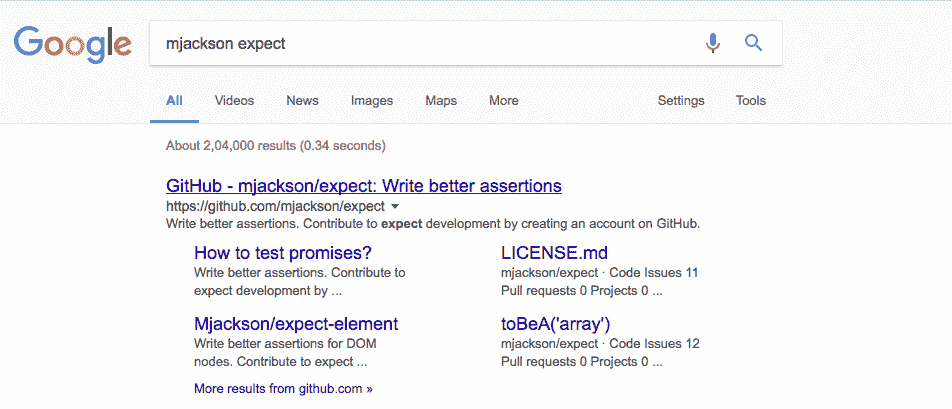

这是 mjackson 的存储库，expect。这是一个很棒而且非常受欢迎的断言库。这个库让我们可以传递一个值并对其进行一些断言。在这个页面上，我们可以在介绍和安装之后滚动到一个例子：

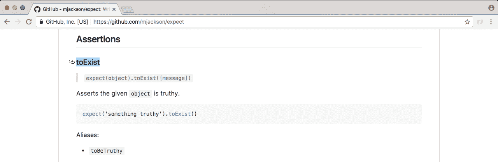

如前面的截图所示，我们有我们的断言标题和我们的第一个断言，`toExist`。这将验证一个值是否存在。在下一行，我们有一个例子，我们将一个字符串传递给`expect`：

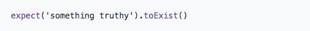

这是我们想要对其进行一些断言的值。在我们的应用程序上下文中，这将是`utils.test.js`中的响应变量，如下所示：

```js
const utils = require('./utils');

it('should add two numbers', () => {
  var res = utils.add(33, 11);
  if (res !== 44) {
    throw new Error(`Expected 44, but got ${res}.`)
  }
});
```

我们想要断言它是否等于`44`。在我们调用`expect`之后，我们可以开始链接一些断言调用。在下一个断言示例中，我们检查它是否存在：

```js
expect('something truthy').toExist()
```

这不会抛出错误，因为在 JavaScript 中，字符串确实是真值。如果我们传入一些不是`真值`的东西，比如`undefined`，`toExist`会失败。它会抛出一个错误，测试用例不会通过。使用这些断言，我们可以非常轻松地检查测试中的值，而不必自己编写所有的代码。

# 探索断言库

让我们继续开始探索断言库。首先，让我们在终端中运行`npm install`来安装模块。模块名本身叫做 expect，我们将获取最新版本`@1.20.2`。我们将再次使用`save-dev`标志，就像我们在 Mocha 中所做的那样。因为我们确实希望将这个依赖保存在`package.json`中，但它是一个`dev`依赖，不管是在 Heroku 还是其他服务上运行，都不是必需的：

```js
npm install expect@1.20.2 --save-dev
```

`expect`库已经捐赠给了另一个组织。最新版本是 v21.1.0，与我们在这里使用的旧版本 1.20.2 不兼容。我希望你安装 1.20.2 版本，以确保在接下来的几节中使用。

让我们继续安装这个依赖。

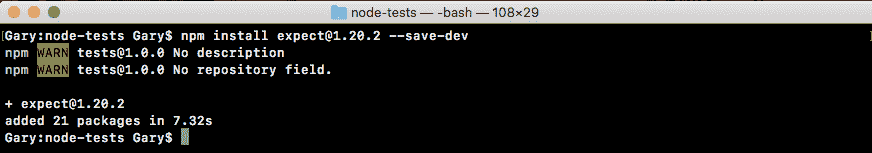

然后我们可以转到应用程序，查看`package.json`文件，如下截图所示，看起来很棒：

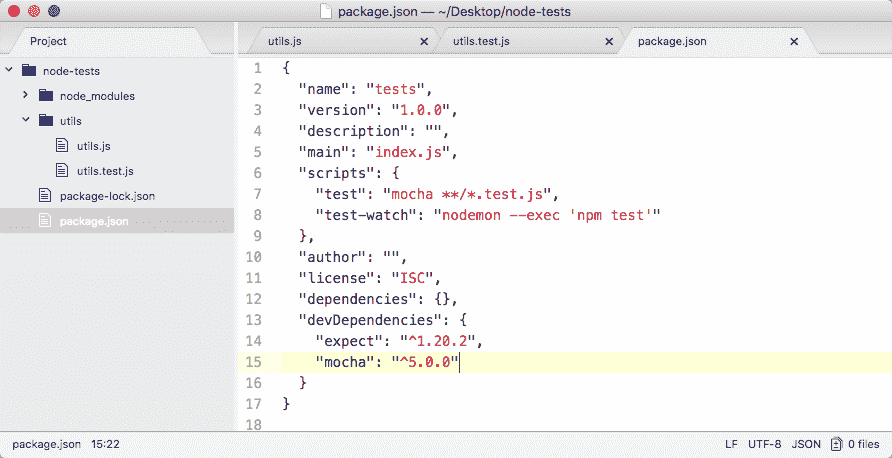

我们既有 expect，又有 Mocha。现在，在我们的`utils.test`文件中，我们可以通过加载库并使用 expect 进行第一次断言来启动。在文件的顶部，我们将加载库，创建一个名为`expect`的常量，并`require('expect')`，就像这样：

```js
const expect = require('expect');
```

现在，我们可以通过调用`expect`来替换`utils.test.js`代码中的`if`条件：

```js
const expect = require('expect');

const utils = require('./utils');

it('should add two numbers', () => {
  var res = utils.add(33, 11);

  // if(res !== 44) {
  //   throw new Error(`Expected 44, but got ${res}.`)
  //}
});
```

正如你在断言/expect 页面上的示例中看到的，我们将通过调用`expect`作为一个函数来开始所有的断言，传入我们想要进行断言的值。在这种情况下，那就是`res`变量：

```js
const expect = require('expect');

const utils = require('./utils');

it('should add two numbers', () => {
  var res = utils.add(33, 11);

  expect(res)
  // if(res !== 44) {
  //   throw new Error(`Expected 44, but got ${res}.`)
  //}
});
```

现在，我们可以断言各种事情。在这种情况下，我们想要断言该值等于`44`。我们将使用我们的断言`toBe`。在文档页面上，它看起来是这样的：

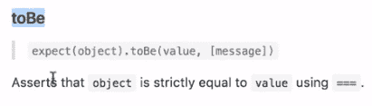

这断言一个值等于另一个值，这正是我们想要的。我们断言传入 expect 的值等于另一个值，使用`toBe`，将该值作为第一个参数传入。回到 Atom 中，我们可以使用这个断言`.toBe`，我们期望结果变量是数字`44`，就像这样：

```js
const expect = require('expect');

const utils = require('./utils');

it('should add two numbers', () => {
  var res = utils.add(33, 11);

  expect(res).toBe(44);
  // if(res !== 44) {
  //   throw new Error(`Expected 44, but got ${res}.`)
  //}
});
```

现在我们有了我们的测试用例，它应该与`if`条件一样正常工作。

为了证明它确实有效，让我们进入终端并使用`clear`命令来清除终端输出。现在我们可以运行`test-watch`脚本，如下命令所示：

```js
npm run test-watch
```

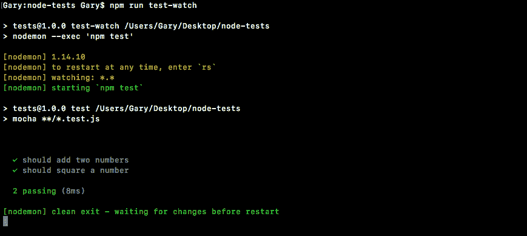

如前面的代码输出所示，我们的两个测试都通过了，就像以前一样。现在，如果我们将`44`更改为像`40`这样的其他值，那么会抛出错误：

```js
const expect = require('expect');

const utils = require('./utils');

it('should add two numbers', () => {
  var res = utils.add(33, 11);

  expect(res).toBe(40);
  // if(res !== 44) {
  //   throw new Error(`Expected 44, but got ${res}.`)
  //}
});
```

我们保存文件，然后会得到一个错误，`expect`库将为我们生成有用的错误消息：

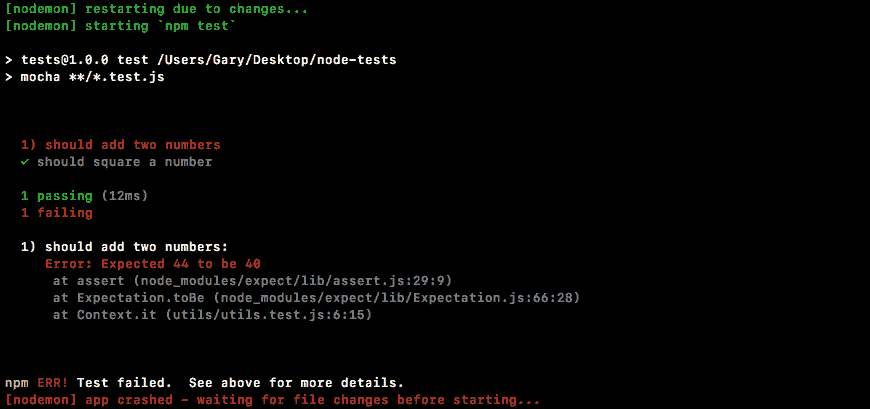

它说我们预期 44 是 40。显然这不是这样，所以会抛出一个错误。我将把它改回`44`，保存文件，所有的测试都会通过。

# 链接多个断言

现在我们也可以链接多个断言。例如，我们可以断言从`add`返回的值是一个数字。这可以使用另一个断言来完成。所以让我们进入文档看一看。在 Chrome 中，我们将浏览断言文档列表。有很多方法。我们将探索其中一些。在这种情况下，我们正在寻找`toBeA`，这个方法接受一个字符串：

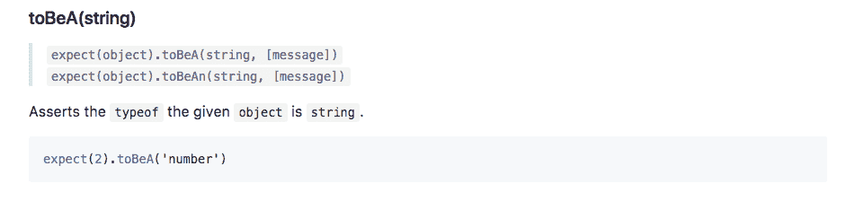

这将使用字符串类型，并使用`typeof`运算符来断言该值是某种类型。在这里，我们期望`2`是一个数字。我们可以在我们的代码中做完全相同的事情。在 Atom 中，在`toBe`之后，我们可以链接另一个调用`toBeA`，然后是类型。这可能是字符串，也可能是对象，或者在我们的情况下，可能是一个数字，就像这样：

```js
const expect = require('expect');

const utils = require('./utils');

it('should add two numbers', () => {
  var res = utils.add(33, 11);

  expect(res).toBe(44).toBeA('number');
  // if(res !== 44) {
  //   throw new Error(`Expected 44, but got ${res}.`)
  //}
});
```

我们将打开终端，这样我们就可以看到结果。它目前是隐藏的。保存文件。我们的测试将重新运行，我们可以看到它们都通过了：

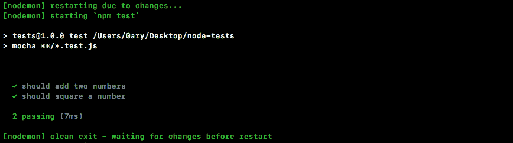

让我们使用一个不同的类型，例如会导致测试失败的字符串：

```js
 expect(res).toBe(44).toBeA('string');
```

然后我们会得到一个错误消息，预期 44 是一个字符串：

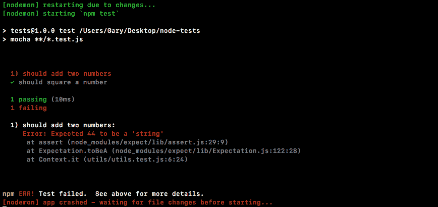

这真的很有用。它将帮助我们快速清理错误。让我们把代码改回数字，然后就可以开始了。

# 对于 square 函数的多个断言

现在我们想为我们的平方数函数的测试做同样的事情。我们将使用`expect`来断言响应确实是数字`9`，并且类型是一个数字。我们将使用与`add`函数相同的这两个断言。首先，我们需要删除当前的平方`if`条件代码，因为我们将不再使用它。如下所示，我们将对`res`变量做一些期望。我们期望它是数字`9`，就像这样：

```js
it('should square a number', () => {
  var res = utils.square(3);

  expect(res).toBe(9);
});
```

我们将保存文件并确保测试通过，它确实通过了：


现在，我们将使用`toBeA`来断言类型。在这里，我们正在检查`square`方法的返回值类型是否为数字：

```js
it('should square a number', () => {
  var res = utils.square(3);

  expect(res).toBe(9).toBeA('number');
});
```

当我们保存文件时，我们仍然通过了我们的两个测试，这太棒了：

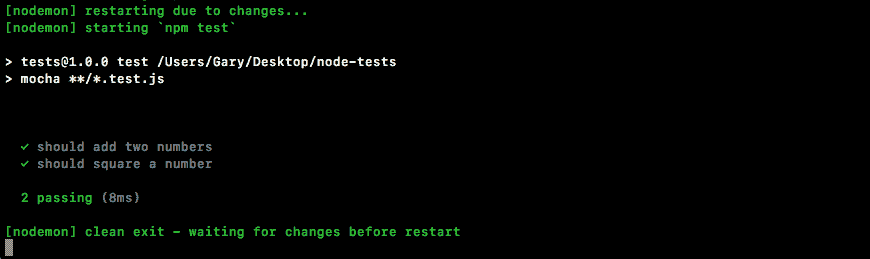

现在这只是一个关于`expect`能做什么的小测试。让我们创建一个虚假测试用例，探索一些我们可以使用`expect`的更多方式。我们将不会测试一个实际的函数。我们只是在`it`回调内部玩一些断言。

# 探索使用 expect 进行虚假测试

要创建虚假测试，我们将使用`it`回调函数创建一个新的测试：

```js
it('should expect some values');
```

我们可以在这里放任何我们想要的东西，这并不太重要。我们将传入一个箭头函数(`=>`)作为我们的回调函数：

```js
it('should expect some values', () => {

});
```

现在正如我们已经看到的，你将做的最基本的断言之一就是检查是否相等。我们想要检查类似响应变量是否等于其他东西，比如数字`44`。在`expect`内部，我们也可以做相反的事情。我们可以期望一个值像`12`不等于，使用`toNotBe`。然后我们可以断言它不等于其他值，比如`11`：

```js
it('should expect some values', () => {
  expect(12).toNotBe(11);
});
```

两者不相等，所以当我们在终端中保存文件时，所有三个测试都应该通过：

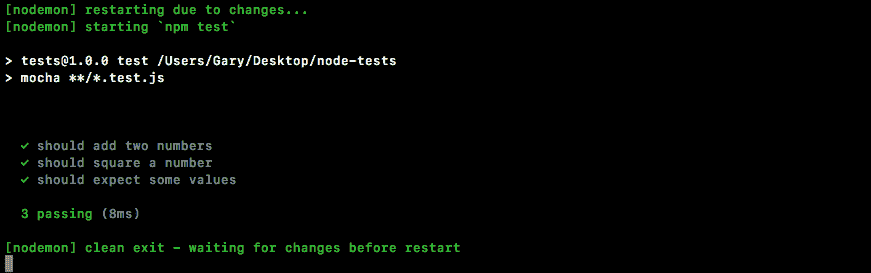

如果我将其设置为相同的值，它将无法按预期工作：

```js
it('should expect some values', () => {
  expect(12).toNotBe(12);
});
```

我们会得到一个错误，预期 12 不等于 12：

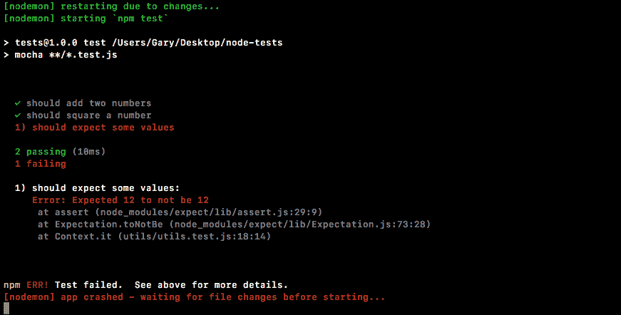

现在`toBe`和`toNotBe`对于数字、字符串和布尔值效果很好，但是如果你试图比较数组或对象，它们将无法按预期工作，我们可以证明这一点。

# 使用 toBe 和 toNotBe 比较数组/对象

我们将从注释掉当前代码开始。我们将保留它，以便稍后使用：

```js
it('should expect some values', () => {
  // expect(12).toNotBe(12);
});
```

我们将`expect`一个具有`name`属性设置为`Andrew`的对象，`toBe`，并且我们将断言它是另一个具有 name 属性等于`Andrew`的对象，就像这样：

```js
it('should expect some values', () => {
  // expect(12).toNotBe(12);
  expect({name: 'Andrew'})
});
```

我们将使用`toBe`，就像我们用`number`一样，检查它是否与另一个 name 等于`Andrew`的对象相同：

```js
it('should expect some values', () => {
  // expect(12).toNotBe(12);
  expect({name: 'Andrew'}).toBe({name: 'Andrew'});
});
```

现在当我们保存这个文件时，你可能会认为测试会通过，但它并没有：

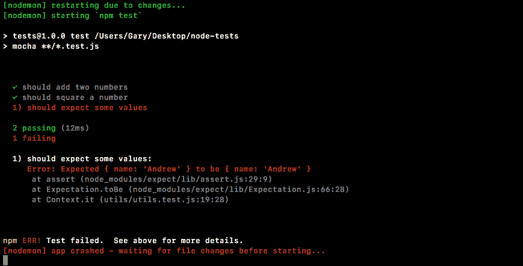

如前面的输出所示，我们看到我们期望这两个名称相等。当使用三重等号进行对象比较时，也就是`toBe`使用的方式，它们不会相同，因为它试图看它们是否是完全相同的对象，而它们不是。我们创建了两个具有相同属性的单独对象。

# 使用 toEqual 和 toNotEqual 断言

要检查这两个名称是否相等，我们将不得不使用不同的东西。它被称为`toEqual`，如下所示：

```js
it('should expect some values', () => {
  // expect(12).toNotBe(12);
  expect({name: 'Andrew'}).toEqual({name: 'Andrew'});
});
```

如果我们现在保存文件，这将起作用。它将深入对象属性，确保它们具有相同的属性：

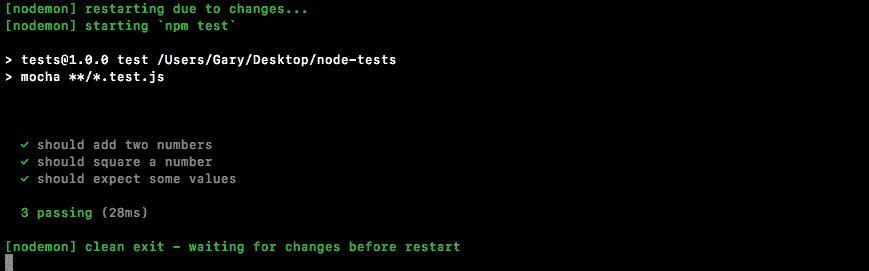

`toNotEqual`也是一样的。这检查两个对象是否不相等。为了检查这一点，我们将继续并将第一个对象更改为`andrew`中的小写 a：

```js
it('should expect some values', () => {
  // expect(12).toNotBe(12);
  expect({name: 'andrew'}).toNotEqual({name: 'Andrew'});
});
```

现在，测试通过了。它们不相等：

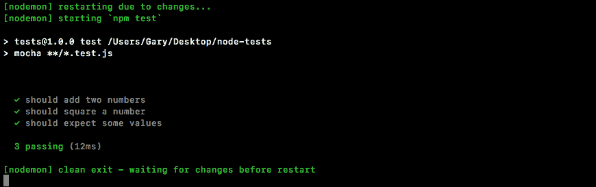

这是我们如何对我们的对象和数组进行相等性比较的方式。现在我们还有一个非常有用的东西，那就是`toInclude`。

# 使用 toInclude 和 toExclude

`toInclude`断言检查数组或对象是否包含一些东西。如果是数组，我们可以检查数组中是否包含某个项目。如果是对象，我们可以检查对象是否包含某些属性。让我们通过一个例子来运行一下。

我们期望在`it`回调中有一个包含数字`2`、`3`和`4`的数组包含数字`5`，我们可以使用`toInclude`来做到这一点：

```js
it('should expect some values', () => {
  // expect(12).toNotBe(12);
  // expect({name: 'andrew'}).toNotEqual({name: 'Andrew'});
  expect([2,3,4]).toInclude(5);
});
```

`toInclude`断言接受项目。在这种情况下，我们将检查数组中是否包含`5`。现在显然它没有，所以这个测试将失败：

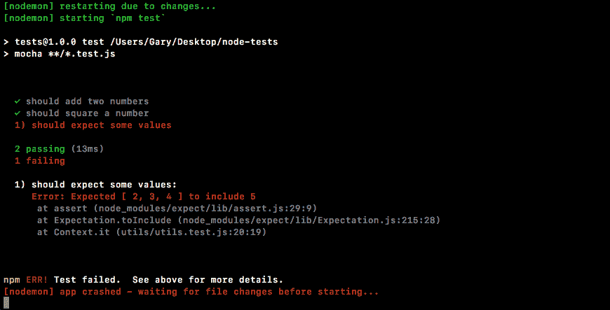

我们得到消息，期望[ 2, 3, 4]包括 5。那不存在。现在我们把这个改成一个存在的数字，比如`2`：

```js
it('should expect some values', () => {
  // expect(12).toNotBe(12);
  // expect({name: 'andrew'}).toNotEqual({name: 'Andrew'});
  expect([2,3,4]).toInclude(2);
});
```

我们将重新运行测试套件，一切都将按预期工作：

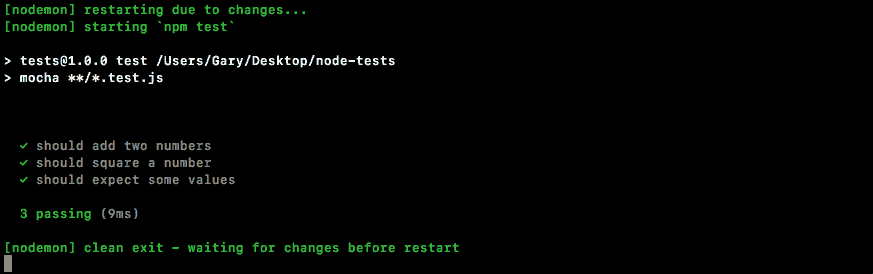

现在，除了`toInclude`，我们还有`toExclude`，就像这样：

```js
it('should expect some values', () => {
  // expect(12).toNotBe(12);
  // expect({name: 'andrew'}).toNotEqual({name: 'Andrew'});
  expect([2,3,4]).toExclude(1);
});
```

这将检查某些东西是否不存在，例如数字`1`，它不在数组中。如果我们运行这个断言，测试通过：


同样的两种方法，`toInclude`和`toExclude`，也适用于对象。我们可以在下一行直接使用。我期望以下对象有一些东西：

```js
it('should expect some values', () => {
  // expect(12).toNotBe(12);
  // expect({name: 'andrew'}).toNotEqual({name: 'Andrew'});
  // expect([2,3,4]).toExclude(1);
  expect({

  })
});
```

让我们继续创建一个具有一些属性的对象。这些是：

+   `name`：我们将把它设置为任何名字，比如`Andrew`。

+   `age`：我们将把它设置为年龄，比如`25`。

+   `location`：我们将把它设置为任何位置，例如`Philadelphia`。

这将看起来像以下的代码块：

```js
it('should expect some values', () => {
  // expect(12).toNotBe(12);
  // expect({name: 'andrew'}).toNotEqual({name: 'Andrew'});
  // expect([2,3,4]).toExclude(1);
  expect({
    name: 'Andrew',
 age: 25,
 location: 'Philadelphia'
  })
});
```

现在假设我们想对特定属性做一些断言，而不一定是整个对象。我们可以使用`toInclude`来断言对象是否具有某些属性，并且这些属性的值等于我们传入的值：

```js
it('should expect some values', () => {
  // expect(12).toNotBe(12);
  // expect({name: 'andrew'}).toNotEqual({name: 'Andrew'});
  // expect([2,3,4]).toExclude(1);
  expect({
    name: 'Andrew',
    age: 25,
    location: 'Philadelphia'
  }).toInclude({

 })
});
```

例如，`age`属性。假设我们只关心年龄。我们可以断言对象具有一个等于`25`的`age`属性，方法是输入以下代码：

```js
it('should expect some values', () => {
  // expect(12).toNotBe(12);
  // expect({name: 'andrew'}).toNotEqual({name: 'Andrew'});
  // expect([2,3,4]).toExclude(1);
  expect({
    name: 'Andrew',
    age: 25,
    location: 'Philadelphia'
  }).toInclude({
    age: 25
  })
});
```

`name`属性无关紧要。`name`属性可以是任何值。这在这个断言中是无关紧要的。现在让我们使用值`23`：

```js
.toInclude({
    age: 23
  })
```

由于值不正确，这个测试将失败：

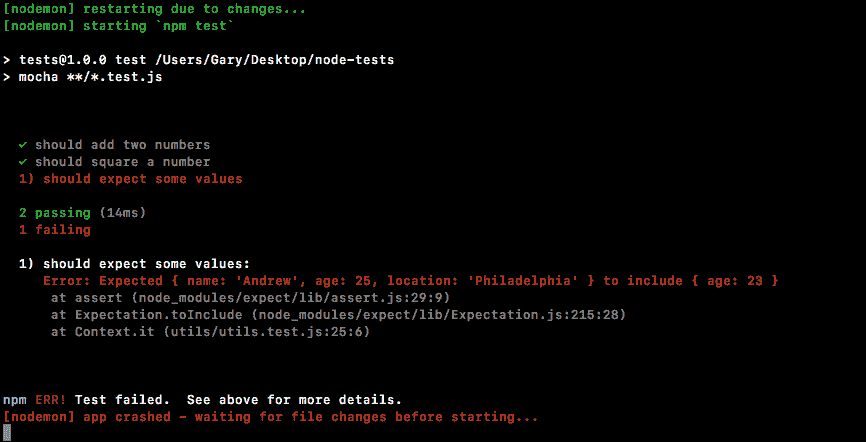

我们期望`age`属性是`23`，但实际上是`25`，所以测试失败。`toExclude`断言也是一样的。

在这里我们可以保存我们的测试文件。这检查对象是否没有一个等于`23`的属性 age。它确实没有，所以测试通过：


这只是对 expect 能做什么的一个快速了解。关于功能的完整列表，我建议浏览文档。还有很多其他断言可以使用，比如检查一个数字是否大于另一个数字，一个数字是否小于或等于另一个数字，还包括各种与数学相关的操作。

# 测试 setName 方法

现在让我们用一些更多的测试来结束这一节。在`utils.js`中，我们可以创建一个新的函数，一个我们将要测试的函数，`module.exports.setName`。`setName`函数将接受两个参数。它将接受一个`user`对象，一个具有一些通用属性的虚构用户对象，它将接受一个字符串`fullName`：

```js
module.exports.add = (a, b) => a + b;

module.exports.square = (x) => x * x;

module.exports.setName (user, fullName)
```

`setName`的工作将是将`fullName`分成两部分——名字和姓氏——通过在空格上分割它。我们将设置两个属性，名字和姓氏，并返回`user`对象。我们将填写函数，然后编写测试用例。

我们将首先将名字分割成一个`names`数组，`var names`将是那个数组：

```js
module.exports.add = (a, b) => a + b;

module.exports.square = (x) => x * x;

module.exports.setName (user, fullName) => {
  var names
};
```

它将有两个值，假设名称中只有一个空格。我们假设有人输入他们的名字，敲击空格，然后输入他们的姓氏。我们将把这个设置为`fullName.split`，然后我们将在空格上分割。所以我将传入一个包含空格的空字符串作为分割的值：

```js
module.exports.add = (a, b) => a + b;

module.exports.square = (x) => x * x;

module.exports.setName (user, fullName) => {
  var names = fullName.split(' ');
};
```

现在我们有一个`names`数组，其中第一项是`firstName`，最后一项是`lastName`。所以我们可以开始更新`user`对象。`user.firstName`将等于`names`数组中的第一项，我们将获取索引`0`，这是第一项。我们将对`lastName`做类似的操作，`user.lastName`等于`names`数组的第二项：

```js
module.exports.add = (a, b) => a + b;

module.exports.square = (x) => x * x;

module.exports.setName (user, fullName) => {
  var names = fullName.split(' ');
  user.firstName = names[0];
  user.lastName = names[1];
};
```

现在我们已经完成了，我们已经设置了名称，并且我们可以返回`user`对象，就像这样使用`return` user：

```js
module.exports.add = (a, b) => a + b;

module.exports.square = (x) => x * x;

module.exports.setName (user, fullName) => {
  var names = fullName.split(' ');
  user.firstName = names[0];
  user.lastName = names[1];
  return user;
};
```

在`utils.test`文件中，我们现在可以开始。首先，我们将注释掉我们的`it('should expect some values')`处理程序：

```js
const expect = require('expect');

const utils = require('./utils');

it('should add two numbers', () => {
  var res = utils.add(33, 11);

  expect(res).toBe(44).toBeA('number');
});

it('should square a number', () => {
  var res = utils.square(3);

  expect(res).toBe(9).toBeA('number');
});

// it('should expect some values', () => {
//   // expect(12).toNotBe(12);
//   // expect({name: 'andrew'}).toNotEqual({name: 'Andrew'});
//   // expect([2,3,4]).toExclude(1);
//   expect({
//      name: 'Andrew',
//      age: 25,
//      location: 'Philadelphia'
//    }).toExclude({
//      age: 23
//    })
//  });
```

这对于文档来说非常棒。如果您忘记了事情是如何工作的，您随时可以稍后探索它。我们将创建一个新的测试，应该验证名字和姓氏是否已设置。

我们将创建一个`user`对象。在该`user`对象上，我们想设置一些属性，如`age`和`location`。然后我们将变量`user`传递给`setName`方法。这将是`utils.js`文件中定义的第一个参数。我们将传入一个字符串。这个字符串是`firstName`后面跟着一个空格，然后是`lastName`。然后我们将得到结果，并对其进行一些断言。我们想要断言返回的对象是否包含使用`toInclude`断言。

如下所示的代码，我们将调用它来创建新的测试用例。我们将测试：

```js
it('should set firstName and lastName')
```

在`it`中，我们现在可以提供我们的第二个参数，这将是我们的回调函数。让我们将其设置为箭头函数(`=>`)，现在我们可以创建`user`对象：

```js
it('should set firstName and lastName', () => {

});
```

`user`对象将有一些属性。让我们添加一些像`location`的东西，将其设置为`Philadelphia`，然后设置一个`age`属性，将其设置为`25`：

```js
it('should set firstName and lastName', () => {
  var user = {location: 'Philadelphia', age: 25};
});
```

现在我们将调用我们在`utils.js`中定义的方法，即`setName`方法。我们将在下一行执行这个操作，创建一个名为`res`的变量来存储响应。然后我们将把它设置为`utils.setName`，传入两个参数，即`user`对象和`fullName`，`Andrew Mead`：

```js
it('should set firstName and lastName', () => {
  var user = {location: 'Philadelphia', age: 25};
  var res = utils.setName(user, 'Andrew Mead');
});
```

现在在这一点上，结果应该是我们期望的。我们应该有`firstName`和`lastName`属性。我们应该有`location`属性和`age`属性。

现在，如果您对 JavaScript 了解很多，您可能知道对象是按引用传递的，因此`user`变量实际上也已经更新了。这是预期的。`user`和`res`将具有完全相同的值。我们实际上可以继续使用断言来证明这一点。我们将`expect` `user`等于`res`使用`toEqual`：

```js
it('should set firstName and lastName', () => {
  var user = {location: 'Philadelphia', age: 25};
  var res = utils.setName(user, 'Andrew Mead');

  expect(user).toEqual(res);
});
```

在终端中，我们可以看到测试确实通过了：

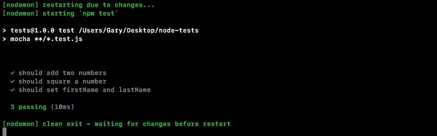

让我们删除`expect(user).toEqual(res);`。现在，我们想要检查`user`对象或`res`对象是否包含某些属性。我们将使用`expect`来检查`res`变量是否具有某些属性，使用`toInclude`：

```js
it('should set firstName and lastName', () => {
  var user = {location: 'Philadelphia', age: 25};
  var res = utils.setName(user, 'Andrew Mead');

  expect(res).toInclude({

 })
});
```

我们要查找的属性是`firstName`等于我们期望的值，即`Andrew`，以及`lastName`等于`Mead`：

```js
it('should set firstName and lastName', () => {
  var user = {location: 'Philadelphia', age: 25};
  var res = utils.setName(user, 'Andrew Mead');

  expect(res).toInclude({
    firstName: 'Andrew',
 lastName: 'Mead'
  })
});
```

这些是应该进行的断言，以验证`setName`是否按预期工作。如果我保存文件，`test`套件将重新运行，我们确实得到了通过的测试，如下所示：

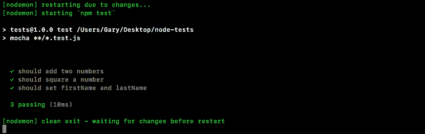

我们有三个，只用了 10 毫秒来运行。

有了这个，我们现在为我们的`test`套件创建了一个断言库。这太棒了，因为编写测试用例变得更加容易，整个章节的目标是使测试变得易于接近和简单。

在下一节中，我们将开始看如何测试更复杂的异步函数。

# 异步测试

在这一部分，您将学习如何测试异步函数。测试异步函数的过程与测试同步函数并没有太大不同，就像我们已经做过的那样，但是有一点不同，所以它有自己的部分。

# 使用 setTimeout 对象创建 asyncAdd 函数

首先，我们将使用`setTimeout`创建一个虚拟的`async`函数，以模拟`utils.js`中的延迟。就在我们创建`add`函数的下面，让我们创建一个叫做`asyncAdd`的函数。它基本上具有相同的特性，但它将使用`setTimeout`，并且它将有一个回调来模拟延迟。现在在现实世界中，这种延迟可能是数据库请求或 HTTP 请求。我们将在接下来的章节中处理这个问题。不过，现在让我们添加`module.exports.asyncAdd`：

```js
module.exports.add = (a, b) => a + b;

module.exports.asyncAdd = ()
```

这将需要三个参数，而不是`add`函数所需的两个参数，`a`，`b`和`callback`：

```js
module.exports.add = (a, b) => a + b;

module.exports.asyncAdd = (a, b, callback)
```

这就是使函数异步的原因。最终，一旦`setTimeout`结束，我们将调用回调函数并传递总和，无论是 1 加 3 得到 4，还是 5 加 9 得到 14。接下来，我们可以在箭头函数（`=>`）中放置箭头并打开和关闭大括号：

```js
module.exports.asyncAdd = (a, b, callback) => {

};
```

如上所述，在箭头函数（`=>`）中，我们将使用`setTimeout`来创建延迟。我们将传递一个回调和我们的`setTimeout`。在这种情况下，我们将使用 1 秒：

```js
module.exports.asyncAdd = (a, b, callback) => {
  setTimeout(() => {

  }, 1000);
};
```

默认情况下，如果我们的测试时间超过 2 秒，Mocha 将认为这不是我们想要的，它将失败。这就是为什么我们在这种情况下使用 1 秒的原因。在我们的回调中，我们可以调用实际的`callback`参数，使用和`b`的和`a`，就像这样：

```js
module.exports.asyncAdd = (a, b, callback) => {
  setTimeout(() => {
    callback(a + b);
  }, 1000);
};
```

现在我们有了一个`asyncAdd`函数，我们可以开始为它编写测试了。

# 为 asyncAdd 函数编写测试

在`utils.test`文件中，就在我们之前对`utils.add`的测试下面，我们将为`asyncAdd`添加一个新的测试。测试设置看起来非常相似。我们将调用`it`并传递一个字符串作为第一个参数，传递一个回调作为第二个参数。然后我们将添加我们的回调，就像这样：

```js
it('should async add two numbers', () => {

});
```

在回调中，我们可以开始调用`utils.asyncAdd`。我们将使用`utils.asyncAdd`调用它，并传入这三个参数。我们将使用`4`和`3`，这应该得到`7`。我们将提供回调函数，它应该被调用并传递该值，该值为`7`：

```js
it('should async add two numbers', () => {
  utils.asyncAdd(4, 3, () => {

  });
});
```

在回调参数中，我们期望像`sum`这样的东西返回：

```js
it('should async add two numbers', () => {
  utils.asyncAdd(4, 3, (sum) => {

  });
});
```

# 对 asyncAdd 函数进行断言

现在我们可以开始对`sum`变量进行一些断言，使用`expect`对象。我们可以将它传递给`expect`来进行我们的断言，这些断言并不是新的。这是我们已经做过的事情。我们将`expect` `sum`变量等于数字`7`，使用`toBe`，然后我们将检查它是否是一个数字，使用`toBeA`，在引号内，`number`：

```js
it('should async add two numbers', () => {
  utils.asyncAdd(4, 3, (sum) => {
    expect(sum).toBe(7).toBeA('number');
  });
});
```

显然，如果它等于`7`，那就意味着它是一个数字，但我们两者都使用只是为了模拟我们的期望调用内部链式调用的工作原理。

现在我们的断言已经就位，让我们保存文件并运行测试，看看会发生什么。我们将从终端运行它，`npm run test-watch`来启动我们的`nodemon`监视脚本：

```js
npm run test-watch
```

现在我们的测试将运行，测试确实通过了：

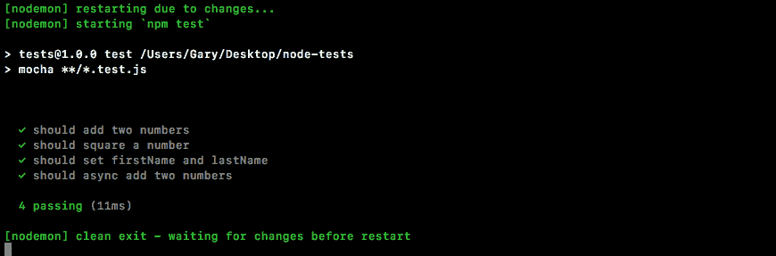

唯一的问题是它通过了错误的原因。如果我们将`7`更改为`10`并保存文件：

```js
it('should async add two numbers', () => {
  utils.asyncAdd(4, 3, (sum) => {
    expect(sum).toBe(10).toBeA('number');
  });
});
```

在这种情况下，测试仍然会通过。在这里，您可以看到我们有四个测试通过：

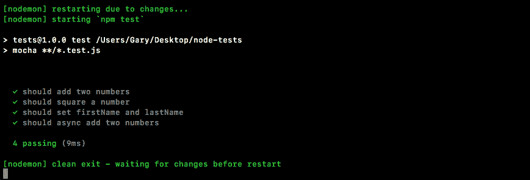

# 添加 done 参数

现在，这个测试通过的原因不是因为`utils.test.js`中的断言是有效的。它通过是因为我们有一个需要 1 秒的异步操作。这个函数将在`async`回调被触发之前返回。当我说函数返回时，我指的是`callback`函数，即`it`的第二个参数。

这是 Mocha 认为你的测试已经完成的时候。这意味着这些断言永远不会运行。Mocha 输出已经说我们的测试通过了，然后才会触发这个回调。我们需要做的是告诉 Mocha 这将是一个需要时间的异步测试。为了做到这一点，我们只需在传递给它的回调函数内提供一个参数。我们将称之为`done`：

```js
it('should async add two numbers', (done) => {
```

当我们指定了`done`参数时，Mocha 知道这意味着我们有一个异步测试，并且它不会完成处理此测试，直到调用`done`。这意味着我们可以在断言之后调用`done`：

```js
it('should async add two numbers', (done) => {
  utils.asyncAdd(4, 3, (sum) => {
    expect(sum).toBe(10).toBeA('number');
    done();
  });
});
```

有了这个，我们的测试现在将运行。函数在调用`async.Add`后将立即返回，但这没关系，因为我们已经指定了`done`。大约一秒钟后，我们的回调函数将触发。在`asyncAdd`回调函数内部，我们将进行断言。这次断言将很重要，因为我们有`done`，而且我们还没有调用它。在断言之后，我们调用 done，这告诉 Mocha 我们已经完成了测试。它可以继续处理结果，让我们知道它是通过还是失败。这将修复那个错误。

如果我保存文件在这个状态下，它将重新运行测试，我们将看到我们的测试应该`async.Add`两个数字确实失败。在终端中，让我们打开错误消息，我们预期的是 7 是 10：

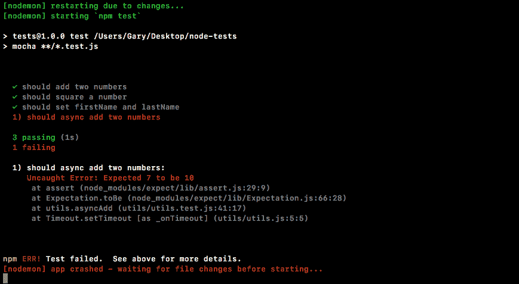

这正是我们第一次没有使用`done`时认为会发生的情况，但正如我们所看到的，当我们在测试中进行异步操作时，我们确实需要使用`done`。

现在我们可以将这个期望改回`7`，保存文件：

```js
it('should async add two numbers', (done) => {
  utils.asyncAdd(4, 3, (sum) => {
    expect(sum).toBe(7).toBeA('number');
    done();
  });
});
```

这一次事情应该按预期工作，1 秒延迟后运行此测试：

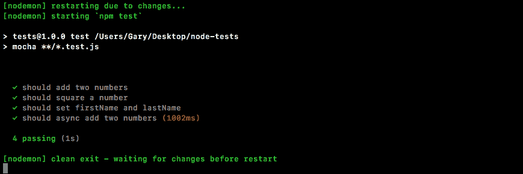

它不能立即报告，因为它必须等待 done 被调用。请注意，我们的总测试时间现在大约是一秒。我们可以看到我们有四个测试通过。Mocha 还在测试花费很长时间时警告我们，因为它认为这是不正常的。即使是 Node 中的任何东西，甚至是数据库或 HTTP 请求，也不应该花费接近一秒的时间，所以它基本上是在告诉我们，你的函数中可能有错误——它花费了非常非常长的时间来处理。但在我们的情况下，一秒的延迟显然是在`utils`中清楚地设置的，所以不需要担心那个警告。

有了这个，我们现在有了我们的第一个异步方法的测试。我们所要做的就是添加一个`done`作为参数，并在完成断言后调用它。

# `square`函数的异步测试

现在让我们创建`square`方法的异步版本，就像我们用同步方法一样。为了开始，我们将首先定义函数，然后我们将担心编写测试。

# 创建异步平方函数

在`utils`文件中，我们可以在`square`方法旁边开始创建一个名为`asyncSquare`的新方法：

```js
module.exports.square = (x) => x * x;

module.exports.asyncSquare
```

它将需要两个参数：我们称之为`x`的原始参数，以及在 1 秒延迟后将被调用的`callback`函数：

```js
module.exports.square = (x) => x * x;

module.exports.asyncSquare = (x, callback) => {

};
```

然后我们可以完成箭头函数(`=>`)，然后开始编写`asyncSquare`的主体。它看起来与`asyncAdd`很相似。我们将调用`setTimeout`传递一个回调和一个延迟。在这种情况下，延迟将是相同的；我们将使用 1 秒：

```js
module.exports.square = (x) => x * x;

module.exports.asyncSquare = (x, callback) => {
  setTimeout(() => {

  }, 1000);
};
```

现在我们可以实际调用回调。这将触发传入的`callback`函数，并且我们将传入值`x`乘以`x`，这将正确地平方替代`x`的数字：

```js
module.exports.square = (x) => x * x;

module.exports.asyncSquare = (x, callback) => {
  setTimeout(() => {
    callback(x * x);
  }, 1000);
};
```

# 编写`asyncSquare`的测试

现在在`test`文件中，事情确实通过了，但我们还没有为`asyncSquare`函数添加测试，所以让我们这样做。在`utils.test`文件中，您需要做的下一件事是调用`it`。在测试`asyncAdd`函数旁边，让我们调用`it`来为这个`asyncSquare`函数创建一个新的测试：

```js
it('should square a number', () => {
  var res = utils.square(3);

  expect(res).toBe(9).toBeA('number');
});

it('should async square a number')
```

接下来，我们将提供回调函数，当测试实际执行时将调用该函数。由于我们正在测试一个`async`函数，我们将在回调函数中放置`done`，如下所示：

```js
it('should async square a number', (done) => {

});
```

这将告诉 Mocha 等到调用`done`后才决定测试是否通过。接下来，我们现在可以调用`utils.asyncSquare`，传入我们选择的一个数字。我们将使用`5`。接下来，我们可以传入一个回调函数：

```js
it('should async square a number', (done) => {
  utils.asyncSquare(5, () => {

  })
});
```

这将得到最终结果。在箭头函数（`=>`）中，我们将创建一个变量来存储该结果：

```js
 utils.asyncSquare(5, (res) => {

  });
```

现在我们有了这个，我们可以开始进行断言。

# 为`asyncSquare`函数进行断言

断言将使用`expect`库完成。我们将对`res`变量进行一些断言。我们将使用`toBe`断言它等于数字`25`，即`5`乘以`5`。我们还将使用`toBeA`来断言关于值类型的一些内容：

```js
it('should async square a number', (done) => {
  utils.asyncSquare(5, (res) => {
    expect(res).toBe(25).toBeA('number');
  });
});
```

在这种情况下，我们希望确保`square`确实是一个数字，而不是布尔值、字符串或对象。有了这个，我们确实需要调用`done`，然后保存文件：

```js
it('should async square a number', (done) => {
  utils.asyncSquare(5, (res) => {
    expect(res).toBe(25).toBeA('number');
    done();
  });
});
```

请记住，如果您不调用`done`，您的测试将永远不会完成。您可能会发现偶尔会在终端内出现这样的错误：

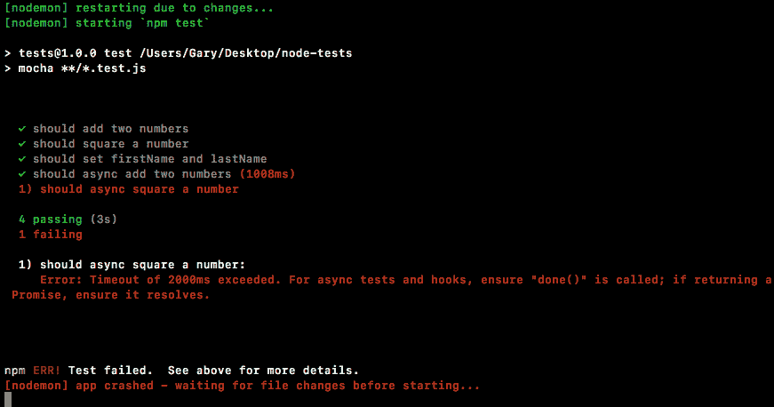

您收到了一个错误超时，超过了 2,000 毫秒。这是 Mocha 中断您的测试。如果您看到这个，通常意味着两件事：

+   您有一个`async`函数，实际上从未调用回调函数，因此您对`done`的调用从未被触发。

+   你从未调用过`done`。

如果您看到此消息，通常意味着`async`函数中某处有小错误。要克服这一点，要么通过确保调用回调来修复方法（`utils.js`）中的问题，要么通过调用`done`来修复测试（`utils.test.js`）中的问题，然后保存文件，您现在应该看到所有测试都通过了。

在我们的案例中，有 5 个测试通过，用了 2 秒钟。这太棒了：

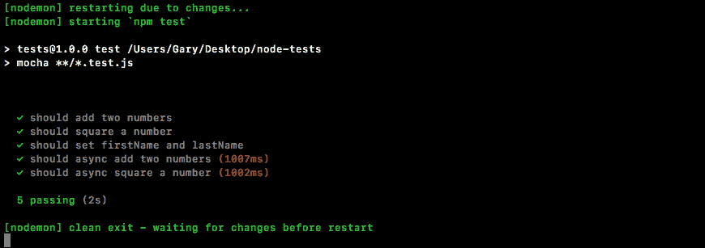

现在我们有了测试同步函数和异步函数的方法。这将使测试更加灵活。它将让我们测试应用程序中的几乎所有内容。

# 总结

在本章中，我们研究了同步和异步函数的测试。我们研究了基本测试。我们探索了测试框架 Mocha。然后，我们研究了在测试 Node 模块中使用断言库。

在下一章中，我们将看看如何测试我们的 Express 应用程序。
