# 第十一章：测试 Node 应用程序-第二部分

在本章中，我们将继续测试 Node 应用程序的旅程。在上一章中，我们看了基本的测试框架，并且处理了同步和异步的 Node 应用程序。在本章中，我们将继续测试 Express 应用程序，然后我们将研究一种方法来更好地组织我们的测试结果输出，最后但并非最不重要的是，我们将进入一些高级的测试 Node 应用程序的方法。

具体来说，我们将研究以下主题：

+   为 Express 应用程序设置测试

+   测试 Express 应用程序

+   使用`describe()`组织测试

+   测试间谍

# 测试 Express 应用程序

在这一部分，我们将设置一个 Express 应用程序，然后，我们将看看如何测试它，以验证从我们的路由返回的数据是否是用户应该得到的。现在，在我们做任何事情之前，我们需要创建一个 Express 服务器，这就是本节的目标。

# 为 Express 应用程序设置测试

我们将从安装 Express 开始。我们将使用`npm i`，这是安装的缩写，来安装 Express。记住，你总是可以用`i`替换`install`。我们将获取最新版本`@4.16.2`。现在，我们将使用`save`标志，而不是我们在上一章中用于测试的`save dev`标志：

```js
npm i express@4.16.2 --save
```

这个命令将安装 Express 作为常规依赖项，这正是我们想要的：

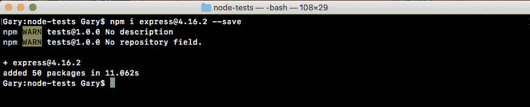

我们在部署到生产环境时需要 Express，无论是 Heroku 还是其他一些服务。

回到应用程序内部，如果我们打开`package.json`，我们可以看到我们之前见过的依赖项，以及对我们来说是新的`devDependencies`：

```js
  "devDependencies": {
    "expect": "¹.20.2",
    "mocha": "³.0.0"
  },
  "dependencies": {
    "express": "⁴.14.0"
  }
}
```

这就是我们如何分解不同的依赖关系。从这里开始，我们将在项目的根目录下创建一个`server`文件夹，我们可以在其中存储服务器示例以及测试文件。我们将创建一个名为`server`的目录。然后在`server`内，我们将创建一个名为`server.js`的文件。

`server.js`文件将包含启动服务器的实际代码。我们将定义我们的路由，我们将监听一个端口，所有这些都将在这里发生。这就是我们在以前的服务器章节中所做的。在`server.js`中，我们将添加`const express`，并将其等于`require('express')`的返回结果：

```js
const express = require('express');
```

接下来，我们可以通过创建一个名为`app`的变量并将其设置为对`express`的调用来制作我们的应用程序：

```js
const express = require('express');

var app = express();
```

然后我们可以开始配置我们的路由。让我们为本节设置一个`app.get`：

```js
const express = require('express');

var app = express();

app.get
```

这将设置一个 HTTP GET 处理程序。URL 将仅为`/`（正斜杠），即网站的根目录。当有人请求时，我们暂时将指定一个非常简单的字符串作为返回结果。我们像对所有的`express`路由一样获得请求和响应对象。要响应，我们将调用`res.send`，发送字符串`Hello World!`作为返回结果：

```js
app.get('/', (req, res) => {
  res.send('Hello world!');
});
```

在这个过程的最后一步将是使用`app.listen`监听一个端口。我们将通过将其作为第一个且唯一的参数传递来绑定到端口`3000`：

```js
app.get('/', (req, res) => {
  res.send('Hello world!');
});

app.listen(3000);
```

有了这个，我们现在完成了。我们有了一个基本的 Express 服务器。在我们继续探索如何测试这些路由之前，让我们启动它。我们将使用以下命令来做到这一点：

```js
node server/server.js
```

当我们运行这个时，我们不会得到任何日志，因为我们还没有为服务器启动添加回调函数，但它确实已经启动了。

如果我们转到 Chrome 并访问`localhost:3000`，我们会看到 Hello world!打印到屏幕上：

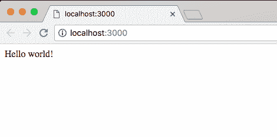

现在，我们准备好开始测试我们的 Express 应用程序了。

# 使用 SuperTest 测试 Express 应用程序

现在，我们将学习一种简单而直接的方法来测试我们的 Express 应用程序。这意味着我们可以验证当我们向`/`URL 发出 HTTP GET 请求时，我们会得到`Hello world!`的响应。

传统上，测试 HTTP 应用程序一直是最难测试的事情之一。我们需要启动一个服务器，就像我们在上一节中所做的那样。然后我们需要一些代码来实际向适当的 URL 发出请求。然后我们必须浏览响应，获取我们想要的内容，并对其进行断言，无论是头部、状态码、正文还是其他任何内容。这是一个真正的负担。这不是本节的目标。我们的目标是使测试变得简单和易于接近，所以我们将使用一个名为 SuperTest 的库来测试我们的 Express 应用程序。

SuperTest 是由最初创建 Express 的开发人员创建的。它内置支持 Express，使得测试 Express 应用程序变得非常简单。

# SuperTest 文档

为了开始，让我们打开文档页面，这样你就知道它在哪里，如果你想查看它提供的任何其他功能。如果你谷歌`supertest`，它应该是第一个结果：

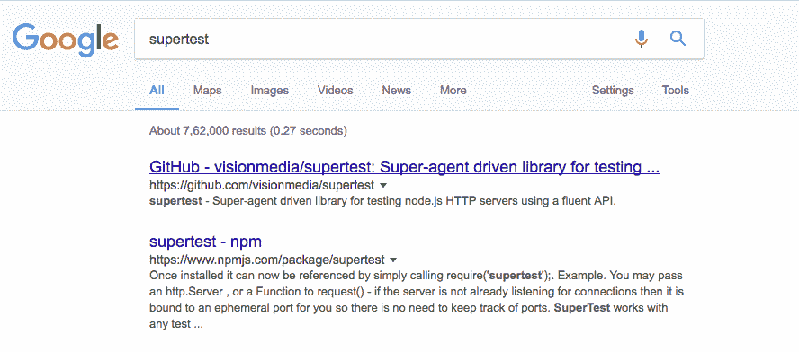

这是 VisionMedia 的存储库，存储库本身称为 SuperTest。让我们切换到存储库页面，我们可以快速看一下它提供了什么。在这个页面上，我们可以找到安装说明和介绍内容。我们不真的需要那个。让我们快速看一个例子：

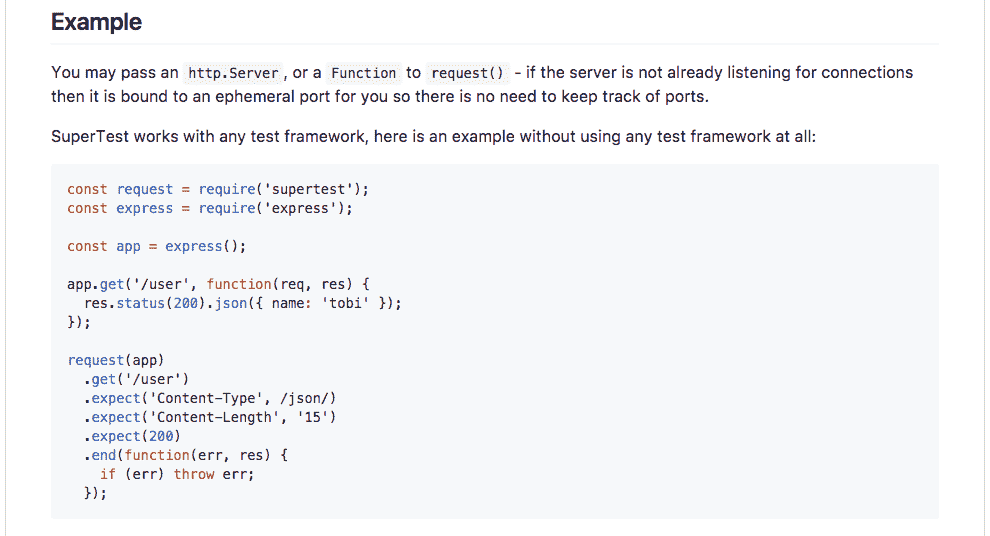

如前面的截图所示，我们可以看到 SuperTest 的工作示例。我们创建一个 Express 应用程序，就像我们通常做的那样，并定义一个路由。然后我们调用`request`方法，这是由 SuperTest 提供的，传入我们的 Express 应用程序。我们说我们要对`/` URL 进行`get`请求。然后我们开始进行断言。无需手动检查头部、状态码或正文。它对所有这些都有内置的断言。

# 为 Express 应用程序创建测试

为了开始，我们将通过在终端中运行 npm install 来在我们的应用程序中安装 SuperTest。我们的 Node 服务器仍在运行。让我们关闭它，然后安装该模块。

我们可以使用`npm i`，模块名称是`supertest`，我们将获取最新版本`@2.0.0`。这是一个专门用于测试的模块，所以我们将使用`save`来安装它。我们将使用`save-dev`将其添加到`package.json`中的`devDependencies`中：

```js
npm i supertest@3.0.0 --save-dev
```

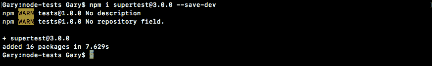

安装了 SuperTest 后，我们现在准备在`server.test.js`文件上工作。因为它还不存在于`server`文件夹中，所以我们可以创建它。它将与`server.js`并排放置：


现在我们有了`server.test.js`，我们可以开始设置我们的第一个测试。首先，我们将创建一个名为 request 的常量，并将其设置为从`supertest`中导入的返回结果：

```js
const request = require('supertest');
```

这是我们将用来测试我们的 Express 应用程序的主要方法。从这里，我们可以加载 Express 应用程序。现在在`server.js`中，我们没有导出导出应用程序的导出，所以我们需要添加。我将在`app.listen`语句旁边添加，通过创建`module.exports.app`并将其设置为`app`变量：

```js
app.listen(3000);
module.exports.app = app;
```

现在我们有一个名为 app 的导出，我们可以从其他文件中访问。当我们从终端启动时，`server.js`仍将按预期运行，而不是在测试模式下。我们只是添加了一个导出，所以如果有人需要它，他们可以访问该应用程序。在`server.test.js`中，我们将创建一个变量来导入这个。我们将调用变量`app`。然后我们将使用`require('./server.js')`或者只是`server`来进行导入。然后我们将访问`.app`属性：

```js
const request = require('supertest');

var app = require('./server').app;
```

有了这个，我们现在拥有了编写我们的第一个测试所需的一切。

# 为 Express 应用程序编写测试

我们将编写的第一个测试是验证当我们对`/` URL 进行 HTTP GET 请求时，我们会得到`Hello world!`。为此，我们将调用`it`，就像我们在上一章中为其他测试所做的那样。我们仍然使用`mocha`作为实际的测试框架。我们使用 SuperTest 来填补空白：

```js
var app = require('./server').app;

it('should return hello world response')
```

现在我们将设置函数如下：

```js
it('should return hello world response', (done) => {

});
```

这将是一个异步调用，所以我正在提供`done`作为参数，让`mocha`知道在确定测试是否通过或失败之前等待。从这里，我们现在可以对`request`进行第一次调用。要使用 SuperTest，我们调用`request`并传入实际的 Express 应用程序。在这种情况下，我们传入`app`变量：

```js
it('should return hello world response', (done) => {
  request(app)
});
```

然后我们可以开始链接所有我们需要的方法来发出请求，做出断言，最后结束。首先，您将使用一个方法来实际发出请求，无论是`get`，`put`，`delete`还是`post`。

现在，我们将发出一个`get`请求，所以我们将使用`.get`。`.get`请求需要 URL。因此，我们将提供`/`（斜杠），就像我们在`server.js`中所做的那样：

```js
it('should return hello world response', (done) => {
  request(app)
    .get('/')
});
```

接下来，我们可以做一些断言。要进行断言，我们将使用`.expect`。现在`.expect`是其中一种方法，根据您传递给它的内容而执行不同的操作。在我们的情况下，我们将传递一个字符串。让我们传递一个字符串，这将是我们断言的响应主体，`Hello world!`：

```js
it('should return hello world response', (done) => {
  request(app)
    .get('/')
    .expect('Hello world!')
});
```

现在我们已经完成并做出了断言，我们可以结束了。要在 SuperTest 中结束一个请求，我们所做的就是调用`.end`并传入`done`作为回调：

```js
it('should return hello world response', (done) => {
  request(app)
    .get('/')
    .expect('Hello world!')
    .end(done);
});
```

这一切都是在幕后处理的，所以您不需要在以后手动调用`done`。所有这些都由 SuperTest 处理。通过这四行代码（在上一段代码中），我们已经成功测试了我们的第一个 API 请求。

# 测试我们的第一个 API 请求

我们将在终端中通过运行我们的`test-watch`脚本来开始：

```js
npm run test-watch
```

测试脚本将开始运行，如图所示，我们有一些测试：

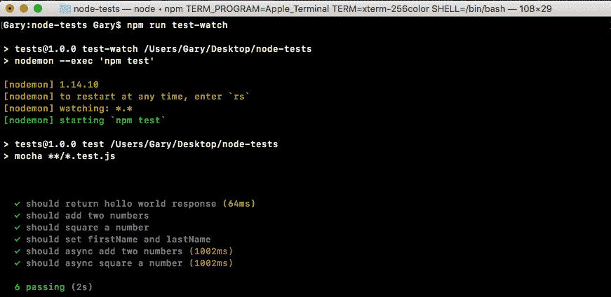

我们的测试`应该返回 hello world 响应`显示在上一张截图中。

现在我们可以进一步进行其他关于返回数据的断言。例如，我们可以在`server.test.js`中的`.get`请求之后使用`expect`来对状态码进行断言。默认情况下，我们所有的 Express 调用都将返回`200`状态码，这意味着事情进行得很顺利：

```js
it('should return hello world response', (done) => {
  request(app)
    .get('/')
    .expect(200)
    .expect('Hello world!')
    .end(done);
});
```

如果我们保存文件，测试仍然通过：

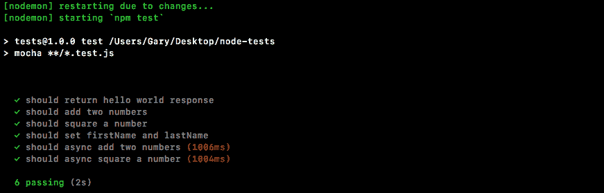

现在让我们对请求进行一些更改，使这些测试失败。首先，在`server.js`中，我们将在字符串中添加几个字符（`ww`），然后保存文件：

```js
app.get('/', (req, res) => {
  res.send('Hello wwworld!');
});

app.listen(3000);
module.exports.app = app;
```

这应该导致 SuperTest 测试失败，确实如此：

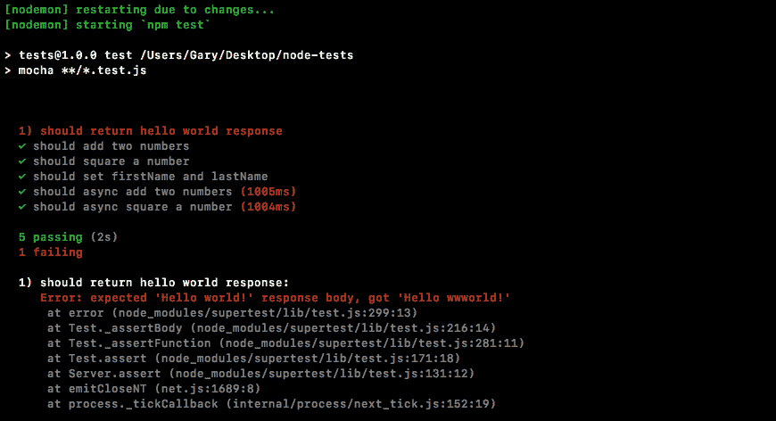

如上一张截图所示，我们得到了一条消息，`expected 'Hello world!' response body, but we got 'Hello wwworld!'`。这让我们知道发生了什么。回到`server.js`中，我们可以删除那些额外的字符（`ww`）并尝试其他方法。

# 设置自定义状态

现在我们还没有讨论如何为我们的响应设置自定义状态，但我们可以使用一个方法`.status`来实现。让我们在`server.js`中添加`.status`，在`send('Hello world!')`之前链接它，就像这样：

```js
app.get('/', (req, res) => {
  res.status().send('Hello world!');
});
```

然后，我们可以传入数字状态码。例如，我们可以使用`404`表示页面未找到：

```js
app.get('/', (req, res) => {
  res.status(404).send('Hello world!');
});
```

如果这次保存文件，主体将匹配，但在终端内我们可以看到我们现在有一个不同的错误：

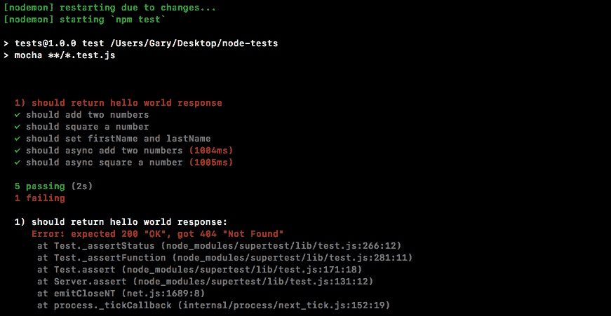

我们期望得到一个`200`，但我们得到了一个`404`。使用 SuperTest，我们可以对我们的应用程序进行各种断言。现在对于不同类型的响应也是如此。例如，我们可以创建一个对象作为响应。让我们创建一个简单的对象，然后创建一个名为`error`的属性。然后我们将`error`设置为一个`404`的通用错误消息，比如`Page not found`：

```js
app.get('/', (req, res) => {
  res.status(404).send({
    error: 'Page not found.'
  });
});
```

现在，我们发送了一个 JSON body，但目前我们没有对这个 body 做任何断言，所以测试将失败：

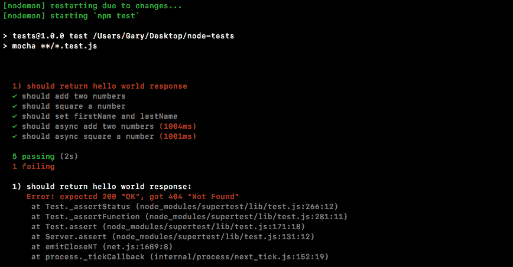

我们可以更新我们的测试来`expect` JSON 返回。为了完成这个目标，我们只需要在`server.test`中改变我们传递给`expect`的内容。我们不再传递一个字符串，而是传递一个对象：

```js
it('should return hello world response', (done) => {
  request(app)
    .get('/')
    .expect(200)
    .expect({

    })
    .end(done);
});
```

现在我们可以精确匹配这个对象。在对象内部，我们将`expect`错误属性存在，并且它等于我们在`server.js`中的内容：

```js
    .expect({
      error: 'Page not found.'
    })
```

然后，我们将`.expect`调用从`200`更改为`404`：

```js
    .expect(404)
    .expect({
    error: 'Page not found.'
    })
```

有了这个，我们的断言现在与我们在 Express 应用程序中定义的实际端点相匹配。让我们保存文件，看看所有的测试是否通过：

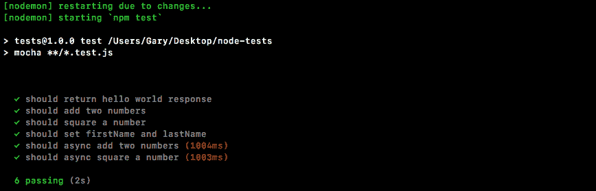

如前面的截图所示，我们可以看到它确实通过了。`Should return hello world`响应通过了。完成大约`41ms`（毫秒），这完全没问题。

# 为 SuperTest 添加灵活性

大多数内置断言确实可以完成大部分工作。有时候你想要更灵活一点。例如，在上一章中，我们学习了所有那些很酷的断言，expect 可以做到。我们可以使用`toInclude`，`toExclude`，所有这些都非常方便，失去它真是太可惜了。幸运的是，SuperTest 非常灵活。我们可以提供一个函数，而不是将一个对象传递给 expect，或者一个状态码的数字，这个函数将被 SuperTest 调用，并且会传递响应：

```js
    .expect((res) => {

    })
```

这意味着我们可以访问头部，body，我们想要从 HTTP 响应中访问的任何内容——它都可以在函数中使用。我们可以通过常规的 expect 断言库进行断言，就像我们在上一章中所做的那样。

让我们加载它，创建一个名为`expect`的常量，并将其设置为 require `expect`：

```js
const express = require('supertest');
const express = require('express');
```

现在在我们看它将如何工作之前，我们将在`server.js`中做一个改变。在这里，我们将在`.status`对象上添加第二个属性。我们将添加一个`error`，然后添加其他内容。让我们使用`name`，将其设置为应用程序名称，`Todo App v1.0`：

```js
app.get('/', (req, res) => {
  res.status(404).send({
    error: 'Page not found.',
    name: 'Todo App v1.0'
  });
});
```

现在我们有了这个，我们可以看看如何在我们的测试文件中使用这些自定义断言。在`.expect`对象中，我们将可以访问响应，在响应中有一个 body 属性。这将是一个具有键值对的 JavaScript 对象，这意味着我们期望有一个`error`属性和一个`name`属性，这是我们在`server.js`中设置的。

回到我们的测试文件，我们可以使用`expect`来创建自定义断言。我会对 body，`res.body`做一些`expect`。现在我们可以使用任何我们喜欢的断言，不仅仅是等于断言，这是 SuperTest 支持的唯一一种。让我们使用`toInclude`断言：

```js
    .expect((res) => {
      expect(res.body).toInclude({

      });
    })
```

记住，`toInclude`让你指定对象上的属性的一个子集。只要它有这些属性就可以。它并不要求它有额外的属性。在我们的情况下，在`toInclude`内部，我们只需指定`error`消息，不需要指定 name 是否存在。我们想要检查`error: Page not found`，格式与我们在`server.js`中的格式完全一样：

```js
    .expect((res) => {
      expect(res.body).toInclude({
        error: 'Page not found.'
      });
    })
```

现在当我们保存文件回到终端时，一切都重新启动了，我的所有测试都通过了：

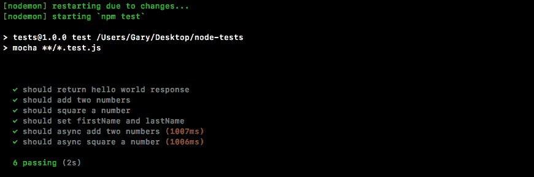

使用 SuperTest 和 expect 的组合，我们可以为我们的 HTTP 端点创建超级灵活的测试套件。有了这个，我们将创建另一个`express`路由，并定义一个测试，确保它按预期工作。

# 创建一个 express 路由

这个 express 路由将有两个方面，一个是`server.js`中的实际设置，另一个是测试。我们可以从`server.js`开始。在这里，我们将创建一个新的路由。首先，让我们添加一些注释，明确指定我们要做什么。这将是一个 HTTP `GET`路由。路由本身将是`/users`，我们可以假设这会返回一个用户数组：

```js
app.get('/', (req, res) => {
  res.status(404).send({
    error: 'Page not found.',
    name: 'Todo App v1.0'
  });
});

  // GET /users
```

我们可以通过`send`方法返回一个数组，就像我们在先前的代码中对对象所做的那样。现在这个数组将是一个对象数组，其中每个对象都是一个用户。现在，我们想给用户一个`name`属性和一个`age`属性：

```js
  // GET /users
  // Give users a name prop and age prop
```

然后我们将为这个示例创建两到三个用户。一旦我们完成了这个，我们将负责编写一个测试，断言它按预期工作。这将发生在`server.test.js`中。在`server.test.js`中，我们将创建一个新的测试：

```js
it('should return hello world response', (done) => {
  request(app)
    .get('/')
    .expect(404)
    .expect((res) => {
      expect(res.body).toInclude({
        error: 'Page not found.'
      });
    })
    .end(done);
});

// Make a new test
```

这个测试将断言一些事情。首先，我们断言返回的状态码是`200`，我们想要断言的是数组中的内容，我们将使用`toInclude`来做到这一点：

```js
// Make a new test
// assert 200
// Assert that you exist in users array
```

让我们首先定义端点。在`server.js`中，跟随注释，我们将调用`app.get`，这样我们就可以为我们的应用程序注册全新的 HTTP 端点。这个将会在`/users`处：

```js
app.get('/users')
// GET /users
// Give users a name prop and age prop
```

接下来，我们将指定接受请求和响应的回调函数：

```js
app.get('/users', (req, res) => {

});
// GET /users
// Give users a name prop and age prop
```

这将让我们实际响应请求，这里的目标只是响应一个数组。在这种情况下，我将调用`response.send`，传入一个对象数组：

```js
app.get('/users', (req, res) => {
  res.send([{

    }])
  }); 
```

第一个对象将是`name`。我们将把`name`设置为`Mike`，并将他的`age`设置为`27`：

```js
app.get('/users', (req, res) => {
  res.send([{
    name: 'Mike',
    age: 27
  }])  
});
```

然后我可以添加另一个对象。让我们将第二个对象添加到数组中，名称设置为`Andrew`，年龄设置为`25`：

```js
app.get('/users', (req, res) => {
  res.send([{
    name: 'Mike',
    age: 27
  }, {
    name: 'Andrew',
    age: 25
  }])    
});
```

在最后一个中，我们将把名称设置为`Jen`，年龄设置为`26`：

```js
app.get('/users', (req, res) => {
  res.send([{
    name: 'Mike',
    age: 27
  }, {
    name: 'Andrew',
    age: 25
  }, {
    name: 'Jen',
    age: 26
  }])    
});
```

现在我们的端点已经完成，我们可以保存`server.js`，进入`server.test.js`，并开始担心实际创建我们的测试用例。

# 编写 express 路由的测试

在`server.test.js`中，跟随注释，我们需要首先调用`it`来开始。`it`是创建新测试的唯一方法：

```js
// Make a new test
// assert 200
// Assert that you exist in users array
it('should return my user object')
```

然后我们将指定回调函数。它将传递`done`参数，因为这是一个异步的：

```js
// Make a new test
// assert 200
// Assert that you exist in users array
it('should return my user object', (done) => {

});
```

在测试用例中开始时，我们将调用请求，就像我们在 hello world 响应中所做的那样，传入 Express 应用程序：

```js
it('should return my user object', (done) => {
  request(app)
});
```

现在我们可以设置实际的调用。在这种情况下，我们只是在以下 URL 进行调用，`/users`：

```js
it('should return my user object', (done) => {
  request(app)
    .get('/users')
});
```

接下来，我们可以开始做出断言，首先我们要断言的是状态码为`200`，这是 Express 使用的默认状态码。我们可以通过调用`.expect`并传入状态码作为数字来断言。在这种情况下，我们将传入`200`：

```js
it('should return my user object', (done) => {
  request(app)
    .get('/users')
    .expect(200)
});
```

之后，我们将使用自定义的`expect`断言。这意味着我们将调用`expect`，传入一个函数，并在`it`内部使用`toInclude`来断言你存在于那个用户数组中。我们将调用`expect`方法，传入函数，该函数将使用响应调用：

```js
it('should return my user object', (done) => {
  request(app)
    .get('/users')
    .expect(200)
    .expect((res) => {

    })
});
```

这将让我们对响应做出一些断言。我们实际上将使用`expect`进行断言。我们将期望响应体的某些内容。在这种情况下，我们将检查它是否包含我们的用户对象：

```js
it('should return my user object', (done) => {
  request(app)
    .get('/users')
    .expect(200)
    .expect((res) => {
      expect(res.body).toInclude()

    })
});
```

现在记住，你可以在数组和对象上都调用`toInclude`。我们所做的就是传入我们想要确认在数组中的项目。在我们的情况下，它是一个对象，其中`name`属性等于`Andrew`，`age`属性等于`25`，这是我们在`server.js`中使用的内容：

```js
    expect(res.body).toInclude({
      name: 'Andrew',
      age: 25
    })
```

现在我们已经有了自定义的`expect`调用，我们可以在最底部调用`.end`。这将结束请求，我们可以将`done`作为回调传入，这样如果有任何错误发生，它就可以正确地触发：

```js
    expect(res.body).toInclude({
      name: 'Andrew',
      age: 25
    })
  })
  .end(done);
```

有了这个，我们就可以开始了。我们可以保存文件。

在终端中，我们可以看到测试确实正在重新运行：


我们有一个测试，如前面的截图所示，`should return my user object`。它通过了。

现在我们可以确认，我们不会因为弄乱数据而疯狂地测试错误的东西。我们现在将在`server.js`中的`Andrew`后面添加一个小写的`a`，如下所示：

```js
app.get('/users', (req, res) => {
  res.send([{
    name: 'Mike',
    age: 27
  }, {
    name: 'Aandrew',
    age: 25
  }, {
    name: 'Jen',
    age: 26
  }])    
});
```

测试将会失败。我们可以在终端中看到：

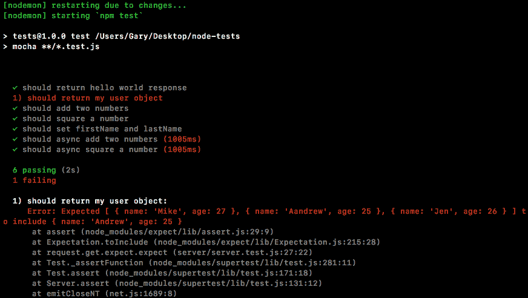

我们已经为我们的 Express 应用程序进行了测试。现在我们将讨论另一种测试 Node 代码的方法。

# 使用 describe()组织测试

在本节中，我们将学习如何使用`describe()`。`describe`是一个注入到我们的测试文件中的函数，就像`it`函数一样。它来自于`mocha`，真的很棒。基本上，它让我们将测试分组在一起。这样可以更容易地扫描测试输出。如果我们在终端中运行`npm test`命令，我们会得到我们的测试：

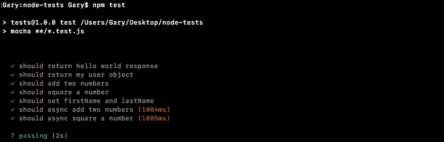

我们有七个测试，目前它们都被分组在一起。在`utils`文件中查找测试非常困难，而且要找到`asyncAdd`的测试几乎是不可能的，除非扫描所有文本。我们将调用`describe()`。这将让我们对测试进行分组。我们可以给该组起一个名字。这将使我们的测试输出更易读。

在`utils.test.js`文件中，在`utils`常量右边，我们将调用`describe()`：

```js
const expect = require('expect');

const utils = require('./utils');

describe()
```

描述对象接受两个参数，就像`it`一样。第一个是名称，另一个是回调函数。我们将使用`Utils`。这将是包含`utils.test`文件中所有测试的`describe`块。然后我们提供函数。这是回调函数：

```js
describe('Utils', () => {

});
```

在回调函数中，我们将定义测试。在回调函数中定义的任何测试都将成为`utils`块的一部分。这意味着我们可以拿出现有的测试，剪切它们出来，粘贴到那里，我们将在文件中有一个名为`utils`的`describe`块，其中包含了所有的测试。所以，让我们就这样做吧。

我们将获取所有的测试，排除那些只是在各种`expect`功能中玩耍的测试。然后我们将把它们粘贴到回调函数中。结果代码将如下所示：

```js
describe('Utils', () => {
  it('should add two numbers', () => {
    var res = utils.add(33, 11);

    expect(res).toBe(44).toBeA('number');
  });

  it('should async add two numbers', (done) => {
    utils.asyncAdd(4, 3, (sum) => {
      expect(sum).toBe(7).toBeA('number');
      done();
    });
  });

  it('should square a number', () => {
    var res = utils.square(3);

    expect(res).toBe(9).toBeA('number');
  });

  it('should async square a number', (done) => {
    utils.asyncSquare(5, (res) => {
      expect(res).toBe(25).toBeA('number');
      done();
    });
  });
});
```

这些分别是`add`、`asyncAdd`、`square`和`asyncSquare`的四个测试。现在我们将保存文件，然后可以从终端启动`test-watch`脚本并检查输出：

```js
npm run test-watch
```

脚本将启动并运行我们的测试，如下截图所示，我们将得到不同的输出：

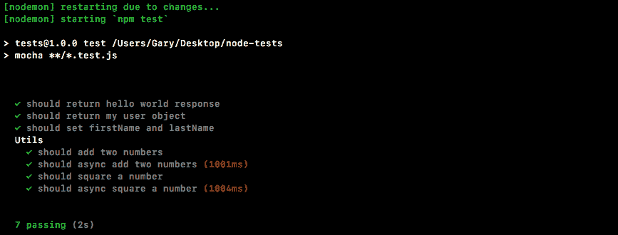

我们有一个`Utils`部分，在`Utils`下，我们有该`describe`块中的所有测试。这样可以使阅读和扫描测试变得更加容易。我们也可以对各个方法做同样的事情。

# 为单独的方法添加 describe()

现在，在`utils.test.js`的情况下（参考前面的截图），我们每个方法有一个测试，但是如果你有很多测试针对一个复杂的方法，最好将其包装在自己的`describe`块中。我们可以以任何我们喜欢的方式嵌套`describe`块和测试。例如，在`utils`的`describe`语句之后，我们可以再次调用`describe`。我们可以传递一个新的描述。让我们使用`#`（井号）后跟`add`：

```js
describe('Utils', () => {

  describe('#add')
```

`#`（井号）后跟方法名是为特定方法添加`describe`块的常见语法。然后我们可以提供回调函数：

```js
describe('Utils', () => {

  describe('#add', () => {

  })
```

然后，我们可以将任何要添加到该组的测试剪切出来，粘贴进去：

```js
describe('Utils', () => {

  describe('#add', () => {
    it('should add two numbers', () => {
      var res = utils.add(33, 11);

      expect(res).toBe(44).toBeA('number');
    });
  });
```

然后我保存文件。这将重新运行测试套件，现在我们有更易于扫描的测试输出：

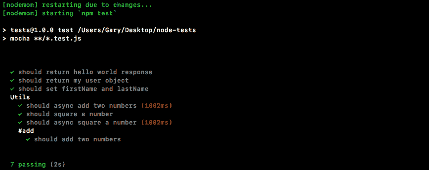

很容易找到`utils`添加方法的测试，因为它们都有清晰的标签。你可以根据需要进行任意的嵌套。关于在测试中使用`describe`的频率并没有硬性规定，真的取决于你要根据方法或文件的测试数量来决定使用`describe`的次数。

在这种情况下，文件中有相当多的测试，因此添加`utils`块是有意义的。我只是想向你展示你可以嵌套它们，所以我也为`add`添加了它。如果我写这段代码，我可能不会添加第二层测试，但如果一个方法有多个测试，我肯定会添加第二个`describe`块。

# 为`server.test.js`文件添加路由`describe`块

现在，让我们在`server.test`文件中创建一些`describe`块。我们将创建一个名为`Server`的路由`describe`块。然后我们将为路由 URL 和`/users`分别创建`describe`块。我们将有`GET/`，其中将包含测试用例`some test case`。然后在`//`旁边，我们将有`GET /users`，它将有自己的测试用例`some test case`，如旁边的注释所解释的那样：

```js
const request = require('supertest');
const expect = require('expect');

var app = require('./server').app;

// Server
  // GET /
    // some test case
  // GET / user
    // some test case
```

现在测试用例显然已经定义好了。我们只需要调用`describe`三次来生成之前解释过的结构。

我们将在注释部分之后调用`describe()`一次，这个描述将是关于路由的，所以我们将称之为`Server`：

```js
// Server
  // GET /
    // some test case
  // GET / user
    // some test case

  describe('Server')
```

这将包含我们`server`文件中的所有测试。接下来我们可以添加回调函数，然后继续：

```js
describe('Server', () => {

})
```

接下来，我们将再次调用`describe`。这次我们将为测试`GET /`路由创建一个`describe`块，并添加回调函数：

```js
describe('Server', () => {

  describe('GET /', () => {

  })

})
```

现在我们可以简单地将我们的测试剪切出来，然后粘贴到`describe`回调函数中。最终的代码将如下所示：

```js
describe('Server', () => {

  describe('GET /', () => {
    it('should return hello world response', (done) => {
      request(app)
        .get('/')
        .expect(404)
        .expect((res) => {
          expect(res.body).toInclude({
            error: 'Page not found.'
          });
        })
        .end(done);
    });
  });

})
```

接下来，我们将第三次调用`describe`。我们将调用`describe`并传入`GET /users`作为描述：

```js
  describe('GET /users')
```

我们将像往常一样拥有我们的回调函数，然后我们可以直接复制并粘贴我们的测试代码：

```js
  describe('GET /users'), () => {
    it('should return my user object', (done) => {
      request(app)
        .get('/users')
        .expect(200)
        .expect((res) => {
          expect(res.body).toInclude({
            name: 'Andrew',
            age: 25
          });
        })
        .end(done);
    });
  });
```

有了这个设置，我们现在完成了。我们的测试结构更加清晰，当我们保存文件重新运行测试套件时，我们将能够在终端中看到结果：

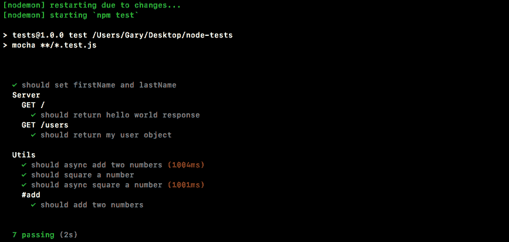

如前面的代码所示，我们有一个更易于扫描的测试套件。我们可以立即看到我们的服务器测试。我们可以为每个功能创建测试组。由于我们现在只有静态数据，我们实际上不需要每个功能超过一个测试。但在未来，我们将为每个 HTTP 请求有多个测试，因此及早创建`describe`块是个好习惯。就是这样了！

# 测试间谍

在这一部分，也是测试章节的最后一部分，我们将学习一些相当高级的测试技术。我们将在构建真实应用时使用这些技术，但现在让我们从一个例子开始。我们将在接下来的内容中学习相关词汇。

暂时，我们将关闭所有当前的文件，并在项目的根目录下创建一个新的目录。我们将创建一个名为`spies`的新文件夹。我们将马上讨论`spies`到底是什么，以及它们与测试的关系。在`spies`文件夹中，我们将创建两个文件：`app.js`（这是我们将要测试的文件）和另一个名为`db.js`的文件。在我们的示例中，我们可以假设`db.js`是一个包含各种方法用于保存和读取数据库中数据的文件。

在`db.js`中，我们将使用`module.exports`创建一个函数。让我们创建一个名为`saveUser`的函数。`saveUser`函数将是一个非常简单的函数，它将接受一个像这样的`user`对象：

```js
module.exports.saveUser = (user) => {

}
```

现在，我们将使用`console.log`语句将其打印到屏幕上。我们将打印一条消息“保存用户”，并打印出如下所示的对象：

```js
module.exports.saveUser = (user) => {
  console.log('Saving the user', user);
}
```

显然，这不是一个真正的`saveUser`函数。我们不与任何类型的数据库交互，但它将清楚地说明我们将如何使用`spies`来测试我们的代码。

接下来，我们将填充我们的`app.js`，这是我们实际要测试的文件。在`app.js`中，我们将创建一个新函数：`module.exports.handleSignup`。在具有身份验证的应用程序的上下文中，`handleSignup`可能会接受一个`email`和一个`password`；也许它会继续检查`email`是否已经存在。如果没有，很好；它保存用户，然后发送某种欢迎邮件。我们可以通过创建一个接受`email`和`password`的箭头函数(`=>`)来模拟这一点：

```js
module.exports.handleSignup = (email, password) => {

};
```

在箭头函数(`=>`)中，我们将留下三条注释。这些将是函数应该执行的操作。它将检查`email`是否已经存在；它将用户保存到数据库；最后，我们将发送欢迎邮件：

```js
module.exports.handleSignup = (email, password) => {
  // Check if email already exists
  // Save the user to the database
  // Send the welcome email
};
```

现在，这三件事只是`handleSignup`方法可能实际执行的一个示例。当我们经历真正的过程时，你会看到它是如何进行的。现在，我们已经有了其中一个。我们刚刚创建了`saveUser`，所以我们要做的是调用`saveUser`，而不是有第二个注释：

```js
  // Check if email already exists
  db.saveUser()
  // Send the welcome email
```

它还没有被导入，但这不会阻止我们调用它；我们将在接下来的一秒钟内添加导入，并传入它所期望的`user`对象。现在，我们没有一个`user`对象；我们有一个`email`和一个`password`。我们可以通过将`email`设置为`email`参数并将`password`设置为`password`参数来创建该`user`对象：

```js
db.saveUser({
  email: email,
  password: password
});
```

现在有一件重要的事情要注意：在 ES6 中，如果你设置的对象中的属性名与变量名相同，你实际上可以这样定义它：

```js
db.saveUser({
  email,
  password
});
```

在这个例子中，由于我们将`password`属性设置为`password`变量上的任何值，所以没有必要两者都有。这种 ES6 语法还允许我们创建一个看起来简单得多的调用。由于长度相当合理，所以没有必要将其放在多行上。

现在，在顶部，我们可以通过创建一个变量`db`并将其设置为`require('db.js')`来加载`db`。这是一个本地文件，所以我们将以`./`开头，以从当前目录中获取它：

```js
var db = require('./db.js');
```

现在，这是我们想要在我们的代码中测试的一个示例。我们有一个`handleSignup`方法。它接受一个`email`和一个`password`，我们需要确保`db.saveUser`也能正常工作。这是一个大问题，这意味着我们不仅要测试`handleSignup`，还要测试以下内容：

+   我们正在测试`handleSignup`

+   我们正在测试我们的代码，检查`email`是否存在

+   也许这允许另一个功能

+   我们正在检查`saveUser`函数是否按预期工作

+   我们正在检查欢迎邮件是否已发送

这真是一个痛苦。我们将做的是伪造`saveUser`函数。它实际上永远不会执行`db`中的代码，但它会让我们验证当我们运行`handleSignup`时，`saveUser`是否被调用。我们将使用一种称为`spies`的东西来做到这一点。

`spies`函数允许您将真实函数（如`saveUser`）替换为测试实用程序。当调用该测试函数时，我们可以对其进行各种断言，确保它是使用特定参数调用的。让我们开始探索一下。

# 为间谍创建一个测试文件

我们将从创建一个新文件开始。在`spies`目录中，我们将创建一个名为`app.test.js`的新文件，然后我们可以开始玩弄`spies`。现在，`spies`是内置在`expect`中的，所以我们只需要加载它：

```js
const expect = require('expect');
```

从这里我们可以创建我们的第一个测试。我们将把它放在一个`describe`块中，这样在我们的测试输出中更容易找到：

```js
const expect = require('expect');

describe('')
```

我们将称这个`describe`块为`App`，然后我们将添加我的回调函数：

```js
describe('App', () => {

});
```

现在我们可以添加单独的测试用例。首先，我们将调用`it`并创建一个新的测试，我们可以在其中玩弄`spies`：

```js
describe('App', () => {

  it('')

});
```

我们还没有在`app.js`文件中调用这个函数。我们将在`it`对象中添加一个字符串，比如，`Should call the spy correctly`：

```js
describe('App', () => {

  it('should call the spy correctly', () => {
  });

});
```

为了可视化`spies`的工作原理，我们将通过最基本的例子来进行。首先，创建一个`spy`。

# 创建一个`spy`

要创建一个`spy`，我们将在`it`回调函数中调用一个名为`expect.createSpy`的函数：

```js
  it('should call the spy correctly', () => {
    expect.createSpy();
  });
```

`createSpy`将返回一个函数，这个函数将替换真实的函数，这意味着我们确实想要将其存储在一个变量中。我将创建一个名为`spy`的变量，将其设置为返回的结果：

```js
   it('should call the spy correctly', () => {
    var spy = expect.createSpy();
   });
```

现在，我们将`spy`注入到我们的代码中，无论是`app.js`还是其他函数，我们都会等待它被调用。我们可以直接像这样调用它：

```js
  it('should call the spy correctly', () => {
    var spy = expect.createSpy();
    spy();
   });
```

# 设置间谍断言

接下来，我们可以通过前往浏览器并转到`expect`文档，mjackson expect ([`github.com/mjackson/expect`](https://github.com/mjackson/expect))，来设置一系列断言。

在这个页面上，我们可以向下滚动到间谍部分，他们在那里谈论我们可以访问的所有断言。我们应该开始在方法名称中看到间谍，这时我们就知道我们已经到达那里了：

&gt;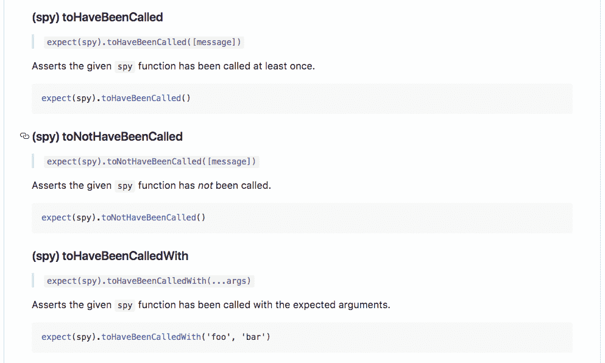

如前面的代码所示，我们有`toHaveBeenCalled`函数，这是我们使用`spies`的第一个断言。我们可以断言我们的`spy`确实被调用了。在 Atom 中，我们将通过调用`expect`并传入`spy`来做到这一点，就像这样：

```js
  it('should call the spy correctly', () => {
    var spy = expect.createSpy();
    spy();
    expect(spy)
  });
```

然后，我们将添加断言`toHaveBeenCalled`：

```js
    expect(spy).toHaveBeenCalled();
```

如果`spy`被调用，这将导致测试通过，如果`spy`从未被调用，这将导致测试失败。我们可以使用`npm run test-watch`命令在终端中运行测试套件，这将使用`nodemon`启动测试：

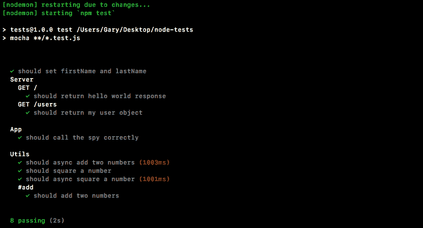

如前面的截图所示，我们有所有的测试用例，在`App`下面，我们有`should call the spy correctly`。它确实通过了，这太棒了。

现在让我们注释掉我调用`spy`的那一行：

```js
  it('should call the spy correctly', () => {
    var spy = expect.createSpy();
    // spy();
    expect(spy).toHaveBeenCalled();
  });
```

这一次测试应该失败，因为`spy`实际上从未被调用，如下截图所示，我们看到`spy was not called`：

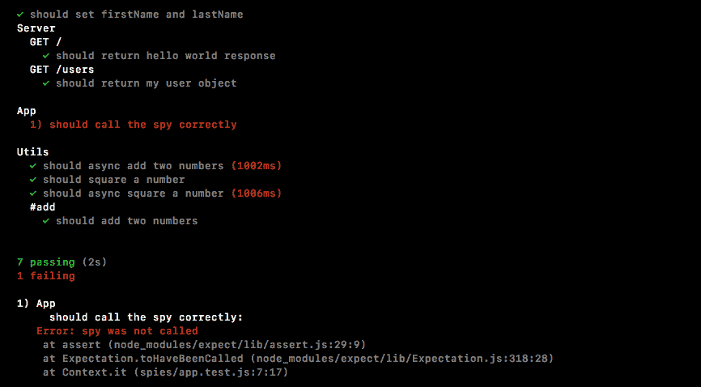

# 间谍断言的更多细节

现在，检查`spy`是否被调用或未被调用是很好的，但我们可以从我们的断言中获得更多细节。例如，如果我用名字`Andrew`和年龄`25`来调用`spy`，会发生什么：

```js
  it('should call the spy correctly', () => {
    var spy = expect.createSpy();
    spy('Andrew', 25);
    expect(spy).toHaveBeenCalled();
  });
```

现在，我们想要验证`spy`不仅仅是被调用了，而且是被调用了这些参数？幸运的是，我们也有一个断言。我们可以调用`toHaveBeenCalledWith`，这样我们就可以传入一些参数并验证`spy`确实是用这些参数被调用的。

如下代码所示，我们将断言我的`spy`是否被调用，并且传入了`Andrew`和数字`25`：

```js
    expect(spy).toHaveBeenCalledWith('Andrew', 25);
```

当我们保存文件并重新启动测试用例时，我们应该看到所有的测试都通过了，这正是我们得到的：

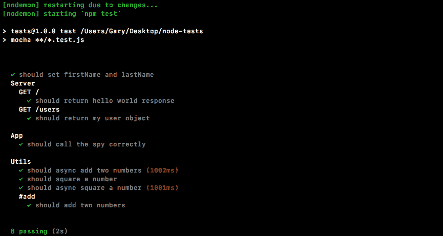

现在，如果`spy`没有用提到的数据被调用，我将删除`25`：

```js
  it('should call the spy correctly', () => {
    var spy = expect.createSpy();
    spy('Andrew');
    expect(spy).toHaveBeenCalledWith('Andrew', 25);
  });
```

现在，如果我们重新运行测试套件，测试将失败。它将给出一个错误消息，让你知道`spy was never called with [ 'Andrew', 25 ]`。这导致了测试失败，这很棒。

我们可以使用我们的`spy`进行许多其他断言。你可以在`expect`文档中找到它们。我们有`toHaveBeenCalled`，我们使用了；`toNotHaveBeenCalled`，验证`spy`是否未被调用。然后我们有`toHaveBeenCalledWith`，我们也使用了。你还可以看到`spy`还有很多其他功能：如何创建`spy`，我们已经做过了，还有一些其他方法。

# 将函数与间谍交换

为了我们的目的，我们需要一个间谍，这样我们就可以在`app.js`（`saveUser`）内模拟该函数。我们需要一种方法来用`spy`替换`saveUser`函数。然后我们可以验证当`handleSignup`被调用时，它确实调用了`saveUser`。它不需要实际经过`db.js`中的过程；这对我们的测试不重要。唯一重要的是函数是否以正确的参数被调用。

为了做到这一点，我们将看看一个名为`rewire`的 npm 模块，它允许我们在测试中交换变量。在我们的情况下，在我们的测试文件中，我们将能够完全用其他东西替换`db`对象。然后，当代码运行时，而不是调用`app.js`中定义的`db.saveUser`，它将调用`db.saveUser`，这将是一个`spy`。

# 安装和设置 rewire 函数

要开始，我们确实需要在终端中安装`rewire`。这是一个很棒的测试工具。对于测试具有副作用的函数，就像我们在本节中看到的那样，它非常重要。让我们运行`npm install`。模块名称本身称为`rewire`，我们将根据此次拍摄的最新版本`@3.0.2`来获取。这是一个专门用于测试的模块。我们不需要它来正常运行我们的应用程序，所以我们将使用`--save-dev`标志将其添加到我们的`package.json`依赖列表中：

```js
npm install rewire@3.0.2 --save-dev
```

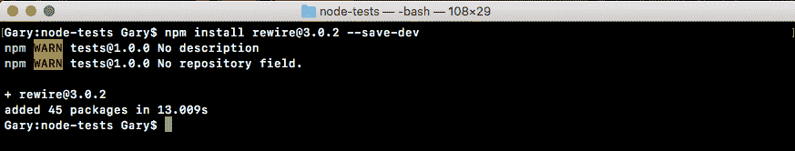

模块安装后，我们可以开始使用它，设置起来非常简单。在`app.test.js`内，我们可以开始加载它。在顶部，我们将创建一个新的常量。这个将被称为`rewire`，我们将其设置为从`rewire`中要求的返回结果：

```js
const expect = require('expect');
const rewire = require('rewire');
```

# 用 spy 替换 db

现在，`rewire`的工作方式是，当你加载要模拟的文件时，它要求你使用`rewire`而不是`require`。在这个例子中，我们想要用其他东西替换`db`，所以当我们加载`app`时，我们必须以特殊的方式加载它。我们将创建一个名为`app`的变量，并将其设置为`rewire`，然后是我们通常放在`require`内的内容。在这种情况下，它是一个相对文件，我们创建的文件`./app`就可以完成任务：

```js
const expect = require('expect');
const rewire = require('rewire');

var app = rewire('./app');
```

现在，rewire 通过 require 加载你的文件，但它还在`app`上添加了两个方法。这些方法是：

+   `app.__set__`

+   `app.__get__`

我们可以使用这些来模拟`app.js`内的各种数据。这意味着我们将模拟`db`对象，即从`db.js`返回的对象，但我们将用`spy`替换函数。

在我们的`describe`块内，我们可以通过创建一个变量来开始。这个变量将被称为`db`，我们将其设置为一个对象：

```js
describe('App', () => {
  var db = {

  }
```

在我们的情况下，我们唯一需要模拟的是`saveUser`。在对象内，我们将定义`saveUser`，然后将其设置为`spy`，通过使用`expect.createSpy`来创建一个，就像这样：

```js
describe('App', () => {
  var db = {
    saveUser: expect.createSpy()
  };
```

现在我们有了这个`db`变量，唯一剩下的事情就是替换它。我们使用`app.__set__`来做到这一点，它将需要两个参数：

```js
describe('App', () => {
  var db = {
    saveUser: expect.createSpy()
  };
  app.__set__();
```

第一个是你想要替换的东西。我们试图替换`db`，并试图用`db`变量替换它，这是我们的对象，其中有`saveUser`函数：

```js
describe('App', () => {
  var db = {
    saveUser: expect.createSpy()
  };
  app.__set__('db', db);
```

有了这个设置，我们现在可以编写一个测试，验证`handleSignup`确实调用了`saveUser`。

# 编写一个测试来验证函数的交换

为了验证`handleSignup`是否调用了`saveUser`，在`app.test.js`中，我们将调用`it`：

```js
describe('App', () => {
  var db = {
    saveUser: expect.createSpy()
  };
  app.__set__('db', db);

  it('should call the spy correctly', () => {
    var spy = expect.createSpy();
    spy('Andrew', 25);
    expect(spy).toHaveBeenCalledWith('Andrew', 25);
  });

  it('should call saveUser with user object')
```

然后我们可以传入我们的函数，这将在测试执行时实际运行，不需要使用任何异步的 done 参数。这将是一个同步测试：

```js
  it('should call saveUser with user object', () => {

  });
```

在回调函数中，我们可以想出一个`email`和一个`password`，然后将它们传递给`db.js`中的`handleSignup`。我们将创建一个名为`email`的变量，将其设置为某个邮箱`andrew@example.com`，然后我们可以用`password`做同样的事情，`var password`；我们将把它设置为`123abc`：

```js
  it('should call saveUser with user object', () => {
    var email = 'andrew@example.com';
    var password = '123abc';
  });
```

接下来，我们将调用`handleSignup`。这是我们想要测试的函数。我们将调用`app.handleSignup`，传入我们的两个参数，`email`和`password`：

```js
  it('should call saveUser with user object', () => {
    var email = 'andrew@example.com';
    var password = '123abc';

    app.handleSignup(email, password);
  });
```

现在，在这一点上，`handleSignup`将被执行。这意味着这里的代码将运行，并且它将触发`db.saveUser`，但`db.saveUser`不是`db.js`中的方法；它是一个`spy`，这意味着我们现在可以使用我们刚学到的那些断言。

在测试用例中，我们将使用`expect`来期望关于`db`的某些内容；我们将变量`.saveUser`设置为一个`spy`：

```js
    app.handleSignup(email, password);
    expect(db.saveUser)
```

我们将使用一个对象调用`.toHaveBeenCalledWith`，因为这是`db.js`应该被调用的方式。我们将使用相同的 ES6 快捷方式：`email`，`password`：

```js
    app.handleSignup(email, password);
    expect(db.saveUser).toHaveBeenCalledWith({email, password});
  });
```

这将创建一个`email`属性，设置为`email`变量，并创建一个`password`属性，设置为`password`变量。有了这个设置，我们现在可以保存我们的测试文件，在终端中，我们可以使用上箭头键两次重新运行`npm run test-watch`命令来重新启动`test-watch`脚本。这将启动我们的测试套件，开始所有的测试：

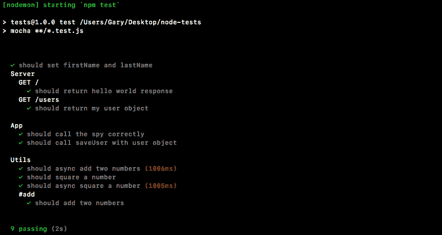

如前面的屏幕截图所示，我们看到`should call the spy correctly`通过了。同时，我们刚刚创建的测试用例也通过了。我们可以看到`should call saveUser with the user object`，这太棒了。我们现在有一种方法可以测试几乎任何 Node 中的东西。我们甚至可以测试调用其他函数的函数，验证通信是否如预期发生。所有这些都可以使用 spy 来完成。

# 总结

在本章中，我们研究了如何测试 Express 应用程序，就像在上一章中对同步和异步 Node 应用程序进行测试一样。然后，我们使用`describe()`对象组织我们的测试，以便我们可以立即看到不同的测试方法。

在上一节中，我们探讨了另一种测试 Node 应用程序的方法，即 spy。我们为 spy 创建了测试文件，研究了`spy`断言和使用`spy`交换函数。

# 结论

这就是书的结尾！在本书的过程中，您学习了 Node.js 的基础知识，以便在网络上测试和部署 Node.js 应用程序。我们希望您喜欢本书带您走过的旅程。我们祝愿您一切成功，并希望您继续改进您的 Node.js 应用程序。
