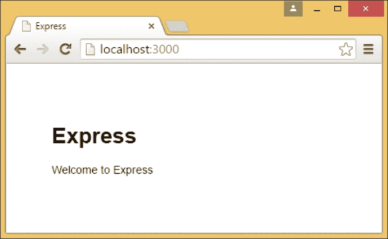
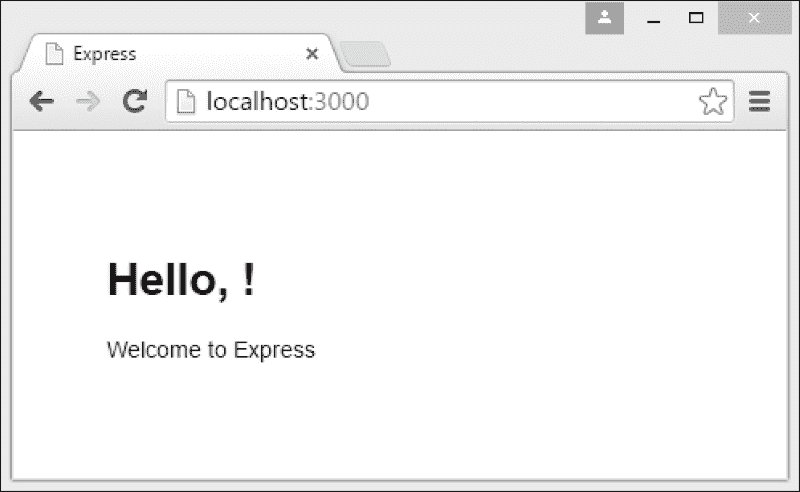

# 第二章：Node.js 入门

本章将帮助你开始使用 Node.js。你会看到这有多快，以及开始编写网络应用有多容易。你还将选择一个用于 Node.js 开发的开发环境。在本章中，我们将涵盖以下主题：

+   安装 Node.js

+   编写我们的第一个 Node.js 网络应用程序

+   设置我们的开发环境

# 安装和运行 Node.js

要安装 Node.js，请访问[`nodejs.org`](https://nodejs.org)，下载并运行当前推荐版本的安装程序包。本书中的示例基于 2016 年 4 月发布的 Node.js v6，支持到 2018 年 4 月。

安装后，打开控制台窗口（在 Windows 上运行命令提示符，或在 Mac 上运行终端）并输入`node`。

这将打开 Node.js 的 REPL，它就像浏览器中的 JavaScript 控制台一样工作。尝试输入几个命令并查看输出：

```js
> function square(x) { return x*x; }
undefined
> square(42)
1764
> new Date()
2016-05-02T16:08:41.915Z
> var foo = { bar: 'baz' }
undefined
> typeof foo
'object'
> foo.bar
'baz'

```

现在让我们利用 Node.js 特有的 API 之一来创建一个 HTTP 服务器。在 REPL 中输入以下命令（每个命令的输出为了简洁起见省略）：

```js
> var listener = function(request, response) { response.end('Hello World!') }
> require('http').createServer(listener).listen(3000)

```

现在尝试在你的浏览器中访问`http://localhost:3000`。恭喜！你只用两行代码就编写了你的第一个网络服务器。第一行定义了一个处理 HTTP 请求并返回响应的回调函数。第二行设置了一个新的服务器，该服务器在端口 3000 上接受 HTTP 请求，并为每个请求调用我们的回调函数。

你可以通过输入`process.exit()`来退出 Node.js 的 REPL。

# 选择编辑器

当然，我们不会在 REPL 中编写所有的代码。你可以使用任何你喜欢的文本编辑器或 IDE 来编写 Node.js 的 JavaScript 代码。如果你不确定该使用什么，可以尝试以下之一：

+   Atom ([`atom.io/`](https://atom.io/))

+   Visual Studio Code ([`code.visualstudio.com/`](https://code.visualstudio.com/))

这两个都是免费的、轻量级的 IDE，实际上是用 Node.js 实现的。它们都适用于 Windows、Mac 和 Linux。

本书其余部分中的代码列表将是 JavaScript 源代码文件，而不是要输入到 REPL 中的命令。

# 使用应用程序框架

我们在 REPL 中创建的服务器使用了 Node.js 内置的低级 HTTP 模块。这提供了一个 API 来创建一个从请求中读取数据并向响应写入的服务器。

与其他编程平台一样，有可用的框架提供了编写网络应用的高级抽象。这些包括诸如 URL 路由和模板引擎等功能。ASP.NET MVC、Ruby on Rails 和 Spring MVC 都是不同平台上此类框架的例子。

### 注意

**示例代码**

如果你在这本书的任何地方遇到困难，你可以通过[`github.com/NodeJsForDevelopers`](https://github.com/NodeJsForDevelopers)上的代码进行跟随（每个章节都有一个存储库，每个引入新代码的标题都有一个提交）。

在本书中，我们将使用名为 Express 的框架来在 Node.js 中编写网络应用程序。Express 是 Node.js 中最受欢迎的网络应用程序框架。它非常适合我们即将构建的小型应用程序。它还提供了对重要概念的良好介绍。大多数其他流行的 Node.js 网络应用程序框架在概念上与 Express 类似，其中几个实际上是在其之上构建的。

## 开始使用 Express

要启动我们的基于 Express 的应用程序，我们将使用 npm 安装 `express-generator` 包，该包将基于 Express 创建一个骨架应用程序。请在控制台（即您的常规终端，而不是 Node.js REPL 内部）运行以下命令：

```js
> npm install -g express-generator@~4.x

```

`-g` 选项全局安装 Express 生成器，因此您可以从任何位置运行它。我们接下来要运行的命令将创建一个新的文件夹来存放我们的应用程序代码，因此请运行此命令，以便将此文件夹放置在您希望的位置：

```js
> express --hogan chapter02

```

### 注意

**模板引擎**

Express 提供了模板引擎的选择。我们将使用 Hogan，它是 Mustache 模板引擎的一个实现。您可能已经从客户端库中熟悉了 Mustache。不过，即使不熟悉也不要担心。它非常容易上手。

如您从输出中看到的，这为我们设置了一个最小标准应用程序结构。现在，按照生成器的指示，运行以下命令来安装我们的应用程序所依赖的模块：

```js
> cd chapter02
> npm install

```

生成器为我们创建了一个骨架 Node.js 网络应用程序。让我们尝试运行它：

```js
> npm start

```

现在，再次访问 `http://localhost:3000`，您将看到如此处所示的 Express 欢迎页面：



## 探索我们的 Express 应用程序

让我们看看 Express 生成器为我们创建的文件夹：

+   `node_modules`：此文件夹包含我们的应用程序所依赖的第三方包，这些包在我们运行 `npm install` 时安装（通常会将此目录排除在源代码控制之外）

+   `public`：此文件夹包含我们的应用程序的静态资源：图像、客户端 JavaScript 和 CSS

+   `routes`：此文件夹包含我们的应用程序的逻辑

+   `views`：此文件夹包含我们的应用程序的服务器端模板

此外，还有一些文件不包含在任何前面的文件夹中：

+   `package.json`：此文件包含我们的应用程序的元数据，这些元数据由之前使用的 `npm install` 和 `npm start` 命令使用。我们将在第四章介绍 Node.js 模块中进一步探讨此文件。

+   `app.js`：此文件是应用程序的主要入口点，它将所有前面的组件粘合在一起并初始化 Express。我们将在本章后面更详细地介绍此文件。

+   `bin/www`：此文件是一个 Node.js 脚本，用于启动我们的应用程序。这是当我们运行 `npm start` 时执行的脚本。

在这个阶段，理解 `bin/www` 脚本中的所有内容并不重要。然而，请注意，它使用了与 REPL 示例中相同的 `http.createServer` 调用。不过，这次监听器参数不是一个简单的函数，而是我们整个应用程序（定义在 `app.js` 中）。

## 理解 Express 路由和视图

**路由** 在 Express 中包含处理请求和渲染适当响应的逻辑。它们在 MVC 框架（如 ASP.NET、Spring MVC 或 Ruby on Rails）中的控制器有类似的责任。

在浏览器中为我们刚刚查看的页面服务的路由可以在 `routes/index.js` 中找到，其看起来如下所示：

```js
var express = require('express');
var router = express.Router();

/* GET home page. */
router.get('/', function(req, res, next) {
  res.render('index', { title: 'Express' });
});

module.exports = router;
```

`require` 调用导入了 Express 模块。我们将在第四章中更详细地讨论它是如何工作的，*介绍 Node.js 模块*。现在，把它想象成.NET 或 Java 中的 `using` 或 `import` 语句。对 `express.Router()` 的调用创建了一个上下文，我们可以在其中定义新的路由。我们将在本章后面更详细地讨论这一点（见 *使用 Express 创建模块化应用程序*）。`router.get()` 调用为这个上下文添加了一个新的处理器，用于处理 `'/'` 路径的 GET 请求。

`callback` 函数接受一个请求和一个响应参数，类似于本章开头我们“Hello World!”服务器中的监听器。然而，这里的请求和响应是由 Express 提供的对象，具有额外的功能。

`render` 函数允许我们使用传递给它的数据来响应模板，这通常是路由的 `callback` 函数中最后做的事情。在这里，我们将包含标题 *Express* 的对象传递给视图模板。

视图模板可以在 `views/index.hjs` 中找到，其看起来如下所示：

```js
<!DOCTYPE html>
<html>
  <head>
    <title>{{ title }}</title>
    <link rel='stylesheet' href='/stylesheets/style.css' />
  </head>
  <body>
    <h1>{{ title }}</h1>
    <p>Welcome to {{ title }}</p>
  </body>
</html>
```

这是一个 Hogan 模板。如前所述，Hogan 是 Mustache 的一个实现，Mustache 是一个非常轻量级的模板语言，它限制了视图中的逻辑量。您可以在[`mustache.github.io/mustache.5.html`](https://mustache.github.io/mustache.5.html)查看 Mustache 的完整语法。

我们的模板是一个简单的 HTML 页面，包含一些特殊的模板标签。`{{ title }}` 标签会被路由传递进来的数据中的标题字段所替换。

让我们改变视图中的标题，使其包含一个名称以及一个标题。它应该看起来像这样：

```js
<h1>Hello, {{ name }}!</h1>
```

再次尝试重新加载页面。你应该会看到以下内容：



我们还没有名称。这是因为我们的视图数据中没有 **name** 字段。让我们通过编辑我们的路由来修复这个问题：

```js
var express = require('express');
var router = express.Router();

/* GET home page. */
router.get('/', function(req, res, next) {
 res.render('index', { title: 'Express', name: 'World' });
});

module.exports = router;
```

如果我们在这个时候再次刷新浏览器，我们仍然看不到名称。这是因为我们的应用程序已经加载了我们的路由，所以不会检测到变化。

返回您的终端并终止正在运行的应用程序。再次启动它（使用`npm start`），并在浏览器中重新加载页面。现在您应该会看到文本**Hello, World!**。

## 使用 nodemon 进行自动重启

每次我们进行更改时都重新启动应用程序确实有点繁琐。我们可以通过使用**nodemon**来运行我们的应用程序来做得更好，它会在我们进行更改时自动重新启动应用程序：

```js
> npm install -g nodemon
> nodemon

```

再次尝试更新`routes/index.js`文件（例如，将字符串名称更改为您自己的名称），然后刷新浏览器。这次，更改应该会显示出来，而无需您手动停止和重新启动应用程序。请注意，这个过程是由 nodemon 重新启动的，所以如果我们的应用程序存储了任何内部状态，这将丢失。

## 使用 Express 创建模块化应用程序

要找出当请求被发送时我们的路由是如何被调用的，我们需要查看`app.js`引导文件。请看以下两行：

```js
var routes = require('./routes/index');
...
app.use('/', routes);
```

这告诉 Express 使用在`routes/index.js`中定义的路由上下文来处理对根路径（`'/'`）的请求。

在`/users`路径下设置路由的类似调用。尝试在浏览器中访问此路径。定义此响应的路由在`/routes/users.js`中。

注意，`/routes/users.js`中的路由**也**绑定到了`'/'`，与`/routes/index.js`中的路由相同。这样做的原因是这些路径各自相对于一个单独的路由器实例，而`/routes/users.js`中创建的实例在`app.js`中的`/users`路径下挂载。

这种机制使得构建由较小模块组成的大型应用程序变得容易。您可以将它视为类似于 ASP.NET MVC 中的区域功能，或者简单地将其视为 MVC 控制器分组操作方法的替代结构。

## 引导 Express 应用程序

让我们来看看`app.js`文件的其他部分。由于 Express 版本之间的细微差异，您的文件可能看起来与下面的列表不完全相同，但它将包含大致相同的部分。

文件顶部的各种`require()`调用导入了应用程序使用的模块，包括内置的 Node.js 模块（HTTP 和 Path）、第三方库以及应用程序自己的路由。以下行初始化 Express，告诉它在哪里查找视图模板以及使用什么渲染引擎（在我们的情况下，是 Hogan）。

```js
var app = express();
// view engine setup
app.set('views', path.join(__dirname, 'views'));
app.set('view engine', '{views}');
```

文件的其余部分由对`app.use()`的调用组成。这些注册了用于处理请求的各种不同的**中间件**。它们注册的顺序形成了一个请求处理管道。您可能已经熟悉这种模式来自 Java 中的 servlet 过滤器，或者来自 OWIN 和 ASP.NET 中的`IAppBuilder`/`IApplicationBuilder`/`IBuilder`接口。不过不用担心，我们将在这里彻底探讨中间件。

## 理解 Express 中间件

中间件函数是 Express 应用程序的基本构建块。它们只是接受请求和响应参数（就像我们之前的监听函数一样）以及链中下一个中间件的引用的函数。

每个中间件函数都可以在传递给链中的下一个中间件之前操作请求和响应对象。通过这种方式将中间件链接在一起，你可以从简单的模块化组件构建复杂的功能。这也允许你的应用程序逻辑与诸如日志记录、身份验证或错误处理等横切关注点之间进行清晰的分离。

函数不仅可以传递控制权给链中的下一个中间件，还可以结束请求的处理并返回一个响应。中间件也可以挂载到特定的路径或路由实例上，例如，如果我们想在网站的特定部分增强日志记录。

事实上，Express 路由只是中间件的一个例子：我们之前看过的路由是具有上述三个相同参数的普通中间件函数。它们只是恰好被挂载到特定的路径上，并返回一个响应。

### 实现错误处理

让我们更仔细地看看 `app.js` 中的某些中间件。首先，看看 404 错误处理器：

```js
app.use(function(req, res, next) {
  var err = new Error('Not Found');
  err.status = 404;
  next(err);
});
```

这个函数总是返回一个响应。那么为什么我们的应用程序不总是返回 404 呢？记住，中间件是按顺序调用的，并且路由（在函数注册之前）返回一个响应而不调用下一个中间件。这意味着只有不匹配任何路由的请求才会调用 404 函数，这正是我们想要的。

那么，app.js 中的其他两个错误处理器是什么？它们返回一个带有自定义错误页面的 500 响应。为什么我们的应用程序在所有情况下都不返回 500 响应？如果另一个中间件在调用 `next()` 之前抛出错误，这些是如何执行的？

在 Express 中，错误处理是一个特殊情况。错误处理中间件函数接受四个参数而不是三个，第一个参数是一个错误。它们应该在所有其他中间件之后注册。

在出现错误的情况下（无论是抛出错误还是中间件函数在调用 `next()` 时传递错误参数），Express 将跳过任何其他非错误处理中间件并开始执行错误处理器。

### 使用 Express 中间件

让我们通过使用 cookie 解析中间件（它是 `express-generator` 创建的骨架应用程序的一部分）来查看一些 Express 中间件的实际应用。我们可以通过使用一个 cookie 来存储某人访问网站次数来实现这一点。按照以下方式更新 `routes/index.js`：

```js
router.get('/', function(req, res, next) {
 var visits = parseInt(req.cookies.visits) || 0;
 visits += 1;
 res.cookie('visits', visits);
 res.render('index',
 { title: 'Express', name: 'World', visits: visits }
 );
});
```

并在 `views/index.hjs` 中添加一行新内容：

```js
<p>You have visited this site {{visits}} time(s).</p>
```

现在再次访问`http://localhost:3000/`并刷新页面几次。您应该会看到访问计数根据存储在 cookie 中的值增加。要查看 cookie 解析中间件为我们做了什么，尝试删除或注释掉以下`app.js`中的这一行，然后重新加载页面：

```js
app.use(cookieParser());
```

如您从错误中看到的那样，请求的`cookies`属性现在是未定义的。cookie 解析中间件会查看请求的 cookie 头并将其转换为对我们来说方便的 JavaScript 对象。这是中间件的一个常见用例。`bodyParser`中间件对请求体执行非常相似的任务，将原始文本转换为 JavaScript 对象，使其在我们的路由中更容易使用。

注意，上面的错误响应还展示了我们的错误处理中间件。尝试注释掉`app.js`文件末尾的错误处理程序，然后再次重新加载页面。我们现在得到的是默认的堆栈跟踪，而不是我们在处理程序中定义的自定义错误响应。

# 摘要

在本章中，我们安装了 Node.js，了解了如何从命令行与之交互，并开始用它来编写 Web 应用程序。我们学习了 Express 以及我们如何使用路由和中间件来构建应用程序的结构。

虽然我们在本章中看到了一些代码，但我们并没有真正详细地探索 JavaScript 语法。在我们向应用程序添加更多功能之前，我们应该确保我们对 JavaScript 足够熟悉。这是下一章的主题。
