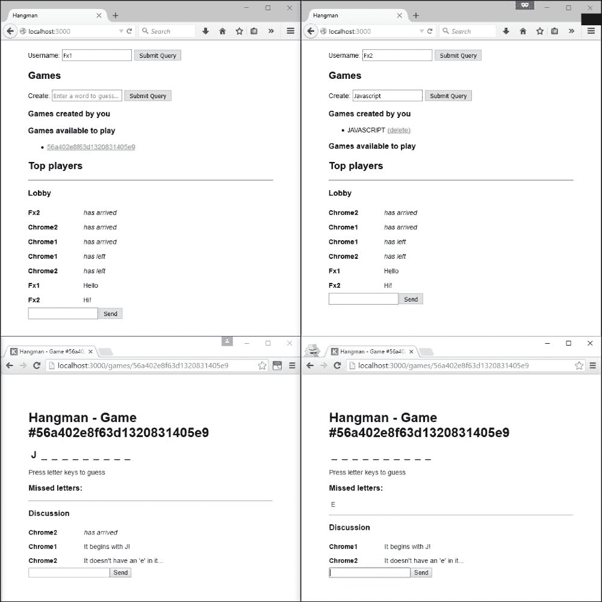

创建实时 Web 应用

互联网为用户提供了一种越来越动态和交互式的用户体验。在整个 90 年代，大部分互联网由静态页面或服务器端渲染的页面组成。框架和 iframe 使得以有限的方式重新加载页面成为可能。当 Ajax 在 2005 年中期出现时，它使得页面变得更加引人入胜。客户端 JavaScript 现在可以按需从服务器请求数据并动态更新页面。

实时 Web 应用是这一演变的下一步。这些应用中，服务器无需客户端发起请求即可向客户端推送数据。这允许用户被通知新信息，或者用户可以实时相互交互。

在本章中，我们将涵盖以下主题：

+   在客户端和服务器之间建立双向通信通道

+   为我们的应用添加实时交互性

+   在多个服务器上扩展我们的实时应用的后端

# 第十章：了解实时通信的选项

实时 Web 应用需要在客户端和服务器之间建立一个双向通信通道。这是任何持久连接，允许服务器在需要时向客户端推送额外的数据。WebSockets 协议是这种通信的现代标准，并被大多数浏览器实现。

WebSocket 连接通过 HTTP 发起，但除此之外不依赖于它。WebSocket 协议定义了一种在 TCP 连接上双向发送消息的方式。TCP 是通常位于 HTTP 之下的低级传输协议。WebSockets 仍然是一种相对较新的技术，并非所有客户端和服务器都完全支持。今天，大多数现代 Web 浏览器都支持 WebSockets。然而，中间服务器（代理、防火墙和负载均衡器）可能会阻止 WebSocket 连接正常工作（要么是因为不支持，要么是有意阻止非 HTTP 流量）。在这些情况下，有其他方法可以实现实时通信。

EventSource 标准定义了一种服务器通过 HTTP 向客户端发送事件的方式，并定义了一个 JavaScript API 来处理这些事件。它不如 WebSockets 高效或广泛支持，但一些较旧的服务器和客户端对其支持更好。

最终的回退方案是**长轮询**。这是当客户端向服务器发起一个普通（Ajax）请求时，该请求保持打开状态，直到服务器有数据要发送。一旦客户端收到任何数据，它就会向服务器发起另一个请求以获取下一条消息。这相比 WebSockets 引入了额外的带宽开销和延迟，但它具有最广泛的支持，因为它仅使用普通的 HTTP 请求。

理想情况下，客户端和服务器可以协商以确定使用最佳可用类型的连接。尽管这个过程可能相当复杂。幸运的是，有一些库可以为我们处理这些。

# 介绍 Socket.IO

Socket.IO 是一个成熟且稳定的库，具有出色的跨浏览器支持。它旨在以跨浏览器兼容的方式快速且可靠地建立双向通信通道。它提供了一个基于惯用 JavaScript 事件的抽象层，用于客户端和服务器之间通过此通道进行实时通信。如果你曾经使用过.NET 中的 SignalR，你可以将 Socket.IO 视为其 JavaScript 等价物。

## 使用 Socket.IO 实现聊天室

让我们为我们的应用程序用户实现一个聊天大厅，以便他们可以互相交谈。首先，我们需要安装 Socket.IO：

```js
> npm install --save socket.io

```

服务器端的实现非常简单。我们只需要告诉 Socket.IO，每当用户发送聊天消息时，我们希望将此消息广播给所有已连接的用户，如下所示`src/realtime/chat.js`：

```js
'use strict';

module.exports = io => {
    io.on('connection', (socket) => {
       socket.on('chatMessage', (message) => {
           io.emit('chatMessage', message);
        });
    });
 };
```

在这里，我们向 Socket.IO 的`connection`事件添加一个监听器。每当一个新的客户端连接到应用程序时，我们的监听器就会被触发。`socket`变量代表与该特定客户端的连接。

之前显示的`io`参数将是一个 Socket.IO 实例。要创建一个这样的实例，我们需要提供一个引用 HTTP 服务器，该服务器将托管我们的应用程序，以便 Socket.IO 可以添加它自己的连接处理。为了使事情更整洁，我们将在`src/server.js`中添加一个新的`server`模块来设置我们的服务器，启动我们的 Express 应用程序，并初始化 Socket.IO：

```js
'use strict';

module.exports = require('./config/mongoose').then(mongoose => {
    const app = require('../src/app')(mongoose);
    const server = require('http').createServer(app);
    const io = require('socket.io')(server);
    require('./realtime/chat')(io);

    server.on('close', () => { 
        require('../src/config/redis.js').quit();
        mongoose.disconnect();
    });
    return server;
});
```

这也允许我们简化启动脚本和我们的集成测试，如`bin/www`中的所示：

```js
#!/usr/bin/env node

var debug = require('debug')('hangman:server');
var port = normalizePort(process.env.PORT || '3000');
require('../src/server').then((server) => {
    server.listen(port);
    server.on('error', onError);
 server.on('listening', onListening.bind(server));
}).catch(function(error) {
    debug(error);
    process.exit(1);
});

...

function onListening() {
 var addr = this.address();
  ...
}
```

...以及在`gulpfile.js`中：

```js
gulp.task('integration-test',
         ['lint-integration-test', 'test'], done => {
  const TEST_PORT = 5000;

 require('./src/server.js').then((server) => {
 server.listen(TEST_PORT);
 server.on('listening', () => {
      gulp.src('integration-test/**/*.js')
        .pipe(
          ...
        }))
 .on('error', error => server.close(() => done(error)))
 .on('end', () => server.close(done))
    });
  });
});
```

现在，我们需要添加客户端代码来与这个服务进行通信。首先，我们将为我们的聊天大厅添加一个位置到应用程序的主页，如下所示`src/views/index.hjs`：

```js
    {{/topPlayers}}
    </ol>
 <hr/>
 <h3>Lobby</h3>
 <form class="chat">
 <div id="messages"></div>
 <input id="message"/><input type="submit" value="Send"/>
 </form>
  </body>
</html>
```

现在，我们将创建客户端脚本以将其与服务器连接，如下所示`src/public/scripts/chat.js`：

```js
$(document).ready(function() {
    'use strict';
    var socket = io();

    $('form.chat').submit(function(event){
        socket.emit('chatMessage', $('#message').val());
        $('#message').val('');
        event.preventDefault();
    });

    socket.on('chatMessage', function(message){
        $('#messages').append($('<p>').text(message));
    });
});
```

最后，我们需要在页面中包含我们的新脚本，并包含定义前面`io`函数的 Socket.IO 客户端脚本`src/view/index.hjs`：

```js
<!DOCTYPE html>
<html>
  <head>
    <title>{{ title }}</title>
    <link rel="stylesheet" href="/stylesheets/style.css" />
    ...
    <script src="img/index.js"></script>
 <script src="img/socket.io.js"></script>
 <script src="img/chat.js"></script>
  </head>
  <body>
    ...
```

注意，我们还没有在任何地方创建`socket.io.js`脚本。这是通过在`src/server.js`中将 Socket.IO 附加到我们的服务器来提供的。由于我们没有在我们的脚本中定义`io`变量，我们需要让 ESLint 知道它作为一个全局变量存在，如`gulpfile.js`中所示：

```js
gulp.task('lint-client', function() {
     return gulp.src('src/public/**/*.js')
         .pipe(eslint({ envs: [ 'browser', 'jquery' ],
 globals: { io: false } }))
         .pipe(eslint.format())
         .pipe(eslint.failAfterError());
 });  
```

现在，如果我们打开两个浏览器窗口中的我们的应用程序，它们可以互相发送聊天消息！

# 扩展实时 Node.js 应用程序

由于我们的聊天消息是通过服务器中继的，因此客户端目前只能与连接到同一服务器的其他客户端通信。如果我们想将应用程序水平扩展到多个服务器，这将是一个问题。

这很容易修复，但很难演示。为了做到这一点，我们需要运行我们应用程序的两个独立实例。如果它们还使用相同的共享数据库进行持久化，这将更加真实和有用。因此，我们需要启动 MongoDB 和 Redis，然后在不同的端口上启动我们应用程序的两个实例（这样它们就不会冲突）。

这意味着运行以下所有命令（根据你的设置替换 MongoDB 的 dbpath）：

```js
> redis-server
> mongod --dbpath C:\data\mongodb
> set MONGODB_URL=mongodb://localhost/hangman
> set REDIS_URL=redis://127.0.0.1:6379/
> set PORT=3000
> npm start
> set PORT=3001
> npm start

```

启动数据库或应用程序服务器的命令也占据了当前的控制台。因此，为了能够运行所有这些命令，我们需要在单独的窗口中执行它们，或者告诉它们在后台执行。在 Windows 上，可以通过以下批处理脚本来实现：

```js
@echo off
START /B redis-server
START /B mongod --dbpath C:\data\mongodb
set MONGODB_URL=mongodb://localhost/hangman
set REDIS_URL=redis://127.0.0.1:6379/
SLEEP 2
set PORT=3000
START /B npm start
SLEEP 1
set PORT=3001
START /B npm start
```

现在，你可以将不同的浏览器连接到不同的应用程序实例，地址为`http://localhost:3000`和`http://localhost:3001`。注意，连接到同一应用程序实例的两个客户端可以互相接收消息，但不能从其他应用程序实例的客户端接收消息。

为了解决这个问题，我们需要一个共享的后端，通过这个后端所有应用程序都可以进行通信。Redis 是这一点的完美候选人。

## 使用 Redis 作为后端

Socket.IO 使用**适配器**模式来支持不同的后端。适配器只是将一个接口转换为另一个接口的包装器。Socket.IO 有一个标准的后端接口和多种适配器，允许不同的实现与该接口一起工作。默认情况下，它使用一个内存适配器，限制在单个进程中。然而，Socket.IO 项目还提供了一个适配器，用于将 Redis 作为后端：

```js
> npm install socket.io-redis --save

```

一旦安装，使用这个中间件只需告诉 Socket.IO 在哪里可以找到我们的 Redis 实例（我们在只有一个应用程序进程的测试环境中跳过这一步）如下所示`src/server.js`：

```js
'use strict';

module.exports = require('./config/mongoose').then(mongoose => {
    const app = require('../src/app')(mongoose);
    const server = require('http').createServer(app);
    const io = require('socket.io')(server);

 if (process.env.REDIS_URL && process.env.NODE_ENV !== 'test') {
 const redisAdapter = require('socket.io-redis');
 io.adapter(redisAdapter(process.env.REDIS_URL));
 }

    require('./realtime/chat')(io);

    ...
    return server;
 });
```

就这样！我们不需要对我们的代码进行任何其他更改来支持可扩展性。如果你现在重新启动你的应用程序实例，你应该会发现客户端可以在它们之间进行通信。

# 将 Socket.IO 与 Express 集成

到目前为止，除了共享同一个服务器外，我们的应用程序的 Socket.IO 和 Express 部分是完全独立的。虽然它们松散耦合是好事，但一些横切关注点可能对两者都相关。

例如，我们的应用程序的两个部分应该有一种相互一致的方式来识别当前用户。如果它们要共同提供单一连贯的用户体验，这一点尤为重要。

首先，让我们扩展我们的用户中间件，通过在用户服务中查找它们来提供当前用户的名称以及它们的 ID，如下所示`src/middleware/users.js`：

```js
'use strict';

module.exports = (service) => {
    const uuid = require('uuid');

    return function(req, res, next) {
        let userId = req.cookies.userId;
        if (!userId) {
            userId = uuid.v4();
            res.cookie('userId', userId);
            req.user = {
                id: userId
            };
            next();
 } else {
 service.getUsername(userId).then(username => {
 req.user = {
 id: userId,
 name: username
 };
 next();
 });
 }
    };
};
```

### 小贴士

你可以在本书的配套代码中找到这个中间件的更新测试。

这意味着将我们的用户服务作为依赖项注入，就像我们在`src/app.js`中为其他中间件模块（即路由）所做的那样：

```js
  ...

  let gamesService = require('./service/games')(mongoose);
  let usersService = require('./service/users');

 let users = require('./middleware/users')(usersService);
  let routes = require('./routes/index')(gamesService, usersService);
  let games = require('./routes/games')(gamesService, usersService);
  let profile = require('./routes/profile')(usersService);
  ...
```

有趣的部分是允许 Socket.IO 使用这个中间件。Socket.IO 有自己的中间件概念，与 Express 非常相似。回想一下，Express 中间件函数接受当前请求、响应和一个 `next` 回调的参数。Socket.IO 中间件函数只接受一个通信套接字和一个 `next` 回调。然而，我们可以访问启动套接字的原始 HTTP 握手。这允许我们将 Express 中间件适配到 Socket.IO 中间件，并如下使用它，在 `src/server.js`：

```js
'use strict';

module.exports = require('./config/mongoose').then(mongoose => {
    let app = require('../src/app')(mongoose);
    let server = require('http').createServer(app);
    let io = require('socket.io')(server);

    if (process.env.REDIS_URL) {
        let redisAdapter = require('socket.io-redis');
        io.adapter(redisAdapter(process.env.REDIS_URL));
    }

 io.use(adapt(require('cookie-parser')()));
 const usersService = require('./services/users.js');
 io.use(adapt(require('./middleware/users')(usersService)));

    require('./realtime/chat')(io);

    ...
    return server;
}); 

function adapt(expressMiddleware) {
 return (socket, next) => {
 expressMiddleware(socket.request, socket.request.res, next);
 };
}

```

现在用户中间件将同时适用于 Socket.IO 和常规 HTTP 请求，使用户数据对 Socket.IO 也可用。让我们使用这个来在我们的聊天中包含用户名。首先，我们需要更新我们的服务器，如下所示 `src/realtime/chat.js`：

```js
'use strict';

module.exports = io => {
    io.on('connection', (socket) => {
        socket.on('chatMessage', (message) => {
 io.emit('chatMessage', {
 username: socket.request.user.name,
 message: message
 });
        });
    });
 }
```

注意到 Socket.IO 允许我们发送对象而不是简单的字符串作为事件负载。现在我们只需要在客户端使用它，如下所示 `src/public/scripts/chat.js`：

```js
$(document).ready(function() {
    'use strict';

    var socket = io();
    ...
 socket.on('chatMessage', function(data){
        $('#messages').append(
 $('<p>').text(data.message)
 .prepend($('<b>').text(data.username)));
});
```

如果你现在在单独的浏览器会话中打开应用程序并指定不同的用户名，你将看到这些用户名在聊天输出中。

# 指导 Socket.IO 消息

现在我们有了用户名访问权限，我们也可以宣布用户在大厅的到达。我们可以通过扩展我们的 Socket.IO 连接事件处理器来实现，如下所示 `src/realtime/chat.js`：

```js
'use strict';

module.exports = io => {

    io.on('connection', (socket) => {
 const username = socket.request.user.name;

 if(username) {
 socket.broadcast.emit('chatMessage', {
 username: username,
 message: 'has arrived',
 type: 'action'
 });
 }

        socket.on('chatMessage', (message) => {
            io.emit('chatMessage', {
 username: username,
                message: message
            });
        });
    });
 }
```

在这里，我们使用 `socket.broadcast.emit` 而不是 `io.emit` 来将事件发送给除了当前 socket 之外的所有客户端。请注意，我们还在消息中添加了额外的数据。这次我们添加了一个 `type` 字段（对于到达消息设置为 `'action'`），以便对不同类型的消息进行不同的视觉呈现。我们可以通过更新我们的客户端代码，根据消息类型设置额外的 CSS 类来实现，如下所示 `src/public/scripts/chat.js`：

```js
    socket.on('chatMessage', function(data){
        $('#messages').append(
 $('<p>').text(data.message).addClass(data.type)
                .prepend($('<b>').text(data.username)));
    });
```

### 小贴士

你可以在配套代码中找到示例应用的 CSS 文件。

让我们还要强制要求用户在选择参与聊天之前必须选择一个用户名，如下所示 `src/realtime/chat.js`：

```js
'use strict';

module.exports = io => {
    io.on('connection', (socket) => {
        ...
        socket.on('chatMessage', (message) => {
 if (!username) {
 socket.emit('chatMessage', {
 message: 'Please choose a username',
 type: 'warning'
 });
 } else {
                io.emit('chatMessage', {
                    username: username,
                    message: message
                });                
 }
        });
    });
 }
```

这里，我们使用 `socket.emit` 而不是 `io.emit` 来向与当前套接字关联的客户端发送消息。

# 测试 Socket.IO 应用程序

现在让我们看看如何测试我们的聊天模块。为了从我们的测试中与之通信，我们需要一个 Socket.IO 客户端。Socket.IO 项目为此提供了一个额外的包：

```js
> npm install socket.io-client --save-dev

```

我们的测试基础设施包括设置一个服务器和多个客户端，如下所示 `test/realtime/chat.js`：

```js
'use strict';
describe('chat', function() {
    const expect = require('chai').expect;
    let server, io, url, createUser, createdClients = [];

    beforeEach(done => {
        server = require('http').createServer();

        server.listen((err) => {
            if (err) {
                done(err);
            } else {
                const addr = server.address();
                url = 'http://localhost:' + addr.port + '/chat'; 

                io = require('socket.io')(server);
                require('../../src/realtime/chat.js')(io);

                done();
            }
        });
    });

    afterEach(done => {
        createdClients.forEach(client => client.disconnect());
        server.close(done);
    });

    const createClient = require('socket.io-client');
    createUser = (name, room) => {
        let user = {
            name: name,
            client: createClient(url)
        };
        createdClients.push(user.client);
        return user;
    };
});
```

在这里，我们创建了一个没有指定地址的 HTTP 服务器，这样操作系统就会为我们分配一个可用的端口。然后我们使用这个服务器来托管我们的聊天实现。

由于我们独立运行聊天模块，我们没有用户中间件可用，因此需要一种替代方式来提供用户名。我们可以在测试中使用一个存根中间件直接从头部读取用户名：

```js
'use strict';

describe('chat', function() {
    const expect = require('chai').expect;
    let server, io, url, createUser, createdClients = [];

    beforeEach(done => {
        server = require('http').createServer();

        server.listen((err) => {
            if (err) {
                done(err);
            } else {
                const addr = server.address();
                url = 'http://localhost:' + addr.port;

                io = require('socket.io')(server);
 io.use((socket, next) => {
 socket.request.user = {
 name: socket.request.headers.username
 };
 next();
 });

                require('../../src/realtime/chat.js')(io);

                done();
            }
        });
    });

    ...

    const createClient = require('socket.io-client');
    createUser = (name, room) => {
 let headers = {};
 if (name) {
 headers.username = name;
 }

        let user = {
            name: name,
 client: createClient(url, { extraHeaders: headers})
        };
        createdClients.push(user.client);
        user.client.emit('joinRoom', room);

        return user;
    };
});
```

现在我们准备实现我们的测试。前两个，对于从服务器发起的消息，相当简单：

```js
    it('warns unnamed users to choose a username', done => {
        let unnamedUser = createUser();
        unnamedUser.client.emit('chatMessage', 'Hello!');
        unnamedUser.client.on('chatMessage', (data) => {
            expect(data.message).to.contain('choose a username');
            expect(data.username).to.be.undefined;
            expect(data.type).to.equal('warning');
            done();
        });
    });

    it('broadcasts arrival of named users', done => {
        let connectedUser = createUser();
        let newUser = createUser('User1');
        connectedUser.client.on('chatMessage', (data) => {
            expect(data.message).to.contain('arrived');
            expect(data.username).to.equal(newUser.name);
            expect(data.type).to.equal('action');
            done();
        });
    });
```

测试客户端之间发送的消息需要更多注意来捕获每个客户端接收消息的情况：

```js
    it('emits messages from named users back to all users', done => {
        let namedUser = createUser('User1');
        let otherUser = createUser();
        let messageReceived = function(data) {
            this.received = data;
            if (namedUser.received && otherUser.received) {
                [namedUser.received, otherUser.received]
                .forEach(received => {
                    expect(received.message).to.equal('Hello!');
                    expect(received.username)
                        .to.equal(namedUser.name);
                });
                done();
            }
        };
        otherUser.client.on('chatMessage',
                            messageReceived.bind(otherUser));
        namedUser.client.on('chatMessage',
                            messageReceived.bind(namedUser));
        namedUser.client.emit('chatMessage', 'Hello!');
    });
```

# 组织 Socket.IO 应用程序

现在我们已经在应用程序的索引页上有一个聊天大厅，用户必须重新加载页面（并丢失聊天历史）才能了解新的游戏。我们可以使用 Socket.IO 来更新这些内容。

## 公开模型的实时更新

首先，我们需要我们的游戏服务本身来公开添加或删除游戏时的事件。在这里，我们使用 Mongoose 提供的 `post` 方法来挂钩游戏上的持久化操作，如这里所示 `src/services/games.js`：

```js
'use strict';

const EventEmitter = require('events');
const emitter = new EventEmitter();

module.exports = (mongoose) => {
    let Game = mongoose.models['Game'];

    if (!Game) {
        let Schema = mongoose.Schema;
        let gameSchema = new Schema({
            word: String,
            setBy: String
        });

        ...

 gameSchema.post('save', game =>
 emitter.emit('gameSaved', game));
 gameSchema.post('remove', game =>
 emitter.emit('gameRemoved', game));

        Game = mongoose.model('Game', gameSchema);
    }

    return {
        ...
        get: id => Game.findById(id),
 events: emitter
    };
};

module.exports.events = emitter;

```

我们公开一个 **事件发射器**，允许其他模块订阅添加或删除游戏时的事件。事件发射器是 Node.js 的内置功能，提供了一种简单的方式来公开自定义事件。请注意，Mongoose 的 `Schema` 类本身就是一个事件发射器，所以我们可以直接公开它。然而，这将泄露有关我们游戏服务实现的细节。

### 小贴士

再次，你可以在配套代码中找到这些更改的新测试。

## 使用命名空间组织 Socket.IO 应用程序

实时聊天和实时更新游戏列表是我们应用程序中相当不同的功能区域。Socket.IO 提供了 **命名空间**，允许我们组织事件。这允许我们仍然使用客户端和服务器之间的单个连接，而无需担心不同功能区域之间的事件名称冲突。当应用程序变得更大、更复杂时，这非常有用。

将我们的聊天功能放在一个命名空间下，对客户端和服务器（以及我们的测试）来说是一个非常简单的更改。

以下代码来自 `src/public/scripts/chat.js`：

```js
$(document).ready(function() {
    'use strict';
 var socket = io('/chat');
    ...
```

以下代码来自 `src/realtime/chat.js`：

```js
'use strict';

module.exports = io => {
 const namespace = io.of('/chat');

 namespace.on('connection', (socket) => {
         ...

         socket.on('chatMessage', (message) => {
             if (!username) {
                 ...
             } else {
 namespace.emit('chatMessage', {
                     username: username,
                     message: message
                 });
             }
         });
     });
 };
```

以下代码来自 `test/realtime/chat.js`：

```js
                const addr = server.address();
 url = 'http://localhost:' + addr.port + '/chat';

```

现在，我们可以添加一个新的 Socket.IO 模块来公开游戏的变化。这只需要将我们的游戏服务的事件转发给连接的 Socket.IO 客户端。

我们在 `src/realtime/games.js` 下添加以下代码：

```js
'use strict';

module.exports = (io, service) => {
    io.of('/games').on('connection', (socket) => {
        forwardEvent('gameSaved', socket);
        forwardEvent('gameRemoved', socket);
    });

    function forwardEvent(name, socket) {
        service.events.on(name, game => {
            if (game.setBy !== socket.request.user.id) {
                socket.emit(name, game.id);
            }
        });
    }
};
```

我们还需要在服务器初始化时包含此模块。

以下代码来自 `src/server.js`：

```js
'use strict';

module.exports = require('./config/mongoose').then(mongoose => {
    ...

    require('./realtime/chat')(io);
 const gamesService = require('./services/games.js')(mongoose);
 require('./realtime/games')(io, gamesService);

    ...
    return server;
});
```

相应的客户端只需连接到 `/games` 命名空间并相应地更新列表。

以下代码来自 `src/public/scripts/index.js`：

```js
    var socket = io('/games');
    var availableGames = $('#availableGames');

    socket.on('gameSaved', function(game) {
        availableGames.append(
            '<li id="' + game + '"><a href="/games/' + game + '">' +
                game + '</a></li>');
    });
    socket.on('gameRemoved', function(game) {
        $('#' + game).remove();
    });
```

以下代码添加到 `src/views/index.hjs` 中：

```js
    <h3>Games available to play</h3>
    <ul id="availableGames">
      {{#availableGames}}
 <li id="{{id}}"><a href="/games/{{id}}">{{id}}</a></li>
      {{/availableGames}}
    </ul>
```

### 小贴士

实际上，最好使用客户端 MV* 库，如 Knockout 或 Backbone，根据模型更改更新页面，而不是像这样操作 DOM，但这超出了本书的范围。

现在，如果你在两个不同的浏览器会话中打开应用程序并在一个浏览器窗口中创建一个新的游戏，它将立即出现在另一个窗口中。

## 使用房间分区 Socket.IO 客户端

在本章中，我们将添加的最后一个功能是允许玩相同游戏的用户之间进行交流。我们可以重用我们已编写的聊天功能。然而，我们希望主页上的大厅和每个游戏都有一个独立的聊天。

Socket.IO 提供了**房间**功能，用于将消息定向发送到不同的客户端组。请记住，命名空间允许我们将应用程序划分为不同的功能区域。房间功能使我们能够在同一功能区域内对客户端进行划分。

Socket.IO 中的房间只是字符串标识符，我们使用 `socket.join` 函数将客户端添加到房间中。我们将引入一个新的 `joinRoom` 事件，允许我们的客户端请求服务器将其添加到特定的房间。服务器端将按以下方式响应此事件：

以下代码来自 `src/realtime/chat.js`：

```js
'use strict';

module.exports = io => {
    const namespace = io.of('/chat');

    namespace.on('connection', (socket) => {
        const username = socket.request.user.name;

 socket.on('joinRoom', (room) => {
 socket.join(room);
            if (username) {
 socket.broadcast.to(room).emit('chatMessage', {
                    username: username,
                    message: 'has arrived',
                    type: 'action'
                });
            }

            socket.on('chatMessage', (message) => {
                if (!username) {
                    ...
                } else {
 namespace.to(room).emit('chatMessage', {
                        username: username,
                        message: message
                    });
                }
            });

 socket.on('disconnect', () => {
 if (username) {
 socket.broadcast.to(room).emit('chatMessage', {
 username: username,
 message: 'has left',
 type: 'action'
 });
 }
 });
        });
    });
};
```

注意，我们也会像宣布到达一样宣布用户离开特定房间。同样，您可以在示例代码中找到此功能的附加测试。

我们将把聊天功能添加到游戏页面，并使用聊天表单上的数据属性指定正确的房间。

以下代码来自 `src/views/game.hjs`：

```js
<!DOCTYPE html>
<html>
  <head>
    <title>Hangman - Game #{{id}}</title>
    <link rel="stylesheet" href="/stylesheets/style.css" />
    <script src="img/jquery.min.js"></script>
    <script src="img/game.js"></script>
 <script src="img/socket.io.js"></script>
 <script src="img/chat.js"></script>
    <base href="/games/{{ id }}/">
  </head>
  <body>
    <h1>Hangman - Game #{{id}}</h1>
    <h2 id="word" data-length="{{ length }}"></h2>
    <p>Press letter keys to guess</p>
    <h3>Missed letters:</h3>
    <p id="missedLetters"></p>
 <hr/>
 <h3>Discussion</h3>
 <form class="chat" data-room="{{id}}">
 <div id="messages"></div>
 <input id="message"/><input type="submit" value="Send"/>
 </form>
  </body>
</html>
```

以下代码来自 `src/views/index.hjs`：

```js
    <hr/>
    <h3>Lobby</h3>
 <form class="chat" data-room="lobby">
      <div id="messages"></div>
      <input id="message"/><input type="submit" value="Send"/>
    </form>
```

然后，我们需要更新客户端脚本，以便在连接时加入正确的房间。

以下代码来自 `src/public/scripts/chat.js`：

```js
$(document).ready(function() {
    'use strict';

    var chat = $('form.chat');
    var socket = io('/chat');

 socket.emit('joinRoom', chat.data('room')); 
 chat.submit(function(event){
        ...
    });
    ...
});
```

最后，我们需要确保输入聊天消息不会干扰游戏。我们可以通过仅在用户不在聊天消息框中输入时将按键视为游戏的猜测来实现这一点。

以下代码来自 `src/public/javascript/game.js`：

```js
    $(document).keydown(function(event) {
 if (!$('.chat #message').is(':focus') &&
                event.which >= 65 && event.which <= 90) {
            var letter = String.fromCharCode(event.which);
            if (guessedLetters.indexOf(letter) === -1) {
                guessedLetters.push(letter);
                guessLetter(letter);
            }
        }
    });
```

### 小贴士

您可以在配套代码中找到此功能的新的和更新的测试。

将所有这些整合起来，我们现在可以在不同的房间中让多个客户端相互交谈：



# 摘要

在本章中，我们使用 Socket.IO 创建了一个实时客户端/服务器通信通道，使用 Redis 作为后端以横向扩展实时应用程序，将 Socket.IO 与 Express 中间件集成，并使用 Socket.IO 命名空间和房间组织我们的应用程序。

随着我们应用程序的网络连接变得越来越复杂，在开发或 CI 环境之外在 Web 服务器上测试应用程序变得更加重要。在下一章中，我们将探讨如何将我们的应用程序部署到 Web 上。
