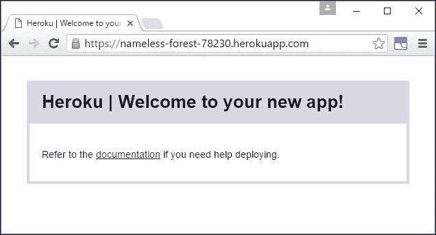
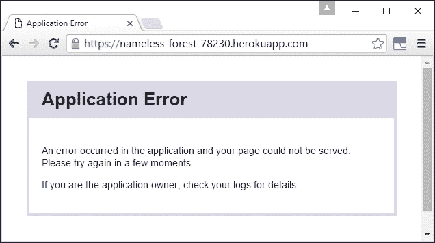
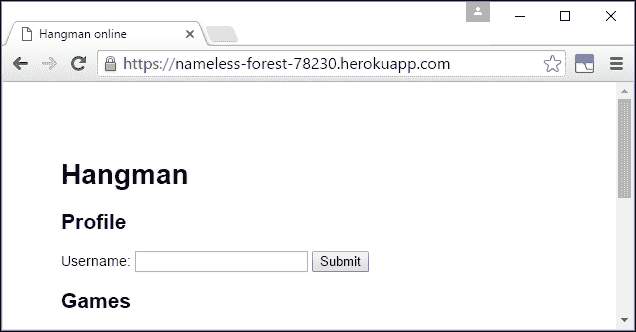
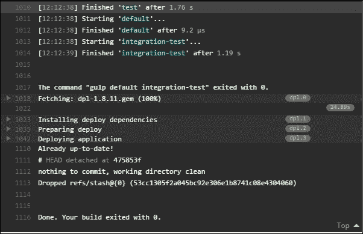

# 第十一章。部署 Node.js 应用程序

到目前为止，我们只在本地开发环境中运行了我们的应用程序。在本章中，我们将将其部署到 Web 上。托管应用程序有多种不同的选项。我们将通过一个部署选项来快速启动应用程序。我们还将讨论部署 Node.js 应用程序的更广泛原则和替代方案。

在本章中，我们将涵盖以下主题：

+   将我们的应用程序部署到 Web

+   使用应用程序日志诊断远程服务器上的问题

+   设置数据库服务器和环境配置

+   从 Travis CI 自动部署

### 提示

如果您想跟随本章，可以使用[`github.com/NodeJsForDevelopers/chapter10/`](https://github.com/NodeJsForDevelopers/chapter10/)中的代码作为起点。这包含了第十章末尾的示例代码，*创建实时 Web 应用*，我们将在此基础上构建。

# 与 Heroku 协作

**Heroku**是一个基于云的 Web 应用程序平台。它的目标是让开发者能够专注于应用程序而不是基础设施。它提供了一个低摩擦的工作流程，可以快速部署新应用程序，同时支持长期的可扩展性。它还提供了一个附加服务市场，例如数据库和监控。

有几个与 Heroku 类似的服务，其中一些我们将在本章后面介绍。Heroku 是这类服务中的先驱之一。特别是，它是第一个将 Node.js 作为一等公民支持的服务之一。它还提供了许多免费功能，包括本节工作示例所需的一切。

### 注意

注意，Heroku 的免费功能足以部署用于开发、演示或实验目的的应用程序。它不足以用于为最终用户提供服务的应用程序的生产部署。有关 Heroku 定价层的详细信息，请参阅[`www.heroku.com/pricing`](https://www.heroku.com/pricing)。

## 设置 Heroku 账户和工具

要跟随本节中的示例，您首先需要在[`signup.heroku.com/`](https://signup.heroku.com/)上注册 Heroku。

我们还将使用 heroku 工具包，这是一个用于配置 Heroku 的 CLI。从[`toolbelt.heroku.com/`](https://toolbelt.heroku.com/)下载并安装适用于您平台版本的程序。

检查 heroku 工具包是否正确安装并且可在您的路径上使用。打开一个新的命令提示符并运行以下命令：

```js
> heroku

```

您应该会看到带有可用命令列表的帮助文本。通过运行以下命令配置工具包以使用您的 Heroku 账户：

```js
> heroku login

```

## 使用 Heroku 在本地运行应用程序

Heroku 需要一个小的配置文件（类似于 `.travis.yml`），告诉它如何运行我们的应用程序。这个文件名为 **Procfile**，在我们的情况下，它包含以下单行：

```js
web: npm start
```

这告诉 Heroku，我们的应用程序由一个单一的 Web 进程组成，可以使用 `npm start` 启动。

### 注意

注意，特别是如果你习惯了 Windows 文件系统，文件名中的大写 P 很重要。应用程序将被部署到一个类似 Unix 的系统，其中文件名是区分大小写的。

为了验证我们的 `Procfile`，我们可以使用 Heroku 在本地运行我们的应用程序：

```js
> heroku local

```

这将使用 `Procfile` 启动我们的应用程序。请注意，它还设置了默认端口 `5000`。你现在应该能够访问应用程序在 `http://localhost:5000`。

`heroku local` 命令还为我们的应用程序设置了环境变量。这些是从我们应用程序根目录的本地 `.env` 文件中读取的：

```js
MONGODB_URL=mongodb://localhost/hangman
REDIS_URL=redis://127.0.0.1:6379/
```

你可以通过启动 MongoDB 和 Redis 的本地实例来测试这一点。在单独的提示符中运行以下命令（根据需要设置 `--dbpath`）：

```js
> redis-server
> mongod --dbpath C:\data\mongodb
> heroku local

```

有这个 `.env` 文件意味着我们可以直接使用 `npm start`（就像我们之前做的那样）来运行带有模拟数据存储，当我们需要一个更真实的环境时，使用 `heroku local`，而不必跟踪我们的当前环境变量。

## 将应用程序部署到 Heroku

现在我们已经创建了一个 `Procfile`，将我们的应用程序部署到网络变得容易。首先，我们需要创建一个新的 Heroku 应用程序：

```js
> heroku create

```

默认情况下，这将在 Heroku 上创建一个最小化应用程序，并分配一个随机名称。你可以选择指定一个应用程序名称作为第三个参数。

此命令还返回了我们新创建应用程序的公共 URL，我们现在可以访问。以下响应被返回：



由于我们还没有部署任何内容，所以没有太多可以看的。将应用程序部署到 Heroku 的最快方式是通过 Git。`heroku create` 命令还为我们创建了一个新的 Git 远程，我们可以将其推送到。你可以通过查看 Git 远程列表来看到这一点：

```js
> git remote -v

```

现在我们有一个名为 `heroku` 的 Git 远程。确保新的 `Procfile` 已经被提交。现在，当我们把我们的 master 分支推送到这个远程时，它将自动构建和部署：

```js
> git push heroku master

```

如果我们现在再次访问应用程序的 URL，我们会看到以下内容：



我们的应用程序已经部署，但现在正在返回错误。为了诊断我们应用程序的问题，我们需要查看日志。

## 与 Heroku 日志、配置和服务一起工作

我们可以通过运行 `heroku logs` 来查看我们应用程序的日志。如果你查看日志到错误堆栈跟踪，你会看到以下错误信息：

```js
app[web.1]: Error: Cannot find module 'mockgoose'

```

`mockgoose`包不可用，因为 Heroku 使用`package.json`中的`dependencies`而不是`devDependencies`来构建我们的应用程序。回想一下第九章，*持久化数据*，这个错误是故意的。我们希望应用程序在没有配置 MongoDB URL 的情况下在实时环境中失败。

为了修复这个错误，我们需要设置一个 MongoDB 实例并配置我们的应用程序以连接到它。我们还需要为我们的 Redis 数据库做同样的事情。这两个数据存储都可以从 Heroku 市场作为服务使用。

### 设置 MongoDB

我们可以通过命令行添加 Heroku 市场服务。MongoLab 是一个第三方服务，提供 MongoDB 实例。我们可以按照以下方式将实例添加到我们的应用程序中：

```js
> heroku addons:create mongolab:sandbox

```

这创建了一个沙盒（免费版）MongoDB 实例，适用于演示目的。注意，从该命令的输出中可以看出，它还创建了一个`MONGOLAB_URI`配置变量。Heroku 将在运行时将此变量作为环境变量提供给我们的应用程序。

我们的应用程序期望一个名为`MONGODB_URL`的环境变量。我们需要创建这个变量并将其设置为与`MONGOLAB_URI`相同的值。您可以通过以下方式查看和设置应用程序的配置变量：

```js
> heroku config
> heroku config:set MONGODB_URL=mongodb://...

```

您应填写`MONGODB_URL`的值，以匹配第一个命令返回的`MONGOLAB_URI`的值。

### 设置 Redis

Heroku 还通过其市场提供 Redis 服务。我们将按照以下方式将其添加到我们的应用程序中：

```js
> heroku addons:create heroku-redis:hobby-dev --as:REDIS

```

我们再次使用这个服务的免费版（hobby-dev）进行演示。稍后很容易将服务重新缩放到不同的级别。

Redis 服务还允许您为创建的服务实例指定别名。别名使用`heroku addons:create`命令中的`--as`参数指定。这对于 Redis 来说很有用，因为我们可能有一个与单个应用程序关联的多个 Redis 实例。对我们来说尤其有用，因为通过将我们的实例别名为 REDIS，Heroku 将创建一个`REDIS_URL`环境变量。这正是我们的应用程序期望看到的。

`heroku addons:create`命令会立即重启我们的应用程序。不过，我们的新数据库实例可能需要一分钟左右才能可用。在重启应用程序之前等待一分钟：

```js
> heroku restart

```

现在，我们可以在浏览器中访问应用程序 URL，并看到它在 Web 上运行！



# 通过 Travis CI 部署

通过 Git 部署是一种快速启动和运行的方式，对开发者很有用。但这并不是推送更改的健壮方式。如果我们正在实践持续交付，那么我们可能希望在每次提交时部署，至少部署到 UAT 环境。但我们仍然希望我们的 CI 服务器充当门卫，确保我们只部署良好的构建。

Travis CI 支持部署到广泛的托管提供商（以及通过自定义脚本的任意部署）。我们可以通过在 `travis.yml` 文件中添加一个 `deploy` 部分来告诉 Travis CI 部署到 Heroku，如下所示（将 `application-name-12345` 替换为我们之前创建的 Heroku 应用程序的名称）：

```js
services:
- mongodb
- redis-server
deploy:
 provider: heroku
 app: application-name-12345
 api_key:
env:
  global:
  - MONGODB_URL=mongodb://localhost/hangman
  - REDIS_URL=redis://127.0.0.1:6379/
```

Travis CI 只有在构建通过的情况下才会部署我们的应用程序。为了使 Travis CI 能够与 Heroku 通信，它需要我们的 Heroku API 密钥。但我们可能不想将其提交到源代码控制（尤其是如果我们的 Git 仓库是公开的）。Travis CI 允许您通过为构建指定加密的环境变量来避免这种情况。

## 设置加密的 Travis CI 环境变量

可以使用 Travis CI 与我们的仓库关联的公钥来加密环境变量。Travis CI 然后使用相应的私钥在构建时解密这些变量。

使用正确的密钥加密环境变量的最简单方法是使用 Travis CLI。这是一个 Ruby 包。

### 安装 Ruby

如果您的系统上尚未安装 Ruby，请参阅 [`www.ruby-lang.org/en/documentation/installation/`](https://www.ruby-lang.org/en/documentation/installation/)。在 Windows 上安装的最佳方式是使用 `RubyInstaller`，来自 [`rubyinstaller.org/`](http://rubyinstaller.org/)。

您可以通过运行以下命令来检查 Ruby 是否已安装并配置在您的路径上：

```js
> ruby -ver

```

您应该拥有 2.0.0 或更高版本。

### 创建一个加密的环境变量

一旦您已将 Ruby 安装到您的路径上，您可以通过以下方式安装 Travis CLI：

```js
> gem install travis --no-rdoc --no-ri

```

### 注意

**Gem** 是 Ruby 包管理器，类似于 `npm`。这里的 `--no-doc` 和 `--no-ri` 参数跳过了低级 API 文档的安装，这些我们不需要。

现在，我们可以添加我们的加密环境变量。首先，我们需要获取我们应用程序的 Heroku API 密钥：

```js
> heroku auth:token

```

现在，我们可以将其添加到 `.travis.yml` 文件中，如下所示：

```js
> travis encrypt [AUTH_TOKEN] --add deploy.api_key

```

`[AUTH_TOKEN]` 是上一条命令的输出。

这将加密 API 密钥并自动将加密版本添加到我们的 `.travis.yml` 文件中。在提交之前，尝试更新应用程序中的某些内容，例如 `src/routes/index.js` 中的页面标题：

```js
...
            .then(results => {
                res.render('index', {
 title: 'Hangman online',
                            userId: req.user.id,
                            createdGames: results[0],
...
```

现在，提交并推送主分支（到 `origin`，而不是直接到 `heroku`），并等待 Travis CI 构建完成。构建输出显示我们的应用程序正在部署：



如果您再次访问应用程序，您应该看到带有更新标题的新版本。

请记住，Travis CI 实际上是在为多个 Node.js 版本构建我们的应用程序。默认情况下，Travis CI 在每个构建作业结束时部署我们的应用程序。这是不必要的，并且会减慢我们的整体构建速度。我们可以通过修改 `.travis.yml` 文件来告诉 Travis CI 只从特定的构建作业中部署，如下所示：

```js
deploy:
  provider: heroku
  app: afternoon-cliffs-85674
 on:
 node: 6
  api_key:
    secure: ...
```

如果我们再次提交并检查 Travis CI 的输出，我们可以看到只有 Node.js v6 构建作业执行了部署。

# 进一步资源

关于部署 Web 应用程序的进一步考虑，请参阅《十二要素应用》([`12factor.net/`](http://12factor.net/))。这是一份关于在 Heroku 等服务上运行企业级 Web 应用程序的重要考虑因素的详细资源。

当然，托管网络应用程序有很多选择。Azure 的 Web 应用程序服务和 AWS 的 Elastic Beanstalk 都支持 Node.js 作为一等公民。Modulus ([`modulus.io/`](https://modulus.io/))提供 Node.js 和 Mongo DB 托管，具有强大的扩展、监控和负载均衡功能。

上述内容都是应用程序托管平台的示例（**平台即服务**（**PaaS**），在云术语中）。当然，您也可以将 Node.js 应用程序部署到裸机基础设施（无论是云基础设施还是您自己的机器）。有关详细指南，请参阅[`certsimple.com/blog/deploy-node-on-linux`](https://certsimple.com/blog/deploy-node-on-linux)。

您可能需要通过多个环境管理应用程序的发布。您的 CI 服务器可能首先将应用程序部署到集成环境并在那里运行测试，然后再部署到 UAT。然后您可能希望能够通过点击按钮将 UAT 环境中的确切同一发布版本推送到预发布和实时环境。

Heroku 管道和 Azure Web 应用程序部署槽允许您通过不同的环境管理应用程序的发布。**Wercker** ([`wercker.com/`](http://wercker.com/))是一个构建和部署服务，可以自动化更复杂的流程。它还提供基于 Docker 容器的隔离环境。

# 摘要

在本章中，我们使用 Heroku 将应用程序部署到网络，配置了环境设置并提供了数据库，设置了 Travis CI 以自动部署成功的构建，并了解了部署 Node.js 应用程序的更多选项和考虑因素。

现在我们的应用程序已上线，我们可以开始考虑如何将其与更广泛的网络集成。在下一章中，我们将探讨允许用户使用第三方社交媒体服务作为身份提供者进行登录。
