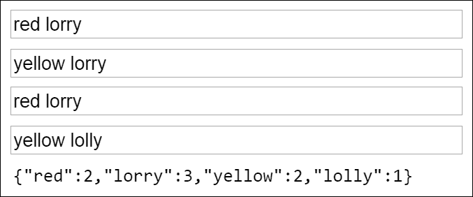
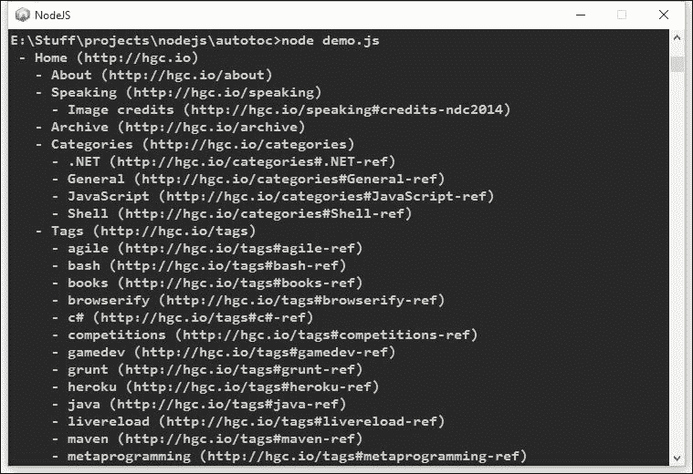
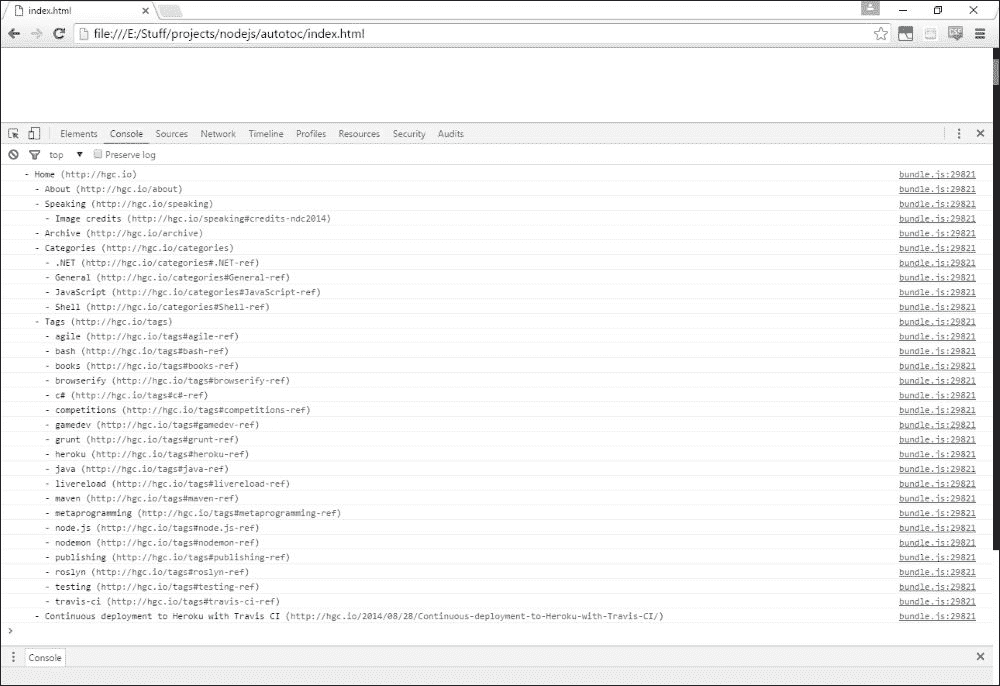
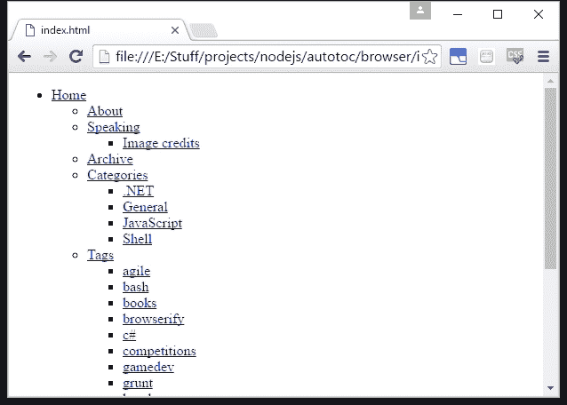

# 第十三章. 创建 JavaScript 包

到目前为止，我们已经构建了一个网络应用程序，在创建过程中使用了各种 npm 包。这些包包括 Express 这样的库和 Gulp 这样的命令行工具。现在我们将看看如何创建我们自己的包。

在本章中，我们将：

+   探索可用于 JavaScript 的不同模块系统

+   创建我们自己的 JavaScript 库

+   编写可以在客户端和服务器端运行的 JavaScript

+   创建一个 JavaScript 命令行工具

+   发布一个新的 npm 包

+   在浏览器环境中使用 Node.js 模块

### 注意

本章中的代码示例与我们迄今为止所做的一切都是独立的。

# 编写通用模块

我们已经编写了许多自己的模块作为我们应用程序的一部分。我们还可以编写库模块供其他应用程序使用。

当为他人编写代码时，考虑它在什么环境中有用是值得的。一些库仅在特定环境中有用。例如，Express 是服务器特定的，jQuery 是浏览器特定的。但许多模块提供在任何环境中都很有用的功能，例如，我们在这本书的其他地方使用的 `uuid` 模块等实用模块。

让我们看看如何编写适用于多个环境的模块。我们需要支持不仅仅是 Node.js 风格的模块。我们还需要支持客户端模块系统，如 RequireJS。回顾 第四章，*介绍 Node.js 模块*，Node.js 和 RequireJS 实现了两种不同的模块标准（分别是 CommonJS 和 **异步** **模块定义**（**AMD**））。我们的包也可能在没有任何模块系统的网站上作为客户端使用。

例如，让我们创建一个提供简单 `flatMap` 方法的模块。这将像 .NET 的 LINQ 中的 `SelectMany` 一样工作。它将接受一个数组和为每个元素返回一个新数组的函数。它将返回一个包含合并结果的单一数组。

作为 Node.js/CommonJS 模块，我们可以这样实现：

```js
module.exports = function flatMap(source, callback) {
    return Array.prototype.concat.apply([], source.map(callback));
}
```

## 比较 Node.js 和 RequireJS

回顾 第四章，*介绍 Node.js 模块*，每个模块系统都提供以下功能：

+   一种声明具有名称和自身作用域的模块的方法

+   定义模块提供功能的方法

+   将模块导入另一个脚本的方法

Node.js 实现了 CommonJS 模块标准。模块名称对应文件路径，每个文件都有自己的作用域。模块使用 `exports` 别名定义它们提供的功能。模块通过 `require` 函数导入。

RequireJS 是为浏览器环境设计的。在浏览器中，每个文件没有新的作用域（所有脚本文件都在同一个作用域中执行，并且可以查看相同的变量）。此外，模块必须通过网络请求而不是从本地文件系统加载。

RequireJS 实现了 AMD 标准。AMD 指定了两个函数，RequireJS 将这两个函数添加到浏览器环境中的顶级 `window` 对象中：

+   `define` 函数允许通过提供模块名称和工厂函数来创建新的模块。模块的作用域将是其工厂函数的作用域。模块的功能由工厂函数的返回值定义。

+   `require` 函数允许导入模块。尽管这个名字与 Node.js 中的模块导入函数相同，但它们的工作方式非常不同。可以指定多个模块名称进行导入（作为一个数组）。`require` 函数是异步的，并接受一个回调函数，当所有依赖项都加载完成后执行。这允许 RequireJS 在浏览器环境中有效地加载模块。

## 支持浏览器环境

为了使我们的模块在浏览器环境中工作，我们需要支持 AMD 标准，以便 RequireJS 可以工作。我们还需要适应不使用任何模块加载器的网站。我们可以通过以下方式扩展我们的模块定义来实现这一点，在 `scripts/flatMap.js` 中：

```js
(function (root, factory) {
    'use strict';
    if (typeof define === 'function' && define.amd) {
        define([], factory);
    } else if (typeof module === 'object' && module.exports) {
        module.exports = factory();
    } else {
        root.flatMap = factory();
    }
}(this, function () {
    'use strict';
    return function flatMap(source, clbk) {
        return Array.prototype.concat.apply([], source.map(clbk));
    }
}));
```

### 注意

注意使用立即调用的匿名函数，称为**立即执行的函数表达式**（**IIFE**）。这是在具有内置模块的 JavaScript 环境中创建隔离作用域的常见方法。

首先，我们检查 AMD 风格的 `define` 函数的存在（AMD 标准还指定了 `define.amd` 属性的存在）。请注意，`define` 函数的异步性质意味着我们需要使用工厂函数来创建我们的模块。我们将依赖项列表（在这种情况下为空）和我们的工厂函数提供给 `define` 函数以创建我们的模块。

如果没有 AMD 模块系统，我们将检查 Node.js 使用的 CommonJS 风格的 `module.exports`。最后，如果两个模块系统都不存在，我们将我们的模块作为 `root` 参数的一个属性提供。我们为这个参数的论点是全局作用域中评估的 `this` 关键字。在浏览器中，这将是指 `window` 对象。

## 使用 RequireJS 与 AMD 模块

让我们创建一个简单的网页来检查我们的模块是否与 RequireJS 正确工作。我们还将展示如何使用 RequireJS 与外部库 jQuery 一起使用。

首先，我们为页面定义一个 HTML 文件：

```js
<!DOCTYPE html>
<html>
    <head>
        <script data-main="scripts/main" src="img/require.min.js"></script>
        <style>input, pre { display: block; margin: 0.5em auto; width: 320px; }</style>
    </head>
    <body>
        <input type="text" />
        <input type="text" />
        <input type="text" />
        <input type="text" />
        <pre id="wordcounts"></pre>
    </body>
</html>
```

注意，页面上唯一的脚本标签是用于 RequireJS 自身的。此脚本标签还有一个数据属性，指示我们应用程序的入口点。路径 `scripts/main` 告诉 RequireJS 加载 `scripts/main.js`，它包含以下内容：

```js
requirejs.config({
    paths: {
        jquery: 'https://cdnjs.cloudflare.com/ajax/libs/jquery/2.2.1/jquery.min'
    }
});

require(['flatMap', 'jquery'], function(flatMap, $) {
    $('input').change(function() {
        var allText = $.map($('input'), function(input) {
            return $(input).val();
        }).filter(function(text) {
            return !!text;
        });
        var allWords = flatMap(allText, function(text) {
            return text.split(' ');
        });
        var counts = {};
        allWords.forEach(function(word) {
            counts[word] = (counts[word] || 0) + 1;
        });
        $('#wordcounts').text(JSON.stringify(counts));
    })
});
```

此脚本首先配置 RequireJS。这里指定的唯一 `config` 属性是 `path` 属性。键 `'jquery'` 下的 jQuery 路径告诉 RequireJS 如何解析 `'jquery'` 依赖项。我们不需要为 `flatMap.js` 指定路径，因为我们已经将它保存在与 `main.js` 相同的目录下。

接下来，我们使用`require`函数加载 flatMap 和 jQuery，并将它们传递到我们的主应用程序函数中。在较大的使用 RequireJS 的应用程序中，这通常是一个非常短的引导函数。`main.js`文件也是你通常会看到`require`调用的唯一地方。大多数应用程序代码都使用`define`声明的模块。

由于这只是一个使用 RequireJS 测试我们库的例子，我们将把其余的应用程序代码放在我们的主应用程序函数中。我们使用我们的 flatMap 模块和 jQuery 来计算和显示所有文本输入的单词数。你可以在浏览器中打开`index.html`来查看这个功能：



## 同构 JavaScript

上面的`flatMap.js`示例是通用模块定义模式的实现。有关此模式的注释模板，请参阅[`github.com/umdjs/umd`](https://github.com/umdjs/umd)。这些模板还展示了如何声明遵循此模式的模块之间的依赖关系。

更一般地说，编写在服务器和浏览器上都能达到相同结果的代码被称为**同构 JavaScript**。有关更多解释和此原则的示例，请参阅[`isomorphic.net/`](http://isomorphic.net/)。

# 编写 npm 包

如果你创建了一些对他人有用的代码，你可以将其作为 npm 包分发。为了演示这一点，我们将实现一些稍微复杂的功能。

### 注意

你可以在[`github.com/NodeJsForDevelopers/autotoc`](https://github.com/NodeJsForDevelopers/autotoc)找到本节示例代码。请注意，与之前的章节不同，这里没有每个提交每个标题的代码。本节其余部分的列表与代码的最终版本相匹配。

我们将实现一个通过爬取网站来生成**目录**（**ToC**）的工具。为此，我们将使用几个其他的 npm 包：

+   **request**提供了一个用于发起 HTTP 请求的 API，它比 Node.js 内置的 http 模块更高级，使用起来也更简单

+   **cheerio**提供了在浏览器环境之外类似 jQuery 的 HTML 遍历功能

+   **denodeify**，在第八章掌握异步编程中提到，允许我们使用带有承诺而不是回调的请求库

### 提示

对于`npm`包来说，依赖其他包是很常见的。但如果你想让你的包对其他开发者更有吸引力，那么最小化你的包的依赖是有意义的。具有许多传递性依赖的包可能会给应用程序添加很多冗余，并使开发者更难确信他们理解了他们应用到应用程序中的所有内容。

我们模块的代码如下，如`autotoc.js`中所示：

```js
'use strict';

const cheerio = require('cheerio');
const request = require('denodeify')(require('request'));
const url = require('url');

class Page {
  constructor(name, url) {
    this.name = name;
    this.url = url;
    this.children = [];
  }

  spider() {
    return request(this.url)
      .then(response => {
        let $ = cheerio.load(response.body);
        let promiseChildren = [];
        $('a').each((i, elem) => {
          let name = $(elem).contents().get(0).nodeValue;
          let childUrl = $(elem).attr('href');
          if (name && childUrl && childUrl !== '/') {
            let absoluteUrl = url.resolve(this.url, childUrl);
            if (absoluteUrl.indexOf(this.url) === 0 &&
                  absoluteUrl !== this.url) {
              let childPage = new Page(name.trim(), absoluteUrl);
              if (childUrl.indexOf('#') === 0) {
                promiseChildren.push(Promise.resolve(childPage));
              } else {
                promiseChildren.push(childPage.spider());
              }
            }
          }
        });
        return Promise.all(promiseChildren).then(children => {
          this.children = children;
          return this;
        });
      });
  }
}

module.exports = baseUrl => new Page('Home', baseUrl).spider();
```

我们不需要理解每一行，因为我们更感兴趣的是它将被如何打包。重要的一点是：

+   我们加载起始页面，然后通过链接跳转到其他页面，并递归地处理这些页面以构建整个目录表（ToC）

+   我们只跟随比当前页面更具体的 URL（即子路径）的链接，所以我们不会陷入无限循环

+   在每个级别，我们并行加载所有子页面，并使用 `Promise.all` 来组合结果

我们还会添加一个简单的模块，将目录表（ToC）打印到控制台，如下所示 `consolePrinter.js`：

```js
'use strict';
const printEntry = function(entry, indent) {
        console.log(`${indent} - ${entry.name} (${entry.url})`);
        entry.children.forEach(childEntry => {
            printEntry(childEntry, indent + '  ');
        })
    }

module.exports = toc => printEntry(toc, '');
```

## 定义 npm 包

要定义一个 npm 包，我们必须添加一个文件作为我们包的入口点。这将只适当地暴露内部模块，如下所示 `index.js`：

```js
'use strict';
module.exports = require('./autotoc.js');
module.exports.consolePrinter = require('./consolePrinter.js');
```

我们还需要添加一个 npm `package.json` 文件来定义我们包的元数据。要创建此文件，你可以在命令行中运行 `npm init` 并按照提示操作。在我们的例子中，生成的文件如下所示：

```js
{
  "name": "autotoc",
  "version": "0.0.1",
  "description": "Automatic table of contents generator for websites",
  "main": "index.js",
  "author": "hgcummings <npmjs@hgc.io> (http://hgc.io/)",
  "repository": "https://github.com/NodeJsForDevelopers/autotoc",
  "license": "MIT",
  "dependencies": {
    "cheerio": "⁰.20.0",
    "denodeify": "¹.2.1",
    "request": "².69.0"
  }
}
```

我们之前已经使用过 `package.json` 文件来指定 `npm install` 的依赖项。当将包发布到 `npm` 时，其他字段变得尤为重要。注意，我们使用 `main` 属性来指定我们包的入口点。实际上，`index.js` 是默认值，但明确指定可以使这更清晰。

# 将包发布到 npm

一旦我们定义了包的元数据，将其发布到 npm 就非常直接：

+   如果你还没有 npm 账户，可以通过运行 `npm adduser` 并指定用户名和密码来创建一个

+   使用 `npm login` 登录

+   在包的 `root` 文件夹中，运行 `npm publish`

那就是我们需要做的全部！我们的包现在将出现在全局 npm 仓库中。我们可以通过（在一个新文件夹中）运行 `npm install autotoc` 并编写以下简单的演示脚本（如下所示 `demo.js`）来使用它：

```js
'use strict';
const autotoc = require('autotoc');
autotoc('http://hgc.io')
    .then(autotoc.consolePrinter, err => console.log(err));
```

在命令行中运行 `node demo.js` 产生以下输出：



## 在网络上运行自动化客户端

对自己的网站运行此类工具是可以的。这类技术有许多用例。例如，一个爬遍整个网站并检查每一页的脚本可以是一个有用的集成/烟雾测试。

涉及爬取你并不拥有的网站的用例需要更加小心。任何你可以在浏览器中访问的公开网站，你也可以使用像这样的自动化客户端访问。但是，对同一主机发出大量自动化请求是不受欢迎的。这最多被认为是不良礼仪，最坏的情况可能是 **拒绝服务**（**DoS**）攻击。

客户端应设置适当的 `User-Agent` HTTP 头部。一些服务器可能会拒绝没有指定 `User-Agent` 或看起来不是浏览器的客户端的请求。按照惯例，爬虫应发送包含单词 *bot* 的 `User-Agent`，并理想情况下提供一个可以了解更多关于爬虫信息的 URL。请求库通过传递一个选项对象来轻松指定头部。例如：

```js
let options = {
  url: 'http://hgc.io',
  headers: {
    'User-Agent': 'Examplebot/1.0 (+http://example.com/why-im-crawling-your-website)'
  }
};
request(options).then(...);
```

爬虫也应该检查每个网站的 `robots.txt` 文件，并尊重其中包含的任何规则。更多信息请见 [`www.robotstxt.org/robotstxt.html`](http://www.robotstxt.org/robotstxt.html)。

最后，第三方网站的合法爬虫也应该限制其请求的速率，以避免服务器过载。

## 发布独立工具到 npm

本书到目前为止使用的某些 `npm` 包是命令行工具而不是库，例如 Gulp。创建命令行工具包非常简单。首先，我们需要定义用户可以从命令行调用的脚本，如 `cli.js` 中所示：

```js
#!/usr/bin/env node
'use strict';
const autotoc = require('./autotoc.js');
const consolePrinter = require('./consolePrinter.js');
autotoc(process.argv[2])
    .then(consolePrinter, err => console.log(err));
```

这看起来与之前的演示脚本非常相似，但有几点不同：

+   脚本开头的一行（称为 **shebang 行**，以 `#!` 开头）指示操作系统使用 Node.js 来执行此脚本。

+   要爬取的 URL 来自命令行参数

现在我们只需要在 `package.json` 中指定这个脚本：

```js
{
  "name": "autotoc",
  "version": "0.1.1",
  "description": "Automatic table of contents generator for websites",
  "main": "index.js",
 "bin": {
 "autotoc": "./cli.js"
 },
  "author": "hgcummings <npmjs@hgc.io> (http://hgc.io/)","repository": "https://github.com/NodeJsForDevelopers/autotoc",
  "license": "MIT",
  "dependencies": {
    "cheerio": "⁰.20.0",
    "denodeify": "¹.2.1",
    "request": "².69.0"
  }
}
```

要发布我们的更新包，我们首先需要更新我们的版本号。你可以在包中直接更新或在 `npm` 中使用版本命令，例如

```js
> npm version minor

```

这会自动将版本号更新到下一个主/次/补丁版本（如指定），并创建一个新的 git 提交来反映这一变化。

由于我们已经在 npm 中登录，现在我们可以通过再次运行 `npm publish` 来发布我们包的新版本。

我们现在可以这样使用我们的 CLI 工具（在一个新的命令提示符窗口中）：

```js
> npm install -g autotoc
> autotoc http://hgc.io

```

# 在浏览器中使用 Node.js 模块

在本章开头，我们讨论了创建可以在 Node.js 或浏览器中运行的通用模块。我们还可以让我们的代码在这两种环境中运行。

Browserify ([`browserify.org/`](http://browserify.org/)) 允许你在浏览器中使用 Node.js 模块。它将你的代码及其依赖项打包在一起。它还提供了浏览器兼容的垫片来模拟 Node.js 内置模块。

你可以通过 npm 安装 Browserify：

```js
> npm install -g browserify

```

Browserify 通常用于打包应用程序。例如，如果我们想打包上一节中演示的 autotoc 使用，我们可以运行：

```js
> browserify demo.js -o bundle.js

```

Browserify 将创建一个包含 `demo.js` 代码及其依赖项和传递依赖项的单个 JavaScript 文件。如果我们将其包含在 HTML 页面中，现在我们可以在浏览器控制台中看到它的工作情况：



你还可以使用 Browserify 生成符合浏览器规范的独立模块文件，遵循本章前面讨论的通用模块定义模式。例如，为了从上一节创建 `autotoc.js` 模块的 UMD 版本，我们可以运行：

```js
> browserify autotoc.js -s autotoc -o browser/scripts/autotoc.js

```

我们现在可以利用 RequireJS 来使用它。让我们创建一个简单的应用程序，该应用程序使用 autotoc 与 jQuery 一起生成 HTML 目录。首先我们需要一个 HTML 文件来包含我们的应用程序并包含 RequireJS，如 `browser/index.html` 中所示：

```js
<!DOCTYPE html>
<head>
    <script data-main="scripts/main" src="img/require.min.js"></script>
</head>
<body>
</body>
```

现在，我们可以实现我们的应用程序本身，如 `browser/scripts/main.js` 中所示：

```js
requirejs.config({
  paths: {
    jquery: 'https://cdnjs.cloudflare.com/ajax/libs/jquery/2.2.1/jquery.min'
  }
});
require(['autotoc', 'jquery'], function(autotoc, $) {
  'use strict';
  autotoc('http://hgc.io').then(toc => {
    let printEntry = function(entry, parent) {
      let list = $(document.createElement('ul'));
      list.append(
        `<li><a href="${entry.url}">${entry.name}</a></li>`);
      entry.children.forEach(childEntry => {
        printEntry(childEntry, list);
      })
      parent.append(list);
    }

    printEntry(toc, $('body'));
  }, err => console.log(err));
});
```

这将产生以下输出：



## 控制 Browserify 的输出

注意，默认情况下，Browserify 会生成一个包含您的代码及其所有依赖项的包。包括传递依赖项，这可能导致一个非常大的文件。autotoc 模块只有 42 行长，但生成的包却有超过 80,000 行！我们上面的应用程序包括 jQuery（通过 RequireJS）和 Cheerio 的一个版本（通过 Browserify）。这尤其浪费，因为 Cheerio 的大部分是 jQuery 的重新实现。

您可以指示 Browserify 排除特定的模块以及排除所有外部模块。这对于遵循 UMD 模式的第三方模块尤其有用。这些模块不需要被 *browserified*，并且可以从生成的包中排除。然后您可以在浏览器中单独加载它们，通过额外的脚本标签或使用 RequireJS。

关于 Browserify 使用选项的更多信息，请参阅官方文档[`github.com/substack/node-browserify#usage`](https://github.com/substack/node-browserify#usage)。

Browserify 为以不同方式打包模块提供了很多灵活性。当在具有服务器端和客户端功能的单一代码库上工作时尤其有用。它允许您使用 Node.js 风格的模块编写所有代码，并轻松地在服务器和客户端之间共享模块。

# 摘要

在本章中，我们编写了一个遵循通用模块定义模式的跨环境模块，为库和命令行工具创建了一个 npm 包，并使用 Browserify 将 Node.js 代码打包到浏览器中。

这展示了 Node.js 的灵活性和 JavaScript 以及 npm 在服务器端代码之外的用例范围。在最后一章中，我们将探讨 Node.js 的更广泛背景。我们将看到一些针对该平台的新语言和即将推出的语言特性，以及 Node.js 如何与其他平台如 .NET 交互。
