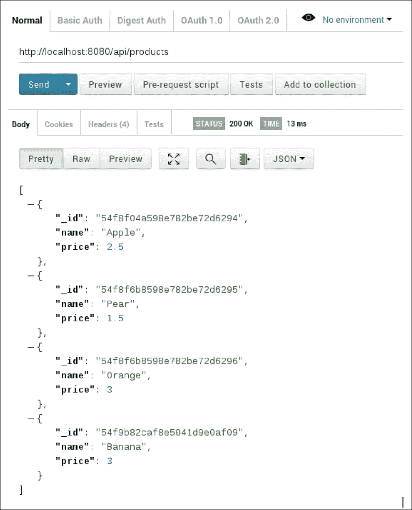
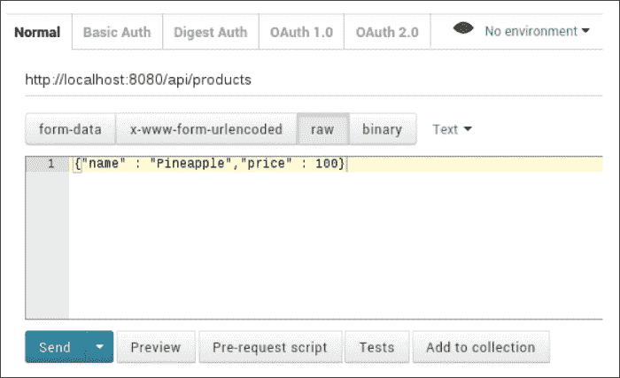
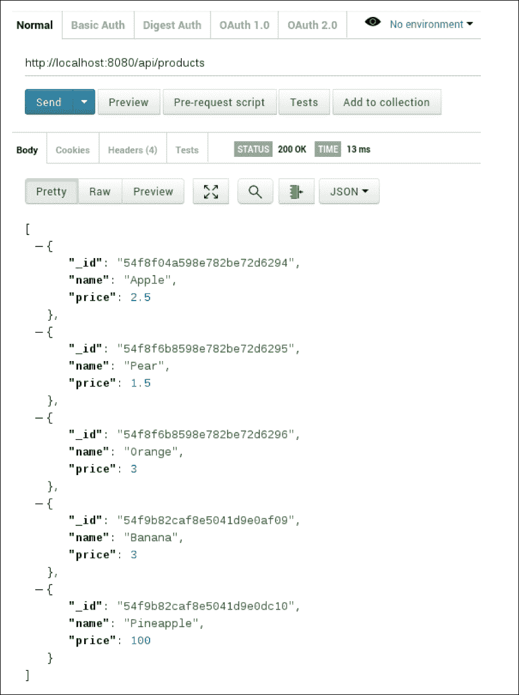

# 第三章：创建 API

无论您的后端有多复杂，除非您以某种方式使其服务对客户可用，否则它很可能没有用处。最常见的方法是通过**应用程序编程接口**（**API**）——一组为您的后端定义的明确定义的访问方法。通过这种方式，您允许客户端请求数据，执行计算，并请求其提供的其他服务。

在本章中，我们将看看如何根据广泛使用的**表述状态转移**（**REST**）架构构建这样的 API。我们将介绍 REST 的理论基础，然后看看如何根据我们的需求使用 Node.js 实现其简化版本。最后，我们将通过 REST 客户端访问 API，以了解其实际运行方式。

# RESTful API 的学习成果

阅读完本章后，您将了解什么是 RESTful API 以及它的结构。您还将彻底了解如何在 Node.js 中定义数据访问点，并通过 REST 客户端使用这些数据。

# 轻松 REST

互联网时代最大的挑战之一始终是使网络化服务以统一和高效的方式相互通信。这就是为什么我们今天依赖于诸如至关重要的 TCP/IP 协议栈等通信协议的原因。这些协议使应用程序之间的正式通信过程变得简单，至少就实际的数据字节而言是这样。

然而，没有单一的事实规范规定应用程序应如何相互通信数据抽象。原始的 TCP/IP 只理解数据包的交换；它对于顾客、订单或产品等抽象一无所知。为了提高抽象级别并构建一个允许与我们的后端直观通信的接口，我们将不得不依赖于一个或多个架构模式的自定义实现，以便获得我们想要的结果。今天，有几种广泛使用的这种模式。您可能已经熟悉诸如 SOAP、WSDL，甚至我们在这里的目标——REST 等术语。

# 这都是超媒体

REST 是一种架构模式，其中两个或多个应用程序通过一组对这些资源的操作来交换资源。这些资源是所有涉及的应用程序（例如产品、客户等）都知道的数据类型集。例如，客户端应用程序可以要求服务器应用程序提供其存储的特定类型的所有资源的列表，或者要求服务器在其数据库中注册给定资源的新实例。所有这些操作都仅通过使用标准的 HTTP 协议进行通信，这使得该过程既直观又易于实现。

在 RESTful 通信的核心是常见的 HTTP 动词——**GET**、**POST**、**PUT**和**DELETE**。就流行的**CRUD**（**创建/读取/更新/删除**）首字母缩写而言，**C**对应于**POST**，**R**对应于**GET**，**U**对应于**PUT**，最后**D**对应于，嗯，**DELETE**。如果您熟悉 HTTP，您将已经知道这些动词代表两个 HTTP 应用程序之间发送的不同请求类型。例如，当您在浏览器的 URL 字段中键入`www.google.com`并按下*Enter*键时，浏览器将向 URL 绑定的服务器发出一个`GET`请求，要求其返回服务器上的任何数据。通常，这些数据以标准格式（如**HTML**、**XML**或**JSON**）呈现。同样，当您在网页上填写表单并按下**提交**按钮（或其等效物）时，通过`POST`请求将请求数据发送到服务器，服务器将处理您输入的请求数据。

如前所述，REST 通过使用这些动词来通信涉及方知道的各种资源的操作。例如，在我们的情况下，我们可能想通过使用 RESTful 请求来告诉服务器以下内容：

+   获取服务器上所有可用的产品（动词是`GET`）

+   获取具有 ID`abcd1234`的产品（动词是`GET`）

+   为具有 ID`xyz456`的客户下一个名为`abcd1234`的产品（动词是`POST`）的新订单

+   将具有 ID`abcd1234`的产品的价格更新为 5 亿美元（动词是`PUT`）

+   删除具有 ID`abcd1234`的产品，因为没有人再购买它（动词是`DELETE`）

按照惯例，REST 使用以下常见的基本 URL 结构来操作给定资源（方括号中的元素是可选的）：

```js
http://<domain>/[api name]/[api version]/<resource>
```

对于我们的产品示例，此资源的 RESTful 基本 URL 如下：

`http://myserver.com/myapi/v1/products`

在接下来的部分中，我们将演示如何使用 HTTP 动词实际执行这些操作。

## GET

在 REST 的上下文中，GET 请求总是表示检索操作。因此，我们说 GET 请求是常见动词中唯一的非变异请求，因为它们不会改变服务器上关联资源的状态。

在 REST 中，任何 API 理想情况下都应该实现两种标准的 GET 操作：

### 获取所有

以下是 GET 所有操作的关键特征：

+   它向资源的基本 URL 发送一个空的 GET 请求

+   返回给定类型的所有资源

+   GET all 操作提供的资源示例是`http://myserver.com/myapi/v1/products`。

### 按 ID 获取

以下是按 ID 操作的关键特征：

+   它返回具有特定 ID 的资源

+   这种操作的示例是`http://myserver.com/myapi/v1/products/abcd1234`（使用路径参数）或`http://myserver.com/myapi/v1/products?id=abcd1234`（使用查询参数）

您应该使用路径参数还是查询参数完全取决于您，并且不是 REST 约定所要求的。在这里以及本书的其余部分，我们将使用查询参数，因为这是正常的 HTTP 操作方式，而且更容易理解和实现。

## POST

POST 请求用于创建给定资源的新实例。通常，传统的 REST 服务器将提供关于需要指定以使创建成功的资源字段的文档。

## PUT

PUT 用于创建或更新资源。它的工作方式几乎与 POST 相同，唯一的区别是，如果您在请求中提供资源 ID，服务器将首先查找该特定资源，然后用请求中相应字段替换该资源的每个字段。

例如，考虑这样一种情况，您的服务器有一个产品类型的资源，如下所示：

```js
{
  name: 'Apple',
  price: 50,
  id: 'abcd1234'
}
```

假设您提交了一个带有以下表单数据的`PUT`请求：

```js
{
  id: 'abcd1234'
  price: 500000000,
}
```

在交易结束后，相同的资源将在服务器上具有以下状态：

```js
{
  name: "Apple",
  price: 500000000,
  id: "abcd1234"
}
```

## DELETE

DELETE 用于删除服务器上的资源。您只需在请求中提供资源 ID 即可。例如，向`http://myserver.com/myapi/v1/products/abcd1234`发送`DELETE`请求将删除服务器上 ID 为`abcd1234`的产品。

# 使用 Node.js 构建 RESTful API

现在我们已经介绍了 REST 的基础知识，让我们将其付诸实践，并为上一章中构建的`OrderBase`构建一个 API。如果您还没有这样做，请花一点时间回顾我们在那里编写的代码，以确保您了解我们的 API 与此示例中的数据库之间发生了什么。

## 设置 RESTful API

首先，创建一个工作区为我们的服务器。在您的驱动器上，创建一个名为`order_api`的文件夹，进入此文件夹，并创建并执行名为`api.js`的文件。最后，打开终端并执行以下操作：

```js
npm init

```

正如我们在上一章中看到的，这将给您一些问题需要回答，以便引导 Node.js 服务器。当问题询问您入口点时，请务必指定`api.js`，因为这是您的服务器配置将从中读取的主文件。

接下来，您需要导入我们在第二章中创建的数据库接口模块，*使用 MongoDB 配置持久性*。为此，首先安装`mongodb`驱动程序：

```js
npm install mongodb

```

然后，您可以以两种方式导入模块本身：

+   将`database.js`文件从上一章复制并粘贴到当前目录，并将`var database = require('./database');`添加到您的`api.js`文件的顶部。

+   在您的`api.js`文件顶部添加`var database = require([pathToDatabase])`，其中`[pathToDatabase]`是您的`database.js`文件的完整系统路径

完成后，打开`api.js`文件。让我们开始为我们的 API 添加一些代码。

## HTTP 模块

我们首先需要一种方法来实际打开 Node.js 实例到网络，并使其能够通过 HTTP 协议进行通信，因为这将是我们 API 功能的核心驱动程序。

为了实现这一点，我们将在服务器中包含标准的 HTTP 模块。将以下行添加到您的`api.js`文件的顶部：

```js
var http = require('http');
```

这将导致 Node.js 加载 HTTP 模块，这是一个强大的组件，可用于监听和处理 HTTP 请求，以及向客户端发送响应。

现在，有了模块，让我们让 Node.js 开始监听并响应简单的 HTTP 请求。将以下内容添加到您的文件中：

```js
var server = http.createServer(function (req, res) {
    res.writeHead(200);
    res.end("I am a fledgling API, and I am alright");
});
server.listen(8080);

console.log('Up, running and ready for action!');
```

就是这样！如果这是您第一次使用 HTTP 模块，您可能会对这个设置有多简单感到惊讶。不是每天你都会用七行代码编写一个完全功能的 HTTP 服务器！Node.js 就是这么好。

让我们运行服务器，确保它工作正常。打开您喜欢的浏览器，导航到*http://localhost:8080*。您将看到以下文本行：

**我是一个新生的 API，我很好**

一切都很好。我们现在准备开始让我们的 API 做一些比一遍又一遍显示相同文本更有趣的事情。但是，首先让我们更仔细地看看 HTTP 模块实际上是如何工作和服务请求的。

## 解剖 HTTP 服务器

查看我们的服务器代码，我们实际上只做以下两件事：

1.  为我们的服务器配置事件循环是每当有 HTTP 请求进来时应该做的事情。这是通过调用`http.createServer()`方法来完成的，该方法将一个回调函数作为参数，该函数将对每个传入的请求执行。

1.  将服务器绑定到主机机器上的给定网络端口，并开始监听该端口上的传入连接。

第一项中有趣的部分是回调函数：

```js
function (req, res) {
  res.writeHead(200);
  res.end("I am a fledgling API, and I am alright");
}
```

此方法接受两个参数，`req`和`res`。您可能已经猜到，它们指的是 HTTP *请求*和相关的*响应*。`req`参数将包含与传入的 HTTP 请求相关的所有数据，例如来源、标头、有效负载、cookie 等。`res`参数是 HTTP 响应，当方法返回时将被发送回调用者。

您可能会想知道为什么响应作为参数传递给显然处理传入请求的函数。这是一个设计问题。`res`参数实际上是在函数外部创建的，并传递给它，以便您可以在 HTTP 模块再次控制之前对其进行任何修改，最终确定它，并将其发送回发送者。

在我们的函数中，我们只做以下两件事：

+   我们将响应的响应代码设置为*200*，表示成功的请求周期。

+   我们将一个字符串附加到响应的主体（即有效载荷）中 - “我是一个新生的 API，我很好”。

就处理和响应请求而言，就是这样了！

让我们把它用起来，开始返回一些更有趣的东西。

## 返回 JSON

通常，REST API 将支持以几种不同的格式提供数据，比如 JSON 和 XML。为了简单起见，我们只关注 JSON。在我们迄今为止所看到的上下文中，这是有道理的，因为高低一切都是 JavaScript - 而且本来就是面向 JSON 的。

值得庆幸的是，向我们的调用者返回一个 JSON 对象几乎是微不足道的；我们只需要在回调函数中做一些调整：

+   指定响应的内容类型为 JSON

+   将我们要发送回去的 JSON 对象转换为一个字符串

第一个调整是通过修改响应的`Content-Type`头部来完成的。在您的代码中，您有以下代码行：

```js
res.writeHead(200);
```

您可以将其更改为以下代码行：

```js
res.writeHead(200, {'Content-Type': 'application/json'});
```

传递给`writeHead()`方法的这个额外参数是一个 JSON 对象，其中包含响应对象中头部的自定义值。如果您不指定头部，HTTP 模块通常会设置合理的默认值，但是当您确定一个头部应该设置为什么时，您应该始终明确。在这里，我们希望向客户端明确地表明我们正在发送一个 JSON 对象作为响应，并相应地设置`Content-Type`头部。

为了解决第二个问题，让我们首先添加一个要发送回客户端的 JSON 对象。在`res.writeHead()`方法之后，添加以下内容：

```js
var myProduct = {
  name: 'Apple',
  price: 600
};
```

接下来，我们需要将这个 JSON 对象转换为一个字符串，以便将其打包到响应中。为此，我们可以使用原生的 Javascript `JSON.stringify()` 方法。正如预期的那样，这个方法接受一个 JSON 对象，并返回该对象的字符串表示。修改以下行：

```js
res.end('I am a fledgling API, and I am alright');
```

将前面的行更改为以下内容：

```js
res.end(JSON.stringify(myProduct));
```

我们完成了！保存您的更改，重新启动 Node.js 实例（只需关闭并重新启动它），并刷新服务器的浏览器窗口。您将看到以下文本：

```js
{
  'name':'Apple',
  'price':600
}
```

现在我们有一个完整的、提供 JSON 的 HTTP 服务器在运行。是时候认真对待这件事了。

# 实现我们的 GET 处理程序

让我们从为我们的资源实现基本的 GET 方法开始。您可能还记得我们之前提到过，一个良好的 REST API 至少应该实现其中的两个 - 按 ID 获取和获取所有。由于我们喜欢符合标准，这就是我们将在这里使用的。

## 实现路由器

我们的首要任务是为我们的 Node.js 实例提供一种区分它接收到的请求的不同 URL 的方法。到目前为止，我们的服务器只需要处理对其根 URL（`http://localhost:8080/`）的请求，但为了做一些更有趣的事情，我们希望能够为更具体的 URL 生成定制的响应，比如`http://localhost:8080/api/products`。

值得庆幸的是，Node.js 再次提供了一种开箱即用的方法来实现这一点 - URL 模块。

在`var http = require('http');`行之后添加以下内容：

```js
var URL = require('URL');
```

这将导入 URL 模块。我们现在可以使用它来分解传入的请求，并根据它们的 URL 结构采取行动。

将`http.createServer()`调用修改为以下内容：

```js
var server = http.createServer(function (req, res) {

  // Break down the incoming URL into its components
  var parsedURL = URL.parse(req.URL, true);

  // Determine a response based on the URL
  switch (parsedURL.pathname) {
    case '/api/products':
    // Find and return the product with the given id
    if (parsedURL.query.id) {
      findProductById(id, req, res);
    }
    // There is no id specified, return all products
    else {
      findAllProducts(req, res);
    }
    break;
    default:
    res.end('You shall not pass!');
  }
});
```

请注意，我们引入了两个新方法，`findAllProducts` 和 `findProductById`。这些是实用方法，我们将单独定义它们。除此之外，我们将定义一些通用的辅助方法，以帮助我们减少数据访问的繁琐性。在`createServer()`调用之前添加以下内容：

```js
// Generic find methods (GET)

function findAllResources(resourceName, req, res) {
  database.find('OrderBase', resourceName, {}, function (err, resources) {
  res.writeHead(200, {'Content-Type': 'application/json'});
  res.end(JSON.stringify(resources));
  });
};

var findResourceById = function (resourceName, id, req, res) {
  database.find('OrderBase', resourceName, {'_id': id}, function (err, resource) {
  res.writeHead(200, {'Content-Type': 'application/json'});
  res.end(JSON.stringify(resource));
  });
};

// Product methods

var findAllProducts = function (req, res) {
  findAllResources('Products', req, res);
};

var findProductById = function (id, req, res) {
  findResourceById('Products', id, req, res);
};
```

通用方法很简单。它们只是利用我们在第二章中创建的 MongoDB 接口，以便从特定集合中检索所有文档，或者仅通过其 ID 检索单个文档。特定的产品方法利用这些通用方法以此方式查找产品。

为了简洁起见，我们在这里不为客户和订单实现类似的方法；它们与用于产品的方法相同。只需更改资源的名称，并在`createServer()`方法中添加适当的路径。您可以在附带书籍的源代码中看到完整的示例。

## 实现我们的 POST 处理程序

现在，我们将继续添加处理程序以创建资源的新实例。为此，我们不仅需要区分 URL，还需要区分请求类型。修改您的`createServer()`调用，使其看起来像下面这样：

```js
var server = http.createServer(function (req, res) {

  // breaks down the incoming URL into its components
  var parsedURL = URL.parse(req.URL, true);

  // determine a response based on the URL
  switch (parsedURL.pathname) {
    case '/api/products':
    if (req.method === 'GET') {
      // Find and return the product with the given id
      if (parsedURL.query.id) {
        findProductById(id, req, res)
      }
      // There is no id specified, return all products
      else {
        findAllProducts(req, res);
      }
    }
    else if (req.method === 'POST') {

      //Extract the data stored in the POST body
      var body = '';
      req.on('data', function (dataChunk) {
        body += dataChunk;
      });
      req.on('end', function () {
        // Done pulling data from the POST body.
        // Turn it into JSON and proceed to store it in the database.
        var postJSON = JSON.parse(body);
        insertProduct(postJSON, req, res);
      });
    }
    break;
    default:
    res.end('You shall not pass!');
  }
});
```

请注意，我们引入了另一个处理程序方法`insertProduct()`。我们定义它，以及与之对应的通用方法，就像之前一样：

```js
// Generic insert/update methods (POST, PUT)

var insertResource = function (resourceName, resource, req, res) {
  database.insert('OrderBase', resourceName, resource, function (err, resource) {
  res.writeHead(200, {'Content-Type': 'application/json'});
  res.end(JSON.stringify(resource));
  });
};

// Product methods

var insertProduct = function (product, req, res) {
  insertResource('OrderBase', 'Product', product, function (err, result) {
  res.writeHead(200, {'Content-Type': 'application/json'});
  res.end(JSON.stringify(result));
  });
};
```

同样，对于其他资源的此功能的实现方式相同，唯一的区别是名称。我们在这里不再重复。

## 实现 DELETE 和 PUT 处理程序

处理 DELETE 和 PUT 与处理 GET 和 POST 请求类似，唯一的区别是方法的改变。因此，我们建议您参考附带的源代码以查看完整的实现。

## 测试 API

到目前为止，我们已经使用普通浏览器来调用我们的 API 并查看返回的内容。然而，这远非最佳选择。大多数浏览器只能轻松发送 GET 请求，而发送 POST 请求需要使用 HTML 表单或类似的东西。更不用说 DELETE 和 PUT 请求了。

要测试 REST API，最好使用专用的 REST 客户端，这将为您提供更多选项，使发送请求更容易，并彻底分析响应。一个非常流行（并且免费）的工具是 Postman，它是一个 Chrome 扩展程序。它可以在所有主要操作系统上运行。您可以从[`www.getpostman.com/`](https://www.getpostman.com/)免费下载。安装过程非常简单，这里不再介绍。

安装了 Postman 后，启动它。让我们向我们的 API 发送请求。首先，让我们尝试要求后端向我们发送当前存储的所有产品。在 Postman 的 URL 字段中输入产品的根 URL，确保在右侧的组合框中选择 GET，然后点击**发送**按钮。您应该会得到类似以下截图的内容：



现在，让我们尝试向后端 POST 一个新产品。保持相同的 URL，但在右侧的组合框中将方法更改为 POST。然后，在发送之前添加一些数据；在 URL 字段下的按钮组中选择**原始**，并输入以下内容：



点击**发送**以发送请求（注意这比使用普通浏览器要容易得多）。最后，让我们再次获取所有产品，以确保新产品确实已添加：



就是这样！我们的 API 正在运行，我们准备开始朝着严肃的使用迈进。

# 继续前进

在本章中，我们研究了最基本的知识，并通过仅使用核心 Node.js 模块提供的功能从头开始构建了我们的 API。我们这样做是为了向您展示 Node.js 在现实中的工作方式，并避免将您绑定到已经实现我们在这里实现的功能的任何给定框架，以防您在自己的职业生涯中使用其他框架。

话虽如此，作为附言，我们仍然想向您指出一些我们自己推荐的框架，以便快速使用 Node.js 构建强大的 API：

+   **Express.js**：Express 是一个可以用来使用 Node.js 构建强大、完整的 Web 应用程序的框架。它具有许多强大的功能，包括高级路由器，使得根据 URL 处理传入请求非常容易（忘掉我们在这里使用的 switch 和 if 语句），提取、解析和验证数据，连接到外部数据源等等。

Express.js 在很大程度上被视为 Node.js 的事实框架，并且有一个庞大的社区和可用的插件，使得很容易找到所需的帮助和额外功能。

### 注意

有关此框架的更多信息，请访问[`expressjs.com/`](http://expressjs.com/)。

+   **Loopback.js**：这是由创建 Express.js 的同一团队开发的。Loopback.js 是 Express.js 的派生版本，专门用于创建 API。它配备了一个强大的终端界面，您可以在其中快速创建和修改资源、资源之间的关系、安全性等等。Loopback 会自动生成资源的完整 RESTful API，这意味着您几乎不需要为本章中我们所看到的例子等情况编写任何代码。

### 注意

有关此框架的更多信息，请访问[`loopback.io`](http://loopback.io)/。

# 总结

现在，您应该对 RESTful API 的基本概念有了很好的理解，以及如何使用 Node.js 实现它们并从网络访问它们。

在下一章中，我们将继续改进我们的 API，并展示如何对其进行安全保护，以防止未经授权访问您的资源。
