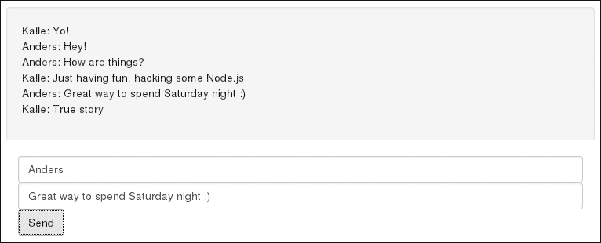
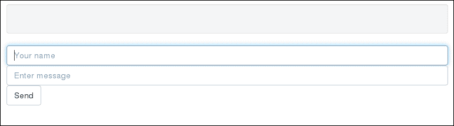
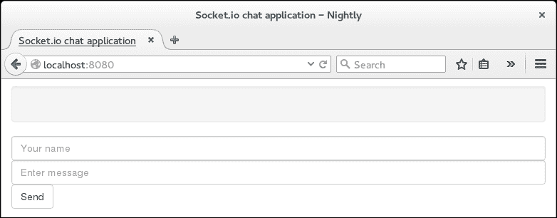

# 第五章：实时数据和 WebSockets

在本章中，我们将向您展示如何使用 WebSockets 实现实时数据通信。这将允许您的服务器直接与连接的客户端进行通信，而无需在客户端进行任何轮询。

*我真的很想要一次双向对话，约翰*

在其初始阶段，互联网并不是一个双向通道。传统的客户端-服务器架构是主导地位，服务器与客户端进行通信几乎是闻所未闻的（并且很可能在某种程度上也被一些人视为异端邪说）。

然而，从诸如**Internet Relay Chat**（**IRC**）这样的协议开始，实时聊天应用程序很快就成为了随着时间的推移而迅速增长的杀手级应用程序，在普通用户中间大受欢迎（如果你记得**即时消息计算机程序**（**ICQ**），是的，你感到的是怀旧）。实时特性很快就跨越到了 HTTP 世界，导致基于浏览器的聊天服务随处可见。与此同时，相关概念，如推送通知，也变得越来越受欢迎，特别是随着智能手机的出现。

# 轮询

今天，实时特性已经成为我们所知的互联网的一个组成部分。然而，它们的实施并不总是最佳的。特别是在早期阶段，实时数据通信几乎总是通过使用轮询来实现的，这是一种技术，客户端定期联系服务器以检查其状态是否发生了变化。如果有变化（比如说，如果有新消息可用），服务器会通过发送更新后的状态来回应。不用说，轮询是一种浪费资源的方法。此外，它会导致编程变得相当混乱，因为我们发现自己只是不断地请求更新，而不是等待并在实际发送时采取行动。

# WebSockets

为了避免轮询，我们需要一个全双工的解决方案，其中服务器可以直接与客户端进行通信，而无需后者的主动性。今天，也许最先进和普遍的解决方案是**WebSocket**协议。**WebSocket**协议是客户端和服务器之间的直接双向连接，通过 TCP 协议进行通信。它的结构允许连接的双方都可以自行启动数据传输。WebSockets 在 2011 年标准化，并得到了所有主要浏览器的支持。

# 在 Node.js 中使用 WebSockets

Node.js 并不提供默认的模块来使用 WebSockets。虽然我们迄今为止一直试图避免使用第三方解决方案，只是向您展示如何使用**原生 node**，但这个主题足够复杂，超出了本书的范围，因此在本章的其余部分，我们将使用优秀的 `socket.io` 库。当然，我们并不意味着这就是您应该在自己的工作中使用的，而在第六章 *介绍 Ionic* 中，章节末尾的 *进一步阅读* 部分，我们将为您指出 WebSockets 的替代解决方案和阅读材料。

## 设置我们的项目

我们将为本章设置一个单独的项目，演示如何创建一个简单的聊天应用程序，展示使用 WebSocket 的基本要点。

创建一个单独的项目文件夹，并将其命名为 `chat-app`。在此文件夹中，创建一个名为 `app.js` 的空文件。最后，打开您的终端或命令提示符，进入文件夹，并运行以下命令：

```js
npm init

```

回答 Node.js 提出的问题，并确保将 `app.js` 指定为应用程序的入口点。

## 安装 socket.io

我们将像往常一样使用我们的好朋友 `npm` 安装 `socket.io`。从您的终端，发出以下命令：

```js
npm install socket.io

```

就是这样。我们现在可以开始了。让我们开始设置我们的服务器！然而，在我们这样做之前，让我们从头开始，为我们玩耍定义一个基本的聊天界面。

## 创建一个聊天界面

我们并不是在创建下一个 WhatsApp（至少现在还不是！）。因此，在本章中，构建一个成熟的聊天界面略微超出了我们的目标。让我们选择一些基本的东西，如下一张截图所示：



要创建此布局，请在项目文件夹中创建`index.html`文件，并在其中插入基本的 HTML 设置，如下所示：

```js
<!DOCTYPE html>
<html>
  <head >
    <meta charset="UTF-8">
    <title>Socket.IO chat application</title>
  </head>
  <body>
  </body>
</html>
```

现在，我们将在此标记中添加一些自定义元素，以便获得我们聊天所需的布局，使其更加友好。首先，通过在头部插入一个链接来导入**Bootstrap** CSS 框架：

```js
<head lang="en">
  <meta charset="UTF-8">
  <title>Socket.IO chat application</title>
  <link rel="stylesheet" href="http://maxcdn.bootstrapcdn.com/bootstrap/3.3.4/css/bootstrap.min.css"/>
</head>
```

**Bootstrap**最初由 Twitter 开发，是一个广泛使用的框架，可用于快速构建响应式网页界面。由于网页设计超出了本书的范围，我们将使用它以保持手动样式的最小化。如果您对该框架不熟悉，不用担心。它非常直观，我们会在途中解释您需要了解的内容。

接下来，让我们向我们的界面添加一个 Bootstrap 容器`div`，如下所示：

```js
<body>
  <div class="container"></div>
</body>
```

这只是 Bootstrap 用来包含一组 UI 元素的组织单元，以便布局在使用的屏幕上很好地适应。

接下来，在`container`内部，让我们添加一个`chat-box`，如下所示：

```js
  <div class="row">
    <div id="chat-box" class="well">
      <ul id="chat-view" class="list-unstyled"></ul>
    </div>
  </div>
```

在上述代码中使用的三个类如下：

+   `row`类类似于`container`类，是一个组织单元，将其包含的元素限制在布局中的单行中。

+   `well`类创建了一个阴影容器，使其包含的元素在视觉上更加突出。

+   `list-unstyled`类简化了普通的 HTML 无序列表标签，除其他外，还删除了出现在元素旁边的项目符号样式。

最终结果如下截图所示：


现在，让我们添加用户输入其名称和提交实际消息所需的元素，如下所示：

```js
<form action="">
  <div class="row">
    <input type="text"
    id="chat-name"
    class="form-control"
    placeholder="Your name">
  </div>
  <div class="row">
    <input type="text"
    id="chat-message"
    class="form-control"
    placeholder="Enter message">
    <button id="chat-submit"
    type="submit"
    class="btn btn-default">Send
    </button>
  </div>
</form>
```

到目前为止，您应该熟悉大多数 UI 元素及其功能，其余部分只是标准的 HTML 表单（请注意，我们没有为表单本身提供操作；提交将通过 JavaScript 动态处理）。请注意，我们为`form`元素添加了一些类。这些是标准的 Bootstrap 布局类，用于样式化元素本身的外观。它们本身不会引入任何功能，因此我们不需要在这里详细处理它们。

就是这样！如果您在浏览器中打开文件，您将看到以下内容：



显然，目前聊天并没有真正做任何事情。我们马上会处理这个问题，但首先，让我们看看如何从 Node.js 直接提供我们刚刚创建的 HTML 文件。

## 一个基本的文件服务器

现在我们有了一个用于我们界面的 HTML 文件，我们希望用户在通过浏览器连接到应用程序时看到它。为了实现这一点，我们需要让我们的 Node.js 应用程序监听 HTTP 请求，然后用适当的 HTML 文件进行响应。听起来很熟悉吧？是的，是时候重新介绍 Node.js 的 HTTP 模块了。继续在`app.js`文件的顶部添加以下内容：

```js
var http = require('http');
var url = require('url');
var fs = require('fs');
```

我们已经看到了前两个模块。第三个模块`fs`是用于处理与文件系统交互的标准模块。我们将需要此模块来检索和提供 HTML 文件。

让我们为此创建一个 HTTP 服务器。将以下内容添加到`app.js`中：

```js
var server = http.createServer(function (req, res) {
  var parsedUrl = url.parse(req.url, true);
  switch (parsedUrl.pathname) {
    case '/':
    // Read the file into memory and push it to the client
    fs.readFile('index.html', function (err, content) {
      if (err) {
        res.writeHead(500);
        res.end();
      }
      else {
        res.writeHead(200, {'Content-Type': 'text/html'});
        res.end(content, 'utf-8');
      }
    });
    break;
  }
});
```

让我们来看看这里发生了什么。在收到 HTTP 请求时，我们的服务器将尝试查找请求的路径名的匹配项。如果路径是文档层次结构的根（由普通斜杠表示），我们希望提供`index.html`文档。如果这是请求的路径，将发生以下情况：

1.  `readFile()`方法是`fs`模块的一部分，被调用以加载`index.html`文件。

1.  如果加载失败（即发生 I/O 错误），服务器将以状态*500*响应，表示服务器错误。

1.  如果文件成功加载，我们将其内容（在本例中是一串 HTML 内容）添加到响应有效载荷中，设置适当的媒体类型和响应代码，然后将其返回给客户端。

默认情况下，如果客户端尝试访问文档层次结构的任何其他部分，将提供状态*404*。

让我们看看它的运行情况。将以下内容添加到`app.js`的末尾：

```js
server.listen(8080);
```

从终端启动服务器，如下所示：

```js
node app.js

```

打开浏览器，访问`http://localhost:8080`。您将看到以下内容：



# 另一个聊天

您可以在[`socket.io/get-started/chat/`](http://socket.io/get-started/chat/)找到一个关于如何使用 Express.js 和`Socket.io`构建类似于我们的聊天应用程序的优秀教程。

实际上，我们在这里使用的示例是受到这个示例的启发，尽管我们已经修改过，以使其适合本书。

# 静态文件的有效提供

为了简洁起见，也为了让我们初次使用 HTTP 模块时有所涉足，我们在示例中直接从 Node.js 中提供了一个静态 HTML 文件。在生产系统中，静态文件通常更有效，因为可以从诸如 Apache 或 Nginx 之类的标准文件服务器中提供服务。

# 摘要

在本章中，我们介绍了 WebSockets 背后的基本理论，以及它们对现代实时网络应用的重要性。基于此，我们利用`socket.io`库创建了一个简单的聊天应用程序，以演示连接到同一服务器的多个客户端之间的实时通信。
