# 第六章：介绍 Ionic

Ionic 是一个免费且开源的移动优化 HTML、CSS 和 JavaScript 组件、手势和工具库，可用于构建高度交互式的移动应用程序。Ionic 围绕着广泛使用的**Syntactically Awesome Stylesheets**（**Sass**）和 AngularJS 技术构建，为具有 HTML、CSS 和 JavaScript 基础知识的 Web 开发人员提供了开发跨平台移动应用程序的机会。

在本章中，我们将涵盖以下内容：

+   设置您的 Ionic 网络服务

+   创建您的第一个 Ionic 应用程序

+   使用 Ionic View 测试您的应用程序

+   与合作者分享您的创作

# 设置您的 Ionic 网络帐户

在第一章中，*设置您的工作区*，我们强调了为 Ionic 设置工作区的基本要点，其中包括安装核心 Ionic 库以及 Android 和 iOS SDK。

在本节中，我们将进一步阐述在`ionic.io`上设置帐户，这是一个允许我们通过 Ionic View 应用程序轻松部署和测试我们的创作在 Android 和 iOS 设备上的网络服务。通过 Ionic 网络服务，我们还将能够配置功能，如推送通知，这是与您的应用程序受众互动的绝佳方式。

为了开始设置您的`ionic.io`网络帐户，请访问[apps.ionic.io](http://apps.ionic.io)并点击**注册**：

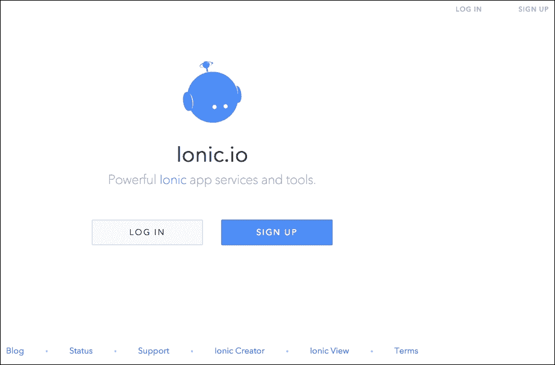

注册页面如下截图所示：

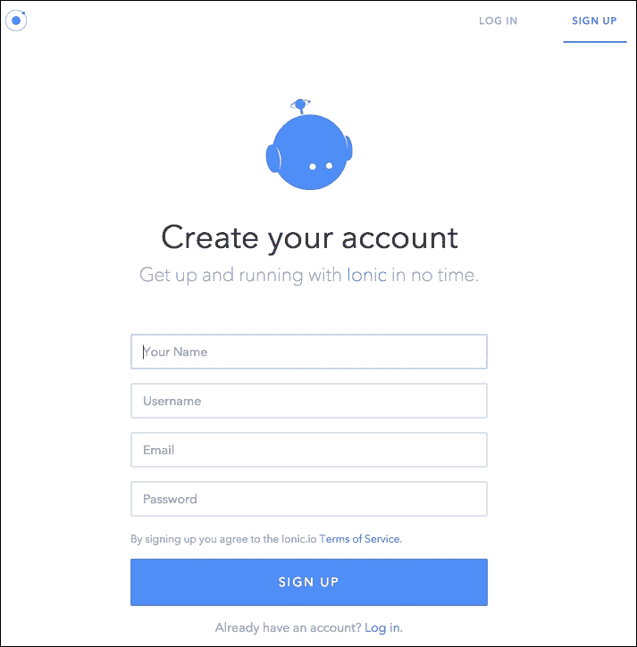

填写必要的细节时，您将会看到以下屏幕，它将为您提供设置您的第一个 Ionic 项目的整体视图：

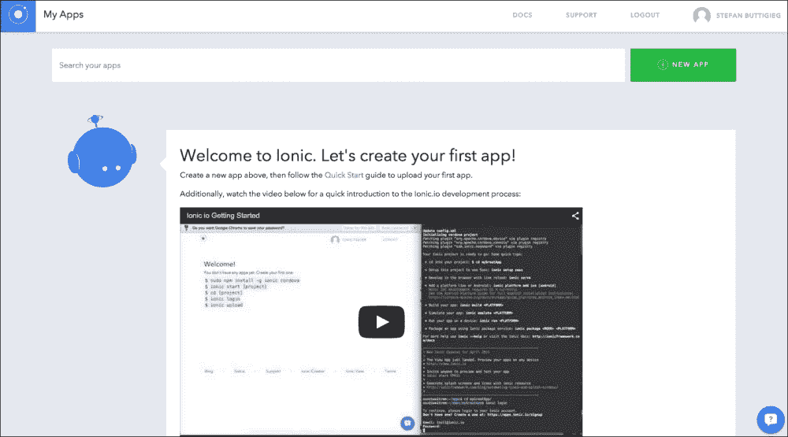

# 创建您的第一个 Ionic 应用程序

要开始您的第一个 Ionic 项目，请打开终端并运行`start`命令，如下所示：

```js
$ ionic start myfirstionicapp

```

然后，您需要将目录更改为您的 Ionic 项目目录，该目录与您的项目标题相同：

```js
$ cd myfirstionicapp

```

一旦您导航到正确的目录，您将需要使用以下命令登录到您的 Ionic 网络帐户。然后输入与您的帐户关联的电子邮件地址和密码：

```js
$ ionic login

```

一旦您的凭据得到验证，您将能够使用以下命令将您的第一个创作上传到 Ionic 网络服务：

```js
$ ionic upload

```

一旦您上传您的应用程序，您将能够在 Ionic 网络服务应用程序仪表板上看到您的应用程序，您将能够看到所有您的 Ionic 应用程序：

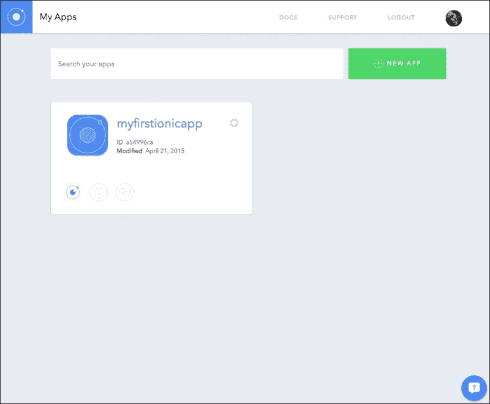

# 使用 Ionic View 查看您的 Ionic 应用程序

Ionic 推出了一个非常方便的 iOS 和 Android 应用程序，您将能够在几分钟内在智能手机上看到和测试您的应用程序创作。我们首先需要在您的特定设备上安装 Ionic View。

## 在 Android 上安装 Ionic View

在 Google Play 商店搜索 Ionic View 应用程序并将其下载到您的设备。

当您第一次加载应用程序时，您将看到以下屏幕，您将被要求输入您的登录凭据：

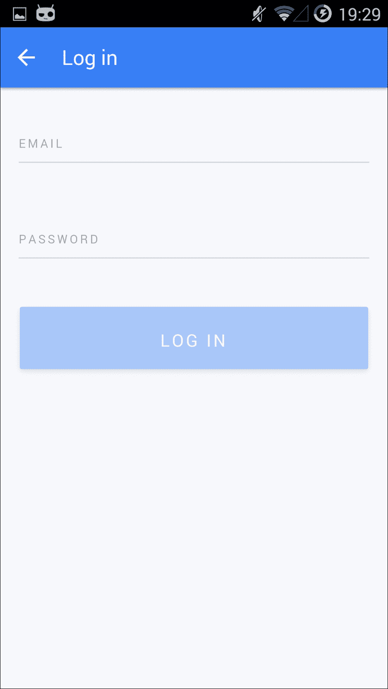

登录后，应该会显示带有您当前应用程序的仪表板。

## 在 iOS 上安装 Ionic View

在 App Store 上搜索 Ionic View 并将其下载到您的设备。安装应用程序后，您将看到以下内容，您将被要求输入您的登录凭据：

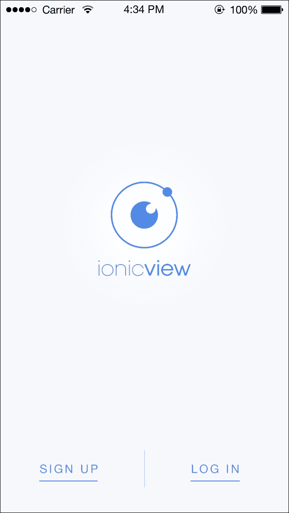

这是**登录**页面的样子：

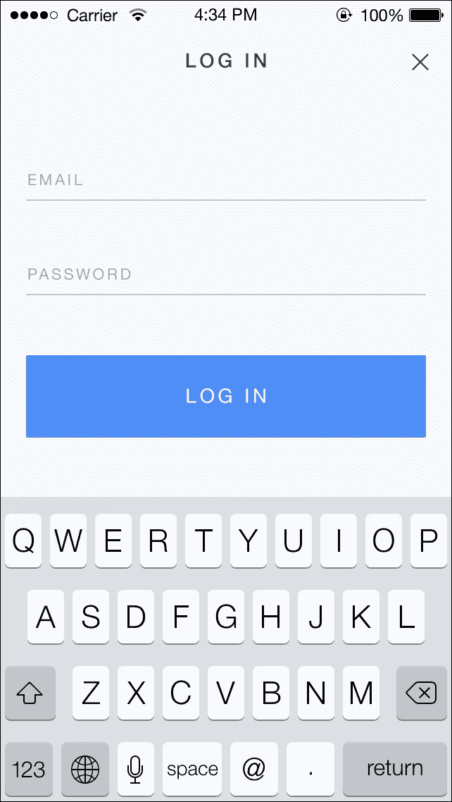

首次登录时，取决于您是否成功按照先前的说明将应用程序上传到 Ionic Apps Web 服务，您应该能够看到类似于这样的内容：

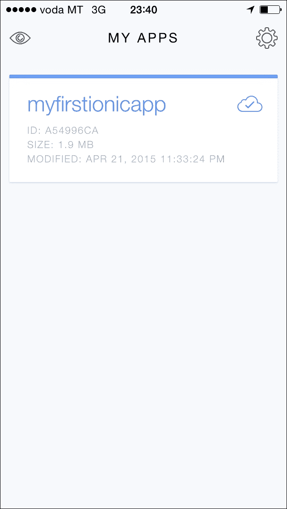

## 在 iOS Ionic View App 上测试您的应用程序

第一次加载应用程序并登录后，您将能够开始测试您的应用程序。您可以通过点击**下载应用**将应用程序下载到您的设备来进行此阶段：

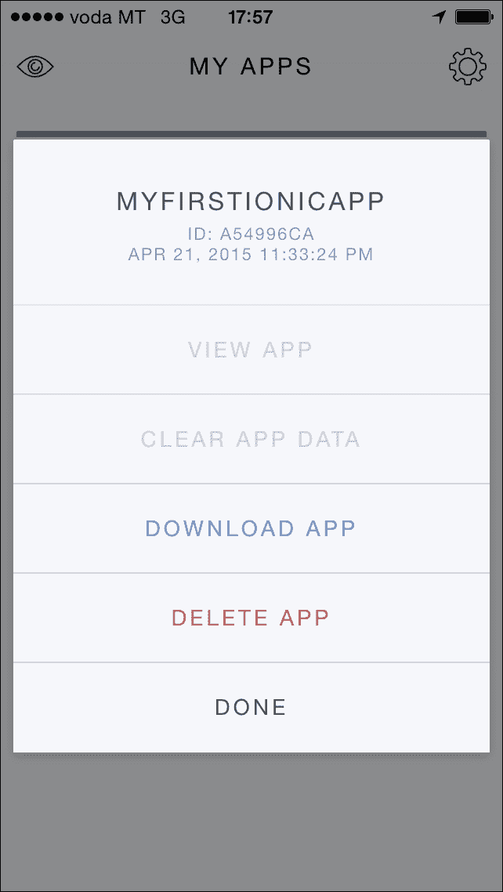

下载应用程序后，您将看到以下屏幕截图中显示的内容，您将有一个选项来在您的设备上查看应用程序。为了尝试您的应用程序，请点击**查看应用**：

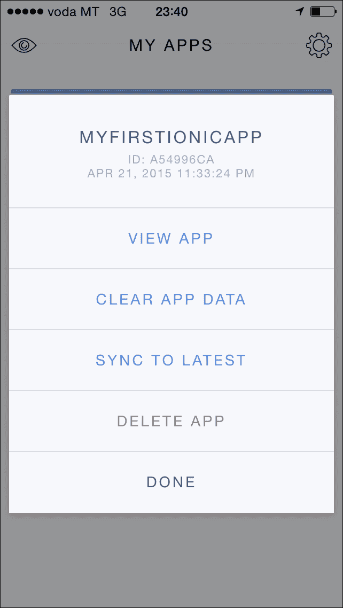

您的第一个 Ionic 应用程序是基于 Ionic 框架提供的样板，以突出 Ionic 的功能。一旦您完成了对应用程序的测试，要退出应用程序，您需要用三个手指向下滑动屏幕：

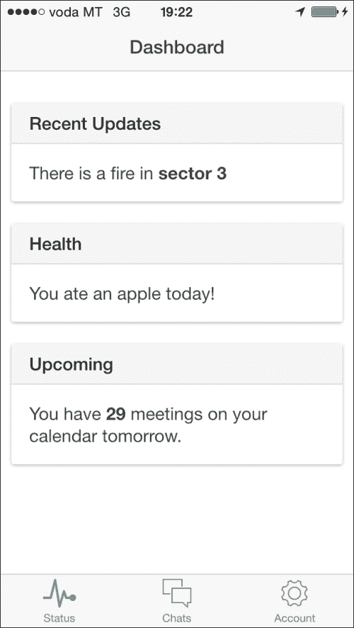

## 在 Android 上测试您的应用程序

从 Ionic View App 登录后，您将看到以下屏幕截图中显示的内容，其中提供了您所有 Ionic 应用程序的仪表板。要开始在 Android 上测试您的应用程序，请使用类似于 iOS Ionic View App 的方法，您需要将应用程序下载到设备上：

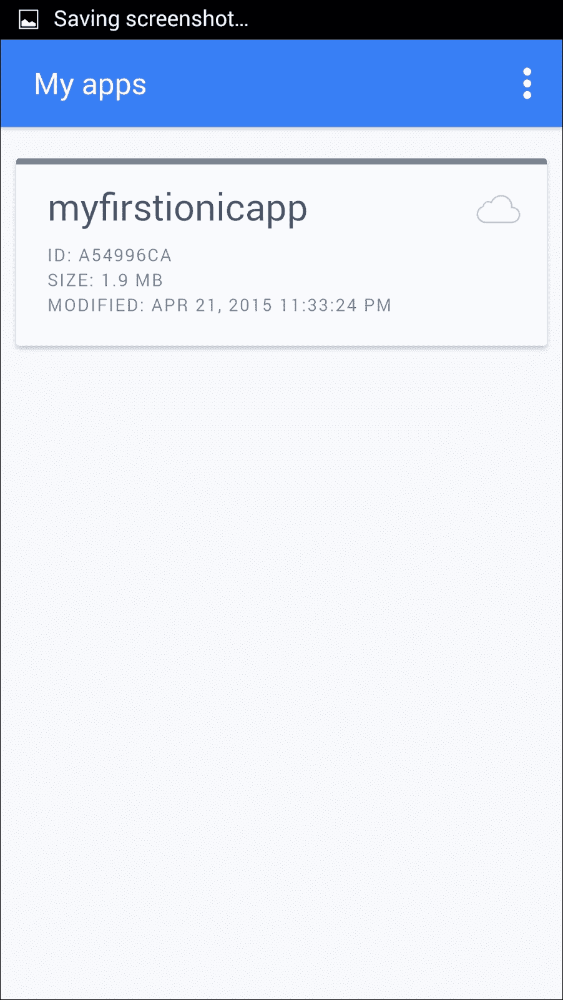

点击**myfirstionicapp**后，点击**下载文件**，将应用程序数据从 Ionic Web 服务同步到您的设备：

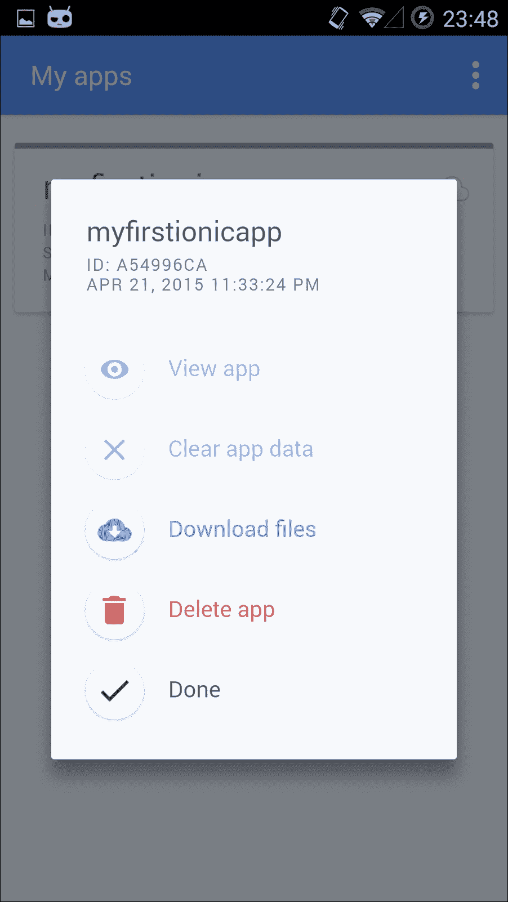

一旦应用程序同步到您的设备，您将看到以下内容。这将启用**查看应用**。点击相应按钮查看您的应用程序：

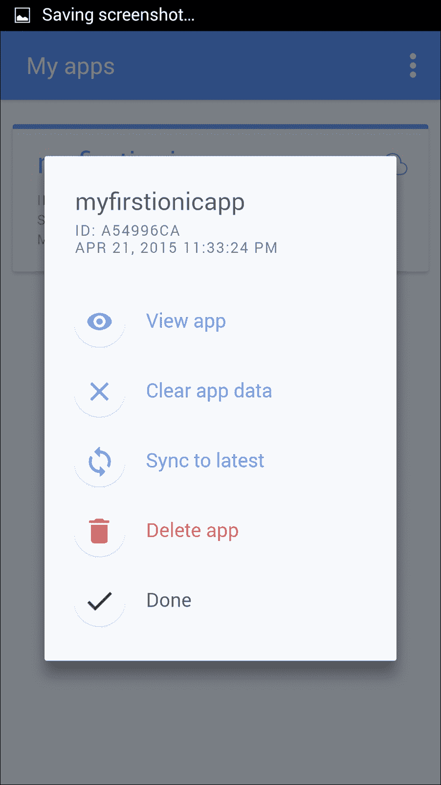

加载应用程序后，您将看到以下完全启用的应用程序。此应用程序在 Ionic **View App**中以一个工作应用程序的印象运行。正如之前所述，我们共同创建的应用程序是基于 Ionic 框架团队制作的样板。

正如您可能已经观察到的那样，为这款移动应用程序遵循的设计约定适用于每个平台，这进一步增强了 Ionic 框架为开发人员提供的价值主张。也就是说，跨平台应用程序会根据设备所基于的平台进行适配：

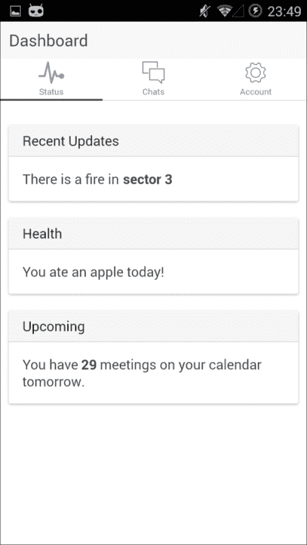

## 与合作者分享您的应用程序

与合作者分享您的应用程序非常简单。这可以通过 Web 服务和命令行实现。通过 Web 服务进行操作需要您点击所选 Ionic 应用程序上的齿轮图标，然后点击**分享**。

从命令行，您首先需要通过终端导航到您的项目目录。然后，您需要通过输入以下命令进行登录：

```js
$ ionic login

```

登录后，您只需输入以下命令，并将`EMAIL`替换为您选择的合作者的电子邮件地址：

```js
$ ionic share EMAIL

```

您的合作者将收到一封电子邮件，邀请他们查看应用程序。我们建议他们从移动设备查看此电子邮件以查看应用程序。

# 更进一步

Ionic 框架生态系统中有许多令人难以置信的功能，这些功能将框架提升到了一个新的水平。值得通过查看其文档来探索 Ionic 框架的不同功能，文档可在[`docs.ionic.io/`](http://docs.ionic.io/)上找到。

如果您想进一步实验，现在值得探索如何为您的 Ionic 应用项目设置推送通知、Ionic 实验室、Ionic 分析和部署。

Ionic 实验室允许您在浏览器中并排查看 Ionic 应用程序的 Android 和 iOS 版本，这使您有机会看到 Ionic 支持的不同平台之间的显着差异。在下一章中，我们将更频繁地使用 Ionic 实验室，因为您现在应该能够理解如何为不同需求构建不同的用户界面。

# 总结

在本章中，我们涵盖了设置工作环境的所有基本要点，以便高效地创建和共享 Ionic 应用程序。如前所述，在本章中我们没有详细介绍的其他工具值得一试，这些工具将帮助您有效地创建应用程序工作流程。

在下一章中，我们将学习 Ionic 项目的一般结构以及其组件如何共同创建移动体验。这些组件基于 Web 技术，但看起来、感觉起来和原生应用程序一样。
