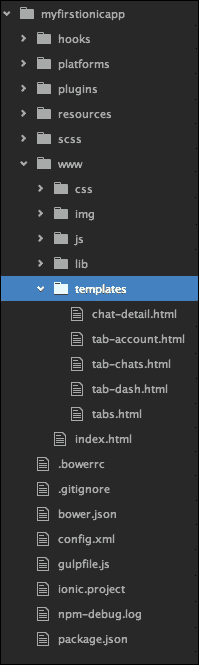
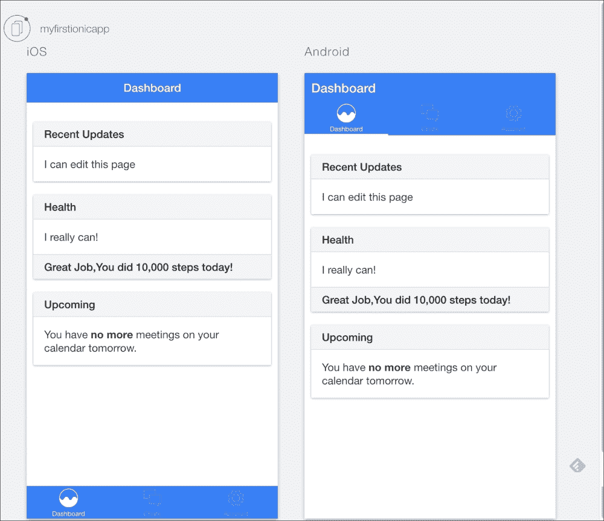
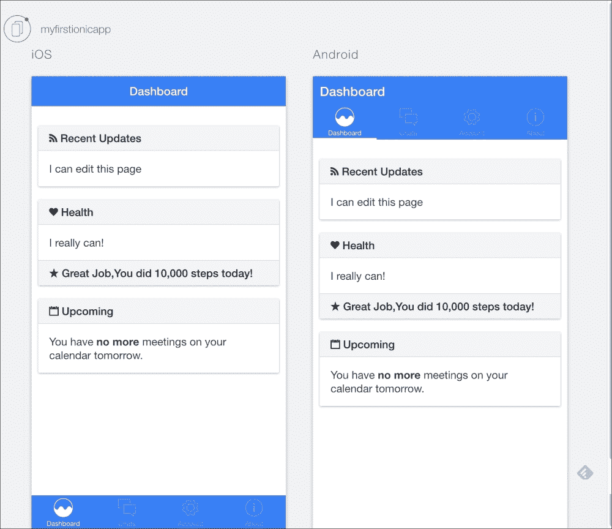

# 第七章：构建用户界面

在这一章中，你将学习如何从实际角度向你当前的 Ionic 项目中添加新的独特元素并进行修改。除其他事项外，我将向你展示如何修改标签图标并添加新的标签控制器。这一章将指导你并提供必要的知识，以深入了解如何创建和修改你自己的移动应用程序。

最重要的是，你还将熟悉 AngularJS JavaScript 框架，它是 Ionic 功能的核心所在。

这个修改后的项目的整个源代码可以在 GitHub 存储库上找到，通过访问[`github.com/stefanbuttigieg/nodejs-ionic-mongodb`](https://github.com/stefanbuttigieg/nodejs-ionic-mongodb)进行查看。

# Ionic 项目的结构

在前几章创建项目的过程中，我们创建了一个名为`myfirstionicapp`的目录，它可以在根文件夹中找到。我们建议你使用**集成开发环境**（**IDE**）或文本编辑器打开这个项目文件夹。在我们的情况下，我们习惯使用 Atom，这是一个先进的开源文本编辑器。

### 注意

你可以从[`atom.io/`](https://atom.io/)下载 Atom。

一旦你打开你的 IDE 并将项目文件夹添加到你的工作空间，你会看到以下文件夹结构：



让我们依次更仔细地看一下前面截图中显示的每个文件夹：

+   `hooks`：这个文件夹是我们项目将自动生成（或手动生成）的 Cordova 系统的钩子的存储位置，它提供了我们项目的大部分运行时。

+   `platforms`：这个文件夹包含部署到特定平台（如 Android 或 iOS）所需的文件和配置。

+   `plugins`：这个文件夹存储了我们项目的各种 Cordova 插件。如果你仔细检查，你会发现它已经包含了一些默认插件，比如`com.ionic.keyboard`，它使得更容易使用每个平台的本地键盘功能。

+   `resources`：这包含全局和特定平台的资源，如应用程序标志、启动画面等。

+   `scss`：这个文件夹包含我们项目的核心**Sass**（**Syntactically Awesome Style Sheets**）文件。通过修改这些文件，我们可以广泛地改变我们应用程序在各个目标平台上的外观。

+   `www`：这是你将会发现自己与之一起工作最多的文件夹。

如果你之前曾经使用过 Web 应用程序，它的内容对你来说会很熟悉：

+   `css`：这个文件夹包含你应用程序的 CSS 文件。

+   `img`：这个文件夹包含你应用程序的静态图像。

+   `js`：这个文件夹包含你应用程序的 JavaScript 文件。这也是大部分自定义应用程序逻辑的所在地。

+   `lib`：这个文件夹包含可以在你的项目中使用的第三方库和应用程序。这个文件夹包含了 AngularJS 本身以及它的相关依赖项。

+   `templates`：这个文件夹包含 AngularJS 模板文件，这些是可能包含 AngularJS 特定内容的 HTML 文件，比如数据绑定和指令（别担心，我们一会儿会解释这些是什么）。

如前所述，你自己的工作主要集中在`www`文件夹中。这是有道理的，因为我们用 Ionic 创建的项目实际上是一种定制化运行在移动设备上的 Web 应用程序。

现在我们熟悉了项目的结构，让我们深入了解 AngularJS，这个使一切运转的框架。它只会变得更好。

# 介绍 AngularJS

Ionic 由 AngularJS 框架（通常也被简称为 Angular）驱动，它驱动 UI 交互、手势、动画，以及实际上应用程序的整个功能。理解它对于使用 Ionic 至关重要。

Angular 最初是由 Google 在 2009 年开发的，旨在通过标签级别的动态数据绑定来增强 HTML（**Angular**的名称指的是 HTML 标签周围的**角括号**）。它的架构哲学牢固地基于**模型-视图-控制器**（**MVC**）模式，并围绕增强的 HTML 语法用于构建 UI 和一个功能丰富的模块化核心框架来创建业务逻辑。

由于其广泛的性质，编写简洁的 Angular 介绍并不容易。随着我们逐步深入并增加对框架的了解，我们将逐渐深入。在这里，我们将简要介绍 AngularJS 的最重要方面，以便您了解这些方面在 Ionic 上的工作方式。

## Angular 应用程序的结构

随着我们逐步深入本章和后续章节，您将很快意识到，您使用 Ionic 构建的实际上是为移动设备设计的增强型 Angular 应用程序。因为这是这种情况，您必须了解 Angular 应用程序的结构。

## 模块

Angular 应用程序最基本的模块是，嗯，模块。**模块**是一组**服务**、**控制器**和**指令**，为您的应用程序提供一些特定功能。实际上，您的 Angular 应用程序本身就是一个模块！

定义一个模块相当简单：

```js
angular.module('starter', []);
```

这创建了一个名为`starter`的`module`。第二个参数应包含一个依赖项列表（稍后将讨论更多）。如果模块不依赖于任何其他模块，则将此参数留空。

### 模块内的模块内的模块

模块可以加载其他模块，将它们的功能合并到自己的功能中。这使开发人员可以很容易地编写和共享实用模块，其他开发人员可以在自己的应用程序中使用（在撰写本书时，GitHub 上托管了成千上万个此类模块，其中许多正在积极开发中）。

还记得我们刚才看到的示例中的空括号吗？这是您列出当前模块应加载的所有模块的地方，以供其自身使用。例如，在我们的 Ionic 应用中，`ionic`模块是一个基本组件，我们总是希望随身携带：

```js
angular.module('myapp', ['ionic']);
```

现在，每当加载此模块时，Angular 将自动加载其依赖项。

### 服务、控制器和其他“野兽”

如前所述，Angular 模块包含其他组件，为应用程序提供各种功能。在这里详细介绍它们只会使事情变得混乱，因此我们将在逐步介绍它们（如果不是在这里，那么在后面的章节中，当需要它们时）。

## Angular MVC 模式

现在我们对 Angular 应用程序的结构有了更好的理解，是时候看看它在运行时实际是如何工作的了。

Angular 应用程序的功能围绕以下三个核心概念展开：

1.  **视图**是用户看到的，也是用户主要与之交互和从应用程序中读取输出的媒介。

1.  **控制器**响应用户与应用程序的交互，并与模型通信以生成适当的数据。然后更新视图以反映这些数据。

1.  **模型**是应用程序业务逻辑的数据、库、服务和其他组成部分的集合。模型负责应用程序中的重要处理，并且通常是大部分代码所在的地方。

这三个概念构成了 MVC 模式——模型-视图-控制器。这是现代 Web 应用程序非常流行的设计模式。

现在我们知道了 Angular 应用程序的功能，让我们看看它是如何实现这三个概念的。

### 视图

在 Angular 应用程序中，视图主要由标准的 HTML 组成，通过 Angular 特定的组件来实现动态更新。以下是两个主要组件：

+   **指令**：这些是自定义的 HTML 标签，其功能和行为是在 AngularJS 内部定义的，但像普通的 HTML 一样编写。例如，像下面这样的标签可以是一个在特定纬度和经度上绘制地图的指令：

```js
<map lat="39.234" lng="43.453"></map>
```

+   **表达式**：这些是由双大括号括起来的表达式，它们在应用程序运行时评估为给定的值。除非另有说明，否则表达式的输出将在应用程序的模型更改时立即更新。以下是这样一个表达式的例子：

```js
{{ person.firstname }}
```

前面的表达式做了一件在 Angular 中非常常见的事情——解析某个对象成员的值。但是，为了这样做，我们首先需要定义该对象的位置。这就是控制器出现的地方。

### 控制器

在 Angular 应用程序中，**controller**由特殊的模块组件实现，这些组件被称为控制器。您可以按照以下方式在模块中定义它们：

```js
angular.module('myapp.controllers', [])
controller('MyCtrl', function($scope) {})
```

第一个参数是`controller`的名称。第二个参数是定义控制器实际功能的`function`。这个`function`可以接受可变数量的参数，这些参数代表控制器将使用的依赖项，就像我们之前为模块定义依赖项的方式一样。

### 模型

广义上说，**模型**是您的应用程序中的*其他所有内容*。它是数据模型的总和。在接下来的章节中，我们将逐渐探索您可以用来组成模型的各种组件。

## 把它们放在一起

让我们通过展示如何连接到目前为止看到的各种组件来完成对 Angular 的简要介绍。

考虑这样一种情况，您首先导航到以下路径可用的`index.html`：`myfirstionicapp/www/index.html`：

当您导航到这里时，您会看到以下代码块：

```js
<ion-nav-bar class="bar-stable">
  <ion-nav-back-button>
  </ion-nav-back-button>
</ion-nav-bar>
```

这段代码确定了应用程序的标题栏，这是**用户界面**（**UI**）组件的一个例子，可以通过 HTML5 进行管理。

有关文档和参考目的，您可以参考 Ionic UI 组件[`ionicframework.com/docs/components`](http://ionicframework.com/docs/components)。

当您进一步探索您的项目时，您会发现将为项目的交互功能提供动力的主要控制器位于以下路径：

**myfirstionicapp** | **js** | **controllers.js**

# 修改 Ionic 项目

为了建立在我们之前获得的知识和之前完成的工作的基础上，我们将修改之前创建的项目的用户界面。我们将从修改标题开始。

## 修改标题

假设我们想将标题栏更改为宁静的蓝色。转到**www** | **index.html**中可用的`index.html`文件。

参考`body`块，并使用参考 UI 组件，将`ion-nav-bar`类更改为以下内容：

```js
<ion-nav-bar class="bar-positive">
  <ion-nav-back-button>
  </ion-nav-back-button>
</ion-nav-bar>
```

## 修改标签颜色、图标和名称

由于我们决定更改标题颜色，我们将继续修改选项卡栏，使其颜色与标题颜色匹配。我们首先应该转到**www** | **templates** | **tabs.html**中可用的`tabs.html`文件，并将`ion-tabs`类更改为以下内容：

```js
<ion-tabs class="tabs-striped tabs-icon-top tabs-background-positive tabs-color-active-positive">
```

`图标`需要进一步修改以与新的`蓝色`对比。因此，我们将进一步修改`ion-tabs`类如下：

```js
<ion-tabs class=" tabs-striped tabs-icon-top tabs-background-positive tabs-color-light">
```

我们将进一步尝试更改图标的图形。假设我们想将仪表板图标更改为看起来更圆形的东西。

首先，我们需要参考 Ionicons 文档，该文档可在[`ionicons.com/cheatsheet.html`](http://ionicons.com/cheatsheet.html)找到，并找出与圆形分析图标相关的类名。在这个例子中，我们将使用`ion-ios-analytics`。当我们希望用户点击图标并激活仪表板时，我们希望图标被突出显示，而当它不活动时，我们需要用户看到图标的轮廓。为了实现这一点，我们需要声明将在活动和非活动状态下使用的图标。

为此，我们将导航到`tabs.html`文件，并以以下方式修改`Dashboard`标签图标：

```js
<ion-tab title="Dashboard" icon-off="ion-ios-analytics-outline" icon-on="ion-ios-analytics" href="#/tab/dash">
  <ion-nav-view name="tab-dash"></ion-nav-view>
</ion-tab>
```

## 修改我们的页面

在这个特定的例子中，我们将编辑仪表板页面，我们将修改**list card** UI 组件的内容。

通过导航到`tab-dash.html`文件，我们可以修改仪表板。在`div`类的`list card`中声明了不同的卡。

`list card`声明如下：

```js
<div class="list card">
  <div class="item item-divider">Title of List Card</div>
    <div class="item item-body">
    <div>
    List Card Content
  </div>
</div>
```

通过使用 Ionic 框架，可以将页脚包含到您的卡中。在我们的例子中，我们将在`Health`列表卡中添加一个页脚，声明用户今天走了`10,000`步。为此，我们将添加一个`item-divider`类，从而修改`list card`如下：

```js
<div class="list card">
  <div class="item item-divider">Health</div>
  <div class="item item-body">
    <div>
      I really can!
    </div>
  </div>
  <div class="item item-divider">
    Great Job, You did 10,000 steps today!
  </div>
</div>
```

到目前为止，您所做的所有修改将导致一个**仪表板**标签，它将看起来像以下截图：



# 添加一个新标签

在这个项目中，我们想要添加一个新的标签，以突出显示这个应用程序的开发者。这将告知潜在用户如何与开发者取得联系，以提供他们改进应用体验所需的必要反馈。

为了实现这一点，我们需要执行以下四个主要步骤：

1.  在`controllers.js`中创建一个新的控制器条目。

1.  在 HTML 中创建一个名为`tab-about`的新标签控制器。

1.  在`tabs.html`文件中添加一个新的标签条目。

1.  在`app.js`文件中巩固我们的工作并将所有内容连接起来。

## 创建一个新的控制器

让我们从为新标签添加一个控制器开始。转到`controllers.js`并添加以下内容：

```js
controller('AboutCtrl', function($scope) {})
```

现在不要担心空函数。目前，我们的标签除了简单出现外不需要任何功能。

## 创建一个视图

现在我们有了一个控制器，我们需要为新标签实现视图。首要任务是确保标签已添加到标签列表中。为此，修改`tabs.html`以包括以下内容：

```js
<!-- About Tab -->
<ion-tab
title="About"
icon-off="ion-ios-information-outline" icon-on="ion-ios-information"
href="#/tab/about">

<ion-nav-view name="tab-about"></ion-nav-view>

</ion-tab>
```

这将为新标签创建基本绑定并将其添加到标签列表中。但是，我们仍然需要添加用户点击标签时应该打开的内容。为此，在`templates`文件夹中创建一个名为`tab-about.html`的新文件，并将以下代码放入其中：

```js
<ion-view view-title="About">
  <ion-content>
    <div class="list card">
      <a href="#" class="item item-icon-left">
        <i class="icon ion-ios-people"></i>
        Christopher Svanefalk and Stefan Buttigieg
      </a>
      <a href="#" class="item item-icon-left">
        <i class="icon ion-home"></i>
        Malta and Sweden
      </a>

      <a href="#" class="item item-icon-left">
        <i class="icon ion-ios-telephone"></i>
        +3569912345678
      </a>
      <a href="#" class="item item-icon-left">
        <i class="icon ion-ios-world-outline"></i>
        www.ionicframework.com
      </a>
    </div>
  </ion-content>
</ion-view>
```

## 为新标签添加一个状态

接下来，我们需要在`controller`中添加一个新的导航状态，以便允许用户通过点击导航到`tab-about.html`标签内容页面。为此，打开`app.js`文件并添加以下状态：

```js
state('tab.about', {
  url: '/about',
  views: {
    'tab-about': {
       templateUrl: 'templates/tab-about.html',
       controller: 'AboutCtrl'
     }
  }
})
```

请注意，前面的代码所做的是：

+   `url`属性确定应用程序是否进入访问`/about` URL 的状态。

+   在`views`属性中，我们确定了应用程序进入`view`状态时应加载的`view`的路径。在这种情况下，就是我们之前创建的`tab-about.html`文件。

+   最后，在`views`中，我们还确定哪个`controller`负责处理这个应用程序状态。在我们的例子中，它是我们之前定义的`AboutCtrl`控制器。

## 测试新创建的标签

通过本地浏览器可以进行快速测试。一旦您用 IDE 保存了项目文件，您就可以通过浏览器以原型形式看到您的应用程序：

1.  首先导航到项目文件夹：

```js
cd myfirstionicapp

```

1.  然后，输入以下命令：

```js
ionic serve --lab
```

这些结果显示在下面的截图中。这些结果适用于 iOS 和 Android。除此之外，您还可以通过点按式界面测试您的应用程序。这种体验类似于在浏览器中使用 iOS 或 Android 模拟器：



# 更进一步

在开始任何项目之前，设置布局和用户体验的重要性至关重要。这将增强用户体验，不仅在制定必要的项目结构时更有帮助，而且在整个编程过程中也更有帮助。

您可以通过使用 Sass 进一步自定义应用程序的外观和感觉。Sass 被宣传为最成熟、稳定和功能强大的专业**级 CSS 扩展语言**，它允许您进一步定制您的项目。

为了提高您对 AngularJS 的了解，我们建议您查看一个免费的视频资源，可在[`campus.codeschool.com/courses/shaping-up-with-angular-js`](http://campus.codeschool.com/courses/shaping-up-with-angular-js)上找到。

上述课程由 Google 赞助，对于任何希望深入了解 AngularJS 的人都可以免费使用。尤其是随着最近在 Ionic Playground 中提供的**Playground**工具的推出，使用不同的 Ionic 用户组件变得比以往更容易，该工具可在[`play.ionic.io`](http://play.ionic.io)上使用。

从 Android 的角度来看，为了将您的项目提升到一个新的水平，有一个免费的库可用，可以通过安装 Ionic Material 库来集成 Google 最新的交互式 Material 设计的最新版本。首先确保您已经安装了 bower，然后导航到您的项目文件夹，并输入以下命令来轻松安装：

```js
bower install ionic-material

```

我们希望通过这一章，您将开始尝试自己的项目，同时保持与您迄今为止所获得的知识相一致，提供出色的用户体验。在下一章中，我们将更进一步。

# 总结

在本章中，我们拿过去几章创建的模板项目，并通过修改用户界面的外观，将其修改为更接近我们设想的东西。除此之外，我们还开始尝试 Ionic 项目代码，以更好地理解项目的组成部分。

此外，我们为您提供了在浏览器中开始原型设计您的 Ionic 应用程序的基本知识。
