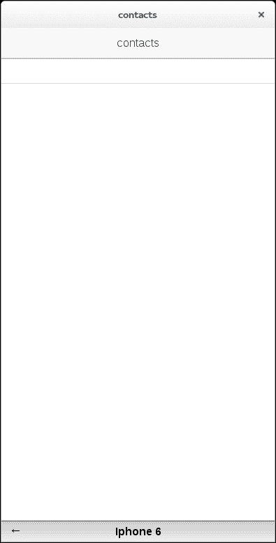

# 第八章：使我们的应用程序交互

在上一章中，我们向您介绍了如何在 Ionic 中处理用户界面。在这样做的同时，我们还向您全面介绍了 AngularJS，这是 Ionic 应用背后的推动力，并解释了您如何使用它来让用户与您的应用程序进行交互。

在这里，我们将继续构建这一点，同时探索 Ionic 的新功能，包括与设备的本机功能交互。我们将通过构建一个具体的应用程序来将所有这些付诸实践，该应用程序将从您的电话簿中加载和显示联系人。通过这样做，您还将学会如何在物理设备（如 iPhone 和 Android 手机）上编译和运行 Ionic 应用程序，而不是迄今为止我们使用的模拟器。

# 创建一个新项目

Ionic 配备了一个强大的**命令行界面**（**CLI**），可以快速创建、修改和扩展 Ionic 项目。通过自动化诸如模块集成和脚手架等琐事，它可以大大提高您的生产力。

'让我们使用 CLI 为我们创建一个基本项目，以便在本章中使用。转到您的工作目录，并在终端中运行以下命令：

```js
ionic start phonebook-app blank

```

这将创建一个仅包含基本组件的空白应用程序，适合我们，因为我们希望从零开始构建一个应用程序，并在学习过程中逐步学习。

### 注意

`ionic start`命令还有其他几个基本模板。例如，`tabs`模板为您提供了一个带有选项卡导航的基本应用程序，您可以扩展它，而`side menu`则创建了一个带有侧边菜单导航的基本应用程序。

当此命令运行完成时，您将拥有一个完整的项目可供使用。无需额外的摆弄！现在，让我们继续在其中添加一些内容。

# 创建一个基本的 MVC 项目

本章的目标是创建一个应用程序，可以从本地设备的联系人存储中提取信息并显示给用户（如果您愿意，可以理解为电话簿）。为此，我们需要做以下几件事：

+   定义一个**视图**（模板文件）来显示联系人列表

+   定义一个**控制器**以处理与列表的交互

+   提供必要的**模型**逻辑以提供联系人信息。

您可能还记得，这个工作流程与 AngularJS 的整体架构非常匹配，遵循 MVC 模式。我们将逐个处理每个项目。

## 创建视图

继续并将以下文件夹添加到您的项目中：

```js
www/templates
```

在这里，我们将存储我们将在整个项目中使用的所有视图模板。在这个文件夹中，让我们创建我们的第一个视图文件，如下所示：

```js
www/templates/contacts.html
```

如果我们需要向我们的应用程序添加额外的视图，我们将以相同的方式进行。这样分区我们的视图不仅使组织更容易，而且还提高了性能，因为 HTML 只会在需要时按需加载，而不是一次性加载所有内容。

让我们添加一些内容，以创建一个实际的视图：

```js
<ion-view view-title="contacts">
  <ion-content>
    <ion-list>
      <ion-item>
      </ion-item>
    </ion-list>
  </ion-content>
</ion-view>
```

暂时不要担心与列表相关的标签；我们将在稍后介绍它们的作用。现在，让我们先看看两个外部标签：

+   `ion-view`：此标签告诉 Ionic 这是一个可以从应用程序的其他部分动态加载的视图。我们在其中添加了 view-title 属性，以创建一个可用于引用视图的标签。

+   `ion-content`：此标签指定视图中的内容区域，特别擅长显示滚动数据。由于我们想要显示一个未知长度的联系人列表，这就是我们想要将列表包裹在其中的内容。

### 创建列表视图

列表是应用程序中最普遍的数据结构之一。因此，大多数框架都提供了强大的工具来处理它们，这并不奇怪。Ionic 当然也不例外。

看一下我们之前添加的代码。特别注意`ion-content`标签内的标签：

```js
<ion-view view-title="contacts">
  <ion-content>
    <ion-list>
      <ion-item>
      </ion-item>
    </ion-list>
  </ion-content>
</ion-view>
```

以下两个标签封装了 Ionic 的大部分列表渲染功能，通常是您需要的一切来显示列表：

+   `ion-list`：这表示封装的内容是一个列表

+   `ion-item`：这表示一个可以在列表中呈现的单个数据节点

由于我们列表中的每个项目都将是一个单独的联系人，我们将把它们包装在`ion-item`标记中。

目前，我们的视图除了显示一个空列表之外并没有做太多事情。我们需要添加一些标记来显示每个联系人的详细信息。让我们先做一些基本的事情，比如只显示联系人的姓名和手机号码，如果有的话：

```js
<ion-view view-title="contacts">
  <ion-content>
    <ion-list>
      <ion-item>
        <h2>{{contact.name}}</h2>
        <p>{{contact.number}}</p>
      </ion-item>
    </ion-list>
  </ion-content>
</ion-view>
```

在这里，我们定义了两个 Angular 表达式，以在运行时呈现联系人的姓名和号码。在这种情况下，联系人只是一个包含我们联系人列表中给定人员信息的**JavaScript 对象表示**（**JSON**）对象。接下来，我们将看到如何为这个 JSON 对象分配一个具体的值；这将在相关的控制器中进行。

### 注意

从 AngularJS 1.3 开始，这是写作本书时 Ionic 官方发布的版本，可以使表达式以一次绑定的方式运行。这意味着它们最初计算的值将被接受，并且在此之后将被 AngularJS DOM 更新周期跳过，从而提高性能。在我们的情况下，这很有效，因为我们在获取数据后只会显示一次数据，我们稍后会看到。这种方法的缺点是，此时数据模型的更新不会在此视图中反映出来。

要使您的表达式一次绑定，可以在它们之前添加两个冒号（`::`），如下所示：

```js
<ion-view view-title="contacts">
  <ion-content>
    <ion-list>
      <ion-item>
        <h2>{{::contact.name}}</h2>
        <p>{{::contact.number}}</p>
      </ion-item>
    </ion-list>
  </ion-content>
</ion-view>
```

## 创建控制器

您可能还记得，控制器是视图和模型（即业务逻辑）之间的“粘合剂”。它的主要责任是处理用户与 UI 的交互，并将适当的响应处理委托给模型。

在上一章中，示例控制器位于一个单独的 JavaScript 文件中，它们被声明为模块的一部分。这是一个很好的设计实践，因为它可以更轻松地构建应用程序结构。

请注意，我们的空白项目没有这样的文件。因此，让我们从创建它开始。将以下文件添加到您的项目中：

```js
www/js/controllers.js
```

在这个文件中，让我们添加以下内容：

```js
angular.module('phonebook.controllers', [])
controller('ContactsCtrl', function ($scope) {
});
```

让我们简要回顾一下前面的代码做了什么：

1.  我们使用核心的`angular.module()`函数定义了一个模块，它接受以下参数：

+   第一个参数是`phonebook.controllers`，这是模块的名称。

+   第二个参数是一个空列表，表示此模块没有外部依赖项。如果有的话，我们将在这里列出它们的名称，以便 AngularJS 依赖注入系统可以在运行时解析它们。

1.  创建了一个模块后，我们使用（恰当命名的）核心函数`controller()`将控制器附加到它。将以下参数传递给此函数：

+   `ContactsCtrl`，这是控制器的名称，是第一个参数。

+   第二个参数是一个定义控制器功能的`function`。在这个控制器中，我们将定义在该控制器控制的应用程序部分中发生的所有操作。请注意，这个函数接受`$scope`参数（稍后我们将介绍它的作用）。就像模块中的依赖项列表一样，这个参数和传递给函数的所有其他参数（可以是任意数量的参数，也可以没有）表示这个控制器的依赖关系，它将在运行时使用依赖注入系统解析。

目前，这就是我们需要一个完整的控制器。接下来，我们需要将它与我们的视图连接起来。

## 连接视图和控制器

如果我们需要将我们新创建的视图和控制器连接在一起，我们有以下两种选择：

+   我们可以使用内联视图，在`index.html`文件或另一个模板中直接放置对视图和控制器的引用，然后从`index.html`加载。

+   我们可以使用路由器将视图及其控制器与应用程序中的某个路径关联起来

即使我们现在只有一个视图，我们也会选择第二个选项。这可能看起来多余，但如果以后想要添加新的导航状态，这样做会使得结构化应用程序变得更加容易（剧透-我们会！）

路由通常在`app.js`文件中配置。所以，接下来我们将打开该文件并确保它具有以下内容：

```js
angular.module('phonebook', ['ionic', 'phonebook.controllers'])
.run(function ($ionicPlatform) {
  $ionicPlatform.ready(function () {
    if (window.cordova&&window.cordova.plugins.Keyboard) {
      cordova.plugins.Keyboard.hideKeyboardAccessoryBar(true);
    }
    if (window.StatusBar) {
      StatusBar.styleDefault();
    }
  });
})
.config(function ($stateProvider, $urlRouterProvider) {
  $stateProvider
  .state('contacts', {
    url: '/',
    templateUrl: 'templates/contacts.html',
    controller: 'ContactsCtrl'
  });
  $urlRouterProvider.otherwise('/');
});
```

让我们考虑这里发生了什么，特别是在`config`函数中。在这里，我们通过配置由`$stateProvider`和`$urlRouterProvider`公开的路由模块来设置应用程序的核心导航设置。默认情况下，Ionic 使用`ui-router`（有关更多信息，请访问[`github.com/angular-ui/ui-router`](https://github.com/angular-ui/ui-router)）。这个路由器是面向状态的。也就是说，它允许您将应用程序构建为状态机，其中每个状态都可以连接到一个路径和一组视图和控制器。这种设置使得在开发移动设备时非常容易处理嵌套视图的情况，其中导航元素如选项卡、侧边菜单等非常常见。

了解这一点，让我们考虑这段代码实际上做了什么：

1.  `config`函数本身接受两个参数，`$stateProvider`和`$urlRouterProvider`。两者都是属于`ui-router`的配置接口，可以在应用启动时用于配置路由器。

1.  我们使用`$stateProvider`参数来向我们的应用程序添加状态 contacts。当应用程序处于此状态时，我们使以下属性保持：

+   应用程序中的当前路径是根路径（/），也就是说，只要我们在应用程序的初始路径上，我们就处于这种状态。

+   加载此状态的模板是`templates/contacts.html`，这是我们之前创建的相同视图模板。

+   与此视图关联的控制器是`ContactsCtrl`，之前也已经定义。由于我们的`phonebook.controllers`模块作为我们应用程序的依赖项加载（请参见`app.js`的第一行），我们只需要命名控制器，依赖注入系统将完成其余部分。

1.  最后，我们为我们的应用程序配置了一个默认路由。这是我们的导航将解析到的路由，如果没有提供其他有效的路由。在我们的情况下，我们总是默认到起始屏幕。

这就是我们需要进行路由的全部内容！接下来，我们需要确保`index.html`文件具有必要的内容，以加载到目前为止我们配置的所有文件，包括新的 contacts 视图。打开它，并确保它具有以下内容：

```js
<!DOCTYPE html>
<html>
  <head>
    <meta charset="utf-8">
    <meta name="viewport" content="initial-scale=1, maximum-scale=1, user-scalable=no, width=device-width">
    <title></title>

    <link href="lib/ionic/css/ionic.css" rel="stylesheet">
    <link href="css/style.css" rel="stylesheet">

    <!-- ionic/angularjsjs -->
    <script src="img/ionic.bundle.js"></script>

    <!-- cordova script (this will be a 404 during development) -->
    <script src="img/cordova.js"></script>

    <!-- your app's js -->
 <script src="img/controllers.js"></script>
    <script src="img/app.js"></script>
  </head>
  <body ng-app="phonebook">

 <ion-nav-bar class="bar-stable">
 <ion-nav-back-button></ion-nav-back-button>
 </ion-nav-bar>

 <ion-nav-view></ion-nav-view>

  </body>
</html>
```

注意高亮显示的部分：

+   `script`标签只是导入`phonebook.controllers`模块。

+   `ion-nav-bar`标签创建一个标准的导航栏，显示特定于应用程序当前导航上下文的内容。

如果您拥有 Android 设备，这将类似于顶部的操作栏，其中包含应用程序徽标、当前视图的名称等

同样，如果您拥有 iPhone，此栏将是底部栏，通常包含应用的导航选项卡

+   `ion-nav-back-button`标签创建一个按钮，用于从当前导航上下文返回到上一个导航上下文，就像浏览器中的返回按钮一样。

+   最后，`ion-nav-view`是一个特殊的标签，告诉 AngularJS 路由系统应该绑定模板。在我们的情况下，当我们的导航上下文是 contacts 状态时，这就是`templates/contacts.html`模板将被呈现的地方，就像我们之前在路由器`config`中定义的那样。

## 测试连接

这就是我们的应用程序的基本设置所需的一切。为了确保它能运行，让我们在模拟器中试一下。从项目文件夹的根目录，在终端或命令行中运行以下命令：

```js
ionic serve

```

你应该看到前面命令的以下输出：



### 注意

根据你在模拟器中运行的浏览器，你可能看不到顶部或底部的栏。这不是 Ionic 生成的，而是由一个 Chrome 插件生成的，该插件会自动设置窗口的大小以匹配 iPhone 6 的大小。该插件称为**Mobile/Responsive Web Design Tester**，我们建议你尝试一下，看看它适用于你自己的项目。

## 创建模型

我们现在有一个工作的视图和控制器。接下来，我们需要一个模型，可以根据用户输入提供我们需要的数据。

### 服务

在 AngularJS 中，将尽量少的逻辑放在控制器中被认为是良好的设计实践。记住，控制器应该只是视图和模型之间的*粘合剂*。它们理想情况下不应该负责获取和处理数据。为此，AngularJS 提供了服务。

服务是通过依赖注入系统按需注入到应用程序的其他组件中的对象。如果回顾一下`app.js`代码，你已经看到了其中一些；`$stateProvider`和`$urlRouterProvider`参数都属于这一类。

如果你看过高级的 AngularJS 应用程序，你会发现服务几乎无处不在。它们构成了几乎任何应用程序的一个重要部分，并且可以用来包含几乎任何类型的功能。例如，我们可以创建一个封装对给定 REST API 访问的服务，允许我们通过一组实用函数查询它，而服务本身处理与服务器的连接、安全等。同样，我们可以定义一个代表一组数学运算的服务，可以向其提供简单数据以获得算术结果。

**服务**是**单例**，这意味着在运行时只存在一个实例。

以这种方式实现业务逻辑对于几个原因非常重要，其中一些原因如下：

+   它提供了模块化接口，用于处理应用程序业务逻辑的某个方面。你的模型可以围绕几个服务构建，每个服务提供应用程序功能的单一、基本特性。

+   这是高效的，因为你在整个应用程序中只有一个服务的实例可用。

+   它使得扩展你的应用程序更容易，因为功能单元可以被定义和注入到需要它们的任何地方。

既然我们已经确定了服务有多棒，自然的问题是，我们将如何创建它们？

#### 创建服务

AngularJS 提供了几种创建服务的方法。这些方法被称为配方。总共有五种——常量、值、提供者、工厂和服务。它们在复杂性和适用用例上各不相同：

+   **常量**：最简单的服务，用于定义一个单一的常量，该常量在整个应用程序中都可用。它与其他四个不同之处在于，当应用程序启动时立即实例化，这意味着它可以在应用程序生命周期的配置阶段使用。常量通常用于包含诸如基本 URL 之类的常量值。

+   **值**：这与常量类似，但有一个显著的例外，即它在应用程序的配置阶段不可用。它也可以用于`decorators`。

+   **工厂**：常量和值用于存储简单值，而工厂开始变得更加有趣：

+   它们提供工厂函数，可以用于定义逻辑而不仅仅是值。这意味着工厂可以提供多个函数，根据输入计算值。

+   工厂可以有依赖项，这意味着你可以使用其他服务来构建它们。

+   工厂是懒惰实例化的，这意味着只有在需要时才会实例化。

对于我们的应用程序来说，这是我们将要使用的配方，因此很快你将看到它的示例。事实上，我们认为工厂将适用于大多数应用程序的大多数可用用例。

+   **服务**：服务与工厂非常相似。虽然在语义上有一些细微的差别，但它们真正的贡献在于提供简洁的语法。使用工厂或服务几乎总是一种偏好。哦，如果你想知道这个名字，AngularJS 的开发人员自己后悔称其为*服务*，就像给你的孩子取名为*孩子*一样。

+   **提供者**：最后，最高级的配方是**提供者**，它提供了服务提供的全部功能范围（不，不是我们刚提到的那些；我们说的是实际的服务——命名真是个糟糕的主意，不是吗？）特别是，提供者允许你在应用程序的`config`阶段之前对服务进行配置，在`run`阶段实际使用服务。值得注意的是，提供者实际上是服务的唯一配方；前面的四个只是简化其使用的语法糖。因为它非常复杂，对于大多数情况来说都是过度的，这就是为什么根据你的模型逻辑有多复杂，还有其他选择可供选择。

知识如此之多，空间如此之小！让我们把我们所学到的知识应用到实践中，通过实际创建一个工厂来检索联系人。

### 创建一个工厂

与控制器一样，习惯上将服务定义放在它们自己的文件中（或者如果你更喜欢将每个服务配方放在自己的文件中，也可以放在多个文件中。在这里，我们使用一个公共文件来存放所有服务）。在项目目录中，创建以下文件：

```js
js/services.js
```

在这个文件中，放入以下内容：

```js
angular.module('phonebook.services', [])
.factory('contactsFactory', function contactsFactory() {
  return {
    all: function () {
      return [];
    }
  }
});
```

让我们看看我们做了什么：

我们创建了一个名为`phonebook.services`的模块来托管我们的服务

我们定义了一个名为`contactsFactory`的基本`工厂`服务

暴露单个实用方法的服务称为`all`，目前什么也不做（我们很快会改变这一点，不用担心）。

现在，我们需要修改`app.js`和`index.html`文件，以使应用程序了解新的服务。确保`app.js`文件以以下内容开头：

```js
angular.module('phonebook', ['ionic', 'phonebook.controllers','phonebook.services'])
```

这将服务模块注入到主应用程序中。现在，我们只需要导入模块所在的文件。为此，请确保`index.html`中的 JavaScript 导入如下所示：

```js
<!-- your app's js -->
<script src="img/controllers.js"></script>
<script src="img/services.js"></script>
<script src="img/app.js"></script>
```

就是这样！我们现在已经把我们的应用程序的基础工作放在了那里。然而，如果你再次运行模拟器，你会注意到并没有太多改变。我们仍然被同样的空白屏幕所迎接。现在，是时候通过加载联系人列表向我们的应用程序添加一些实际内容了。

# 访问设备数据

现在我们的应用程序的基础已经实现，是时候向其中添加一些严肃的数据了。在我们的情况下，我们希望加载设备上存储的联系人，以便在之前创建的列表中显示它们。

## 访问原生服务

你可能还记得 Ionic 是建立在 Cordova 平台之上的，它提供了与底层操作系统和硬件的核心交互。为了访问原生服务，比如联系人列表，我们经常需要直接使用 Cordova。

在这种特殊情况下，我们处于一个非常容易的位置；Cordova 不仅有一个完整的插件来与联系人交互，而且还有一个非常方便的 CLI 方法来安装它。

转到项目目录，从终端或命令行运行以下命令：

```js
cordova plugin add org.apache.cordova.contacts

```

这将安装 Cordova 联系人插件，它将放置在以下文件夹中：

```js
plugins/org.apache.cordova.contacts
```

在我们继续之前，随意检查文件。接下来，我们需要将此插件与 Ionic 集成，以便在我们的应用程序中使用它。

## ngCordova

Cordova 本身对 Ionic 或 AngularJS 一无所知。因此，以 Angular 方式访问其服务通常需要包装代码。幸运的是，已经有一个广泛的库正好满足了这一需求——**ngCordova**。

要安装它，转到项目文件夹的根目录，并从终端运行以下命令：

```js
bower install ngCordova

```

这将安装我们需要的一切。接下来，让我们通过修改`app.js`和`index.html`文件再次将其导入我们的应用程序。在`app.js`中，确保你的应用程序依赖项现在包括`ngCordova`，如下所示：

```js
angular.module('phonebook',
  [
    'ionic',
    'ngCordova',
    'phonebook.controllers',
    'phonebook.services
])
```

同样，在`index.html`中，确保我们导入相应的 JS 库，如下所示：

```js
<!-- AngularJS bindings for Cordova -->
<script src="img/ng-cordova.min.js"></script>
```

## 将 Cordova 联系人添加到我们的工厂

这里的最后一步是将 Cordova 联系人与`contactsFactory`服务集成，以便让它提供设备上可用的联系人。打开`js/services.js`文件，并确保它包含以下内容：

```js
angular.module('phonebook.services', [])
.factory('contactsFactory', function contactsFactory($q, $cordovaContacts) {
  /**
  * Turns a raw contact into something more suitable for viewing.
  *
  * @paramrawContact
  */
 function processContact(rawContact) {
 return {
 name: rawContact.name ? rawContact.name.formatted : '',
 number: rawContact.phoneNumbers ? rawContact.phoneNumbers[0].value
 }
 }

  return {
    all: function () {
      // It may take some time to fetch all contacts, so we defer it.
 var deferred = $q.defer();
 $cordovaContacts.find({multiple: true}).then(function (contacts) {

 varprocessedContacts = [];
 contacts.forEach(function (contact) {
 processedContacts.push(processContact(contact));
 });

 deferred.resolve(processedContacts);
 }, function (error) {
 deferred.reject(error);
 });
 return deferred.promise;
    }
  }
});
```

重点部分已经突出显示。让我们弄清楚发生了什么：

+   我们为我们的工厂注入以下依赖项：

+   `$q`：这是 AngularJS 服务，用于处理`promises`。这将允许我们创建`deferred`函数，它们在以后解析为一个值。在那时，可以对它们的结果进行处理。

+   `$cordovaContacts`：这就是 ngCordova 包装的 Cordova 联系人插件本身。

+   由于原始联系人数据相当笨重，我们定义了一个实用方法来处理它，使其更加轻量级。

+   我们创建一个`promise`，返回给使用我们服务的人。在这种情况下，`promise`是在某个时刻，我们将提供联系人列表，或者指示我们无法这样做的错误。

+   我们调用`cordovaContacts`的`find()`函数，它与同名的 MongoDB 函数非常相似；它简单地返回所有可用的联系人。

+   如果我们可以获取联系人列表，我们会解析`promise`并将列表交给调用者。

+   如果我们无法获取联系人列表，我们会拒绝`promise`，指示我们无法获取所请求的内容。由`cordovaContacts`创建的错误消息将返回给用户。

我们的服务现在已经配置好并准备就绪。不过还有一个主要障碍。模拟器没有我们可以显示的联系人！为了继续，我们首先必须绕道一下，看看如何在物理设备上部署应用程序，然后最终通过向用户显示联系人来完成我们的应用程序。

# 为原生设备构建

到目前为止，我们在 Ionic 中所做的一切都是在模拟器或远程服务中进行测试的。现在我们有一个使用真实手机功能的应用程序，是时候最终构建终极成品——一个移动应用了。

通过 Ionic CLI 在物理设备上构建和部署 Ionic 应用程序非常容易。我们将在下一节中演示如何做到这一点。

## Android

从项目文件夹的根目录运行以下命令：

```js
ionic platform add android

```

这将添加部署应用程序到 Android 设备所需的所有文件。

接下来，我们有两个选项来运行我们的应用程序——实际的 Android 模拟器或物理设备。

### 模拟器

要在模拟器中运行应用程序，首先通过运行以下命令构建项目：

```js
ionic build android

```

最后，启动模拟器并通过运行以下命令部署应用程序：

```js
ionic run

```

### 物理设备

在物理设备上运行应用程序与在模拟器上运行应用程序一样简单。首先，连接一个可以通过 USB 接受 APK 安装的 Android 设备（请参阅第一章，“设置您的工作区”中的说明）。完成后，运行以下命令：

```js
ionic build android

```

最后，运行以下命令来安装并在连接的设备上运行 APK：

```js
ionic run

```

一旦应用程序部署，它将自动在您的设备上启动。

# 列表视图重访

现在我们将为我们的应用程序添加最后的修饰，如下所示：

1.  使用逻辑来显示我们从联系人列表中提取的联系人

1.  添加下拉刷新功能，以便用户可以动态刷新用户列表。

首先，让我们修改`contacts.html`文件，以处理列表本身的渲染。打开文件并确保它看起来像这样：

```js
<ion-view view-title="contacts">
  <ion-content class="has-header">
 <ion-refresher
 pulling-text="Pull to refresh"
 on-refresh="doRefresh()">
 </ion-refresher>
    <ion-list>
    <ion-item collection-repeat="contact in contacts" type="item-text-wrap">
      <h2>{{contact.name}}</h2>

      <p>{{contact.number}}</p>
    </ion-item>
    </ion-list>
  </ion-content>
</ion-view>
```

大多数东西看起来都一样，但我们已经强调了一些重要的变化：

+   我们添加了一个`ion-refresher`标签，为我们的视图创建了一个下拉刷新的界面。当用户在屏幕上向下滑动手指时，将显示文本**下拉刷新**。如果然后完成了整个手势（即滑动和释放），则会调用在该视图范围内定义的`doRefresh()`函数。我们将在稍后定义这个函数。

+   我们在`ion-item`标签中添加了一个`collection-repeat`属性。这是`ng-repeat` AngularJS 属性的一个变体，这意味着每个联系人号码在联系人集合中都会创建一个`ion-item`。联系人集合需要在视图的范围内定义，接下来将完成这一步。

修改`controllers.js`文件，使其看起来像以下代码：

```js
angular.module('phonebook.controllers', [])
.controller('ContactsCtrl', function ($scope, contactsFactory) {
  // List of contacts
  $scope.contacts = [];

  $scope.doRefresh = function () {
    contactsFactory.all().then(
      function (contacts) {
        $scope.contacts = contacts;
        $scope.$broadcast('scroll.refreshComplete')
      },
      function (error) {
        alert(error);
        $scope.$broadcast('scroll.refreshComplete')
      },
      function (notify) {
        console.log("Just notifying");
    });
  };
});
```

让我们考虑一下这里发生了什么：

+   我们创建并绑定了空的联系人列表到注入到该控制器的`scope`标签。这对应于我们视图中`collection-repeat`指令使用的相同联系人列表。

+   同样，我们将`doRefresh`函数绑定到我们的作用域中，这个函数我们已经在视图中看到了。我们让它执行以下操作：

+   调用`contactsFactory`类的`all()`方法。这给了我们一个承诺，将来某个时候会提供联系人列表。

+   如果承诺得到了实现，我们将结果列表绑定到作用域。Angular 将对此变化做出响应，通过刷新视图来适应模型中的这种变化，并使用 collection-repeat 填充联系人信息列表。

+   如果承诺失败，我们会显示错误消息。

Angular 承诺允许我们监听来自承诺的进度通知。我们在这里没有使用这个功能，而是简单地捕获这样的消息。

就是这样！现在你应该能够运行你的应用程序并浏览你的联系人。再次按照原生设备的构建步骤尝试一下！

# 总结

在本章中，我们涵盖了很多内容，深入了解了 AngularJS，并学习了有关模型、视图和控制器交互的更多知识。我们还看到了如何使用 Cordova 插件和 ngCordova 来访问原生功能（这在以后的章节中我们将经常做）。最后，我们看到了如何创建服务并使用它们来为用户提供数据。

我们还建议使用您喜欢的浏览器的检查元素工具，这可以让您了解在运行应用程序时可能遇到的任何显示错误。
