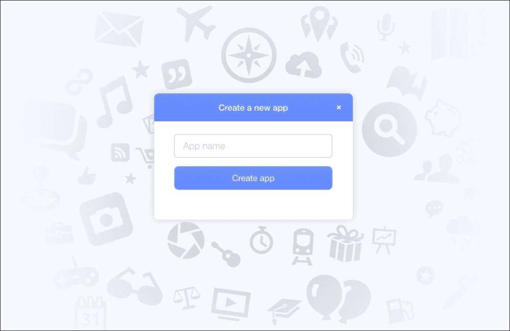
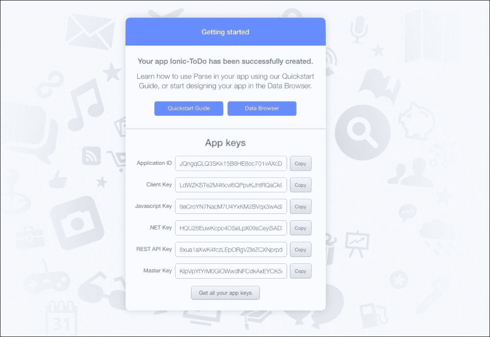
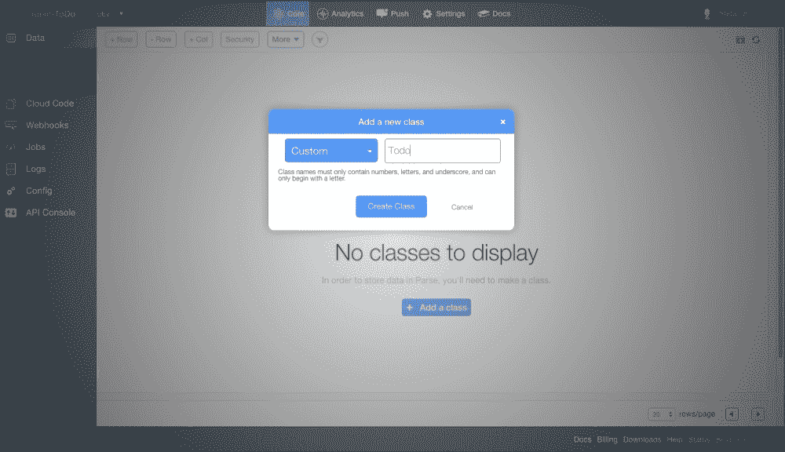
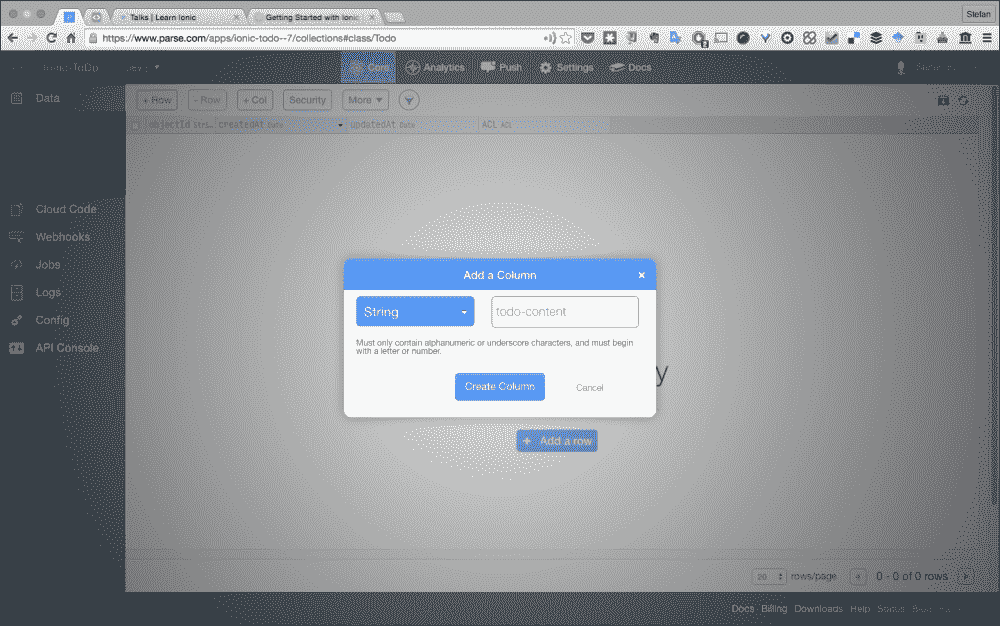
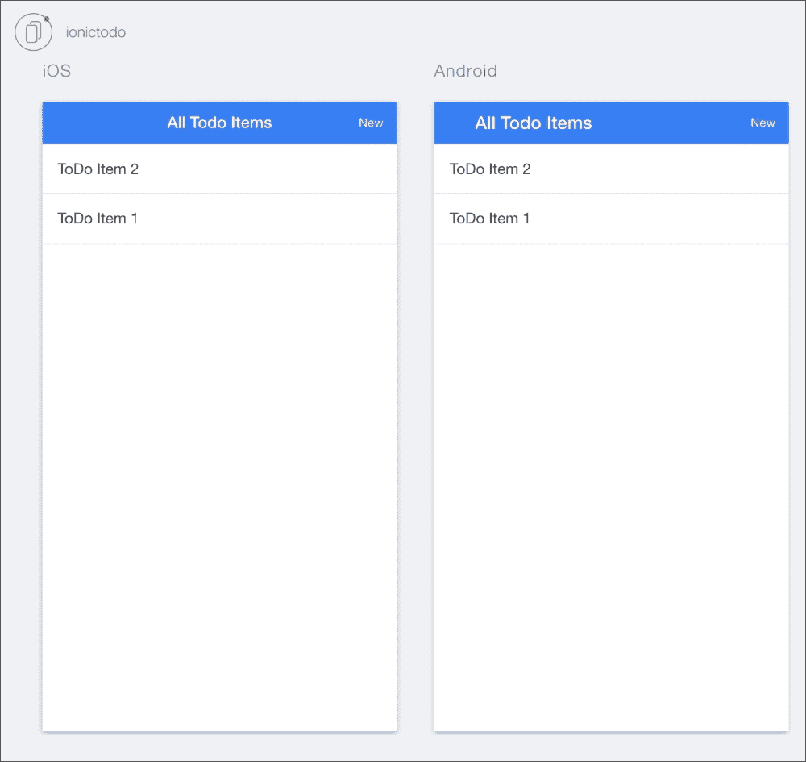

# 第十章：使用 API

在今天的动态生活和工作环境中，创建应用程序的过程中，将您的移动应用程序连接到后端，将有助于数据存储的过程，并将数据连接到伴随的 Web 应用程序，这将为用户提供增强的功能和令人满意的体验。

通过使用`Parse.com` REST API，可以将后端引入到项目中。Parse 提供了一个易于使用、直接、可扩展的平台，可以在基于 Ionic 框架的应用程序中实现。

在本章中，我们将首先设置 Parse 后端和 Ionic 项目。之后，我们将创建它们之间的连接，以实现我们想要的效果。

# 设置解析

将此项目启动并运行所需的第一步是访问[www.parse.com](http://www.parse.com)并创建一个帐户，或者如果您已经有一个帐户，则登录到该网站。在免费计划中，您将获得 20GB 的文件存储、20GB 的数据库存储和最多 2TB 的数据传输能力。

如果您是第一次使用`Parse.com`，您将会看到以下屏幕：



让我们将应用命名为`Ionic-ToDo`。一旦应用程序创建完成，如果这是您使用 Parse 创建的第一个应用程序，您将看到以下屏幕。确保记下**应用程序 ID**和**REST API 密钥**：



接下来的部分涉及前往**数据浏览器**。在此视图中，点击侧边栏中的**添加类**。类的作用是在 Parse 应用实例中存储数据。在我们的情况下，我们将类命名为`Todo`，并选择**自定义**作为类类型：



要完成类创建过程，请点击**创建类**，然后您的类就准备好了。在数据浏览器中，您会看到您新创建的类已经有一些属性：

+   `objectId`：这是代表集合中单个`Todo`项目的唯一 ID

+   `createdAt`：这告诉我们`Todo`项目何时添加到 Parse 中

+   `updatedAt`：这告诉我们`Todo`项目上次更新的时间

为了个性化`Todo`应用程序并允许创建待办事项，我们需要一个自定义属性来保存`Todo`项目的内容。在数据浏览器中，点击**+Col**，将弹出以下对话框：



对于此属性，我们将选择**字符串**作为列的类型，并在名称字段中输入`todo-content`。通过点击**创建列**来完成此过程，我们完成了！

一旦类准备好，我们就可以开始创建我们的 Ionic 应用程序。

# 设置 Ionic 项目

我们将通过运行以下命令来创建 Ionic 应用：

```js
ionic start ionictodo blank

```

这将创建一个名为`whichapp`的空白 Ionic 起始应用程序，这将为我们提供连接 Parse 服务到我们项目所需的设置。

# 连接 Parse 到我们的项目

为了将 Parse 数据连接到我们的项目，我们需要创建一个执行必要的 CRUD 操作以与 Parse REST API 交互的**AngularJS**服务。

我们选择的代码编辑器是 Atom，GitHub 开源编辑器。通过导航到 Atom 并将项目文件夹添加到其中开始：

**文件** | **添加项目文件夹**

创建一个名为`services.js`的文件，并使用以下路径：

**www** | **js** | **services.js**

首先连接`services`。定义`service`如下：

```js
angular.module('ionictodo.services',[]).factory('Todo',['$http',function($http){
  return {

  }
}]);
```

在这个阶段，我们的工厂对象`Todo`是一个空对象，我们需要向其中添加必要的`Parse.com` API 方法。重要的是要注意，在所有情况下主机名都是`https://api.parse.com`。`/1/`表示我们正在使用 API 的第一个版本。

以下是具有五个必需方法的工厂对象：

```js
angular.module('ionictodo.services',[]).factory('Todo',['$http','PARSE_CREDENTIALS',function($http,PARSE_CREDENTIALS){
  return {
    getAll:function(){
      return $http.get('https://api.parse.com/1/classes/Todo'',{
        headers:{
          'X-Parse-Application-Id': PARSE_CREDENTIALS.APP_ID,
          'X-Parse-REST-API-Key':PARSE_CREDENTIALS.REST_API_KEY,
        }
      });
    },
    get:function(id){
    return $http.get('https://api.parse.com/1/classes/Todo/'+id,{
      headers:{
        'X-Parse-Application-Id': PARSE_CREDENTIALS.APP_ID,
        'X-Parse-REST-API-Key':PARSE_CREDENTIALS.REST_API_KEY,
      }
    });
  },
  create:function(data){
    return $http.post('https://api.parse.com/1/classes/Todo',data,{
      headers:{
        'X-Parse-Application-Id': PARSE_CREDENTIALS.APP_ID,
        'X-Parse-REST-API-Key':PARSE_CREDENTIALS.REST_API_KEY,
        'Content-Type':'application/json'
      }
    });
    },
    edit:function(id,data){
      return $http.put('https://api.parse.com/1/classes/Todo/'+id,data,{
        headers:{
          'X-Parse-Application-Id': PARSE_CREDENTIALS.APP_ID,
          'X-Parse-REST-API-Key':PARSE_CREDENTIALS.REST_API_KEY,
          'Content-Type':'application/json'
        }
      });
    },
    delete:function(id){
      return $http.delete('https://api.parse.com/1/classes/Todo/'+id,{
        headers:{
          'X-Parse-Application-Id': PARSE_CREDENTIALS.APP_ID,
          'X-Parse-REST-API-Key':PARSE_CREDENTIALS.REST_API_KEY,
          'Content-Type':'application/json'
        }
      });
    }
  }
}]);
```

我们还需要声明`PARSE_CREDENTIALS` `value`服务，如下所示：

```js
.value(PARSE_CREDENTIALS 'PARSE_CREDENTIALS',{
  APP_ID: 'yourappid',
  REST_API_KEY:'yourrestapikey'
});
```

用您之前记录的应用程序 ID 和 REST API 密钥替换`yourappid`和`yourrestapikey`。

## 定义应用程序状态

为了连接不同应用程序的功能，我们需要为我们的应用程序定义一些状态，如下所示：

+   `todos`：列出所有待办事项

+   `createTodo`：允许用户创建新的待办事项

+   `editTodo`：允许用户更新待办事项

应用程序状态在名为`whichfile`的`app.js`文件中定义，该文件位于以下路径：

**www** | **js** | **app.js**

用以下代码替换现有的`app.js`代码：

```js
angular.module('ionictodo', ['ionic','ionictodo.controllers','ionictodo.services'])

.run(function($ionicPlatform,$state) {
  $ionicPlatform.ready(function() {
    // Hide the accessory bar by default (remove this to show the accessory bar above the keyboard
    // for form inputs)
    if(window.cordova && window.cordova.plugins.Keyboard) {
      cordova.plugins.Keyboard.hideKeyboardAccessoryBar(true);
    }
    if(window.StatusBar) {
      StatusBar.styleDefault();
    }
    $state.go('todos');
  });
}).config(function($stateProvider){
  $stateProvider.state('todos',{
    url:'/todos',
    controller:'TodoListController',
    templateUrl:'views/todos.html'
  }).state('createTodo',{
    url:'/todo/new',
    controller:'TodoCreationController',
    templateUrl:'views/create-todo.html'
  }).state('editTodo',{
    url:'/todo/edit/:id/:content',
    controller:'TodoEditController',
    templateUrl:'views/edit-todo.html'
  });
});
```

## 创建控制器和模板

一旦您定义了状态，您需要为每个控制器创建模板。由于我们希望在列表视图中编辑和创建任务，我们将定义以下三个控制器：

+   `TodoListController`

+   `TodoCreationController`

+   `TodoEditController`

为了实现控制器，我们需要创建一个名为`controllers.js`的新文件，该文件应位于以下路径：

**www** | **js** | **controllers.js**

在这个文件中，我们将声明所有我们的控制器`whichcontrollers`，这将通过以下代码完成：

```js
angular.module('ionictodo.controllers',[]).controller('TodoListController',['$scope','Todo',function($scope,Todo){

  Todo.getAll().success(function(data){
    $scope.items=data.results;
  });

  $scope.onItemDelete=function(item){
    Todo.delete(item.objectId);
    $scope.items.splice($scope.items.indexOf(item),1);
  }

}]).controller('TodoCreationController',['$scope','Todo','$state',function($scope,Todo,$state){

  $scope.todo={};

  $scope.create=function(){
    Todo.create({content:$scope.todo.content}).success(function(data){
      $state.go('todos');
    });
  }

}]).controller('TodoEditController',['$scope','Todo','$state','$stateParams',function($scope,Todo,$state,$stateParams){

  $scope.todo={id:$stateParams.id,content:$stateParams.content};
  $scope.edit=function(){
    Todo.edit($scope.todo.id,{content:$scope.todo.content}).success(function(data){
      $state.go('todos');
    });
  }
}]);
```

对于每个控制器，我们需要模板来呈现控制器。我们将从`todo`列表控制器开始，它使用`ion-list`来显示`todo`列表中的所有项目。为了开始这个过程，我们将在`www`中创建一个名为 views 的新文件夹。在 views 文件夹中，我们需要设计三个新的 HTML 文件，分别命名为 create-`todo.html`，`edit-todo.html`和`todos.html`。

对于`todos.html`，我们需要声明`ion-list`UI 元素如下：

```js
<ion-header-bar class="bar-positive">
  <div class="buttons">
    <button class="button button-icon icon ion-ios7-minus-outline" ng-click="data.showDelete = !data.showDelete;"></button>
    <h1 class="title">All Todo Items</h1>
    <button class="button" ui-sref="createTodo">New</button>
  </div>
</ion-header-bar>
<ion-content>
  <ion-list show-delete="data.showDelete">
    <ion-item ng-repeat="item in items | orderBy: '-createdAt'"
    item="item"
      href="#/todo/edit/{{item.objectId}}/{{item.content}}">
      {{item.content}}
      <ion-delete-button class="ion-minus-circled" ng-click="onItemDelete(item)"></ion-delete-button>
    </ion-item>
  </ion-list>
</ion-content>
```

通过文本区域和**添加**按钮呈现了一个新的`todo`列表的创建。当您点击此按钮时，将调用`$scope.create()`方法。导航到**create** | **todo.html**。代码应如下所示：

```js
<ion-header-bar class="bar-positive">
  <div class="buttons">
    <button class="button" ui-sref="todos">Back</button>
    <h1 class="title">Create Todo</h1>
  </div>
</ion-header-bar>

<ion-content>
  <div>
    <ion-list>
      <li class="item item-input item-stacked-label">
        <textarea type="text" placeholder="Start typing..." name="content" rows="10" ng-model="todo.content" required></textarea>
      </li>
      <ion-button class="button button-block button-positive" ng-click="create()">
        Add
      </ion-button>
    </ion-list>
  </div>
</ion-content>
```

编辑`todo`列表的能力是任何待办事项列表应用程序中必不可少的功能，在我们的项目中，我们将创建一个`edit-todo.html`文件，允许修改现有的待办事项，如下所示：

```js
<ion-header-bar class="bar-positive">
  <div class="buttons">
    <button class="button" ui-sref="todos">Back</button>
    <h1 class="title">Edit Todo</h1>
  </div>
</ion-header-bar>

<ion-content>
  <div>
    <ion-list>
      <li class="item item-input item-stacked-label">
        <textarea type="text" name="content" rows="10" ng-model="todo.content" required></textarea>
      </li>
      <ion-button class="button button-block button-positive" ng-click="edit()">
        Update
      </ion-button>
    </ion-list>
  </div>
</ion-content>
```

# 测试我们的应用程序

在这个阶段，我们已经完成了应用程序的基本功能，并准备在浏览器中测试应用程序。

在您的终端上，导航到项目目录。一旦您在项目文件夹中，运行以下命令：

```js
ionic serve --lab
```

当您执行命令时，您的浏览器将自动加载 Android 和 iOS 并排运行的应用程序的实时截图。屏幕将如下所示：



在这个阶段，一旦您添加新项目，它们可能不会立即显示在您的应用程序中，您需要刷新页面。

# 总结

连接应用程序到 API 时，本章涵盖的主题只是冰山一角，关于可能性还有很多。如果您希望扩展这样的应用程序，从 UI 到 API 的可扩展性来看，有无尽的机会可用。

首先，我们可以提供删除或归档已完成的待办事项列表的选项。我们还可以添加下拉刷新功能，以更新待办事项列表。从用户体验的角度来看，我们可以添加更多的交互控件，比如向左或向右滑动以标记待办事项为已完成任务。本章中建立的知识基础将使您熟悉下一章中将面临的更复杂任务所需的必要概念。
