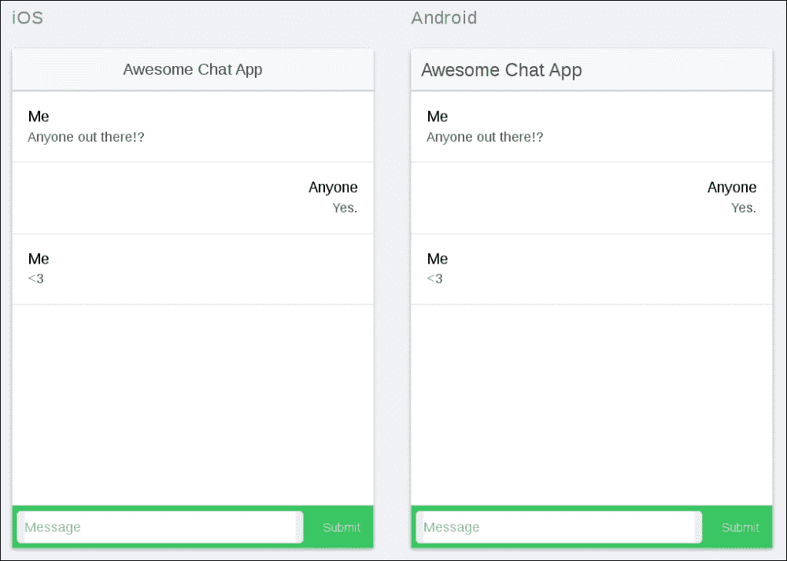
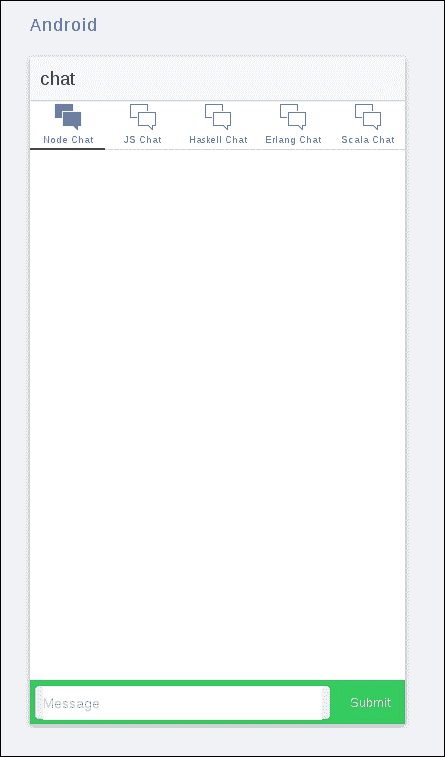

# 第十三章：构建高级聊天应用

在上一章中，我们开发了一个基本的聊天应用程序，允许任意数量的用户相互连接并匿名交谈。

在本章中，我们将扩展此应用程序，并通过添加聊天室和通知功能使其更加先进。在这样做的过程中，我们将演示`socket.io`上的命名空间概念是如何工作的，这是该库最重要的方面之一。

# 我们需要一些空间！

到目前为止，在我们的应用程序中使用 WebSockets 做的最先进的事情就是在单个 WebSocket 接口之间来回发送数据。我们很少关注分区，基本上就让它自由发挥。然而，在现实生活中，我们经常会发现自己处于一种情况中，我们希望对 WebSocket 连接进行分区，并且只允许某些用户访问一部分分区。

要看看这是如何工作的，考虑一个*群聊*的情况。在这里，用户不是只有一个单独的聊天界面，而是可以访问多个聊天室；每个聊天室都有自己的成员和对话。为了实现这一点，我们可以扩展现有的聊天服务器，简单地为我们想要打开的聊天室启动新的`node`实例，每个实例都有自己的端口，如下所示：

```js
// [snip]

// Connect the websocket handler to our server
var websocket = require('socket.io')(server);
// Create a handler for incoming websocket connections
websocket.on('UserConnectedEvent', function (socket) {
  console.log("New user connected");
  // Tell others a new user connected
  socket.broadcast.emit('UserConnectedEvent', null);
  // Bind event handler for incoming messages
  socket.on('MessageSentEvent', function (chatData) {
    console.log('Received new chat message');
    // By using the 'broadcast' connector, we will
    // send the message to everyone except the sender.
    socket.broadcast.emit('MessageReceivedEvent', chatData);
  });
});

// Define a separate port for each server we want to start
var port = 8080; // get from terminal args, for example

server.listen(port);
```

然而，这很快就变得笨拙了。因为我们将需要为每个服务器启动一个新的独立的 V8 实例，很可能很快就会听到办公室窗户外的那个人生气的敲击声，因为他的超级重要的股票分析算法由于缺乏内存空间而崩溃。他可能想伤害我们，并对我们的宠物做可怕的事情，所有这些都是因为我们找不到更顺畅的方式来使用 WebSockets。

或者，也许我们可以，毕竟。

这就是命名空间的概念发挥作用的地方。想象一种情况，我们可以将单个`socket.io`实例分成几个不同的端点，每个端点可以为自己的一组客户端提供服务。事实证明我们可以做到！

# 命名空间

还记得我们如何设置原始的`websocket`服务器吗？请看以下代码：

```js
// [snip]

// Connect the websocket handler to our server
var websocket = require('socket.io')(server);
// Create a handler for incoming websocket connections
websocket.on('UserConnectedEvent', function (socket) {
  console.log("New user connected");
  // Tell others a new user connected
  socket.broadcast.emit('UserConnectedEvent', null);
  // Bind event handler for incoming messages
  socket.on('MessageSentEvent', function (chatData) {
    console.log('Received new chat message');
    // By using the 'broadcast' connector, we will
    // send the message to everyone except the sender.
    socket.broadcast.emit('MessageReceivedEvent', chatData);
  });
});
```

在这里，我们只是使用了主`socket.io`实例，以便直接注册套接字连接及其各自的回调。然而，仔细看一下，我们实际上是将所有传入的连接连接到一个命名空间，即使这是隐式发生的。看一下前面代码中的以下片段：

```js
websocket.on('UserConnectedEvent', function (socket) {
  console.log("New user connected");
  // Tell others a new user connected
  socket.broadcast.emit('UserConnectedEvent', null);
  // Bind event handler for incoming messages
  socket.on('MessageSentEvent', function (chatData) {
    console.log('Received new chat message');
    // By using the 'broadcast' connector, we will
    // send the message to everyone except the sender.
    socket.broadcast.emit('MessageReceivedEvent', chatData);
  });
```

实际上正在发生的是，我们正在在根命名空间（写为/）上注册连接，这是`socket.io`给我们的一个命名空间，即使我们没有指定其他命名空间。这表明命名空间实际上对`socket.io`内部的工作方式至关重要。事实上，您进行的每个连接都将与单个命名空间关联，即使它是隐式的！

当用户直接连接到 WebSocket 服务器的 URL 时，他们会连接到根命名空间。例如，他们可以在客户端执行以下操作：

```js
var socket = io.connect('http://localhost:8080');
```

实际上，您是在告诉`socket.io`，您希望建立与根命名空间的连接。

问题在于，如果我们执行前面的步骤（就像我们到目前为止所做的那样），我们发送到服务器的所有消息都会对所有其他连接的客户端进行广播（即使您定义了其他命名空间，我们稍后会看到）。如果我们想要集中精力进行通信，这并不是很方便。

假设我们想要划分通信，以便让用户订阅`websocket`频道，发送他们感兴趣的信息。例如，假设我们正在构建一个聊天应用程序，让他们讨论 Java、Scala 和 JavaScript 等各种编程语言。在这种情况下，我们可以通过以下方式在服务器端定义命名空间：

```js
websocket.of('/java').on('UserConnectedEvent', function (socket) {
  console.log("New user connected to the Java channel");
  socket.broadcast.emit('UserConnectedEvent', null);
  socket.on('MessageSentEvent', function (chatData) {
    console.log('Received new Java chat message');
    socket.broadcast.emit('MessageReceivedEvent', chatData);
});

websocket.of('/scala').on('UserConnectedEvent', function (socket) {
  console.log("New user connected to the Scala channel");
  socket.broadcast.emit('UserConnectedEvent', null);
  socket.on('MessageSentEvent', function (chatData) {
    console.log('Received new Scala chat message');
    socket.broadcast.emit('MessageReceivedEvent', chatData);
});

websocket.of('/javascript').on('UserConnectedEvent', function (socket) {
  console.log("New user connected to the Java channel");
  socket.broadcast.emit('UserConnectedEvent', null);
  socket.on('MessageSentEvent', function (chatData) {
    console.log('Received new Javascript chat message');
    socket.broadcast.emit('MessageReceivedEvent', chatData);
});
```

代码的重要部分被强调了。注意我们如何使用`of`函数来创建实际的命名空间。函数的参数是相对于根命名空间(`/`)的命名空间的名称。

命名空间创建后，我们以我们之前熟悉的方式注册`socket`连接（尽管在之前我们并不知情！）。

现在，我们可以通过让客户端连接到任何给定的可用命名空间来利用这些修改对服务器进行操作。例如，对于我们已经在这里定义的命名空间，你可以像这样连接到每一个（分别）：

```js
var javaSocket = io.connect('http://localhost:8080/java');

var scalaSocket = io.connect('http://localhost:8080/scala');

var javascriptSocket = io.connect('http://localhost:8080/javascript');
```

然后，继续操作它们，就像在任何其他单个 WebSocket 连接的情况下一样，如下所示：

```js
javaSocket.on('UserConnectedEvent', function (user) {
  console.log('User connected to the Java channel:', user);
});
```

这一切都非常简单，当你深入了解时会注意到。让我们通过简单的聊天应用程序来实现，这个应用程序是我们在上一章中编写的，并且给它一些真正的命名空间爱。

# 创建一个多房间聊天应用程序

让我们简要回顾一下我们在上一章中构建的基本**聊天应用程序**。



这个应用程序有效地建立了与 WebSocket 服务器的连接，并让我们与一些随机的陌生人交谈，这些人因某种原因在厨房闲逛并使用 Wi-Fi 连接。我们想要做的是给这些陌生人（和我们自己）选择不同的聊天室的可能性，取决于他们想要谈论的内容。由于我们热爱编程，编程语言当然会成为菜单上的全部和结束。

## 配置基本布局

为了创建一个很好的方式在不同的聊天室之间导航，我们将使用一个分页布局，其中每个标签对应一个单独的聊天室。

这意味着我们需要对我们的 HTML 以及应用程序的路由进行一些更改。首先修改`index.html`文件。确保它看起来像下面的样子：

```js
<!DOCTYPE html>
<html>
  <head>
    <meta charset="utf-8">
    <meta name="viewport" content="initial-scale=1, maximum-scale=1, user-scalable=no, width=device-width">
    <title></title>
    <link href="lib/ionic/css/ionic.css" rel="stylesheet">
    <link href="css/style.css" rel="stylesheet">
    <!-- IF using Sass (run gulp sass first), then uncomment below and remove the CSS includes above
    <link href="css/ionic.app.css" rel="stylesheet">
    -->
    <!-- ionic/angularjs js -->
    <script src="img/ionic.bundle.js"></script>
    <!-- cordova script (this will be a 404 during development) -->
    <script src="img/cordova.js"></script>
    <!-- your app's js -->
    <script src="img/socket.io-1.3.5.js"></script>
    <script src="img/app.services.js"></script>
    <script src="img/app.controllers.js"></script>
    <script src="img/app.directives.js"></script>
    <script src="img/app.js"></script>
  </head>
  <body ng-app="ionic-chat-app">
 <ion-nav-bar class="bar-stable">
 <ion-nav-back-button>
 </ion-nav-back-button>
 </ion-nav-bar>
 <ion-nav-view></ion-nav-view>
  </body>
</html>
```

我在前面的代码中突出了最重要的部分。在这里，我们创建了一个导航栏，它对应于 Ionic 屏幕顶部的工具栏。如果你熟悉 Android，你会认识到这是操作栏。在这个导航栏下面，我们附加了实际的视图，目前已经加载。

接下来，我们将在这个布局上附加一系列的`tabs`，这将让我们选择我们希望互动的聊天室。在模板文件夹中，创建一个名为`tabs.html`的文件，并确保它包含以下内容：

```js
<ion-tabs class="tabs-icon-top tabs-color-active-positive">
  <!-- Node chat -->
  <ion-tab title="Node Chat"
  icon-off="ion-ios-chatboxes-outline"
  icon-on="ion-ios-chatboxes"
  href="#/app/node">
    <ion-nav-view name="node-view">
    </ion-nav-view>
  </ion-tab>
  <!-- Javascript chat -->
  <ion-tab title="JS Chat"
  icon-off="ion-ios-chatboxes-outline"
  icon-on="ion-ios-chatboxes"
  href="#/app/javascript">
    <ion-nav-view name="javascript-view">
    </ion-nav-view>
  </ion-tab>
  <!-- Haskell chat -->
  <ion-tab title="Haskell Chat"
  icon-off="ion-ios-chatboxes-outline"
  icon-on="ion-ios-chatboxes"
  href="#/app/haskell">
    <ion-nav-view name="haskell-view">
    </ion-nav-view>
  </ion-tab>
  <!-- Erlang chat -->
  <ion-tab title="Erlang Chat"
  icon-off="ion-ios-chatboxes-outline"
  icon-on="ion-ios-chatboxes"
  href="#/app/erlang">
    <ion-nav-view name="erlang-view">
    </ion-nav-view>
  </ion-tab>
  <!-- Scala chat -->
  <ion-tab title="Scala Chat"
  icon-off="ion-ios-chatboxes-outline"
  icon-on="ion-ios-chatboxes"
  href="#/app/scala">
    <ion-nav-view name="scala-view">
    </ion-nav-view>
  </ion-tab>
</ion-tabs>
```

在这里，我们使用了`ion-tabs`指令，本质上就像一个水平列表，由`ion-tab`实例组成。注意我们如何将每个标签与单个语言视图和 URL 相关联。路由器将使用这两者来推断标签被点击时应用程序应该处于的确切状态。让我们看看它是如何做到的。打开`app.js`文件，确保它看起来像下面的样子：

```js
angular.module('ionic-chat-app',
[
  'ionic',
  'ionic-chat-app-services',
  'ionic-chat-app-controllers'
])
.run(function ($ionicPlatform) {
  $ionicPlatform.ready(function () {
  if (window.cordova && window.cordova.plugins.Keyboard) {
    cordova.plugins.Keyboard.hideKeyboardAccessoryBar(true);
  }
  if (window.StatusBar) {
    StatusBar.styleDefault();
  }
})
})
.config(function ($stateProvider, $urlRouterProvider) {
  // Configure the routing
  $stateProvider
  // Each tab has its own nav history stack:
  .state('app', {
     url: '/app',
     abstract: true,
     templateUrl: "templates/tabs.html"
  })
  .state('app.node', {
  url: '/node',
  views: {
    'node-view': {
      templateUrl: 'templates/app-chat.html',
      controller: 'ChatController',
      resolve: {
        chatRoom: function () {
          return 'node';
        }
      }
    }
  }
})
.state('app.javascript', {
  url: '/javascript',
  views: {
    'javascript-view': {
      templateUrl: 'templates/app-chat.html',
      controller: 'ChatController',
      resolve: {
        chatRoom: function () {
          return 'javascript';
        }
      }
    }
  }
})
.state('app.haskell', {
  url: '/haskell',
  views: {
    'haskell-view': {
      templateUrl: 'templates/app-chat.html',
      controller: 'ChatController',
      resolve: {
        chatRoom: function () {
          return 'haskell';
        }
      }
    }
  }
})
.state('app.erlang', {
  url: '/erlang',
  views: {
    'erlang-view': {
      templateUrl: 'templates/app-chat.html',
      controller: 'ChatController',
      resolve: {
        chatRoom: function () {
          return 'erlang';
        }
      }
    }
  }
})
.state('app.scala', {
  url: '/scala',
  views: {
    'scala-view': {
      templateUrl: 'templates/app-chat.html',
      controller: 'ChatController',
      resolve: {
        chatRoom: function () {
          return 'scala';
        }
      }
    }
  }
});
$urlRouterProvider.otherwise('/app/node');
})
```

注意我们如何将每个单个标签与特定的应用程序状态相结合。这样做，我们还告诉应用程序在每个标签下应该如何呈现视图。在我们的情况下，我们为每个单独的聊天有一个共同的视图`templates/app-chat`，这对我们来说是熟悉的，因为我们之前的工作中用过。让我们看看下面的代码：

```js
<ion-view view-title="chat">
  <ion-content>
    <div class="list">
      <a collection-repeat="message in messages"
      class="item item-avatar"
      ng-class="{'other-chatbox' : message.external}">
        <h2>{{message.name}}</h2>
        <p>{{message.text}}</p>
      </a>
    </div>

  </ion-content>
  <div class="bar bar-footer bar-balanced">
    <label class="item-input-wrapper">
      <input id="message-input"
      type="text"
      placeholder="Message"
      ng-model="inputMessage">
    </label>
    <button class="button button-small"
    ng-click="onSend()">
      Submit
    </button>
  </div>
</ion-view>
```

最后，在`css/style.css`文件中添加一些自定义的 CSS，以根据我们的需求调整格式；这也是熟悉的，因为我们在上一章中看到过这一点：

```js
#message-input {
  width: 100%;
}

.item-avatar {
  padding-left: 16px;
}

.other-chatbox {
  text-align: right;
}
```

你的视图现在应该看起来像下面截图中显示的那样：



现在，让我们为我们的应用程序添加一些实际的逻辑，以便让实际的聊天逻辑进行。我们将实现我们在本章前面讨论过的命名空间模式，为每个标签添加一个房间。首先，在`app.controllers.js`文件中定义以下控制器：

```js
angular.module('ionic-chat-app-controllers', [])
.controller('ChatController', function ($scope, ChatService, chatRoom) {
  var connection = ChatService.connect(chatRoom);
  // The chat messages
  $scope.messages = [];
  // Notify whenever a new user connects
  connection.on.userConnected(function (user) {
    $scope.messages.push({
      name: 'Chat Bot',
      text: 'A new user has connected!'
    });
    $scope.$apply();
  });
  // Whenever a new message appears, append it
  connection.on.messageReceived(function (message) {
    message.external = true;
    $scope.messages.push(message);
    $scope.$apply();
  });
  $scope.inputMessage = '';
  $scope.onSend = function () {
    $scope.messages.push({
      name: 'Me',
      text: $scope.inputMessage
    });
    // Send the message to the server
    connection.emit({
      name: 'Anonymous',
      text: $scope.inputMessage
    });
    // Clear the chatbox
    $scope.inputMessage = '';
  }
});
```

这个控制器非常类似于我们从之前的应用程序中所熟悉的，唯一的区别是它以参数的形式接受我们应该连接到的聊天室的名称。这个名称在`app.js`中与视图一起解析，如下所示：

```js
.state('app.scala', {
  url: '/scala',
  views: {
    'scala-view': {
      templateUrl: 'templates/app-chat.html',
      controller: 'ChatController',
 resolve: {
 chatRoom: function () {
 return 'scala';
 }
 }
    }
  }
});
```

强调相关部分。在这种情况下，我们只需将`chatRoom`绑定到视图对应的语言房间的名称。

最后，我们需要扩展`ChatService`模块，以确保我们可以连接到单独的聊天室。打开`app.services.js`文件，并确保它具有以下内容：

```js
angular.module('ionic-chat-app-services', [])
.service('ChatService', function ChatService($rootScope) {
  function ChatConnection(chatName) {
    this.chatName = chatName;
    // Init the Websocket connection
    var socket = io.connect('http://localhost:8080/' + chatName);
    // Bridge events from the Websocket connection to the rootScope
    socket.on('UserConnectedEvent', function (user) {
      console.log('User connected:', user);
      $rootScope.$emit('UserConnectedEvent', user);
    });
    /*
    * Send a message to the server.
    * @param message
    */
    socket.on('MessageReceivedEvent', function (message) {
      console.log('Chat message received:', message);
      $rootScope.$emit('MessageReceivedEvent', message);
    });
    this.emit = function (message) {
      console.log('Sending chat message:', message);
      socket.emit('MessageSentEvent', message);
    };
    this.on = {
      userConnected: function (callback) {
        $rootScope.$on('UserConnectedEvent', function (event, user) {
          callback(user);
        });
      },
      messageReceived: function (callback) {
        $rootScope.$on('MessageReceivedEvent', function (event, message) {
          callback(message);
        });
      }
    }
  }
  /**
  * Establishes a new chat connection.
  *
  * @param chatName name of the chat room to connect to
  * @returns {ChatService.ChatConnection}
  */
  this.connect = function (chatName) {
    return new ChatConnection(chatName);
  }
});
```

在其先前版本中，该服务只是建立了一个`socket`连接并为其提供服务。在这里，我们根据我们连接到的命名空间来生成`socket`连接。这使我们能够为每个单独的`socket`设置一个单独的`service`实例。

这就是客户端所需要的全部！让我们转向服务器，以便结束一切。

## 构建服务器

我们已经看到了如何在服务器上创建命名空间。因此，让我们相应地调整我们自己的。但是，为了使它更整洁，让我们通过迭代一个包含我们希望创建的所有命名空间名称的列表来做到这一点：

```js
var http = require('http');
var url = require('url');
var fs = require('fs');
var server = http.createServer(function (req, res) {
  var parsedUrl = url.parse(req.url, true);
  switch (parsedUrl.pathname) {
    case '/':
    // Read the file into memory and push it to the client
    fs.readFile('index.html', function (err, content) {
      if (err) {
        res.writeHead(500);
        res.end();
      }
      else {
        res.writeHead(200, {'Content-Type': 'text/html'});
        res.end(content, 'utf-8');
      }
    });
    break;
  }
});
server.listen(8080);
server.on('listening', function () {
  console.log('Websocket server is listening on port', 8080);
});
// Connect the websocket handler to our server
var websocket = require('socket.io')(server);
// Configure the chat rooms
['node', 'javascript', 'haskell', 'erlang', 'scala'].forEach(function (chatRoom) {
  websocket.of('/' + chatRoom).on('connection', function (socket) {
    console.log("New user connected to", chatRoom);
    // Tell others a new user connected
    socket.broadcast.emit('UserConnectedEvent', null);
    // Bind event handler for incoming messages
    socket.on('MessageSentEvent', function (chatData) {
      console.log('Received new chat message', chatData);
      // By using the 'broadcast' connector, we will
      // send the message to everyone except the sender.
      socket.broadcast.emit('MessageReceivedEvent', chatData);
    });
  });
});
```

就是这样！您现在可以启动服务器，连接应用程序到服务器，并尝试它。当您在房间之间切换时，请特别注意您的`服务器`控制台。您将看到对不同房间的单独连接正在建立。最后，亲自看看命名空间实际上是如何工作的。您发送到一个聊天的消息只会被已经连接到它的用户看到。

### 注意

实际上，我们可以将`socket.io`连接分区得比我们在这里做的更细致。`socket.io`连接还具有房间的概念，它们本质上是单个命名空间的分区。我们建议您仔细研究这一点。`socket.io`的官方文档包含大量示例。要查看此文档，请访问[`socket.io/docs/rooms-and-namespaces/`](http://socket.io/docs/rooms-and-namespaces/)。

# 总结

在本章中，您创建了一个高级的聊天应用程序，允许用户使用`socket.io`的重要概念命名空间在多个房间之间聊天。您学会了如何在服务器本身上配置命名空间，以及如何从客户端连接到它们。

在下一章中，我们将通过查看如何实现一个常见的功能——电子商务应用程序，来总结到目前为止学到的内容。
