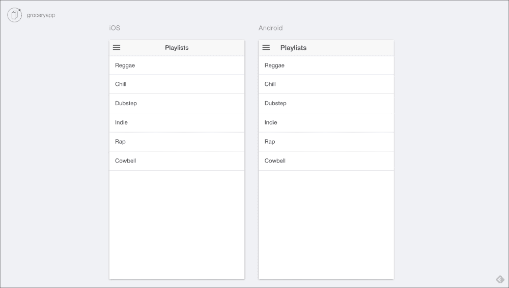
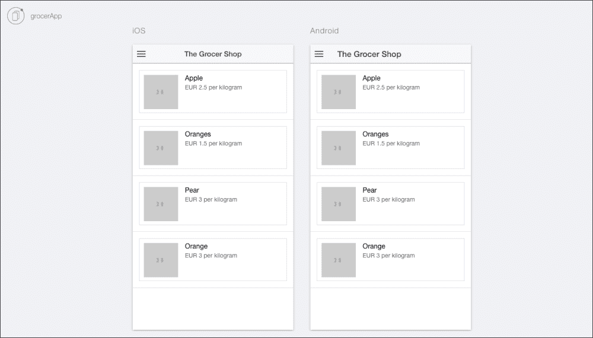

# 第十四章：使用 Ionic 框架创建电子商务应用程序

在这一章中，我们将汇集本书迄今为止积累的所有知识，并在易于使用的 Ionic 框架中实现它，这可以应用在我们自己的项目中。

特别是在这一章中，我们将在第三章*创建 API*中已经完成的工作的基础上进行构建，并将这项工作与一个 Ionic 项目结合起来，通过 Android 或 iOS 智能手机可以访问。

# 设计我们的应用程序

作为应用程序开发过程的一部分，重要的是我们了解如何构建我们的应用程序并将其连接到产品 API，以实现我们创建基本电子商务应用程序的最终目标。

对于这个特定的项目，我们将在两个主要屏幕上工作——产品列表项、控制器和产品页面。除此之外，我们还将专注于创建一个基本的功能侧边菜单和一个基本的购买选项，在这个阶段还不可用。

## 创建 Ionic 项目

我们将通过创建一个基于之前章节中没有机会使用的 Ionic 起始模板的项目来开始我们的项目。侧边菜单模板为我们提供了一个侧边菜单、列表项视图和列表项详细视图。这个模板应该为我们创建理想的电子商务应用程序提供必要的基础。

打开您的终端并输入以下命令：

```js
$ ionic start grocerApp sidemenu

```

上述命令将创建一个带有`sidemenu`项目的项目文件夹。为了进一步了解这个模板是如何工作的，我们鼓励您首先导航到`project`文件夹，然后输入以下命令：

```js
$ ionic serve --lab

```

这将打开您选择的浏览器，并为您展示应用程序在 Android 和 iOS 设备上的外观：



## 实现我们的设计

在实现我们的设计时，我们需要在应用程序的代码中反映必要的更改。我们首先将从修改我们的控制器开始。

我们首先要做的是导航到`app.js`，该文件位于路径`www/js/app.js`。

我们将在`app.js`中用以下代码替换现有代码：

```js
angular.module('starter', ['ionic', 'starter.controllers'])

.run(function($ionicPlatform) {
  $ionicPlatform.ready(function() {
  // Hide the accessory bar by default (remove this to show the accessory bar above the keyboard
  // for form inputs)
  if (window.cordova && window.cordova.plugins.Keyboard) {
    cordova.plugins.Keyboard.hideKeyboardAccessoryBar(true);
    cordova.plugins.Keyboard.disableScroll(true);

  }
  if (window.StatusBar) {
    // org.apache.cordova.statusbar required
    StatusBar.styleDefault();
  }
});

.config(function($stateProvider, $urlRouterProvider) {
  $stateProvider

  .state('app', {
    url: '/app',
    abstract: true,
    templateUrl: 'templates/menu.html',
    controller: 'AppCtrl'
  })

  .state('app.search', {
    url: '/search',
    views: {
      'menuContent': {
      templateUrl: 'templates/search.html'
    }
  }
})

state('app.products', {
  url: '/products',
  views: {
    'menuContent': {
    templateUrl: 'templates/products.html',
    controller: 'ProductsCtrl'
  }
}
})

.state('app.single', {
  url: '/products/:productId',
  views: {
    'menuContent': {
    templateUrl: 'templates/product.html',
    controller: 'ProductCtrl'
    }
  }
});
// if none of the above states are matched, use this as the fallback
$urlRouterProvider.otherwise('/app/products');
});
```

上述代码将允许我们实现构成我们应用程序一部分的不同屏幕，即`products`页面、单个产品和搜索功能，这些功能在当前版本的应用程序中尚未实现。

我们修改阶段的下一步是在我们的应用程序`controllers`中实现必要的更改，这些`controllers`位于`controllers.js`文件中。继续用以下代码替换现有代码：

```js
angular.module('starter.controllers', [])

.controller('AppCtrl', function($scope, $ionicModal, $timeout) {

  // Form data for the login modal
  $scope.loginData = {};

  // Create the login modal that we will use later
  $ionicModal.fromTemplateUrl('templates/login.html', {
    scope: $scope
  }).then(function(modal) {
    $scope.modal = modal;
  });

  // Triggered in the login modal to close it
  $scope.closeLogin = function() {
    $scope.modal.hide();
  };

  // Open the login modal
  $scope.login = function() {
    $scope.modal.show();
  };

  // Perform the login action when the user submits the login form
  $scope.doLogin = function() {
    console.log('Doing login', $scope.loginData);

    // Simulate a login delay. Remove this and replace with your login
    // code if using a login system
    $timeout(function() {
      $scope.closeLogin();
    }, 1000);
  };
})

.controller('ProductsCtrl', function($scope) {
  $scope.products = [
    { title: 'Apples', id: 1 ,price:1.00, image:'http://loremflickr.com/30/30/apples'},
    { title: 'Carrots', id: 2,price:2.00, image:'http://loremflickr.com/30/30/carrots' },
    { title: 'Tomatoes', id: 3 ,price:3.00, image:'http://loremflickr.com/30/30/tomatoes'},
    { title: 'Pears', id: 4, price:1.50, image:'http://loremflickr.com/30/30/pears' },
    { title: 'Grapes', id: 5, price:1.00, image:'http://loremflickr.com/30/30/grapes' },
    { title: 'Plums', id: 6, price: 2.50, image:'http://loremflickr.com/30/30/plums' },
    { title: 'Olives', id:7, price: 0.50, image:'http://loremflickr.com/30/30/olives'}
  ];
})

.controller('ProductCtrl', function($scope, $stateParams) {
});
```

正如您在前面的代码中所看到的，我们声明了一个`products`数组。目前，这通过`title`变量声明了产品标题，通过`id`声明了产品 ID，通过`price`声明了价格。最后但并非最不重要的是，为了增加趣味，我们还添加了一个链接到[`loremflickr.com`](http://loremflickr.com)支持的缩略图图像生成器。

当前的设置不会反映在我们移动应用程序的前端，因为我们还没有在 HTML 文件中进行必要的更改。

我们首先将`playlist.html`和`playlists.html`分别重命名为`product.html`和`products.html`。我们可以在路径`www/templates/playlist.html`和`www/templates/playlists.html`找到这两个文件。

然后我们将导航到`menu.html`文件，该文件位于`www/templates/menu.html`路径下。

我们将在前面的路径中用以下代码替换现有代码：

```js
<ion-side-menus enable-menu-with-back-views="false">
  <ion-side-menu-content>
    <ion-nav-bar class="bar-stable">
      <ion-nav-back-button>
      </ion-nav-back-button>

      <ion-nav-buttons side="left">
        <button class="button button-icon button-clear ion-navicon" menu-toggle="left">
        </button>
      </ion-nav-buttons>
    </ion-nav-bar>
    <ion-nav-view name="menuContent"></ion-nav-view>
  </ion-side-menu-content>

  <ion-side-menu side="left">
    <ion-header-bar class="bar-stable">
      <h1 class="title">Shop Menu</h1>
    </ion-header-bar>
    <ion-content>
      <ion-list>
        <ion-item menu-close href="#/app/search">
          Search
        </ion-item>
        <ion-item menu-close href="#/app/products">
          Products
        </ion-item>
        <ion-item menu-close href="#">
          Basket
        </ion-item>
      </ion-list>
    </ion-content>
  </ion-side-menu>
</ion-side-menus>
```

在前面的代码中，我们用最新的模板文件替换了旧的引用，这些模板文件反映了我们最近的更改。

接下来，我们将继续修改`product.html`文件，使我们的应用程序看起来更像产品。除此之外，该页面还将包括一个图像占位符、`产品描述`、`价格`和一个基本的`添加到购物篮`按钮。在应用程序的未来迭代中，这将允许用户在希望购买必要物品时将产品添加到虚拟购物篮中。我们将用以下代码替换`product.html`中的现有代码：

```js
<ion-view view-title="Product">
  <ion-content>
    <h1>Product</h1>
    
    <br>
      <p>Product Description</p>
    <br>
      <p>Price</p>
    <button class="button button-balanced">
      Add to Basket
    </button>
  </ion-content>
</ion-view>
```

在修改 HTML 文件的最后一步中，我们需要修改`products.html`文件，以使用 AngularJS 显示产品标题和产品图像。用以下代码替换现有代码：

```js
<ion-view view-title="The Grocer Shop">
  <ion-content>
    <ion-list>
      <ion-item ng-repeat="product in products">
        <a class="item item-thumbnail-left" href="#/app/products/{{product.id}}">
          
          <h2>{{product.title}}</h2>
          <p>EUR {{product.price}} per kilogram</p>
        </a>
      </ion-item>
    </ion-list>
  </ion-content>
</ion-view>
```

在上述代码中，我们提取了`app.js`中声明的`product.image`和`product.title`，并在`ion-view`标签中重现了它。我们还对其进行了个性化处理，并包括了货币和每公斤产品的价格。

## 设置产品 API

到目前为止，我们实现的是一个非常简化的版本，这与我们想要实现的目标相比是非常简单的。由于我们想要创建使用 MongoDB、Node.js 和 Ionic 的项目，我们应该抓住机会创建一个连接到我们本地存储的后端的应用程序，并利用这些知识连接到由 Node.js 和 MongoDB 提供支持的基于互联网的服务器。

为了利用这一部分，您需要按照第三章中提供的说明，*创建 API*，来设置您自己的 Node.js 服务器并包括一组基本数据。

完成所有必要的步骤后，首先运行`mongodb`数据库，然后查看我们服务器上的当前条目。我们将通过导航到`order_api`文件夹并运行以下命令来完成这一步：

```js
sudo mongod

```

我们将使用以下命令在终端中启动 Node.js 服务器：

```js
node api.js

```

如果您遵循了第三章中给出的说明，*创建 API*，将出现以下消息：

**启动，运行并准备好行动！**

此时，我们将打开已安装的 REST 客户端并传递以下命令：

```js
http://localhost:8080/api/products

```

如果你的响应类似于以下内容，那么你应该考虑你创建服务器的尝试是成功的：

```js
[
  {
    "_id": "55be0d021259c5a6dc955289",
    "name": "Apple",
    "price": 2.5
  },
  {
    "_id": "55be0d541259c5a6dc95528a",
    "name": "Oranges",
    "price": 1.5
  },
  {
    "_id": "55be0d6c1259c5a6dc95528b",
    "name": "Pear",
    "price": 3
  },
  {
    "_id": "55be0d6c1259c5a6dc95528c",
    "name": "Orange",
    "price": 3
  }
]
```

## 将产品 API 连接到我们的 Ionic 应用

一旦您从服务器获得了响应并且服务器和数据库已经运行起来，您需要用本地主机中的数组替换`app.js`文件中的现有数组。

由于 Web 服务器是基于本地的，您需要启用跨域资源共享，目前最简单的方法是通过 Google Chrome 并启用**CORS**（**跨域资源共享**）Chrome 扩展程序来实现，该扩展程序可在[`goo.gl/oQNhwh`](https://goo.gl/oQNhwh)上获得。如果您搜索**Allow-Control-Allow-Origin: ***，该扩展程序也可在 Chrome Web Store 上获得。

我们首先将通过导航到`ionic.project`文件来启动我们的项目，该文件位于`root`文件夹中，并将以下代码添加到`ionic.project`中：

```js
"proxies": [
    {
      "path": "/api",
      "proxyUrl": "http://cors.api.com/api"
    }
  ]
```

这里的`http://cors.api.com/api` URL 充当占位符 URL，以便启用本地开发和跨域资源共享。

这个修改将帮助我们添加一个代理 URL，这将允许跨域资源共享。

我们还将通过添加两个变量和两个任务来修改`gulpfile.js`文件，如下所示：

```js
var replace = require('replace');
var replaceFiles = ['./www/js/app.js'];

gulp.task('add-proxy', function() {
  return replace({
    regex: "http://cors.api.com/api",
    replacement: "http://localhost:8080/api",
    paths: replaceFiles,
    recursive: false,
    silent: false
  });
})

gulp.task('remove-proxy', function() {
  return replace({
    regex: "http://localhost:8080/api",
    replacement: "http://cors.api.com/api",
    paths: replaceFiles,
    recursive: false,
    silent: false
  });
})
```

为了确保`gulpfile`的功能正常，我们鼓励您通过运行以下命令来确保`gulp`已正确安装：

```js
sudo npm install gulp -g

```

使用`gulp`，我们还需要安装`replace`。这是一个`gulp`依赖项，它将允许我们通过字符串替换来为项目添加代理功能。可以通过运行以下命令来启用这一功能：

```js
sudo npm install --save replace

```

为了在 Ionic 中实现跨域资源共享，我们还需要使用`factory`方法，通过在`www/js`文件夹中创建一个名为`services`的新 JavaScript 文件来实现，其中包含以下代码：

```js
angular.module('starter.services', [])
factory('Api', function($http, ApiEndpoint) {
  console.log('ApiEndpoint', ApiEndpoint);

  var getApiData = function() {
    return $http.get(ApiEndpoint.url + '/products');
  };

  return {
    getApiData: getApiData
  };
})
```

为了创建上述代码，我们需要在`index.html`文件和`app.js`文件中引用`services.js`。我们将在`index.html`的`head`标签中添加以下代码：

```js
<script src="img/services.js"></script>
```

另外，我们将更新`app.js`文件，包括我们的新常量，该常量已在`services.js`文件中引用。更新如下：

```js
angular.module('starter', ['ionic', 'starter.controllers','starter.services'])

.constant('ApiEndpoint', {
  url: 'http://localhost:8080/api'
})
```

### 注意

为了方便您的编码体验，我们将所有的代码上传到了 GitHub 仓库，可以在[`github.com/stefanbuttigieg/nodejs-ionic-mongodb/tree/master/chapter-14`](https://github.com/stefanbuttigieg/nodejs-ionic-mongodb/tree/master/chapter-14)上找到。

通过更新名为`ProductsCtrl`的`product`控制器，我们将我们本地创建的 REST API 与我们的 Angular 控制器连接起来，使其对用户可用。代码需要更新如下：

```js
.controller('ProductsCtrl', function($scope, Api) {
  $scope.products = null;
  Api.getApiData().then(function(result) {
          $scope.products = result.data;
  });
})
```

这段代码修改了 JSON 数组，并用从本地 web 服务器上提取数据的代码替换，然后将其在我们的`controller`中可用。最后的修改需要在`products.html`文件中实现。在这里，我们将更新文件以包含一个通用的图像占位符。我们将对`products.html`文件进行轻微修改，使其与我们自己的 JSON 文件配合使用：

```js
<ion-view view-title="The Grocer Shop">
  <ion-content>
    <ion-list>
      <ion-item ng-repeat="product in products">
        <a class="item item-thumbnail-left" href="#/app/products/{{product.id}}">
          
          <h2>{{product.name}}</h2>
          <p>EUR {{product.price}} per kilogram</p>
        </a>
      </ion-item>
    </ion-list>
  </ion-content>
</ion-view>
```

一旦上述代码实施完成，可以随意转到`grocerApp`软件的`root`文件夹并运行以下命令：

```js
ionic serve --lab

```

最终的应用应该是这样的：



# 总结

在本章中，我们汇集了我们在过去几章中成功开发的一些技能。值得注意的是，我们成功连接了一个从头开始创建的 API 和一个通过 Ionic 框架实现的跨平台应用。关于电子商务，有许多开源解决方案，如**Traider.io**和**ReactionCommerce**。这些解决方案具有扩展功能，并正在通过社区贡献不断改进，特别是关于 REST API 服务方面。另外，它们使用了 MongoDB 和 Node.js。

Ionic 框架在各个方面都是一个不断发展的平台。正如我们在本书中早些时候提到的，Ionic 框架团队发布了许多更新和新功能。我们对此感到兴奋，并且相信投入精力和时间进一步了解这个平台是非常宝贵的。
