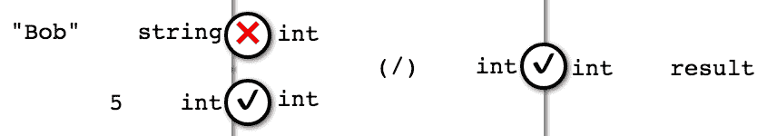
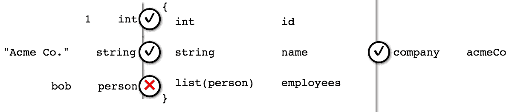

# 第二章：使用类型和值进行编程

在上一章中，我们探讨了使用 ReasonML 进行类型驱动开发，但类型究竟是什么？它们如何与程序的其余部分交互？它们如何帮助您在日常工作中，使用强静态类型系统和类型推断是什么样的体验？

在本章中，我们将涵盖以下主题：

+   设置编辑器工作流程

+   类型与值

+   不变值和内存

+   静态类型与动态类型

+   类型擦除

+   语法错误

+   类型错误与推断

+   合并

# 工作流程

为了充分利用本章，我们将设置一个舒适的编辑-编译工作流程。我们建议在您的编辑器中将两个窗口并排放置。VSCode 通过“视图”|“分割编辑器”命令支持此功能。在一侧，加载一个 Reason 源文件；在另一侧，加载 JavaScript 输出文件（一旦最初编译）。然后在终端中，运行以下命令：

```js
bsb -w
```

前面的命令以 *监视模式* 开始构建，这会自动重新编译项目中的任何受影响的源代码部分，每当您更改任何源代码时。实际上，监视模式足够智能，当相应的 Reason 源文件被删除时，也会自动删除过时的 JavaScript 输出文件。当您保存 Reason 源文件时，编辑器也会自动重新加载编译后的 JavaScript 文件。

在 VSCode 中，您还可以使用“视图”|“集成终端”命令直接在文件下方打开一个终端会话，并运行 `bsb -w` 以获得整个工作流程的单个集成视图。这样，当有编译错误时，您不必切换窗口就能看到它们。当然，您可能更喜欢使用两个显示器，并将终端和编译器保持在另一个屏幕上，这样您就不必切换窗口——这也是可行的。

# 类型与值

让我们通过讨论类型和值来为本书的其余部分设定场景。在核心上，类型是一组值。想想看，类型 `bool`，这是 Reason 所称为的正常布尔类型。一个 `bool` 值可以是两种不同的事物之一：`true` 或 `false`。我们说这些值 *占据*（存在于）这个类型中。其他任何东西都是错误。

这引发了一个有趣的问题：*在这个上下文中，“说任何其他东西都是错误”是什么意思？实际上，我们为什么要关心类型呢？*

为了回答这些问题，让我们思考一下如果我们尝试执行操作 `"Bob" / 5` 会发生什么。将字符串 `Bob` 除以数字 `5` 的意义是什么？

如果你无法想出一个好的答案，那么其他人也无法想出。这其实是一个没有意义的问题。就像问，“绿色的味道是怎样的？”（尽管这可能对通感者来说是一个有意义的问题。）

总之，这是我们关心类型的最简单答案——为了避免不得不处理无意义的问题。为了排除无意义操作，我们只需在执行代码的程序中将它们标记为类型错误。换句话说，我们让我们的编译器和解释器将所有值放入不同的类型中，或者如果有任何操作对于给定的值类型无法有意义地执行，则标记为错误。

# 静态类型

类型错误可能在两个可能的时间发生：编译时和运行时。这是静态类型系统和动态类型系统之间关键的区别：静态类型系统之所以被称为静态，是因为它们会*静态分析*程序并尝试找到类型错误，而动态类型系统之所以被称为动态，是因为它们在程序运行时抛出类型错误。

动态类型系统将肯定会在你的程序中找到所有的类型错误，前提是它实际上运行了程序中的所有执行路径。任何未执行的路径可能包含隐藏的类型错误。

静态类型系统会尝试在运行程序之前找到尽可能多的错误。通常，这并不能保证你在运行时之前会捕获所有类型错误。一些错误可能通过**类型检查器**漏网，并在运行时仍然影响你。此外，类型系统可能会使表达一个你知道是正确的程序变得困难，因为它认为它不是。尽管如此，当这种情况发生时，你仍然需要密切关注，因为要么类型检查器是正确的，要么你的设计将受益于以不同、被接受的方式表达程序。

# 你能得到什么？

关于前面提到的注意事项，静态类型系统实际上能给你带来什么？

+   一个好的类型系统会在运行时之前为你捕获几乎所有的类型错误

+   它接受所有或几乎所有不包含类型错误的程序

在运行时之前能够捕获类型错误是一个非常棒的能力。这将帮助你避免可能的中断、费用、失去的业务等等。请注意，我们提到了*好的*类型系统。我们应该努力争取我们能够得到的最好的类型系统。由于 Reason 是 OCaml，它自动获得了 OCaml 强大、安全和表达性强的类型系统。

# 静态和动态环境

让我们为具有类型和值的程序发生的事情建立一个心理模型。在其核心，一个程序由一系列类型和值定义组成。例如：

```js
/* src/Ch02/Ch02_Demo.re */
type person = {*id*: int, *name*: string};
type company = {*id*: int, *name*: string, *employees*: list(person)};

let *bob* = {*id*: 1, *name*: "Bob"};
let *acmeCo* = {*id*: 1, *name*: "Acme Co.", *employees*: [*bob*]};
```

在这里，我们定义了`person`和`company``类型`，然后分配一个个人（`bob`）和他工作的公司（`acmeCo`）。

不必过于担心语法（我们将在第四章，*在类型中将值分组在一起*）中，让我们思考编程环境如何看待这个程序。

在静态类型编程语言中，类型检查器和运行时环境共同构成了**静态**和**动态环境**。这些是在类型检查期间存储类型定义的区域，以及在程序执行（运行时）期间存储值定义的区域。我们可以将这些视为仅在编译和运行时不同阶段相关的两个不同区域。在编译之后，所有类型信息都被擦除（*类型擦除*），但在运行时，动态环境在内存中变得活跃（即，栈和堆）。

下面是如何为前面的代码展示静态和动态环境的：

| **静态环境** | **动态环境** |
| --- | --- |
| `type person;` |  |
| `type company;` (指代 **`person`**) |  |
|  | `let bob;` |
|  | `let acmeCo;` (指代 `bob`) |

静态和动态环境示例（自上而下评估）

在静态和动态环境的每个环境中，每个定义都可以引用它之前的定义。这是一种至关重要的抽象技术——这是我们如何在类型和值级别从较小的程序构建较大程序的方法。

静态环境和动态环境之间没有引用——值在编译时不存在，类型在运行时不存在。这可能会让人感到惊讶，因为我们确实在一个地方混合了它们：源代码。

在其他方面，这种严格的分离平衡了安全和效率的需求。请注意，这与动态类型形成鲜明对比，在动态类型中，类型在运行时也存在，并且必须在每次操作之前进行检查。

# 价值观

理解 Reason 中的值的工作方式很重要。我们已经看到它们在运行时发挥作用并存在于内存中，但了解默认情况下所有值都是不可变的——实际上，是常量也很重要。有一些例外，我们将在后面介绍，但通常我们将以一种不尝试更改值，而是从旧值中创建新值的方式工作。这种风格在 Reason 中得到很好的支持，并且是函数式编程的基础。

存在一种语法，可以将值绑定到名称，如下所示：

```js
let *PATTERN* = *VALUE*;
```

前面的语法将右侧的值放入左侧描述的形状中，只要它们的形状匹配。这个概念的一般名称是*模式匹配*，我们将在本书中看到很多。

到目前为止，我们看到的（`=`左侧的）模式只是简单的名称，例如：

```js
let *x* = 1;
```

前面的模式使我们能够将整个值捕获在名称中并在以后重用它。它是这样工作的：Reason 检查值（`1`）是否可以适合模式（`x`）。在这种情况下，模式中没有阻止值适合的内容。我们称这为*不可反驳的模式*。在后续章节中，我们将看到*可反驳的模式*的示例以及它们的运行方式。

无论何时你看到关键字 `let`，你应该理解它可能正在分配内存，如果：

+   绑定值是一个字面量（例如，`"Bob"`），或者

+   绑定值是函数或运算符调用的结果，并且函数或运算符调用在内存中分配了一个新值

其他情况主要是绑定到现有值或绑定到不分配内存的函数调用。

在这本书中，我们不会过多地担心分配和内存使用，但我们会探讨一些在必要时如何减少它们的技术，这些技术可以在尝试提高性能时派上用场。

# 作用域和遮蔽

无论何时我们定义值，它们（在动态环境中）都存在于一个作用域中，其中所有之前定义的名称都是可用的，但只到作用域的结束。作用域嵌套在彼此内部，从顶层作用域（文件级别的定义）开始，并在大括号 `{...}` 内嵌套作用域。例如：

```js
/* src/Ch02/Ch02_Scope.re */
let *x* = 1;

let *y* = *x* + 1;

let z = {
  let *result* = 0;
  *result* + *x* + *y*
};
```

在这里，`x` 和 `y` 在顶层作用域中，其中 `y` 可以通过名称访问 `x`，因为 `x` 在 `y` 之前定义；`z` 可以出于同样的原因访问两者。然而，请注意在大括号引入的嵌套作用域中 `result` 的定义。名称 `result` 只从定义的点开始可用，直到闭合括号；在此作用域之外，引用 `result` 将导致编译错误（具体来说，是一个 *名称错误*，我们将在本章后面讨论）。

因为 Reason 将所有定义放在特定的作用域中，我们可以在同一个作用域或嵌套作用域中多次定义同一个名称。这被称为**遮蔽**，因为新的定义隐藏了旧的定义，直到新的定义超出作用域。当然，如果旧的和新的名称同时超出作用域（即，它们在同一个作用域中），旧名称将永久性地被隐藏。下面的代码块是这种情况的一个例子：

```js
/* src/Ch02/Ch02_Shadowing.re */
let *name* = "Bob";
let *age* = "33";

let *greeting* = {
  let *age* = "34";
  "Hello, " ++ *name* ++ " aged " ++ *age*;
};

let *name* = "Jim";
let *greeting2* = "Hello, " ++ *name* ++ " aged " ++ *age*;
```

现在我们来看看以下输出 JavaScript：

```js
// src/Ch02/Ch02_Shadowing.bs.js
var *age* = "33";
var *greeting* = "Hello, Bob aged 34";
var *name* = "Jim";
var *greeting2* = "Hello, Jim aged 33";
```

注意 Bob 的年龄在 `greeting ` 中是 `34` – 在 `greeting` 作用域中，`age` 遮蔽了顶层作用域中的 `age`。然而，一旦该作用域结束（通过闭合括号），原始的 `age` 再次变得可见，并在 Jim 的 `greeting2` 中使用。

然而，第二个 `name` 绑定（`"Jim"`）永久性地遮蔽了第一个，因为它们都在顶层作用域中。实际上，由于第一个 `name` 和内部的 `age` 将永远不会再次可见，BuckleScript 编译器甚至懒得输出它们，而是直接内联它们的值。

# 理解类型擦除

为了具体理解静态/动态分离的效果，让我们看看类型擦除，这是当我们将前面的代码编译成 JavaScript 时发生的事情。以下是在移除所有冗余注释后的输出：

```js
// src/Ch02/Ch02_Demo.bs.js
var *bob* = [1, "Bob"];
var *acmeCo_002* = [*bob*, 0];
var *acmeCo* = [1, "Acme Co.", *acmeCo_002*];
```

如我们之前提到的，BuckleScript 将 Reason 记录类型编译成具有相应元素数量的 JavaScript 数组。实际上，BuckleScript 为你执行了许多优化。其中一些来自其底层 OCaml 编译器技术，该技术自 1990 年代以来一直在发展，但其他一些在语言到 JavaScript 编译器的世界中相当独特。

注意到 BuckleScript 已经删除了类型定义，并且只输出了实际运行时所需的最小数量的值。这里要理解的重要一点是，所有输出值都遵循其对应类型引入的规则；例如，类型为 `person` 的 `Bob` 值只能是一个包含两个元素（一个数字和一个字符串，对应于人员记录中的两个字段）的数组，而 `acmeCo` 值只能是一个包含正确类型的三元素数组。其他任何东西都是不可能的——以数学上的确定性——即使在输出 JavaScript 代码中，因为不通过类型规则的代码（即不通过类型检查）甚至无法编译。

# 错误

我们之前提到，如果编译器无法理解它遇到的代码片段，它将引发错误。存在几种不同的编译器错误，如下所述

+   语法错误

+   类型错误

+   名称错误

+   过时的接口错误（我们将在下一章中介绍）

+   编译器错误（这些很少见，但不应被忽视）

我们将要处理的两种最常见的错误类型是语法错误和类型错误。名称错误相对简单避免：始终以小写字母开始类型名称，并确保你在代码中引用的名称在你引用它们之前已经定义。 (Reason 支持 *循环引用* 但不支持 *向前引用*；我们将在稍后讨论循环引用。)

# 语法错误

语法错误是一种基本错误，发生在编译器字面意义上无法理解源代码时，例如：

```js
type person = {*id*: int; *name*: string};
```

你能否在前面代码中找到错误？如果你将其与 `src/Ch02/Ch02_Demo.re` 中的 `person` 定义进行比较，你应该能够做到。无论如何，编译器会告诉你（通常相当准确）在哪里查找。唯一的问题是，你必须学会筛选编译器输出以找到确切的错误，如下所示：

```js
(Output from bsb -w)
>>>> Start compiling
Rebuilding since [ [ 'change', 'Ch02_Demo.re' ] ]
ninja: Entering directory `lib/bs'
[1/2] Building src/Ch02/Ch02_Demo.mlast
FAILED: src/Ch02/Ch02_Demo.mlast
/usr/local/lib/node_modules/bs-platform/lib/bsc.exe -pp "/usr/local/lib/node_modules/bs-platform/lib/refmt3.exe –print binary"    -w -30-40+6+7+27+32..39+44+45+101 -warn-error +3 -bs-suffix -nostdlib -I '/Users/yawar/src/learning-tydd-reason/node_modules/bs-platform/lib/ocaml' -no-alias-deps -color always -c -o src/Ch02/Ch02_Demo.mlast -bs-syntax-only -bs-binary-ast -impl /Users/yawar/src/learning-tydd-reason/src/Ch02/Ch02_Demo.re
File "/Users/yawar/src/learning-tydd-reason/src/Ch02/Ch02_Demo.re", line 2, characters 23-24:
Error: 438: <UNKNOWN SYNTAX ERROR>
File "/Users/yawar/src/learning-tydd-reason/src/Ch02/Ch02_Demo.re", line 1, characters 0-0:
Error: Error while running external preprocessor
Command line: /usr/local/lib/node_modules/bs-platform/lib/refmt3.exe –print binary '/Users/yawar/src/learning-tydd-reason/src/Ch02/Ch02_Demo.re' > /var/folders/xg/6jbw_1bj5h35b4lt7rygs12w0000gn/T/ocamlppf72c18

ninja: error: rebuilding 'build.ninja': subcommand failed
>>>> Finish compiling(exit: 1)
```

语法错误以文本 `File "/path/to/file", line L, characters C1-C2:` 开头（其中 `L`、`C1` 和 `C2` 是实际的行和字符编号）。错误消息 `<UNKNOWN SYNTAX ERROR>` 并不是很有帮助，但行和字符位置相当准确地指出了位置。令人困惑的是，还有另一个以相同方式开始的错误消息，但这次是 `line 1 and characters 0-0: Error while running external preprocessor`。这是 Reason 以冗余的方式表示它无法理解代码，并且希望很快就会消失！

在我们的例子中，错误指向第 23 和第 24 个字符，在那里你看到一个分号和一个空格；如果你与正确的代码版本进行比较，你会看到它应该是一个逗号和一个空格。

当你刚开始使用 Reason 时，你应该期待看到更多的这些语法错误，并且需要花一些时间来弄清楚它们为什么会发生。随着你对语法的了解，你可以期待仅通过查看代码就能判断出某段代码是否包含正确的语法。正确的语法可以在 Reason 的优秀参考文档中找到。

# 类型错误和推断

你还会看到另一种主要的编译器错误，那就是**类型错误**.* 类型错误是在一个类型（或类型的值）以不符合类型定义的方式被使用时产生的错误。

这些错误更有趣，因为你很可能在整个编程生涯中都会遇到它们，在这个过程中，你应该期待继续从类型错误强制更好的设计思维和错误减少中获得大量的生产力和代码质量效益。

类型错误也与 Reason 的类型推断引擎紧密相关，该引擎通过排除法的过程确定代码中每一部分的类型。让我们看看几个简单的类型错误和将触发它们的代码。我们还将解释导致错误的类型推断规则。

首先，让我们尝试我们之前发布的除法问题（在 Reason 的错误信息中，粗体部分被涂成红色）：

```js
(Output from bsb -w)
  We've found a bug for you!
  /Users/yawar/src/learning-tydd-reason/src/Ch02/Ch02_Demo.re 8:14-18

  6 │ /* ... elided ... */
  7 │
  8 │ let result = "Bob" / 5;

  This has type:
    string
  But somewhere wanted:
    int
```

让我们看看 Reason 如何通过排除法得出类型错误的处理过程：

+   逐个将类型分配给表达式的最小部分

+   尝试将所有类型像拼图一样拼在一起

    +   如果它们匹配，则通过类型检查器

    +   如果它们不匹配，则引发类型错误

下面的图示显示了类型推断和检查过程（从左到右阅读）：



类型错误源于`"Bob"`是一个字符串（双引号内的任何内容都被推断为字符串），而除法运算符（`(/)`）根据定义需要两个`int`类型的变量作为输入。然而，Reason 仍然可以推断`result`为`int`类型，因为它知道除法运算符的输出是`int`。

现在，让我们尝试一个稍微有趣一点的类型错误，即未正确创建记录的情况，如下所示：

```js
(Output from bsb -w)
 We've found a bug for you!
 /Users/yawar/src/learning-tydd-reason/src/Ch02/Ch02_Demo.re 6:51-53

 4 │
 5 │ let bob = {id: 1, name: "Bob"};
 6 │ let acmeCo = {id: 1, name: "Acme Co.", employees: bob};

  This has type:
 person
 But somewhere wanted:
 list(person)
```

下面的图示显示了记录的类型检查过程：



在这里，类型错误产生是因为记录的一个组成部分没有正确的类型。你可以将错误信息中的代码与源代码进行比较以精确

你可能好奇为什么除法类型错误是以这种方式报告的，当从左到右工作并产生一个像“字符串不支持整数的除法”这样的错误可能更自然时。这是因为类型检查器在程序的*抽象语法树*上工作——也就是说，在解析（并验证为无语法错误）之后程序本身的内部表示。正如你可能猜到的，AST 是结构化的，作为一个树，在树中，操作和函数调用是它们参数的父节点。因此，操作首先被分配类型，然后是它们的参数。所以，你看到`"Bob"`是导致类型不匹配的东西，而不是`(/)`。

从理论上讲，类型检查可以朝两个方向进行——从 AST 的根节点到其叶节点，或者反过来，就像正常情况一样。你可能经常听到将类型组合在一起的过程被称为**统一**，这指的是同一个概念。如果第一个操作数不是`"Bob"`，而是例如`10`（类型为`int`），Reason 就能够统一它们的类型（`int`和`int`），从而通过类型检查。

# 摘要

在本章中，我们涵盖了大量的内容，包括设置编辑工作流程，了解类型和值，静态和动态类型，Reason 在编译时间和运行时间之间的分离以及其类型擦除，语法，类型错误，以及推理和统一。

在未来的章节中，我们将在此基础上构建，并介绍更多静态类型技术以及使用它们可能看到的潜在类型错误。
