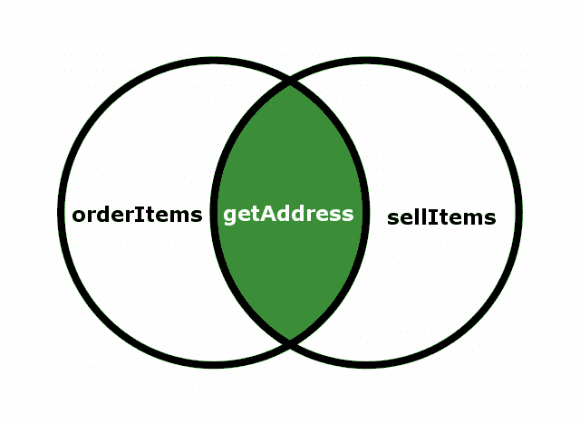
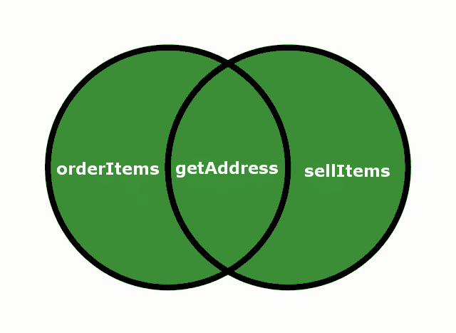
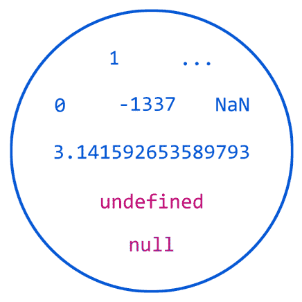
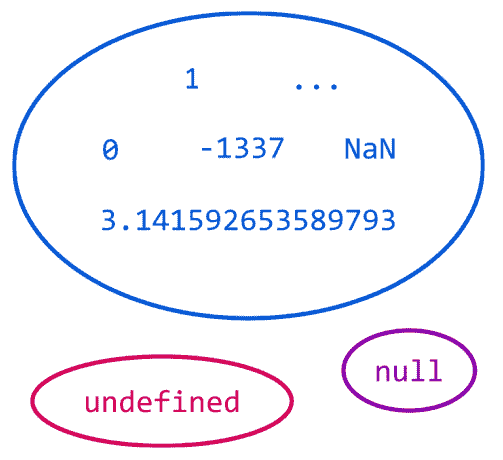

# 第二章：与类型一起工作

在上一章中，我们学习了 TypeScript 类型系统的一些基本概念，包括类型推断系统的基础知识和可选的静态类型注解。

在本章中，你将学习 TypeScript 类型系统的主要功能，包括以下概念：

+   TypeScript 和 JavaScript 之间的界限

+   类型系统的功能

+   联合类型、交叉类型和区分联合

+   类型别名和局部类型

+   `typeof` 和 `keyof` 操作符

+   控制流分析和类型守卫

+   非空类型

+   泛型类型

+   映射类型、查找类型和条件类型

# TypeScript 类型系统的特点

在本节中，我们将学习 TypeScript 类型系统的主要特点，包括类型推断、可选类型注解以及名义类型系统和结构类型系统之间的差异等概念。

# TypeScript 和 JavaScript 之间的界限

要成为一名优秀的 TypeScript 程序员，你需要掌握的最重要的事情之一是理解 TypeScript 和 JavaScript 之间的界限。了解我们的 TypeScript 代码在三个重要阶段发生的事情非常重要：

+   **设计时间**：这发生在我们编写 TypeScript 代码和设计应用程序时。

+   **编译时间**：这发生在我们将 TypeScript 编译成 JavaScript 代码时（可能会出现一些编译错误）。编译时间包含子阶段，例如解析 TypeScript 代码、创建抽象语法树（ATS）和生成 JavaScript 代码。

+   **执行时间**（也称为运行时）：这发生在我们执行 TypeScript 编译器生成的输出 JavaScript 代码时。

TypeScript 类型在设计时声明或推断，并在编译时使用，但它们在执行时不可用，因为它们不是 JavaScript 的一部分。

在本章中，我们将学习 TypeScript 类型系统的许多功能。如果你熟悉 JavaScript，你将立即注意到差异，但如果你不熟悉 JavaScript，我建议你在编译本章中包含的代码示例后检查生成的 JavaScript 输出。随着时间的推移，你将逐渐获得对 TypeScript 和 JavaScript 之间界限的清晰视野。

请参阅第六章，*理解运行时*，了解更多关于执行时间阶段（JavaScript）的信息。

# 类型推断

TypeScript 尝试使用所谓的 **类型推断** 来查找我们应用程序中变量和对象的数据类型。当我们声明一个变量时，TypeScript 将尝试观察分配给应用程序中变量的值以确定其类型。让我们看看一些例子：

```js
let myVariable1 = 3;
```

变量 `myVariable1` 的类型被推断为数字。

```js
let myVariable2 = "Hello";
```

变量 `myVariable2` 的类型被推断为字符串。

```js
let myVariable3 = {
  name: "Remo",
  surname: "Jansen",
  age: 29
};
```

变量 `myVariable3` 的类型被推断为以下类型：

```js
{ name: string; surname: string; age: number; }
```

当 TypeScript 无法识别变量类型时，会分配 `any` 类型。例如，给定以下函数：

```js
function add(a, b) {
  return a + b;
}
```

函数 `add` 的类型被推断为以下类型：

```js
(a: any, b: any) => any;
```

类型 `any` 是一个问题，因为它阻止 TypeScript 编译器识别许多潜在的错误。幸运的是，TypeScript 具有可选的类型注释功能，可以用来解决这个问题。

# 可选静态类型注释

TypeScript 允许我们使用类型注释来克服类型推断系统不足以自动检测变量类型的情况。

让我们再次考虑 `add` 函数：

```js
function add(a, b) {
  return a + b;
}
```

函数 `add` 的类型被推断为以下类型：

```js
(a: any, b: any) => any;
```

前面的类型是一个问题，因为 `any` 类型的使用实际上阻止了 TypeScript 编译器检测某些错误。例如，我们可能期望 `add` 函数添加两个数字：

```js
let result1 = add(2, 3); // 5
```

然而，如果我们传递一个字符串作为输入，我们将遇到一个意外的结果：

```js
let result2 = add("2", 3); // "23"
```

如果，例如，提供给 `add` 函数的参数是从 HTML 输入中提取的，而我们忘记将它们解析为数字，那么前面的错误可能会非常容易发生。

我们可以通过添加可选的类型注释来修复 `add` 函数：

```js
function add(a: number, b: number): number {
  return a + b;
}
```

我们可以在变量声明后添加一个冒号（`:`）来添加一个可选的类型注释：

```js
let myVariable: string = "Hello";
```

在函数的情况下，我们可以为函数的参数及其返回值添加注释。

现在，由于 `add` 函数的参数类型是 `number` 而不是 `any`，TypeScript 编译器将能够检测如果我们提供 `worn` 类型的参数时可能出现的潜在问题：

```js
let result1 = add(2, 3); // OK
let result2 = add("2", 3); // Error
```

通常，我们应该尝试利用类型推断系统，并且只在类型推断系统不足以自动检测变量类型时才使用可选的静态类型注释。

# 结构化类型系统

在编程语言的类型系统中，类型是一个具有名称和结构的对象。一些类型具有非常简单的数据结构（例如原始类型），而其他类型则使用复杂结构（例如类）。

类型系统可以使用两种不同的策略来验证给定的值是否与期望的类型匹配：

+   **名义类型系统**：在这个类型系统中，值是通过其名称与其类型匹配的

+   **结构化类型系统**：在这个类型系统中，值是通过其结构与其类型匹配的

TypeScript 类型系统是一个结构化类型系统，因为值是通过其结构与其类型匹配的，如下代码片段所示：

```js
interface Person {
  name: string; 
  surname: string; 
} 

function getFullName(person: Person) { 
  return `${person.name} ${person.surname}`; 
} 

class Employer { 
  constructor( 
    public name: string, 
    public surname: string 
  ) {} 
} 

getFullName(new Employer("remo", "jansen")); // OK 

const p1 = { name: "remo", surname: "jansen" }; 
getFullName(p1); // OK 

const p2 = { name: "remo", familyName: "jansen" }; 
getFullName(p2); // Error
```

在前面的代码片段中，我们可以观察到前两次调用 `getFullName` 函数是成功的，因为 `Employer` 实例和对象字面量的结构（属性和类型）与 `Person` 接口的结构相匹配。

以下代码片段展示了如果 TypeScript 使用命名类型系统，它将如何工作：

```js
interface Person {
  name: string;
  surname: string;
}

function getFullName(person: Person) {
  return `${person.name} ${person.surname}`;
}

class Employer implements Person { // Named!
  constructor(
    public name: string,
    public surname: string
  ) {}
}

getFullName(new Employer("remo", "jansen")); // OK

const p1: Person = { name: "remo", surname: "jansen" }; // Named!
getFullName(p1); // OK

const p2: Person = { name: "remo", familyName: "jansen" }; // Error
getFullName(p2); // OK
```

第一次调用 `getFullName` 是有效的，因为 `Employer` 类实现了 `Person` 接口，然后接口的类型名称可以与函数参数的类型名称相匹配。

TypeScript 团队目前正在调查可能添加对命名类型系统支持的可能性。您可以在 [`github.com/Microsoft/TypeScript/issues/202`](https://github.com/Microsoft/TypeScript/issues/202)*.* 了解更多关于进展情况。

# TypeScript 类型系统的核心功能

在本节中，我们将学习 TypeScript 类型系统的核心功能。这包括联合类型、交集守卫、类型守卫和类型别名等概念。

# 联合类型

TypeScript 允许你声明联合类型：

```js
let path: string[]|string;
path = "/temp/log.xml";
path = ["/temp/log.xml", "/temp/errors.xml"];
path = 1; // Error
```

在前面的示例中，我们声明了一个名为 `path` 的变量，它可以包含单个路径（字符串）或路径集合（字符串数组）。在示例中，我们还设置了变量的值。我们分配了一个字符串和一个字符串数组而没有错误；然而，当我们尝试分配一个数值时，我们得到了编译错误，因为联合类型没有将数字声明为变量的有效类型之一。

联合类型用于声明一个可以存储两种或更多类型值的变量。只有存在于交集类型中的所有类型中可用的属性才被认为是有效的：



我们可以在以下示例中欣赏这种行为：

```js
interface Supplier {

    orderItems(): void; 
    getAddress(): void; 
} 

interface Customer { 
    sellItems(): void; 
    getAddress(): void; 
} 

declare let person: Supplier | Customer; 
person.getAddress(); // OK 
person.orderItems(); // Error 
person.sellItems();  // Error
```

# 类型别名

TypeScript 允许我们使用 `type` 关键字声明类型别名：

```js
type PrimitiveArray = Array<string|number|boolean>; 
type MyNumber = number;  
type Callback = () => void
```

类型别名与其原始类型完全相同；它们只是替代名称。类型别名可以帮助我们使代码更易于阅读，但也可能导致一些问题。

如果你作为大型团队的一部分工作，无差别地创建别名可能会导致可维护性问题。尼古拉斯·C·扎卡斯（Nicholas C. Zakas）的书籍《可维护的 JavaScript》建议你应 *"避免修改你不拥有的对象"*. 尼古拉斯在谈论添加、删除或覆盖你未声明的对象（DOM 对象、BOM 对象、原始类型和第三方库）中的方法，但我们可以将此规则也应用于别名使用。

# 交集类型

当安德斯·海尔斯伯格（Anders Hejlsberg）首次将交集类型添加到 TypeScript 中时，他这样定义它们：

"交集类型是联合类型的逻辑补集。联合类型 A | B 表示一个实体具有类型 A 或类型 B，而交集类型 A & B 表示一个实体同时具有类型 A 和类型 B。"

以下示例声明了三个接口名为 `A`、`B` 和 `C`。然后它声明了一个名为 `abc` 的对象，其类型是接口 `A`、`B` 和 `C` 的交集类型。因此，`abc` 对象具有名为 `a`、`b` 和 `c` 的属性，但没有 `d`：

```js
interface A { a: string } 
interface B { b: string } 
interface C { c: string } 
declare let abc: A & B & C; 
abc.a = "hello"; // OK 
abc.b = "hello"; // OK 
abc.c = "hello"; // OK 
abc.d = "hello"; // Error 

```

交集类型也可以应用于子属性：

```js
interface X { x: A }
interface Y { x: B }
interface Z { x: C }
declare let xyz: X & Y & Z;
xyz.x.a = "hello"; // OK
xyz.x.b = "hello"; // OK
xyz.x.c = "hello"; // OK
xyz.x.d = "hello"; // Error

```

它们也可以应用于函数：

```js
type F1 = (x: string) => string;
type F2 = (x: number) => number;
declare let f: F1 & F2;
let s = f("hello"); // OK
let n = f(42); // OK
let t = f(true); // Error
```

在交集类型中存在的一个或所有类型中的属性被认为是有效的：



我们可以在以下示例中欣赏这种行为：

```js
interface Supplier {
    orderItems(): void;
    getAddress(): void;
}

interface Customer {
    sellItems(): void;
    getAddress(): void;
}

declare let person: Supplier & Customer;
person.getAddress(); // OK
person.orderItems(); // OK
person.sellItems();  // OK
```

# 非空类型

TypeScript 2.0 引入了所谓的非空类型。TypeScript 以前将 `null` 和 `undefined` 视为每种类型的有效值。

以下图表表示当禁用非空类型时可以分配给数字类型的值：



如前图所示，`undefined` 和 `null` 被允许作为数字类型的值，包括 `NaN` 值和所有可能的数字。

NaN，代表“不是一个数字”，是一种数值数据类型值，表示未定义或无法表示的值，尤其是在浮点数计算中。1985 年，IEEE 754 浮点标准引入了 NaN 的系统使用，以及表示其他非有限数量（如无穷大）的表示。

以下代码片段演示了当禁用非空类型时，`undefined` 和 `null` 被允许作为数字类型的值：

```js
let name: string;
name = "Remo"; // OK
name = null; // OK
name = undefined; // OK
```

同样适用于所有其他类型：

```js
let age: number;
age = 28; // OK
age = null; // OK
age = undefined; // OK

let person: { name: string, age: number};
person = { name: "Remo", age: 28 }; // OK
person = { name: null, age: null }; // OK
person = { name: undefined, age: undefined }; // OK
person = null;       // OK
person = undefined;  // OK
```

当启用非空类型时，值 `null` 和 `undefined` 被视为独立类型，并停止被视为数字类型的有效值：



以下代码片段演示了当启用非空类型时，`undefined` 和 `null` 不被允许作为数字类型的值：

```js
let name: string;
name = "Remo"; // OK
name = null; // Error
name = undefined; // Error
```

同样适用于所有其他类型：

```js
let age: number;
age = 28; // OK
age = null; // Error
age = undefined; // Error

let person: { name: string, age: number};
person = { name: "Remo", age: 28 }; // OK
person = { name: null, age: null }; // Error
person = { name: undefined, age: undefined }; // Error
person = null; // Error
person = undefined; // Error
```

我们可以通过使用 `**--**strictNullChecks` 编译标志来启用非空类型：

```js
tsc -strictNullChecks file.ts
```

当启用非空类型时，我们可以使用联合类型来创建类型的可空版本：

```js
type NullableNumber = number | null;
```

# --严格模式

TypeScript 允许我们使用 `--strict` 编译标志来启用所有严格类型检查选项。启用 `--strict` 启用 `--noImplicitAny`、`--noImplicitThis`、`--alwaysStrict`、`--strictPropertyInitialization` 和 `--strictNullChecks`：

+   `--strictNullChecks` 编译标志启用了非空类型。

+   `--noImplicitAny` 标志强制我们在类型推断系统无法自动推断正确类型时显式声明变量的类型。

+   `--alwaysStrict` 标志强制 TypeScript 解析器使用严格模式。

+   `--noImplicitThis` 标志强制我们在类型推断系统无法自动推断正确类型时，在函数中显式声明 `this` 操作符的类型。

+   `--strictPropertyInitialization` 标志强制类属性必须初始化。

我们将在第六章 理解运行时，*理解运行时* 中了解更多关于 JavaScript 严格模式和 `this` 操作符的内容。

使用 `--strict` 编译标志会使 TypeScript 编译器更加严格。在现有的大型 TypeScript 项目中启用此选项可能会导致发现许多可能需要大量努力修复的错误。因此，建议在绿色场 TypeScript 项目中启用 `--strict` 编译标志，并在现有的 TypeScript 项目中逐步启用单个标志（`--noImplicitAny`、`--noImplicitThis`、`--alwaysStrict` 和 `--strictNullChecks`）。

`--noImplicitReturns` 编译标志不是由 `--strict` 标志启用的标志之一。当函数中不是所有代码路径都返回值时，该标志会抛出错误。也建议在绿色场 TypeScript 项目中启用此标志或在可能的情况下在现有项目中启用。

# `typeof` 操作符

`typeof` 操作符可以在运行时（JavaScript）使用：

```js
let myNumber = 5;
console.log(typeof myNumber === "number");
```

重要的是要注意，它也可以在设计时（TypeScript）使用：

```js
let myNumber = 5;
type NumberType = typeof myNumber;
```

# 类型守卫

我们可以通过使用 `typeof` 或 `instanceof` 操作符在运行时检查表达式的类型。TypeScript 语言服务会查找这些操作符，并在 `if` 块中使用时相应地缩小推断类型：

```js
let x: any = { /* ... */ };
if(typeof x === 'string') {
console.log(x.splice(3, 1)); // Error, 'splice' does not exist
  on 'string'
}
// x is still any
x.foo(); // OK
```

在前面的代码片段中，我们声明了一个名为 `x` 的 `any` 类型变量。稍后，我们通过使用 `typeof` 操作符在运行时检查 `x` 的类型。如果 `x` 的类型结果是字符串，我们将尝试调用 `splice` 方法，该方法应该是 `x` 变量的一个成员。TypeScript 语言服务可以理解在条件语句中使用 `typeof` 的用法。TypeScript 会自动假设 `x` 必须是字符串，并通知我们 `splice` 方法在字符串类型上不存在。这个特性被称为 **类型守卫**。

# 自定义类型守卫

我们可以通过声明一个具有特殊返回类型的函数来定义自定义类型守卫：

```js
interface Supplier {
    orderItems(): void;
    getAddress(): void;
}

interface Customer {
    sellItems(): void;
    getAddress(): void;
}

function isSupplier(person: Supplier | Customer): person is Supplier {
    return (<Supplier> person).orderItems !== undefined;
}

function handleItems(person: Supplier | Customer) {
    if (isSupplier(person)) {
        person.orderItems(); // OK
    } else {
        person.sellItems(); // OK
    }
}
```

前面的代码片段声明了两种类型（`Supplier` 和 `Customer`）；然后声明了一个自定义类型守卫函数。自定义类型守卫返回一个布尔值。当提供的值 `person` 有名为 `orderItems` 的属性时，函数返回 true，当属性缺失时返回 false。

函数通过检查值的属性来尝试在运行时识别类型。这种类型匹配称为 **模式匹配**。

我们将在第七章 使用 TypeScript 的函数式编程 中了解更多关于模式匹配的内容。

模式匹配不是我们用来识别值是否匹配类型的唯一技术。我们还可以使用 `instanceof` 运算符：

```js
class Supplier {
    public orderItems(): void {
        // do something...
    }
    public getAddress(): void {
        // do something...
    }
}

class Customer {
    public sellItems(): void {
        // do something...
    }
    public getAddress(): void {
        // do something...
    }
}

function isSupplier(person: Supplier | Customer): person is Supplier {
    return person instanceof Supplier;
}

function handleItems(person: Supplier | Customer) {
    if (isSupplier(person)) {
        person.orderItems(); // OK
    } else {
        person.sellItems(); // OK
    }
}
```

我们可以使用 `typeof` 运算符作为识别值是否匹配类型的另一种技术：

```js
function doSomething(x: number | string) {
    if (typeof x === 'string') {
        console.log(x.subtr(1)); // Error
        console.log(x.substr(1)); // OK
    }
    x.substr(1); // Error
}
```

前面的代码片段在 `if` 块内抛出编译错误，因为 TypeScript 知道变量 `x` 在该块内必须是字符串。在 `if` 块外部也会抛出另一个错误，因为 TypeScript 无法保证在那个点变量 `x` 的类型是字符串。

自 TypeScript 2.7 版本以来，我们可以使用 `in` 运算符作为类型守卫来缩小给定类型，如下面的示例所示：

```js
interface Cat {
    meow(): void;
}

interface Dog {
    woof(): void;
}

function doSomething(obj: Cat | Dog) {
    if ("meow" in obj) {
        obj.meow(); // OK
    } else {
        obj.woof(); // OK
    }
}
```

# 控制流分析

TypeScript 包含一个称为控制流分析的功能，用于根据程序的执行流程识别变量的类型。此功能使 TypeScript 具有更精确的类型推断能力。

以下示例定义了一个函数，它接受两个参数，其中一个参数（命名为 value）的类型是数字和数字数组的联合类型：

```js
function increment(
  incrementBy: number, value: number | number[]
) {
  if (Array.isArray(value)) {
    // value must be an array of number
    return value.map(value => value + incrementBy);
  } else {
    // value is a number
    return value + incrementBy;
  }
}

increment(2, 2); // 4
increment(2, [2, 4, 6]); // [4, 6, 8]
```

在函数体内部，我们使用 `if` 语句来确定值变量确实是一个数字数组还是仅仅是一个数字。类型推断系统将根据 `if...else` 语句的两个路径相应地更改参数的推断类型。

控制流分析提高了类型检查器对变量赋值和控制流语句的理解，从而大大减少了类型守卫的需求。

# 文字类型

文字类型允许我们声明一个字符串、布尔值或数字必须具有的确切值。当我们使用 `let` 关键字声明一个变量时，其值将被推断为原始类型：

```js
let five = 5; // number
let falsy = false; // boolean
let shape = "rectangle"; // string
```

然而，如果我们使用 `const` 关键字，类型将被推断为实际分配的值：

```js
const five = 5; // 5
const falsy = false; // false
const shape = "rectangle"; // rectangle
```

文字类型可以轻松与联合类型、类型守卫和类型别名结合使用：

```js
type ShapeKind = "square" | "rectangle" | "circle";
```

文字类型可以与类型守卫和控制流分析的力量结合使用，通过称为区分联合的技术来缩小联合类型。

# 区分联合

区分联合（也称为标签联合或代数数据类型）是一种高级模式，它结合了字符串文字类型、联合类型、类型守卫和类型别名。

区分联合使用类型守卫根据判别属性（一个字符串文字类型）的测试来缩小联合类型，并且进一步扩展了该功能到 `switch` 语句。

以下代码片段声明了三个共享名为 `kind` 的字符串文字属性的类型：

```js
interface Cube {
    kind: "cube";
    size: number;
}

interface Pyramid {
    kind: "pyramid";
    width: number;
    length: number;
    height: number;
}

interface Sphere {
    kind: "sphere";
    radius: number;
}
```

然后，我们声明前面代码片段中声明的三种类型的联合类型：

```js
type Shape = Cube | Pyramid | Sphere;

function volume(shape: Shape) {
    const PI = Math.PI;
    switch (shape.kind) {
        case "cube":
            return shape.size ** 3;
        case "pyramid":
            return (shape.width * shape.height * shape.length) / 3;
        case "sphere":
            return (4 / 3) * PI * (shape.radius ** 3);
    }
}
```

在前面的函数中，`switch` 语句充当类型守卫。根据判别属性 `kind` 的值，每个情况子句都会缩小 `shape` 的类型，从而允许访问该变体的其他属性，而无需类型断言。

# never 类型

如 TypeScript 文档所述，`never`类型具有以下特性：

+   `never`类型是每个类型的子类型并可赋值给每个类型。

+   没有任何类型是`never`的子类型或可赋值给`never`（除了`never`本身）。

+   在没有返回类型注解的函数表达式或箭头函数中，如果函数没有`return`语句或只有类型为`never`的`return`语句，并且如果函数的终点不可达（由控制流分析确定），则函数的推断返回类型为`never`。

+   在具有显式 never 返回类型注解的函数中，所有`return`语句（如果有）必须具有类型为`never`的表达式，并且函数的末尾必须不可达。

在 JavaScript 中，当一个函数没有显式返回值时，它隐式返回值`undefined`。在 TypeScript 中，此类函数的返回类型被推断为`void`。当一个函数没有完成其执行（它抛出错误或根本未完成运行），TypeScript 将其返回类型推断为`never`：

```js
function error(message: string): never {
    throw new Error(message);
}

// Type () => never
const sing = function() {
    while (true) {
        console.log("I will never return!");
    }
};
```

我们还可能在区分联合中的不可能匹配时遇到`never`类型：

```js
function area(shape: Shape) {
    const PI = Math.PI;
    switch (shape.kind) {
        case "square": return shape.size * shape.size;
        case "rectangle": return shape.width * shape.height;
        case "circle": return PI * shape.radius * shape.radius;
        default:
            return shape; // never
    }
}
```

在前面的代码片段中，默认情况永远不会被执行；因此，返回类型被推断为`never`类型。

# 枚举

枚举允许我们定义一组命名的常量。自 TypeScript 2.4 版本发布以来，这些命名常量值可以是字符串值。最初，它们只能是数值：

```js
enum CardinalDirection {
    Up,
    Down,
    Left,
    Right
}
```

解决这种限制的一个常见方法是使用字面量类型的联合类型：

```js
type CardinalDirection =
    "North"
    | "East"
    | "South"
    | "West";

function move(distance: number, direction: CardinalDirection) {
    // ...
}

move(1,"North"); // Okay
move(1,"Nurth"); // Error!
```

自 TypeScript 2.4 版本发布以来，也支持具有字符串值的枚举：

```js
enum CardinalDirection {
    Red = "North",
    Green = "East",
    Blue = "South",
    West = "West"
}
```

# 对象字面量

对象可以使用`new Object()`、`Object.create()`或使用对象字面量表示法（也称为初始化表示法）进行初始化。对象初始化器是一个逗号分隔的列表，包含零个或多个属性名和值的对，用花括号括起来：

```js
let person = { name: "Remo", age: 28 };
```

类型推断系统可以自动推断对象字面量的类型。在前面代码片段中声明的变量`person`的类型推断为`{ name: string, age: number }`。或者，我们也可以显式声明对象字面量的类型：

```js
interface User {
    name: string;
    age: number;
}

let person: User = { name: "Remo", age: 28 }; // OK
```

还可以声明可选属性：

```js
interface User {
    name: string;
    age?: number;
}

let person1: User = { name: "Remo", age: 28 }; // OK
let person2: User = { name: "Remo" }; // OK
```

请参阅第一章*，介绍 TypeScript*，以了解更多关于空对象类型（`{}`）、对象（大写）类型和对象（小写）类型之间的区别。

# 弱类型

弱类型是一个对象字面量类型，其中所有属性都是可选的：

```js
interface User {
    name?: string;
    age?: number;
}
```

TypeScript 允许我们向弱类型添加一些或所有已定义的属性值，但它不允许我们分配不属于弱类型的属性：

```js
let user1: User  = { name: "Remo", age: 28 }; // OK
let user2: User = { firstName: "Remo", yearBorn: 28 }; // Error
```

# `keyof`运算符

`keyof`运算符可以用来生成对象属性的联合类型，作为字符串字面量类型：

```js
interface User {
    name: string;
    age: number;
}

type userKeys = keyof User; // "name" | "age"
```

`keyof` 操作符可以与其它操作符结合使用，例如 `typeof` 操作符，例如：

```js
let person = { name: "Remo", age: "28" };

interface User {
    name: string;
    age: number;
}

type userKeys = keyof typeof person; // "name" | "age"
```

我们将在本章后面学习查找类型时，了解更多关于 `keyof` 操作符的信息。

# 索引签名

在 JavaScript 中，我们可以使用对象名称后跟点号和属性名称来访问对象的属性：

```js
let foo: any = {};
foo.hello = 'World';
console.log(foo.hello); // World
```

然而，也可以使用对象名称后跟属性名称作为字符串，用方括号括起来来访问对象的属性：

```js
let foo: any = {};
foo['hello'] = 'World';
console.log(foo['hello']); // World
```

这种行为可以使用所谓的索引签名来声明：

```js
interface StringArray {
    [index: number]: string;
}

let myArray: StringArray = ["Bob", "Fred"];
let myStr: string = myArray[0];
```

如前述代码片段所示，索引签名允许我们指定使用方括号签名访问属性时返回的值的类型。

# 本地类型

TypeScript 类型系统允许我们在函数和方法的声明中声明类型（如类型别名、类和接口）。在 TypeScript 的早期版本中，这是不允许的：

```js
interface Person {
    name: string;
    age: number;
}

function makePerson(name: string, age: number): Person {

    // Local type
    class Person implements Person {
        constructor(
            public name: string,
            public age: number
        ) {}
    }

    return new Person(name, age);

}

let user = makePerson("Remo", 28);
```

# 类型转换

TypeScript 类型系统允许我们使用两种不同的语法来转换给定的类型：

```js
var myObject: TypeA;
var otherObject: any;
myObject = <TypeA> otherObject; // Using <>
myObject = otherObject as TypeA; // Using as keyword
```

重要的是要理解 TypeScript 类型转换不会影响变量的运行时类型。

自 TypeScript 1.6 以来，默认为 `as`，因为在 `.tsx` 文件中 `<>` 是模糊的。我们将在第十一章 前端开发与 React 和 TypeScript* 中了解更多关于 `.tsx` 文件的信息*。

通常建议避免使用类型转换，而优先使用泛型类型。

# TypeScript 类型系统的先进特性

在本节中，我们将学习一些高级类型系统特性，例如泛型类型、映射类型和查找类型。

# 泛型类型

泛型类型可以帮助我们避免使用类型转换，并通过允许我们在函数、类或方法被消费时（而不是在声明时）声明（T），来增加代码的可重用性：

```js
function deserialize<T>(json: string): T {
    return JSON.parse(json) as T;
}

interface User {
    name: string;
    age: number;
}

let user = deserialize<User>(`{"name":"Remo","age":28}`);

interface Rectangle {
    width: number;
    height: number;
}

let rectangle = deserialize<Rectangle>(`{"width":5,"height":8}`);
```

上述示例声明了一个名为 deserialize 的函数。该函数返回的类型 (T) 在函数声明点上是未知的。然后函数被调用了两次，类型 T 最终被确定（User 和 Rectangle）。

我们将在第四章 使用 TypeScript 的面向对象编程* 中了解更多关于泛型类型的信息*。

# 泛型约束

有时，我们不需要函数、类或方法所需的实际类型，但我们知道这种类型必须遵循一组特定的规则。

例如，以下代码片段声明了一个名为 `isEquals` 的泛型函数。然而，这次类型 `T` 有一个约束（`T` extends `Comparable`）：

```js
interface Comparable<T> {
    equals(value: T): boolean;
}

function isEqual<TVal, T extends Comparable<TVal>>(comparable: T, value: TVal) {
    return comparable.equals(value);
}
```

该约束用于确保提供给 `isEqual` 作为其泛型类型参数的所有类型都实现了 `Comparable` 接口：

```js
interface RectangleInterface {
    width: number;
    height: number;
}

type ComparableRectangle = RectangleInterface & Comparable<RectangleInterface>;

class Rectangle implements ComparableRectangle {
    public width: number;
    public height: number;
    public constructor(width: number, height: number) {
        this.width = width;
        this.height = height;
    }
    public equals(value: Rectangle) {
        return value.width === this.width && value.height === this.height;
    }
};

interface CircleInterface {
    radious: number;
}

type ComparableCircle = CircleInterface & Comparable<CircleInterface>;

class Circle implements ComparableCircle {
    public radious: number;
    public constructor(radious: number) {
        this.radious = radious
    }
    public equals(value: CircleInterface): boolean {
        return value.radious === this.radious;
    }
}

const circle = new Circle(5);
const rectangle = new Rectangle(5, 8);

isEqual<RectangleInterface, ComparableRectangle>(rectangle, { width: 5, height: 8 });
isEqual<CircleInterface, ComparableCircle>(circle, { radius: 5 });
```

# 映射类型

映射类型是一种高级类型特性，允许我们将类型的每个属性的值映射到不同的类型。例如，以下映射类型将给定类型的属性值转换为与属性名称匹配的字符串字面量：

```js
type Keyify<T> = {
    [P in keyof T]: P;
};
```

以下函数接受一个对象，并返回一个新的对象，其中所有属性具有相同的名称，但它们的值是属性的名称：

```js
function getKeys<T>(obj: T): Keyify<T> {
    const keysArr = Object.keys(obj);
    const stringifyObj = keysArr.reduce((p, c, i, a) => {
        return {
            ...p,
            [c]: c
        };
    }, {});
    return stringifyObj as Keyify<T>;
}

interface User {
    name: string;
    age: number;
}

let user: User = { name: "Remo", age: 28 };
let keys = getKeys<User>(user);

keys.name; // "name"
keys.age; // "age"

TypeScript declares some commonly used mapped types for us:
// Make all properties in T optional
type Partial<T> = {
    [P in keyof T]?: T[P];
};

// Make all properties in T readonly
type Readonly<T> = {
    readonly [P in keyof T]: T[P];
};

// From T pick a set of properties K
type Pick<T, K extends keyof T> = {
    [P in K]: T[P];
}

// Construct a type with a set of properties K of type T
type Record<K extends string, T> = {
    [P in K]: T;
}
```

# 查找类型

查找类型是另一种高级类型系统特性，它允许我们将 `keyof` 运算符与泛型和对象字面量结合使用，以创建高级类型注解。让我们看一个例子：

```js
function filterByProperty<T, K extends keyof T>(
    property: K, entities: T[], value: T[K]
) {
    return entities.filter(e => e[property] === value);
}
```

之前的功能接受两个泛型类型参数：

+   `T` 是函数第一个参数传递的数组中项的类型。

+   `K` 是 `T` 的属性名称。此要求通过泛型约束（extends `keyof T`）强制执行。

函数还期望两个参数：

+   类型为 `T` 的实体数组。

+   类型 `T[K]` 的值。类型 `T[K]` 表示类型 `T` 中属性 `K` 的值，它被称为查找类型。

之前的功能可以用来通过类型 `T` 的一个属性来过滤类型为 `T` 的实体数组：

```js
interface User {
    surname: string;
    age: number;
}

const users = [
    { surname: "Smith", age: 28 },
    { surname: "Johnson", age: 55 },
    { surname: "Williams", age: 14 }
];

filterByProperty<User, "age">("age", users, 21);
filterByProperty<User, "surname">("surname", users, "Smith");
```

# 映射类型修饰符

TypeScript 2.8 引入了一些运算符，允许我们对映射类型的定义有更高的控制级别：

+   我们可以使用 `readonly` 修饰符将属性标记为不可变。

+   我们可以使用 `?` 运算符将属性标记为可选。

+   我们可以使用 `+` 运算符将修饰符，如 `readonly` 修饰符，应用于类型中的属性。我们还可以使用 `+` 运算符与 `?` 运算符一起使用。

+   我们可以使用 `-` 运算符应用修饰符，例如将 `readonly` 修饰符应用于类型中的属性。我们还可以使用 `+` 运算符与 `?` 运算符一起使用。

我们现在将检查几个例子。代码片段声明了一个映射类型，该类型可用于将类型 `T` 转换为一个新的类型，该类型包含 `T` 中的所有属性，但被标记为既是 `readonly` 也是 `optional`：

```js
type ReadonlyAndPartial1<T> = {
    readonly [P in keyof T]?: T[P]
}
```

以下类型声明与前面代码片段中的类型声明相同：

```js
type ReadonlyAndPartial2<T> = {
    +readonly [P in keyof T]+?: T[P];
}
```

以下类型可用于从给定类型 `T` 的所有属性中删除 `readonly` 修饰符：

```js
type Mutable<T> = {
    -readonly [P in keyof T]: T[P]
}
```

我们可以将 `Mutable` 类型应用于以下接口以生成一个新的类型。`abc` 属性不再不可变，但 `def` 属性仍然是可选的：

```js
interface Foo {
    readonly abc: number;
    def?: string;
}

type TotallyMutableFoo = Mutable<Foo>
```

最后，以下代码片段声明了一个映射类型，该类型可用于从给定的类型 `T` 中删除可选属性：

```js
type Required<T> = {
    [P in keyof T]-?: T[P];
}
```

# 条件类型

条件映射类型是 TypeScript 2.8 中引入的高级特性。在本章的前面部分，我们了解到我们可以使用`extends`关键字来声明泛型约束。当我们声明一个泛型约束时，我们实际上是在使用`extends`关键字作为一种运算符，它允许我们检查一个泛型类型（`T`）是否是给定类型的子类型。例如，以下代码片段声明了两个名为`Animal`和`Dog`的接口：

```js
interface Animal {
    live(): void;
}
interface Dog extends Animal {
    woof(): void;
}
```

然后我们使用`extends`关键字作为条件运算符来生成一个新的类型：

```js
type Foo1 = Dog extends Animal ? number : string; // number
type Bar1 = RegExp extends Dog ? number : string; // string
```

条件类型可以用来声明一些复杂类型。例如，`Flatten`函数是一个将多维数组（`[][]`）转换为一维数组（`[]`）的函数。`Flatten`函数的返回类型是一个条件类型，因为它在提供多维数组时返回一个数组，在提供一维数组时返回一个数字：

```js
type Flatten<T> = T extends any[] ? T[number] : T;

type arr1 = number[];
type flattenArr1 = Flatten<arr1>; // number

type arr2 = number[][];
type flattenArr2 = Flatten<arr2>; // number[]
```

# `infer`关键字

在前面的部分中，我们已经定义了`Flatten`类型。然而，这种行为是硬编码的，当提供一个一维数组时返回一个数字。这意味着`flatten`类型仅在数字数组上按预期工作。幸运的是，自从 TypeScript 2.8 发布以来，我们可以使用`infer`关键字来克服这一限制：

```js
type TypedFlatten<T> = T extends Array<infer U> ? U : T;
```

`infer`关键字可以在其他场景中使用。例如，我们可以用它来推断函数的返回类型：

```js
type ReturnType<T extends (...args: any[]) => any> = T extends (...args: any[]) => infer R ? R : any;

type func1 = () => number;
type returnOfFunc1 = ReturnType<func1>; // number
```

# 内置条件类型

在前面的部分中，我们使用了`ReturnType`类型来提取给定函数的返回类型。`ReturnType`类型是一个内置类型。TypeScript 2.8 包括许多其他类型：

```js
// Exclude from T those types that are assignable to U
type Exclude<T, U> = T extends U ? never : T;

// Extract from T those types that are assignable to U
type Extract<T, U> = T extends U ? T : never;

// string[] | number[]
type Foo2 = Extract<boolean | string[] | number[], any[]>;

// boolean
type Bar2 = Exclude<boolean | string[] | number[], any[]>;

// Exclude null and undefined from T
type NonNullable<T> = T extends null | undefined ? never : T;

//  Obtain the return type of a function type
type ReturnType<T extends (...args: any[]) => any> = T extends (...args: any[]) => infer R ? R : any;

// Obtain the return type of a constructor function type
type InstanceType<T extends new (...args: any[]) => any> = T extends new (...args: any[]) => infer R ? R : any;
```

# 多态`this`类型

在 JavaScript 中，`this`操作符的值取决于函数或方法被调用的方式。在方法中，`this`操作符通常指向类实例。

多态`this`类型是原始`this`操作符类型推断的改进版本，Anders Hejlsberg 在文档中记录了以下行为：

+   在非静态类或接口成员的表达式中，`this`的类型是某个从包含类派生出来的类的实例，而不是简单地是包含类的实例。

+   在非静态类或接口成员的类型位置中，可以使用`this`关键字来引用`this`的类型。

+   当一个类或接口被引用为类型时，类（包括从基类继承的）中所有`this`类型的出现都被替换为该类型本身。

这个特性使得像流畅式接口（[`en.wikipedia.org/wiki/Fluent_interface`](https://en.wikipedia.org/wiki/Fluent_interface)）这样的模式更容易表达和实现，如下面的示例所示：

```js
interface Person {
    name?: string;
    surname?: string;
    age?: number;
}

class PersonBuilder<T extends Person> {
    protected _details: T;
    public constructor() {
        this._details = {} as T;
    }
    public currentValue(): T {
        return this._details;
    }
    public withName(name: string): this {
        this._details.name = name;
        return this;
    }
    public withSurname(surname: string): this {
        this._details.surname = surname;
        return this;
    }
    public withAge(age: number): this {
        this._details.age = age;
        return this;
    }
}
```

流畅式接口允许我们通过使用点连接多个方法来在一个对象上调用多个方法，而不必每次都写对象名称。

由于类方法返回 `this` 类型，我们可以调用多个方法而无需多次编写类名：

```js
let value1 = new PersonBuilder()
            .withName("name")
            .withSurname("surname")
            .withAge(28)
            .currentValue();
```

由于类使用了 `this` 类型，我们可以扩展它，然后新的类可以提供一个包含基方法在内的流畅接口：

```js
interface Employee extends Person {
    email: string;
    department: string;
}

class EmployeeBuilder extends PersonBuilder<Employee> {
    public withEmail(email: string) {
        this._details.email = email;
        return this;
    }
    public withDepartment(department: string) {
        this._details.department = department;
        return this;
    }
}

let value2 = new EmployeeBuilder()
    .withName("name")
    .withSurname("surname")
    .withAge(28)
    .withEmail("name.surname@company.com")
    .withDepartment("engineering")
    .currentValue();
```

在 第六章 *理解运行时* 中，我们将学习更多关于 `this` 操作符的知识。

# 环境声明

环境声明允许你在 TypeScript 代码中创建一个变量，该变量在编译时不会被转换为 JavaScript。这个特性是为了使与现有 JavaScript 代码以及 **文档对象模型** (**DOM**) 和 **浏览器对象模型** (**BOM**) 的集成更加容易。让我们看一个例子：

```js
customConsole.log("A log entry!");  // error
```

如果你尝试调用名为 `customConsole` 的对象的成员 `log`，TypeScript 将会告诉我们 `customConsole` 对象尚未声明：

```js
// Cannot find name 'customConsole'
```

这并不令人惊讶。然而，有时我们想要调用尚未定义的对象，例如 `console` 或 `window` 对象：

```js
console.log("Log Entry!");
const host = window.location.hostname;
```

当我们访问 DOM 或 BOM 对象时，不会出现错误，因为这些对象已经在名为 **声明文件** 的特殊 TypeScript 文件中声明过了。你可以使用 `declare` 操作符来创建一个环境声明。

在下面的代码片段中，我们将声明一个由 `customConsole` 对象实现的接口。然后我们使用 `declare` 操作符将 `customConsole` 对象添加到作用域中：

```js
interface ICustomConsole {
    log(arg: string) : void;
}
declare var customConsole : ICustomConsole;
```

接口在 第四章 *使用 TypeScript 进行面向对象编程* 中有更详细的解释。

然后，我们可以使用 `customConsole` 对象而不会出现编译错误：

```js
customConsole.log("A log entry!"); // ok
```

TypeScript 默认包含一个名为 `lib.d.ts` 的文件，它提供了内置 JavaScript 库以及 DOM 的接口声明。

声明文件使用文件扩展名 `.d.ts`，用于增加 TypeScript 与第三方库和运行时环境（如 Node.js 或浏览器）的兼容性。

我们将在 第五章 *与依赖项一起工作* 中学习如何使用声明文件。

# 类型声明 – .d.ts

有时，我们需要消费一个现有的 JavaScript 文件，但我们将无法将其迁移到 TypeScript。这种场景的一个常见例子是我们消费第三方 JavaScript 库。

如果库是开源的，我们可以通过将其迁移到 TypeScript 来为其做出贡献。然而，有时使用 TypeScript 可能与库作者的偏好不符，或者迁移可能需要大量的工作。TypeScript 通过允许我们创建特殊类型的文件来解决此问题，这些文件被称为类型声明或类型定义。

在上一章中，我们了解到 TypeScript 默认包含一个 `lib.d.ts` 文件，该文件提供了内置 JavaScript 对象的接口声明，以及 DOM 和 BOM API。

类型定义文件包含了第三方库的类型声明。这些文件促进了现有 JavaScript 库与 TypeScript 之间的集成。

为了在消费 JavaScript 库的同时充分利用 TypeScript 的所有功能，我们需要安装该库的类型定义文件。幸运的是，我们不需要手动创建类型定义文件，因为有一个名为 **DefinitelyTyped** 的开源项目已经包含了大量现有 JavaScript 库的类型定义文件。

在 TypeScript 开发的早期阶段，开发者必须手动从 DefinitelyTyped 项目网站下载和安装类型定义文件，但那些日子已经一去不复返了，如今我们可以使用节点包管理器（npm）来安装和管理我们 TypeScript 应用程序所需的类型定义文件。

我们将在第九章 Automating Your Development Workflow* 中学习如何使用声明文件，该章节将介绍自动化您的开发工作流程。

# 摘要

在本章中，我们学习了 TypeScript 类型系统的许多功能。到目前为止，我们应该已经对诸如类型推断、非空类型、结构化类型和流程控制分析等概念有了很好的理解。

在下一章中，我们将学习更多关于 TypeScript 中函数的使用。
