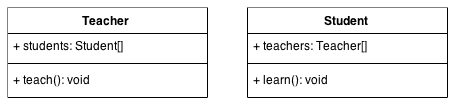
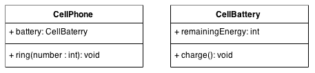
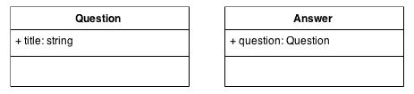
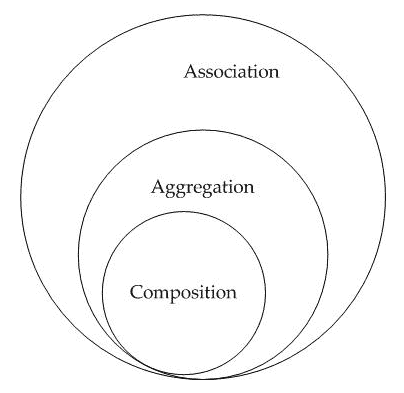
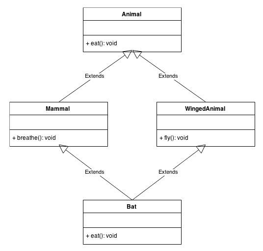
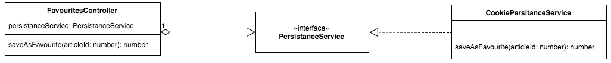
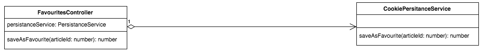

# 第四章：使用 TypeScript 进行面向对象编程

在上一章中，我们学习了如何使用函数以及如何利用一些异步编程 API。在本章中，我们将学习如何使用**面向对象编程**（**OOP**）范式实现 TypeScript 应用程序。我们将学习以下主题：

+   类

+   关联、聚合和组合

+   继承

+   混合

+   泛型类

+   泛型约束

+   接口

+   SOLID 原则

# 类

我们应该已经熟悉了 TypeScript 类的基础知识，因为我们已经在之前的章节中声明了一些。现在，我们将通过示例来查看一些细节和 OOP 概念。让我们从一个简单的类开始声明：

```js
class Person { 
    public name: string; 
    public surname: string; 
    public email: string; 
    public constructor( 
        name: string, surname: string, email: string 
    ) { 
        this.email = email; 
        this.name = name; 
        this.surname = surname; 
    } 
    public greet() { 
        console.log("Hi!"); 
    } 
} 
```

我们使用类来表示对象或实体的类型。一个**类**由一个名称、**属性**（也称为**属性**）和**方法**组成。方法和属性都称为**成员**。类属性用于描述对象的特征，而类方法用于描述其行为。

在前面的示例中，该类名为`Person`，包含三个属性或属性（`name`、`surname`和`email`）和两个方法（`constructor`和`greet`）。

**构造函数**是`new`关键字用来创建我们类**实例**（也称为**对象**）的特殊方法。我们声明了一个名为`me`的变量，它持有`Person`类的实例。`new`关键字使用`Person`类的构造函数来返回一个类型为`Person`的对象：

```js
const person = new Person( 
    "Remo", 
    "Jansen", 
    "remo.jansen@wolksoftware.com" 
); 
```

# 严格的属性初始化

自 TypeScript 2.7 版本发布以来，如果启用了严格模式并且我们忘记初始化类的一个属性，将会抛出一个编译时错误。例如，以下类使用方法初始化名为`height`的属性，使用构造函数初始化名为`width`的属性。TypeScript 知道如果创建类的实例，`width`属性将被分配一个值。然而，它没有方法来确保`height`属性被分配一个值。如果启用了严格模式，将会抛出一个错误：

```js
class Rectangle { 

    public width: number; 
    public height: number; // Error 

    public constructor(width: number) { 
        this.width = width; 
    } 

    public setHeight(height: number) { 
        this.height = height; 
    } 

} 
```

我们可以使用`!`运算符让 TypeScript 知道我们不想抛出错误：

```js
class Rectangle { 

    public width: number; 
    public height!: number; // OK 

    public constructor(width: number) { 
        this.width = width; 
    } 

    public setHeight(height: number) { 
        this.height = height; 
    } 

} 
```

当我们定义一个没有构造函数的类时，遇到这种编译错误是非常常见的：

```js
class Rectangle { 
    public width: number; // Error 
    public height: number; // Error 
} 
```

我们可以使用`!`运算符解决我们不希望定义构造函数时的编译时错误：

```js
class Rectangle { 
    public width!: number; // OK 
    public height!: number; // OK 
} 
```

或者，我们可以使用默认值初始化属性：

```js
class Rectangle6 { 
    public width: number = 0; // OK 
    public height: number = 0; // OK 
} 
```

# 继承

最基本的 OOP 特性之一是其扩展现有类的功能。这个特性被称为**继承**，它允许我们创建一个新的类（子类），该类从现有的类（父类）继承所有属性和方法。子类可以包含父类中不可用的额外属性和方法。

我们将使用在前一节中声明的`Person`类作为名为`Teacher`的子类的父类。我们可以通过使用保留关键字`extends`来扩展父类（`Person`）：

```js
class Teacher extends Person { 
    public teach() { 
        console.log("Welcome to class!"); 
    } 
} 
```

`Teacher`类将继承其父类的所有属性和方法。然而，我们还在`Teacher`类中添加了一个名为`teach`的新方法。

如果我们创建`Person`和`Teacher`类的实例，我们将能够看到这两个实例共享相同的属性和方法，除了`teach`方法，这个方法仅对`Teacher`类的实例可用：

```js
const person = new Person( 
    "Remo", 
    "Jansen", 
    "remo.jansen@wolksoftware.com" 
); 

const teacher = new Teacher( 
    "Remo", 
    "Jansen", 
    "remo.jansen@wolksoftware.com" 
); 

person.greet(); // "Hi!" 
teacher.greet(); // "Hi!" 
person.teach(); // Error 
teacher.teach(); // "Welcome to class!" 
```

# 继承树深度（DIT）

我们还可以声明一个新的类，它从已经从另一个类继承的类中继承。在以下代码片段中，我们声明了一个名为`SchoolPrincipal`的类，它`extends`了`Teacher`类，而`Teacher`类又继承自`Person`类：

```js
class SchoolPrincipal extends Teacher { 
    public manageTeachers() { 
        return console.log( 
            `We need to help our students!` 
        ); 
    } 
} 
```

如果我们创建`SchoolPrincipal`类的实例，我们将能够访问其父类（`SchoolPrincipal`、`Teacher`和`Person`）中的所有属性和方法：

```js
const principal = new SchoolPrincipal( 
    "Remo", 
    "Jansen", 
    "remo.jansen@wolksoftware.com" 
); 

principal.greet(); // "Hi!" 
principal.teach(); // "Welcome to class!" 
principal.manageTeachers(); // "We need to help our students!" 
```

不建议在继承树中拥有太多层级。位于继承树较深位置的类将相对复杂，难以开发、测试和维护。

不幸的是，当我们不确定是否应该增加**继承树深度**（**DIT**）时，我们没有一条具体的规则可以遵循。

我们应该以这种方式使用继承，以帮助我们减少应用程序的复杂性，而不是相反。我们应该尽量保持 DIT 在零到四之间，因为大于四的值将损害封装性并增加复杂性。

# 访问修饰符

TypeScript 允许我们使用`public`、`private`和`protected`关键字来限制对类属性和方法访问。

# 公共访问修饰符

如果我们使用`public`修饰符，方法或属性可以被其他对象访问。以下示例重新声明了我们在前一节中使用的`Person`和`Teacher`类。重要的是要注意，在类的所有属性中使用了`public`访问修饰符，但在这个例子中，我们将特别关注名为`email`的属性：

```js
class Person { 
    public name: string; 
    public surname: string; 
    public email: string; 
    public constructor( 
        name: string, surname: string, email: string 
    ) { 
        this.email = email; 
        this.name = name; 
        this.surname = surname; 
    } 
    public greet() { 
        console.log("Hi!"); 
    } 
} 

class Teacher extends Person { 
    public teach() { 
        console.log("Welcome to class!"); 
    } 
} 
```

如果我们创建`Person`和`Teacher`类的实例，我们将能够确认`email`属性可以被这两个实例以及像`console`对象这样的外部对象访问：

```js
const person = new Person( 
    "Remo", 
    "Jansen", 
    "remo.jansen@wolksoftware.com" 
); 

const teacher = new Teacher( 
    "Remo", 
    "Jansen", 
    "remo.jansen@wolksoftware.com" 
); 

console.log(person.email); // ""remo.jansen@wolksoftware.com" 
console.log(teacher.email); // ""remo.jansen@wolksoftware.com" 
```

# 私有访问修饰符

如果我们使用`private`修饰符，方法或属性只能由拥有它们的对象访问。

以下示例再次重新声明了我们在前一个示例中声明的类，但使用的是`private`访问修饰符而不是`public`修饰符。该示例还向类中添加了一些额外的方法，以展示使用`private`访问修饰符的影响：

```js
class Person { 
    public name: string; 
    public surname: string; 
    private _email: string; 
    public constructor( 
        name: string, surname: string, email: string 
    ) { 
        this._email = email; 
        this.name = name; 
        this.surname = surname; 
    } 
    public greet() { 
        console.log("Hi!"); 
    } 
    public getEmail() { 
        return this._email; 
    } 
} 

class Teacher extends Person { 
    public teach() { 
        console.log("Welcome to class!"); 
    } 
public shareEmail() { 
        console.log(`My email is ${this._email}`); // Error 
    } 
} 
```

如果我们创建`Person`和`Teacher`类的实例，我们将能够观察到属于`Person`实例的`getEmail`方法可以访问`private`属性。然而，`private`属性`email`不能从由派生类`Teacher`声明的名为`shareEmail`的方法中访问。此外，其他对象（如`console`对象）也不能访问`private`属性。此代码片段确认`email`属性只能由`Person`类的实例访问：

```js
const person = new Person( 
    "Remo", 
    "Jansen", 
    "remo.jansen@wolksoftware.com" 
); 

const teacher = new Teacher( 
    "Remo", 
    "Jansen", 
    "remo.jansen@wolksoftware.com" 
); 

console.log(person._email); // Error 
console.log(teacher._email); // Error 
teacher.getEmail();
```

我们可以将`Teacher`类更新为使用公共的`getEmail`方法，而不是直接尝试访问`private`属性：

```js
class Teacher extends Person { 
    public teach() { 
        console.log("Welcome to class!"); 
    } 
    public shareEmail() { 
        console.log(`My email is ${this.getEmail()}`); // OK 
    } 
} 
```

# `protected`访问修饰符

如果我们使用`protected`修饰符，方法或属性只能被拥有它们的对象或派生类的实例访问。

以下示例再次声明了我们在前面示例中声明的类，但使用的是`protected`访问修饰符而不是`public`修饰符：

```js
class Person { 
    public name: string; 
    public surname: string; 
    protected _email: string; 
    public constructor( 
        name: string, surname: string, email: string 
    ) { 
        this._email = email; 
        this.name = name; 
        this.surname = surname; 
    } 
    public greet() { 
        console.log("Hi!"); 
    } 
} 

class Teacher extends Person { 
    public teach() { 
        console.log("Welcome to class!"); 
    } 
    public shareEmail() { 
        console.log(`My email is ${this._email}`); 
    } 
} 
```

如果我们创建`Person`和`Teacher`类的实例，我们将能够观察到属于派生类`Teacher`的名为`shareEmail`的方法可以访问`protected`属性`email`。然而，其他对象（如`console`对象）不能访问`private`属性。此代码片段确认`email`属性只能由`Person`类或派生类的实例访问，但不能由其他对象访问：

```js
const person = new Person( 
    "Remo", 
    "Jansen", 
    "remo.jansen@wolksoftware.com" 
); 

const teacher = new Teacher( 
    "Remo", 
    "Jansen", 
    "remo.jansen@wolksoftware.com" 
); 

console.log(person._email); // Error 
console.log(teacher._email); // Error 
teacher.shareEmail(); // "My email is remo.jansen@wolksoftware.com" 
```

# 参数属性

在 TypeScript 中，当我们声明一个类时，我们可以定义其属性，并使用类构造函数初始化一些或所有属性：

```js
class Vector { 
    private x: number; 
    private y: number; 
    public constructor(x: number, y: number) { 
        this.x = x; 
        this.y = y; 
    } 
} 
```

然而，我们可以使用一种替代语法，它允许我们以更简洁的方式使用类构造函数声明属性并初始化它们。我们只需要移除属性声明及其初始化，并给类构造函数的参数添加访问修饰符。

前面的代码片段声明了一个与以下类具有相同行为的类。然而，它使用了参数属性语法：

```js
class Vector { 
    public constructor( 
        private x: number, 
        private y: number 
    ) {} 
} 
```

# 类表达式

我们可以使用两种不同的 API 来声明一个类。第一个是我们前面部分使用的类声明语法。第二个是称为类表达式的替代语法。

以下代码片段重新声明了我们在前面部分声明的`Person`类，使用的是类表达式语法：

```js
const Person = class { 
    public constructor( 
        public name: string, 
        public surname: string, 
        public email: string 
    ) {} 
    public greet() { 
        console.log("Hi!"); 
    } 
}; 
```

使用类表达式语法声明的类实例的创建和使用类声明语法声明的类实例之间没有区别：

```js
const person = new Person( 
    "Remo", 
    "Jansen", 
    "remo.jansen@wolksoftware.com" 
); 
```

# 静态成员

我们可以使用`static`关键字来启用类中无需创建其实例即可使用的属性和方法：

```js
class TemperatureConverter { 

    public static CelsiusToFahrenheit( 
        celsiusTemperature: number 
    ) { 
        return (celsiusTemperature * 9 / 5) + 32; 
    } 

    public static FahrenheitToCelsius( 
        fahrenheitTemperature: number 
    ) { 
        return (fahrenheitTemperature - 32) * 5 / 9; 
    } 

} 
```

如前述代码片段所示，`TemperatureConverter` 类有两个名为 `CelsiusToFahrenheit` 和 `FahrenheitToCelsius` 的静态方法。我们可以不创建 `TemperatureConverter` 类的实例就调用这些方法：

```js
let fahrenheit = 100; 
let celsius = TemperatureConverter.FahrenheitToCelsius(fahrenheit); 
fahrenheit = TemperatureConverter.CelsiusToFahrenheit(celsius); 
```

当一个方法或属性不是静态的，我们将其称为实例方法或实例属性。可以声明同时具有静态和实例方法或属性的类：

```js
class Vector3 { 

    public static GetDefault() { 
        return new Vector3(0, 0, 0); 
    } 

    public constructor( 
        private _x: number, 
        private _y: number, 
        private _z: number 
    ) {} 

    public length() { 
        return Math.sqrt( 
            this._x * this._x + 
            this._y * this._y + 
            this._z * this._z 
        ); 
    } 

    public normalize() { 
        let len = 1 / this.length(); 
        this._x *= len; 
        this._y *= len; 
        this._z *= len; 
    } 

} 
```

前面的类在 3D 空间中声明了一个向量。向量类有实例方法来计算向量的长度并对其进行归一化（不改变其方向的情况下改变其长度为 `1`）。我们可以使用类构造函数和 `new` 关键字创建类的实例：

```js
const vector2 = new Vector3(1, 1, 1); 
vector2.normalize(); 
```

然而，该类还有一个名为 `GetDefault` 的静态方法，可以用来创建一个默认实例：

```js
const vector1 = Vector3.GetDefault(); 
vector1.normalize(); 
```

# 可选成员

我们可以通过在属性或方法名称的末尾附加 `?` 字符来定义可选类属性和方法。这种行为类似于我们在 第三章 “与函数一起工作” 中学习如何使用 `?` 字符在函数中声明可选参数时所观察到的行为。

以下代码片段定义了一个名为 `Vector` 的类，其中有一个名为 `z` 的可选属性。当我们使用 `x` 和 `y` 属性的数值定义 `Vector` 实例时，`Vector` 有两个维度。当我们使用 `x`、`y` 和 `z` 属性的数值定义 `Vector` 实例时，`Vector` 有三个维度：

```js
class Vector { 

    public constructor( 
        public x: number, 
        public y: number, 
        public z?: number 
    ) {} 

    public is3D() { 
        return this.z !== undefined; 
    } 

    public is2D() { 
        return this.z === undefined; 
    } 

} 
```

以下代码片段仅使用两个构造函数参数声明了一个 `Vector` 实例。因此，可选属性 `z` 将是 `undefined`：

```js
const vector2D = new Vector(0, 0); 
vector2D.is2D(); // true 
vector2D.is3D(); // false 

const lenght1 = Math.sqrt( 
    vector2D.x * vector2D.x + 
    vector2D.y * vector2D.y + 
    vector2D.z * vector2D.z // Error 
); 
```

以下代码片段使用三个构造函数参数声明了一个 `Vector` 实例。因此，可选属性 `z` 将被定义：

```js
const vector3D = new Vector(0, 0, 0); 
vector3D.is2D(); // false 
vector3D.is3D(); // true 

const lenght2 = Math.sqrt( 
    vector3D.x * vector3D.x + 
    vector3D.y * vector3D.y + 
    ((vector3D.z !== undefined) ? (vector3D.z * vector3D.z) : 0) // OK 
); 
```

# 只读属性

`readonly` 关键字是一个可以应用于类属性的修饰符。当属性声明包含 `readonly` 修饰符时，对该属性的赋值只能作为声明的一部分或在同一类中的构造函数中进行。

以下示例展示了如何使用 `readonly` 修饰符防止对 `x`、`y` 和 `z` 属性进行赋值：

```js
class Vector3 { 

    public constructor( 
        public readonly x: number, 
        public readonly y: number, 
        public readonly z: number 
    ) {} 

    public length() { 
        return Math.sqrt( 
            this.x * this.x + 
            this.y * this.y + 
            this.z * this.z 
        ); 
    } 

    public normalize() { 
        let len = 1 / this.length(); 
        this.x *= len; // Error 
        this.y *= len; // Error 
        this.z *= len; // Error 
    } 

} 
```

我们可以通过修改 `normalize` 方法来修复前面代码片段中的编译错误，使其返回一个新的向量（而不是修改原始向量）：

```js
class Vector3 { 

    public constructor( 
        public readonly x: number, 
        public readonly y: number, 
        public readonly z: number 
    ) {} 

    public length() { 
        return Math.sqrt( 
            this.x * this.x + 
            this.y * this.y + 
            this.z * this.z 
        ); 
    } 

    public normalize() { 
        let len = 1 / this.length(); 
        return new Vector3( 
            this.x * len, // OK 
            this.y * len, // OK 
            this.z * len  // OK 
        ); 
    } 

} 
```

# 方法重写

有时，我们需要子类为其父类已提供的特定方法提供特定的实现。我们可以使用保留关键字 `super` 来实现这个目的。

我们将再次使用本章 *继承* 部分中声明的 `Person` 和 `Teacher` 类。

假设我们想要添加一个新的属性来列出教师的科目，并且我们希望能够通过教师构造函数初始化这个属性。我们将使用`super`关键字在子类构造函数中显式引用父类构造函数：

```js
class Person { 
    public constructor( 
        public name: string, 
        public surname: string, 
        public email: string 
    ) {} 
    public greet() { 
        console.log("Hi!"); 
    } 
} 

class Teacher extends Person { 
    public constructor( 
        name: string, 
        surname: string, 
        email: string, 
        public subjects: string[] 
    ) { 
        super(name, surname, email); 
        this.subjects = subjects; 
    } 
    public greet() { 
        super.greet(); 
        console.log("I teach " + this.subjects.join(" & ")); 
    } 
    public teach() { 
        console.log("Welcome to class!"); 
    } 
} 
```

我们还使用了`super`关键字来扩展一个现有方法，例如`greet`。这种面向对象编程语言特性允许子类或子类提供其父类已经提供的方法的特定实现，这被称为**方法重写**。

到目前为止，我们可以创建`Person`和`Teacher`类的实例来观察它们之间的差异：

```js
const person = new Person( 
    "Remo", 
    "Jansen", 
    "remo.jansen@wolksoftware.com" 
); 

const teacher = new Teacher( 
    "Remo", 
    "Jansen", 
    "remo.jansen@wolksoftware.com", 
    ["math", "physics"] 
); 

person.greet(); // "Hi!" 
teacher.greet(); // "Hi! I teach math & physics" 
person.teach(); // Error 
teacher.teach(); // "Welcome to class!" 
```

# 泛型类

在上一章中，我们学习了如何使用泛型函数。现在，我们将探讨如何使用泛型类。

就像通用函数一样，通用类可以帮助我们避免代码的重复。让我们看看一个例子：

```js
class User { 
    public name!: string; 
    public surname!: string; 
} 
```

我们已经声明了一个名为`User`的类，它有两个属性名为`name`和`password`。我们现在将声明一个名为`UserQueue`的类。队列是一种我们可以用来存储项目列表的数据结构。项目可以添加到列表的末尾，并从列表的开头删除。因此，队列被认为是一种**先进先出**（**FIFO**）的数据结构。`UserQueue`类不使用泛型：

```js
class UserQueue { 
    private _items: User[] = []; 
    public push(item: User) { 
        this._items.push(item); 
    } 
    public pop() { 
        return this._items.shift(); 
    } 
    public size() { 
        return this._items.length; 
    } 
} 
```

请注意，数组移位方法从数组中删除第一个元素并返回该删除的元素。

一旦我们完成了`UserQueue`类的声明，我们就可以创建一个实例并调用`push`和`pop`方法来分别添加和删除项目：

```js
const userQueue = new UserQueue(); 
userQueue.push({ name: "Remo", surname: "Jansen" }); 
userQueue.push({ name: "John", surname: "Smith" }); 
const remo = userQueue.pop(); 
const john = userQueue.pop(); 
```

如果我们还需要创建一个包含不同类型项目的新的队列，我们可能会重复大量看起来几乎相同的代码：

```js
class Car { 
    public manufacturer!: string; 
    public model!: string; 
} 

class CarQueue { 
    private _items: Car[] = []; 
    public push(item: Car) { 
        this._items.push(item); 
    } 
    public pop() { 
        return this._items.shift(); 
    } 
    public size() { 
        return this._items.length; 
    } 
} 

const carQueue = new CarQueue(); 
carQueue.push({ manufacturer: "BMW", model: "M3" }); 
carQueue.push({ manufacturer: "Tesla", model: "S" }); 
const bmw = carQueue.pop(); 
const tesla = carQueue.pop(); 
```

如果实体的数量增加，我们将继续重复复制代码。我们可以使用`any`类型来避免这个问题，但这样我们就会在编译时丢失类型检查：

```js
class Queue { 
    private _items: any[] = []; 
    public push(item: any) { 
        this._items.push(item); 
    } 
    public pop() { 
        return this._items.shift(); 
    } 
    public size() { 
        return this._items.length; 
    } 
} 
```

一个更好的解决方案是创建一个泛型队列：

```js
class Queue<T> { 
    private _items: T[] = []; 
    public push(item: T) { 
        this._items.push(item); 
    } 
    public pop() { 
        return this._items.shift(); 
    } 
    public size() { 
        return this._items.length; 
    } 
} 
```

泛型队列代码与`UserQueue`和`CarQueue`相同，除了`items`属性的类型。我们用硬编码的`User`和`Car`实体替换了它们，并用泛型类型`T`替换了它们。我们现在可以声明我们可能需要的任何种类的队列，而不需要重复任何一行代码：

```js
class User { 
    public name!: string; 
    public surname!: string; 
} 

const userQueue = new Queue<User>(); 
userQueue.push({ name: "Remo", surname: "Jansen" }); 
userQueue.push({ name: "John", surname: "Smith" }); 
const remo = userQueue.pop(); 
const john = userQueue.pop(); 

class Car { 
    public manufacturer!: string; 
    public model!: string; 
} 

const carQueue = new Queue<Car>(); 
carQueue.push({ manufacturer: "BMW", model: "M3" }); 
carQueue.push({ manufacturer: "Tesla", model: "S" }); 
const bmw = carQueue.pop(); 
const tesla = carQueue.pop(); 
```

# 通用约束

有时，我们可能需要限制通用类的使用。例如，我们可以向通用队列添加一个新功能。这个新功能将在实体被添加到队列之前进行验证。

一个可能的解决方案是使用`typeof`运算符来识别泛型类或函数中泛型类型参数`T`的类型：

```js
class User { 
    public name!: string; 
    public surname!: string; 
} 

class Car { 
    public manufacturer!: string; 
    public model!: string; 
} 

class Queue<T> { 
    private _items: T[] = []; 
    public push(item: T) { 
        if (item instanceof User) { 
            if ( 
                item.name === "" || 
                item.surname === "" 
            ) { 
                throw new Error("Invalid user"); 
            } 
        } 
        if (item instanceof Car) { 
            if ( 
                item.manufacturer === "" || 
                item.model === "" 
            ) { 
                throw new Error("Invalid car"); 
            } 
        } 
        this._items.push(item); 
    } 
    public pop() { 
        return this._items.shift(); 
    } 
    public size() { 
        return this._items.length; 
    } 
} 

const userQueue = new Queue<User>(); 
userQueue.push({ name: "", surname: "" }); // Runtime Error 
userQueue.push({ name: "Remo", surname: "" }); // Runtime Error 
userQueue.push({ name: "", surname: "Jansen" }); // Runtime Error 

const carQueue = new Queue<Car>(); 
carQueue.push({ manufacturer: "", model: "" }); // Runtime Error 
carQueue.push({ manufacturer: "BMW", model: "" }); // Runtime Error 
carQueue.push({ manufacturer: "", model: "M3" }); // Runtime Error 
```

问题在于，我们将不得不修改我们的`Queue`类，为每种新的实体添加额外的逻辑。我们不会将验证规则添加到`Queue`类中，因为一个通用类不应该知道用作通用类型的类型。

一个更好的解决方案是为实体添加一个名为 `validate` 的方法。如果实体无效，该方法将抛出一个异常：

```js
class Queue<T> { 
    private _items: T[] = []; 
    public push(item: T) { 
 item.validate(); // Error 
        this._items.push(item); 
    } 
    public pop() { 
        return this._items.shift(); 
    } 
    public size() { 
        return this._items.length; 
    } 
} 
```

上述代码片段抛出一个编译错误，因为我们可以使用任何类型的通用仓库，但并非所有类型都有一个名为 `validate` 的方法。幸运的是，这个问题可以通过使用通用约束轻松解决。约束将限制我们可以用作泛型类型参数 `T` 的类型。我们将声明一个约束，因此只有实现了名为 `Validatable` 的接口的类型才能与泛型方法一起使用。让我们首先声明 `Validatable` 接口：

```js
interface Validatable { 
    validate(): void; 
} 
```

现在，我们可以继续实现接口。在这种情况下，我们必须实现 `validate` 方法：

```js
class User implements Validatable { 
    public constructor( 
        public name: string, 
        public surname: string 
    ) {} 
    public validate() { 
        if ( 
            this.name === "" || 
            this.surname === "" 
        ) { 
            throw new Error("Invalid user"); 
        } 
    } 
} 

class Car implements Validatable { 
    public constructor( 
        public manufacturer: string, 
        public model: string 
    ) {} 
    public validate() { 
        if ( 
            this.manufacturer === "" || 
            this.model === "" 
        ) { 
            throw new Error("Invalid car"); 
        } 
    } 
} 
```

现在，让我们声明一个泛型仓库并添加一个类型约束，以便只接受实现了 `Validatable` 接口类型的类型：

```js
class Queue<T extends Validatable> { 
    private _items: T[] = []; 
    public push(item: T) { 
        item.validate(); 
        this._items.push(item); 
    } 
    public pop() { 
        return this._items.shift(); 
    } 
    public size() { 
        return this._items.length; 
    } 
} 
```

尽管我们已经使用了一个接口，但在前面的例子中，我们使用了 `extends` 关键字而不是 `implements` 关键字来声明约束，这并没有特殊的原因。这只是 TypeScript 约束语法的常规方式。

到这一点，我们应该准备好看到新的验证功能在实际中的应用：

```js
const userQueue = new Queue<User>(); 
userQueue.push(new User("", "")); // Error 
userQueue.push(new User("Remo", "")); // Error 
userQueue.push(new User("", "Jansen")); // Error 

const carQueue = new Queue<Car>(); 
carQueue.push(new Car("", "")); // Error 
carQueue.push(new Car("BMW", "")); // Error 
carQueue.push(new Car("", "M3")); // Error 
```

如果我们尝试使用未实现 `Validatable` 的类作为泛型参数 `T`，我们将得到一个编译错误。

# 泛型类型约束中的多个类型

在声明泛型类型约束时，我们只能引用一个类型。让我们想象我们需要一个受约束的泛型类，它只允许扩展以下两个接口的类型：

```js
    interface Foo { 
        doSomething(): void; 
    } 

    interface Bar { 
        doSomethingElse(): void; 
    } 
```

我们可能会认为我们可以如下定义所需的泛型约束：

```js
class Example1<T extends Foo, Bar> { 
    private prop!: T; 
    public doEverything() { 
        this.prop.doSomething(); 
        this.prop.doSomethingElse(); // error 
    } 
} 
```

然而，这个代码片段将抛出一个编译错误。在声明泛型类型约束时，我们不能指定多个类型。然而，我们可以通过使用 `Foo` 和 `Bar` 作为超接口来解决这个问题：

```js
interface FooBar extends Foo, Bar {} 
```

`Foo` 和 `Bar` 现在是超接口，因为它们是 `FooBar` 接口的父接口。然后我们可以使用新的 `FooBar` 接口声明约束：

```js
class Example2<T extends FooBar> { 
    private prop!: T; 
    public doEverything() { 
        this.prop.doSomething(); 
        this.prop.doSomethingElse(); 
    } 
} 
```

# 泛型类型中的新操作符

在泛型代码块中创建新对象时，我们需要使用类型的构造函数。这意味着我们不能再像这样使用 `t: T`：

```js
function factory<T>(t: T) { 
    return new t(); // Error 
} 
```

我们应该使用 `t: { new(): T;}`，如下所示：

```js
function factory<T>(t: { new(): T }) { 
    return new t(); 
} 

class Foo { 
    public name!: "foo"; 
} 

class Bar { 
    public name!: "bar"; 
} 

const foo = factory<Foo>(Foo); 
const bar = factory<Bar>(Bar); 
```

# 关联、聚合和组合

在面向对象编程（OOP）中，类可以相互关联。在本节中，我们将讨论类之间三种不同类型的关系。

# 关联

我们称那些对象具有独立生命周期且没有对象所有权的那些关系为**关联**。让我们看看教师和学生的例子。多个学生可以与一个教师相关联，一个学生也可以与多个教师相关联，但它们都有独立的生命周期（它们都可以独立创建和删除）。因此，当教师离开学校时，我们不需要删除任何学生，当学生离开学校时，我们也不需要删除任何教师：



# 聚合

我们称那些对象具有独立生命周期，但存在所有权的那些关系为**聚合**。以手机和手机电池为例。单个电池可以属于一部手机，但如果手机停止工作，我们从数据库中删除它，手机电池不会删除，因为它可能仍然可以使用。因此，在聚合中，虽然存在所有权，但对象有自己的生命周期：



# 组合

我们使用术语**组合**来指代那些对象没有独立生命周期的关系，如果父对象被删除，所有子对象也将被删除。

让我们以问题和答案之间的关系为例。单个问题可以有多个答案，答案不能属于多个问题。如果我们删除问题，答案将自动被删除。

具有依赖生命周期的对象（例如示例中的答案）被称为**弱实体**。



有时，决定是否使用关联、聚合或组合可能是一个复杂的过程。这种困难部分是由于聚合和组合是关联的子集，这意味着它们是关联的特定情况： 



还需要提到的是，一般来说，我们应该尽可能**使用组合而非继承**。继承将派生类紧密耦合到其相应的基类，这可能会随着时间的推移成为一个可维护性问题。组合可以导致比继承更松散耦合的代码。

# 混入（多继承）

有时，我们会遇到一些场景，在这些场景中，能够声明一个同时从两个或更多类继承的类（称为**多继承**）会有用。

我们将创建一个示例来演示多继承是如何工作的。在这个例子中，我们将避免向方法中添加任何代码，因为我们想避免被细节分散注意力。我们应该关注继承树。

我们将首先声明一个名为`Animal`的类，它只有一个名为`eat`的方法：

```js
class Animal { 
  eat() { 
    // ... 
  } 
} 
```

在声明`Animal`类之后，我们将声明两个新的类，分别命名为`WingedAnimal`和`Mammal`。这两个类都继承自`Animal`类：

```js
class Mammal extends Animal { 
    public breath() { 
        // ... 
    } 
} 

class WingedAnimal extends Animal { 
    public fly() { 
        // ... 
    } 
} 
```

现在我们有了准备好的类，我们将尝试实现一个名为`Bat`的类。蝙蝠是哺乳动物，有翅膀。这意味着我们需要创建一个新的类`Bat`，它将继承自`Mammal`和`WingedAnimal`类。我们可能会认为这看起来很合理，然而，如果我们尝试这样做，我们将遇到一个编译错误：

```js
// Error: Classes can only extend a single class. 
class Bat extends WingedAnimal, Mammal { 
    // ... 
} 
```

这个错误被抛出是因为 TypeScript 不支持多重继承。这意味着一个类只能继承一个类。大多数面向对象的语言，如 C#或 TypeScript，都不支持多重继承，因为它可能会增加应用程序的复杂性，并导致一个被称为菱形问题的明确问题。

# 菱形问题

有时，一个类继承图可能呈现出类似菱形的形状（如下面的图所示）。这种类继承图可能会使我们面临一个称为**菱形问题**的设计问题：



如果允许多重继承，并且我们遇到一个具有菱形形状的继承树，我们在使用仅属于继承树中一个类的独有方法时不会遇到任何问题：

```js
var bat = new Bat(); 
bat.fly(); // OK 
bat.eat();// OK 
bat.breath();// OK 
```

当我们尝试调用`Bat`类的一个父方法时，会出现问题，不清楚或模糊地知道应该调用父类中该方法的哪个实现。例如，如果我们能够在`Mammal`和`WingedAnimal`类中添加一个名为`move`的方法，并尝试从`Bat`的一个实例中调用它，我们将会得到一个模糊调用错误。

# 实现混入

既然我们知道多重继承可能存在潜在的危险，我们将介绍一个称为**混入**的功能。混入是多重继承的一种替代方案，但有一些限制。

我们将重新声明`Mammal`和`WingedAnimal`类，以展示如何使用混入：

```js
class Mammal { 
    public breath(): string { 
        return "I'm alive!"; 
    } 
} 

class WingedAnimal { 
    public fly(): string { 
        return "I can fly!"; 
    } 
} 
```

在前一个示例中展示的两个类与我们之前章节中声明的类并没有太大的区别。我们在`breath`和`fly`方法中添加了一些逻辑，以便我们有一些值来帮助我们理解这个演示。同时，值得注意的是，`Mammal`和`WingedAnimal`类不再继承自`Animal`类。

`Bat`类需要一些重要的添加。我们将使用`reserved`关键字`implements`来表示`Bat`将实现`Mammal`和`WingedAnimal`类中声明的功能。我们还将添加`Bat`类将实现的方法的签名：

```js
class Bat implements Mammal, WingedAnimal { 
    public eat!: () => string; 
    public breath!: () => string; 
    public fly!: () => string; 
} 
```

我们需要将以下函数复制到我们的代码中的某个地方，以便能够应用混入：

```js
function applyMixins(derived: any, bases: any[]) { 
    bases.forEach(base => { 
        const props = Object.getOwnPropertyNames(base.prototype); 
        props.forEach(name => { 
            if (name !== "constructor") { 
                derived.prototype[name] = base.prototype[name]; 
            } 
        }); 
    }); 
} 
```

前面的函数是一个众所周知的模式，可以在许多书籍和在线参考资料中找到，包括官方 *TypeScript 手册*。如果你现在还没有完全理解它，不要担心，因为它使用了一些概念（例如，迭代器是一种行为设计模式，它

原型（prototypes）等概念，这些内容将在 第六章 *理解运行时* 中介绍。

这个函数遍历父类（包含在名为 `bases` 的数组中）的每个属性，并将实现复制到子类（`derived`）中。我们只需要在我们的整个应用程序中声明这个函数一次。一旦我们完成了它，我们就可以如下使用它：

```js
applyMixins(Bat, [Mammal, WingedAnimal]); 
```

子类（`Bat`）将包含两个父类（`WingedAnimal` 和 `Mammal`）的每个属性和方法：

```js
const bat = new Bat(); 
bat.breath(); // "I'm alive!" 
bat.fly(); // "I can fly!" 
```

如本节开头所述，混入有一些限制：

+   第一个限制是我们只能从继承树中的一级继承属性和方法。这解释了为什么我们在应用混入之前移除了 `Animal` 类。

+   第二个限制是，如果两个或多个父类包含具有相同名称的方法，将要继承的方法将是从传递给 `applyMixins` 函数的 `bases` 数组中最后一个类中获取的。

我们现在将看到一个示例，展示这两个限制：

为了展示第一个限制，我们将重新声明 `Animal` 类：

```js
class Animal { 
  public eat(): string { 
    return "I need food!"; 
  } 
} 
```

然后，我们将声明 `Mammal` 和 `WingedAnimal` 类，但这次，它们将扩展 `Animal` 类：

```js
class Mammal extends Animal { 
    public breath() { 
        return "I'm alive!"; 
    } 
    public move() { 
        return "I can move like a mammal!"; 
    } 
} 

class WingedAnimal extends Animal { 
    public fly() { 
        return "I can fly!"; 
    } 
    public move() { 
        return "I can move like a bird!"; 
    } 
} 
```

然后，我们将再次声明 `Bat` 类。这个类将实现 `Mammal` 和 `WindgedAnimal` 类：

```js
class Bat implements Mammal, WingedAnimal { 
    public eat!: () => string; 
    public breath!: () => string; 
    public fly!: () => string; 
    public move!: () => string; 
} 
```

我们现在准备调用 `applyMixins` 函数。注意我们如何在数组中先传递 `Mammal` 再传递 `WingedAnimal`：

```js
applyMixins(Bat, [Mammal, WingedAnimal]);  
```

我们现在可以创建一个 `Bat` 的实例，我们将能够观察到由于第一个限制，`eat` 方法没有从 `Animal` 类继承：

```js
const bat = new Bat(); 
bat.eat(); // Error: bat.eat is not a function 
```

父类中的每个方法都无问题地继承了：

```js
bat.breath(); // I'm alive! 
bat.fly();     // I can fly!" 
```

`move` 方法存在问题，因为根据第二个限制，只有传递给 `applyMixins` 方法的最后一个父类的实现将被实现。在这种情况下，实现是从 `WingedAnimal` 类继承的：

```js
bat.move(); // I can move like a bird 
```

最后，我们将看到在调用 `applyMixins` 方法时改变父类顺序的影响。注意我们如何在数组中先传递 `WingedAnimal` 再传递 `Mammal`：

```js
applyMixins(Bat2, [WingedAnimal, Mammal]);  
const bat = new Bat2(); 
bat.eat();     // Error: not a function 
bat.breathe(); // I'm alive! 
bat.fly();     // I can fly! 
bat.move()     // I can move like a mammal 
```

# 迭代器

迭代器是一种在面向对象编程中常见的行性行为设计模式。迭代器是一个实现如下接口的对象：

```js
interface Iterator<T> { 
    next(value?: any): IteratorResult<T>; 
    return?(value?: any): IteratorResult<T>; 
    throw?(e?: any): IteratorResult<T>; 
} 
```

前面的接口允许我们检索集合中可用的项目。迭代器结果允许我们知道我们是否已到达集合中的最后一个项目，并访问集合中的值：

```js
interface IteratorResult<T> { 
    done: boolean; 
    value: T; 
} 
```

我们可以通过实现 `IterableIterator` 接口来创建自定义迭代器。我们需要实现 `next` 方法以及一个名为 `Symbol.iterator` 的方法：

```js
class Fib implements IterableIterator<number> { 

  protected fn1 = 0; 
  protected fn2 = 1; 

  public constructor(protected maxValue?: number) {} 

  public next(): IteratorResult<number> { 
    let current = this.fn1; 
    this.fn1 = this.fn2; 
    this.fn2 = current + this.fn1; 
    if (this.maxValue && current <= this.maxValue) { 
      return { 
        done: false, 
        value: current 
      }; 
    } else { 
      return { 
        done: true, 
        value: 0 
      }; 
    } 
  } 

  public [Symbol.iterator](): IterableIterator<number> { 
    return this; 
  } 

} 
```

我们可以使用方括号来定义属性或方法的名称，使用变量的值作为方法或属性的名称。在这种情况下，`Symbol.iterator` 被用作方法的名称。`Symbol` 迭代器包含唯一的字符串 `@@iterator`。这个名称是一个特殊的方法名称，因为每当一个对象需要被迭代（例如在 `for...of` 循环的开始时），它的 `@@iterator` 方法会被调用，并且不带任何参数，返回的迭代器被用来获取要迭代的值。

在声明类之后，我们可以创建实例并迭代它们的值：

```js
let fib = new Fib(5); 

fib.next(); // { done: false, value: 0 } 
fib.next(); // { done: false, value: 1 } 
fib.next(); // { done: false, value: 1 } 
fib.next(); // { done: false, value: 2 } 
fib.next(); // { done: false, value: 3 } 
fib.next(); // { done: false, value: 5 } 
```

前面的可迭代对象永远不会停止返回值，但我们可以声明一个具有固定项目数的实例，并使用 `for...of` 循环迭代这些项目：

```js
let fibMax21 = new Fib(21); 

for (let num of fibMax21) { 
  console.log(num); // Prints fibonacci sequence 0 to 21 
} 
```

注意，如果我们针对 ES5 或 ES3，异步迭代器可能需要一些额外的类型。你需要将 `esnext.asynciterable` 添加到你的 `tsconfig.json` 文件中。我们还需要在 `tsconfig.json` 中启用一个额外的设置，以提供对可迭代对象的全面支持（例如，使用 `for...of` 控制流语句、扩展运算符或对象解构）当针对 ES3 或 ES5：

`"lib": [`

`              "es2015.promise",`

`              "dom",`

`              "es5",`

`              "es5",`

`              "es2015.generator",`

`              "es2015.iterable",`

`              "esnext.asynciterable" // new`

`]`

你可能还需要一个较新的 Node.js 版本，因为前面的示例在旧版本的 Node.js 中将不会工作。我们将在第九章 *自动化你的开发工作流程* 中学习更多关于 `lib` 设置的内容。[链接](https://example.org/ac5e3625-104c-4f8b-89de-1e0435de5309.xhtml)。

# 抽象类

抽象类是基类，可以被其他类扩展。`abstract` 关键字用于定义抽象类以及抽象类中的抽象方法：

```js
abstract class Department { 

    constructor(public name: string) { 
    } 

    public printName(): void { 
        console.log("Department name: " + this.name); 
    } 

    public abstract printMeeting(): void; // must be implemented in derived classes 
} 
```

在抽象类中，由 `abstract` 关键字引导的方法不能包含实现，必须由派生类实现。

抽象方法可能看起来像接口方法。然而，一个抽象类可能包含其成员的一些实现细节：

```js
class AccountingDepartment extends Department { 

    public constructor() { 
        super("Accounting and Auditing"); // constructors in derived classes must call super() 
    } 

    public printMeeting(): void { 
        console.log("The Accounting Department meets each Monday at 10 am."); 
    } 

    public generateReports(): void { 
        console.log("Generating accounting reports..."); 
    } 
} 
```

无法创建抽象类的实例：

```js
// OK: Create a reference to an abstract type 
let department: Department;  

// Error: cannot create an instance of an abstract class 
department = new Department();  

// OK: Create and assign a non-abstract subclass 
department = new AccountingDepartment();  
department.printName(); 
department.printMeeting(); 

// Error: Method doesn't exist on declared abstract type 
department.generateReports(); 
```

# 接口

如果你具有 Java 或 C# 等面向对象静态类型编程语言的背景，那么在用 JavaScript 开发大型 Web 应用程序时，接口可能是你最怀念的特性。

传统上，在面向对象编程（OOP）中，我们说一个类只能扩展一个类并实现一个或多个接口。一个接口可以实现一个或多个接口，但不能扩展另一个类或接口。维基百科对面向对象编程中接口的定义如下：

“在面向对象的语言中，术语接口通常用来定义一个不包含数据或代码的抽象类型，但定义行为作为方法签名。”

在 TypeScript 中，接口并不严格遵循这个定义。TypeScript 中的两个主要区别是：

+   接口可以扩展一个类

+   接口可以定义数据和行为，而不仅仅是行为

例如，我们可以定义一个名为 `Weapon` 的接口：

```js
interface Weapon { 
    tryHit(fromDistance: number): boolean; 
} 
```

`Weapon` 接口定义了所有武器共享的行为（武器可以用来尝试击中敌人，但每种武器都有不同的射程）。然而，接口并没有定义其实现细节（每种武器的具体射程）。

实现接口可以理解为签订一份合同。接口是一份合同，当我们签订它（实现它）时，我们必须遵循其规则。接口规则是方法的签名和属性，我们必须实现它们：

```js
class Katana implements Weapon { 
    public tryHit(fromDistance: number) { 
        return fromDistance <= 2; 
    } 
} 

class Shuriken implements Weapon { 
    public tryHit(fromDistance: number) { 
        return fromDistance <= 15; 
    } 
} 
```

前两个类实现了由 `Weapon` 接口定义的方法。这两个类共享相同的公共 API，但具有不同的内部实现。我们将在本章的其余部分看到更多接口的例子。

# SOLID 原则、封装和多态

在软件开发初期，开发者通常使用过程式编程语言编写代码。在过程式编程语言中，程序遵循自顶向下的方法，逻辑被封装在函数中。

当开发者意识到过程式计算机程序无法提供他们所需的抽象级别、可维护性和可重用性时，出现了新的计算机编程风格，如模块化编程或结构化编程。

开发社区创建了一系列推荐的最佳实践和设计模式，以提高过程式编程语言的抽象级别和可重用性，但其中一些指南需要一定的专业知识。为了便于遵循这些指南，创建了一种新的计算机编程风格，称为**面向对象编程**（**OOP**）。

开发者很快注意到一些常见的面向对象错误，并提出了五条每名面向对象开发者都应该遵循的规则，以创建一个易于维护和随时间扩展的系统。这五条规则被称为 SOLID 原则。SOLID 是由 Michael Feathers 提出的一个缩写，每个字母代表以下原则之一：

+   **单一职责原则**（**SRP**）：该原则指出，软件组件（函数、类或模块）应专注于一个独特的任务（只有一个职责）。

+   **开闭原则**（**OCP**）：这个原则指出，软件实体应该考虑到应用的增长（新代码）（易于扩展），但应用的增长应尽可能少地改变现有代码（对修改封闭）。

+   **里氏替换原则**（**LSP**）：这个原则指出，如果两个类都实现了相同的接口，我们应该能够用一个类替换程序中的另一个类。在替换类之后，不应需要其他更改，程序应继续按原样工作。

+   **接口隔离原则**（**ISP**）：这个原则指出，我们应该将非常大的接口（通用接口）拆分成更小、更具体的接口（许多客户端特定的接口），这样客户端就只需要了解对他们感兴趣的方法。

+   **依赖倒置原则**（**DIP**）：这个原则指出，实体应该依赖于抽象（接口），而不是依赖于具体（类）。

在本章中，我们将学习如何编写遵循这些原则的 TypeScript 代码，以便我们的应用程序易于维护和随时间扩展。

# SOLID – 单一职责原则

我们的所有类都应该遵循**单一职责原则**（**SRP**）。在本章的第一个示例中声明的`Person`类代表一个人，包括他们的所有特征（属性）和行为（方法）。我们将通过添加一个`email`作为验证逻辑来修改前面的类：

```js
class Person { 
    public name: string; 
    public surname: string; 
    public email: string; 
    public constructor( 
        name: string, surname: string, email: string 
    ) { 
        this.surname = surname; 
        this.name = name; 
        if (this.validateEmail(email)) { 
            this.email = email; 
        } else { 
            throw new Error("Invalid email!"); 
        } 
    } 
    public validateEmail(email: string) { 
        const re = /S+@S+.S+/; 
        return re.test(email); 
    } 
    public greet() { 
        console.log( 
            `Hi! I'm ${this.name}, 
            you can reach me at ${this.email}` 
        ); 
    } 
} 
```

当一个对象不遵循 SRP（单一职责原则），知道太多（有太多属性）或做得太多（有太多方法）时，我们称这个对象为`God`对象。这里的`Person`类就是一个`God`对象，因为我们添加了一个名为`validateEmail`的方法，这个方法与`Person`类的行为无关。

决定哪些属性和方法应该或不应该成为类的一部分是一个相对主观的决定。如果我们花些时间分析我们的选项，我们应该能够识别出改进我们类的设计的方法。

我们可以通过声明一个负责电子邮件验证的`Email`类来重构`Person`类，并将其作为`Person`类的一个属性使用：

```js
class Email { 
    public static validateEmail(email: string) { 
        const re = /S+@S+.S+/; 
        return re.test(email); 
    } 
} 
```

现在我们有了`Email`类，我们可以从`Person`类中移除验证电子邮件的责任，并更新其`email`属性以使用`Email`类型而不是`string`：

```js
class Person { 
    public name: string; 
    public surname: string; 
    public email: string; 
    public constructor( 
        name: string, surname: string, email: string 
    ) { 
        if (Email.validateEmail(email) === false) { 
            throw new Error("Invalid email!"); 
        } 
        this.email = email; 
        this.name = name; 
        this.surname = surname; 
    } 
    public greet() { 
        console.log( 
            `Hi! I'm ${this.name}, 
            you can reach me at ${this.email.toString()}` 
        ); 
    } 
} 
```

确保一个类有单一职责使其更容易看到它做什么以及我们如何扩展/改进它。

# 封装

我们可以通过提高类的抽象级别来进一步改进上一节中声明的 `Person` 和 `Email` 类。例如，当我们使用 `Email` 类时，我们不需要意识到 `validateEmail` 方法的存在；这个方法可以从 `Email` 类的外部不可见。因此，`Email` 类将更容易理解。

当我们提高对象的抽象级别时，我们可以说是我们正在封装一些逻辑。封装也被称为**信息隐藏**。例如，`Email` 类允许我们使用电子邮件而无需担心电子邮件验证，因为类会为我们处理它。我们可以通过使用访问修饰符（`public` 或 `private`）来标记所有我们希望从 `Email` 类的使用中抽象出来的类属性和方法，使这一点更加清晰：

```js
class Email { 
    private _email: string; 
    public constructor(email: string) { 
        if (this._validateEmail(email)) { 
            this._email = email; 
        } else { 
            throw new Error("Invalid email!"); 
        } 
    } 
    public toString(): string { 
        return this._email; 
    } 
    private _validateEmail(email: string) { 
        const re = /S+@S+.S+/; 
        return re.test(email); 
    } 
} 

class Person { 
    public name: string; 
    public surname: string; 
    public email: Email; 
    public constructor( 
        name: string, surname: string, email: Email 
    ) { 
        this.email = email; 
        this.name = name; 
        this.surname = surname; 
    } 
    public greet() { 
        console.log( 
            `Hi! I'm ${this.name}, 
            you can reach me at ${this.email.toString()}` 
        ); 
    } 
} 
```

然后，我们可以简单地使用 `Email` 类，而无需显式执行任何类型的验证：

```js
let person: Person = new Person( 
    "Remo", 
    "Jansen", 
    new Email("remo.jansen@wolksoftware.com") 
); 
```

# SOLID – 开闭原则

**开闭原则**（**OCP**）建议我们以使我们在未来能够扩展它们的行为（对扩展开放）而不修改它们当前的行为（对修改封闭）的方式设计我们的类和方法。

以下代码片段不太好，因为它没有遵循开闭原则：

```js
class Rectangle { 
    public width!: number; 
    public height!: number; 
} 

class AreaCalculator { 
    public area(shapes: Rectangle[] ) { 
        return shapes.reduce( 
            (p, c) => { 
                return p + (c.height * c.width); 
            }, 
            0 
        ); 
    } 
} 
```

之前的代码没有遵循开闭原则，因为如果我们需要扩展我们的程序以支持圆形，我们将需要修改现有的 `AreaCalculator` 类：

```js
class Circle { 
    public radius!: number; 
} 

class AreaCalculator { 
    public area(shapes: Array<Rectangle|Circle>) { 
        return shapes.reduce( 
            (p, c) => { 
                if (c instanceof Rectangle) { 
                    return p + (c.width * c.height); 
                } else { 
                    return p + (c.radius * c.radius * Math.PI); 
                } 
            }, 
            0 
        ); 
    } 
} 
```

一个更好的解决方案是将面积计算作为形状的方法添加，这样当我们添加一个新的形状（扩展）时，我们不需要更改现有的 `AreaCalculator` 类（修改）：

```js
abstract class Shape { 
    public abstract area(): number; 
} 

class Rectangle extends Shape { 
    public width!: number; 
    public height!: number; 
    public area() { 
        return this.width * this.height; 
    } 
} 

class Circle implements Shape { 
    public radius!: number; 
    public area() { 
        return (this.radius * this.radius * Math.PI); 
    } 
} 

class AreaCalculator { 
    public area(shapes: Shape[]) { 
        return shapes.reduce( 
            (p, c) => p + c.area(), 
            0 
        ); 
    } 
} 
```

第二种方法遵循第二个 SOLID 原则，即开闭原则，因为我们可以创建新的实体，通用的仓库将继续工作（对扩展开放），但不需要对其进行任何额外的更改（对修改封闭）。

# 多态性

多态性是呈现不同底层形式（数据类型）相同接口的能力。多态性通常被称为面向对象编程的第三根支柱，在封装和继承之后。

多态性使我们能够在前一节中实现 LSP：

```js
class AreaCalculator { 
    public area(shapes: Shape[]) { 
        return shapes.reduce( 
            (p, c) => p + c.area(), 
            0 
        ); 
    } 
} 
```

派生类的对象（`Circle` 和 `Rectangle`）可以在方法参数（如 `area` 方法）等地方被视为基类（`Shape`）的对象。基类可以定义和实现抽象方法，派生类可以覆盖它们，这意味着它们提供了它们的定义和实现。

# SOLID – 李斯克夫替换原则

**李斯克夫替换原则**（**LSP**）指出，*子类型必须可替换为其基类型*。让我们通过一个例子来理解这意味着什么。

我们将声明一个名为 `PersistanceService` 的类，其责任是将某些对象持久化到某种存储中。我们将从声明以下接口开始：

```js
interface PersistanceServiceInterface { 
    save(value: string): string; 
} 
```

在声明 `PersistanceServiceInterface` 接口之后，我们可以实现它。我们将使用 cookie 作为应用程序数据的存储：

```js
function getUniqueId() { 
    return Math.random().toString(36).substr(2, 9); 
} 

class CookiePersitanceService implements PersistanceServiceInterface { 
    public save(value: string): string { 
        let id = getUniqueId(); 
        document.cookie = `${id}=${value}`; 
        return id; 
    } 
} 
```

我们将继续通过声明一个名为 `FavouritesController` 的类，该类依赖于 `PersistanceServiceInterface` 来继续操作：

```js
class FavouritesController { 
    private _persistanceService: PersistanceServiceInterface; 
    public constructor(persistanceService: PersistanceServiceInterface) { 
        this._persistanceService = persistanceService; 
    } 
    public saveAsFavourite(articleId: string) { 
        return this._persistanceService.save(articleId); 
    } 
} 
```

我们最终可以创建一个 `FavouritesController` 的实例，并通过其构造函数传递一个 `CookiePersitanceService` 的实例：

```js
const favController1 = new FavouritesController( 
    new CookiePersitanceService() 
); 
```

LSP 允许我们在两个基于相同基类型的实现之间替换依赖项；因此，如果我们决定停止使用 cookie 作为存储并改用 HTML5 本地存储 API，我们可以声明一个新的实现：

```js
class LocalStoragePersitanceService implements PersistanceServiceInterface { 
    public save(value: string): string { 
        const id = getUniqueId(); 
        localStorage.setItem(`${id}`, value); 
        return id; 
    } 
} 
```

然后，我们可以替换它，而无需对 `FavouritesController` 控制器类进行任何更改：

```js
const favController = new FavouritesController( 
    new LocalStoragePersitanceService() 
); 
```

# SOLID – 接口隔离原则

接口用于声明两个或多个软件组件如何合作以及如何相互交换信息。这种声明被称为 **应用程序编程接口**（**API**）。在先前的例子中，我们的接口是 `PersistanceServiceInterface`，它由 `LocalStoragePersitanceService` 和 `CookiePersitanceService` 类实现。该接口被 `FavouritesController` 类消费，因此我们说这个类是 `PersistanceServiceInterface` API 的客户端。

**接口隔离原则**（**ISP**）指出，没有任何客户端应该被迫依赖于它不使用的方法。为了遵循 ISP，我们需要记住，当我们声明应用程序组件的 API（两个或多个软件组件如何合作以及如何相互交换信息）时，声明许多特定于客户端的接口比声明一个通用接口更好。让我们看看一个例子。

如果我们设计一个 API 来控制车辆中的所有元素（引擎、收音机、加热、导航和灯光），我们可以有一个通用接口，它允许我们控制车辆的每一个单独元素：

```js
interface VehicleInterface { 
    getSpeed(): number; 
    getVehicleType(): string; 
    isTaxPayed(): boolean; 
    isLightsOn(): boolean; 
    isLightsOff(): boolean; 
    startEngine(): void; 
    accelerate(): number; 
    stopEngine(): void; 
    startRadio(): void; 
    playCd(): void; 
    stopRadio(): void; 
} 
```

如果一个类在 `VehicleInterface` 接口中有一个依赖（客户端），但它只想使用收音机方法，我们将面临 ISP 的违反，因为我们已经看到，客户端不应该被迫依赖于它不使用的方法。

解决方案是将 `VehicleInterface` 接口拆分为许多特定于客户端的接口，这样我们的类就可以通过仅依赖于 `RadioInterface` 接口来遵循 ISP：

```js
interface VehicleInterface { 
    getSpeed(): number; 
    getVehicleType(): string; 
    isTaxPayed(): boolean; 
    isLightsOn(): boolean; 
} 

interface LightsInterface { 
    isLightsOn(): boolean; 
    isLightsOff(): boolean; 
} 

interface RadioInterface { 
    startRadio(): void; 
    playCd(): void; 
    stopRadio(): void; 
} 

interface EngineInterface { 
    startEngine(): void; 
    accelerate(): number; 
    stopEngine(): void; 
} 
```

# SOLID – 依赖倒置原则

**依赖倒置**（**DI**）原则指出，*依赖于抽象。不要依赖于具体实现*。在 LSP 中，我们实现了一个名为`FavouritesController`的类。在示例中，我们可以替换`PersistanceServiceInterface`的实现，而无需对`FavouritesController`进行任何额外的修改。

我们遵循了 DI 原则，因为`FavouritesController`依赖于`PersistanceServiceInterface`（抽象）：



上述内容可以按照以下方式实现：

```js
class FavouritesController { 
    private _persistanceService: PersistanceServiceInterface; 
    public constructor(persistanceService: PersistanceServiceInterface) { 
        this._persistanceService = persistanceService; 
    } 
    public saveAsFavourite(articleId: string) { 
        return this._persistanceService.save(articleId); 
    } 
} 
```

而不是让`FavouritesController`直接依赖于`LocalStoragePersitanceService`或`CookiePersitanceService`（具体实现）：



上述内容可以按照以下方式实现：

```js
class FavouritesController { 
    private _persistanceService: CookiePersitanceService; 
    public constructor(persistanceService: CookiePersitanceService) { 
        this._persistanceService = persistanceService; 
    } 
    public saveAsFavourite(articleId: string) { 
        return this._persistanceService.save(articleId); 
    } 
} 
```

如果我们比较这两个图，我们会注意到，由于引入了接口（抽象），连接依赖和依赖关系的方向箭头已经被反转。这应该有助于我们理解为什么这个原则被称为依赖倒置原则。

# 摘要

在本章中，我们学习了如何深入地处理类和接口。通过使用封装和依赖倒置等技术，我们使我们的应用程序更加易于维护。在下一章中，我们将学习如何处理依赖关系。
