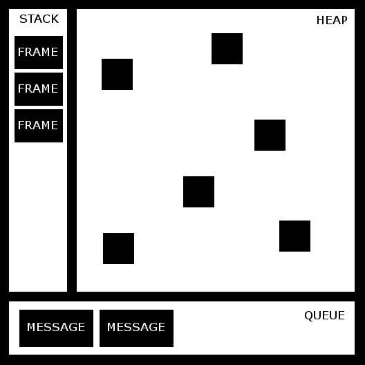

# 第六章：理解运行时

在阅读这本书之后，你可能会渴望开始一个新的项目，将你迄今为止所学的一切付诸实践。在这个时候，你应该能够编写一个使用 TypeScript 的小型网络应用程序，并解决你可能会遇到的潜在设计时问题。

然而，随着你的新项目不断发展，你开发了更多复杂的功能，你可能会遇到一些运行时问题。本章应该为你提供解决运行时问题的缺失知识。

我们在前面的章节中只是简要地提到了 TypeScript 运行时，但根据你的背景，你可能已经对它有了很多了解，因为 TypeScript 运行时是 JavaScript 运行时。

TypeScript 仅用于设计时；TypeScript 代码随后被编译成 JavaScript，并在运行时执行。JavaScript 运行时负责监督 JavaScript 代码的执行。重要的是要理解我们永远不会执行 TypeScript 代码，我们总是执行 JavaScript 代码；因此，当我们提到 TypeScript 运行时，我们实际上是在谈论 JavaScript 运行时。

当我们编译 TypeScript 代码时，我们将生成 JavaScript 代码，该代码将在服务器端或客户端执行。那时，我们可能会遇到一些具有挑战性的运行时问题。

在本章中，我们将涵盖以下主题：

+   执行环境

+   事件循环

+   `this` 操作符

+   原型

+   闭包

让我们从了解执行环境开始。

# 执行环境

执行环境是我们开始开发 TypeScript 应用程序之前必须考虑的第一件事之一。一旦我们将 TypeScript 代码编译成 JavaScript，它就可以在许多不同的环境中执行。虽然这些环境中的大多数将是网络浏览器的一部分，如 Chrome、Internet Explorer 或 Firefox，但我们可能还希望能够在 Node.js、RingoJS 或 Electron 等环境中的服务器端或桌面应用程序上运行我们的代码。

重要的是要记住，在运行时有一些变量和对象是特定于环境的。例如，我们可以创建一个库并访问 `document.layers` 变量。虽然 `document` 是 W3C **文档对象模型**（**DOM**）标准的一部分，但 layers 属性仅在 Internet Explorer 中可用，并且不是 W3C DOM 标准的一部分。

W3C 如下定义 DOM：

“文档对象模型是一个平台和语言中立的接口，它将允许程序和脚本动态地访问和更新文档的内容、结构和样式。文档可以进一步处理，处理结果可以合并回显示的页面”。

类似地，我们也可以从浏览器运行时环境中访问一组称为**浏览器对象模型**（**BOM**）的对象。BOM 包括 `navigator`、`history`、`screen`、`location` 和 `document` 这些对象，它们是 `window` 对象的属性。

我们需要记住，DOM 只在网页浏览器中可用。如果我们想在网页浏览器中运行我们的应用程序，我们将能够访问 DOM 和 BOM。然而，在 Node.js 或 RingoJS 等环境中，这些 API 将不可用，因为它们是完全独立于网页浏览器的独立 JavaScript 环境。我们还可以在服务器端环境中找到其他对象（如 Node.js 中的 `process.stdin`），如果我们尝试在网页浏览器中执行我们的代码，这些对象将不可用。

我们还需要牢记这些 JavaScript 环境存在多个版本。在某些情况下，我们可能需要支持多个浏览器和多个版本的 Node.js。处理此类问题时，建议的做法是添加条件语句来检查功能的可用性，而不是检查环境或版本的可用性。

有一个非常好的库可以帮助我们在为网页浏览器开发时实现功能检测。这个库叫做 **Modernizr**，可以在 [`modernizr.com/`](http://modernizr.com/) 下载。

# 理解事件循环

TypeScript 运行时（JavaScript）基于**事件循环**的并发模型。这种模型与其他语言（如 C 或 Java）中的模型相当不同。在我们专注于事件循环本身之前，我们必须了解一些运行时概念。

下面的图示是一些重要的运行时概念：堆、栈、队列和帧：



我们现在将探讨每个这些概念的作用。

# 帧结构

一个帧是工作的一个连续单元。在上面的图中，帧由栈内的块表示。

当在 JavaScript 中调用一个函数时，运行时会创建一个帧在栈中。帧包含该函数的参数和局部变量。当函数返回时，帧从栈中移除。让我们看一个例子：

```js
function foo(a: number): number { 
    const value = 12; 
    return value + a; 
} 

function bar(b: number): number { 
    const value = 4; 
    return foo(value * b); 
} 
```

在声明 `foo` 和 `bar` 函数之后，我们将调用 `bar` 函数：

```js
bar(21); 
```

当 `bar` 执行时，运行时会创建一个新的帧，包含 `bar` 的参数以及所有其局部变量（值）。然后，这个帧（在栈内表示为块）被添加到栈顶。

在内部，`bar` 调用 `foo`。当 `foo` 被调用时，会创建一个新的帧并将其分配到栈顶。当 `foo` 的执行完成（`foo` 已返回）时，栈顶的帧被移除。当 `bar` 的执行也完成时，它也会从栈中移除。

现在，让我们尝试想象如果 `foo` 函数调用了 `bar` 函数会发生什么：

```js
function foo(a: number): number { 
    const value = 12; 
    return bar(value + a); 
} 

function bar(b: number): number { 
    const value = 4; 
    return foo(value * b); 
} 
```

我们会创建一个永无止境的函数调用循环。每次函数调用都会在栈中添加一个新的帧，最终栈中可能没有更多空间，并抛出错误。大多数软件工程师都熟悉这种错误，称为 *栈溢出* 错误。

# 栈

栈包含一系列步骤（帧）。栈是一种表示简单 **后进先出** （**LIFO**）对象集合的数据结构。因此，当帧添加到栈中时，它总是添加到栈顶。

由于栈是一个 LIFO 集合，事件循环从栈顶到底部处理其中存储的帧。帧的依赖项被添加到栈顶，以确保每个帧的所有依赖项都得到满足。

# 队列

队列包含一个等待处理的消息列表。每个消息都与一个函数相关联。当栈为空时，从队列中取出一条消息并处理。处理包括调用相关函数并将帧添加到栈中。当栈再次变为空时，消息处理结束。

在之前的运行时图中，队列内的块代表消息。

# 堆

堆是一个不知道存储在其中的项目顺序的内存容器。堆包含当前正在使用的所有变量和对象。它还可能包含当前不在作用域内但尚未被垃圾收集器从内存中移除的帧。

# 事件循环

并发是指两个或更多操作可以同时执行的能力。运行时执行在一个单独的线程上发生，这意味着我们无法实现真正的并发。

事件循环遵循运行至完成的方法，这意味着它会在处理任何其他消息之前，从开始到结束处理一条消息。

每次调用函数时，都会将一条新消息添加到队列中。如果栈为空，则处理该函数（将帧添加到栈中）。

当所有帧都添加到栈中后，从栈顶到底部清除栈。在处理过程的末尾，栈为空，并处理下一条消息。

Web 工作者可以在不同的线程中执行后台任务。它们使用一个分离的队列、堆和栈。

`事件循环` 的一大优点是执行顺序非常可预测且易于跟踪。`事件循环` 方法的重要优点之一是它具有非阻塞 I/O。这意味着当应用程序等待输入和输出（I/O）操作完成时，它仍然可以处理其他事情，例如用户输入。

这种方法的缺点是，如果一条消息（函数）执行时间过长，应用程序就会变得无响应。遵循的良好实践是使消息处理尽可能短，如果可能的话，将一条消息拆分成几条消息。

# `this` 操作符

在 JavaScript 中，`this` 操作符的行为与其他语言略有不同。`this` 操作符的值通常由函数的调用方式决定。它的值在执行过程中不能通过赋值来设置，并且每次调用函数时可能不同。

当使用严格模式和非严格模式时，`this` 操作符也有一些不同之处。要了解更多关于严格模式的信息，请参阅 [`developer.mozilla.org/en-US/docs/Web/JavaScript/Reference/Strict_mode`](https://developer.mozilla.org/en-US/docs/Web/JavaScript/Reference/Strict_mode)。

# 全局上下文中的 `this` 操作符

在全局上下文中，`this` 操作符始终指向全局对象。在网页浏览器中，`window` 对象就是全局对象：

```js
console.log(this === window); // true 
this.a = 37; 
console.log(window.a); // 37 
console.log(window.document === this.document); // true 
console.log(this.document === document); // true 
console.log(window.document === document); // true 
```

前面的例子是一个 JavaScript 示例，而不是 TypeScript 示例。

# 函数上下文中的 `this` 操作符

函数内部 `this` 的值取决于函数的调用方式。如果我们以非严格模式简单地调用一个函数，函数内部的 `this` 值将指向全局对象，如下所示：

```js
function f1() { 
  return this; 
} 
f1() === window; // true 
```

本节中的所有示例（即函数上下文中的 `this` 操作符）都是 JavaScript 示例，而不是 TypeScript 示例。

然而，如果我们以严格模式调用一个函数，函数体内的 `this` 值将指向 `undefined`，如下所示：

```js
console.log(this); // global (window) 

function f2() { 
  "use strict"; 
  return this; // undefined 
} 

console.log(f2()); // undefined 
console.log(this); // window 
```

ECMAScript 5 的严格模式是一种选择进入 JavaScript 限制变体的方式。你可以在 [`developer.mozilla.org/en-US/docs/Web/JavaScript/Reference/Strict_mode`](https://developer.mozilla.org/en-US/docs/Web/JavaScript/Reference/Strict_mode) 了解更多关于严格模式的信息。

然而，将函数作为实例方法调用时，函数内部的 `this` 操作符的值指向实例。换句话说，函数上下文中的 `this` 操作符（该函数是类的一部分）指向那个类：

```js
const person = { 
  age: 37, 
  getAge: function() { 
    return this.age; // this points to the instance (person) 
  } 
}; 
console.log(person.getAge()); // 37 
```

在前面的例子中，我们使用了对象字面量表示法来定义一个名为 `p` 的对象，但使用原型声明对象时也适用同样的规则：

```js
function Person() {} 
Person.prototype.age = 37; 
Person .prototype.getAge = function () { 
  return this.age; 
} 
const person = new Person(); 
person.age;    // 37 
person.getAge(); // 37 
```

当一个函数用作构造函数（使用 `new` 关键字）时，`this` 操作符指向正在构造的对象：

```js
function Person() { // function used as a constructor 
  this.age = 37; 
} 
const person = new Person(); 
console.log(person.age); // logs 37 
```

# 调用、应用和绑定方法

所有函数都从 `Function.prototype` 继承了 `call`、`apply` 和 `bind` 方法。我们可以使用这些方法来设置 `this` 的值。

`call` 和 `apply` 方法几乎相同；两种方法都允许我们调用一个函数并设置函数内部的 `this` 操作符的值。`call` 和 `apply` 之间的主要区别在于，虽然 `apply` 允许我们将参数作为数组传递给函数，但 `call` 需要显式列出函数参数。

一个有用的记忆法是：A (*`apply`*) 代表数组，C (*`call`*) 代表逗号*。

让我们来看一个例子。我们首先声明一个名为 `Person` 的类。这个类有两个属性（`name` 和 `surname`）和一个方法（`greet`）。`greet` 方法使用 `this` 操作符来访问 `name` 和 `surname` 实例属性：

```js
class Person { 

  public name: string; 
  public surname: string; 

  public constructor(name: string, surname: string) { 
    this.name = name; 
    this.surname = surname; 
  } 

  public greet(city: string, country: string) { 
    // we use the "this" operator to access name and surname  
    let msg = `Hi, my name is ${this.name} ${this.surname}.`; 
    msg += `I'm from ${city} (${country}).`; 
    console.log(msg); 
  } 

} 
```

在声明了 `Person` 类之后，我们将创建一个实例：

```js
const person = new Person("remo", "Jansen"); 
```

如果我们调用 `greet` 方法，它将按预期工作：

```js
person.greet("Seville", "Spain"); 
```

或者，我们可以使用 `call` 和 `apply` 函数来调用该方法。我们在两个函数中提供了 `person` 对象作为第一个参数，因为我们想让 `this` 操作符（在 `greet` 方法内部）的值是 person：

```js
person.greet.call(person, "Seville", "Spain"); 
person.greet.apply(person, ["Seville", "Spain"]); 
```

如果我们提供一个不同的值作为 `this` 的值，我们就无法在 `greet` 函数内访问 `name` 和 `surname` 属性：

```js
person.greet.call(null, "Seville", "Spain"); 
person.greet.apply(null, ["Seville", "Spain"]); 
```

前两个例子可能看起来没有用，因为第一个直接调用了函数，而第二个导致了意外的行为。`apply` 和 `call` 方法只有在我们需要在函数调用时改变 `this` 操作符的值时才有意义：

```js
const valueOfThis = { name : "Anakin", surname : "Skywalker" }; 
person.greet.call(valueOfThis, "Mos espa", "Tatooine"); 
person.greet.apply(valueOfThis, ["Mos espa", "Tatooine"]); 
```

`bind` 方法可以用来设置 `this` 操作符（在函数内部）的值，无论它是如何被调用的。

当我们调用一个函数的 `bind` 方法时，它返回一个与原始函数具有相同体和作用域的新函数，但 `this` 操作符（在函数体内部）将永久绑定到 `bind` 的第一个参数，无论函数是如何被使用的。

让我们来看一个例子。我们首先创建一个 `Person` 类的实例，这个类是我们之前声明的：

```js
const person = new Person("Remo", "Jansen"); 
```

然后，我们可以使用 `bind` 将 `greet` 函数设置为具有相同作用域和体的新函数：

```js
const greet = person.greet.bind(person); 
```

如果我们尝试使用 `bind` 和 `apply` 来调用 `greet` 函数，就像我们在上一个示例中所做的那样，我们将能够观察到，这次，`this` 操作符将始终指向对象实例，无论函数是如何被调用的：

```js
greet.call(person, "Seville", "Spain"); 
greet.apply(person, ["Seville", "Spain"]); 
// Hi, my name is Remo Jansen. I'm from Seville Spain. 

greet.call(null, "Seville", "Spain"); 
greet.apply(null, ["Seville", "Spain"]); 
// Hi, my name is Remo Jansen. I'm from Seville Spain. 

const valueOfThis = { name: "Anakin", surname: "Skywalker" }; 
greet.call(valueOfThis, "Mos espa", "Tatooine"); 
greet.apply(valueOfThis, ["Mos espa", "Tatooine"]); 
// Hi, my name is Remo Jansen. I'm from Mos espa Tatooine. 
```

一旦我们使用 `bind` 将一个对象绑定到一个函数上，我们就无法覆盖它：

```js
const valueOfThis = { name: "Anakin", surname: "Skywalker" }; 
const greet = person.greet.bind(valueOfThis); 
greet.call(valueOfThis, "Mos espa", "Tatooine"); 
greet.apply(valueOfThis, ["Mos espa", "Tatooine"]); 
// Hi, my name is Remo Jansen. I'm from Mos espa Tatooine. 
```

使用 `bind`、`apply` 和 `call` 方法通常是不被推荐的，因为这可能会导致混淆。修改 `this` 操作符的默认行为可能会导致意外的结果。请记住，仅在绝对必要时使用这些方法，并适当地记录代码以减少潜在的可维护性问题带来的风险。

# 原型

当我们编译 TypeScript 程序时，所有的类和对象都变成了 JavaScript 对象。然而，有时即使编译没有错误，我们可能在运行时遇到意外的行为。为了能够识别和理解这种行为的起因，我们需要对 JavaScript 运行时有一个很好的理解。我们需要理解的主要概念之一是运行时的继承是如何工作的。

运行时继承系统使用原型继承模型。在原型继承模型中，对象从对象继承，没有类可用。然而，我们可以使用原型来模拟类。让我们看看它是如何工作的。

在运行时，每个 JavaScript 对象都有一个名为`prototype`的内部属性。`prototype`属性的值是一个对象，它包含一些属性（数据）和方法（行为）。

在 TypeScript 中，我们可以使用基于类的继承系统：

```js
class Person { 

    public name: string; 
    public surname: string; 
    public age: number = 0; 

    public constructor(name: string, surname: string) { 
        this.name = name; 
        this.surname = surname; 
    } 

    public greet() { 
        let msg = `Hi! my name is ${this.name} ${this.surname}`; 
        msg += `I'm ${this.age}`; 
    } 

} 
```

我们定义了一个名为`Person`的类。在运行时，这个类使用原型而不是类来声明：

```js
var Person = (function() { 
    function Person(name, surname) { 
        this.age = 0; 
        this.name = name; 
        this.surname = surname; 
    } 
    Person.prototype.greet = function() { 
        let msg = "Hi! my name is " + this.name + 
                    " " + this.surname; 
        msg += "I'm " + this.age; 
    }; 
    return Person; 
})(); 
```

上述代码是 TypeScript 在针对 ES5 时输出的。`class`关键字在 ES6 运行时得到支持，但它只是语法糖。在计算机科学中，语法糖是编程语言中设计来使事物更容易阅读或表达的语言。这意味着`class`关键字只是一个帮助我们作为软件工程师更容易生活的助手，并且内部始终使用原型。

TypeScript 编译器将对象定义（我们不会将其称为类定义，因为技术上它不是类）用立即执行函数表达式（**IIFE**）包装起来。在 IIFE 内部，我们可以找到一个名为`Person`的函数。如果我们检查这个函数并与 TypeScript 类进行比较，我们会注意到它接受与 TypeScript 类构造函数相同的参数。这个函数用于创建`Person`类的新实例。

在构造函数之后，我们可以看到`greet`方法的定义。正如我们所见，`prototype`属性被用来将`greet`方法附加到`Person`类上。

# 实例属性与类属性

因为 JavaScript 是一种动态编程语言，我们可以在运行时向对象的实例添加属性和方法，它们不需要是对象（类）本身的一部分。让我们看看一个例子：

```js
function Person(name, surname) { 
      // instance properties 
      this.name = name; 
      this.surname = surname; 
} 
const person = new Person("Remo", "Jansen"); 
person.age = 27; 
```

我们为名为`person`的对象定义了一个构造函数，它接受两个变量（`name`和`surname`）作为参数。然后，我们创建了一个`Person`对象的实例，并给它添加了一个名为`age`的新属性。我们可以使用`for...in`语句在运行时检查`person`的属性：

```js
for(let property in person) { 
  console.log("property: " + property + ", value: '" + 
   person[property] + "'"); 
} 
// property: name, value: 'remo' 
// property: surname, value: 'jansen' 
// property: age, value: 27 
// property: greet, value: 'function (city, country) { 
//        let msg = "Hi, my name is " + this.name + " " + 
 //this.surname; 
//        msg += "nI'm from " + city + " " + country; 
//        console.log(msg); 
//    }' 
```

所有这些属性都是**实例属性**，因为它们为每个新实例持有值。例如，如果我们创建一个`Person`的新实例，这两个实例都将持有它们自己的值：

```js
let person2 = new Person("John", "Wick"); 
person2.name; // "John"  
person1.name; // "Remo" 
```

我们使用`this`运算符定义了这些实例属性，因为在函数用作构造函数（使用`new`关键字）时，`this`运算符绑定到正在构造的新对象上。

这也解释了为什么我们可以通过对象的原型来定义实例属性：

```js
Person.prototype.name = name;    // instance property  
Person.prototype.name = surname; // instance property 
```

我们也可以声明类级别的属性和方法（也称为静态属性）。主要区别是类属性和方法的值在对象的各个实例之间是共享的。

类属性通常用于存储静态值：

```js
function MathHelper() {  
  /* ... */  
} 

// class property 
MathHelper.PI = 3.14159265359; 
```

类方法也经常被用作执行计算并返回结果的实用函数：

```js
function MathHelper() { /* ... */ } 

// class property 
MathHelper.PI = 3.14159265359; 

// class method 
MathHelper.areaOfCircle = function(radius) { 
  return radius * radius * MathHelper.PI;  
} 
```

在前面的例子中，我们从类方法（`areaOfCircle`）中访问了一个类属性（`PI`）。我们可以从实例方法中访问类属性，但不能从类属性或方法中访问实例属性或方法。我们可以通过将 `PI` 声明为实例属性而不是类属性来演示这一点：

```js
function MathHelper() { 
  // instance property 
  this.PI = 3.14159265359; 
} 
```

如果我们尝试从一个类方法中访问 `PI`，它将是未定义的：

```js
// class method 
MathHelper.areaOfCircle = function(radius) { 
  return radius * radius * this.PI;  // this.PI is undefined 
} 

MathHelper.areaOfCircle(5); // NaN 
```

我们不应该从实例方法中访问类方法或属性，但有一种方法可以做到。我们可以通过使用原型构造函数属性，如以下示例所示来实现它：

```js
function MathHelper () { /* ... */ } 

// class property  
MathHelper.PI = 3.14159265359; 

// instance method  
MathHelper.prototype.areaOfCircle = function(radius) {  
    return radius * radius * this.constructor.PI;  
} 

const math = new MathHelper ();  
console.log(MathHelper.areaOfCircle(5)); // 78.53981633975 
```

我们可以使用原型构造函数属性从 `areaOfCircle` 实例方法中访问 `PI` 类属性，因为这个属性返回对对象构造函数的引用。

在 `areaOfCircle` 内部，`this` 操作符返回对对象原型的引用：

```js
this === MathHelper.prototype 
```

`this.constructor` 的值等于 `MathHelper.prototype.constructor`，因此 `MathHelper.prototype.constructor` 等于 `MathHelper`。

# 原型继承

我们可能会想知道 `extends` 关键字是如何工作的。让我们创建一个新的 TypeScript 类，它从 `Person` 类继承，以理解它：

```js
class SuperHero extends Person { 
    public superpower: string; 
    public constructor( 
        name: string, 
        surname: string, 
        superpower: string 
    ) { 
        super(name, surname); 
        this.superpower = superpower; 
    } 
    public userSuperPower() { 
        return `I'm using my ${this.superpower}`; 
    } 
}
```

前一个类被命名为 `SuperHero` 并扩展了 `Person` 类。它有一个额外的属性（`superpower`）和一个方法（`useSuperPower`）。如果我们编译代码，我们会注意到以下代码片段：

```js
var __extends = this.__extends || function (d, b) { 
    for (var p in b) if (b.hasOwnProperty(p)) d[p] = b[p]; 
    function __() { this.constructor = d; } 
    __.prototype = b.prototype; 
    d.prototype = new __(); 
}; 
```

请注意，前面的代码片段在 TypeScript 2.8 中稍微复杂一些。在这里我们将使用之前版本的代码，因为它包含的条件较少，更容易理解。

这段代码是由 TypeScript 生成的。尽管它是一小段代码，但它展示了本章几乎包含的每一个概念，理解它可能相当具有挑战性。

在函数表达式第一次评估之前，`this` 操作符指向全局对象，它不包含名为 `__extends` 的方法。这意味着 `__extends` 变量是未定义的。

当函数表达式第一次评估时，函数表达式的值（一个匿名函数）被分配给全局作用域中的 `__extends` 属性。

TypeScript 为包含 `extends` 关键字的每个 TypeScript 文件生成一次函数表达式。然而，函数表达式只评估一次（当 `__extends` 变量未定义时）。这种行为是通过第一行的条件语句实现的：

```js
var __extends = this.__extends || function (d, b) { // ... 
```

当这一行代码第一次执行时，函数表达式会被评估。函数表达式的值是一个匿名函数，它被分配给全局作用域中的 `__extends` 变量。因为我们在全局作用域中，`var __extends` 和 `this. __extends` 在这个点上指向同一个变量。

当一个新文件执行时，`__extends` 变量已经在全局作用域中可用，函数表达式不会被评估。这意味着函数表达式的值只被分配给 `__extends` 变量一次，即使代码片段被多次执行。

现在，让我们关注一下 `__extends` 变量（匿名函数）：

```js
function (d, b) { 
    for (var p in b) if (b.hasOwnProperty(p)) d[p] = b[p]; 
    function __() { this.constructor = d; } 
    __.prototype = b.prototype; 
    d.prototype = new __(); 
} 
```

此函数接受两个参数，分别命名为 `d` 和 `b`。当我们调用它时，我们应该传递一个派生对象构造函数（`d`）和一个基对象构造函数（`b`）。

匿名函数内的第一行遍历基类的每个属性和方法，并在派生类中创建它们的副本：

```js
for (var p in b) if (b.hasOwnProperty(p)) d[p] = b[p]; 
```

当我们使用 `for...in` 语句迭代对象的实例到 `a` 时，它将迭代对象的实例属性。然而，如果我们使用 `for...in` 语句迭代对象构造函数的属性，该语句将迭代其类属性。在前面的例子中，`for...in` 语句被用来继承对象的类属性和方法。为了继承实例属性，我们将复制对象的原型。

第二行声明了一个新的构造函数 `__`，并在其中使用 `this` 操作符来访问其原型：

```js
function __() { this.constructor = d; } 
```

原型包含一个名为 `constructor` 的特殊属性，它返回对对象构造函数的引用。在这个点上，名为 `__` 的函数和 `this.constructor` 指向同一个变量。然后，派生对象构造函数（`d`）的值被分配给 `__` 构造函数。

在第三行，基对象构造函数的原型对象的值被分配给 `__` 对象构造函数的原型：

```js
__.prototype = b.prototype; 
```

在最后一行，调用了 `new __()`，并将结果分配给派生类（`d`）的原型。通过执行所有这些步骤，我们可以调用以下内容：

```js
var instance = new d(): 
```

这样做之后，我们将得到一个包含派生类（`d`）和基类（`b`）所有属性的对象。此外，由派生构造函数（`d`）构建的任何实例对象都将作为派生类的实例，同时继承自基类（`b`）的类和实例属性和方法。

我们可以通过检查定义 `SuperHero` 类的运行时代码来查看这个函数的实际效果：

```js
var SuperHero = (function (_super) { 
    __extends(SuperHero, _super); 
    function SuperHero(name, surname, superpower) { 
        _super.call(this, name, surname); 
        this.superpower = superpower;  
    } 
    SuperHero.prototype.userSuperPower = function () { 
        return "I'm using my " + superpower; 
    }; 
    return SuperHero; 
})(Person); 
```

我们在这里再次看到了立即执行函数表达式（IIFE）。这次，IIFE 将 `Person` 对象构造函数作为参数。在函数内部，我们将使用 `_super` 这个名字来引用这个参数。在 IIFE 内部，调用了 `__extends` 函数，并将 `SuperHero`（派生类）和 `_super`（基类）参数传递给它。

在下一行，我们可以找到 `SuperHero` 对象构造函数和 `useSuperPower` 函数的声明。我们可以在声明之前使用 `SuperHero` 作为 `__extend` 的参数，因为函数声明会被提升到作用域的顶部。

函数表达式不会被提升。当我们在一个函数表达式中将函数赋给一个变量时，变量会被提升，但它的值（函数本身）不会被提升。

在 `SuperHero` 构造函数内部，使用 `call` 方法调用基类（`Person`）的构造函数：

```js
_super.call(this, name, surname); 
```

正如我们在本章前面所发现的，我们可以使用 `call` 来设置函数上下文中 `this` 操作符的值。在这种情况下，我们传递了 `this` 操作符，它指向正在创建的 `SuperHero` 实例：

```js
function Person(name, surname) { 
      // this points to the instance of SuperHero being created 
      this.name = name; 
      this.surname = surname; 
} 
```

# 原型链和属性遮蔽

当我们尝试访问一个对象的属性或方法时，运行时会搜索该对象属性和方法。如果找不到，运行时会继续通过遍历整个继承树来搜索对象的继承属性。因为派生对象通过 `prototype` 属性与其基对象链接，所以我们称这个继承树为 **原型链**。

让我们看一个例子。我们将声明两个简单的 TypeScript 类，分别命名为 `Base` 和 `Derived`：

```js
class Base { 
    public method1() { return 1; } 
    public method2() { return 2; } 
} 

class Derived extends Base { 
    public method2() { return 3; } 
    public method3() { return 4; } 
} 
```

现在我们将检查 TypeScript 生成的 JavaScript 代码：

```js
var Base = (function () { 
    function Base() { 
    } 
    Base.prototype.method1 = function () { return 1; }; 
    Base.prototype.method2 = function () { return 2; }; 
    return Base; 
})(); 
var Derived = (function (_super) { 
    __extends(Derived, _super); 
    function Derived() { 
        _super.apply(this, arguments); 
    } 
    Derived.prototype.method2 = function () { return 3; }; 
    Derived.prototype.method3 = function () { return 4; }; 
    return Derived; 
})(Base); 
```

然后，我们可以创建 `Derived` 类的一个实例：

```js
var derived = new Derived(); 
```

如果我们尝试访问名为 `method1` 的方法，运行时会在实例属性中找到它：

```js
console.log(derived.method1); // 1 
```

实例还有一个名为 `method2` 的自有属性（值为 2），但还有一个继承的属性名为 `method2`（值为 3）。对象的属性（值为 3 的 `method2`）阻止了对原型属性（值为 2 的 `method2`）的访问。这被称为 **属性遮蔽**：

```js
console.log(derived.method2); // 3 
```

实例没有名为 `method3` 的自有属性，但在其原型中有一个名为 `method3` 的属性：

```js
console.log(derived.method3); // 4 
```

实例或原型链中的对象（`Base` 类）都没有名为 `method4` 的属性：

```js
console.log(derived.method4); // error 
```

# 访问对象的原型

原型可以通过三种不同的方式访问：

+   `Person.prototype`

+   `Object.getPrototypeOf(person)`

+   `person.__proto__`

使用 `__proto__` 是有争议的，并且被许多经验丰富的软件工程师所反对。它从未被最初包含在 ECMAScript 语言规范中，但现代浏览器决定无论如何都要实现它。今天，`__proto__` 属性已经被标准化在 ECMAScript 6 语言规范中，并将得到未来的支持，但它仍然是一个应该避免的慢操作，如果性能是一个关注点的话。

# 新操作符

我们可以使用 `new` 操作符来生成 `Person` 的一个实例：

```js
const person = new Person("remote", "Jansen"); 
```

当我们使用新操作符时，运行时会创建一个新的对象，该对象继承自 `Person` 类的原型。

# 闭包

闭包是运行时可用功能中最强大之一，但它们也是最容易误解的。Mozilla 开发者网络将闭包定义为如下：

“闭包是引用独立（自由）变量的函数。换句话说，闭包中定义的函数‘记得’它被创建的环境”。

我们将独立（自由）变量理解为在创建它们的词法作用域之外持续存在的变量。让我们看一个例子：

```js
function makeArmy() { 
    const shooters = []; 
    for (let i = 0; i < 10; i++) { 
        const shooter = () => { // a shooter is a function 
            console.log(i); // which should display it's number 
        }; 
        shooters.push(shooter); 
    } 
    return shooters; 
} 
```

上述示例是一个 JavaScript 示例，而不是 TypeScript 示例。

我们声明了一个名为`makeArmy`的函数。在函数内部，我们创建了一个名为`shooters`的函数数组。`shooters`数组中的每个函数将显示一个数字，其值是从`for`语句内部的变量`i`设置的。现在我们将调用`makeArmy`函数：

```js
const army = makeArmy();  
```

变量`army`现在应该包含函数的`shooters`数组。然而，如果我们执行以下代码，我们会注意到一个问题：

```js
army[0](); // 10 (expected 0) 
army[5](); // 10 (expected 5) 
```

上述代码片段没有按预期工作，因为我们犯了一个与闭包相关的最常见错误。当我们将在`makeArmy`函数内部声明的`shooter`函数时，我们没有意识到我们创建了一个闭包。

这种情况的原因是分配给`shooter`的函数是闭包；它们由函数定义和从`makeArmy`函数作用域捕获的环境组成。我们创建了十个闭包，但它们都具有相同的环境。当`shooter`函数执行时，循环已经完成，共享于所有闭包的`i`变量（指向最后一个条目`10`）。

在这种情况下，一个解决方案是使用更多的闭包：

```js
function makeArmy() { 
    const shooters = []; 
    for (let i = 0; i < 10; i++) { 
        ((index: number) => { 
            const shooter = () => { 
                console.log(index); 
            }; 
            shooters.push(shooter); 
        })(i); 
    } 
    return shooters; 
} 

const army = makeArmy(); 
army[0](); // 0 
army[5](); // 5 
```

上述示例是一个 TypeScript 示例，而不是 JavaScript 示例。

这正如预期的那样工作。而不是让`shooter`函数共享一个单一的环境，立即调用的函数为每个函数创建一个新的环境，其中`i`指向相应的值。

# 由闭包驱动的静态变量

在上一节中，我们了解到当闭包上下文中的变量在类的多个实例之间共享时，该变量表现得像静态变量。

现在，我们将看到如何创建表现像静态变量一样的变量和方法。让我们首先声明一个名为`Counter`的 TypeScript 类：

```js
class Counter { 
    private static _COUNTER = 0; 
    public increment() { 
        this._changeBy(1); 
    } 
    public decrement() { 
        this._changeBy(-1); 
    } 
    public value() { 
        return Counter._COUNTER; 
    } 
    private _changeBy(val: number) { 
        Counter._COUNTER += val; 
    } 
} 
```

上述示例是一个 TypeScript 示例，而不是 JavaScript 示例。

上述类包含一个名为`_COUNTER`的静态成员。TypeScript 编译器将其转换为以下代码：

```js
var Counter = (function () { 
    function Counter() { 
    } 
    Counter.prototype._changeBy = function (val) { 
        Counter._COUNTER += val; 
    }; 
    Counter.prototype.increment = function () { 
        this._changeBy(1); 
    }; 
    Counter.prototype.decrement = function () { 
        this._changeBy(-1); 
    }; 
    Counter.prototype.value = function () { 
        return Counter._COUNTER; 
    }; 
    Counter._COUNTER = 0; 
    return Counter; 
})(); 
```

上述示例是一个 JavaScript 示例，而不是 TypeScript 示例。

如我们所观察到的，TypeScript 编译器将静态变量声明为类属性（而不是`instance`属性）。编译器使用类属性，因为类属性在类的所有实例之间共享。问题是私有变量在运行时并不是私有的。

或者，我们可以编写一些 JavaScript（记住，所有有效的 JavaScript 都是有效的 TypeScript）代码来使用闭包在运行时模拟静态属性：

```js
var Counter = (function() { 

    // closure context 
    let _COUNTER = 0; 

    function changeBy(val) { 
        _COUNTER += val; 
    } 

    function Counter() {}; 

    // closure functions 
    Counter.prototype.increment = function() { 
      changeBy(1);  
    }; 
    Counter.prototype.decrement = function() { 
      changeBy(-1); 
    }; 
    Counter.prototype.value = function() { 
      return _COUNTER; 
    }; 
    return Counter; 
})(); 
```

上述示例是一个 JavaScript 示例，而不是 TypeScript 示例。

上述代码片段声明了一个名为 `Counter` 的类。该类有一些用于增加、减少和读取名为 `_COUNTER` 的变量的方法。`_COUNTER` 变量本身不是对象原型的部分。

`Counter` 类的所有实例将共享相同的上下文，这意味着上下文（变量 `counter` 和函数 `changeBy`）将表现得像一个单例。

单例模式要求将对象声明为静态变量以避免在需要时创建其实例。因此，对象实例由应用程序的所有组件共享。单例模式在不需要类唯一实例的情况下经常被使用，在不必要的情况下引入全局状态到应用程序中。

现在我们知道了如何使用闭包来模拟静态变量：

```js
let counter1 = new Counter(); 
let counter2 = new Counter(); 
console.log(counter1.value()); // 0 
console.log(counter2.value()); // 0 
counter1.increment(); 
counter1.increment(); 
console.log(counter1.value()); // 2 
console.log(counter2.value()); // 2 (expected 0) 
counter1.decrement(); 
console.log(counter1.value()); // 1 
console.log(counter2.value()); // 1 (expected 0) 
```

# 由闭包驱动的私有成员

在上一节中，我们了解到闭包可以访问它们创建的词法作用域之外持续存在的变量。这些变量不是函数原型或主体的部分，但它们是函数上下文的一部分。

由于我们无法直接调用函数上下文，上下文变量和方法可以用来在运行时模拟私有成员。使用闭包来模拟私有成员（而不是 TypeScript 私有访问修饰符）的主要优势是闭包将在运行时阻止对私有成员的访问。

TypeScript 避免在运行时模拟私有属性，因为如果我们在编译时尝试访问私有成员，编译器将抛出错误。TypeScript 避免使用闭包来模拟私有成员以提高应用程序性能。如果我们向我们的类之一添加或删除访问修饰符，生成的 JavaScript 代码将完全不会改变。这意味着类（在设计时）的私有成员在运行时成为公共成员。

然而，可以在运行时使用闭包来模拟私有属性。让我们看一个例子：

```js
function makeCounter() { 

    // closure context 
    let _COUNTER = 0; 

    function changeBy(val: number) { 
        _COUNTER += val; 
    } 

    class Counter { 
        public increment() { 
            changeBy(1); 
        } 
        public decrement() { 
            changeBy(-1); 
        } 
        public value() { 
            return _COUNTER; 
        } 
    } 
} 
```

上述示例是一个 TypeScript 示例，而不是 JavaScript 示例。

上述类几乎与我们之前声明的类相同，以演示如何使用闭包在运行时模拟静态变量。

这次，每次我们调用 `makeCounter` 函数时，都会创建一个新的闭包上下文，因此每个新的 `Counter` 实例都将记住一个独立上下文（`counter` 和 `changeBy`）：

```js
let counter1 = makeCounter(); 
let counter2 = makeCounter(); 
console.log(counter1.value()); // 0 
console.log(counter2.value()); // 0 
counter1.increment(); 
counter1.increment(); 
console.log(counter1.value()); // 2 
console.log(counter2.value()); // 0 (expected 0) 
counter1.decrement(); 
console.log(counter1.value()); // 1 
console.log(counter2.value()); // 0 (expected 0)  
```

由于上下文不能直接访问，我们可以说变量 `counter` 和函数 `changeBy` 是私有成员：

```js
console.log(counter1.counter); // undefined 
counter1.changeBy(2); // changeBy is not a function 
console.log(counter1.value()); // 1 
```

# 摘要

在本章中，我们对运行时有了更深入的理解，这使我们不仅能够轻松解决运行时问题，而且能够编写更好的 TypeScript 代码。对闭包和原型的深入理解将使我们能够开发一些没有这种知识就无法实现的复杂功能。

在下一章中，我们将学习**函数式编程**（**FP**）范式。
