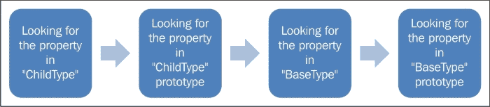

# 第二章. JavaScript 重要 OOP 概念回顾

在我们开始创建和使用 JavaScript 中的模块之前，了解 JavaScript 中重要的 **面向对象编程**（**OOP**）概念非常重要。我们将依赖这些概念来设计和实现我们后续章节中的应用程序模块。

虽然我在这章中的意图不是深入探讨这些概念，但我将尝试提供一个关于一些最重要相关主题的良好概述。

如果你觉得自己对 JavaScript 中的这些概念非常熟悉，你可以跳过这一章，直接进入下一章。

然而，如果你对 JavaScript 中的面向对象编程（OOP）不是很熟悉，即使你对经典面向对象语言中的类似概念很熟悉，我也鼓励你继续阅读，因为 JavaScript 中的情况略有不同。我认为你查看这些概念在 JavaScript 领域中会很有价值。

在本章中，我们将涵盖：

+   JavaScript 对象及其构造函数

+   `this` 关键字是什么以及它在不同上下文中的行为

+   闭包及其用途

+   在 JavaScript 中，继承

+   原型链

以及其他相关主题。

# JavaScript 对象

如果你以前编程过 JavaScript（正如我确信的那样，因为这本书是为中级到高级 JavaScript 程序员准备的），你肯定使用过对象，即使你没有意识到它们的内部工作原理。

如果你熟悉其他更经典的面向对象语言（如 C++、C# 或 Java），你可能会惊讶地发现，在 JavaScript 中没有正式的语法来定义类（至少直到 **ECMAScript 6**）。我想你会更加惊讶地发现，在没有正式语法的情况下，你仍然能够在 JavaScript 中创建类，并充分利用面向对象设计和架构的全部力量（甚至有人可能会争论这是一种更灵活的方式）。

### 注意

**JavaScript 中的正式类定义**

在 JavaScript 的新版本（ES6）中，新的语法允许你以更正式和结构化的方式定义类。

更多信息请访问以下链接：

[`es6-features.org/`](http://es6-features.org/)

你可以用许多不同的方式在 JavaScript 中创建对象，但我们将在本章中关注三种创建对象的方法。这些方法包括：

+   使用原生对象类型构造函数

+   使用对象字面量表示法

+   使用构造函数

## 对象类型构造函数

在 JavaScript 中创建对象可能最简单的方法是创建一个 Object 类型的实例，然后添加我们需要的属性。

如你所知，Object 类型是 JavaScript 中的顶级对象（根对象），所有其他对象都是在幕后从这个类型创建的。这个对象具有许多默认为其定义的属性。基于此类型创建的每个对象都将继承这些默认属性，如 `toString`、`valueOf`、`hasOwnProperty` 等。

看看以下语法，它展示了使用 `Object` 构造函数创建对象并添加自定义属性的过程：

```js
var myObj = new Object();

  myObj.value = "my first value";
  myObj.method = function(){
  return this.value;
};

console.log(myObj.method()); // displays "my first value"
```

这种创建对象的语法一度非常流行。然而，它不再被广泛使用，因为使用其他创建对象的方法可以更好地了解对象属性是如何打包的。此外，使用对象构造函数并不那么优化，因为解释器需要执行作用域解析来确定是否存在具有相同名称的本地构造函数，以便正确创建作用域链。

### 注意

**关于作用域链**

**作用域链** 是一个对象链，当查找属性的存在和值时，会查找这些对象的属性。

更多信息请访问以下链接：

[`blogs.msdn.microsoft.com/jscript/2007/07/26/scope-chain-of-jscript-fu`](https://blogs.msdn.microsoft.com/jscript/2007/07/26/scope-chain-of-jscript-fu)

## 对象字面量表示法

使用 **对象字面量表示法** 创建对象可以很好地了解对象及其所有属性的概念视图。

这种方法也非常流行，用于将多个参数传递给函数，而不是一次传递一个参数。这种传递参数的方法允许我们将所有参数整齐地打包到一个对象中（通常是一个匿名对象），并将其作为一个参数传递给函数。

使用这种语法，JavaScript 中的对象可以像下面这样简单地创建：

```js
var obj = {};
```

当然，这个对象没有任何功能，完全无用，但无论如何，它是一个有效的对象（**单例**）。

让我们使用这种方法创建另一个对象，如下所示：

```js
var MyFirstObj = {
  myFirstValue : 2,
  mySecondValue : 5,

  addValues: function(){
    return this.myFirstValue + this.mySecondValue ;
  }
};
```

在上面的代码中，我们创建了一个初始化为对象的变量。我们这里的对象由两个值属性和一个简单的方法（方法属性）组成，用于添加这些值属性。

要与前面代码中的对象交互，我们可以使用持有（引用）该对象的变量 `MyfirstObj`，并使用点符号访问其成员，如下所示：

```js
console.log( MyFirstObj.addValues()); // displays 7
```

## 函数对象

在 JavaScript 中，函数被视为一等对象。实际上，每次你处理函数时，你都是在处理一个对象。

在 JavaScript 中，我们并不总是将函数作为对象使用，但当我们将其作为对象使用时，我们可以将它们用作构造函数来创建其他对象。

### 函数作为对象构造函数（类）

让我们模仿上一节中用对象字面量编写的对象定义，并创建一个构造函数以实现相同的功能。考虑以下内容：

```js
function MyObjDefinition(){
  var myFirstValue = 2;
  var mySecondValue = 5;

  this.addValues = function(){
    return myFirstValue + mySecondValue;
  };
}

var myFirstObj = new MyObjDefinition();

console.log( myFirstObj.addValues()); // displays 7 
```

注意，我已经创建了一个名为 `MyObjDefinition` 的函数，并这样命名是为了表明这个函数将被用作定义（类）来创建其他对象。

使用 `new` 关键字，我们可以创建这个对象的实例，并将其分配给 `myFirstObj` 变量。

如果您不习惯使用函数对象作为构造函数，那么此时您可能会想知道 `MyObjDefinition` 是一个函数、一个类还是一个对象？

嗯，`MyObjDefinition` 就是所有这些！我很快就会对此进行更深入的讲解。

### 函数作为静态对象

让我们修改前面的代码，以便我们可以看到 `MyObjDefinition` 如何更好地被视为一个对象。

```js
// defining an object
function MyObjDefinition(){
  MyObjDefinition.myFirstValue = 2;
  MyObjDefinition.mySecondValue = 5; 
}

// adding a property to the object
MyObjDefinition.addValues = function(){

  return this.myFirstValue + this.mySecondValue;
};

// initializing the object by calling it as a function
MyObjDefinition();
```

如您所见，我们已经将内部的 `addValues` 方法移动到对象定义的外部，并使用点符号将其添加到 `MyObjDefinition` 对象作为属性。

我们可以使用这种语法的原因是，JavaScript 将 `MyObjDefinition` 函数视为既是函数又是对象。由于我们可以在 JavaScript 中动态地为对象分配属性，因此我们可以使用点符号将 `addValues` 函数作为属性分配给这个对象。

注意，我们像调用常规函数一样调用了我们的对象定义，以初始化 `myFirstValue` 和 `mySecondValue` 属性的默认值。当然，我们可以这样做，因为 `MyObjDefinition` 也是一个函数。

我们还改变了函数定义内部的 `myFirstValue` 和 `mySecondValue` 变量，分别改为 `MyObjDefinition.myFirstValue` 和 `MyObjDefinition.mySecondValue`。这样 `MyObjDefinition.addValues` 就可以从函数定义外部访问它们。如果您不确定 `this` 关键字是什么，请不要担心，我们很快就会讨论它。

要添加两个值，我们仍然可以使用之前的相同语法：

```js
console.log( MyObjDefinition.addValues()); // displays 7
```

注意，我们现在不能像之前那样使用 `MyObjDefinition` 作为构造函数，因为它现在正在作为一个静态对象运行。所以下面的代码会产生错误：

```js
var anotherObj = new MyObjDefinition();
anotherObj.addValues(); // error
```

在这种情况下，当我们使用 `new` 关键字创建对象时，创建的对象并没有 `MyObjDefinition` 函数的属性。

这个重构代码的练习展示了在 JavaScript 中，函数可以根据使用情况同时作为函数和对象。

我喜欢 JavaScript 提供的灵活性，它允许我们定义对象，以及根据需要动态地向对象添加属性。然而，我明白为什么一些有更经典面向对象语言背景的程序员可能会觉得这种方法有点令人困惑。

我对这个问题的看法是，JavaScript 有自己的领域，最好在其领域内理解它，而不是试图将其放在经典面向对象语言的背景下看待。

## 对象字面量表示法与函数对象

虽然对象字面量表示法和函数对象语法都可以用来创建对象，但在某些情况下，一种方法比另一种方法更适合。

在 JavaScript 中，在脚本解析之后，程序中的所有函数声明都会提升到脚本的开头。这就是为什么你可以在代码中调用一个在定义之前出现的函数，如下面的例子所示：

```js
var firstPerson = CreatePerson("Tom", "Software Developer");

function CreatePerson(personName, personJob){
  // creating an object instance, using object type
  var person = new Object();
  // we can also use an object literal instead as below
  // var person = {};
  person.name = personName;
  person.job = personJob;

  return person;
}

console.log(firstPerson.name); // displays "Tom" 
```

在前面的代码中，每次调用`CreatePerson`函数时，都会创建一个新的对象，对其进行增强，然后返回。这种方法也被称为**对象工厂**设计模式。

### 注意

**JavaScript 中的设计模式**

如果你不太熟悉设计模式，或者想更熟悉 JavaScript 中的设计模式，我强烈推荐以下资源：

*精通 JavaScript 设计模式*，*西蒙·蒂姆斯*。

注意到`CreatePerson`函数的调用是在实际函数定义之前发生的。由于函数提升，这段代码在运行时不会产生错误。在幕后，`CreatePerson`函数已经被提升到脚本的顶部，所以当调用这个函数时，解释器已经遇到了这个函数的声明。

由于这个机制，你不必担心函数调用是在函数声明之前还是之后发生。

这不适用于对象字面量，因为没有函数声明，因此没有提升。因此，所有对这些对象的调用都需要在对象定义之后发生。

考虑以下示例：

```js
var Tom = {
  name: "Tom"
};
Tom.job = "SoftWare Developer";

console.log(Tom.job); // displays "Software Developer"
console.log(Tom.name); //  displays "Tom" 
```

在这里，我们首先使用对象字面量表示法定义一个对象，然后向它添加一个属性。一切正常，符合预期。

然而，如果我们试图在对象定义之前向这个对象添加一个属性，如下所示：

```js
Tom.job = "SoftWare Developer"; // "TypeError: Cannot set property 'job' of undefined"

var Tom = {
  name: "Tom"
};
```

我们将遇到一个错误。

你可能也注意到了，在构造函数的情况下，例如我们例子中的`Person`函数，我们可以向构造函数传递参数，并使用不同的名字和不同的职位创建不同的`Person`实例。然而，当使用对象字面量表示法创建对象时，这是无法做到的。

如你现在所知，创建对象的这些不同方法适用于不同的目的。大多数时候，当我们需要创建多个对象实例时，我们使用构造函数，而当需要将参数（数据）打包传递到应用程序的不同部分时，我们使用对象字面量表示法。

使用对象字面量表示法创建的对象也最适合创建模块化代码，我们将在接下来的章节中看到很多。

让我们使事情变得更有趣一些，并重构前面的代码，这样我们就可以同时使用两种创建对象的方法。

看看以下内容：

```js
function CreatePerson(personData){
  var person = {}; // using Object literal
  person.name = personData.Name;
  person.job = personData.Job;

  return person;
}

var personData = {
  Name: "Tom",
  Job: "Software Developer"
};

var firstPerson = new CreatePerson(personData); 

console.log(firstPerson.name); // displays "Tom"
```

在这里，我们使用对象字面量表示法创建了一个`personData`数据对象，然后将其作为包传递给`CreatePerson`构造函数以创建我们的`firstPerson`实例。

在接下来的章节中，我们将使用这两种对象创建方法来创建我们的模块。

## "this"关键字

当我们在本章中查看静态对象时，我们看到了使用`this`关键字的一个示例。现在，我们将花一些时间来探讨`this`，了解它是什么以及它如何帮助我们编写更好的代码。

`this`关键字只是一个对对象的引用。然而，这个引用可以在不同的时间指向不同的对象，这取决于代码的执行上下文。

为了了解这意味着什么，让我们首先创建一个简单的构造函数：

```js
function Person(){
  this.name = "Tom";
  this.job = "Software Developer";
}
```

在前面的代码中，`this`关键字具有全局上下文。因此，在`Person`函数内部，`this`指的是`window`对象（如果代码在浏览器中运行）。实际上，如果我们执行以下操作：

```js
Person();
```

我们现在为`window`对象创建了两个属性，分别命名为`name`和`job`。我们可以通过运行以下代码来证明这一点：

```js
console.log(window.name); // displays "Tom";
console.log(window.job); // displays "Software Developer";
```

请记住，向全局上下文（`window`对象）添加属性不是一个好主意，这会污染全局上下文，并增加命名冲突的可能性。这可能导致代码中出现意外的行为和难以追踪的奇怪错误。

但当用作以下情况时，`this`关键字可以接受一个全新的上下文，并引用一个完全不同的对象：

```js
function CreatePerson(personData){
  this.name = personData.Name;
  this.job = personData.Job;
}

var personOneData = {
  Name: "Tom",
  Job: "Software Developer"
};

var firstPerson = new CreatePerson(personOneData);

console.log(firstPerson.name);// displays "Tom"
console.log(firstPerson.job); // displays "Software Developer" 
```

在这里，我们正在使用我们的`CreatePerson`构造函数创建一个新的`Person`对象。通过使用`new`关键字，创建了一个`Person`实例，变量`firstPerson`现在持有对这个实例的引用。这个人的实例`name`属性设置为`Tom`，`job`属性设置为`Software Developer`。

注意，在这个对象内部，`this`关键字现在指的是这个实例。

让我们创建另一个`Person`对象定义，如下所示：

```js
var personTwoData = {
  Name: "John",
  Job: "Software Architect"
};
```

并使用我们的构造函数来创建第二个人的实例。

一旦执行以下代码，`this`将指向第二个人的实例。

```js
var secondPerson = new CreatePerson(personTwoData); 
```

我们可以检查第二个人的属性，如下所示：

```js
console.log(secondPerson.name); // displays "John";
console.log(secondPerson.job); // displays "Software Architect"  
```

有时事情会变得更有趣，也更难弄清楚在不同情况下`this`的上下文是什么。

考虑以下示例：

```js
var name = "The window global";

var myOwnObject = {

  name: "my Own Object",

  getName: function(){
    return this.name; 
  }
};
```

正如您在这个示例中看到的，我们使用对象字面量表示法定义了一个对象。这个对象被分配给`myOwnObject`变量，它的`getName`方法返回对象中`name`属性的值。因此，正如您可能预期的，在这个上下文中`this`指的是`myOwnObject`的上下文：

```js
console.log(myOwnObject.getName()); // displays "my Own Object" 
```

然而，如果我们进行如下赋值操作：

```js
// displays "The Window global"
console.log((myOwnObject.getName = myOwnObject.getName)()); 
```

这将产生以下结果：**全局窗口**。这个结果相当令人困惑。

当我们进行上述赋值时，只有函数从表达式的左侧被赋值到右侧，现在 `this` 指的是全局对象。请注意，在这种情况下，`myOwnObject.getName` 只是一个函数，如前所述，函数内的 `this`（不是对象实例）始终指向全局上下文，当在浏览器中执行时，产生结果，**The window global**。

让我们考虑另一个对象定义，并在该对象内部创建一个内部函数（一个**闭包**，我们很快就会讨论），在这个场景中，`this` 的上下文可能不是您所期望的。

```js
var name = "The window global";
var myOwnObject = {

  name: "my Own Object",
  getName: function(){
    return function(){
      return this.name; 
    };
  }
};

console.log(myOwnObject.getName()()); // displays "The window global"
```

由于最内层的函数是另一个匿名函数内部的匿名函数，因此最内层函数的上下文与宿主它的对象不同。因此，在这个上下文中，`this` 指的是全局上下文。

为了保留 `myOwnObject` 的上下文，我们可以在第一个内部函数中创建一个上下文，并让最内层函数访问这个上下文。因此，我们可以将我们的对象定义重写为：

```js
var name = "The window global";
var myOwnObject = {

  name: "My Own Object",

  getName: function(){
    var that = this;
    return function(){
      return that.name; 
    };
  }
};

console.log(myOwnObject.getName()()); // displays "My Own Object"
```

使用这种方法，我们在第一个内部函数中创建了一个上下文，该上下文引用了我们的对象，然后最内层函数可以访问这个上下文，该上下文定义在其容器（第一个匿名函数）中。这导致最内层的匿名函数访问 `myOwnObject` 对象的上下文。

如所示，有时确定 `this` 所指的上下文可能有点挑战性，但通过实践和更多经验，您将变得更好。然而，在此之前，不要假设 `this` 的上下文，并确保您认为 `this` 所指的上下文确实是代码中为 `this` 设置的上下文。

## 闭包

既然我们已经简要讨论了与 `this` 相关的执行上下文，现在是时候谈谈闭包了。如果您在 JavaScript 方面没有太多经验，或者如果您来自更传统的面向对象语言，如 C++，您可能会觉得闭包的概念一开始有点难以理解。在本节中，我将尝试揭开这个概念的神秘面纱，并解释为什么闭包在我们的代码中非常有用。

闭包背后的主要思想是保留上下文，以及（主要是）内部函数如何保持其包含父级的上下文。

考虑以下简单的例子：

```js
function setTestValue(value){

  var firstNum = value || 2;

  return function(secondNum){
    if(firstNum > secondNum){
      return firstNum;
    }else if(firstNum < secondNum){
      return secondNum;
    }else{
      return "=";
    } 
  };
}

var theNumberExaminer = setTestValue(6);
var result = theNumberExaminer(2); 
console.log(result); // displays 6
```

如您所见，最内层的函数 `setTestValue` 接收一个数字作为参数，并将其设置为稍后用于比较的起始值。

当这个函数执行时，它还返回一个匿名函数，其引用将被存储在 `theNumberExaminer` 变量中。然后，这个匿名函数被用来将其传递的值与在 `setTestValue` 函数中设置的起始值（`firstNum`）进行比较。

注意，我们只向 `theNumberExaminer` 传递了一个值 `(2)`，以与起始数字进行比较。

问题是：`theNumberExaminer` 是如何访问传递给 `setTestValue` 函数的先前值的？

通常，当一个函数返回时，其执行上下文会被移除，因此与该函数执行上下文相关的所有值都会被销毁。然而，与**闭包**不同，情况略有不同。

在这里，内部匿名函数从 `setTestValue` 函数调用（`setTestValue(6)`）中返回，以及其父函数的执行上下文。这使得匿名函数可以访问 `firstNum` 的值。

只要内部函数（匿名函数）没有被销毁，这种关系就会保持。父对象的作用域仍然保留在内存中，因为仍然有对内部函数的引用。

最重要的是，闭包允许内部函数作为其作用域链的一部分访问其父函数（对象）的执行上下文。当外部函数作用域中的值发生变化时，内部函数可以访问最新的值。

创建和使用闭包的一个优点可以在以下示例中展示：

```js
function myClosedObject (){
  var privateValue = 5;

  function privateFunc (){
    privateValue *= 2;
    return privateValue ;
  }

  // privileged method 
  this.publicFunc = function(){

    return privateFunc();
  };
} 

var firstObj = new myClosedObject ();
console.log(firstObj.publicFunc()); // displays 10
console.log(firstObj.publicFunc()); // displays 20
```

在前面的代码中，我们首先创建了一个 `myClosedObject` 的实例，然后执行了这个实例的 `publicFunc`。这次调用将 `privateValue` 的值从 `5` 改变为 `10`。

当我们再次调用这个方法时，`privateValue` 的值将变为 `20`。这是因为第一次调用 `publicFunc` 后，`privateValue` 的值已经被保留（多亏了创建的闭包）。第二次调用 `publicFunc` 使用 `privateValue` 的最新值（即 10）来进行计算，因此返回的值是 `20`。

## 封装和作用域

如你所知，在 JavaScript 中，封装的概念与大多数经典面向对象语言的处理方式略有不同，因为我们实际上并没有为类提供一个正式的定义（ECMAScript 6 引入了正式的类定义）。

当我们在函数内部使用关键字 `var` 创建变量时，我们在这个函数内部创建了一个**私有**变量，因此变量的作用域被限制在函数内部。这也意味着，如果我们将函数用作构造函数，这些变量不会被复制到使用此构造函数创建的实例中。

此外，JavaScript 没有块作用域的概念；相反，它有函数作用域，因此函数内部声明的所有变量在整个函数块中都是可访问的（ECMAScript 6 引入了块作用域）。

让我们考虑以下函数声明：

```js
function simpleFunc (){
  var firstValue = 1;
  var secondValue = 2;
  this.instanceValue = 100;

  for(var i =0; i<50; i++){
    var thirdValue = firstValue + secondValue + i;
  }

  // displays "The final value of thirdValue is:52" 
  console.log("The final value of thirdValue is:" + thirdValue);
}

simpleFunc();
```

如你所见，`thirdValue` 变量是在 `for` 循环块内部定义的，但我们可以在这个 `for` 循环结束后访问它，因为在 JavaScript 中，变量的作用域绑定到容器函数的作用域，而不是容器块的作用域。

当然，函数外部的代码无法访问这样的变量，如下所示：

```js
console.log(simpleFunc.firstValue); // displays undefined
```

如预期的那样，上述代码将在控制台产生`undefined`。

我们也无法访问`this.instanceValue`，因为在函数内部`this`引用的是窗口对象，如下所示：

```js
console.log(simpleFunc.instanceValue); // displays undefined
```

如果我们将前面的函数用作构造函数并创建`simpleFunc`对象的实例会发生什么呢？

考虑以下内容：

```js
var testObj = new simpleFunc();
console.log(testObj.firstValue);   // displays undefined
console.log(testObj.instanceValue); // displays 100 
```

如你所知，当我们使用`this`关键字定义一个变量时，它会复制到对象的实例中，因此`testObj`有一个它的副本，并且我们可以从外部代码中访问它。

然而，如果我们再进一步，在构造函数内部创建一个私有作用域（**命名空间**），那么构造函数内部的内部函数也将无法访问它。

考虑以下内容：

```js
function simpleFunc(){
  var firstValue = 1;
  (function(){
    var secondValue = 2;
    this.instanceValue = 100;
    console.log(firstValue); // shows 1

  })();

  //console.log(secondValue); //produces an error

}
```

上述代码展示了在`simpleFunc`函数内部的一个立即调用的匿名函数（也称为**IIFE**），尽管这个函数可以访问其包含函数的执行上下文，但包含函数（`simpleFunc`）无法访问这个内部函数内部的变量和方法。

事实上，我们在`simpleFunc`函数内部创建了一个私有命名空间，这个命名空间对外界是完全隐藏的。

当我们创建`simpleFunc`的实例并尝试访问`this.instanceValue`时，情况也是如此，因为这个变量仅可以从内部匿名函数的作用域内访问。

这在下面展示：

```js
var testObj = new simpleFunc();
console.log(testObj.instanceValue); // displays undefined 
```

如你所见，虽然 JavaScript 可能没有像经典面向对象语言那样的封装形式，但我们仍然可以创建私有作用域，并在该作用域内定义变量和方法，这些变量和方法从外部代码中不可访问。

在未来章节设计我们的应用程序模块时，我们将多次重新审视这个概念及其用法。

你可能也会问自己，“如果我想要创建一个提供公共方法的构造函数，这样我就可以通过这些公共方法访问构造函数的私有成员呢？”

让我们考虑以下构造函数：

```js
function simpleFunc (){
  var privateValue = 1;
  this.readPrivateValue = function(){

    return privateValue;
  }; 
}

var testObj = new simpleFunc();
console.log(testObj.readPrivateValue());// displays 1
```

在这个构造函数中，我们创建了一个私有成员`privateValue`，它从外部世界无法访问。然而，我们创建了一个公共方法`this.readPrivateValue`，它可以被外部代码访问，并且可以访问这个私有成员的值。

因此，在这里，我们实现了两个目标。首先，我们保护了我们的私有成员，其次，我们仍然通过我们的公共方法提供了对这种私有成员的读取访问。

方法`this.readPrivateValue`可以被认为是一个**特权方法**，这意味着这个公共成员可以访问对象的私有成员。

## 继承

如果你熟悉像 C++、C#或 Java 这样的经典面向对象语言，你将非常熟悉继承的概念。在这些语言中，有两种继承类型：**接口继承**和**实现继承**。

然而，JavaScript 只支持实现继承，因为没有函数签名这个概念，它是接口继承所必需的。

在 JavaScript 中实现继承有多种方式，每种方式都有其优缺点。在本节中，我将介绍几种实现对象之间这种关系的方法，并简要说明每种方法的优缺点。

### 原型链

让我们先创建两个不同的构造函数，并在它们之间建立继承关系。

考虑以下两个函数对象：

```js
function BaseType (){
  this.baseValue = 2;
}

BaseType.prototype.getBaseValue = function(){
  return this.baseValue;
};

function ChildType (){
  this.childTypeValue = 50;
}
// creating inheritance relationship
ChildType.prototype = new BaseType();

ChildType.prototype.getChildTypeValue = function(){
  return this.childTypeValue;
};

var childInstance = new ChildType();

console.log(childInstance.getBaseValue()); // displays 2
console.log(childInstance.getChildTypeValue()); // displays 50
```

在前面的代码中，我们创建了两个极其简单的构造函数。正如你所见，我们为它们中的每一个定义了一个简单的属性，这些属性是与每个对象相关的方法。然而，我们把这些简单的方法作为每个函数的 `prototype` 对象的属性来创建，而不是直接在构造函数上创建它们。

如果你熟悉 `prototype` 属性，你知道每个函数默认都有这个属性。这个属性的值是一个对象，它与使用构造函数创建的所有实例共享。

在 `prototype` 对象上创建方法（属性）而不是在构造函数本身上创建的优点是，通过这样做，所有使用构造函数创建的实例都共享这些方法。因此，这些实例不需要有它们自己的这些属性的副本，从而优化了我们的代码的性能和内存使用。

在前面的代码中，对于 `BaseType`，我们只是简单地在构造函数的 `prototype` 对象上增加了一个名为 `getBaseValue` 的方法，但对于 `ChildType`，我们做了点不同的事情。

我们首先创建了一个 `BaseType` 的实例，然后使用以下表达式将其赋值给 `ChildType`：

```js
ChildType.prototype = new BaseType(); 
```

在上述任务之后，`ChildType.prototype` 的值变成了 `BaseType` 的一个实例。这意味着这个 `prototype` 对象现在可以访问两个属性，`baseValue` 和 `getBaseValue`。

最终结果是，`ChildType` 的实例可以访问两个属性，但不需要创建它们。

当我们运行以下行代码时：

```js
console.log(childInstance.getBaseValue()); //displays 2
```

`childInstance` 变量可以使用 `getBaseValue` 方法返回 `baseValue` 变量的值。

当然，`childInstance` 也可以访问它自己的变量 `childTypeValue`。如果我们运行以下代码，将显示 `50`。

```js
console.log(childInstance.getChildTypeValue()); // displays 50
```

#### 原型链中的属性查找

让我们更深入地考察 `ChildInstance` 如何访问 `BaseType` 的属性。

当我们尝试访问`ChildInstance`上的属性时，幕后会在这个实例本身上进行搜索，以查看该属性是否可用。如果属性未找到，则搜索将继续到`ChildInstance`对象的`prototype`对象。由于`BaseType`的实例是`ChildInstance`所属的`prototype`对象的值，搜索将继续在`BaseType`中进行。

但还有更多，`BaseType`的实例（它是`ChildType`所属的`prototype`对象的值）本身也有一个`prototype`对象，我们的`ChildType`原型与这个`prototype`对象有链接。这个原型对象有一个名为`getBaseValue`的属性。由于这个方法可以访问`BaseType`属性，它可以返回`baseValue`的值。

你可以想象这个查找是如何进行的，如下所示：



如你所见，为了找到实例属性，进行了相当多的搜索。此外，请记住，如果属性在`BaseType`的`prototype`中未找到，搜索将继续到 JavaScript 中所有对象的父类的`prototype`对象，即`Object`类型。让我们谈谈它是如何工作的。

记住，每个函数都有一个`prototype`属性，其值是一个对象。这个`prototype`对象本身也有一个`prototype`属性，其值是`Object`类型的`prototype`对象。

正因如此，当我们调用`BaseType.toString`方法时，即使我们没有在`BaseType`或其`prototype`对象上定义这个方法，调用仍然成功并产生对象的字符串值。`toString`方法是在`Object`类型的`prototype`对象上定义的，因此对所有`Object`类型的子类都是可用的。

非常重要的是要记住，一旦找到正在搜索的属性，搜索就会停止，不会在`prototype`链中继续进行。

为了让它更清晰，让我们将我们的`ChildType`修改为具有一个名为`getBaseValue`的属性（方法）。这样做会导致所谓的**遮蔽**（或掩盖）在`BaseType`上的这个属性。

因此，如果我们修改`ChildType`的代码如下：

```js
function ChildType (){
  this.childTypeValue = 50;
}
// creating inheritance relationship
ChildType.prototype = new BaseType();

ChildType.prototype.getChildTypeValue = function(){
  return this.childTypeValue;
};
ChildType.prototype.getBaseValue = function(){
  return this.childTypeValue;
};
var childInstance = new ChildType();
console.log(childInstance.getBaseValue()); // displays 50 
```

调用`childInstance.getBaseValue`现在将返回值`50`而不是`2`。这是因为一旦搜索到`getBaseValue`方法（属性）在`ChildType`上，它将不再继续搜索并执行此方法。当然，这将返回`childTypeValue`属性的值。

我们还需要注意的另一件事是，由于所有这些引用类型之间建立的关系，以下实例检查将返回`true`。

```js
console.log(childInstance instanceof Object);    // displays true
console.log(childInstance instanceof BaseType);  // displays true
console.log(childInstance instanceof ChildType); // displays true 
```

你可以使用这个测试来查看一个引用类型是否从另一个引用类型继承属性。

虽然`prototype`链有许多优点，并允许我们在基对象和子对象之间创建继承，但它有一个缺点，即任何对基对象引用类型属性的更改都会反映在子类的所有实例中。有时这可能不是期望的效果，你需要对此有所了解。

#### 重置构造函数属性

每个`prototype`对象都有一个`constructor`属性。这个属性始终指向构造函数本身。当我们像之前代码中那样完全覆盖`prototype`属性时，如下所示：

```js
ChildType.prototype = new BaseType();
```

`prototype`对象的`constructor`属性将引用父对象。这可以通过以下方式进行检查：

```js
console.log(childInstance.constructor);
```

这将显示：

```js
function BaseType(){
  this.baseValue = 2;
}
```

在`prototype`对象被完全替换后，重置其`constructor`属性总是一个好主意，如下所示：

```js
ChildType.prototype.constructor = ChildType;
```

这样`prototype`对象才能正确地指向正确的构造函数对象。

重置使我们能够正确地找到实例的构造函数对象，如下所示：

```js
console.log(childInstance.constructor);
```

现在正确地报告以下内容：

```js
function ChildType(){
  this.childTypeValue = 50;
}
```

我们将在本章后面进一步讨论`constructor`属性。

### 构造函数窃取

在 JavaScript 中创建继承的另一种方法是使用称为**构造函数窃取**的技术，这与其他面向对象语言中的经典继承类似。

考虑以下内容：

```js
function BaseType(){
  this.baseValue = 2;
}
function ChildType(){
  BaseType.call(this);
}
ChildType.prototype.getBaseTypeValue = function(){
  return this.baseValue;
};
var instanceObj = new ChildType();

console.log(instanceObj.getBaseTypeValue());  // displays 2
```

在上面的代码中，我们使用`call`方法在`ChildType`的上下文中执行`BaseType`。这导致`ChildType`实例获得`BaseType`的所有属性副本。由于`ChildType`的每个实例现在都有自己的属性副本，因此修改`BaseType`的属性不会反映在子实例中。

然而，这种方法有其自身的问题。主要问题是由于我们没有将`BaseType`的实例分配给`ChildType`的`prototype`对象，因此定义在`BaseType`的`prototype`对象上的属性在`ChildType`的实例之间不会共享。这将导致在实现继承时不是最有效的方法，并且不允许在子实例之间共享父`prototype`对象的属性代码。

### 寄生组合继承

创建引用类型之间继承关系的另一种方法是使用我们已讨论的技术组合，同时消除其低效之处。这也是我创建继承的最喜欢的技术。

让我们修改我们之前看到的代码，以便我们可以实现这种方法：

```js
function BaseType (){

  this.baseValue = 2;
  this.secondBaseValue = 99;
}

BaseType.prototype.getBaseValue = function(){
  return this.baseValue;
};

function ChildType (){
  BaseType.call(this);
  this.childTypeValue = 50;
}

// creating inheritance relationship
ChildType.prototype = BaseType.prototype;

ChildType.prototype.getChildTypeValue = function(){
  return this.childTypeValue;
};

var childInstance1 = new ChildType();
var childInstance2 = new ChildType();
childInstance1.baseValue = 100;
childInstance2.baseValue = 55;

console.log(childInstance1.getBaseValue()); //displays 100 
console.log(childInstance1.getChildTypeValue()); //displays 50
console.log(childInstance1.secondBaseValue); //displays 99

console.log(childInstance2.getBaseValue()); //displays 55 
console.log(childInstance2.getChildTypeValue()); //displays 50
console.log(childInstance2.secondBaseValue); // displays 99 
```

在这个最新的实现中，我们在`ChildType`构造函数中使用`call`方法来复制`BaseType`的所有属性。这为子对象实例提供了修改`BaseType`属性的能力，这只会影响特定的`ChildType`实例，并且不会反映在其他`ChildType`实例中。

在我们的例子中，这种继承类型是在`ChildType`构造函数中的以下语句中启动的：

```js
BaseType.call(this); 
```

我们还像下面这样将`BaseType`的`prototype`分配给了`ChildType`：

```js
ChildType.prototype = BaseType.prototype;
```

注意，我们只将`BaseType`的`prototype`对象分配给了`ChildType`的`prototype`对象，从而消除了对`BaseType`构造函数的第二次调用，这导致了更高效的代码。

这种方法还有优点，即允许我们在所有子对象实例之间共享在`BaseType`的`prototype`对象上定义的所有属性。因此，并不是每个子对象实例都会有这样的属性副本，这反过来又导致了更好的代码效率和内存管理。

一旦我们创建了`ChildType`的实例，这个实例就可以访问从`BaseType`复制的属性以及定义在`BaseType`的`prototype`对象上的所有共享属性。当然，每个实例也可以访问定义在`ChildType`构造函数和`ChildType`原型对象上的所有自己的属性。

**寄生组合继承**提供了之前讨论过的两种技术（**原型链**和**构造函数窃取**）的优点，并且被许多经验丰富的 JavaScript 开发者广泛使用。

## 构造函数属性

JavaScript 中的每个对象都有一个`constructor`属性，该属性引用了用于创建该对象实例的构造函数对象。

例如，在所有函数中，`constructor`属性都引用了`Function`类型构造函数。我们可以通过执行以下语句来验证这一点：

```js
console.log(ChildType.constructor); // references Function type constructor 
```

由于`prototype`属性的值也是一个对象，它也有一个`constructor`属性。然而，这个`constructor`属性引用的是对象（函数）本身。所以如果我们在这个属性**之前**将`BaseType.prototype`对象赋值给`ChildType.prototype`，如下所示：

```js
console.log(ChildType.prototype.constructor); // 
  references ChildType 
```

我们可以看到这个属性引用的是`prototype`所属的对象，在这种情况下是`ChildType`。

如前所述，如果我们完全替换`prototype`对象，就像在实现我们之前的继承时使用的以下语句那样，我们可以：

```js
ChildType.prototype = BaseType.prototype; 
```

我们覆盖了`Childtype`的`prototype`对象上`constructor`属性的值。

如果我们现在检查`prototype`对象的`constructor`属性，它将引用`BaseType`，而不是`Childtype`。

```js
console.log(ChildType.prototype.constructor) // references BaseType 
```

如前所述，我们需要重置`prototype`对象的`constructor`属性，如下所示：

```js
ChildType.prototype.constructor = ChildType; 
```

请记住，重置`constructor`属性需要在重写`prototype`对象之后进行，而不是之前。否则，重写将完全删除`constructor`属性。

以下是如何实现这一点的示例：

```js
ChildType.prototype = BaseType.prototype;
ChildType.prototype.constructor = ChildType; 
```

我鼓励你仔细检查本节中讨论的所有代码，以了解所有部分是如何联系在一起的，以及对象之间的继承是如何工作的。

## 本地继承支持

现在我们已经了解了创建构造函数之间继承的不同技术，考虑 JavaScript 中创建此类关系的本地支持是个好主意。

ECMAScript 5 通过`Object.create()`方法提供了**原型继承**。

此方法接受两个参数。第一个参数是要用作新对象`prototype`（基对象）的对象。第二个参数是可选的，用于向新对象添加额外的属性。

考虑以下代码：

```js
var BaseType = {
  firstValue: 20,
  secondValue: [3,4]
};
var ChildType1 = Object.create(BaseType);

ChildType1.secondValue.push(5);

ChildType1.getBaseTypeFirstValue = function(){
  return this.firstValue ;
};

var ChildType2 = Object.create(BaseType);
ChildType2.newProperty = 50; 

console.log(ChildType1.getBaseTypeFirstValue()); // displays 20
console.log(ChildType1.secondValue); // displays [3, 4, 5]

console.log(ChildType2.secondValue); // displays [3, 4, 5]
console.log(BaseType.secondValue); // displays [3, 4, 5] 
```

关于前面的代码，有一些有趣的观点需要你记住。正如你所见，我们使用了`BaseType`构造函数并将其传递给`Object.create`方法来创建我们的`BaseType`对象实例，并将其分配给`ChildType1`变量。

然后，我们在新对象（`ChildType1`）的`secondValue`属性数组中添加了一个新值。在下一行中，我们还向该实例添加了一个新方法`getBaseTypeFirstValue`。

当我们使用`Object.create`方法创建第二个对象`ChildType2`并检查`secondValue`数组的值时，我们看到值如下所示：

```js
console.log(ChildType2.secondValue); // displays [3, 4, 5]
```

这是因为修改后的属性`secondValue`在所有与基对象`BaseType`有继承关系的实例之间是共享的。因此，一个子实例对基对象属性所做的所有更改都会反映在所有实例中，以及基对象本身`BaseType`中。这在此处显示：

```js
console.log(BaseType.secondValue); // displays [3, 4, 5]
```

这是一个需要记住的重要观点。

如前所述，我们还可以使用`Object.create`方法的第二个可选参数，在创建基对象和子对象之间的继承关系的同时，向子实例添加新属性。

考虑以下内容：

```js
var BaseType = {
  firstValue: 20,
  secondValue: [3,4]
};
var ChildType = Object.create(BaseType, {
  optionalObject:{
    value: 50
  }
});

console.log(ChildType.optionalObject); // displays 50
console.log(ChildType.firstValue); // displays 20 
```

`ChildType`对象现在继承了`BaseType`对象的所有属性，并有一个新的属性`optionalObject`，这是针对子对象实例特有的。

尽管这是在 ECMAScript 5 中创建对象之间继承的本地方式，但我发现这种技术并不像寄生组合继承那样受欢迎。

与本章中我们讨论的其他实现继承的方法相比，我个人觉得这种方法有点过于冗长，但它允许我们精确地定义新属性的属性。

### 注意

你可以参考以下在线资源以获取有关`Object.create`方法的更多信息：

[`developer.mozilla.org/en-US/docs/Web/JavaScript/Reference/Global_Objects/Object/create`](https://developer.mozilla.org/en-US/docs/Web/JavaScript/Reference/Global_Objects/Object/create)

# 摘要

本章的目标是快速概述 JavaScript 中的一些面向对象概念。对这些概念有良好的理解非常重要，因为我们将使用它们在接下来的章节中实现我们的模块化架构。

在本章中，我们探讨了创建对象的各种方法，以及闭包、封装和继承等概念。

我所做的假设是，你们可能对 JavaScript 有相当丰富的经验，并且可能至少熟悉这些概念中的某些。

我的意图是提供“足够”的 JavaScript 面向对象概念回顾，以便你们为未来的章节做好准备。

有许多优质的资源可以帮助你们进一步扩展对面向对象 JavaScript 原则的了解。

在这个主题上，我个人的两个最爱是：

+   《面向对象的 JavaScript》，作者：*Stoyan Stefanov*，*Kumar Chetan Sharma*

+   《专业 JavaScript Web 开发者指南》，作者：*Nicholas C. Zakas*

在下一章中，我们将开始关注一个流行的设计模式，即**模块设计模式**，以便我们为在应用程序中创建简单模块做好准备。
