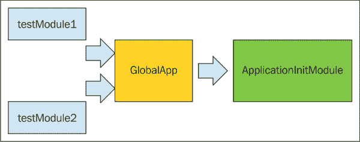

模块设计模式

现在我们已经回顾了上一章中的一些重要的 JavaScript OOP 概念，我们将利用其中讨论的一些技术来创建模块，并开始在应用程序中使用它们。

你可能熟悉**设计模式**这个术语，它本质上是一种将代码结构化为可重用解决方案的方法，用于解决常见的编程问题。在本章中，我们将专注于 JavaScript 中称为**模块模式**的特定设计模式。

我们将探讨如何使用此模式创建简单的模块，然后在接下来的章节中，我们将基于这些模块创建我们应用程序的模块。

模块模式是 JavaScript 中用于创建模块化应用程序最常用的模式之一。

本章我们将讨论以下主题：

+   模块模式的结构

+   模块模式中的内部私有作用域

+   如何创建简单的模块

+   如何创建模块工厂

# 第三章：模块模式

在上一章中，我们了解了如何在函数内部创建私有变量和命名空间。我们还探讨了如何实现私有作用域。与私有作用域相关的一些概念也可以应用于函数内部的**单例**对象。

单例对象是一个在应用程序中只会存在一个实例的对象。单例对象可以使用对象字面量表示法创建，我们已经在上一章中看到了一些例子。

考虑以下对象定义：

```js
var mySingletonObj = {};
```

虽然前面的对象没有做任何事情，但实际上它是一个有效的对象，并且由于我们不能基于`mySingletonObj`创建其他对象，因此这个对象只能有一个实例。

让我们给这个对象添加一些值属性和方法（方法属性），看看我们如何从对象定义外部访问这些属性：

```js
var mySingletonObj = {

  name: "Sasan",

  title: "Software Developer",

  getName: function(){

    return this.name;  
  },

  getTitle: function(){

    return this.title;  
  }

};
// displays "Sasan"
console.log(mySingletonObj.getName()); 

//  displays "Software Developer"
console.log(mySingletonObj.getTitle()); 
```

在上述对象定义中，我们创建了一个具有四个属性的单例对象。其中两个是值属性，两个是方法属性。

我们的方法属性可以访问我们的值属性，并返回它们的值。然而，我们也可以直接访问对象的属性，甚至可以从对象外部覆盖它们的值。

看看以下代码片段：

```js
mySingletonObj.name = "John";
console.log(mySingletonObj.name); // displays "John"
```

这表明，尽管我们的代码中存在封装（我在这里使用这个术语比较宽松），但我们没有访问控制权，外部代码可以更改我们对象中属性的值。有时，这是不希望的。

让我们重构我们的代码，使用模块模式创建一个简单的模块。这将帮助我们实现封装以及在我们的单例对象中实现访问控制。

考虑以下内容：

```js
var mySingletonObj = (function(){

    //private variables
    var name = "Sasan"; 
    var title = "Software Developer";

    //returning a Singleton
    return {

        // privileged method
        getName : function(){

            return name;
        },
        // privileged method
        getTitle: function(){

            return title;
        }            

    };

})();
```

在前面的代码中，我们创建了一个**立即执行函数表达式**（**IIFE**），并将其返回值（即单例对象）赋值给变量`mySingletonObj`。

返回的单例对象有两个方法可以访问容器函数的私有变量并返回相关的值。

如果我们尝试从返回的对象中访问函数变量目录，例如：

```js
console.log(mySingletonObj.name); // displays undefined
```

我们无法这样做。这是因为`name`属性是容器函数的私有属性，它不存在于返回的匿名对象上。

然而，我们可以通过特权的`getName`方法访问这个属性，该方法定义在我们 IIFE 返回的单例对象上。

由于`mySingletonObj`变量引用了这个单例对象，如果我们执行以下代码：

```js
console.log(mySingletonObj.getName()); // displays "Sasan"
```

我们能够访问分配给函数`name`属性的值。请注意，从 IIFE 返回的单例对象仍然可以访问包含它的匿名函数的上下文。这是可能的，因为我们在这里创建了一个闭包。当然，这里看到的函数的`title`属性也是如此：

```js
// displays "Software Developer"
console.log(mySingletonObj.getTitle());
```

这种将我们的代码结构化为从函数内部返回的单例对象提供对容器函数对象私有成员（内部私有作用域）访问的方法，是 JavaScript 中模块模式的基础。

## 模块模式中的内部私有作用域

模块模式使我们能够在函数内部为我们的代码创建一个私有作用域，同时通过接口提供对这样一个私有作用域的受控访问。这个接口可以是返回的单例对象的形式。

在上一节中的代码示例中，`mySingletonObj`是访问我们 IIFE 私有作用域的接口。

如果我们在`mySingletonObj`上添加另一个具有与包含函数属性相同标识符的属性会发生什么？

好吧，`mySingletonObj`就像任何其他对象一样，我们可以向它添加属性，而不管它是否包含对象的属性。然而，在这里要记住的重要事情是，在返回的接口上分配或修改这样的属性对包含返回对象的函数中封装的私有变量没有任何影响。

让我们修改我们之前的模块并深入探讨一下：

```js
var mySingletonObj = function() {
    //private variables
    var name = "Sasan";
    var title = "Software Developer";

    //returning a singleton
    return {
        name: 'Tom',

        // privileged method
        getOuterName: function() {
            return name;
        },

        // privileged method
        getInnerName: function() {
            return this.name;
        },

        // privileged method
        getTitle: function() {
            return title;
        }
    };
}();
```

如您所见，我们在 IIFE 返回的单例对象上添加了一个`name`属性，其标识符与函数对象上的`name`属性相同。我们还在我们的接口（IIFE 返回的单例对象）中用两个新方法替换了之前的一个方法。第一个方法`getOuterName`简单地返回`name`属性的值。

问题是，哪个`name`属性，函数的私有作用域中的那个，还是单例对象本身的`name`属性？

如果我们运行以下代码行：

```js
console.log(mySingletonObj.name); // displays "Tom"
```

我们可以看到返回的值是单例对象本身的范围中的值；因此，显示的是`Tom`。

然而，如果我们尝试使用接口上的方法属性访问相同的属性，将返回不同的值。请看以下代码片段：

```js
console.log(mySingletonObj.getOuterName()); // displays "Sasan"
```

如您所见，从这个方法返回的值是接口外部作用域中`name`属性的值，即容器函数的作用域。这可能会相当令人困惑。

如果意图是返回单例对象内部（接口）定义的`name`属性值，我们需要使用`this`关键字指定属性。

看看我们添加到模块中的第二个新方法：

```js
    getInnerName: function(){

        return this.name;
    }
```

在这种方法中，我们使用`this`关键字特别指定了`name`的上下文，它引用的是单例对象本身的上下文，而不是包含函数的上下文。因此，如果我们运行以下代码：

```js
console.log(mySingletonObj.getInnerName()); // displays "Tom"
```

返回的是单例对象上下文中`name`的值。这是一个需要记住的重要区别。

## 在模块模式中向接口添加属性

现在我们已经看到了当我们使用模块模式时内部私有作用域是如何起作用的，让我们看看如果我们向之前示例中返回的单例对象添加新的动态属性会发生什么。

考虑以下代码行：

```js
mySingletonObj.name = "Jack";
```

在这里，我们只是将一个新的属性动态地添加到我们的对象`mySingletonObj`中。这个属性恰好与对象上已经存在的属性具有相同的标识符。原始的`name`属性值会发生什么变化？

我们可以通过运行以下测试来找出答案：

```js
console.log(mySingletonObj.name); // displays "Jack"
console.log(mySingletonObj.getOuterName()); // displays "Sasan"
console.log(mySingletonObj.getInnerName()); // displays "Jack"
```

如您所见，无论我们直接访问属性还是使用单例的方法返回属性的值，都会显示单例对象属性的新值。

另一方面，正如预期的那样，容器函数上下文中属性的值没有发生变化，尽管我们的单例对象确实可以访问这个上下文。

记住，当我们使用 JavaScript 中的模块模式并从中返回单例对象（作为包含对象/函数的接口）时，有两个上下文在起作用。

首先，容器函数的内部私有作用域，我们的单例对象可以通过闭包访问。

第二个是单例对象本身的上下文，就像 JavaScript 中的任何其他对象一样。当您使用 JavaScript 中的模块模式设计模块时，理解这两个上下文之间的区别很重要。

另一个需要记住的重要点是，之前展示的代码结构（模式）允许我们在私有命名空间中定义属性时同时拥有对象封装和访问控制。在这种情况下，匿名函数创建了一个命名空间，该命名空间返回一个匿名对象，或者更准确地说，返回对匿名对象（单例对象）的引用作为接口。

这种方法变得非常有价值，因为我们现在可以确信没有任何外部代码能够有意或无意地更改我们命名空间中属性的值。这种结构提供了控制哪些属性可以被外部代码访问，哪些属性被隐藏在私有作用域中并受到保护。

## 对象工厂模块

我们可以设计我们的模块成为非常专业的代码块，执行非常具体的任务，同时保护它们的内部不受外部代码干扰。到目前为止，我们已经查看了一个用于创建模块的非常简单的模式。我们可以进一步发展这个模式，并设计一个创建对象实例、向这些实例添加属性，然后将它们返回给模块外部代码的模块。

考虑以下模块：

```js
var myCarFactoryModule = function() {

    var createdCars = [];

    function carFactory() {

        // could also use "var newCar = {}";  
        var newCar = new Object();

        newCar.type = arguments[0];
        newCar.color = arguments[1];
        newCar.gearType = arguments[2];
        newCar.cylinder = arguments[3];
        createdCars.push(newCar);
        return newCar;
    }
    return {

        // privileged method
        createCar: function(type, color, gearType, cylinder) {
            return carFactory(type, color, gearType, cylinder);
        },

        // privileged method
        getCarCount: function() {
            return createdCars.length;
        },

        // privileged method
        removeCar: function(index) {
            createdCars.splice(index, 1);
        }
    };
}();
```

如你所见，我们结合了两种模式：**对象工厂**模式和模块模式。

### 注意

**JavaScript 中的设计模式**

如果你不太熟悉设计模式，或者想要更熟悉 JavaScript 中的设计模式，我强烈推荐以下资源：

*《精通 JavaScript 设计模式》* 由 *Simon Timms* 著。

当我们的函数`myCarFactoryModule`被调用时，根据传入的参数，我们创建一个汽车实例，然后将其分配给一个数组，这个数组是所有创建的汽车实例的存储库。我们设计这个模块的方式是，模块外部的代码无法访问创建汽车的函数，也无法访问汽车存储库。

让我们使用以下代码进行测试：

```js
var myFirstCar = myCarFactoryModule.createCar("Sedan", "red", "automatic",4); // creates first instance of car

var mySecondCar = myCarFactoryModule.createCar("SUV", "Silver", "Standard",6); // creates second instance of car

console.log(myFirstCar.color); // displays "red"
console.log(mySecondCar.gearType); // displays "Standard"

var myTotalCars = myCarFactoryModule.getCarCount();
console.log(myTotalCars); //displays 2

myCarFactoryModule.removeCar(0); // removes the first care object

var myTotalCars = myCarFactoryModule.getCarCount();
console.log(myTotalCars); // displays 1
```

如你所见，外部代码可以调用我们的模块接口来创建汽车，也可以获取创建的汽车数量。如果需要，它还可以删除汽车。

在这个模块中有三个特权方法：`createCar`、`getCarCount`和`removeCar`。你可以将这些方法视为模块内部（对外界隐藏）和外部代码之间的桥梁，外部代码依赖于模块的内部来实现一些特定的任务。

特权方法（单例接口对象的成员）被暴露给外部代码，以便为需要其服务的任何人提供模块的功能。

这种设计有一个明显的优势。正如你可能已经注意到的，我们可以修改模块内部的代码，并添加额外的功能到模块中，而不会影响应用程序的其他部分如何与我们的模块交互。

只要我们不更改提供外部代码访问模块功能的特权方法的名字或功能，这就是真的。

同时，我们可以在模块的接口中添加新的特权方法，或者修改单例对象中当前特权方法的内部结构，而不会影响模块本身的内部代码。

这使得我们可以在模块的公开部分（模块的接口）和模块的私有内部之间有一个很好的关注点和责任分离。

# 在模块之间创建松耦合

在模块化设计中，应用程序通常由许多模块创建。为了使这些模块能够协同工作，我们需要在它们之间创建耦合，而无需模块之间紧密依赖。

让我们基于几个简单的模块创建一个应用程序，并让这些模块以松耦合的方式相互交互。当然，我们现在将保持这个应用程序非常简单。在后面的章节中，我们将利用这个应用程序中的概念，在此基础上构建我们的完全模块化应用程序生态系统。

我在这里做出一个安全的假设，即我们的未来应用程序将包含许多独立的模块，每个模块都负责执行一个非常具体的任务。

我们将首先创建我们的核心应用程序模块，并将其命名为`ApplicationInitModule`。通常，运行应用程序的第一步是处理应用程序的初始化任务。我们的`ApplicationInitModule`将被设计来执行这项任务。

在以下代码片段中，当`ApplicationInitModule`启动时，它将依次启动所有注册的模块及其初始化例程。这个过程将负责整个应用程序的初始化例程。

看看下面的代码，看看我们的应用程序是如何设计的：

```js
var ApplicationInitModule = function() {
    var registeredModules = [];

    return {
        registerModule: function(module) {
            registeredModules.push(module);
        },
        getAppModulesCount: function() {
            return registeredModules.length;
        },
        removeRegisteredModule: function(index) {
            registeredModules.splice(index, 1);
        },
        initializeAllModules: function() {
            for (var module in registeredModules) {
                registeredModules[module].initialize();
            }
        },
    };
}();

var GlobalApp = (function() {
    var registerModule = ApplicationInitModule.registerModule;
    return {
        registerModule: registerModule
    };
})();

var testModule1 = (function() {
    var self = {};
    var moduleName = "Module 1";

    self.initialize = function() {
        //displays "testmodule1 has been initialized!"
        console.log("testmodule1 has been initialized!");
        //displays "module name is: Module 1"
        console.log("module name is: " + moduleName);
    };

    (function() {
        GlobalApp.registerModule(self);
    })();

    return {
        initialize: self.initialize,
        getName: function() {
            return moduleName;
        }
    };
})();

var testModule2 = (function() {
    var moduleName = "Module 2";

    function initialize() {
        //displays "testmodule2 has been initialized!"
        console.log("testmodule2 has been initialized!");
    }
    return {
        initialize: initialize
    };
})();
GlobalApp.registerModule(testModule2);
```

正如你所见，在这个应用程序中发生了一些有趣的事情，但我们已经在本书中讨论了所有使用的技术。尽管如此，我仍将逐一解释每个模块的内部工作原理。

## 应用程序核心模块

代码首先定义`ApplicationInitModule`作为一个应用程序初始化模块。这个模块的目的是注册应用程序中所有可用的模块（将它们存储在数组中），然后在应用程序运行时初始化它们（一次一个）。

此模块还提供了一个接口，其中包含一些钩子，以便外部代码与之交互。正如你所见，有方法可以注册模块、获取应用程序中注册的所有模块的计数以进行初始化，以及从注册模块列表中删除模块；当然，还有一个方法可以初始化已注册到应用程序中的所有模块。

在这个模块中，我们使用 IIFE（立即执行函数表达式）返回一个对匿名单例对象的引用，这实际上是模块的接口。

我想要引起你注意的一个点是，这个模块的功能实际上是在其接口中定义的。然而，模块并不一定要以这种方式设计。你还可以看到，在前面的代码中展示的其他模块中，我没有使用这种方法。这样做是为了让你看到我们可以以各种方式实现模块模式。

## 应用程序中介模块

我们的 `GlobalApp` 模块也使用 IIFE 返回一个单例对象作为模块的接口。这个模块的整个目的就是作为 `testModule1`、`testModule2` 和我们的核心模块 `ApplicationInitModule` 之间的中介（抽象层）。

我们这样设计应用程序是为了能够在我们的核心模块和其他已注册模块之间创建松散耦合。正如你所见，`GlobalApp` 被设计成一个非常薄的层。

这薄薄的一层允许我们随心所欲地更改我们的核心模块（`ApplicationInitModule`），甚至可以更改其与外部世界的接口，而不会影响依赖于该模块功能的其他模块。

在我们的设计中，唯一直接依赖于 `ApplicationInitModule` 接口的模块是我们的 `GlobalApp` 模块。这意味着，如果 `ApplicationInitModule` 的接口有任何更改，我们只需要修改我们的薄中介层 `GlobalApp`。应用程序中的所有其他模块将不受影响，因为它们仍然使用 `GlobalApp` 提供的相同薄层接口。

你将在本书的未来章节中看到，这个薄层被称为 **沙盒**，我们将使用沙盒化的概念来隔离我们的应用程序模块/组件与我们的应用程序核心模块。我们还将使用相同的技巧来隔离模块/组件彼此之间。现在，只需尝试熟悉一下前面应用程序中展示的模块隔离（沙盒化）的一般概念。

## 应用程序非核心模块

在我们的应用程序实现中，我们创建了两个简单的模块，它们将自己注册到核心模块中，实际上除了向世界宣布它们已经被初始化之外，什么也不做。

让我们更详细地看看这些模块是如何实现的。

### `testModule1` 实现细节

在 `testModule1` 中，我们创建了一个名为 `self` 的空对象，该对象通过一个名为 `initialize` 的方法进行扩展。当我们的核心模块尝试初始化此模块时，将调用此方法。

此模块与核心模块的注册是通过一个内部 IIFE 实现的，该 IIFE 反过来调用我们的中介模块 `GlobalApp` 并传递对对象 `self` 的引用。这如下所示实现：

```js
(function(){

    GlobalApp.registerModule(self);        

})(); 
```

当然，`GlobalApp.registerModule` 方法实际上是核心模块的方法 `ApplicationInitModule.registerModule` 的引用。然而，`testModule1` 并不知道这一点，它只知道 `GlobalApp` 提供的接口，即 `GlobalApp.registerModule`。

我们还使用 IIFE 返回一个接口给这个模块，该接口可以通过 `testModule1` 变量访问。

注意，接口提供了两个属性。一个是模块的 `self.initialize` 方法的引用，另一个是 `getName`，它简单地返回封装和隐藏的 `moduleName` 变量的值。还要注意，`moduleName` 不是 `self` 对象上的属性。相反，它被实现为一个包含函数的属性。

### testModule2 实现

与 `testModule1` 相比，我们的 `testModule2` 实现略有不同。如代码所示，我们在模块内部简单地定义了一个名为 `initialize` 的函数，该函数通过模块返回的接口间接暴露给外部代码。

在我们的 `testModule2` 中，`moduleName` 变量完全被封装起来，因为接口上没有定义任何方法来提供对这个变量的访问。

此外，没有内部 IIFE 将模块注册到我们的核心模块 `ApplicationInitModule` 中，因此我们需要在模块定义之外进行调用以完成此任务，如下所示：

```js
GlobalApp.registerModule(testModule2);
```

注意，我们再次使用了我们的中介模块 `GlobalApp` 进行注册，并且我们没有直接在核心模块上调用相关方法。这允许我们仍然保持模块之间的松散耦合。

### 注意

**testModule2 中使用的模式**

我们实现 `testModule2` 的方式基于一种称为 **揭示模块模式** 的设计模式，其最简单的形式。这是一种非常流行的模块设计模式，但当然，实现模块的方式有很多种，正如我们之前所看到的。在接下来的章节中，我们还将看到更多实现模块的模式。为了更好地理解这种模式，请参考之前提到的 JavaScript 设计模式资源。

### 应用模块的自动初始化

到目前为止，我们已经看到我们的应用程序模块如何使用中介模块将自己注册到应用程序的核心模块中，而无需意识到核心模块的存在。

我们还注意到，模块之间的通信是通过模块提供给外界的接口完成的。只有这样的接口才能访问模块的内部和它们的内部私有作用域。

以下图表展示了我们的应用程序模块之间的关系，并提供了我们应用程序的整体视图：



让我们看看核心模块中负责调用所有注册模块初始化方法的方法。

记住，每个注册到核心模块的应用模块的引用都已添加到数组 `registeredModules` 中。这在上面的代码片段中显示：

```js
registerModule : function(module){

        registeredModules.push(module);
}
```

当我们在应用程序中调用 `initializeAllModules` 方法（在核心模块上）时，使用一个 `for` 循环来调用所有注册模块的 `initialize` 方法。具体做法如下：

```js
initializeAllModules: function(){

    for(var module in registeredModules){

        registeredModules[module].initialize();

    }
};
```

如您所见，`initializeAllModules`在调用时并不知道每个已注册模块的`initialize`方法做了什么。它只知道在注册的模块上调用`initialize`方法，并让模块自己处理其初始化任务。

当我们模块化我们的代码时，这是一个非常重要的观点。每个模块只处理特定于该模块设计的任务，其他模块对如何在模块中执行此类任务没有任何了解。

这意味着，当我们的核心模块在一个或多个模块上调用`initialize`方法时，它并不直接参与每个模块的初始化任务。

是时候运行测试，看看应用程序初始化是如何进行的了。考虑以下内容：

```js
// displays 
// "testmodule1 has been initialized!" 
// "module name is: Module 1"
// "testmodule2 has been initialized!" 
ApplicationInitModule.initializeAllModules();
```

当我们运行前面的代码时，我们可以看到我们的两个模块都报告它们已经成功初始化。

当然，我们已经以这种方式设计我们的应用程序，所有已注册的模块都确实有一个可访问的方法称为`initialize`。这允许我们使用一个数组和`for`循环来按顺序初始化它们。

## 模块初始化和设计考虑

在应用程序设计时，您决定模块应该如何初始化以及每个模块的初始化方法应该如何调用。重要的是，调用每个模块的初始化例程不应导致紧密耦合。

为了保持一致性以及便于维护，我通常将负责所有应用程序模块中初始化任务的函数命名为`initialize`或`init`。这允许我使用`for`循环按顺序调用所有已注册的模块，并要求模块相应地初始化自己。

请记住，只有在模块的接口（公共方法钩子）不更改其名称及其对外部代码的可访问性时，才能在模块之间创建松散耦合。

这意味着，例如，如果`testModule1`调用`GlobalApp.registerModule`方法来注册自身，它应该始终能够调用该方法进行注册。即使在`GlobalApp`对象内部如何进行注册的机制发生变化，这也应该是正确的。

在这里简单应用程序中看到的架构和设计为在应用程序模块之间创建松散耦合奠定了基础。这反过来又导致了对小型和大型应用程序都更加可扩展和可维护的实现。

您可以将模块接口视为模块之间的合同，这使得它们能够相互交互，而不管这些合同的内部实现细节如何。请注意，尽管应用程序中存在模块之间的合同，但它们之间没有直接的依赖关系。每个模块都可以自由决定如何实现其特定的功能来完成其设计要完成的任务。

只要模块提供了预期的功能和服务，情况就是如此。

这种方法将为我们的应用程序提供极大的灵活性和可扩展性。它允许我们以非常针对性和可管理的方式添加、删除和修改应用程序的各个部分，而不会影响应用程序的其他部分。

我们在这里讨论的基本架构概念是构成我们将在本书中构建的最终应用程序的构建块的概念。

# 摘要

在本章中，我们探讨了 JavaScript 中最受欢迎的设计模式之一：模块模式。

通过创建简单的模块，我们探讨了模块模式中内部私有作用域的各个方面，并看到了模块如何在不访问彼此私有作用域的受保护属性的情况下相互交互。

这种模式允许我们在对象和模块中创建封装和访问控制，同时为外部代码提供一个接口，以便利用为外部使用而实现的功能。

模块模式最重要的一个方面是它如何被用来为我们的整个应用程序创建模块化设计。这使我们能够在模块之间创建松散耦合，这些模块实际上是我们的应用程序的构建块。

在后面的章节中，我们将利用这种方法，逐步构建更复杂的模块，以创建一个健壮且易于维护的代码库，用于我们的应用程序。这些模块也可以根据需要轻松地在所有未来的应用程序中重用。
