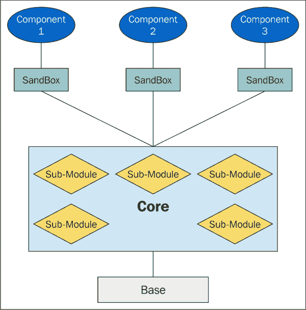
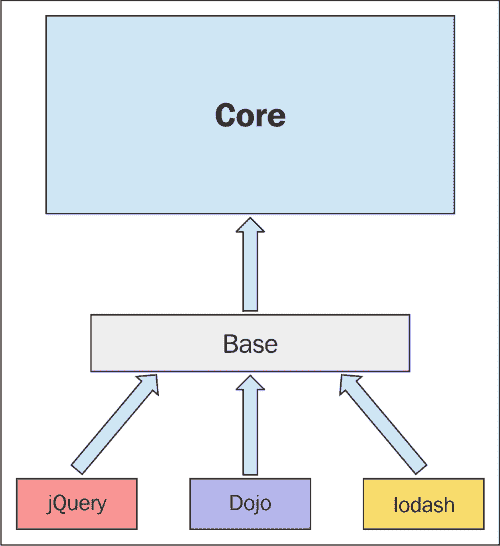
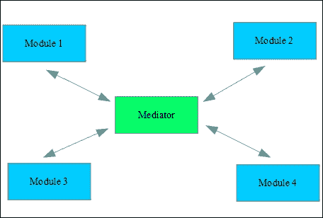
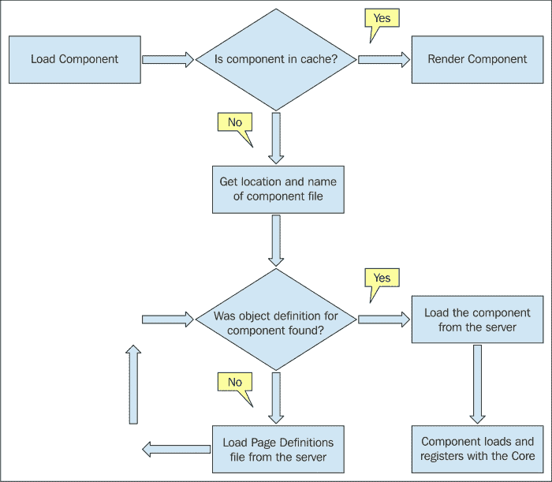
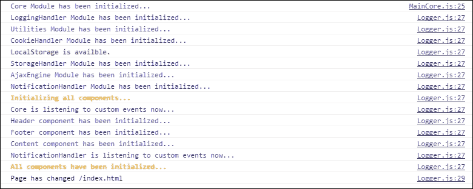
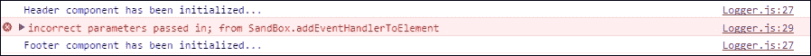
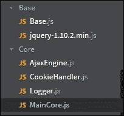

# 第七章：基础、沙盒和核心模块

到目前为止，在本章中，我们主要探讨了创建和增强模块的不同技术。然而，我们的焦点一直在于应用程序的较小部分。

在本章中，我们将从整体的角度审视我们的应用程序作为一个完整的运行体。我们将看到其各个部分如何组合在一起，以创建一个强大且灵活的生态系统，从而实现我们的最终目标，即一个可工作的**单页应用程序**（SPA）。

在阅读本章的不同部分时，请记住，应用程序的所有部分都旨在协同工作，同时仍然遵守模块化设计的可维护性和可扩展性原则。

在本章中，我们将涵盖：

+   基础模块及其设计

+   沙盒及其组件沙盒化的原则

+   核心和相关的模块

+   组件以及它们如何添加到应用程序中

+   在我们的应用程序中，即插即用、渐进增强和优雅降级

注意，我们不会深入到事物的编码方面，因为我真的希望您专注于应用程序的架构，而不是被实现的细节所分散注意力。因此，与本章相关的书籍没有项目代码。

我还应该提到，本章和下一章中讨论的架构设计概念是基于我在观看关于该主题的一次演讲后，由*Nicholas C. Zakas*最初介绍给我的设计原则。他是我的最爱作者和演讲者。虽然我们的实现将略有偏离他的，但我们的架构的精髓将保持与他提出的架构设计相似。

# 应用程序架构概述

为了为我们的应用程序创建一个真正模块化的设计，我们需要将其分解成更小的功能部分，这样每个部分都将专门负责非常具体的工作。这使我们能够实现关注点和责任分离的原则。

以下图表展示了我们整体的应用程序设计：



如您所见，我们的应用程序由四个主要部分组成：

+   基础

+   沙盒

+   核心

+   组件

同时，每个主要部分可能由其他更小的部分组成，这些部分被打包在一起以创建主要部分。

让我们从探索应用程序的每个主要部分并查看每个部分提供的具体功能开始。

在本书的用途中，从现在开始，当我提到**组件**时，我将指的是具有用户界面部分（视图）的模块，用户可以与之交互，例如头部组件。然而，当我提到**模块**时，我将指的是每个主要部分可能由其组成的具有功能性的模块，这些模块没有直接关联的视图。

随着我们继续前进，定义将变得更加清晰，但你可能决定在自己的项目中以不同的方式引用这些部分。这是可以的，只要它们背后的架构概念保持一致。

此外，时不时地，我会将我们的模块化设计架构称为**框架**，这应该被理解为将应用的所有各个部分作为一个整体一起考虑。

### 注意

**关于框架这个术语**

虽然我有时会使用框架这个术语，但我们的应用程序并不是为了创建通常所说的框架。至少不是在像**AngularJS**或**React**这样的框架中使用的意义上。

一般而言，我认为有时第三方框架被过度使用，虽然它们都提供了一些优点，但使用任何类型的第三方框架也都有一些缺点。

这本书的目的是向您展示您如何创建自己的架构设计，这样您就可以轻松地创建、组织和维护您的应用程序代码库，而无需第三方框架。

因此，我希望您将我们的实现视为一个架构设计概念，而不是一个框架。但如果您坚持，您可以将我们在这里设计和创建的内容称为**讽刺框架**。我说讽刺，因为它实际上并不是一个传统意义上的框架，因为它不强制使用特殊的语法或一系列规则和条例！

描述我们的实现的最佳方式可能是使用术语**客户端模块化设计**（**CMD**），因为这种架构方法的目标是为我们的应用程序创建一个坚实的基础和灵活的生态系统，而不是作为一个框架。

# 基础模块

我们将开始探索设计的基础模块。正如其名所示，基础模块为我们应用程序提供最低级别的功能。

这是我们导入并利用第三方库和工具的功能的地方。这些库可以包括 jQuery、Dojo、MooTools 等等。

主要思想是我们可以轻松使用这些库提供的功能，而无需在我们的应用程序和使用的库之间创建紧密的依赖关系。

例如，考虑一下我们需要如何检测浏览器兼容性，以便将事件附加到页面上的元素，如下所示：

```js
if (elem.addEventListener) {
    elem.addEventListener(event, callbackFunc);
} else if (elem.attachEvent) { // For IE 8 and earlier versions
    elem.attachEvent("on" + event, callbackFunc);
}
```

而我们本可以轻松地通过以下方式让 jQuery 处理这些复杂性：

```js
$(elem).on(event,callbackFunc);
```

在这里，我们让 jQuery 处理浏览器兼容性问题，我们可以专注于应用程序中其他更重要的事情。另一个例子是在 jQuery 存在时才给我们的元素添加动画。这种方法允许我们在代码中实现**渐进增强**和**优雅降级**技术。

我们也可以在我们的代码中同时使用这两种实现。这允许我们在 jQuery 没有正确加载时有一个回退方案。

因此，前面的代码可以写成以下形式：

```js
if($) {
    $(elem).on(event,callbackFunc);

} else {
    if (elem.addEventListener) {
        elem.addEventListener(event, callbackFunc);
    } else  if (elem.attachEvent) {    // For IE 8 and earlier versions
        elem.attachEvent("on" + event, callbackFunc);
    }
}   
```

大多数情况下，最好将低级功能，例如浏览器兼容性问题，留给第三方库，并专注于在我们自己的代码中提供针对我们应用程序的定制功能。

请记住，我们在这里讨论的是第三方库和实用程序包，而不是第三方框架，因为我们的架构目标之一是消除或至少最小化对第三方框架的需求。

## 将通用库添加到基础模块

正如所述，我们的基础模块加载并提供通用库给我们的应用程序核心模块。这意味着只有核心模块知道代码中使用了哪些基础库，以及这些库的哪些特定功能被利用。

根据基础模块的设计，库要么在应用程序启动时加载，要么在稍后的时间动态加载。基础模块将每个加载和初始化的库的引用传递给核心模块。

由于只有核心模块知道应用程序中使用了哪些库以及使用程度，如果我们决定更改第三方库或它们在应用程序中的使用方式，那么只有核心模块受到影响，其他部分不受影响。

这意味着我们应用程序的其他所有部分将继续按原样工作，无论第三方库的变化如何。以这种方式实现我们的应用程序最小化了替换或删除第三方库对整个应用程序的影响。

当我们导入和使用新库以添加更多功能到我们的应用程序时，这也同样适用。

在下一章中，我们将更详细地探讨如何使用基础模块将 jQuery 添加到我们应用程序的核心模块。

以下是我们应用程序的基础模块如何向核心模块提供第三方库的描述：



# 沙盒模块

当我们在日常生活中谈论沙盒时，我们通常脑海中浮现的是一个装满沙子的盒子，我们允许孩子们在那里玩耍，做他们喜欢的一切混乱——并且希望只是在那个盒子里。

在我们的模块化架构中，我们利用同样的概念，为我们的组件创造可以玩耍的空间，并使其与其他应用程序的其他部分隔离。

通过以这种方式沙盒化我们的模块，我们消除了应用程序组件与核心模块之间的紧密耦合。

沙盒本质上是一个抽象层，也是我们组件与其他应用程序其他部分之间的一层薄薄的接口。

由于沙盒模块被设计为接口，并提供组件与其他应用程序之间的通信，它被视为合同，因此它不应改变。这样，我们的组件可以确信它们始终可以依赖与应用程序的一致通信层以及核心模块提供的一定功能级别。

这并不是说我们不能向沙盒添加新方法或功能；只是我们不能改变已经存在的内容，并且我们的组件已经依赖于此。

## 沙盒模块功能

当我们的组件在应用程序中加载时，无论是启动时还是动态加载的任何时间，它们都会获得沙盒模块的一个实例。

沙盒模块为我们组件提供以下功能：

+   一致接口

+   安全

+   通信

+   过滤

沙盒模块提供的每个服务对我们实现的模块化方面都至关重要。

让我们更详细地探讨每个方面。

### 沙盒作为一致的接口

正如所述，当核心模块为每个注册的组件提供一个沙盒模块实例时。

此沙盒实例随后充当应用程序其余部分的接口，为组件提供应用程序级别的功能。

当组件需要特定功能时，它不一定需要自己实现。当该功能的实现已经在应用程序中可用时，这一点是正确的。

例如，为了将事件处理器绑定到元素上，每个组件不需要提供自己的实现。组件可以直接请求沙盒模块，然后沙盒模块会请求核心模块将特定的事件处理器绑定到页面上特定的元素。

当然，组件也不必担心与事件绑定相关的浏览器兼容性问题，因为处理这些问题是核心模块的工作。

由于沙盒实例对每个注册的组件都是相同的，我们可以确信沙盒代码中的任何更改都是同时提供给所有组件的。这意味着新功能的添加、错误修复和沙盒模块中的修改只进行一次，然后以统一和一致的方式传播到所有使用沙盒模块的组件。

注意，对沙盒模块的任何更改仍应遵守此模块与应用程序组件之间的先前合同。

### 沙盒作为安全层

我们应用程序中的组件只知道沙盒模块，并且不允许（或无法）直接与其他应用程序部分通信。

这意味着沙盒确保框架的保护区域不能通过其接口被组件访问。这使得我们能够在核心和其他应用模块的上下文中控制组件被允许执行的操作类型。

### 沙盒作为通信层

由于沙盒模块是一个薄薄的接口层，它为组件提供了核心模块的公开接口，因此它是组件与整个应用之间唯一的通信路径。

也是通过沙盒模块，组件可以在应用中订阅和发布自定义事件。

注意，对于组件来说，只与整个应用的其他部分保持一条通信路径是很重要的，这样我们才能保持模块化设计的完整性。如果一个组件能够直接与其他组件或应用的其它部分通信，那么它可能会与这些部分紧密耦合，而我们当然希望避免这种紧密耦合。

### 沙盒作为过滤器

沙盒的设计应该以这种方式进行，不仅能够提供我们想要向组件公开的核心模块的功能，而且还能对组件对核心模块的调用进行简单的错误检查。

例如，考虑以下情况：

```js
getElement : function(elementID){

    if(elementID && typeof elementID === "string"){
        return core.getElement(elementID);
    }else{
        core.log(3,"incorrect parameters passed in; from SandBox.getElement");
    }
}
```

上述方法已经通过沙盒模块提供给了我们的组件。这个方法进行简单的参数检查，以确保在沙盒模块请求核心模块执行工作之前，参数以及参数的正确类型已经被组件传递给它。

虽然核心模块可能有自己的错误检查，但在将核心模块卷入之前进行一些错误检查总是一个好主意。

## 实现多个沙盒模块实例

到目前为止，你可能想知道，为什么使用多个沙盒模块实例（每个组件一个）比所有组件使用同一个沙盒对象作为单例更好？

简短的回答是：更好的隔离和性能。我们将在接下来的章节中进一步探讨这个答案。

### 多个沙盒实例的优势

通常，一个模块通过一个单一的公共接口向外界提供其公开的功能。

然而，我们实现的沙盒模块是不同的。如前所述，我们创建了多个沙盒模块实例，更准确地说，每个组件一个实例。

以下总结了此设计背后的目标：

+   将沙盒实例相互隔离

+   为每个组件创建代码执行上下文

+   性能提升

#### 将沙盒实例相互隔离

在我们关于孩子在沙坑里玩耍的类比中，我提到这种隔离可以包含在盒子中可能产生的混乱。同样，我们希望任何沙盒模块实例可能造成的损害都被包含和隔离。

这意味着，如果我们的组件中有一个做了不希望做的事情，可能会在其沙盒实例中引起问题，这种混乱将被包含在该沙盒模块实例中。不利影响只会影响该组件的功能，而不会影响其他沙盒实例，或任何其他组件。

对于我们来说，设计我们的架构以最大限度地减少由组件问题引起的完全应用程序失败的可能性非常重要。

这至少允许我们的应用程序保持部分功能，这可能是比完全应用程序失败更可接受的结局。

例如，我们应用程序的页脚组件可能停止工作，但用户仍然可以查看我们的图像目录并将它们添加到收藏夹列表中。

#### 创建代码执行上下文

当创建沙盒模块时，它为它的组件设置一个上下文对象。组件可以在需要时使用这个上下文对象来轻松引用正确的执行上下文。如果我们看一个例子，这可能会更容易理解。

考虑以下来自我们应用程序的代码片段：

```js
handleMainContainerClicked: function (e) {

    if (e.target != e.currentTarget) {

        e.preventDefault();
        e.stopPropagation();

        if (e.target.tagName.toUpperCase() === 'IMG') {
            sandBox.contextObj.handleImageClick(e.target);

        } else if (e.target.tagName.toUpperCase() === 'A') {
            sandBox.contextObj.handelFavLinkClick(e.target);
        }

    }
}
```

上面的函数是在我们应用程序的内容组件中实现的。在这个函数内部，它是页面某些元素点击事件的处理程序，我们需要在内容组件中调用其他相关函数。

我们可以通过使用在组件首次初始化时设置在沙盒实例上的执行上下文来轻松做到这一点。

这是这样做的：

```js
sandBox.contextObj = this;
```

在代码片段中，`this` 指的是我们应用程序的内容组件。因此，当我们需要在内容组件的上下文中执行任何函数时，我们只需引用正确的上下文，如下所示：

```js
sandBox.contextObj.handelFavLinkClick(e.target);
```

如果你现在觉得这不太明白，不要担心。我将在下一章中进一步解释，届时我们将有机会查看它在代码中的完整实现。

目前，你需要记住的唯一一点是，我们可以使用每个沙盒模块的实例来保留它所属组件的引用。这使我们能够轻松访问该组件的执行上下文。

#### 性能改进

当我们为每个组件创建沙盒实例时，我们也把沙盒实例的引用分配给组件视图所在的 DOM 元素。这使得我们在该容器内进行 DOM 操作变得更加高效，因为我们不需要遍历整个 DOM 树来找到组件视图容器内的目标 DOM 元素。

看看下面的代码片段：

```js
getElementInContext : function(elementID){

    if(elementID && typeof elementID === "string"){
        return core.getChildOfParentByID(containerElemContext,elementID);

    }else{

        core.log(3,"incorrect parameters passed in; from SandBox.getElementInContext");
    }  

}
```

在这个片段中，我们正在尝试找到容器元素中的一个子元素，其中组件的视图已经被渲染。

当组件在核心中注册时，核心创建了一个沙盒实例，并返回一个包含沙盒实例的组件容器元素的引用。

例如，在我们应用的头部组件创建后，所有与头部相关的 DOM 元素都位于一个承载它们的 main div 元素容器内。头部组件的沙盒实例持有这个 div 容器的引用。

当头部组件需要访问与其视图相关的任何 DOM 元素时，它只需在其容器 div 元素内部查找所需的元素，而不是遍历整个 DOM 树来找到该元素。

这使得查找所需元素变得更快，因为我们不需要在整个 DOM 中搜索它。

如果你对此不完全清楚，我们将在下一章中再次介绍，当我们更深入地检查代码时。

现在，只需注意沙盒实例使我们能够快速直接地访问组件渲染的 DOM 元素，这反过来又允许进行与组件相关的更多优化的 DOM 操作任务。

# 核心模块

核心模块实际上是我们的应用程序的大脑。它是应用程序的重负载工作发生的地方，真正的魔法在这里发生。

核心模块负责实现应用级别的业务逻辑，并在组件需要相互通信时提供组件之间的桥梁。当然，同时保持应用的松耦合特性。

核心模块还利用了由基础模块加载的第三方库提供的功能，以创建一个功能一致的应用程序。

如果你熟悉名为**模块-视图-控制器**（**MVC**）的架构设计模式，那么在我们应用中的核心模块就是这个设计模式中的控制器部分。

我们可以将核心模块的作用总结如下：

+   作为应用程序的控制器

+   在模块化组件之间提供通信桥梁

+   初始化和销毁组件

+   实现组件的即插即用能力

+   提供集中处理错误的方法

+   提供应用级别的可扩展性

+   利用第三方库的功能

我们将很快检查所有这些方面，但在这样做之前，让我们谈谈在我们的应用中核心是如何构建的。

## 核心模块构建方法

建设核心模块有不同的方法，但其中最好的方法之一是以模块化的方式构建它。

我们可以通过构建一个主要的核心模块并使用诸如松散和紧密增强等技术来增强它来开始实现，这些技术我们已经在本书中介绍过。然而，通过子模块将大部分功能添加到核心模块中，可以更好地分离代码中的逻辑。

在本书主要应用的实现中，我们将使用上述所有技术来构建我们的核心模块。

下一章将深入探讨核心模块的实现，但到目前为止，我们将看看与其实现相关的一些事情。

考虑以下内容：

```js
var ImagesInc_Core = (function(Core){

    var $ = Core.jQuery;
    var insertHTMLTxt = function(containerID,newStructure){
        var containerElem;
        if(typeof containerID === 'string'){

            containerElem = Core.getElement(containerID);
        }else if(typeof containerID === 'object'){

            containerElem = containerID;        
        }    
        Core.setInnerHTML(containerElem,newStructure);
    };
...

return Core;

})(ImagesInc_Core); // using tight augmentation
```

在前面的代码中，我们使用紧密增强向核心模块添加与 DOM 相关的功能。我们也可以通过附加一个子模块来向核心模块添加功能，如下所示：

```js
// using simple sub-module augmentation
ImagesInc_Core.LoggingHandler = (function(){

    var self = {}, messageParam, colorParam;

    self.logMessage = function(severity, message,color) {    
        // if no severity number was possed in, then give the message and warn the user
        if(typeof severity === 'string'){
            message = severity;
            severity = 2;
        }

...

return {
        logMessage: self.logMessage,
        initialize: self.initialize
    };

})();
```

正如你所见，我们通过附加一个自包含的子模块来增强核心模块，这个子模块被添加为核心模块对象的新属性。

使用子模块增强核心模块，类似于使用乐高积木构建一个玩具屋，因为单独的积木被连接在一起以创建整个结构。

这意味着不仅应用程序的主要部分（如组件和沙盒）作为模块构建，而且核心模块本身也是基于较小的模块构建的。

这使我们能够轻松扩展我们的核心模块，同时提供移除或替换每个子模块的能力，而不会影响核心模块的其他部分。

当我们在下一章深入查看内部结构时，我们将更详细地检查核心模块的这种模块化实现。看看以下图片，以了解我们最终应用程序中核心模块的所有部分。这张图片描述了核心模块由独立的自包含子模块组成：


当然，在部署时，我们可以将这些文件（子模块）合并并压缩成一个文件，但在开发过程中，这种子模块的分离提供了一个很好的核心模块各个部分的视觉表示。

现在我们已经对核心模块的构建有了很好的概述，让我们来检查这个模块为我们提供的功能。

### 核心模块功能

核心模块在我们的应用程序中扮演着不同的关键角色，并为所有其他模块提供基本服务。重要的是要注意，尽管核心模块本身由许多部分组成，但在提供以下功能时，它作为一个统一和紧密的整体发挥作用。

## 作为控制器

核心模块为应用中的所有组件提供应用级别的功能。例如，事件绑定和解除绑定发生在核心模块中，组件只需要请求核心处理这些任务即可。

考虑以下代码片段：

```js
if(elem.addEventListener) {
    elem.addEventListener(event, callbackFunc);
    } else if(elem.attachEvent) {                  
        // For IE 8 and earlier versions
            elem.attachEvent("on" + event, callbackFunc);
    }
}
```

此代码在核心模块中实现，应用程序中的所有组件都通过其沙盒模块的实例调用此方法来将事件处理器绑定到元素上。

另一个例子可以是当组件需要向服务器发起一个**AJAX**调用时。这是核心模块，它会代替组件向服务器发起调用，并将结果返回给组件，或者根据返回的结果采取行动，例如在 AJAX 调用失败时记录错误。

我们还可以提及与应用程序相关的**cookie**和**本地存储**功能，作为核心提供给所有注册组件的其他应用程序级功能之一。

请记住，实现应该设计成组件特定的功能，只有组件关心，应该在组件级别发生，而应用程序级的功能应该在核心模块中实现。

在某种程度上，每个组件在其组件级别实现了自己的 MVC 或 MV*设计，这与应用程序级实现是分开的。这一点将在我们查看下一章的实现代码时变得更加清晰。

## 提供通信桥梁

如您所忆，我们模块化架构的主要目标之一是提供组件之间的松散耦合。这意味着我们应用程序中的任何组件都不知道任何其他组件，也不依赖于任何其他组件。

然而，有时组件需要相互通信，或者一个组件中的事件或动作应该导致另一个组件发生变化，而组件之间却没有任何了解。

为了提供这样的功能，核心实现了一个观察者模式的变体，称为**中介者模式**。

使用中介者模式，我们应用程序的组件可以通过抽象层注册和发布事件。

以下是如何实现中介者模式的描述：



我们应用程序的核心模块充当中介者，它使组件（模块）能够订阅和发布事件，而无需了解彼此，从而仍然遵循组件和模块之间松散耦合的原则。

考虑以下代码片段：

```js
sandBox.publishCustomEvent({
      type: 'support-Clicked',
      data: "support"
});
```

在这里，我们应用程序的页脚组件通过其沙盒模块的实例发布了一个自定义事件，`support-Clicked`。除此之外，它并不知道应用程序的其他部分可能正在监听此事件，以及它们将根据此事件采取什么行动。

另一方面，以下代码片段显示我们的`NotificationHandler`模块正在监听此事件，并在事件发布时采取行动，如下所示：

```js
ImagesInc_Core.registerForCustomEvents("Notification",{
        'support-Clicked':this.handleSupportClick
}
```

如果组件已注册特定事件，核心模块负责通知所有已注册的组件和模块已发生某个事件。

## 初始化和销毁组件

在我们的架构设计中，我们可以在应用程序的启动阶段以及任何时间之后加载和卸载组件（模块）。

这相当稳健，因为它允许我们在需要时加载所需的内容，这有助于将设备上的资源消耗保持在最低，同时保持应用程序非常轻便和响应。这对于移动设备尤为重要。

当组件被加载（无论是应用程序启动还是其他任何时间）时，它首先将自己注册到核心模块，然后核心模块在需要初始化时调用组件的`init`方法。

请考虑以下代码片段，看看这是如何完成的：

```js
ImagesInc_Core.registerComponent("footerContainer", "footer", function(sandBox){

    return {

        init: function(){
            try{
                sandBox.updateElement("footerContainer", ImagesInc_GlobalData.getFooterHTMLTxt());
                this.registerForEvents();
                sandBox.contextObj = this;
                sandBox.logMessage(1,'Footer component has been initialized...', 'blue');

            }catch(e){
                sandBox.logMessage(3,'Footer component has NOT been initialized correctly --> ' + e.message);
            }
 }, 
```

如前所述代码所示，每个组件在加载时都会调用核心模块的`registerComponent`方法。请注意，核心模块对其他应用程序组件被称为`ImagesInc_Core`。

组件将其容器（例如`footerContainer`）的 ID 以及它自己的 ID（在前面代码中显示为`footer`）作为参数发送到核心模块的`registerComponent`方法。

它还发送一个引用到核心模块需要调用的函数，以创建组件的实例。然后，核心模块使用沙盒模块的实例调用此函数，沙盒模块是组件用于从此点开始与应用程序交互的接口。

这是核心模块中组件注册的方式：

```js
mainCore.registerComponent = function(containerID, componentID, createFunc){
...
if(createFunc && typeof createFunc === 'function'){
    componentObj = createFunc(new SandBox(this,containerElem, componentID));
    if (componentObj.init && typeof componentObj.init === 'function' && componentObj.destroy && typeof componentObj.destroy === 'function') {

        componentObj.id = componentID;
        registeredComponents.push(componentObj); 
    }
...
};
```

如您所见，核心模块首先检查组件是否具有所需的方法，即`init`和`destroy`，如果是这样，则调用组件上的创建函数（`createFunc`）以创建组件的实例。

你可以将这个阶段视为组件与核心模块之间的握手阶段，以及组件与应用程序整体的握手。

如前所述，组件还需要有一个销毁方法，这允许核心模块禁用组件以处理事件，或者完全从应用程序中移除组件。

在应用程序的启动阶段，核心模块遍历所有已注册的组件，并在它们上调用`init`方法，如下所示：

```js
for(var i=0; i < registeredComponents.length; i++){

  registeredComponents[i].init();
}
```

我们使用类似的方法来销毁（移除）应用程序中注册的所有组件，如下所示：

```js
for(var i=lastIndex; i >= 0 ; i--){

     registeredComponents[i].destroy(removeFromDom);
}
```

我们将在下一章中查看这些操作的细节，并将更详细地检查代码。这里的要点是核心模块处理应用程序中所有组件的初始化和销毁，无论是作为一个集合还是个别处理。

## 提供即插即用功能

正如我们之前提到的，组件可以在浏览器加载应用程序的任何时候被加载和添加到应用程序中。

让我们看看组件是如何动态加载的，以及它是如何成为应用程序的一部分的。

组件的动态加载是通过利用一种机制来完成的，该机制首先检查组件是否已经加载到缓存中，如果没有，则在本地存储或`PageDefinitions.js`文件中查找其对象定义，然后随后加载它。

`PageDefinitions.js` 是一个文件，它保存了所有可以在应用程序中动态加载的组件的对象定义（作为 JavaScript 对象），除了启动阶段以外的任何时间。

如果我们愿意，我们也可以在这个文件中保存与任何组件相关的资源（资产）信息。一般来说，这个文件主要用于查找我们的动态资产的位置。

例如，在我们的应用程序中，我们将保留与“收藏”页面及其`CSS`文件位置相关的信息在`PageDefinitions.js`中。当用户导航到该页面时，内容组件将使用这些信息。

请看以下图表，以了解我们应用程序中动态组件加载机制的概述：



如流程图所示，当需要将组件动态渲染到应用程序中时，核心模块会检查组件对象是否已经存在于缓存中。

如果组件对象已经存在于缓存中，那么除了渲染其视图之外，就没有其他需要做的事情了。

另一方面，如果组件对象不存在，核心模块首先会在本地存储中查找组件的对象定义。这个对象定义有一个属性，它保存了组件的 JavaScript 文件在服务器上的位置（路径）。

注意，我们正在使用本地存储作为此类对象定义的主要存储设施，而不是将它们保存在缓存中。这纯粹是为了使应用程序在浏览器中的占用空间尽可能小。如果有很多对象定义，使用本地存储尤为重要，因为这些定义可能会变得相当大，并消耗相当多的内存。

诚然，在我们的应用程序中，我们没有真正使用本地存储的需要，因为我们只有一个动态加载的组件。但我使用本地存储来向您展示，如果您决定在未来应用程序中使用这种机制，它将如何被利用。

重要的是，当核心找到组件文件的地址时，它将向服务器请求组件的`.js`（以及可能的`.css`）文件。

一旦加载并解析了组件所需的`.js`文件，组件就会将自己注册到核心模块，并且，就像应用程序中的任何其他组件一样，它会被赋予一个沙盒模块的实例。

如您所想象，这种方法为我们提供了一种非常稳健的方式来动态加载和激活应用程序的组件，这本质上包括了应用程序的即插即用功能。

该机制比这里所解释的要复杂一些，但这个简短的描述应该能提供一个关于幕后工作原理的良好概述。在下一章中，我们将更详细地探讨这个机制的实现，我相信在那个章节中所有细节都会对您更加清晰。

## 提供集中处理错误的方法

核心模块实现了一种集中记录所有类型消息的方法。这使应用程序模块和组件免于自己实现此类功能。它还提供了所有组件都可以以统一方式利用的日志记录机制增强功能。

注意，我们可能对日志记录机制进行的任何未来增强都将在一个地方完成，并且将同时提供给所有模块。

例如，假设我们希望将应用程序中的所有错误消息都记录在服务器上。这可能意味着对于每个错误，客户端都需要向服务器发起一个带有相关信息的 AJAX 调用。

如果每个模块都想自己完成这项任务，我们就必须为每个模块单独实现这样的功能。当然，一次性实现这种功能，然后以统一的方式提供给所有应用程序模块，这样做更有意义。

请查看以下截图，它显示了在调试模式下应用程序消息在 Chrome 调试工具中的记录情况：



如您所见，当应用程序加载时，所有模块以及应用程序中的所有组件都会被初始化，并且会显示相关的消息。

所有组件需要做的只是调用沙盒模块并传递消息，然后沙盒模块会依次将消息发送到核心模块。对于其他核心模块，它们可以直接使用核心模块的日志记录机制。

这里有一个代码片段，展示了页脚组件如何使用核心模块的日志记录机制记录其初始化消息：

```js
sandBox.logMessage(1,'Footer component has been initialized...', 'blue');
```

要记录错误消息，页脚组件只需执行以下操作：

```js
sandBox.logMessage(3,'Footer component has NOT been initialized correctly --> ' + e.message);
```

这比页脚组件实现自己的错误处理机制要简单得多。

如果我们决定将所有错误消息发送到服务器，模块仍然会调用沙盒模块，然后是核心模块。将负责将错误消息发送到服务器的将是核心模块。

以下代码片段展示了如何一个核心子模块向核心模块发送其初始化消息。这与组件记录消息的方式类似，但有一个区别。

```js
ImagesInc_Core.log(1,"Utilities Module has been initialized...", "blue");
```

区别在于子模块直接将其消息发送到核心模块，而不是通过沙盒模块实例。这当然是因为子模块是核心模块的一部分，并且没有沙盒模块的实例。

此外，沙盒模块本身也使用核心模块提供的相同日志设施来记录其错误，如下所示：

```js
Core.log(3,"incorrect parameters passed in; from SandBox.getElement ");
```

以下图像显示了错误消息在调试器中的显示方式：



在下一章中，我们将更深入地探讨我们的应用程序中日志机制是如何实现的，以及它是如何设计成核心模块的子模块的。

## 提供应用程序级别的可扩展性

从一开始，我们就基于模块化架构设计我们的应用程序。我们的模块化架构提供的一个优点是，在需要时可以轻松扩展我们应用程序的功能和能力。

正如你所见，我们使用各种技术增强了应用程序的功能，例如松散增强、紧密增强和子模块。

虽然我们的应用程序可能提供了相当多的功能，但合理地假设未来还需要更多的功能和能力。

例如，假设我们的一个或多个未来组件需要进行表单字段验证。通过扩展核心模块并提供功能给我们的组件，可以轻松地将此功能添加到我们的应用程序中。

核心模块可以通过导入基础模块中的验证库或自行实现功能来提供表单字段验证。然后，通过沙盒模块将此新功能提供给所有已注册的组件，所有组件都可以根据需要使用它。

事实上，我们的组件甚至不知道谁提供了这项新功能以及它是如何幕后工作的。他们需要知道的是，这项功能对他们来说是可用的，并且他们可以使用它来完成他们的验证任务。

能够提供应用程序级别的可扩展性是我们模块化设计的关键特性之一，也是核心模块负责的最重要任务之一。

## 利用第三方库

我们之前简要地讨论了核心模块的这项职责。正如所述，核心模块被设计成从基础模块请求第三方库。这些库被核心模块用于为应用程序的其他部分提供应用程序级别的功能。

这样的库导入通常发生在应用程序启动时间，但并不一定如此。

正如你在本章前面所看到的，我们的应用程序确实具有从服务器动态加载文件的能力。完全有可能在应用程序运行期间，基于某些应用程序需求或用户与应用程序的交互，我们需要动态地加载第三方库。

大多数时候，当第三方库对于应用程序的大部分功能不是必需的时候，我们会使用第三方库的动态加载。这允许我们保持应用程序的足迹小，这在移动设备上是一个重要的考虑因素。

在本书的应用程序中，我们并不使用这种第三方库的动态加载。然而，如果在未来的某个时刻你决定利用这一功能，代码中已经提供了所有相关的钩子。

让我们看看核心模块是如何使用基础模块将 jQuery 库导入到我们的应用程序中的。

考虑以下内容：

```js
(function Core_initialize(){

        mainCore.debug = true;

        try{
            // get jQuery from the base module loader
            mainCore.jQuery = $ = ImagesInc_Base.getBaseModule();

        }catch(e){

            if(mainCore.debug){
                console.error('Base Module has not been defined!!!' );    
            };
        };

        if(mainCore.debug){
            console.log("%c Core Module has been initialized...", "color:blue");
        };

})();
```

在前面的代码片段中，在应用程序的启动阶段，我们的核心模块（核心模块的`MainCore`模块）向基础模块请求 jQuery。

这就像下面这样：

```js
mainCore.jQuery = $ = ImagesInc_Base.getBaseModule();
```

注意，我们已经在这个调用中包裹了 try/catch 语句，以捕获在此操作过程中可能发生的任何错误。

让我们也看看基础模块是如何为 jQuery 提供对核心模块的引用的。

```js
if(typeof jQuery !== 'undefined'){
    return jQuery;
}else{
    return null;
}
```

如你所见，由于 jQuery 在应用程序中以全局对象的形式加载，基础模块只是将这个全局对象的引用返回给核心模块。从那时起，jQuery 就被核心模块作为子模块来提供应用程序级别的功能。

以下代码片段展示了如何在应用程序中使用 jQuery 来提供所需的功能：

```js
var ImagesInc_Core = (function(Core){
    var $ = Core.jQuery;
    Core.makeAjaxCall = function(url, theQuery, method, handler){

        if($ && Core.jQueryAjaxEngine && Core.jQueryAjaxEngine.makeAjaxCall){
            Core.jQueryAjaxEngine.makeAjaxCall(url, theQuery, method, handler);

        }else{        
            Core.log(3, "Cannot make Ajax call!; from makeAjaxCall")
        }
    };
…
})(ImagesInc_Core); // using tight augmentation
```

同样地，其他第三方库也可以在启动阶段加载到应用程序中，以增强我们的应用程序功能。

注意，其他模块或组件都不了解第三方库或它们是如何被利用的。只有核心模块了解这些库，并且它是唯一一个向其他应用程序模块和组件提供第三方库功能的模块。

以下图像显示了第三方库可以放置在我们的应用程序文件夹结构中的位置：



# 组件

我们应用程序设计的最后一部分与组件相关。在本节中，我们将介绍组件是如何构建并集成到我们的应用程序中的。

记住，我们将组件视为具有视图的应用程序的一部分。通过视图，我指的是与 HTML 元素相关联的部分，这些元素在浏览器中渲染，并且用户可以直接与之交互。

组件可以像覆盖框那样简单。这样的简单组件可以作为另一个组件的一部分渲染，或者作为独立的组件本身渲染。

大多数时候，我们的组件是具有自己的 MVC 或 MV* 架构的独立模块，它们附加到应用程序上，并使用应用程序为它们提供的设施和功能。

在我们的设计中，我们创建了三个主要组件和一个名为 `NotificationWidget` 的小部件。这个小部件也是一个组件，但它根据用户与另一个组件的交互来加载和查看。在我们的应用程序中，当用户点击页脚组件中的 **支持** 链接时，`NotificationWidget` 被启动。由于这个小部件也可能由其他组件启动，因此我将其标记为小部件，但实际上，它也是一个具有自己的 MV* 实现的组件。

组件可以在其控制器中实现非常复杂的业务逻辑，或者具有非常简单的控制器，功能非常有限。

在我们的应用程序中，内容组件是一个具有相当复杂的控制器逻辑的组件的例子，而页脚则是一个相对简单的控制器组件。

还要记住，组件与应用程序其余部分之间的唯一桥梁或连接点是通过当组件将自己注册到核心时传递给它的一个沙盒实例。

我们之前讨论了在我们的架构中，组件可以在应用程序启动阶段加载，或者在任何时候动态加载。在我们的实现中，页眉、页脚和内容组件在启动阶段加载，而 `NotificationWidget` 在需要时动态加载。

让我们看看我们的一些较简单的组件之一，即页脚，看看它是如何实现的。

## 组件所需的方法

在我们的设计中，每个组件都需要实现两个必需的方法，以便注册并连接到核心模块和应用程序的其余部分。

这两个必需的方法被称为 `init` 和 `destroy` 方法。`init` 方法由核心模块调用以启动组件的初始化。另一方面，`destroy` 方法由核心模块调用，以禁用或完全从应用程序中移除组件。

考虑以下实现：

```js
init: function(){
            try{
                sandBox.updateElement("footerContainer", ImagesInc_GlobalData.getFooterHTMLTxt());
                this.registerForEvents();
                sandBox.contextObj = this;
                sandBox.logMessage(1,'Footer component has been initialized...', 'blue');

            }catch(e){
                sandBox.logMessage(3,'Footer component has NOT been initialized correctly --> ' + e.message);
            }
}, 

        destroy: function(removeComponent){

            sandBox.contextObj.unregisterFromEvents();
            sandBox.unregisterAllCustomEvents();

            if(removeComponent){
                sandBox.removeComponent("footerContainer");
            }
            sandBox.logMessage(1,'Footer component has been destroyed...', "blue");
        }
```

正如你所见，在页脚组件的`init`方法中，用于视图的必需 HTML 字符串是从`GlobalData`对象中获取的。这个对象是一个应用级对象（应用模型），它包含应用级数据。然后，HTML 字符串通过沙盒模块实例传递给核心模块。

注意，核心模块负责在页面上渲染 HTML 元素，在这种情况下是页脚的视图。

这是在`init`方法的以下代码行中完成的：

```js
sandBox.updateElement("footerContainer", ImagesInc_GlobalData.getFooterHTMLTxt());
```

对于这个特定的组件，我们在该方法中调用视图的渲染。然而，渲染并不总是需要在组件的`init`方法中完成。例如，对于`NotificationWidget`组件，渲染是在稍后的时间由应用调用另一个方法来完成的。因此，`NotificationWidget`的`init`方法保持非常简单，如下所示：

```js
init: function(){
            try{                               
                sandBox.contextObj = this;
                sandBox.logMessage(1,'Notification Widget component has been initialized...', 'blue');

            }catch(e){
                sandBox.logMessage(3,'Notification Widget has NOT been initialized correctly --> ' + e.message);
            }
 }
```

## 将事件绑定到组件元素

在页脚组件的`init`方法中，我们还为其视图相关的 HTML 元素注册了事件处理。这是通过调用组件的`registerForEvents`方法来完成的。在`registerForEvents`方法中，相关的事件处理程序被绑定到`support`链接上，如下所示：

```js
registerForEvents : function(){
            …...................
            sandBox.addEventHandlerToElement("support","click", this.handleSupportClick);    

}
```

正如你所见，实际的事件绑定是在核心模块中完成的。

我之前提到，我们的组件通过使用中介者模式通过自定义事件与应用的其他部分松散耦合。让我们快速看一下这一点。

考虑以下代码片段：

```js
handleSupportClick : function(e){

            sandBox.publishCustomEvent({
                type: 'support-Clicked',
                data: "support"
            });

            e.preventDefault();
            e.stopPropagation();
}
```

正如你所见，当点击**支持**链接时，页脚组件会发布一个自定义事件。然后，所有注册了这个自定义事件的、应用中的其他部分将通过核心模块被通知这个事件已经发生。我们将在下一章中更详细地讨论这个机制。

## 组件设计考虑因素

在本章中，我们没有对组件的实现细节进行过于深入的考察，因为我们在下一章将更详细地探讨它们。然而，我希望你考虑一下组件的一些概念性方面。

首先，所有组件与应用都是松散耦合的。它们与整个应用之间的唯一联系是通过在注册阶段传递给它们的沙盒实例。

其次，所有组件都负责实现它们自己的控制器。其他应用部分不涉及特定于单个组件的功能。

应用程序整体的任务，特别是核心模块的任务，是创建一个健壮的生态系统，其中组件可以利用已经实现的应用程序级别的功能。因此，组件不需要自己实现此类功能。这种方法使我们能够创建一个统一且松散耦合的应用程序，可以轻松维护和扩展以满足需求。

注意，每个组件都是应用程序的一个自包含部分，核心或应用程序的任何其他部分都不会意识到，也不依赖于组件的内部实现。这意味着组件可以自由决定自己的实现。

以这种方式，我们可以在整个应用程序的各个部分之间创建一个良好的关注点和责任分离级别。

当一个组件需要修改 DOM 时，它应该通过利用核心模块提供的功能来完成。因此，组件不需要自己实现此功能。此外，通过使用核心模块，我们能够防止应用程序的其他部分意外地在同一 DOM 元素级别上造成冲突，从而防止碰撞和应用级别问题。

在大多数情况下，合适的做法是组件只通过核心模块修改它们自己的容器中的 DOM 元素（而不是超出那个范围）。

# 应用程序架构考虑事项

让我们回顾一下本章中关于我们模块化架构的重要观点，并看看它们如何与我们的应用程序的各个部分相关，如下所示：

+   所有第三方库都通过基础模块导入到应用程序中

+   核心模块和基础模块是唯一知道已加载第三方库的应用程序部分

+   所有浏览器兼容性问题都通过利用第三方库的功能在核心模块中处理

+   应用程序中的每个组件都会获得一个沙盒模块的实例

+   沙盒只知道核心，不知道应用程序的其他部分

+   应用程序的各个部分之间不知道其他部分的内部实现

+   可以在不影响整个应用程序的情况下向应用程序中添加、修改或删除组件

+   组件只能调用它们自己的方法和通过它们的沙盒模块实例提供的它们的方法

+   组件无法访问其自身容器之外的 DOM 元素

+   组件不应创建全局对象

+   每个模块和组件只执行有限的任务，并且只与其自身功能直接相关的事情

+   应用程序中的所有组件都与应用程序的其他部分松散耦合

+   组件只能通过发布-订阅模型（中介者模式）和它们的沙盒实例与其他组件和应用程序的其他部分进行通信，从而保持松散耦合架构

+   每个组件对应用的理解非常有限，这是通过在组件注册阶段分配给它的沙盒模块实例实现的

以下可以被认为是模块化架构为我们提供的优势：

+   一旦模块化架构生态系统被开发出来，它可以用于许多应用；因此，我们可以一次编码，多次使用

+   应用中的每一部分都可以单独进行测试

+   应用中的每一部分都可以由不同的人以模块化的方式实现

+   第三方外部依赖可以通过核心模块进行控制和管理工作

+   模块和组件可以被替换、修改或删除，而不会影响整个应用

+   组件和模块可以在应用启动阶段之后根据需要动态加载

我希望您将上述观点视为本章的重要收获，并在我们深入探讨下一章中应用实现时牢记在心。

# 摘要

正如本章开头所提到的，我们对与我们的应用模块化实现相关的架构概念有了很好的概述。

我们讨论了应用的主要组成部分，并看到了它们如何组合在一起形成一个统一的生态系统。

我们还考察了各个组件在整体应用设计中的具体角色，并研究了我们如何在模块和组件之间创建良好的职责和关注点分离。

我们关注的一个重要方面是将我们的各种应用组件松散地耦合在一起，这既便于维护，也便于未来的扩展。

虽然本章展示了部分应用代码，但我们并没有深入分析代码和应用实现。这正是我们将在下一章中涵盖的内容，我们将更详细地了解幕后是如何操作的。
