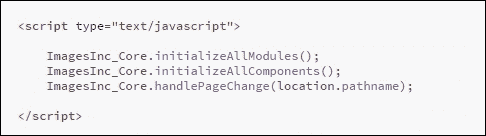
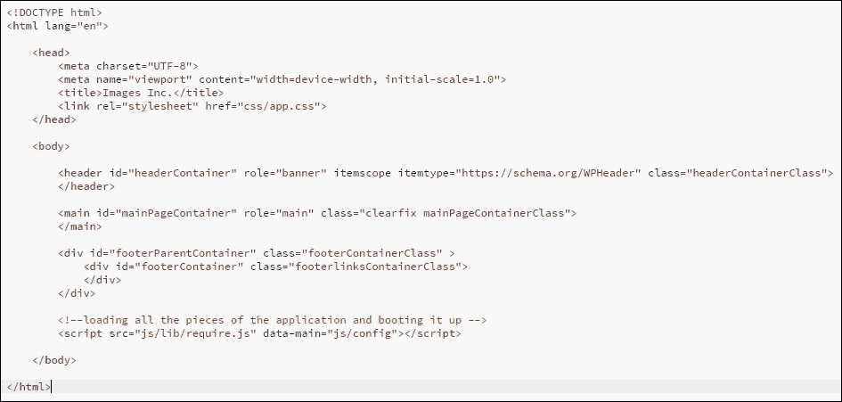
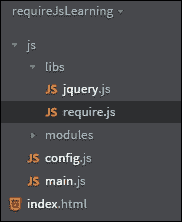
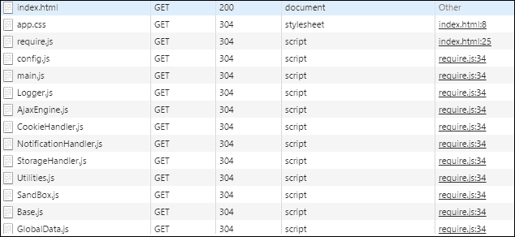

# 第十章。企业级模块化设计，AMD，CommonJS 和 ES6 模块

在本书的最后一章，我们将主要关注重构一些应用模块，以便我们能够以更稳健的方式加载和管理它们。

本章的标题提到了企业级，但实际上我们可以使用这里讨论的原则来应用于任何大小和类型的应用。在接下来的几节中，我将向您介绍创建和加载模块的各种方法，并讨论每种方法可能更适合的环境。您还将看到我们如何以更结构化的方式管理模块依赖。

请记住，本章仅作为此类技术的介绍，但希望它能激发您进一步研究的兴趣。

我相信在看到它们的益处后，您会在未来的项目中考虑这些模块化设计实现。

本章我们将涵盖的一些主题包括：

+   为什么我们需要更好的模块加载设置

+   AMD 模块格式及其使用方法

+   创建 AMD 模块的工具

+   CommonJS 模块格式

+   ECMAScript 6 模块

# 重新审视 index.html 文件

如果你还记得，在第八章中，我提到我们在`index.html`文件中使用了相当多的`<script>`标签来加载我们的应用模块。

为了刷新您的记忆，以下是我们之前的情况：


虽然这个实现是有效的，但它并不非常可扩展，因为对于每个模块文件，我们都需要在我们的页面上添加一个`<script>`标签。此外，通过查看正在加载的文件列表，我们无法确定每个模块或组件如何依赖于应用的其他部分（或多个部分）。

我们还必须在页面底部创建另一个`<script>`标签，以便启动应用，如下所示：



如果我们能消除在`index.html`中需要所有`<script>`标签和启动序列的需求，那就太好了。此外，实现一个能够指示和管理我们模块依赖的机制将非常有用。

好吧，我们很快就会实现所有这些。

以下截图展示了新方法将如何清理我们的`index.html`文件，并为我们提供更稳健的脚本加载能力：



如您所见，页面已经大大缩短，现在在`index.html`中只加载了一个 JavaScript 文件。这个文件是`require.js`，其`data-main`属性设置为`js/config`，如下所示：

```js
<script  src="img/require.js" data-main="js/config"></script>
```

只需加载此脚本，我们就可以加载所有模块和组件，并启动应用。

我们将很快查看这个魔法是如何发生的，但在这样做之前，我们需要谈谈**AMD**模块。

# 介绍异步模块定义

**异步模块定义**（**AMD**）格式是针对在浏览器中使用 JavaScript 创建模块的。这个格式提出了一种特定的模块定义方式，以便模块及其依赖项可以异步加载到浏览器中。

当创建和消费 AMD 模块时，你需要使用两个关键方法，这些是`define`和`require`方法。

理念是我们使用全局的`define`方法创建一个模块，然后我们可以使用全局的`require`方法在其他代码部分（其他模块）中导入该模块。

## 使用 AMD 格式定义模块

下面是如何在 AMD 格式中定义模块的示例：

```js
define('moduleOneId', ['dependency'], function(dependency) {

    return {
        sayHi: function(){
            console.log('Hi there!')
        }
    }
});
```

在前面的代码中，我们向全局的`define`方法传递了三个参数，这个方法是由 AMD 兼容的模块加载器提供的。

第一个参数`moduleOneId`是一个可选参数，它为模块分配一个 ID。大多数情况下，我们不使用这个参数，除了某些边缘情况或当使用非 AMD 的代码打包工具时，我们将其留空。

`define`函数的第二个参数是一个依赖项数组，它告诉 AMD 模块加载器在执行回调函数之前需要加载哪些模块（文件）。当然，传递给`define`方法的第三个参数是回调函数。

注意，我们从这个回调函数中返回一个对象。这个对象是我们正在定义的模块。在 AMD 格式中，回调函数也可以返回构造函数和函数。

## 导入 AMD 模块

要使用前面代码中定义的模块，我们可以通过使用全局的`require`函数来导入它。

考虑以下内容：

```js
require(['moduleOneId'], function(moduleOne){
    moduleOne.sayHi();
});
```

这里，我们要求 AMD 模块加载器在执行回调函数之前加载依赖项`moduleOneId`。

注意，我们也可以使用依赖项的路径而不是使用相关的 ID。例如，我们可以将前面的代码片段写成如下所示：

```js
require(['folderPath/moduleOne.js'], function(moduleOne){
    moduleOne.sayHi();
});
```

AMD 格式在定义和加载我们的模块方面提供了极大的灵活性。它还消除了创建全局变量来定义模块的需求。如果需要，AMD 兼容的脚本加载器通常还提供懒加载我们的模块的能力。

有许多支持 AMD 格式的 Web 开发工具（库），但最受欢迎的是`RequireJS`和`curl.js`。

在本章的应用程序中，我们将使用`RequireJS`创建我们的 AMD 模块并加载它们的依赖项。

### 注意

对于 JavaScript 模块及其相关格式的深入讨论，我鼓励您访问 Addy Osmani 在[`addyosmani.com/writing-modular-js/`](https://addyosmani.com/writing-modular-js/)上的一篇优秀的文章。

## 介绍 RequireJS

如前所述，浏览器中最受欢迎的 AMD 模块加载器之一是 **RequireJS**。在本节中，我们将学习如何使用这个工具创建和加载模块。

您也可以使用其相关优化器 `r.js` 在服务器端运行 RequireJS。优化器可以将所有我们的 AMD 模块打包到一个文件中，然后浏览器只需向服务器发出一个请求即可加载所有必要的模块。在这种情况下，当模块在服务器上打包时，使用 AMD 格式来管理模块之间的依赖关系。

或者，如果您正在使用服务器构建设置来处理客户端文件，您可能希望考虑使用 `almond.js` 来打包您的 AMD 模块。这是一个更小的库，但它没有 RequireJS 的动态加载功能。有关 `almond.js` 的更多信息，请访问以下网址：[`github.com/requirejs/almond/`](https://github.com/requirejs/almond/)。

由于我们项目中没有使用构建系统，因此在本章中，我将仅介绍如何使用 `RequireJS` 为浏览器服务。

### 下载 RequireJS

您可以从以下位置下载这个库：[`requirejs.org/docs/download.html#requirejs`](http://requirejs.org/docs/download.html#requirejs)。

您可以直接复制工具的压缩版本，并将其保存到您选择的文件位置。

## 创建和加载 AMD 模块的测试项目

为了帮助您更熟悉 RequireJS，我在本章相关的源代码中包含了一个名为 **requireJsLearning** 的附加项目。我鼓励您下载这个项目，并随着我们继续讨论 AMD 和 RequireJS 而跟随操作。

在 `requireJsLearning` 项目中，我已经将 RequireJS 库（`require.js`）保存在 `libs` 文件夹中，如下所示：



让我们在项目中创建一些简单的模块，并看看我们如何使用 RequireJS 加载和管理它们。

### 创建一个简单的 AMD 模块

我们首先在 `modules` 文件夹下的 `person.js` 文件中创建一个简单的 AMD 模块。

考虑以下：

```js
define(['modules/stuff', 'jquery'], function(stuff, jq) {
    console.log(jq + "  --> Accessing jQuery from person");
    return {
        first: "Sam",
        last: "SamLastName",
        favorites: stuff.likes.join(' ')
    }
});
```

在前面的代码中，我们使用了 RequireJS 为我们提供的全局 `define` 方法，并向它传递了两个参数。第一个参数是一个包含两个值的数组。这个数组中的第一个值是另一个模块的路径，它是我们的 `person` 模块的依赖项。

注意，我们使用的是文件名，但没有 `.js` 扩展名。这是因为 RequireJS 默认假设扩展名为 `.js`。

我们依赖数组中的第二个值是 **jQuery**。在这里我们没有指定 jQuery 的路径，因为它被用作全局变量。

### 注意

**jQuery 和 AMD 格式**

截至 1.7 版本，jQuery 支持 AMD 格式。但是，为了正确地将其作为 AMD 模块加载，我们只能将其放置在与我们的 `config.js` 文件相同的位置。由于我们希望将所有第三方库放在我们项目的 `libs` 文件夹下，我们需要进行一些配置。我们很快就会谈到这一点。

传递给 `define` 方法的第二个参数是在我们的 `person` 模块的依赖项加载后执行的回调函数。

如前述代码所示，这个回调函数接收两个参数，它们与为 `person` 模块定义的依赖列表一一对应。

我们还从这个回调函数中返回一个对象，即我们的 `person` 模块，它可以被其他模块消费。

### 消费我们的 person AMD 模块

由于 `person` 模块被创建为 AMD 模块，我们可以在其他模块中仅指定其路径作为依赖项来消费它。

看看我们的 `main` 模块（在 `main.js` 中）如何要求和使用 `person` 模块，如下所示：

```js
// bootstrap file
require(['modules/person', 'jquery', 'person2'], function(person, $$, person2){

    console.log("Accessing Person --> person first + person last; from main -> " + person.first + ' ' + person.last);	
    console.log($$ + "  --> jquery from main");	
    console.log("Accessing person2 --> person2.first ; from main -> " + person2.first)
});
```

现在您应该对前面的语法更加熟悉了。我们正在告诉 RequireJS（使用 `require` 方法）加载依赖数组（`require` 方法的第一个参数）中列出的所有依赖项，然后将它们作为参数传递给回调函数。

RequireJS 将依次对服务器进行异步调用（每个模块一个调用）以下载所有依赖项。

### 加载依赖项的依赖项

注意到我们的 `main` 模块已将 `person` 模块列为依赖项。然而，`person` 模块本身也将 `stuff` 模块列为依赖项：

```js
define(['modules/stuff', 'jquery'], function(stuff, jq) {
...
}
```

因此，存在一个需要解决的依赖链。当 RequireJS 查找 `main` 模块的依赖列表并看到 `person` 作为依赖项时，它会进一步查看 `person` 是否有自身的依赖项。如果有，它将首先加载这些依赖项。之后，`person` 模块被加载并传递给 `main` 模块。

我们可以这样思考这个链：

加载 `stuff` 模块 | 将其传递给 `person` 模块 | 加载 `person` 模块 | 然后将 `person` 模块传递给 `main` 模块。

这是对 RequireJS 如何根据依赖列表管理依赖项并按正确顺序加载模块的非常简化的看法。

### 注意

**一个微小但重要的点**

在前面的解释中，我提到了根据依赖列表的顺序加载模块。事实上，这些模块可以以不同的物理顺序加载，但需要记住的重要一点是，依赖列表中列出的所有模块都会被加载，并且它们中的代码会在调用 `callback` 函数之前执行。

### 加载和消费非 AMD 模块

我们还需要一种方法来加载项目中非 AMD 模块或非模块文件，RequireJS 提供了钩子来完成这项工作。

它还有许多插件，使我们能够加载 CSS 和文本文件，并提供许多其他功能。

在我们的 **requireJsLearning** 项目中，有三个模块（文件）没有使用 AMD 模块格式。这些是 `person2`、`person3` 和 `person4`。为了让 RequireJS 加载这样的模块并使它们可供其他模块使用，我们需要提供一些配置设置。

如果你查看我们项目中的 `config.js` 文件，你会看到以下代码：

```js
require.config({
    deps: ['main'],
    paths: {
    //'jquery' : 'libs/jquery'// if loading from local directory
        'person2': 'modules/person2', // location to none AMD modules
        'person3': 'modules/person3',
        'person4': 'modules/person4',
        'jquery': "https://code.jquery.com/jquery-1.12.3.min" // loading from CDN
    },
    shim: {
        "person2": {
            "exports": "person2"
                // use this alias in the global scope and pass it to modules as dependency
        },
        "person3": {
            deps: ['person4'],
            // none AMD module, depending on another non AMD module
            "exports": "person3"
        }
    }
});
```

这里，我们正在将一个配置对象传递给 RequireJS 的 `require.config` 方法。这个对象的第一属性将 `main` 定义为一个依赖项（`deps: ['main']`）。记住，`main` 模块是启动我们应用程序的模块，但在 `index.html` 文件中，我们告诉 RequireJS 使用 `data-main` 属性加载 `config.js`，如下所示：

```js
<script  src="img/require.js" data-main="js/config"></script>
```

当 RequireJS 加载 `config.js` 文件时，配置对象被传递给 `require.config` 方法。然后，RequireJS 确定它需要加载 `main.js`（通过查看此对象上的 `deps: ['main']` 属性）。当然，反过来，通过查看 `main` 模块的依赖项列表，RequireJS 也会加载 `main` 模块的所有依赖项。

### 在配置对象中设置路径

在传递给 `require.config` 方法的配置对象中设置的下一个属性是 `paths` 属性。这个属性本身是一个对象，我们在这里定义了依赖项的路径。例如，请看以下片段：

```js
'person2': 'modules/person2'
```

在这里，我们告诉 RequireJS，当它需要加载 `person2` 时，可以在 `modules/person2.js` 文件中找到它。记住，在这个属性中，我们不需要提供文件的扩展名。

### 为非 AMD 模块创建 shims

在传递给 `require.config` 方法的对象中，我们定义的下一个属性是 `shim` 属性。

`shim` 属性也是一个对象，用于为非 AMD 模块提供配置设置。

例如，请看以下代码片段中我们如何配置 `person3` 模块：

```js
"person3": {
            deps: ['person4'],
            // none AMD module, depending on another non AMD module
            "exports": "person3"
}
```

我们告诉 RequireJS，当你想将 `person3` 模块作为依赖项加载时，首先需要加载 `person4`（使用 `deps` 属性），然后让消费模块使用关键字 `person3` 声明此模块作为依赖项。

考虑以下代码片段中 `stuff` 模块如何声明和消费 `person3` 作为依赖项：

```js
define(['person3'], function(person3) {
    console.log(person3.first +
        "  --> Accessing person3.first from stuff");
    return {
        likes: ['Car', 'Bike', 'Scooter']
    };
});
```

这样，我们可以异步加载和消费非 AMD 模块，这要归功于 RequireJS。

为了确认一切按预期工作并且所有依赖项都已正确解决，我们可以在浏览器中加载 `index.html`。然后，我们应该在调试工具控制台看到以下消息（我使用的是 Chrome 浏览器）：


我鼓励你查看与此项目相关的代码（`requireJsLearning`）并使用它来了解如何使用 RequireJS 创建、加载和消费模块。

关于这个优秀的库以及它提供的许多不同选项的更深入信息，请访问 [`requirejs.org/`](http://requirejs.org/)。

我希望这已经是一个关于 AMD 模块格式和 RequireJS 的良好介绍了。现在，让我们利用本节学到的知识，重构我们的主应用程序，以 AMD 方式加载我们的模块。

## 重构 Images Inc.应用程序以使用 AMD 格式

为了利用 RequireJS 为我们提供的功能，我们将采取两种不同的方法。首先，我们将把 Core 模块中的所有子模块都转换为 AMD 模块。

第二，我们将把应用程序中的所有其他文件，包括应用程序的组件，作为非 AMD 模块加载。这两种方法将为我们提供一个实际练习，以将我们对 RequireJS 和 AMD 模块的知识付诸实践。

### 将核心子模块修改为 AMD 模块

在本节中，我们将查看`ImagesInc_Core.LoggingHandler`子模块，并了解我们如何将其转换为 AMD 模块。应用程序中的所有其他子模块也可以按照相同的方法转换为 AMD 模块。

考虑在我们的应用程序中如何实现`ImagesInc_Core.LoggingHandler`子模块：

```js
ImagesInc_Core.LoggingHandler = (function(){
...

return {

        logMessage: self.logMessage,
        initialize: self.initialize
    };
})();
```

我们之前使用 IIFE（立即执行函数表达式）来返回一个对象，作为`ImagesInc_Core`全局对象（即我们的 MainCore 模块）的一个属性。这个返回的对象是我们 IIFE 命名空间内代码的接口。

要将此子模块转换为 AMD 模块，我们只需将原本在 IIFE 内部的代码转移到由 RequireJS 提供的`define`方法中。

考虑以下代码片段：

```js
define(['MainCore'], function(ImagesInc_Core){
...
    return ImagesInc_Core.LoggingHandler = {

        logMessage: self.logMessage,
        initialize: self.initialize
    }
}
```

注意，我们仍然从回调函数中返回一个对象，并且也将它分配给`ImagesInc_Core`对象的`LoggingHandler`属性。

这种方法使我们能够轻松地将我们的非 AMD 子模块转换为 AMD 模块，改动非常小。这主要是因为，从一开始，我们的架构就被设计为基于模块的架构。现在，多亏了 RequireJS，我们能够异步加载我们的子模块文件，而无需将它们作为`<script>`标签添加到我们的`index.html`文件中。

### 使用 RequireJS 加载我们的非 AMD 模块

我们将加载应用程序中的其余文件，包括 MainCore，作为非 AMD 模块。

你可能后来决定，你希望将这些模块也转换为 AMD 模块。我鼓励你这样做，因为这将是一个有价值的练习。然而，我的目标在这里是向你展示 AMD 和非 AMD 模块可以如何和谐地一起工作，而不会遇到太多麻烦。

如前所述，为了使用 RequireJS 加载非 AMD 模块，我们需要在应用程序的`config`文件的`shim`属性中定义它们。

记住，我们在`index.html`中加载`config.js`文件，如下所示：

```js
<script src="img/require.js" data-main="js/config"></script>
```

`config.js`文件反过来将导致加载我们的`main.js`文件（因为它已被定义为`config.js`文件的依赖项），这完成了我们应用程序的引导。

是时候更仔细地查看我们应用程序的`config.js`文件了。

### 设置应用程序的`config.js`文件

我们应用程序的`config.js`文件由三个主要属性组成；`deps`属性，它定义了`config`文件的依赖项；`paths`属性，它将所有依赖项映射到它们的物理文件位置，以及`shim`属性，它用于定义我们应用程序中的非 AMD 模块。

查看下面的代码片段中的`config`文件：

```js
require.config({
    deps: ['main'],
    paths:{
        'MainCore' : 'Modules/Core/MainCore',
        'Logger': 'Modules/Core/Logger',
        'AjaxEngine': 'Modules/Core/AjaxEngine',
        'CookieHandler': 'Modules/Core/CookieHandler',
        'NotificationHandler': 'Modules/Core/NotificationHandler',
        'StorageHandler': 'Modules/Core/StorageHandler',
        'Utilities': 'Modules/Core/Utilities',
        'SandBox' : 'Modules/SandBox/SandBox',
        'ImagesInc_Content': 'Components/ImagesInc_Content',
        'ImagesInc_Footer': 'Components/ImagesInc_Footer',
        'ImagesInc_Header': 'Components/ImagesInc_Header',
        'AppTester': 'Modules/AppTester/AppTester',
        'CookieHandlerTester': 'Modules/AppTester/CookieHandlerTester',
        'StorageHandlerTester': 'Modules/AppTester/StorageHandlerTester',
        'Base': 'Modules/Base/Base',
        'jquery': 'Modules/Base/jquery-1.10.2.min',
        'GlobalData_Sub': 'Modules/GlobalData/GlobalData_Sub',
        'GlobalData': 'Modules/GlobalData/GlobalData'	
    },

    shim:{

        'Base':{
            exports : 'Base'
        },

        'jquery':{
            exports : 'jquery' 

        },
...

});
```

我想现在你已经非常熟悉我们在文件中为应用程序设置的配置项类型了。基于这个配置，RequireJS 现在可以异步且按正确顺序加载我们的模块和文件。

这种实现使我们能够有一个组织良好、易于维护和可扩展的解决方案来加载我们的模块，而无需在`index.html`文件中列出所有模块。

### 使用 RequireJS 启动我们的应用程序

我们的`main`模块是负责启动我们应用程序的模块。

查看以下代码片段，看看这个模块是如何实现的：

```js
// Application bootstrap file
var modulesToLoad = ['MainCore','Logger','AjaxEngine', 'CookieHandler', 'NotificationHandler', 'StorageHandler','Utilities','ImagesInc_Content','ImagesInc_Footer', 'ImagesInc_Header','SandBox', 'AppTester', 'CookieHandlerTester',
  'StorageHandlerTester', 'Base', 'jquery', 'GlobalData_Sub', 'GlobalData'];

require(modulesToLoad, function(ImagesInc_Core, Logger,AjaxEngine, CookieHandler, NotificationHandler, StorageHandler, Utilities, ImagesInc_Content, ImagesInc_Footer, ImagesInc_Header, SandBox, Base, jquery, GlobalData_Sub, GlobalData){
    //register StorageHandler with MainCore
    ImagesInc_Core.StorageHandler.register = (function(){
    ImagesInc_Core.registerModule(ImagesInc_Core.StorageHandler);      
    })();

    //add error handling to all methods of StorageHandler, in case localStorage not available
    if(ImagesInc_Core.Utilitizes){
    ImagesInc_Core.Utilitizes.addLocalStorageCheck(ImagesInc_Core.StorageHandler);
    }
    ImagesInc_Core.initializeAllModules();
    ImagesInc_Core.initializeAllComponents();
    ImagesInc_Core.handlePageChange(location.pathname);
});
```

如你所见，我们已经将我们应用程序的所有依赖项列在一个数组中。然后，我们使用了`require`方法来加载它们，并将它们传递给回调函数。

在这个回调函数内部，我们执行启动应用程序所需的代码。

如果你查看浏览器调试工具的**网络**标签页（我使用 Chrome），你会看到 RequireJS 如何加载我们应用程序所需的模块和文件，如下面的截图所示：



如你所见，模块化架构可以帮助我们轻松地管理我们的应用程序组件及其相关依赖项。我建议你花些时间探索如何在你的应用程序中利用 AMD 模块的完整功能。

# CommonJS

与 AMD 格式一样，CommonJS（也称为 CJS）是另一种定义 JavaScript 模块的格式，这些模块可以作为对象提供给任何依赖代码。与可以定义构造函数和函数的 AMD 模块不同，CJS 模块只能定义对象。

与采用浏览器优先方法的 AMD 格式不同，CommonJS 采用服务器优先方法。它还涵盖了更广泛的与服务器相关的问题，例如 io、文件系统等。

许多开发者（我也是其中之一）使用 AMD 格式针对浏览器模块，使用 CommonJS 针对服务器端模块。然而，你也可以为浏览器模块使用 CJS 格式。

支持 CJS 在浏览器中的某些工具包括：

+   **curl.js**: [`github.com/unscriptable/curl`](http://github.com/unscriptable/curl)

+   **SproutCore**: [`sproutcore.com`](http://sproutcore.com)

让我们看看一个简单的例子，看看我们如何实现一个 CJS 格式的模块。

## 实现一个 CommonJS 模块

假设我们有一个名为`moduleOne.js`的文件。在这个文件内部，我们可以这样导出一个 CJS 模块：

```js
exports.someFunc = function(){

    return console.log("I am some function");
}
```

在这里，`exports`是一个全局变量，包含模块提供给希望消费它的其他模块的对象。

另一方面，想象一下我们还有一个模块位于`moduleTwo.js`文件中，它与`moduleOne.js`位于同一目录下。

`moduleTwo`可以导入`moduleOne`并按如下方式消费它：

```js
var firstModule = require('./moduleOne');
firstModule.someFunc();

exports.someApp = function(){
    return firstModule.someFunc();
}
exports.someOtherApp = function(){
    return console.log("I am some other app");
}
```

正如你所见，在这个模块中，我们使用 CJS 的`require`方法导入第一个模块（`someFunc`），然后我们可以使用它作为`firstModule.someFunc()`。

在`moduleTwo.js`中，我们还导出另一个名为`someApp`的模块，该模块可以被应用程序中的其他模块消费。请注意，在前面的例子中，我们实际上是从同一个文件导出了多个模块。

注意，与 AMD 格式中看到的不同，我们没有使用`define`方法来包装我们的模块，并从回调函数返回一个对象。

CJS 语法与 ECMAScript 6 定义模块的方式相似，我们将在下一节中探讨这一点。

关于 CJS 模块的更多信息，请参考以下在线资源：[`www.commonjs.org/`](http://www.commonjs.org/)。

# ECMAScript 6 模块

在 JavaScript 的新版本中，**ECMAScript 6**（也称为**ES6**）引入了原生模块。以下是一些这些模块最重要的方面：

+   模块代码总是自动在严格模式下运行

+   在模块顶层创建的变量不会被添加到全局作用域

+   一个模块必须导出任何应该对外部代码可用的东西

+   一个模块可以导入绑定（从其他模块导出的东西）

ES6 中模块的主要思想是让你完全控制模块内部对外部代码的访问权限，以及模块内部代码的执行时机。

让我们看看一个简单的 ES6 模块的例子。

## 定义一个 ES6 模块

我们可以定义一个 ES6 模块，要么在`.js`文件内部，要么在我们的`.html`页面中的`<script>`标签内部。

考虑以下代码片段，来自一个假想的`simpleModule.js`文件：

```js
var name = "Tom";
// export function
export function sayHello(name) {
    alert("Hello " + name);
}
function sayName(){
	alert('My name is: ' + name);
}
function sayBye(name) {
    alert("Bye " + name);
}
export sayBye;
```

在前面的模块中，我们定义了三个函数以及一个模块变量。请注意，虽然变量`name`不在函数内部，但其作用域仍然局限于模块。这意味着模块外部代码无法访问它。

我们还使用了关键字`export`使我们的两个函数对模块的潜在消费者可用。正如你所见，我们可以在函数声明中使用`export`，就像`sayHello`函数的情况，或者作为引用，就像`sayBye`函数的情况。

要创建一个嵌入到`.html`文件中的模块，我们可以使用以下语法：

```js
<script type="module">
    var modulePrivateVar = 2
    alert("The value in the module is: " + modulePrivateVar);
</script>
```

注意我们已经指定了脚本的`type`为`module`，这导致浏览器将`<script>`标签内的代码视为 ES6 模块。

## 消费一个 ES6 模块

当 ES6 模块的外部代码需要访问模块暴露的内容时，需要使用绑定。

考虑我们如何获取第一个模块`simpleModule`所暴露的两个函数的访问权限，如下所示：

```js
import { sayHello, sayBye } from "simpleModule.js";	
sayHello();
sayBye();
sayName(); // error, sayName was not exported
```

如所示，我们需要使用关键字`import`在模块的外部代码和模块导出的函数之间创建绑定。

此外，请注意，由于`sayName`没有被模块导出，我们无法访问它。

## 浏览器中 ES6 模块的加载顺序

当浏览器遇到以下标签时，浏览器中的 ES6 模块总是立即加载：

```js
<script type="module" src="img/simpleModule.js">
```

然而，模块中的代码在文档完全解析之前不会执行。

模块也是按照它们出现的顺序执行的。这意味着在我们的先前的例子中，如果我们按以下顺序列出我们的模块：

```js
<script type="module" src="img/simpleModule.js">
<script type="module">
    var modulePrivateVar = 2	
    alert("The value in the module is: " + modulePrivateVar);
</script>
```

在`simpleModule.js`中的代码会在我们嵌入模块的代码之前执行。

由于模块也可以有自己的依赖项，它使用`import`语句（绑定）来定义，因此每个模块在执行其代码之前都会被完全解析。这是为了正确解决依赖项。

这意味着，如果浏览器在已下载的模块中遇到一个导入语句，它将首先下载依赖项，然后再执行该模块中的代码。这确保了在模块中的任何代码执行之前，所有模块及其依赖项都已加载。

ES6 模块的内容远不止我们在这里所涵盖的，因为这只是一个非常简短的介绍。我鼓励你自己进一步研究这个主题。网上有很多好的资源可以参考，我强烈推荐以下网站获取更多信息：

+   [`leanpub.com/understandinges6`](https://leanpub.com/understandinges6)

+   [`hacks.mozilla.org/2015/08/es6-in-depth-modules/`](https://hacks.mozilla.org/2015/08/es6-in-depth-modules/)

+   [`developer.mozilla.org/en/docs/web/javascript/reference/statements/import`](https://developer.mozilla.org/en/docs/web/javascript/reference/statements/import)

### 注意

**关于我们的 Images Inc.应用程序的最终注意事项**

总是回顾并提高我们应用程序代码的质量是一个好主意。因此，我对与本章相关的代码库进行了一些小的修改。最新项目的代码更加精致和经过代码检查。此外，我还通过修改相关的 CSS 文件，提高了应用程序在浏览器中的视觉响应性。

然而，任何项目中总有可以进一步改进的地方，这个应用程序也不例外。

尽管如此，我希望这个应用程序将为你的未来项目提供一个良好的起点。

# 摘要

由于这是我们应用程序实现的最后一个阶段，在这一章中，我们讨论了如何在浏览器中改进我们模块的依赖管理和加载。

通过重构我们应用程序的代码，我们将我们的 Core 子模块转换为 AMD 模块，然后使用 RequireJS 从服务器异步加载所有 JavaScript 文件。

我们看到了如何使用 RequireJS，这是一个主要的脚本加载库，来加载我们的 AMD 和非 AMD 模块。

我们还介绍了在 JavaScript 中定义模块的不同格式，并讨论了 AMD、CommonJS 和 ES6 模块。由于这本书主要关注在浏览器中使用 JavaScript，我们花了更多的时间来了解 AMD 模块，因为它们更适合这个目的。

在我们概述 CommonJS 和 ES6 模块时，我们指出了这两种格式之间的相似性，并看到了 ES6 模块如何在我们的代码中使用。

我希望你觉得这本书信息丰富，并且是学习使用 JavaScript 进行模块化编程的良好入门。

和往常一样，我们还有很多东西要学习，我祝愿你在未来的努力中取得巨大成功。
