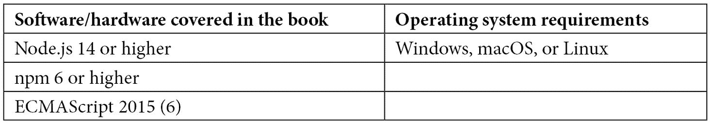

# 前言

本书涵盖了使你充分利用 Node.js 的力量、其概念和其生态系统所需的一切。这包括你需要了解的所有关于模块系统、包、辅助库、CLI 工具、WebAssembly 以及一系列可用的工具，如打包器（Webpack（v5）、Parcel（v2）、Vite 和 esbuild）、测试运行器（AVA、Jest 和 Mocha）、转译器（Babel 和 TypeScript）以及许多其他工具（Flow、Prettier、eslint 和 Stylelint）的内容。

# 本书面向对象

本书面向初级和中级前端 Web 开发者，他们希望利用 Node.js 生态系统来构建前端解决方案。本书需要具备 JavaScript、HTML 和 CSS 的入门级知识。在标准 shell（sh）中使用的前期经验将有所帮助。

# 本书涵盖内容

*第一章*, *了解 Node.js 的内部机制*，描述了 Node.js 的内部工作原理、其原则和基本思想。本章还使你熟悉基本的 Node.js 命令行工具。

*第二章*, *将代码划分为模块和包*，介绍了不同的模块格式、它们的优缺点以及它们在 Node.js 中的支持情况。本章还介绍了重要的`package.json`文件，用于定义 Node.js 包。

*第三章*, *选择包管理器*，描述并比较了用于在 Node.js 包中安装和管理第三方依赖的不同已建立命令行工具。

*第四章*, *使用不同版本的 JavaScript*，涵盖了使用 Node.js 的不同 JavaScript 版本的主要概念和思想。这些版本包括 Flow 和 TypeScript，但也包括比当前可用的 Node.js 版本支持的 ECMAScript 标准更新的规范。

*第五章*, *使用代码检查器和格式化工具提高代码质量*，涵盖了用于提高 JavaScript 项目代码质量的可用工具。本章提供了有关如何安装这些代码质量助手、配置它们以及将它们集成到标准工作流程和开发过程中的信息。

*第六章*, *使用打包器构建 Web 应用*，讨论了关于被称为打包器的专用 Web 构建工具你需要了解的一切。在本章中，你将学习如何将最先进的 Web 项目从源代码编译成可以在服务器上发布的工件。涵盖的打包器包括 Webpack、esbuild、Parcel 和 Vite。

*第七章*, *使用测试工具提高可靠性*，涵盖了您需要了解的所有关于使用 Node.js 进行测试的知识——从运行单元测试的工具到完整的端到端测试运行器。特别是，本章包括关于 Jest、Mocha、AVA、Playwright 和 Cypress 的基础知识。

*第八章*, *发布 npm 包*，包含了从官方 npm 注册表或自定义私有注册表（如 Verdaccio）发布和消费包的有用信息。本章还涵盖了使用 Node.js 创建和发布 CLI 工具，以及关于编写同构库的信息。

*第九章*, *在单仓库中组织代码*，涵盖了使用 Node.js 开发多个依赖包的一般策略。特别是，它深入探讨了在称为单仓库的单个仓库中工作多个包的细节。介绍了如 Nx、Lerna 或 Turbo 等可能的工具，并结合 npm、Yarn 和 pnpm 工作空间进行介绍。

*第十章*, *将本地代码与 WebAssembly 集成*，讨论了运行编译为 WebAssembly 的本地代码的可能性。本章将指导您创建您的第一个 WebAssembly 模块，以及如何在浏览器和 Node.js 中运行创建的模块。

*第十一章*, *使用替代运行时*，详细介绍了 Node.js 的两个替代方案：Deno 和 Bun。它们在兼容性、安全性、性能和稳定性方面进行了评估。

# 为了充分利用本书

本书中的所有示例都是本着简洁的原则创建的。它们的工作方式相似，只需要了解核心前端技术（如 JavaScript、HTML 和 CSS）的知识。此外，为了跟随所有示例，还需要具备使用终端的基本知识。本书讨论了使代码运行所需的工具。因此，如果您知道如何使用 JavaScript，并遵循本书中解释如何使用 Node.js 与 npm 结合使用的部分，您将没有问题运行书中提供的示例。



在*第十一章*中，您还将运行 Deno 和 Bun。该章节本身包含了安装说明。

**如果您使用的是本书的数字版，我们建议您亲自输入代码或从本书的 GitHub 仓库（下一节中提供链接）获取代码。这样做将帮助您避免与代码复制和粘贴相关的任何潜在错误。**

# 下载示例代码文件

您可以从 GitHub 下载本书的示例代码文件：[`github.com/PacktPublishing/Modern-Frontend-Development-with-Node.js`](https://github.com/PacktPublishing/Modern-Frontend-Development-with-Node.js)。如果代码有更新，它将在 GitHub 仓库中更新。

我们还提供其他代码包，这些代码包来自我们丰富的书籍和视频目录，可在[`github.com/PacktPublishing/`](https://github.com/PacktPublishing/)找到。查看它们！

# 代码在行动

本书的相关代码在行动视频可在[`bit.ly/3EgcKwM`](http://bit.ly/3EgcKwM)查看。

# 下载彩色图像

我们还提供包含本书中使用的截图和图表的彩色图像的 PDF 文件。您可以从这里下载：[`packt.link/zqKz4`](https://packt.link/zqKz4)。

# 使用的约定

本书使用了多种文本约定。

`文本中的代码`: 表示文本中的代码单词、数据库表名、文件夹名、文件名、文件扩展名、路径名、虚拟 URL、用户输入和 Twitter 昵称。以下是一个示例：“将下载的`WebStorm-10*.dmg`磁盘映像文件作为系统中的另一个磁盘挂载。”

代码块设置如下：

```js
html, body, #map {
 height: 100%;
 margin: 0;
 padding: 0
}
```

当我们希望您注意代码块中的特定部分时，相关的行或项目将以粗体显示：

```js
[default]
exten => s,1,Dial(Zap/1|30)
exten => s,2,Voicemail(u100)
exten => s,102,Voicemail(b100)
exten => i,1,Voicemail(s0)
```

任何命令行输入或输出都按以下方式编写：

```js
$ npm install
```

**粗体**: 表示新术语、重要单词或屏幕上看到的单词。例如，菜单或对话框中的单词以粗体显示。以下是一个示例：“从**管理**面板中选择**系统信息**。”

小贴士或重要提示

看起来像这样。

# 联系我们

我们始终欢迎读者的反馈。

`customercare@packtpub.com`并在邮件主题中提及书籍标题。

**勘误表**：尽管我们已经尽一切努力确保内容的准确性，但错误仍然可能发生。如果您在这本书中发现了错误，我们将非常感激您向我们报告。请访问[www.packtpub.com/support/errata](http://www.packtpub.com/support/errata)并填写表格。

`copyright@packt.com`并附上材料的链接。

**如果您有兴趣成为作者**：如果您在某个领域有专业知识，并且您有兴趣撰写或为书籍做出贡献，请访问[authors.packtpub.com](http://authors.packtpub.com)。

# 分享你的想法

一旦您阅读了《使用 Node.js 的现代前端开发》，我们很乐意听听您的想法！请[点击此处直接转到该书的亚马逊评论页面](https://packt.link/r/1-804-61829-2)并分享您的反馈。

您的评论对我们和科技社区都很重要，并将帮助我们确保我们提供高质量的内容。

# 下载本书的免费 PDF 副本

感谢您购买本书！

你喜欢在移动中阅读，但无法携带你的印刷书籍到处走吗？

你的电子书购买是否与您选择的设备不兼容？

不要担心，现在，随着每本 Packt 书籍的购买，您都可以免费获得该书的 DRM 免费 PDF 版本。

在任何地方、任何设备上阅读。直接从您最喜欢的技术书籍中搜索、复制和粘贴代码到您的应用程序中。

优惠远不止这些，你还可以获得独家折扣、时事通讯和每日免费内容的每日邮箱访问权限！

按照以下简单步骤获取好处：

1.  扫描下面的二维码或访问以下链接：


[`packt.link/free-ebook/9781804618295`](https://packt.link/free-ebook/9781804618295)

1.  提交你的购买证明

1.  就这些！我们将直接将免费的 PDF 和其他优惠发送到你的邮箱

# 第一部分：Node.js 基础知识

在这部分，你将通过学习 Node.js 的工作原理以及如何使用它来深入了解 Node.js。你还将接触 Node.js 生态系统。特别是，你将了解 Node.js 项目的结构。本部分的一个重要主题是如何处理以包形式存在的依赖项。

本书本部分包括以下章节：

+   *第一章*, *了解 Node.js 的内部结构*

+   *第二章*, *将代码划分为模块和包*

+   *第三章*, *选择包管理器*
