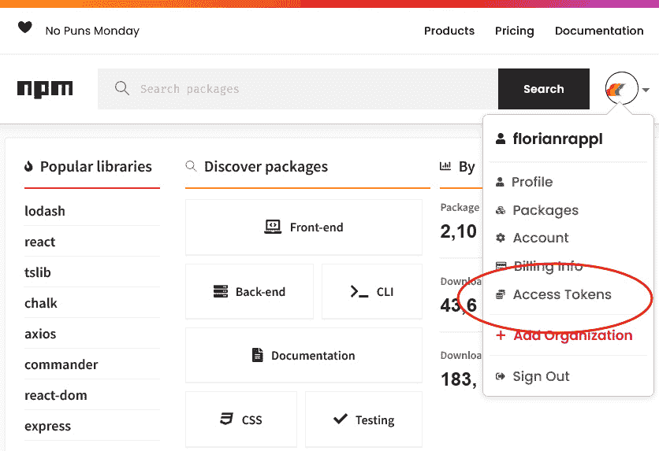
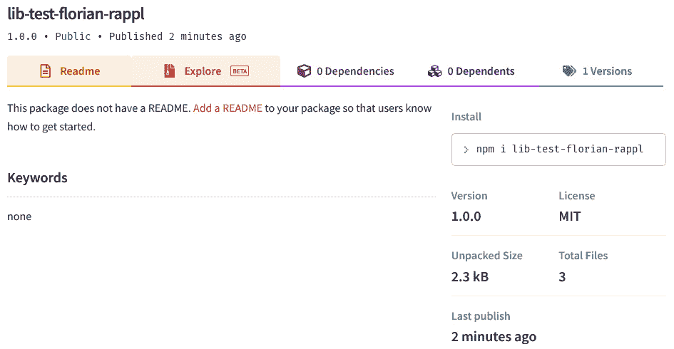
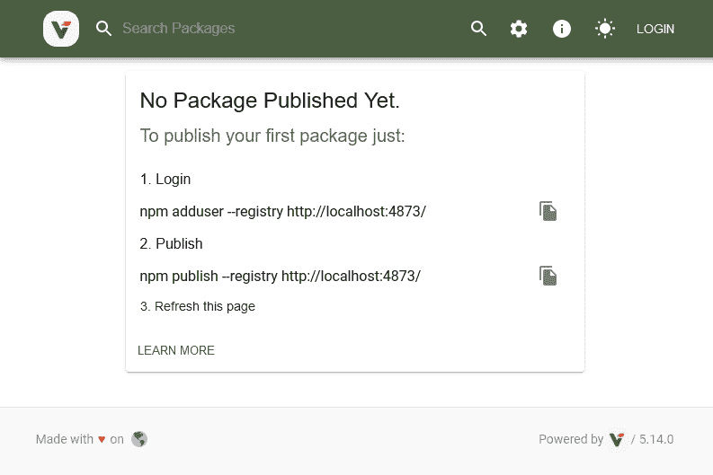

# 第八章：发布 npm 包

在此之前，我们的主要重点是学习如何改进和为现有项目做出贡献，但往往这并不全面。一些项目需要你正确启动，这个过程的一部分是决定哪些包应该被重用。

我们已经了解到，在 Node.js 中，可重用性主要通过模块系统获得，这可以通过 npm 包形式的第三方依赖来增强。在本章中，你将学习如何自己发布 npm 包。这样，一旦实现的功能就可以在同一个项目工作的团队或任何人之间共享。

为了实现本章的目标，首先，我们将设置一个简单的库来很好地服务于我们的案例。然后，我们将以使代码对任何 Node.js 开发者都可用的方式将此库发布到官方 npm 注册库。如果你想让你的库稍微不那么公开，那么以下章节对你来说将很有趣。在这些章节中，你将首先学习如何在实际选择用于发布和安装的本地注册库之前选择其他注册库。

最后，我们还将探讨扩大我们库范围的方法——通过使其**同构**或将其作为工具公开。总之，本章将涵盖以下关键主题：

+   发布到官方注册库

+   通过`.npmrc`选择另一个 npm 注册库

+   设置 Verdaccio

+   编写同构库

+   发布跨平台工具

# 技术要求

本章的完整源代码可在[`github.com/PacktPublishing/Modern-Frontend-Development-with-Node.js/tree/main/Chapter08`](https://github.com/PacktPublishing/Modern-Frontend-Development-with-Node.js/tree/main/Chapter08)找到。

本章的 CiA 视频可通过[`bit.ly/3UmhN4B`](https://bit.ly/3UmhN4B)访问。

# 发布到官方注册库

让我们从创建一个小型库开始，这个库使用的是在 Node.js 项目中非常常见的结构。该结构包括一个`src`文件夹，其中包含原始源代码，以及一个`lib`文件夹，其中包含用于目标系统的输出。目标系统可以是浏览器应用程序的打包器或 Node.js 的特定版本。

为了初始化此类项目，我们可以使用之前使用过的`npm`命令行工具：

```js
$ npm init -y
```

现在，我们将设置一切。首先，我们将安装`esbuild`作为开发依赖项。这可以帮助我们将源文件转换为可用的库文件：

```js
$ npm install esbuild --save-dev
```

接下来，我们将修改`package.json`以适应我们的需求：

package.json

```js
{
  "name": "lib-test-florian-rappl",
  "version": "1.0.0",
  "description": "Just a test library",
  "keywords": [],
  "author": "Florian Rappl",
  "license": "MIT",
  "main": "lib/index.js",
  "source": "src/index.js",
  "scripts": {
    "build": "esbuild src/*.js --platform=node --outdir=lib
      --format=cjs"
  },
  "devDependencies": {
    "esbuild": "⁰.15.0"
  }
}
```

重要的是，将所选占位符的名称（`name`字段中的`florian-rappl`和`author`字段中的`Florian Rappl`）替换为你的名字。对于`name`字段，请确保只使用允许用于包名称标识符的字母。你也可以随意更改所选许可证。

许可证

每个`package.json`文件中的一项重要信息是`license`字段。虽然 MIT 许可证对于许多开源项目来说是一个非常好的选择，但它绝不是唯一的选择。其他流行的选择包括 Apache License 2.0、BSD 3-Clause 和 ISC 许可证。

现在，我们将在我们的源文件中添加一些内容：

src/index.js

```js
import { readFile } from "fs";
import { resolve } from "path";
export function getLibName() {
  const packagePath = resolve(__dirname,
    "../package.json");
  return new Promise((resolve, reject) => {
    readFile(packagePath, "utf8", (err, content) => {
      if (err) {
        reject(err);
      } else {
        const { name, version } = JSON.parse(content);
        resolve(`${name}@${version}`);
      }
    });
  });
```

这个文件是以对我们开发者有意义的方式编写的，但不能直接由 Node.js 运行。问题有两个方面。首先，我们使用了 ESM 语法，但没有保证 Node.js 支持它。其次，我们混合了 ESM 结构，如`import`和`export`，以及 CommonJS 结构，如`__dirname`。

幸运的是，我们已安装了`esbuild`来处理这个问题，定义的`build`脚本实际上使用了它以便于操作：

```js
$ npm run build

> lib-test-florian-rappl@1.0.0 build /home/node/code/example01

> esbuild src/*.js --platform=node --outdir=lib --format=cjs

  lib/index.js  1.4kb

 Done in 2ms
```

到目前为止，我们的项目中已有两个目录：`src`，包含原始源代码，以及`lib`，包含 CommonJS 输出。这一点也在`package.json`文件中得到了体现，其中源字段指向`src/index.js`，而`main`字段指向`lib/index.js`。

就此提醒一下：`main`字段告诉 Node.js 在通过`require`包含包时应使用哪个模块 – 例如，`require('lib-test-florian-rappl')`将引用并评估`lib/index.js`文件。

假设你现在想将这个包发布到官方 npm 注册库。为此，你首先需要在[npmjs.com/signup](https://npmjs.com/signup)上创建一个账户。一旦成功注册并登录，你应该会看到一个类似于*图 8.1*的视图：



图 8.1 – 登录 npmjs.com 后的视图

在你的机器上，你现在可以通过运行以下命令来认证官方 npm 注册库：

```js
$ npm login
```

这将要求你输入用户名和密码。或者，你也可以使用所谓的访问令牌进行认证。这对于脚本特别有用，例如在 CI/CD 管道中运行的自动化脚本。要生成一个新的访问令牌，请点击*图 8.1*中突出显示的链接。

既然你已经认证了`npm`工具，你可以继续发布你的包：

```js
$ npm publish

npm notice

npm notice   lib-test-florian-rappl@1.0.0

npm notice === Tarball Contents ===

npm notice 1.5kB lib/index.js

npm notice 425B  src/index.js

npm notice 344B  package.json

npm notice === Tarball Details ===

npm notice name:          lib-test-florian-rappl

npm notice version:       1.0.0

npm notice package size:  1.1 kB

npm notice unpacked size: 2.3 kB

npm notice shasum:        2b5d224949f9112eeaee435a876a8ea15ed3e7cd

npm notice integrity:     sha512-cBq1czwmN4vep[...]/vXrORFGjRjnA==

npm notice total files:   3

npm notice

+ lib-test-florian-rappl@1.0.0
```

这将把你的项目打包成一个压缩归档。然后，该工具将把 tarball 上传到官方 npm 注册库。

现在，你可以前往[npmjs.com](https://npmjs.com)查找你的包名。你应该会看到一个类似于*图 8.2*的包信息页面，其中包含更多关于已发布包的详细信息。请注意，我们没有包含`README.md`或任何关键词：



图 8.2 – 已发布包的详细信息

你可能考虑的事情之一是给你的包指定一个作用域。当你发布一个带有作用域的包时，你需要配置包的访问设置。默认情况下，非作用域包是公开的，而作用域包是私有的。

为了将范围包发布到官方 npm 注册表，你首先需要成为 npm 网站上某个组织的成员或所有者。组织名称必须与范围名称匹配。

包范围

将包分组的一个好方法是将它们放在一个公共范围内。范围必须以一个“@”符号开头，后面跟着范围名称。范围名称的规则与包名称相同。除了分组包，范围还可以用来将某些包放置在不同的注册表中而不会遇到太多麻烦。最重要的是，范围可以在官方 npm 注册表中保留，这样只有授权账户才能使用保留范围发布新包。

为了一致地发布具有公共访问权限的范围包，例如`@foo/bar`，你需要修改`package.json`。相关的配置存储在一个名为`publishConfig`的属性中：

package.json

```js
{
  "name": "@foo/bar",
  // ... like beforehand
  "publishConfig": {
    "access": "public"
  }
}
```

或者，访问配置也可以在执行带有`--access=publish`标志的`npm publish`命令时直接设置。

到目前为止，我们只讨论了如何将内容发布到官方 npm 注册表。那么，选择其他 npm 注册表怎么办？为此，我们需要更改`.npmrc`文件。

# 通过.npmrc 选择其他 npm 注册表

为了配置 npm 的行为，使用了一个特殊的文件，称为`.npmrc`。我们已经在*第三章*，*选择包管理器*中简要提到了这个文件。此文件不仅可以用来确定包的来源，还可以用来定义发布的位置。

简单的修改可能看起来如下：

.npmrc

```js
; Lines starting with a semicolon or
# with a hash symbol are comments
registry=https://mycustomregistry.example.org
```

这样，所有安装和发布尝试都将执行在`https://mycustomregistry.example.org`，而不是官方注册表`https://registry.npmjs.org`。

很常见，这种极端的方法是不必要的，甚至是不受欢迎的。相反，你可能只想为包的子集使用另一个注册表。在最常见的案例中，子集已经由范围定义。

假设我们在上一节中使用的`@foo`范围，与`@foo/bar`包绑定到一个自定义注册表，而所有其他包仍然可以通过官方注册表解析。以下`.npmrc`涵盖了这一点：

.npmrc

```js
@foo:registry=https://mycustomregistry.example.org
```

当地`.npmrc`——即与项目`package.json`相邻的文件——应用于定义注册表，而全局`.npmrc`——位于你的主目录中——应用于提供有关认证的信息。通常，私有注册表只能与这样的认证信息一起使用：

~/.npmrc

```js
//mycustomregistry.example.org/:username="myname"
//mycustomregistry.example.org/:_password="mysecret"
//mycustomregistry.example.org/:email=foo@bar.com
always-auth=true
```

`always-auth`设置用于告诉`npm`，即使是`GET`请求——即请求解析或下载包的请求——也需要使用提供的认证。

测试自定义配置的一个简单方法是自己搭建一个 npm 注册表。在本地实现这一点的不错方式是使用开源项目**Verdaccio**。

# 设置 Verdaccio

目前市面上有几个商业注册表选项。可以说，最受欢迎的选项是为官方 npm 注册表购买专业版。这样，你将能够发布和管理私有包。无论你选择哪种选项，你都将必须使用云版本来发布你的包。

尤其是在尝试发布过程时，拥有一个本地注册表会非常好。一个很好的选择是利用 `npx`。

让我们采用 `npx` 方法：

```js
$ npx verdaccio

 warn --- config file  - ~/.config/verdaccio/config.yaml

 info --- plugin successfully loaded: verdaccio-htpasswd

 info --- plugin successfully loaded: verdaccio-audit

 warn --- http address - http://localhost:4873/ - verdaccio/5.14.0
```

现在 Verdaccio 已经运行，你可以访问控制台显示的 URL。你应该看到与 *图 8.3* 所示的 Verdaccio 的主页一样：



图 8.3 – Verdaccio 的主页及发布说明

假设我们想要将我们之前创建的包发布到 Verdaccio 而不是官方的 npm 注册表。我们需要遵循的步骤如下：

1.  对新注册表进行身份验证（在 Verdaccio 中，默认情况下你可以使用你想要的任何凭证，但 `npm` 要求你进行身份验证）

1.  要配置 Verdaccio 运行实例的 URL，可以通过 `.npmrc` 文件或通过在 `npm publish` 命令中显式使用 `--registry` 标志来实现

实际上，这两个步骤看起来如下：

```js
$ npm adduser --registry http://localhost:4873/

Username: foo

Password:

Email: (this IS public) foo@bar.com

Logged in as foo on http://localhost:4873/.

$ npm publish --registry http://localhost:4873

npm notice

npm notice   lib-test-florian-rappl@1.0.0

npm notice === Tarball Contents ===

npm notice 1.5kB lib/index.js

npm notice 425B  src/index.js

npm notice 344B  package.json

npm notice === Tarball Details ===

npm notice name:          lib-test-florian-rappl

npm notice version:       1.0.0

npm notice package size:  1.1 kB

npm notice unpacked size: 2.3 kB

npm notice shasum:        2b5d224949f9112eeaee435a876a8ea15ed3e7cd

npm notice integrity:     sha512-cBq1czwmN4vep[...]/vXrORFGjRjnA==

npm notice total files:   3

npm notice

+ lib-test-florian-rappl@1.0.0
```

一旦发布，该包也会列在可访问于 http://localhost:4873/ 的 Verdaccio 实例网站上。当然，这主要用于测试发布过程或通过本地缓存加速 npm 安装。大多数时候，拥有本地 npm 注册表并不是真的必要。

此时可能会出现一个问题：我们如何确保发布的包可以被大多数用户使用？在客户端应用程序（在浏览器中运行）以及基于服务器的应用程序（在 Node.js 中运行）中实际使用包需要满足哪些要求？

说是基本不受目标依赖的概念被称为同构。这个术语本身也并非没有受到批评，有些人实际上更喜欢称之为通用。拥有同构代码对于获得灵活性是非常好的。让我们看看部署同构包需要什么。

# 编写同构库

网络开发的圣杯是能够编写既适用于前端也适用于后端的代码，而不是仅适用于其中一部分。许多框架和工具试图给我们提供这种能力。

为了使代码能够适用于多个平台，我们不仅需要提供我们代码的多个变体，而且还需要只使用所有支持平台上都可用的 API。例如，如果你想发起一个 HTTP 请求，那么对于现代浏览器来说，使用 `fetch` 就是一个正确的选择。然而，`fetch` 在 Node.js 的较旧版本中是不可用的。因此，你可能需要以不同的方式解决这个问题。

在 HTTP 请求的情况下，已经存在同构库——也就是说，这些库会根据目标运行时做正确的事情。你应该只依赖这些库。

同构 fetch

HTTP 请求问题可以通过多种方式解决——也就是说，通过选择同构库，如`axios`或`isomorphic-fetch`，问题可以委托给依赖项。这种方法的优势在于我们不需要在每个平台上找出我们需要遵循的方式。此外，以这种方式进行测试和验证要简单得多。

现在，我们将专注于提供多个变体。如果我们想发布支持多种模块格式的库——比如说 CommonJS 和 ESM——我们可以通过扩展`package.json`来实现。将`type`设置为`module`将告诉 Node.js，由`main`字段引用的模块实际上遵循 ESM。此外，我们可以明确地定义所有包的导出——还有一个额外的选项来定义根据使用的目标平台和模块系统要使用的模块。

让我们看看这种配置的一个例子：

package.json

```js
{
  // ... like beforehand
  "type": "module",
  "main": "dist/index.js",
  "exports": {
    ".": {
      "browser": {
        "require": "./lib/index.min.js",
        "default": "./dist/index.min.js"
      },
      "default": {
        "require": "./lib/index.js",
        "default": "./dist/index.js"
      }
    }
  }
}
```

在我们的小型库中，浏览器版本和非浏览器版本之间存在显著差异。然而，为了优化，我们在浏览器中使用了压缩模块，而所有其他平台（包括 Node.js）都将解析为非压缩模块。

要创建适合 CommonJS 的输出，我们可以使用我们已推导出的`build`脚本：

```js
$ esbuild src/*.js --platform=node --outdir=lib --format=cjs
```

ESM 的输出类似，但包含一个重要的变化：

```js
$ esbuild src/*.js --platform=node --outdir=dist --format=esm --define:__dirname="'.'"
```

关键的改变是避免使用仅在 Node.js 中使用 CommonJS 的`__dirname`全局变量，我们只需使用当前目录。这个改变并不完美，但应该能完成这项工作。

目前，一切似乎都已准备就绪——但实际上并非如此。最重要的是仍然缺失——那就是移除 Node.js 内置的包引用。我们的简单库引用了`fs`和`path`，但这些包在浏览器中并不存在。它们不知道如何在其中工作。幸运的是，在这种情况下，我们有多个解决方案。其中最好的一个可能是用包的`package.json`的静态导入来替换动态文件读取：

index.js

```js
import { name, version } from '../package.json';
export function getLibName() {
  return `${name}@${version}`;
}
```

当然，这种算法上的改变并不总是可能的。在给定场景中，我们还从`esbuild`的捆绑选项中受益，它将包括从引用的 JSON 文件中必要的部分，以生成符合我们预期的输出文件。

考虑到这些变化，让我们看看`build`脚本是如何定义的：

```js
{
  // ... like beforehand
  "scripts": {
    "build-cjs-node": "esbuild src/*.js --platform=node
      --outdir=lib --format=cjs",
    "build-cjs-browser": "esbuild src/*.js --platform=node
      --outdir=lib --bundle --format=cjs --minify --entry-
      names=[name].min",
    "build-cjs": "npm run build-cjs-node && npm run build-
      cjs-browser",
    "build-esm-node": "esbuild src/*.js --platform=node
      --outdir=dist --format=esm",
    "build-esm-browser": "esbuild src/*.js --platform=node
      --outdir=dist --bundle --format=esm --minify --entry-
      names=[name].min",
    "build-esm": "npm run build-esm-node && npm run build-
      esm-browser",
    "build": "npm run build-cjs && npm run build-esm"
  }
}
```

将脚本定义为可以独立运行，也可以方便地一起运行，而不需要太多努力是有意义的。在许多情况下，你选择的工具需要大量配置才能达到预期的行为。在我们的例子中，`esbuild`已经为这项任务做好了充分的准备——我们需要的所有事情都可以通过命令行选项来完成。

npm 包可以覆盖的一个额外案例是实际上提供一个工具。理想情况下，这些是用于 Node.js 运行的工具，使其成为跨平台工具。让我们看看我们如何编写和发布这类工具。

# 发布跨平台工具

没有它的生态系统，Node.js 就不会如此强大。正如我们在 *第一章* 中学到的，*学习 Node.js 的内部机制*，依赖其生态系统的力量是一个基本的设计决策。在这里，npm 通过在 `package.json` 中定义包元数据以及包的安装来扮演主导角色。

在安装包的过程中，会发生几件事情。在包下载完成后，它将被复制到目标目录。对于使用 `npm` 的本地安装，这是 `node_modules` 文件夹。对于使用 `npm` 的全局安装，目标将在你的主目录中全局可用。然而，还有一件事要做。如果包包含一个工具，那么工具的引用将被放入一个特殊的目录，对于本地安装，这个目录是 `node_modules/.bin`。

如果你回到上一章的代码，你会看到例如 `jest` 在 `node_modules/.bin` 中可用。这正是我们用 `npx` 启动的同一个 `jest` 可执行文件。让我们看看以下内容：

```js
$ ./node_modules/.bin/jest --help
```

我们可以将其比作：

```js
$ npx jest --help
```

这两者都将产生相同的结果。原因是本地安装的 `npx` 只是一个方便的工具，用于避免写出路径。作为提醒，你应该选择本地安装而不是全局安装。

npx 和 npm

`npx` 是与 npm 安装一起提供的另一个命令。从命令行角度来看，`npm` 用于管理依赖项，而 `npx` 用于运行包。`npm` 工具还有一个 `run` 子命令，它运行 `package.json` 中 `scripts` 部分定义的命令，而 `npx` 则运行 npm 包中 `bin` 部分定义的命令。

现在的问题是，我们如何创建一个包，它还向 `.bin` 文件夹添加一个脚本，以便在安装后就能直接使用？答案就在我们之前库的 `package.json` 中。

让我们稍微修改一下 `package.json`：

package.json

```js
{
  "name": "@foo/tool",
  "version": "1.0.0",
  "description": "A simple tool greeting the user.",
  "bin": {
    "hello": "lib/hello.js"
  },
  "license": "MIT"
}
```

我们添加了一个 `bin` 部分，它定义了一个从 `.bin` 目录引用的单个脚本。这个引用应该被称为 `hello`，并指向这个包内的 `lib/hello.js` 文件。

让我们再添加一个在调用 `hello` 时运行的脚本：

hello.js

```js
#!/usr/bin/env node
// check that at least one argument has been provided
if (process.argv.length < 3) {
  console.log("No argument provided.");
  return process.exit(1);
}
// take the last argument
const name = process.argv.pop();
console.log(`Hello ${name}!`);
```

这实际上会检查是否至少提供了一个参数，并使用最后一个参数在控制台打印一条消息。

让我们看看直接通过 `node` 运行时的行为：

```js
$ node hello.js

No argument provided.

$ node index.js foo

Hello foo!
```

现在，包可以像以前一样发布——例如，通过选择我们的本地 Verdaccio 实例：

```js
$ npm publish --registry http://localhost:4873
```

在一个新项目中，你现在可以安装依赖项并运行工具：

```js
$ npm install @foo/tool --registry http://localhost:4873

$ npx hello bar

Hello bar!
```

通过这些，我们已经了解了 npm 包发布过程中的最关键方面。让我们回顾一下我们学到了什么。

# 摘要

在本章中，你已经了解了将软件包发布到 npm 注册表所需的内容——无论是官方的还是私有的。你也接触到了一个常用的 npm 注册表形式，即 Verdaccio。

借助本章的知识，你现在应该能够编写可在基于浏览器的应用程序以及基于 Node.js 的应用程序中工作的可重用库。你也能够发布基于 Node.js 的工具。从某种意义上说，这些工具只是具有一些附加字段的关联包元数据中的库。

在下一章中，我们将探讨一种不同的代码结构方法——将多个软件包放置在一个称为 monorepo 的单个仓库中。
