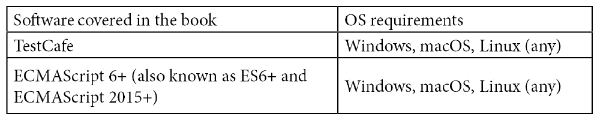

# 前言

TestCafe 是一个自给自足、免费且开源的端到端测试框架，它将无与伦比的易用性与高级自动化和强大的内置稳定性机制相结合。它可以用来编写快速且可靠的测试。

*《使用 TestCafe 的现代 Web 测试》* 是一本全面的项目式入门指南，适合那些刚开始接触 TestCafe 的新手。你将在学习核心方法和概念的同时，构建一套端到端测试。

你将学习如何使用 TestCafe 语法编写端到端测试，以及 TestCafe 框架的功能。你将从设置环境一直到最后编写生产就绪的测试。在整个书中，我们将逐步构建一个示例测试集，该测试集将登录网站，验证不同页面上的元素，创建/删除实体，并使用 TestCafe 执行自定义 JavaScript 代码。此外，还将进行几个重构阶段，以展示设置/清理和 PageObjects。虽然这个测试套件相对简单，但它展示了 TestCafe 的一些最显著功能。此外，它还演示了在免费且易于使用的网站上运行测试，并且不需要读者构建和部署自己的服务器或后端服务。

在本书结束时，你将了解如何使用 TestCafe 编写和增强端到端测试，以解决现实世界的问题并交付结果。你还将有一个概念证明，可以向他人展示。

免责声明：

请注意，本书不是由 Developer Express Inc 编写或制作的。Developer Express Inc 与 Packt 无关，本书版权属于 Packt Publishing Pvt. Ltd。

# 本书面向对象

本书面向希望使用 TestCafe 进行测试自动化的质量保证工程师、测试自动化工程师、测试软件工程师、SDETs 和软件项目经理。全栈软件开发人员和负责创建企业级测试框架的专业人士也会发现本书很有用。需要具备基本的 JavaScript/Node.js、CSS 选择器、HTML 和 Bash 知识。

# 本书涵盖内容

*第一章*，*为什么选择 TestCafe？*，解释了 TestCafe 是什么以及其主要功能。

*第二章*，*探索 TestCafe 的内部机制*，深入探讨了 TestCafe 的工作原理以及其内部隐藏的秘密。

*第三章*，*设置环境*，介绍了如何设置环境以运行测试。

*第四章*，*使用 TestCafe 构建测试套件*，在介绍了 TestCafe 的主要概念并回顾了其工具集之后，解释了如何选择合适的工具并编写测试。

*第五章*，*改进测试*，介绍了如何扩展测试并添加设置和清理。

*第六章*，*使用 PageObjects 重构*，介绍了如何通过重构使用 PageObjects 使测试更加有效和透明。

*第七章*，*TestCafe 的发现*，提供了对接下来内容的快速概述。

# 为了充分利用本书

以下表格显示了此书的最低软件要求：



**如果您正在使用本书的数字版，我们建议您亲自输入代码或通过下一节中提供的 GitHub 仓库访问代码。这样做将帮助您避免与代码复制和粘贴相关的任何潜在错误。**

下载示例代码文件

您可以从[www.packt.com](http://www.packt.com)的账户下载此书的示例代码文件。如果您在其他地方购买了此书，您可以访问[www.packtpub.com/support](http://www.packtpub.com/support)并注册，以便将文件直接通过电子邮件发送给您。

您可以通过以下步骤下载代码文件：

1.  在[www.packt.com](http://www.packt.com)登录或注册。

1.  选择**支持**选项卡。

1.  点击**代码下载**。

1.  在**搜索**框中输入书籍名称，并遵循屏幕上的说明。

文件下载完成后，请确保使用最新版本的以下软件解压缩或提取文件夹：

+   Windows 上的 WinRAR/7-Zip。

+   Mac 上的 Zipeg/iZip/UnRarX。

+   Linux 上的 7-Zip/PeaZip。

本书代码包也托管在 GitHub 上，网址为[`github.com/PacktPublishing/Modern-Web-Testing-with-TestCafe`](https://github.com/PacktPublishing/Modern-Web-Testing-with-TestCafe)。如果代码有更新，它将在现有的 GitHub 仓库中更新。

我们还有其他来自我们丰富的书籍和视频目录的代码包，可在 https://github.com/PacktPublishing/获取。查看它们吧！

# 使用的约定

本书使用了多种文本约定。

`文本中的代码`：表示文本中的代码单词、数据库表名、文件夹名、文件名、文件扩展名、路径名、虚拟 URL、用户输入和 Twitter 昵称。以下是一个示例：'在您选择的代码编辑器（或 IDE）中打开`basic-tests.js`，让我们创建一个简单的测试。'

代码块设置如下：

```js
const { Selector } = require('testcafe');
fixture('My first set of tests');
test('My first test', async (t) => {    // Your test code });
```

任何命令行输入或输出都写作如下：

```js
$ cd test-project/
$ mkdir tests
```

**粗体**：表示新术语、重要单词或屏幕上看到的单词。例如，菜单或对话框中的单词在文本中显示如下。以下是一个示例：'预期结果：**'问题已创建'**通知应显示：'

注意事项或重要提示

显示如下。

# 联系我们

我们欢迎读者的反馈。

**一般反馈**: 如果您对本书的任何方面有疑问，请在邮件主题中提及书名，并通过 customercare@packtpub.com 邮箱联系我们。

**勘误**: 尽管我们已经尽最大努力确保内容的准确性，但错误仍然可能发生。如果您在这本书中发现了错误，我们将非常感激您能向我们报告。请访问[www.packtpub.com/support/errata](http://www.packtpub.com/support/errata)，选择您的书籍，点击勘误提交表单链接，并输入详细信息。

**盗版**: 如果您在互联网上以任何形式发现我们作品的非法副本，如果您能提供位置地址或网站名称，我们将不胜感激。请通过版权邮箱 copyright@packt.com 联系我们，并附上材料的链接。

**如果您有兴趣成为作者**: 如果您在某个领域有专业知识，并且您有兴趣撰写或为书籍做出贡献，请访问[authors.packtpub.com](http://authors.packtpub.com)。

# 评价

请留下您的评价。一旦您阅读并使用过这本书，为何不在购买它的网站上留下评价呢？潜在读者可以查看并使用您的客观意见来做出购买决定，我们 Packt 公司可以了解您对我们产品的看法，并且我们的作者可以看到他们对书籍的反馈。谢谢！

想了解更多关于 Packt 的信息，请访问[packt.com](http://packt.com)。
