# 第一章：*第一章*: 为什么选择 TestCafe?

TestCafe——一个新兴的软件测试框架，还是你可以在这里用餐的地方？在这里，我们将探讨 TestCafe 是什么以及它的主要特性。技术是什么？你需要了解什么？它是如何与其他工具集成的？在这本书中，我们将看到 TestCafe 的用途，了解其主要特性，并将其与一个知名的行业标准——Selenium 进行比较。

更实际地说，我们将为缺陷跟踪系统开发一组测试。你将学习如何使用 TestCafe 语法和框架特性编写端到端测试。你将从设置环境一直写到编写生产就绪的测试。

在整本书中，我们将逐步构建一组测试样例，这些测试样例将登录到网站，验证不同页面上的元素，创建/删除实体，并使用 TestCafe 执行自定义 JavaScript 代码。此外，还将有几个重构阶段，以展示设置/清理和 PageObjects。

注意

请记住，这本书并不声称是唯一的信息来源——其主要目标是展示一些原创方法，而不是强制执行严格的规则。请随意使用和扩展本书中探索的所有技术。

到本章结束时，我们将对 TestCafe 有一个清晰的认识，以及接下来要做什么——一个将要测试的功能计划。我们还将回顾演示网站，并制定出一组将在后续章节中自动化的测试用例。

总结本章内容，以下主要主题将被涵盖：

+   介绍 TestCafe。

+   探索 TestCafe 的主要特性。

+   比较 TestCafe 和 Selenium。

+   回顾我们将构建的测试项目。

# 介绍 TestCafe

如果你为一家大型企业公司或一家小型但创新的初创公司工作，并且你的自动化测试需要支持老版本和新版本的浏览器，你绝对应该尝试 TestCafe。就像 Selenium 一样，它是开源的，但你不需要安装任何其他包或额外的 Web 驱动程序。TestCafe 是一个自给自足、免费、端到端测试框架，它将无与伦比的易用性与高级自动化和强大的内置稳定性机制相结合。

它是由 DevExpress（https://github.com/DevExpress）创建的，并在 MIT 许可下开源。TestCafe 可以处理自动化测试过程的各个阶段：

+   在测试前启动应用程序。

+   启动不同的浏览器。

+   运行测试。

+   捕获截图。

+   输出测试结果。

TestCafe 不需要安装任何额外的浏览器插件，并且可以直接在所有主流现代浏览器中工作。与 Selenium 相比，它因其更快、更易用而越来越受欢迎。

现在我们已经快速了解了 TestCafe 是什么，让我们继续概述其主要特性。

# 探索 TestCafe 的主要特性

现在，让我们更详细地看看 TestCafe 所能提供的一切：

+   TestCafe 运行所需的基本条件是机器上配置的浏览器和 Node.js，因此**设置非常简单**。

+   TestCafe 可以在**无头模式**（在 Chrome 或 Firefox 上）下运行测试，无需渲染**文档对象模型（DOM）**。当在任何**持续集成（CI）系统**上运行测试时，这个特性非常有用。

+   TestCafe**支持所有主要操作系统**，包括 Windows，macOS 和 Linux。

+   TestCafe 官方支持的浏览器包括 Google Chrome（稳定版、Beta 版、Dev 版和 Canary 版）、Internet Explorer（11+）、Microsoft Edge（Legacy 版和基于 Chromium 的）、Mozilla Firefox、Safari、Google Chrome 移动版和 Safari 移动版——因此它是**跨浏览器的**。您可以在[`devexpress.github.io/testcafe/documentation/guides/concepts/browsers.html#officially-supported-browsers`](https://devexpress.github.io/testcafe/documentation/guides/concepts/browsers.html#officially-supported-browsers)找到支持的浏览器及其别名的完整列表。

+   测试可以编写为最新的**JavaScript (ES6+)，TypeScript**或**CoffeeScript**格式（我们将在接下来的章节中使用 JavaScript 进行演示）。

+   清晰且灵活的 API，支持**PageModel 模式**（我们将在*第六章*，*使用 PageObjects 重构*）。

+   由于**智能断言和自动等待机制**（这将在*第二章*，*探索 TestCafe 内部机制*）的稳定测试。

+   TestCafe 拥有许多**免费的自定义插件**：云浏览器提供商和模拟器（SauceLabs，BrowserStack，CrossBrowserTesting 等），框架特定的选择器以与您的框架（React，Angular，Vue，和 Aurelia）中的页面元素进行交互，自定义报告器以获取不同格式的测试结果（TeamCity，Slack，NUnit 和 TimeCafe），IDE 插件以从您最喜欢的 IDE（Visual Studio Code，Webstorm 和 SublimeText）运行测试并查看结果，Cucumber 支持以 Cucumber 语法创建和运行测试，等等，因为 TestCafe 的开发人员和社区成员非常活跃。所有这些都可以使用并且是开源的（https://github.com/DevExpress/testcafe#plugins）。

这些是 TestCafe 开源框架的主要功能。想知道是否有任何不需要编写代码的产品吗？当然有！

## 介绍 TestCafe Studio

除了开源的 TestCafe 框架之外，还有一个名为 TestCafe Studio 的付费测试录制工具。它建立在 TestCafe 引擎之上，为测试工程师提供记录、运行和更新测试的机会，而无需任何特殊的 JavaScript 知识。这是通过将用户操作从录制转换为可重复的代码来实现的。

除了补充 TestCafe 框架提供的功能外，TestCafe Studio 还通过以下功能更进一步：

+   **可视化测试录制器**：这允许您在不编写任何代码的情况下创建测试。它记录您在浏览器中与网页的交互，并生成相应的测试（https://docs.devexpress.com/TestCafeStudio/400165/guides/record-tests）。

+   **交互式测试编辑器**：允许您以全面、可视化的方式查看和编辑测试和钩子（https://docs.devexpress.com/TestCafeStudio/400190/user-interface/test-editor）。

+   **自动选择器生成**：当您与网页交互或在元素选择器中选中网页元素时，TestCafe Studio 可以生成元素选择器（https://docs.devexpress.com/TestCafeStudio/400407/test-actions/element-selectors#auto-generated-element-selectors）。

+   **运行配置管理器**：允许您为桌面、无头和移动浏览器创建、修改和删除运行配置（https://docs.devexpress.com/TestCafeStudio/400189/user-interface/run-configurations-dialog）。

+   **代码编辑器**：允许您编写和修改测试脚本（https://docs.devexpress.com/TestCafeStudio/400181/user-interface/code-editor）。

    注意

    TestCafe Studio 提供 30 天的免费试用期——您可以在[`www.devexpress.com/products/testcafestudio/qa-end-to-end-web-testing.xml`](https://www.devexpress.com/products/testcafestudio/qa-end-to-end-web-testing.xml)找到更多关于此信息。

让我们停下来，喘口气，回顾一下我们迄今为止所学的内容。我们已经对 TestCafe 有了基本的了解，并了解了一系列它所能提供的内容——主要功能、插件以及 TestCafe Studio 测试录制工具。现在，让我们继续概述 TestCafe 如何与 Selenium 竞争。

# 比较 TestCafe 和 Selenium

TestCafe，在 GitHub 上拥有超过 8,000 颗星，正在赢得测试自动化领域“下一个大热门”的声誉。让我们将这位新挑战者与 Selenium 进行比较——一个拥有近 18k+颗星的重型领导者，它统治了行业超过 15 年。

要开始使用 Selenium 进行自动化，您将需要为所需的编程语言安装 WebDriver 客户端，并为您想要测试运行的每个浏览器安装相应的驱动程序。这听起来可能是一件简单的事情，但仅仅开始测试就是一个耗时的工作，而且远非我们习惯于 Node.js 基础设施中大多数包的运行一个命令的简单场景。

TestCafe 包含了一些如果 TestCafe 是建立在 Selenium 之上则不可能实现的功能，例如生成隔离的测试环境。TestCafe 执行的每个测试都像是在一个新的隐身标签页中启动，因此所有 cookies 和存储都会被清除。这有助于减少测试代码的重复，并在执行时间上提供了显著的节约，因为你不需要在测试之间清除浏览器状态来使它们相互独立。

这还使一个极其有用的功能成为可能——用户角色，它允许你保存不同登录用户的状态，并在任何测试中随时切换（https://devexpress.github.io/testcafe/documentation/guides/advanced-guides/authentication.html）。

内置的自动等待是 TestCafe 中引入的另一个杀手级功能。这意味着 TestCafe 将在运行每个测试动作之前自动等待所有 XHR 请求和页面加载完成，因此你不再需要在代码中编写自定义等待器。

让我们并排比较 TestCafe 和 Selenium：

![图 1.0 - 比较 TestCafe 和 Selenium 的表格

![img/Figure_1.00_B16280.jpg]

图 1.0 - 比较 TestCafe 和 Selenium 的表格

总结我们刚刚学到的内容，Selenium 在支持编程语言的数量上确实提供了优势，但需要大量的调整和扩展才能正常工作。另一方面，TestCafe 只支持 JavaScript、TypeScript 和 CoffeeScript，但提供了更多的舒适性和易用性。

让我们继续我们的探索，并对我们在以下章节中将开发的测试项目进行一些说明。

# 审查我们将构建的测试项目

既然我们已经熟悉了 TestCafe 的主要功能，让我们考虑如何最好地利用这个测试框架来满足我们的实际需求。

为了制作一组可重用并展示 TestCafe 主要概念的测试，我们需要一个可测试的应用程序。它应该在线可访问，并应具有一些标准功能，例如登录、登出、创建新实体、显示实体、更新实体和删除实体。

我们将使用 Redmine 应用程序来完成这项工作。

## 选择测试应用程序

所有的上述功能都存在于任何缺陷跟踪系统中。然而，少数公开可用且免费使用的应用程序之一是 Redmine ([`demo.redmine.org/`](http://demo.redmine.org/))：

![图 1.1 – Redmine 示例网络门户

![img/Figure_1.01_B16280.jpg]

图 1.2 – Redmine 示例网络门户

图 1.1 – Redmine 示例网络门户

Redmine 是一个基于 Web 的项目管理与问题跟踪工具，于 2006 年 6 月 25 日发布，是用 Ruby on Rails 编写的。它根据**GNU 通用公共许可证 (GPL) v2**条款开源。Redmine 支持的一些功能包括问题管理（创建、读取、更新和删除）、版本管理、文档管理、新闻、文件、目录、日历、图表、路线图、活动视图以及成员角色和权限管理。

这是一份令人印象深刻的列表，不是吗？它还支持跨平台、跨数据库，并支持 49 种语言。Redmine 完美地结合了问题跟踪和项目管理功能，可以被认为是开源世界中的领先项目管理解决方案。

## 编写测试用例

由于我们现在有一个用于测试的 Web 应用程序，让我们熟悉它并编写一些测试用例。我们目前不需要执行这些测试，但稍后编写自动化测试时我们将需要它们。

这是 Redmine 登录页面的样子：

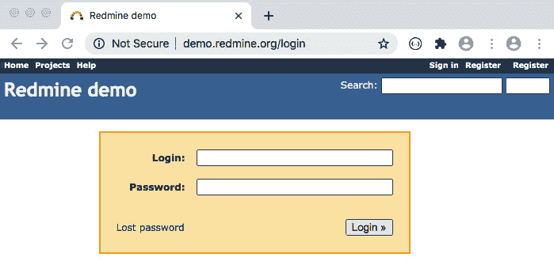

图 1.2 – Redmine 登录页面

让我们分解我们需要执行登录操作的动作：

1.  点击**登录**链接。

1.  在**登录**输入框中输入登录详情。

1.  在**密码**输入框中输入密码。

1.  点击**登录**按钮。

登录成功后我们会看到如下内容：

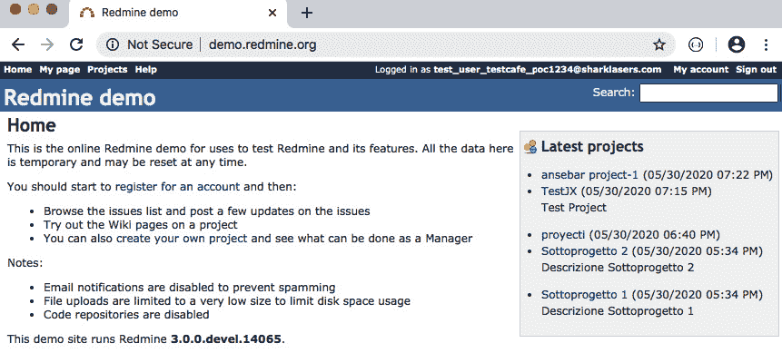

图 1.4 – Redmine 登录后的页面

图 1.3 – Redmine 登录后的页面

为了确认您已正确登录，请检查用户名是否显示在页面右上角。就这样 – 我们的第一个测试用例准备好了！

但甚至在登录之前，我们还需要创建一个新的测试用户。我们将为每次新的测试运行做这件事 – 这是可以接受的，因为 Redmine 示例门户会定期清除所有用户。为了安全起见，对于测试用户的电子邮件，我们将使用临时电子邮件服务之一 – `test_user_testcafe_poc{随机数字}@sharklasers.com` – 以及密码 – `test_user_testcafe_poc`。

为了更结构化地编写测试用例，让我们逐一将它们分解成块。

### 创建新用户

按照以下步骤创建新用户：

1.  点击**注册**链接。

1.  填写**登录**字段。

1.  填写**密码**字段。

1.  填写**确认**字段。

1.  填写**名字**字段。

1.  填写**姓氏**字段。

1.  填写**电子邮件**字段。

1.  点击**提交**按钮。

预期结果是**您的账户已激活。您现在可以登录。**通知，应如下显示：

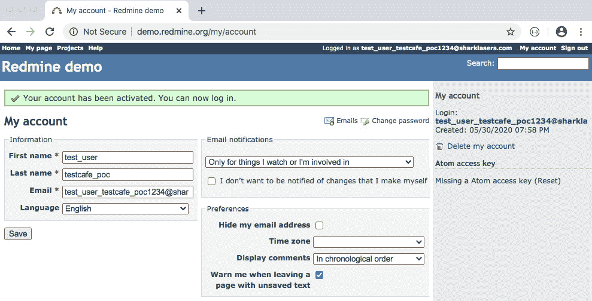

图 1.4 – 账户已激活

### 登录

按照以下步骤进行登录：

1.  点击**登录**链接。

1.  填写**登录**字段。

1.  填写**密码**字段。

1.  点击**登录**按钮。

预期结果是用户名应该在页面右上角显示：

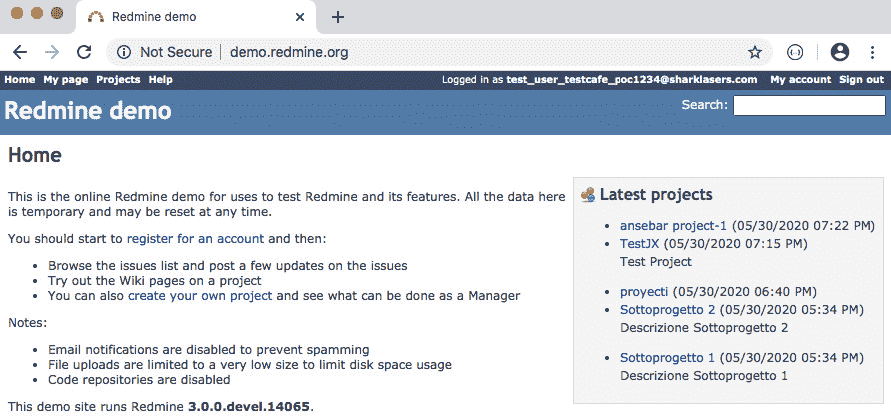

图 1.5 – 显示用户名

### 注销

按照以下步骤注销：

1.  登录。

1.  点击**注销**按钮。

预期结果是登录链接应该显示在页面右上角：

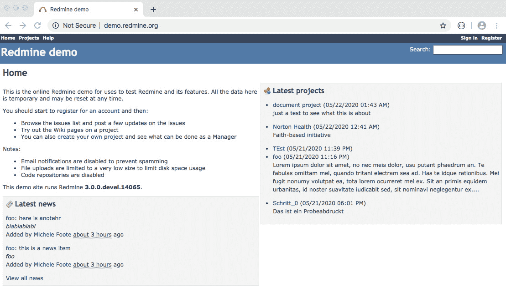

图 1.6 – 显示登录链接

### 创建新项目

按照以下步骤创建新项目：

1.  登录。

1.  点击顶部面板中的**项目**链接。

1.  点击**新建项目**链接。

1.  填写**名称**字段。

1.  点击**创建**按钮。

预期结果是**成功创建**的通知显示在顶部：

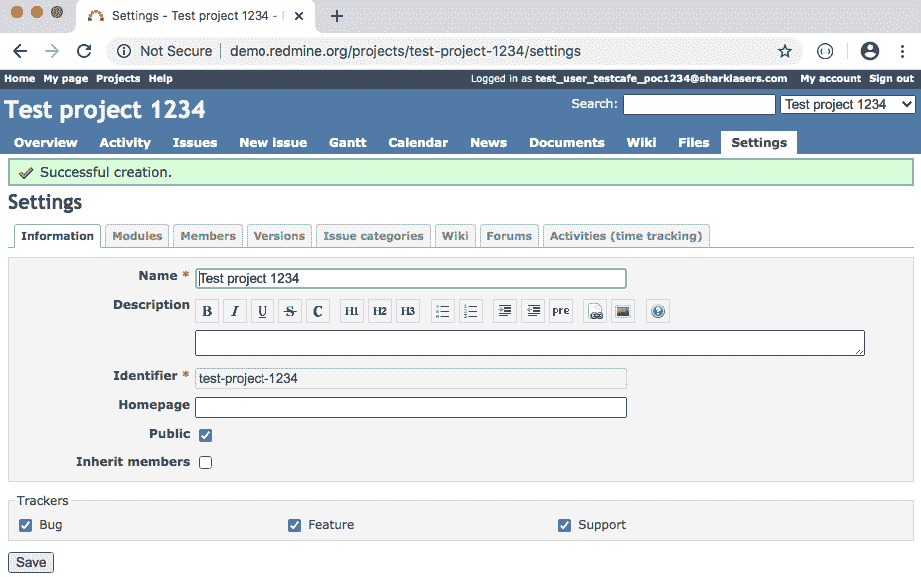

图 1.7 – 成功创建。通知显示

### 创建新问题

按照以下步骤创建新问题：

1.  登录。

1.  点击顶部面板中的**项目**链接。

1.  点击项目链接。

1.  点击**新问题**链接。

1.  填写**名称**字段。

1.  填写**描述**字段。

1.  将**优先级**设置为**高**。

1.  点击**创建**按钮。

预期结果是**问题创建成功**的通知应该显示：

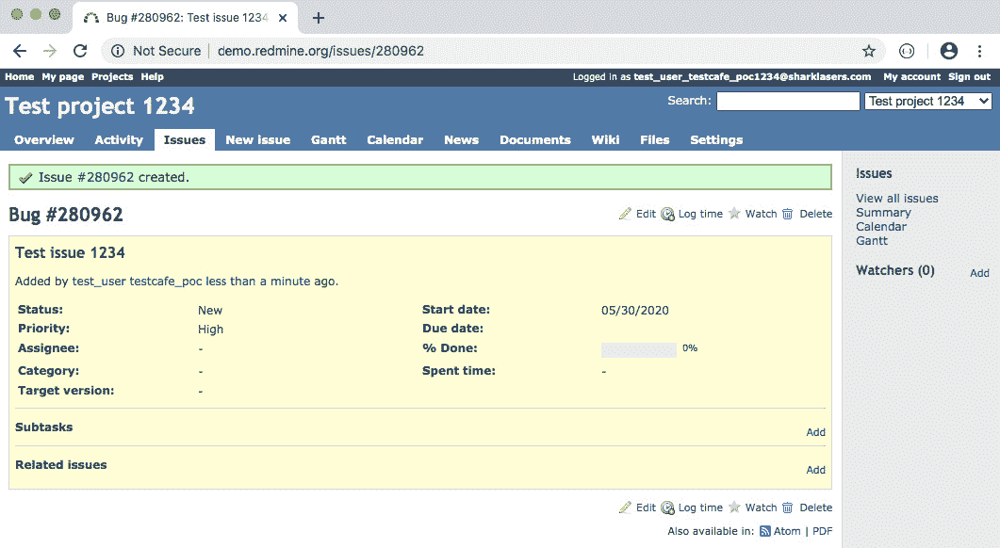

图 1.8 – 显示问题创建成功。通知

### 验证问题是否显示在项目页面上

按照以下步骤验证问题是否显示在项目页面上：

1.  登录。

1.  创建一个新问题。

1.  点击顶部面板中的**项目**链接。

1.  点击项目链接。

1.  点击**问题**链接。

预期结果是问题链接应该显示：

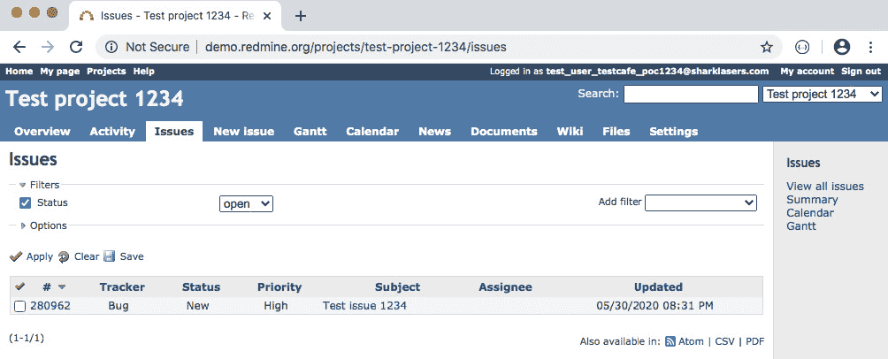

图 1.9 – 显示问题链接

### 更新问题

按照以下步骤更新问题：

1.  登录。

1.  创建一个新问题。

1.  点击顶部面板中的**项目**链接。

1.  点击项目链接。

1.  点击**问题**链接。

1.  点击问题链接。

1.  点击**编辑**链接。

1.  清除**主题**字段并填写新的主题。

1.  将**优先级**设置为**正常**。

1.  点击**提交**按钮。

预期结果是**成功更新**的通知应该显示：

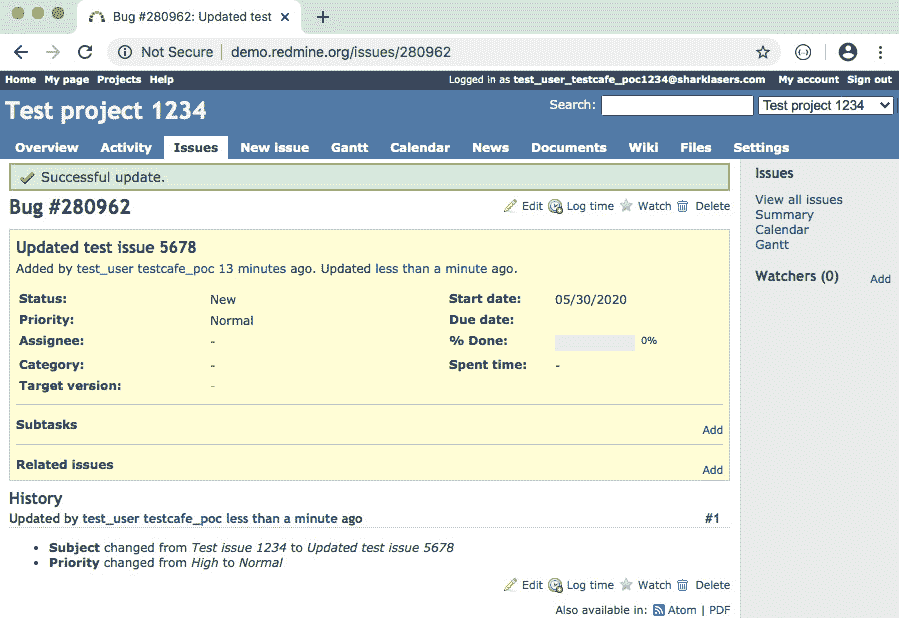

图 1.10 – 成功更新。通知显示

### 验证更新后的问题是否显示在项目页面上

按照以下步骤验证更新后的问题是否显示在项目页面上：

1.  登录。

1.  创建一个新问题。

1.  点击顶部面板中的**项目**链接。

1.  点击项目链接。

1.  点击**问题**链接。

预期结果是更新后的问题链接应该显示：

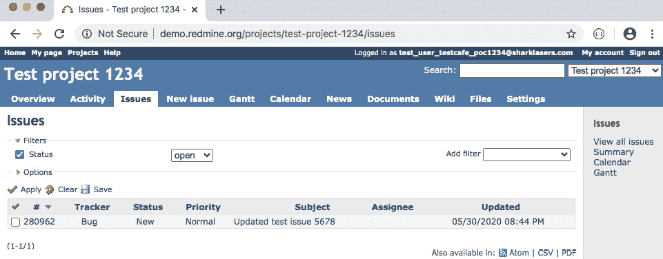

图 1.11 – 更新后的问题链接显示

### 搜索问题

按照以下步骤搜索问题：

1.  登录。

1.  创建一个新问题。

1.  打开**搜索**页面。

1.  在**搜索**字段中输入问题的主题。

1.  点击**提交**按钮。

预期结果是问题链接应显示：

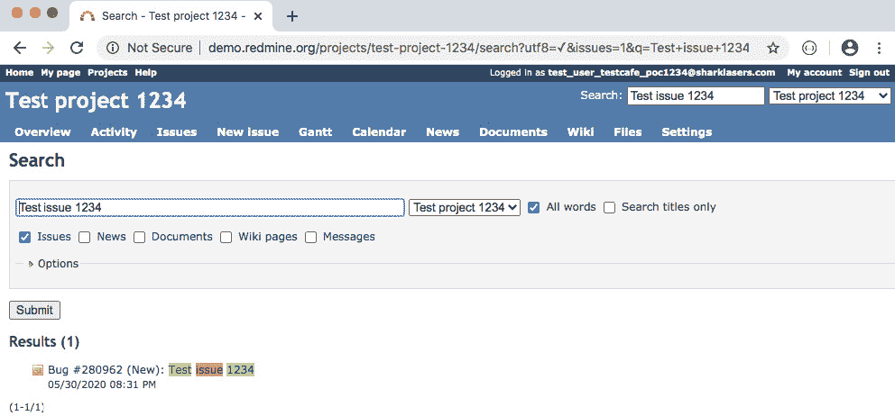

图 1.12 – 显示问题链接

### 删除问题

按照以下步骤删除问题：

1.  登录。

1.  创建一个新问题。

1.  点击顶部面板中的**项目**链接。

1.  点击项目链接。

1.  点击**问题**链接。

1.  点击问题链接。

1.  点击**删除**链接。

1.  在浏览器模态窗口中确认删除。

预期结果是应显示**无数据可显示**的通知：

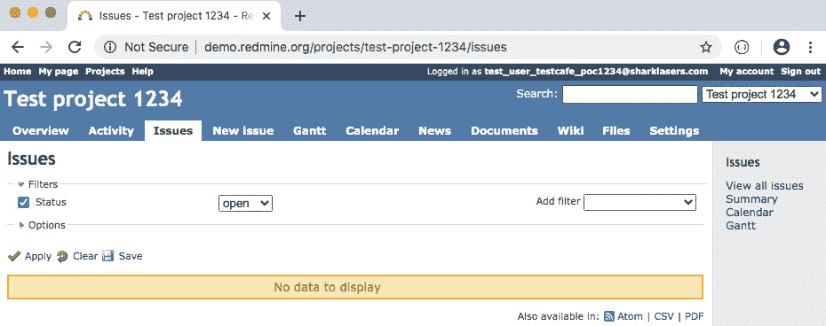

图 1.13 – 显示无数据可显示的通知

### 上传文件

按照以下步骤上传文件：

1.  登录。

1.  点击顶部面板中的**项目**链接。

1.  点击项目链接。

1.  点击**文件**链接。

1.  点击**新建**文件链接。

1.  设置文件的路径。

1.  点击**添加**按钮。

预期结果是文件链接和 MD5 校验和应显示：

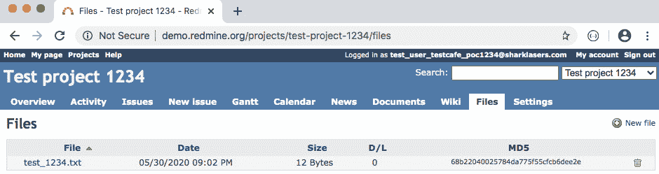

图 1.14 – 显示文件链接和 MD5 校验和

### 删除文件

按照以下步骤删除文件：

1.  登录。

1.  上传新文件。

1.  点击顶部面板中的**项目**链接。

1.  点击项目链接。

1.  点击**文件**链接。

1.  点击垃圾桶图标。

1.  在浏览器模态窗口中确认删除。

预期结果是文件链接和 MD5 校验和不应显示：

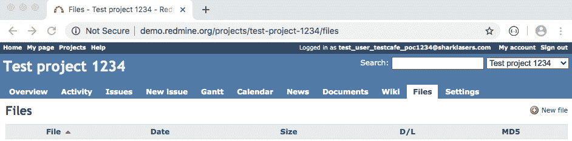

图 1.15 – 文件链接和 MD5 校验和未显示

虽然这个测试套件相对简单构建，但它展示了 TestCafe 的一些最显著特性。此外，它演示了在免费且易于使用的网站上运行测试，并且不需要你构建和部署自己的服务器或后端服务。

# 摘要

在本章中，我们回顾了 TestCafe 是什么以及其主要特性。在比较 TestCafe 与其旧的和经典的竞争对手 – Selenium – 时，我们观察了两个框架的优缺点。Selenium 与 TestCafe 之间的主要区别在于 Selenium 更为重量级，因为它通过与浏览器进程本身交互，通过 Selenium 服务器运行代码，而 TestCafe 在其中插入了一个代理，该代理重写每个 URL 并将测试脚本注入浏览器。它作为一个 Node.js 进程运行，可以在 Node.js 和浏览器环境中执行操作。TestCafe 的主要目标是提供一个现代工具，以减轻主要的测试自动化痛点，并提供一种方便的方式来设置、维护和创建新的测试。

我们也经历了测试项目，并制定了一个计划，即针对即将到来的自动化，哪些测试用例应该被覆盖。

在下一章中，我们将更深入地探讨，看看 TestCafe 在底层是如何运行的，包括它有哪些 API 以及内置的等待函数如何帮助我们将测试用例转换成快速且可靠的自动化测试套件。
