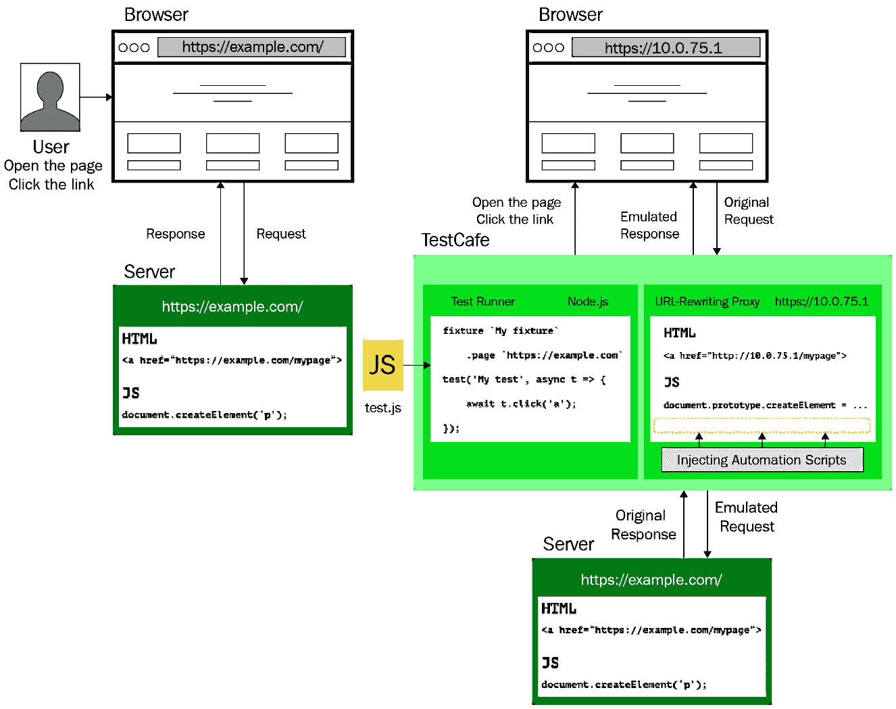

# 第二章：*第二章：探索 TestCafe 的内部机制*

本章的主要目标是学习 TestCafe 是如何在内部工作的，以及它如何被用于**测试自动化**来覆盖网站和门户的不同功能。我们将熟悉 TestCafe 的架构、其 API 和自定义客户端代码。

这些主题将使我们能够了解 TestCafe 提供的哪些主要方法和函数，以及如何调用它们。

在本章中，我们将涵盖以下主要内容：

+   探索 TestCafe 架构。

+   了解 TestCafe API。

+   执行自定义客户端代码。

# 探索 TestCafe 架构

从时间的开始，端到端 Web 测试框架一直依赖于外部驱动程序来在真实浏览器中模拟用户操作。然而，这种方法有几个缺点：

+   **第三方依赖和有限支持的浏览器数量**：你必须为每个测试环境（有时甚至为每个测试运行）下载、安装、配置和更新额外的驱动程序或库。除此之外，你只能使用每个驱动程序支持的浏览器。

+   **缺乏灵活性**：旧工具无法直接在测试页面上操作。只要测试代码不干扰应用程序代码，直接在测试页面上操作可以使工具执行许多额外的场景和解决方案。例如，这样它可以添加和删除样式或更改测试页面上任何元素的可见性。

+   **代码重复**：传统的测试框架在整个测试运行期间使用相同的浏览器实例，从测试到测试保持被测试的 Web 应用程序状态（并在 cookies 和存储中保持相同的值）。因此，端到端测试在测试之间清除 Web 应用程序状态以避免干扰时，有大量的重复代码。

然而，TestCafe 为每个这些问题都提供了一个解决方案。

TestCafe 架构背后的核心思想是用户不需要任何外部驱动程序来运行端到端浏览器测试。相反，所有模拟用户动作的测试脚本都可以从页面本身执行。这使得真正的跨平台和跨浏览器方法成为可能，因为测试将能够在任何具有现代浏览器的设备上运行！

每个测试执行完成后，TestCafe 都会清除浏览器状态：它会删除 cookies，清除`localStorage`和`sessionStorage`，并重新加载页面。如果你并行启动多个测试，TestCafe 会在独立的服务器端上下文中执行每个测试运行，以防止服务器端冲突。

TestCafe 的执行可以分为两个部分：

+   服务器端（在 Node.js 进程中）。

+   客户端（在浏览器中）。

让我们来看看这些部分的每一个。

## 服务器端

测试代码在**服务器端**的 Node.js 环境中执行。这使得 TestCafe 能够利用独立服务器端代码的优点，包括在测试之前启动测试的 Web 应用程序服务器，以及增强对测试环境和测试执行的掌控。

在 Node.js 中执行测试代码提供了许多优点：

+   可以在测试中完成数据库准备和应用程序的启动。

+   测试可以访问服务器的文件系统，因此你可以读取测试所需的数据或创建文件。

+   测试可以使用 Node.js 的所有最新语法功能。此外，你还可以包含并利用任何 Node.js 第三方包。

+   由于测试逻辑与自动化脚本分离，提高了稳定性和执行速度。

由于 Node.js 代码在服务器上执行，它无法直接访问页面或浏览器的**文档对象模型 (DOM)**，但这由具有访问 DOM 并在浏览器上下文中执行的定制客户端函数处理。

## 客户端

TestCafe 自动化脚本旨在模拟任何测试页面上用户的行为。它们的主要目标是让你能够编写高级跨浏览器测试，因此元素聚焦、触发事件和处理属性的方式与真实人类在浏览器中操作的方式相同。

模拟用户活动的脚本（TestCafe 内部脚本）在浏览器中测试页面的**客户端**上运行。这使得 TestCafe 能够利用浏览器脚本的优点，包括内置的智能等待、移动测试和用户角色。为了使客户端代码在浏览器中工作，TestCafe 在服务器上代理测试页面并将脚本注入其代码中。这种方法也被称为反向代理。当你运行 TestCafe 测试时，浏览器地址栏显示的 URL 前缀有一些数字——这是因为 TestCafe 使用其自己的开源 URL 重写代理 ([`github.com/DevExpress/testcafe-hammerhead`](https://github.com/DevExpress/testcafe-hammerhead)) 并代理测试页面。

当你使用 TestCafe 运行测试时，反向代理会自动在你的计算机上本地启动。它将自动化脚本注入测试页面，因此页面代码或与之通信的资源都无法知道页面已被修改。换句话说，当 TestCafe 代理测试页面时，它会添加自动化脚本并将测试页面上所有 URL 重写以指向代理：



Figure 2.1 – TestCafe 反向代理在用户的浏览器和 Web 服务器之间

当浏览器引用这些新的、重写的 URL 时，原始资源也会以相同的方式代理和增强。TestCafe 还模拟浏览器 API 以将自动化脚本与页面其余代码分离。代理机制绝对安全 – 它保证页面看起来像是在原始 URL 上托管，即使是测试代码也是如此。

在本节中，我们回顾了 TestCafe 从服务器和客户端操作的方式。我们还了解了这种架构的主要优势，包括在测试之前预览应用程序的可能性、扩展对测试环境的控制、代理和注入脚本，这使智能等待、移动测试和用户角色成为可能，我们将在稍后讨论这些内容。

TestCafe 支持 JavaScript – 这是网页开发中最受欢迎的编程语言 – 这允许大多数用户使用他们现有的编码技能，并最小化了新手的学习曲线。除此之外，它清晰的 API 使测试易于创建、阅读和维护。因此，让我们看看 TestCafe 提供了哪些方法。

# 了解 TestCafe API

由于服务器端代码在 Node.js 中运行，因此测试应该用 JavaScript（TypeScript 和 CoffeeScript 也受支持，但最终一切都应该转换为 JavaScript）编写。

TestCafe 使用一个简约的 API，它提供不到几十个方法，这些方法随后被转换成页面上的用户操作。由于我们的测试将使用 TestCafe API 方法与页面交互，让我们回顾 TestCafe 支持的主要交互组：

+   元素选择。

+   操作。

+   断言。

+   用户角色。

让我们更详细地了解这些交互中的每一个。

## 元素选择

TestCafe 使用一个具有内置等待的高级机制来定位目标元素以执行操作或断言。要执行操作（例如点击、悬停、输入等）或进行断言，您首先应识别目标页面元素。这就像指定一个标准的 CSS 选择器一样简单。对于更复杂的情况，您可以链式调用方法（例如，例如，通过类名获取一个元素，然后获取其第二个子元素，最后获取其第三个兄弟元素）。选择器字符串应传递给链式 `Selector` 构造函数以创建选择器。

例如，您可以点击具有 `button-test` 类的按钮，如下所示：

```js
const { Selector } = require('testcafe');const buttonTest = Selector('.button-test');
```

对于更复杂的情况，您可以通过链式选择器遍历 DOM 树：

```js
const { Selector } = require('testcafe');const linkTest = Selector('#block-test')    .child('a')    .withAttribute('href', 'https://test-site.com/main.html')    .withText('Second link');
```

这个选择器链所做的是以下内容：

1.  选择具有 `block-test` id 的元素。

1.  选择其子元素。

1.  通过 `a` 标签过滤它们。

1.  选择具有包含 `https://test-site.com/main.html` 的 `href` 属性的元素。

1.  选择包含 `Second link` 文本的元素。

    注意

    如果一个选择器匹配多个元素，后续的方法将返回所有匹配的元素的结果。

TestCafe 提供了多种方法来搜索相对于所选元素的位置的元素（请注意，所有这些方法都应该以 `Selector(cssSelector)` 开头）。大多数这些方法接受 `index` 作为参数，它应该是一个基于零的数字（0 将是集合中最接近的相对元素）。如果数字是负数，则从匹配集的末尾开始计数。以下是一些方法：

+   `.find(cssSelector)`: 在匹配集中查找所有节点的后代节点，并使用 CSS 选择器进行筛选（CSS 选择器应该是一个字符串）([`devexpress.github.io/testcafe/documentation/reference/test-api/selector/find.html`](https://devexpress.github.io/testcafe/documentation/reference/test-api/selector/find.html)).

+   `.parent(index)`: 查找匹配集中所有节点之父元素（集合中的第一个元素是最接近的父元素）([`devexpress.github.io/testcafe/documentation/reference/test-api/selector/parent.html`](https://devexpress.github.io/testcafe/documentation/reference/test-api/selector/parent.html)).

+   `.child(index)`: 查找匹配集中所有节点的子元素 ([`devexpress.github.io/testcafe/documentation/reference/test-api/selector/child.html`](https://devexpress.github.io/testcafe/documentation/reference/test-api/selector/child.html)).

+   `.sibling(index)`: 查找匹配集中所有节点的兄弟元素 ([`devexpress.github.io/testcafe/documentation/reference/test-api/selector/sibling.html`](https://devexpress.github.io/testcafe/documentation/reference/test-api/selector/sibling.html)).

+   `.nextSibling(index)`: 查找匹配集中所有节点的后续兄弟元素 ([`devexpress.github.io/testcafe/documentation/reference/test-api/selector/nextsibling.html`](https://devexpress.github.io/testcafe/documentation/reference/test-api/selector/nextsibling.html)).

+   `.prevSibling(index)`: 查找匹配集中所有节点的前一个兄弟元素，并通过索引进行筛选 ([`devexpress.github.io/testcafe/documentation/reference/test-api/selector/prevsibling.html`](https://devexpress.github.io/testcafe/documentation/reference/test-api/selector/prevsibling.html)).

现在，让我们看看从选择器中筛选元素的方法。与之前一样，所有这些方法都应该以 `Selector(cssSelector)` 开头。以下是一些方法：

+   `.nth(index)`: 选择匹配集中指定索引的元素。在这里，`index` 参数应该是一个基于零的数字（0 将是集合中最接近的相对元素）。如果它是负数，则从匹配集的末尾开始计数([`devexpress.github.io/testcafe/documentation/reference/test-api/selector/nth.html`](https://devexpress.github.io/testcafe/documentation/reference/test-api/selector/nth.html)).

+   `.withText(text)`: 选择包含指定文本的元素。在这里，`text` 是元素的文本内容（`text` 参数是一个区分大小写的字符串）或一个应与元素文本匹配的 **正则表达式**（**RegExp**）([`devexpress.github.io/testcafe/documentation/reference/test-api/selector/withtext.html`](https://devexpress.github.io/testcafe/documentation/reference/test-api/selector/withtext.html)).

+   `.withExactText(text)`: 选择其文本内容严格匹配指定文本的元素。在这里，`text` 是元素的文本内容（`text` 参数是一个区分大小写的字符串）([`devexpress.github.io/testcafe/documentation/reference/test-api/selector/withexacttext.html`](https://devexpress.github.io/testcafe/documentation/reference/test-api/selector/withexacttext.html)).

+   `.withAttribute(attrName[, attrValue])`: 选择包含指定属性的元素。在这里，`attrName` 可以是一个区分大小写的字符串或一个 `RegExp`，并且可选的 `attrValue` 也可以是一个区分大小写的字符串或一个 `RegExp` ([`devexpress.github.io/testcafe/documentation/reference/test-api/selector/withattribute.html`](https://devexpress.github.io/testcafe/documentation/reference/test-api/selector/withattribute.html)).

+   `.filterVisible()`: 选择不具有 `display: none;` 或 `visibility: hidden;` CSS 属性并且具有非零宽度和高度的元素 ([`devexpress.github.io/testcafe/documentation/reference/test-api/selector/filtervisible.html`](https://devexpress.github.io/testcafe/documentation/reference/test-api/selector/filtervisible.html)).

+   `.filterHidden()`: 选择具有 `display: none;` 或 `visibility: hidden;` CSS 属性，或宽度或高度为零的元素 ([`devexpress.github.io/testcafe/documentation/reference/test-api/selector/filterhidden.html`](https://devexpress.github.io/testcafe/documentation/reference/test-api/selector/filterhidden.html)).

+   `.filter(cssSelector)`: 选择与 CSS 选择器匹配的元素（CSS 选择器应是一个用于过滤子元素的字符串）。此外，您还可以提供 `filterFn`（一个用于过滤元素的函数谓词）和可选的 `dependencies`（一个包含函数、变量或传递给 `filterFn` 函数的对象）([`devexpress.github.io/testcafe/documentation/reference/test-api/selector/filter.html`](https://devexpress.github.io/testcafe/documentation/reference/test-api/selector/filter.html)).

当执行选择器时，TestCafe 将等待目标节点出现在页面上，直到选择器超时时间到期。以下情况下，您可以指定超时时间（以毫秒为单位）：

+   `.testcaferc.json` 配置文件中的 `selectorTimeout` 配置选项 ([`devexpress.github.io/testcafe/documentation/reference/configuration-file.html`](https://devexpress.github.io/testcafe/documentation/reference/configuration-file.html)).

+   `--selector-timeout` 命令行选项 ([`devexpress.github.io/testcafe/documentation/reference/command-line-interface.html#--selector-timeout-ms`](https://devexpress.github.io/testcafe/documentation/reference/command-line-interface.html#--selector-timeout-ms)).

+   `Selector` ([`devexpress.github.io/testcafe/documentation/reference/test-api/selector/constructor.html#optionstimeout`](https://devexpress.github.io/testcafe/documentation/reference/test-api/selector/constructor.html#optionstimeout)) 用于设置任何特定元素的超时。

在超时期间，选择器会重新运行，直到返回一个 DOM 元素或超时。如果 TestCafe 在 DOM 中找不到相应的节点，则测试会被标记为失败。

动作

TestCafe API 提供了一套动作方法来与页面交互（例如点击、输入、选择文本、悬停等）。您可以将它们依次以链式方式调用。所有这些方法都应该以 `t` 开头，因为它们是测试控制器对象的方法 ([`devexpress.github.io/testcafe/documentation/reference/test-api/testcontroller/`](https://devexpress.github.io/testcafe/documentation/reference/test-api/testcontroller/))。此外，`selector` 可以是一个字符串、选择器、DOM 节点、函数或 Promise；并且您可以可选地使用 `options`，它是一个包含动作补充参数的选项集的对象（除非另有说明）。以下是所有主要动作方法：

+   `.click(selector[, options])`: 在页面上点击一个元素 ([`devexpress.github.io/testcafe/documentation/reference/test-api/testcontroller/click.html`](https://devexpress.github.io/testcafe/documentation/reference/test-api/testcontroller/click.html)).

+   `.doubleClick(selector[, options])`: 在页面上双击一个元素 ([`devexpress.github.io/testcafe/documentation/reference/test-api/testcontroller/doubleclick.html`](https://devexpress.github.io/testcafe/documentation/reference/test-api/testcontroller/doubleclick.html)).

+   `.rightClick(selector[, options])`: 在页面上右击一个元素 ([`devexpress.github.io/testcafe/documentation/reference/test-api/testcontroller/rightclick.html`](https://devexpress.github.io/testcafe/documentation/reference/test-api/testcontroller/rightclick.html)).

+   `.pressKey(keys[, options])`: 按下指定的键盘键。在这里，`keys` 是要按下的键和键组合的序列 ([`devexpress.github.io/testcafe/documentation/reference/test-api/testcontroller/presskey.html`](https://devexpress.github.io/testcafe/documentation/reference/test-api/testcontroller/presskey.html)).

+   `.navigateTo(url)`: 导航到指定的 URL。在这里，`url` 是要导航到的 URL 字符串（可以是相对于当前页面的绝对路径或相对路径）([`devexpress.github.io/testcafe/documentation/reference/test-api/testcontroller/navigateto.html`](https://devexpress.github.io/testcafe/documentation/reference/test-api/testcontroller/navigateto.html)).

+   `.typeText(selector, text[, options])`: 将指定的文本输入到输入元素中。在这里，`text` 是要输入到指定网页元素的文本字符串 ([`devexpress.github.io/testcafe/documentation/reference/test-api/testcontroller/typetext.html`](https://devexpress.github.io/testcafe/documentation/reference/test-api/testcontroller/typetext.html)).

+   `.selectText(selector[, startPos][, endPos][, options])`: 在不同类型的输入元素中选择文本。在这里，`startPos` 是选择开始位置的数字（基于零的整数，默认为 0）。可选的 `endPos` 是选择结束位置的数字（基于零的整数；默认等于可见文本内容的长度）([`devexpress.github.io/testcafe/documentation/reference/test-api/testcontroller/selecttext.html`](https://devexpress.github.io/testcafe/documentation/reference/test-api/testcontroller/selecttext.html)).

+   `.hover(selector[, options])`: 将鼠标指针悬停在网页元素上 ([`devexpress.github.io/testcafe/documentation/reference/test-api/testcontroller/hover.html`](https://devexpress.github.io/testcafe/documentation/reference/test-api/testcontroller/hover.html)).

+   `.drag(selector, dragOffsetX, dragOffsetY[, options])`: 将元素拖动到指定的偏移位置。在这里，`dragOffsetX` 是从鼠标指针原始位置到放下坐标的 *X* 偏移像素数，而 `dragOffsetY` 是从鼠标指针原始位置到放下坐标的 *Y* 偏移像素数 ([`devexpress.github.io/testcafe/documentation/reference/test-api/testcontroller/drag.html`](https://devexpress.github.io/testcafe/documentation/reference/test-api/testcontroller/drag.html)).

+   `.dragToElement(selector, destinationSelector[, options])`: 将元素拖动到另一个网页元素上。在这里，`destinationSelector` 应该标识将成为放下位置的网页元素 ([`devexpress.github.io/testcafe/documentation/reference/test-api/testcontroller/dragtoelement.html`](https://devexpress.github.io/testcafe/documentation/reference/test-api/testcontroller/dragtoelement.html)).

+   `.setFilesToUpload(selector, filePath)`: 将文件路径添加到指定的文件上传输入中。在这里，`filePath`是一个字符串或一个包含上传文件路径（或多个路径，如果是数组）的数组。相对路径相对于测试文件所在的文件夹解析（[`devexpress.github.io/testcafe/documentation/reference/test-api/testcontroller/setfilestoupload.html`](https://devexpress.github.io/testcafe/documentation/reference/test-api/testcontroller/setfilestoupload.html)）。

+   `.clearUpload(selector)`: 从指定的文件上传输入中删除所有文件路径（[`devexpress.github.io/testcafe/documentation/reference/test-api/testcontroller/clearupload.html`](https://devexpress.github.io/testcafe/documentation/reference/test-api/testcontroller/clearupload.html)）。

+   `.takeScreenshot([options])`: 对整个页面进行截图。可选的`options`对象可以包含以下属性：包含截图文件相对路径和名称的`path`字符串或一个指定是否捕获整个页面的`fullPage`布尔值（默认为 false），包括由于溢出而不可见的页面内容（[`devexpress.github.io/testcafe/documentation/reference/test-api/testcontroller/takescreenshot.html`](https://devexpress.github.io/testcafe/documentation/reference/test-api/testcontroller/takescreenshot.html)）。

+   `.takeElementScreenshot(selector[, path][, options])`: 对指定的网页元素进行截图。在这里，`path`（一个可选参数）是一个字符串，包含截图文件的相对路径和名称（[`devexpress.github.io/testcafe/documentation/reference/test-api/testcontroller/takeelementscreenshot.html`](https://devexpress.github.io/testcafe/documentation/reference/test-api/testcontroller/takeelementscreenshot.html)）。

+   `.switchToIframe(selector)`: 将测试的浏览上下文切换到指定的`<iframe>`（[`devexpress.github.io/testcafe/documentation/reference/test-api/testcontroller/switchtoiframe.html`](https://devexpress.github.io/testcafe/documentation/reference/test-api/testcontroller/switchtoiframe.html)）。

+   `.switchToMainWindow()`: 将测试的浏览上下文从`<iframe>`切换回主窗口（[`devexpress.github.io/testcafe/documentation/reference/test-api/testcontroller/switchtomainwindow.html`](https://devexpress.github.io/testcafe/documentation/reference/test-api/testcontroller/switchtomainwindow.html)）。

+   `.setNativeDialogHandler(fn(type, text, url)[, options])`: 指定一个处理函数来处理测试运行期间触发的原生对话框。在这里，`fn(type, text, url)` 可以是一个函数或客户端函数，每当触发原生对话框时都会被调用（`null` 用于删除原生对话框处理函数）。处理函数可以利用三个参数：`type`，它是一个字符串，表示原生对话框的类型（`confirm`、`alert`、`prompt` 或 `beforeunload`）；`text`，它是一个字符串，表示对话框的消息文本；以及 `url`，它是一个字符串，表示触发对话框的页面的 URL（用于检查对话框是否从主窗口或 `<iframe>` 中调用）([`devexpress.github.io/testcafe/documentation/reference/test-api/testcontroller/setnativedialoghandler.html`](https://devexpress.github.io/testcafe/documentation/reference/test-api/testcontroller/setnativedialoghandler.html))。

+   `.getNativeDialogHistory()`: 提供已触发的原生对话框的历史记录([`devexpress.github.io/testcafe/documentation/reference/test-api/testcontroller/getnativedialoghistory.html`](https://devexpress.github.io/testcafe/documentation/reference/test-api/testcontroller/getnativedialoghistory.html))。

+   `.resizeWindow(width, height)`: 将窗口调整大小以适应提供的宽度和高度，其中 `width` 是新宽度的值（以像素为单位），`height` 是新高度的值（以像素为单位）([`devexpress.github.io/testcafe/documentation/reference/test-api/testcontroller/resizewindow.html`](https://devexpress.github.io/testcafe/documentation/reference/test-api/testcontroller/resizewindow.html))。

+   `.resizeWindowToFitDevice(deviceName[, options])`: 将窗口调整大小以适应指定移动设备的屏幕，其中 `deviceName` 是设备名称的字符串([`devexpress.github.io/testcafe/documentation/reference/test-api/testcontroller/resizewindowtofitdevice.html`](https://devexpress.github.io/testcafe/documentation/reference/test-api/testcontroller/resizewindowtofitdevice.html))。

+   `.maximizeWindow()`: 最大化浏览器窗口([`devexpress.github.io/testcafe/documentation/reference/test-api/testcontroller/maximizewindow.html`](https://devexpress.github.io/testcafe/documentation/reference/test-api/testcontroller/maximizewindow.html))。

+   `.wait(timeout)`: 暂停测试执行指定的时间。在这里，`timeout` 是暂停时间的长度（以毫秒为单位）([`devexpress.github.io/testcafe/documentation/reference/test-api/testcontroller/wait.html`](https://devexpress.github.io/testcafe/documentation/reference/test-api/testcontroller/wait.html))。

## 断言

TestCafe 允许您验证元素、页面属性和参数（等于、包含、大于、匹配等）。要编写断言，请使用测试控制器的`t.expect`方法，后跟接受预期值和可选参数的断言方法；`message`是断言消息字符串，如果测试失败，则显示在报告中，而`options`是一个包含断言补充参数的选项对象。以下是 TestCafe 中所有内置的断言方法：

+   `.expect(actual).eql(expected[, message][, options])`: 验证`actual`值是否等于`expected`值。在这里，`actual`是任何类型的比较值，而`expected`是任何类型的预期值([`devexpress.github.io/testcafe/documentation/reference/test-api/testcontroller/expect/eql.html`](https://devexpress.github.io/testcafe/documentation/reference/test-api/testcontroller/expect/eql.html))。

+   `.expect(actual).notEql(expected[, message][, options])`: 验证`actual`值是否不等于`expected`值。在这里，`actual`是任何类型的比较值，而`expected`是任何类型的预期值，它不应等于`actual`([`devexpress.github.io/testcafe/documentation/reference/test-api/testcontroller/expect/noteql.html`](https://devexpress.github.io/testcafe/documentation/reference/test-api/testcontroller/expect/noteql.html))。

+   `.expect(actual).ok([message][, options])`: 验证`actual`值是否为`true`。在这里，`actual`是在断言中测试的任何类型的值（如果实际值为`true`，则断言将通过）([`devexpress.github.io/testcafe/documentation/reference/test-api/testcontroller/expect/ok.html`](https://devexpress.github.io/testcafe/documentation/reference/test-api/testcontroller/expect/ok.html))。

+   `.expect(actual).notOk([message][, options])`: 验证`actual`值是否为`false`。在这里，`actual`是在断言中测试的任何类型的值（如果实际值为`false`，则断言将通过）([`devexpress.github.io/testcafe/documentation/reference/test-api/testcontroller/expect/notok.html`](https://devexpress.github.io/testcafe/documentation/reference/test-api/testcontroller/expect/notok.html))。

+   `.expect(actual).contains(expected[, message][, options])`: 验证`actual`值是否包含`expected`值。在这里，`actual`是任何类型的比较值，而`expected`是任何类型的预期值（如果实际值包含预期值，则断言将通过）([`devexpress.github.io/testcafe/documentation/reference/test-api/testcontroller/expect/contains.html`](https://devexpress.github.io/testcafe/documentation/reference/test-api/testcontroller/expect/contains.html))。

+   `.expect(actual).notContains(expected[, message][, options])`: 验证`actual`值是否包含`expected`值。在这里，`actual`是任何类型的比较值，而`expected`是任何类型的预期值（如果实际值不包含预期值，则断言通过）([`devexpress.github.io/testcafe/documentation/reference/test-api/testcontroller/expect/notcontains.html`](https://devexpress.github.io/testcafe/documentation/reference/test-api/testcontroller/expect/notcontains.html)）。

+   `.expect(actual).typeOf(typeName[, message][, options])`: 断言`actual`值的类型是`typeName`。在这里，`actual`是任何类型的比较值，而`typeName`是实际值的预期类型字符串([`devexpress.github.io/testcafe/documentation/reference/test-api/testcontroller/expect/typeof.html`](https://devexpress.github.io/testcafe/documentation/reference/test-api/testcontroller/expect/typeof.html)）。

+   `.expect(actual).notTypeOf(typeName[, message][, options])`: 断言`actual`值的类型不是`typeName`。在这里，`actual`是任何类型的比较值，而`typeName`是导致断言失败的实际值类型的字符串([`devexpress.github.io/testcafe/documentation/reference/test-api/testcontroller/expect/nottypeof.html`](https://devexpress.github.io/testcafe/documentation/reference/test-api/testcontroller/expect/nottypeof.html)）。

+   `.expect(actual).gt(expected[, message][, options])`: 验证`actual`值是否大于`expected`值。在这里，`actual`是断言中测试的数字（如果实际值大于预期值，则断言通过）而`expected`是任何类型的预期值（[`devexpress.github.io/testcafe/documentation/reference/test-api/testcontroller/expect/gt.html`](https://devexpress.github.io/testcafe/documentation/reference/test-api/testcontroller/expect/gt.html)）。

+   `.expect(actual).gte(expected[, message][, options])`: 验证`actual`值是否大于或等于`expected`值。在这里，`actual`是断言中测试的数字（如果实际值大于或等于预期值，则断言通过），而`expected`是任何类型的预期值([`devexpress.github.io/testcafe/documentation/reference/test-api/testcontroller/expect/gte.html`](https://devexpress.github.io/testcafe/documentation/reference/test-api/testcontroller/expect/gte.html)）。

+   `.expect(actual).lt(expected[, message][, options])`: 验证`actual`值是否小于`expected`值。在这里，`actual`是断言中测试的数字（如果实际值小于预期值，则断言通过）而`expected`是任何类型的预期值([`devexpress.github.io/testcafe/documentation/reference/test-api/testcontroller/expect/lt.html`](https://devexpress.github.io/testcafe/documentation/reference/test-api/testcontroller/expect/lt.html)）。

+   `.expect(actual).lte(expected[, message][, options])`: 验证`actual`值是否小于或等于`expected`值。在这里，`actual`是断言中测试的数字（如果实际值小于或等于预期值，则断言将通过）而`expected`是任何类型的预期值（[`devexpress.github.io/testcafe/documentation/reference/test-api/testcontroller/expect/lte.html`](https://devexpress.github.io/testcafe/documentation/reference/test-api/testcontroller/expect/lte.html)）。

+   `.expect(actual).within(start, finish[, message][, options])`: 验证`actual`值是否在从开始到结束的指定范围内（边界是包含的）。在这里，`actual`是一个数字，`start`是下限的数字（包含），而`finish`是上限的数字（包含）([`devexpress.github.io/testcafe/documentation/reference/test-api/testcontroller/expect/within.html`](https://devexpress.github.io/testcafe/documentation/reference/test-api/testcontroller/expect/within.html)）。

+   `.expect(actual).notWithin(start, finish[, message][, options])`: 验证`actual`值是否不在从开始到结束的指定范围内（边界是包含的）。在这里，`actual`是一个数字，`start`是下限的数字（包含），而`finish`是上限的数字（包含）([`devexpress.github.io/testcafe/documentation/reference/test-api/testcontroller/expect/notwithin.html`](https://devexpress.github.io/testcafe/documentation/reference/test-api/testcontroller/expect/notwithin.html)）。

+   `.expect(actual).match(re[, message][, options])`: 验证`actual`值是否与`re`正则表达式匹配。在这里，`actual`是任何类型的比较值，而`re`是预期匹配实际值的正则表达式（[`devexpress.github.io/testcafe/documentation/reference/test-api/testcontroller/expect/match.html`](https://devexpress.github.io/testcafe/documentation/reference/test-api/testcontroller/expect/match.html)）。

+   `.expect(actual).notMatch(re[, message][, options])`: 验证`actual`值是否不匹配`re`正则表达式。在这里，`actual`是任何类型的比较值，而`re`是预期不匹配实际值的正则表达式（[`devexpress.github.io/testcafe/documentation/reference/test-api/testcontroller/expect/notmatch.html`](https://devexpress.github.io/testcafe/documentation/reference/test-api/testcontroller/expect/notmatch.html)）。

## 用户角色

TestCafe 具有内置的用户角色机制，用于模拟用户登录网站的行为。它还保存每个用户的登录状态，这些状态可以在测试的任何部分重复使用，以在用户账户之间切换。这种方法提供了访问一些独特功能：

+   在同一会话期间切换到之前使用的角色时，登录操作不会重复。例如，如果您在`beforeEach`钩子中激活一个角色，登录操作将只在第一个测试之前运行一次。所有后续的测试将仅重用现有的认证数据。

+   当您切换角色时，浏览器会自动导航回切换发生的页面，因此不需要为新的角色打开任何 URL（如果需要，此行为可以禁用）。

+   如果在测试期间您登录到多个网站，来自 cookie 和浏览器存储的认证数据将保存在活动角色中。当在同一测试中切换回此角色时，您将自动登录到所有网站。

+   一个匿名内置角色，可以注销所有账户。

让我们看看创建和使用角色的实际示例。

要创建和初始化一个角色，我们需要使用`Role`构造函数。然后，将登录页面 URL 和登录所需的操作传递给`Role`。以下代码块展示了这一过程：

```js
const { Role, Selector } = require('testcafe');const regularUser = Role('https://test-site.com/login', async (t) => {    await t.typeText('.login', 'TestUser')        .typeText('.password', 'testuserpass')        .click('#log-in');});const admin = Role('https://test-site.com/login', async (t) => {    await t.typeText('.login', 'TestAdmin')        .typeText('.password', 'testadminpass')        .click('#log-in');});const linkLoggedInUser = Selector('.link-logged-in-user');const linkLoggedInAdmin = Selector('.link-logged-in-admin');fixture('My first test Fixture').page('https://test-site.com');test('Test login with three users', async (t) => {    await t.useRole(regularUser)        .expect(linkLoggedInUser.exists).ok()        .useRole(admin)        .expect(linkLoggedInUser.exists).notOk()        .expect(linkLoggedInAdmin.exists).ok()        .useRole(Role.anonymous())        .expect(linkLoggedInUser.exists).notOk()        .expect(linkLoggedInAdmin.exists).notOk();});
```

在创建所有必需的角色之后，您可以在任何时候切换它们；角色在测试和固定装置之间共享。角色甚至可以创建在单独的文件中，然后在任何引用（需要或导入）此文件的测试固定装置中使用。

总结来说，在本节中，我们回顾了 TestCafe API 及其提供的主要方法。我们还学习了如何选择元素、进行断言以及利用用户角色在不同账户之间切换。现在，让我们看看如何在 TestCafe 中执行自定义客户端代码，以获得对浏览器的更多控制。

# 执行自定义客户端代码

使用 TestCafe，您可以创建可以在客户端（在浏览器中）运行的客户端函数，并返回任何可序列化的值。例如，您可以获取当前页面的 URL，设置 cookie，甚至操作页面上的任何元素。

在某些复杂场景中，TestCafe 帮助您编写在测试页面上执行的代码。以下是一些可以使用自定义客户端代码完成的任务示例：

+   从网页获取元素以进行进一步操作。TestCafe 允许您根据返回 DOM 节点的客户端代码创建选择器。您可以在服务器端测试中编写此代码，TestCafe 将在需要定位元素时在浏览器中运行这些函数：

    ```js
    const { Selector } = require('testcafe');const testElement = Selector(() => {    return document.querySelector('.test-class-name');});await t.click(testElement);
    ```

+   从客户端函数获取任何可序列化对象的数据，这些对象来自客户端（包括可以转换为 JSON 的任何对象）。与选择器不同，测试代码可以访问客户端函数返回的对象。通常，从客户端函数获取的数据用于断言不同的页面参数。以下是一个获取和验证页面 URL 的示例：

    ```js
    const { ClientFunction } = require('testcafe');const getPageUrl = ClientFunction(() => {    return window.location.href;});await t.expect(getPageUrl).eql('https://test-site.com');
    ```

+   将自定义代码注入到测试页面中。注入的脚本可以用来添加辅助函数或模拟浏览器 API：

    ```js
    fixture('My second test Fixture')    .page('https://test-site.com')    .clientScripts(        'assets/jquery-latest.js',        'scripts/location-mock.js'    );
    ```

    注意

    建议您避免使用自定义客户端代码更改 DOM。一个经验法则是仅使用客户端代码来探索页面，查找并返回信息给服务器。

您可以在以下链接中找到更多客户端脚本和注入的示例：

+   [`devexpress.github.io/testcafe/documentation/guides/basic-guides/obtain-client-side-info.html`](https://devexpress.github.io/testcafe/documentation/guides/basic-guides/obtain-client-side-info.html).

+   [`devexpress.github.io/testcafe/documentation/guides/advanced-guides/inject-client-scripts.html`](https://devexpress.github.io/testcafe/documentation/guides/advanced-guides/inject-client-scripts.html).

正如我们刚刚发现的，TestCafe 客户端函数对于不同的浏览器操作和获取测试中需要验证的额外数据非常有用。

# 摘要

在本章中，我们了解了 TestCafe 的工作原理。我们熟悉了 TestCafe 的架构，看到了它在客户端和服务器端的性能表现，并学习了选择元素、动作、断言、角色和自定义客户端代码的策略。

所有这些内容都将在接下来的章节中用于编写我们自己的端到端测试套件。除此之外，你还可以随时将本章作为参考，搜索任何特定的方法或断言，并查看其调用方式和功能。

现在，让我们从 TestCafe 的主要方法和函数转向更实用的方面，比如为我们的未来自动化测试设置测试环境。
