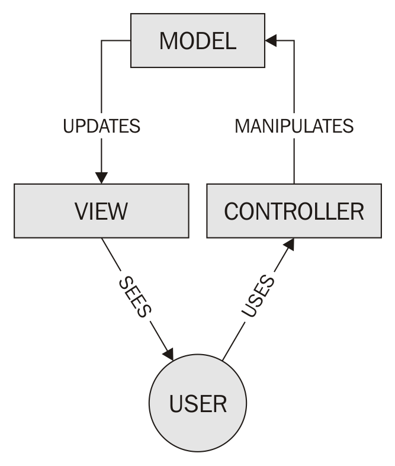

# 第一章：MERN 堆栈简介

在本章中，我们将涵盖以下主题：

+   MVC 架构模式

+   安装和配置 MongoDB

+   安装 Node.js

+   安装 NPM 包

# 技术要求

您需要一个 IDE、Visual Studio Code、Node.js 和 MongoDB。您还需要安装 Git，以便使用本书的 Git 存储库。

本章的代码文件可以在 GitHub 上找到：

[`github.com/PacktPublishing/MERN-Quick-Start-Guide/tree/master/Chapter01`](https://github.com/PacktPublishing/MERN-Quick-Start-Guide/tree/master/Chapter01)

查看以下视频以查看代码的运行情况：

[`goo.gl/1zwc6F`](https://goo.gl/1zwc6F)

# 介绍

MERN 堆栈是由四个主要组件组成的解决方案：

+   **MongoDB**：使用面向文档的数据模型的数据库。

+   **ExpressJS**：用于构建 Web 应用程序和 API 的 Web 应用程序框架。

+   **ReactJS**：用于构建用户界面的声明性、基于组件的、同构的 JavaScript 库。

+   **Node.js**：基于 Chrome 的 V8 JavaScript 引擎构建的跨平台 JavaScript 运行时环境，允许开发人员构建各种工具、服务器和应用程序。

这些构成 MERN 堆栈的基本组件都是开源的，因此由一群伟大的开发者维护和开发。将这些组件联系在一起的是一种共同的语言，JavaScript。

本章的食谱主要关注设置开发环境以使用 MERN 堆栈。

您可以自由选择代码编辑器或 IDE。但是，如果您在选择 IDE 方面有困难，我建议您尝试一下 Visual Studio Code。

# MVC 架构模式

大多数现代 Web 应用程序都实现了 MVC 架构模式。它由三个相互连接的部分组成，用于分离 Web 应用程序中信息的内部表示：

+   **模型**：管理应用程序的业务逻辑，确定数据应该如何存储、创建和修改

+   **视图**：数据或信息的任何可视表示

+   **控制器**：解释用户生成的事件并将其转换为命令，以便模型和视图相应地更新：



**关注点分离**（**SoC**）设计模式将前端与后端代码分开。遵循 MVC 架构模式，开发人员能够遵循关注点分离设计模式，从而实现一致和可管理的应用程序结构。

以下章节中的食谱实现了这种架构模式，以分离前端和后端。

# 安装和配置 MongoDB

官方的 MongoDB 网站提供了包含二进制文件的最新软件包，可用于在 Linux、OS X 和 Windows 上安装 MongoDB。

# 准备就绪

访问 MongoDB 的官方网站[`www.mongodb.com/download-center`](https://www.mongodb.com/download-center)，选择 Community Server，然后选择您首选的软件操作系统版本并下载。

安装 MongoDB 并进行配置可能需要额外的步骤。

# 如何做...

访问 MongoDB 的文档网站[`docs.mongodb.com/master/installation/`](https://docs.mongodb.com/master/installation/)获取说明，并在教程部分检查您特定平台的内容。

安装后，可以以独立方式启动`MongoDB-`的守护进程`mongod-`的实例：

1.  打开一个新的终端

1.  创建一个名为`data`的新目录，其中包含 Mongo 数据库

1.  输入`mongod --port 27017 --dbpath /data/`启动一个新实例并创建一个数据库

1.  打开另一个终端

1.  输入`mongo --port 27017`连接到 Mongo shell 实例

# 还有更多...

作为替代方案，您可以选择使用**数据库即服务**（**DBaaS**）如 MongoDB Atlas，它在撰写本文时允许您创建一个带有 512MB 存储空间的免费集群。另一个简单的选择是 mLab，尽管还有许多其他选择。

# 安装 Node.js

官方 Node.js 网站提供了包含 LTS 和 Current（包含最新功能）二进制文件的两个包，可用于在 Linux、OS X 和 Windows 上安装 Node.js。

# 准备工作

为了本书的目的，我们将安装 Node.js v10.1.x。

# 如何做...

要下载最新版本的 Node.js：

1.  访问官方网站[`nodejs.org/en/download/`](https://nodejs.org/en/download/)

1.  选择当前|最新功能

1.  选择您喜欢的平台或**操作系统**（**OS**）的二进制文件

1.  下载并安装

如果您喜欢通过包管理器安装 Node.js，请访问[`nodejs.org/en/download/package-manager/`](https://nodejs.org/en/download/package-manager/)并选择您喜欢的平台或操作系统。

# 安装 npm 包

Node.js 的安装包括一个名为`npm`的包管理器，它是默认和最广泛使用的用于安装 JavaScript/Node.js 库的包管理器。

NPM 包列在 NPM 注册表[`registry.npmjs.org/`](https://registry.npmjs.org/)中，您可以在其中搜索包，甚至发布您自己的包。

还有其他 NPM 的替代方案，如 Yarn，它与公共 NPM 注册表兼容。您可以自由选择您喜欢的包管理器；但是，为了本书的目的，配方中使用的包管理器将是 NPM。

# 准备工作

NPM 期望在您的`project`文件夹的根目录中找到一个`package.json`文件。这是一个描述项目细节的配置文件，例如其依赖关系、项目名称和项目作者。

在您能够在项目中安装任何包之前，您必须创建一个`package.json`文件。以下是您通常会采取的创建项目的步骤：

1.  在您喜欢的位置创建一个新的`project`文件夹，然后将其命名为`mern-cookbook`或者您自己选择的其他名称。

1.  打开一个新的终端。

1.  更改当前目录到您刚刚创建的新文件夹。通常使用终端中的`cd`命令来完成。

1.  运行`npm init`来创建一个新的`package.json`文件，按照终端显示的步骤进行操作。

之后，您应该有一个类似以下的`package.json`文件：

```js
{ 
    "name": "mern-cookbook", 
    "version": "1.0.0", 
    "description": "mern cookbook recipes", 
    "main": "index.js", 
    "scripts": { 
        "test": "echo \"Error: no test specified\" && exit 1" 
    }, 
    "author": "Eddy Wilson", 
    "license": "MIT" 
} 

```

之后，您将能够使用 NPM 为您的项目安装新的包。

# 如何做...

1.  打开一个新的终端

1.  将当前目录更改为您新创建的`project`文件夹所在的位置

1.  运行以下命令来安装`chalk`包：

```js
      npm --save-exact install chalk
```

现在，您将能够在 Node.js 中使用`require`来使用包。按照以下步骤来查看如何使用它：

1.  创建一个名为`index.js`的新文件，并添加以下代码：

```js
      const chalk = require('chalk') 
      const { red, blue } = chalk 
      console.log(red('hello'), blue('world!')) 
```

1.  然后，打开一个新的终端并运行以下命令：

```js
 node index.js  
```

# 它是如何工作的...

NPM 将连接并在 NPM 注册表中查找名为 react 的包，如果存在，将下载并安装它。

以下是一些您可以使用 NPM 的有用标志：

+   `--save`：这将在您的`package.json`文件的`dependencies`部分中安装并添加包名称和版本。这些依赖是您的项目在生产中将使用的模块。

+   `--save-dev`：这与`--save`标志的工作方式相同。它将在`package.json`文件的`devDependencies`部分中安装并添加包名称。这些依赖是您的项目在开发过程中将使用的模块。

+   `--save-exact`：这将保留已安装包的原始版本。这意味着，如果您与其他人分享您的项目，他们将能够安装与您使用的确切相同版本的包。

虽然本书将为您提供逐步指南，以在每个示例中安装必要的软件包，但建议您访问 NPM 文档网站[`docs.npmjs.com/getting-started/using-a-package.json`](https://docs.npmjs.com/getting-started/using-a-package.json)以获取更多信息。
