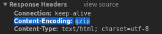
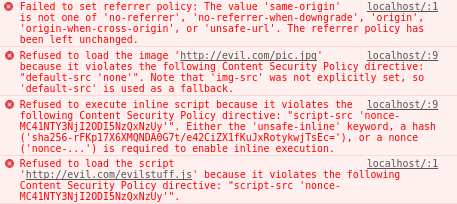

# 第二章：使用 ExpressJS 构建 Web 服务器

在本章中，我们将涵盖以下配方：

+   在 ExpressJS 中进行路由

+   模块化路由处理程序

+   编写中间件函数

+   编写可配置的中间件函数

+   编写路由级中间件函数

+   编写错误处理程序中间件函数

+   使用 ExpressJS 内置的中间件函数来提供静态资产

+   解析 HTTP 请求体

+   压缩 HTTP 响应

+   使用 HTTP 请求记录器

+   管理和创建虚拟域

+   使用 helmet 保护 ExpressJS web 应用程序

+   使用模板引擎

+   调试您的 ExpressJS Web 应用程序

# 技术要求

您需要一个 IDE，Visual Studio Code，Node.js 和 MongoDB。您还需要安装 Git，以便使用本书的 Git 存储库。

本章的代码文件可以在 GitHub 上找到：

[`github.com/PacktPublishing/MERN-Quick-Start-Guide/tree/master/Chapter02`](https://github.com/PacktPublishing/MERN-Quick-Start-Guide/tree/master/Chapter02)

查看以下视频以查看代码的运行情况：

[`goo.gl/xXhqWK`](https://goo.gl/xXhqWK)

# 介绍

ExpressJS 是首选的 Node.js web 应用程序框架，用于构建强大的 Web 应用程序和 API。

在本章中，配方将专注于构建一个完全功能的 Web 服务器并理解核心基础知识。

# 在 ExpressJS 中进行路由

路由是指应用程序在通过 HTTP 动词或 HTTP 方法请求资源时如何响应或操作的。

**HTTP**代表**超文本传输协议**，它是**万维网**（**WWW**）数据通信的基础。WWW 中的所有文档和数据都由**统一资源定位符**（**URL**）标识。

HTTP 动词或 HTTP 方法是*客户端-服务器*模型。通常，Web 浏览器充当*客户端*，在我们的情况下，ExpressJS 是允许我们创建一个能够理解这些请求的*服务器*的框架。每个请求都期望发送一个响应给客户端，以识别所请求资源的状态。

请求方法可以是：

+   **安全**：在服务器上执行只读操作的 HTTP 动词。换句话说，它不会改变服务器状态。例如：`GET`。

+   **幂等**：当发送相同的请求时，具有相同效果的 HTTP 动词。例如，发送`PUT`请求以修改用户的名字，如果正确实现，应在发送多个相同请求时对服务器产生相同的效果。所有*安全*方法也是幂等的。例如，`GET`，`PUT`和`DELETE`方法都是幂等的。

+   **可缓存**：可以缓存的 HTTP 响应。并非所有方法或 HTTP 动词都可以缓存。只有响应的*状态码*和用于发出请求的方法都是可缓存的，响应才是可缓存的。例如，GET 方法是可缓存的，以及以下状态码：`200`（请求成功），`204`（无内容），`206`（部分内容），`301`（永久移动），`404`（未找到），`405`（方法不允许），`410`（已删除或内容永久从服务器删除），和`414`（URI 太长）。

# 准备就绪

理解路由是构建健壮的 RESTful API 中最重要的核心方面之一。

在这个配方中，我们将看到 ExpressJS 如何处理或解释 HTTP 请求。在开始之前，创建一个新的`package.json`文件，内容如下：

```js
{ 
    "dependencies": { 
        "express": "4.16.3" 
    } 
} 
```

然后，通过打开终端并运行以下命令来安装依赖项：

```js
    npm install

```

ExpressJS 完成了理解客户端请求的整个工作。请求可能来自浏览器，例如。一旦请求被解释，ExpressJS 将所有信息保存在两个对象中：

+   **请求**：这包含有关客户端请求的所有数据和信息。例如，ExpressJS 解析 URI 并在 request.query 上提供其参数。

+   **Response**：这包含将发送给客户端的数据和信息。在发送信息给客户端之前，可以修改响应的标头。`response`对象有多种可用于向客户端发送状态代码和数据的方法。例如：`response.status(200).send('Some Data!')`。

# 如何做...

`Request`和`Response`对象作为参数传递给`route`方法内定义的*路由处理程序*。

# 路由方法

这些派生自 HTTP 动词或 HTTP 方法。路由方法用于定义应用程序对特定 HTTP 动词的响应。

ExpressJS 路由方法的名称与 HTTP 动词相对应。例如：`app.get()`对应于`GET` HTTP 动词，或者`app.delete()`对应于`DELETE` HTTP 动词。

一个非常基本的路由可以写成以下形式：

1.  创建一个名为`1-basic-route.js`的新文件

1.  首先包括 ExpressJS 库，然后初始化一个新的 ExpressJS 应用程序：

```js
      const express = require('express') 
      const app = express() 
```

1.  添加一个新的路由方法来处理路径`"/"`的请求。第一个参数指定路径或 URL，下一个参数是路由处理程序。在路由处理程序内部，让我们使用`response`对象发送状态码`200（OK）`和文本给客户端：

```js
      app.get('/', (request, response, nextHandler) => { 
          response.status(200).send('Hello from ExpressJS') 
      }) 
```

1.  最后，使用`listen`方法在端口`1337`上接受新连接：

```js
      app.listen( 
         1337, 
          () => console.log('Web Server running on port 1337'), 
      ) 
```

1.  保存文件

1.  打开终端并运行以下命令：

```js
 node 1-basic-route.js 
```

1.  在浏览器中打开一个新标签，并访问端口`1337`上的`localhost`以查看结果：

```js
      http://localhost:1337/
```

有关 ExpressJS 支持的 HTTP 方法的更多信息，请访问官方 ExpressJS 网站[`expressjs.com/en/guide/routing.html#route-methods`](https://expressjs.com/en/guide/routing.html#route-methods)。

# 路由处理程序

路由处理程序是回调函数，接受三个参数。第一个是`request`对象，第二个是`response`对象，最后一个是`callback`，它将处理程序传递给链中的下一个请求处理程序。也可以在路由方法内使用多个`callback`函数。

让我们看一个如何在路由方法内编写路由处理程序的工作示例：

1.  创建一个名为`2-route-handlers.js`的新文件

1.  包括 ExpressJS 库，然后初始化一个新的 ExpressJS 应用程序：

```js
      const express = require('express') 
      const app = express() 
```

1.  添加两个路由方法来处理相同路径`"/one"`的请求。使用`response`对象的`type`方法将发送到客户端的响应的内容类型设置为`text/plain`。使用`write`方法向客户端发送部分数据。要完成发送数据，使用响应对象的`end`方法。调用`nextHandler`将处理程序传递给链中的第二个处理程序：

```js
      app.get('/one', (request, response, nextHandler) => { 
          response.type('text/plain') 
          response.write('Hello ') 
          nextHandler() 
      }) 
      app.get('/one', (request, response, nextHandler) => { 
         response.status(200).end('World!') 
      }) 
```

1.  添加一个`route`方法来处理路径`"/two"`上的请求。在`route`方法内定义了两个路由处理程序来处理相同的请求：

```js
      app.get('/two', 
          (request, response, nextHandler) => { 
             response.type('text/plain') 
             response.write('Hello ') 
             nextHandler() 
         }, 
          (request, response, nextHandler) => { 
             response.status(200).end('Moon!') 
         } 
      ) 
```

1.  使用`listen`方法在端口`1337`上接受新连接：

```js
      app.listen( 
         1337, 
         () => console.log('Web Server running on port 1337'), 
     ) 
```

1.  保存文件

1.  打开终端并运行：

```js
    node 2-route-handlers.js  
```

1.  要查看结果，请在浏览器中打开一个新标签并访问：

```js
 http://localhost:1337/one http://localhost:1337/two  
```

# 可链接的路由方法

使用`app.route(path)`可以使路由方法可链接，因为`path`是为单个位置指定的。这可能是处理多个路由方法时最好的方法，因为除了使代码更易读且不太容易出现拼写错误和冗余之外，还允许同时处理多个路由方法。

1.  创建一个名为`3-chainable-routes.js`的新文件

1.  初始化一个新的 ExpressJS 应用程序：

```js
      const express = require('express') 
      const app = express() 
```

1.  使用`route`方法链接三个路由方法：

```js
      app 
      .route('/home') 
      .get((request, response, nextHandler) => { 
          response.type('text/html') 
          response.write('<!DOCTYPE html>') 
          nextHandler() 
      }) 
      .get((request, response, nextHandler) => { 
          response.end(` 
          <html lang="en"> 
              <head> 
              <meta charset="utf-8"> 
              <title>WebApp powered by ExpressJS</title> 
              </head> 
              <body role="application"> 
                  <form method="post" action="/home"> 
                      <input type="text" /> 
                      <button type="submit">Send</button> 
                  </form> 
              </body> 
          </html> 
          `) 
      }) 
      .post((request, response, nextHandler) => { 
          response.send('Got it!') 
      }) 
```

1.  使用`listen`方法在端口`1337`上接受新连接：

```js
      app.listen( 
          1337, 
          () => console.log('Web Server running on port 1337'), 
      ) 
```

1.  保存文件

1.  打开终端并运行：

```js
 node 3-chainable-routes.js
```

1.  要查看结果，请在浏览器中打开一个新标签并访问：

```js
      http://localhost:1337/home
```

# 还有更多...

路由路径可以是字符串或正则表达式。路由路径会使用`path-to-regexp` NPM 包[`www.npmjs.com/package/path-to-regexp`](https://www.npmjs.com/package/path-to-regexp)内部转换为正则表达式。

`path-to-regexp`在某种程度上帮助你以更易读的方式编写路径正则表达式。例如，考虑以下代码：

```js
app.get(/([a-z]+)-([0-9]+)$/, (request, response, nextHandler) => { 
    response.send(request.params) 
}) 
// Output: {"0":"abc","1":"12345"} for path /abc-12345 
```

可以这样写：

```js
app.get('/:0-:1', (request, response, nextHandler) => { 
    response.send(request.params) 
}) 
// Outputs: {"0":"abc","1":"12345"} for /abc-12345 
```

或者更好地说：

```js
app.get('/:id-:tag', (request, response, nextHandler) => { 
    response.send(request.params) 
}) 
// Outputs: {"id":"abc","tag":"12345"} for /abc-12345 
```

看一下这个表达式：`/([a-z]+)-([0-9]+)$/`。正则表达式中的括号称为**捕获括号**；当它们找到匹配时，它们会记住它。在前面的例子中，对于`abc-12345`，记住了两个字符串，`{"0":"abc","1":"12345"}`。这是 ExpressJS 找到匹配项、记住其值并将其关联到键的方式：

```js
app.get('/:userId/:action-:where', (request, response, nextHandler) => { 
    response.send(request.params) 
}) 
// Route path: /123/edit-profile 
// Outputs: {"userId":"123","action":"edit","where":"profile"} 
```

# 模块化路由处理程序

ExpressJS 有一个内置的名为**router**的类。路由器只是一个允许开发人员编写可挂载和模块化路由处理程序的类。

**路由器**是 ExpressJS 核心路由系统的一个实例。这意味着 ExpressJS 应用程序的所有路由方法都可用：

```js
const router = express.Router() 
router.get('/', (request, response, next) => { 
  response.send('Hello there!') 
}) 
router.post('/', (request, response, next) => { 
  response.send('I got your data!') 
}) 
```

# 准备工作

在这个示例中，我们将看到如何使用路由器来创建一个模块化应用程序。在开始之前，创建一个新的`package.json`文件，内容如下：

```js
{ 
    "dependencies": { 
        "express": "4.16.3" 
    } 
} 
```

然后，通过打开终端并运行以下命令来安装依赖项：

```js
    npm install

```

# 如何做...

假设你想在 ExpressJS 主应用程序中编写一个模块化的迷你应用程序，可以挂载到任何 URI。你想要能够选择挂载的路径，或者只是想要将相同的路由方法和处理程序挂载到几个其他路径或 URI。

1.  创建一个名为`modular-router.js`的新文件

1.  初始化一个新的 ExpressJS 应用程序：

```js
      const express = require('express') 
      const app = express() 
```

1.  为你的迷你应用程序定义一个路由器，并添加一个请求方法来处理`"/home"`路径的请求：

```js
      const miniapp = express.Router() 
      miniapp.get('/home', (request, response, next) => { 
          const url = request.originalUrl 
          response 
              .status(200) 
              .send(`You are visiting /home from ${url}`) 
      }) 
```

1.  将你的模块化迷你应用程序挂载到`"/first"`路径和`"/second"`路径：

```js
      app.use('/first', miniapp) 
      app.use('/second', miniapp) 
```

1.  监听端口`1337`以进行新连接：

```js
      app.listen( 
          1337, 
          () => console.log('Web Server running on port 1337'), 
      ) 
```

1.  保存文件

1.  打开终端并运行以下命令：

```js
 node modular-router.js
```

1.  要查看结果，请在 Web 浏览器中导航到：

```js
      http://localhost:1337/first/home
      http://localhost:1337/second/home
```

你将看到两个不同的输出：

```js
You are visting /home from /first/home 
You are visting /home from /second/home 
```

如图所示，*路由器*被挂载到两个不同的挂载点。路由器通常被称为迷你应用程序，因为它们可以挂载到 ExpressJS 应用程序的特定路由，不仅一次，而且还可以多次挂载到不同的挂载点、路径或 URI。

# 编写中间件函数

中间件函数主要用于对`request`和`response`对象进行更改。它们按顺序执行，但如果一个中间件函数不将控制传递给下一个中间件函数，请求将被搁置。

# 准备工作

中间件函数具有以下签名：

```js
app.use((request, response, next) => { 
    next() 
}) 
```

签名非常类似于编写路由处理程序。实际上，可以为特定的 HTTP 方法和特定的路径路由编写中间件函数，例如：

```js
app.get('/', (request, response, next) => { 
    next() 
}) 
```

因此，如果你想知道路由处理程序和中间件函数之间的区别是什么，答案很简单：它们的目的。

如果你正在编写路由处理程序，并且修改了`request`对象和/或`response`对象，那么你正在编写中间件函数。

在这个示例中，你将看到如何使用中间件函数来限制访问某些路径或路由，这取决于某个条件。在开始之前，创建一个新的`package.json`文件，内容如下：

```js
{ 
    "dependencies": { 
        "express": "4.16.3" 
    } 
} 
```

然后，通过打开终端并运行以下命令来安装依赖项：

```js
    npm install 
```

# 如何做...

我们将编写一个中间件函数，只允许访问根路径`"/"`当查询参数`allowme`存在时：

1.  创建一个名为`middleware-functions.js`的新文件

1.  初始化一个新的 ExpressJS 应用程序：

```js
      const express = require('express') 
      const app = express() 
```

1.  编写一个中间件函数，将属性`allowed`添加到`request`对象：

```js
      app.use((request, response, next) => { 
          request.allowed = Reflect.has(request.query, 'allowme') 
          next() 
      }) 
```

1.  添加一个请求方法来处理`"/"`路径的请求：

```js
      app.get('/', (request, response, next) => { 
          if (request.allowed) { 
              response.send('Hello secret world!') 
          } else { 
              response.send('You are not allowed to enter') 
          } 
      }) 
```

1.  监听端口`1337`以进行新连接：

```js
      app.listen( 
          1337, 
          () => console.log('Web Server running on port 1337'), 
      ) 
```

1.  保存文件

1.  打开终端并运行：

```js
 node middleware-functions.js

```

1.  要查看结果，请在 Web 浏览器中导航到：

```js
http://localhost:1337/
      http://localhost:1337/?allowme
```

# 工作原理...

就像路由处理程序一样，中间件函数需要将控制权传递给下一个处理程序；否则，我们的应用程序将一直挂起，因为没有向客户端发送数据，连接也没有关闭。

如果在中间件函数内向`request`或`response`对象添加了新属性，则下一个处理程序将可以访问这些新属性。就像我们之前编写的代码中，`request`对象中的`allowed property`对下一个处理程序是可用的。

# 编写可配置的中间件函数

编写中间件函数的常见模式是将中间件函数包装在另一个函数中。这样做的结果是可配置的中间件函数。它们也是*高阶函数*，即返回另一个函数的函数。

```js
const fn = (options) => (response, request, next) => {  
    next()  
} 
```

通常会将对象用作`options`参数。但是，没有什么能阻止您按照自己的方式进行操作。

# 准备工作

在这个示例中，您将编写一个可配置的日志记录器中间件函数。在开始之前，请创建一个包含以下内容的新`package.json`文件：

```js
{ 
    "dependencies": { 
        "express": "4.16.3" 
    } 
} 
```

然后，通过打开终端并运行来安装依赖项：

```js
    npm install

```

# 操作步骤...

您的可配置中间件函数将执行的操作很简单：当发出请求时，它将打印状态代码和 URL。

1.  创建一个名为`middleware-logger.js`的新文件

1.  导出一个接受对象作为第一个参数的函数。该函数期望对象具有一个名为`enable`的属性，该属性可以是`true`或`false`：

```js
      const logger = (options) => (request, response, next) => { 
          if (typeof options === 'object' 
              && options !== null 
              && options.enable) { 
              console.log( 
                  'Status Code:', response.statusCode, 
                  'URL:', request.originalUrl, 
              ) 
          } 
          next() 
      } 
      module.exports = logger 
```

1.  保存文件

# 让我们来测试一下...

我们的可配置中间件函数本身并不实用。创建一个简单的 ExpressJS 应用程序来查看我们的中间件实际工作：

1.  创建一个名为`configurable-middleware-test.js`的新文件

1.  包含我们的`middleware-logger.js`模块并初始化一个新的 ExpressJS 应用程序：

```js
       const express = require('express') 
       const loggerMiddleware = require('./middleware-logger') 
       const app = express() 
```

1.  使用`use`方法包含我们的可配置中间件函数。当`enable`属性设置为`true`时，您的日志记录器将工作，并将每个请求的状态代码和 URL 记录到终端：

```js
      app.use(loggerMiddleware({ 
         enable: true, 
      })) 
```

1.  监听端口`1337`以获取新的连接：

```js
      app.listen( 
           1337, 
           () => console.log('Web Server running on port 1337'), 
         ) 
```

1.  保存文件

1.  打开终端并运行：

```js
 node middleware-logger-test.js
```

1.  在浏览器中导航到：

```js
      http://localhost:1337/hello?world
```

1.  终端应显示：

```js
 Status Code: 200 URL: /hello?world
```

# 还有更多...

如果您想尝试，可以将可配置中间件测试应用程序的`enable`属性设置为`false`。不应显示任何日志。

通常，您会希望在生产环境中禁用日志记录，因为此操作可能会影响性能。

禁用所有日志记录的替代方法是使用其他库来执行此任务，而不是使用`console`。有一些库允许您设置不同级别的日志记录，例如：

+   **Debug 模块**：[`www.npmjs.com/package/debug`](https://www.npmjs.com/package/debug)

+   **Winston**：[`www.npmjs.com/package/winston`](https://www.npmjs.com/package/winston)

日志记录有几个原因很有用。主要原因是：

+   它检查您的服务是否正常运行，例如，检查您的应用程序是否连接到 MongoDB。

+   它可以发现错误和漏洞。

+   它有助于更好地了解应用程序的工作原理。例如，如果您有一个模块化应用程序，您可以看到它在包含在其他应用程序中时是如何集成的。

# 编写路由器级中间件函数

路由级中间件函数只在路由器内执行。它们通常在仅将中间件应用于挂载点或特定路径时使用。

# 准备工作

在这个示例中，您将创建一个小型的日志记录器路由器级中间件函数，它将仅记录挂载或位于路由器挂载路径中的路径的请求。在开始之前，请创建一个包含以下内容的新`package.json`文件：

```js
{ 
    "dependencies": { 
        "express": "4.16.3" 
    } 
} 
```

然后，通过打开终端并运行来安装依赖项：

```js
npm install
```

# 操作步骤...

1.  创建一个名为`router-level.js`的新文件

1.  初始化一个新的 ExpressJS 应用程序并定义一个路由器：

```js
      const express = require('express') 
      const app = express() 
      const router = express.Router() 
```

1.  定义我们的日志记录中间件函数：

```js
      router.use((request, response, next) => { 
          console.log('URL:', request.originalUrl) 
          next() 
      }) 
```

1.  将路由器挂载到路径`"/router"`

```js
      app.use('/router', router) 
```

1.  监听端口`1337`以获取新的连接：

```js
     app.listen( 
         1337, 
       () => console.log('Web Server running on port 1337'), 
    ) 
```

1.  保存文件

1.  打开终端并运行：

```js
 node router-level.js
```

1.  在您的网络浏览器中导航到：

```js
 http://localhost:1337/router/example 
```

1.  终端应显示：

```js
 URL: /router/example
```

1.  然后，在您的网络浏览器中导航到：

```js
      http://localhost:1337/example
```

1.  终端中不应显示任何日志

# 还有更多...

通过调用`next('router')`可以将控制权传递回到路由器之外的下一个中间件函数或路由方法。

```js
router.use((request, response, next) => { 
  next('route') 
}) 
```

例如，通过创建一个期望接收用户 ID 作为查询参数的路由器。当未提供用户 ID 时，可以使用`next('router')`函数来退出路由器或将控制权传递给路由器之外的下一个中间件函数。路由器之外的下一个中间件函数可以用来在路由器将控制权传递给它时显示其他信息。例如：

1.  创建一个名为`router-level-control.js`的新文件

1.  初始化一个新的 ExpressJS 应用程序：

```js
      const express = require('express') 
      const app = express() 
```

1.  定义一个新的路由器：

```js
      const router = express.Router() 
```

1.  在路由器内部定义我们的日志中间件函数：

```js
      router.use((request, response, next) => { 
         if (!request.query.id) { 
             next('router') // Next, out of Router 
          } else { 
            next() // Next, in Router 
          } 
      }) 
```

1.  添加一个路由方法来处理`"/"`路径的`GET`请求，只有在中间件函数将控制权传递给它时才会执行：

```js
       router.get('/', (request, response, next) => { 
         const id = request.query.id 
         response.send(`You specified a user ID => ${id}`) 
      }) 
```

1.  在路由器之外添加一个路由方法来处理`"/"`路径的`GET`请求。但是，将路由器作为第二个参数包含在路由处理程序中，并添加另一个路由处理程序来处理相同的请求，只有当路由器将控制权传递给它时才会执行：

```js
      app.get('/', router, (request, response, next) => { 
          response 
            .status(400) 
            .send('A user ID needs to be specified') 
    }) 
```

1.  监听端口`1337`以进行新连接：

```js
      app.listen( 
          1337, 
          () => console.log('Web Server running on port 1337'), 
      ) 
```

1.  保存文件

1.  打开终端并运行：

```js
 node router-level-control.js
```

1.  要查看结果，请在浏览器中导航到：

```js
 http://localhost:1337/
      http://localhost:1337/?id=7331
```

# 它是如何工作的...

当导航到第一个 URL（`http://localhost:1337/`）时，将显示以下消息：

```js
 A user ID needs to be specified 
```

这是因为路由器中的中间件函数检查查询中是否提供了`id`，因为没有提供，它将控制权传递给路由器之外的下一个处理程序，使用`next('router')`。

另一方面，当导航到第二个 URL（[`localhost:1337/?id=7331`](http://localhost:1337/?id=7331)）时，将显示以下消息：

```js
You specified a user ID => 7331 
```

这是因为在查询中提供了`id`，路由器中的中间件函数将控制权传递给路由器内部的下一个处理程序，使用`next()`。

# 编写错误处理程序中间件函数

ExpressJS 已经默认包含了一个内置的错误处理程序，在所有中间件和路由处理程序结束时执行。

内置错误处理程序可以被触发的方式有几种。一种是在路由处理程序内部发生错误时隐式触发。例如：

```js
app.get('/', (request, response, next) => { 
    throw new Error('Oh no!, something went wrong!') 
}) 
```

另一种触发内置错误处理程序的方式是显式地将`error`作为参数传递给`next(error)`。例如：

```js
app.get('/', (request, response, next) => { 
    try { 
        throw new Error('Oh no!, something went wrong!') 
    } catch (error) { 
        next(error) 
    } 
}) 
```

堆栈跟踪将显示在客户端上。如果`NODE_ENV`设置为生产模式，则不包括堆栈跟踪。

也可以编写一个自定义错误处理程序中间件函数，它看起来与路由处理程序几乎相同，唯一的区别是错误处理程序函数中间件期望接收四个参数：

```js
app.use((error, request, response, next) => { 
    next(error) 
}) 
```

请注意，`next(error)`是可选的。这意味着，如果指定了`next(error)`，它将把控制权转移到下一个错误处理程序。如果没有定义其他错误处理程序，那么控制权将传递给内置的错误处理程序。

# 准备工作

在这个示例中，我们将看到如何创建一个自定义的错误处理程序。在开始之前，请创建一个新的`package.json`文件，内容如下：

```js
{ 
    "dependencies": { 
        "express": "4.16.3" 
    } 
} 
```

然后，通过打开终端并运行来安装依赖：

```js
    npm install
```

# 如何做...

您将构建一个自定义的错误处理程序，将错误消息发送给客户端。

1.  创建一个名为`custom-error-handler.js`的新文件

1.  包含 ExpressJS 库，然后初始化一个新的 ExpressJS 应用程序：

```js
     const express = require('express') 
     const app = express() 
```

1.  定义一个新的路由方法来处理`"/"`路径的`GET`请求，并且每次都抛出一个错误：

```js
      app.get('/', (request, response, next) => { 
          try { 
             throw new Error('Oh no!, something went wrong!') 
          } catch (err) { 
             next(err) 
           } 
      }) 
```

1.  定义一个自定义错误处理程序中间件函数，将错误消息发送回客户端的浏览器：

```js
      app.use((error, request, response, next) => { 
          response.end(error.message) 
      }) 
```

1.  监听端口`1337`以进行新连接：

```js
      app.listen( 
          1337, 
          () => console.log('Web Server running on port 1337'), 
      ) 
```

1.  保存文件

1.  打开终端并运行：

```js
 node custom-error-handler.js
```

1.  要查看结果，请在您的网络浏览器中导航到：

```js
      http://localhost:1337/
```

# 使用 ExpressJS 内置的中间件函数来提供静态资产

在 ExpressJS 的 4.x 版本之前，它依赖于 ConnectJS，ConnectJS 是一个 HTTP 服务器框架[`github.com/senchalabs/connect`](https://github.com/senchalabs/connect)。实际上，大多数为 ConnectJS 编写的中间件也受到 ExpressJS 的支持。

从 ExpressJS 的 4.x 版本开始，它不再依赖于 ConnectJS，并且所有先前内置的中间件函数都已移动到单独的模块中[`expressjs.com/en/resources/middleware.html`](https://expressjs.com/en/resources/middleware.html)。

ExpressJS 4.x 和更新版本只包括两个内置的中间件函数。第一个已经看到了：内置的错误处理程序中间件函数。第二个是`express.static`中间件函数，负责提供静态资产。

`express.static`中间件函数基于`serve-static`模块[`expressjs.com/en/resources/middleware/serve-static.html`](https://expressjs.com/en/resources/middleware/serve-static.html)。

`express.static`和`serve-static`之间的主要区别是第二个可以在 ExpressJS 之外使用。

# 准备就绪

在这个示例中，您将看到如何构建一个 Web 应用程序，该应用程序将在特定路径中提供静态资产。在开始之前，创建一个新的`package.json`文件，内容如下：

```js
{ 
    "dependencies": { 
        "express": "4.16.3" 
    } 
} 
```

然后，通过打开终端并运行以下命令来安装依赖项：

```js
npm install
```

# 如何做...

1.  创建一个名为`public`的新目录

1.  进入新的`public`目录

1.  创建一个名为`index.html`的新文件

1.  添加以下代码：

```js
      <!DOCTYPE html> 
      <html lang="en"> 
      <head> 
          <meta charset="utf-8"> 
          <title>Simple Web Application</title> 
      </head> 
      <body> 
          <section role="application"> 
        <h1>Welcome Home!</h1> 
          </section> 
      </body> 
      </html> 
```

1.  保存文件

1.  从`public`目录中导航回去

1.  创建一个名为`serve-static-assets.js`的新文件

1.  添加以下代码。初始化一个新的 ExpressJS 应用程序：

```js
      const express = require('express') 
      const path = require('path') 
      const app = express() 
```

1.  包括`express.static`可配置的中间件函数，并传递`/public`目录的路径，其中`index.html`文件位于其中：

```js
      const publicDir = path.join(__dirname, './public') 
      app.use('/', express.static(publicDir)) 
```

1.  监听端口`1337`以进行新连接：

```js
      app.listen( 
          1337, 
          () => console.log('Web Server running on port 1337'), 
      ) 
```

1.  保存文件

1.  打开终端并运行：

```js
 node serve-static-assets.js
```

1.  要查看结果，在浏览器中导航到：

```js
      http://localhost:1337/index.html
```

# 它是如何工作的...

我们的`index.html`文件将被显示，因为我们指定了`"/"`作为查找资产的根目录。

尝试将路径从`"/"`更改为`"/public"`。然后，您将能够看到`index.html`文件和其他要包含在`/public`目录中的文件，可以在`http://localhost:1337/public/[fileName]`下访问。

# 还有更多...

假设您有一个大型项目，其中包含数十个静态文件，包括图像、字体文件和 PDF 文档（涉及隐私和法律事务等）。您决定要将它们保存在单独的文件中，但又不想更改挂载路径或 URI。它们可以在`/public`下提供，但它们将存在于项目目录中的单独目录中：

首先，让我们创建第一个包含一个名为`index.html`的单个文件的`public`目录：

1.  如果您在上一个示例中没有创建`public`目录，请创建一个名为`public`的新目录

1.  进入新的`public`目录

1.  创建一个名为`index.html`的新文件

1.  添加以下代码：

```js
      <!DOCTYPE html> 
      <html lang="en"> 
      <head> 
          <meta charset="utf-8"> 
          <title>Simple Web Application</title> 
      </head> 
      <body> 
           <section role="application"> 
           <h1>Welcome Home!</h1> 
           </section> 
      </body> 
      </html> 
```

1.  保存文件

现在，让我们创建一个包含另一个名为`second.html`的文件的第二个公共目录：

1.  从`public`目录中移出

1.  创建一个名为`another-public`的新目录

1.  进入新的`another-public`目录

1.  创建一个名为`second.html`的新空文件

1.  添加以下代码：

```js
      <!DOCTYPE html> 
      <html lang="en"> 
      <head> 
          <meta charset="utf-8"> 
          <title>Simple Web Application</title> 
      </head> 
     <body> 
          <section role="application"> 
           Welcome to Second Page! 
          </section> 
     </body> 
      </html> 
```

1.  保存文件

正如你所看到的，这两个文件存在于不同的目录中。为了在一个挂载点下提供这些文件：

1.  从`another-public`目录中移出

1.  创建一个名为`router-serve-static.js`的新文件

1.  包括 ExpressJS 和 path 库。然后，初始化一个新的 ExpressJS 应用程序：

```js
      const express = require('express') 
      const path = require('path') 
      const app = express() 
```

1.  定义一个路由器：

```js
      const staticRouter = express.Router() 
```

1.  使用`express.static`可配置的中间件函数来包含`public`和`another-public`两个目录：

```js
      const assets = { 
           first: path.join(__dirname, './public'), 
          second: path.join(__dirname, './another-public') 
      } 
       staticRouter 
          .use(express.static(assets.first)) 
          .use(express.static(assets.second)) 
```

1.  将路由器挂载到`"/"`路径：

```js
       app.use('/', staticRouter) 
```

1.  监听端口`1337`以进行新连接：

```js
      app.listen( 
          1337, 
           () => console.log('Web Server running on port 1337'), 
       ) 
```

1.  保存文件

1.  打开终端并运行：

```js
 node router-serve-static.js
```

1.  要查看结果，在浏览器中导航到：

```js
 http://localhost:1337/index.html
      http://localhost:1337/second.html
```

1.  在不同位置的两个不同文件在一个路径下提供服务

如果在不同目录下存在两个或更多同名文件，只会显示找到的第一个文件在客户端上。

# 解析 HTTP 请求主体

`body-parser` 是一个中间件函数，用于解析传入的请求主体，并将其作为 `request.body` 在 `request` 对象中可用 [`expressjs.com/en/resources/middleware/body-parser.html`](https://expressjs.com/en/resources/middleware/body-parser.html)。

该模块允许应用程序解析传入请求为：

+   JSON

+   文本

+   原始（缓冲区原始传入数据）

+   URL 编码表单

当传入请求被压缩时，该模块支持对 gzip 和 deflate 编码的自动解压缩。

# 做好准备

在这个配方中，您将看到如何使用 `body-parser` NPM 模块来解析以两种不同方式编码的两个不同表单发送的内容主体。在开始之前，创建一个新的 `package.json` 文件，内容如下：

```js
{ 
    "dependencies": { 
        "body-parser": "1.18.2", 
        "express": "4.16.3" 
    } 
} 
```

然后，通过打开终端并运行来安装依赖项：

```js
npm install
```

# 如何做到这一点...

两个表单将显示给用户，它们都将以两种不同的方式编码发送数据到我们的 Web 服务器应用程序。第一个是 URL 编码表单，而另一个将以纯文本形式编码其主体。

1.  创建一个名为 `parse-form.js` 的文件

1.  包括 `body-parser` NPM 模块。然后，初始化一个新的 ExpressJS 应用程序：

```js
      const express = require('express') 
      const bodyParser = require('body-parser') 
      const app = express() 
```

1.  包括 `body-parser` 中间件函数来处理 URL 编码请求和纯文本请求：

```js
       app.use(bodyParser.urlencoded({ extended: true })) 
       app.use(bodyParser.text()) 
```

1.  添加一个新的路由方法来处理 `"/"` 路径的 `GET` 请求。提供使用不同编码提交数据的两个表单的 HTML 内容：

```js
      app.get('/', (request, response, next) => { 
            response.send(` 
            <!DOCTYPE html> 
            <html lang="en"> 
            <head> 
              <meta charset="utf-8"> 
              <title>WebApp powered by ExpressJS</title> 
           </head> 
         <body> 
            <div role="application"> 
                <form method="post" action="/setdata"> 
                    <input name="urlencoded" type="text" /> 
                    <button type="submit">Send</button> 
                </form> 
               <form method="post" action="/setdata" 
                 enctype="text/plain"> 
                  <input name="txtencoded" type="text" /> 
                  <button type="submit">Send</button> 
               </form> 
           </div> 
        </body> 
        </html> 
       `) 
     }) 
```

1.  添加一个新的路由方法来处理 `"/setdata"` 路径的 `POST` 请求。在终端上显示 `request.body` 的内容：

```js
      app.post('/setdata', (request, response, next) => { 
          console.log(request.body) 
          response.end() 
      }) 
```

1.  监听端口 `1337`，等待新连接：

```js
      app.listen( 
          1337, 
          () => console.log('Web Server running on port 1337'), 
      ) 
```

1.  保存文件

1.  打开一个终端并运行：

```js
 node parse-form.js
```

1.  在您的 Web 浏览器中，导航到：

```js
      http://localhost:1337/
```

1.  在第一个输入框中填写任何数据并提交表单：

1.  在您的 Web 浏览器中，导航回：

```js
      http://localhost:1337/
```

1.  在第二个输入框中填写任何数据并提交表单：

1.  检查终端中的输出

# 它是如何工作的...

终端输出类似于：

```js
{ 'urlencoded': 'Example' } 
txtencoded=Example 
```

上面使用了两个解析器：

1.  第一个 `bodyParser.urlencoded()` 解析传入的 `multipart/form-data` 编码类型的请求。结果以 **Object** 形式在 `request.body` 中可用

1.  第二个 `bodyParser.text()` 解析传入的 `text/plain` 编码类型的请求。结果以 **String** 形式在 `request.body` 中可用

# 压缩 HTTP 响应

**compression** 是一个中间件函数，用于压缩将发送到客户端的响应主体。该模块使用支持以下内容编码机制的 `zlib` 模块 [`nodejs.org/api/zlib.html`](https://nodejs.org/api/zlib.html)。

+   gzip

+   deflate

`Accept-Encoding` HTTP 头用于确定客户端（例如 Web 浏览器）支持哪种内容编码机制，而 `Content-Encoding` HTTP 头用于告诉客户端响应主体应用了哪种内容编码机制。

`compression` 是一个可配置的中间件函数。它接受一个 `options` 对象作为第一个参数，以定义中间件的特定行为，并且还可以传递 `zlib` 选项。

# 做好准备

在这个配方中，我们将看到如何配置和使用 `compression` NPM 模块来压缩发送到客户端的请求主体。在开始之前，创建一个新的 `package.json` 文件，内容如下：

```js
{ 
    "dependencies": { 
        "compression": "1.7.2", 
        "express": "4.16.3" 
    } 
} 
```

然后，通过打开终端并运行来安装依赖项：

```js
    npm install
```

# 如何做到这一点...

1.  创建一个名为 `compress-site.js` 的新文件

1.  包括 `compression` NPM 模块。然后，初始化一个新的 ExpressJS 应用程序：

```js
      const express = require('express') 
      const compression = require('compression') 
      const app = express() 
```

1.  包括 `compression` 中间件函数。指定压缩的 `level` 为 `9`（最佳压缩），`threshold` 或者响应主体应该考虑压缩的最小大小为 `0` 字节：

```js
      app.use(compression({ level: 9, threshold: 0 })) 
```

1.  定义一个路由方法来处理`GET`请求的路径`"/"`，它将提供我们希望被压缩的示例 HTML 内容，并将打印客户端接受的编码：

```js
      app.get('/', (request, response, next) => { 
          response.send(` 
          <!DOCTYPE html> 
          <html lang="en"> 
          <head> 
              <meta charset="utf-8"> 
              <title>WebApp powered by ExpressJS</title> 
          </head> 
          <body> 
              <section role="application"> 
                  <h1>Hello! this page is compressed!</h1> 
              </section> 
          </body> 
         </html> 
          `) 
          console.log(request.acceptsEncodings()) 
     }) 
```

1.  监听端口`1337`以进行新连接：

```js
      app.listen( 
          1337, 
          () => console.log('Web Server running on port 1337'), 
      ) 
```

1.  保存文件

1.  打开终端并运行：

```js
 node compress-site.js 
```

1.  在您的浏览器中，导航到：

```js
      http://localhost:1337/
```

# 它是如何工作的...

终端的输出将显示客户端（例如 Web 浏览器）支持的内容编码机制。它可能看起来像这样：

```js
 [ 'gzip', 'deflate', 'sdch', 'br', 'identity' ]

```

客户端发送的内容编码机制由`compression`内部使用，以了解是否支持压缩。如果不支持压缩，则响应主体不会被压缩。

如果打开 Chrome Dev Tools 或类似工具并分析所做的请求，则服务器发送的`Content-Encoding`标头指示`compression`使用的内容编码机制。



Chrome Dev Tools | Network Tab 显示响应标头

`compression`库将`Content-Encoding`标头设置为用于压缩响应主体的编码机制。

`threshold`选项默认设置为 1 KB，这意味着如果响应大小低于指定的字节数，则不会被压缩。将其设置为 0 或`false`，即使大小低于 1 KB，也会压缩响应。

# 使用 HTTP 请求记录器

如前所述，编写请求记录器很简单。但是，编写我们自己的可能需要花费宝贵的时间。幸运的是，还有其他几种选择。例如，一个非常流行的 HTTP 请求记录器是 morgan [`expressjs.com/en/resources/middleware/morgan.html`](https://expressjs.com/en/resources/middleware/morgan.html)。

**morgan**是一个可配置的中间件函数，接受两个参数`format`和`options`，用于指定日志显示的格式以及需要显示的信息类型。

有几种预定义的格式：

+   `tiny`：最小输出

+   `short`：与 tiny 相同，包括远程 IP 地址

+   `common`：标准 Apache 日志输出

+   `combined`：标准 Apache 组合日志输出

+   `dev`：显示与微格式相同的信息。但是，响应状态是有颜色的。

# 准备工作

创建一个新的`package.json`文件，内容如下：

```js
{ 
    "dependencies": { 
        "express": "4.16.3", 
        "morgan": "1.9.0" 
    } 
} 
```

然后，通过打开终端并运行以下命令来安装依赖项：

```js
npm install
```

# 如何做...

让我们构建一个可工作的示例。我们将包括**morgan**可配置的中间件函数，使用`dev`格式显示每个请求的信息。

1.  创建一个名为`morgan-logger.js`的新文件

1.  初始化一个新的 ExpressJS 应用程序：

```js
      const express = require('express') 
      const morgan = require('morgan') 
      const app = express() 
```

1.  包括`morgan`可配置的中间件。将`'dev'`作为我们将使用的格式作为中间件函数的第一个参数传递：

```js
      app.use(morgan('dev')) 
```

1.  定义一个路由方法来处理所有`GET`请求：

```js
      app.get('*', (request, response, next) => { 
          response.send('Hello Morgan!') 
      }) 
```

1.  监听端口`1337`以进行新连接：

```js
      app.listen( 
          1337, 
          () => console.log('Web Server running on port 1337'), 
     ) 
```

1.  保存文件

1.  打开终端并运行：

```js
 node morgan-logger.js
```

1.  要在终端中查看结果，请在 Web 浏览器中导航到：

```js
        http://localhost:1337/
        http://localhost:1337/example
```

# 管理和创建虚拟域

使用 ExpressJS 管理虚拟域名非常容易。假设您有两个或更多子域，并且希望提供两个不同的 Web 应用程序。但是，您不希望为每个子域创建不同的 Web 服务器应用程序。在这种情况下，ExpressJS 允许开发人员在单个 Web 服务器应用程序中使用**vhost**[`expressjs.com/en/resources/middleware/vhost.html`](https://expressjs.com/en/resources/middleware/vhost.html)管理虚拟域。

**vhost**是一个可配置的中间件函数，接受两个参数。第一个是`hostname`。第二个参数是当`hostname`匹配时将被调用的请求处理程序。

`hostname`遵循与路由路径相同的规则。它们可以是字符串，也可以是正则表达式。

# 准备工作

创建一个新的`package.json`文件，内容如下：

```js
{ 
    "dependencies": { 
        "express": "4.16.3", 
        "vhost": "3.0.2" 
    } 
} 
```

然后，通过打开终端并运行以下命令来安装依赖项：

```js
npm install
```

# 如何做...

使用**路由器**构建两个迷你应用程序，这两个应用程序将在两个不同的子域中提供服务：

1.  创建一个名为`virtual-domains.js`的新文件

1.  包括`vhost` NPM 模块。然后，初始化一个新的 ExpressJS 应用程序：

```js
      const express = require('express') 
      const vhost = require('vhost') 
      const app = express() 
```

1.  定义我们将用来构建两个迷你应用程序的两个路由器：

```js
      const app1 = express.Router() 
      const app2 = express.Router() 
```

1.  在第一个路由器中添加一个路由方法来处理`"/"`路径的`GET`请求：

```js
      app1.get('/', (request, response, next) => { 
        response.send('This is the main application.') 
      }) 
```

1.  在第二个路由器中添加一个路由方法来处理`"/"`路径的`GET`请求：

```js
      app2.get('/', (request, response, next) => { 
         response.send('This is a second application.') 
     }) 
```

1.  将我们的路由器挂载到我们的 ExpressJS 应用程序上。在`localhost`下提供第一个应用程序，在`second.localhost`下提供第二个应用程序：

```js
      app.use(vhost('localhost', app1)) 
      app.use(vhost('second.localhost', app2)) 
```

1.  监听端口`1337`以获取新连接：

```js
      app.listen( 
         1337, 
         () => console.log('Web Server running on port 1337'), 
     ) 
```

1.  保存文件

1.  打开终端并运行：

```js
      node virtual-domains.js 
```

1.  要查看结果，请在您的 Web 浏览器中导航到：

```js
        http://localhost:1337/
        http://second.localhost:1337/
```

# 还有更多...

`vhost`向`request`对象添加了一个`vhost 对象`，其中包含完整的主机名（显示主机名和端口）、主机名（不包括端口）和匹配字符串。这样可以更好地控制如何处理虚拟域。

例如，我们可以编写一个允许用户使用他们的名字拥有自己子域的应用程序：

1.  创建一个名为`user-subdomains.js`的新文件

1.  包括`vhost` NPM 模块。然后，初始化一个新的 ExpressJS 应用程序：

```js
      const express = require('express') 
      const vhost = require('vhost') 
      const app = express() 
```

1.  定义一个新的路由器。然后，在`"/"`路径上添加一个路由方法来处理`GET`请求。使用`vhost`对象来访问子域的数组：

```js
       const users = express.Router() 
       users.get('/', (request, response, next) => { 
        const username = request 
            .vhost[0] 
            .split('-') 
            .map(name => ( 
                name[0].toUpperCase() + 
                name.slice(1) 
             )) 
            .join(' ') 
        response.send(`Hello, ${username}`) 
     }) 
```

1.  挂载路由器：

```js
       app.use(vhost('*.localhost', users)) 
```

1.  监听端口`1337`以获取新连接：

```js
      app.listen( 
           1337, 
          () => console.log('Web Server running on port 1337'), 
      ) 
```

1.  保存文件

1.  打开终端并运行：

```js
      node user-subdomains.js 
```

1.  要查看结果，请在您的 Web 浏览器中导航到：

```js
        http://john-smith.localhost:1337/
        http://jx-huang.localhost:1337/
        http://batman.localhost:1337/
```

# 使用 Helmet 保护 ExpressJS Web 应用程序

**Helmet**允许保护 Web 服务器应用程序免受常见攻击，例如**跨站脚本（XSS）**、不安全的请求和点击劫持。

Helmet 是一组 12 个中间件函数，允许您设置特定的 HTTP 头：

1.  `内容安全策略（CSP）`：这是一种有效的方法，可以列出允许在您的 Web 应用程序中使用什么样的外部资源，例如 JavaScript、CSS 和图像。

1.  `证书透明度`：这是一种提供特定域或特定域发行的证书更透明的方式[`sites.google.com/a/chromium.org/dev/Home/chromium-security/certificate-transparency`](https://sites.google.com/a/chromium.org/dev/Home/chromium-security/certificate-transparency)。

1.  `DNS 预取控制`：这告诉浏览器是否应该对尚未加载的资源（例如链接）执行域名解析（DNS）。

1.  `Frameguard`：这有助于防止**点击劫持**，告诉浏览器不要允许将您的 Web 应用程序放在`iframe`中。

1.  `隐藏 Powered-By`：这只是隐藏`X-Powered-By`头，表示不显示服务器的技术。ExpressJS 默认将此头设置为`"Express"`。

1.  `HTTP 公钥固定`：这有助于防止**中间人攻击**，将您的 Web 应用程序的公钥固定到`Public-Key-Pins`头。

1.  `HTTP 严格传输安全性`：这告诉浏览器严格坚持您的 Web 应用程序的 HTTPs 版本。

1.  `IE 不打开`：这可以防止 Internet Explorer 在您的站点上执行不受信任的下载或 HTML 文件，从而防止恶意脚本的注入。

1.  `无缓存`：这告诉浏览器禁用浏览器缓存。

1.  `不嗅探 MIME 类型`：这会强制浏览器禁用 MIME 嗅探或猜测所提供文件的内容类型。

1.  `引荐政策`：引荐头提供了关于请求来源的数据。它允许开发人员禁用它，或者设置更严格的策略来设置`引荐`头。

1.  `XSS 过滤器`：这通过设置`X-XSS-Protection`头来防止反射型跨站脚本（XSS）攻击。

# 准备就绪

在本教程中，我们将使用 Helmet 提供的大多数中间件函数来保护我们的 ExpressJS Web 应用程序免受常见攻击。在开始之前，请创建一个新的`package.json`文件，内容如下：

```js
{ 
    "dependencies": { 
        "body-parser": "1.18.2", 
        "express": "4.16.3", 
        "helmet": "3.12.0", 
        "uuid": "3.2.1" 
    } 
} 
```

然后，通过打开终端并运行来安装依赖项：

```js
npm install
```

# 如何做...

1.  创建一个名为`secure-helmet.js`的新文件

1.  包括 ExpressJS、helmet 和 body NPM 模块：

```js
      const express = require('express') 
      const helmet = require('helmet') 
      const bodyParser = require('body-parser') 
      const uuid = require('uuid/v1') 
      const app = express() 
```

1.  生成一个随机 ID，该 ID 将用于`nonce`，`nonce`是一个 HTML 属性，用于白名单内联执行 HTML 代码中允许执行的脚本或样式：

```js
      const suid = uuid() 
```

1.  使用 body parser 来解析`json`和`application/csp-report`内容类型的 JSON 请求主体。`application/csp-report`是一个包含`json`类型的 JSON 请求主体的内容类型，当违反一个或多个 CSP 规则时，浏览器会发送该内容类型：

```js
      app.use(bodyParser.json({ 
          type: ['json', 'application/csp-report'], 
      })) 
```

1.  使用`Content Security Policy`中间件函数来定义指令。`defaultSrc`指定可以从哪里加载资源。`self`选项指定仅从您自己的域加载资源。我们将使用`none`，这意味着不会加载任何资源。但是，因为我们正在列入白名单`scriptSrc`，我们将能够加载 Javascript 脚本，但只有那些具有我们将指定的`nonce`的脚本。`reportUri`用于告诉浏览器发送我们的`Content Security Policy`的违规报告的位置：

```js
      app.use(helmet.contentSecurityPolicy({ 
          directives: { 
              // By default do not allow unless whitelisted 
              defaultSrc: [`'none'`], 
               // Only allow scripts with this nonce 
              scriptSrc: [`'nonce-${suid}'`], 
              reportUri: '/csp-violation', 
          } 
      })) 
```

1.  添加一个路由方法来处理路径`"/csp-violation"`的`POST`请求，以接收来自客户端的违规报告：

```js
      app.post('/csp-violation', (request, response, next) => { 
          const { body } = request 
          if (body) { 
             console.log('CSP Report Violation:') 
             console.dir(body, { colors: true, depth: 5 }) 
         } 
         response.status(204).send() 
      }) 
```

1.  使用`DNS Prefetch Control`中间件禁用资源预取：

```js
      app.use(helmet.dnsPrefetchControl({ allow: false })) 
```

1.  使用`Frameguard`中间件函数禁用您的应用程序在`iframe`中加载：

```js
      app.use(helmet.frameguard({ action: 'deny' })) 
```

1.  使用`hidePoweredBy`中间件函数替换`X-Powered-By`标头并设置一个虚假的标头：

```js
      app.use(helmet.hidePoweredBy({ 
          setTo: 'Django/1.2.1 SVN-13336', 
      })) 
```

1.  使用`ieNoOpen`中间件函数禁用 IE 不受信任的执行：

```js
       app.use(helmet.ieNoOpen()) 
```

1.  使用`noSniff`中间件函数禁用 MIME 类型猜测：

```js
      app.use(helmet.noSniff()) 
```

1.  使用`referrerPolicy`中间件函数使标头仅对我们的域名可用：

```js
       app.use(helmet.referrerPolicy({ policy: 'same-origin' })) 
```

1.  使用`xssFilter`中间件函数防止反射型 XSS 攻击：

```js
      app.use(helmet.xssFilter()) 
```

1.  添加一个路由方法来处理路径`"/"`上的`GET`请求，并提供一个样本 HTML 内容，该内容将尝试从外部来源加载图像，尝试执行内联脚本，并尝试加载未指定`nonce`的外部脚本。我们还将添加一个有效的脚本，因为将指定`nonce`属性允许执行：

```js
      app.get('/', (request, response, next) => { 
         response.send(` 
         <!DOCTYPE html> 
         <html lang="en"> 
         <head> 
             <meta charset="utf-8"> 
             <title>Web App</title> 
         </head> 
          <body> 
             <span id="txtlog"></span> 
               
             <script> 
                  alert('This does not get executed!') 
              </script> 
              <script src="img/evilstuff.js"></script> 
              <script nonce="${suid}"> 
                  document.getElementById('txtlog') 
                    .innerText = 'Hello World!' 
              </script> 
           </body> 
         </html> 
       `) 
     }) 
```

1.  在端口`1337`上监听新连接：

```js
     app.listen( 
          1337, 
         () => console.log('Web Server running on port 1337'), 
      ) 
```

1.  保存文件

1.  打开终端并运行：

```js
      node secure-helmet.js 
```

1.  要查看结果，在您的网络浏览器中导航到：

```js
        http://localhost:1337/
```

# 工作原理...

一切都很简单直接地使用`Helmet`。您通过选择和应用特定的`Helmet`中间件函数来指定要实施的安全措施，`Helmet`将设置正确的标头，然后发送给客户端。

在客户端（网络浏览器）中，一切都是自动的。网络浏览器负责解释服务器发送的标头并应用安全策略。这也意味着旧的浏览器可能无法支持或理解所有这些标头。也就是说，如果您考虑应用程序的安全性，那么没有太多好的理由要支持旧的网络浏览器。

例如，如果您使用 Chrome，您应该能够在控制台中看到类似于以下内容：



Chrome Dev Tools | 控制台显示 CSP 违规

1.  在终端中，您应该能够看到类似于浏览器发送的以下输出：

```js
      CSP Report Violation: { 
          "csp-report": { 
               "document-uri": "http://localhost:1337/", 
              "referrer": "", 
              "violated-directive": "img-src", 
              "effective-directive": "img-src", 
              "original-policy": "default-src 'none'; script-src              
         '[nonce]'; report-uri /csp-violation", 
              "disposition": "enforce", 
              "blocked-uri": "http://evil.com/pic.jpg", 
              "line-number": 9, 
              "source-file": "http://localhost:1337/", 
              "status-code": 200 
          } 
      }  
      CSP Report Violation: { 
          "csp-report": { 
              "document-uri": "http://localhost:1337/", 
              "referrer": "", 
              "violated-directive": "script-src", 
              "effective-directive": "script-src", 
              "original-policy": "default-src 'none'; script-src        
       '[nonce]'; report-uri /csp-violation", 
              "disposition": "enforce", 
              "blocked-uri": "inline", 
              "line-number": 9, 
              "status-code": 200 
          } 
      }  
      CSP Report Violation: { 
          "csp-report": { 
              "document-uri": "http://localhost:1337/", 
              "referrer": "", 
              "violated-directive": "script-src", 
              "effective-directive": "script-src", 
              "original-policy": "default-src 'none'; script-src 
      '[nonce]'; report-uri /csp-violation", 
              "disposition": "enforce", 
              "blocked-uri": "http://evil.com/evilstuff.js", 
              "status-code": 200 
          } 
      } 
```

# 使用模板引擎

模板引擎允许您以更方便的方式生成 HTML 代码。模板或视图可以以任何格式编写，由模板引擎解释，将变量替换为其他值，最终转换为 HTML。

ExpressJS 的官方网站上提供了一个可以与 ExpressJS 直接使用的大量模板引擎列表，网址为[`github.com/expressjs/express/wiki#template-engines`](https://github.com/expressjs/express/wiki#template-engines)。

# 准备工作

在这个教程中，您将构建自己的模板引擎。要开发和使用自己的模板引擎，您首先需要注册它，然后定义视图所在的路径，最后告诉 ExpressJS 使用哪个模板引擎。

```js
      app.engine('...', (path, options, callback) => { ... }); 
      app.set('views', './'); 
      app.set('view engine', '...'); 
```

在开始之前，创建一个新的`package.json`文件，内容如下：

```js
      { 
          "dependencies": { 
              "express": "4.16.3" 
          } 
      } 
```

然后，通过打开终端并运行来安装依赖项：

```js
       npm install
```

# 操作步骤...

首先创建一个包含简单模板的`views`目录：

1.  创建一个名为`views`的新目录

1.  在我们的`views`目录中创建一个名为`home.tpl`的新文件

1.  添加以下代码：

```js
      <!DOCTYPE html> 
       <html lang="en"> 
      <head> 
          <meta charset="utf-8"> 
          <title>Using Template Engines</title> 
      </head> 
      <body> 
          <section role="application"> 
              <h1>%title%</h1> 
              <p>%description%</p> 
          </section> 
      </body> 
      </html> 
```

1.  保存文件

现在，创建一个新的模板引擎，将之前的模板转换为 HTML，并用提供的选项替换`%[var]%`：

1.  移出`views`目录

1.  创建一个名为`my-template-engine.js`的新文件

1.  包括 ExpressJS 和 fs（文件系统）库。然后，初始化一个新的 ExpressJS 应用程序：

```js
      const express = require('express') 
      const fs = require('fs') 
      const app = express() 
```

1.  使用`engine`方法注册一个名为`tpl`的新模板引擎。我们将读取文件内容，并用`options`对象中指定的内容替换`%[var]%`：

```js
       app.engine('tpl', (filepath, options, callback) => { 
           fs.readFile(filepath, (err, data) => { 
              if (err) { 
                 return callback(err) 
             } 
             const content = data 
                 .toString() 
                 .replace(/%[a-z]+%/gi, (match) => { 
                     const variable = match.replace(/%/g, '') 
                    if (Reflect.has(options, variable)) { 
                        return options[variable] 
                     } 
                    return match 
                }) 
              return callback(null, content) 
          }) 
     }) 
```

1.  定义视图所在的路径。我们的模板位于`views`目录中：

```js
       app.set('views', './views') 
```

1.  告诉 ExpressJS 使用我们的模板引擎：

```js
      app.set('view engine', 'tpl') 
```

1.  添加一个路由方法来处理`"/"`路径的`GET`请求，并渲染我们的主页模板。提供`title`和`description`选项，它们将替换模板中的`%title%`和`%description%`：

```js
     app.get('/', (request, response, next) => { 
          response.render('home', { 
              title: 'Hello', 
               description: 'World!', 
         }) 
      }) 
```

1.  监听端口`1337`以获取新连接：

```js
      app.listen( 
          1337, 
          () => console.log('Web Server running on port 1337'), 
      ) 
```

1.  保存文件

1.  打开终端并运行：

```js
    node my-template-engine.js
```

1.  在您的浏览器中，导航到：

```js
      http://localhost:1337/
```

我们刚刚编写的模板引擎不会转义 HTML 字符。这意味着，如果用来自客户端的数据替换这些属性，就应该小心，因为它可能容易受到 XSS 攻击。您可能希望使用官方 ExpressJS 网站上更安全的模板引擎。

# 调试您的 ExpressJS Web 应用程序

关于 Web 应用程序整个周期的 ExpressJS 上的调试信息非常简单。ExpressJS 在内部使用**debug** NPM 模块记录信息。与`console.log`不同，**debug**日志在生产模式下可以轻松禁用。

# 准备工作

在这个教程中，您将学习如何调试您的 ExpressJS Web 应用程序。在开始之前，创建一个新的`package.json`文件，内容如下：

```js
{ 
    "dependencies": { 
        "debug": "3.1.0", 
        "express": "4.16.3" 
    } 
} 
```

然后，通过打开终端并运行来安装依赖项：

```js
npm install
```

# 操作步骤...

1.  创建一个名为`debugging.js`的新文件

1.  初始化一个新的 ExpressJS 应用程序：

```js
      const express = require('express') 
      const app = express() 
```

1.  添加一个路由方法来处理任何路径的`GET`请求：

```js
      app.get('*', (request, response, next) => { 
          response.send('Hello there!') 
      }) 
```

1.  监听端口`1337`以获取新连接：

```js
      app.listen( 
          1337, 
          () => console.log('Web Server running on port 1337'), 
      ) 
```

1.  保存文件

1.  打开终端并运行：

1.  在 Windows 上：

```js
 set DEBUG=express:* node debugging.js
```

1.  在 Linux 或 MacOS 上：

```js
 DEBUG=express:* node debugging.js 

```

1.  在您的 Web 浏览器中，导航到：

```js
      http://localhost:1337/
```

1.  观察您终端的输出以查看日志

# 工作原理...

`DEBUG`环境变量用于告诉**debug**模块调试 ExpressJS 应用程序的哪些部分。在我们之前编写的代码中，`express:*`告诉调试模块记录与 express 应用程序相关的所有内容。

我们可以使用`DEBUG=express:router`来显示与 ExpressJS 的路由相关的日志。

# 还有更多...

您可以在自己的项目中使用 debug NPM 模块。例如：

1.  创建一个名为`myapp.js`的新文件

1.  添加以下代码：

```js
      const express = require('express') 
      const app = express() 
      const debug = require('debug')('myapp') 
      app.get('*', (request, response, next) => { 
          debug('Request:', request.originalUrl) 
          response.send('Hello there!') 
      }) 
      app.listen( 
          1337, 
          () => console.log('Web Server running on port 1337'), 
      ) 
```

1.  保存文件

1.  打开终端并运行：

1.  在 Windows 上：

```js
    set DEBUG=myapp node myapp.js
```

1.  在 Linux 和 MacOS 上：

```js
 DEBUG=myapp node myapp.js
```

1.  在您的 Web 浏览器中，导航到：

1.  观察您的终端输出。它会显示类似以下内容：

```js
      Web Server running on port 1337 
        myapp Request: / +0ms 
```

您可以使用`DEBUG`环境变量来告诉`debug`模块不仅显示`myapp`的日志，还显示 ExpressJS 的日志，如下所示：

在 Windows 上：

```js
set DEBUG=myapp,express:* node myapp.js 
```

在 Linux 和 MacOS 上：

```js
DEBUG=myapp,express:* node myapp.js
```
