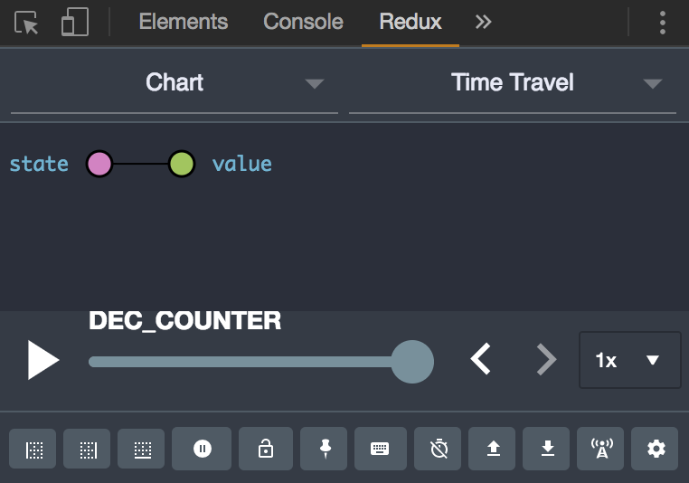
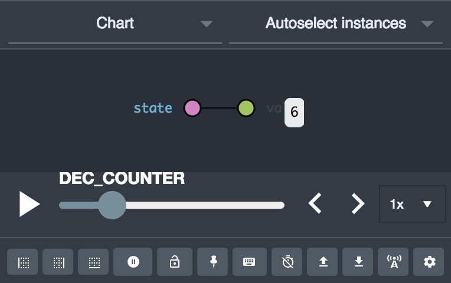
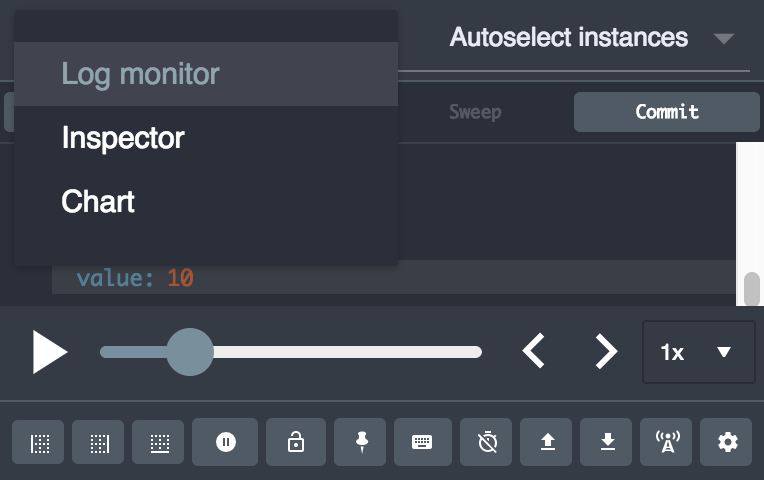

# 第五章：使用 Redux 管理状态

在这一章中，我们将涵盖以下的配方：

+   定义动作和动作创建者

+   定义减速器函数

+   创建 Redux 存储

+   将动作创建者绑定到分派方法

+   拆分和组合减速器

+   编写 Redux 存储增强器

+   使用 Redux 进行时间旅行

+   了解 Redux 中间件

+   处理异步数据流

# 技术要求

您需要一个 IDE、Visual Studio Code、Node.js 和 MongoDB。您还需要安装 Git，以便使用本书的 Git 存储库。

本章的代码文件可以在 GitHub 上找到：

[`github.com/PacktPublishing/MERN-Quick-Start-Guide/tree/master/Chapter05`](https://github.com/PacktPublishing/MERN-Quick-Start-Guide/tree/master/Chapter05)

查看以下视频，看看代码是如何运行的：

[`goo.gl/mU9AjR`](https://goo.gl/mU9AjR)

# 介绍

Redux 是 JavaScript 应用程序的可预测状态容器。它允许开发人员轻松管理其应用程序的状态。使用 Redux，状态是不可变的。因此，可以在应用程序的下一个或上一个状态之间来回切换。Redux 遵循三个核心原则：

+   **唯一的真相来源**：应用程序的所有状态必须存储在一个单一存储中的单个对象树中

+   **状态是只读的**：您不能改变状态树。只有通过分派动作，状态树才能改变

+   **使用纯函数进行更改**：这些被称为减速器的函数接受先前的状态和一个动作，并计算一个新的状态。减速器绝不能改变先前的状态，而是始终返回一个新的状态

减速器的工作方式与`Array.prototype.reduce`函数非常相似。`reduce`方法对数组中的每个项目执行一个函数，以将其减少为单个值。例如：

```js
const a = 5 
const b = 10 
const c = [a, b].reduce((accumulator, value) => { 
    return accumulator + value 
}, 0) 
```

在对`累加器`进行`a`和`b`的减速时，得到的值是`15`，初始值为`0`。这里的减速器函数是：

```js
(accumulator, value) => { 
    return accumulator + value 
} 
```

Redux 减速器的编写方式类似，它们是 Redux 的最重要概念。例如：

```js
const reducer = (prevState, action) => newState 
```

在本章中，我们将专注于学习如何使用 Redux 管理简单和复杂的状态树。您还将学习如何处理异步数据流。

# 定义动作和动作创建者

减速器接受描述将执行的动作的`action`对象，并根据此`action`对象决定如何转换状态。

动作只是普通对象，它们只有一个必需的属性，需要存在，即动作类型。例如：

```js
const action = { 
    type: 'INCREMENT_COUNTER', 
} 
```

我们也可以提供额外的属性。例如：

```js
const action = { 
    type: 'INCREMENT_COUNTER', 
    incrementBy: 2, 
} 
```

动作创建者只是返回动作的函数，例如：

```js
const increment = (incrementBy) => ({ 
    type: 'INCREMENT_COUNTER', 
    incrementBy, 
}) 
```

# 准备工作

在这个配方中，您将看到如何使用`Array.prototype.reduce`来应用这些简单的 Redux 概念，以决定如何累积或减少数据。

我们暂时不需要 Redux 库来实现这个目的。

# 如何做...

构建一个小型的 JavaScript 应用程序，根据提供的动作来增加或减少计数器。

1.  创建一个名为`counter.js`的新文件

1.  将动作类型定义为常量：

```js
      const INCREMENT_COUNTER = 'INCREMENT_COUNTER' 
      const DECREMENT_COUNTER = 'DECREMENT_COUNTER' 
```

1.  定义两个动作创建者，用于生成`增加`和`减少`计数器的两种动作：

```js
      const increment = (by) => ({ 
          type: INCREMENT_COUNTER, 
          by, 
      }) 
      const decrement = (by) => ({ 
          type: DECREMENT_COUNTER, 
          by, 
      }) 
```

1.  将初始累加器初始化为`0`，然后通过传递多个动作来减少它。减速器函数将根据动作类型决定执行哪种动作：

```js
      const reduced = [ 
          increment(10), 
          decrement(5), 
          increment(3), 
      ].reduce((accumulator, action) => { 
          switch (action.type) { 
              case INCREMENT_COUNTER: 
            return accumulator + action.by 
              case DECREMENT_COUNTER: 
                  return accumulator - action.by 
              default: 
                  return accumulator 
          } 
      }, 0) 
```

1.  记录结果值：

```js
      console.log(reduced) 
```

1.  保存文件

1.  打开终端并运行：

```js
       node counter.js

```

1.  输出：`8`

# 它是如何工作的...

1.  减速器遇到的第一个动作类型是`increment(10)`，它将使累加器增加`10`。因为累加器的初始值是`0`，下一个当前值将是`10`

1.  第二个动作类型告诉减速器函数将累加器减少`5`。因此，累加器的值将是`5`。

1.  最后一个动作类型告诉减速器函数将累加器增加`3`。结果，累加器的值将是`8`。

# 定义减速器函数

Redux 减速器是纯函数。这意味着它们没有副作用。给定相同的参数，减速器必须始终生成相同形状的状态。例如，以下减速器函数：

```js
const reducer = (prevState, action) => { 
    if (action.type === 'INC') { 
        return { counter: prevState.counter + 1 } 
    } 
    return prevState 
} 
```

如果我们执行此函数并提供相同的参数，结果将始终相同：

```js
const a = reducer( 
   { counter: 0 }, 
   { type: 'INC' }, 
) // Value is { counter: 1 }  
const b = reducer( 
   { counter: 0 }, 
   { type: 'INC' }, 
) // Value is { counter: 1 } 
```

但是，请注意，即使返回的值具有相同的形状，这些是两个不同的对象。例如，比较上面的：

`console.log(a === b)`返回 false。

不纯的减速器函数会导致您的应用程序状态不可预测，并且难以重现相同的状态。例如：

```js
const impureReducer = (prevState = {}, action) => { 
    if (action.type === 'SET_TIME') { 
        return { time: new Date().toString() } 
    } 
    return prevState 
} 
```

如果我们执行此函数：

```js
const a = impureReducer({}, { type: 'SET_TIME' }) 
setTimeout(() => { 
    const b = impureReducer({}, { type: 'SET_TIME' }) 
    console.log( 
        a, // Output may be: {time: "22:10:15 GMT+0000"} 
        b, // Output may be: {time: "22:10:17 GMT+0000"} 
    ) 
}, 2000) 
```

如您所见，在 2 秒后第二次执行函数后，我们得到了不同的结果。为了使其纯净，您可以考虑将先前的不纯减速器重写为：

```js
const timeReducer = (prevState = {}, action) => { 
    if (action.type === 'SET_TIME') { 
        return { time: action.time } 
    } 
    return prevState 
} 
```

然后，您可以安全地在您的动作中传递一个时间属性来设置时间：

```js
const currentTime = new Date().toTimeString() 
const a = timeReducer( 
   { time: null }, 
   { type: 'SET_TIME', time: currentTime }, 
) 
const b = timeReducer( 
   { time: null }, 
   { type: 'SET_TIME', time: currentTime }, 
) 
console.log(a.time === b.time) // true 
```

这种方法使您的状态可预测，并且状态易于重现。例如，您可以重新创建一个场景，了解如果您为早上或下午的任何时间传递`time`属性，您的应用程序将如何运行。

# 准备工作

现在您已经了解了减速器的工作原理，本教程中，您将构建一个根据状态更改而表现不同的小型应用程序。

为此，您不需要安装或使用 Redux 库。

# 如何做...

构建一个应用程序，根据您的本地时间提醒您应该吃什么样的餐点。在一个单一的对象树中管理我们应用程序的所有状态。还提供一种模拟应用程序将在`00:00a.m`或`12:00p.m`时显示的方法：

1.  创建一个名为`meal-time.html`的新文件。

1.  添加以下代码：

```js
      <!DOCTYPE html> 
      <html lang="en"> 
      <head> 
          <meta charset="UTF-8"> 
          <title>Breakfast Time</title> 
          <script 
         src="img/babel.min.js">  
        </script> 
      </head> 
      <body> 
          <h1>What you need to do:</h1> 
          <p> 
              <b>Current time:</b> 
              <span id="display-time"></span> 
          </p> 
                <p id="display-meal"></p> 
                <button id="emulate-night"> 
              Let's pretend is 00:00:00 
          </button> 
          <button id="emulate-noon"> 
              Let's pretend is 12:00:00 
          </button> 
          <script type="text/babel"> 
              // Add JavaScript code here 
          </script> 
      </body> 
      </html> 
```

1.  在脚本标签中添加下一步中定义的代码，从第 4 步开始。

1.  定义一个变量`state`，它将包含所有状态树和稍后的下一个状态：

```js
      let state = { 
          kindOfMeal: null, 
          time: null, 
      } 
```

1.  创建一个引用 HTML 元素的引用，我们将用它来显示数据或添加事件监听器：

```js
      const meal = document.getElementById('display-meal') 
      const time = document.getElementById('display-time') 
      const btnNight = document.getElementById('emulate-night') 
      const btnNoon = document.getElementById('emulate-noon') 
```

1.  定义两种动作类型：

```js
      const SET_MEAL = 'SET_MEAL' 
      const SET_TIME = 'SET_TIME' 
```

1.  为用户应该有的餐点定义一个动作创建者：

```js
      const setMeal = (kindOfMeal) => ({ 
          type: SET_MEAL, 
          kindOfMeal, 
      }) 
```

1.  定义一个动作创建者，用于设置时间：

```js
      const setTime = (time) => ({ 
          type: SET_TIME, 
          time, 
      }) 
```

1.  定义一个减速器函数，当动作被分发时计算新的状态：

```js
      const reducer = (prevState = state, action) => { 
          switch (action.type) { 
              case SET_MEAL: 
                  return Object.assign({}, prevState, { 
                      kindOfMeal: action.kindOfMeal, 
                  }) 
              case SET_TIME: 
                  return Object.assign({}, prevState, { 
                      time: action.time, 
                  }) 
              default: 
                  return prevState 
          } 
      } 
```

1.  添加一个我们在状态改变时将调用的函数，以便更新我们的视图：

```js
      const onStateChange = (nextState) => { 
          const comparison = [ 
              { time: '23:00:00', info: 'Too late for dinner!' }, 
              { time: '18:00:00', info: 'Dinner time!' }, 
              { time: '16:00:00', info: 'Snacks time!' }, 
              { time: '12:00:00', info: 'Lunch time!' }, 
              { time: '10:00:00', info: 'Branch time!' }, 
              { time: '05:00:00', info: 'Breakfast time!' }, 
              { time: '00:00:00', info: 'Too early for breakfast!' }, 
          ] 
          time.textContent = nextState.time 
          meal.textContent = comparison.find((condition) => ( 
              nextState.time >= condition.time 
          )).info 
      } 
```

1.  定义一个分发函数，通过将当前状态和动作传递给减速器来生成新的状态树。然后，它将调用`onChangeState`函数来通知您的应用程序状态已经改变：

```js
      const dispatch = (action) => { 
          state = reducer(state, action) 
          onStateChange(state) 
      } 
```

1.  为按钮添加一个事件监听器，模拟时间为`00:00a.m`：

```js
      btnNight.addEventListener('click', () => { 
          const time = new Date('1/1/1 00:00:00') 
          dispatch(setTime(time.toTimeString())) 
      }) 
```

1.  为按钮添加一个事件监听器，模拟时间为`12:00p.m`：

```js
      btnNoon.addEventListener('click', () => { 
          const time = new Date('1/1/1 12:00:00') 
          dispatch(setTime(time.toTimeString())) 
      }) 
```

1.  脚本运行后，分发一个带有当前时间的动作，以便更新视图：

```js
      dispatch(setTime(new Date().toTimeString())) 
```

1.  保存文件。

# 让我们来测试一下...

查看您之前的工作成果：

1.  在您的网络浏览器中打开`meal-time.html`文件。您可以通过双击文件或右键单击文件并选择“使用...”来执行此操作。

1.  您应该能够看到您当前的本地时间和一条消息，说明您应该有什么样的餐点。例如，如果您的本地时间是`20:42:35 GMT+0800 (CST)`，您应该看到“晚餐时间！”

1.  点击按钮“让我们假装是 00:00:00”来查看如果时间是`00:00a.m`，您的应用程序将显示什么。

1.  同样，点击按钮“让我们假装是 12:00:00”来查看如果时间是`12:00p.m`，您的应用程序将显示什么。

# 它是如何工作的...

我们可以总结我们的应用程序如下，以了解它的工作原理：

1.  动作类型`SET_MEAL`和`SET_TIME`已被定义。

1.  定义了两个动作创建者：

1.  `setMeal`生成一个带有`SET_MEAL`动作类型和`kindOfMeal`属性的动作

1.  `setTime`生成一个带有`SET_TIME`操作类型和提供的参数的`time`属性的操作

1.  定义了一个 reducer 函数：

1.  对于操作类型`SET_MEAL`，计算一个新的状态，具有一个新的`kindOfMeal`属性

1.  对于操作类型`SET_TIME`，计算一个新的状态，具有一个新的`time`属性

1.  我们定义了一个函数，当状态树发生变化时将被调用。在函数内部，我们根据新状态更新了视图。

1.  定义了一个`dispatch`函数，它调用 reducer 函数，提供先前的状态和一个操作对象以生成一个新的状态。

# 创建一个 Redux 存储

在以前的教程中，我们已经看到了如何定义 reducers 和 actions。我们还看到了如何创建一个 dispatch 函数来分派操作，以便 reducers 更新状态。存储是一个提供了一个小 API 的对象，将所有这些放在一起。

redux 模块公开了`createStore`方法，我们可以使用它来创建一个存储。它具有以下签名：

```js
createStore(reducer, preloadedState, enhancer) 
```

最后两个参数是可选的。例如，创建一个只有一个 reducer 的 store 可能如下所示：

```js
const TYPE = { 
    INC_COUNTER: 'INC_COUNTER', 
    DEC_COUNTER: 'DEC_COUNTER', 
} 
const initialState = { 
    counter: 0, 
} 
const reducer = (state = initialState, action) => { 
    switch (action.type) { 
        case TYPE.INC_COUNTER:  
            return { counter: state.counter + 1 } 
        case TYPE.DEC_COUNTER:  
            return { counter: state.counter - 1 } 
        default:  
            return state 
    } 
} 
const store = createStore(reducer) 
```

调用`createStore`将公开四种方法：

+   `store.dispatch(action)`:其中 action 是一个包含至少一个名为`type`的属性的对象，指定操作类型

+   `store.getState()`:返回整个状态树

+   `store.subscribe(listener)`:其中 listener 是一个回调函数，每当状态树发生变化时都会触发。可以订阅多个监听器

+   `store.replaceReducer(reducer)`:用新的 reducer 函数替换当前的 Reducer 函数

# 准备工作

在这个教程中，您将重新构建您在上一个教程中构建的应用程序。但是，这一次您将使用 Redux。在开始之前，创建一个新的`package.json`文件，内容如下：

```js
{ 
    "dependencies": { 
        "express": "4.16.3", 
        "redux": "4.0.0" 
    } 
} 
```

然后，通过打开终端并运行来安装依赖项：

```js
npm install

```

# 如何做...

首先，构建一个小的 ExpressJS 服务器应用程序，其唯一目的是提供 HTML 文件和 Redux 模块：

1.  创建一个名为`meal-time-server.js`的新文件

1.  包括 ExpressJS 和`path`模块，并初始化一个新的 ExpressJS 应用程序：

```js
      const express = require('express') 
      const path = require('path') 
      const app = express() 
```

1.  在`/lib`路径上提供 Redux 库。确保路径指向`node_modules`文件夹：

```js
      app.use('/lib', express.static( 
          path.join(__dirname, 'node_modules', 'redux', 'dist') 
      )) 
```

1.  在根路径`/`上提供客户端应用程序：

```js
      app.get('/', (req, res) => { 
          res.sendFile(path.join( 
              __dirname, 
              'meal-time-client.html', 
          )) 
      }) 
```

1.  在端口`1337`上监听新的连接：

```js
      app.listen( 
          1337, 
          () => console.log('Web Server running on port 1337'), 
      ) 
```

1.  保存文件

现在，按照以下步骤使用 Redux 构建客户端应用程序：

1.  创建一个名为`meal-time-client.html`的新文件。

1.  添加以下代码：

```js
      <!DOCTYPE html> 
      <html lang="en"> 
      <head> 
          <meta charset="UTF-8"> 
          <title>Meal Time with Redux</title> 
          <script 
          src="img/babel.min.js">
         </script> 
          <script src="img/redux.js"></script> 
      </head> 
      <body> 
          <h1>What you need to do:</h1> 
          <p> 
              <b>Current time:</b> 
              <span id="display-time"></span> 
          </p> 
          <p id="display-meal"></p> 
          <button id="emulate-night"> 
              Let's pretend is 00:00:00 
          </button> 
          <button id="emulate-noon"> 
              Let's pretend is 12:00:00 
          </button> 
          <script type="text/babel"> 
              // Add JavaScript code here 
          </script> 
      </body> 
      </html> 
```

1.  在脚本标签内，从第 4 步开始添加下一步的代码。

1.  从 Redux 库中提取`createStore`方法：

```js
      const { createStore } = Redux 
```

1.  定义应用程序的初始状态：

```js
      const initialState = { 
          kindOfMeal: null, 
          time: null, 
      } 
```

1.  保留将用于显示状态或与应用程序交互的 HTML DOM 元素的引用：

```js
      const meal = document.getElementById('display-meal') 
      const time = document.getElementById('display-time') 
      const btnNight = document.getElementById('emulate-night') 
      const btnNoon = document.getElementById('emulate-noon') 
```

1.  定义两种操作类型：

```js
      const SET_MEAL = 'SET_MEAL' 
      const SET_TIME = 'SET_TIME' 
```

1.  定义两个操作创建者：

```js
      const setMeal = (kindOfMeal) => ({ 
          type: SET_MEAL, 
          kindOfMeal, 
      }) 
      const setTime = (time) => ({ 
          type: SET_TIME, 
          time, 
      }) 
```

1.  定义将在分派`SET_TIME`和/或`SET_TIME`操作类型时转换状态的 reducer：

```js
      const reducer = (prevState = initialState, action) => { 
          switch (action.type) { 
              case SET_MEAL: 
                  return {...prevState, 
                      kindOfMeal: action.kindOfMeal, 
                  } 
              case SET_TIME: 
                  return {...prevState, 
                      time: action.time, 
                  } 
              default: 
                  return prevState 
          } 
      } 
```

1.  创建一个新的 Redux 存储：

```js
      const store = createStore(reducer) 
```

1.  订阅一个回调函数以更改存储。每当存储更改时，此回调将被触发，并且它将根据存储中的更改更新视图：

```js
      store.subscribe(() => { 
          const nextState = store.getState() 
          const comparison = [ 
              { time: '23:00:00', info: 'Too late for dinner!' }, 
              { time: '18:00:00', info: 'Dinner time!' }, 
              { time: '16:00:00', info: 'Snacks time!' }, 
              { time: '12:00:00', info: 'Lunch time!' }, 
              { time: '10:00:00', info: 'Brunch time!' }, 
              { time: '05:00:00', info: 'Breakfast time!' }, 
              { time: '00:00:00', info: 'Too early for breakfast!' }, 
          ] 
          time.textContent = nextState.time 
          meal.textContent = comparison.find((condition) => ( 
              nextState.time >= condition.time 
          )).info 
      }) 
```

1.  为我们的按钮添加一个`click`事件的事件监听器，将分派`SET_TIME`操作类型以将时间设置为`00:00:00`：

```js
      btnNight.addEventListener('click', () => { 
          const time = new Date('1/1/1 00:00:00') 
          store.dispatch(setTime(time.toTimeString())) 
      }) 
```

1.  为我们的按钮添加一个`click`事件的事件监听器，将分派`SET_TIME`操作类型以将时间设置为`12:00:00`：

```js
      btnNoon.addEventListener('click', () => { 
          const time = new Date('1/1/1 12:00:00') 
          store.dispatch(setTime(time.toTimeString())) 
      }) 
```

1.  当应用程序首次启动时，分派一个操作以将时间设置为当前本地时间：

```js
      store.dispatch(setTime(new Date().toTimeString())) 
```

1.  保存文件

# 让我们来测试一下...

查看以前的工作成果：

1.  打开一个新的终端并运行：

```js
 node meal-time-server.js
```

1.  在您的网络浏览器中，访问：

```js

       http://localhost:1337/
```

1.  您应该能够看到您当前的本地时间和一条消息，说明您应该吃什么样的饭。例如，如果您的本地时间是`20:42:35 GMT+0800 (CST)`，您应该看到`晚餐时间！`

1.  单击按钮`“假设现在是 00:00:00”`，查看如果时间是`00:00a.m`，您的应用程序会显示什么。

1.  同样，点击“假装是 12:00:00”按钮，看看如果时间是 12:00p.m，你的应用程序会显示什么。

# 还有更多

你可以使用 ES6 扩展运算符来合并你的先前状态和下一个状态，例如，我们重写了前面食谱的减速器函数：

```js
const reducer = (prevState = initialState, action) => { 
    switch (action.type) { 
        case SET_MEAL: 
            return Object.assign({}, prevState, { 
                kindOfMeal: action.kindOfMeal, 
            }) 
        case SET_TIME: 
            return Object.assign({}, prevState, { 
                time: action.time, 
            }) 
        default: 
            return prevState 
    } 
} 
```

我们将它重写为以下形式：

```js
const reducer = (prevState = initialState, action) => { 
    switch (action.type) { 
        case SET_MEAL: 
            return {...prevState, 
                kindOfMeal: action.kindOfMeal, 
            } 
        case SET_TIME: 
            return {...prevState, 
                time: action.time, 
            } 
        default: 
            return prevState 
    } 
} 
```

这可以使代码更易读。

# 将动作创建者绑定到`dispatch`方法

动作创建者只是生成动作对象的函数，稍后可以使用`dispatch`方法来分派动作。例如，看下面的代码：

```js
const TYPES = { 
    ADD_ITEM: 'ADD_ITEM', 
    REMOVE_ITEM: 'REMOVE_ITEM', 
} 
const actions = { 
    addItem: (name, description) => ({ 
        type: TYPES.ADD_ITEM, 
        payload: { name, description }, 
    }), 
    removeItem: (id) => ({ 
        type: TYPES.REMOVE_ITEM, 
        payload: { id }, 
    }) 
} 
module.exports = actions 
```

稍后，在应用程序的其他地方，你可以使用`dispatch`方法来分派这些动作：

```js
dispatch(actions.addItem('Little Box', 'Cats')) 
dispatch(actions.removeItem(123)) 
```

然而，正如你所看到的，每次调用`dispatch`方法似乎是一个重复和不必要的步骤。你可以简单地将动作创建者包装在`dispatch`函数周围，就像这样：

```js
const actions = { 
    addItem: (name, description) => dispatch({ 
        type: TYPES.ADD_ITEM, 
        payload: { name, description }, 
    }), 
    removeItem: (id) => dispatch({ 
        type: TYPES.REMOVE_ITEM, 
        payload: { id }, 
    }) 
} 
module.exports = actions 
```

尽管这似乎是一个很好的解决方案，但存在一个问题。这意味着，你需要先创建存储，然后定义你的动作创建者，将它们绑定到`dispatch`方法。此外，由于它们依赖于`dispatch`方法的存在，很难将动作创建者维护在一个单独的文件中。Redux 模块提供了一个解决方案，一个名为`bindActionCreators`的辅助方法，它接受两个参数。第一个参数是一个具有键的对象，这些键代表一个动作创建者的名称，值代表一个返回动作的函数。第二个参数预期是`dispatch`函数：

```js
bindActionCreators(actionCreators, dispatchMethod) 
```

这个辅助方法将所有的动作创建者映射到`dispatch`方法。例如，我们可以将前面的例子重写为以下形式：

```js
const store = createStore(reducer) 
const originalActions = require('./actions') 
const actions = bindActionCreators( 
    originalActions, 
    store.dispatch, 
) 
```

然后，在应用程序的其他地方，你可以调用这些方法，而不需要将它们包装在`dispatch`方法周围：

```js
actions.addItem('Little Box', 'Cats') 
actions.removeItem(123) 
```

正如你所看到的，我们的绑定动作创建者现在看起来更像普通函数。事实上，通过解构`actions`对象，你可以只使用你需要的方法。例如：

```js
const { 
    addItem, 
    removeItem, 
} = bindActionCreators( 
    originalActions,  
    store.dispatch, 
) 
```

然后，你可以这样调用它们：

```js
addItem('Little Box', 'Cats') 
removeItem(123) 
```

# 准备好了

在这个食谱中，你将构建一个简单的待办事项应用程序，并使用你刚刚学到的关于绑定动作创建者的概念。首先，创建一个包含以下内容的新的`package.json`文件：

```js
{ 
    "dependencies": { 
        "express": "4.16.3", 
        "redux": "4.0.0" 
    } 
} 
```

然后，通过打开终端并运行来安装依赖项：

```js
npm install
```

# 如何做…

为了构建你的待办事项应用程序，在这个食谱的目的，只定义一个动作创建者，并使用`bindActionCreators`将它绑定到`dispatch`方法。

首先，构建一个小的 ExpressJS 应用程序，它将提供包含待办事项客户端应用程序的 HTML 文件，我们将在之后构建：

1.  创建一个名为`bind-server.js`的新文件

1.  添加以下代码：

```js
      const express = require('express') 
      const path = require('path') 
      const app = express() 
      app.use('/lib', express.static( 
          path.join(__dirname, 'node_modules', 'redux', 'dist') 
      )) 
      app.get('/', (req, res) => { 
          res.sendFile(path.join( 
              __dirname, 
              'bind-index.html', 
          )) 
      }) 
      app.listen( 
          1337, 
          () => console.log('Web Server running on port 1337'), 
      ) 
```

1.  保存文件

接下来，在 HTML 文件中构建待办事项应用程序：

1.  创建一个名为`bind-index.html`的新文件。

1.  添加以下代码：

```js
      <!DOCTYPE html> 
      <html lang="en"> 
      <head> 
          <meta charset="UTF-8"> 
          <title>Binding action creators</title> 
          <script 
           src="img/babel.min.js">
          </script> 
          <script src="img/redux.js"></script> 
      </head> 
      <body> 
          <h1>List:</h1> 
          <form id="item-form"> 
              <input id="item-input" name="item" /> 
          </form> 
          <ul id="list"></ul> 
          <script type="text/babel"> 
              // Add code here 
          </script> 
      </body> 
      </html> 
```

1.  在脚本标记内，从第 4 步开始，按照以下步骤添加代码。

1.  保留一个将在应用程序中使用的 HTML DOM 元素的引用：

```js
      const form = document.querySelector('#item-form') 
      const input = document.querySelector('#item-input') 
      const list = document.querySelector('#list') 
```

1.  定义你的应用程序的初始状态：

```js
      const initialState = { 
          items: [], 
      } 
```

1.  定义一个动作类型：

```js
      const TYPE = { 
          ADD_ITEM: 'ADD_ITEM', 
      } 
```

1.  定义一个动作创建者：

```js
      const actions = { 
          addItem: (text) => ({ 
              type: TYPE.ADD_ITEM, 
              text, 
          }) 
      } 
```

1.  定义一个减速器函数，每当分派`ADD_ITEM`动作类型时，将一个新项目添加到列表中。状态将只保留 5 个项目：

```js
      const reducer = (state = initialState, action) => { 
          switch (action.type) { 
              case TYPE.ADD_ITEM: return { 
                  items: [...state.items, action.text].splice(-5) 
              } 
              default: return state 
          } 
      } 
```

1.  创建一个存储，并将`dispatch`函数绑定到动作创建者：

```js
      const { createStore, bindActionCreators } = Redux 
      const store = createStore(reducer) 
      const { addItem } = bindActionCreators( 
          actions,  
          store.dispatch, 
      ) 
```

1.  订阅存储，每当状态改变时向列表中添加一个新项目。如果已经定义了一个项目，我们将重复使用它，而不是创建一个新项目：

```js
      store.subscribe(() => { 
          const { items } = store.getState() 
          items.forEach((itemText, index) => { 
              const li = ( 
                  list.children.item(index) || 
                  document.createElement('li') 
              ) 
              li.textContent = itemText 
              list.insertBefore(li, list.children.item(0)) 
          }) 
      }) 
```

1.  为表单添加一个`submit`事件的事件侦听器。这样，我们就可以获取输入值并分派一个动作：

```js
      form.addEventListener('submit', (event) => { 
          event.preventDefault() 
          addItem(input.value) 
      }) 
```

1.  保存文件。

# 让我们来测试一下…

要查看之前的工作成果：

1.  打开一个新的终端并运行：

```js
 node bind-server.js
```

1.  在浏览器中访问：

```js
     http://localhost:1337/
```

1.  在输入框中输入一些内容，然后按 Enter。列表中应该会出现一个新项目。

1.  尝试向列表中添加超过五个项目。显示的最后一个将被移除，视图上只保留五个项目。

# 分割和组合 reducer

随着应用程序的增长，你可能不希望在一个简单的 reducer 函数中编写应用程序状态的转换逻辑。你可能希望编写更小的 reducer，专门管理状态的独立部分。

举个例子，以下是一个 reducer 函数：

```js
const initialState = { 
    todoList: [], 
    chatMsg: [], 
} 
const reducer = (state = initialState, action) => { 
    switch (action.type) { 
        case 'ADD_TODO': return { 
            ...state, 
            todoList: [ 
                ...state.todoList, 
                { 
                    title: action.title, 
                    completed: action.completed, 
                }, 
            ], 
        } 
        case 'ADD_CHAT_MSG': return { 
            ...state, 
            chatMsg: [ 
                ...state.chatMsg, 
                { 
                    from: action.id, 
                    message: action.message, 
                }, 
            ], 
        } 
        default: 
            return state 
    } 
} 
```

你有两个属性来管理应用程序的两个不同部分的状态。一个管理待办事项列表的状态，另一个管理聊天消息的状态。你可以将这个 reducer 分割成两个 reducer 函数，每个函数管理状态的一个片段，例如：

```js
const initialState = { 
    todoList: [], 
    chatMsg: [], 
} 
const todoListReducer = (state = initialState.todoList, action) => { 
    switch (action.type) { 
        case 'ADD_TODO': return state.concat([ 
            { 
                title: action.title, 
                completed: action.completed, 
            }, 
        ]) 
        default: return state 
    } 
} 
const chatMsgReducer = (state = initialState.chatMsg, action) => { 
    switch (action.type) { 
        case 'ADD_CHAT_MSG': return state.concat([ 
            { 
                from: action.id, 
                message: action.message, 
            }, 
        ]) 
        default: return state 
    } 
} 
```

然而，因为`createStore`方法只接受一个 reducer 作为第一个参数，你需要将它们合并成一个单一的 reducer：

```js
const reducer = (state = initialState, action) => { 
    return { 
        todoList: todoListReducer(state.todoList, action), 
        chatMsg: chatMsgReducer(state.chatMsg, action), 
    } 
} 
```

通过这种方式，我们能够将 reducer 分割成更小的 reducer，专门管理状态的一个片段，然后将它们合并成一个单一的 reducer 函数。

Redux 提供了一个名为`combineReducers`的辅助方法，允许你以类似的方式组合 reducer，但不需要重复大量的代码；例如，我们可以像这样重新编写组合 reducer 的先前方式：

```js
const reducer = combineReducers({ 
    todoList: todoListReducer, 
    chatMsg: chatMsgReducer, 
}) 
```

`combineReducers`方法是一个*高阶 reducer*函数。它接受一个对象映射，指定键到特定`reducer`函数管理的状态片段，并返回一个新的 reducer 函数。例如，如果你运行以下代码：

```js
console.log(JSON.stringify( 
    reducer(initialState, { type: null }), 
    null, 2, 
)) 
```

你会看到生成的状态形状如下：

```js
{ 
    "todoList": [], 
    "chatMsg": [], 
} 
```

我们也可以尝试一下，看看我们组合的 reducer 是否工作，并且只管理分配给它们的状态部分。例如：

```js
console.log(JSON.stringify( 
    reducer( 
        initialState, 
        { 
            type: 'ADD_TODO', 
            title: 'This is an example', 
            completed: false, 
        }, 
    ), 
    null, 2, 
)) 
```

输出应该显示生成的状态如下：

```js
{ 
    "todoList": [ 
        { 
            "title": "This is an example", 
            "completed": false, 
        }, 
    ], 
    "chatMsg": [], 
} 
```

这表明每个 reducer 只管理分配给它们的状态片段。

# 准备工作

在这个教程中，你将重新创建待办事项应用程序，就像在之前的教程中一样。但是，你将添加其他功能，比如删除和切换待办事项。你将定义应用程序的其他状态，这些状态将由单独的 reducer 函数管理。首先，创建一个新的`package.json`文件，内容如下：

```js
{ 
    "dependencies": { 
        "express": "4.16.3", 
        "redux": "4.0.0" 
    } 
} 
```

然后，通过打开终端并运行以下命令来安装依赖项：

```js
npm install
```

# 如何做...

首先，构建一个小的 ExpressJS 服务器应用程序，它将为客户端应用程序提供服务，并安装在`node_modules`中的 Redux 库：

1.  创建一个名为`todo-time.js`的新文件

1.  添加以下代码：

```js
      const express = require('express') 
      const path = require('path') 
      const app = express() 
      app.use('/lib', express.static( 
          path.join(__dirname, 'node_modules', 'redux', 'dist') 
      )) 
      app.get('/', (req, res) => { 
          res.sendFile(path.join( 
              __dirname, 
              'todo-time.html', 
          )) 
      }) 
      app.listen( 
          1337, 
          () => console.log('Web Server running on port 1337'), 
      ) 
```

1.  保存文件

接下来，构建待办事项客户端应用程序。还包括一个单独的 reducer 来管理当前本地时间的状态和一个随机幸运数字生成器：

1.  创建一个名为`todo-time.html`的新文件

1.  添加以下 HTML 代码：

```js
      <!DOCTYPE html> 
      <html lang="en"> 
      <head> 
         <meta charset="UTF-8"> 
          <title>Lucky Todo</title> 
          <script 
           src="img/babel.min.js">
          </script> 
          <script src="img/redux.js"></script> 
      </head> 
      <body> 
          <h1>List:</h1> 
          <form id="item-form"> 
              <input id="item-input" name="item" /> 
          </form> 
          <ul id="list"></ul> 
          <script type="text/babel"> 
              // Add code here 
          </script> 
      </body> 
      </html> 
```

1.  在 script 标签内添加以下 JavaScript 代码，按照下面的步骤开始

1.  保留我们将用来显示数据或与应用程序交互的 HTML 元素的引用：

```js
      const timeElem = document.querySelector('#current-time') 
      const formElem = document.querySelector('#todo-form') 
      const listElem = document.querySelector('#todo-list') 
      const inputElem = document.querySelector('#todo-input') 
      const luckyElem = document.querySelector('#lucky-number') 
```

1.  从 Redux 库中获取`createStore`方法和辅助方法：

```js
      const { 
          createStore, 
          combineReducers, 
          bindActionCreators, 
      } = Redux 
```

1.  设置 action 类型：

```js
      const TYPE = { 
          SET_TIME: 'SET_TIME', 
          SET_LUCKY_NUMBER: 'SET_LUCKY_NUMBER', 
          ADD_TODO: 'ADD_TODO', 
          REMOVE_TODO: 'REMOVE_TODO', 
          TOGGLE_COMPLETED_TODO: 'TOGGLE_COMPLETED_TODO', 
      } 
```

1.  定义 action creators：

```js
      const actions = { 
          setTime: (time) => ({ 
              type: TYPE.SET_TIME, 
              time, 
          }), 
          setLuckyNumber: (number) => ({ 
              type: TYPE.SET_LUCKY_NUMBER, 
              number, 
          }), 
          addTodo: (id, title) => ({ 
              type: TYPE.ADD_TODO, 
              title, 
              id, 
          }), 
          removeTodo: (id) => ({ 
              type: TYPE.REMOVE_TODO, 
              id, 
          }), 
          toggleTodo: (id) => ({ 
              type: TYPE.TOGGLE_COMPLETED_TODO, 
              id, 
          }), 
      } 
```

1.  定义一个 reducer 函数来管理状态的一个片段，保存时间：

```js
      const currentTime = (state = null, action) => { 
          switch (action.type) { 
              case TYPE.SET_TIME: return action.time 
              default: return state 
          } 
      } 
```

1.  定义一个 reducer 函数来管理状态的一个片段，保存每次用户加载应用程序时生成的幸运数字：

```js
      const luckyNumber = (state = null, action) => { 
          switch (action.type) { 
              case TYPE.SET_LUCKY_NUMBER: return action.number 
              default: return state 
          } 
      } 
```

1.  定义一个 reducer 函数来管理状态的一个片段，保存待办事项的数组：

```js
      const todoList = (state = [], action) => { 
          switch (action.type) { 
              case TYPE.ADD_TODO: return state.concat([ 
                  { 
                      id: String(action.id), 
                      title: action.title, 
                      completed: false, 
                  } 
              ]) 
              case TYPE.REMOVE_TODO: return state.filter( 
                  todo => todo.id !== action.id 
              ) 
              case TYPE.TOGGLE_COMPLETED_TODO: return state.map( 
                  todo => ( 
                      todo.id === action.id 
                          ? { 
                              ...todo, 
                              completed: !todo.completed, 
                          } 
                          : todo 
                  ) 
              ) 
              default: return state 
          } 
      } 
```

1.  将所有的 reducer 合并成一个单一的 reducer：

```js
      const reducer = combineReducers({ 
          currentTime, 
          luckyNumber, 
          todoList, 
      }) 
```

1.  创建一个 store：

```js
      const store = createStore(reducer) 
```

1.  将所有的 action creators 绑定到 store 的`dispatch`方法上：

```js
      const { 
          setTime, 
          setLuckyNumber, 
          addTodo, 
          removeTodo, 
          toggleTodo, 
      } = bindActionCreators(actions, store.dispatch) 
```

1.  订阅一个监听器到 store，当状态改变时更新包含时间的 HTML 元素：

```js
      store.subscribe(() => { 
          const { currentTime } = store.getState() 
          timeElem.textContent = currentTime 
      }) 
```

1.  订阅一个监听器到 store，当状态改变时更新包含幸运数字的 HTML 元素：

```js
      store.subscribe(() => { 
          const { luckyNumber } = store.getState() 
          luckyElem.textContent = `Your lucky number is: ${luckyNumber}` 
      }) 
```

1.  订阅一个监听器到 store，当状态改变时更新包含待办事项列表的 HTML 元素。为`li` HTML 元素设置`draggable`属性，允许用户在视图上拖放项目：

```js
      store.subscribe(() => { 
          const { todoList } = store.getState() 
          listElem.innerHTML = '' 
          todoList.forEach(todo => { 
              const li = document.createElement('li') 
              li.textContent = todo.title 
              li.dataset.id = todo.id 
              li.setAttribute('draggable', true) 
              if (todo.completed) { 
                  li.style = 'text-decoration: line-through' 
              } 
              listElem.appendChild(li) 
          }) 
      }) 
```

1.  在列表 HTML 元素上添加一个`click`事件的事件监听器，以在点击项目时切换待办事项的`completed`属性：

```js
      listElem.addEventListener('click', (event) => { 
    toggleTodo(event.target.dataset.id) 
      }) 
```

1.  在列表 HTML 元素上添加一个`drag`事件的事件监听器，当拖动项目到列表之外时，将移除一个待办事项：

```js
      listElem.addEventListener('drag', (event) => { 
          removeTodo(event.target.dataset.id) 
      }) 
```

1.  在包含输入 HTML 元素的表单上添加一个`submit`事件的事件监听器，以分派一个新动作来添加一个新的待办事项：

```js
      let id = 0 
      formElem.addEventListener('submit', (event) => { 
          event.preventDefault() 
          addTodo(++id, inputElem.value) 
          inputElem.value = '' 
      }) 
```

1.  当页面首次加载时，分发一个动作来设置一个幸运数字，并定义一个每秒触发的函数，以更新应用程序状态中的当前时间：

```js
      setLuckyNumber(Math.ceil(Math.random() * 1024)) 
      setInterval(() => { 
          setTime(new Date().toTimeString()) 
      }, 1000) 
```

1.  保存文件

# 让我们来测试一下...

要查看之前的工作成果：

1.  打开一个新的终端并运行：

```js
 node todo-time.js
```

1.  在浏览器中，访问：

```js
      http://localhost:1337/
```

1.  在输入框中输入内容并按回车。列表中应该会出现一个新项目。

1.  点击其中一个您添加的项目，标记为已完成。

1.  再次点击其中一个标记为已完成的项目，将其标记为未完成。

1.  点击并拖动其中一个项目到列表之外，以将其从待办事项列表中移除。

# 它是如何工作的...

1.  定义了三个 reducer 函数，分别独立管理具有以下结构的状态切片：

```js
      { 
          currentTime: String, 
          luckyNumber: Number, 
          todoList: Array.of({ 
              id: Number, 
              title: String, 
              completed: Boolean, 
          }), 
      } 
```

1.  我们使用了 Redux 库中的`combineReducers`辅助方法，将这三个 reducer 组合成一个单一的 reducer

1.  然后，创建了一个存储，提供了组合的 reducer 函数

1.  为方便起见，我们订阅了三个监听函数，每当状态发生变化时，这些函数就会被触发，以更新用于显示状态数据的 HTML 元素

1.  我们还定义了三个事件监听器：一个用于检测用户提交包含输入 HTML 元素的表单以添加新的待办事项，另一个用于检测用户点击屏幕上显示的待办事项以切换其状态，最后一个事件监听器用于检测用户拖动列表中的元素以分派一个动作将其从待办事项列表中移除

# 编写 Redux 存储增强器

Redux 存储增强器是一个高阶函数，它接受一个存储创建函数，并返回一个新的增强存储创建函数。`createStore`方法是一个存储创建函数，具有以下签名：

```js
createStore = (reducer, preloadedState, enhancer) => Store 
```

而存储增强器函数具有以下签名：

```js
enhancer = (...optionalArguments) => ( 
createStore => (reducer, preloadedState, enhancer) => Store 
) 
```

现在可能看起来有点难以理解，但如果一开始不理解也不必担心，因为您可能永远不需要编写存储增强器。这个示例的目的只是帮助您以非常简单的方式理解它们的目的。

# 准备工作

在这个示例中，您将创建一个存储增强器，以扩展 Redux 的功能，允许在`Map`JavaScript 原生对象中定义 reducer 函数。首先，创建一个新的`package.json`文件，内容如下：

```js
{ 
    "dependencies": { 
        "redux": "4.0.0" 
    } 
} 
```

然后，通过打开终端并运行以下命令来安装依赖项：

```js
 npm install
```

# 如何做...

记住，`createStore`接受一个单一的 reducer 函数作为第一个参数。我们编写了一个存储增强器，允许`createStore`方法接受一个包含键值对的`Map`对象，其中键是将要管理的状态属性或切片，值是一个`reducer`函数。然后，使用`Map`对象定义了两个 reducer 函数来处理状态的两个切片，一个用于计数，另一个用于设置当前时间：

1.  创建一个名为`map-store.js`的新文件。

1.  包括 Redux 库：

```js
      const { 
          createStore, 
          combineReducers, 
          bindActionCreators, 
      } = require('redux') 
```

1.  定义一个存储增强函数，允许`createStore`方法接受一个`Map`对象作为参数。它将遍历`Map`的每个键值对，并将其添加到一个对象中，然后使用`combineReducers`方法来组合这些 reducer：

```js
      const acceptMap = () => createStore => ( 
          (reducerMap, ...rest) => { 
              const reducerList = {} 
              for (const [key, val] of reducerMap) { 
                  reducerList[key] = val 
              } 
              return createStore( 
                  combineReducers(reducerList), 
                  ...rest, 
              ) 
          } 
      ) 
```

1.  定义动作类型：

```js
      const TYPE = { 
          INC_COUNTER: 'INC_COUNTER', 
          DEC_COUNTER: 'DEC_COUNTER', 
          SET_TIME: 'SET_TIME', 
      } 
```

1.  定义动作创建者：

```js
      const actions = { 
          incrementCounter: (incBy) => ({ 
              type: TYPE.INC_COUNTER, 
              incBy, 
          }), 
          decrementCounter: (decBy) => ({ 
              type: TYPE.DEC_COUNTER, 
              decBy, 
          }), 
          setTime: (time) => ({ 
              type: TYPE.SET_TIME, 
              time, 
          }), 
      } 
```

1.  定义一个`map`常量，其中包含一个`Map`的实例：

```js
      const map = new Map() 
```

1.  向`map`对象添加一个新的 reducer 函数，使用`counter`作为键：

```js
      map.set('counter', (state = 0, action) => { 
          switch (action.type) { 
              case TYPE.INC_COUNTER: return state + action.incBy 
              case TYPE.DEC_COUNTER: return state - action.decBy 
              default: return state 
          } 
      }) 
```

1.  向`map`对象添加另一个 reducer 函数，使用`time`作为键：

```js
      map.set('time', (state = null, action) => { 
          switch (action.type) { 
              case TYPE.SET_TIME: return action.time 
              default: return state 
          } 
      }) 
```

1.  创建一个新的存储，将`map`作为第一个参数，并将**存储增强器**作为第二个参数，以扩展`createStore`方法的功能：

```js
      const store = createStore(map, acceptMap()) 
```

1.  将先前定义的动作创建者绑定到存储的`dispatch`方法：

```js
      const { 
          incrementCounter, 
          decrementCounter, 
          setTime, 
      } = bindActionCreators(actions, store.dispatch) 
```

1.  要在 NodeJS 中测试代码，使用`setInterval`全局方法来每秒重复调用一个函数。它将首先分派一个动作来设置当前时间，然后根据条件决定是增加还是减少计数器。之后，在终端中漂亮地打印出存储的当前值：

```js
      setInterval(function() { 
          setTime(new Date().toTimeString()) 
          if (this.shouldIncrement) { 
              incrementCounter((Math.random() * 5) + 1 | 0) 
          } else { 
              decrementCounter((Math.random() * 5) + 1 | 0) 
          } 
          console.dir( 
              store.getState(), 
              { colors: true, compact: false }, 
          ) 
          this.shouldIncrement = !this.shouldIncrement 
      }.bind({ shouldIncrement: false }), 1000) 
```

1.  保存文件。

1.  打开一个新的终端并运行：

```js
 node map-store.js
```

1.  当前状态将每秒显示一次，具有以下形式：

```js
      { 
          "counter": Number, 
          "time": String, 
      } 
```

# 它是如何工作的...

增强器将存储创建者组合成一个新的存储创建者。例如，以下行：

```js
const store = createStore(map, acceptMap()) 
```

可以写成：

```js
const store = acceptMap()(createStore)(map) 
```

实际上，这在某种程度上将原始的`createStore`方法包装到另一个`createStore`方法中。

组合可以解释为一组函数，这些函数被调用并接受前一个函数的结果参数。例如：

```js
const c = (...args) => f(g(h(...args))) 
```

这将函数`f`、`g`和`h`从右到左组合成一个单一的函数`c`。这意味着，我们也可以像这样写前一行代码：

```js
const _createStore = acceptMap()(createStore) 
const store = _createStore(map) 
```

这里`_createStore`是将`createStore`和您的存储增强器函数组合的结果。

# 使用 Redux 进行时间旅行

尽管您可能永远不需要编写存储增强器，但有一种特殊的存储增强器可能对调试您的 Redux 动力应用程序非常有用，它可以通过应用程序的状态进行时间旅行。您可以通过简单安装**Redux DevTools 扩展**（适用于 Chrome 和 Firefox）来启用应用程序的时间旅行：[`github.com/zalmoxisus/redux-devtools-extension`](https://github.com/zalmoxisus/redux-devtools-extension)。

# 准备工作

在这个示例中，我们将看到一个示例，演示如何利用这个功能，并分析应用程序的状态在浏览器上运行的时间内如何发生变化。首先，创建一个新的`package.json`文件，内容如下：

```js
{ 
    "dependencies": { 
        "express": "4.16.3", 
        "redux": "4.0.0" 
    } 
} 
```

然后，通过打开终端并运行来安装依赖项：

```js
npm install 
```

确保在您的网络浏览器中安装了 Redux DevTools 扩展。

# 如何做...

构建一个计数器应用程序，当应用程序在浏览器上运行时，它将随机增加或减少初始指定的计数器 10 次。然而，由于它发生得很快，用户将无法注意到自应用程序启动以来状态实际上已经改变了 10 次。我们将使用 Redux DevTools 扩展来浏览和分析状态随时间如何改变。

首先，构建一个小的 ExpressJS 服务器应用程序，该应用程序将为客户端应用程序提供服务，并安装在`node_modules`中的 Redux 库：

1.  创建一个名为`time-travel.js`的新文件

1.  添加以下代码：

```js
      const express = require('express') 
      const path = require('path') 
      const app = express() 
      app.use('/lib', express.static( 
          path.join(__dirname, 'node_modules', 'redux', 'dist') 
      )) 
      app.get('/', (req, res) => { 
          res.sendFile(path.join( 
              __dirname, 
              'time-travel.html', 
          )) 
      }) 
      app.listen( 
          1337, 
          () => console.log('Web Server running on port 1337'), 
      ) 
```

1.  保存文件

接下来，使用时间旅行功能构建您的计数器，Redux 动力应用程序：

1.  创建一个名为`time-travel.html`的新文件

1.  添加以下 HTML 代码：

```js
      <!DOCTYPE html> 
      <html lang="en"> 
      <head> 
          <meta charset="UTF-8"> 
          <title>Time travel</title> 
          <script 
           src="img/babel.min.js">
          </script> 
          <script src="img/redux.js"></script> 
      </head> 
      <body> 
          <h1>Counter: <span id="counter"></span></h1> 
          <script type="text/babel"> 
              // Add JavaScript Code here 
          </script> 
      </body> 
      </html> 
```

1.  在脚本标签中添加以下 JavaScript 代码，按照以下步骤开始，从第 4 步开始

1.  保留一个引用到`span` HTML 元素，每当状态改变时将显示计数器的当前值：

```js
      const counterElem = document.querySelector('#counter') 
```

1.  从 Redux 库中获取`createStore`方法和`bindActionCreators`方法：

```js
      const { 
          createStore, 
          bindActionCreators, 
      } = Redux 
```

1.  定义两种动作类型：

```js
      const TYPE = { 
          INC_COUNTER: 'INC_COUNTER', 
          DEC_COUNTER: 'DEC_COUNTER', 
      } 
```

1.  定义两个动作创建者：

```js
      const actions = { 
          incCounter: (by) => ({ type: TYPE.INC_COUNTER, by }), 
          decCounter: (by) => ({ type: TYPE.DEC_COUNTER, by }), 
      } 
```

1.  定义一个 reducer 函数，根据给定的动作类型转换状态：

```js
      const reducer = (state = { value: 5 }, action) => { 
          switch (action.type) { 
              case TYPE.INC_COUNTER: 
                  return { value: state.value + action.by } 
              case TYPE.DEC_COUNTER: 
                  return { value: state.value - action.by } 
              default: 
                  return state 
          } 
      } 
```

1.  创建一个新的存储，提供一个存储增强器函数，当安装 Redux DevTools 扩展时，它将在`window`对象上可用：

```js
      const store = createStore( 
          reducer, 
          ( 
              window.__REDUX_DEVTOOLS_EXTENSION__ && 
              window.__REDUX_DEVTOOLS_EXTENSION__() 
          ), 
      ) 
```

1.  将动作创建者绑定到存储的`dispatch`方法：

```js
      const { 
          incCounter, 
          decCounter, 
      } = bindActionCreators(actions, store.dispatch) 
```

1.  订阅一个监听函数到存储，每当状态改变时将更新`span` HTML 元素：

```js
      store.subscribe(() => { 
          const state = store.getState() 
          counterElem.textContent = state.value 
      }) 
```

1.  让我们创建一个`for`循环，当应用程序运行时，它会随机更新增加或减少计数器 10 次：

```js
      for (let i = 0; i < 10; i++) { 
          const incORdec = (Math.random() * 10) > 5 
          if (incORdec) incCounter(2) 
          else decCounter(1) 
      } 
```

1.  保存文件

# 让我们来测试一下...

要查看之前的工作效果：

1.  打开一个新的终端并运行：

```js
 node todo-time.js
```

1.  在您的浏览器中访问：

```js
      http://localhost:1337/
```

1.  打开浏览器的开发者工具，并查找 Redux 选项卡。您应该看到一个类似这样的选项卡：



Redux DevTools – Tab Window

1.  滑块允许您从应用程序的最后状态移动到最初状态。尝试将滑块移动到不同的位置：



Redux DevTools – Moving Slider

1.  在移动滑块时，您可以在浏览器中看到计数器的初始值以及在 for 循环中如何改变这些值十次

# 还有更多

**Redux DevTools**具有一些功能，您可能会发现令人惊讶和有助于调试和管理应用程序状态。实际上，如果您遵循了之前的示例，我建议您返回我们编写的项目，并启用此增强器，尝试使用 Redux DevTools 进行实验。

Redux DevTools 的众多功能之一是 Log 监视器，它按时间顺序显示分派的动作以及转换状态的结果值：



Redux DevTools – Log Monitor

# 理解 Redux 中间件

可能最简单和最好的扩展 Redux 功能的方法是使用中间件。

Redux 库中有一个名为`applyMiddleware`的 store 增强函数，允许您定义一个或多个中间件函数。Redux 中的中间件工作方式很简单，它允许您包装 store 的`dispatch`方法以扩展其功能。与 store 增强函数一样，中间件是可组合的，并具有以下签名：

```js
middleware = API => next => action => next(action) 
```

在这里，`API`是一个包含来自 store 的`dispatch`和`getState`方法的对象，解构`API`，签名如下：

```js
middleware = ({ 
    getState, 
    dispatch, 
}) => next => action => next(action)  
```

让我们分析它是如何工作的：

1.  `applyMiddleware`函数接收一个或多个中间件函数作为参数。例如：

```js
      applyMiddleware(middleware1, middleware2) 
```

1.  每个中间件函数在内部都被保留为一个`Array`。然后，在内部使用`Array.prototype.map`方法，数组通过调用自身提供 store 的`dispatch`和`getState`方法的中间件`API`对象来映射每个中间件函数。类似于这样：

```js
      middlewares.map((middleware) => middleware(API)) 
```

1.  然后，通过组合所有中间件函数，使用`next`参数计算`dispatch`方法的新值。在执行的第一个中间件中，`next`参数指的是在应用任何中间件之前的原始`dispatch`方法。例如，如果应用了三个中间件函数，新计算的 dispatch 方法的签名将是：

```js
      dispatch = (action) => ( 
          (action) => ( 
              (action) => store.dispatch(action) 
          )(action) 
      )(action) 
```

1.  这意味着中间件函数可以中断链，并且如果未调用`next(action)`方法，则可以阻止某个动作的分派

1.  中间件`API`对象的 dispatch 方法允许您调用 store 的 dispatch 方法，并应用之前应用的中间件。这意味着，如果在使用此方法时不小心，可能会创建一个无限循环

最初可能不那么简单地理解其内部工作方式，但我向你保证，你很快就会理解。

# 准备工作

在这个示例中，您将编写一个中间件函数，当分派未定义的动作类型时，它将警告用户。首先，创建一个包含以下内容的新的`package.json`文件：

```js
{ 
    "dependencies": { 
        "redux": "4.0.0" 
    } 
} 
```

然后，通过打开终端并运行以下命令来安装依赖项：

```js
npm install
```

# 如何做…

当在 reducers 中从未定义过的 action 类型被使用时，Redux 不会警告你或显示错误。构建一个 NodeJS 应用程序，该应用程序将使用 Redux 来管理其状态。专注于编写一个中间件函数，该函数将检查分派的动作类型是否已定义，否则会抛出错误：

1.  创建一个名为`type-check-redux.js`的新文件。

1.  包括 Redux 库：

```js
      const { 
          createStore, 
          applyMiddleware, 
      } = require('redux') 
```

1.  定义一个包含允许的动作类型的对象：

```js
      const TYPE = { 
          INCREMENT: 'INCREMENT', 
          DECREMENT: 'DECREMENT', 
          SET_TIME: 'SET_TIME', 
      } 
```

1.  创建一个虚拟的 reducer 函数，无论调用哪种动作类型，它都会返回其原始状态。我们不需要它来实现这个示例的目的：

```js
      const reducer = ( 
          state = null, 
          action, 
      ) => state 
```

1.  定义一个中间件函数，该函数将拦截正在分派的每个操作，并检查操作类型是否存在于`TYPE`对象中。如果操作存在，则允许分派操作，否则，抛出错误并通知用户分派了无效的操作类型。另外，让我们在错误消息的一部分中提供用户有关允许的有效类型的信息：

```js
      const typeCheckMiddleware = api => next => action => { 
          if (Reflect.has(TYPE, action.type)) { 
              next(action) 
          } else { 
              const err = new Error( 
                  `Type "${action.type}" is not a valid` + 
                  `action type. ` + 
                  `did you mean to use one of the following` + 
                  `valid types? ` + 
                  `"${Reflect.ownKeys(TYPE).join('"|"')}"n`, 
              ) 
              throw err 
          } 
      } 
```

1.  创建一个存储并应用定义的中间件函数：

```js
      const store = createStore( 
          reducer, 
          applyMiddleware(typeCheckMiddleware), 
      ) 
```

1.  分派两种操作类型。第一个操作类型是有效的，并且存在于`TYPE`对象中。但是，第二个是一个从未定义的操作类型：

```js
      store.dispatch({ type: 'INCREMENT' }) 
      store.dispatch({ type: 'MISTAKE' }) 
```

1.  保存文件。

# 让我们来测试一下...

首先，打开一个新的终端并运行：

```js
    node type-check-redux.js 
```

终端输出应显示类似于此的错误：

```js
/type-check-redux.js:25 
                throw err 
                ^ 
Error: Type "MISTAKE" is not a valid action type. did you mean to use one of the following valid types? "INCREMENT"|"DECREMENT"|"SET_TIME" 
    at Object.action [as dispatch] (/type-check-redux.js:18:15) 
    at Object.<anonymous> (/type-check-redux.js:33:7) 
```

在这个示例中，堆栈跟踪告诉我们错误发生在第`18`行，指向我们的中间件函数。但是，下一个指向第`33`行，`store.dispatch({ type: 'MISTAKE' })`，这是一个好事，因为它可以帮助您准确跟踪分派了从未定义的某些操作的位置。

# 它是如何工作的...

这很简单，中间件函数检查被分派的操作的操作类型，以查看它是否存在作为`TYPE`对象常量的属性。如果存在，则中间件将控制传递给链中的下一个中间件。但是，在我们的情况下，没有下一个中间件，因此控制权被传递给存储的原始分派方法，该方法将应用减速器并转换状态。另一方面，如果未定义操作类型，则中间件函数通过不调用`next`函数并抛出错误来中断中间件链。

# 处理异步数据流

默认情况下，Redux 不处理异步数据流。有几个库可以帮助您完成这些任务。但是，为了本章的目的，我们将使用中间件函数构建我们自己的实现，以使`dispatch`方法能够分派和处理异步数据流。

# 准备工作

在这个示例中，您将构建一个 ExpressJS 应用程序，其中包含一个非常小的 API，用于测试应用程序在进行 HTTP 请求和处理异步数据流和错误时的情况。首先，创建一个新的`package.json`文件，内容如下：

```js
{ 
    "dependencies": { 
        "express": "4.16.3", 
        "node-fetch": "2.1.2", 
        "redux": "4.0.0" 
    } 
} 
```

然后通过打开终端并运行来安装依赖项：

```js
npm install  
```

# 如何做...

构建一个简单的 RESTful API 服务器，当进行 GET 请求时，将有两个端点或回答路径`/time`和`/date`。但是，在`/date`路径上，我们将假装存在内部错误，并使请求失败，以查看如何处理异步请求中的错误：

1.  创建一个名为`api-server.js`的新文件

1.  包括 ExpressJS 库并初始化一个新的 ExpressJS 应用程序：

```js
      const express = require('express') 
      const app = express() 
```

1.  对于`/time`路径，在发送响应之前模拟延迟`2s`：

```js
      app.get('/time', (req, res) => { 
          setTimeout(() => { 
              res.send(new Date().toTimeString()) 
          }, 2000) 
      }) 
```

1.  对于`/date`路径，在发送失败响应之前模拟延迟`2s`：

```js
      app.get('/date', (req, res) => { 
          setTimeout(() => { 
              res.destroy(new Error('Internal Server Error')) 
          }, 2000) 
      }) 
```

1.  监听端口`1337`以获取新连接

```js
      app.listen( 
          1337, 
          () => console.log('API server running on port 1337'), 
      ) 
```

1.  保存文件

至于客户端，使用 Redux 构建一个 NodeJS 应用程序，该应用程序将分派同步和异步操作。编写一个中间件函数，以使分派方法能够处理异步操作：

1.  创建一个名为`async-redux.js`的新文件

1.  包括`node-fetch`和 Redux 库：

```js
      const fetch = require('node-fetch') 
      const { 
          createStore, 
          applyMiddleware, 
          combineReducers, 
          bindActionCreators, 
      } = require('redux') 
```

1.  定义三种状态。每种状态表示异步操作的状态：

```js
      const STATUS = { 
          PENDING: 'PENDING', 
          RESOLVED: 'RESOLVED', 
          REJECTED: 'REJECTED', 
      } 
```

1.  定义两种操作类型：

```js
      const TYPE = { 
          FETCH_TIME: 'FETCH_TIME', 
          FETCH_DATE: 'FETCH_DATE', 
      } 
```

1.  定义操作创建者。请注意，前两个操作创建者中的值属性是一个异步函数。稍后定义的中间件函数将负责使 Redux 理解这些操作：

```js
      const actions = { 
          fetchTime: () => ({ 
              type: TYPE.FETCH_TIME, 
              value: async () => { 
                  const time = await fetch( 
                      'http://localhost:1337/time' 
                  ).then((res) => res.text()) 
                  return time 
              } 
          }), 
          fetchDate: () => ({ 
              type: TYPE.FETCH_DATE, 
              value: async () => { 
                  const date = await fetch( 
                      'http://localhost:1337/date' 
                  ).then((res) => res.text()) 
                  return date 
              } 
          }), 
          setTime: (time) => ({ 
              type: TYPE.FETCH_TIME, 
              value: time, 
          }) 
      } 
```

1.  定义一个通用函数，用于从操作对象中设置值，该函数将在您的减速器中使用：

```js
      const setValue = (prevState, action) => ({ 
          ...prevState, 
          value: action.value || null, 
          error: action.error || null, 
          status: action.status || STATUS.RESOLVED, 
      }) 
```

1.  定义应用程序的初始状态：

```js
      const iniState = { 
          time: { 
              value: null, 
              error: null, 
              status: STATUS.RESOLVED, 
          }, 
          date: { 
              value: null, 
              error: null, 
              status: STATUS.RESOLVED, 
          } 
      } 
```

1.  定义一个减速器函数。请注意，它只有一个减速器，处理状态的两个部分，即`time`和`date`：

```js
      const timeReducer = (state = iniState, action) => { 
          switch (action.type) { 
              case TYPE.FETCH_TIME: return { 
                  ...state, 
                  time: setValue(state.time, action) 
              } 
              case TYPE.FETCH_DATE: return { 
                  ...state, 
                  date: setValue(state.date, action) 
              } 
              default: return state 
          } 
      } 
```

1.  定义一个中间件函数，用于检查分发的动作类型是否具有`value`属性作为函数。如果是这样，假设`value`属性是一个异步函数。首先，我们分发一个动作来将状态设置为`PENDING`。然后，当异步函数解决时，我们分发另一个动作来将状态设置为`RESOLVED`，或者在出现错误时设置为`REJECTED`。

```js
      const allowAsync = ({ dispatch }) => next => action => { 
          if (typeof action.value === 'function') { 
              dispatch({ 
                  type: action.type, 
                  status: STATUS.PENDING, 
              }) 
              const promise = Promise 
                  .resolve(action.value()) 
                  .then((value) => dispatch({ 
                      type: action.type, 
                      status: STATUS.RESOLVED, 
                      value, 
                  })) 
                        .catch((error) => dispatch({ 
                      type: action.type, 
                      status: STATUS.REJECTED, 
                      error: error.message, 
                  })) 
              return promise 
          } 
          return next(action) 
      } 
```

1.  创建一个新的存储器，并应用你定义的中间件函数来扩展`dispatch`方法的功能：

```js
      const store = createStore( 
          timeReducer, 
          applyMiddleware( 
              allowAsync, 
          ), 
      ) 
```

1.  将动作创建器绑定到存储器的`dispatch`方法上：

```js
      const { 
          setTime, 
          fetchTime, 
          fetchDate, 
      } = bindActionCreators(actions, store.dispatch) 
```

1.  订阅一个函数监听器到存储器，并在每次状态发生变化时在终端显示状态树，以 JSON 字符串的形式。

```js
      store.subscribe(() => { 
          console.log('x1b[1;34m%sx1b[0m', 'State has changed') 
          console.dir( 
              store.getState(), 
              { colors: true, compact: false }, 
          ) 
      }) 
```

1.  分发一个同步动作来设置时间：

```js
      setTime(new Date().toTimeString()) 
```

1.  分发一个异步动作来获取并设置时间：

```js
      fetchTime() 
```

1.  分发另一个异步动作来获取并尝试设置日期。请记住，这个操作应该失败，这是故意的。

```js
      fetchDate() 
```

1.  保存文件。

# 让我们来测试一下...

要查看之前的工作成果：

1.  打开一个新的终端并运行：

```js
 node api-server.js
```

1.  在不关闭先前运行的 NodeJS 进程的情况下，打开另一个终端并运行：

```js
 node async-redux.js
```

# 工作原理是这样的...

1.  每当状态发生变化时，订阅的监听函数将在终端中漂亮地打印出当前状态树。

1.  第一个分发的动作是同步的。它将导致状态树的时间片段被更新，例如像这样：

```js
      time: { 
          value: "01:02:03 GMT+0000", 
          error: null, 
          status: "RESOLVED" 
      } 
```

1.  第二个被分发的动作是异步的。在内部，会分发两个动作来反映异步操作的状态，一个是在异步函数仍在执行时，另一个是在异步函数被执行完成时。

```js
      time: { 
          value: null, 
          error: null, 
          status: "PENDING" 
      } 
      // Later, once the operation is fulfilled: 
      time: { 
          value: "01:02:03 GMT+0000", 
          error: null, 
          status: "RESOLVED" 
      } 
```

1.  第三个被分发的动作也是异步的。在内部，它也会导致分发两个动作来反映异步操作的状态。

```js
      date: { 
          value: null, 
          error: null, 
          status: "PENDING" 
      } 
      // Later, once the operation is fulfilled: 
      date: { 
          value: null, 
          error: "request to http://localhost:1337/date failed, reason:   
             socket hang up", 
          status: "REJECTED" 
      } 
```

1.  请注意，由于操作是异步的，终端显示的输出可能不总是按照相同的顺序进行。

1.  注意，第一个异步操作被执行完成，并且状态标记为`RESOLVED`，而第二个异步操作被执行完成，并且其状态标记为`REJECTED`。

1.  状态`PENDING`，`RESOLVED`和`REJECTED`反映了 JavaScript Promise 可能具有的三种状态，并且它们不是强制性的名称，只是易于记忆。

# 还有更多...

如果你不想编写自己的中间件函数或存储增强器来处理异步操作，你可以选择使用 Redux 的许多现有库之一。其中两个最常用或最受欢迎的是这些：

+   Redux Thunk—[`github.com/gaearon/redux-thunk`](https://github.com/gaearon/redux-thunk)

+   Redux Saga—[`github.com/redux-saga/redux-saga`](https://github.com/redux-saga/redux-saga)
