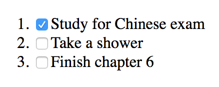

# 第六章：使用 React 构建 Web 应用程序

在本章中，我们将涵盖以下配方：

+   理解 React 元素和 React 组件

+   组合组件

+   有状态组件和生命周期方法

+   使用 React.PureComponent

+   React 事件处理程序

+   条件渲染组件

+   使用 React 渲染列表

+   在 React 中处理表单和输入

+   理解引用及其使用方法

+   理解 React 门户

+   使用错误边界组件捕获错误

+   使用 PropTypes 对属性进行类型检查

# 技术要求

您需要了解 Go 编程语言，还需要了解 Web 应用程序框架的基础知识。您还需要安装 Git，以便使用本书的 Git 存储库。最后，需要能够在命令行上使用 IDE 进行开发。

本章的代码文件可以在 GitHub 上找到：

[`github.com/PacktPublishing/MERN-Quick-Start-Guide/tree/master/Chapter06`](https://github.com/PacktPublishing/MERN-Quick-Start-Guide/tree/master/Chapter06)

查看以下视频以查看代码的运行情况：

[`goo.gl/J7d7Ag`](https://goo.gl/J7d7Ag)

# 介绍

React 是用于构建**用户界面**（**UI**）的 JavaScript 库。React 是基于组件的，这意味着每个组件可以独立于其他组件并管理自己的状态。可以通过组合组件创建复杂的 UI。

通常使用 JSX 语法创建组件，该语法具有类似 XML 的语法，或者使用`React.createElement`方法。但是，JSX 是使 React 以声明方式构建 Web 应用程序的特殊之处。

在 MVC 模式中，React 通常与视图相关联。

# 理解 React 元素和 React 组件

**React 元素**可以使用 JSX 语法创建：

```js
const element = <h1>Example</h1> 
```

这被转换为：

```js
const element = React.createElement('h1', null, 'Example') 
```

JSX 是 JavaScript 的语言扩展，允许您轻松创建复杂的 UI。例如，考虑以下内容：

```js
const element = ( 
    <details> 
        <summary>React Elements</summary> 
        <p>JSX is cool</p> 
    </details> 
) 
```

前面的示例可以不使用 JSX 语法来编写：

```js
const element = React.createElement( 
    'details', 
    null, 
    React.createElement('summary', null, 'React Elements'), 
    React.createElement('p', null, 'JSX is cool'), 
  ) 
```

React 元素可以是任何 HTML5 标记，任何 JSX 标记都可以是自闭合的。例如，以下将创建一个带有空内容的段落 React 元素：

```js
const element = <p /> 
```

与 HTML5 一样，您可以为 React 元素提供属性，称为属性或 props 在 React 中：

```js
const element = ( 
    <input type="text" value="Example" readOnly /> 
) 
```

**React 组件**允许您将 Web 应用程序的部分作为可重用的代码或组件隔离出来。它们可以以多种方式定义。例如：

+   **功能组件**：这些是接受属性作为第一个参数并返回 React 元素的纯 JavaScript 函数：

```js
      const InputText = ({ name, children }) => ( 
          <input 
              type="text" 
              name={name} 
              value={children} 
              readOnly 
          />­ 
      ) 
```

+   **类组件**：使用 ES6 类允许您定义生命周期方法并创建有状态组件。它们从`render`方法中呈现 React 元素：

```js
class InputText extends React.Component { 
    render() { 
              const { name, children } = this.props 
              return ( 
                  <input 
                      type="text" 
                      name={name} 
                      value={children} 
                      readOnly 
                  /> 
              ) 
          } 
      } 
```

+   **表达式**：这些保留对 React 元素或组件实例的引用：

```js
const InstanceInputText = ( 
          <InputText name="username"> 
              Huang Jx 
          </InputText> 
      ) 
```

有一些属性是唯一的，只属于 React 的一部分。例如，`children`属性指的是标签内包含的元素：

```js
<MyComponent> 
    <span>Example</span> 
</MyComponent> 
```

在上一个示例中，`MyComponent`中接收的`children`属性将是一个`span` React 元素的实例。如果作为子代传递了多个 React 元素或组件，则`children`属性将是一个数组。但是，如果没有传递子代，则`children`属性将为`null`。`children`属性不一定需要是 React 元素或组件；它也可以是 JavaScript 函数或 JavaScript 原始值：

```js
<MyComponent> 
    {() => { 
        console.log('Example!') 
        return null
    }} 
</MyComponent> 
```

React 还考虑返回或呈现字符串的功能组件和类组件，这是有效的 React 组件。例如：

```js
const SayHi = ({ to }) => ( 
    `Hello ${to}` 
) 
const element = ( 
    <h1> 
        <SayHi to="John" />, how are you? 
    </h1> 
) 
```

React 组件的名称必须以大写字母开头。否则，React 将把小写的 JSX 标签视为 React 元素

**在 React 中将组件呈现到 DOM**并不是一项复杂的任务。React 提供了几种方法，使用`ReactDOM`库将 React 组件呈现到 DOM。React 使用 JSX 或`React.createElement`来创建 DOM 树或 DOM 树的表示。它通过使用虚拟 DOM 来实现，这允许 React 将 React 元素转换为 DOM 节点，并仅更新已更改的节点。

这通常是您使用`ReactDOM`库中的`render`方法呈现应用程序的方式：

```js
import * as ReactDOM from 'react-dom' 
import App from './App' 
ReactDOM.render( 
   <App />, 
   document.querySelector('[role="main"]'), 
) 
```

提供给`render`方法的第一个参数是一个 React 组件或 React 元素。第二个参数告诉您在 DOM 中呈现应用程序的位置。在上一个示例中，我们使用文档对象的`querySelector`方法来查找一个具有`role`属性设置为`"main"`的 DOM 节点。

React 还允许您将 React 组件呈现为 HTML 字符串，这对于在服务器端生成内容并将内容直接发送到浏览器作为 HTML 文件非常有用：

```js
import * as React from 'react' 
import * as ReactDOMServer from 'react-dom/server' 
const OrderedList = ({ children }) => ( 
   <ol> 
      {children.map((item, indx) => ( 
         <li key={indx}>{item}</li> 
      ))} 
   </ol> 
) 
console.log( 
   ReactDOMServer.renderToStaticMarkup( 
      <OrderedList> 
         {['One', 'Two', 'Three']} 
      </OrderedList> 
   ) 
) 
```

它将在控制台中输出以下内容：

```js
<ol> 
   <li>One</li> 
   <li>Two</li> 
   <li>Three</li> 
</ol> 
```

# 准备工作

在这个示例中，您将使用您学到的有关 React 组件和 React 元素的概念创建一个简单的 React 应用程序。在开始之前，创建一个新的`package.json`文件，内容如下：

```js
{ 
  "scripts": { 
    "start": "parcel serve -p 1337 index.html" 
  }, 
  "devDependencies": { 
    "babel-plugin-transform-class-properties": "6.24.1", 
    "babel-preset-env": "1.6.1", 
    "babel-preset-react": "6.24.1", 
    "babel-core": "6.26.3", 
    "parcel-bundler": "1.8.1", 
    "react": "16.3.2", 
    "react-dom": "16.3.2" 
  } 
} 
```

接下来，创建一个名为`.babelrc`的 babel 配置文件，添加以下内容：

```js
{ 
    "presets": ["env","react"], 
    "plugins": ["transform-class-properties"] 
} 
```

然后，通过打开终端并运行以下命令来安装依赖项：

```js
npm install 
```

# 如何做...

创建一个 React 应用程序，将显示一个欢迎消息，编写功能、类和表达式组件：

1.  创建一个名为`basics.js`的新文件。

1.  导入 React 和 ReactDOM 库：

```js
      import * as React from 'react' 
      import * as ReactDOM from 'react-dom' 
```

1.  定义一个新的功能组件，它将使用红色设置为其样式属性的`color`呈现一个`span` React 元素：

```js
      const RedText = ({ text }) => ( 
          <span style={{ color: 'red' }}> 
              {text} 
          </span> 
      ) 
```

1.  定义另一个功能组件，它将呈现一个`h1` React 元素和`RedText`功能组件作为其`children`的一部分：

```js
      const Welcome = ({ to }) => ( 
          <h1>Hello, <RedText text={to}/></h1> 
      ) 
```

1.  定义一个包含对 React 元素的引用的表达式：

```js
      const TodoList = ( 
          <ul> 
              <li>Lunch at 14:00 with Jenny</li> 
              <li>Shower</li> 
          </ul> 
      ) 
```

1.  定义一个名为`Footer`的类组件，它将显示当前日期：

```js
      class Footer extends React.Component { 
          render() { 
              return ( 
                  <footer> 
                      {new Date().toDateString()} 
                  </footer> 
              ) 
          } 
      } 
```

1.  将应用程序渲染到 DOM 中：

```js
      ReactDOM.render( 
          <div> 
              <Welcome to="John" /> 
              {TodoList} 
              <Footer /> 
          </div>, 
          document.querySelector('[role="main"]'), 
      ) 
```

1.  保存文件。

然后，在那里您将渲染 React 应用程序创建一个`index.html`文件：

1.  创建一个名为`index.html`的新文件

1.  添加以下代码：

```js
      <!DOCTYPE html> 
      <html lang="en"> 
      <head> 
          <meta charset="UTF-8"> 
          <title>MyApp</title> 
      </head> 
      <body> 
          <div role="main"></div> 
          <script src="img/basics.js"></script> 
      </body> 
      </html> 
```

1.  保存文件

# 让我们来测试一下...

要查看以前的工作成果：

1.  在项目目录的根目录打开终端并运行：

```js
 npm start
```

1.  然后，在您的网络浏览器中打开一个新标签，转到：

```js
      http://localhost:1337/
```

1.  您应该能够看到 React 应用程序呈现到 DOM 中

# 组合组件

在 React 中，所有组件都可以被隔离，复杂的 UI 可以通过组合组件来构建，从而实现它们的可重用性。

# 准备工作

在这个示例中，您将使用可重用组件来生成一个包含三个部分的主页：标题、包含描述的段落和页脚。这三个部分将被写成三个单独的组件，稍后将被组合以构建主页。在开始之前，创建一个新的`package.json`文件，内容如下：

```js
{ 
  "scripts": { 
    "start": "parcel serve -p 1337 index.html" 
  }, 
  "devDependencies": { 
    "babel-plugin-transform-class-properties": "6.24.1", 
    "babel-preset-env": "1.6.1", 
    "babel-preset-react": "6.24.1", 
    "babel-core": "6.26.3", 
    "parcel-bundler": "1.8.1", 
    "react": "16.3.2", 
    "react-dom": "16.3.2" 
  } 
} 
```

接下来，创建一个名为`.babelrc`的 babel 配置文件，添加以下内容：

```js
{ 
    "presets": ["env","react"], 
    "plugins": ["transform-class-properties"] 
} 
```

然后，通过打开终端并运行以下命令来安装依赖项：

```js
npm install
```

# 如何做...

在项目的根目录中创建一个名为`component`的新文件夹。然后，按顺序创建以下三个文件：

1.  `Header.js`

1.  `Footer.js`

1.  `Description.js`

`Header`组件将生成一个代表页面标题的`h1` React 元素。它期望接收一个`title`属性：

1.  在`component`目录中创建一个名为`Header.js`的新文件

1.  添加以下代码：

```js
      import * as React from 'react' 
import * as ReactDOM from 'react-dom' 
      export default ({ title }) => ( 
          <h1>{title}</h1> 
      ) 
```

1.  保存文件

`Footer`组件将生成一个`footer` React 元素，将放置在页面的末尾。它将期望接收一个`date`属性：

1.  在`component`目录中创建一个名为`Footer.js`的新文件

1.  添加以下代码：

```js
      import * as React from 'react' 
      import * as ReactDOM from 'react-dom' 
      export default ({ date }) => ( 
          <footer>{date}</footer> 
      ) 
```

1.  保存文件

`Description`组件将生成一个段落，显示页面的描述：

1.  在`component`目录中创建一个名为`Description.js`的新文件

1.  添加以下代码：

```js
      import * as React from 'react' 
      import * as ReactDOM from 'react-dom' 
      export default () => ( 
          <p>This is a cool website designed with ReactJS</p> 
      ) 
```

1.  保存文件

接下来，从`component`目录返回到项目的根目录，即`package.json`所在的位置，并创建以下文件：

1.  创建一个名为`composing-react.js`的新文件

1.  导入 React 和`ReactDOM`库：

```js
      import * as React from 'react' 
      import * as ReactDOM from 'react-dom' 
```

1.  导入先前定义的组件：

```js
      import Header from './component/Header' 
      import Footer from './component/Footer' 
      import Description from './component/Description' 
```

1.  定义一个`App`组件，它将渲染您先前定义的组件：

```js
      const App = () => ( 
          <React.Fragment> 
              <Header title="Simple React App" /> 
              <Description /> 
              <Footer date={new Date().toDateString()} /> 
          </React.Fragment> 
      ) 
```

1.  渲染应用程序：

```js
      ReactDOM.render( 
          <App />, 
          document.querySelector('[role="main"]'), 
      ) 
```

1.  保存文件

然后，创建一个`index.html`文件，在其中渲染 React 应用程序：

1.  创建一个名为`index.html`的新文件

1.  添加以下代码：

```js
      <!DOCTYPE html> 
      <html lang="en"> 
      <head> 
          <meta charset="UTF-8"> 
          <title>Composing Components</title> 
      </head> 
      <body> 
          <div role="main"></div> 
          <script src="img/composing-react.js"></script> 
      </body> 
      </html> 
```

1.  保存文件

# 让我们来测试一下...

要查看先前的工作效果，请执行以下步骤：

1.  在项目目录的根目录打开终端并运行：

```js
 npm start
```

1.  然后，在您的 Web 浏览器中打开一个新标签，转到：

```js
      http://localhost:1337/ 
```

1.  如果您在浏览器的开发者工具中检查 DOM 树，应该能够看到以下 DOM 结构：

```js
      <div role="app"> 
      <h1>React App</h1> 
      <p>This is a cool website designed with ReactJS</p> 
      <footer>Tue May 22 2018</footer> 
      </div> 
```

# 它是如何工作的...

每个 React 组件都写在单独的文件中。然后，我们在主应用程序文件`composing-react.js`中导入组件，并使用组合来生成虚拟 DOM 树。每个组件都是可重用的，因为它可以通过导入文件再次在应用程序的其他部分或其他组件中使用。然后，使用`ReactDOM`库中的`render`方法来生成虚拟 DOM 树的 DOM 表示。

# 还有更多...

你注意到我们使用了`React.Fragment`吗？这是 React v16 中引入的新功能。它允许您返回多个元素而不创建额外的 DOM 节点。组件不能以以下方式返回多个 React 组件或元素：

```js
const Example = () => ( 
   <span>One</span> 
   <span>Two</span> 
) // < will trow an error 
```

然而，使用`React.Fragment`，可以执行以下操作：

```js
const Example = () => ( 
   <React.Fragment> 
      <span>One</span> 
      <span>Two</span> 
   </React.Fragment> 
) 
```

# 有状态组件和生命周期方法

React 组件可以管理自己的状态，并且仅在状态发生变化时进行更新。使用 ES6 类编写有状态的 React 组件：

```js
class Example extends React.Component { 
   render() { 
      <span>This is an example</span> 
   } 
} 
```

React 类组件具有`state`实例属性来访问其内部状态，以及`props`属性来访问传递给组件的属性：

```js
class Example extends React.Component {  
    state = { title: null } 
    render() { 
        return ( 
            <React.Fragment>  
                <span>{this.props.title}</span>  
                <span>{this.state.title}</span>  
            </React.Fragment>  
        ) 
    } 
} 
```

它们的状态可以通过使用`setState`实例方法进行改变：

```js
class Example extends React.Component { 
    state = { 
        title: "Example", 
        date: null, 
    } 
    componentDidMount() { 
        this.setState((prevState) => ({ 
            date: new Date().toDateString(), 
        })) 
    } 
    render() { 
        return ( 
            <React.Fragment>  
                <span>{this.state.title}</span>  
                <span>{this.state.date}</span>  
            </React.Fragment>  
        ) 
    } 
} 
```

状态只初始化一次。然后，当组件挂载时，应该只使用`setState`方法来改变状态。这样，React 就能够检测状态的变化并更新组件。

`setState`方法接受一个回调函数作为第一个参数，该函数将被执行，将当前状态（约定为`prevState`）作为回调函数的第一个参数传递，并将当前`props`作为第二个参数传递。这是因为`setState`是异步工作的，而在组件的不同部分执行其他操作时，状态可能会发生变化。

如果在更新状态时不需要访问当前状态，可以直接将对象作为第一个参数传递。例如，前面的示例可以这样编写：

```js
componentDidMount() { 
   this.setState({ 
      date: new Date().toDateString(), 
   }) 
} 
```

`setState`还接受一个可选的回调函数作为第二个参数，一旦状态已更新就会调用该函数。因为`setState`是异步的，您可能希望使用第二个回调来执行一个动作，只有在状态已更新后才执行：

```js
componentDidMount() { 
   this.setState({ 
      date: new Date().toDateString(), 
   }, () => { 
      console.log('date has been updated!') 
   }) 
   console.log(this.state.date) // null 
} 
```

组件挂载后，控制台首先会输出`null`，即使我们在之前使用了`setState`；这是因为状态是异步设置的。但是，一旦状态更新，控制台将显示“日期已更新”。

使用`setState`方法时，React 会将先前的状态与当前给定的状态合并。在内部，它类似于执行以下操作：

```js
currentState = Object.assign({}, currentState, nextState) 
```

每个类组件都有*生命周期方法*，这些方法让你控制组件的生命周期，从创建到销毁，同时也让你控制其他属性，比如知道组件何时接收到新的属性，以及组件是否应该更新。这些是所有类组件中存在的生命周期方法：

+   `constructor(props)`: 在组件初始化新实例之前调用，组件挂载之前。必须使用`super(props)`将`props`传递给父类，以便让 React 正确设置`props`。`constructor`方法也很有用，可以初始化组件的初始状态。

+   `static getDerivedStateFromProps(nextProps, nextState)`: 当组件实例化并且组件将接收新的`props`时调用。当状态或其一部分取决于传递给组件的`props`的值时，此方法很有用。它必须返回一个对象，该对象将与当前状态合并，或者如果状态在接收新的`props`后不需要更新，则返回`null`。

+   `componentDidMount()`: 在组件挂载后和第一次`render`调用后调用。用于与第三方库集成，访问 DOM，或向端点发出 HTTP 请求。

+   `shouldComponentUpdate(nextProps, nextState)`: 当组件更新状态或接收到新的 props 时调用。此方法允许 React 知道是否应该更新组件。如果在组件中没有实现此方法，则默认返回`true`，这意味着每次状态发生变化或接收到新的 props 时，组件都应该更新。如果实现此方法并返回`false`，则告诉 React 不要更新组件。

+   `componentDidUpdate(prevProps, prevState, snapshot)`: 在渲染方法之后或发生更新时调用，除了第一次渲染。

+   `getSnapshotBeforeUpdate(prevProps, prevState)`: 在渲染方法之后或发生更新时调用，但在`componentDidUpdate`生命周期方法之前调用。该方法的返回值作为`componentDidUpdate`的第三个参数传递。

+   `componentWillUnmount()`: 在组件卸载和实例销毁之前调用。如果使用第三方库，此方法有助于清理。例如，清除定时器或取消网络请求。

+   `componentDidCatch(error, info)`: 这是 React v16 的一个新功能，用于错误处理。我们将在接下来的示例中更详细地讨论这个功能。

# 准备工作

在这个示例中，你将使用我们学到的所有生命周期方法来构建一个组件。首先，创建一个新的`package.json`文件，内容如下：

```js
{ 
  "scripts": { 
    "start": "parcel serve -p 1337 index.html" 
  }, 
  "devDependencies": { 
    "babel-plugin-transform-class-properties": "6.24.1", 
    "babel-preset-env": "1.6.1", 
    "babel-preset-react": "6.24.1", 
    "babel-core": "6.26.3", 
    "parcel-bundler": "1.8.1", 
    "react": "16.3.2", 
    "react-dom": "16.3.2" 
  } 
} 
```

接下来，创建一个名为`.babelrc`的 babel 配置文件，添加以下内容：

```js
{ 
    "presets": ["env","react"], 
    "plugins": ["transform-class-properties"] 
} 
```

然后，通过打开终端并运行以下命令来安装依赖项：

```js
npm install  
```

# 操作步骤

构建一个`LifeCycleTime`组件，其唯一目的是显示当前时间。该组件将每 100 毫秒更新一次，以保持与时间变化的同步。我们将在这个组件中使用生命周期方法来实现以下目的：

+   `constructor(props)`: 初始化组件的初始状态。

+   `static getDerivedStateFromProps(nextProps, nextState)`: 用于将`props`与状态合并。

+   `componentDidMount()`: 使用`setInterval`设置一个每 100 毫秒执行一次的函数，该函数将更新当前时间的状态。

+   `shouldComponentUpdate(nextProps, nextState)`: 决定是否应该渲染组件。检查`props`是否具有设置为`true`的`dontUpdate`属性，这意味着在`state`或`props`更改时不应该更新组件。

+   `componentDidUpdate(prevProps, prevState, snapshot)`: 简单地在控制台中记录组件已更新并显示`snapshot`的值。

+   `getSnapshotBeforeUpdate(prevProps, prevState)`: 为了说明这个方法的功能，简单地返回一个字符串，该字符串将作为第三个参数传递给`componentDidUpdate`。

+   `componentWillUnmount()`: 当组件被销毁或卸载时，清除在`componentDidMount`中定义的间隔。否则，在组件卸载后，您将看到显示错误。

首先，创建一个`index.html`文件，您将在其中呈现 React 应用程序：

1.  创建一个名为`index.html`的新文件

1.  添加以下代码：

```js
      <!DOCTYPE html> 
      <html lang="en"> 
      <head> 
          <meta charset="UTF-8"> 
          <title>Life cycle methods</title> 
      </head> 
      <body> 
          <div role="main"></div> 
          <script src="img/stateful-react.js"></script> 
      </body> 
      </html> 
```

1.  保存文件

接下来，执行以下步骤来构建`LifeCycleTime`组件：

1.  创建一个名为`stateful-react.js`的新文件

1.  导入 React 和`ReactDOM`库：

```js
      import * as React from 'react' 
      import * as ReactDOM from 'react-dom' 
```

1.  定义一个`LifeCycleTime`类组件，并使用如前所述的生命周期方法：

```js
      class LifeCycleTime extends React.Component { 
          constructor(props) { 
              super(props) 
              this.state = { 
                  time: new Date().toTimeString(), 
                  color: null, 
                  dontUpdate: false, 
              } 
          } 
          static getDerivedStateFromProps(nextProps, prevState) { 
              return nextProps 
          } 
          componentDidMount() { 
              this.intervalId = setInterval(() => { 
                  this.setState({ 
                      time: new Date().toTimeString(), 
                  }) 
              }, 100) 
          } 
          componentWillUnmount() { 
              clearInterval(this.intervalId) 
          } 
          shouldComponentUpdate(nextProps, nextState) { 
              if (nextState.dontUpdate) { 
                  return false 
              } 
              return true 
          } 
          getSnapshotBeforeUpdate(prevProps, prevState) { 
              return 'snapshot before update' 
          } 
          componentDidUpdate(prevProps, prevState, snapshot) { 
              console.log( 
                  'Component did update and received snapshot:', 
                  snapshot, 
              ) 
          } 
          render() { 
              return ( 
                  <span style={{ color: this.state.color }}> 
                      {this.state.time} 
                  </span> 
              ) 
          } 
      } 
```

1.  然后，定义一个`App`类组件，用于测试先前创建的组件。添加三个按钮：一个用于在红色和蓝色之间切换颜色属性，并将其作为 prop 传递给`LifeCycleTime`组件，另一个用于在状态中在 true 和 false 之间切换`dontUpdate`属性，然后将其作为 prop 传递给`LifeCycleTime`，最后，一个按钮，当点击时，将挂载或卸载`LifeCycleTime`组件：

```js
      class App extends React.Component { 
          constructor(props) { 
              super(props) 
              this.state = { 
                  color: 'red', 
                  dontUpdate: false, 
                  unmount: false, 
              } 
              this.toggleColor = this.toggleColor.bind(this) 
              this.toggleUpdate = this.toggleUpdate.bind(this) 
              this.toggleUnmount = this.toggleUnmount.bind(this) 
          } 
          toggleColor() { 
              this.setState((prevState) => ({ 
                  color: prevState.color === 'red' 
                      ? 'blue' 
                      : 'red', 
              })) 
          } 
          toggleUpdate() { 
              this.setState((prevState) => ({ 
                  dontUpdate: !prevState.dontUpdate, 
              })) 
          } 
          toggleUnmount() { 
              this.setState((prevState) => ({ 
                  unmount: !prevState.unmount, 
              })) 
          } 
          render() { 
              const { 
                  color, 
                  dontUpdate, 
                  unmount, 
              } = this.state 
              return ( 
                  <React.Fragment> 
                      {unmount === false && <LifeCycleTime 
                          color={color} 
                          dontUpdate={dontUpdate} 
                      />} 
                      <button onClick={this.toggleColor}> 
                          Toggle color 
                          {JSON.stringify({ color })} 
                      </button> 
                      <button onClick={this.toggleUpdate}> 
                          Should update? 
                          {JSON.stringify({ dontUpdate })} 
                      </button> 
                      <button onClick={this.toggleUnmount}> 
                          Should unmount? 
                          {JSON.stringify({ unmount })} 
                      </button> 
                  </React.Fragment> 
              ) 
          } 
      } 
```

1.  渲染应用程序：

```js
      ReactDOM.render( 
          <App />, 
          document.querySelector('[role="main"]'), 
      ) 
```

1.  保存文件。

# 让我们来测试一下...

要查看以前的工作情况，请执行以下步骤：

1.  在项目目录的根目录下打开终端并运行：

```js
 npm start
```

1.  然后，在您的网络浏览器中打开一个新标签并转到：

```js
 http://localhost:1337/
```

1.  使用按钮来切换组件的状态，并了解生命周期方法如何影响组件的功能。

# 使用 React.PureComponent

`React.PureComponent`类似于`React.Component`。不同之处在于，`React.Component`在内部实现了`shouldComponentUpdate`生命周期方法，以对`state`和`props`进行浅层比较，以决定组件是否应该更新。

# 准备工作

在这个示例中，您将编写两个组件，一个扩展`React.PureComponent`，另一个扩展`React.Component`，以便在将相同的属性传递给它们时查看它们的行为。在开始之前，创建一个新的`package.json`文件，内容如下：

```js
{ 
  "scripts": { 
    "start": "parcel serve -p 1337 index.html" 
  }, 
  "devDependencies": { 
    "babel-plugin-transform-class-properties": "6.24.1", 
    "babel-preset-env": "1.6.1", 
    "babel-preset-react": "6.24.1", 
    "babel-core": "6.26.3", 
    "parcel-bundler": "1.8.1", 
    "react": "16.3.2", 
    "react-dom": "16.3.2" 
  } 
} 
```

接下来，创建一个名为`.babelrc`的 babel 配置文件，并添加以下内容：

```js
{ 
    "presets": ["env","react"], 
    "plugins": ["transform-class-properties"] 
} 
```

然后，通过打开终端并运行以下命令来安装依赖项：

```js
npm install  
```

# 如何做...

构建一个 React 应用程序，以更好地说明和理解`React.PureComponent`的工作原理。创建两个组件：一个将扩展`React.Component`，而另一个将扩展`React.PureComponent`。这两个组件都将放置在另一个名为`App`的 React 组件中，该组件将每秒更新其状态。在这两个组件的生命周期方法`componentDidUpdate`中，我们将在控制台上记录当父组件`App`更新时它们中的哪一个被更新。

首先，创建一个`index.html`文件，其中将呈现 React 应用程序：

1.  创建一个名为`index.html`的新文件

1.  添加以下 HTML 代码：

```js
      <!DOCTYPE html> 
      <html lang="en"> 
      <head> 
          <meta charset="UTF-8"> 
          <title>React.PureComponent</title> 
      </head> 
      <body> 
          <div role="main"></div> 
          <script src="img/pure-component.js"></script> 
      </body> 
      </html> 
```

1.  保存文件

然后，按照以下步骤构建 React 应用程序：

1.  创建一个名为`pure-component.js`的新文件。

1.  导入 React 和 ReactDOM 库：

```js
      import * as React from 'react' 
      import * as ReactDOM from 'react-dom' 
```

1.  定义一个扩展`React.PureComponent`类的`Button`类组件：

```js
      class Button extends React.PureComponent { 
          componentDidUpdate() { 
              console.log('Button Component did update!') 
          } 
          render() { 
              return ( 
                  <button>{this.props.children}</button> 
              ) 
          } 
      } 
```

1.  定义一个扩展`React.Component`类的`Text`类组件：

```js
      class Text extends React.Component { 
          componentDidUpdate() { 
              console.log('Text Component did update!') 
          } 
          render() { 
              return this.props.children 
          } 
      } 
```

1.  定义一个简单的扩展`React.Component`类的`App`组件，该组件一旦挂载就会设置一个计时器，并每秒更新一次状态：

```js
      class App extends React.Component { 
          state = { 
              counter: 0, 
          } 
          componentDidMount() { 
              this.intervalId = setInterval(() => { 
                  this.setState(({ counter }) => ({ 
                      counter: counter + 1, 
                  })) 
              }, 1000) 
          } 
          componentWillUnmount() { 
              clearInterval(this.intervalId) 
          } 
          render() { 
              const { counter } = this.state 
              return ( 
                  <React.Fragment> 
                      <h1>Counter: {counter}</h1> 
                      <Text>I'm just a text</Text> 
                      <Button>I'm a button</Button> 
                  </React.Fragment> 
              ) 
          } 
      } 
```

1.  渲染应用程序：

```js
      ReactDOM.render( 
          <App />, 
          document.querySelector('[role="main"]'), 
      ) 
```

1.  保存文件。

# 让我们来测试一下...

要查看以前的工作情况，请执行以下步骤：

1.  在项目目录的根目录下打开终端并运行：

```js
 npm start
```

1.  然后，在您的网络浏览器中打开一个新标签并转到：

```js
 http://localhost:1337/  
```

1.  计数器将每秒增加一次。在浏览器中打开开发者工具并检查控制台输出。您应该会看到以下内容：

```js
      [N] Text Component did update! 
```

# 它是如何工作的...

因为`React.PureComponent`在内部实现了`shouldComponentUpdate`**生命周期方法**，所以它不会更新`Button`组件，因为它的`state`或`props`没有改变。但是，它会更新`Text`组件，因为`shouldComponentUpdate`默认返回`true`，告诉 React 更新组件，即使它的 props 或 state 没有改变。

# React 事件处理程序

React 的事件系统在内部使用一个包装器，称为`SyntheticEvent`，围绕原生 HTML DOM 事件进行跨浏览器支持。React 事件遵循 W3C 规范，可以在[`www.w3.org/TR/DOM-Level-3-Events/`](https://www.w3.org/TR/DOM-Level-3-Events/)找到。

React 事件名称采用驼峰命名法，而不是 HTML DOM 事件，后者采用小写。例如，HTML DOM 事件`onclick`在 React 中被称为`onClick`。有关支持的事件的完整列表，请访问 React 官方关于事件的文档：[`reactjs.org/docs/events.html`](https://reactjs.org/docs/events.html)

# 准备工作

在这个示例中，您将编写一个组件，以了解它是如何定义和工作的。在开始之前，请创建一个新的`package.json`文件，内容如下：

```js
{ 
  "scripts": { 
    "start": "parcel serve -p 1337 index.html" 
  }, 
  "devDependencies": { 
    "babel-plugin-transform-class-properties": "6.24.1", 
    "babel-preset-env": "1.6.1", 
    "babel-preset-react": "6.24.1", 
    "babel-core": "6.26.3", 
    "parcel-bundler": "1.8.1", 
    "react": "16.3.2", 
    "react-dom": "16.3.2" 
  } 
} 
```

接下来，创建一个名为`.babelrc`的 babel 配置文件，添加以下内容：

```js
{ 
    "presets": ["env","react"], 
    "plugins": ["transform-class-properties"] 
} 
```

然后，通过打开终端并运行以下命令来安装依赖项：

```js
npm install 
```

# 操作如下...

首先，创建一个`index.html`文件，其中将呈现 React 应用程序：

1.  创建一个名为`index.html`的新文件

1.  添加以下 HTML 代码：

```js
      <!DOCTYPE html> 
      <html lang="en"> 
      <head> 
          <meta charset="UTF-8"> 
          <title>React Events Handlers</title> 
      </head> 
      <body> 
          <div role="main"></div> 
          <script src="img/events.js"></script> 
      </body> 
      </html> 
```

1.  保存文件

接下来，编写一个组件，为`onClick`事件定义一个事件处理程序：

1.  创建一个名为`events.js`的新文件。

1.  导入 React 和 ReactDOM 库：

```js
      import * as React from 'react' 
      import * as ReactDOM from 'react-dom' 
```

1.  定义一个类组件，它将呈现一个`h1` React 元素和一个`button` React 元素，每当点击它时都会触发`onBtnClick`方法：

```js
      class App extends React.Component { 
          constructor(props) { 
              super(props) 
              this.state = { 
                  title: 'Untitled', 
              } 
              this.onBtnClick = this.onBtnClick.bind(this) 
          } 
          onBtnClick() { 
              this.setState({ 
                  title: 'Hello there!', 
              }) 
          } 
          render() { 
              return ( 
                  <section> 
                      <h1>{this.state.title}</h1> 
                      <button onClick={this.onBtnClick}> 
                          Click me to change the title 
                      </button> 
                  </section> 
              ) 
          } 
      } 
```

1.  渲染应用程序：

```js
      ReactDOM.render( 
          <App />, 
          document.querySelector('[role="main"]'), 
      ) 
```

1.  保存文件。

# 让我们来测试一下...

要查看应用程序的工作情况，请执行以下步骤：

1.  在项目目录的根目录打开终端并运行：

```js
       npm start
```

1.  然后，在您的网络浏览器中打开一个新标签，并转到：

```js
      http://localhost:1337/
```

1.  单击按钮以更改标题。

# 它是如何工作的...

React 事件作为`props`传递给 React 元素。例如，我们将`onClick` prop 传递给`button` React 元素，并引用一个回调函数，我们期望在用户单击按钮时调用。

# 还有更多...

你有没有注意到我们经常使用`bind`？当一个方法作为 prop 传递给子组件时，它失去了`this`的上下文，因此需要绑定到上下文。看下面的例子：

```js
class Example { 
    fn() { return this } 
} 
const examp = new Example() 
const props = examp.fn 
const bound = examp.fn.bind(examp) 
console.log('1:', typeof examp.fn()) 
console.log('2:', typeof props()) 
console.log('3:', typeof bound()) 
```

显示的输出将是：

```js
1: object 
2: undefined 
3: object 
```

尽管常量`props`引用了`Example`类的`examp`实例的`fn`方法，但它失去了`this`的上下文。这就是为什么绑定允许您保持原始上下文。在 React 中，我们将一个方法绑定到`this`的原始上下文，以便能够使用我们自己的实例方法，比如`setState`，当将函数传递给子组件时。否则，`this`的上下文将是`undefined`，函数将失败。

# 组件的条件渲染

通常在构建复杂的 UI 时，您需要根据接收到的状态或 props 来呈现组件或 React 元素。

React 组件允许在花括号内执行 JavaScript，并且可以与条件三元运算符一起使用，以决定呈现哪个组件或 React 元素。例如：

```js
const Meal = ({ timeOfDay }) => (  
    <span>{timeOfDay === 'noon' 
        ? 'Pizza' 
        : 'Sandwich' 
    }</span>  
) 
```

这也可以写成：

```js
const Meal = ({ timeOfDay }) => (  
    <span children={timeOfDay === 'noon' 
        ? 'Pizza' 
        : 'Sandwich' 
    } />  
) 
```

如果将`timeOfDay`属性值设置为`"noon"`，它将生成以下 HTML 内容：

```js
<span>Pizza</span> 
```

或者当`timeOfDay`属性未设置为`"noon"`时，将会是以下内容：

```js
<span>Sandwich</span> 
```

# 准备工作

在这个示例中，您将构建一个组件，根据给定的条件呈现其子组件之一。首先，创建一个新的`package.json`文件，内容如下：

```js
{ 
  "scripts": { 
    "start": "parcel serve -p 1337 index.html" 
  }, 
  "devDependencies": { 
    "babel-plugin-transform-class-properties": "6.24.1", 
    "babel-preset-env": "1.6.1", 
    "babel-preset-react": "6.24.1", 
    "babel-core": "6.26.3", 
    "parcel-bundler": "1.8.1", 
    "react": "16.3.2", 
    "react-dom": "16.3.2" 
  } 
} 
```

接下来，创建一个名为`.babelrc`的 babel 配置文件，添加以下内容：

```js
{ 
    "presets": ["env","react"], 
    "plugins": ["transform-class-properties"] 
} 
```

然后，通过打开终端并运行来安装依赖项：

```js
npm install
```

# 如何做...

编写一个 React 组件，根据作为属性传递的`condition`，决定两个不同的 React 元素中的哪一个将根据`condition`显示。如果条件为真，则显示第一个子元素。否则，应显示第二个子元素。

首先，创建一个`index.html`文件，其中将呈现 React 应用程序：

1.  创建一个名为`index.html`的新文件

1.  添加以下 HTML 代码：

```js
      <!DOCTYPE html> 
      <html lang="en"> 
      <head> 
          <meta charset="UTF-8"> 
          <title>Conditional Rendering</title> 
      </head> 
      <body> 
          <div role="main"></div> 
          <script src="img/conditions.js"></script> 
      </body> 
      </html> 
```

1.  保存文件

然后，创建一个包含 React 应用程序逻辑和您的组件的新文件：

1.  创建一个名为`conditions.js`的新文件

1.  导入 React 和 ReactDOM 库：

```js
      import * as React from 'react' 
      import * as ReactDOM from 'react-dom' 
```

1.  定义一个名为`Toggle`的功能组件，它将接收一个名为`condition`的属性，该属性将被评估以定义要渲染哪个 React 元素。它期望接收两个 React 元素作为子元素：

```js
      const Toggle = ({ condition, children }) => ( 
          condition 
              ? children[0] 
              : children[1] 
      ) 
```

1.  定义一个名为`App`的类组件，它将根据定义的条件渲染一个 React 元素。当单击按钮时，它将切换`color`状态：

```js
      class App extends React.Component { 
          constructor(props) { 
              super(props) 
              this.state = { 
                  color: 'blue', 
              } 
              this.onClick = this.onClick.bind(this) 
          } 
          onClick() { 
              this.setState(({ color }) => ({ 
                  color: (color === 'blue') ? 'lime' : 'blue' 
              })) 
          } 
          render() { 
              const { color } = this.state 
              return ( 
                  <React.Fragment> 
                      <Toggle condition={color === 'blue'}> 
                          <p style={{ color }}>Blue!</p> 
                          <p style={{ color }}>Lime!</p> 
                      </Toggle> 
                      <button onClick={this.onClick}> 
                          Toggle Colors 
                      </button> 
                  </React.Fragment> 
              ) 
          } 
      } 
```

1.  渲染应用程序：

```js
      ReactDOM.render( 
          <App />, 
          document.querySelector('[role="main"]'), 
      ) 
```

1.  保存文件。

# 让我们来测试一下...

要运行和测试应用程序，请执行以下步骤：

1.  在项目目录的根目录打开一个终端并运行：

```js
 npm start
```

1.  然后，在您的网络浏览器中打开一个新标签并转到：

```js
      http://localhost:1337/
```

1.  单击按钮切换显示哪个 React 元素

# 它是如何工作的...

因为`children`属性可以是一组 React 元素的数组，我们可以访问每个单独的 React 元素并决定要渲染哪一个。我们使用`condition`属性来评估给定条件是否为真，以渲染第一个 React 元素。否则，如果值为假，则渲染第二个 React 元素。

# 使用 React 渲染列表

React 允许您将一组 React 元素或组件作为数组中的`children`传递。例如：

```js
   <ul> 
      {[ 
         <li key={0}>One</li>, 
         <li key={1}>Two</li>, 
      ]} 
   </ul> 
```

React 元素或组件的集合必须被赋予一个名为`key`的特殊 props 属性。当更新发生时，此属性让 React 知道集合中的元素中哪些已经改变、移动或从数组中删除。

# 准备工作

在这个示例中，您将构建一个实用组件，它将把数组的每个项目映射到组件的 props 并将它们作为列表呈现。在开始之前，创建一个包含以下内容的新`package.json`文件：

```js
{ 
  "scripts": { 
    "start": "parcel serve -p 1337 index.html" 
  }, 
  "devDependencies": { 
    "babel-plugin-transform-class-properties": "6.24.1", 
    "babel-preset-env": "1.6.1", 
    "babel-preset-react": "6.24.1", 
    "babel-core": "6.26.3", 
    "parcel-bundler": "1.8.1", 
    "react": "16.3.2", 
    "react-dom": "16.3.2" 
  } 
} 
```

接下来，创建一个名为`.babelrc`的 babel 配置文件，添加以下内容：

```js
{ 
    "presets": ["env","react"], 
    "plugins": ["transform-class-properties"] 
} 
```

然后，通过打开终端并运行来安装依赖项：

```js
 npm install
```

# 如何做...

创建一个名为`MapArray`的 React 组件，它将负责将数组的项目映射到 React 组件。

首先，创建一个`index.html`文件，其中将呈现 React 应用程序：

1.  创建一个名为`index.html`的新文件

1.  添加以下 HTML 代码：

```js
      <!DOCTYPE html> 
      <html lang="en"> 
      <head> 
          <meta charset="UTF-8"> 
          <title>Rendering Lists</title> 
      </head> 
      <body> 
         <div role="main"></div> 
          <script src="img/lists.js"></script> 
      </body> 
      </html> 
```

1.  保存文件

然后，执行以下步骤构建 React 应用程序：

1.  创建一个名为`lists.js`的新文件。

1.  导入 React 和 ReactDOM 库：

```js
      import * as React from 'react' 
      import * as ReactDOM from 'react-dom' 
```

1.  定义一个名为`MapArray`的功能组件，它将期望接收三个属性：`from`，预期为值数组，`mapToProps`，预期为将值映射到属性的回调函数，最后，`children`，预期接收一个 React 组件，其中数组的值将被映射到：

```js
      const MapArray = ({ 
          from, 
          mapToProps, 
          children: Child, 
      }) => ( 
          <React.Fragment> 
              {from.map((item) => ( 
                  <Child {...mapToProps(item)} /> 
              ))} 
          </React.Fragment> 
      ) 
```

1.  定义一个`TodoItem`组件，它期望接收两个属性，`done`和`label`：

```js
      const TodoItem = ({ done, label }) => ( 
          <li> 
              <input type="checkbox" checked={done} readOnly /> 
              <label>{label}</label> 
          </li> 
      ) 
```

1.  定义一个包含对象值的待办事项列表的数组：

```js
      const list = [ 
          { id: 1, done: true, title: 'Study for Chinese exam' }, 
          { id: 2, done: false, title: 'Take a shower' }, 
          { id: 3, done: false, title: 'Finish chapter 6' }, 
      ] 
```

1.  定义一个回调函数，将数组的对象值映射到`TodoItem`组件的预期属性。将`id`属性重命名为`key`，将`title`属性重命名为`label`：

```js
      const mapToProps = ({ id: key, done, title: label }) => ({ 
          key, 
          done, 
          label, 
      }) 
```

1.  定义一个`TodoListApp`组件，它将使用`MapArray`组件为待办事项列表数组中的每个项目创建一个`TodoItem`实例：

```js
      const TodoListApp = ({ items }) => ( 
          <ol> 
              <MapArray from={list} mapToProps={mapToProps}> 
                  {TodoItem} 
              </MapArray> 
          </ol> 
      ) 
```

1.  渲染应用程序：

```js
      ReactDOM.render( 
          <TodoListApp items={list} />, 
          document.querySelector('[role="main"]'), 
      ) 
```

1.  保存文件。

# 让我们来测试一下...

要运行和测试应用程序，请执行以下步骤：

1.  在项目目录的根目录打开一个终端并运行：

```js
 npm start
```

1.  然后，在您的网络浏览器中打开一个新标签并转到：

```js
      http://localhost:1337/
```

1.  应该显示一个待办事项列表：



待办事项列表

# 它是如何工作的...

看一下以下代码：

```js
<ol> 
   <MapArray from={list} mapToProps={mapToProps}> 
      {TodoItem} 
   </MapArray> 
</ol> 
```

这与写作方式基本相同：

```js
<ol> 
   <React.Fragment> 
      {from.map((item) => ( 
         <TodoItem {...mapToProps(item) } /> 
      ))} 
   </React.Fragment> 
</ol> 
```

然而，`MapArray`充当一个辅助组件来执行相同的工作，同时使代码更易读。

您是否注意到`TodoItem`组件只期望两个属性？但是，我们还将项目的`id`作为`key`传递。如果未传递`key`属性，则在呈现组件时将显示警告。

# 在 React 中处理表单和输入

**与表单相关的元素**，如`<input>`和`<textarea>`，通常维护其自己的内部状态，并根据用户输入进行更新。在 React 中，当使用 React 状态管理**与表单相关的元素**的输入时，它被称为**受控组件**。

在 React 中，默认情况下，如果输入的`value`属性未设置，则输入的内部状态可以通过用户输入进行更改。但是，如果设置了`value`属性，则输入是只读的，并且它期望 React 使用`onChange` React 事件来管理用户输入，并使用 React 状态来更新输入的状态（如果需要）。例如，这个`input` React 元素将被呈现为只读的：

```js
<input type="text" value="Ms.Huang Jx" /> 
```

然而，因为 React 希望找到一个`onChange`事件处理程序，前面的代码将在控制台上输出警告消息。为了解决这个问题，我们可以为`onChange`属性提供一个回调函数来处理用户输入：

```js
<input type="text" value="Ms.Huang Jx" onChange={event => null} /> 
```

因为用户输入是由 React 处理的，在前面的例子中，我们没有更新输入的值，所以输入看起来是只读的。前面的代码类似于只设置`readOnly`属性而不提供无用的`onChange`属性。

React 还允许您定义**不受控组件**，它基本上让 React 无法控制输入的更新方式。例如，当使用第三方库来操作输入时，**不受控组件**具有一个名为`defaultValue`的属性，它类似于`value`属性。但是，它让输入通过用户输入控制其内部状态，而不是通过 React 控制。这意味着具有`defaultValue`属性的**与表单相关的元素**允许其状态通过用户输入进行改变：

```js
<input type="text" defaultValue="Ms.Huang Jx" /> 
```

与使用`value`属性相反，现在可以在输入框中输入以更改其值，因为输入的内部状态是可变的。

# 准备工作

在这个示例中，您将构建一个简单的登录表单组件。在开始之前，创建一个新的`package.json`文件，其中包含以下内容：

```js
{ 
  "scripts": { 
    "start": "parcel serve -p 1337 index.html" 
  }, 
  "devDependencies": { 
    "babel-plugin-transform-class-properties": "6.24.1", 
    "babel-preset-env": "1.6.1", 
    "babel-preset-react": "6.24.1", 
    "babel-core": "6.26.3", 
    "parcel-bundler": "1.8.1", 
    "react": "16.3.2", 
    "react-dom": "16.3.2" 
  } 
} 
```

接下来，创建一个名为`.babelrc`的 babel 配置文件，添加以下内容：

```js
{ 
    "presets": ["env","react"], 
    "plugins": ["transform-class-properties"] 
} 
```

然后，通过打开终端并运行以下命令来安装依赖项：

```js
 npm install
```

# 如何做到...

定义一个名为`LoginForm`的类组件，它将处理`username`输入和`password`输入。

首先，创建一个`index.html`文件，其中将呈现 React 应用程序：

1.  创建一个名为`index.html`的新文件

1.  添加以下 HTML 代码：

```js
      <!DOCTYPE html> 
      <html lang="en"> 
      <head> 
          <meta charset="UTF-8"> 
          <title>Forms and Inputs</title> 
      </head> 
      <body> 
          <div role="main"></div> 
          <script src="img/forms.js"></script> 
      </body> 
      </html> 
```

1.  保存文件

接下来，构建`LoginForm`组件，并利用 React 对输入状态的控制来禁止在`username`输入中输入数字：

1.  创建一个名为`forms.js`的新文件。

1.  导入 React 和 ReactDOM 库：

```js
      import * as React from 'react' 
      import * as ReactDOM from 'react-dom' 
```

1.  定义一个名为`LoginForm`的类组件。在类中，为输入更改定义一个事件处理程序，并检查`username`输入的值以禁止输入数字：

```js
      class LoginForm extends React.Component { 
          constructor(props) { 
              super(props) 
              this.state = { 
                  username: '', 
                  password: '', 
              } 
              this.onChange = this.onChange.bind(this) 
          } 
          onChange(event) { 
              const { name, value } = event.target 
              this.setState({ 
                  [name]: name === 'username' 
                      ? value.replace(/d/gi, '') 
                      : value 
              }) 
          } 
          render() { 
              return ( 
                  <form> 
                      <input 
                          type="text" 
                          name="username" 
                          placeholder="Username" 
                          value={this.state.username} 
                          onChange={this.onChange} 
                      /> 
                      <input 
                          type="password" 
                          name="password" 
                          placeholder="Password" 
                          value={this.state.password} 
                          onChange={this.onChange} 
                      /> 
                      <pre> 
                          {JSON.stringify(this.state, null, 2)} 
                      </pre> 
                  </form> 
              ) 
          } 
      } 
```

1.  渲染应用程序：

```js
      ReactDOM.render( 
          <LoginForm />, 
          document.querySelector('[role="main"]'), 
      ) 
```

1.  保存文件。

# 让我们来测试一下...

要运行和测试应用程序，请执行以下步骤：

1.  在项目目录的根目录打开终端并运行：

```js
 npm start
```

1.  然后，在您的网络浏览器中打开一个新标签并转到：

```js
http://localhost:1337/
```

1.  尝试在“用户名”输入中输入一个数字，看看数字验证是如何工作的

# 它是如何工作的...

我们定义了一个在两个输入元素中使用的`onChange`事件处理程序。但是，我们检查输入的名称是否为`username`，以决定是否应用验证。我们使用`RegExp`来测试输入中的数字，并用空字符串替换它们。这就是为什么在`username`输入时输入数字不会显示出来。

# 理解 refs 以及如何使用它们

在通常的工作流程中，React 组件通过传递`props`与它们的子组件进行通信。然而，有一些情况需要访问子组件的实例以进行通信或修改其行为。React 使用`refs`允许我们访问子组件的实例。

重要的是要理解，React 组件的实例使您可以访问其实例方法和属性。但是，React 元素的实例是 HTML DOM 元素的实例。通过给 React 组件或 React 元素添加`ref`属性来访问 refs。它期望值是一个回调函数，一旦实例被创建，就会调用该回调函数，从而在传递给回调函数的第一个参数中提供对实例的引用。

React 提供了一个名为`createRef`的辅助函数，用于正确设置回调函数以定义 refs。例如，以下代码获取了 React 组件和 React 元素的引用：

```js
class Span extends React.Component { 
    render() { 
        return <span>{this.props.children}</span> 
    } 
} 
class App extends React.Component { 
    rf1 = React.createRef() 
    rf2 = React.createRef() 
    componentDidMount() { 
        const { rf1, rf2 } = this 
        console.log(rf1.current instanceof HTMLSpanElement) 
        console.log(rf2.current instanceof Span) 
    } 
    render() { 
        return ( 
            <React.Fragment> 
                <span ref={this.rf1} /> 
                <Span ref={this.rf2} /> 
            </React.Fragment> 
        ) 
    } 
} 
```

在这个示例中，控制台将输出两次`true`：

```js
true // rf1.current instanceof HTMLSpanElement 
true // rf2.current instanceof Span 
```

这证明了我们刚刚学到的东西。

功能组件没有`refs`。因此，给功能组件添加`ref`属性将在控制台中显示警告并失败。

**Refs**在以下情况下特别有用：与*不受控制的组件*一起使用

+   与第三方库集成

+   访问 HTML DOM 元素的本机方法，否则无法从 React 访问，例如`HTMLElement.focus()`方法

+   使用某些 Web API，例如 Selection Web API，Web Animations API 和媒体播放方法

# 准备工作

在这个示例中，您将使用不受控制的组件，并使用 refs 向表单 HTML 元素发送自定义事件。在开始之前，创建一个带有以下内容的新`package.json`文件：

```js
{ 
  "scripts": { 
    "start": "parcel serve -p 1337 index.html" 
  }, 
  "devDependencies": { 
    "babel-plugin-transform-class-properties": "6.24.1", 
    "babel-preset-env": "1.6.1", 
    "babel-preset-react": "6.24.1", 
    "babel-core": "6.26.3", 
    "parcel-bundler": "1.8.1", 
    "react": "16.3.2", 
    "react-dom": "16.3.2" 
  } 
} 
```

接下来，创建一个 babel 配置文件`.babelrc`，添加以下内容：

```js
{ 
    "presets": ["env","react"], 
    "plugins": ["transform-class-properties"] 
} 
```

然后，通过打开终端并运行来安装依赖项：

```js
 npm install
```

# 如何做...

定义一个`LoginForm`类组件，该组件将渲染一个带有两个输入的表单：一个用于用户名，另一个用于密码。在表单 React 元素之外包括一个按钮，该按钮将用于触发表单 React 元素上的`onSubmit`事件。

首先，创建一个`index.html`文件，其中将呈现 React 应用程序：

1.  创建一个名为`index.html`的新文件

1.  添加以下 HTML 代码：

```js
      <!DOCTYPE html> 
      <html lang="en"> 
      <head> 
          <meta charset="UTF-8"> 
          <title>Refs</title> 
      </head> 
      <body> 
          <div role="main"></div> 
          <script src="img/refs.js"></script> 
      </body> 
      </html> 
```

1.  保存文件

现在，开始构建 React 应用程序：

1.  创建一个名为`refs.js`的新文件。

1.  导入 React 和 ReactDOM 库：

```js
      import * as React from 'react' 
import * as ReactDOM from 'react-dom' 
```

1.  定义一个名为`LoginForm`的类组件，该组件将渲染表单和一个按钮，当点击时将使用`refs`触发`onSubmit`表单事件：

```js
      class LoginForm extends React.Component { 
          refForm = React.createRef() 
          constructor(props) { 
              super(props) 
              this.state = {} 
              this.onSubmit = this.onSubmit.bind(this) 
              this.onClick = this.onClick.bind(this) 
          } 
          onSubmit(event) { 
              const form = this.refForm.current 
              const data = new FormData(form) 
              this.setState({ 
                  user: data.get('user'), 
                  pass: data.get('pass'), 
              }) 
              event.preventDefault() 
          } 
          onClick(event) { 
              const form = this.refForm.current 
              form.dispatchEvent(new Event('submit')) 
          } 
          render() { 
              const { onSubmit, onClick, refForm, state } = this 
              return ( 
                  <React.Fragment> 
                      <form onSubmit={onSubmit} ref={refForm}> 
                          <input type="text" name="user" /> 
                          <input type="text" name="pass" /> 
                      </form> 
                      <button onClick={onClick}>LogIn</button> 
                      <pre>{JSON.stringify(state, null, 2)}</pre> 
                  </React.Fragment> 
              ) 
          } 
      } 
```

1.  渲染应用程序：

```js
      ReactDOM.render( 
          <LoginForm />, 
          document.querySelector('[role="main"]'), 
      ) 
```

1.  保存文件。

# 让我们来测试一下...

运行和测试应用程序，请执行以下步骤：

1.  在项目目录的根目录下打开终端并运行：

```js
 npm start
```

1.  然后，在 Web 浏览器中打开一个新标签并转到：

```js
http://localhost:1337/
```

# 它是如何工作的...

1.  点击`LogIn`按钮以测试表单`onSubmit`事件是否被触发。

1.  首先，将表单 DOM 元素的实例引用保存在一个名为`reform`的实例属性中。

1.  然后，一旦按钮被提交，我们使用`EventTarget` web API 的`dispatchEvent`方法在表单 DOM 元素上分派一个自定义事件`submit`。

1.  然后，React `SyntheticEvent`捕获了分派的`submit`方法。

1.  最后，React 触发传递给表单`onSubmit`属性的回调方法。

# 理解 React 门户

React 门户允许我们将子组件渲染到不同的 DOM 元素中，而保持 React 树，就好像组件在父组件生成的 DOM 树中一样。例如，即使子组件位于不同的 DOM 节点中，但在子组件中生成的事件会冒泡到 React 父组件。

React 门户是使用 ReactDOM 库的`createPortal`方法创建的，它具有与`render`方法相同的签名：

```js
ReactDOM.createPortal(  
    ReactComponent, 
    DOMNode,  
) 
```

然而，`render`和`createPortal`之间的区别在于后者返回一个特殊的标记，该标记用于在 React 树中标识此元素为 React 门户，并将其用作 React 元素。例如：

```js
<article> 
   {ReactDOM.createPortal( 
      <h1>Example</h1>, 
      document.querySelector('[id="heading"]'), 
   )} 
</article> 
```

# 准备工作

在开始之前，创建一个新的`package.json`文件，内容如下：

```js
{ 
  "scripts": { 
    "start": "parcel serve -p 1337 index.html" 
  }, 
  "devDependencies": { 
    "babel-plugin-transform-class-properties": "6.24.1", 
    "babel-preset-env": "1.6.1", 
    "babel-preset-react": "6.24.1", 
    "babel-core": "6.26.3", 
    "parcel-bundler": "1.8.1", 
    "react": "16.3.2", 
    "react-dom": "16.3.2" 
  } 
} 
```

接下来，创建一个名为`.babelrc`的 babel 配置文件，添加以下内容：

```js
{ 
    "presets": ["env","react"], 
    "plugins": ["transform-class-properties"] 
} 
```

然后，通过打开终端并运行以下命令来安装依赖项：

```js
 npm install
```

# 如何做...

首先，创建一个`index.html`文件，React 应用程序将在其中渲染，还包含一个 HTML`header`标签，其中将渲染一个 React 门户元素：

1.  创建一个名为`index.html`的新文件

1.  添加以下 HTML 代码：

```js
      <!DOCTYPE html> 
      <html lang="en"> 
      <head> 
          <meta charset="UTF-8"> 
          <title>Portals</title> 
      </head> 
      <body> 
          <header id="heading"></header> 
          <div role="main"></div> 
          <script src="img/portals.js"></script> 
      </body> 
      </html> 
```

1.  保存文件

接下来，构建一个 React 应用程序，它将在`header` HTML 元素中渲染一个段落和一个`h1` HTML 元素之外的树：

1.  创建一个名为`portals.js`的新文件。

1.  导入 React 和 ReactDOM 库：

```js
      import * as React from 'react' 
      import * as ReactDOM from 'react-dom' 
```

1.  定义一个名为`Header`的函数组件，并创建一个门户，将`children`渲染到不同的 DOM 元素中：

```js
      const Header = () => ReactDOM.createPortal( 
          <h1>React Portals</h1>, 
          document.querySelector('[id="heading"]'), 
      ) 
```

1.  定义一个名为`App`的函数组件，它将渲染一个 React 元素和`Header` React 组件：

```js
      const App = () => ( 
          <React.Fragment> 
              <p>Hello World!</p> 
              <Header /> 
          </React.Fragment> 
      ) 
```

1.  渲染应用程序：

```js
      ReactDOM.render( 
          <App />, 
          document.querySelector('[role="main"]'), 
      ) 
```

1.  保存文件。

# 让我们来测试一下...

运行和测试应用程序，请执行以下步骤：

1.  在项目目录的根目录打开终端并运行：

```js
 npm start
```

1.  然后，在您的 Web 浏览器中打开一个新标签并转到：

```js
http://localhost:1337/
```

1.  生成的 HTML DOM 树看起来类似于这样：

```js
      <header id="heading"> 
         <h1>React Portals</h1> 
      </header> 
      <section role="main"> 
         <p>Hello World!</p> 
      </section> 
```

# 它是如何工作的...

即使在 React 树中，`Header`组件似乎是在段落`p` HTML 标记之后渲染的，但实际上渲染的`Header`组件是在之前渲染的。这是因为`Header`组件实际上是在`header` HTML 标记上渲染的，而`header` HTML 标记出现在渲染主应用程序的`section` HTML 标记之前。

# 使用错误边界组件捕获错误

**错误边界组件**只是实现`componentDidCatch`生命周期方法的 React 组件，用于捕获其子组件的错误。它们在`constructor`方法中捕获错误，当类组件初始化但失败时，在生命周期方法中以及在渲染时捕获错误。无法捕获的错误来自异步代码、事件处理程序以及错误组件边界本身的错误。

`componentDidCatch`生命周期方法接收两个参数：第一个是一个`error`对象，而第二个接收的参数是一个包含`componentStack`属性的对象，其中包含一个友好的堆栈跟踪，描述了 React 树中组件失败的位置。

# 准备工作

在这个示例中，您将构建一个错误边界组件，并在渲染时提供一个回退 UI。在开始之前，创建一个新的`package.json`文件，内容如下：

```js
{ 
  "scripts": { 
    "start": "parcel serve -p 1337 index.html" 
  }, 
  "devDependencies": { 
    "babel-plugin-transform-class-properties": "6.24.1", 
    "babel-preset-env": "1.6.1", 
    "babel-preset-react": "6.24.1", 
    "babel-core": "6.26.3", 
    "parcel-bundler": "1.8.1", 
    "react": "16.3.2", 
    "react-dom": "16.3.2" 
  } 
} 
```

创建一个名为`.babelrc`的 babel 配置文件，添加以下内容：

```js
{ 
    "presets": ["env","react"], 
    "plugins": ["transform-class-properties"] 
} 
```

然后，通过打开终端并运行以下命令来安装依赖项：

```js
 npm install 
```

# 如何做...

首先，创建一个`index.html`文件，React 应用程序将在其中渲染：

1.  创建一个名为`index.html`的新文件。

1.  添加以下 HTML 代码：

```js
      <!DOCTYPE html> 
      <html lang="en"> 
      <head> 
          <meta charset="UTF-8"> 
          <title>Catching Errors</title> 
      </head> 
      <body> 
          <div role="main"></div> 
          <script src="img/error-boundary.js"></script> 
      </body> 
      </html> 
```

1.  保存文件

接下来，定义一个错误边界组件，它将捕获错误并渲染一个回退 UI，显示错误发生的位置和错误消息。还要定义一个`App`组件，并创建一个`button` React 元素，当点击时会导致应用程序失败并设置状态：

1.  创建一个名为`error-boundary.js`的新文件。

1.  导入 React 和 ReactDOM 库：

```js
      import * as React from 'react' 
      import * as ReactDOM from 'react-dom' 
```

1.  定义一个`ErrorBoundary`组件，当应用程序无法渲染时，它将显示一个备用消息：

```js
      class ErrorBoundary extends React.Component { 
          constructor(props) { 
              super(props) 
              this.state = { 
                  hasError: false, 
                  message: null, 
                  where: null, 
              } 
          } 
          componentDidCatch(error, info) { 
              this.setState({ 
                  hasError: true, 
                  message: error.message, 
                  where: info.componentStack, 
              }) 
          } 
          render() { 
              const { hasError, message, where } = this.state 
              return (hasError 
                  ? <details style={{ whiteSpace: 'pre-wrap' }}> 
                      <summary>{message}</summary> 
                      <p>{where}</p> 
                  </details> 
                  : this.props.children 
              ) 
          } 
      } 
```

1.  定义一个名为`App`的类组件，它将渲染一个`button` React 元素。一旦点击按钮，它将故意抛出一个错误：

```js
      class App extends React.Component { 
          constructor(props) { 
              super(props) 
              this.onClick = this.onClick.bind(this) 
          } 
          onClick() { 
              this.setState(() => { 
                  throw new Error('Error while setting state.') 
              }) 
          } 
          render() { 
              return ( 
                  <button onClick={this.onClick}> 
                      Buggy button! 
                  </button> 
              ) 
          } 
      } 
```

1.  在`ErrorBoundary`组件内部包装`App`来渲染应用程序：

```js
      ReactDOM.render( 
          <ErrorBoundary> 
              <App /> 
          </ErrorBoundary>, 
          document.querySelector('[role="main"]'), 
      ) 
```

1.  保存文件。

# 让我们来测试一下...

要运行和测试应用程序，请执行以下步骤：

1.  在项目目录的根目录打开一个终端并运行：

```js
 npm start
```

1.  然后，在您的网络浏览器中打开一个新标签页，转到：

```js
      http://localhost:1337/
```

1.  点击`button`来导致应用程序失败

1.  显示一个备用 UI，显示以下错误：

```js
      Error while setting state.  
          in App 
          in ErrorBoundary 
```

# 使用 PropTypes 对属性进行类型检查

React 允许您对组件的属性进行运行时类型检查。这对于捕获错误并确保您的组件正确接收`props`非常有用。只需在组件上设置一个静态的`propType`属性就可以轻松实现。例如：

```js
class MyComponent extends React.Component { 
   static propTypes = { 
      children: propTypes.string.isRequired, 
   } 
   render() { 
      return<span>{this.props.children}</span> 
   } 
} 
```

上面的代码将要求`MyComponent`的`children`属性是一个`string`。否则，如果给定了不同的属性类型，React 将在控制台中显示警告。

`propTypes`的方法是在组件实例创建时触发的函数，用于检查给定的`props`是否与`propTypes`模式匹配。

`propTypes`有一系列广泛的方法，可用于验证属性。您可以在 React 官方文档中找到完整的列表：[`reactjs.org/docs/typechecking-with-proptypes.html`](https://reactjs.org/docs/typechecking-with-proptypes.html)。

# 准备就绪

在这个示例中，您将看到并编写用于检查属性类型的自定义验证规则。在开始之前，创建一个包含以下内容的新`package.json`文件：

```js
{ 
  "scripts": { 
    "start": "parcel serve -p 1337 index.html" 
  }, 
  "devDependencies": { 
    "babel-core": "6.26.3", 
    "babel-plugin-transform-class-properties": "6.24.1", 
    "babel-preset-env": "1.6.1", 
    "babel-preset-react": "6.24.1", 
    "parcel-bundler": "1.8.1", 
    "prop-types": "15.6.1", 
    "react": "16.3.2", 
    "react-dom": "16.3.2" 
  } 
} 
```

接下来，创建一个名为`.babelrc`的 babel 配置文件，添加以下内容：

```js
{ 
    "presets": ["env","react"], 
    "plugins": ["transform-class-properties"] 
} 
```

然后，通过打开终端并运行来安装依赖项：

```js
npm install 
```

# 如何做...

首先，创建一个`index.html`文件，React 应用程序将在其中渲染：

1.  创建一个名为`index.html`的新文件

1.  添加以下 HTML 代码：

```js
      <!DOCTYPE html> 
      <html lang="en"> 
      <head> 
          <meta charset="UTF-8"> 
          <title>Type Checking</title> 
      </head> 
      <body> 
          <div role="main"></div> 
          <script src="img/type-checking.js"></script> 
      </body> 
      </html> 
```

1.  保存文件

接下来，定义一个`Toggle`类组件，它期望接收两个 React 元素作为`children`。使用`PropTypes`创建一个自定义验证规则，以检查`children`属性是否是 React 元素的数组，并且组件是否确切地接收到两个 React 元素：

1.  创建一个名为`type-checking.js`的新文件。

1.  导入 React、ReactDOM 和`PropTypes`库：

```js
      import * as React from 'react' 
      import * as ReactDOM from 'react-dom' 
      import * as propTypes from 'prop-types' 
```

1.  定义一个名为`Toggle`的类组件。使用`propTypes`来对`condition`和`children`属性进行类型检查。使用自定义的`propType`来检查`children`是否是 React 元素的数组，并且它包含确切地两个 React 元素：

```js
      class Toggle extends React.Component { 
          static propTypes = { 
              condition: propTypes.any.isRequired, 
              children: (props, propName, componentName) => { 
                  const customPropTypes = { 
                      children: propTypes 
                          .arrayOf(propTypes.element) 
                          .isRequired 
                  } 
                  const isArrayOfElements = propTypes 
                      .checkPropTypes( 
                          customPropTypes, 
                          props, 
                          propName, 
                          componentName, 
                  ) 
                  const children = props[propName] 
                  const count = React.Children.count(children) 
                  if (isArrayOfElements instanceof Error) { 
                      return isArrayOfElements 
                  } else if (count !== 2) { 
                      return new Error( 
                          `"${componentName}"` + 
                          ` expected ${propName}` + 
                          ` to contain exactly 2 React elements` 
                      ) 
                  } 
              } 
          } 
          render() { 
              const { condition, children } = this.props 
              return condition ? children[0] : children[1] 
          } 
      } 
```

1.  定义一个名为`App`的类组件，它将渲染`Toggle`组件。提供三个 React 元素作为其`children`，以及一个`button`，当点击时将切换状态的`value`属性从`true`到`false`，反之亦然：

```js
      class App extends React.Component { 
          constructor(props) { 
              super(props) 
              this.state = { value: false } 
              this.onClick = this.onClick.bind(this) 
          } 
          onClick() { 
              this.setState(({ value }) => ({ 
                  value: !value, 
              })) 
          } 
          render() { 
              const { value } = this.state 
              return ( 
                  <React.Fragment> 
                      <Toggle condition={value}> 
                          <p style={{ color: 'blue' }}>Blue!</p> 
                          <p style={{ color: 'lime' }}>Lime!</p> 
                          <p style={{ color: 'pink' }}>Pink!</p> 
                      </Toggle> 
                      <button onClick={this.onClick}> 
                          Toggle Colors 
                      </button> 
                  </React.Fragment> 
              ) 
          } 
      } 
```

1.  渲染应用程序：

```js
      ReactDOM.render( 
          <App />, 
          document.querySelector('[role="main"]'), 
      ) 
```

1.  保存文件。

# 让我们来测试一下...

要运行和测试应用程序，请执行以下步骤：

1.  在项目目录的根目录打开一个终端并运行：

```js
 npm start
```

1.  然后，在您的网络浏览器中打开一个新标签页，转到：

```js
      http://localhost:1337/
```

1.  浏览器控制台将显示以下警告：

```js
      Warning: Failed prop type: "Toggle" expected children to contain exactly 2 React       elements 
          in Toggle (created by App) 
          in App 
```

1.  点击`button`将在前两个 React 元素之间切换，而第三个 React 元素将被忽略

# 它是如何工作的...

我们为`children`属性定义了一个自定义函数验证器。在函数内部，我们首先使用内置的`propTypes`函数来检查`children`是否是 React 元素的数组。如果验证的结果不是`Error`的实例，那么我们使用 React 的`Children`的`count`实用方法来知道给定了多少个 React 元素，并且如果 children 中的 React 元素数量不是`2`，则返回一个错误。

# 还有更多...

您是否注意到我们使用了`propTypes.checkPropTypes`方法？这是一个实用函数，允许我们甚至在 React 之外检查`propTypes`。例如：

```js
const pTypes = { 
   name: propTypes.string.isRequired, 
   age: propTypes.number.isRequired, 
} 
const props = { 
   name: 'Huang Jx', 
   age: 20, 
} 
propTypes.checkPropTypes(pTypes, props, 'property', 'props') 
```

`pTypes`对象作为模式，提供了从`propTypes`中提取验证函数的功能。`props`常量只是一个普通对象，其中包含在`pTypes`中定义的属性。

运行上面的示例不会在控制台中输出任何警告，因为`props`中的所有属性都是有效的。但是，将`props`对象更改为：

```js
const props = { 
   name: 20, 
   age: 'Huang Jx', 
} 
```

然后我们将在控制台输出中看到以下警告：

```js
Warning: Failed property type: Invalid property `name` of type `number` supplied to `props`, expected `string`. 
Warning: Failed property type: Invalid property `age` of type `string` supplied to `props`, expected `number`. 
```

`checkPropTypes`实用方法具有以下签名：

```js
checkPropTypes(typeSpecs, values, location, componentName, getStack) 
```

在这里，`typeSpecs`指的是包含`propTypes`函数验证器的对象。`values`参数期望接收一个对象，其值需要根据`typeSpecs`进行验证。`componentName`指的是源的名称，通常是用于在警告消息中显示`Error`来源的组件名称。最后一个参数`getStack`是可选的，预期是一个回调函数，应返回一个`Stack Trace`，该`Stack Trace`将添加到警告消息的末尾，以更好地描述错误的确切来源位置。

`propTypes`仅在开发中使用，并且要使用 React 的生产版本，您必须设置捆绑器以将`process.env.NODE_ENV`替换为`"production"`。这样，`propTypes`将在应用程序的生产版本中被移除。
