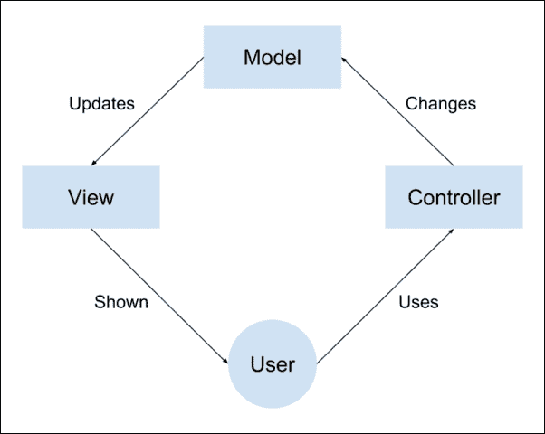
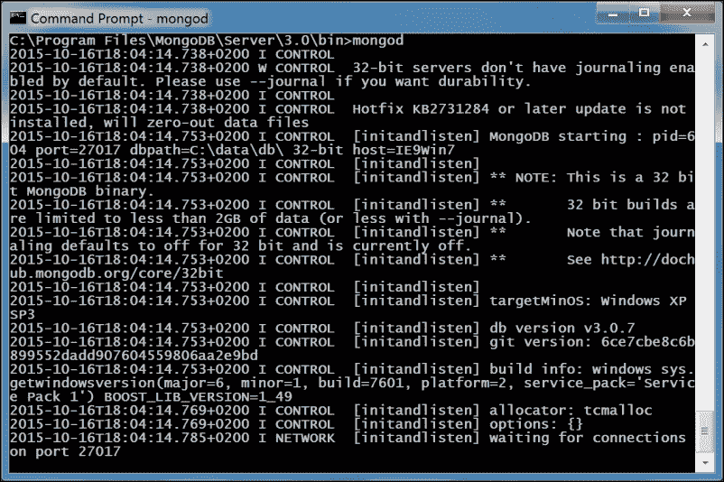
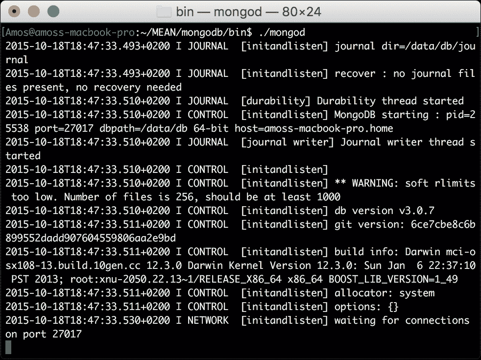
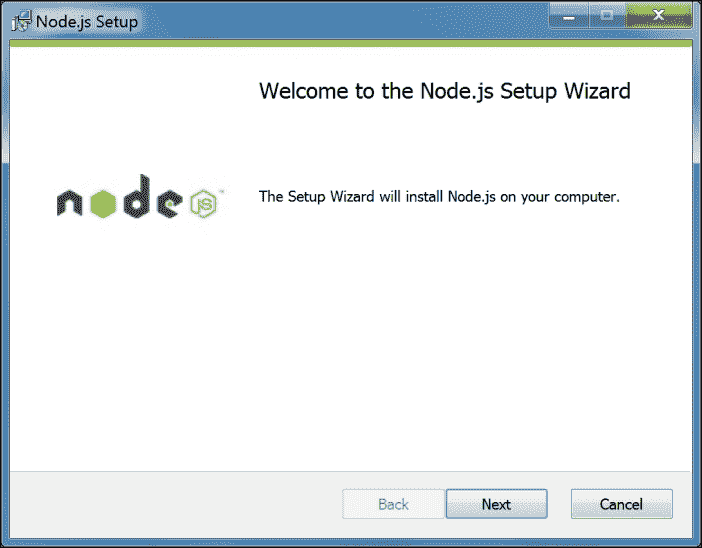
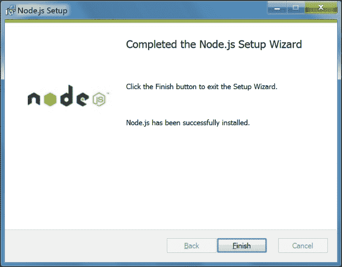
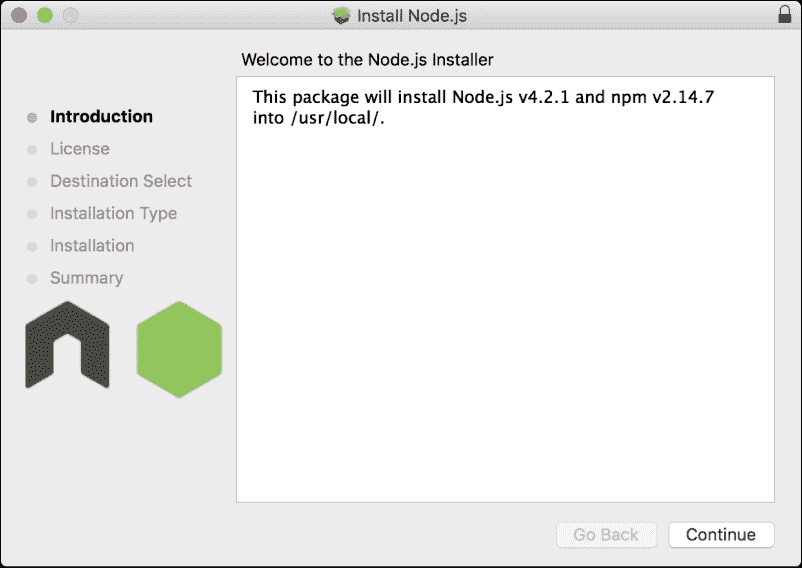
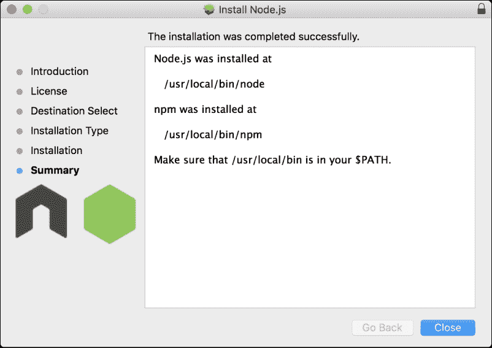
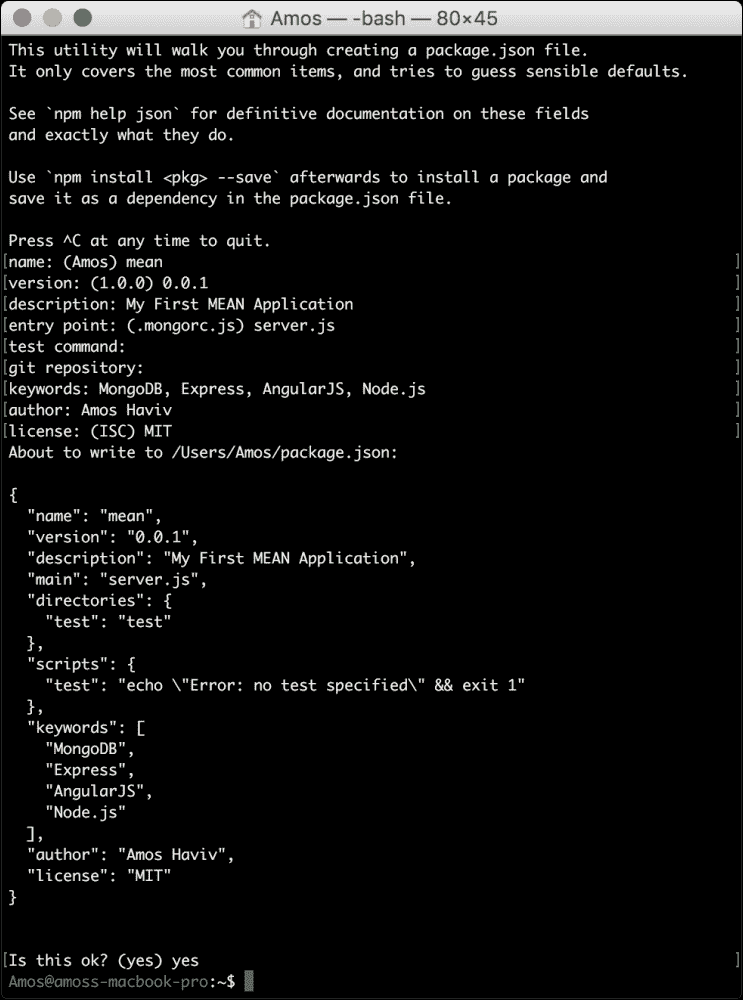

# 第一章：MEAN 简介

MEAN 堆栈是一个强大的全栈 JavaScript 解决方案，由四个主要构建模块组成：MongoDB 作为数据库，Express 作为 Web 服务器框架，Angular 作为 Web 客户端框架，Node.js 作为服务器平台。这些构建模块由不同的团队开发，并涉及一个庞大的开发人员和倡导者社区，推动每个组件的开发和文档化。该堆栈的主要优势在于将 JavaScript 作为主要编程语言。然而，连接这些工具的问题可能为扩展和架构问题奠定基础，这可能会严重影响您的开发过程。

在本书中，我将尝试介绍构建 MEAN 应用程序的最佳实践和已知问题，但在您开始实际的 MEAN 开发之前，您首先需要设置您的环境。本章将涵盖一些编程概述，但主要介绍安装 MEAN 应用程序的基本先决条件的正确方法。通过本章的学习，您将了解如何在所有常见操作系统上安装和配置 MongoDB 和 Node.js 以及如何使用 NPM。在本章中，我们将涵盖以下主题：

+   MEAN 堆栈架构简介

+   在 Windows、Linux 和 Mac OS X 上安装和运行 MongoDB

+   在 Windows、Linux 和 Mac OS X 上安装和运行 Node.js

+   npm 简介及如何使用它安装 Node 模块

# 三层 Web 应用程序开发

大多数 Web 应用程序都是建立在三层架构上的，包括三个重要的层：数据、逻辑和呈现。在 Web 应用程序中，应用程序结构通常分解为数据库、服务器和客户端，而在现代 Web 开发中，它也可以分解为数据库、服务器逻辑、客户端逻辑和客户端 UI。

实现这种模型的一种流行范式是**模型-视图-控制器**（**MVC**）架构模式。在 MVC 范式中，逻辑、数据和可视化被分为三种类型的对象，每个对象处理自己的任务。**视图**处理视觉部分，负责用户交互。**控制器**响应系统和用户事件，命令模型和视图适当地进行更改。**模型**处理数据操作，响应对信息的请求或根据控制器的指示改变其状态。MVC 架构的简单可视化表示如下图所示：



常见的 MVC 架构通信

在 Web 开发的 25 年中，许多技术堆栈变得流行，用于构建三层 Web 应用程序。在那些现在无处不在的堆栈中，你可以找到 LAMP 堆栈、.NET 堆栈和丰富多样的其他框架和工具。这些堆栈的主要问题是，每个层都需要一个知识库，通常超出了单个开发人员的能力范围，使团队比他们应该的更大，生产力更低，面临意外风险。

# JavaScript 的演变

JavaScript 是一种为 Web 开发而构建的解释性计算机编程语言。最初由 Netscape Navigator 网络浏览器实现，它成为 Web 浏览器用于执行客户端逻辑的编程语言。在 2000 年代中期，从网站向 Web 应用程序的转变，以及更快的浏览器的发布，逐渐形成了一个编写更复杂应用程序的 JavaScript 开发人员社区。这些开发人员开始创建缩短开发周期的库和工具，催生了一代更先进的 Web 应用程序。他们反过来创造了对更好浏览器的持续需求。这个循环持续了几年，供应商不断改进他们的浏览器，JavaScript 开发人员不断推动边界。

真正的革命始于 2008 年，当谷歌发布了其 Chrome 浏览器，以及其快速的 JIT 编译 V8 JavaScript 引擎。谷歌的 V8 引擎使 JavaScript 运行速度大大加快，完全改变了 Web 应用程序开发。更重要的是，引擎源代码的发布使开发人员开始重新构想浏览器之外的 JavaScript。这场革命的第一个产物之一就是 Node.js。

在研究了一段时间其他选项之后，程序员 Ryan Dahl 发现 V8 引擎非常适合他的非阻塞 I/O 实验，称为 Node.js。这个想法很简单：帮助开发人员构建非阻塞的代码单元，以更好地利用系统资源并创建更具响应性的应用程序。结果是一个简洁而强大的平台，利用了 JavaScript 在浏览器之外的非阻塞特性。Node 的优雅模块系统使开发人员可以自由地使用第三方模块来扩展平台，实现几乎任何功能。在线社区的反应是创建了各种工具，从现代 Web 框架到机器人服务器平台。然而，服务器端 JavaScript 只是一个开始。

当 Dwight Merriman 和 Eliot Horowitz 在 2007 年开始构建可扩展的托管解决方案时，他们已经在构建 Web 应用程序方面有了很多经验。然而，他们构建的平台并没有按计划成功，因此在 2009 年，他们决定拆开它，并开源其组件，包括一个名为 MongoDB 的基于 V8 的数据库。MongoDB 源自“巨大”的单词，是一个可扩展的 NoSQL 数据库，使用动态模式的类 JSON 数据模型。MongoDB 立即获得了很多关注，因为它为开发人员提供了处理复杂数据时所需的灵活性，同时提供了高级查询和易于扩展的 RDBMS 功能，这些功能最终使 MongoDB 成为领先的 NoSQL 解决方案之一。JavaScript 打破了另一个界限。然而，JavaScript 革命者并没有忘记一切的起源。事实上，现代浏览器的普及创造了 JavaScript 前端框架的新浪潮。

回到 2009 年，当 Miško Hevery 和 Adam Abrons 在构建他们的 JSON 作为平台服务时，他们注意到常见的 JavaScript 库并不够用。他们丰富的 Web 应用程序的性质引发了对更有结构的框架的需求，这将减少繁重的工作并保持有组织的代码库。他们放弃了最初的想法，决定专注于开发他们的前端框架，并开源了该项目，命名为 AngularJS。这个想法是为了弥合 JavaScript 和 HTML 之间的差距，并帮助推广单页应用程序的开发。

结果是一个丰富的 Web 框架，为前端 Web 开发人员提供了诸如双向数据绑定、跨组件依赖注入和基于 MVC 的组件等概念。Angular，以及其他现代框架，通过将曾经难以维护的前端代码库转变为可以支持更高级开发范式的结构化代码库，彻底改变了 Web 开发。

开源协作工具的兴起，以及这些才华横溢的工程师的投入，创造了世界上最丰富的社区之一。更重要的是，这些重大进步使得三层 Web 应用程序的开发能够在 JavaScript 的统一编程语言下进行——这个想法通常被称为全栈 JavaScript。MEAN 堆栈就是这个想法的一个例子。

# ECMAScript 2015 介绍

经过多年的工作，ES6 规范于 2015 年 6 月发布。它提出了自 ES5 以来 JavaScript 最大的进步，并在语言中引入了几个功能，将彻底改变我们 JavaScript 开发人员编写代码的方式。描述 ES2015 所做的所有改进是雄心勃勃的。相反，让我们试着通过我们将在下一章中使用的基本功能来工作。

## 模块

模块现在是一种受支持的语言级特性。它允许开发人员将其组件包装在模块模式中，并在其代码中导出和导入模块。实现与前几章描述的 CommonJS 模块实现非常相似，尽管 ES2015 模块还支持异步加载。处理 ES2015 模块的基本关键字是`export`和`import`。让我们看一个简单的例子。假设您有一个名为`lib.js`的文件，其中包含以下代码：

```js
export function halfOf(x) {
    return x / 2;
}
```

因此，在您的`main.js`文件中，您可以使用以下代码：

```js
import halfOf from 'lib';
console.log(halfOf(84));
```

然而，模块可能更有趣。例如，假设我们的`lib.js`文件看起来像这样：

```js
export function halfOf(x) {
    return x / 2;
}
export function multiply(x, y) {
    return x * y;
}
```

在您的主文件中，使用以下代码：

```js
import {halfOf, multiply} from 'lib';
console.log(halfOf(84));
console.log(multiply(21, 2));
```

ES2015 模块还支持默认的`export`值。因此，例如，假设您有一个名为`doSomething.js`的文件，其中包含以下代码：

```js
export default function () { 
    console.log('I did something')
};
```

您可以在`main.js`文件中如下使用它：

```js
import doSomething from 'doSomething';
doSomething();
```

重要的是要记住，默认导入应该使用模块名称标识其实体。

另一件重要的事情要记住的是，模块导出绑定而不是值。因此，例如，假设您有一个名为`validator.js`的文件，看起来像这样：

```js
export let flag = false;
export function touch() {
    flag = true;
}
```

您还有一个名为`main.js`的文件，看起来像这样：

```js
import { flag, touch } from 'validator';
console.log(flag); 
touch();
console.log(flag); 
```

第一个输出将是`false`，第二个将是`true`。现在我们对模块有了基本的了解，让我们转到类。

## 类

关于类与原型的长期辩论得出结论，即 ES2015 中的类基本上只是基于原型的继承的一种语法糖。类是易于使用的模式，支持实例和静态成员、构造函数和 super 调用。这里有一个例子：

```js
class Vehicle {
    constructor(wheels) {
        this.wheels = wheels;
    }
    toString() {
        return '(' + this.wheels + ')';
    }
}

class Car extends Vehicle {
    constructor(color) {
        super(4);
        this.color = color;
    }
    toString() {
        return super.toString() + ' colored:  ' + this.color;
    }
}

let car = new Car('blue');
car.toString(); 

console.log(car instanceof Car); 
console.log(car instanceof Vehicle); 
```

在这个例子中，`Car`类扩展了`Vehicle`类。因此，输出如下：

```js
 (4) in blue
true
true
```

## 箭头函数

箭头函数是`=>`语法的函数简写。对于熟悉其他语言如 C#和 Java 8 的人来说，它们可能看起来很熟悉。然而，箭头函数也非常有帮助，因为它们与其作用域共享相同的词法`this`。它们主要以两种形式使用。一种是使用表达式体：

```js
const squares = numbers.map(n => n * n); 
```

另一种形式是使用语句体：

```js
numbers.forEach(n => {
  if (n % 2 === 0) evens.push(n);
});
```

使用共享词法的一个例子是：

```js
const author = {
  fullName: "Bob Alice",
  books: [],
  printBooks() {
     this.books.forEach(book => console.log(book + ' by ' + this.fullName));
  }
};
```

如果作为常规函数使用，`this`将是`book`对象，而不是`author`。

## Let 和 Const

`Let`和`Const`是用于符号声明的新关键字。`Let`几乎与`var`关键字相同，因此它的行为与全局和函数变量相同。但是，在块内部，`let`的行为不同。例如，看下面的代码：

```js
function iterateVar() {
  for(var i = 0; i < 10; i++) {
    console.log(i);
  }

  console.log(i)
}

function iterateLet() {
  for(let i = 0; i < 10; i++) {
    console.log(i);
  }

  console.log(i)
}
```

第一个函数将在循环后打印`i`，但第二个函数将抛出错误，因为`i`是由`let`定义的。

`const`关键字强制单一赋值。因此，这段代码也会抛出错误：

```js
const me = 1
me = 2
```

## 默认、Rest 和 Spread

默认、Rest 和 Spread 是与函数参数相关的三个新功能。默认功能允许您为函数参数设置默认值：

```js
function add(x, y = 0) {
    return x + y;
}
add(1) 
add(1,2)
```

在这个例子中，如果没有传递值或设置为`undefined`，`y`的值将设置为`0`。

Rest 功能允许您将数组作为尾随参数传递，如下所示：

```js
function userFriends(user, ...friends) {
  console.log(user + ' has ' + friends.length + ' friends');
}
userFriends('User', 'Bob', 'Alice');
```

Spread 功能将数组转换为调用参数：

```js
function userTopFriends(firstFriend, secondFriend, thirdFriends) {
  console.log(firstFriend);
  console.log(secondFriend);
  console.log(thirdFriends);
}

userTopFriends(...['Alice', 'Bob', 'Michelle']);
```

## 总结

进入现代 Web 开发，ES2015 将成为您日常编程会话的一个可行部分。这里显示的只是冰山一角，强烈建议您继续深入研究。但是，对于本书的目的，这就足够了。

# 介绍 MEAN

MEAN 是 MongoDB、Express、Angular 和 Node.js 的缩写。其背后的概念是只使用 JavaScript 驱动的解决方案来覆盖应用程序的不同部分。其优势很大，如下所示：

+   整个应用程序只使用一种语言

+   应用程序的所有部分都可以支持并经常强制使用 MVC 架构

+   不再需要数据结构的序列化和反序列化，因为数据编组是使用 JSON 对象完成的

然而，仍有一些重要的问题尚未解答：

+   如何将所有组件连接在一起？

+   Node.js 有一个庞大的模块生态系统，那么你应该使用哪些模块？

+   JavaScript 是范式不可知的，那么你如何维护 MVC 应用程序结构？

+   JSON 是一种无模式的数据结构，那么你应该如何以及何时对你的数据进行建模？

+   如何处理用户认证？

+   如何使用 Node.js 的非阻塞架构来支持实时交互？

+   如何测试你的 MEAN 应用程序代码库？

+   考虑到 DevOps 和 CI 的兴起，你可以使用哪些 JavaScript 开发工具来加快 MEAN 应用程序的开发过程？

在本书中，我将尝试回答这些问题和更多。但是，在我们继续之前，你首先需要安装基本的先决条件。

# 安装 MongoDB

对于 MongoDB 的稳定版本，官方 MongoDB 网站提供了链接的二进制文件，为 Linux、Mac OS X 和 Windows 提供了安装 MongoDB 的最简单方式。请注意，你需要根据你的操作系统下载正确的架构版本。如果你使用 Windows 或 Linux，请确保根据你的系统架构下载 32 位或 64 位版本。Mac 用户可以安全地下载 64 位版本。

### 注意

MongoDB 的版本方案是这样工作的，只有偶数版本号标记稳定版本。因此，版本 3.0.x 和 3.2x 是稳定的，而 2.9.x 和 3.1.x 是不稳定的版本，不应该在生产中使用。MongoDB 的最新稳定版本是 3.2.x。

当你访问[`mongodb.org/downloads`](http://mongodb.org/downloads)下载页面时，你将得到一个包含安装 MongoDB 所需二进制文件的存档文件的下载。下载并提取存档文件后，你需要找到`mongod`二进制文件，通常位于`bin`文件夹中。`mongod`进程运行主 MongoDB 服务器进程，可以用作独立服务器或 MongoDB 副本集的单个节点。在我们的情况下，我们将使用 MongoDB 作为独立服务器。`mongod`进程需要一个文件夹来存储数据库文件（默认文件夹是`/data/db`）和一个要监听的端口（默认端口是`27017`）。在接下来的小节中，我们将介绍每个操作系统的设置步骤。我们将从常见的 Windows 安装过程开始。

### 注意

建议你通过访问官方文档[`mongodb.org`](https://mongodb.org)来更多了解 MongoDB。

## 在 Windows 上安装 MongoDB

下载正确的版本后，运行`.msi`文件。MongoDB 应该安装在`C:\Program Files\MongoDB\`文件夹中。在运行时，MongoDB 使用默认文件夹来存储其数据文件。在 Windows 上，默认文件夹位置是`C:\data\db`。因此，在命令提示符中，转到`C:\`并输入以下命令：

```js
> md c:\data\db

```

### 提示

你可以告诉 mongod 服务使用`--dbpath`命令行标志来使用替代路径的数据文件。

创建完数据文件夹后，在运行主 MongoDB 服务时会得到两个选项。

### 手动运行 MongoDB

要手动运行 MongoDB，你需要运行`mongod`二进制文件。因此，打开命令提示符并导航到`C:\Program Files\MongoDB\Server\3.2\bin`文件夹。然后，输入以下命令：

```js
C:\Program Files\MongoDB\Server\3.2\bin> mongod

```

上述命令将运行主 MongoDB 服务，该服务将开始监听默认的`27017`端口。如果一切顺利，您应该看到类似以下截图的控制台输出：



在 Windows 上运行 MongoDB 服务器

根据 Windows 安全级别，可能会发出安全警报对话框，通知您有关某些服务功能的阻止。如果发生这种情况，请选择私人网络，然后单击**允许访问**。

### 注意

您应该知道，MongoDB 服务是自包含的，因此您也可以选择从任何文件夹运行它。

### 将 MongoDB 作为 Windows 服务运行

更流行的方法是在每次重启后自动运行 MongoDB。在将 MongoDB 设置为 Windows 服务之前，最好指定 MongoDB 日志和配置文件的路径。首先在命令提示符中运行以下命令创建这些文件的文件夹：

```js
> md C:\data\log

```

然后，您需要在`C:\Program Files\MongoDB\Server\3.2\mongod.cfg`创建一个包含以下内容的配置文件：

```js
systemLog:
    destination: file
    path: c:\data\log\mongod.log
storage:
    dbPath: c:\data\db
```

当您的配置文件就位时，请通过右键单击命令提示符图标并单击**以管理员身份运行**来打开具有管理员权限的新命令提示符窗口。请注意，如果已经运行较旧版本的 MongoDB 服务，您首先需要使用以下命令将其删除：

```js
> sc stop MongoDB
> sc delete MongoDB

```

然后，通过运行以下命令安装 MongoDB 服务：

```js
> "C:\Program Files\MongoDB\Server\3.2\bin\mongod.exe" --config "C:\Program Files\MongoDB\Server\3.2\mongod.cfg" --install

```

请注意，只有在正确设置配置文件时，安装过程才会成功。安装 MongoDB 服务后，您可以通过在管理命令提示符窗口中执行以下命令来运行它：

```js
> net start MongoDB

```

请注意，MongoDB 配置文件可以修改以适应您的需求。您可以通过访问[`docs.mongodb.org/manual/reference/configuration-options/`](http://docs.mongodb.org/manual/reference/configuration-options/)了解更多信息。

## 在 Mac OS X 和 Linux 上安装 MongoDB

在本节中，您将学习在基于 Unix 的操作系统上安装 MongoDB 的不同方法。让我们从最简单的安装 MongoDB 的方式开始，这涉及下载 MongoDB 的预编译二进制文件。

## 从二进制文件安装 MongoDB

您可以通过访问[`www.mongodb.org/downloads`](http://www.mongodb.org/downloads)的下载页面下载正确版本的 MongoDB。或者，您可以通过执行以下命令使用 CURL 来执行此操作：

```js
$ curl -O http://downloads.mongodb.org/osx/mongodb-osx-x86_64-3.2.10.tgz

```

请注意，我们已经下载了 Mac OS X 64 位版本，因此请确保修改命令以适合您的机器版本。下载过程结束后，请通过在命令行工具中发出以下命令解压文件：

```js
$ tar -zxvf mongodb-osx-x86_64-3.2.10.tgz

```

现在，通过运行以下命令将提取的文件夹更改为更简单的文件夹名称：

```js
$ mv mongodb-osx-x86_64-3.2.10 mongodb

```

MongoDB 使用默认文件夹来存储其文件。在 Linux 和 Mac OS X 上，默认位置是`/data/db`，所以在命令行工具中运行以下命令：

```js
$ mkdir -p /data/db

```

### 提示

您可能会在创建此文件夹时遇到一些问题。这通常是权限问题，因此在运行上述命令时，请使用`sudo`或超级用户。

上述命令将创建`data`和`db`文件夹，因为`-p`标志也会创建父文件夹。请注意，默认文件夹位于您的主文件夹外部，因此请确保通过运行以下命令设置文件夹权限：

```js
$ chown -R $USER /data/db

```

现在您已经准备好了，使用命令行工具并转到`bin`文件夹以运行`mongod`服务，如下所示：

```js
$ cd mongodb/bin
$ mongod

```

这将运行主 MongoDB 服务，它将开始监听默认的`27017`端口。如果一切顺利，您应该看到类似以下截图的控制台输出：



在 Mac OS X 上运行 MongoDB 服务器

### 使用软件包管理器安装 MongoDB

有时，安装 MongoDB 的最简单方法是使用软件包管理器。缺点是一些软件包管理器在支持最新版本方面落后。幸运的是，MongoDB 团队还维护了 RedHat、Debian 和 Ubuntu 的官方软件包，以及 Mac OS X 的 Homebrew 软件包。请注意，您需要配置软件包管理器存储库以包括 MongoDB 服务器以下载官方软件包。

要在 Red Hat Enterprise、CentOS 或 Fedora 上使用 Yum 安装 MongoDB，请按照[`docs.mongodb.org/manual/tutorial/install-mongodb-on-red-hat-centos-or-fedora-linux/`](http://docs.mongodb.org/manual/tutorial/install-mongodb-on-red-hat-centos-or-fedora-linux/)上的说明进行操作。

要在 Ubuntu 上使用 APT 安装 MongoDB，请按照[`docs.mongodb.org/manual/tutorial/install-mongodb-on-ubuntu/`](http://docs.mongodb.org/manual/tutorial/install-mongodb-on-ubuntu/)上的说明进行操作。

要在 Debian 上使用 APT 安装 MongoDB，请按照[`docs.mongodb.org/manual/tutorial/install-mongodb-on-debian/`](http://docs.mongodb.org/manual/tutorial/install-mongodb-on-debian/)上的说明进行操作。

在 Mac OS X 上使用 Homebrew 安装 MongoDB，请按照[`docs.mongodb.org/manual/tutorial/install-mongodb-on-os-x/`](http://docs.mongodb.org/manual/tutorial/install-mongodb-on-os-x/)上的说明进行操作。

## 使用 MongoDB shell

MongoDB 存档文件包括 MongoDB shell，它允许您使用命令行与服务器实例进行交互。要启动 shell，请转到 MongoDB `bin`文件夹，并运行以下`mongo`服务：

```js
$ cd mongodb/bin
$ mongo

```

如果成功安装了 MongoDB，shell 将自动连接到您的本地实例，使用测试数据库。您应该看到类似以下屏幕截图的控制台输出：

使用 MongoDB shell

在 Mac OS X 上运行 MongoDB shell

要测试您的数据库，请运行以下命令：

```js
> db.articles.insert({title: "Hello World"})

```

上述命令将创建一个新的文章集合，并插入一个包含`title`属性的 JSON 对象。要检索文章对象，请执行以下命令：

```js
> db.articles.find()

```

控制台将输出类似以下消息的文本：

```js
{ _id: ObjectId("52d02240e4b01d67d71ad577"), title: "Hello World" }

```

恭喜！这意味着您的 MongoDB 实例正常工作，并且您已成功使用 MongoDB shell 与其进行交互。在接下来的章节中，您将了解更多关于 MongoDB 以及如何使用 MongoDB shell 的知识。

# 安装 Node.js

对于稳定版本，官方 Node.js 网站提供了链接的二进制文件，为 Linux、Mac OS X 和 Windows 提供了安装 Node.js 的最简单方法。请注意，您需要为您的操作系统下载正确的架构版本。如果您使用 Windows 或 Linux，请确保根据您的系统架构下载 32 位或 64 位版本。Mac 用户可以安全地下载 64 位版本。

### 注意

在 Node.js 和 io.js 项目合并后，版本方案直接从 0.12.x 继续到 4.x。团队现在使用**长期支持**（**LTS**）政策。您可以在[`en.wikipedia.org/wiki/Long-term_support`](https://en.wikipedia.org/wiki/Long-term_support)上了解更多信息。Node.js 的最新稳定版本是 6.x。

## 在 Windows 上安装 Node.js

在 Windows 机器上安装 Node.js 是一项简单的任务，可以使用独立安装程序轻松完成。首先，转到[`nodejs.org/en/download/`](https://nodejs.org/en/download/)并下载正确的`.msi`文件。请注意有 32 位和 64 位版本，因此请确保为您的系统下载正确的版本。

下载安装程序后，运行它。如果出现任何安全对话框，只需单击**运行**按钮，安装向导应该会启动。您将看到类似以下屏幕截图的安装屏幕：



Node.js Windows 安装向导

一旦点击**下一步**按钮，安装将开始。几分钟后，您将看到一个类似以下截图的确认屏幕，告诉您 Node.js 已成功安装：



Node.js 在 Windows 上的安装确认

## 在 Mac OS X 上安装 Node.js

在 Mac OS X 上安装 Node.js 是一个简单的任务，可以使用独立安装程序轻松完成。首先转到[`nodejs.org/en/download/`](https://nodejs.org/en/download/)页面并下载`.pkg`文件。下载安装程序后，运行它，您将看到一个类似以下截图的安装屏幕：



Node.js 在 Mac OS X 上的安装向导

点击**继续**，安装过程应该开始。安装程序将要求您确认许可协议，然后要求您选择文件夹目标。在再次点击**继续**按钮之前，选择最适合您的选项。然后安装程序将要求您确认安装信息，并要求您输入用户密码。几分钟后，您将看到一个类似于以下截图的确认屏幕，告诉您 Node.js 已成功安装：



Node.js 在 Mac OS X 上的安装确认

## 在 Linux 上安装 Node.js

要在 Linux 机器上安装 Node.js，您需要使用官方网站上的 tarball 文件。最好的方法是下载最新版本，然后使用`make`命令构建和安装源代码。首先转到[`nodejs.org/en/download/`](http://nodejs.org/en/download/)页面，下载适合的`.tar.gz`文件。然后，通过以下命令扩展文件并安装 Node.js：

```js
$ tar -zxf node-v6.9.1.tar.gz
$ cd node-v6.9.1
$ ./configure && make && sudo make install

```

如果一切顺利，这些命令将在您的机器上安装 Node.js。请注意，这些命令适用于 Node.js 6.9.1 版本，所以请记得用您下载的版本替换版本号。

### 注意

建议您通过访问官方文档[`nodejs.org`](https://nodejs.org)来了解更多关于 Node.js 的信息。

## 运行 Node.js

安装成功后，您将能够使用提供的命令行界面（CLI）开始尝试使用 Node.js。转到命令行工具并执行以下命令：

```js
$ node

```

这将启动 Node.js CLI，它将等待 JavaScript 输入。要测试安装，请运行以下命令：

```js
> console.log('Node is up and running!');

```

输出应该类似于以下内容：

```js
Node is up and running!
undefined

```

这很好，但您还应该尝试执行一个 JavaScript 文件。首先创建一个名为`application.js`的文件，其中包含以下代码：

```js
console.log('Node is up and running!');

```

要运行它，您需要通过以下命令将文件名作为第一个参数传递给 Node CLI：

```js
$ node application.js
Node is up and running!

```

恭喜！您刚刚创建了您的第一个 Node.js 应用程序。要停止 CLI，请按*CTRL* + *D*或*CTRL* + *C*。

# 介绍 npm

Node.js 是一个平台，这意味着它的功能和 API 被保持在最低限度。为了实现更复杂的功能，它使用了一个模块系统，允许您扩展平台。安装、更新和删除 Node.js 模块的最佳方式是使用 npm。npm 主要用途包括：

+   用于浏览、下载和安装第三方模块的包注册表

+   用于管理本地和全局包的 CLI 工具

方便的是，npm 是在 Node.js 安装过程中安装的，所以让我们快速开始学习如何使用它。

## 使用 npm

为了了解 npm 的工作原理，我们将安装 Express web 框架模块，这将在接下来的章节中使用。npm 是一个强大的包管理器，它为公共模块保持了一个集中的注册表。要浏览可用的公共包，请访问官方网站[`www.npmjs.com/`](https://www.npmjs.com)。

注册表中的大多数包都是开源的，由 Node.js 社区开发者贡献。在开发开源模块时，包的作者可以决定将其发布到中央注册表，允许其他开发者下载并在他们的项目中使用它。在包配置文件中，作者将选择一个名称，以后将用作下载该包的唯一标识符。

### 注意

建议你通过访问官方文档[`docs.npmjs.com`](https://docs.npmjs.com)来学习更多关于 Node.js 的知识。

### npm 的安装过程

重要的是要记住，npm 有两种安装模式：本地和全局。默认的本地模式经常被使用，并且会将第三方包安装在本地的`node_modules`文件夹中，放在应用程序文件夹内。它不会对系统产生影响，并且用于安装应用程序需要的包，而不会用不必要的全局文件污染系统。

全局模式用于安装你想要 Node.js 全局使用的包。通常，这些是 CLI 工具，比如 Grunt，在接下来的章节中你会学到。大多数情况下，包的作者会明确指示你全局安装包。因此，当有疑问时，请使用本地模式。全局模式通常会将包安装在 Unix 系统的`/usr/local/lib/node_modules`文件夹中，以及 Windows 系统的`C:\Users\%USERNAME%\AppData\Roaming\npm\node_modules`文件夹中，使其对系统上运行的任何 Node.js 应用程序可用。

#### 使用 npm 安装一个包

一旦找到合适的包，你就可以使用`npm install`命令进行安装，如下所示：

```js
$ npm install <Package Unique Name>

```

全局安装模块与本地安装模块类似，但你需要添加`-g`标志，如下所示：

```js
$ npm install –g <Package Unique Name>

```

### 注意

你可能会发现你的用户没有权限全局安装包，所以你需要使用 root 用户或使用 sudo 进行安装。

例如，要在本地安装 Express，你需要导航到你的应用程序文件夹，并发出以下命令：

```js
$ npm install express

```

上述命令将在本地的`node_modules`文件夹中安装 Express 包的最新稳定版本。此外，npm 支持广泛的语义版本。因此，要安装一个特定版本的包，你可以使用`npm install`命令，如下所示：

```js
$ npm install <Package Unique Name>@<Package Version>

```

例如，要安装 Express 包的第二个主要版本，你需要发出以下命令：

```js
$ npm install express@2.x 

```

这将安装 Express 2 的最新稳定版本。请注意，这种语法使 npm 能够下载并安装 Express 2 的任何次要版本。要了解更多关于支持的语义版本语法，请访问[`github.com/npm/node-semver`](https://github.com/npm/node-semver)。

当一个包有依赖关系时，npm 会自动解析这些依赖关系，在`package`文件夹内的`node_modules`文件夹中安装所需的包。在前面的例子中，Express 的依赖关系将安装在`node_modules/express/node_modules`下。

#### 使用 npm 移除一个包

要移除一个已安装的包，你需要导航到你的应用程序文件夹，并运行以下命令：

```js
$ npm uninstall < Package Unique Name>

```

npm 然后会寻找这个包，并尝试从本地的`node_modules`文件夹中移除它。要移除一个全局包，你需要使用`-g`标志，如下所示：

```js
$ npm uninstall –g < Package Unique Name>

```

#### 使用 npm 更新一个包

要将一个包更新到最新版本，发出以下命令：

```js
$ npm update < Package Unique Name>

```

npm 会下载并安装这个包的最新版本，即使它还不存在。要更新一个全局包，使用以下命令：

```js
$ npm update –g < Package Unique Name>

```

### 使用 package.json 文件管理依赖关系

安装单个包很好，但很快，您的应用程序将需要使用多个包。因此，您需要一种更好的方法来管理这些依赖关系。为此，npm 允许您在应用程序的根文件夹中使用名为`package.json`的配置文件。在`package.json`文件中，您将能够定义应用程序的各种元数据属性，包括应用程序的名称、版本和作者等属性。这也是您定义应用程序依赖关系的地方。

`package.json`文件基本上是一个 JSON 文件，其中包含了描述应用程序属性所需的不同属性。使用最新的 Express 和 Grunt 包的应用程序将具有以下`package.json`文件：

```js
{
  "name" : "MEAN",
  "version" : "0.0.1",
  "dependencies" : {
    "express" : "latest",
    "grunt" : "latest"
  }
}
```

### 注意

您的应用程序名称和版本属性是必需的，因此删除这些属性将阻止 npm 正常工作。

#### 创建 package.json 文件

虽然您可以手动创建`package.json`文件，但更简单的方法是使用`npm init`命令。要这样做，使用命令行工具并发出以下命令：

```js
$ npm init

```

npm 会询问您关于您的应用程序的一些问题，并将自动为您创建一个新的`package.json`文件。示例过程应该类似于以下截图：



在 Mac OS X 上使用`npm init`

创建`package.json`文件后，您需要修改它并添加一个`dependencies`属性。您的最终`package.json`文件应该如下代码片段所示：

```js
{
  "name": "mean",
  "version": "0.0.1",
  "description": "My First MEAN Application",
  "main": "server.js",
  "directories": {
    "test": "test"
  },
  "scripts": {
    "test": "echo \"Error: no test specified\" && exit 1"
  },
  "keywords": [
    "MongoDB",
    "Express",
    "Angular",
    "Node.js"
  ],
  "author": "Amos Haviv",
  "license": "MIT",
  "dependencies": {
    "express": "latest",
    "grunt": "latest"
  }
}
```

### 注意

在上述代码示例中，我们使用了`latest`关键字告诉 npm 安装这些包的最新版本。然而，强烈建议您使用特定的版本号或范围，以防止您的应用程序依赖关系在开发周期中发生变化。这是因为新的包版本可能与旧版本不兼容，这将导致应用程序出现重大问题。

#### 安装 package.json 的依赖项

创建`package.json`文件后，您可以通过转到应用程序的根文件夹并使用`npm install`命令来安装应用程序的依赖项，如下所示：

```js
$ npm install

```

npm 将自动检测您的`package.json`文件并安装所有应用程序的依赖项，将它们放在本地的`node_modules`文件夹下。安装依赖项的另一种方法，有时更好的方法是使用以下`npm update`命令：

```js
$ npm update

```

这将安装任何缺少的包，并将更新所有现有依赖项到它们指定的版本。

#### 更新 package.json 文件

`npm install`命令的另一个强大功能是能够安装新包并将包信息保存为`package.json`文件中的依赖项。在安装特定包时，可以使用`--save`可选标志来实现这一点。例如，要安装最新版本的 Express 并将其保存为依赖项，只需使用以下命令：

```js
$ npm install express --save

```

npm 将安装 Express 的最新版本，并将 Express 包添加为`package.json`文件的依赖项。为了清晰起见，在接下来的章节中，我们更喜欢手动编辑`package.json`文件。然而，这个有用的功能在您的日常开发周期中可能非常方便。

### 注意

建议您通过访问官方文档[`docs.npmjs.com/files/package.json`](https://docs.npmjs.com/files/package.json)了解更多关于 npm 庞大的配置选项。

# 摘要

在本章中，您学习了如何安装 MongoDB 以及如何使用 MongoDB shell 连接到本地数据库实例。您还学习了如何安装 Node.js 并使用 Node.js CLI。您了解了 npm 并发现了如何使用它来下载和安装 Node.js 包。您还学习了如何使用`package.json`文件轻松管理应用程序的依赖关系。

在下一章中，我们将讨论一些 Node.js 基础知识，您将构建您的第一个 Node.js Web 应用程序。
