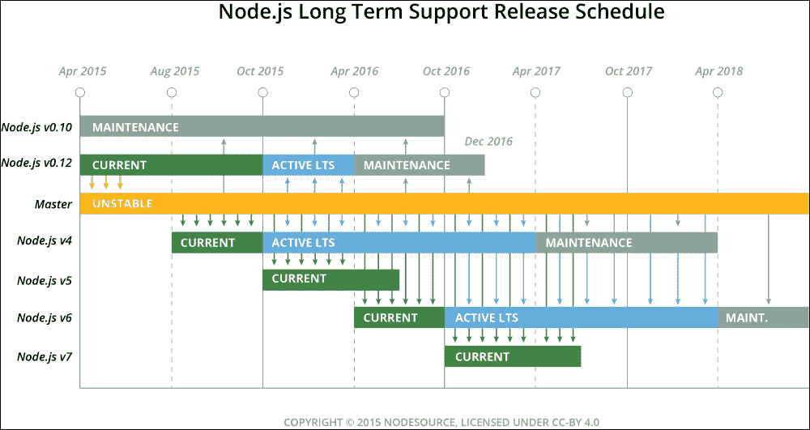
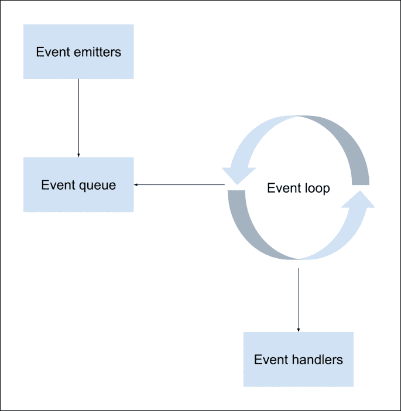
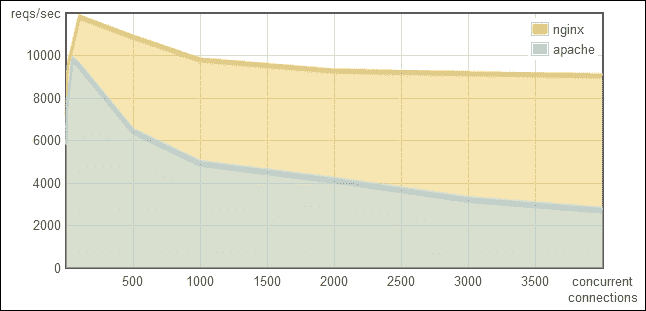
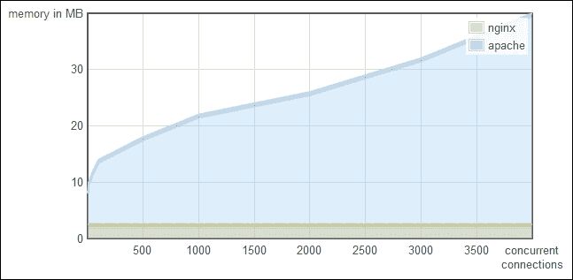
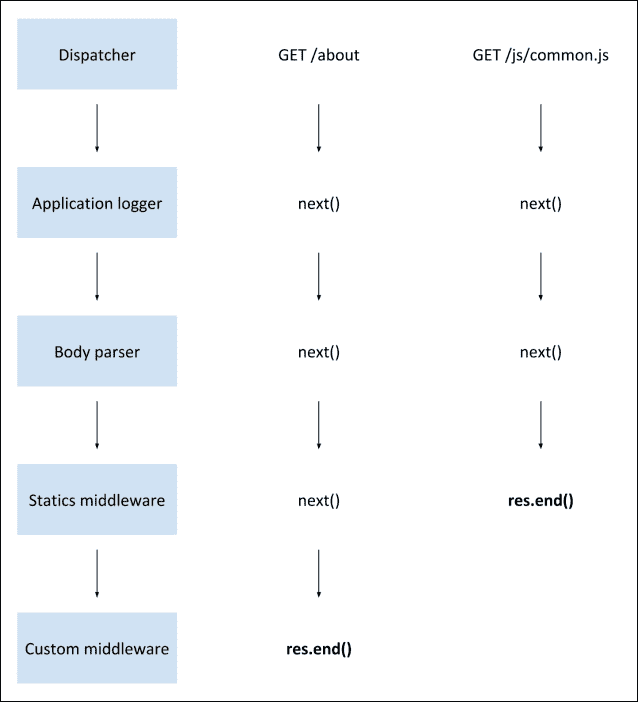
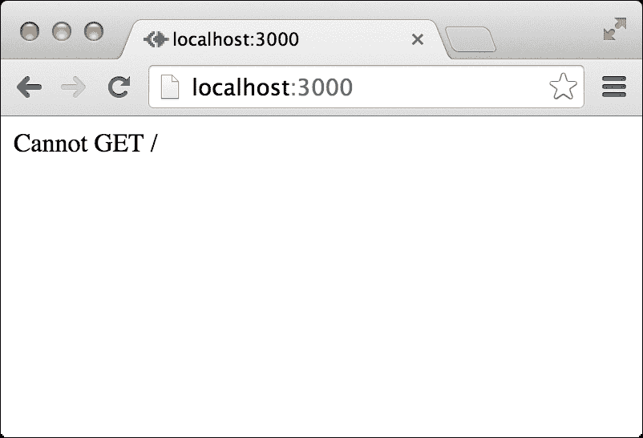
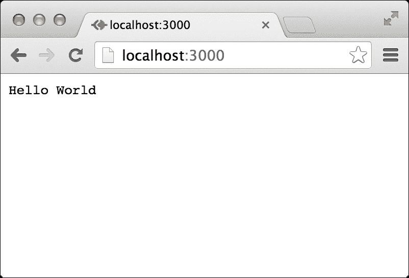

# 第二章：开始使用 Node.js

在上一章中，您设置了您的环境并发现了 Node.js 的基本开发原则。本章将介绍构建您的第一个 Node.js Web 应用程序的正确方法。您将学习 JavaScript 事件驱动的基础知识以及如何利用它来构建 Node.js 应用程序。您还将了解 Node.js 模块系统以及如何构建您的第一个 Node.js Web 应用程序。然后，您将继续学习 Connect 模块，并了解其强大的中间件方法。在本章结束时，您将知道如何使用 Connect 和 Node.js 构建简单而强大的 Web 应用程序。在本章中，我们将涵盖以下主题：

+   Node.js 介绍

+   JavaScript 闭包和事件驱动编程

+   Node.js 事件驱动的 Web 开发

+   CommonJS 模块和 Node.js 模块系统

+   Connect Web 框架介绍

+   Connect 的中间件模式

# Node.js 介绍

在 2009 年的 JSConf EU 上，一位名叫 Ryan Dahl 的开发人员上台介绍了他的项目 Node.js。从 2008 年开始，Dahl 研究了当前的 Web 趋势，并发现了 Web 应用程序工作方式的一些奇怪之处。几年前引入的**异步 JavaScript 和 XML**（**AJAX**）技术将静态网站转变为动态 Web 应用程序，但 Web 开发的基本构建块并没有遵循这一趋势。

问题在于 Web 技术不支持浏览器和服务器之间的双向通信。他使用的测试案例是 Flickr 上传文件功能，浏览器无法知道何时更新进度条，因为服务器无法告知它已上传文件的多少。

Dahl 的想法是构建一个 Web 平台，能够从服务器优雅地支持向浏览器推送数据，但这并不简单。当扩展到常见的 Web 使用时，该平台必须支持服务器和浏览器之间数百（有时甚至数千）个正在进行的连接。大多数 Web 平台使用昂贵的线程来处理请求，这意味着要保持相当数量的空闲线程以保持连接活动。因此，Dahl 采用了不同的方法。他意识到使用非阻塞套接字可以在系统资源方面节省很多，并且证明了这可以通过 C 来实现。鉴于这种技术可以在任何编程语言中实现，以及 Dahl 认为使用非阻塞 C 代码是一项繁琐的任务，他决定寻找一种更好的编程语言。

当谷歌在 2008 年底宣布推出 Chrome 及其新的 V8 JavaScript 引擎时，很明显 JavaScript 可以比以前运行得更快 - 快得多。 V8 引擎相对于其他 JavaScript 引擎的最大优势是在执行之前将 JavaScript 代码编译为本机机器代码。这和其他优化使 JavaScript 成为一种能够执行复杂任务的可行编程语言。 Dahl 注意到了这一点，并决定尝试一个新的想法：在 JavaScript 中使用非阻塞套接字。他拿了 V8 引擎，用已经稳固的 C 代码包装起来，创建了 Node.js 的第一个版本。

在社区的热烈反响之后，他继续扩展了 Node 核心。 V8 引擎并不是为了在服务器环境中运行而构建的，因此 Node.js 必须以一种在服务器上更有意义的方式来扩展它。例如，浏览器通常不需要访问文件系统，但在运行服务器代码时，这变得至关重要。结果是 Node.js 不仅仅是一个 JavaScript 执行引擎，而是一个能够运行简单编码、高效且易于扩展的复杂 JavaScript 应用程序的平台。

## io.js 和 Node.js 基金会

到 2014 年底，Joyent 公司，拥有 Node.js 资产的公司，与项目的一些核心贡献者之间产生了冲突。这些开发人员认为项目的治理不足，因此他们要求 Joyent 创建一个非营利基金会来管理该项目。2015 年 1 月，该团队决定分叉 Node.js 项目，并将其称为 io.js。新项目旨在实现更快和更可预测的发布周期，并开始获得一些关注。

几个月后，io.js 团队得到公司和社区开发者的支持，受邀到 Joyent 的办公室讨论项目的未来。他们一起决定创建一个由技术指导委员会领导的 Node 基金会，将项目合并为 Node.js 品牌，并基于 io.js 存储库。这导致了 Node 发布周期的大幅升级和项目治理的更加透明。

## Node.js ES6 支持

尽管 Node.js 在旧版本中已经实现了部分 ES6 支持，但最新版本在实现 ES6 功能方面取得了更好的进展。出于稳定性原因，Node V8 引擎将 ES6 功能分为三个分类：

+   **Shipping**：所有被认为是稳定的功能并且默认开启。这意味着它们*不*需要任何运行时标志来激活。

+   **Staged**：几乎稳定但不建议在生产中使用的所有功能。这些功能可以使用`--es_staging`运行时标志或其更为常见的同义词`--harmony`标志来激活。

+   **In progress**：所有仍在进行中且不稳定的功能。这些功能可以使用它们各自的`--harmony`标志来激活。

尽管这超出了本书的范围，但建议您访问官方文档[`nodejs.org/en/docs/es6/`](https://nodejs.org/en/docs/es6/)，了解更多关于 Node.js 中 ES6 实现的信息。

## Node.js LTS 支持

随着 Node.js 社区的不断壮大，越来越多的公司和大型组织加入进来，导致对稳定性和可预测版本发布的需求不断增加。为了满足这些新需求，Node.js 基金会决定了一个新的发布周期。基本上，团队每年 10 月发布一个新的稳定版本。这个版本总是有一个偶数版本号，比如 v4 或 v6。这些稳定版本受 LTS 计划支持。它包括安全和稳定更新，并且一旦它们在 10 月进入 LTS 计划，就可以在生产中使用。每年 4 月，一个稳定版本从 LTS 计划中发布。这意味着总是有两个重叠的稳定版本，最长为 6 个月，每个稳定版本都有 18 个月的支持。奇数版本被认为不稳定，主要用于向社区展示路线图的实现。这些版本在 10 月份被切割，以便及时合并到新的稳定版本中。

以下是未来几年发布周期的简单路线图：



## JavaScript 事件驱动编程

Node.js 利用 JavaScript 的事件驱动特性来支持平台中的非阻塞操作，这一特性使其具有出色的效率。JavaScript 是一种事件驱动的语言，这意味着您可以将代码注册到特定的事件上，一旦事件被触发，这些代码就会被执行。这个概念允许您无缝地执行异步代码，而不会阻止程序的其余部分运行。

为了更好地理解这一点，看一下以下的 Java 代码示例：

```js
System.out.print("What is your name?"); 
String name = System.console().readLine();
System.out.print("Your name is: " + name); 
```

在这个例子中，程序执行第一行和第二行，但在第二行之后的任何代码都不会被执行，直到用户输入他们的名字。这是同步编程，其中 I/O 操作阻止程序的其余部分运行。然而，这不是 JavaScript 的工作方式。

最初设计用于支持浏览器操作，JavaScript 围绕浏览器事件进行了设计。尽管它自早期以来已经大大发展，但其设计理念是允许浏览器接收 HTML 用户事件并将其委托给 JavaScript 代码。让我们看下面的 HTML 示例：

```js
<span>What is your name?</span>
<input type="text" id="nameInput">
<input type="button" id="showNameButton" value="Show Name">
<script type="text/javascript">
const showNameButton = document.getElementById('showNameButton');

showNameButton.addEventListener('click', (event) => {
    alert(document.getElementById('nameInput').value);
});

// Rest of your code...
</script>
```

在上面的例子中，我们有一个文本框和一个按钮。当按下按钮时，它将警报文本框内的值。这里要关注的主要函数是`addEventListener()`方法。如您所见，它接受两个参数：事件的名称和一个匿名函数，该函数在事件发生时运行一次。我们通常将后一种参数称为*回调*函数。请注意，`addEventListener()`方法之后的任何代码都将相应地执行，而不管我们在回调函数中写了什么。

尽管这个例子很简单，但很好地说明了 JavaScript 如何使用事件来执行一组命令。由于浏览器是单线程的，在这个例子中使用同步编程会冻结页面上的所有其他内容，这将使每个网页都变得极其不响应，并且会影响整体的网页体验。幸运的是，事实并非如此。浏览器使用内部循环（通常称为事件循环）来管理单个线程来运行整个 JavaScript 代码。事件循环是浏览器无限运行的单线程循环。每次发出事件时，浏览器都会将其添加到事件队列中。然后循环将从队列中获取下一个事件，以执行注册到该事件的事件处理程序。

所有事件处理程序执行完毕后，循环会获取下一个事件，执行其处理程序，再获取另一个事件，依此类推。事件循环周期如下图所示：



事件循环周期

虽然浏览器通常处理用户生成的事件（例如按钮点击），但 Node.js 必须处理从不同来源生成的各种类型的事件。

## Node.js 事件驱动编程

在开发 Web 服务器逻辑时，您可能会注意到大量系统资源被阻塞代码浪费。例如，让我们观察以下 PHP 数据库交互：

```js
$output = mysql_query('SELECT * FROM Users');
echo($output);
```

我们的服务器将尝试查询数据库。数据库将执行`SELECT`语句，并将结果返回给 PHP 代码，最终将数据输出为响应。上述代码会阻塞其他操作，直到从数据库获取结果。这意味着该进程，或更常见的是线程，将保持空闲状态，消耗系统资源，同时等待其他进程。

为了解决这个问题，许多 Web 平台已经实现了一个线程池系统，通常为每个连接发出一个单个线程。这种多线程可能一开始看起来很直观，但有一些显著的缺点。它们如下：

+   管理线程变得复杂

+   系统资源被空闲线程浪费

+   这些应用程序的扩展性不容易实现

这在开发单向 Web 应用程序时是可以容忍的，其中浏览器发出快速请求，以服务器响应结束。但是，当您想要构建保持浏览器和服务器之间长期连接的实时应用程序时会发生什么？要了解这些设计选择的现实后果，请看以下图表。它们展示了 Apache（一个阻塞式 Web 服务器）和使用非阻塞事件循环的 NGINX 之间的著名性能比较。以下截图显示了 Apache 与 NGINX 中的并发请求处理（[`blog.webfaction.com/2008/12/a-little-holiday-present-10000-reqssec-with-nginx-2/`](http://blog.webfaction.com/2008/12/a-little-holiday-present-10000-reqssec-with-nginx-2/)）：



Apache 与 NGINX 中并发连接对请求处理的影响。

在上图中，您可以看到 Apache 的请求处理能力下降得比 NGINX 快得多。在下图中可以更清楚地看到 NGINX 的事件循环架构如何影响内存消耗：



Apache 与 NGINX 中并发连接对内存分配的影响。

从结果中可以看出，使用事件驱动架构将帮助您大大减少服务器的负载，同时利用 JavaScript 的异步行为来构建您的 Web 应用程序。这种方法更容易实现，这要归功于一个称为**闭包**的简单设计模式。

# JavaScript 闭包

闭包是指从其父环境引用变量的函数。为了更好地理解它们，让我们看一个例子：

```js
function parent() {
    const message = 'Hello World';

    function child() { 
        alert (message);
    }

    child(); 
}

parent();
```

在上面的例子中，您可以看到`child()`函数可以访问在`parent()`函数中定义的常量。然而，这只是一个简单的例子，让我们看一个更有趣的例子：

```js
function parent() {
   const message = 'Hello World'; 

    function child() { 
    alert (message); 
  }

   return child;
}

const childFN = parent();
childFN();
```

这一次，`parent()`函数返回了`child()`函数，并且`child()`函数是在`parent()`函数已经执行之后被调用的。这对一些开发人员来说是违反直觉的，因为通常`parent()`函数的局部成员应该只在函数执行时存在。这就是闭包的全部内容！闭包不仅仅是函数，还包括函数创建时存在的环境。在这种情况下，`childFN()`是一个闭包对象，包括`child()`函数和在创建闭包时存在的环境成员，包括`message`常量。

闭包在异步编程中非常重要，因为 JavaScript 函数是一级对象，可以作为参数传递给其他函数。这意味着您可以创建一个回调函数，并将其作为参数传递给事件处理程序。当事件被触发时，函数将被调用，并且它将能够操作在创建回调函数时存在的任何成员，即使其父函数已经执行。这意味着使用闭包模式将帮助您利用事件驱动编程，而无需将作用域状态传递给事件处理程序。

# Node 模块

JavaScript 已经成为一种功能强大的语言，具有一些独特的特性，可以实现高效而可维护的编程。它的闭包模式和事件驱动行为在现实场景中被证明非常有帮助，但像所有编程语言一样，它并不完美。其主要设计缺陷之一是共享单个全局命名空间。

要理解这个问题，我们需要回到 JavaScript 的浏览器起源。在浏览器中，当您将脚本加载到网页中时，引擎将其代码注入到所有其他脚本共享的地址空间中。这意味着当您在一个脚本中分配一个变量时，您可能会意外地覆盖先前脚本中已定义的另一个变量。虽然这可能适用于小型代码库，但在更大的应用程序中很容易引起冲突，因为错误将很难追踪。这可能是 Node.js 作为一个平台的主要威胁，但幸运的是，在 CommonJS 模块标准中找到了一个解决方案。

## CommonJS 模块

CommonJS 是一个于 2009 年开始的项目，旨在规范浏览器外部的 JavaScript 工作方式。从那时起，该项目已经发展，以支持各种 JavaScript 问题，包括全局命名空间问题，通过简单的规范来编写和包含隔离的 JavaScript 模块来解决。

CommonJS 标准在处理模块时指定了以下关键组件：

+   `require()`: 用于将模块加载到您的代码中的方法。

+   `exports`: 每个模块中包含的对象，允许在加载模块时公开代码片段。

+   `module`：最初用于提供有关模块的元数据信息的对象。它还包含`exports`对象的指针作为属性。然而，将`exports`对象作为独立对象的流行实现实际上改变了`module`对象的用例。

在 Node 的 CommonJS 模块实现中，每个模块都是在单个 JavaScript 文件中编写的，并具有一个持有自己成员的隔离作用域。模块的作者可以通过`exports`对象公开任何功能。为了更好地理解这一点，假设我们创建了一个名为`hello.js`的模块文件，其中包含以下代码段：

```js
const message = 'Hello';

exports.sayHello = function(){
  console.log(message);
}
```

我们还创建了一个名为`server.js`的应用程序文件，其中包含以下代码：

```js
const hello = require('./hello');
hello.sayHello();
```

在前面的例子中，你有一个名为`hello`的模块，其中包含一个名为`message`的常量。消息常量是在`hello`模块内部自包含的，它只通过将其定义为`exports`对象的属性来公开`sayHello()`方法。然后，应用程序文件使用`require()`方法加载`hello`模块，这允许它调用`hello`模块的`sayHello()`方法。

创建模块的另一种方法是使用`module.exports`指针公开单个函数。为了更好地理解这一点，让我们修改前面的例子。修改后的`hello.js`文件应该如下所示：

```js
module.exports = function() {
  const message = 'Hello';

  console.log(message);
}
```

然后，模块在`server.js`文件中加载如下：

```js
const hello = require('./hello');
hello();
```

在前面的例子中，应用程序文件直接将`hello`模块作为函数使用，而不是将`sayHello()`方法作为`hello`模块的属性使用。

CommonJS 模块标准允许对 Node.js 平台进行无限扩展，同时防止污染 Node 的核心。没有它，Node.js 平台将变成一团混乱。然而，并非所有模块都是相同的，在开发 Node 应用程序时，你将遇到多种类型的模块。

### 注意

当你需要模块时，可以省略`.js`扩展名。Node 会自动查找同名的文件夹，如果找不到，它会查找一个适用的`.js`文件。

## Node.js 核心模块

核心模块是编译到 Node 二进制文件中的模块。它们与 Node 一起预先捆绑，并在其文档中有详细解释。核心模块提供了 Node 的大部分基本功能，包括文件系统访问、HTTP 和 HTTPS 接口等。要加载核心模块，你只需要在你的 JavaScript 文件中使用`require`方法。

使用`fs`核心模块读取环境主机文件内容的示例代码如下所示：

```js
const fs = require('fs');

fs.readFile('/etc/hosts', 'utf8', (err, data) => { 
  if (err) { 
   return console.log(err); 
  } 

  console.log(data); 
});
```

当你需要`fs`模块时，Node 会在`core modules`文件夹中找到它。然后你就可以使用`fs.readFile()`方法来读取文件内容并将其打印在命令行输出中。

### 注意

要了解更多关于 Node 的核心模块的信息，建议你访问官方文档[`nodejs.org/api/`](http://nodejs.org/api/)。

## Node.js 第三方模块

在上一章中，你学会了如何使用 npm 安装第三方模块。你可能还记得，npm 会将这些模块安装在应用程序根文件夹下名为`node_modules`的文件夹中。要使用第三方模块，你可以像通常加载核心模块一样加载它们。Node 首先会在`core modules`文件夹中查找模块，然后尝试从`node_modules`文件夹中的`module`文件夹加载模块。例如，要使用`express`模块，你的代码应该如下所示：

```js
const express = require('express');
const app = express();
```

然后 Node 会在`node_modules`文件夹中查找`express`模块，并将其加载到你的应用程序文件中，你将能够将其用作生成`express`应用程序对象的方法。

## Node.js 文件模块

在前面的例子中，您看到了 Node 如何直接从文件加载模块。这些例子描述了文件位于同一文件夹中的情况。但是，您也可以将模块放在文件夹中，并通过提供文件夹路径来加载它们。假设您将 `hello` 模块移动到一个名为 `modules` 的文件夹中。应用程序文件将不得不更改，因此 Node 将在新的相对路径中寻找模块：

```js
const hello = require('./modules/hello');
```

请注意，路径也可以是绝对路径，如下所示：

```js
const hello = require('/home/projects/first-example/modules/hello');
```

然后 Node 将在该路径中查找 `hello` 模块。

## Node.js 文件夹模块

尽管这对于不编写第三方 Node 模块的开发人员来说并不常见，但 Node 也支持加载文件夹模块。加载文件夹模块的方式与加载文件模块相同，如下所示：

```js
const hello = require('./modules/hello');
```

现在，如果存在一个名为 `hello` 的文件夹，Node 将浏览该文件夹，寻找一个 `package.json` 文件。如果 Node 找到了 `package.json` 文件，它将尝试解析它，寻找 main 属性，一个看起来像以下代码片段的 `package.json` 文件：

```js
{
  "name": "hello",
  "version": "1.0.0",
  "main": "./hello-module.js"
}
```

Node 将尝试加载 `./hello/hello-module.js` 文件。如果 `package.json` 文件不存在或 main 属性未定义，Node 将自动尝试加载 `./hello/index.js` 文件。

Node.js 模块被发现是编写复杂 JavaScript 应用程序的一个很好的解决方案。它们帮助开发人员更好地组织他们的代码，而 npm 及其第三方模块注册表帮助他们找到并安装了社区创建的众多第三方模块之一。Ryan Dahl 建立更好的 Web 框架的梦想最终成为了一个支持各种解决方案的平台。然而，这个梦想并没有被放弃；它只是作为一个名为 `express` 的第三方模块实现了。

# 开发 Node.js Web 应用程序

Node.js 是一个支持各种类型应用程序的平台，但最流行的是 Web 应用程序的开发。Node 的编码风格取决于社区通过第三方模块扩展平台。然后，这些模块被用来创建新模块，以此类推。全球的公司和单个开发人员都参与到这个过程中，通过创建包装基本 Node API 的模块，为应用程序开发提供更好的起点。

有许多模块支持 Web 应用程序开发，但没有一个像 Connect 模块那样受欢迎。Connect 模块提供了一组包装器，围绕 Node.js 低级 API，以实现丰富的 Web 应用程序框架的开发。要了解 Connect 的全部内容，让我们从一个基本的 Node Web 服务器的基本示例开始。在您的工作文件夹中，创建一个名为 `server.js` 的文件，其中包含以下代码片段：

```js
const http = require('http');

http.createServer(function(req, res) => {
  res.writeHead(200, {
    'Content-Type': 'text/plain'
  });
  res.end('Hello World');
}).listen(3000);

console.log('Server running at http://localhost:3000/');
```

启动您的 Web 服务器，使用命令行工具并导航到您的工作文件夹。然后，运行 Node.js CLI 工具，并运行 `server.js` 文件如下：

```js
$ node server

```

现在，在浏览器中打开 `http://localhost:3000`，您将看到 **Hello World** 的响应。

那么，这是如何工作的呢？在这个例子中，`http` 模块用于创建一个监听 `3000` 端口的小型 Web 服务器。您首先需要引入 `http` 模块，然后使用 `createServer()` 方法返回一个新的服务器对象。然后使用 `listen()` 方法来监听 `3000` 端口。请注意，回调函数作为参数传递给 `createServer()` 方法。

每当 Web 服务器收到 HTTP 请求时，回调函数都会被调用。然后服务器对象将传递 `req` 和 `res` 参数，其中包含发送 HTTP 响应所需的信息和功能。然后回调函数将遵循以下两个步骤：

1.  首先，它将调用 `res` 对象的 `writeHead()` 方法。此方法用于设置响应的 HTTP 标头。在这个例子中，它将把 content-type 标头值设置为 `text/plain`。例如，当响应 HTML 时，只需用 `html/plain` 替换 `text/plain`。

1.  然后，它将调用`res`对象的`end()`方法。这个方法用于完成响应。`end()`方法接受一个单字符串参数，它将作为 HTTP 响应主体使用。另一种常见的写法是在`end()`方法之前添加一个`write()`方法，然后调用`end()`方法，如下所示：

```js
res.write('Hello World');
res.end();
```

这个简单的应用程序展示了 Node 的编码风格，其中使用低级 API 来简单实现某些功能。虽然这是一个很好的例子，但是使用低级 API 运行完整的 web 应用程序将需要您编写大量的辅助代码来支持常见的需求。幸运的是，一个名为 Sencha 的公司已经为您创建了这个脚手架代码，以 Node.js 模块的形式称为 Connect。

## 了解 Connect 模块

Connect 是一个模块，旨在以更模块化的方式支持请求的拦截。在第一个 web 服务器示例中，您学习了如何使用`http`模块构建一个简单的 web 服务器。如果您希望扩展此示例，您将需要编写代码来管理发送到服务器的不同 HTTP 请求，正确处理它们，并为每个请求提供正确的响应。

Connect 创建了一个专门用于此目的的 API。它使用了一个名为*middleware*的模块化组件，允许您简单地将应用逻辑注册到预定义的 HTTP 请求场景中。Connect 中间件基本上是回调函数，当发生 HTTP 请求时会被执行。然后中间件可以执行一些逻辑，返回一个响应，或者调用下一个注册的中间件。

虽然您大多数情况下会编写自定义中间件来支持应用程序的需求，但 Connect 还包括一些常见的中间件，以支持日志记录、静态文件服务等。

Connect 应用程序的工作方式是使用一个名为*dispatcher*的对象。调度程序对象处理服务器接收到的每个 HTTP 请求，然后以级联形式决定中间件执行的顺序。要更好地理解 Connect，请查看以下图示：



使用中间件执行请求

上述图示了对 Connect 应用程序的两个调用：第一个由自定义中间件处理，第二个由静态文件中间件处理。Connect 的调度程序启动了这个过程，使用`next()`方法继续到下一个处理程序，直到它到达一个使用`res.end()`方法响应的中间件，这将结束请求处理。

在下一章中，您将创建您的第一个 Express 应用程序，但 Express 是基于 Connect 的方法。因此，为了理解 Express 的工作原理，我们将从创建一个 Connect 应用程序开始。

在您的工作文件夹中，创建一个名为`server.js`的文件，其中包含以下代码片段：

```js
const connect = require('connect');
const app = connect();
app.listen(3000); 

console.log('Server running at http://localhost:3000/');
```

如您所见，您的应用程序文件正在使用`connect`模块创建一个新的 web 服务器。但是，Connect 不是一个核心模块，因此您需要使用 npm 安装它。正如您已经知道的，有几种安装第三方模块的方法。最简单的方法是直接使用`npm install`命令进行安装。要这样做，使用命令行工具，导航到您的工作文件夹。然后，执行以下命令：

```js
$ npm install connect

```

npm 将在`node_modules`文件夹中安装`connect`模块，这将使您能够在应用程序文件中引用它。要运行 Connect web 服务器，只需使用 Node 的 CLI 并执行以下命令：

```js
$ node server

```

Node 将运行您的应用程序，并使用`console.log()`方法报告服务器状态。您可以尝试在浏览器中访问`http://localhost:3000`来访问您的应用程序。但是，您应该会得到类似以下截图所示的响应：



这个响应的意思是没有任何中间件注册来处理 GET HTTP 请求。这意味着首先，您成功安装并使用了 Connect 模块，其次，现在是时候编写您的第一个 Connect 中间件了。

### Connect 中间件

Connect 中间件基本上是一个具有独特签名的 JavaScript 函数。每个中间件函数都使用以下三个参数定义：

+   `req`：这是一个保存 HTTP 请求信息的对象

+   `res`：这是一个保存 HTTP 响应信息并允许您设置响应属性的对象

+   `next`：这是在有序的 Connect 中间件集合中定义的下一个中间件函数

当您定义了一个中间件时，您只需使用`app.use()`方法将其注册到 Connect 应用程序中。让我们修改前面的例子，包括您的第一个中间件。将您的`server.js`文件更改为以下代码片段：

```js
const connect = require('connect');
const app = connect();

function helloWorld(req, res, next) {
 res.setHeader('Content-Type', 'text/plain');
 res.end('Hello World');
};
app.use(helloWorld);

app.listen(3000); 
console.log('Server running at http://localhost:3000/');
```

然后，通过在命令行工具中发出以下命令，再次启动您的 Connect 服务器：

```js
$ node server

```

再次访问`http://localhost:3000`。您现在将会得到与以下截图中类似的响应：



如果您看到 Connect 应用程序的响应与之前的截图相同，那么恭喜您！您刚刚创建了您的第一个 Connect 中间件！

让我们回顾一下。首先，您添加了一个名为`helloWorld()`的中间件函数，它有三个参数：`req`、`res`和`next`。在您的中间件函数内部，您使用了`res.setHeader()`方法来设置响应的`Content-Type`头部和`res.end()`方法来设置响应文本。最后，您使用了`app.use()`方法来将您的中间件注册到 Connect 应用程序中。

### 理解 Connect 中间件的顺序

Connect 最大的特点之一是能够注册尽可能多的中间件函数。使用`app.use()`方法，您可以设置一系列中间件函数，这些函数将按顺序执行，以实现编写应用程序时的最大灵活性。Connect 将使用`next`参数将下一个中间件函数传递给当前执行的中间件函数。在每个中间件函数中，您可以决定是调用下一个中间件函数还是停在当前中间件函数。请注意，每个中间件函数将使用下一个参数按照**先进先出**（**FIFO**）的顺序执行，直到没有更多的中间件函数要执行或者没有调用下一个中间件函数。

为了更好地理解这一点，我们将回到之前的例子，并添加一个记录器函数，它将在命令行中记录发送到服务器的所有请求。为此，返回到`server.js`文件，并更新如下：

```js
const connect = require('connect');
const app = connect();

function logger(req, res, next) {
 console.log(req.method, req.url);
 next();
};

function helloWorld(req, res, next) {
  res.setHeader('Content-Type', 'text/plain');
  res.end('Hello World');
};

app.use(logger);
app.use(helloWorld);
app.listen(3000);

console.log('Server running at http://localhost:3000/');
```

在前面的例子中，您添加了另一个名为`logger()`的中间件。`logger()`中间件使用`console.log()`方法简单地将请求信息记录到控制台。请注意，`logger()`中间件在`helloWorld()`中间件之前注册。这很重要，因为它决定了每个中间件执行的顺序。还要注意的一点是`logger()`中间件中的`next()`调用，它负责调用`helloWorld()`中间件。如果删除`next()`调用，将会停止在`logger()`中间件处执行中间件函数，这意味着请求将永远挂起，因为没有调用`res.end()`方法来结束响应。

要测试您的更改，请通过在命令行工具中发出以下命令，再次启动您的 Connect 服务器：

```js
$ node server

```

然后，在浏览器中访问`http://localhost:3000`，注意命令行工具中的控制台输出。

### 挂载 Connect 中间件

正如你可能已经注意到的，你注册的中间件会响应任何请求，而不管请求路径如何。这不符合现代 Web 应用程序开发的要求，因为响应不同路径是所有 Web 应用程序的一个重要部分。幸运的是，Connect 中间件支持一种称为挂载的功能，它使你能够确定中间件函数需要执行的请求路径。挂载是通过向`app.use()`方法添加路径参数来完成的。为了更好地理解这一点，让我们重新访问我们之前的例子。修改你的`server.js`文件，使其看起来像以下代码片段：

```js
const connect = require('connect');
const app = connect();

function logger(req, res, next) {
  console.log(req.method, req.url);

  next();
};

function helloWorld(req, res, next) {
  res.setHeader('Content-Type', 'text/plain');
  res.end('Hello World');
};

function goodbyeWorld(req, res, next) {
 res.setHeader('Content-Type', 'text/plain');
 res.end('Goodbye World');
};

app.use(logger);
app.use('/hello', helloWorld);
app.use('/goodbye', goodbyeWorld);
app.listen(3000);

console.log('Server running at http://localhost:3000/');
```

在之前的例子中有一些变化。首先，你将`helloWorld()`中间件挂载到仅响应对`/hello`路径发出的请求。然后，你添加了另一个（有点令人沮丧）中间件，名为`goodbyeWorld()`，它将响应对`/goodbye`路径发出的请求。请注意，正如`logger`应该做的那样，我们让`logger()`中间件响应服务器上的所有请求。另一件你应该注意的事情是，任何发往基本路径的请求都不会被任何中间件响应，因为我们将`helloWorld()`中间件挂载到了特定路径。

Connect 是一个很棒的模块，支持常见 Web 应用程序的各种功能。Connect 中间件非常简单，因为它是以 JavaScript 风格构建的。它允许无限扩展应用逻辑，而不会破坏 Node 平台的灵活哲学。虽然 Connect 在编写 Web 应用程序基础设施方面有很大改进，但它故意缺少一些你在其他 Web 框架中习惯拥有的基本功能。原因在于 Node 社区的一个基本原则：创建精简的模块，让其他开发人员在你创建的模块基础上构建自己的模块。社区应该用自己的模块扩展 Connect，并创建自己的 Web 基础设施。事实上，一个名叫 TJ Holowaychuk 的非常有活力的开发人员做得比大多数人都好，他发布了一个基于 Connect 的 Web 框架，名为 Express。

# 总结

在本章中，你学会了 Node.js 如何利用 JavaScript 的事件驱动行为来获益。你还了解了 Node.js 如何使用 CommonJS 模块系统来扩展其核心功能。此外，你还了解了 Node.js Web 应用程序的基本原则，并发现了 Connect Web 模块。最后，你创建了你的第一个 Connect 应用程序，并学会了如何使用中间件函数。

在下一章中，当我们讨论基于 Connect 的 Web 框架 Express 时，我们将解决 MEAN 拼图的第一部分。
