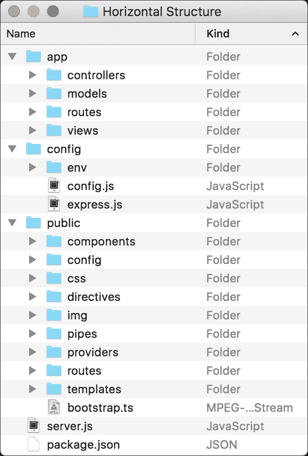
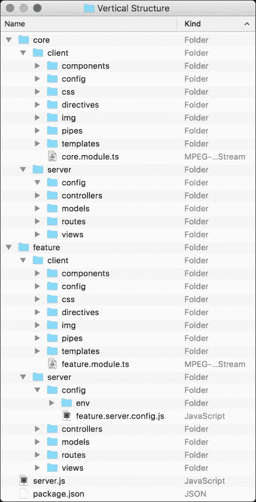
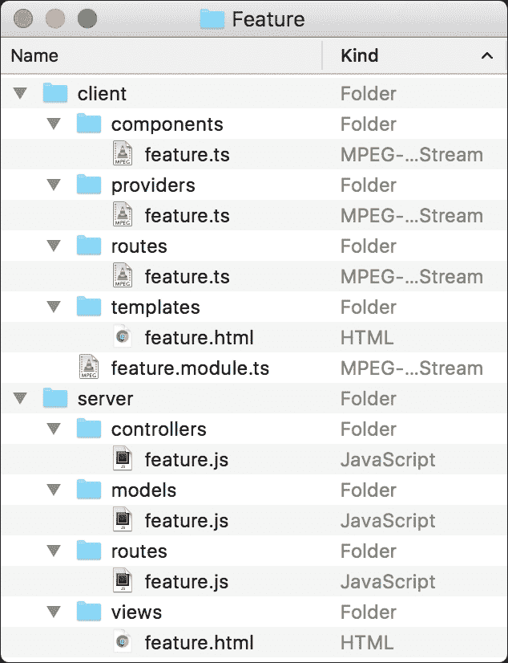
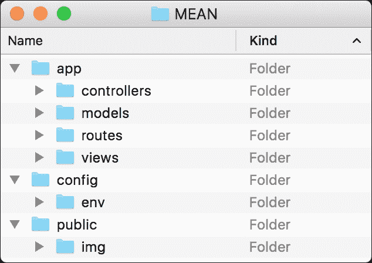
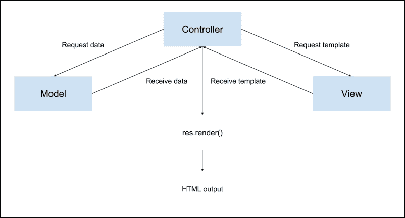

# 第三章：构建一个 Express Web 应用程序

本章将介绍构建你的第一个 Express 应用程序的正确方法。你将首先安装和配置 Express 模块，然后学习 Express 的主要 API。我们将讨论 Express 请求、响应和应用程序对象，并学习如何使用它们。然后我们将介绍 Express 路由机制，并学习如何正确使用它。我们还将讨论应用程序文件夹的结构以及如何利用不同的结构来处理不同的项目类型。在本章结束时，你将学会如何构建一个完整的 Express 应用程序。在本章中，我们将涵盖以下主题：

+   安装 Express 并创建一个新的 Express 应用程序

+   组织你的项目结构

+   配置你的 Express 应用程序

+   使用 Express 路由机制

+   渲染 EJS 视图

+   提供静态文件

+   配置 Express 会话

# 介绍 Express

说 TJ Holowaychuk 是一个富有成效的开发者几乎是一个巨大的低估。TJ 在 Node.js 社区的参与几乎是任何其他开发者无法比拟的，他负责一些 JavaScript 生态系统中最受欢迎的框架，拥有 500 多个开源项目。

他最伟大的项目之一是 Express web 框架。Express 框架是一组常见的 Web 应用程序功能的最小集合，以保持 Node.js 风格。它建立在 Connect 之上，并利用其中间件架构。其功能扩展 Connect，允许各种常见的 Web 应用程序用例，例如包含模块化 HTML 模板引擎，扩展响应对象以支持各种数据格式输出，路由系统等等。

到目前为止，我们已经使用了一个`server.js`文件来创建我们的应用程序。然而，使用 Express 时，你将学习更多关于更好的项目结构，正确配置你的应用程序，并将应用程序逻辑分解为不同的模块。你还将学习如何使用 EJS 模板引擎，管理会话，并添加路由方案。在本节结束时，你将拥有一个可用的应用程序框架，你将在本书的其余部分中使用它。让我们开始创建你的第一个 Express 应用程序的旅程。

# 安装 Express

到目前为止，我们使用 npm 直接为我们的 Node 应用程序安装外部模块。当然，你可以使用这种方法，并通过输入以下命令来安装 Express：

```js
$ npm install express

```

然而，直接安装模块并不是真正可扩展的。想一想：你将在应用程序中使用许多 Node 模块，在工作环境之间传输它，并且可能与其他开发人员共享它。因此，以这种方式安装项目模块很快就会变成一项可怕的任务。相反，你应该开始使用`package.json`文件，它可以组织项目元数据并帮助你管理应用程序的依赖关系。首先，创建一个新的工作文件夹，并在其中创建一个新的`package.json`文件，其中包含以下代码片段：

```js
{
  "name" : "MEAN",
  "version" : "0.0.3",
  "dependencies" : {
    "express" : "4.14.0"
  }
}
```

在`package.json`文件中，注意到你包含了三个属性：应用程序的名称和版本，以及依赖属性，它定义了在应用程序运行之前应安装哪些模块。要安装应用程序的依赖项，请使用命令行工具并导航到应用程序文件夹，然后发出以下命令：

```js
$ npm install

```

npm 然后会安装 Express 模块，因为目前它是在你的`package.json`文件中定义的唯一依赖项。

# 创建你的第一个 Express 应用程序

创建你的第一个 Express 应用程序

```js
const express = require('express');
const app = express();

app.use('/', (req, res) => {
  res.status(200).send('Hello World');
});

app.listen(3000);
console.log('Server running at http://localhost:3000/');

module.exports = app;
```

你应该已经认识到大部分代码了。前两行需要 Express 模块并创建一个新的 Express 应用程序对象。然后，我们使用`app.use()`方法来挂载一个具有特定路径的中间件函数，以及`app.listen()`方法来告诉 Express 应用程序监听端口`3000`。注意`module.exports`对象是如何用于返回`app`对象的。这将帮助你加载和测试你的 Express 应用程序。

这段新代码对你来说也应该很熟悉，因为它类似于你在之前的 Connect 示例中使用的代码。这是因为 Express 以多种方式包装了 Connect 模块。`app.use()`方法用于挂载一个中间件函数，该函数将响应任何发送到根路径的 HTTP 请求。在中间件函数内部，`res.status()`方法用于设置 HTTP 响应代码，`res.send()`方法用于发送响应。`res.send()`方法基本上是一个 Express 包装器，根据响应对象类型设置 Content-Type 标头，然后使用 Connect 的`res.end()`方法发送响应。

### 注意

当将缓冲区传递给`res.send()`方法时，Content-Type 标头将设置为`application/octet-stream`；当传递字符串时，它将设置为`text/html`；当传递对象或数组时，它将设置为`application/json`。

要运行你的应用程序，只需在命令行工具中执行以下命令：

```js
$ node server

```

恭喜！你刚刚创建了你的第一个 Express 应用程序。你可以通过访问`http://localhost:3000`在浏览器中测试它。

# 应用程序、请求和响应对象

Express 提供了三个主要对象，你会经常使用它们。应用对象是你在第一个例子中创建的 Express 应用程序的实例，通常用于配置你的应用程序。请求对象是 Node 的 HTTP 请求对象的包装器，用于提取关于当前处理的 HTTP 请求的信息。响应对象是 Node 的 HTTP 响应对象的包装器，用于设置响应数据和标头。

## 应用对象

应用对象包含以下方法，帮助你配置你的应用程序：

+   `app.set(name, value)`: 这是一个用于设置 Express 将在其配置中使用的环境变量的方法。

+   `app.get(name)`: 这是一个用于获取 Express 在其配置中使用的环境变量的方法。

+   `app.engine(ext, callback)`: 这是一个用于定义给定模板引擎以渲染特定文件类型的方法；例如，你可以告诉 EJS 模板引擎使用 HTML 文件作为模板，就像这样：`app.engine('html', require('ejs').renderFile)`。

+   `app.locals`: 这是一个用于向所有渲染的模板发送应用级变量的属性。

+   `app.use([path], callback)`: 这是一个用于创建 Express 中间件来处理发送到服务器的 HTTP 请求的方法。可选地，你可以挂载中间件来响应特定路径。

+   `app.VERB(path, [callback...], callback)`: 这用于定义一个或多个中间件函数来响应与声明的 HTTP 动词一起使用的特定路径的 HTTP 请求。例如，当你想要响应使用 GET 动词的请求时，你可以使用`app.get()`方法来分配中间件。对于 POST 请求，你将使用`app.post()`，依此类推。

+   `app.route(path).VERB([callback...], callback)`: 这是一个用于定义一个或多个中间件函数来响应与多个 HTTP 动词一起使用的特定统一路径的 HTTP 请求的方法。例如，当你想要响应使用 GET 和 POST 动词的请求时，你可以使用`app.route(path).get(callback).post(callback)`来分配适当的中间件函数。

+   `app.param([name], callback)`: 这是一种方法，用于将特定功能附加到包含特定路由参数的路径上发出的任何请求。例如，您可以使用`app.param('userId', callback)`将逻辑映射到包含`userId`参数的任何请求。

您可以使用许多其他应用程序方法和属性，但使用这些常见的基本方法使开发人员能够以他们认为合理的方式扩展 Express。

## 请求对象

请求对象还提供了一些有助于包含有关当前 HTTP 请求的信息的方法。请求对象的关键属性和方法如下：

+   `req.query`: 这是一个包含解析后的查询字符串参数的属性。

+   `req.params`: 这是一个包含解析后的路由参数的属性。

+   `req.body`: 这是用于检索解析后的请求体的属性。它包含在`bodyParser()`中间件中。

+   `req.path` / `req.hostname` / `req.ip`: 这些用于检索当前请求的路径、主机名和远程 IP。

+   `req.cookies`: 这是与`cookieParser()`中间件一起使用的属性，用于检索用户代理发送的 cookie。

请求对象包含许多我们将在本书后面讨论的方法和属性，但这些方法通常是您在常见的 Web 应用程序中使用的。

## 响应对象

响应对象在开发 Express 应用程序时经常使用，因为发送到服务器的任何请求都将使用响应对象方法进行处理和响应。它有几个关键方法，如下所示：

+   `res.status(code)`: 这是用于设置响应 HTTP 状态代码的方法。

+   `res.set(field, [value])`: 这是用于设置响应 HTTP 标头的方法。

+   `res.cookie(name, value, [options])`: 这是用于设置响应 cookie 的方法。选项参数用于传递定义常见 cookie 配置的对象，例如`maxAge`属性。

+   `res.redirect([status], url)`: 这是用于将请求重定向到给定 URL 的方法。请注意，您可以向响应添加 HTTP 状态代码。当不传递状态代码时，它将默认为`302 Found`。

+   `res.status([status]).send( [body])`: 这是用于非流式响应的方法。它会做很多后台工作，例如设置 Content-Type 和 Content-Length 标头，并使用适当的缓存标头进行响应。

+   `res.status([status]).json( [body])`: 当发送对象或数组时，这与`res.send()`方法相同。大多数情况下，它被用作语法糖，但有时您可能需要使用它来强制将 JSON 响应发送到非对象，例如`null`或`undefined`。

+   `res.render(view, [locals], callback)`: 这是用于呈现视图并发送 HTML 响应的方法。

响应对象还包含许多其他方法和属性，用于处理不同的响应场景，您将在本书后面学习到。

# 外部中间件

Express 核心是最小的，但是背后的团队提供了各种预定义的中间件来处理常见的 Web 开发功能。这些类型的中间件在大小和功能上都有所不同，并扩展了 Express 以提供更好的框架支持。流行的 Express 中间件如下：

+   `morgan`: 这是一个 HTTP 请求记录器中间件。

+   `body-parser`: 这是一个用于解析请求体的中间件，它支持各种请求类型。

+   `method-override`: 这是一个提供 HTTP 动词支持的中间件，例如在客户端不支持的地方使用 PUT 或 DELETE。

+   `compression`: 这是一个压缩中间件，用于使用 GZIP/deflate 压缩响应数据。

+   `express.static`: 这是用于提供静态文件的中间件。

+   `cookie-parser`: 这是一个用于解析 cookie 的中间件，它填充了`req.cookies`对象。

+   `Session`: 这是用于支持持久会话的会话中间件。

有许多种类型的 Express 中间件，可以帮助您缩短开发时间，同时还有更多的第三方中间件。

### 注意

要了解更多关于 Connect 和 Express 中间件的信息，请访问 Connect 模块的官方存储库页面[`github.com/senchalabs/connect#middleware`](https://github.com/senchalabs/connect#middleware)。如果您想浏览第三方中间件集合，请访问 Connect 的 wiki 页面[`github.com/senchalabs/connect/wiki`](https://github.com/senchalabs/connect/wiki)。

# 实现 MVC 模式

Express 框架是模式不可知的，这意味着它不支持任何预定义的语法或结构，就像其他一些 Web 框架所做的那样。将 MVC 模式应用于您的 Express 应用程序意味着您可以创建特定的文件夹，将您的 JavaScript 文件按照一定的逻辑顺序放置在其中。所有这些文件基本上都是作为逻辑单元的 CommonJS 模块。例如，模型将是包含在`models`文件夹中的 Mongoose 模型定义的 CommonJS 模块，视图将是放置在`views`文件夹中的 HTML 或其他模板文件，控制器将是放置在`controllers`文件夹中的具有功能方法的 CommonJS 模块。为了更好地说明这一点，现在是讨论不同类型的应用程序结构的时候了。

## 应用程序文件夹结构

我们之前讨论了在开发真实应用时的最佳实践，我们推荐使用`package.json`文件而不是直接安装模块。然而，这只是一个开始；一旦您继续开发应用程序，您很快会想知道如何安排项目文件并将它们分解为逻辑代码单元。总的来说，JavaScript 和因此 Express 框架对于应用程序的结构是不可知的，因为你可以很容易地将整个应用程序放在一个 JavaScript 文件中。这是因为没有人预期 JavaScript 会成为一个全栈编程语言，但这并不意味着你不应该特别注意组织你的项目。由于 MEAN 堆栈可以用于构建各种大小和复杂度的应用程序，因此也可以以各种方式处理项目结构。决定往往直接与您的应用程序的预估复杂性有关。例如，简单的项目可能需要更简洁的文件夹结构，这样有利于更清晰和更容易管理，而复杂的项目通常需要更复杂的结构和更好的逻辑分解，因为它将包括许多功能和更大的团队在项目上工作。为了简化这个讨论，将其合理地分为两种主要方法：较小项目的水平结构和功能丰富应用程序的垂直结构。让我们从一个简单的水平结构开始。

### 水平文件夹结构

水平项目结构是基于按功能角色划分文件夹和文件，而不是按照它们实现的功能来划分，这意味着所有应用程序文件都放在一个主应用程序文件夹中，其中包含一个 MVC 文件夹结构。这也意味着有一个单独的`controllers`文件夹，其中包含所有应用程序控制器，一个单独的`models`文件夹，其中包含所有应用程序模型，依此类推。水平应用程序结构的一个示例如下：



让我们来回顾一下文件夹结构：

+   `app`文件夹是您保存 Express 应用程序逻辑的地方，它分为以下文件夹，代表了功能的分离，以符合 MVC 模式：

+   `controllers`文件夹是您保存 Express 应用程序控制器的地方

+   `models`文件夹是您保存 Express 应用程序模型的地方

+   `routes`文件夹是您保存 Express 应用程序路由中间件的地方

+   `views`文件夹是您保存 Express 应用程序视图的地方

+   `config`文件夹是您保存 Express 应用程序配置文件的地方。随着时间的推移，您将向应用程序添加更多模块，每个模块将在专用的 JavaScript 文件中进行配置，该文件放在此文件夹中。目前，它包含几个文件和文件夹，如下所示：

+   `env`文件夹是您保存 Express 应用程序环境配置文件的地方

+   `config.js`文件是您配置 Express 应用程序的地方

+   `express.js`文件是您初始化 Express 应用程序的地方

+   `public`文件夹是您保存静态客户端文件的地方，它分为以下文件夹，代表了功能的分离，以符合 MVC 模式：

+   `config`文件夹是您保存 Angular 应用程序配置文件的地方

+   `components`文件夹是您保存 Angular 应用程序组件的地方

+   `css`文件夹是您保存 CSS 文件的地方

+   `directives`文件夹是您保存 Angular 应用程序指令的地方

+   `pipes`文件夹是您保存 Angular 应用程序管道的地方

+   `img`文件夹是您保存图像文件的地方

+   `templates`文件夹是您保存 Angular 应用程序模板的地方

+   `bootstrap.ts`文件是您初始化 Angular 应用程序的地方

+   `package.json`文件是帮助您组织应用程序依赖关系的元数据文件。

+   `server.js`文件是您的 Node.js 应用程序的主文件，它将加载`express.js`文件作为模块，以启动您的 Express 应用程序。

如您所见，水平文件夹结构对于功能有限的小型项目非常有用，因此文件可以方便地放在代表其一般角色的文件夹中。然而，为了处理大型项目，在那里您将有许多处理特定功能的文件，这可能太简单了。在这种情况下，每个文件夹可能会被过多的文件所超载，您可能会在混乱中迷失。更好的方法是使用垂直文件夹结构。

### 垂直文件夹结构

垂直项目结构基于按功能实现的文件夹和文件的划分，这意味着每个功能都有自己独立的文件夹，其中包含一个 MVC 文件夹结构。垂直应用程序结构的示例如下：



如您所见，每个功能都有自己类似应用程序的文件夹结构。在这个例子中，我们有包含主应用程序文件的`core feature`文件夹和包含功能文件的`feature`文件夹。一个示例功能将是包含身份验证和授权逻辑的用户管理功能。为了更好地理解这一点，让我们来看一个单个功能的文件夹结构：

+   `server`文件夹是您保存功能的服务器逻辑的地方，它分为以下文件夹，代表了功能的分离，以符合 MVC 模式：

+   `controllers`文件夹是您保存功能的 Express 控制器的地方

+   `models`文件夹是您保存功能的 Express 模型的地方

+   `routes`文件夹是您保存功能的 Express 路由中间件的地方

+   `views`文件夹是您保存功能的 Express 视图的地方

+   `config`文件夹是您保存功能服务器配置文件的地方

+   `env`文件夹是您保存功能环境服务器配置文件的地方

+   `feature.server.config.js`文件是您配置功能的地方

+   `client`文件夹是您保存功能的客户端文件的地方，它分为以下文件夹，代表了功能的分离，以符合 MVC 模式：

+   `config`文件夹是您保存特性的 Angular 配置文件的地方

+   `components`文件夹是您保存特性的 Angular `components`的地方

+   `css`文件夹是您保存特性的 CSS 文件的地方

+   `directives`文件夹是您保存特性的 Angular 指令的地方

+   `pipes`文件夹是您保存特性的 Angular 管道的地方

+   `img`文件夹是您保存特性的图像文件的地方

+   `templates`文件夹是您保存特性的 Angular 模板的地方

+   `feature.module.ts`文件是您初始化特性的 Angular 模块的地方

正如您所看到的，垂直文件夹结构对于特性数量无限且每个特性包含大量文件的大型项目非常有用。它将允许大型团队共同工作并分别维护每个特性，并且在不同应用程序之间共享特性时也很有用。

虽然这两种类型的应用程序结构是不同的，但事实上 MEAN 堆栈可以以许多不同的方式组装。甚至一个团队可能会以结合这两种方法的方式来构建他们的项目；因此，基本上由项目负责人决定使用哪种结构。在本书中，出于简单起见，我们将使用水平方法，但我们将以垂直方式整合我们应用程序的 Angular 部分，以展示 MEAN 堆栈结构的灵活性。请记住，本书中提出的所有内容都可以轻松重构以适应您项目的规格。

### 文件命名约定

在开发应用程序时，您很快会注意到您最终会得到许多具有相同名称的文件。原因是 MEAN 应用程序通常对 Express 和 Angular 组件都有并行的 MVC 结构。要理解这个问题，看一下常见的垂直特性文件夹结构：



正如您所看到的，强制文件夹结构有助于理解每个文件的功能，但也会导致多个文件具有相同的名称。这是因为一个应用程序的特性通常是使用多个 JavaScript 文件来实现的，每个文件都有不同的角色。这个问题可能会给开发团队带来一些困惑，因此为了解决这个问题，您需要使用某种命名约定。

最简单的解决方案是将每个文件的功能角色添加到文件名中。因此，特性控制器文件将被命名为`feature.controller.js`，特性模型文件将被命名为`feature.model.js`，依此类推。然而，当考虑到 MEAN 应用程序同时使用 JavaScript MVC 文件来处理 Express 和 Angular 应用程序时，情况变得更加复杂。这意味着您经常会有两个具有相同名称的文件。为了解决这个问题，还建议您扩展文件名以包含它们的执行目的地。这一开始可能看起来有些多余，但您很快会发现，快速识别应用程序文件的角色和执行目的地是非常有帮助的。

### 注意

重要的是要记住这是一种最佳实践约定。您可以轻松地用自己的关键字替换`controller`、`model`、`client`和`server`。

### 实施水平文件夹结构

要开始构建您的第一个 MEAN 项目的结构，请在其中创建一个新的项目文件夹，并在其中创建以下文件夹：



创建了所有前述文件夹后，返回到应用程序的根文件夹并创建一个包含以下代码片段的`package.json`文件：

```js
{
  "name" : "MEAN",
  "version" : "0.0.3",
  "dependencies" : {
    "express" : "4.14.0"
  }
}
```

现在，在`app/controllers`文件夹中，创建一个名为`index.server.controller.js`的文件，其中包含以下代码：

```js
exports.render = function(req, res) {
  res.status(200).send('Hello World');
};
```

恭喜！你刚刚创建了你的第一个 Express 控制器。这段代码可能看起来很熟悉；那是因为它是你在之前示例中创建的中间件的副本。你在这里所做的是使用 CommonJS 模块模式来定义一个名为`render()`的函数。稍后，你将能够获取这个模块并使用这个函数。一旦你创建了一个控制器，你就需要使用 Express 路由功能来利用这个控制器。

#### 处理请求路由

Express 支持使用`app.route(path).VERB(callback)`方法或`app.VERB(path, callback)`方法来路由请求，其中`VERB`应该替换为小写的 HTTP 动词。看一下以下例子：

```js
app.get('/', (req, res) => {
  res.status(200).send('This is a GET request');
});
```

这告诉 Express 执行中间件函数来处理任何使用`GET`动词并指向根路径的 HTTP 请求。如果你想处理`POST`请求，你的代码应该如下所示：

```js
app.post('/', (req, res) => {
  res.status(200).send('This is a POST request');
});
```

然而，Express 还允许你定义单个路由，然后链接多个中间件来处理不同的 HTTP 请求。这意味着前面的代码示例也可以写成如下形式：

```js
app.route('/').get((req, res) => {
  res.status(200).send('This is a GET request');
}).post((req, res) => {
  res.status(200).send('This is a POST request');
});
```

Express 的另一个很酷的功能是能够在单个路由定义中链接多个中间件。这意味着中间件函数将按顺序调用，将它们传递给下一个中间件，以便你可以确定如何继续执行中间件。这通常用于在执行响应逻辑之前验证请求。要更好地理解这一点，看一下以下代码：

```js
const express = require('express');

function hasName(req, res, next) {
 if (req.param('name')) {
 next();
 } else {
 res.status(200).send('What is your name?');
 }
};

function sayHello(req, res, next) {
 res.status(200).send('Hello ' + req.param('name'));
}

const app = express();
app.get('/', hasName, sayHello);

app.listen(3000);
console.log('Server running at http://localhost:3000/');
```

在上面的代码中，有两个名为`hasName()`和`sayHello()`的中间件函数。`hasName()`中间件正在寻找`name`参数；如果找到了定义的`name`参数，它将使用 next 参数调用下一个中间件函数。否则，`hasName()`中间件将自己处理响应。在这种情况下，下一个中间件函数将是`sayHello()`中间件函数。这是可能的，因为我们使用`app.get()`方法将中间件函数按顺序添加。还值得注意的是中间件函数的顺序，因为它决定了哪个中间件函数首先执行。

这个例子很好地演示了路由中间件如何在确定响应时执行不同的验证。当然，你可以利用这个功能来执行其他任务，比如验证用户身份验证和资源授权。不过，现在让我们继续我们的例子。

#### 添加路由文件

你接下来要创建的文件是你的第一个路由文件。在`app/routes`文件夹中，创建一个名为`index.server.routes.js`的文件，其中包含以下代码片段：

```js
module.exports = function(app) {
    const index = require('../controllers/index.server.controller');
 app.get('/', index.render);
};
```

在这里，你做了一些事情。首先，你再次使用了 CommonJS 模块模式。你可能还记得，CommonJS 模块模式支持导出多个函数，比如你在控制器中所做的，以及使用单个模块函数，就像你在这里所做的那样。接下来，你需要引入你的`index`控制器，并将其`render()`方法用作中间件来处理根路径的 GET 请求。

### 注意

路由模块函数接受一个名为`app`的参数，所以当你调用这个函数时，你需要传递 Express 应用程序的实例。

你所剩下的就是创建 Express 应用程序对象，并使用你刚刚创建的控制器和路由模块进行引导。为此，转到`config`文件夹，并创建一个名为`express.js`的文件，其中包含以下代码片段：

```js
const express = require('express');

module.exports = function() {
  const app = express();
 require('../app/routes/index.server.routes.js')(app);
  return app;
};
```

在上述代码片段中，您需要引入 Express 模块，然后使用 CommonJS 模块模式来定义一个`module`函数，该函数初始化 Express 应用程序。首先，它创建一个新的 Express 应用程序实例，然后需要您的路由文件并将其作为函数调用，将应用程序实例作为参数传递给它。路由文件将使用应用程序实例来创建新的路由配置，然后调用控制器的`render()`方法。`module`函数通过返回应用程序实例来结束。

### 注意

`express.js`文件是我们配置 Express 应用程序的地方。这是我们添加与 Express 配置相关的所有内容的地方。

要完成您的应用程序，您需要在根文件夹中创建一个名为`server.js`的文件，并复制以下代码：

```js
const configureExpress = require('./config/express');

const app = configureExpress();
app.listen(3000);
module.exports = app;

console.log('Server running at http://localhost:3000/');
```

就是这样！在主应用程序文件中，通过需要 Express 配置模块并使用它来检索您的应用程序对象实例，并侦听端口`3000`，您连接了所有松散的端点。

要启动您的应用程序，请使用`npm`在命令行工具中导航到您的应用程序的根文件夹，并安装您的应用程序依赖项，如下所示：

```js
$ npm install

```

安装过程结束后，您只需使用 Node 的命令行工具启动应用程序：

```js
$ node server 

```

您的 Express 应用程序现在应该可以运行了！要测试它，请导航到`http://localhost:3000`。

在这个例子中，您学会了如何正确构建您的 Express 应用程序。重要的是，您注意到了使用 CommonJS 模块模式创建文件并在整个应用程序中引用它们的不同方式。这种模式在本书中经常重复出现。

# 配置 Express 应用程序

Express 具有一个非常简单的配置系统，可以让您为 Express 应用程序添加某些功能。虽然有预定义的配置选项可以更改以操纵其工作方式，但您也可以为任何其他用途添加自己的键/值配置选项。Express 的另一个强大功能是根据其运行的环境配置应用程序。例如，您可能希望在开发环境中使用 Express 记录器，而在生产环境中不使用，同时在生产环境中压缩响应主体可能看起来是一个不错的主意。

为了实现这一点，您需要使用`process.env`属性。`process.env`是一个全局变量，允许您访问预定义的环境变量，最常见的是`NODE_ENV`环境变量。`NODE_ENV`环境变量通常用于特定环境的配置。为了更好地理解这一点，让我们回到之前的例子并添加一些外部中间件。要使用这些中间件，您首先需要将它们下载并安装为项目的依赖项。

要做到这一点，请编辑您的`package.json`文件，使其看起来像以下代码片段：

```js
{
  "name": "MEAN",
  "version": "0.0.3",
  "dependencies": {
 "body-parser": "1.15.2",
 "compression": "1.6.0",
    "express": "4.14.0",
 "method-override": "2.3.6",
 "morgan": "1.7.0"
  }
}
```

正如我们之前所述，`morgan`模块提供了一个简单的日志记录中间件，`compression`模块提供了响应压缩，`body-parser`模块提供了几个中间件来处理请求数据，`method-override`模块提供了`DELETE`和`PUT` HTTP 动词的旧版本支持。要使用这些模块，您需要修改您的`config/express.js`文件，使其看起来像以下代码片段：

```js
const express = require('express');
const morgan = require('morgan');
const compress = require('compression');
const bodyParser = require('body-parser');
const methodOverride = require('method-override');

module.exports = function() {
  const app = express();

 if (process.env.NODE_ENV === 'development') {
 app.use(morgan('dev'));
 } else if (process.env.NODE_ENV === 'production') {
 app.use(compress());
 }

 app.use(bodyParser.urlencoded({
 extended: true
 }));
 app.use(bodyParser.json());
 app.use(methodOverride());

  require('../app/routes/index.server.routes.js')(app);

  return app;
};
```

正如您所看到的，我们只是使用`process.env.NODE_ENV`变量来确定我们的环境，并相应地配置 Express 应用程序。我们只是使用`app.use()`方法在开发环境中加载`morgan()`中间件，在生产环境中加载`compress()`中间件。`bodyParser.urlencoded()`、`bodyParser.json()`和`methodOverride()`中间件将始终加载，无论环境如何。

要完成您的配置，您需要将您的`server.js`文件更改为以下代码片段：

```js
process.env.NODE_ENV = process.env.NODE_ENV || 'development';

const configureExpress = require('./config/express');

const app = configureExpress();
app.listen(3000);
module.exports = app;

console.log('Server running at http://localhost:3000/');
```

请注意，如果不存在，`process.env.NODE_ENV`变量将设置为默认的`development`值。这是因为通常`NODE_ENV`环境变量没有正确设置。

### 提示

建议在运行应用程序之前在操作系统中设置 NODE_ENV 环境变量。

在 Windows 环境中，您可以通过在命令提示符中执行以下命令来执行此操作：

```js
> set NODE_ENV=development
```

而在基于 Unix 的环境中，您应该简单地使用以下导出命令：

```js
$ export NODE_ENV=development
```

要测试您的更改，请使用`npm`导航到应用程序的根文件夹，并安装应用程序依赖项，如下所示：

```js
$ npm install

```

安装过程结束后，您只需使用 Node 的命令行工具启动应用程序：

```js
$ node server

```

您的 Express 应用程序现在应该运行！要测试它，请导航到`http://localhost:3000`，您将能够在命令行输出中看到记录器的操作。但是，当处理更复杂的配置选项时，`process.env.NODE_ENV`环境变量可以以更复杂的方式使用。

## 环境配置文件

在应用程序开发过程中，您经常需要配置第三方模块以在各种环境中以不同方式运行。例如，当连接到 MongoDB 服务器时，您可能会在开发和生产环境中使用不同的连接字符串。在当前设置中这样做可能会导致您的代码充斥着无尽的`if`语句，这通常会更难以维护。为了解决这个问题，您可以管理一组环境配置文件来保存这些属性。然后，您将能够使用`process.env.NODE_ENV`环境变量来确定要加载哪个配置文件，从而使您的代码更短，更易于维护。让我们首先为我们的默认开发环境创建一个配置文件。为此，请在`config/env`文件夹内创建一个新文件，并将其命名为`development.js`。在新文件中，粘贴以下代码：

```js
module.exports = {
  // Development configuration options
};
```

如您所见，您的配置文件目前只是一个空的 CommonJS 模块初始化。不用担心；我们很快将添加第一个配置选项，但首先，我们需要管理配置文件的加载。为此，请转到应用程序的`config`文件夹，并创建一个名为`config.js`的新文件。在新文件中，粘贴以下代码：

```js
module.exports = require('./env/' + process.env.NODE_ENV + '.js');
```

如您所见，此文件只是根据`process.env.NODE_ENV`环境变量加载正确的配置文件。在接下来的章节中，我们将使用此文件，它将为我们加载正确的环境配置文件。要管理其他环境配置，您只需要添加一个专门的环境配置文件，并正确设置`NODE_ENV`环境变量。

# 渲染视图

Web 框架的一个非常常见的特性是渲染视图的能力。基本概念是将数据传递给模板引擎，该引擎将渲染最终的视图，通常是 HTML。在 MVC 模式中，控制器使用模型来检索数据部分，并使用视图模板来渲染 HTML 输出，如下图所示。Express 可扩展的方法允许使用许多 Node.js 模板引擎来实现此功能。在本节中，我们将使用 EJS 模板引擎，但您可以随后将其替换为其他模板引擎。以下图表显示了渲染应用视图的 MVC 模式：



Express 有两种方法来渲染视图：`app.render()`用于渲染视图然后将 HTML 传递给回调函数，更常见的是`res.render()`，它在本地渲染视图并将 HTML 作为响应发送。你将更频繁地使用`res.render()`，因为通常你希望将 HTML 输出为响应。不过，例如，如果你希望你的应用程序发送 HTML 电子邮件，你可能会使用`app.render()`。在我们开始探索`res.render()`方法之前，让我们先配置我们的视图系统。

## 配置视图系统

为了配置 Express 视图系统，你需要使用 EJS 模板引擎。让我们回到我们的示例并安装 EJS 模块。你应该首先更改你的`package.json`文件，使其看起来像以下代码片段：

```js
{
  "name": "MEAN",
  "version": "0.0.3",
  "dependencies": {
    "body-parser": "1.15.2",
    "compression": "1.6.0",
 "ejs": "2.5.2",
    "express": "4.14.0",
    "method-override": "2.3.6",
    "morgan": "1.7.0"  }
}
```

现在，通过在命令行中导航到项目的根文件夹并发出以下命令来安装 EJS 模块：

```js
$ npm update

```

在 npm 完成安装 EJS 模块后，你将能够配置 Express 将其用作默认模板引擎。要配置你的 Express 应用程序，回到`config/express.js`文件，并将其更改为以下代码行：

```js
const express = require('express');
const morgan = require('morgan');
const compress = require('compression');
const bodyParser = require('body-parser');
const methodOverride = require('method-override');

module.exports = function() {
  const app = express();
  if (process.env.NODE_ENV === 'development') {
    app.use(morgan('dev'));
  } else if (process.env.NODE_ENV === 'production') {
    app.use(compress());
  }

  app.use(bodyParser.urlencoded({
    extended: true
  }));
  app.use(bodyParser.json());
  app.use(methodOverride());

  app.set('views', './app/views');
  app.set('view engine', 'ejs');

  require('../app/routes/index.server.routes.js')(app);

  return app;
};
```

注意我们如何使用`app.set()`方法来配置 Express 应用程序的`view`文件夹和模板引擎。让我们创建你的第一个视图。

## 渲染 EJS 视图

EJS 视图基本上由 HTML 代码和`EJS`标签混合而成。EJS 模板将驻留在`app/views`文件夹中，并具有`.ejs`扩展名。当你使用`res.render()`方法时，EJS 引擎将在`views`文件夹中查找模板，如果找到符合的模板，它将渲染 HTML 输出。要创建你的第一个 EJS 视图，转到你的`app/views`文件夹，并创建一个名为`index.ejs`的新文件，其中包含以下 HTML 代码片段：

```js
<!DOCTYPE html>
<html>
  <head>
    <title><%= title %></title>
  </head>
  <body>
    <h1><%= title %></h1>
  </body>
</html>
```

这段代码对你来说应该大部分都很熟悉，除了`<%= %>`标签。这些标签是告诉 EJS 模板引擎在哪里渲染模板变量的方式——在这种情况下是`title`变量。你所要做的就是配置你的控制器来渲染这个模板，并自动将其输出为 HTML 响应。要做到这一点，回到你的`app/controllers/index.server.controller.js`文件，并将其更改为以下代码片段的样子：

```js
exports.render = function(req, res) {
  res.render('index', {
    title: 'Hello World'
  });
};
```

注意`res.render()`方法的使用方式。第一个参数是你的 EJS 模板的名称，不包括`.ejs`扩展名，第二个参数是一个包含你的模板变量的对象。`res.render()`方法将使用 EJS 模板引擎在我们在`config/express.js`文件中设置的`views`文件夹中查找文件，然后使用模板变量渲染视图。要测试你的更改，使用你的命令行工具并发出以下命令：

```js
$ node server

```

干得好，你刚刚创建了你的第一个 EJS 视图！通过访问`http://localhost:3000`来测试你的应用程序，在那里你将能够查看渲染的 HTML。

EJS 视图易于维护，并提供了一种简单的方式来创建你的应用程序视图。我们将在本书的后面详细介绍 EJS 模板，不过不会像你期望的那样多，因为在 MEAN 应用程序中，大部分的 HTML 渲染是在客户端使用 Angular 完成的。

# 提供静态文件

在任何 Web 应用程序中，总是需要提供静态文件。幸运的是，Express 的唯一内置中间件是`express.static()`中间件，它提供了这个功能。要将静态文件支持添加到前面的示例中，只需在你的`config/express.js`文件中进行以下更改：

```js
const express = require('express');
const morgan = require('morgan');
const compress = require('compression');
const bodyParser = require('body-parser');
const methodOverride = require('method-override');

module.exports = function() {
  const app = express();
  if (process.env.NODE_ENV === 'development') {
    app.use(morgan('dev'));
  } else if (process.env.NODE_ENV === 'production') {
    app.use(compress());
  }

  app.use(bodyParser.urlencoded({
    extended: true
  }));
  app.use(bodyParser.json());
  app.use(methodOverride());

  app.set('views', './app/views');
  app.set('view engine', 'ejs'); 

  require('../app/routes/index.server.routes.js')(app); 

  app.use(express.static('./public'));

  return app;
};
```

`express.static()`中间件接受一个参数来确定`static`文件夹的位置。注意`express.static()`中间件放置在路由文件调用下面。这个顺序很重要，因为如果它在上面，Express 首先会尝试在`static files`文件夹中查找 HTTP 请求路径。这会使响应变得更慢，因为它必须等待文件系统的 I/O 操作。

为了测试你的静态中间件，将一个名为`logo.png`的图片添加到`public/img`文件夹中，然后在你的`app/views/index.ejs`文件中做以下更改：

```js
<!DOCTYPE html>
<html>
  <head>
    <title><%= title %></title>
  </head>
  <body>
    
    <h1><%= title %></h1>
  </body>
</html>
```

现在，使用 Node 的命令行工具运行你的应用程序：

```js
$ node server

```

为了测试结果，访问`http://localhost:3000`，观察 Express 如何将你的图片作为静态文件提供。

# 配置会话

会话是一种常见的 Web 应用程序模式，允许你跟踪用户访问应用程序时的行为。要添加这个功能，你需要安装和配置`express-session`中间件。首先，修改你的`package.json`文件如下：

```js
{
  "name": "MEAN",
  "version": "0.0.3",
  "dependencies": {
    "body-parser": "1.15.2",
    "compression": "1.6.0",
    "ejs": "2.5.2",
    "express": "4.14.0",
 "express-session": "1.14.1",
    "method-override": "2.3.6",
    "morgan": "1.7.0"
  }
}
```

然后，通过在命令行中导航到项目的根文件夹并发出以下命令来安装`express-session`模块：

```js
$ npm update

```

安装过程完成后，你将能够配置你的 Express 应用程序使用`express-session`模块。`express-session`模块将使用一个存储在 cookie 中的签名标识符来识别当前用户。为了签署会话标识符，它将使用一个秘密字符串，这将有助于防止恶意会话篡改。出于安全原因，建议每个环境的 cookie 秘密都不同，这意味着这将是使用我们的环境配置文件的合适地方。为此，将`config/env/development.js`文件更改为以下代码片段的样子：

```js
module.exports = {
  sessionSecret: 'developmentSessionSecret'
};
```

由于这只是一个例子，可以随意更改秘密字符串。对于其他环境，只需在它们的环境配置文件中添加`sessionSecret`属性。要使用配置文件并配置你的 Express 应用程序，返回到你的`config/express.js`文件，并将其更改为以下代码片段的样子：

```js
const config = require('./config');
const express = require('express');
const morgan = require('morgan');
const compress = require('compression');
const bodyParser = require('body-parser');
const methodOverride = require('method-override');
const session = require('express-session');

module.exports = function() {
  const app = express();

  if (process.env.NODE_ENV === 'development') {
    app.use(morgan('dev'));
  } else if (process.env.NODE_ENV === 'production') {
    app.use(compress());
  }

  app.use(bodyParser.urlencoded({
    extended: true
  }));
  app.use(bodyParser.json());
  app.use(methodOverride());

  app.use(session({
    saveUninitialized: true,
    resave: true,
    secret: config.sessionSecret
  }));

  app.set('views', './app/views');
  app.set('view engine', 'ejs');

  app.use(express.static('./public'));

  require('../app/routes/index.server.routes.js')(app); 

  return app;
};
```

注意配置对象是如何传递给`express.session()`中间件的。在这个配置对象中，使用之前修改过的配置文件定义了`secret`属性。会话中间件将会话对象添加到应用程序中的所有请求对象中。使用这个会话对象，你可以设置或获取任何你希望在当前会话中使用的属性。为了测试会话，将`app/controller/index.server.controller.js`文件更改如下：

```js
exports.render = function(req, res) {
  if (req.session.lastVisit) {
    console.log(req.session.lastVisit);
  }

  req.session.lastVisit = new Date();

  res.render('index', {
    title: 'Hello World'
  });
};
```

你在这里做的基本上是记录最后一次用户请求的时间。控制器检查`session`对象中是否设置了`lastVisit`属性，如果设置了，就将最后访问日期输出到控制台。然后将`lastVisit`属性设置为当前时间。为了测试你的更改，使用 Node 的命令行工具运行你的应用程序，如下所示：

```js
$ node server

```

现在，通过在浏览器中访问`http://localhost:3000`并观察命令行输出来测试你的应用程序。

# 总结

在本章中，你创建了你的第一个 Express 应用程序，并学会了如何正确配置它。你将文件和文件夹组织成了一个有组织的结构，并发现了替代的文件夹结构。你还创建了你的第一个 Express 控制器，并学会了如何使用 Express 的路由机制调用它的方法。你渲染了你的第一个 EJS 视图，并学会了如何提供静态文件。你还学会了如何使用`express-session`来跟踪用户的行为。在下一章中，你将学会如何使用 MongoDB 保存你应用程序的持久数据。
